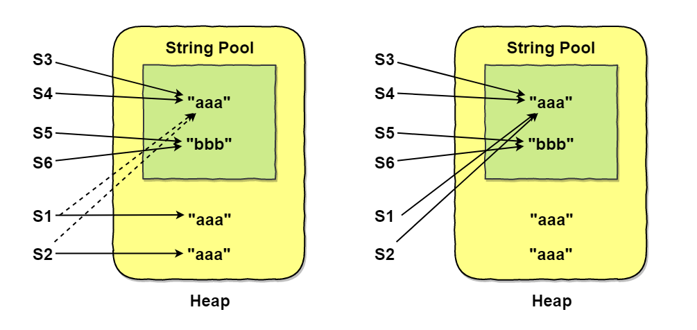

[TOC]

### 常用类

#### Object类

重点啊！经常问这个问题。Object 类是**所有类的父类**。**数组**也继承了 Object 类。然而，**接口**是不继承 Object 类的。

##### 1. Object类API

Object 类的 API（面试题：问**有哪些方法**？）

```java
// 返回当前运行时对象的Class对象
public final native Class<?> getClass();
// 返回对象的哈希码，主要使用在哈希表中，如HashMap
public native int hashCode();
// 比较2个对象的内存地址是否相等
public boolean equals(Object obj);
// 创建并返回当前对象的一份拷贝。Object本身没有实现Cloneable接口，所以不重写clone方法并且进行调用的话会发生CloneNotSupportedException异常
protected native Object clone() throws CloneNotSupportedException
// 返回类的名字@实例的哈希码的16进制的字符串，建议Object所有的子类都重写这个方法
public String toString();
// 不能重写。唤醒一个在此对象监视器上等待的线程(监视器相当于就是锁的概念)。如果有多个线程在等待只会任意唤醒一个
public final native void notify();
// 不能重写。跟notify一样，唯一的区别就是会唤醒在此对象监视器上等待的所有线程
public final native void notifyAll();
// 不能重写。暂停线程的执行。注意：sleep方法没有释放锁，而wait方法释放了锁。timeout是等待时间
public final native void wait(long timeout) throws InterruptedException
// 多了nanos参数，这个参数表示额外时间，指超时的时间还需要加上nanos毫秒
public final void wait(long timeout, int nanos) throws InterruptedException
// 跟之前的2个wait方法一样，只不过该方法一直等待，没有超时时间这个概念
public final void wait() throws InterruptedException
// 实例被垃圾回收器回收的时候触发的操作
protected void finalize() throws Throwable { }
```

**native**: Java 关键字，Native Method 用以修饰**非 Java 代码实现**的方法(C || C++)。被 **final 修饰的方法也不能被覆写**的。被 native 修饰的方式一些是可以覆写的（clone、finalize），一些不能覆写（notify、notifyAll、wait 方法）。由于 Object 是所有类的父类，所以任何类都可以直接覆写上面**允许**覆写的方法进行拓展。

##### 2. equals()

equals() 函数可以用来检查一个对象与调用这个 equals() 的这个对象**是否相等**。

Object 类**默认**的 eqauls() 函数进行比较的依据是：调用它的对象和传入的对象的**引用**是否相等，默认进行的是**引用比较**。如果两个**引用是相同**的则返回 true；否则返回 false。

- 对于**基本类型**，== 判断两个值是否**相等**，基本类型没有 equals() 方法。
- **对于引用类型，== 判断两个变量是否引用==同一个==对象，而 equals() 判断两个对象内容是否==等价==。**

```java
Integer x = new Integer(1);
Integer y = new Integer(1);
System.out.println(x.equals(y));  // true 等价
System.out.println(x == y);       // false 对象相等
Integer m = 1;
Integer n = 1;
// 此处m n的值均从Integer的缓存池中获取，所以引用相同
System.out.println(m == n);  	 
```

###### (1) 等价的特性

覆写 equals() 函数的时候要遵守一些**规则**。

**I 自反性**：对于任意非空的引用值 x，x.equals(x) 返回值为真。

```java
x.equals(x); 	// true
```

**II 对称性**：对于任意非空的引用值 x 和 y，x.equals(y) 必须和 y.equals(x) 返回**相同**的结果。

```java
x.equals(y) == y.equals(x); // true
```

**III 传递性**：对于任意的非空引用值 x, y 和 z, 如果 x.equals(y) 返回真，y.equals(z) 返回真，那么 x.equals(z) 也必须返回真。

```java
if (x.equals(y) && y.equals(z))
    x.equals(z);  // true;
```

**IV 一致性**：对于任意非空的引用值 x 和 y，无论调用 x.equals(y) 多少次，都要返回**相同**的结果。在比较的过程中，对象中的数据不能被修改。

```java
x.equals(y) == x.equals(y); // true
```

**V 与null比较**

对任何不是 null 的对象 x 调用 x.equals(null) 结果都为 false。

```java
x.equals(null); // false;
```

###### (2) 覆写equals方法

写出**完美equals方法**的建议（源自 JavaCore）：

- 检测 this 与 otherObject 是否**引用同一对象**（地址相同）。
- 检测 otherObject **是否为 null**（null 就肯定不是了）。
- 比较 this 与 otherObject 是否属于**同一个类**（类型不同也不是）。
- 将 otherObject **类型转换**为相应的类类型变量。
- 现在开始对**所有需要比较的域依次进行比较**。使用 **==** 比较**基本类型域**，使用 **equals 比较对象域**。这里就需要看对不同类自己的情况写。

```java
// 以下是Employee类的equals方法
public boolean equals(Object otherObject){
     // 检测this与otherObject是否引用同一对象
    if(this == otherObject) return true;   
    // 检测otherObject是否为null
    if(otherObject == null) return false;   
    // 比较this与otherObject是否属于同一种类型
    if(this.getClass() != otherObject.geClass()) return false;
    // 将otherObject转换为相应的类类型变量：类型转换
    Employee other = (Employee) otherObject;    
    // 现在开始对所有需要比较的域进行比较。使用 == 比较基本类型域，使用equals比较对象域。
    return Object.equals(name, other.name) && salary == other.salary && Objects.equals(hireDay, other.hireDay);
}
```


再看看 **String** 类的 equals 方法，简直就是套路，果然牛皮。

```java
public boolean equals(Object anObject) {
    // 如果地址相同直接返回true
    if (this == anObject) {
        return true;
    }
    // 首先判断是否是String的类型（也就是判断class类型）
    if (anObject instanceof String) {
        // 强制类型转换获取这个对象的String
        String aString = (String)anObject;
        if (coder() == aString.coder()) {
            // 下面就是对两个字符串的每一个字符进行对比（就是上述第四条）
            return isLatin1() ? StringLatin1.equals(value, aString.value)
                : StringUTF16.equals(value, aString.value);
        }
    }
    return false;
}
```

###### (3) 合理使用equals方法

Object 的 equals 方法容易**抛空指针异常**，应使用**常量或确定有值的对象**来调用 equals（阿里规范）。

```java
// 不能使用一个值为null的引用类型变量来调用非静态方法，否则会抛出异常
String str = null;
if (str.equals("12345")) {//...}
```

改成下面就行了。

```java
"12345".equals(str);    // false 
```

不过更推荐使用 **java.util.Objects#equals** (JDK7 引入的工具类)。

```java
Objects.equals(null, "123");  // false
```

我们看一下 **java.util.Objects#equals** 的源码就知道原因了。

```java
public static boolean equals(Object a, Object b) {
    // 可以避免空指针异常。如果a==null的话此时a.equals(b)就不会得到执行，避免出现空指针异常。
    return (a == b) || (a != null && a.equals(b));
}
```

##### 3. hashCode()

###### (1) 概述

hashCode() 返回**散列值**，散列值是由对象导出的一个**整形值**。每个对象都有一个**默认的散列值**，不覆写这个方法就返回对象的**存储地址**。

equals() 方法用来判断两个对象是否**等价**。**等价的两个对象散列值一定相同**，但是**散列值相同的两个对象不一定等价**。如果两个对象的 **equals 返回 true**，那么他们的 hashcode 值**可能相等**，也可能不相等。

> 为什么需要同时覆写 equals 方法和 hashCode 方法？

因为两种定义必须一致：如果 x.equals(y) 返回 **true**，那么 x.hashCode() 与 y.hashCode() 就必须**相同**。

在覆写 **equals**() 方法时应当**总是同时覆写** hashCode() 方法，保证**等价的两个对象散列值**也**相等**。

**因为 HashMap 或 HashSet 就是同时通过这个两个方法来判断对象是否存在的，当键发生哈希冲突时，仅一个方法是不能有效的组织与检索的。**

一个反例：下面的 EqualExample 仅覆写了 equals 方法而 **没有覆写** hasCode() 方法，所以两个对象的散列值是**不同**的，最终导致 HashSet 中添加了两个对象。

```java
EqualExample e1 = new EqualExample(1, 1, 1);	// 因为上述的只是覆写了equals()
EqualExample e2 = new EqualExample(1, 1, 1);    // 没有覆写 hashCode()
System.out.println(e1.equals(e2));   		    // true
HashSet<EqualExample> set = new HashSet<>();
set.add(e1);
set.add(e2);
System.out.println(set.size());   // 2
```

所以啊，==**必须同时覆写 equals() 和 hashCode() 方法！**==如果重新定义类中的 equals 方法，就必须**重新**定义 hashCode 方法。

###### (2) 散列函数

理想的散列函数应当具有**均匀性**，即不相等的对象应当**均匀分布**到所有可能的散列值上。这就要求了散列函数要把所有域的值都考虑进来。可以将每个域都当成 R 进制的某一位，然后组成一个 R 进制的整数。**R 一般取 31**，因为它是一个**奇素数**，如果是**偶数**的话，当出现**乘法溢出，信息就会丢失**，因为与 2 相乘相当于向左移一位。

散列函数详细参考数据结构与算法部分。

一个数与 31 相乘可以转换成移位和减法：**31*x == (x<<5)-x**，编译器会自动进行这个优化。

```java
// 覆写 hashCode() 方法
@Override
public int hashCode() {
    int result = 17;
    // xyz为类的实例变量
    result = 31 * result + x;
    result = 31 * result + y;
    result = 31 * result + z;
    return result;
}
```

最方便的就是利用 **Objects 工具类覆写 hashCode** 方法。

```java
// 一个简单的覆写hashCode方法
@Override
public int hashCode() {
    // 传入多个对象到hash()返回hashCode
	return Objects.hash(firstName, lastName);   
}
```

##### 4. toString()

**建议**每个类都覆写 toString() 方法，方便调试（阿里规范）。

不覆写就默认返回 **类名@hashCode(地址值)** 的形式，比如 **ToStringExample@4557817c**，@ 后面的数值为 **hashCode 散列码**的无符号十六进制表示。

```java
ToStringTest test = new ToStringTest(123);
System.out.println(test.toString());
```

```java
ToStringExample@4554617c    // 类名@地址值(默认的hashCode)
```

静态的 Arrays.toString() 方法可以直接**打印数组**（内部已经**覆写**了该方法）。打印多维数组使用 Arrays.deepToString() 方法。

```java
int[] a = {1, 2, 3};
Arrays.toString(a);             // [1, 2, 3]    Arrays类已经覆写了toString()
```

##### 5. clone()

clone 方法是创建并返回一个对象**复制后**的结果。如果一个类**没有实现 Cloneable 接口**（只是一个标记接口），那么对此类对象进行复制时，会出现 CloneNotSupportedException 异常。默认是进行**浅拷贝**的，深拷贝需要自己实现（详见常用接口部分）。

```java
// 创建并返回此对象的一个副本
protected native Object clone() throws CloneNotSupportedException;	
```

clone 是 **protected** 的方法，各个类可以直接覆写。

##### 6. getClass()

```java
public final native Class<?> getClass();  // 返回此Object的运行类
```

该方法由 final 声明本地方法，**不能被覆写**，作用是返回**运行时类对象（Class 对象）**，通过这个类对象可以获取该运行时类的相关属性和方法。每个类都有，可以直接用。

##### 7. wait()

wait 方法会引起**当前线程阻塞**，直到另外一个线程在**对应的锁对象**上调用 notify 或 notifyAll 方法，或达到了方法参数中**指定的时间**，当前线程才会被唤醒。

```java
// 在其他线程调用此对象的notify()方法或notifyAll()方法，或者超过指定的时间量前，导致当前线程等待
public final native void wait(long timeout) throws InterruptedException;
public final void wait(long timeout, int nanos) throws InterruptedException;
// 用于让当前线程失去操作权限，当前线程进入等待序列
public final void wait() throws InterruptedException; 
```

wait 方法会把**当前线程**放在锁对象的**等待队列**中，线程一直处于**休眠**状态，在这个对象上的所有同步请求都**不会**得到响应。要注意的是，wait 方法把当前线程放置到**这个锁对象**的等待队列中，解锁也仅仅是在这个锁对象上；当前线程在等待过程中仍然持有其他对象的锁。

如果当前线程被其他线程在当前线程等待之前或正在等待时调用了 **interrupt**() 中断了，那么就会抛出 InterruptException 异常。

详细内容参考并发部分。

##### 8. notify()

```java
public final native void notify();　　
```

**唤醒**可能等待**该对象**的**对象锁的其他线程**。由 JVM（与优先级无关）**随机挑选**一个**处于 wait 状态**的线程进行唤醒。

调用 notify()之前，线程**必须获取该对象的对象锁**，执行完 notify() 方法后，**不会马上释放锁**，直到退出 synchronized 代码块当前线程才会释放锁。

##### 9. notifyAll()

```java
public final native void notifyAll();
```

与 notify 方法类似，只不过 notifyAll 是**唤醒所有**等待池中等待这个锁（共享资源）的线程，唤醒的线程进入可运行状态，同时重新竞争对象锁，之后获得锁的线程进入就绪状态。

##### 10. finalize()

该方法用于**垃圾回收**。用于对象被回收之前的**自救**（详见 JVM 部分）。


#### Objects类

Objects 是一个用于对象的工具类。常用方法有：

- 判断对象是否等价。可以传入 null 对象。

```java
public static boolean equals(Object a, Object b) {
    return (a == b) || (a != null && a.equals(b));
}
```

```java
public static boolean deepEquals(Object a, Object b) {
    if (a == b)
        return true;
    else if (a == null || b == null)
        return false;
    else
        return Arrays.deepEquals0(a, b);
}
```

- 根据传入数组计算哈希值。可以用于覆写 hashCode 方法。

```java
public static int hash(Object... values) {
    return Arrays.hashCode(values);
}
```


#### 包装类

**基本类型都有对应的包装类型**，基本类型与其对应的包装类型之间的赋值使用**自动装箱与拆箱**完成。

##### 1. 自动装箱/拆箱

- 对象包器类内部基本数值类型是**私有**的，且声明为 final 不可变，一旦构造就**不能改变**其包含的值。
- 自动装箱过程是**编译器**自动在代码中插入**对象装箱代码**。拆箱也是如此。
- 每种包装类都有一个静态方法 **valueOf**()，接收基本类型，返回引用类型，也有一个实例方法 **xxxValue**()，返回对应的基本类型。
- **泛型**中不能写基本数据类型，需要写对应的包装类。
- 6 种数值型的包装类有一个共同的父类 **Number** 类。

```java
byte    ---	 Byte
short   ---  Short
int	    ---  Integer
long    ---  Long
float   ---  Float
double  ---  Double
char    ---  Character
boolean ---  Boolean
```

##### 2. Integer类API

###### (1) 基本API

```java
// 以int形式返回Integer对象的值
int intValue();     
static String toString(int i);
// 以一个新String对象的形式返回给定数值i的radix进制参数表示。默认10进制
static String toString(int i, int radix);   
static int parseInt(String s);
// 解析字符串参数对应的整数，第二个参数为进制
static int parseInt(String s, int radix);   
```

###### (2) 二进制算法

Integer 类有一些二进制操作，包括**位翻转**与**循环移位**等。

Integer 的静态方法，可以进行**位翻转**。位翻转就是将 int 当做二进制，左边的位与右边的位进行互换，reverse 是按照位进行互换，reverseBytes 是按 byte 进行互换。高效实现位翻转的基本思路是：首先交换相邻的单一位，然后以两位为一组，再交换相邻的位，接着 4 位一组交换、然后 8 位一组、16位一组交换之后就完成了。

```java
public static int reverse(int i);
public static int reverseBytes(int i);
```

##### 3. 缓存池

为了减少开销，运用了**池化思想**，为这些不可变的对象创造相应的**缓存池**，用于共享数据，是一种==**享元模式**==的思想。由于包装类内部的数据表示是使用 **final** 修饰的所以是**不可变**的，所以缓存的对象可以被**安全的共享**。

以包装类 **Integer** 为代表，其构造方法如下：

```java
public Integer(int value) {
    this.value = value;
}
```

其内部就是用 final 修饰数据。

```java
private final int value;
```

在 Java8 中，Integer 缓存池的大小==默认为 **-128\~127**==。

```java
static final int low = -128;    // 默认最小值
static final int high = 127;    // 默认最大值
static final Integer cache[];	// 缓存池数组
// 静态初始化块
static {
    // high value may be configured by property
    int h = 127;
    String integerCacheHighPropValue =
        sun.misc.VM.getSavedProperty("java.lang.Integer.IntegerCache.high");
    if (integerCacheHighPropValue != null) {
        try {
            int i = parseInt(integerCacheHighPropValue);
            i = Math.max(i, 127);
            // Maximum array size is Integer.MAX_VALUE
            h = Math.min(i, Integer.MAX_VALUE - (-low) -1);
        } catch( NumberFormatException nfe) {
            // If the property cannot be parsed into an int, ignore it.
        }
    }
    high = h;
	// 初始化的时候就把值放入缓冲池中
    cache = new Integer[(high - low) + 1];
    int j = low;
    for(int k = 0; k < cache.length; k++)
        cache[k] = new Integer(j++);

    // range [-128, 127] must be interned (JLS7 5.1.7)
    assert IntegerCache.high >= 127;
}
```

**==valueOf()== 方法**的实现比较简单，就是先判断值是否在**缓存池**中，如果在的话就**直接返回缓存池的内容**。

Integer 类中 **valueOf** 方法源码如下：

```java
public static Integer valueOf(int i) {
    // 如果在缓存范围内从缓存池数组获取数据
    if (i >= IntegerCache.low && i <= IntegerCache.high)
        return IntegerCache.cache[i + (-IntegerCache.low)];
    // 超过范围就新建对象
    return new Integer(i);
}
```

编译器会在**自动装箱**过程调用 **valueOf**() 方法，因此多个值相同且值在缓存池**范围内**的 Integer 实例使用自动装箱来创建，那么就会引用**相同的对象**。

虽然 -128~127 区间内的缓存值可以直接用 == 比较，但是超出范围就不行了。阿里规范建议用 **equals**() 方法。

```java
Integer m = 123;  // 123在缓存池中
Integer n = 123;
System.out.println(m == n); // true
// 500不在缓存池中
Integer a = Integer.valueOf(500);
Integer b = Integer.valueOf(500);
System.out.println(a == b); 	// false
System.out.println(a.equals(b));// true
// 字面量从缓存池取
Integer c = 12;
Integer d = 12;
System.out.println(c == d);   // true
```

其他基本类型对应的**缓存池**范围如下：

- **boolean** values **true and false**。
- all byte values。
- **short** values between -128 and 127。
- **int** values between -128 and 127。
- **char** in the range \u0000 to \u007F。

在使用这些基本类型对应的包装类型时，就可以直接使用缓冲池中的对象。但是==只有 Integer 类可以**修改**默认的缓存范围==。在 VM options 加入参数：==-XX:AutoBoxChacheMax=7777==。就可以将最大缓存值设置为 7777。在此范围内的都可以用 == 进行是否相等判断。

> **new Integer(123)** 与 **Integer.valueOf(123)** 的区别?

- new Integer(123) 每次都会**==新建==一个对象**（用了 new 关键字）。
- Integer.valueOf(123) 会使用**缓存池中的对象**，多次调用会取得**同一个对象**的引用。

```java
// 相当于创建2个对象
Integer x = new Integer(123);
Integer y = new Integer(123);
System.out.println(x == y);    // false
// 相当于从缓存池取
Integer z = Integer.valueOf(123);
Integer k = Integer.valueOf(123);
System.out.println(z == k);   // true
```


#### String类

##### 1. 杂记

String 类对象为**==不可变==**字符串。**优点**：编译器可以让字符串**共享**。(可以想象各种字符串存放在公共的**存储池**中，字符串变量指向存储池中的位置)。但虚拟机中实际上只有**字符串常量**是共享的(**final** 修饰)，而 + 或 substring 等操作产生的结果**通常并不是**共享的。

使用 equals() 方法来检验两个字符串是否**相等**。比较的是内容。一定不要用 “==” 比较字符串，此比较的是对象，完全可能有两个字符串对象的内容一样但是地址不同。

"" 是空串，也是一个对象，有自己的长度 (0) 和内容(空)。

##### 2. String类重要API

String 类的 API 很重要啊，在笔试的时候经常操作字符串，会这些 API 可能会少很多工作。

- 构造方法。

```java
// 初始化一个新创建的 String 对象，使其表示一个空字符序列
String();  		
// 通过使用平台的默认字符集解码指定的byte数组，构造一个新的String
String(byte[] bytes); 	 
// 通过使用指定的charset解码指定的byte数组，构造一个新的String
String(byte[] bytes, String charsetName); 
// 使用字符数组(char[])创建String对分配一个新的String 
String(char[] value); 	 
// 分配一个新的字符串，它包含字符串缓冲区参数中当前包含的字符序列
String(StringBuffer buffer); 
// 分配一个新的字符串，它包含字符串生成器参数中当前包含的字符序列
String(StringBuilder builder); 	
```

- 长度相关。

```java
// 当且仅当length()为0时返回true
boolean isEmpty(); 
// 返回此字符串的长度
int length();  
```

- 判断该字符串中是否包含指定的字符串序列。

```java
// 当且仅当此字符串包含指定的char值序列时，返回true
boolean contains(CharSequence s); 	
```

- 返回**指定索引处**的字符值。

```java
// 返回指定索引处的char字符
char charAt(int index); 	
```

- **从前向后**扫描，返回字符或者字符串参数在该字符串中**第一次出现**的索引。

```java
// 返回指定字符在此字符串中第一次出现处的索引
int indexOf(int ch); 		
// 返回指定子字符串在此字符串中第一次出现处的索引
int indexOf(String str);   	
// 返回在此字符串中第一次出现指定字符处的索引，从指定的索引开始搜索
int indexOf(int ch, int fromIndex); 	
// 返回指定子字符串在此字符串中第一次出现处的索引，从指定的索引开始
int indexOf(String str, int fromIndex); 
```

- **从后向前**扫描，返回字符或字符串参数在该字符串中**第一次**出现的索引。

```java
// 返回指定字符在此字符串中最后一次出现处的索引
int lastIndexOf(int ch); 		
// 返回指定子字符串在此字符串中最右边出现处的索引 
int lastIndexOf(String str);  	
// 返回指定字符在此字符串中最后一次出现处的索引，从指定的索引处开始进行反向搜索
int lastIndexOf(int ch, int fromIndex); 
// 返回指定子字符串在此字符串中最后一次出现处的索引，从指定的索引开始反向搜索
int lastIndexOf(String str, int fromIndex); 
```

- 获取该字符串的一部分子字符串。

```java
// 返回一个新的字符串，它是此字符串的一个子字符串
String substring(int beginIndex); 			
// 返回一个新字符串，它是此字符串的一个子字符串
String substring(int beginIndex, int endIndex); 
// 这个方法经常与上面两个方法String.lastIndexOf()和String.indexOf()方法一起使用，使用这两个方法查找分割的位置，然后再使用String.subString()方法进行分割
```

- 重写 Object 类的方法。

```java
// 将此字符串与指定的对象比较
boolean equals(Object anObject); 
// 返回此字符串的哈希码
int hashCode();                               
```

- 实现 comparable 接口的比较方法。

```java
// 按字典顺序比较两个字符串 
int compareTo(String anotherString);  
```

- 连接得到字符串。

```java
// 在后面的每个字符串之间插入第一个字符串
static String join(CharSequence delimiter, CharSequence... elements);      
String all = String.join("/", "a", "b", "c");  // all = "a/b/c";
```

- 不按大小写的比较方法。

```java
// 按字典顺序比较两个字符串，不考虑大小写 
int compareToIgnoreCase(String str);  
// 将此String与另一个String比较，不考虑大小写
boolean equalsIgnoreCase(String anotherString); 
```

- 基本类型：int, long, float, double, char, char 数组，Object(对象)转换成 String 的方法：String.valueOf(xxx)。

```java
static String valueOf(int i)        // 返回 int 参数的字符串表示形式
static String valueOf(long l)       // 返回 long 参数的字符串表示形式
static String valueOf(float f)      // 返回 float 参数的字符串表示形式
static String valueOf(double d)     // 返回 double 参数的字符串表示形式
static String valueOf(boolean b)    // 返回 boolean 参数的字符串表示形式
static String valueOf(char c)       // 返回 char 参数的字符串表示形式
static String valueOf(char[] data); // 返回 char 数组参数的字符串表示形式
static String valueOf(Object obj);  // 返回 Object 参数的字符串表示形式
// 返回 char 数组参数的特定子数组的字符串表示形式
static String valueOf(char[] data, int offset, int count); 
```

- 把 String 字符串转换为**字节**数组。

```java
// 使用平台的默认字符集将此String编码为byte序列，并将结果存储到一个新的byte数组中
byte[] getBytes(); 
```

- 对 String 中所有的字符都进行**大小写**转换。

```java
// 使用默认语言环境的规则将此String中的所有字符都转换为小写
String toLowerCase();   	
// 使用默认语言环境的规则将此String中的所有字符都转换为大写
String toUpperCase();  		
```

- 判断该字出发是否匹配给定的**正则表达式**。

```java
boolean matches(String regex);  // 判断此字符串是否匹配给定的正则表达式
```

- 使用正则表达式**分割**该字符串为字符串数组。

```java
// 根据给定正则表达式的匹配拆分此字符串
String[] split(String regex);   
// 根据匹配给定的正则表达式来拆分此字符串 
String[] split(String regex, int limit);  
 // 注意，获取的数组中不包含作为分割符的字符(或字符串)
```

- 判断字符串的**前缀后缀**（注意加了 s）。

```java
// 测试此字符串是否以指定的前缀开始
boolean startsWith(String prefix);  
// 测试此字符串从指定索引开始的子字符串是否以指定前缀开
boolean startsWith(String prefix, int toffset); 
// 测试此字符串是否以指定的后缀结束
boolean endsWith(String suffix);    
```

- 该字符串与指定的字符序列或者 StringBuffer 比较。

```java
boolean contentEquals(CharSequence cs); // 将此字符串与指定的 CharSequence 比较
boolean contentEquals(StringBuffer sb); // 将此字符串与指定的 StringBuffer 比较 
```

- **把字符数组转换成 String。**

```java
// 返回指定数组中表示该字符序列的 String
static String copyValueOf(char[] data); 
// 返回指定数组中表示该字符序列的 String
static String copyValueOf(char[] data, int offset, int count); 
```

- 把该字符串中的字符拷贝到指定的字符数组中去。

```java
// 将字符从此字符串复制到目标字符数组
void getChars(int srcBegin, int srcEnd, char[] dst, int dstBegin); 
```

- **把该字符串转换成字符数组**：笔试经常用！

```java
char[] toCharArray(); // 将此字符串转换为一个新的字符数组
```

- 使用新字符**替换**字符串中的旧字符。

```java
// 返回一个新的字符串，用newChar替换此字符串中所有的oldChar得到
String replace(char oldChar, char newChar); 
// 使用指定的字面值替换序列替换此字符串所有匹配字面值目标序列的子字符串
String replace(CharSequence target, CharSequence replacement); 
```

- 使用**新子字符串替换该字符串**中匹配正则表达式的那些旧子字符串：一个全部替换，一个只替换**第一个**。

```java
// 使用给定的 replacement 替换此字符串所有匹配给定的正则表达式的子字符串 
String replaceAll(String regex, String replacement); 
// 使用给定的 replacement 替换此字符串匹配给定的正则表达式的第一个子字符串    
String replaceFirst(String regex, String replacement); 
```

- 把该字符串规范化表示，去掉该字符串的前后空白符。

```java
String intern();    // 返回字符串对象的规范化表示形式 放到常量池
String trim();      // 返回字符串的副本，忽略前导空白和尾部空白。中间不去
```

- 判断该字符串的子字符串是否相等。

```java
// 测试两个字符串区域是否相等
boolean regionMatches(boolean ignoreCase, int toffset, String other, int ooffset, int len); 
// 测试两个字符串区域是否相等
boolean regionMatches(int toffset, String other, int ooffset, int len); 
```

##### 3. 源码分析

以下分析基于 Java11。

###### (1) 基本属性

```java
public final class String implements 
    java.io.Serializable, Comparable<String>, CharSequence {  
}
```

可以看出 String 类实现了序列化和比较接口。CharSequence：这个接口是一个**只读的字符序列**。StringBuffer 和 StringBuild也 是实现了这个接口。String 被声明为 **==final==**，因此它**不可被继承**。

在 Java 8 中，String 内部使用 **char 数组**存储数据。char 可以存很多种不同的字符。

```java
// 数据数组声明为final不可变
private final char[] value;   
```

在 Java 9 **之后**，String 类的实现改用 **==byte 数组==**存储字符串，同时使用 **coder** 来标识使用了哪种**编码**。byte 存储的字符范围较小，所以额外需要 coder 标识编码。

```java
public final class String
    implements java.io.Serializable, Comparable<String>, CharSequence {
    /**用数组存储实际的数据*/
    private final byte[] value;     

    /**标识编码*/
    private final byte coder;
    
    // 哈希值
    private int hash;
    // 比较器
 　　public static final Comparator<String> CASE_INSENSITIVE_ORDER 
        = new CaseInsensitiveComparator();
}
```

**value 数组被声明为 final**，这意味着 value 数组初始化之后就**不能再引用其它数组**。并且 String 内部没有改变 value 数组的方法，因此可以保证 String **不可变**，由于是不可变对象，所以**天生线程安全**。

而 **hash** 是 String 实例化的 hashcode 的一个**缓存**，这样就不用每次比较都去计算哈希值了。

这个 **CASE_INSENSITIVE_ORDER** 就是持有一个静态内部类，用于**忽略大小写得比较两个字符串**。在 String 中已经有了一个 compareTo 的方法，为什么还要有一个 CaseInsensitiveComparator 的内部静态类呢？其实这一切都是为了**代码复用**。

###### (2) 主要方法

String 类提供了很多**看似修改** String 的方法，实际上都是通过**创建新的 String 对象**来实现的。

以下是 String **构造函数**的源码，可以看到，在将一个**字符串对象**作为另一个字符串对象的构造函数参数时，并**不会完全复制** value 数组内容，而是都会**指向同一个 value 数组**。

```java
public String() {
    this.value = "".value;
    this.coder = "".coder;
}

public String(String original) {
    this.value = original.value;    // value是String类中内部存放数据的final数组
    this.hash = original.hash;
}
```

几个基本方法

```java
public int length() {
    return value.length;
}

public boolean isEmpty() {
    return value.length == 0;
}

public char charAt(int index) {
    if ((index < 0) || (index >= value.length)) {
        throw new StringIndexOutOfBoundsException(index);
    }
    return value[index];
}
```

String 其实内部是通过 **char**[] 实现的，那么就不难发现 length()，isEmpty()，charAt() 这些方法其实就是在内部**调用数组**的方法。

再看看计算**哈希值和判等**方法。

```java
public int hashCode() {
    int h = hash;
    if (h == 0 && value.length > 0) {
        hash = h = isLatin1() ? StringLatin1.hashCode(value)
            : StringUTF16.hashCode(value);
    }
    return h;
}
```

```java
private boolean isLatin1() {
    return COMPACT_STRINGS && coder == LATIN1;
}
```

即首先判断编码 coder 是否是 **LATIN**，然后根据结果选择用 StringLatin1 或者 StringUTF16 的 hashCode 方法。

StringLatin1.hashCode() 如下。**这个地方顺丰面试问了**。

```java
public static int hashCode(byte[] value) {
    int h = 0;
    for (byte v : value) {
        h = 31 * h + (v & 0xff);
    }
    return h;
}
```

StringUTF16.hashCode(value) 如下。

```java
public static int hashCode(byte[] value) {
    int h = 0;
    int length = value.length >> 1;
    for (int i = 0; i < length; i++) {
        h = 31 * h + getChar(value, i);
    }
    return h;
}
```

再来看看 equals 方法。对 equals 进行了覆写。

```java
public boolean equals(Object anObject) {
    // 如果地址相同直接返回true
    if (this == anObject) {
        return true;
    }
    // 首先判断是否是String的类型
    if (anObject instanceof String) {
        // 获取这个对象的String
        String aString = (String)anObject;
        if (coder() == aString.coder()) {
            return isLatin1() ? StringLatin1.equals(value, aString.value)
                : StringUTF16.equals(value, aString.value);
        }
    }
    return false;
}
```

可以看到也是判断 coder 类型然后选择不同的 equals 方法进行判断。选其中一个看吧。

**StringLatin1.equals**(value, aString.value) 如下：

```java
public static boolean equals(byte[] value, byte[] other) {
    // 首先判断长度
    if (value.length == other.length) {
        // 如果两个长度相同每次取相同索引位置的地方的元素进行比较
        for (int i = 0; i < value.length; i++) {
            if (value[i] != other[i]) {
                return false;
            }
        }
        return true;
    }
    return false;
}
```

##### 4. 不可变的好处

**(1) 可以缓存hash值** 

因为 String 的 hash 值经常被使用，例如 String 用做 **HashMap 的 key**。不可变的特性可以使得 **hash 值也不可变**，因此只需要进行**一次**计算，即可缓存起来下次用。源码里面使用 hash 存放哈希值。

**(2) 可以创建String Pool** 

如果一个 String 对象已经被**创建**过了，那么就会从 String Pool 中取得引用。只有 String 是**不可变**的，才可能使用 String Pool 缓存池。

**(3) 参数安全性** 

String 经常作为参数，String 不可变性可以保证**参数不可变**。例如在作为网络连接参数的情况下如果 String 是可变的，那么在网络连接过程中，String 被改变，改变 String 对象的那一方以为现在连接的是其它主机，而实际情况却不一定是。

**(4) ==线程安全==** 

String 不可变性天生具备==**线程安全**==，可以在**多个线程中安全地使用**。可共享。String类是 **immutable** 类，可以安全的在多线程中共享。

##### 5. String Pool

**字符串常量池**（String Pool）保存着所有**字符串字面量**（literal strings），这些字面量在**编译时期**就确定。还可以使用 **String 的 ==intern()==** 方法在运行过程中**将字符串添加到 String Pool** 中。虚拟机为字符串字面量开辟一个**字符串常量池**，类似于**缓存区**，创建**字符串常量**时，首先**查询字符串常量池是否存在该字符串**，如果存在该**字符串**，返回**引用实例**，不存在，**实例化该字符串并放入池**中。

在 Java 中有两种创建**字符串对象**的方式：1）采用**字面值**的方式赋值  2）采用 **new** 关键字新建一个**字符串对象**。这两种方式在性能和内存占用方面存在着差别。

```java
String str1 = new String(“aaa”);
String str2 = “aaa”;
```

new String() 方式首先检查 String pool 中有没有这个字符串，如果没有则先在 String pool 中创建一个字符串，然后再在**堆**中创建一个字符串，并返回堆中字符串的引用。如果 String Pool 中已经有了，则仅在堆中创建。所以可能创建一个对象也可能创建两个对象。

虽然两个语句都是返回一个 String 对象的**引用**，但是 JVM 对这两种创建的方式是不一样的。看下面的**代码和图**进行理解！

```java
String s1 = new String("aaa");
String s2 = new String("aaa");
System.out.println(s1 == s2);	// false

String s3 = "aaa";
String s4 = "aaa";
System.out.println(s1 == s3);	// false
System.out.println(s3 == s4);	// true

String s5 = "bbb";
String s6 = "bbb";
System.out.println(s5 == s6);	// true

s1 = s1.intern();   // 检查String Pool中没有"aaa"则添加进去
s2 = s2.intern();
System.out.println(s1 == s2);	// true
System.out.println(s1 == s3);	// true
```

**流程分析：**

对于 **new 新建对象**的方式，，如果 String Pool 中没有，JVM 会在内部维护的 **String Pool** 中存放一个 "aaa" 的**对象**，并且在 **堆** 中**再创建一个 String 对象**，然后将该**堆**中的对象的**引用返回给用户**（所以指向的是堆中的对象），如下图创建 **S1** 时，缓存池中没有 "aaa"，所以在缓存池中存放入 "aaa"，此时再在堆中创建一个 "aaa"，并将对中字符串的引用返回，所以此时 S1 指向的是缓存池外面堆中的 "aaa"。

当执行：

```java
String s2 = new String("aaa");
```

时，首先去看 Pool 中，已经有了 "aaa" ，所以 Pool 中就**不管**了。然后再 Pool 外再新建一个 "aaa"，并返回其引用给 S2，所以 S2 指向的其实是 Pool 外面堆中的另一个 "aaa" 对象。所以 S1 和 S2 其实是各自指向自己的 Pool 外的对象它们只是把 "aaa" 放入 Pool 就**不用**了（注意：这时候其实已经创建了 **3 个对象**）。所以有：

```java
System.out.println(s1 == s2);	// false
```

然后执行：

```java
String s3 = "aaa";
String s4 = "aaa";
```

这就是第二种以**字面量**的方式创建字符串的方式，JVM 首先会在 **String Pool** 中查找是否存在 "aaa" 对象，如果已经有**则不创建**，没有的话则在 String Pool 中**创建一个对象**。即**字面量**形式创建会**==自动==地将字符串放入 String Pool 中**。

所以创建的 s3 和 s4 都是直接从 Pool **取出引用**而同时指向的 Pool 中的 "aaa"。所以有

```java
System.out.println(s1 == s3);	// false 因为不是一个对象
System.out.println(s3 == s4);	// true  因为是同一个对象
```



当一个字符串调用 **intern**() 方法时，如果 String Pool 中已经存在一个字符串和该字符串**值相等**（使用 equals() 方法进行确定），那么**就会返回** String Pool 中字符串的**引用**；否则，就会在 String Pool 中**添加**一个新的字符串，并返回这个新字符串的引用。

所以执行下面时

```java
s1 = s1.intern();   // 检查String Pool中没有"aaa"则添加进去
s2 = s2.intern();
```

s1 和 s2 会把 "aaa" 放入 Pool 中，但是已经有了就不放了。这时候 s1 和 s2 会修改它们的指针转而指向 Pool 中的**同一个 "aaa" 对象**，所以这时候有 s1 和 s2 和 s3 都指向了 Pool 中的同一个对象。

```java
System.out.println(s1 == s2);	// true
System.out.println(s1 == s3);	// true
```

在 Java7 之前，String Pool 被放在**运行时常量池**中，它属于**永久代**。而在 Java 7，String Pool 被移到**==堆==**中。这是因为永久代的空间**有限**，在大量使用字符串的场景下会导致 OutOfMemoryError 错误。

**String Pool 总结：**

- 单独使用 "" 引号创建的字面量字符串和使用只包含常量的字符串连接符如 "aa" + "bb" 创建的字符串都是**常量**，**编译期**就已经确定存储到 String Pool 中。
- 使用 **new String("")** 创建的对象会存储到**堆中**（如果 pool 中没有也会创建），是**运行期**新创建的。
- 使用包含变量的字符串连接如 "aa" + s 创建的对象是**运行期**才创建的，存储到 **堆** 中。
- 运行期调用 String 的 intern() 方法可以向 String Pool 中动态添加字符串。

##### 6. 详解new String("aaa")

使用这种方式一共会创建**两个字符串对象**（前提是 String Pool 中还没有 "aaa" 字符串对象）。

- "aaa" 属于字符串**字面量**，因此编译时期会在 **String Pool** 中创建一个字符串对象，指向这个 "abc" 字符串字面量；
- 而使用 new 的方式会在**堆中**创建一个字符串对象，返回的**引用**指向的是**堆中**的字符串而不是 String Pool 中的。

创建一个测试类，其 main 方法中使用这种方式来创建字符串对象。

```java
public class NewStringTest {
    public static void main(String[] args) {
        String s = new String("aaa");
    }
}
```

使用 javap -verbose 进行**反编译**，得到以下内容：

```java
// ...
Constant pool:
// ...
   #2 = Class              #18            // java/lang/String
   #3 = String             #19            // abc
// ...
  #18 = Utf8               java/lang/String
  #19 = Utf8               abc
// ...

  public static void main(java.lang.String[]);
    descriptor: ([Ljava/lang/String;)V
    flags: ACC_PUBLIC, ACC_STATIC
    Code:
      stack=3, locals=2, args_size=1
         0: new           #2                  // class java/lang/String
         3: dup
         4: ldc           #3                  // String abc
         6: invokespecial #4                  // Method java/lang/String."<init>":(Ljava/lang/String;)V
         9: astore_1
// ...
```

在 Constant Pool 中，**#19** 存储这字符串**字面量** "abc"，#3 是 **String Pool** 的字符串**对象**，它**指向** #19 这个字符串字面量。在 main 方法中，0: 行使用 new **#2** 在**堆**中创建一个字符串对象，并且使用 ldc #3 将 String Pool 中的字符串对象作为 String 构造函数的参数。

**考题拓展**

下面代码会创建几个对象？

```java
String s1 = new String("aaa");
String s2 = new String("aaa");
```

其实会创建 **3 个**对象。第一句在 **Pool 中和堆中**各创建一个对象，第二句由于 Pool 已经有了 "aaa" 所以**不会再在 Pool 中创建了**，仅会在**堆中**创建，所以一共创建了 3 个对象。

> 下面代码会创建几个对象？

````java
String str1 = new String("A" + "B") ; 
````

字符串常量池："A","B","AB" : 3个
堆：new String("AB") ：1个
引用： str1 ：1个
总共 ： 5个  

> 下面代码会创建几个对象？

```java
String str2 = new String("ABC") + "ABC" ;
```

字符串常量池："ABC" : 1个
堆：new String("ABC") ：1个
引用： str2 ：1个
总共 ： 3个  

##### 7. StringBuilder/StringBuffer类

继承体系如下图所示：


###### (1) 可变性

> StringBuilder 与 StringBuffer 为什么是可变的？

String 类中使用 **final** 关键字修饰**字符数组**来保存字符串，所以 String 对象是**不可变**的。

StringBuilder 与 StringBuffer 都继承自 AbstractStringBuilder 类，在 AbstractStringBuilder 中也是使用**字符数组**保存字符串，但是**没有用 final 关键字修饰**，所以这两种对象都是**可变**的。

```java
abstract class AbstractStringBuilder implements Appendable, CharSequence {
    // 存放数据的数组，没有用final
    char[] value;
    // 记录已经用的数组数量
    int count;
}
```

StringBuilder 与 StringBuffer 的构造方法都是调用父类构造方法也就是 AbstractStringBuilder 实现的。

当**对字符串进行修改**的时候，需要使用 StringBuffer 和 StringBuilder 类。和 String 类不同的是，StringBuffer 和 StringBuilder 类的对象能够被**多次的修改**，并且**不产生新的未使用对象**。

```java
public AbstractStringBuilder append(String str) {
    if (str == null)
        return appendNull();
    int len = str.length();
    ensureCapacityInternal(count + len);
    // 这里直接传入value数组并将新的str添加到value数组中，没有创建新的对象
    str.getChars(0, len, value, count);
    count += len;
    return this;
}
```

###### (2) 线程安全性

字符串**修改较为频繁**时使用，StringBuilder 与 StringBuffer 实现**几乎相同**，只是**StringBuilder** 线程**不安全**（不能同步访问）， **StringBuffer** **线程安全**。由于 StringBuilder 相较于 StringBuffer 有速度优势，**所以多数情况下建议使用 StringBuilder 类**。然而在应用程序要求线程安全的情况下，则必须使用 StringBuffer 类。

StringBuilder 的 append 方法。

```java
@Override
@HotSpotIntrinsicCandidate
public StringBuilder append(String str) {
    super.append(str);
    return this;
}
```

StringBuffer 的 append 方法。

```java
@Override
@HotSpotIntrinsicCandidate
public synchronized StringBuffer append(String str) {
    toStringCache = null;
    super.append(str);
    return this;
}
```

可以看出两者其实最终都调用他们的共同**父类 AbstractStringBuilder 的 append** 方法，但是 StringBuffer 是用了 **synchronized** 锁住的。

###### (3) 使用原则

**基本原则**：如果要操作少量的数据，用 String ；单线程操作大量数据，用 StringBuilder ；多线程操作大量数据，用 StringBuffer。

**可变性** ：String 不可变。StringBuffer 和 StringBuilder 可变。

**线程安全**：String **不可变**，因此是**线程安全**的；StringBuilder 不是**线程安全**的；StringBuffer 是线程安全的，内部使用 **synchronized** 进行同步，所以**速度慢**。


#### Arrays类

##### 1. 概述

Arrays 类主要是用于操作**数组**的工具类。

##### 2. Arrays类的API

有的 API 在笔试的时候非常有用！

- **排序**：使用 **Arrays.sort()** 方法对**数值型**数组排序，使用的是**快速排序**算法。也可传入**比较器**对象进行排序。

```java
public static void sort(int[] a);  // 对数组进行排序
```

- **二分查找**：(注意：二分法查找是针对**排序好**的数组才可以使用)。

```java
//  在整个数组中按照二分查找法查找数据，查找成功返回下标，否则返回-1
static int binarySearch(type[] a, type v);   
// 在整个数组中按照二分查找法从传入的开始位置和结束位置查找数据，查找成功返回下标，否则返回-1
static int binarySearch(type[] a, int start, int end, type v);  
```

- **数组转列表**。

```java
String[] a = {"11", "22", "33"};		
// 将字符串数组转换为列表
List<String> stringList = Arrays.asList(a);	
```

- **toString** 方法。

```java
// 将数组中的元素拼接成一个字符串 [1, 2, 3, 4]
String static toString(type[] b);   	    
// 将二维数组转换为字符串形式
String static deepToString(type[] a);   	 
// 定义一个二维数组
int[][] magicSquare = {{1, 2}, {3, 4}, {5, 6}}; 
// 将多维转字符串
String s = Arrays.deepToString(magicSquare);    
// s = "[[1, 2], [3, 4], [5, 6]]";
```

- 拷贝。

```java
int[] b = {1, 2, 3, 4}    // 创建并初始化数组
// 将数组b全部重新拷贝给另一个数组两者指向不同。第二个参数为长度。
int[] copyb = Arrays.copyOf(b, b.length);   
// 将源数组按照传入的开始位置和结束位置拷贝到一个新的数组中;
type static copyOfRange(type[] a, int start, int end);  
```

- 其他常用方法。

```java
// 将数据按照传入的长度拷贝到一个新的数组中
type static valueOf(type[] a, int length);  
// 将数组中的所有元素值都设置为v
static void fill(type[] a, type v);  
// 如果两个数组的长度和每个元素值都相等，那么返回true,否则返回false
static boolean equals(type[] a, type[] b);  
```

#####  3. 源码解析

这里看看几个常用方法的源码。

###### (1) Arrays.sort()

源码如下：

```java
public static void sort(int[] a) {
    DualPivotQuicksort.sort(a, 0, a.length - 1, null, 0, 0);
}
```

调用的是 DualPivotQuicksort.sort() 方法。这他娘的好复杂，以后再看吧。。

```java
static void sort(int[] a, int left, int right, int[] work, int workBase, int workLen) {
    // 小数组用快排 QUICKSORT_THRESHOLD = 286
    if (right - left < QUICKSORT_THRESHOLD) {
        sort(a, left, right, true);
        return;
    }
    /*
     * Index run[i] is the start of i-th run
     * (ascending or descending sequence).
     */
    int[] run = new int[MAX_RUN_COUNT + 1];
    int count = 0; run[0] = left;

    // Check if the array is nearly sorted
    for (int k = left; k < right; run[count] = k) {
        // Equal items in the beginning of the sequence
        while (k < right && a[k] == a[k + 1])
            k++;
        if (k == right) break;  // Sequence finishes with equal items
        if (a[k] < a[k + 1]) { // ascending
            while (++k <= right && a[k - 1] <= a[k]);
        } else if (a[k] > a[k + 1]) { // descending
            while (++k <= right && a[k - 1] >= a[k]);
            // Transform into an ascending sequence
            for (int lo = run[count] - 1, hi = k; ++lo < --hi; ) {
                int t = a[lo]; a[lo] = a[hi]; a[hi] = t;
            }
        }

        // Merge a transformed descending sequence followed by an
        // ascending sequence
        if (run[count] > left && a[run[count]] >= a[run[count] - 1]) {
            count--;
        }

        /*
         * The array is not highly structured,
         * use Quicksort instead of merge sort.
         */
        if (++count == MAX_RUN_COUNT) {
            sort(a, left, right, true);
            return;
        }
    }

    // These invariants should hold true:
    //    run[0] = 0
    //    run[<last>] = right + 1; (terminator)

    if (count == 0) {
        // A single equal run
        return;
    } else if (count == 1 && run[count] > right) {
        // Either a single ascending or a transformed descending run.
        // Always check that a final run is a proper terminator, otherwise
        // we have an unterminated trailing run, to handle downstream.
        return;
    }
    right++;
    if (run[count] < right) {
        // Corner case: the final run is not a terminator. This may happen
        // if a final run is an equals run, or there is a single-element run
        // at the end. Fix up by adding a proper terminator at the end.
        // Note that we terminate with (right + 1), incremented earlier.
        run[++count] = right;
    }

    // Determine alternation base for merge
    byte odd = 0;
    for (int n = 1; (n <<= 1) < count; odd ^= 1);

    // Use or create temporary array b for merging
    int[] b;                 // temp array; alternates with a
    int ao, bo;              // array offsets from 'left'
    int blen = right - left; // space needed for b
    if (work == null || workLen < blen || workBase + blen > work.length) {
        work = new int[blen];
        workBase = 0;
    }
    if (odd == 0) {
        System.arraycopy(a, left, work, workBase, blen);
        b = a;
        bo = 0;
        a = work;
        ao = workBase - left;
    } else {
        b = work;
        ao = 0;
        bo = workBase - left;
    }

    // Merging
    for (int last; count > 1; count = last) {
        for (int k = (last = 0) + 2; k <= count; k += 2) {
            int hi = run[k], mi = run[k - 1];
            for (int i = run[k - 2], p = i, q = mi; i < hi; ++i) {
                if (q >= hi || p < mi && a[p + ao] <= a[q + ao]) {
                    b[i + bo] = a[p++ + ao];
                } else {
                    b[i + bo] = a[q++ + ao];
                }
            }
            run[++last] = hi;
        }
        if ((count & 1) != 0) {
            for (int i = right, lo = run[count - 1]; --i >= lo;
                 b[i + bo] = a[i + ao]
                );
            run[++last] = right;
        }
        int[] t = a; a = b; b = t;
        int o = ao; ao = bo; bo = o;
    }
}
```

###### (2) Arrays.binarySearch()

看看**二分查找**的算法。

```java
public static int binarySearch(int[] a, int key) {
    return binarySearch0(a, 0, a.length, key);
}
```

调用的是本类中的 **binarySearch0** 方法，用的**迭代法**。可以学习一波。

```java
// Like public version, but without range checks.
private static int binarySearch0(int[] a, int fromIndex, int toIndex, int key) {
    // 左边索引
    int low = fromIndex;
    // 右边索引
    int high = toIndex - 1;
	// 左索引小于等于右索引
    while (low <= high) {
        // 求中间索引
        int mid = (low + high) >>> 1;
        // 求中间值
        int midVal = a[mid];
        // 中间值小于目标值
        if (midVal < key)
            // 左索引跑到在中间索引右边
            low = mid + 1;
        // 中间值大于目标值
        else if (midVal > key)
            // 更新右索引
            high = mid - 1;
        // 找到模板值
        else
            return mid; // key found
    }
    return -(low + 1);  // key not found.
}

```

##### 4. System.arrayCopy()

开发设计者在对数组的**复制**时，通常都会使用 **System.arraycopy()** 方法。

System.arraycopy() 的 API ：

```java
public static void arraycopy(Object src,  // 源数组
                             int srcPos,  // 源数组的起始位置
                             Object dest, // 目标数组
                             int destPos, // 目标数组的起始位置
                             int length   // 复制长度
                             );
```

System.arraycopy() 在拷贝数组的时候，采用的使用**浅拷贝**，如果是拷贝对象数组则需要注意一下。

```java
String[] st  = {"A","B","C","D","E"};
String[] dt  = new String[5];
System.arraycopy(st, 0, dt, 0, 5);

for(String str : st){
    System.out.print(" " + str +" ");   // A  B  C  D  E 
}
System.out.println(); 
for(String str : dt){
    System.out.print(" " + str +" ");   // A  B  C  D  E 
}

System.out.println(st[0] == dt[0]); // true
```


#### 其他类

##### 1. BigDecimal/BigInteger类

BigInteger 用于处理大型数据，可以处理**任意长度**数字序列的数值，BigDecimal 用于**精确计算**（如财务数据）。它们的初始化需要调用相应的**构造器**。大数的加减乘除也**不能**使用 +、-、*、/ 这些运算符号，而是用一些方法来代替，比如 add()、subtract()、mutiply()、divide() 这四种方法。

```Java
// 构造方法，直接将十进制的字符串格式变成大整数
BigInteger a = BigInteger.valueOf(100);
// API BigInteger和BigDecimal 的方法类似
BigInteger abs()                    // 绝对值
BigInteger add(BigInteger val)      // 和
BigInteger divide(BigInteger val)   // 商
BigInteger multiply(BigInteger val) // 积
float floatValue()                  // 大整数的float类型的值
int intValue()                      // 大整数的整型值
long longValue()                    // 大整数的long型值
BigInteger max(BigInteger val)      // 两个大整数的最大者
BigInteger min(BigInteger val)      // 两个大整数的最小者
BigInteger mod(BigInteger val)      // 求模
BigInteger pow(int exponent) // 返回当前大整数的exponent次方
BigInteger remainder(BigInteger val) // 返回当前大整数除以val的余数
BigInteger subtract(BigInteger val)  // 返回两个大整数相减的结果
String toString() // 将当前大整数转换成十进制的字符串形式
```

##### 2. Random 类

###### (1) 概述

Random 类位于 java.util 包中，主要用于生成**伪随机数**。Random 类将 **种子数** 作为随机算法的起源数字，计算生成伪随机数，其与生成的随机数字的区间无关。若没有指定种子数，则会以**当前时间**作为种子数。

拥有相同种子的 Random 实例，在相同次数下，生成的伪随机数完全相同。

```java
Random random1 = new Random(10);
Random random2 = new Random(10);
// 因为中子数相同
System.out.println(random1.nextInt()); // -1157793070
System.out.println(random2.nextInt()); // -1157793070
```

Random 类是**线程安全**的，多个线程可以同时使用一个 Random 实例对象，但如果并发性很高，会产生**竞争**，这时可以使用 JUC 中的 **ThreadLocalRandom** 类。

###### (2) 常用方法

- **random.nextInt()**：用于从该随机数生成器的序列中得到下一个伪均匀分布的 **int 值**。
- **random.nextInt(int bound)**：用于从该随机数生成器的序列中得到下一个 0 到给定值之间伪均匀分布的 int 值，**[0, 结束值)**。
- **random.nextBoolean()**：用于从该随机数生成器的序列中得到下一个伪均匀分布的 boolean 值。

```java
Random random = new Random();
System.out.println(random.nextInt()); 	// 1414623307 没指定范围
System.out.println(random.nextInt(10)); // 指定了范围
System.out.println(random.nextBoolean()); // true
```


#### 参考资料

- [Java枚举原理](https://blog.csdn.net/Creepin_/article/details/105246043)

- [Java之Object类](https://www.cnblogs.com/HuiH/p/11677018.html)


