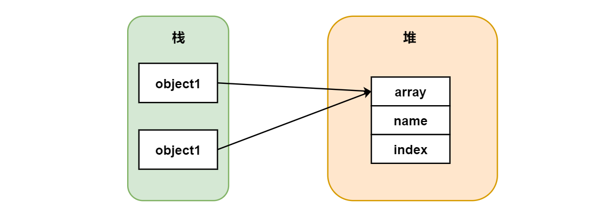
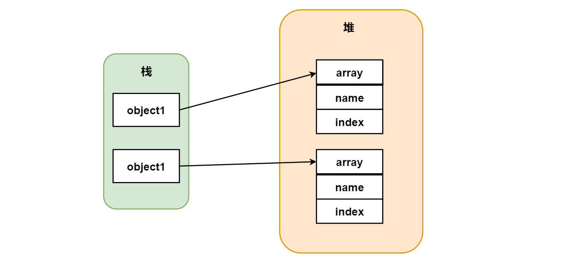
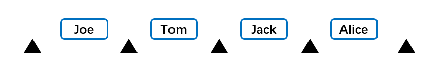
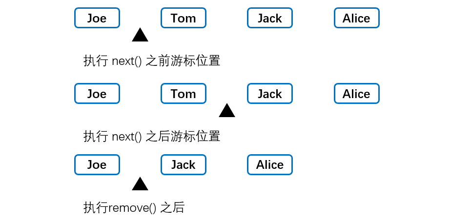

[TOC]

### 常用接口

#### 比较接口

比较接口主要有：**Comparable 接口和 Comparator 接口**。

**Arrays.sort()** 方法可以对**对象数组排序**，第一种方式要求对象类必须**实现了 Comparable 接口**。第二种形式即传入**一个对象数组和一个比较器（实现了 Comparator 接口的实例）** 作为参数。

Comparable 接口如下：

```java
public interface Comparable<T> {
    // 用这个对象与other进行比较，如果这个对象小于other则返回负值，相等返回0，大于other则返回正值
    int compareTo(T other);     // parameter has type T 已经为泛型接口
}
```

Comparator 接口如下：

```java
public interface Comparator<T> {
    // 比较方法
    int compare(T first, T second);     
}
```

都只有一个方法，所以都是**函数式接口**，用 Lambda 就很舒服。使用两个接口时都需要提供**类型参数 T**。

```java
Class Employee implements Comparable<Employee> {    // 传入类型参数
    // 实现接口中的方法
    @Override
    public int compareTo(Employee other){   
        return Double.compare(salary, other.salary);    
    }
}

// 实现一个薪资比较器类
class SalaryComparator implements Comparator<Employee> {
    public int compare(Employee first, Employee second){    // 实现接口方法
        return first.salary() - second.salary();
    }
}
```

排序测试

```java
Employee[] staff = new Employee[3];     // 对象数组

staff[0] = new Employee("Harry Hacker", 35000);
staff[1] = new Employee("Carl Cracker", 75000);
staff[2] = new Employee("Tony Tester", 38000);

// 使用Arrays类方法进行排序，底层采用快排排序
Arrays.sort(staff);     
// 使用比较器的方式排序
Arrays.sort(staff, new SalaryComparator());

// 打印排序后的结果
for (Employee e : staff){
    System.out.println("name=" + e.getName() + ",salary=" + e.getSalary());
}
```


#### Cloneable 接口

##### 1. Clone方法与Cloneable接口

- **clone**()：Object 类的 protected 方法，每个类都有。

- **Cloneable** 接口：一个标记接口。

clone() 是 protected 方法，一个类**不显式**去覆写 clone()，**其它类**就**不能直接去调用**该类实例的 clone() 方法。

```Java
public class CloneTest {
	private int a;
	private int b;
}
```

另一个类不能直接使用 clone 方法。

```java
public class Test {
	public static void main(String[] args) {
		CloneTest cloneTest= new CloneTest();
		try {
            // 'clone()' has protected access in  'java.lang.Object' 
			//CloneTest a = (CloneTest) cloneTest.clone();	// 这一句错误
		} catch (CloneNotSupportedException e) {
			e.printStackTrace();
		}
	}
}
```

那么**覆写 Clone 方法**（事情哪有这么简单）：

```java
public class CloneTest {

	private int a;
	private int b;

	// 仅覆写clone()方法没有实现了Cloneable接口
	@Override
	public CloneTest clone() throws CloneNotSupportedException {
		// 调用Object类的clone方法并强制转型
		return (CloneTest)super.clone();
	}
}
```

```java
public class Test {
	public static void main(String[] args) {
		CloneTest cloneTest= new CloneTest();
		try {
            // 进行克隆
			CloneTest a = (CloneTest) cloneTest.clone();
		} catch (CloneNotSupportedException e) {
			e.printStackTrace();
		}
	}
}
```

哦豁，结果错了。

```java
java.lang.CloneNotSupportedException: CloneTest      // 抛出异常
```

以上抛出了 **CloneNotSupportedException**，这是因为 CloneTest 类**没有**实现 ==**Cloneable 接口**==。

Cloneable 接口只是一个**标记接口**（没有方法的接口），其作用在于可以使用 **instanceof** 进行**类型检查**。如果一个类**没有实现 Cloneable 接口**又调用了 clone() 方法，就会抛出 **CloneNotSupportedException**。

**要克隆必须实现 Cloneable 接口然后再覆写 clone() 方法，并且将 clone 定义为 public 方法，**这样其他类才能调用。clone 方法中可直接调用 Object 类的方法（**由虚拟机实现**的 native 方法）即 **super.clone()**，直接用 clone 方法是实现的**浅克隆**。

```java
// 实现Cloneable接口
public class CloneExample implements Cloneable {
    private int a;
    private int b;

    // 覆写clone()方法：这里默认是浅克隆
    @Override
    public Object clone() throws CloneNotSupportedException {
        return super.clone();   // 实现了Cloneable接口才能使用超类的clone方法
    }
}
```

##### 2. 浅拷贝

如果直接用父类的 clone() 方法，默认是浅拷贝的，拷贝对象和原始对象的**引用类型引用同一个对象**。也就是两个对象会有**==共享的子对象==**。被复制对象的所有变量都含有与原来的对象**相同的值**，而所有的对其他对象的引用仍然指向**原来的对象**。



实例代码如下：

```java
public class ShallowCloneTest implements Cloneable{

	private int[] array;      // 可变类，浅拷贝会造成原对象与拷贝后的对象对此子对象域共享
	private int index;      // 基本类型没问题
	private String name;    // String 等不可变类就算共享也安全因为不可变

	public ShallowCloneTest() {
		array = new int[10];
		for (int i = 0; i < array.length; i++) {
			array[i] = i;
		}
	}

	public void set(int index, int value) {
		array[index] = value;
	}

	public int get(int index) {
		return array[index];
	}

	// 覆写克隆方法 其实就是调用超类的clone方法，默认是浅克隆
	@Override
	public ShallowCloneTest clone() throws CloneNotSupportedException {
		return (ShallowCloneTest) super.clone();
	}
}
```

测试代码

```java
public static void main(String[] args) {
	// 对象1 
    ShallowCloneTest object1 = new ShallowCloneTest();
    try {
        // 克隆得到对象2
        ShallowCloneTest object2 = object1.clone();   
        // 改变e1，e2中的arr[]也被改变了。因为浅拷贝使两者共享此子对象
        object1.set(2, 222);
        System.out.println(object2.get(2));  // 222
    } catch (CloneNotSupportedException e) {
        e.printStackTrace();
    }
}
```

这里会拷贝对象**共享子对象**，一个改变会**影响**另一个。

但是浅拷贝中 String 等**不可变**的对象即使是浅拷贝也是**安全**的，**基本数据类型**也是。

##### 3. 深拷贝

深克隆时一般不再简单的调用父类 Object 的 clone 方法，而是重新定义 **clone** 方法来同时克隆**所有子对象**。全部子对象的**状态**都拷贝了一份，拷贝对象和原始对象的**引用类型引用不同对象**。

技巧：可以先用默认的 clone() 方法去克隆一个对象，然后再手动复制该对象的**全部可变类子类**的内容。



深拷贝实例代码。

```java
public class DeepCloneTest implements Cloneable{

    private int[] array;
    private int index;
    private String name;

    public DeepCloneTest() {
        array = new int[10];
        for (int i = 0; i < array.length; i++) {
            array[i] = i;
        }
    }

    // 重写实现了一个实现了深拷贝的clone方法
    @Override
    public DeepCloneTest clone() throws CloneNotSupportedException {
        // 先用Object的默认方法生成一个对象
        DeepCloneTest result = (DeepCloneTest) super.clone();
        // 再克隆该对象的全部可变类子类的内容（全部状态）
        result.array = new int[array.length];
        // 依次复制
        for (int i = 0; i < array.length; i++) {
            result.array[i] = array[i];
        }
        // 复制安全的属性
        result.index = this.index;
        result.name = this.name;
        return result;
    }

    public void set(int index, int value) {
        array[index] = value;
    }

    public int get(int index) {
        return array[index];
    }
}
```

```java
public static void main(String[] args) {
    DeepCloneTest object1 = new DeepCloneTest();
    try {
        DeepCloneTest object2 = object1.clone();   // 克隆e1
        // 修改对象1
        object1.set(2, 222);
        // 由于是深拷贝，对象2不受影响，结果为2
        System.out.println(object2.get(2));  
    } catch (CloneNotSupportedException e) {
        e.printStackTrace();
    }
}
```

##### 4. clone()的替代方案

使用 clone() 方法来拷贝一个对象即复杂又有风险，它会抛出异常，并且还需要**类型转换**。

Effective Java 建议最好不要去使用 clone()，**可以使用==拷贝构造方法==或者==拷贝工厂==来拷贝一个对象**。即自己实现一个用于拷贝原对象的**构造方法**，传入需要拷贝的原对象进行状态拷贝。

```java
// 这时可以不用实现Cloneable接口
public class ConstructorCloneTest {

	private int[] array;

	// 默认构造方法
	public ConstructorCloneTest() {
		array = new int[10];
		for (int i = 0; i < array.length; i++) {
			array[i] = i;
		}
	}

	// 专门用于深拷贝的构造方法，需要传入被拷贝的原对象
	public ConstructorCloneTest(ConstructorCloneTest original) {
		array = new int[original.array.length];

		// 依次将原对象的信息拷贝出来
		for (int i = 0; i < original.array.length; i++) {
			array[i] = original.array[i];
		}
	}

	public void set(int index, int value) {
		array[index] = value;
	}

	public int get(int index) {
		return array[index];
	}
}
```

```java
public static void main(String[] args) {
    ConstructorCloneTest object1 = new ConstructorCloneTest();     // 构造对象1
    // 拷贝对象1到对象2
    ConstructorCloneTest object2 = new ConstructorCloneTest(object1);   
    object1.set(2, 222);
    // 2 实现深拷贝
    System.out.println(object2.get(2));        
}
```

##### 5. 数组与拷贝

所以**数组类型**都有一个 public 的 clone 方法（已经覆写了？），可以直接使用这个方法建立一个完全**新的**数组，包含原数组的副本。

```javascript
int[] numbers = {2, 3, 4};
int[] cloned = number.clone();
cloned[1] = 12;     // numbers数组不受影响
```

##### 6. 序列化与深拷贝

序列化一个对象时，当一个对象的实例变量引用其它对象，序列化该对象时也会把引用对象进行序列化。所以能**用序列化解决深拷贝问题**。


#### 迭代接口

迭代器（iterator）可以从第一项开始完整**遍历**一个数据集合。一个迭代周期内，每个数据项都被访问一次。

##### 1. Iterable接口

```java
public interface Iterable<T> {
    // 返回一个迭代器 ※
    Iterator<T> iterator();

   	// 默认实现
    default void forEach(Consumer<? super T> action) {
        Objects.requireNonNull(action);
        for (T t : this) {
            action.accept(t);
        }
    }

    default Spliterator<T> spliterator() {
        return Spliterators.spliteratorUnknownSize(iterator(), 0);
    }
}
```

实现了此接口的类可以返回一个 **Iterator 迭代器对象**，可以进行迭代操作。

##### 2. Iterator接口

```java
public interface Iterator<E> {
    // 是否含有下一个元素   
    boolean hasNext();

    // 返回下一个元素
    E next();

    // 删除一个元素
    default void remove() {
        throw new UnsupportedOperationException("remove");
    }

    // 默认实现方法
    default void forEachRemaining(Consumer<? super E> action) {
        Objects.requireNonNull(action);
        while (hasNext())
            action.accept(next());
    }
}
```

共 4 个方法，常用是**前三个**。

迭代器对象内部有一个**游标**，如下图所示的集合。集合有 **N 个元素**，则游标可能出现在 **N + 1 个位置**。



方法 **hasNext**() 返回游标后面**是否还有元素**，方法 **next()** 返回游标后的一个元素，并将**游标后移**；方法 **remove**() 将删除==**最后一次调用next**()==== 方法时返回的项。



**==不能同时连续两次调用==** remove() 方法，因为调用之前必须要调用 **next()** 方法==**移动游标**==才行，否则抛 **UnsupportedOperationException** 异常。一般操作如下。

```java
// String类型的迭代器
Iterator<String> nameIterator = nameList.iterator();
while(nameIterator.haseNext()) {
    System.out.println(nameIterator.next());
}
```

#####  3. ListIterator接口

| 方法          | 功能                               |
| :------------ | :--------------------------------- |
| hasNext()     | 判断是否还有下一个元素可以迭代     |
| next()        | 返回下一个元素                     |
| hasPrevious() | 判断是否还有上一个元素可以迭代     |
| previous()    | 返回上一个元素                     |
| add()         | 返回上一个元素（可选方法）         |
| set(E e)      | 用指定的元素**替换**最近返回的元素 |
| remove()      | 移除最近返回的元素                 |

比 Iterator 接口多了一些方法。使其可以在**前后两个方向**上移动游标，同样 remove() 方法需要**先**调用next() 或者previous() 方法。

**对比 Iterator 与 ListIterator：**

- 遍历方式：ListIterator 和 Iterator 都有 hasNext() 和 next() 方法，可以实现顺序向后遍历，但是 ListIterator 有**hasPrevious() ** 和 **previous() **方法，可以实现**逆向（顺序向前）遍历**。Iterator 仅单向遍历。
- 修改集合：ListIterator 能对集合进行增删改查，而 Iterator 仅能进行删查。ListIterator 的 set() 方法可以实现对象的**修改**，add() 方法，可以向 List 中**添加**对象。


#### 标记接口

标记接口**没有任何方法**。标识接口不对实现它的类有任何语义上的要求，仅仅表明它的实现类属于一个**特定的类型**。实现标记接口相当于**打一个标签**。

##### 1. Serializable

**Serializable** 接口：**序列化**。

##### 2. Cloneable

**Cloneable** 接口：**克隆**。

##### 3.RandomAccess

**RandomAccess** 接口：**快速随机访问**，如在 ArrayList 类实现中，其内部使用数组存储元素，可以做到快速随机访问。ArrayList 实现了 RandomAccess 接口，RandomAccess 是一个标记接口，用于标明实现该接口的 List 支持快速随机访问，主要目的是使算法能够在随机和顺序访问的 List 中性能更加**高效**（在 Collections 二分查找时）。如果集合类实现了 RandomAccess，则尽量用 **for 循环来遍历**，没有实现则用 **Iterator** 进行遍历。

在 **binarySearch**() 方法中，它要判断传入的 list 是否 RamdomAccess 的**实例**，如果是，调用 indexedBinarySearch()方法，如果不是，那么调用 iteratorBinarySearch() 方法。

````java
public static <T>
    int binarySearch(List<? extends Comparable<? super T>> list, T key) {
    // 如果list是RandomAccess的实例则使用快速随机访问
    if (list instanceof RandomAccess || list.size()<BINARYSEARCH_THRESHOLD)
        // 优先选择普通for循环 ，其次foreach
        return Collections.indexedBinarySearch(list, key);
    else
        // 选择iterator遍历
        return Collections.iteratorBinarySearch(list, key);
}
````


