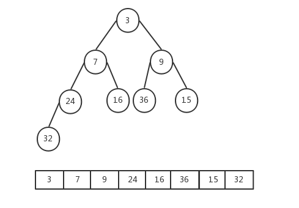
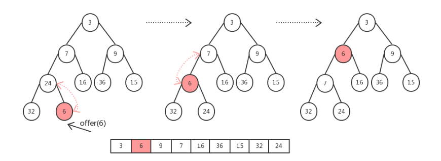
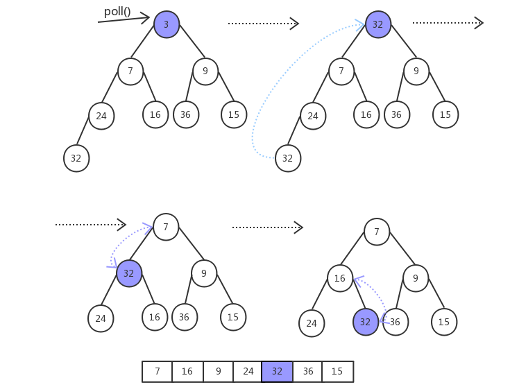

[TOC]

### PriorityQueue

#### 基础

##### 1. 杂记

- PriorityQueue 优先级队列，实现了队列接口 **Queue**，每个元素都有优先级，**队头**的元素永远都是**优先级最高**的。内部元素**不是完全有序**，但是**逐个**出队列会得到**完全有序**的输出（从源码上看入列操作并**没有**对所有加入的元素**进行优先级排序**。**仅仅保证数组==第一个==元素是最小的即可**）。
- 

- **线程安全**：PriorityQueue 也是线程**不安全**的队列。

##### 2. 基本使用

PriorityQueue 使用跟**普通队列**一样，唯一区别是 PriorityQueue 会根据**排序规则**决定谁在队头，谁在队尾。使用方式如下：

```java
// 自定义比较器，降序排列
static Comparator<Integer> cmp = new Comparator<Integer>() {
    public int compare(Integer e1, Integer e2) {
        return e2 - e1;
    }
};
public static void main(String[] args) {
    // 不用比较器，默认升序排列
    Queue<Integer> q = new PriorityQueue<>();
    q.add(3);
    q.add(2);
    q.add(4);
    while(!q.isEmpty()) {
        System.out.print(q.poll()+" "); // 2 3 4 
    }

    // 使用自定义比较器，降序排列
    Queue<Integer> qq = new PriorityQueue<>(cmp);
    qq.add(3);
    qq.add(2);
    qq.add(4);
    while(!qq.isEmpty()) {
        System.out.print(qq.poll()+" "); // 4 3 2 
    }
}
```

使用**自然序**比较器。

```java
PriorityQueue<String> priorityQueue = new PriorityQueue<>(Comparator.naturalOrder());
```

#### 源码分析

看图说话。



以下分析基于 JDK8。

##### 1. 基本属性

基本属性如下。

```java
public class PriorityQueue<E> extends AbstractQueue<E>
    implements java.io.Serializable {
    private static final int DEFAULT_INITIAL_CAPACITY = 11;	// 默认初始化容量
    // 存放数据的数组
    transient Object[] queue;    
    // 队列长度即数据个数
    private int size = 0;  
    // 队列比较器， 不传入则使用自然排序
    private final Comparator<? super E> comparator;  
    // 记录结构性变化次数
    transient int modCount = 0; 
}
```

PriorityQueue 内部也是使用**数组存储**元素的（用于实现**堆**结构），而且也有记录结构性变化的 **modCount** 变量，不过这是自己定义的了，不像 ArrayList 是继承而来的。

##### 2. 初始化

有很多个重载构造方法，可以传入**数组大小、比较器**，以及 Collection 对象等参数。利用 Collection 对象**构造堆**后面详述。

```java
public PriorityQueue() {
    this(DEFAULT_INITIAL_CAPACITY, null);
}

public PriorityQueue(int initialCapacity) {
    this(initialCapacity, null);
}

public PriorityQueue(int initialCapacity, Comparator<? super E> comparator) {
    // Note: This restriction of at least one is not actually needed,
    // but continues for 1.5 compatibility
    if (initialCapacity < 1)
        throw new IllegalArgumentException();
    this.queue = new Object[initialCapacity];
    this.comparator = comparator;
}
```

##### 3. 添加元素

队列的**添加元素**有两种方法，**add 和 offer**。add 方法如下。

```java
public boolean add(E e) {
    return offer(e);
}
```

其内部调用 **offer** 方法。

```java
public boolean offer(E e) {
    if (e == null)
        throw new NullPointerException();
    // 添加属于修改操作
    modCount++;
    // 获取当前元素个数
    int i = size;
    // 如果数组不够了则扩容
    if (i >= queue.length)
        // 扩容操作
        grow(i + 1);
    // 元素个数+1
    size = i + 1;
    // 如果之前没有元素，则直接放在第一个就好
    if (i == 0)
        queue[0] = e;
    else
        // 使用经典的siftUp上移最后添加的元素，保证我们的堆还是有序的
        siftUp(i, e);
    return true;
}
```

扩容的方法 **grow** 如下。当容量**小于 64** 时容量扩展为原来的**两倍 + 2**，如果大于等于 64 时扩容为原来的 **1.5 倍**。

```java
private void grow(int minCapacity) {
    // 旧的队列长度
    int oldCapacity = queue.length;
    // Double size if small; else grow by 50%
    // 当容量小于64时容量为原来的两倍+2，如果大于等于64时扩容为原来的1.5倍
    int newCapacity = oldCapacity + ((oldCapacity < 64) ?
                                     (oldCapacity + 2) :
                                     (oldCapacity >> 1));
    // overflow-conscious code
    // 当元素数量非常多时进行单独处理，也就是超过了Integer定义的最大值了
    // 这里MAX_ARRAY_SIZE = Integer.MAX_VALUE - 8;
    if (newCapacity - MAX_ARRAY_SIZE > 0)
        newCapacity = hugeCapacity(minCapacity);
    // 元素拷贝
    queue = Arrays.copyOf(queue, newCapacity);
}
```

之后便是插入过程了，参考下面的插入 6 的过程（小顶堆）。



新的元素被放到**数组的最后**，对应到**完全二叉树**的最后一个叶子结点。由于新插入元素后，可能会导致小顶堆的结构被破坏，因此需要将**新插入的元素**（在小顶堆的最低层）**向上调整**，如果插入的元素比**父节点大**，那么就把**父节点调下来**，记录父节点的位置后继续向上调整，直到新元素其比**父节点元素值小为止**。

下面看看**上浮**操作 **siftUp** 方法！

```java
private void siftUp(int k, E x) {
    if (comparator != null)
        siftUpUsingComparator(k, x);
    else
        siftUpComparable(k, x);
}
```

可以看到主要是看有没有传入**自定义**的比较器，然后进行不同的操作。先看没有自定义比较器的情况。

```java
private void siftUpComparable(int k, E x) {
    // 构造待插入的元素
    Comparable<? super E> key = (Comparable<? super E>) x;
    while (k > 0) {
        // 获取父节点位置
        int parent = (k - 1) >>> 1;
        // 获取父节点元素
        Object e = queue[parent];
        // 如果插入的元素大于父节点（构成小顶堆）则退出循环，这里就相当于直接就放好位置了
        if (key.compareTo((E) e) >= 0)
            break;
        // 如果插入的元素小于父节点元素，交换这个位置的父节点位置的元素，实现上浮
        queue[k] = e;
        // 记录父节点位置，继续向上判断调整
        k = parent;
    }
    // 调整后将插入的元素放在对应的位置上
    queue[k] = key;
}
```

如果是使用了**自定义**的比较器，那么就是下面的方法，其实都差不多。

```java
private void siftUpUsingComparator(int k, E x) {
    while (k > 0) {
        int parent = (k - 1) >>> 1;
        Object e = queue[parent];
        // 在这里使用自定义的比较器比较
        if (comparator.compare(x, (E) e) >= 0)
            break;
        queue[k] = e;
        k = parent;
    }
    queue[k] = x;
}
```

添加元素至此结束。

##### 4. 删除元素

移除元素的方法也有两个，分别是 `remove` 与 `poll`，与 `remove` 不同的是 `poll` 每次移除的是**堆顶**的元素，也就是最小的元素，`remove` 可以移除**指定的任意元素**，并且这个移除只会移除**第一次**出现的该元素，如果后面也有该元素是不会移除的。

因为 **poll** 每次移除的是**堆顶**的元素，移除之后**需要把数组最后的元素移到堆顶（也就是堆顶），进而不断进行下沉操作。**而 remove 方法移除的元素可能是介于堆顶与堆尾的元素，这时就不仅需要向下调整了，必要的时候也需要向上进行调整才能维持小顶堆。

主要关注 **poll** 方法吧。首先看看过程图示。（堆中左子结点不一定比右子节点小啊）



```java
@SuppressWarnings("unchecked")
public E poll() {
    if (size == 0)
        return null;
    // 弹出一个元素后size-1
    int s = --size;
    modCount++;
    // 获取队首的元素
    E result = (E) queue[0];
    // 获取队尾的元素（队首元素被移除，把队尾元素放在队首，从上往下调整二叉堆）
    E x = (E) queue[s];
    // 队尾元素置空
    queue[s] = null;
    if (s != 0)
        // 调整二叉堆
        siftDown(0, x);
    return result;
}
```

下沉操作 siftDown 如下：

```java
private void siftDown(int k, E x) {
    // 判断是否自定义了比较器
    if (comparator != null)
        siftDownUsingComparator(k, x);
    else
        siftDownComparable(k, x);
}
```

同 offer 方法一样，poll 方法在调整小顶堆时也分了**自然比较器与自定义比较器**两种情况，这里只看其中一个**自然排序**的方法 siftDownComparable。

```java
private void siftDownComparable(int k, E x) {
    // 获取待下沉的元素对象
    Comparable<? super E> key = (Comparable<? super E>)x;
    int half = size >>> 1;        // loop while a non-leaf
    while (k < half) {
        // 获取左孩子节点所在的位置
        int child = (k << 1) + 1; // assume left child is least
        // 获取左孩子节点元素值
        Object c = queue[child];
        // 右孩子节点所在位置
        int right = child + 1;
        if (right < size &&
            ((Comparable<? super E>) c).compareTo((E) queue[right]) > 0)
            // 记录左右孩子中最小的元素
            c = queue[child = right];
        // 如果父节点比两个孩子节点都要小，就结束循环
        if (key.compareTo((E) c) <= 0)
            break;
        // 把小的元素移到父节点的位置
        queue[k] = c;
        // 记录孩子节点所在的位置，继续向下调整
        k = child;
    }
    // 最终把父节点放在对应的位置上，使其保持一个小顶堆
    queue[k] = key;
}
```

remove 方法这里就不深究了。

##### 5. heapify构造堆

前面构造方法部分可知，可也以**直接传入集合类型**进行优先级队列的**构造**，看看过程。

```java
public PriorityQueue(Collection<? extends E> c) {
    if (c instanceof SortedSet<?>) {
        SortedSet<? extends E> ss = (SortedSet<? extends E>) c;
        this.comparator = (Comparator<? super E>) ss.comparator();
        initElementsFromCollection(ss);
    }
    else if (c instanceof PriorityQueue<?>) {
        PriorityQueue<? extends E> pq = (PriorityQueue<? extends E>) c;
        this.comparator = (Comparator<? super E>) pq.comparator();
        initFromPriorityQueue(pq);
    }
    else {
        this.comparator = null;
        // 通过集合进行初始化
        initFromCollection(c);
    }
}
```

上面的操作就是传入一个集合类，一波操作之后利用集合进行**堆的构造**。

```java
private void initFromCollection(Collection<? extends E> c) {
    initElementsFromCollection(c);
    // ★
    heapify();
}
```

这里两步，第一步是将传入的集合类进初始化，将**元素**放到对应的 **queue 数组**中。

第二步就是**调用了 heapify 方法对 queue 数组进行堆的构造**，也就是将普通数组**堆化**。

```java
private void heapify() {
    // 从数组的后面往前面不断进行下沉操作
    for (int i = (size >>> 1) - 1; i >= 0; i--)
        siftDown(i, (E) queue[i]);
}
```

可以看到是**循环调用** siftDown 完成**下沉**操作。

从源码也可看出 PriorityQueue 并**不是线程安全队列**，因为 offer/poll 都没有对队列进行**锁定**，所以，如果要拥有线程安全的优先级队列，需要额外进行加锁操作。


#### 应用实例

##### 1. TopK问题

**方法一**：对源数据中所有数据进行排序，取出前 K 个数据，就是 TopK。但是当数据量很大时，只需要 k 个最大的数，整体排序很耗时，效率不高。

**方法二**：基于**快排**实现。

```java
public class TopKPartitionSort {

    public static void main(String[] args) {
        int[] num = { 2, 20, 3, 7, 9, 1, 17, 18, 0, 4 };
        partitionSort(num, 0, num.length - 1, 3);
        System.out.println(Arrays.toString(num));
    }

    public static void partitionSort(int[] nums, int low, int high, int K) {
        if (low < high) {
            int pointKey = partitionSortCore(nums, low, high);
            // TopK问题的核心，就是如果返回的下标为K-1
            // 说明已经排序好了K个最大/最小的数，但是之间的顺序是不确定的
            if (K - 1 == pointKey)
                return;
            partitionSort(nums, low, pointKey - 1, K);
            partitionSort(nums, pointKey + 1, high, K);
        }
    }

    /**
     * 快排的核心
     * 
     * @param nums
     * @param low
     * @param high
     * @return 返回排序好以后的位置
     */
    public static int partitionSortCore(int[] nums, int low, int high) {
        // 以第一个座位标志位来比对
        int pivotkey = nums[low];
        while (low < high) {
            // 从pivotkey往最后一个位置比较
            while (low < high && pivotkey <= nums[high]) {
                --high;
            }
            // 开始交换pivotkey和nums[high]
            int temp = nums[low];
            nums[low] = nums[high];
            nums[high] = temp;
            // 此时nums[high]对应于pivotkey
            while (low < high && pivotkey >= nums[low]) {
                ++low;
            }
            // 找到比pivotkey大的书了，那就交换
            temp = nums[low];
            nums[low] = nums[high];
            nums[high] = temp;
            // 这时，pivotkey对应于nums[low]
        }
        return low;// 返回pivotkey对应的正确位置
    }
}
```

**方法三**：利用**堆**实现。

用 PriorityQueue 构造一个具有 **k 个数的小顶堆**，每次取一个数于**堆顶**的元素进行比较，如果新数比堆顶元素大，则删除堆顶元素，并把这个新数放到堆中。这可用于元素个数不确定还需要实时**动态添加**的问题。也可以求**第 K 个**元素。

用 PriorityQueue 的实现的代码如下：

```java
public class findTopK {
    // 找出前k个最大数，采用小顶堆实现
    public static int[] findKMax(int[] nums, int k) {
        // 队列默认自然顺序排列，小顶堆，不必重写compare
        PriorityQueue<Integer> pq = new PriorityQueue<>(k);
		
        for (int num : nums) {
            // 堆中元素小于K时直接放入元素即可
            if (pq.size() < k) {
                pq.offer(num);
                // 如果堆顶元素<新数，则删除堆顶，加入新数入堆
            } else if (pq.peek() < num) { 
                pq.poll();
                pq.offer(num);
            }
        }
		// 依次弹出数据就行了
        int[] result = new int[k];
        for (int i = 0; i < k && !pq.isEmpty(); i++) {
            result[i] = pq.poll();
        }
        return result;
    }

    public static void main(String[] args) {
        int[]arr=new int[]{1, 6, 2, 3, 5, 4, 8, 7, 9};
        // 输出：[5, 6, 7, 8, 9]
        System.out.println(Arrays.toString(findKMax(arr,5)));
    }
}
```

##### 2. 利用堆求中值

求中值的一个基本思路是**排序**，排序之后找到中间值。如果元素会**动态添加**，就可以使用堆。**维护两个堆，一个最大堆，一个最小堆。**

思路如下：

- 设当前中位数为 m, 最大堆维护的是 ≤ m 的元素，最小堆维护的是 ≥ m 的元素，但两个堆都不包含 m。
- 当新元素到达时，将新元素与 m 进行比较，若新元素 ≤ m， 则将其加入最大堆，否则加入最小堆。
- 第二步后，如果此时最小堆与最大堆的元素个数差值 ≥ 2，则将 m 加入元素个数少的堆中，然后从元素个数多的堆中将根节点移除并幅值给 m 即可。

```java
import java.util.Collection;
import java.util.Collections;
import java.util.PriorityQueue;

public class Midian<E> {
    private PriorityQueue<E> minP;
    private PriorityQueue<E> maxP;
	// 中值
    private E m;
    public Midian(){
        this.minP = new PriorityQueue<>();
        this.maxP = new PriorityQueue<>(11, Collections.<E>reverseOrder());
    }

    private int compare(E e , E m){
        Comparable<? super E>  cmpr = (Comparable<? super E>) e;
        return cmpr.compareTo(m);
    }

    public void add(E e){
		// 第一个元素
        if (m == null){
            m = e;
            return;
        }
		// 小于中值加入最大堆
        if (compare(e , m) <= 0){
            maxP.add(e);
        }else {
            minP.add(e);
        }

        if (minP.size() - maxP.size() >=2){
			// 最小堆元素个数多，将m加入最大堆中，然后最小堆中根移除赋值给m
            maxP.add(this.m);
            this.m = minP.poll();
        }else if (maxP.size() - minP.size() >= 2){
            minP.add(this.m);
            this.m = maxP.poll();
        }
    }

    public void addAll(Collection<? extends E> c){
        for(E e:c){
            add(e);
        }
    }

    public E getM(){
        return m;
    }
}

public static void main(String[] args) {
    Midian<Integer> integerMidian = new Midian<>();
    List<Integer> list = Arrays.asList(new Integer[] {1,2,3,4,5,6,7,8,9,10});
    integerMidian.addAll(list);
    System.out.println(integerMidian.getM());
}
```

##### 3. 堆排序

详见数据结构与算法部分。


#### 参考资料

- [PriorityQueue源码解析](https://blog.csdn.net/codejas/article/details/85144502)


