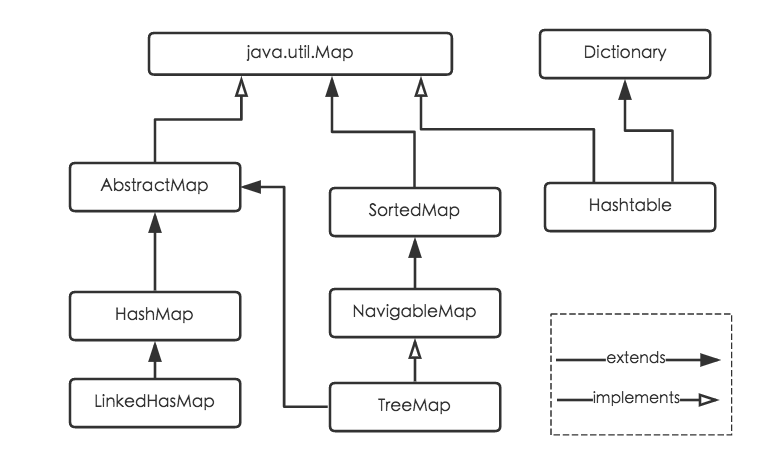

[TOC]

### Map、Set

#### Map

Map 接口的常用方法如下表。

| 方法 |                             释义                             |
| :--: | :----------------------------------------------------------: |
|  1   | **void clear( )**：从此映射中移除所有映射关系（可选操作）。  |
|  2   | boolean **containsKey**(Object k)：如果此映射包含指定键的映射关系，则返回 true。 |
|  3   | boolean **containsValue**(Object v)：如果此映射将一个或多个键映射到指定值，则返回 true。 |
|  4   | Set **entrySet**( )：返回此映射中包含的映射关系的 Set 视图。 |
|  5   | boolean **equals**(Object obj)：比较指定的对象与此映射是否相等。 |
|  6   | Object **get**(Object k)：返回指定键所映射的值；如果此映射不包含该键的映射关系，则返回 null。 |
|  7   |         int **hashCode**( )：返回此映射的哈希码值。          |
|  8   | boolean **isEmpty**( )：如果此映射未包含键-值映射关系，则返回 true。 |
|  9   |     Set **keySet**( )：返回此映射中包含的键的 Set 视图。     |
|  10  | Object **put**(Object k, Object v)：将指定的值与此映射中的指定键关联（可选操作）。 |
|  11  | void **putAll**(Map m)：从指定映射中将所有映射关系复制到此映射中（可选操作）。 |
|  12  | Object **remove**(Object k)：如果存在一个键的映射关系，则将其从此映射中移除（可选操作）。 |
|  13  |       int **size**( )：返回此映射中的键-值映射关系数。       |
|  14  | Collection **values**( )：返回此映射中包含的值的 Collection 视图。 |

Map 接口主要实现类有：**HashMap、Hashtable、LinkedHashMap、TreeMap**。

(1) **HashMap**：它根据键的 hashCode 值存储数据，遍历是无序的。 **HashMap 只允许一条记录的键为 null，允许多条记录的值为 null**。HashMap **线程不安全**，即多线程同时操作 HashMap 可能会导致数据不一致。

(2) **Hashtable**：Hashtable 是**遗留类**，其功能与 HashMap 类似，不同的是它承自 Dictionary 类，并且通过 synchronized 保证了线程**安全**性，任一时间只有一个线程能写 Hashtable。

(3) **LinkedHashMap**：LinkedHashMap 是 HashMap 的一个**子类**，迭代时可以有序，可配置按**访问顺序或者插入顺序**使用。

(4) **TreeMap**：TreeMap 实现 SortedMap 接口，能够对元素按照**键**进行排序，默认升序，也可以指定排序的比较器。用 Iterator 遍历可得到有序结果。元素的**键 key** 必须实现 **Comparable 接口**或者在构造 TreeMap 传入自定义的 Comparator，否则会在运行时抛异常。

#### Set

Set: 存储的元素是独一无二的，且是**无序**存储的。Set 主要实现类有 HashSet、TreeSet。

#### 参考资料

- [Java Collection Framework](https://www.w3resource.com/java-tutorial/java-collections.php)
- [Iterator 模式](https://openhome.cc/Gossip/DesignPattern/IteratorPattern.htm)
- [Java 8 系列之重新认识 HashMap（好！！！！）](https://tech.meituan.com/java_hashmap.html)
- [What is difference between HashMap and Hashtable in Java?](http://javarevisited.blogspot.hk/2010/10/difference-between-hashmap-and.html)
- [Java 集合之 HashMap](http://www.zhangchangle.com/2018/02/07/Java%E9%9B%86%E5%90%88%E4%B9%8BHashMap/)
- [The principle of ConcurrentHashMap analysis](http://www.programering.com/a/MDO3QDNwATM.html)
- [探索 ConcurrentHashMap 高并发性的实现机制](https://www.ibm.com/developerworks/cn/java/java-lo-concurrenthashmap/)
- [HashMap 相关面试题及其解答（好！！！！！！）](https://www.jianshu.com/p/75adf47958a7)
- [Java 集合细节（二）：asList 的缺陷](http://wiki.jikexueyuan.com/project/java-enhancement/java-thirtysix.html)

