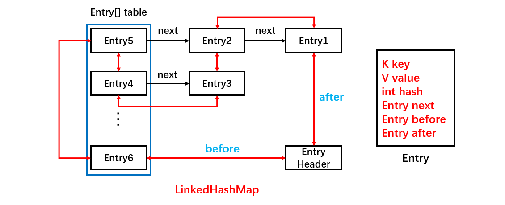

[TOC]

### LinkedHashMap

#### 基础

##### 1. 杂记

- LinkedHashMap 是 HashMap 的**子类**，**覆写**了 HashMap 中的一些**空方法**，从而实现了对顺序的控制。比如 **newNode**（插入新结点时用）、**afterNodeAccess**（get、put 方法中用）、**afterNodeInsertion**（put 方法中用） 方法等。
- LinkedHashMap 可以保持元素按**插入或访问有序**，顺序为**插入顺序（accessOrder 为 false，默认）或访问顺序（accessOrder 为 true）**。与 TreeMap **按键**排序不同。
- HashMap 是**线程不安全**的，LinkedHashMap 同样是线程**不安全**的。
- LinkedHashMap 其实可以看成 **HashMap + 双向链表**组成。
- 访问顺序可用于 **LRU**。基于 LinkedHashMap 要实现最大缓存值的 LRU，需要继承 LinkedHashMap 并开启 **accessOrder 为 true**，同时覆写 **removeEldestEntry** 方法。

##### 2. 基本使用

HashMap 是**无序**的，当需要有**顺序**地去存储 key-value 时，就需要使用 **LinkedHashMap**。跟 HashMap 一样，它也是提供了 key-value 的存储方式，并提供了 **put** 和 **get** 方法来进行数据存取。

```java
// 使用HashMap
Map<String, String> hashMap = new HashMap<String, String>();
hashMap.put("name1", "josan1");
hashMap.put("name2", "josan2");
hashMap.put("name3", "josan3");
Set<Entry<String, String>> set = hashMap.entrySet();
Iterator<Entry<String, String>> iterator = set.iterator();
while(iterator.hasNext()) {
    Entry entry = iterator.next();
    String key = (String) entry.getKey();
    String value = (String) entry.getValue();
    System.out.println("key:" + key + ",value:" + value);
}
// 无序
// key:name3,value:josan3
// key:name1,value:josan1
// key:name2,value:josan2

// 使用LinkedHashMap
Map<String, String> linkedHashMap = new LinkedHashMap<>();
linkedHashMap.put("name1", "josan1");
linkedHashMap.put("name2", "josan2");
linkedHashMap.put("name3", "josan3");
Set<Entry<String, String>> set = linkedHashMap.entrySet();
Iterator<Entry<String, String>> iterator = set.iterator();
while(iterator.hasNext()) {
    Entry entry = iterator.next();
    String key = (String) entry.getKey();
    String value = (String) entry.getValue();
    System.out.println("key:" + key + ",value:" + value);
}
// 有序
// key:name1,value:josan1
// key:name2,value:josan2
// key:name3,value:josan3
```

结果可知，LinkedHashMap 是**有序**的，且**默认**为==**插入顺序**==，就是插入元素的顺序（还有一种访问顺序）。


#### 源码分析

##### 1. 整体结构

LinkedHashMap 结构如下图。


继承自 HashMap，因此具有和 HashMap 一样的**快速查找**特性。LinkedHashMap 的大多数方法的实现**直接使用了父类** HashMap 的方法。LinkedHashMap 可以说是 HashMap 和 LinkedList 的集合体，既使用了 HashMap 的数据结构，又借用了 LinkedList **双向链表**的结构。

```java
public class LinkedHashMap<K,V> extends HashMap<K,V> implements Map<K,V>
```

**HashMap** 中静态内部类 **Node** 是这样定义的。

```java
static class Node<K,V> implements Map.Entry<K,V> {
    final int hash;
    final K key;
    V value;
    // Next指针
    Node<K,V> next;
}
```

LinkedHashMap 的内部静态**结点类** Entry 直接**继承**了 HashMap 的结点类 **Node**，并**拓展了前后两个指针 before 和 after**，因此可以实现**双向链表结构**。

```java
static class Entry<K,V> extends HashMap.Node<K, V> {
    // 前后指针
    Entry<K, V> before, after;
    // 父类HashMap中Node类的构造方法
    Entry(int hash, K key, V value, Node<K, V> next) {
        super(hash, key, value, next);
    }
}
```

此时一个 Entry 结点拥有 **before，after 和 next** 三个指针，它们之间的关系如下图所示。


上面的结构图，定义了**头结点 head**，当调用迭代器进行遍历时，**通过 head 开始遍历**，通过 **before** 属性可以不断找到下一个，直到 tail 尾结点，从而实现**顺序性**。而在**同一个 hash**（在上图中表现了同一行）链表内部 after 和 next 效果是一样的。**不同点在于 before 和 after 可以连接不同 hash 槽之间的链表**。

LinkedHashMap 与 HashMap **之间唯一的区别是 LinkedHashMap 在 HashMap 的基础上，采用双向链表（doubly-linked list）的形式将所有 entry 连接起来，这样是为保证元素的迭代顺序跟插入顺序相同**。上图给出了 LinkedHashMap 的结构图，主体部分跟 HashMap 完全一样，多了 `header` 指向双向链表的头部（是一个哑元），**该双向链表的迭代顺序就是 entry 的插入顺序**。

除了可以保迭代历顺序，这种结构还有一个好处：**迭代 LinkedHashMap 时不需要像 HashMap 那样遍历整个 table，而只需要直接遍历 header 指向的==双向链表==即可**，也就是说 LinkedHashMap 的迭代时间就只跟 `entry` 的个数相关，而跟 `table` 的大小无关。

有两个参数可以影响 LinkedHashMap 的性能：**初始容量**（initalCapacity）和**负载因子**（loadFactor）。初始容量指定了初始`table`的大小，负载因子用来指定自动扩容的临界值。这与 HashMap 是类似的。

将对象放入到 LinkedHashMap 或 LinkedHashSet 中时，有两个方法需要特别关心：`hashCode()` 和 `equals()`。**hashCode() 方法决定了对象会被放到哪个 bucket 里，当多个对象的哈希值冲突时，equals() 方法决定了这些对象是否是“同一个对象”**。所以，如果要将**自定义的对象**放入到 `LinkedHashMap` 或 `LinkedHashSet` 中，需要同时覆写`hashCode()` 和 `equals()` 方法。

##### 2. 基本属性

基本属性字段有：

```java
// 头指针
transient LinkedHashMap.Entry<K,V> head;

// 尾指针
transient LinkedHashMap.Entry<K,V> tail;

// 访问顺序控制
final boolean accessOrder;
```

**accessOrder** 是配置顺序的**策略**。accessOrder 默认为 false，表示是按**插入顺序**存储，表示 LinkedHashMap 中存储的顺序是按照**调用 put 方法插入的顺序**进行排序的。accessOrder 变量为 true 时即按**访问顺序**，也就是**最新访问**的元素被移到**链表尾部**，那么链表头部的元素就是**最久未访问的元素**。

##### 3. 构造方法

有多个构造方法。

```java
// 构造方法1，构造一个指定初始容量和负载因子的、按照插入顺序的LinkedList
public LinkedHashMap(int initialCapacity, float loadFactor) {
    super(initialCapacity, loadFactor);
    accessOrder = false;
}
// 构造方法2，构造一个指定初始容量的LinkedHashMap，取得键值对的顺序是插入顺序
public LinkedHashMap(int initialCapacity) {
    super(initialCapacity);
    accessOrder = false;
}
// 构造方法3，用默认的初始化容量和负载因子创建一个LinkedHashMap，取得键值对的顺序是插入顺序
public LinkedHashMap() {
    super();
    accessOrder = false;
}
// 构造方法4，通过传入的map创建一个LinkedHashMap，容量为默认容量（16）和(map.zise()/DEFAULT_LOAD_FACTORY)+1的较大者，装载因子为默认值
public LinkedHashMap(Map<? extends K, ? extends V> m) {
    super(m);
    accessOrder = false;
}
// 构造方法5，根据指定容量、装载因子和键值对保持顺序创建一个LinkedHashMap
public LinkedHashMap(int initialCapacity, float loadFactor, boolean accessOrder) {
    super(initialCapacity, loadFactor);
    this.accessOrder = accessOrder;
}
```

首先使用 super 调用了父类 **HashMap** 的构造方法，其实就是根据初始容量、负载因子去**初始化 Entry[] table**。然后设置 accessOrder 来控制存储顺序。

##### 4. 顺序维护

LinkedHashMap 最重要的是以下用于**维护顺序的函数**，它们会在 **put、get** 等方法中**调用**。这两个方法在 HashMap 的 put 方法中也有，但是是**空实现**。LinkedHashMap **继承 HashMap 之覆写**了这两个方法实现了对顺序的维护。这个设计真滴秒啊。

```java
void afterNodeAccess(Node<K,V> p) { }
void afterNodeInsertion(boolean evict) { }
```

下面详述。

##### 5. put 方法

**添加元素方法是重点**。

注意，这里的**插入有两重含义**：

- 从 table 的角度看，新的 entry 需要插入到对应的 bucket 里，当有哈希冲突时，采用头插法将新的 entry 插入到冲突链表的头部。
- 从 header 的角度看，新的 entry 需要插入到双向链表的**尾部**。


LinkedHashMap 的 put 其实就是 HashMap 的 put 方法。

```java
public V put(K key, V value) {
    return putVal(hash(key), key, value, false, true);
}
```

再回顾一下 **HashMap** 中的 putVal 方法。

```java
final V putVal(int hash, K key, V value, boolean onlyIfAbsent, boolean evict) {
    Node<K,V>[] tab; Node<K,V> p; int n, i;
    /**
     * 如果当前HashMap的table数组还未定义或者还未初始化其长度，则先通过resize()进行扩容,
     * 返回扩容后的数组长度n
     */
    if ((tab = table) == null || (n = tab.length) == 0)
        n = (tab = resize()).length;
    // 通过数组长度与hash值做按位与&运算得到对应数组下标，若该位置没有元素，则new Node直接将新元素插入
    if ((p = tab[i = (n - 1) & hash]) == null)
        tab[i] = newNode(hash, key, value, null);
    // 否则该位置已经有元素了，我们就需要进行一些其他操作
    else {
        Node<K,V> e; K k;
        // 如果插入的key和原来的key相同，则替换一下就完事了
        if (p.hash == hash && ((k = p.key) == key || (key != null && key.equals(k))))
            e = p;
        /**
         * 否则key不同的情况下，判断当前Node是否是TreeNode,如果是则执行putTreeVal将新的元素插入
         * 到红黑树上。
         */
        else if (p instanceof TreeNode)
            e = ((TreeNode<K,V>)p).putTreeVal(this, tab, hash, key, value);
        // 如果不是TreeNode,则进行链表遍历
        else {
            for (int binCount = 0; ; ++binCount) {
                /**
                 * 在链表最后一个节点之后并没有找到相同的元素，则进行下面的操作，直接new Node插入，
                 * 但条件判断有可能转化为红黑树
                 */
                if ((e = p.next) == null) {
                    // 直接new了一个Node
                    p.next = newNode(hash, key, value, null);
                    /**
                     * TREEIFY_THRESHOLD=8,因为binCount从0开始，也即是链表长度超过8（包含）时，
                     * 转为红黑树。
                     */
                    if (binCount >= TREEIFY_THRESHOLD - 1) // -1 for 1st
                        treeifyBin(tab, hash);
                    break;
                }
                /**
                 * 如果在链表的最后一个节点之前找到key值相同的（和上面判断不冲突，上面是直接通过数组
                 * 下标判断key值是否相同），则替换
                 */
                if (e.hash == hash &&
                    ((k = e.key) == key || (key != null && key.equals(k))))
                    break;
                p = e;
            }
        }
        // 当某个槽中已有数据的时候此时是覆盖值
        if (e != null) { // existing mapping for key
            V oldValue = e.value;
            // onlyIfAbsent为true时:当某个位置已经存在元素时不去覆盖
            if (!onlyIfAbsent || oldValue == null)
                e.value = value;
            // 这里保证覆盖之后这个结点跑到链表尾部
            afterNodeAccess(e);
            return oldValue;
        }
    }
    ++modCount;
    // 最后判断临界值，是否扩容。
    if (++size > threshold)
        resize();
    afterNodeInsertion(evict);
    return null;
}
```

当 put 元素时，不但要把它加入到 **HashMap** 中去，还要加入到**双向链表**中，所以 LinkedHashMap 就是 ==**HashMap + 双向链表**== 。

这里 LinkedHashMap 使用了 HashMap 的**实现逻辑**，只不过 HashMap 中一些方法是**空实现**，专门留给**子类** LinkedHashMap 覆写的。下面看看这些方法。

###### (1) newNode方法

首先 LinkedHashMap 覆写了 **newNode**() 方法，通过此方法保证了**插入的顺序性**。

```java
/**
 * 使用LinkedHashMap中内部类Entry
 */
Node<K, V> newNode(int hash, K key, V value, Node<K,V> e) {
    LinkedHashMap.Entry<K,V> p = new LinkedHashMap.Entry<K,V>(hash, key, value, e);
    linkNodeLast(p);
    return p;
}
```

这里将节点类型改成了 LinkedHashMap 的内部节点类型 LinkedHashMap.Entry。同时调用了 **linkNodeLast** 方法。 

```java
private void linkNodeLast(LinkedHashMap.Entry<K,V> p) {
    // 记录当前链的末尾节点
    LinkedHashMap.Entry<K, V> last = tail;
    // 将新的节点设置为末尾节点
    tail = p;
    // 如果当前链末尾节点为null，说明此事链表为空，则新的节点直接是头结点
    if (last == null)
        head = p;
    else {
        // 改变指针将新节点插入链表尾部
        p.before = last;
        last.after = p;
    }
}
```

上述方法也就是把新的节点放到**双向链表的末尾**。

###### (2) afterNodeAccess方法

关于 **afterNodeAccess**() 方法，在 HashMap 中虽然有这个方法，但是是给的**空实现**，而在 LinkedHashMap **覆写**了，目的是保证**操作过**的 Node 节点永远在**最后**，从而保证**读取的顺序性**，在调用 **put 方法和 get 方法**时都会用到。

这个方法不管是访问顺序还是插入顺序**都会**执行的，但是内部会**进行 accessOrder 的判断**，只有 accessOrder 值为 true，也就是**访问顺序**时，才会执行后面的将节点放到链尾的逻辑。

当一个节点被**访问**时，如果 accessOrder 为 **true** （即**访问顺序**），则会将该节点移到**链表尾部**。也就是说指定为 LRU 顺序之后，在每次访问一个节点时，会将这个被访问的节点被移到**链表尾部**，保证**链表尾部是最近访问**的节点，那么**链表首部**就是==**最近最久未使用**==的节点。适合用来做 **LRU**。

```java
/**
 * 当accessOrder为true并且传入的节点不是最后一个时，将传入的node移动到最后一个
 */
void afterNodeAccess(Node<K,V> e) {
    // 在执行方法前的上一次的尾结点
    LinkedHashMap.Entry<K,V> last;
    // 当accessOrder为true并且传入的节点并不是上一次的尾结点时,执行下面的方法
    if (accessOrder && (last = tail) != e) {
        LinkedHashMap.Entry<K,V> p =
            (LinkedHashMap.Entry<K,V>)e, b = p.before, a = p.after;
        // p：当前节点
        // b：当前节点的前一个节点
        // a：当前节点的后一个节点；
 
        // 将p.after设置为null，断开了与后一个节点的关系，但还未确定其位置
        p.after = null;
        /**
         * 因为将当前节点p拿掉了，那么节点b和节点a之间断开了，我们先站在节点b的角度建立与节点a
         * 的关联，如果节点b为null,表示当前节点p是头结点，节点p拿掉后，p的下一个节点a就是头节点了；
         * 否则将节点b的后一个节点设置为节点a
         */
        if (b == null)
            head = a;
        else
            b.after = a;
        /**
         * 因为将当前节点p拿掉了，那么节点a和节点b之间断开了，我们站在节点a的角度建立与节点b
         * 的关联，如果节点a为null,表示当前节点p为尾结点，节点p拿掉后，p的前一个节点b为尾结点，
         * 但是此时并没有直接将节点p赋值给tail,而是给了一个局部变量last(即当前的最后一个节点)，因为
         * 直接赋值给tail与该方法最终的目标不一致；如果节点a不为null将节点a的前一个节点设置为节点b
         * （因为前面已经判断了(last = tail) != e，说明传入的节点不是尾结点，既然不是尾结点，那么
         * e.after必然不为null，那为什么这里又判断了a == null的情况？
         * java可通过反射机制破坏封装，因此如果都是反射创建出的Entry实体，可能不会满足前面
         * 的判断条件）
         */
        if (a != null)
            a.before = b;
        else
            last = b;
        /**
         * 正常情况下last应该也不为空，为什么要判断，原因和前面一样
         * 前面设置了p.after为null,此处再将其before值设置为上一次的尾结点last,
         * 同时将上一次的尾结点last设置为本次p
         */
        if (last == null)
            head = p;
        else {
            p.before = last;
            last.after = p;
        }
        // 最后节点p设置为尾结点，完事
        tail = p;
        ++modCount;
    }
}
```

前面说到的 **linkNodeLast**(Entry e) 方法和现在的 **afterNodeAccess**(Node e) 都是将传入的 Node 节点**放到最后**，那么它们的使用场景有何区别？

HashMap 的 **put 流程**，如果在对应的 hash 位置上还**没有**元素，那么直接 **newNode**() 放到数组 **table** 中，这个时候对应到 LinkedHashMap 中，调用了 **newNode**() 方法，就会用到 **linkNodeLast**()，将新 node 放到最后，而如果对应的 hash 位置上**有元素**，进行元素值的**覆盖**时，就会调用 **afterNodeAccess**()，将原本可能不是最后的 node 节点**拿到了最后**。

如下面例子将 accessOrder 改为 true。此时为**访问顺序**。

```java
LinkedHashMap<String, Integer> map = new LinkedHashMap<>(16, 0.75f, true);
map.put("1月", 20);
// 此时就会调用到linkNodeLast()方法，也会调用afterNodeAccess()方法，但会被阻挡在
// if (accessOrder && (last = tail) != e) 之外
map.put("2月", 30);
map.put("3月", 65);
map.put("4月", 43);
// 下面键已经有了是覆盖值
// 这时不会调用linkNodeLast()，会调用afterNodeAccess()方法将key为“1月”的元素放到最后
map.put("1月", 35);
// 这时不会调用linkNodeLast()，会调用afterNodeAccess()方法将key为“2月”的元素放到最后
map.get("2月");
// 调用打印方法
for (Map.Entry<String, Integer> entry : map.entrySet()){
    System.out.println("key: " + entry.getKey() + ", value: " + entry.getValue());
}
```

结果如下

```java
key: 3月, value: 65
key: 4月, value: 43
key: 1月, value: 35
key: 2月, value: 30
```

而如果是执行下面这段代码，将 accessOrder 改为 false。此时就是**插入顺序**。此时真正 afterNodeAccess() 就会**生效**。

```java
LinkedHashMap<String, Integer> map = new LinkedHashMap<>(16, 0.75f, false);
map.put("1月", 20);
// 此时就会调用到linkNodeLast()方法，也会调用afterNodeAccess()方法，但会被阻挡在
// if (accessOrder && (last = tail) != e) 之外
map.put("2月", 30);
map.put("3月", 65);
map.put("4月", 43);
// 这时不会调用linkNodeLast()，会调用afterNodeAccess()方法将key为“1月”的元素放到最后
map.put("1月", 35);
map.get("2月");
// 调用打印方法
for (Map.Entry<String, Integer> entry : map.entrySet()){
    System.out.println("key: " + entry.getKey() + ", value: " + entry.getValue());
}
```

结果如下

```java
key: 1月, value: 35
key: 2月, value: 30
key: 3月, value: 65
key: 4月, value: 43
```

当 accessOrder 为 false 时，**访问的顺序**就是按照你**第一次插入**的顺序；而 accessOrder 为 **true** 时，你**任何一次**的 put、get 操作，都会**改变 map 中已有的存储顺序**。

###### (3) afterNodeInsertion方法

在使用 **put 方法**插入结点后会调用 **afterNodeInsertion** 方法，而 get 方法**不会调用**。

LinkedHashMap 中还**重写**了 afterNodeInsertion(boolean evict) 方法，这个方法也是在 HashMap 中是**空实现**，它的目的是**移除链表中最老的节点对象**，也就是当前在**头部**的节点对象，但实际上在 **JDK8** 中不会执行，因为removeEldestEntry 方法始终**返回 false**。看源码：

```java
void afterNodeInsertion(boolean evict) { // possibly remove eldest
    LinkedHashMap.Entry<K,V> first;
    if (evict && (first = head) != null && removeEldestEntry(first)) {
        K key = first.key;
        removeNode(hash(key), key, null, false, true);
    }
}
protected boolean removeEldestEntry(Map.Entry<K,V> eldest) {
    return false;
}
```

以上就是 LinkedHashMap 的 put 的所有过程了，总体来看，跟 HashMap 的 put 类似，只不过多了把新增的 Entry 加入到**双向链表**中。

注意：**removeEldestEntry() 默认返回为 false**，如果需要让它**为 true**，需要**继承 LinkedHashMap 并且覆写**这个方法的实现，这在实现 **LRU 的缓存**中特别有用，通过移除最近最久未使用的节点，从而保证缓存空间足够，并且缓存的数据都是热点数据。后面有 demo ！

###### (4) 扩容

在 HashMap 的 put 方法中，如果发现前元素个数超过了扩容阀值时，会调用 **resize** 方法。LinkedHashMap **覆写**了 **transfer** 方法实现数据的迁移。LinkedHashMap 扩容时数据的再散列和 HashMap 是**不一样**的。

HashMap 是先**遍历旧 table**，再遍历旧 table 中每个元素的单向链表，取得 Entry 以后，**重新**计算 hash 值，然后存放到新 table 的对应位置。

LinkedHashMap 是遍历的**双向链表**，取得每一个 Entry，然后重新计算 hash 值，然后存放到新 table 的对应位置。

从遍历的效率来说，**遍历双向链表的效率要高于遍历 table**，因为遍历双向链表是直接遍历 **N 个元素**；而遍历 table 则是 N + table 的空余个数（N 为元素个数）。

##### 6. get方法

LinkedHashMap 的 get 方法与 HashMap 中 get 方法的不同点也在于多了**afterNodeAccess**() 方法。

```java
public V get(Object key) {
    Node<K,V> e;
    if ((e = getNode(hash(key), key)) == null)
        return null;
    // 如果是true就是访问顺序，就会把最近访问的数据放到末尾
    if (accessOrder)
        // 顺序调整
        afterNodeAccess(e);
    return e.value;
}
```

get 时如果 **accessOrder** 为 true，即表示**访问顺序**，这时候每用 get 或 put 访问一次就会调用 afterNodeAccess 方法将最新访问的放到**链表尾部**。

##### 7. remove方法

注意，这里的**删除也有两重含义**：

- 从 table 的角度看，需要将该 entry 从对应的 bucket 里删除，如果对应的冲突链表不空，需要修改冲突链表的相应引用。

- 从 header 的角度来看，需要将该 entry 从双向链表中删除，同时修改链表中前面以及后面元素的相应引用。


#### 比较

##### 1. HashMap与LinkedHashMap对比

看看 HashMap 和 LinkedHashMap 的存储结构图，LinkedHashMap 其实就是可以看成 HashMap 的基础上，多了一个**双向链表**来维持顺序。




- LinkedHashMap 是**继承于** HashMap，是基于 **HashMap 和双向链表**来实现的，双向链表只是为了**保证顺序**。
- HashMap **无序**；LinkedHashMap **有序**，可分为**插入顺序和访问顺序**两种。如果是**访问顺序，那 put 和 get操作**已存在的 Entry 时，都会把 Entry 移动到双向链表的**表尾**(其实是先删除再插入)。
- HashMap 与 LinkedHashMap 都是**线程不安全**的。
- LinkedHashMap 及其节点类 LinkedHashMap.Node **覆写了部分方法如 afterNodeAccess、afterNodeInsertion 来实现了对顺序的控制**。


#### LRU缓存应用

LinkedHashMap 设置 **accessOrder** 为 true 时，则是按照**访问顺序**进行存储，此时非常适合用于 **LRU 缓存**。

但是根据源码分析，并**不会**删除最近最久未使用的结点，因为 **removeEldestEntry** 方法返回值**始终 为 false**。一直加入结点会一直扩容下去而不会删除。想**限制 LRU 缓存的最大值**怎么办？那就需要**继承** LinkedHashMap 并**覆写** removeEldestEntry 方法。

> **如何实现设置最大缓存值？**

以下是使用 LinkedHashMap 实现的一个 **LRU 缓存**（表现为一个 FIFO）：

- 设定**最大缓存**空间 **MAX_ENTRIES**  为 3；
- 使用 LinkedHashMap 的构造函数将 accessOrder 设置为 **true**，开启 LRU 顺序；
- **覆盖** **removeEldestEntry**() 方法实现，在节点**多于 MAX_ENTRIES** 就会将**最近最久未使用的数据移除**。

```java
public class LRUCache<K, V> extends LinkedHashMap<K, V> {
    // 设置缓存最大值
    private static final int MAX_ENTRIES = 3;

    // 覆写这个方法使其在数量超出时返回true、
    @Override
    protected boolean removeEldestEntry(Map.Entry eldest) {
        // 如果当前的size大于最大缓存值就返回true
        return size() > MAX_ENTRIES;
    }

    LRUCache() {
        // 同时开启accessOrder为true
        super(MAX_ENTRIES, 0.75f, true);
    }
}
```

```java
public static void main(String[] args) {
    LRUCache<Integer, String> cache = new LRUCache<>();
    cache.put(1, "a");
    cache.put(2, "b");
    cache.put(3, "c");
    cache.get(1);
    cache.put(4, "d");
    System.out.println(cache.keySet());
}
```

```html
[3, 1, 4]
```


