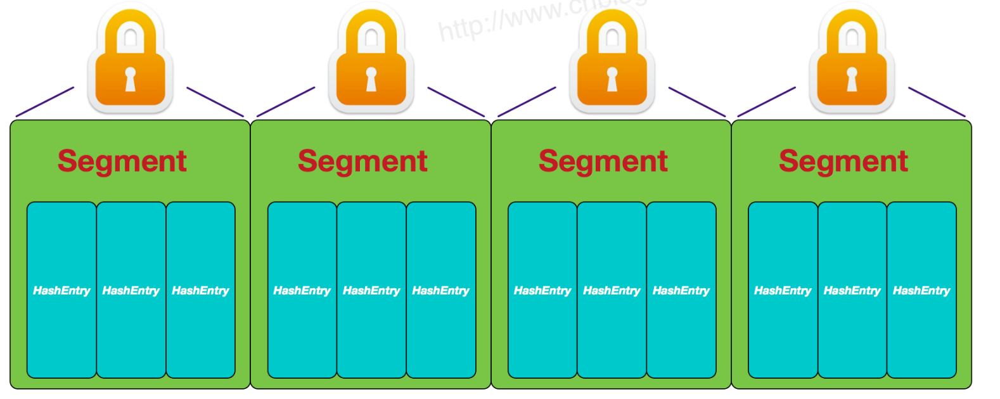
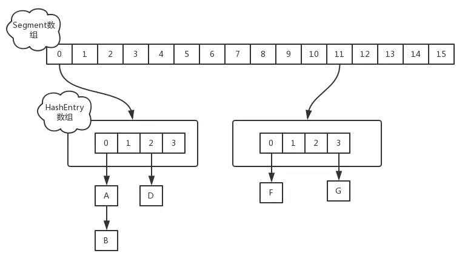
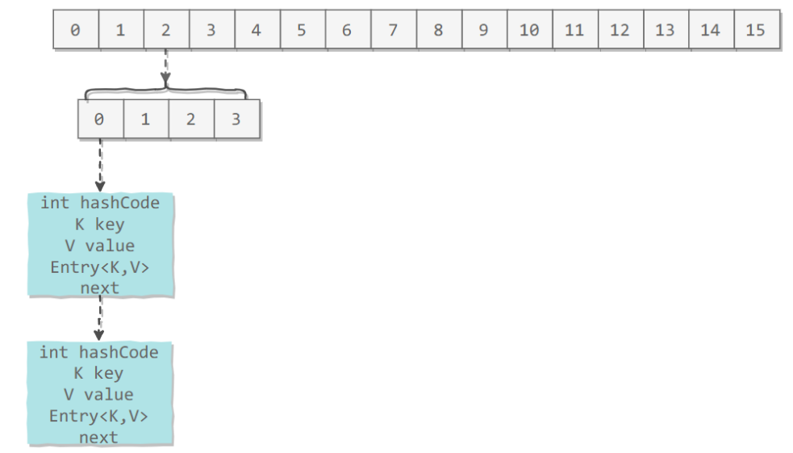
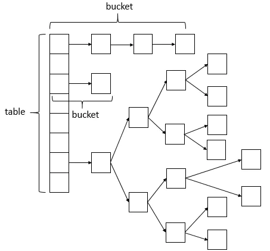

[TOC]

### ConcurrentHashMap

#### 基础

##### 1. 引入

HashMap 是线程**不安全**的。可以使用**同步容器**来保证线程安全，如 Hashtable 或者 Collections.synchronizedMap，但是都是所有涉及到多线程操作的都加上了 synchronized 关键字来锁住整个table，性能**低下**。

其实 同步容器 有很多的优化空间，锁住整个 table 这种**全表锁**的方式过于粗暴，比如在多线程的环境下，对不同的数据集进行操作时其实根本就不需要去竞争一个锁，因为他们 hash 值不同，不会因为 rehash 造成线程不安全，所以互不影响，这就是**锁分离技术**，将**锁的粒度降低**，利用**多个锁**来**控制多个小的 table**。

ConcurrentHashMap 就体现了这种思想，它同样实现了 Map 接口，也是基于**哈希表**实现。

##### 2. 特点

- 并发安全，支持高并发，**读操作完全并行**，**写操作==一定程度==并行**。
- 直接支持一些原子复合操作。
- 与**同步容器**相比，**迭代不需要加锁。**
- 具有**弱一致性**。

##### 3. 内部实现与结构

**JDK1.7 的 ConcurrentHashMap 的==分段锁==：**



**JDK1.8 的 ConcurrentHashMap（==TreeBin==: 红黑二叉树节点 ==Node==: 普通链表节点）：**


#### 源码分析JDK7

由于 Java7 基于**分段锁**实现，这里也分析一下，了解其设计思想。

##### 1. 存储结构

JDK1.7 版本中，ConcurrentHashMap 的数据结构是由一个 **Segment 数组和多个 HashEntry 数组** 构成。这种结构会经历**两次哈希计算**。



Segment 数组的意义就是将一个大的 table 分割成多个小的 table 来进行**加锁**，也就是前面提到的**锁分离技术**，而每**一个 Segment 元素存储的是 HashEntry 数组 + 链表**，这个和 HashMap 的数据存储结构一样。

```java
static final class HashEntry<K, V> {
    final int hash;
    final K key;
    volatile V value;
    volatile HashEntry<K, V> next;
}
```

ConcurrentHashMap 和 HashMap 实现上类似，最主要的差别是 ConcurrentHashMap 采用了==**分段锁（Segment）**==，每个分段锁维护着**几个桶**（HashEntry），多个线程可以同时访问==**不同分段锁**==上的桶，从而使其并发度更高（最大并发度就是 **Segment 的个数**，Segment 个数的线程可以**同时访问**）。将数据分为**多个段**，**每个段有一个独立的锁，每个段相当于一个独立的哈希表**。

采用分段技术，可以大大提高并发度，多个段之间可以**并行读写**。默认段是 **16 个**。实现的效果是**读操作可以并行**，对于**写操作需要获取锁**，不能并行。

**Segment 继承**自 **ReentrantLock**。具有**显式锁**的机制。

```java
static final class Segment<K,V> extends ReentrantLock implements Serializable {

    private static final long serialVersionUID = 2249069246763182397L;

    static final int MAX_SCAN_RETRIES =
        Runtime.getRuntime().availableProcessors() > 1 ? 64 : 1;
	// 一个Segment里面有一个HashEntry类型的数组
    transient volatile HashEntry<K,V>[] table;
	// 该segment中键值对数量
    transient int count;

    transient int modCount;

    transient int threshold;

    final float loadFactor;
}
```

ConcurrentHashMap 维护一个 segment 数组。

```java
final Segment<K,V>[] segments;
```

默认的**并发级别**为 16，也就是说默认创建 **16 个** Segment。

```java
static final int DEFAULT_CONCURRENCY_LEVEL = 16; 
```



##### 2. 初始化

ConcurrentHashMap 的初始化是会通过**位与运算**来初始化 Segment 的**大小**，用 **ssize** 来表示，如下所示

```java
int size = 1;
while(size < concurrencyLevel) {
    ++a;
    size <<= 1;
}      
```

因为 ssize 用**位于运算**来计算（  ssize <<= 1  ），所以 Segment 的**大小取值都是以 2 的 N 次方**，无关  concurrencyLevel 的取值，当然 concurrencyLevel 最大只能用 16 位的二进制来表示，即 65536，换句话说，Segment 的大小最多 **65536** 个，没有指定 concurrencyLevel 元素初始化，Segment 的大小 ssize 默认为 **16**。

每一个 Segment 元素下的 **HashEntry** 的初始化也是按照**位于运算**来计算，用 **cap** 来表示，如下所示。

```java
int cap = 1;
while(cap < c)
    cap <<= 1;
```

HashEntry 的大小也是 **2 的 N 次方**（cap <<= 1）， cap 的初始值为 1，所以 HashEntry **最小的容量为 2**。

##### 3. put操作

对于 ConcurrentHashMap 的数据插入，这里要进行**==两次 Hash==** 去定位数据的存储位置。

```java
static class Segment<K, V> extends ReentrantLock implements Serializable {
}
```

Segment 继承了 **ReentrantLock**，也就带**有锁**的功能，当执行 put 操作时，会进行**第一次 key 的 hash 来定位 Segment 的位置**，如果该 Segment **还没有初始化**，即通过 **CAS** 操作进行赋值，然后进行**第二次 hash 操作**，找到相应 **HashEntry** 的位置，这里会利用继承过来的**锁的特性**，在将数据插入指定的 HashEntry 位置时（链表的尾端），会通过继承 ReentrantLock 的 **tryLock**() 方法尝试去**获取锁**，如果**获取成功**就直接插入相应的位置，如果已经有线程获取该 Segment 的锁，那当前线程会以**自旋**的方式去继续的调用 tryLock() 方法去**获取锁**，超过指定次数就**挂起，等待唤醒**。

##### 4. get操作

ConcurrentHashMap 的 get 操作跟 HashMap 类似，只是 ConcurrentHashMap 第一次需要经过**一次 hash 定位到Segment 的位置**，然后再**第二次 hash 定位到指定的 HashEntry**，遍历该 HashEntry 下的链表进行对比，成功就返回，不成功就返回 null。

##### 5. size操作

每个 Segment 维护了一个 **count** 变量来统计该 Segment 中的**键值对个数**。

```java
/**
 * The number of elements. Accessed only either within locks
 * or among other volatile reads that maintain visibility.
 */
transient int count;
```

在执行 size 操作时，需要遍历**所有** Segment 然后把 count **累计**起来。

ConcurrentHashMap 在执行 size 操作时**先尝试不加锁**，如果**连续两次不加锁**操作得到的**结果一致**，那么可以认为这个结果是正确的。

**尝试次数**使用 **RETRIES_BEFORE_LOCK** 定义，该值为 2，retries 初始值为 -1，因此尝试次数为 3。

如果尝试的次数**超过 3 次**，就需要对**每个 Segment 加锁**。

```java
/**
 * Number of unsynchronized retries in size and containsValue
 * methods before resorting to locking. This is used to avoid
 * unbounded retries if tables undergo continuous modification
 * which would make it impossible to obtain an accurate result.
 */
static final int RETRIES_BEFORE_LOCK = 2;

public int size() {
    // Try a few times to get accurate count. On failure due to
    // continuous async changes in table, resort to locking.
    final Segment<K,V>[] segments = this.segments;
    int size;
    boolean overflow; // true if size overflows 32 bits
    long sum;         // sum of modCounts
    long last = 0L;   // previous sum
    int retries = -1; // first iteration isn't retry
    try {
        for (;;) {
            // 超过尝试次数，则对每个 Segment 加锁
            if (retries++ == RETRIES_BEFORE_LOCK) {
                for (int j = 0; j < segments.length; ++j)
                    ensureSegment(j).lock(); // force creation
            }
            sum = 0L;
            size = 0;
            overflow = false;
            for (int j = 0; j < segments.length; ++j) {
                Segment<K,V> seg = segmentAt(segments, j);
                if (seg != null) {
                    sum += seg.modCount;
                    int c = seg.count;
                    if (c < 0 || (size += c) < 0)
                        overflow = true;
                }
            }
            // 连续两次得到的结果一致，则认为这个结果是正确的
            if (sum == last)
                break;
            last = sum;
        }
    } finally {
        if (retries > RETRIES_BEFORE_LOCK) {
            for (int j = 0; j < segments.length; ++j)
                segmentAt(segments, j).unlock();
        }
    }
    return overflow ? Integer.MAX_VALUE : size;
}
```


#### 源码分析JDK8

基于 Java8。JDK1.8 的实现已经**摒弃了 Segment 的概念**，而是直接用 **==Node数组+链表+红黑树==** 的数据结构来实现，**并发控制使用 ==Synchronized 和 CAS==** 来操作，整个看起来就像是优化过且线程安全的 HashMap，虽然在 JDK1.8 中**还能看到 Segment **的数据结构，但是已经简化了属性，只是为了**兼容**旧版本。



说明：ConcurrentHashMap 的数据结构（**==数组+链表+红黑树==**），**桶中的结构可能是链表，也可能是红黑树**，红黑树是为了提高查找效率。

##### 1. 存储结构

###### (1) Node

**Node 是普通数据存储结点**。Node 是**最核心**的静态内部类，它包装了传入的 key-value 键值对。它与 HashMap 中的结点类定义很相似，但是有一些差别，它对 value 和 next 属性使用了 **==volatile== **修饰，它不允许调用 setValue 方法**直接改变** Node 的 value 域，它增加了 find 方法**辅助** map.get() 方法。

```java
static class Node<K, V> implements Map.Entry<K, V> {
    final int hash;
    final K key;
    // val和next都会在扩容时发生变化，所以加上volatile来保持可见性和禁止重排序
    volatile V val;
    volatile Node<K, V> next;

    Node(int hash, K key, V val, Node<K, V> next) {
        this.hash = hash;
        this.key = key;
        this.val = val;
        this.next = next;
    }

    public final K getKey() {
        return key;
    }

    public final V getValue() {
        return val;
    }

    /**
     * HashMap中Node类的hashCode()方法中的代码为：
     * Objects.hashCode(key) ^ Objects.hashCode(value)
     * 而Objects.hashCode(key)最终也是调用了 key.hashCode()，但是效果一样
     */
    public final int hashCode() {
        return key.hashCode() ^ val.hashCode();
    }

    public final String toString() {
        return key + "=" + val;
    }

    // 不允许直接改变value的值，抛出异常
    public final V setValue(V value) {
        throw new UnsupportedOperationException();
    }

    /**
     * HashMap使用if (o == this)，且嵌套if；ConcurrentHashMap使用&&
     */
    public final boolean equals(Object o) {
        Object k, v, u;
        Map.Entry<?, ?> e;
        return ((o instanceof Map.Entry) &&
                (k = (e = (Map.Entry<?, ?>) o).getKey()) != null &&
                (v = e.getValue()) != null &&
                (k == key || k.equals(key)) &&
                (v == (u = val) || v.equals(u)));
    }

    /**
     * 增加find方法辅助get方法 ，HashMap中的Node类中没有此方法
     */
    Node<K, V> find(int h, Object k) {
        Node<K, V> e = this;
        if (k != null) {
            do {
                K ek;
                if (e.hash == h &&
                    ((ek = e.key) == k || (ek != null && k.equals(ek))))
                    return e;
            } while ((e = e.next) != null);
        }
        return null;
    }
}
```

Node 数据结构很简单，从上可知，就是一个**链表**，但是**只允许对数据进行查找**，**不允许进行修改**。

**锁住的就是每个桶的头结点。**

###### (2) TreeNode

TreeNode **继承于 Node**，但是数据结构换成了**二叉树**结构，它是**红黑树**的数据的存储结构，当链表的节点数大于 8 时会**转换成红黑树的结构**，它就是通过 TreeNode 作为存储结构**==代替 Node== 来转换成黑红树（因为 Node 与 TreeNode 是==继承关系==，所以依然可以存放到 table 数组中）**。源代码如下：

```java
static final class TreeNode<K, V> extends Node<K, V> {

    // 树形结构的属性定义  
    TreeNode<K, V> parent;  // red-black tree links  
    TreeNode<K, V> left;
    TreeNode<K, V> right;
    TreeNode<K, V> prev;  // needed to unlink next upon deletion  
    boolean red;  // 标志红黑树的红节点  
}
```

###### (3) TreeBin

TreeBin 从字面含义中可以理解为**存储树形结构的容器**，而**树形结构**就是指 TreeNode，所以 TreeBin 就是**封装** TreeNode 的容器，它提供转换黑红树的一些条件和锁的控制。

##### 2. 基本属性

基本属性如下。

```java
// 存放node的数组,大小是2的幂次方
transient volatile Node<K, V>[] table;

// 扩容时用于存放数据的变量，扩容完成后会置为null
private transient volatile Node<K, V>[] nextTable;

// 记录容器的容量大小，通过CAS更新
private transient volatile long baseCount;

/**
 * 负数代表正在进行初始化或扩容操作 ,其中-1代表正在初始化 ,-N 表示有N-1个线程正在进行扩容操作
 * 正数或0代表hash表还没有被初始化，这个数值表示初始化或下一次进行扩容的大小，类似于扩容阈值。
 * 它的值始终是当前ConcurrentHashMap容量的0.75倍，这与loadfactor是对应的。实际容量>=sizeCtl， 
 * 则扩容。
 */
// 控制标识符
private transient volatile int sizeCtl;

// The next table index (plus one) to split while resizing.
private transient volatile int transferIndex;

/**
 * 自旋锁（锁定通过 CAS）在调整大小和/或创建 CounterCells 时使用。
 * 在CounterCell类更新value中会使用，功能类似显示锁和内置锁，性能更好
 */
private transient volatile int cellsBusy;

/**
 * counter cell表，长度总为2的幂次
 */
private transient volatile CounterCell[] counterCells;

// views
private transient KeySetView<K, V> keySet;
private transient ValuesView<K, V> values;
private transient EntrySetView<K, V> entrySet;
```

一些**静态属性**如下。

```java
// 默认初始值，必须是2的幂数    
private static final int DEFAULT_CAPACITY = 16;

// 并发级别，遗留下来的，为兼容以前的版本
private static final int DEFAULT_CONCURRENCY_LEVEL = 16;

// 负载因子
private static final float LOAD_FACTOR = 0.75f;

// 链表转树的阀值，如果table[i]下面的链表长度大于8时就转化为数
static final int TREEIFY_THRESHOLD = 8;

// 树转链表的阀值，小于等于6是转为链表，仅在扩容tranfer时才可能树转链表
static final int UNTREEIFY_THRESHOLD = 6;

// 在转变成树之前，还会有一次判断，只有键值对数量大于 64 才会发生转换
// 这是为了避免在哈希表建立初期，多个键值对恰好被放入了同一个链表中而导致不必要的转化
static final int MIN_TREEIFY_CAPACITY = 64;
```

##### 3. 初始化

**初始化**部分源码如下。

```java
/**
 * 指定容量的构造函数
 *
 * @param initialCapacity 初始化容量
 * @throws IllegalArgumentException if the initial capacity of
 *                                  elements is negative
 */
public ConcurrentHashMap(int initialCapacity) {
    if (initialCapacity < 0)
        throw new IllegalArgumentException();
    int cap = ((initialCapacity >= (MAXIMUM_CAPACITY >>> 1)) ?
               MAXIMUM_CAPACITY :
               tableSizeFor(initialCapacity + (initialCapacity >>> 1) + 1));
    this.sizeCtl = cap; // 初始化sizeCtl
}
```

传入的初始化容量如果不是 2 的幂次方，那么需要使用 tableSizeFor 进行**转换**。

```java
private static final int tableSizeFor(int c) {
    int n = c - 1;
    n |= n >>> 1;
    n |= n >>> 2;
    n |= n >>> 4;
    n |= n >>> 8;
    n |= n >>> 16;
    return (n < 0) ? 1 : (n >= MAXIMUM_CAPACITY) ? MAXIMUM_CAPACITY : n + 1;
}
```

##### 4. 添加元素

最核心的便是 **put** 方法:

```java
public V put(K key, V value) {
    return putVal(key, value, false);
}
```

最后一个参数为 onlyIfAbsent，表示只有在 key 对应的 value不 存在时才将 value 加入，所以 putVal 是 put 和putIfAbsent 两个方法的**真正实现**。整个过程跟 HashMap 有点类似，可以先参考 HashMap 的添加方法。

```java
/**
 * putVal方法可以分为以下几步：
 * 1、检查key/value是否为空，如果为空，则抛异常，否则进行2
 * 2、进入for死循环，进行3
 * 3、检查table是否初始化了，如果没有，则调用initTable()进行初始化然后进行 2，否则进行4
 * 4、根据key的hash值计算出其应该在table中储存的位置i，取出table[i]的节点用f表示。
 * 根据f的不同有如下三种情况：
 * 1）如果table[i]==null(即该位置的节点为空，没有发生碰撞)，则利用CAS操作直接存储在该位置，如果CAS操作成功则退出死循环。
 * 2）如果table[i]!=null(即该位置已经有其它节点，发生碰撞)，碰撞处理也有两种情况
 * 2.1）检查table[i]的节点的hash是否等于MOVED，如果等于，则检测到正在扩容，则帮助其扩容
 * 2.2）说明table[i]的节点的hash值不等于MOVED，如果table[i]为链表节点，则将此节点插入链表中即可
 * 如果table[i]为树节点，则将此节点插入树中即可。插入成功后，进行 5
 * 5、如果table[i]的节点是链表节点，则检查table的第i个位置的链表是否需要转化为数，如果需要则调用treeifyBin函数进行转化
 */
final V putVal(K key, V value, boolean onlyIfAbsent) {
    // key和value不允许null
    if (key == null || value == null) throw new NullPointerException();
    // 两次hash，减少hash冲突，可以均匀分布
    int hash = spread(key.hashCode());
    // i处结点标志，0: 未加入新结点, 2: TreeBin或链表结点数, 其它：链表结点数。主要用于每次加入结点后查看是否要由链表转为红黑树
    int binCount = 0;
    // CAS经典写法，不成功无限重试
    for (Node<K, V>[] tab = table; ; ) {
        Node<K, V> f;
        int n, i, fh;
        // 检查是否初始化了，如果没有，则初始化
        if (tab == null || (n = tab.length) == 0) {
            tab = initTable();
        // 这里是根据Hash求key所在的数据槽，如果该槽没有数据，则直接用CAS方式插入头结点到槽中
        } else if ((f = tabAt(tab, i = (n - 1) & hash)) == null) {
            // 将新节点插入槽中成为头结点
            if (casTabAt(tab, i, null,
                         new Node<K, V>(hash, key, value, null)))
                break;                   // no lock when adding to empty bin
            // 检查table[i]的节点的hash是否等于MOVED，如果等于则检测到正在扩容，则帮助其扩容
        } else if ((fh = f.hash) == MOVED) {
            tab = helpTransfer(tab, f);
        // table[i]的节点的hash值不等于MOVED 则说明有元素了
        } else {
            V oldVal = null;
            // 针对这个数据槽首个节点f进行加锁操作，而不是segment，进一步减少线程冲突
            synchronized (f) {
                if (tabAt(tab, i) == f) {
                    if (fh >= 0) {
                        binCount = 1;
                        // 遍历链表
                        for (Node<K, V> e = f; ; ++binCount) {
                            K ek;
                            // 如果在链表中找到值为key的节点e，直接设置e.val = value即可
                            if (e.hash == hash &&
                                ((ek = e.key) == key ||
                                 (ek != null && key.equals(ek)))) {
                                oldVal = e.val;
                                if (!onlyIfAbsent)
                                    e.val = value;
                                break;
                            }
                            // 如果没有找到值为key的节点，直接新建Node并加入链表即可
                            Node<K, V> pred = e;
                            // 插入到链表末尾并跳出循环
                            if ((e = e.next) == null) {
                                pred.next = new Node<K, V>(hash, key,
                                                           value, null);
                                break;
                            }
                        } 
                        // 如果首节点为TreeBin类型，说明为红黑树结构，执行putTreeVal操作
                    } else if (f instanceof TreeBin) {
                        Node<K, V> p;
                        binCount = 2;
                        if ((p = ((TreeBin<K, V>) f).putTreeVal(hash, key,
                                                                value)) != null) {
                            oldVal = p.val;
                            if (!onlyIfAbsent)
                                p.val = value;
                        }
                    }
                }
            }
            // 下面是判断是否转为红黑树，注意是在同步代码块之外执行的
            if (binCount != 0) {
                // 如果节点数>＝8，那么转换链表结构为红黑树结构
                if (binCount >= TREEIFY_THRESHOLD)
                    // 若length<64,直接tryPresize,两倍table.length;不转红黑树
                    treeifyBin(tab, i);
                if (oldVal != null)
                    return oldVal;
                break;
            }
        }
    }
    // 计数增加1，有可能触发transfer操作(扩容)
    addCount(1L, binCount);
    return null;
}
```

对当前的 table 进行**无条件自循环**直到 **put** 成功，可以分成以下**六步流程**来概述：

- 如果**没有初始化**就先调用 **initTable**() 方法来进行**初始化**过程。
- 如果**没有 hash 冲突**（也就是 key 对应的数据桶**还没有元素**时）就**直接 CAS 插入**。
- 如果**还在进行扩容**操作就**先进行扩容**（**辅助扩容**）。
- 如果**存在 hash 冲突**（说明 key 对应的数据桶**已有**数据链表了），就**加锁**来保证线程安全（注意这里是对单个 桶 的**头结点**进行加锁），这里有两种情况，一种是**链表形式**就直接遍历到**尾端插入**，一种是**红黑树**就按照红黑树结构**插入**。当然如果是 key 相同则进行值的**替换**。
- 最后一个如果该链表的**数量大于阈值 8**，就要先转换成**黑红树**的结构，break 再一次进入循环。
- 如果添加成功就调用 **addCount**() 方法统计 **size**，并且检查是否**需要扩容**。

###### (1) 初始化

添加元素时如果 **table 为空**或大小为 0，那么将对其进行**初始化**操作，**initTable**: 没有初始化进**行初始化**。即：

```java
if (tab == null || (n = tab.length) == 0)
    // 初始化table数组
    tab = initTable();
}
```

```java
private final Node<K,V>[] initTable() {
    Node<K,V>[] tab; int sc;
    // volatile读 table初始化成功就退出循环了
    while ((tab = table) == null || tab.length == 0) {
        // sizeCtl小于0说明其他线程正在进行初始化，    
        if ((sc = sizeCtl) < 0)
            Thread.yield(); // lost initialization race; just spin
        else if (U.compareAndSwapInt(this, SIZECTL, sc, -1)) {
            try {
                if ((tab = table) == null || tab.length == 0) {
                    int n = (sc > 0) ? sc : DEFAULT_CAPACITY;
                    Node<K, V>[] nt = (Node<K,V>[])new Node<?, ?>[n];
                    table = tab = nt;
                    // sizeCtl设为当前大小的3/4
                    sc = n - (n >>> 2);
                }
            } finally {
                sizeCtl = sc;
            }
            break;
        }
    }
    return tab;
}
```

**sizeCtl** 是 ConcurrentHashMap 的**初始化**，**扩容操作**中一个至关重要的控制变量，其声明:

```java
private transient volatile int sizeCtl;
```

其取值可能为:

- **0**：初始值。
- **-1**：**正在进行初始化**。
- **负值(小于-1)**：表示正在**进行扩容**，因为 ConcurrentHashMap 支持**多线程并行扩容**。
- **正数**：表示下一次**触发扩容**的**临界值大小**，即**当前值 * 0.75(负载因子)**。

ConcurrentHashMap 只允许**一个线程**进行**初始化**操作，当其它线程竞争失败 (sizeCtl < 0) 时便会进行**自旋**，直到**竞争成功**(初始化)线程**完成初始化**后，那么此时 table 便**不再为 null**，也就**退出了** while 循环。也就是使用 CAS 解决了**并发更新**首节点造成**数据丢失**的问题。

Thread.yield 方法用于提示 CPU 可以放弃当前线程的执行，当然这只是一个提示(hint)，这里对此方法的调用是一个优化手段。

对 SIZECTL 字段 **CAS 更新**的成功便标志者线程赢得了竞争，可以进行初始化工作了，剩下的就是一个数组的构造过程，一目了然。

###### (2) 插入槽的头结点

如果 key 对应的 bin 为**空**，说明当前槽还没有数据，那么只需要将给定的节点 **设为头结点 **即可，这里对应 putVal 源码中的下面的部分:

```java
else if ((f = tabAt(tab, i = (n - 1) & hash)) == null) {
    // 说明当前索引位置处还没有元素
    if (casTabAt(tab, i, null, new Node<K,V>(hash, key, value, null)))
        break;
}
```

这里 tabAt 是一次 volatile **读**，casTabAt 为 **CAS** 操作。这里没有 hash 冲突就直接调用 Unsafe 的方法 CAS 插入该元素。

注意下面的：

```java
i = (n - 1) & hash
```

就是在求 **hash 对应的数据槽索引**，这跟 HashMap 是一样的，然后用 tabAt 方法获取对应索引处的元素，并判断其是否为 null。

如果 key 对应的 bin 不为 null，那么就说明需要进行**节点添加**，从源码可以看出，这里对 bin 的**头结点**进行了**加锁操作**。这里需要**遍历整个==链表==或搜索==红黑树==以判断给定的节点(值)是否已存在，同时需要记录链表节点的个数，以决定是否需要将其转化为红黑树**。

###### (3) 转为红黑树

指 putVal 源码中的 :

```java
if (binCount != 0) {
    // 如果个数大于树化的阈值就进行树化操作
    if (binCount >= TREEIFY_THRESHOLD)
        treeifyBin(tab, i);
    if (oldVal != null)
        return oldVal;
    break;
}
```

注意，这段代码是在上述(节点添加部分)**同步代码块之外**执行的。

**TREEIFY_THRESHOLD** 表示将链表转为红黑树的**链表长度的临界值**，默认为 **8.**

###### (4) 扩容过程

如果当前 数据槽 中的个数未达到 **MIN_TREEIFY_CAPACITY**（默认 64），那么**不再转为红黑树**，转而进行**扩容**。

**tryPresize** 方法:

```java
private final void tryPresize(int size) {
    int c = (size >= (MAXIMUM_CAPACITY >>> 1)) ? MAXIMUM_CAPACITY :
        tableSizeFor(size + (size >>> 1) + 1);
    int sc;
    // volatile读，没有正在进行初始化或扩容的操作
    while ((sc = sizeCtl) >= 0) {
        Node<K,V>[] tab = table; int n;
        // 这里实际上进行了初始化工作
        if (tab == null || (n = tab.length) == 0) {
            n = (sc > c) ? sc : c;
            if (U.compareAndSwapInt(this, SIZECTL, sc, -1)) {
                try {
                    if (table == tab) {
                        Node<K,V>[] nt = (Node<K,V>[])new Node<?,?>[n];
                        table = nt;
                        sc = n - (n >>> 2);
                    }
                } finally {
                    sizeCtl = sc;
                }
            }
        }
        // 已达到最大值，无法再进行扩容
        else if (c <= sc || n >= MAXIMUM_CAPACITY)
            break;
        else if (tab == table) {
            int rs = resizeStamp(n);
            if (sc < 0) {
                // 竞争失败
                Node<K,V>[] nt;
                // 判断是否已经完成
                if ((sc >>> RESIZE_STAMP_SHIFT) != rs || sc == rs + 1 ||
                    sc == rs + MAX_RESIZERS || (nt = nextTable) == null || transferIndex <= 0)
                    break;
                if (U.compareAndSwapInt(this, SIZECTL, sc, sc + 1))
                    transfer(tab, nt);
            }
            // 竞争成功
            else if (U.compareAndSwapInt(this, SIZECTL, sc, (rs << RESIZE_STAMP_SHIFT) + 2))
                transfer(tab, null);
        }
    }
}
```

前面提到，ConcurrentHashMap 支持**==多线程并行扩容==**，具体来说，是支持**多线程将节点从老的数组拷贝到新的数组**，而**新数组创建**仍是**一个线程完成**(不然多个线程创建多个对象，最后只使用一个，这不是浪费是什么?)

**竞争成功**的线程为 **transfer** 方法的 nextTab 参数传入 null，这将导致**新数组的创建**。**竞争失败**的线程将会判断当前节点转移工作**是否已经完成**，如果已经完成，那么意味着**扩容的完成**，退出即可，如果没有完成，那么此线程将会进行**辅助转移**。

其实 helpTransfer() 方法的目的就是**调用多个**工作线程**一起帮助进行扩容**，这样的效率就会**更高**，而不是只有检查到要扩容的那个线程进行扩容操作，**其他线程就要等待扩容操作完成才能工作**。

判断是否已经完成的条件只能理解 **(nt = nextTable) == null || transferIndex <= 0** 两个。

**转移**

```java
private final void transfer(Node<K,V>[] tab, Node<K,V>[] nextTab) {
    int n = tab.length, stride;
    //1. 分片
    if ((stride = (NCPU > 1) ? (n >>> 3) / NCPU : n) < MIN_TRANSFER_STRIDE)
        stride = MIN_TRANSFER_STRIDE; // subdivide range
    // nextTab初始化，CAS保证了只会有一个线程执行这里的代码
    if (nextTab == null) {
        try {
            Node<K,V>[] nt = (Node<K,V>[])new Node<?,?>[n << 1];
            nextTab = nt;
        } catch (Throwable ex) {      // try to cope with OOME
            sizeCtl = Integer.MAX_VALUE;
            return;
        }
        nextTable = nextTab;
        transferIndex = n;
    }
    int nextn = nextTab.length;
    ForwardingNode<K,V> fwd = new ForwardingNode<K,V>(nextTab);
    boolean advance = true;
    boolean finishing = false; // to ensure sweep before committing nextTab
    for (int i = 0, bound = 0;;) {
        Node<K,V> f; int fh;
        while (advance) {
            int nextIndex, nextBound;
            // 分片的最大下标i实际上就是在这里完成减一的，因为从下面可以看出，每处理完一个桶位便将advance设为true			 
            // 从而便又进入了内层循环，但是注意，当最后一次(即bound)处理完成时，i会被再次减一，从而导致进入下面的			
            // 分支再次读取transferIndex，这就说明了转移线程会在转移完一个分片后继续尝试剩余的分片(桶位)
            if (--i >= bound || finishing)
                advance = false;
            else if ((nextIndex = transferIndex) <= 0) {
                // 所有bin均转移完毕
                i = -1;
                advance = false;
            }
            // 申请分片
            else if (U.compareAndSwapInt
                     (this, TRANSFERINDEX, nextIndex,
                      nextBound = (nextIndex > stride ? nextIndex - stride : 0))) {
                // bound表示此分片的截止(最小)下标
                bound = nextBound;
                // i表示此分片的最大下标
                i = nextIndex - 1;
                // advance意为前进，跳出内层循环
                advance = false;
            }
        }
        if (i < 0 || i >= n || i + n >= nextn) {
            // 进入这里说明所有的桶位都已被处理完毕或是被包含在某个转移线程的申请分片中(即待转移)
            int sc;
            if (finishing) {
                // 进行收尾工作，此工作一定是由最后一个分片申请线程进行的，这里用volatile写将nextTable置为null
                // table指向新数组
                nextTable = null;
                table = nextTab;
                // sizeCtl设为新数组大小的3 / 4
                sizeCtl = (n << 1) - (n >>> 1);
                return;
            }
            // 转移线程开始转移之前会将sizeCtl自增，转移完成之后自减，所以判断转移是否已经完成的方式便是sizeCtl是			  // 否等于初始值
            if (U.compareAndSwapInt(this, SIZECTL, sc = sizeCtl, sc - 1)) {
                if ((sc - 2) != resizeStamp(n) << RESIZE_STAMP_SHIFT)
                    // 还有其它线程尚未转移完成，直接退出，将收尾工作交给最后完成的那个线程
                    return;
                // 进行到这里就说明当前线程为最后一个完成的线程，有意思的是这里又将advance置为true且i置为n(原)
                // 数组的大小，作用就是最后再全部扫描一遍所有的桶位，看是否还有漏网之鱼
                finishing = advance = true;
                i = n;
            }
        }
        else if ((f = tabAt(tab, i)) == null)
            // 2.
            advance = casTabAt(tab, i, null, fwd);
        else if ((fh = f.hash) == MOVED)
            advance = true; // already processed
        else {
            synchronized (f) {
                // 3. 转移算法
                // 双重检查
                if (tabAt(tab, i) == f) {
                    Node<K,V> ln, hn;
                    if (fh >= 0) {
                        // runBit代表了当前桶位是否需要移动
                        int runBit = fh & n;
                        Node<K,V> lastRun = f;
                        // 这里是找出最后一个和头结点的移动属性相同的
                        for (Node<K,V> p = f.next; p != null; p = p.next) {
                            int b = p.hash & n;
                            if (b != runBit) {
                                runBit = b;
                                lastRun = p;
                            }
                        }
                        if (runBit == 0) {
                            ln = lastRun;
                            hn = null;
                        }
                        else {
                            hn = lastRun;
                            ln = null;
                        }
                        // 构造无需移动和需要移动的链表
                        for (Node<K,V> p = f; p != lastRun; p = p.next) {
                            int ph = p.hash; K pk = p.key; V pv = p.val;
                            if ((ph & n) == 0)
                                ln = new Node<K,V>(ph, pk, pv, ln);
                            else
                                hn = new Node<K,V>(ph, pk, pv, hn);
                        }
                        // 设置到新数组
                        setTabAt(nextTab, i, ln);
                        setTabAt(nextTab, i + n, hn);
                        // 将原数组的当前桶位设为MOVED，即已处理完(转移)
                        setTabAt(tab, i, fwd);
                        advance = true;
                    }
                    else if (f instanceof TreeBin) {
                        TreeBin<K,V> t = (TreeBin<K,V>)f;
                        TreeNode<K,V> lo = null, loTail = null;
                        TreeNode<K,V> hi = null, hiTail = null;
                        int lc = 0, hc = 0;
                        for (Node<K,V> e = t.first; e != null; e = e.next) {
                            int h = e.hash;
                            TreeNode<K,V> p = new TreeNode<K,V>
                                (h, e.key, e.val, null, null);
                            if ((h & n) == 0) {
                                if ((p.prev = loTail) == null)
                                    lo = p;
                                else
                                    loTail.next = p;
                                loTail = p;
                                ++lc;
                            }
                            else {
                                if ((p.prev = hiTail) == null)
                                    hi = p;
                                else
                                    hiTail.next = p;
                                hiTail = p;
                                ++hc;
                            }
                        }
                        ln = (lc <= UNTREEIFY_THRESHOLD) ? untreeify(lo) :
                            (hc != 0) ? new TreeBin<K,V>(lo) : t;
                        hn = (hc <= UNTREEIFY_THRESHOLD) ? untreeify(hi) :
                            (lc != 0) ? new TreeBin<K,V>(hi) : t;
                        setTabAt(nextTab, i, ln);
                        setTabAt(nextTab, i + n, hn);
                        setTabAt(tab, i, fwd);
                        advance = true;
                    }
                }
            }
        }
    }
}
```

**分片**

每个线程针对一个**分片**来进行转移操作，所谓的一个分片其实就是 **bin** 数组的**一段**。默认的最小**分片大小为 16**，如果所在机器 只有一个 CPU 核心，那么就取 16，否则取(数组大小 / 8 / CPU核心数)与 16 的较大者。

**transferIndex**

全局变量 transferIndex 表示低于此值的 bin 尚未被转移，分片的申请便是通过对此变量的 CAS 操作来完成，初始值为原数组大小，减为 0 表示 所有桶位均已转移完毕。

**ForwardingNode**

从 transfer 方法的源码可以看出，当一个**桶位**(原数组)处理完时，会将其**头结点**设置一个 ForwardingNode。简略版源码:

```java
static final class ForwardingNode<K,V> extends Node<K,V> {
    final Node<K, V>[] nextTable;
    ForwardingNode(Node<K, V>[] tab) {
        super(MOVED, null, null, null);
        this.nextTable = tab;
    }
}
```

其哈希值为 MOVED。到这里我们便可以理解 putVal 方法这部分源码的作用了:

```java
else if ((fh = f.hash) == MOVED)
    tab = helpTransfer(tab, f);
```

helpTransfer 方法的实现和 tryPresize 方法的相关代码**很像**，在此不再赘述。

==**转移算法**==

还是以**链表**为例，对于 2 的**整次幂扩容**来说，节点的转移其实只有两种情况:

- **无需转移**，即扩容前后节点的桶位**不变**。
- **扩容后的桶位号为扩容前 + 原数组的大小**（这与 Java8 的扩容情况类似），假设原数组大小为 8，扩容后为 16，有节点哈希值为 11，原先在桶位 3，那么扩容后位 3 + 8 = 11.

所以关键便在于**如何判断是否需要转移**。还是以大小 8 和 16 为例，8 的取余 mask 为：0111。而 16 的 mask 为：1111。所以只要用**哈希值 & 8**，判断结果**是否为零**即可。参考 HashMap 源码分析。

###### (5) 计数

在 **putVal** 方法的结尾通过调用 **addCount** 方法(略去大小检查、扩容部分，这里只关心计数) 进行**计数**。从而判断**是否需要**进行扩容（截取了部分）:

```java
private final void addCount(long x, int check) {
    CounterCell[] as; long b, s;
    if ((as = counterCells) != null ||
        !U.compareAndSwapLong(this, BASECOUNT, b = baseCount, s = b + x)) {
        CounterCell a; long v; int m;
        boolean uncontended = true;
        if (as == null || (m = as.length - 1) < 0 ||
            (a = as[ThreadLocalRandom.getProbe() & m]) == null ||
            !(uncontended = U.compareAndSwapLong(a, CELLVALUE, v = a.value, v + x))) {
            fullAddCount(x, uncontended);
            return;
        }
    }
}
```

**计数的关键**便是 counterCells 属性:

```java
private transient volatile CounterCell[] counterCells;
```

CounterCell 是 ConcurrentHashMap 的内部类:

```java
@sun.misc.Contended static final class CounterCell {
    volatile long value;
    CounterCell(long x) { value = x; }
}
```

Contended 注解的作用是将类的字段以 64 字节的填充行包围以解决伪共享问题。其实这里的计数方式就是**改编**自LongAdder，以最大程度地降低 **CAS** 失败空转的几率。

条件判断:

```java
if ((as = counterCells) != null || !U.compareAndSwapLong(this, BASECOUNT, b = baseCount, s = b + x)) {
    //...
}
```

非常有意思 ，如果 counterCells 为 null，那么尝试用 baseCount 进行计数，如果事实上只有**一个线程**或多个线程单竞争的频率较低，对 baseCount 的 CAS 操作并不会失败，所以可以得到结论 : **如果竞争程度较低(没有 CAS 失败)，那么其实用的是 volatile 变量 baseCount 来计数，只有当线程竞争严重(出现 CAS 失败)时才会改用 LongAdder 的方式**。

baseCount 声明如下:

```java
private transient volatile long baseCount;
```

再来看一下什么条件下会触发 **fullAddCount** 方法:

```java
if (as == null || (m = as.length - 1) < 0 || (a = as[ThreadLocalRandom.getProbe() & m]) == null ||
    !(uncontended = U.compareAndSwapLong(a, CELLVALUE, v = a.value, v + x))) {
    //...
}
```

ThreadLocalRandom.getProbe() 的返回值决定了线程和哪一个 CounterCell 相关联，查看源码可以发现，此方法返回的其实是 Thread 的下列字段的值:

```java
@sun.misc.Contended("tlr")
int threadLocalRandomProbe;
```

暂且不管这个值是怎么算出来，将其当做一个**线程唯一**的值即可。所以 fullAddCount 执行的条件是(或):

- CounterCell 数组为 null。
- CounterCell 数组大小为 0.
- CounterCell 数组线程对应的下标值为 null。
- CAS 更新线程特定的 CounterCell 失败。

##### 5. 弱一致性

ConcurrentHaspMap **迭代器**创建之后，就会按照哈希表结构遍历**读取每个元素**，但在遍历过程中，内部元素可能会因为其他线程的**写入修改发生变化**，如果变化发生在**已遍历的部分**，迭代器就**不会反映**出来，而如果变化部分发生在未遍历过的部分，迭代器就会发现并反映出来，这就是**弱一致性**。

##### 6. 总结

ConcurrentHashMap **取消了 Segment 分段锁**，**采用 CAS 和 synchronized** 来保证**并发安全**。数据结构跟 HashMap1.8 的结构类似，**数组+链表/红黑二叉树**。Java 8 在链表长度超过一定阈值（8）时将链表（寻址时间复杂度为O(N)）转换为红黑树（寻址时间复杂度为O(log(N))）。synchronized 只锁定**当前链表或红黑二叉树的首节点**，这样只要 hash 不冲突，就不会产生并发，效率又提升 N 倍。JDK 1.8 使用了 **==CAS 操作==**来支持**更高的并发度**，在 CAS **操作失败**时使用**内置锁 synchronized**。不再使用分段锁！并且 JDK 1.8 的实现也在链表过长时会转换为**红黑树**。


#### 比较

##### 1. JDK7与JDK8的比较

JDK 1.7 使用**分段锁机制**来实现并发更新操作，核心类为 **Segment**，它继承自重入锁 ReentrantLock，并发度与 Segment 数量相等。JDK1.8 版本的 ConcurrentHashMap 的数据结构已经接近 HashMap，ConcurrentHashMap 只是增加了**同步**的操作来**控制并发**，从JDK1.7版本的 **ReentrantLock+Segment+HashEntry**，到 JDK1.8 版本中**synchronized+CAS+数组+链表+红黑树**，总结如下：

1. JDK1.8 的实现**降低了锁的粒度**，JDK1.7 版本锁的粒度是**基于 Segment** 的，包含**多个 HashEntry**，而 JDK1.8 锁的粒度就是 **HashEntry**（**首节点**）。JDK1.8 版本的**数据结构变得更加简单**，使得操作也更加清晰流畅，因为已经使用 **synchronized** 来进行同步，所以不需要分段锁的概念，也就不需要 Segment 这种数据结构了，由于粒度的降低，实现的复杂度也增加了。
2. JDK1.8 使用**红黑树**来优化链表，基于长度很长的链表的遍历是一个很漫长的过程，而红黑树的遍历效率是很快的，代替一定阈值的链表。Java7 没有使用红黑树。


#### 面试题

> JDK1.8 为什么使用内置锁 **synchronized** 来代替重入锁 ReentrantLock?

- 因为**粒度降低了**，在相对而言的低粒度加锁方式，synchronized 并不比 ReentrantLock 差，在粗粒度加锁中 ReentrantLock 可能通过 Condition 来控制各个低粒度的边界所以更加的灵活，而在**低粒度**中 Condition 的优势就较低了。
- 基于的 synchronized 是一直被 JVM 不断优化的， 优化空间更大，使用内嵌的关键字比使用 API 更加自然。
- 在大量的数据操作下，对于 JVM 的内存压力，基于 API 的 ReentrantLock 会开销更多的内存，虽然不是瓶颈，但是也是一个选择依据。


#### 参考资料

- [ConcurrentHashMap源码解析](https://www.jianshu.com/p/865c813f2726)