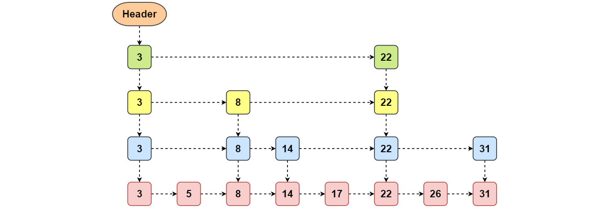

### ConcurrentSkipListMap

#### 概述

ConcurrentSkipListMap 是基于 **SkipList** 实现的，SkipList 称为**跳表**。

**特点**

- **没有使用锁**，所有操作都是**无阻塞**的，所有操作都**可以并行**，包括写，**多线程可以同时写**。
- 与 ConcurrentHashMap 类似，迭代器**不会抛出** ConcurrentModificationException，是**弱一致性**的，迭代可能反映最新修改也可能不反映。
- 实现了 ConcurrentMap 接口，支持一些原子复合操作。
- 与 TreeMap 一样可以**排序**，默认按照**键**的**自然排序**，也可以按照自定义比较器进行排序。

#### 原理分析

**跳表**是基于**链表**的，在**链表**的基础上增加了**多层索引**结构，就是**方便链表进行高效的二分查找**。

最下面一层是最基本的**单向链表**，这是一个**有序**的链表。但是普通链表不能进行直接定位，所以不能进行**二分查找**。所以为了**快速查找**，使用了**多层索引**，**高层的索引节点一定同时是底层的索引节点**。**每个索引**节点有**两个指针**，一个**向右**指向统同层的索引节点，另一个**向下**指向下一层的索引节点或者基本链表节点。

基于上述结构就可以进行**二分查找**了。复杂度是O(logN)。

#### 参考资料

- https://www.cnblogs.com/xrq730/p/5020760.html