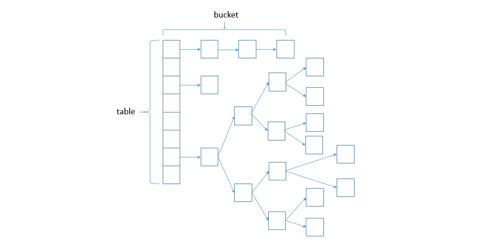

[TOC]

### 集合面试题

#### HashMap

##### Q：HashMap的数据结构？

A：**哈希表结构（数组+链表）**实现（Java7）。Java8 之后当链表长度超过 **8** 时，链表转换为**红黑树**。

##### Q：HashMap的工作原理？

A：HashMap 底层是 **hash 数组**和**单向链表**实现，数组中的每个元素都是**链表**，由 **Node 内部类（实现 Map.Entry<K,V>接口）**实现，HashMap 通过 put & get 方法存储和获取。

**存储对象**时，将 K/V 键值传给 put() 方法：1、调用 hash(K) 方法**计算 K 的 hash 值**，然后结合数组长度，计算得数组下标；2、**调整数组大小**（当容器中的元素个数大于 capacity * loadfactor 时，容器会进行扩容resize 为 2n）；3、①.如果 **K 的 hash 值**在 HashMap 中**不存在**，则执行**插入**，若存在，则发生**碰撞**；
 ② 如果 K 的 hash 值在 HashMap 中**存在**，且它们两者 **equals 返回 true**，则**更新键值对**；
 ③ 如果 K 的 hash 值在 HashMap 中**存在**，且它们两者 **equals 返回 false**，则**插入链表的尾部（尾插法）或者红黑树中（树的添加方式）**。

（**JDK 1.7** 之前使用**头插法**、**JDK 1.8** 使用**尾插法**） （注意：当碰撞导致链表大于 TREEIFY_THRESHOLD =  8 且元素个数大于 64 时，就把链表转换成红黑树）

**获取对象**时，将 K 传给 get() 方法：①、调用 hash(K) 方法（**计算 K 的 hash 值**）从而**获取该键值所在链表的数组下标**；②、顺序遍历链表，equals()方法查找**相同 Node 链表中 K 值**对应的 V 值。

hashCode 是定位的，**存储位置**；equals是定性的，**比较两者是否相等**。

##### Q：当两个对象的hashCode相同会发生什么？

A：因为 hashCode 相同，不一定就是相等的（equals 方法比较），所以两个对象所在数组的下标相同，就会发生**"哈希碰撞"**。因为 HashMap 使用**链表**存储对象，这个 Node 会存储到链表中。

##### Q：知道HashMap中hash方法的实现吗？为什么要这样实现？

A：JDK 1.8 中，是通过 hashCode() 的**==高 16 位异或低 16 位==**实现的：**(h = k.hashCode()) ^ (h >>> 16)**，主要是从速度，功效和质量来考虑的，**减少系统的开销**，也不会造成**因为高位没有参与**下标的计算，从而引起的**碰撞**。而且也是让高位和低位**都参与**哈希运算，减少哈希碰撞。

##### Q：hash方法为什么要用异或运算符？

A：保证了对象的 hashCode 的 32 位值只要有一位发生改变，整个 hash() 返回值就会改变。尽可能的**减少碰撞**。

##### Q：HashMap的table的容量如何确定？loadFactor是什么？ 该容量如何变化？这种变化会带来什么问题？

A：1、**table 数组大小**是由 **capacity** 这个参数确定的，默认是**16**，也可以构造时传入，最大限制是 1<<30；且必须为 2 的幂次方。
 2、**loadFactor 是装载因子**，主要目的是用来**确认table 数组是否需要动态扩展**，默认值是 **0.75**，比如 table 数组大小为 16，装载因子为 0.75 时，**threshold** 就是12，当 table 的实际大小超过 12 时，table 就需要**动态扩容**；
 3、扩容时，调用 resize() 方法，将 **table 长度变为原来的两倍**（注意是 **table 长度**，而不是 threshold）
 4、如果数据很大的情况下，扩展时将会带来性能的损失，在性能要求很高的地方，这种损失很可能很致命。

##### Q：HashMap和HashTable有什么区别？

A：1、**HashMap** 是线程不安全的，**HashTable** 是**线程安全**的；
 2、由于线程安全，所以 HashTable 的效率比不上 HashMap；
 3、**HashMap**最多只允许**一条记录的键为null**，允许**多条记录的值为null**，而 **HashTable** 不允许；
 4、**HashMap** 默认初始化数组的大小为**16**，**HashTable** 为 **11**，前者扩容时，扩大**两倍**，后者**扩大两倍+1**；
 5、HashMap 扩容时需要重新计算 hash 值，而 HashTable 直接使用对象的 hashCode。

##### Q：Java中的另一个线程安全的与HashMap极其类似的类是什么？同样是线程安全，它与HashTable在线程同步上有什么不同？

A：**ConcurrentHashMap** 类（是 Java并发包 java.util.concurrent 中提供的一个**线程安全且高效**的 HashMap 实现）。
 **HashTable** 是使用 **synchronize** 关键字加锁的原理（就是对**对象**加锁）； 而 **ConcurrentHashMap** 在 **JDK 1.7** 中采用 **分段锁**的方式；**JDK 1.8** 中直接采用了**CAS（无锁算法）+ synchronized**。

##### Q：HashMap&ConcurrentHashMap的区别？

A：除了**加锁**，原理上无太大区别。ConcurrentHashMap 是**线程安全**的。不过在进行扩容的时候，多余的线程会帮助进行数据转移。

另外，**HashMap 的键值对允许有 null，但是 ConCurrentHashMap 都不允许**。

##### Q：为什么ConcurrentHashMap比HashTable效率要高？

A：**HashTable** 使用**一把锁（锁住整个链表结构）**处理并发问题，多个线程竞争一把锁，容易**阻塞**；HashTable **锁的粒度太大了。**

**ConcurrentHashMap**：**JDK 1.7** 中使用**分段锁（ReentrantLock + Segment + HashEntry）**，相当于把一个 HashMap 分成多个段，每段分配一把锁，这样支持多线程访问。锁粒度：**基于 Segment**，包含多个 HashEntry。
 **JDK 1.8** 中使用 **CAS + synchronized + Node + 红黑树**。锁粒度：**Node（首结点）**（实现 Map.Entry<K,V>）。锁粒度降低了。

##### Q：Java1.7和1.8的HashMap的不同点？

A：1、JDK1.7 用的是**头插法**，而 JDK1.8 及之后使用的都是**尾插法**，那么为什么要这样做呢？因为 JDK1.7 是用单链表进行的纵向延伸，当采用头插法就是能够提高插入的效率，但是也会容易出现**逆序且环形链表死循环**问题。但是在 JDK1.8 之后是因为加入了**红黑树使用尾插法**，能够避免**出现逆序且链表死循环**的问题。

2、**扩容**后**数据存储位置**的计算方式也不一样：

① 在 JDK1.7 的时候是**直接用 hash 值**和需要扩容的二进制数进行 &（这里就是为什么扩容的时候为啥一定必须是 2 的多少次幂的原因所在，因为如果只有 2 的 n 次幂的情况时最后一位二进制数才一定是 1，这样能最大程度减少hash 碰撞）（hash 值 & length-1） 。

② 而在 JDK1.8 的时候直接用了 JDK1.7 的时候**计算的规律**，也就是扩容前的原始位置 + 扩容的大小值 = JDK1.8 的计算方式，而不再是 JDK1.7 的那种异或的方法。但是这种方式就相当于只需要判断 Hash 值的新增参与运算的位是 0 还是 1 就直接迅速计算出了扩容后的储存方式。

3、JDK1.7 的时候使用的是**数组 + 单链表**的数据结构。但是在 JDK1.8 及之后时，使用的是**数组 + 链表 + 红黑树**的数据结构（当链表的深度达到 8 的时候，也就是默认阈值，就会**自动扩容把链表转成红黑树的数据结构**来把时间复杂度从O（N）变成O（**logN**）提高了效率）。

##### Q：JDK7 HashMap多线程操作导致死循环问题？

主要原因在于**并发**下的 **Rehash** 可能会造成元素之间会**形成一个循环链表**。不过，JDK1.8 **后解决了这个问题**，但是还是不建议在多线程下使用 HashMap，因为多线程下使用 HashMap 还是会存在其他问题比如**数据丢失**。并发环境下推荐使用 ConcurrentHashMap 。

详情请查看：<https://coolshell.cn/articles/9606.html>

##### Q：构造相同Hash的字符串进行攻击，这种情况应该怎么处理？

**攻击原理：**

当客户端发送一个请求到服务器，如果该请求中带有**参数**，服务器端会将 **参数名-参数值** 作为 key-value 保存在 **HashMap** 中。如果有人恶意构造请求，在请求中加入**大量相同** hash 值的 String 参数名（key），那么在服务器端用于存储这些 key-value 对的 HashMap 会被强行退化成链表，如图：

如果数据量足够大，那么在查找，插入时会占用大量 CPU，达到拒绝服务攻击的目的。

 **怎么处理**

1. 限制 POST 和 GET 请求的参数个数。
2. 限制 POST 请求的请求体大小。
3. Web Application FireWall（WAF）。

