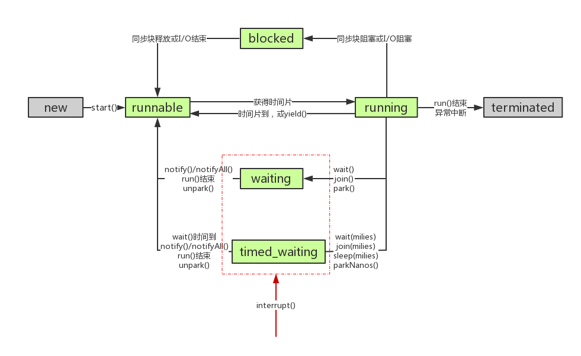

[TOC]

### 线程基础

使用多线程不是因为其能提升程序的执行速度，而是为了**更好地利用 CPU 资源**！

#### 基本概念

##### 1. 什么是上下文切换?

多线程编程中一般**线程的个数**都多于 CPU 核数，而一个 CPU 核在任意时刻只能被一个线程使用，为了让这些线程都能得到有效执行，CPU 采取的策略是为**每个线程分配时间片并轮转的形式**。当一个线程的时间片用完的时候就会重新处于就绪状态让给其他线程使用，这个过程就属于**一次上下文切换**。

**实现方式**：当前任务在执行完 CPU 时间片切换到另一个任务之前会先**保存自己的状态**，以便下次再切换回这个任务时，可以再加载这个任务的状态。**任务从保存到再加载的过程就是一次上下文切换**。

如果上下文切换过多，对系统来说就意味着消耗大量的 CPU 时间，可能造成较大的**开销**。Linux 相比其他操作系统而言其上下文切换和模式切换的时间消耗通常比较少。

> **如何减少线程上下文切换**？

线程**不是越多就越好**的，因为线程上下文切换是有**性能损耗**的，在使用多线程的同时需要考虑如何减少上下文切换。一般来说有以下几条经验：

- **无锁并发编程**。多线程竞争时，会引起上下文切换，所以多线程处理数据时，可以用一些办法来**避免使用锁**，如将数据的 ID 按照 Hash 取模分段，不同的线程处理不同段的数据。
- **CAS 算法**。Java 的 Atomic 包使用 CAS 算法来更新数据，**而不需要加锁**。
- **控制线程数量**。避免创建不需要的线程，线程别创建太多。
- **协程**。在单线程里实现多任务的调度，并在单线程里维持多个任务间的切换。协程可以看成是**用户态自管理的“线程”**。**不会参与** CPU 时间调度，没有均衡分配到时间。

- 还可以考虑应用是 **IO 密集型的还是 CPU 密集型**的。如果是 IO 密集型的话，线程可以多一些；如果是 CPU 密集型的话，线程不宜太多。

##### 2. 并发与并行

**并发：** 在**同一时间段**来看，多个任务都在执行，但是**单位时间内不一定同时**执行。指多个任务都请求运行，而单核处理器只能按受一个任务，就把这多个任务安排**轮流**进行，由于时间间隔较短让人感觉这些任务在同时运行。

**并行：** **单位时间内**，**多个任务同时执行**。有多个 CPU 时，**不同的 CPU** 同时执行不同的任务，并行就是多个任务同时运行，就是甲任务进行的同时，乙任务也在进行。


#### 任务类型

> 问题：如何设置线程数量？

需要看**任务类型**是 **CPU 密集型或者是 IO 密集型**。这个也是线程池需要考虑的配置点。

##### 1. CPU密集型

**CPU 密集型**也叫**计算密集型**，CPU 需要进行大量**计算、逻辑判断**等操作，此时系统运作大部分的状况是 **CPU 负载较高**。相反，读写 I/O(硬盘/内存) 的任务可以在很短的时间就可以完成，或者任务本身就不太需要访问 I/O 设备。也就是 **CPU 负载高，IO 负载低**。对于 CPU 密集型任务，代码运行效率至关重要。Python 这样的脚本语言运行效率很低，不适合计算密集型任务。对于计算密集型任务，最好用 C 语言编写。

CPU 密集型任务的线程数一般设置为：

**==线程数 = CPU 核数 + 1== (现代 CPU 支持超线程)  。**计算密集型别创建太多线程，只需要让**各个核**都运行起来就像，线程多了反而造成**任务切换**频繁反而会影响性能。

##### 2. IO密集型

**IO 密集型**指的是涉及到**网络、磁盘 IO** 相关的任务，这类任务的特点是 **CPU 消耗很少**，任务的大部分时间都在**等待 IO 操作完成**（因为 IO 的速度远远低于 CPU 和内存的速度）。也就是 **CPU 负载低，IO 负载高**。对于 IO 密集型任务，最合适的语言就是开发效率最高（代码量最少）的语言，脚本语言是首选，用运行速度极快的 C 语言对于运行效率也没什么提高。

IO 密集型常见场景有：访问网页、Socket 连接通信、读磁盘、一般 **Web 应用**等。

IO 密集型任务线程数一般设置为：

**线程数 = （（线程等待时间+线程 CPU 时间）/ 线程 CPU 时间 ）* CPU 数目。**


#### 线程状态转换

线程存在几种不同的**状态**。如下图所示。



##### 1. 新建（New）

**创建**后**尚未**启动。即通过 **new** 关键字创建一个线程实例之后，线程就进入了这个状态。

##### 2. 可运行（Runnable）

包含了操作系统线程状态中的 **Running** 和 **Ready**。

调用了 **start**() 方法之后变为 **Ready**，可能**马上执行**，也可能在**等待 CPU 调度**。

Running 状态，可能**正在**运行，也可能正在**等待 CPU 时间片**。

##### 3. 阻塞（Blocked）

阻塞：就是**等待锁**的状态。当一个线程试图**获取对象锁**（不是 java.util.concurrent 库中的锁，而是 **synchronized**），而该锁被其他线程持有，则该线程进入阻塞状态。使用简单，由 JVM 调度器来决定唤醒自己，而不需要由另一个线程来显式唤醒自己，不响应中断。

##### 4. 无限期等待（Waiting）

等待：当**一个线程**等待**另一个线程**通知调度器一个条件时，该线程进入**等待状态**。它的特点是**需要等待另一个线程显式地唤醒自己，实现灵活，语义更丰富，可响应中断**。例如调用：Object.wait()、Thread.join() 以及等待 Lock 或 Condition。

等待**其它**线程**显式地==唤醒==**，否则**不会**被分配 CPU 时间片。

|                      进入方法                      |                   退出方法                   |
| :------------------------------------------------: | :------------------------------------------: |
| **没有设置** Timeout 参数的 Object.**wait**() 方法 | Object.**notify**() / Object.**notifyAll**() |
|   没有设置 Timeout 参数的 Thread.**join**() 方法   |           被调用的线程**执行完毕**           |
|            LockSupport.**park**() 方法             |        LockSupport.**unpark**(Thread)        |

##### 5. 限期等待（Timed Waiting）

**无需等待**其它**线程显式**地唤醒，在一定**时间**之后会被**系统自动唤醒**。

|                       进入方法                       |                          退出方法                           |
| :--------------------------------------------------: | :---------------------------------------------------------: |
|               Thread.**sleep**() 方法                |                          时间结束                           |
| **设置**了 **Timeout** 参数的 Object.**wait**() 方法 | 时间**结束** / Object.**notify**() / Object.**notifyAll**() |
| **设置**了 **Timeout** 参数的 Thread.**join**() 方法 |             时间结束 / 被调用的线程**执行完毕**             |
|           LockSupport.**parkNanos**() 方法           |               LockSupport.**unpark**(Thread)                |
|           LockSupport.**parkUntil**() 方法           |               LockSupport.**unpark**(Thread)                |

##### 6. 终结（Terminated）

可以是线程结束任务之后**自己结束**，或者产生了**异常**而结束。

##### 7. 问题总结

**睡眠和挂起**是用来描述**行为**，而**阻塞和等待**用来描述**状态**。

> **sleep与wait的区别？**

- 两者**最主要**的区别在于：**sleep 方法没有释放锁，而 wait 方法释放了锁**（释放了别的线程才能拿到锁）。

- **所属对象**：sleep 是 **Thread 类**的一个方法，而 wait 是属于 **Object 类**的方法。

- **功能**：两者都可以**暂停**线程的执行。wait 通常用于**线程间交互/通信**，sleep 通常用于**暂停执行**。

- **特点**：wait() 方法被调用后，线程**不会自动苏醒**，需要别的线程调用同一个对象上的 notify() 或者 notifyAll() 方法。sleep() 方法执行完成后，线程**会自动苏醒**。或者可以使用 wait(long timeout)超时后线程会自己唤醒。调用 Thread.**sleep**() 方法使线程进入限期等待状态时，常常用“**使一个线程睡眠**”进行描述。调用 Object.**wait**() 方法使线程进入限期等待或者无限期等待时，常常用“**挂起一个线程”**进行描述。

> **阻塞与等待的区别？**

**阻塞**状态是**等待锁**。**等待**状态是等待**被唤醒**，或者等**时间到。**

**阻塞和等待**的区别在于，**==阻塞是被动==**的，它是在等待获取一个**排它锁**。而**==等待是主动==**的，通过调用 Thread.**sleep**() 和 Object.wait() 等方法进入。注意调用 **sleep 方法是不会进入阻塞**的，因为阻塞是等待获取锁，而 sleep 已经有锁了，所以 sleep 是进入等待状态。

> **锁与阻塞和等待的联系**？

虽然 synchronized 和 JUC 里的 Lock 都有锁的功能，但线程进入的**状态**是**不一样**的。**synchronized 会让线程进入==阻塞==态，而 JUC 里的 Lock 是用 LockSupport.park()/unpark() 来实现阻塞/唤醒的，会让线程进入==等待态==**。虽然等锁时进入的状态不一样，但被唤醒后又都进入 runnable 态，从行为效果来看又是一样的。

虽然 synchronized 和 JUC 里的 Lock 都有锁的功能，但线程进入的**状态**是**不一样**的。**synchronized 会让线程进入==阻塞态==，而 JUC 里的 Lock 是用 LockSupport.park()/unpark() 来实现阻塞/唤醒的，会让线程进入==等待态==**。虽然等锁时进入的状态不一样，但被唤醒后又都进入 runnable 态，从行为效果来看又是一样的。


#### 创建与开启线程

创建与使用线程的方法：

- 继承 **Thread** 类。
- 实现 **Runnable** 接口。
- 实现 **Callable** 接口。
- 使用**线程池**。

实现 Runnable 和 Callable 接口的类只能当做一个可以在线程中运行的**任务**，不是真正意义上的线程，因此最后还需要**通过 Thread 来调用**。可以说任务是通过线程驱动从而执行的。

##### 1. 继承Thread类

新的类需要**继承** Thread 类，并实现 **run**() 方法，因为 Thread 类**实现了 Runable 接口**。当调用 start() 方法启动一个线程时，虚拟机会将该线程放入**就绪队列**中等待**被调度**，当一个线程被调度时会执行该线程的 run() 方法。但是就**不能再继承**其他类了。

```java
public class MyThread extends Thread {
    public void run() {
        // ...
    }
}
```

```java
public static void main(String[] args) {
    MyThread mt = new MyThread();
    mt.start();
}
```

##### 2. 实现Runnable接口

需要实现 **run**() 方法。**没有返回值**。Runnable 接口是函数式接口，多用 Lambda。需要通过 Thread 调用 **start**() 方法来启动线程。

```java
public class MyRunnable implements Runnable {
    @Override
    public void run() {
        // ...
    }
}
```

```java
public static void main(String[] args) {
    MyRunnable instance = new MyRunnable();
    // 传入接口方法
    Thread thread = new Thread(instance);
    thread.start();
}
```

##### 3. 实现Callable接口

与 Runnable 相比，Callable **可以有==返回值==**，返回值通过 **FutureTask** 进行封装。

```java
public class MyCallable implements Callable<Integer> {
    public Integer call() {
        return 123;
    }
}
```

```java
public static void main(String[] args) 
    throws ExecutionException, InterruptedException {	
	// 构造任务
    MyCallable mc = new MyCallable();
    // 通过FutureTask封装
    FutureTask<Integer> ft = new FutureTask<>(mc);
    // 执行任务
    new Thread(ft).start();
    System.out.println(ft.get());
}
```

##### 4. 使用线程池

阿里推荐创建线程用自定义线程池，可以便于资源控制，详见线程池部分。

##### 5. 方法对比

对于继承类和实现接口而言，实现**接口**会更好一些，因为：

- Java 不支持多重继承，因此继承了 Thread 类就无法继承其它类，但是可以实现多个接口；
- 类可能只要求可执行就行，继承整个 Thread 类开销过大。

如果需要有**返回结果**，则使用 Callable。

当然创建线程还是鼓励**自定义线程池**（阿里规范）。


#### 线程基本属性与方法

##### 1. 优先级

每个线程都具有各自的**优先级**，如果有多个线程处于就绪状态，系统会根据优先级来决定首先使哪个线程进入运行状态。但这并不意味着低优先级的线程就一定在后面运行，而只是它运行的**几率**比较小，比如垃圾回收线程的优先级就较低。

Thread 类定义了一些线程的**优先级**属性，比如

```java
// 最低优先级
public final static int MIN_PRIORITY = 1;
// 默认优先级
public final static int NORM_PRIORITY = 5;
// 最高优先级
public final static int MAX_PRIORITY = 10;
```

其中每个线程的优先级都在**Thread.MIN_PRIORITY~Thread.MAX_PRIORITY** 之间，在默认情况下其优先级都是Thread.NORM_PRIORITY。每个新产生的线程都继承了父线程的优先级，优先级不会超过线程组的优先级。线程的优先级可以使用 **setPriority**() 方法进行设置。

##### 2. start()

新开启一个线程执行其 **run**() 方法，一个线程**只能 start 一次**。主要是通过调用 **native start0()** 来实现。

```java
public synchronized void start() {
    // 判断是否首次启动
    if (threadStatus != 0)
        throw new IllegalThreadStateException();
	// 加入线程组
    group.add(this);
	
    boolean started = false;
    try {
        // 启动线程
        start0();
        started = true;
    } finally {
        try {
            if (!started) {
                group.threadStartFailed(this);
            }
        } catch (Throwable ignore) {
            /* do nothing. If start0 threw a Throwable then
                  it will be passed up the call stack */
        }
    }
}
// Native方法启动线程
private native void start0();
```

调用 **start 方法方可启动线程并使线程进入就绪状态**，而如果**直接调用 run** 方法则只是当做一个**普通方法**调用，还是在**主线程**里执行。

##### 3. run()

run() 方法是**不需要用户来调用**的，当通过 start 方法启动一个线程之后，当该线程获得了 CPU 执行时间，便进入 run 方法体去执行具体的任务。注意，继承 Thread 类必须覆写 run 方法，在 run 方法中定义具体要执行的任务。

有的**题目**套了个线程的壳子，但是**调用的是 run 方法**，而不是 start 方法，这样 run 方法只会在**主线程**执行而不是开一个线程。

##### 4. Daemon

**守护线程**是程序运行时在后台提供**服务**的线程，不属于程序中不可或缺的部分。当所有非守护线程结束时，程序也就终止，同时会杀死所有守护线程。使用 **setDaemon**() 方法将一个线程设置为**守护线程**。

```java
public static void main(String[] args) {
    Thread thread = new Thread(new MyRunnable());
    thread.setDaemon(true);	// 设置为守护线程
    // 必须在线程启动之前设置为守护线程
    thread.start();
}
```

main() 属于非守护线程。

##### 5. sleep()

Thread.**sleep**(millisec) 方法会**休眠**当前正在执行的线程，millisec 单位为**毫秒**。

sleep() 可能会抛出 **InterruptedException**，因为异常不能跨线程传播回 main() 中，因此必须在**本地**进行处理。线程中抛出的其它异常也同样需要在本地进行处理。

```java
public void run() {
    try {
        Thread.sleep(3000);
    } catch (InterruptedException e) {
        e.printStackTrace();
    }
}
```

有一点要非常注意，**==sleep 方法不会释放锁==**，也就是说如果当前线程持有对某个对象的锁，则即使调用 sleep 方法，其他线程也无法得到这个对象锁。

##### 6. yield()

对静态方法 Thread.**yield**() 的调用声明了当前线程已经完成了生命周期中最重要的部分，可以**切换**给其它线程来执行。该方法只是对线程调度器的一个**建议**，而且也只是建议其它线程可以运行。

```java
public void run() {
    Thread.yield();
}
```

调用 yield 方法会让当前线程**交出 CPU 权限**，让 CPU 去执行其他的线程。**它跟 sleep 方法类似，同样==不会释放锁==**。但是 yield 不能控制具体的交出 CPU 的时间，另外，yield 方法只能让拥有**相同优先级**的线程有获取 CPU 执行时间的机会。

注意，调用 yield 方法并**不会让线程进入阻塞状态**，而是让线程**重回就绪状态**，它只需要等待重新获取 CPU 执行时间。

##### 7. join()

thread.join 的含义是**当前线程**需要等待 previousThread 线程终止之后才从 thread.join 返回。简单来说，就是线程没有执行完之前，会一直阻塞在 join 方法处。所以可以用来保证线程的**顺序性**的。

join 方法有三个重载版本：

```java
public final void join();
public final synchronized void join(long millis);	// 参数为毫秒
// 第一参数为毫秒，第二个参数为纳秒
public final synchronized void join(long millis, int nanos);
```

第一个方法很简单，就是调用了第二个方法：

```java
public final void join() throws InterruptedException {
    join(0);
}
```

**join**() 实际是调用了 Object类的 **wait**()，只不过它**不用等待 notify()/notifyAll()**（因为 join 方法在调用 wait 方法时都设置了超时参数）。它结束的条件是：1）等待**时间到**；2）目标线程已经 **run 完**（通过 isAlive() 来判断）。

```java
public final synchronized void join(long millis) throws InterruptedException {
    long base = System.currentTimeMillis();
    long now = 0;

    if (millis < 0) {
        throw new IllegalArgumentException("timeout value is negative");
    }

    // 0则需要一直等到目标线程run完
    if (millis == 0) {
        while (isAlive()) {
            // wait超时参数为0
            wait(0);
        }
    } else {
        // 如果目标线程未run完且阻塞时间未到，那么调用线程会一直等待
        while (isAlive()) {
            long delay = millis - now;
            if (delay <= 0) {
                break;
            }
            // wait超时参数为delay
            wait(delay);
            now = System.currentTimeMillis() - base;
        }
    }
}
```

##### 8. suspend()/resume()

**挂起**线程，直到被 **resume**，才会**苏醒**。但调用 suspend( )的线程和调用 resume() 的线程，可能会因为**争锁的问题而发生死锁**，所以 JDK7 开始已经**不推荐**使用了。

##### 9. stop()

stop 方法**已经废弃**。不要用了。用 Thread.stop 来终止线程将**释放它已经锁定的所有监视器**（作为沿堆栈向上传播的未检查 ThreadDeath 异常的一个自然后果）。如果以前受这些监视器保护的任何对象都处于一种不一致的状态，则损坏的对象将对其他线程可见，这有可能**导致线程不安全**。


#### 线程中断

线程中断即线程运行过程中被其他线程给打断了，它与 stop 最大的区别是：stop 是由**系统强制**终止线程，而线程中断则是给**目标线程发送一个中断信号**，如果目标线程没有接收线程中断的信号并结束线程，线程则不会终止，具体是否退出或者执行其他逻辑**由目标线程**决定。

一个线程**执行完毕**之后会自动结束，如果在运行过程中**发生异常**也会提前结束。

来看下线程中断最重要的 3 个方法，它们都属于 **Thread** 类！

##### 1. interrupt()

中断目标线程，给目标线程发一个**中断信号**，线程被打上**中断标记**。源码如下。

```java
public void interrupt() {
    if (this != Thread.currentThread())
        checkAccess();

    synchronized (blockerLock) {
        Interruptible b = blocker;
        if (b != null) {
            interrupt0();           // 仅仅设置一下中断标志位
            b.interrupt(this);
            return;
        }
    }
    // 调用native方法
    interrupt0();
}
```

此操作会将线程的**中断标志位置位**，至于线程作何动作那得**线程自己决定**了。

- 如果线程因为 sleep()、wait()、join() 等处于**阻塞**状态，那么线程会**定时检查中断状态位**如果发现中断状态位为 true，则会在这些阻塞方法调用处抛出 **InterruptedException** 异常，并且在抛出异常后**立即将线程的中断状态位清除**，即重新设置为 **false**。抛出异常是为了线程**从阻塞状态醒过来**，并在结束线程前让程序员有足够的时间来**处理中断请求**。
- 如果线程正在**运行、争用** synchronized、lock() 等，那么是**不可中断**的，它们会忽略。

可以通过以下三种方式来**判断中断**：

- isInterrupted()：此方法只会读取线程的中断标志位，**并不会重置**。

- **interrupted**()：此方法读取线程的**中断标志位**，**并会重置**。

- throw InterruptException：抛出该异常的同时，会重置中断标志位。

##### 2. interrupted()

判断目标线程**是否被中断，会清除中断标记**。调用的是 native 方法并传入 true，**会清除**中断标记。注意这是一个静态方法。

源码如下：

```java
public static boolean interrupted() {
    return currentThread().isInterrupted(true);
}
```

如果一个线程的 run() 方法执行一个**无限循环**，并且没有执行 sleep() 等会抛出 InterruptedException 的操作，那么调用线程的 interrupt() 方法就**无法**使线程提前结束。

但是调用 interrupt() 方法会**设置**线程的**中断标记**，此时调用 **interrupted**() 方法会**返回 true**。因此可以在**循环体**中使用 **interrupted()** 方法来判断线程**是否处于中断状态**，从而提前结束线程。

```java
public class InterruptExample {

    private static class MyThread2 extends Thread {
        @Override
        public void run() {
            // 判断中断标志来决定是否退出循环
            while (!interrupted()) {
                // ..
            }
            System.out.println("Thread end");
        }
    }
}
```

```java
public static void main(String[] args) throws InterruptedException {
    Thread thread2 = new MyThread2();
    thread2.start();
    // 设置中断标志位，此时循环中判断中断标志位进而退出
    thread2.interrupt();	
}
```

```html
Thread end
```

##### 3. isInterrupted()

判断目标线程**是否被中断**，**会清除中断标记**。

```java
public boolean isInterrupted() {
    // 直接传入false
    return isInterrupted(false);
}

private native boolean isInterrupted(boolean ClearInterrupted);
```

##### 4. InterruptedException

通过调用一个线程的 **interrupt()** 来**中断**该线程，如果该线程处于**阻塞、限期等待或者无限期等待**状态，那么就会抛出 **InterruptedException**，从而提前结束该线程。但是**==不能==中断 I/O 阻塞和 synchronized 锁阻塞**。

**interrupt() 方法不会抛出 InterruptedException异常**！InterruptedException 异常是由一些**引起阻塞的方法**抛出的！！并且，这些方法抛出异常后会重新把**中断标志修改**为 **true**！！！

|              方法              |                             说明                             |
| :----------------------------: | :----------------------------------------------------------: |
|  public final void **join**()  | 如果任何线程**中断**了当前线程。当抛出该异常时，当前线程的中断状态**被清除** |
| public static void **sleep**() | 如果任何线程中断了当前线程。当抛出该异常时，当前线程的中断状态**被清除** |
|  public final void **wait**()  | 如果在当前线程等待通知之前或者正在等待通知时，任何线程**中断**了当前线程。在抛出此异常时，当前线程的中断**状态被清除** |

以下代码在 main() 中启动一个线程之后再**中断**它，由于线程中调用了 Thread.**sleep**() 方法，因此会抛出一个 **InterruptedException**，从而提前结束线程，不执行之后的语句。

```java
public class InterruptExample {

    private static class MyThread1 extends Thread {
        @Override
        public void run() {
            try {
                Thread.sleep(2000);
                System.out.println("Thread run");
            } catch (InterruptedException e) {
                e.printStackTrace();
            }
        }
    }
}
```

```java
public static void main(String[] args) throws InterruptedException {
    Thread thread1 = new MyThread1();
    thread1.start();
    thread1.interrupt();
    System.out.println("Main run");
}
```

```html
Main run
java.lang.InterruptedException: sleep interrupted
    at java.lang.Thread.sleep(Native Method)
    at InterruptExample.lambda$main$0(InterruptExample.java:5)
    at InterruptExample$$Lambda$1/713338599.run(Unknown Source)
    at java.lang.Thread.run(Thread.java:745)
```

##### 5. 中断使用场景

中断常见的使用场景有以下几个：

- 点击某个桌面应用中的**取消**按钮时；
- 某个操作超过了一定的执行**时间限制需要中止**时；
- 多个线程做**相同的**事情，只要一个线程**成功**其它线程**都可以取消**时；
- 一组线程中的一个或多个出现错误**导致整组都无法继续**时；
- 当一个**应用或服务需要停止**时。

##### 6. 中断使用demo

###### (1) demo1

```java
private static void test1() {
	Thread thread = new Thread(() -> {
		while (true) {
			Thread.yield();
		}
	});
	thread.start();
    // 发送中断信号
	thread.interrupt();
}
```

这个线程**不会被中断**，因为虽然给线程发出了**中断信号**，但程序中**并没有响应中断信号的逻辑**，所以程序不会有任何反应。

###### (2) demo2

```java
private static void test2() {
	Thread thread = new Thread(() -> {
		while (true) {
			Thread.yield();
			// 加入中断标志位判断
			if (Thread.currentThread().isInterrupted()) {
				System.out.println("Java技术栈线程被中断，程序退出。");
				return;
			}
		}
	});
	thread.start();
    // 发送中断信号
	thread.interrupt();
}
```

此时线程中加上了**响应中断的逻辑**，程序接收到**中断信号**打印出信息后返回退出。

###### (3) demo3

```java
private static void test3() throws InterruptedException {
	Thread thread = new Thread(() -> {
		while (true) {
			// 响应中断
			if (Thread.currentThread().isInterrupted()) {
				System.out.println("线程被中断程序退出");
				return;
			}

			try {
				Thread.sleep(3000);
			} catch (InterruptedException e) {
				System.out.println("线程休眠被中断程序退出");
			}
		}
	});
	thread.start();
	Thread.sleep(2000);
	thread.interrupt();
}
```

sleep() 方法被中断，并输出了**线程休眠被中断程序退出**。 程序**继续运行**……为什么？为 **sleep**() 方法被**中断后会清除中断标记**，所以循环会继续运行。

###### (4) demo4

```java
private static void test4() throws InterruptedException {
	Thread thread = new Thread(() -> {
		while (true) {
			// 响应中断
			if (Thread.currentThread().isInterrupted()) {
				System.out.println("线程被中断程序退出");
				return;
			}

			try {
				Thread.sleep(3000);
			} catch (InterruptedException e) {
				System.out.println("线程休眠被中断程序退出");
                // 手动中断线程
				Thread.currentThread().interrupt();
			}
		}
	});
	thread.start();
	Thread.sleep(2000);
	thread.interrupt();
}
```

**全部**信息输出并**正常退出**，只是在 sleep() 方法被中断并清除标记后**手动重新中断当前线程并设置中断标志位**，然后程序接收中断信号返回退出。


#### 死锁

##### 1. 概述

线程死锁描述的是这样一种情况：多个线程同时被阻塞，它们中的一个或者全部都在**等待**某个资源被释放。由于线程被无限期地阻塞，因此程序不可能正常终止。

产生死锁必须具备以下**四个条件**：

1. **互斥条件**：该资源任意一个时刻**只由一个线程占用**。
2. **请求与保持条件**：一个进程因请求资源而阻塞时，对**已获得的资源保持不放**。
3. **不剥夺条件**：线程已获得的资源在末使用完之前**不能被其他线程强行剥夺**，只有自己使用完毕后才释放资源。
4. **循环等待条件**：若干进程之间形成一种头尾相接的**循环等待资源关系**。

下图所示，线程 A 持有资源 2，线程 B 持有资源 1，它们**同时都想申请对方的资源**，所以这两个线程就会**互相等待**而进入死锁状态。


下面的例子模拟了上图的死锁的情况 (代码来源于《并发编程之美》)：

```java
public class DeadLockDemo {
    private static Object resource1 = new Object(); // 资源 1
    private static Object resource2 = new Object(); // 资源 2

    public static void main(String[] args) {
        new Thread(() -> {
            // 持有资源1
            synchronized (resource1) {
                System.out.println(Thread.currentThread() + "get resource1");
                try {
                    Thread.sleep(1000);
                } catch (InterruptedException e) {
                    e.printStackTrace();
                }
                System.out.println(Thread.currentThread() + "waiting get resource2");
                // 等待1秒后才申请资源2
                synchronized (resource2) {
                    System.out.println(Thread.currentThread() + "get resource2");
                }
            }
        }, "线程 1").start();

        new Thread(() -> {
            // 持有资源2
            synchronized (resource2) {
                System.out.println(Thread.currentThread() + "get resource2");
                try {
                    Thread.sleep(1000);
                } catch (InterruptedException e) {
                    e.printStackTrace();
                }
                System.out.println(Thread.currentThread() + "waiting get resource1");
                // 等待1秒后才申请资源1
                synchronized (resource1) {
                    System.out.println(Thread.currentThread() + "get resource1");
                }
            }
        }, "线程 2").start();
    }
}
```

Output

```java
Thread[线程 1,5,main]get resource1
Thread[线程 2,5,main]get resource2
Thread[线程 1,5,main]waiting get resource2
Thread[线程 2,5,main]waiting get resource1
```

线程 A 通过 synchronized (resource1) 获得 resource1 的**监视器锁**，然后通过`Thread.sleep(1000);`让线程 A 休眠 1s 为的是让线程 B 得到执行然后来得及获取到 resource2 的监视器锁。线程 A 和线程 B 休眠结束了都开始**企图请求获取对方的资源**，然后这两个线程就会陷入**互相等待**的状态，这也就产生了死锁。

##### 2. 如何避免线程死锁?

避免死锁只要破坏产生死锁的四个条件中的其中一个就可以了。

1. **破坏互斥条件** ：这个条件我们没有办法破坏，因为我们用锁本来就是想让他们互斥的（临界资源需要互斥访问）。
2. **破坏请求与保持条件**  ：一次性申请所有的资源。
3. **破坏不剥夺条件** ：占用部分资源的线程进一步申请其他资源时，如果申请不到，可以主动释放它占有的资源。
4. **破坏循环等待条件** ：靠按序申请资源来预防。按某一顺序申请资源，释放资源则反序释放。破坏循环等待条件。

这里对线程 2 的代码进行修改，这样就不会产生死锁了。

```java
new Thread(() -> {
    synchronized (resource1) {
        System.out.println(Thread.currentThread() + "get resource1");
        try {
            Thread.sleep(1000);
        } catch (InterruptedException e) {
            e.printStackTrace();
        }
        System.out.println(Thread.currentThread() + "waiting get resource2");
        synchronized (resource2) {
            System.out.println(Thread.currentThread() + "get resource2");
        }
    }
}, "线程 2").start();
```

Output

```
Thread[线程 1,5,main]get resource1
Thread[线程 1,5,main]waiting get resource2
Thread[线程 1,5,main]get resource2
Thread[线程 2,5,main]get resource1
Thread[线程 2,5,main]waiting get resource2
Thread[线程 2,5,main]get resource2

Process finished with exit code 0
```

线程 1 首先获得到 resource1 的监视器锁,这时候线程 2 就获**取不到**了而进行等待。然后线程 1 再去获取 resource2 的监视器锁，可以获取到。然后线程 1 释放了对 resource1、resource2 的监视器锁的占用，线程 2 获取到就可以执行了。这样就**破坏了破坏循环等待**条件，因此避免了死锁。可见循环等待条件是非常容易打破的，只需要注意一下**对资源的申请顺序**就行。


