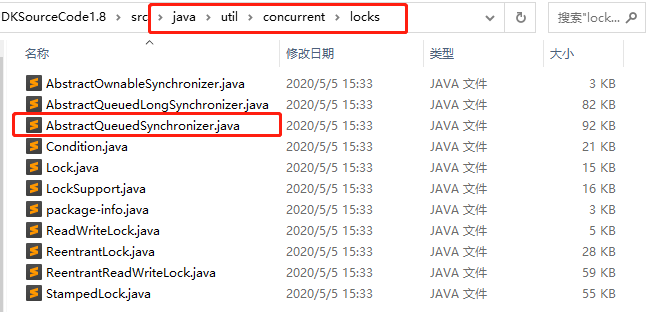
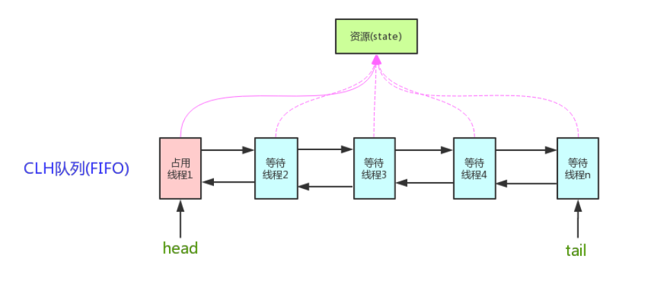
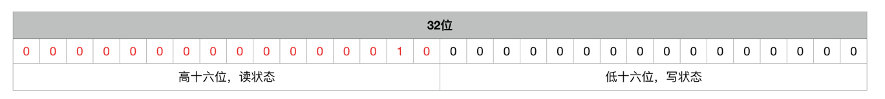
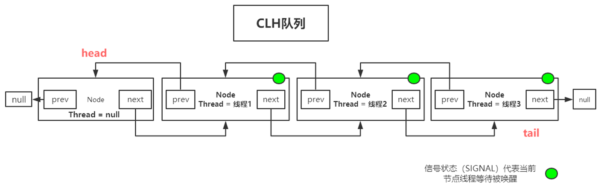
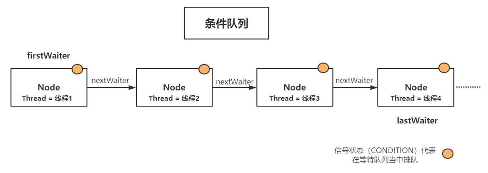
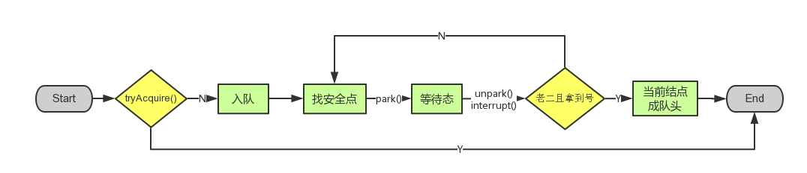

[TOC]

### JUC与AQS

#### 基础

##### 1. 概述

JUC 就是 java.util .concurrent 工具包的简称，是一个处理线程的工具包。

AQS 的全称为（**AbstractQueuedSynchronizer**），这个类在 **java.util.concurrent.locks** 包下面，AQS 是 JUC 的核心。JUC 当中的大多数**同步器**实现都是围绕着**共同的基础行为**，比如**等待队列、条件队列、独占获取、共享获取**等，而这个行为的抽象就基于 AQS 实现，AQS 定义了一套**多线程访问共享资源的同步器框架**，是一个**依赖状态(state)的同步器**。



可以看到这个包下的东西主要是上面的内容。

AQS 是一个用来**构建锁和同步器的框架**，使用 AQS 能简单且高效地构造出应用广泛的**大量的同步器**，比如ReentrantLock，Semaphore，ReentrantReadWriteLock，SynchronousQueue，FutureTask 等等皆是基于 AQS 的。利用 AQS 可以非常容易地构造出符合自己需求的**自定义同步器**。

**AQS 特性**：

- 阻塞等待队列。
- 共享/独占。
- 公平/非公平。
- 可重入。
- 允许中断。


#### AQS框架概览

**AQS 核心思想是，如果被请求的共享资源空闲，则将当前请求资源的线程设置为有效的工作线程，并且将共享资源设置为锁定状态。如果被请求的共享资源被占用，那么就需要一套线程阻塞等待以及被唤醒时锁分配的机制，这个机制 AQS 是用 CLH 队列锁实现的，即将暂时获取不到锁的线程加入到队列中。**

##### 1. Node结点

AQS 是将每条请求共享资源的**线程**封装成一个 CLH 锁队列的一个**结点**（Node）来实现锁的分配。

###### (1) 基本属性

Node 结点是 AbstractQueuedSynchronizer 中的一个**静态内部类**，是构成 **CLH 队列**的重要类。

```java
static final class Node {
    // waitStatus值，表示线程已被取消（等待超时或者被中断）
    static final int CANCELLED =  1;
    // waitStatus值，表示后继线程需要被唤醒（unpaking）
    static final int SIGNAL    = -1;
    // waitStatus值，表示结点线程等待在condition上，当被signal后，会从等待队列转移到同步到队列中 
    static final int CONDITION = -2;
    // waitStatus值，表示下一次共享式同步状态会被无条件地传播下去
    static final int PROPAGATE = -3;
    // 重要：表示当前Node结点的等待状态，包括五种状态（上面四种值+默认的初始值0）
    volatile int waitStatus;
    // 当前结点的前驱结点
    volatile Node prev;
    // 当前结点的后继结点
    volatile Node next;
    // 封装与当前结点关联的排队中的线程
    volatile Thread thread;
    // 下一个等待结点
    Node nextWaiter;

    // 是否是共享模式
    final boolean isShared() {
        return nextWaiter == SHARED;
    }
 
    // 返回前驱结点
    final Node predecessor() throws NullPointerException {
        Node p = prev;
        if (p == null)
            throw new NullPointerException();
        else
            return p;
    }

    Node() {    // Used to establish initial head or SHARED marker
    }

    Node(Thread thread, Node mode) {     // Used by addWaiter
        this.nextWaiter = mode;
        this.thread = thread;
    }

    Node(Thread thread, int waitStatus) { // Used by Condition
        this.waitStatus = waitStatus;
        this.thread = thread;
    }
}
```

本节开始讲解 AQS 的源码实现。依照 **acquire-release**、**acquireShared-releaseShared** 的**次序**来。

###### (2) 结点状态waitStatus

Node 结点是对**每一个等待获取资源的线程的封装**，其包含了**需要同步的线程本身**及其**等待状态**，如是否被阻塞、是否等待唤醒、是否已经被取消等。变量 **waitStatus** 则表示当前 Node 结点的**等待状态**，共有 **5** 种取值 CANCELLED、SIGNAL、CONDITION、PROPAGATE、0。

- **CANCELLED**(1)：表示**当前结点已取消调度**。当 timeout 或被中断（响应中断的情况下），会触发变更为此状态，进入该状态后的结点将不会再变化。
- **SIGNAL**(-1)：表示后继结点在**等待当前结点唤醒**。后继结点入队时，会将前继结点的状态更新为 SIGNAL。
- **CONDITION**(-2)：表示结点**等待在 Condition 上**，当其他线程调用了 Condition 的 **signal**() 方法后， CONDITION 状态的结点将**从等待队列转移到同步队列中**，等待获取**同步锁**。
- **PROPAGATE**(-3)：共享模式下，前继结点**不仅会**唤醒其后继结点，同时也可能会**唤醒后继的后继结点**。
- **0**：新结点入队时的默认状态。

注意，**==负值表示结点处于有效等待状态，而正值表示结点已被取消。所以源码中很多地方用 > 0、< 0来判断结点的状态是否正常==**。

##### 2. 框架核心组件

AQS 维护了一个 **==volatile int state==** 状态量（代表共享资源）和一个 **FIFO 线程等待队列（==CLH== 队列）**（多线程争用资源被**阻塞时会进入此队列**）。这里 volatile 是**核心**关键词。AQS 维护一个**共享资源 ==state==**，通过内置的 **==CLH 等待队列==（FIFO队列）** 来完成获取资源线程的**排队**工作。

AQS 是将每条请求共享资源的**线程**封装成一个 CLH 锁队列的一个**结点（Node）**来实现锁的分配。



###### (1) state状态量

AQS 使用一个 int 成员变量来表示**同步状态**，通过内置的 **FIFO 队列**来完成获取**资源线程的排队**工作。AQS 使用 **CAS** 对该**同步状态进行原子操作**实现对其值的修改。

```java
private volatile int state;    // 共享变量，使用volatile修饰保证线程可见性
```

**state 状态信息**通过 protected 类型的 **getState，setState，compareAndSetState** 进行操作与访问。

```java
// 返回同步状态的当前值
protected final int getState() {  
    return state;
}
// 设置同步状态的值
protected final void setState(int newState) { 
    state = newState;
}
// 原子地（CAS操作）将同步状态值设置为给定值update如果当前同步状态的值等于expect（期望值）
protected final boolean compareAndSetState(int expect, int update) {
    return unsafe.compareAndSwapInt(this, stateOffset, expect, update);
}
```

int 类型的 state 共 32 位，分别描述**读锁和写锁的数量**，于是将 state 变量“**按位切割**”切分成了两个部分：

- **高 16 位**表示**读锁**状态（**读锁个数**）。

- **低 16 位**表示**写锁**状态（**写锁个数**）。



###### (2) CLH队列

AQS 当中的**同步等待队列**也称 **CLH 队列**，CLH 队列是 Craig、Landin、Hagersten 三人发明的一种基于双向链表数据结构的队列，是 FIFO 先入先出线程等待队列，Java 中的 CLH 队列是原 CLH 队列的一个变种，线程由原自旋机制改为**阻塞机制**。  

CLH 队列是通过静态内部类 **Node 结点**组成的**双向链表**，每个 Node 结点维护一个 prev 引用和 next 引用，分别指向自己的**前驱和后继结点**。AQS 自身维护两个指针，分别指向队列**头部 head 和尾部 tail**。这个**队列**可以用来构建**锁**或者其他相关的**同步装置**的基础框架。



CLH 队列其实就是个**双端双向链表**。当线程**获取资源失败**（比如 tryAcquire 时试图**设置 state 状态失败**），**线程被封装并被构造**成**一个结点**加入 **CLH 队列**中（Node 结点的一个**属性**就是 Thread），同时当前**线程**会被**阻塞**在队列中（通过 **LockSupport.park** 实现，其实是**等待态**）。当持有同步状态的线程**释放同步状态**时，会**唤醒**后继结点，然后此结点线程继续加入到对同步状态的争夺中。

###### (3) 条件等待队列

Condition 是一个多线程间协调通信的工具类，使得某个或者某些线程一起等待某个条件（Condition），只有当该条件具备时，这些等待线程才会被唤醒，从而重新争夺锁。

不管是**条件队列**还是 **CLH 等待队列**，都是基于 **AQS 内部类 Node 构建**。注意：**等待队列是双向链表，而条件队列是单向链表**。条件队列里面 prev = null，next = null。

条件队列**不是必须**的 , 只有当程序中**需要** Condition 的时候**才会存在这个单向链表** , 并且可能会有**多个条件队列**。



##### 3. 资源共享方式

AQS 定义**两种资源共享方式（同步方式）**：

- **Exclusive**（独占）：只有一个线程能执行，如 ReentrantLock。又可分为公平锁和非公平锁。公平锁：按照线程在队列中的排队顺序，先到者先拿到锁。非公平锁：当线程要获取锁时，无视队列顺序直接去抢锁，谁抢到就是谁的。
- **Share**（共享）：多个线程可同时执行，如 Semaphore/CountDownLatch。Semaphore、CountDownLatch、 CyclicBarrier、ReadWriteLock 后面会讲到。

ReentrantReadWriteLock 可以看成是**组合式**，因为 ReentrantReadWriteLock 也就是读写锁允许多个线程同时对某一资源进行读。

不同的**自定义**同步器争用共享资源的方式也不同。**自定义同步器在实现时只需要实现共享资源 state 的获取与释放方式即可**，至于具体线程等待队列的维护（如获取资源失败入队/唤醒出队等），AQS 已经在**顶层**实现好了。自定义**同步器实现时主要实现以下几种方法：**

- **isHeldExclusively**()：该线程是否正在**独占**资源。只有用到 **condition** 才需要去实现它。
- **tryAcquire**(int)：**独占**方式。尝试**获取**资源，成功则返回 true，失败则返回 false。
- **tryRelease**(int)：**独占**方式。尝试**释放**资源，成功则返回 true，失败则返回 false。
- **tryAcquireShared**(int)：**共享**方式。尝试获取资源。**负数表示失败**；0 表示成功，但没有剩余可用资源；正数**表示成功**，且有剩余资源。
- **tryReleaseShared**(int)：**共享**方式。尝试释放资源，如果释放后允许唤醒后续等待结点返回 true，否则返回 false。

以 ReentrantLock 为例，**state 初始化为 0**，表示**未锁定**状态。A 线程 lock() 时，会调用 **tryAcquire**() 独占该锁并将 **state+1**。此后，其他线程再 tryAcquire() 时就会失败，直到 A 线程 unlock() 到 **state=0**（即释放锁）为止，其它线程才有机会获取该锁。当然，释放锁之前，A 线程自己是可以**重复获取此锁**的（state 会**累加**），这就是**可重入锁**的概念。但要注意，获取多少次就要释放多么次，这样才能保证 state 是能**回到零值**的。

再以 CountDownLatch 以例，任务分为 N 个子线程去执行，**state 也初始化为 N**（注意 N 要与线程个数一致）。这 N 个子线程是**并行**执行的，每个子线程执行完后 countDown() 一次，**state 会 CAS 减 1**。等到所有子线程都执行完后(即 state = 0)，会 **unpark**() 主调用线程，然后主调用线程就会从 **await**() 方法返回，继续后余动作。

这样方便使用者实现不同类型的**同步组件**，**独占式**如 ReentrantLock，**共享式**如 Semaphore，CountDownLatch，**组合式**的如 ReentrantReadWriteLock。总之，AQS 为使用提供了底层支撑，如何组装实现，使用者可以自由发挥。

一般来说，自定义同步器要么是**独占方式**，要么是**共享方式**，他们也只需实现 **tryAcquire-tryRelease、tryAcquireShared-tryReleaseShared** 中的**一种**即可（当然也有独占和共享**都有**的如 ReentrantReadWriteLock）。


#### 同步源码分析

##### 1. 独占式获取同步状态acquire(int)

此方法是**独占模式**下线程获取**共享资源**的顶层入口。如果**获取到资源**，线程**直接返回**，否则进入**等待队列**，直到获取到资源为止，且整个过程忽略中断的影响。这也正是 **lock() 的语义**，当然不仅仅只限于 lock()。获取到资源后，线程就可以去执行其临界区代码了。下面是 acquire() 的源码：

```java
public final void acquire(int arg) {
    if (!tryAcquire(arg) && acquireQueued(addWaiter(Node.EXCLUSIVE), arg)) {
        selfInterrupt();
    }
}
```

函数流程如下：

- **tryAcquire**() 尝试直接去**获取资源**，如果成功则直接返回（这里体现了**非公平锁**，每个线程获取锁时会尝试直接抢占一次，而 CLH 队列中可能还有别的线程在等待）；
- **addWaiter**() 将该线程加入**等待队列的尾部**，并标记为**独占模式**；
- **acquireQueued**() 使线程阻塞在**等待队列**中获取资源，一直获**取到资源后才返回**。如果在整个等待过程中被中断过，则返回 true，否则返回 false。
- 如果线程在等待过程中**被中断过**，它是**不响应**的。只是**获取资源后**才再进行自我中断 **selfInterrupt**()，将**中断补上**。

###### (1) tryAcquire()

此方法尝试去**获取独占资源**。如果获取成功，则直接返回 true，否则直接返回 false。这也正是 **tryLock**() 的语义，还是那句话，当然**不仅仅只限于 tryLock()**。如下是 tryAcquire() 的源码：

```java
protected boolean tryAcquire(int arg) {
    throw new UnsupportedOperationException();
}
```

什么？直接 **throw** 异常？说好的功能呢？**还记得概述里讲的 AQS 只是一个框架，具体资源的获取/释放方式交由自定义同步器去实现吗？**就是这里了！！！AQS 这里只定义了一个接口，具体资源的获取**交由自定义同步器去实现**了（**通过 state 的 get/set/CA**S）！！！至于能不能重入，能不能加塞，那就看具体的自定义同步器怎么去设计了！！！当然，自定义同步器在进行资源访问时要考虑线程安全的影响。

这里之所以没有定义成 abstract，是因为**独占模式下只用实现 tryAcquire-tryRelease**，而**共享模式下只用实现 tryAcquireShared-tryReleaseShared**。如果都定义成 abstract，那么每个模式也要去实现另一模式下的接口。

###### (2) addWaiter(Node)

此方法用于将当前线程**加入到等待队列的队尾**，并返回当前线程所在的结点。还是上源码吧：

```java
private Node addWaiter(Node mode) {
    // 将当前线程封装成Node结点，mode有两种：EXCLUSIVE（独占）和SHARED（共享）
    Node node = new Node(Thread.currentThread(), mode);
    // //尝试快速方式直接放到队尾
    Node pred = tail;
    if (pred != null) {
        // 将当前节点加入到尾部
        node.prev = pred;
        if (compareAndSetTail(pred, node)) {
            pred.next = node;
            return node;
        }
    }
    // 上一步失败则通过enq入队
    enq(node);
    return node;
}
```

enq(Node) 方法用于**将 node 加入队尾**。源码如下：。

```java
private Node enq(final Node node) {
    // CAS"自旋"，直到成功加入队尾
    for (;;) {
        Node t = tail;
        if (t == null) { // 队列为空，创建一个空的标志结点作为head结点，并将tail也指向它
            if (compareAndSetHead(new Node()))
                tail = head;
            // 正常流程，放入队尾
        } else {
            node.prev = t;
            if (compareAndSetTail(t, node)) {
                t.next = node;
                return t;
            }
        }
    }
}
```

如果看过 AtomicInteger.getAndIncrement() 函数源码，那么这段代码的精华就容易看出来。**CAS 自旋 volatile 变量**，是一种很经典的用法。

###### (3) acquireQueued(Node, int)

通过 tryAcquire() 和 addWaiter()，该线程获取资源失败，已经被放入**等待队列尾部**了。该线程下一部该干什么？**进入等待状态休息，直到其他线程彻底释放资源后唤醒自己，自己再拿到资源，然后就可以去干自己想干的事了**。没错，就是这样！是不是跟医院排队拿号有点相似~~ **acquireQueued**() 就是干这件事：**在等待队列中排队拿号（中间没其它事干可以休息），直到拿到号后再返回**。这个函数非常关键，还是上源码吧：

```java
final boolean acquireQueued(final Node node, int arg) {
    boolean failed = true;// 标记是否成功拿到资源
    try {
        boolean interrupted = false;// 标记等待过程中是否被中断过
        // 又是一个“自旋”！
        for (;;) {
            // 拿到前驱
            final Node p = node.predecessor();
            // 如果前驱是head，即该结点已成老二，那么便有资格去尝试获取资源（可能是老大释放完资源唤醒自己的，当然也可能被interrupt了）
            if (p == head && tryAcquire(arg)) {
                setHead(node);// 拿到资源后，将head指向该结点。所以head所指的标杆结点，就是当前获取到资源的那个结点或null
                p.next = null; // setHead中node.prev已置为null，此处再将head.next置为null，就是为了方便GC回收以前的head结点。也就意味着之前拿完资源的结点出队了！
                failed = false; // 成功获取资源
                return interrupted;// 返回等待过程中是否被中断过
            }

            // 如果自己可以休息了，就通过park()进入waiting状态，直到被unpark()。如果不可中断的情况下被中断了，那么会从park()中醒过来，发现拿不到资源，从而继续进入park()等待
            if (shouldParkAfterFailedAcquire(p, node) &&
                parkAndCheckInterrupt())
                interrupted = true;// 如果等待过程中被中断过，哪怕只有那么一次，就将interrupted标记为true
        }
    } finally {
        if (failed) // 如果等待过程中没有成功获取资源（如timeout，或者可中断的情况下被中断了），那么取消结点在队列中的等待
            cancelAcquire(node);
    }
}
```

先不急着总结 acquireQueued() 的函数流程，先看看 shouldParkAfterFailedAcquire() 和 parkAndCheckInterrupt() 具体干些什么。

shouldParkAfterFailedAcquire(Node, Node) 方法主要用于**检查状态**，看看自己是否真的可以去休息了（进入 **waiting** 状态），万一队列前边的线程都放弃了只是瞎站着，那也说不定，对吧！

```java
private static boolean shouldParkAfterFailedAcquire(Node pred, Node node) {
    // 拿到前驱的状态
    int ws = pred.waitStatus;
    if (ws == Node.SIGNAL)
        // 如果已经告诉前驱拿完号后通知自己一下，那就可以安心休息了
        return true;
    if (ws > 0) {
        /*
         * 如果前驱放弃了，那就一直往前找，直到找到最近一个正常等待的状态，并排在它的后边。
         * 注意：那些放弃的结点，由于被自己“加塞”到它们前边，它们相当于形成一个无引用链，稍后就会被保安大叔赶走了(GC回收)！
         */
        do {
            node.prev = pred = pred.prev;
        } while (pred.waitStatus > 0);
        pred.next = node;
    } else {
         // 如果前驱正常，那就把前驱的状态设置成SIGNAL，告诉它拿完号后通知自己一下。有可能失败，人家说不定刚刚释放完呢！
        compareAndSetWaitStatus(pred, ws, Node.SIGNAL);
    }
    return false;
}
```

整个流程中，如果前驱结点的状态**不是 SIGNAL**，那么自己就不能安心去休息，需要去找个安心的休息点，同时**可以再尝试**下看有没有机会轮到自己拿号。

parkAndCheckInterrupt() 方法。如果线程找好安全休息点后，那就可以安心去休息了。此方法就是让线程去休息，真正进入等待状态。

```java
private final boolean parkAndCheckInterrupt() {
    LockSupport.park(this);// 调用park()使线程进入waiting状态
    return Thread.interrupted();// 如果被唤醒，查看自己是不是被中断的
}
```

**park**() 会让当前线程进入 **waiting 状态**。在此状态下，有两种途径可以**唤醒该线程**：1）被 **unpark**()；2）被 **interrupt**()。需要注意的是，Thread.interrupted() 会**清除当前线程的中断标记位**。

看了 shouldParkAfterFailedAcquire() 和 parkAndCheckInterrupt()，现在让我们再回到 **acquireQueued**()，总结下该函数的具体流程：

1. 结点进入队尾后，检查状态，找到安全休息点。
2. 调用 park() 进入 waiting 状态，等待 unpark() 或i nterrupt() 唤醒自己。
3. 被唤醒后，看自己是不是有资格能拿到号。如果拿到，head 指向当前结点，并返回从入队到拿到号的整个过程中是否被中断过；如果没拿到，继续流程 1。

绕了一大圈 acquireQueued() 分析完之后，接下来再回到 **acquire**()！再贴上它的源码吧：

```java
public final void acquire(int arg) {
    if (!tryAcquire(arg) && acquireQueued(addWaiter(Node.EXCLUSIVE), arg)) {
        selfInterrupt();
    }
}
```

再来总结下它的流程吧：

1. 调用自定义同步器的 **tryAcquire**() 尝试直接去获取资源，如果成功则直接返回。
2. 没成功，则 addWaiter() 将该线程加入等待队列的**尾部**，并标记为**独占模式**。
3. acquireQueued() 使线程在等待队列中休息，有机会时（轮到自己，会被 unpark()）会去尝试获取资源。获取到资源后才返回。如果在整个等待过程中被中断过，则返回 true，否则返回 false。
4. 如果线程在等待过程中被中断过，它是不响应的。只是获取资源后才再进行自我中断 selfInterrupt()，将中断补上。

由于此函数是重中之重，再用流程图总结一下：



至此，acquire() 的流程终于算是告一段落了。这也就是 ReentrantLock.lock() 的**流程**，不信你去看其 lock() 源码吧，整个函数就是一条 **acquire**(1)！！！

##### 2. 独占式释放同步状态release()

上一小节已经把 acquire() 说完了，这一小节就来讲讲它的**反操作 release()**吧。此方法是**独占模式**下线程**释放共享资源**的顶层入口。它会释放指定量的资源，如果彻底释放了（即 state = 0）,它会**唤醒等待队列里的其他线程来获取资源**。这也正是 **unlock() 的语义**，当然不**仅仅只限于 unlock()**。下面是 release() 的源码：

```java
public final boolean release(int arg) {
    if (tryRelease(arg)) {
        // 找到头结点
        Node h = head;
        if (h != null && h.waitStatus != 0)
            // 唤醒等待队列里的下一个线程
            unparkSuccessor(h);
        return true;
    }
    return false;
}
```

逻辑并不复杂。它调用 **tryRelease**() 来**释放资源**。有一点需要注意的是，**它是根据 tryRelease() 的返回值来判断该线程是否已经完成释放掉资源了！所以自定义同步器在设计 tryRelease() 的时候要明确这一点！！**

###### (1) tryRelease(int)

此方法**尝试去释放指定量的资源**。下面是 tryRelease() 的源码：

```java
protected boolean tryRelease(int arg) {
    throw new UnsupportedOperationException();
}
```

跟 **tryAcquire**() 一样，这个方法是需要**独占模式**的**自定义同步器**去实现的。正常来说，tryRelease() 都会成功的，因为这是独占模式，该线程来释放资源，那么它肯定已经拿到独占资源了，直接**减掉**相应量的资源即可(state -= arg)，也不需要考虑线程安全的问题。但要注意它的返回值，上面已经提到了，**release() 是根据 tryRelease() 的返回值来判断该线程是否已经完成释放掉资源了！**所以自义定同步器在实现时，如果已经彻底释放资源(state = 0)，要返回 true，否则返回 false。

###### (2) unparkSuccessor(Node)

此方法用于唤醒等待队列中下一个线程。下面是源码：

```java
private void unparkSuccessor(Node node) {
    // 这里，node一般为当前线程所在的结点
    int ws = node.waitStatus;
    if (ws < 0)// 置零当前线程所在的结点状态，允许失败
        compareAndSetWaitStatus(node, ws, 0);

    Node s = node.next;// 找到下一个需要唤醒的结点s
    if (s == null || s.waitStatus > 0) {// 如果为空或已取消
        s = null;
        for (Node t = tail; t != null && t != node; t = t.prev) // 从后向前找。
            if (t.waitStatus <= 0)// 从这里可以看出，<=0的结点，都是还有效的结点。
                s = t;
    }
    if (s != null)
        LockSupport.unpark(s.thread);// 唤醒
}
```

这个函数并不复杂。一句话概括：**用 unpark() 唤醒等待队列中最前边的那个未放弃线程**，这里也用 s 来表示吧。此时，再和 acquireQueued() 联系起来，s 被唤醒后，进入 if (p == head && tryAcquire(arg)) 的判断（即使 p != head 也没关系，它会再进入 shouldParkAfterFailedAcquire() 寻找一个**安全点**。这里既然 s 已经是等待队列中最前边的那个未放弃线程了，那么通过 shouldParkAfterFailedAcquire() 的调整，s 也必然会跑到 head 的 next 结点，下一次自旋 p == head 就成立啦），然后 s 把自己设置成 head 标杆结点，表示自己已经获取到资源了，acquire() 也返回了！！And then, DO what you WANT!

release() 是**独占模式下线程释放共享资源**的顶层入口。它会释放指定量的资源，如果彻底释放了（即 state = 0）,它会唤醒等待队列里的其他线程来获取资源。

##### 3. 共享式获取同步状态acquireShared(int)

共享式：共享式地获取同步状态。对于独占式同步组件来讲，同一时刻只有一个线程能获取到同步状态，其他线程都得去排队等待，其待重写的尝试获取同步状态的方法 tryAcquire 返回值为 **boolean**，这很容易理解；对于**共享式**同步组件来讲，同一时刻可以有**多个线程同时获取到**同步状态，这也是“共享”的意义所在。其待重写的尝试获取同步状态的方法 tryAcquireShared 返回值为 **int**。

此方法是**共享模式**下线程获取**共享资源**的顶层入口。它会获取**指定量**的资源，获取成功则直接返回，获取失败则进入等待队列，直到获取到资源为止，整个过程忽略中断。下面是 acquireShared() 的源码：

```java
public final void acquireShared(int arg) {
    if (tryAcquireShared(arg) < 0)
        doAcquireShared(arg);
}
```

这里 tryAcquireShared() 依然需要**自定义同步器**去实现。但是 AQS 已经把其**返回值的语义**定义好了：

- 1.当返回值**大于 0** 时，表示获取**同步状态成功**，同时**还有剩余同步状态**可供其他线程获取；

- 2.当返回值**等于 0** 时，表示获取**同步状态成功**，但**没有可用同步状态**了；

- 3.当返回值**小于 0** 时，表示获取**同步状态失败**。

所以这里 acquireShared() 的流程就是：

- **tryAcquireShared**() 尝试获取资源，成功则直接返回；
- 失败则通过 doAcquireShared() 进入**等待队列**，**直到**获取到资源为止才返回。

###### (1) doAcquireShared(int)

此方法用于将当前线程加入**等待队列尾部**休息，直到其他线程释放资源唤醒自己，自己成功拿到相应量的资源后才返回。下面是 doAcquireShared() 的源码：

```java
private void doAcquireShared(int arg) {
    final Node node = addWaiter(Node.SHARED);// 加入队列尾部
    boolean failed = true;// 是否成功标志
    try {
        boolean interrupted = false;// 等待过程中是否被中断过的标志
        for (;;) {
            final Node p = node.predecessor();// 前驱
            // 如果到head的下一个，因为head是拿到资源的线程，此时node被唤醒，很可能是head用完资源来唤醒自己的
            if (p == head) {
                int r = tryAcquireShared(arg);// 尝试获取资源
                if (r >= 0) {// 成功
                    setHeadAndPropagate(node, r);// 将head指向自己，还有剩余资源可以再唤醒之后的线程
                    p.next = null; // help GC
                    if (interrupted)// 如果等待过程中被打断过，此时将中断补上。
                        selfInterrupt();
                    failed = false;
                    return;
                }
            }

            // 判断状态，寻找安全点，进入waiting状态，等着被unpark()或interrupt()
            if (shouldParkAfterFailedAcquire(p, node) &&
                parkAndCheckInterrupt())
                interrupted = true;
        }
    } finally {
        if (failed)
            cancelAcquire(node);
    }
}
```

有木有觉得跟 acquireQueued() 很**相似**？对，其实流程并没有太大区别。只不过这里将补中断的 selfInterrupt() 放到 doAcquireShared() 里了，而独占模式是放到 acquireQueued() 之外。

跟独占模式比，还有一点需要注意的是，这里只有线程是 **head.next** 时（“老二”），才会去尝试获取资源，有剩余的话还会唤醒之后的队友。那么问题就来了，假如老大用完后释放了 5 个资源，而老二需要 6 个，老三需要 1 个，老四需要 2 个。老大先唤醒老二，老二一看资源不够，他是把资源让给老三呢，还是不让？答案是否定的！老二会继续 **park**() 等待其他线程释放资源，也更不会去唤醒老三和老四了。独占模式，同一时刻只有一个线程去执行，这样做未尝不可；但**共享模式下，多个线程是可以同时执行**的，现在因为老二的资源需求量大，而把后面量小的老三和老四也都卡住了。当然，这并不是问题，只是 AQS 保证严格按照**入队顺序唤醒**罢了（保证公平，但降低了并发）。

###### (2) setHeadAndPropagate(Node, int)

```java
private void setHeadAndPropagate(Node node, int propagate) {
    Node h = head; 
    setHead(node);// head指向自己
     // 如果还有剩余量，继续唤醒下一个邻居线程
    if (propagate > 0 || h == null || h.waitStatus < 0) {
        Node s = node.next;
        if (s == null || s.isShared())
            doReleaseShared();
    }
}
```

此方法在 setHead() 的基础上多了一步，就是自己苏醒的同时，如果条件符合（比如还有剩余资源），还会去**唤醒后继结点**，毕竟是共享模式！

doReleaseShared() 留着下一小节的 releaseShared() 里来讲。

OK，至此，acquireShared() 也要告一段落了。让我们再梳理一下它的流程：

- **tryAcquireShared**() 尝试获取资源，成功则直接返回；
- 失败则通过 **doAcquireShared**() 进入**等待队列 park()**，直到被 unpark()/interrupt() 并成功获取到资源才返回。整个等待过程也是**忽略中断**的。

其实跟 **acquire**() 的流程大同小异，只不过多了个**自己拿到资源后，还会去唤醒后继队友的操作（这才是共享嘛）**。

##### 4. 共享式释放同步状态releaseShared()

上一小节已经把 acquireShared() 说完了，这一小节就来讲讲它的**反操作 releaseShared()** 吧。此方法是**共享模式下线程释放共享资源**的顶层入口。它会释放指定量的资源，如果成功释放且允许唤醒等待线程，它会唤醒等待队列里的其他线程来获取资源。下面是 releaseShared() 的源码：

```java
public final boolean releaseShared(int arg) {
    if (tryReleaseShared(arg)) {// 尝试释放资源
        doReleaseShared();// 唤醒后继结点
        return true;
    }
    return false;
}
```

此方法的流程也比较简单，一句话：释放掉资源后，唤醒后继。跟独占模式下的 **release**() 相似，但有一点稍微需要注意：独占模式下的 tryRelease() 在完全释放掉资源（state = 0）后，才会返回 true 去唤醒其他线程，这主要是基于独占下可重入的考量；而共享模式下的 releaseShared() 则没有这种要求，共享模式实质就是控制一定量的线程并发执行，那么拥有资源的线程在释放掉部分资源时就可以唤醒后继等待结点。例如，资源总量是 13，A（5）和 B（7）分别获取到资源并发运行，C（4）来时只剩 1 个资源就需要等待。A 在运行过程中释放掉 2 个资源量，然后 tryReleaseShared(2) 返回 true 唤醒C，C 一看只有 3 个仍不够继续等待；随后 B 又释放 2 个，tryReleaseShared(2) 返回 true 唤醒 C，C 一看有 5 个够自己用了，然后 C 就可以跟 A 和 B 一起运行。而 ReentrantReadWriteLock 读锁的 tryReleaseShared() 只有在完全释放掉资源（state = 0）才返回 true，所以自定义同步器可以根据需要决定 tryReleaseShared() 的返回值。

###### (1) doReleaseShared()

此方法主要用于唤醒后继。下面是它的源码：

```java
private void doReleaseShared() {
    for (;;) {
        Node h = head;
        if (h != null && h != tail) {
            int ws = h.waitStatus;
            if (ws == Node.SIGNAL) {
                if (!compareAndSetWaitStatus(h, Node.SIGNAL, 0))
                    continue;
                unparkSuccessor(h);// 唤醒后继
            }
            else if (ws == 0 &&
                     !compareAndSetWaitStatus(h, 0, Node.PROPAGATE))
                continue;
        }
        if (h == head)// head发生变化
            break;
    }
}
```

本节我们详解了**独占和共享**两种模式下获取-释放资源(acquire-release、acquireShared-releaseShared)的源码，相信大家都有一定认识了。值得注意的是，acquire() 和 acquireShared() 两种方法下，**线程在等待队列中都是忽略中断**的。AQS 也**支持响应中断**的，**acquireInterruptibly()/acquireSharedInterruptibly()** 即是，相应的源码跟 acquire() 和 acquireShared() 差不多，这里就不再详解了。


#### AQS与模板方法模式

AQS 同步器的设计是**基于模板方法模式**的，如果需要自定义同步器一般的方式是这样（模板方法模式很经典的一个应用）：

1. 使用者**继承 AbstractQueuedSynchronizer** 并覆写指定的方法。（这些重写方法很简单，无非是对于共享资源 state 的获取和释放）。
2. 将 AQS 组合在自定义同步组件的实现中，并调用其**模板方法**，而这些模板方法会调用使用者重写的方法。

这和以往通过实现接口的方式有很大区别，这是模板方法模式很经典的一个运用。

**AQS 使用了模板方法模式，自定义同步器时需要覆写下面几个 AQS 提供的模板方法：**

```java
// 独占式获取同步状态，试着获取，成功返回true，反之为false
protected boolean tryAcquire(int arg);
// 独占式释放同步状态，等待中的其他线程此时将有机会获取到同步状态
protected boolean tryRelease(int arg);
// 共享式获取同步状态，返回值大于等于0，代表获取成功；反之获取失败
protected int tryAcquireShared(int arg);
// 共享式释放同步状态，成功为true，失败为false
protected boolean tryReleaseShared(int arg);
// 是否在独占模式下被线程占用
protected boolean isHeldExclusively();
```

> **使用方式**

首先需要继承 AbstractQueuedSynchronizer 这个类，然后根据需求去**重写**相应的方法，比如要实现一个**独占锁**，那就去重写 **tryAcquire**，**tryRelease** 方法，要实现**共享锁**，就去重写 **tryAcquireShared**，**tryReleaseShared**；最后，在组件中**调用 AQS 中的模板方法**就可以了，而这些模板方法是**会调用到之前重写的那些方法**的。也就是说只需要很小的工作量就可以实现自己的**同步组件**，重写的那些方法，仅仅是一些简单的对于共享资源 **state 的获取和释放操作**，至于像是获取资源失败，线程需要阻塞之类的操作，自然是 AQS 自己完成了。

默认情况下，每个方法都抛出 **UnsupportedOperationException**。 这些方法的实现必须是内部线程安全的，并且通常应该简短而不是阻塞。AQS 类中的**其他方法都是 final** ，所以无法被其他类使用，只有这几个方法可以被其他类使用。

以 ReentrantLock 为例，state 初始化为0，表示未锁定状态。A 线程 lock() 时，会调用 tryAcquire() 独占该锁并将 state+1。此后，其他线程再 tryAcquire() 时就会失败，直到 A 线程 unlock() 到 state=0（即释放锁）为止，其它线程才有机会获取该锁。当然，释放锁之前，A 线程自己是可以重复获取此锁的（state 会累加），这就是可重入的概念。但要注意，获取多少次就要释放多么次，这样才能保证 state 是能回到零态的。

再以 CountDownLatch 以例，任务分为 N 个子线程去执行，state 也初始化为 N（注意 N 要与线程个数一致）。这 N 个子线程是并行执行的，每个子线程执行完后 countDown() 一次，state 会 CAS(Compare and Swap) 减 1。等到所有子线程都执行完后(即 state=0)，会 unpark() 主调用线程，然后主调用线程就会从 await() 函数返回，继续后余动作。

一般来说，自定义同步器要么是独占方法，要么是共享方式，他们也只需实现 tryAcquire-tryRelease、tryAcquireShared-tryReleaseShared 中的一种即可。但 AQS 也支持自定义同步器同时实现独占和共享两种方式，如ReentrantReadWriteLock。

推荐两篇 AQS 原理和相关源码分析的文章：

- http://www.cnblogs.com/waterystone/p/4920797.html
- https://www.cnblogs.com/chengxiao/archive/2017/07/24/7141160.html


#### 应用实例

##### 1. 自定义同步器Mutex(互斥锁)

下面就以 AQS 源码里的 Mutex 为例，讲一下 AQS 的简单应用。直接采用 JDK 官方文档中的小例子来说明问题。

Mutex 是一个**不可重入的互斥锁**实现。锁资源（AQS 里的 state）只有**两种状态**：**0 表示未锁定，1 表示锁定**。下边是 Mutex 的核心源码：

```java
class Mutex implements Lock, java.io.Serializable {
    // 自定义同步器
    private static class Sync extends AbstractQueuedSynchronizer {
        // 判断是否锁定状态
        protected boolean isHeldExclusively() {
            return getState() == 1;
        }

        // 尝试获取资源，立即返回。成功则返回true，否则false。
        public boolean tryAcquire(int acquires) {
            assert acquires == 1; // 这里限定只能为1个量
            if (compareAndSetState(0, 1)) {//state为0才设置为1，不可重入！
                setExclusiveOwnerThread(Thread.currentThread());//设置为当前线程独占资源
                return true;
            }
            return false;
        }

        // 尝试释放资源，立即返回。成功则为true，否则false。
        protected boolean tryRelease(int releases) {
            assert releases == 1; // 限定为1个量
            if (getState() == 0)// 既然来释放，那肯定就是已占有状态了。只是为了保险，多层判断！
                throw new IllegalMonitorStateException();
            setExclusiveOwnerThread(null);
            setState(0);	// 释放资源，放弃占有状态
            return true;
        }
    }

    // 真正同步类的实现都依赖继承于AQS的自定义同步器！
    private final Sync sync = new Sync();

    // lock<-->acquire。两者语义一样：获取资源，即便等待，直到成功才返回。
    public void lock() {
        sync.acquire(1);
    }

    // tryLock<-->tryAcquire。两者语义一样：尝试获取资源，要求立即返回。成功则为true，失败则为false。
    public boolean tryLock() {
        return sync.tryAcquire(1);
    }

    // unlock<-->release。两者语文一样：释放资源。
    public void unlock() {
        sync.release(1);
    }

    // 锁是否占有状态
    public boolean isLocked() {
        return sync.isHeldExclusively();
    }
}
```

同步类在实现时一般都将**自定义同步器（sync）定义为内部类**，供自己使用；而同步类自己（Mutex）则**实现某个接口**，对外服务。当然，接口的实现要直接依赖 sync，它们在语义上也存在某种对应关系！！而 **sync 只用实现资源 state 的获取-释放方式 tryAcquire-tryRelelase**，至于线程的排队、等待、唤醒等，上层的 AQS 都已经实现好了。

除了 Mutex，ReentrantLock/CountDownLatch/Semphore 这些同步类的实现方式都差不多，不同的地方就在**获取-释放资源的方式 tryAcquire-tryRelelase**。掌握了这点，AQS 的核心便被攻破了！

测试下这个自定义的同步器，使用并发环境下 a++ 的例子来说明问题（a++ 的原子性其实最好使用原子类 AtomicInteger 来解决，此处用 Mutex 有点大炮打蚊子的意味，好在能说明问题就好）。

```java
import java.util.concurrent.CyclicBarrier;

public class TestMutex {
    private static CyclicBarrier barrier = new CyclicBarrier(31);
    private static int a = 0;
    private static  Mutex mutex = new Mutex();

    public static void main(String []args) throws Exception {
        // 说明:我们启用30个线程，每个线程对i自加10000次，同步正常的话，最终结果应为300000；
        // 未加锁前
        for(int i = 0; i < 30;i++){
            Thread t = new Thread(new Runnable() {
                @Override
                public void run() {
                    for(int i = 0; i < 10000; i++){
                        increment1();// 没有同步措施的a++；
                    }
                    try {
                        barrier.await();// 等30个线程累加完毕
                    } catch (Exception e) {
                        e.printStackTrace();
                    }
                }
            });
            t.start();
        }
        barrier.await();
        System.out.println("加锁前，a=" + a);
        // 加锁后
        barrier.reset();// 重置CyclicBarrier
        a = 0;
        for(int i = 0; i < 30; i++){
            new Thread(new Runnable() {
                @Override
                public void run() {
                    for(int i = 0; i < 10000; i++){
                        // a++采用Mutex进行同步处理
                        increment2();
                    }
                    try {
                        barrier.await();// 等30个线程累加完毕
                    } catch (Exception e) {
                        e.printStackTrace();
                    }
                }
            }).start();
        }
        barrier.await();
        System.out.println("加锁后，a="+a);
    }
    /**
     * 没有同步措施的a++
     * @return
     */
    public static void increment1(){
        a++;
    }
    /**
     * 使用自定义的Mutex进行同步处理的a++
     */
    public static void increment2(){
        mutex.lock();
        a++;
        mutex.unlock();
    }
}
```

测试结果。

```java
加锁前，a=279204
加锁后，a=300000
```


#### 参考资料

- [AQS源码高质量分析（牛皮）](https://www.cnblogs.com/waterystone/p/4920797.html)