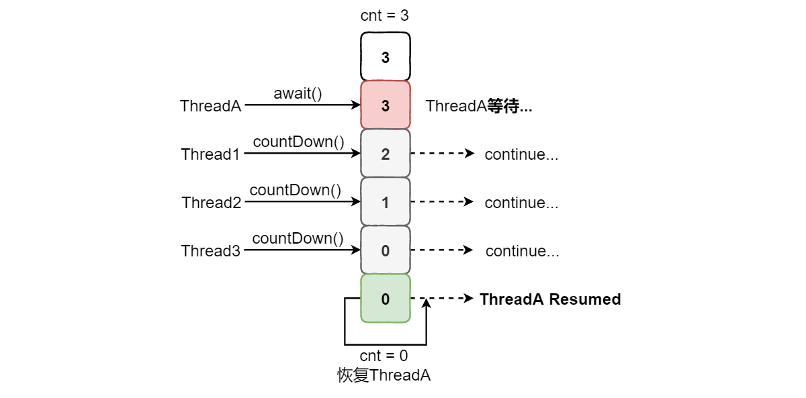
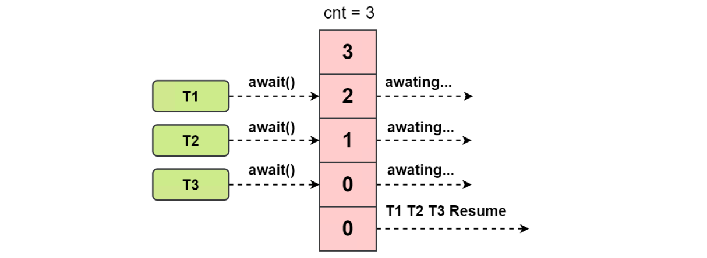
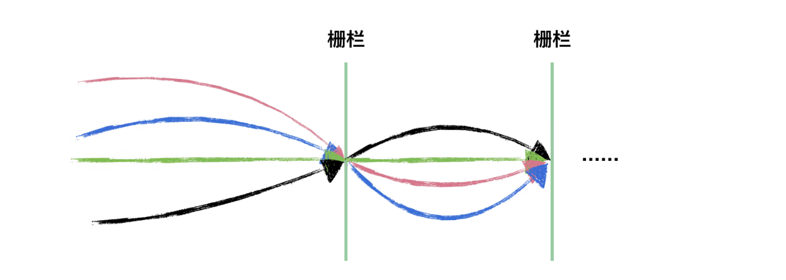
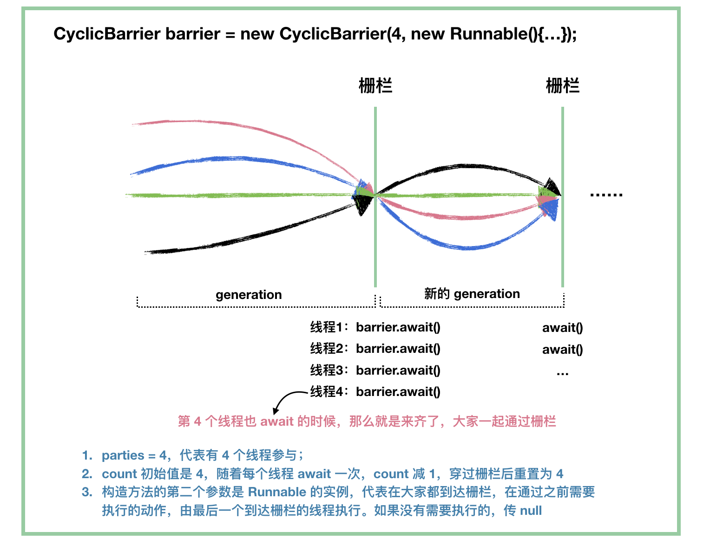
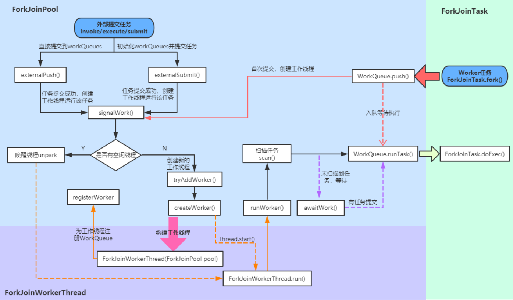

[TOC]

### 一、线程协作

#### 基础

##### 1. 场景

当多个线程可以**一起工作**去解决某个问题时，如果某些部分必须在其它部分之前完成，那么就需要对线程进行**协作**。基本场景有：

- 生产者、消费者模式
- 同时开始
- 等待结束
- 异步结果
- 集合点

##### 2. Java线程间通信

**synchronized 同步**：这种方式，本质上就是“**共享内存**”式的通信。多个线程需要访问同一个共享变量，谁拿到了**锁**（获得了访问权限），谁就可以执行。

**while 轮询的方式**：在这种方式下，线程 A 不断地改变条件，线程 ThreadB 不停地通过 while 语句检测这个条件 **(list.size()==5)** 是否成立 ，从而实现了线程间的通信。但是这种方式会浪费 CPU 资源。之所以说它浪费资源，是因为 JVM 调度器将 CPU 交给线程 B 执行时，它没做啥“有用”的工作，只是在不断地测试某个条件是否成立。就类似于现实生活中，某个人一直看着手机屏幕是否有电话来了，而不是：在干别的事情，当有电话来时，响铃通知电话来了。

**wait/notify 机制**：当条件**未满足**时，线程 A 调用 wait() 放弃 CPU，并进入阻塞状态。（不像 while 轮询那样占用 CPU）；当条件**满足**时，线程 B 调用 notify() 通知线程 A，所谓通知线程 A，就是唤醒线程 A，并让它进入可运行状态。

**管道通信**：java.io.PipedInputStream 和 java.io.PipedOutputStream 进行通信。


#### 常用协作实现

##### 1. join()

join 是 **Thead 类**的方法。在**线程**中调用**另一个线程的 join()** 方法，会将**当前**线程**挂起**，而不是忙等待，**直到目标线程结束**。

对于以下代码，虽然 b 线程先启动，但是因为在 b 线程中调用了 a **线程**的 **join**() 方法，b 线程会等待 a 线程结束才继续执行，因此最后能够保证 a 线程的输出先于 b 线程的输出。

```java
public class JoinExample {

    private class A extends Thread {
        @Override
        public void run() {
            System.out.println("A");
        }
    }

    private class B extends Thread {
        // 传入线程A的实例
        private A a;

        B(A a) {
            this.a = a;
        }

        @Override
        public void run() {
            try {
                // 等待线程A执行
                a.join();
            } catch (InterruptedException e) {
                e.printStackTrace();
            }
            System.out.println("B");
        }
    }

    public void test() {
        // 开启线程A
        A a = new A();
        // 将线程A传入线程B
        B b = new B(a);
        // 开启线程B，但是线程B需要等待线程A先执行完毕
        b.start();
        // 开启线程A
        a.start();
    }
}
```

```java
public static void main(String[] args) {
    JoinExample example = new JoinExample();
    example.test();
}
```

下面的结果即是线程 B 等待线程 A 执行完毕，才开始后续的执行。

```
A
B
```

##### 2. wait() notify() notifyAll()

==**这些方法是 Object 类的方法。**==

调用 wait() 使得线程等待**某个条件满足**，线程在等待时会被挂起，当**其他线程**的运行使得这个条件满足时，其它线程会调用 **notify() 或者 notifyAll()** 来唤醒挂起的线程。它们都属于 **Object** 的一部分，而**不属于 Thread**，**每个对象**都具有上述方法。

wait() notify() 方法只能用在**同步方法或者同步控制块**中使用，即在 **synchronized 代码块内**部使用，否则会在运行时抛出 IllegalMonitorStateException。

使用 **wait**() 挂起期间，线程会**释放锁**。这是因为，如果没有释放锁，那么其它线程就无法进入对象的同步方法或者同步控制块中，那么就无法执行 notify() 或者 notifyAll() 来唤醒挂起的线程，造成死锁。

除了用于锁的**等待队列**，每个对象还有一个另一个等待队列，表示**条件队列**，该队列用于线程间的协作。

```java
public class WaitNotifyExample {

    public synchronized void before() {
        System.out.println("before");
        // 唤醒
        notifyAll();
    }

    public synchronized void after() {
        try {
            // 等待
            wait();
        } catch (InterruptedException e) {
            e.printStackTrace();
        }
        System.out.println("after");
    }
}
```

```java
public static void main(String[] args) {
    ExecutorService executorService = Executors.newCachedThreadPool();
    WaitNotifyExample example = new WaitNotifyExample();
    executorService.execute(() -> example.after());
    // 睡眠1秒
    try {
        Thread.sleep(1000);
    } catch (InterruptedException e) {
        e.printStackTrace();
    }
    executorService.execute(() -> example.before());
}
```

```html
before
after
```

wait 的具体过程是：

1、把当前线程**放入条件等待队列**，**释放对象锁**，阻塞等待，线程状态变成 **WAITING** 或 **TIMED_WAITING**。

2、等待时间到或者被其他线程调用 **notify/notifyAll** 从**条件队列**中移除，这时需要**重新竞争对象锁**。如果能获得锁，线程状态变成 **RUNNABLE**，并从 wait 调用中返回。否则，该线程加入**对象锁等待队列**，线程状态变为 **BLOCKED**，只有获得锁后才会从 wait 调用中返回。

一般的调用模式是：

```java
synchronized (obj) {
    while(条件不成立) {
        obj.wait();
        // ...
    }
    // ...
}
```

**wait() 和 sleep() 的区别**：

- wait() 是 Object 的方法，而 sleep() 是 Thread 的静态方法；
- wait() 会**释放锁**，sleep() **不会释放锁**。

> **为什么wait方法一般要写在while循环里？**

答：在某个线程调用 notify 到**等待线程被唤醒**的过程中，有可能出现另一个线程得到了锁并修改了条件使得条件不再满足；只有某些等待线程的条件满足了，但通知线程调用了notifyAll有可能出现“伪唤醒”。

> **wait方法和sleep方法的区别？**

**wait** 方法属于 **Object** 类，当调用 wait 方法时，线程会**释放对象锁**，进入等待此对象的**等待锁定池**，只有**针对此对象**调用 notify 方法后本线程才会进入**对象锁定池**，准备**获取对象锁**进入运行状态。

**sleep** 方法属于 **Thread** 类，sleep 方法导致程序暂停执行指定的时间，让出 CPU 给其他线程，但是它的**监控状态依然保持**，当指定的时间到了又会恢复运行状态。在调用 sleep 方法过程中，线程**不会释放对象锁**。

##### 3. await() signal() signalAll()

java.util.**concurrent** 类库中提供了 **Condition 类**来实现线程之间的**协作**，可以在 **Condition** 上调用 **await**() 方法使线程等待，其它线程调用 **signal**() 或 **signalAll**() 方法唤醒等待的线程。相比于 wait() 这种等待方式，**await() 可以指定等待的条件**，因此更加灵活。但这些方法必须在 **Lock** 的**范围内**进行使用。

使用 **Lock** 来获取一个 **Condition 对象**。

```java
public class AwaitSignalExample {
	// 显式锁
    private Lock lock = new ReentrantLock();
    // 通过lock对象获取Condition对象
    private Condition condition = lock.newCondition();
	
    public void before() {
        // 在锁范围内使用Condition
        lock.lock();
        try {
            System.out.println("before");
            condition.signalAll();
        } finally {
            lock.unlock();
        }
    }

    public void after() {
        lock.lock();
        try {
            // 在此处等待
            condition.await();
            System.out.println("after");
        } catch (InterruptedException e) {
            e.printStackTrace();
        } finally {
            lock.unlock();
        }
    }
}
```

```java
public static void main(String[] args) {
    ExecutorService executorService = Executors.newCachedThreadPool();
    AwaitSignalExample example = new AwaitSignalExample();
    // 这里是同一个example对象的两个方法，所以用的是同一个锁
    executorService.execute(() -> example.after());
    executorService.execute(() -> example.before());
}
```

```html
before
after
```


#### 生产者和消费者模型

##### 1. 基于ReentrantLock与Condition实现

首先来看**业务类**的实现：

```java
import java.util.concurrent.locks.Condition;
import java.util.concurrent.locks.Lock;
import java.util.concurrent.locks.ReentrantLock;

public class PCService {
	// 显式锁
    private Lock lock = new ReentrantLock();
    private boolean flag = false;
    // 获取Condition
    private Condition condition = lock.newCondition();
    // 以此为衡量标志
    private int number = 1;

    /**
     * 生产者生产
     */
    public void produce() {
        try {
            // 加锁
            lock.lock();
            while (flag == true) {
                // 等待
                condition.await();
            }
            System.out.println(Thread.currentThread().getName() + "-----生产-----");
            number++;
            System.out.println("number: " + number);
            System.out.println();
            flag = true;
            // 提醒消费者消费
            condition.signalAll();
        } catch (InterruptedException e) {
            e.printStackTrace();
        } finally {
            lock.unlock();
        }
    }

    /**
     * 消费者消费生产的物品
     */
    public void consume() {
        try {
            // 加锁
            lock.lock();
            while (flag == false) {
                condition.await();
            }
            System.out.println(Thread.currentThread().getName() + "-----消费-----");
            number--;
            System.out.println("number: " + number);
            System.out.println();
            flag = false;
            // 提醒生产者生产
            condition.signalAll();
        } catch (InterruptedException e) {
            e.printStackTrace();
        } finally {
            lock.unlock();
        }
    }
}
```

生产者线程代码：

```java
public class MyThreadProduce implements Runnable{

    private PCService service;

    public MyThreadProduce(PCService service) {
        this.service = service;
    }

    @Override
    public void run() {
        for (;;) {
            // 不断生产
            service.produce();
        }
    }

}
```

消费者线程代码：

```java
public class MyThreadConsume implements Runnable{

    private PCService service;

    public MyThreadConsume(PCService service) {
        this.service = service;
    }

    @Override
    public void run() {
        for (;;) {
            // 不但消费
            service.consume();
        }
    }    
}
```

启动类：

```java
public static void main(String[] args) {
    PCService service = new PCService();
    Runnable produce = new MyThreadProduce(service);
    Runnable consume = new MyThreadConsume(service);
    new Thread(produce, "生产者  ").start();
    new Thread(consume, "消费者  ").start();
}
```

执行 PCApplication，看控制台的输出：

```
生产者  -----生产-----
number: 2

消费者  -----消费-----
number: 1

生产者  -----生产-----
number: 2

消费者  -----消费-----
number: 1
```

因为采用了**无限循环**，生产者线程和消费者线程会一直处于工作状态，可以看到，生产者线程执行完毕后，消费者线程就会执行，以这样的**交替顺序**，而且 number 也遵循着生产者生产 + 1，消费者消费 -1 的一个状态。这个就是**使用 ReentrantLock 和 Condition 来实现的生产者消费者模式**。


### 二、协作与同步工具类

java.util.concurrent（**JUC**）大大提高了并发性能，**AQS** 被认为是 **JUC 的核心**。AQS 提供了一种实现**阻塞锁**和一系列依赖 FIFO 等待队列的**同步器的框架**。**AQS** 是一个用来构建锁和同步工具的框架，包括常用的 **ReentrantLock、CountDownLatch、Semaphore** 等，注意 CyclicBarrier 不是。

#### CountDownLatch

##### 1. 概述

**用于控制一个线程等待多个线程完成任务之后这个线程再次执行**。

CountDownLatch 可理解为一个**倒计时门栓**，一开始是**关闭**的，所有**希望通过该门**的线程都需要**等待**，然后开始倒计时，倒计时变为 **0** 之后，门栓打开，等待的**所有线程都可以通过**，它是**一次性**的，打开之后不能再关上。

CountDownLatch 这个类能够使**一个线程**等待其他线程完成**各自的工作**后再执行。

应用：用来控制一个线程**等待**多个线程。CountDownLatch 这个类使**一个线程等待其他线程各自执行完毕后**再执行。例子：比如开一把王者荣耀，开始游戏的线程需要等待所有玩家都准备好之后才开始。

维护了一个**计数器 cnt**，计数器的初始值为**线程的数量**。每次**调用 countDown() 方法**会让计数器的值**减 1**，**减到 0** 的时候，那些**因为**调用 **await()** 方法而在等待的线程就会被**唤醒**。



CountDownLatch 类中有**三个方法**是最重要的：

```java
// 调用await()方法的线程会被挂起，它会等待直到count值为0才继续执行
public void await() throws InterruptedException {};   
// 和await()类似，只不过等待一定的时间后count值还没变为0的话就会继续执行
public boolean await(long timeout, TimeUnit unit) throws InterruptedException {};  
// 将count值减1
public void countDown() {};  
```

Demo：

```java
import java.util.concurrent.CountDownLatch;
import java.util.concurrent.ExecutorService;
import java.util.concurrent.Executors;

public class CountdownLatchExample {

    public static void main(String[] args) throws InterruptedException {
        final int totalThread = 10;
        // 定义门栏变量
        CountDownLatch countDownLatch = new CountDownLatch(totalThread);
        // 线程池
        ExecutorService executorService = Executors.newCachedThreadPool();

        for (int i = 0; i < totalThread; i++) {
            executorService.execute(() -> {
                System.out.print("run..");
                // 一个线程任务执行完，cnt计数器减一
                countDownLatch.countDown();
                System.out.println("finish");
            });
        }
        // 当前线程等待其他的十个线程完成任务
        countDownLatch.await();
        // 全部完成后打印end
        System.out.println("end");
        executorService.shutdown();
    }
}
// 输出：
// run..run..run..run..run..run..run..run..run..run..end
```

CountDownLatch 是**一次性**的，计算器的值只能在构造方法中初始化一次，之后没有任何机制再次对其设置值，当CountDownLatch使用完毕后，它**不能再次被使用**。

另一个demo，就是模拟看病的过程，看病分为看医生与排队买药的两个任务，只有两个任务都完成才能溜。

```java
public class CountDownLatchSeeDoctor {

	public static void main(String[] args) throws InterruptedException {
		long now = System.currentTimeMillis();
		// 定义栅栏
		CountDownLatch countDownLatch = new CountDownLatch(2);
		// 开启看医生线程
		new Thread(new SeeDoctorTask(countDownLatch)).start();
		// 开启买药任务线程
		new Thread(new ByMedicineTask(countDownLatch)).start();
		// 等待前面的2个任务执行完毕，否则一直阻塞
		countDownLatch.await();
		System.out.println("Over，回家 cost:" + (System.currentTimeMillis() - now));
	}

	/**
	 * 看医生的任务
	 */
	static class SeeDoctorTask implements Runnable {

		private CountDownLatch countDownLatch;

		// 传入这个CountDownLatch
		public SeeDoctorTask(CountDownLatch countDownLatch){
			this.countDownLatch = countDownLatch;
		}

		@Override
		public void run() {
			try {
				System.out.println("开始看医生");
				Thread.sleep(2000);
				System.out.println("看医生结束，准备离开病房");
			} catch (InterruptedException e) {
				e.printStackTrace();
			}finally {
				if (countDownLatch != null) {
					// 任务完成一个
					countDownLatch.countDown();
				}
			}
		}
	}

	/**
	 * 买药任务
	 */
	static class ByMedicineTask implements Runnable {

		private CountDownLatch countDownLatch;

		public ByMedicineTask(CountDownLatch countDownLatch){
			this.countDownLatch = countDownLatch;
		}

		@Override
		public void run() {
			try {
				System.out.println("开始在医院药房排队买药....");
				Thread.sleep(5000);
				System.out.println("排队成功，可以开始缴费买药");
			} catch (InterruptedException e) {
				e.printStackTrace();
			}finally {
				if (countDownLatch != null) {
					// 买药任务完成通知栅栏
					countDownLatch.countDown();
				}
			}
		}
	}
}
```

输出如下：

```java
开始看医生
开始在医院药房排队买药....
看医生结束，准备离开病房
排队成功，可以开始缴费买药
Over，回家 cost:5029
```

##### 2. 源码解析

CountDownLatch 是基于 **AQS 的共享模式**的使用。有一个静态内部类 **Sync**，继承了 AQS。主要覆写的是 AQS 中的 **tryAcquireShared** 和 **tryReleaseShared** 方法，也就是实现共享访问，从而实现对**状态变量的控制**。

```java
private static final class Sync extends AbstractQueuedSynchronizer {
    private static final long serialVersionUID = 4982264981922014374L;
    // 传入count状态值
    Sync(int count) {
        setState(count);
    }

    int getCount() {
        return getState();
    }
    
    protected int tryAcquireShared(int acquires) {
        return (getState() == 0) ? 1 : -1;
    }

    protected boolean tryReleaseShared(int releases) {
        // Decrement count; signal when transition to zero
        for (;;) {
            // 获取状态值
            int c = getState();
            if (c == 0)
                return false;
            int nextc = c - 1;
            // 使用AQS中的CAS方法设置状态变量的值
            if (compareAndSetState(c, nextc))
                return nextc == 0;
        }
    }
}
```

其他方法的几乎都是在操作 **sync** 这个**内部变量**。

```java
private final Sync sync;
```

构造方法如下，需要传入**计数器初始值**。

```java
public CountDownLatch(int count) {
    if (count < 0) throw new IllegalArgumentException("count < 0");
    this.sync = new Sync(count);
}
```

**countDown** 方法如下。这里就是调用 AQS 的方法释放一个状态值。

```java
public void countDown() {
    sync.releaseShared(1);
}
```

**await** 方法如下。也是调用的 AQS 中的方法。

```java
public void await() throws InterruptedException {
    sync.acquireSharedInterruptibly(1);
}
```


#### CyclicBarrier

##### 1. 概述

用来控制**多个线程互相等待**，只有当多个线程都到达时，这些线程才会**继续执行**。与上述的 CountDownLatch 类似，不过它是**循环**的，可以用作**重复**的同步。

相当于一个**栅栏**，特别适合用于**并行迭代计算**，每个线程负责一部分计算任务，然后在栅栏处等待其他线程完成，等待所有线程到齐后，交换数据和计算结果，进行**下一次**迭代（可重复）。

和 CountdownLatch 相似，都是通过维护**计数器**来实现的。线程执行 **await**() 方法之后计数器**会减 1**，并进行等待，直到**计数器为 0**，所有调用 **await**() 方法而在等待的线程才能继续执行。



CyclicBarrier 和 CountdownLatch 的一个区别是，CyclicBarrier 的计数器通过调用 **reset**() 方法可以**循环使用**，所以它才叫做**循环屏障**。



CyclicBarrier 有两个构造函数，其中 parties 指示计数器的**初始值**，**barrierAction 在所有线程都到达屏障的时候会执行一次**。

```java
// 可传入一个barrierAction动作
public CyclicBarrier(int parties, Runnable barrierAction) {
    if (parties <= 0) throw new IllegalArgumentException();
    this.parties = parties;
    this.count = parties;
    this.barrierCommand = barrierAction;
}

public CyclicBarrier(int parties) {
    this(parties, null);
}
```

重要 API

```java
cyclicBarrier.await();
```

```java
public class CyclicBarrierExample {

    public static void main(String[] args) {
        final int totalThread = 10;
        // 定义一个循环栅栏
        CyclicBarrier cyclicBarrier = new CyclicBarrier(totalThread,
                () -> System.out.println("通过门栏执行此动作"));
        // 线程池
        ExecutorService executorService = Executors.newCachedThreadPool();
        for (int i = 0; i < totalThread; i++) {
            executorService.execute(() -> {
                System.out.print("before..");
                try {
                    // 每个线程都在此处等待
                    cyclicBarrier.await();
                } catch (InterruptedException | BrokenBarrierException e) {
                    e.printStackTrace();
                }
                System.out.print("after..");
            });
        }
        executorService.shutdown();
    }
}
// 输出：
// before..before..before..before..before..before..before..before..before..before..通过门栏执行此动作
// after..after..after..after..after..after..after..after..after..after..
```

##### 2. 源码解析

CyclicBarrier 的源码实现和 CountDownLatch 很不一样，CountDownLatch **基于 AQS 的共享模式**的使用，而 CyclicBarrier **基于 Condition 来实现**的。所以 CyclicBarrier 的源码相对来说简单许多。

在 CyclicBarrier 类的内部有一个**计数器**，每个线程在到达**屏障点**的时候都会**调用 await 方法将自己阻塞**，此时计数器会**减 1**，当计数器**减为 0** 的时候所有因调用 await 方法而**被阻塞的线程将被唤醒**。这就是实现**一组线程相互等待**的原理，下面我们先看看 CyclicBarrier 有哪些成员变量。

```java
// 同步操作锁
private final ReentrantLock lock = new ReentrantLock();
// 线程拦截器
private final Condition trip = lock.newCondition();
// 每次拦截的线程数
private final int parties;
// 换代前执行的任务
private final Runnable barrierCommand;
// 表示栅栏的当前代
private Generation generation = new Generation();
// 计数器
private int count;

// 静态内部类Generation
private static class Generation {
    boolean broken = false;
}
```

上面贴出了 CyclicBarrier 所有的成员变量，可以看到 CyclicBarrier 内部是通过**条件队列 trip** 来对线程进行**阻塞**的，并且其内部维护了两个 int 型的变量 **parties 和 count**，parties 表示**每次拦截的线程数**，该值在**构造时**进行赋值。count 是内部计数器，它的初始值和 parties 相同，以后随着每次 await 方法的调用**而减 1**，直到减为 0 就将所有线程唤醒，两个变量保证了可以**重复使用**。CyclicBarrier 有一个静态内部类 Generation，该类的对象**代表栅栏的当前代**，就像玩游戏时代表的本局游戏，利用它可以实现**循环等待**。**barrierCommand** 表示换代前执行的**任务**（Runnable），当 count 减为 0 时表示本局游戏结束，需要转到下一局。在转到下一局游戏之前会将所有阻塞的线程唤醒，在唤醒所有线程之前你可以通过指定 barrierCommand 来执行**自己的任务**，就是指定全部通过栅栏时会进行的动作。用一图来描绘下 CyclicBarrier 里面的一些概念： 



看看构造器：

```java
// 构造器1
public CyclicBarrier(int parties, Runnable barrierAction) {
    if (parties <= 0) throw new IllegalArgumentException();
    this.parties = parties;
    this.count = parties;
    this.barrierCommand = barrierAction;
}

// 构造器2
public CyclicBarrier(int parties) {
    this(parties, null);
}
```

CyclicBarrier 有两个构造器，其中构造器 1 是它的核心构造器，在这里可以指定本局游戏的参与者数量(**要拦截的线程数**)以及本局**结束时要执行的任务**，还可以看到计数器 count 的初始值被设置为 parties。CyclicBarrier 类最主要的功能就是使先到达屏障点的线程阻塞并等待后面的线程，其中它提供了两种等待的方法，分别是**定时等待和非定时等待**。

```java
// 非定时等待
public int await() throws InterruptedException, BrokenBarrierException {
    try {
        return dowait(false, 0L);
    } catch (TimeoutException toe) {
        throw new Error(toe);
    }
}

// 定时等待
public int await(long timeout, TimeUnit unit) throws InterruptedException, BrokenBarrierException, TimeoutException {
    return dowait(true, unit.toNanos(timeout));
}
```

可以看到不管是定时等待还是非定时等待，它们都调用了 **dowait** 方法，只不过是传入的参数不同而已。下面看看 **dowait 方法**都做了些什么。

```java
// 核心等待方法
private int dowait(boolean timed, long nanos) throws InterruptedException, BrokenBarrierException, TimeoutException {
    // 加锁
    final ReentrantLock lock = this.lock;
    lock.lock();
    try {
        // 当前代
        final Generation g = generation;
        // 检查当前栅栏是否被打翻
        if (g.broken) {
            throw new BrokenBarrierException();
        }
        // 检查当前线程是否被中断
        if (Thread.interrupted()) {
            // 如果当前线程被中断会做以下三件事
            // 1.打翻当前栅栏
            // 2.唤醒拦截的所有线程
            // 3.抛出中断异常
            breakBarrier();
            throw new InterruptedException();
        }
        // 每次都将计数器的值减1
        int index = --count;
        // 计数器的值减为0则需唤醒所有线程并转换到下一代
        if (index == 0) {
            boolean ranAction = false;
            try {
                // 唤醒所有线程前先执行指定的任务
                final Runnable command = barrierCommand;
                if (command != null) {
                    command.run();
                }
                ranAction = true;
                // 唤醒所有线程并转到下一代
                nextGeneration();
                return 0;
            } finally {
                // 确保在任务未成功执行时能将所有线程唤醒
                if (!ranAction) {
                    breakBarrier();
                }
            }
        }

        // 如果计数器不为0则执行此循环
        for (;;) {
            try {
                // 根据传入的参数来决定是定时等待还是非定时等待
                if (!timed) {
                    trip.await();
                }else if (nanos > 0L) {
                    nanos = trip.awaitNanos(nanos);
                }
            } catch (InterruptedException ie) {
                // 若当前线程在等待期间被中断则打翻栅栏唤醒其他线程
                if (g == generation && ! g.broken) {
                    breakBarrier();
                    throw ie;
                } else {
                    // 若在捕获中断异常前已经完成在栅栏上的等待, 则直接调用中断操作
                    Thread.currentThread().interrupt();
                }
            }
            // 如果线程因为打翻栅栏操作而被唤醒则抛出异常
            if (g.broken) {
                throw new BrokenBarrierException();
            }
            // 如果线程因为换代操作而被唤醒则返回计数器的值
            if (g != generation) {
                return index;
            }
            // 如果线程因为时间到了而被唤醒则打翻栅栏并抛出异常
            if (timed && nanos <= 0L) {
                breakBarrier();
                throw new TimeoutException();
            }
        }
    } finally {
        lock.unlock();
    }
}
```

可以看到在 dowait 方法中每次都将 **count 减 1**，减完后立马进行判断看看是否等于 0，如果等于 0 的话就会先去执行之前**指定好的任务**，执行完之后再调用 **nextGeneration** 方法将栅栏转到下一代，在该方法中会将所有线程唤醒，将计数器的值重**新设为 parties**，最后会重新设置栅栏代次，在执行完 **nextGeneration** 方法之后就意味着游戏进入下一局。如果计数器此时还不等于 0 的话就进入 for 循环，根据参数来决定是调用 trip.awaitNanos(nanos) 还是 trip.**await**() 方法，这两方法对应着**定时和非定时等待**。如果在等待过程中当前线程被中断就会执行 breakBarrier 方法，该方法叫做**打破栅栏**，意味着游戏在中途被掐断，设置 generation 的 broken 状态为 true 并唤醒所有线程。同时这也说明在等待过程中有一个线程被中断整盘游戏就结束，所有之前被阻塞的线程都会被唤醒。线程醒来后会执行下面三个判断，看看是否因为调用 breakBarrier 方法而被唤醒，如果是则抛出异常；看看是否是正常的换代操作而被唤醒，如果是则返回计数器的值；看看是否因为超时而被唤醒，如果是的话就调用 breakBarrier 打破栅栏并抛出异常。这里还需要注意的是，如果其中有一个线程因为等待超时而退出，那么整盘游戏也会结束，其他线程都会被唤醒。下面的是 nextGeneration 方法和 breakBarrier 方法的具体代码。

```java
// 切换栅栏到下一代
private void nextGeneration() {
    // 唤醒条件队列所有线程
    trip.signalAll();
    // 设置计数器的值为需要拦截的线程数
    count = parties;
    // 重新设置栅栏代次
    generation = new Generation();
}

// 打翻当前栅栏
private void breakBarrier() {
    // 将当前栅栏状态设置为打翻
    generation.broken = true;
    // 设置计数器的值为需要拦截的线程数
    count = parties;
    // 唤醒所有线程
    trip.signalAll();
}
```

最后来看看怎么**重置**一个栅栏：

```java
public void reset() {
    final ReentrantLock lock = this.lock;
    lock.lock();
    try {
        // 打破栅栏并进行下一个代
        breakBarrier();   // break the current generation
        nextGeneration(); // start a new generation
    } finally {
        lock.unlock();
    }
}
```

设想一下，如果初始化时，指定了线程 parties = 4，前面有 **3 个线程**调用了 await 等待，在第 4 个线程调用 await 之前调用 reset 方法会发生什么？

首先，**打破栅栏**，那意味着所有**等待的线程（3个等待的线程）会唤醒**，await 方法会通过抛出 **BrokenBarrierException** 异常返回。然后**开启新的一代**，重置了 count 和 generation，相当于**一切归零**了。

##### 3. 比较

通常会将 CyclicBarrier 与 CountDownLatch 进行一番**比较**。这两个类都可以实现一组线程在到达某个条件之前进行等待，它们内部都有一个**计数器**，当计数器的值不断的减为 0 的时候所有阻塞的线程将会被唤醒。

有区别的是 **CyclicBarrier 的计数器由自己控制，而 CountDownLatch 的计数器则由使用者**来控制，在 CyclicBarrier 中线程调用 await 方法不仅会将自己阻塞还会将计数器减 1，而在 CountDownLatch 中线程调用 **await** 方法只是将自己阻塞而不会减少计数器的值。

另外，**CountDownLatch 只能拦截一轮，而 CyclicBarrier 可以实现循环拦截**。一般来说用 CyclicBarrier 可以实现 CountDownLatch 的功能，而反之则不能。

除此之外，CyclicBarrier 还提供了：resert()、getNumberWaiting()、isBroken() 等比较有用的方法。


#### Semaphore

##### 1. 概述

Semaphore 类似于操作系统中的**==信号量==**，可以控制对**互斥资源的访问线程数**。可用于**==限流==**。这跟 Hystrix 的原理其实类似的。用于控制对**公共资源**的获取。信号量主要用于**两个目的，一个是用于多个共享资源的互斥使用，另一个用于并发线程数的控制**。

以一个**停车场**运作为例来说明信号量的作用。假设停车场只有三个车位，一开始三个车位都是空的。这时如果同时来了三辆车，看门人允许它们进入，然后放下车拦。以后来的车必须在**入口等待**，直到停车场中有车辆离开。这时，如果有一辆车离开停车场，看门人得知后，打开车拦，放入一辆，如果又离开一辆，则**又可以放入一辆**，如此往复。

在这个停车场系统中，车位是**公共资源**，每辆车好比一个线程，看门人起的就是**信号量**的作用。信号量是一个非负整数，**表示了当前公共资源的可用数目**（在上面的例子中可以用空闲的停车位类比信号量），当一个线程要使用公共资源时（在上面的例子中可以用车辆类比线程），首先要查看信号量，如果信号量的值大于 1，则将其减 1，然后去占有公共资源。如果信号量的值为 0，则线程会将自己**阻塞**，**直到有其它线程释放公共资源**。

在**信号量**上定义两种操作： **acquire**（获取） 和 **release**（释放）。当一个线程调用 acquire 操作时，它要么通过成功获取信号量（信号量减 1），要么一直等下去，直到有线程释放信号量，或超时。**release**（释放）实际上会将信号量的值**加 1**，然后**唤醒**等待的线程。

**计数信号量**用来控制**同时访问**某个特定资源的操作数量，或者同时执行某个指定操作的数量。信号量还可以用来实现某种**资源池**，或者对**容器施加边界**。**Semaphore** 管理着一组**许可（permit）**,许可的初始数量可以通过构造函数设定，操作时首先要**获取到许可**，才能进行操作，操作完成后需要**释放**许可。如果没有获取许可，则**阻塞**到有许可被释放。

如果初始化了一个许可为 **1** 的 **Semaphore**，那么就相当于一个**不可重入**的互斥锁（**Mutex**）。

以下代码模拟了对某个服务的并发请求，每次只能有 3 个客户端同时访问，请求总数为 10。

```java
public class SemaphoreExample {

    public static void main(String[] args) {
        // 访问线程数
        final int clientCount = 3;
        // 总请求数
        final int totalRequestCount = 10;
        // 构造信号量
        Semaphore semaphore = new Semaphore(clientCount);
        ExecutorService executorService = Executors.newCachedThreadPool();
        for (int i = 0; i < totalRequestCount; i++) {
            executorService.execute(()->{
                try {
                    // 获取信号量
                    semaphore.acquire();
                    // 显示还可以用的信号量个数
                    System.out.print(semaphore.availablePermits() + " ");
                } catch (InterruptedException e) {
                    e.printStackTrace();
                } finally {
                    // 释放信号量
                    semaphore.release();
                }
            });
        }
        executorService.shutdown();
    }
}
2 1 2 2 2 2 2 1 2 2
```

构造方法：

````java
public Semaphore(int permits)
public Semaphore(int permits, boolean fair)
````

- **permits** 表示许可线程的数量。
- fair 表示公平性，如果这个设为 true 的话，下次执行的线程会是等待最久的线程  。

##### 2. 源码解析

Semaphore 也是基于 AQS 的。Semaphore 是信号量，用于管理一组资源。其内部是基于 AQS 的**共享模式**，AQS 的**状态表示许可证的数**量，在许可证数量不够时，线程将会被**挂起**；而一旦有一个线程释放一个资源，那么就有可能重新唤醒等待队列中的线程继续执行。

Semaphore 总共有三个内部类，Semaphore 与 ReentrantLock 的内部类的**结构相同**，总共存在 **Sync、 NonfairSync、FairSync** 三个内部类，NonfairSync 与 FairSync 类**继承**自 Sync 类，Sync 类继承自 **AbstractQueuedSynchronizer（AQS）** 抽象类。下面逐个进行分析。

Sync 类如下。

```java
// 内部类，继承自AQS
abstract static class Sync extends AbstractQueuedSynchronizer {
   private static final long serialVersionUID = 1192457210091910933L;

    // 构造函数
    Sync(int permits) {
        // 设置状态数
        setState(permits);
    }

    // 获取还有剩余的许可数（资源数）
    final int getPermits() {
        return getState();
    }

    // 共享模式下非公平策略获取
    final int nonfairTryAcquireShared(int acquires) {
        for (;;) { // 无限循环
            // 获取许可数
            int available = getState();
            // 剩余的许可
            int remaining = available - acquires;
            // 使用CAS进行设置
            if (remaining < 0 ||
                // 许可小于0或者比较并且设置状态成功
                compareAndSetState(available, remaining)) 
                return remaining;
        }
    }

    // 共享模式下进行释放
    protected final boolean tryReleaseShared(int releases) {
        for (;;) { // 无限循环
            // 获取许可
            int current = getState();
            // 可用的许可
            int next = current + releases;
            if (next < current) // overflow
                throw new Error("Maximum permit count exceeded");
            if (compareAndSetState(current, next)) // 比较并进行设置成功
                return true;
        }
    }

    // 根据指定的缩减量减小可用许可的数目
    final void reducePermits(int reductions) {
        for (;;) { // 无限循环
            // 获取许可
            int current = getState();
            // 可用的许可
            int next = current - reductions;
            if (next > current) // underflow
                throw new Error("Permit count underflow");
            if (compareAndSetState(current, next)) // 比较并进行设置成功
                return;
        }
    }

    // 获取并返回立即可用的所有许可
    final int drainPermits() {
        for (;;) { // 无限循环
            // 获取许可
            int current = getState();
            // 许可为0或者比较并设置成功
            if (current == 0 || compareAndSetState(current, 0)) 
                return current;
        }
    }
}
```

NonfairSync 类继承了 Sync 类，表示采用**非公平策略**获取资源，其只有一个 **tryAcquireShared** 方法，就是重写了 AQS 的该方法，其源码如下：

```java
static final class NonfairSync extends Sync {
    // 版本号
    private static final long serialVersionUID = -2694183684443567898L;

    // 构造函数
    NonfairSync(int permits) {
        super(permits);
    }
    // 共享模式下获取
    protected int tryAcquireShared(int acquires) {
        return nonfairTryAcquireShared(acquires);
    }
}
```

说明：从 tryAcquireShared 方法的源码可知，其会调用父类 **Sync 的 nonfairTryAcquireShared** 方法，表示按照**非公平策略**进行资源的获取。

FairSync 类继承了 Sync 类，表示采用**公平策略获取资源**，其只有一个 **tryAcquireShared** 方法，就是重写了 AQS 的该方法，其源码如下：

```java
static final class FairSync extends Sync {
    private static final long serialVersionUID = 2014338818796000944L;

    FairSync(int permits) {
        super(permits);
    }

    protected int tryAcquireShared(int acquires) {
        for (;;) {
            if (hasQueuedPredecessors())
                return -1;
            int available = getState();
            int remaining = available - acquires;
            if (remaining < 0 ||
                compareAndSetState(available, remaining))
                return remaining;
        }
    }
}
```

说明：从 tryAcquireShared 方法的源码可知，它使用**公平策略**来获取资源，它会判断**同步队列**中是否存在其他的等待节点。

属性与构造方法如下。Semaphore 自身只有两个属性，最重要的是内部类 **sync 属性**。基于 Semaphore 对象的操作绝大多数都转移到了**对 sync 的操作**。同时还可以设置公平策略。

```java
public class Semaphore implements java.io.Serializable {
    // 版本号
    private static final long serialVersionUID = -3222578661600680210L;
    // 属性
    private final Sync sync;
}

public Semaphore(int permits) {
    // 默认创建的是非公平锁
    sync = new NonfairSync(permits);
}

// 说明：该构造函数会创建具有给定的许可数和非公平的公平设置的Semaphore
public Semaphore(int permits, boolean fair) {
    sync = fair ? new FairSync(permits) : new NonfairSync(permits);
}
```

先从**获取一个许可**看起，并且先看**非公平模式**下的实现。首先看 acquire 方法，acquire 方法有几个重载，但主要是下面这个方法。

```java
public void acquire(int permits) throws InterruptedException {
    if (permits < 0) throw new IllegalArgumentException();
    sync.acquireSharedInterruptibly(permits);
}
```

从上面可以看到，调用了 Sync 的 **acquireSharedInterruptibly** 方法，该方法在**父类 AQS** 中，如下：

```java
public final void acquireSharedInterruptibly(int arg)
    throws InterruptedException {
    // 如果线程被中断了，抛出异常
    if (Thread.interrupted())
        throw new InterruptedException();
    // 获取许可失败，将线程加入到等待队列中
    if (tryAcquireShared(arg) < 0)
        doAcquireSharedInterruptibly(arg);
}
```

AQS 子类如果要使用**共享模式**的话，需要实现 **tryAcquireShared** 方法，下面看 NonfairSync 的该方法实现：

```java
protected int tryAcquireShared(int acquires) {
    return nonfairTryAcquireShared(acquires);
}
```

该方法调用了父类中 Sync 中的 **nonfairTyAcquireShared** 方法。

```java
final int nonfairTryAcquireShared(int acquires) {
    for (;;) {
        // 获取剩余许可数量
        int available = getState();
        // 计算给完这次许可数量后的个数
        int remaining = available - acquires;
        // 如果许可不够或者可以将许可数量重置的话，返回
        if (remaining < 0 ||
            compareAndSetState(available, remaining))
            return remaining;
    }
}
```

这里的**释放**就是对 **state 变量减一**（或者更多）的。返回了**剩余的 state 大小**。当**返回值小于 0** 的时候，说明获取锁失败了，那么就需要**进入 AQS 的等待队列**了。

看完了非公平的获取，再看下**公平的获取 acquire**，代码如下：

```java
protected int tryAcquireShared(int acquires) {
    for (;;) {
        // 如果前面有线程再等待，直接返回-1
        if (hasQueuedPredecessors())
            return -1;
        // 后面与非公平一样
        int available = getState();
        // 判断剩余资源是否小于0
        int remaining = available - acquires;
        if (remaining < 0 ||
            compareAndSetState(available, remaining))
            return remaining;
    }
}
```

FairSync 与 NonFairSync 的区别就在于会首先**判断当前队列中有没有线程在等待**，如果有，就**老老实实**进入到等待队列；而不像 NonfairSync 一样首**先试一把**，说不定就**恰好获得了一个许可**，这样就可以**插队**了。

这里就分析这么多，**核心全是 AQS 啊**。也就是构造方法传入的 **permits** 被映射到 AQS 的 **state 状态变量**上，用于实现对线程数量的控制。

##### 3. demo

###### (1) 基础例子

Semaphore 代码并没有很复杂，常用的操作就是**获取和释放一个许可证**，这些操作的实现逻辑也都比较简单，但这并不妨碍 Semaphore 的广泛应用。

```java
public class SemaphoreSample {

	public static void main(String[] args) {
		// 传入访问线程限制数
		Semaphore semaphore = new Semaphore(2);
		for (int i = 0; i < 5; i++) {
			new Thread(new Task(semaphore, "Thread + " + i)).start();
		}
	}

    /**
     * 任务线程
     */
	static class Task extends Thread {

		Semaphore semaphore;

		public Task(Semaphore semaphore, String threadName) {
			this.semaphore = semaphore;
			this.setName(threadName);
		}

		@Override
		public void run() {
			try {
                // 执行完后，如果没有获取到资源则阻塞等待
                System.out.println(Thread.currentThread().getName() + "我要获取资源");
			    // 获取公共资源
				semaphore.acquire();
				System.out.println(Thread.currentThread().getName() + ":aquire() at time:" + System.currentTimeMillis());
				Thread.sleep(5000);

                // 释放公共资源
				semaphore.release();
			} catch (InterruptedException e) {
				e.printStackTrace();
			}
		}
	}
}
```

结果如下：

```java
Thread-3我要获取资源
Thread-5我要获取资源
Thread-5:aquire() at time:1591881451362
Thread-3:aquire() at time:1591881451363
Thread-7我要获取资源
Thread-1我要获取资源
Thread-9我要获取资源
Thread-7:aquire() at time:1591881456362
Thread-1:aquire() at time:1591881456363
Thread-9:aquire() at time:1591881461363
```

###### (2) 基于Semaphore的连接池

下面就来利用 Semaphore 实现一个**简单的数据库连接池**。

```java
public class ConnectPool {

    // 连接池大小
    private int size;
    // 数据库连接集合
    private Connect[] connects;
    // 连接状态标志
    private boolean[] connectFlag;
    // 剩余可用连接数
    private volatile int available;
    // 信号量
    private Semaphore semaphore;

    // 构造器
    public ConnectPool(int size) {  
        this.size = size;
        this.available = size;
        semaphore = new Semaphore(size, true);
        connects = new Connect[size];
        connectFlag = new boolean[size];
        initConnects();
    }

    // 初始化连接
    private void initConnects() {
        // 生成指定数量的数据库连接
        for(int i = 0; i < this.size; i++) {
            connects[i] = new Connect();
        }
    }

    // 获取数据库连接
    private synchronized Connect getConnect(){  
        for(int i = 0; i < connectFlag.length; i++) {
            // 遍历集合找到未使用的连接
            if(!connectFlag[i]) {
                // 将连接设置为使用中
                connectFlag[i] = true;
                // 可用连接数减1
                available--;
                System.out.println("【"+Thread.currentThread().getName()+"】以获取连接      剩余连接数：" + available);
                // 返回连接引用
                return connects[i];
            }
        }
        return null;
    }

    // 获取一个连接
    public Connect openConnect() throws InterruptedException {
        // 获取许可证
        semaphore.acquire();
        // 获取数据库连接
        return getConnect();
    }

    // 释放一个连接
    public synchronized void release(Connect connect) {  
        for(int i = 0; i < this.size; i++) {
            if(connect == connects[i]){
                // 将连接设置为未使用
                connectFlag[i] = false;
                // 可用连接数加1
                available++;
                System.out.println("【"+Thread.currentThread().getName()+"】以释放连接      剩余连接数：" + available);
                // 释放许可证
                semaphore.release();
            }
        }
    }

    // 剩余可用连接数
    public int available() {
        return available;
    }

}
public class TestThread extends Thread {

    private static ConnectPool pool = new ConnectPool(3);

    @Override
    public void run() {
        try {
            Connect connect = pool.openConnect();
            Thread.sleep(100);  // 休息一下
            pool.release(connect);
        } catch (InterruptedException e) {
            e.printStackTrace();
        }
    }

    public static void main(String[] args) {
        for(int i = 0; i < 10; i++) {
            new TestThread().start();
        }
    }
}
```

#### 总结

下面对上面说的三个组件类进行一个总结：

**CountDownLatch 和 CyclicBarrier** 都能够实现线程之间的等待，只不过它们侧重点不同：

- CountDownLatch 一般用于**某个线程 A 等待若干个其他线程执行完任务之后**，它才执行。
- CyclicBarrier 一般用于**一组线程互相等待至某个状态**，然后这**一组线程再同时执行**。
- 另外，CountDownLatch 是不能够重用的，而 CyclicBarrier 是可以重用的。

Semaphore 其实和锁有点类似，它一般用于控制对**某组资源的访问权限**。

#### Exchanger

当一个线程运行到 exchange() 方法时会**阻塞**，另一个线程运行到 exchange() 时，二者交换数据，然后执行后面的程序。  应用较少，了解即可。


### 三、JUC其他组件

JUC 下面的常见类：

- Executor  用来创建线程池，在实现 Callable 接口时，添加线程。 
- FeatureTask 此 FutureTask 的 get 方法所返回的结果类型。 
- LinkedBlockingQueue。

#### FutureTask

Callable 可以有**返回值**，**返回值**通过 **Future** 进行封装。**FutureTask** 实现了 **RunnableFuture** 接口，该接口继承自 **Runnable** 和 **Future** 接口，这使得 **FutureTask 既可以当做一个==任务==执行，也可以有返回值。**

```java
public interface RunnableFuture<V> extends Runnable, Future<V>
public class FutureTask<V> implements RunnableFuture<V>
```

FutureTask 可用于**异步获取执行结果或取消执行任务**的场景。当一个计算任务需要执行**很长时间**，那么就可以用 FutureTask 来封装这个任务，主线程在完成自己的任务之后**再去获取结果**。

```java
public class FutureTaskExample {

    public static void main(String[] args) throws ExecutionException, InterruptedException {
        // 封装任务
        FutureTask<Integer> futureTask = new FutureTask<Integer>(new Callable<Integer>()            {
            @Override
            public Integer call() throws Exception {
                int result = 0;
                // 此处故意计算很久
                for (int i = 0; i < 100; i++) {
                    Thread.sleep(100);
                    result += i;
                }
                // 返回Integer类型结果
                return result;
            }
        });
        // 线程传入futureTask
        Thread computeThread = new Thread(futureTask);
        computeThread.start();

        Thread fastThread = new Thread(() -> {
            System.out.println("FastThread时间:" + System.currentTimeMillis());
            System.out.println("other task is running...");
            try {
                Thread.sleep(1000);
            } catch (InterruptedException e) {
                e.printStackTrace();
            }
        });
        fastThread.start();
        // 获取futureTask的执行结果
        System.out.println("阻塞等待结果");
        System.out.println(futureTask.get());
        System.out.println("FutureTask计算完成时间:" + System.currentTimeMillis());
    }
}
```

```
阻塞等待结果
FastThread时间:1596266137638
other task is running...
4950
FutureTask计算完成时间:1596266147638
```


#### ForkJoin

##### 1. 概述

Fork/Join 框架是 Java7 提供了的一个用于**并行执行任务**的框架， 是一个把大任务分割成若干个小任务，最终汇总每个小任务结果后得到大任务结果的框架。  Join 就是**合并**这些子任务的执行结果，最后得到这个大任务的结果。

比如计算1+2+.....＋10000，可以分割成 10 个子任务，每个子任务分别对 1000 个数进行求和，最终汇总这 10 个子任务的结果。

ForkJoinPool 不是为了替代 ExecutorService，而是它的**补充**，在某些应用场景下性能比 ExecutorService 更好。

ForkJoinPool 主要用于实现“**分而治之**”的算法，特别是分治之后递归调用的函数，例如 QuickSort 等。

ForkJoinPool **最适合的是计算密集型的任务**，如果存在 I/O，线程间同步，sleep() 等会造成线程长时间阻塞的情况时，最好配合使用 ManagedBlocker。

主要用于**并行计算**中，和 **MapReduce** 原理类似，都是把大的计算任务**拆分**成多个**小任务并行计算**。

```java
public class ForkJoinExample extends RecursiveTask<Integer> {

    private final int threshold = 5;
    private int first;
    private int last;

    public ForkJoinExample(int first, int last) {
        this.first = first;
        this.last = last;
    }

    @Override
    protected Integer compute() {
        int result = 0;
        if (last - first <= threshold) {
            // 任务足够小则直接计算
            for (int i = first; i <= last; i++) {
                result += i;
            }
        } else {
            // 拆分成小任务
            int middle = first + (last - first) / 2;
            // 继续拆分任务
            ForkJoinExample leftTask = new ForkJoinExample(first, middle);
            ForkJoinExample rightTask = new ForkJoinExample(middle + 1, last);
            leftTask.fork();
            rightTask.fork();
            result = leftTask.join() + rightTask.join();
        }
        return result;
    }
}
public static void main(String[] args) throws ExecutionException, InterruptedException {
    ForkJoinExample example = new ForkJoinExample(1, 10000);
    ForkJoinPool forkJoinPool = new ForkJoinPool();
    // 异步结果
    Future result = forkJoinPool.submit(example);
    System.out.println(result.get());
}
```

ForkJoin 使用 **ForkJoinPool** 来启动，它是一个特殊的**线程池**，**线程数量**取决于 **CPU 核数**。

```java
public class ForkJoinPool extends AbstractExecutorService
```

##### 2. 工作窃取算法

ForkJoinPool 实现了==**工作窃取算法**==来提高 CPU 的利用率。每个**线程**都维护了一个**双端任务队列**，用来存储需要执行的任务。工作窃取算法允许**空闲线程**从其它线程的双端队列中**窃取一个任务**来执行。窃取的任务必须是**最晚的**任务，**避免和队列所属线程发生竞争**。例如下图中，Thread2 从 Thread1 的队列中拿出 futureTask的 Task1 任务，Thread1 会拿出 Task2 来执行，这样就避免发生竞争。但是如果队列中**只有一个任务**时还是会发生**竞争**。 


工作窃取（work-stealing）算法是指某个线程从其他队列里窃取任务来执行。

如果需要做一个比较大的任务，可以把这个任务分割为**若干互不依赖的子任务**，为了减少线程间的竞争，于是把这些**子任务分别放到不同的队列**里，并为每个队列创建一个**单独的线程**来执行队列里的任务，**线程和队列一一对应**，比如 A 线程负责处理 A 队列里的任务。但是有的线程会先把自己队列里的任务干完，而其他线程对应的队列里还有任务等待处理。干完活的线程与其等着，不如去帮其他线程干活，于是它就去其他线程的队列里**窃取一个任务**来执行。而在这时它们会访问同一个队列，所以为了减少窃取任务线程和被窃取任务线程之间的竞争，通常会使用**双端队列**，**被窃取任务线程永远从双端队列的头部拿任务执行，而窃取任务的线程永远从双端队列的尾部拿任务执行。**

工作窃取算法的优点是充分利用线程进行**并行计算**，并减少了线程间的竞争，其缺点是在某些情况下**还是存在竞争**，比如双端队列里**只有一个任务时**。并且消耗了更多的系统资源，比如创建多个线程和多个双端队列。

详细如下：

- ForkJoinPool 的每个**工作线程**都维护着一个**工作队列**（WorkQueue），这是一个**双端队列**（Deque），里面存放的对象是**任务**（ForkJoinTask）。
- 每个工作线程在运行中产生新的任务（通常是因为调用了 fork()）时，会放入工作队列的**队尾**，并且工作线程在处理自己的工作队列时，使用的是 **LIFO** 方式，也就是说每次从队尾取出任务来执行。
- 每个工作线程在处理自己的**工作队列**同时，会尝试**窃取一个任务**（或是来自于刚刚提交到 pool 的任务，或是来自于**其他**工作线程的工作队列），窃取的任务位于其他线程的工作队列的**队首**，也就是说工作线程在窃取其他工作线程的任务时，使用的是 **FIFO** 方式。
- 在遇到 join() 时，如果需要 join 的任务**尚未完成**，则会先处理其他任务，并等待其完成。
- 在既没有自己的任务，也没有可以窃取的任务时，进入**休眠**。  

##### 3. ForkJoin详解

ForkJoinTask：要使用 ForkJoin 框架，必须首先创建一个 ForkJoin 任务。它提供在任务中执行 fork() 和 join() 操作的机制，通常情况下我们不需要直接继承 ForkJoinTask 类，而只需要继承它的子类，Fork/Join 框架提供了以下两个子类：  

- **RecursiveAction**：用于**没有返回结果**的任务。(比如写数据到磁盘，然后就退出了。 一个 RecursiveAction 可以把自己的工作分割成更小的几块， 这样它们可以由独立的线程或者 CPU 执行。我们可以通过继承来实现一个RecursiveAction)。
- **RecursiveTask** ：用于**有返回结果**的任务。(可以将自己的工作分割为若干更小任务，并将这些子任务的执行合并到一个集体结果。 可以有几个水平的分割和合并)。
- **CountedCompleter**： 在任务**完成执行**后会触发执行一个自定义的**钩子**函数。

ForkJoinPool ：ForkJoinTask 需要通过 ForkJoinPool 来执行，任务分割出的子任务会添加到当前工作线程所维护的双端队列中，进入队列的头部。当一个工作线程的队列里暂时没有任务时，它会随机从其他工作线程的队列的尾部获取一个任务。

ForkJoin 框架执行流程如下：



###### (1) 异常捕获

ForkJoinTask 在执行的时候可能会**抛出异常**，但是我们没办法在主线程里直接捕获异常，所以 ForkJoinTask 提供了 isCompletedAbnormally() 方法来检查任务是否已经抛出异常或已经被取消了，并且可以通过 ForkJoinTask 的 getException 方法获取异常。示例如下：

```java
if(task.isCompletedAbnormally()){
    System.out.println(task.getException());
} 
```

getException 方法返回 **Throwable 对象**，如果任务被取消了则返回 CancellationException。如果任务没有完成或者没有抛出异常则返回 null。  

###### (2) 构造方法

ForkJoinPool 构造方法如下

```java
private ForkJoinPool(int parallelism,
                     ForkJoinWorkerThreadFactory factory,
                     UncaughtExceptionHandler handler,
                     int mode,
                     String workerNamePrefix) {
    this.workerNamePrefix = workerNamePrefix;
    this.factory = factory;
    this.ueh = handler;
    this.config = (parallelism & SMASK) | mode;
    long np = (long)(-parallelism); // offset ctl counts
    this.ctl = ((np << AC_SHIFT) & AC_MASK) | ((np << TC_SHIFT) & TC_MASK);
}
```

① **parallelism**：并行度（ the parallelism level），默认情况下跟我们机器的 CPU 个数保持一致，使用 Runtime.getRuntime().availableProcessors() 可以得到我们机器运行时可用的 CPU 个数。
② **factory**：创建新线程的工厂（ the factory for creating new threads）。默认情况下使用 ForkJoinWorkerThreadFactory defaultForkJoinWorkerThreadFactory。
③ **handler**：线程异常情况下的处理器（Thread.UncaughtExceptionHandler handler），该处理器在线程执行任务时由于某些无法预料到的错误而导致任务线程中断时进行一些处理，默认情况为 null。
④ **asyncMode**：这个参数要**注意**，在 ForkJoinPool 中，每一个工作线程都有一个**独立的任务队列**，asyncMode 表示工作线程内的任务队列是采用何种方式进行调度，可以是先进先出 FIFO，也可以是后进先出 LIFO。如果为 true，则线程池中的工作线程则使用先进先出方式进行任务调度，默认情况下是 **false**。  

###### (3) ForkJoinTask

**fork**() 做的工作只有一件事，既是**把任务推入当前工作线程的工作队列里**。可以参看以下的源代码：  

```java
public final ForkJoinTask<V> fork() {
    Thread t;
    if ((t = Thread.currentThread()) instanceof ForkJoinWorkerThread)
        ((ForkJoinWorkerThread)t).workQueue.push(this);
    else
        ForkJoinPool.common.externalPush(this);
    return this;
}
```

**join**() 方法的工作则复杂得多，也是 join() 可以使得线程**免于被阻塞**的原因——不像同名的 Thread.join()。  

```java
public final V join() {
    int s;
    if ((s = doJoin() & DONE_MASK) != NORMAL)
        reportException(s);
    return getRawResult();
}
```

实际干活的是 doJoin 方法。

```java
private int doJoin() {
    int s; Thread t; ForkJoinWorkerThread wt; ForkJoinPool.WorkQueue w;
    return (s = status) < 0 ? s :
    ((t = Thread.currentThread()) instanceof ForkJoinWorkerThread) ?
        (w = (wt = (ForkJoinWorkerThread)t).workQueue).
        tryUnpush(this) && (s = doExec()) < 0 ? s :
    wt.pool.awaitJoin(w, this, 0L) :
    externalAwaitDone();
}
```


#### BlockingQueue

BlockingQueue 是一个**接口**，继承了 Queue 接口。

```java
public interface BlockingQueue<E> extends Queue<E> 
```

内部多基于 **ReentrantLock 和 Condition**（Condition 只能在**独占模式**使用）实现。阻塞队列是**线程安全**的。 

##### 1. 基本定义

阻塞队列（BlockingQueue）是一个支持**两个附加操作**的队列。这两个附加的操作是： 

- 在队列**空**时，**获取元素**的**线程会等待队列**变为非空。 
- 当队列**满**时，**存储元素**的**线程会等待队列**可用。 

提供了**阻塞的 take() 和 put() 方法**：如果队列为空 take() 将**阻塞**，**直到**队列中有内容；如果队列为满 put() 将**阻塞**，直到队列有空闲位置。


**用途：** 

阻塞队列常用于**生产者和消费者**的场景，生产者是往队列里添加元素的线程，消费者是从队列里拿元素的线程。阻塞队列就是生产者存放元素的**容器**，而消费者也**只从容器里拿元素**。

| operation | Throws Exception | Special Value | Blocks |          Times Out          |
| :-------: | :--------------: | :-----------: | :----: | :-------------------------: |
|  Insert   |      add(o)      |   offer(o)    | put(o) | offer(o, timeout, timeunit) |
|  Remove   |    remove(o)     |    poll()     | take() |   poll(timeout, timeunit)   |
|  Examine  |    element()     |    peek()     |        |                             |

四种不同行为的含义如下：

- **抛异常**：如果尝试操作是不可能的，一个异常将会抛出。
- **特殊值**：如果尝试操作是不可能的，一个特殊值将返回（通常是true/false）
- **阻塞**：如果尝试操作是不可能的，方法将会阻塞住，直到可以执行。
- **超时**：如果尝试操作是不可能的，方法将会阻塞住，直到可以执行，但是阻塞不会超过给定的时间。并且返回一个特定的值来表示操作是否成功（一般是true/false）。

java.util.concurrent.**BlockingQueue** 接口有以下**阻塞队列**的实现：

- **FIFO 队列** ：**LinkedBlockingQueue**、**ArrayBlockingQueue**（固定长度）。
- **优先级队列** ：**PriorityBlockingQueue。**

BlockingQueue 接口有众多**实现类**，如下所示。

- **ArrayBlockingQueue**：由数组支持的有界队列。
- **LinkedBlockingQueue**：由链接节点支持的可选有界队列。
- **PriorityBlockingQueue**：由优先级堆支持的无界优先级队列。
- **DelayQueue**：由优先级堆支持的、基于时间的调度队列。

##### 2. ArrayBlockingQueue

**定义**：ArrayBlockingQueue 是一个**有边界**的阻塞队列，它的内部实现是一个**数组**。 有边界的意思是它的**容量是有限**的，我们必须在其初始化的时候指定它的容量大小，容量大小一旦指定就**不可改变**，不可扩容。ArrayBlockingQueue 是以**先进先出**的方式存储数据，最新插入的对象是**尾部**，最新移出的对象是**头部**。

下面是一个初始化和使用 ArrayBlockingQueue 的例子：

```java
// 初始化3个队列
ArrayBlockingQueue array = new ArrayBlockingQueue(3);
array.add("张三");
array.add("李四");
array.add("大圣");
// 添加阻塞队列
boolean a=array.offer("王五",1, TimeUnit.SECONDS);
System.out.println(a);
// 运行结果：false
```

重要的属性

```java
/** The queued items */
final Object[] items;

/** items index for next take, poll, peek or remove */
int takeIndex;

/** items index for next put, offer, or add */
int putIndex;

/** Number of elements in the queue */
int count;

/** Main lock guarding all access */
final ReentrantLock lock;

/** Condition for waiting takes */
private final Condition notEmpty;

/** Condition for waiting puts */
private final Condition notFull;
```

初始化：

```java
ArrayBlockingQueue blockingQueue = new ArrayBlockingQueue(6);
```

```java
public ArrayBlockingQueue(int capacity) {
    this(capacity, false);
}
```

可以看到默认是**非公平锁**。

```java
public ArrayBlockingQueue(int capacity, boolean fair) {
    if (capacity <= 0)
        throw new IllegalArgumentException();
    this.items = new Object[capacity];
    // 里面有CLH队列用于阻塞等待
    lock = new ReentrantLock(fair);
    // 两组条件对应两个不同的操作
    notEmpty = lock.newCondition();
    notFull =  lock.newCondition();
}
```

**put方法**

```java
public void put(E e) throws InterruptedException {
    checkNotNull(e);
    final ReentrantLock lock = this.lock;
    // 获取独占锁
    lock.lockInterruptibly();
    try {
        // 判断当前的队列是否已经满了
        while (count == items.length)
            // 满了就阻塞等待
            notFull.await();
        // 加入队列
        enqueue(e);
    } finally {
        lock.unlock();	// 释放锁
    }
}
```

**重要方法**

```java
// 将指定的元素插入到此队列的尾部（如果立即可行且不会超过该队列的容量），在成功时返回 true，如果此队列已满，则抛出IllegalStateException
add(E e) 
// 将指定的元素插入到此队列的尾部（如果立即可行且不会超过该队列的容量），在成功时返回 true，如果此队列已满，则返回 false
offer(E e)
// 将指定的元素插入此队列的尾部，如果该队列已满，则在到达指定的等待时间之前等待可用的空间
offer(E e, long timeout, TimeUnit unit)
```

##### 3. LinkedBlockingQueue

LinkedBlockingQueue 阻塞队列**大小的配置是可选**的， 如果我们初始化时指定一个大小，它就是有**边界**的，如果不指定，它就是**无边界**的。 说是无边界，其实是采用了默认大小为 Integer.MAX_VALUE 的容量 。它的内部实现是一个**链表**。 和 ArrayBlockingQueue 一样，LinkedBlockingQueue 也是以**先进先出**的方式存储数据，最新插入的对象是**尾部**，最新移出的对象是**头部**。

下面是一个初始化和使用 LinkedBlockingQueue 的例子：

```java
// 初始化
LinkedBlockingQueue lbq = new LinkedBlockingQueue(3);
lbq.add("张三");
lbq.add("李四");
lbq.add("李四");
System.out.println(lbq.size());
// 运行结果：3
```

##### 3. PriorityBlockingQueue

PriorityBlockingQueue 是一个**没有边界**的队列，它的排序规则和 java.util.**PriorityQueue** 一样。需要注意，PriorityBlockingQueue 中**允许插入 null **对象。 

所有插入 PriorityBlockingQueue 的对象必须实现  java.lang.**Comparable** 接口，队列**优先级**的排序规则就是按照我们对这个接口的实现来定义的。另外可以从 PriorityBlockingQueue 获得一个**迭代器 Iterator**，但这个迭代器并不保证按照优先级顺序进行迭代。PriorityBlockingQueue 实现了 BlockingQueue 接口，在队列**为空**时，take 方法会**阻塞等待**。

底层是**数组**存放元素。

```java
private transient Object[] queue;
```

##### 4. SynchronousQueue

SynchronousQueue 队列内部**仅允许容纳一个元素**。当一个线程插入一个元素后会被阻塞，除非这个元素被另一个线程**消费**。

这个在有的地方应用可以啊。

##### 5. DelayQueue

由优先级堆支持的、基于时间的调度队列。

##### 6.  基于BlockingQueue的生产者与消费者

###### (1) 生产者

```java
public class ProducerThread implements Runnable {
    // 阻塞队列
    private BlockingQueue queue;
    private volatile boolean flag = true;
    // 原子计数器
    private static AtomicInteger count = new AtomicInteger();
 
    public ProducerThread(BlockingQueue queue) {
        this.queue = queue;
    }
 
    @Override
    public void run() {
        try {
            System.out.println("生产线程启动...");
            while (flag) {
                System.out.println("正在生产数据....");
                String data = count.incrementAndGet() + "";
                // 将数据存入队列中
                boolean offer = queue.offer(data, 2, TimeUnit.SECONDS);
                if (offer) {
                    System.out.println("生产者,存入" + data + "到队列中, 成功.");
                } else {
                    System.out.println("生产者,存入" + data + "到队列中, 失败.");
                }
                Thread.sleep(1000);
            }
        } catch (Exception e) {
 
        } finally {
            System.out.println("生产者退出线程");
        }
 
    }
    public void stopThread() {
        this.flag = false;
    }
}
```

###### (2) 消费者

```java
class ConsumerThread implements Runnable {
    // 阻塞队列
    private BlockingQueue<String> queue;
    private volatile boolean flag = true;

    public ConsumerThread(BlockingQueue<String> queue) {
        this.queue = queue;
    }

    @Override
    public void run() {
        System.out.println("消费线程启动...");
        try {
            while (flag) {
                System.out.println("消费者,正在从队列中获取数据..");
                // 从阻塞队列获取元素
                String data = queue.poll(2, TimeUnit.SECONDS);
                if (data != null) {
                    System.out.println("消费者,拿到队列中的数据data:" + data);
                    Thread.sleep(1000);
                } else {
                    System.out.println("消费者,超过2秒未获取到数据..");
                    flag = false;
                }
            }
        } catch (Exception e) {
            e.printStackTrace();
        } finally {
            System.out.println("消费者退出线程...");
        }
    }
}
```

运行：

```java
public class ProducerAndConsumer {
    public static void main(String[] args) throws InterruptedException {
        // 初始化阻塞队列
        BlockingQueue<String> queue = new LinkedBlockingQueue<String>(10);
        // 往生产者和消费者同时阻塞队列
        ProducerThread producerThread1 = new ProducerThread(queue);
        ProducerThread producerThread2 = new ProducerThread(queue);
        ConsumerThread consumerThread1 = new ConsumerThread(queue);
        // 开启线程
        Thread t1 = new Thread(producerThread1);
        Thread t2 = new Thread(producerThread2);
        Thread c1 = new Thread(consumerThread1);
        t1.start();
        t2.start();
        c1.start();
        // 执行2s后，生产者不再生产
        Thread.sleep(2 * 1000);
        producerThread1.stopThread();
        producerThread2.stopThread();
    }
}
```

```
生产线程启动...
正在生产数据....
消费线程启动...
消费者,正在从队列中获取数据..
生产线程启动...
正在生产数据....
生产者,存入1到队列中, 成功.
生产者,存入2到队列中, 成功.
消费者,拿到队列中的数据data:2
消费者,正在从队列中获取数据..
正在生产数据....
正在生产数据....
生产者,存入3到队列中, 成功.
消费者,拿到队列中的数据data:1
生产者,存入4到队列中, 成功.
消费者,正在从队列中获取数据..
生产者退出线程
生产者退出线程
消费者,拿到队列中的数据data:3
消费者,正在从队列中获取数据..
消费者,拿到队列中的数据data:4
消费者,正在从队列中获取数据..
消费者,超过2秒未获取到数据..
消费者退出线程...
```


#### ConcurrentLinkedQueue

##### 1. 定义

**ConcurrentLinkedQueue** : 是一个适用于**高并发场景下的队列**，通过==**无锁**==的方式，实现了高并发状态下的高性能，通常 ConcurrentLinkedQueue 性能好于 BlockingQueue。 
它是一个基于**链接节点**的**无界线程安全队列**，该队列的元素遵循**先进先出**的原则。 **头是最先加入的，尾是最近加入的，该队列不允许 null 元素。**

ConcurrentLinkedQueue 重要方法（这些都是 Queue 接口中的方法）:

> **add() 和 offer()** ：都是加入元素的方法(在 ConcurrentLinkedQueue 中这俩个方法没有任何区别) 。
> **poll() 和 peek()** ：都是取头元素节点，区别在于前者会删除元素，后者不会。

##### 2. 代码示例

```java
ConcurrentLinkedQueue q = new ConcurrentLinkedQueue();
q.offer("张三");
q.offer("李四");
q.offer("王五");
q.offer("赵六");
q.offer("大圣");
// 从头获取元素,删除该元素
System.out.println(q.poll());
// 从头获取元素,不刪除该元素
System.out.println(q.peek());
// 获取总长度
System.out.println(q.size());
```


#### 参考资料

- CyclicBarrier源码详解：https://blog.csdn.net/qq_39241239/article/details/87030142
- 深入理解Semaphore ：https://blog.csdn.net/qq_39241239/article/details/87069630