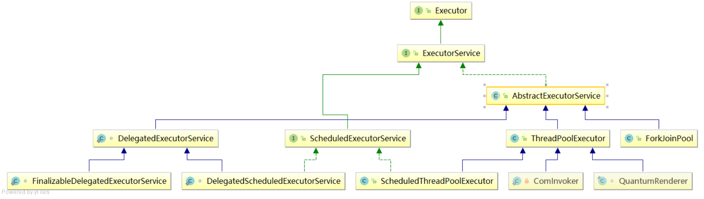
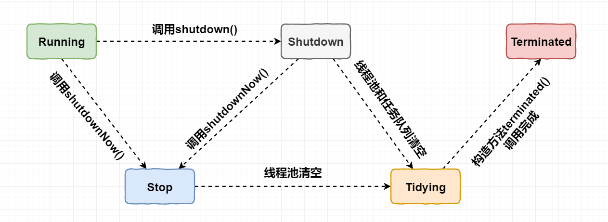
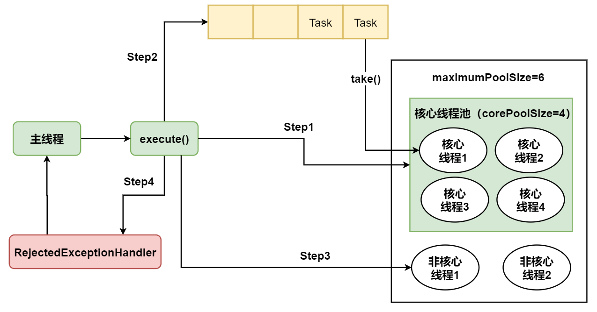
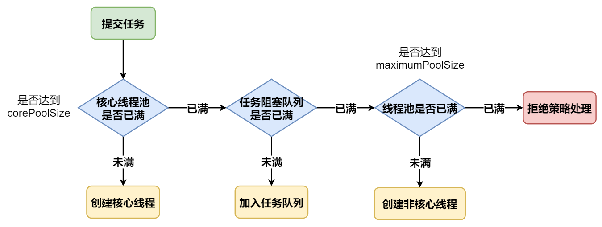
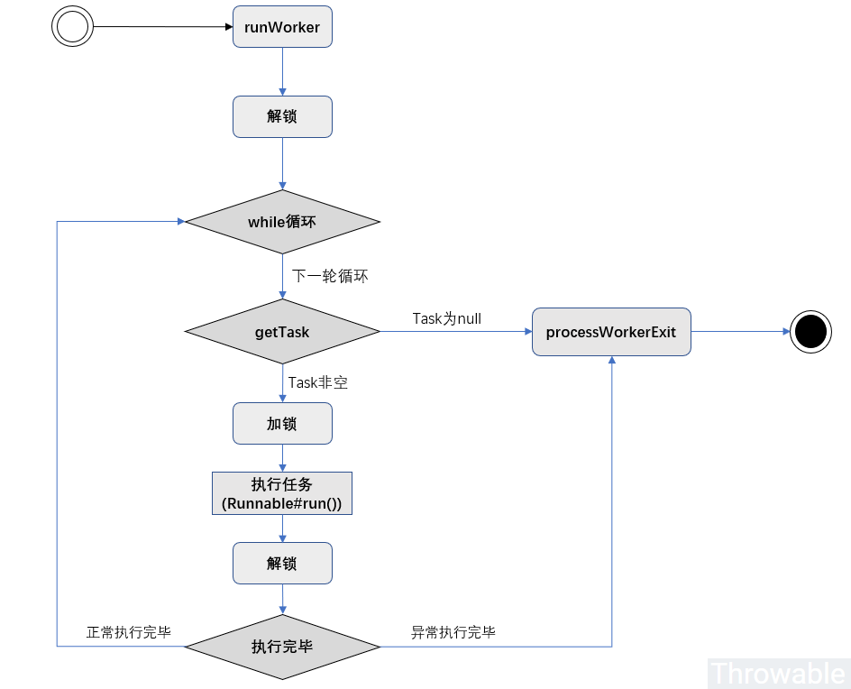
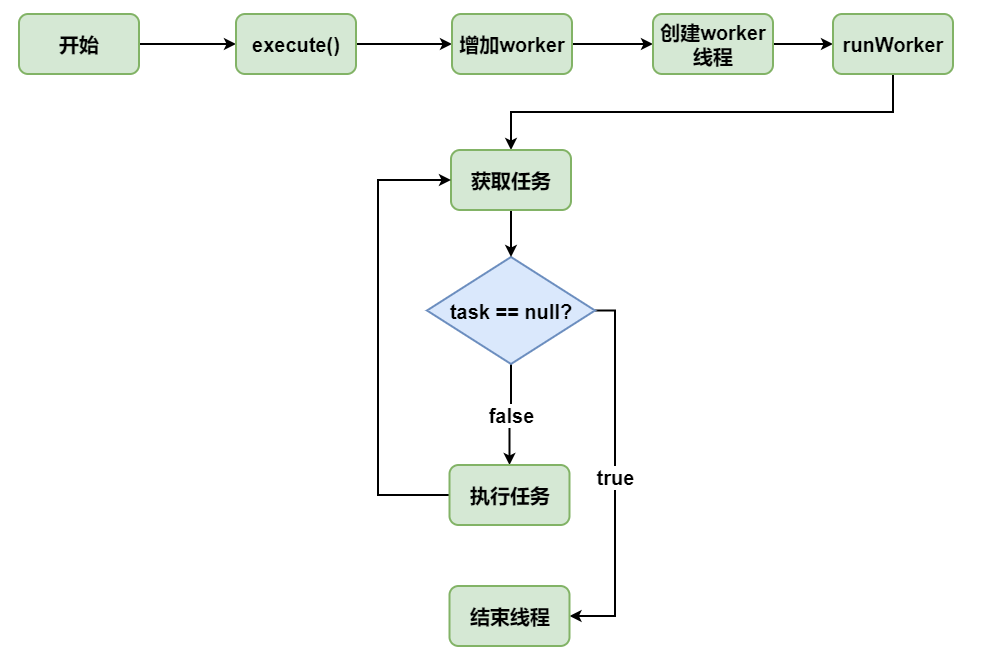

[TOC]

### 线程池

#### 概述

**池化技术**非常常见，线程池、数据库连接池、Http 连接池等等都是对这个思想的应用。池化技术的思想主要是为了减少每次获取资源的消耗，提高对资源的利用率。

线程池就是一个线程缓存池，线程是稀缺资源，如果被无限制的创建，不仅会消耗系统资源，还会降低系统的稳定性，因此 Java 中提供线程池对线程进行统一分配、调优和监控。

在 Web 开发中，服务器需要接受并处理请求，所以会为一个请求来分配一个线程来进行处理。如果每次请求都新创建一个线程的话实现起来非常简便，但是存在一个问题：如果并发的请求数量非常多，但每个线程执行的时间很短，这样就会频繁的创建和销毁线程，如此一来会大大降低系统的效率。可能出现服务器在为每个请求创建新线程和销毁线程上花费的时间和消耗的系统资源要比处理实际的用户请求的时间和资源更多。

那么有没有一种办法使执行完一个任务，并不被销毁，而是可以继续执行其他的任务呢？这就是线程池的目的了。**线程池为线程生命周期的开销和资源不足问题提供了解决方案。通过对多个任务重用线程，线程创建的开销被分摊到了多个任务上。**

**什么时候使用线程池**？

- **单个任务处理时间比较短**。
- **需要处理的任务数量很大**。

**线程池优势**：

- **重用存在的线程，减少线程创建，消亡的开销，提高性能**。
- 提高**响应速度**。当任务到达时，任务可以不需要的等到线程创建就能立即执行。
- 提高线程的**可管理性**。线程是稀缺资源，如果无限制的创建，不仅会消耗系统资源，还会降低系统的稳定性，使用线程池可以进行统一的分配，调优和监控。  

#### Executor框架

##### 1. 接口与类

**Executor 框架**包括：**线程池**，Executor，Executors，ExecutorService，CompletionService，Future，Callable 等。

其框架大致如下：



**ThreadPoolExecutor** 继承了 **AbstractExecutorService**，AbstractExecutorService 是一个抽象类，它基本实现了 ExecutorService 接口中的方法。而 ExecutorService 接口又是**继承**了 Executor 接口。

###### (1) Executor接口

**Executor 接口**是线程池框架中最基础的部分（**顶级接口**），定义了一个用于**执行 Runnable 的 execute 方法**。

Executor 接口如下：

```java
public interface Executor {
    // 提交任务的方法
    void execute(Runnable command);
}
```

###### (2) ExecutorService接口

另一个接口 **ExecutorService** 继承自 Executor，定义了更多的方法。

```java
public interface ExecutorService extends Executor {
	// 在完成已提交的任务后封闭办事，不再接管新任务
    void shutdown();
	// 停止所有正在履行的任务并封闭办事
    List<Runnable> shutdownNow();
	// 测试是否该ExecutorService已被关闭
    boolean isShutdown();
	// 测试是否所有任务都履行完毕了
    boolean isTerminated();
	// 可用来提交Callable或Runnable任务，并返回代表此任务的Future对象
    <T> Future<T> submit(Callable<T> task);
    <T> Future<T> submit(Runnable task, T result);
    Future<?> submit(Runnable task);

    boolean awaitTermination(long timeout, TimeUnit unit) throws InterruptedException;
    
    <T> List<Future<T>> invokeAll(Collection<? extends Callable<T>> tasks)
        throws InterruptedException;

    <T> List<Future<T>> invokeAll(Collection<? extends Callable<T>> tasks,
        long timeout, TimeUnit unit) throws InterruptedException;

    <T> T invokeAny(Collection<? extends Callable<T>> tasks)
        throws InterruptedException, ExecutionException;
    
    <T> T invokeAny(Collection<? extends Callable<T>> tasks,long timeout, TimeUnit unit) throws InterruptedException, ExecutionException, TimeoutException;
}
```

ExecutorService 中定义了线程池的具体行为。除了继承而来的 **execute** 方法（执行 **Ruannable** 类型的任务,）这里又增加了一个执行任务的方法：**submit** 方法（可用来提交 **Callable 或 Runnable 任务**，并返回代表此任务的 **Future** 对象）。

###### (3) Executors类

**Executors 是一个工具类**，可以用于创建各种线程池。Executors 提供了一系列**工厂方法**用于**创建线程池**，返回的线程池都实现了 **ExecutorService** 接口。   

```java
// 创建固定线程数量的线程池
public static ExecutorService newFixedThreadPool(int nThreads);
// 创建不限制线程数量的线程池
public static ExecutorService newCachedThreadPool();
// 创建单线程的线程池
public static ExecutorService newSingleThreadExecutor();
// 创建一个支持定时及周期性的任务执行的线程池，多数情况下可用来替代Timer类
public static ScheduledExecutorService newScheduledThreadPool(int corePoolSize);
```

这四种方法都是用的 Executors 中的 **ThreadFactory** 建立的线程。

##### 2. 线程池类别

###### (1) newFixedThreadPool

创建**固定线程数目**的线程池，使用固定数目 nThreads 个线程，使用==**无界阻塞队列 LinkedBlockingQueue**== **存放任务**，线程创建后不会超时终止，由于是无界队列，如果**排队任务**过多，可能消耗过多**内存**。

包括两个构造方法：

```java
public static ExecutorService newFixedThreadPool(int nThreads) {
    return new ThreadPoolExecutor(nThreads, nThreads,
                                  0L, TimeUnit.MILLISECONDS,
                                  new LinkedBlockingQueue<Runnable>());
}

public static ExecutorService newFixedThreadPool(int nThreads, ThreadFactory threadFactory) {
    return new ThreadPoolExecutor(nThreads, nThreads,
                                  0L, TimeUnit.MILLISECONDS,
                                  new LinkedBlockingQueue<Runnable>(),
                                  threadFactory);
}
```

各构造参数总结：

- **核心线程数与最大线程数** nThreads：构建的 ThreadPoolExecutor 核心线程数与**最大线程数**相等且均为 nThreads，这说明当前线程池**不会存在非核心线程**，即不会存在线程的回收（allowCoreThreadTimeOut 默认为 false），随着任务的提交，线程数增加到 nThreads 个后就**不会变化**；
- **存活时间**为 0：线程存在**非核心**线程，该时间没有特殊效果；
- **等待队列** LinkedBlockingQueue：该等待队列为 LinkedBlockingQueue类型，**没有长度限制**；
- ThreadFactory 参数：默认为 DefaultThreadFactory，也可通过构造函数设置。

###### (2) newCachedThreadPool

使用的队列是 **SynchronousQueue** 创建一个**可缓存**的线程池，调用 execute 将重用以前构造的线程（如果线程空闲可用），如果现有线程没有可用的，则创建一个**新线程**并添加到池中。终止并从缓存中移除那些已有 **60 秒钟**未被使用的线程。其 **corePoolSize** 是 **0**，**maximumPoolSize** 是 Integer.MAX_VALUE，keepAliveTime 是 60 秒。因此可以==**创建的线程数量是没有限制**==的。

newCachedThreadPool 方法簇用于创建可缓存任务的 ThreadPoolExecutor 线程池。包括两个重构方法：

```java
public static ExecutorService newCachedThreadPool() {
    return new ThreadPoolExecutor(0, Integer.MAX_VALUE,
                                  60L, TimeUnit.SECONDS,
                                  new SynchronousQueue<Runnable>());
}
public static ExecutorService newCachedThreadPool(ThreadFactory threadFactory) {
    return new ThreadPoolExecutor(0, Integer.MAX_VALUE,
                                  60L, TimeUnit.SECONDS,
                                  new SynchronousQueue<Runnable>(),
                                  threadFactory);
}
```

结合上文分析的 ThreadPoolExecutor 各构造参数，可总结如下：

1. ==**核心线程数**为 **0**==：没有核心线程，即在**没有任务运行时**所有线程**均会**被回收；
2. **最大线程数**为 Integer.MAX_VALUE，即线程池中最大可存在的线程为 Integer.MAX_VALUE，由于此值在通常情况下远远大于系统可新建的线程数，可简单理解为此线程池**不限制最大可建的线程数**，此处可出现逻辑风险，在提交任务时可能由于超过系统处理能力造成无法再新建线程时会出现 **OOM** 异常，提示无法创建新的线程；
3. **存活时间** 60 秒：线程数量超过核心线程后，**空闲** 60 秒的线程将会**被回收**，根据第一条可知核心线程数为 0，则本条表示**所有线程空闲超过 60 秒均会被回收**；
4. 等待队列 SynchronousQueue：构建 CachedThreadPool 时，使用的等待队列为 SynchronousQueue 类型，此类型的等待队列较为**特殊**，可认为这是一个**容量为 0** 的**阻塞队列**，在调用其 offer 方法时，如当前有消费者正在等待获取元素，则返回 true，否则返回 false。使用此等待队列可做到快速提交任务到空闲线程，没有空闲线程时触发**新建线程**；
5. ThreadFactory 参数：默认为 DefaultThreadFactory，也可通过构造函数设置。

###### (3) newSingleThreadExecutor

创建一个只有**一个**线程的线程池，使用**无界队列 LinkedBlockingQueue**，线程创建后不会超时终止，该线程**顺序执行**所有任务，适用于**需要确保==所有任务被顺序执行==**的场景。包括两个构造方法：

```java
public static ExecutorService newSingleThreadExecutor() {
    return new FinalizableDelegatedExecutorService
        (new ThreadPoolExecutor(1, 1,
                                0L, TimeUnit.MILLISECONDS,
                                new LinkedBlockingQueue<Runnable>()));
}
public static ExecutorService newSingleThreadExecutor(ThreadFactory threadFactory) {
    return new FinalizableDelegatedExecutorService
        (new ThreadPoolExecutor(1, 1,
                                0L, TimeUnit.MILLISECONDS,
                                new LinkedBlockingQueue<Runnable>(),
                                threadFactory));
}
```

各构造参数含义：

1. **核心线程数与最大线程数 1**：当前线程池中有且仅有**一个**核心线程；
2. 存活时间为 0：当前线程池**不存在非核心线程**，不会存在线程的超时回收；
3. 等待队列 LinkedBlockingQueue：任务队列**没有长度限制**；
4. ThreadFactory 参数：默认为 DefaultThreadFactory，也可通过构造函数设置。

###### (4) 比较

当系统**负载不太高**时，单个任务执行的时间也**短**的话，**newCachedThreadPool** 效率可能更高，因为**任务不需要排队**，直接交给一个**空闲线程**进行处理。

系统**负载很高**时，newFixedThreadPool 可以通过**队列对新任务**排队，保证有足够的资源处理实际的任务，而newCachedThreadPool 则会为每个任务创建一个线程，导致创建过多的线程竞争 CPU 和内存资源，这时候使用 newFixedThreadPool 较为合理。

系统负载**极高**时，newFixedThreadPool 和 newCachedThreadPool **都不是**很好的选择，newFixedThreadPool 的问题是任务==**队列过长**==，newCachedThreadPool 的问题是创建==**线程过多**==。这时候应该根据情况**自定义** ThreadPoolExecutor，传递合适的参数。

Executors 工具类创建常见线程池的方法，现对三种线程池区别进行比较。

|       线程池类型       |                    CachedThreadPool                    |              FixedThreadPool               |                     SingleThreadExecutor                     |
| :--------------------: | :----------------------------------------------------: | :----------------------------------------: | :----------------------------------------------------------: |
|     **核心线程数**     |                       ==**0**==                        |            nThreads（用户设定）            |                            **1**                             |
|     **最大线程数**     |                 **Integer.MAX_VALUE**                  |            nThreads（用户设定）            |                            **1**                             |
| **非核心线程存活时间** |                        **60s**                         |            **==无非核心线程==**            |                       **无非核心线程**                       |
|  **等待队列最大长度**  |                         **1**                          |                 **无限制**                 |                          **无限制**                          |
|          特点          | **提交任务优先复用空闲线程，没有空闲线程则创建新线程** |  固定线程数，等待运行的任务均放入等待队列  | 有且仅有**一个**线程在运行，等待运行任务放入等待队列，可保证任务运行顺序与提交顺序一直 |
|        内存溢出        |     大量提交任务后，可能出现**无法创建线程的 OOM**     | 大量提交任务后，可能出现**内存不足的 OOM** |          大量提交任务后，可能出现**内存不足的 OOM**          |

###### (5) 三种类型的线程池与GC关系

**原理说明**

一般情况下 JVM 中的 GC 根据可达性分析确认一个对象是否可被回收(eligible for GC)，而在运行的**线程**被视为 ‘**GCRoot**’。因此被在运行的线程引用的对象是不会被 GC 回收的。在 ThreadPoolExecutor 类中具有**非静态**内部类 **Worker**，用于表示当前线程池中的线程。非静态内部类对象具有外部包装类对象的**引用**（此处也可通过查看字节码来验证），因此 Worker 类的对象即作为**线程对象**（‘GCRoot’）有**持有外部类 ThreadPoolExecutor 对象的引用**，则在其运行结束之前，外部内**不会**被 GC 回收。 

根据以上分析，再次观察以上三个线程池：

1、**CachedThreadPool**：没有核心线程，且线程具有超时时间，可见在其引用消失后，等待任务运行结束且所有线程空闲回收后，**GC 开始回收此线程池对象**；

2、**FixedThreadPool**：核心线程数及最大线程数均为 nThreads，并且在默认 allowCoreThreadTimeOut 为 false 的情况下，其引用消失后，核心线程即使空闲**也不会**被回收，故 GC **不会回收该线程池**；

3、**SingleThreadExecutor**：默认与 FixedThreadPool 情况一致，但由于其语义为**单线程**线程池，JDK 开发人员为其提供了 FinalizableDelegatedExecutorService 包装类，在创建 FixedThreadPool 对象时实际返回的是 FinalizableDelegatedExecutorService 对象，该对象持有 FixedThreadPool 对象的引用，但 FixedThreadPool 对象并不引用 FinalizableDelegatedExecutorService 对象，这使得在 FinalizableDelegatedExecutorService 对象的外部引用消失后，**GC 将会对其进行回收**，触发 finalize 函数，而该函数仅仅简单的调用 shutdown 函数关闭线程，是的所有当前的任务执行完成后，回收线程池中线程，则 GC 可回收线程池对象。

因此可得出**结论**，**CachedThreadPool**及**SingleThreadExecutor**的对象在**不显式调用**shutdown函数（或shutdownNow函数），且其对象引用消失的情况下，**可以被 GC 回收**；**FixedThreadPool**对象在**不显式调用**shutdown函数（或shutdownNow函数），且其对象引用消失的情况下**不会被GC回收，会出现内存泄露**。

**实验验证**：以上结论可使用实验验证：

```java
public static void main(String[] args) throws InterruptedException {
    ExecutorService executorService = Executors.newCachedThreadPool();
    // ExecutorService executorService = Executors.newFixedThreadPool(1);
    // ExecutorService executorService = Executors.newSingleThreadExecutor();
    executorService.execute(() -> System.out.println(Thread.currentThread().getName()));
    // 线程引用置空
    executorService = null;
    Runtime.getRuntime().addShutdownHook(new Thread(() -> System.out.println("Shutdown.")));
    // 等待线程超时，主要对CachedThreadPool有效
    Thread.sleep(100000);
    // 手动触发GC
    System.gc();
}
```

使用以上代码，分别创建三种不同的线程池，可发现最终 FixedThreadPool 不会打印出‘Shutdown.’，JVM 没有退出。另外两种线程池均能**退出** JVM。因此无论使用什么线程池线程池使用完毕后均==**调用 shutdown()**== 以保证其最终会被 GC 回收是一个较为安全的编程习惯。

##### 3. 线程池任务执行

在 Java5 之后，任务分两类：一类是实现了 **Runnable** 接口的类，一类是实现了 **Callable** 接口的类。两者都可以被 **ExecutorService** 执行，但是 Runnable 任务没有返回值，而 Callable 任务有返回值。

**Executor 接口提供 execute 方法（执行 Runnable），ExecutorService 接口继承自 Executor 接口并拓展了 submit 方法（执行 Runnable 与 Callable）。**

任务提交

```java
public void execute()     // 提交任务无返回值
public Future<?> submit() // 任务执行完成后有返回值  
```

###### (1) 执行Runnable任务

通过 Executors 的以上四个静态工厂方法获得 **ExecutorService** 实例，而后调用该实例的 **execute**（Runnable command）方法即可。一旦 Runnable 任务传递到 **execute**() 方法，该方法便会自动在**一个线程**上执行。下面是 Executor 执行 Runnable 任务的示例代码：

```java
public class TestCachedThreadPool{
	public static void main(String[] args){
		// 创建线程池
		ExecutorService executorService = Executors.newCachedThreadPool();
//      ExecutorService executorService = Executors.newFixedThreadPool(5);
//		ExecutorService executorService = Executors.newSingleThreadExecutor();
		for (int i = 0; i < 5; i++){
			executorService.execute(() -> System.out.println(Thread.currentThread().getName() + "线程被调用了。"));
			System.out.println("************* a" + i + " *************");
		}
		executorService.shutdown();
	}
}
```

```java
************* a0 *************
pool-1-thread-1线程被调用了。
************* a1 *************
pool-1-thread-2线程被调用了。
************* a2 *************
************* a3 *************
pool-1-thread-3线程被调用了。
pool-1-thread-2线程被调用了。
************* a4 *************
pool-1-thread-1线程被调用了。
```

execute 会首先在线程池中选择一个**已有空闲线程**来执行任务，如果线程池中没有空闲线程，它便会**创建一个新的线程**来执行任务。这个得根据创建的线程池类型。

###### (2) 执行Callable任务

Callable 的 **call**() 方法只能通过 ExecutorService 的 **submit** (Callable\<T> task) 方法来执行，并且返回一个 \<T> Future\<T>，是表示任务**等待完成的 Future**。

Callable 接口类似于 Runnable，两者都是为那些其实例可能被另一个线程执行的类设计的。但是 Runnable 不会返回结果，并且无法抛出经过检查的异常而 Callable 又**返回结果**，而且当获取返回结果时可能会**抛出异常**。Callable 中的 **call**() 方法类似 Runnable 的 **run**() 方法，区别同样是有返回值，后者没有。

当将一个 Callable 的对象传递给 ExecutorService 的 **submit** 方法，则该 call 方法自动在一个**线程**上执行，并且会返回执行**结果 Future** 对象。

```java
import java.util.ArrayList; 
import java.util.List; 
import java.util.concurrent.*; 

public class CallableDemo{ 
    public static void main(String[] args){ 
        // 创建线程池
        ExecutorService executorService = Executors.newCachedThreadPool(); 
        // 创建结果存放列表
        List<Future<String>> resultList = new ArrayList<Future<String>>(); 

        // 创建10个任务并执行 
        for (int i = 0; i < 10; i++){ 
            // 使用ExecutorService执行Callable类型的任务，并将结果保存在future变量中 
            Future<String> future = executorService.submit(new TaskWithResult(i)); 
            // 将任务执行结果存储到List中 
            resultList.add(future); 
        } 

        // 遍历任务的结果 
        for (Future<String> fs : resultList){ 
            try{ 
                // Future返回如果没有完成，则会阻塞！直到Future返回完成
                while(!fs.isDone);
                // 打印各个线程（任务）执行的结果
                System.out.println(fs.get());      
            }catch(InterruptedException e){ 
                e.printStackTrace(); 
            }catch(ExecutionException e){ 
                e.printStackTrace(); 
            }finally{ 
                // 启动一次顺序关闭，执行以前提交的任务，但不接受新任务
                executorService.shutdown(); 
            } 
        } 
    } 
} 

class TaskWithResult implements Callable<String>{ 
    private int id; 

    public TaskWithResult(int id){ 
        this.id = id; 
    } 

    /** 
	 * 任务的具体过程，一旦任务传给ExecutorService的submit方法，
	 * 则该方法自动在一个线程上执行
	 */ 
    public String call() throws Exception {
        System.out.println("call()方法被自动调用！！！" + Thread.currentThread().getName()); 
        // 该返回结果将被Future的get方法得到
        return "call()方法被自动调用，任务返回的结果是：" + id + " " + Thread.currentThread().getName(); 
    } 
}
```

需要注意：如果 Future 的返回尚未完成，则 get() 方法会==**阻塞等待**==，直到 Future 完成返回，可以通过调用 **isDone**() 方法判断 Future 是否完成了返回。

**总结**

1. **execute() 方法用于提交不需要返回值的任务，所以无法判断任务是否被线程池执行成功与否；**
2. **submit() 方法用于提交需要返回值的任务。线程池会返回一个 Future 类型的对象，通过这个 Future 对象可以判断任务是否执行成功**，并且可以通过 Future 的 get() 方法来获取返回值，get() 方法会阻塞当前线程直到任务完成，而使用 get(long timeout，TimeUnit unit) 方法则会阻塞当前线程一段时间后立即返回，这时候有可能任务没有执行完。

以 **AbstractExecutorService** 接口中的一个 **submit**() 方法为例子来看看源代码：

```java
public Future<?> submit(Runnable task) {
    if (task == null) throw new NullPointerException();
    RunnableFuture<Void> ftask = newTaskFor(task, null);
    execute(ftask);
    return ftask;
}
```

上面方法调用的 newTaskFor 方法返回了一个 FutureTask 对象。

```java
protected <T> RunnableFuture<T> newTaskFor(Runnable runnable, T value) {
    return new FutureTask<T>(runnable, value);
}
```

###### (3) Executor的中断任务

调用 Executor 的 **shutdown**() 方法会等待线程都**执行完毕之后**再关闭，但是如果调用的是 **shutdownNow**() 方法，则相当于调用**每个线程的 interrupt()** 方法。

以下使用 Lambda 创建线程，相当于创建了一个匿名内部线程。

```java
public static void main(String[] args) {
    ExecutorService executorService = Executors.newCachedThreadPool();
    executorService.execute(() -> {
        try {
            Thread.sleep(2000);
            System.out.println("Thread run");
        } catch (InterruptedException e) {
            e.printStackTrace();
        }
    });
    // 立马结束
    executorService.shutdownNow();
    System.out.println("Main run");
}
```

```html
Main run
java.lang.InterruptedException: sleep interrupted
    at java.lang.Thread.sleep(Native Method)
    at ExecutorInterruptExample.lambda$main$0(ExecutorInterruptExample.java:9)
    at ExecutorInterruptExample$$Lambda$1/1160460865.run(Unknown Source)
    at java.util.concurrent.ThreadPoolExecutor.runWorker(ThreadPoolExecutor.java:1142)
    at java.util.concurrent.ThreadPoolExecutor$Worker.run(ThreadPoolExecutor.java:617)
    at java.lang.Thread.run(Thread.java:745)
```

如果只想中断 Executor 中的一个线程，可以通过使用 **submit()** 方法来提交一个线程，它会返回一个 **Future<?> 对象**，通过调用该对象的 **cancel**(true) 方法就可以单独**中断线程**。

```java
Future<?> future = executorService.submit(() -> {
    // ...
});
// 通过Future对象中断线程
future.cancel(true);  
```


#### ThreadPoolExecutor源码分析

##### 1. 概述

上面的几个线程池都是通过 ThreadPoolExecutor 构造方法进行创建的。这个**十分重要**，阿里也建议自己这样构造。

Doug Lea 在设计线程池 ThreadPoolExecutor 的提交任务的顶层接口 Executor 只有一个无状态的执行方法 execute，而 ExecutorService 提供了很多扩展方法底层基本上是基于 Executor#execute() 方法进行扩展。这里着重分析 execute 方法。这里基于 JDK11。

ThreadPoolExecutor 里面使用到 JUC 同步器框架 **AbstractQueuedSynchronizer**（俗称 AQS）、大量的位操作、 CAS 操作。

> JUC同步器框架

ThreadPoolExecutor 里面使用到 JUC 同步器框架，主要用于四个方面：

- 全局锁 mainLock 成员属性，是可重入锁 ReentrantLock 类型，主要是用于访问工作线程 Worker 集合和进行数据统计记录时候的加锁操作。
- 条件变量 termination，Condition 类型，主要用于线程进行等待终结 awaitTermination() 方法时的带期限阻塞。
- 任务队列 workQueue，BlockingQueue\<Runnable> 类型，任务队列，用于存放待执行的任务。
- 工作线程，内部类 Worker 类型，是线程池中**真正的工作线程对象**。

##### 2. 关键属性

```java
public class ThreadPoolExecutor extends AbstractExecutorService {

    // 控制变量-存放状态和线程数
    private final AtomicInteger ctl = new AtomicInteger(ctlOf(RUNNING, 0));

    // 任务队列，必须是阻塞队列
    private final BlockingQueue<Runnable> workQueue;

    // 工作线程集合，存放线程池中所有的（活跃的）工作线程，只有在持有全局锁mainLock的前提下才能访问此集合
    private final HashSet<Worker> workers = new HashSet<>();

    // 全局锁
    private final ReentrantLock mainLock = new ReentrantLock();

    // awaitTermination方法使用的等待条件变量
    private final Condition termination = mainLock.newCondition();

    // 记录峰值线程数
    private int largestPoolSize;

    // 记录已经成功执行完毕的任务数
    private long completedTaskCount;

    // 线程工厂，用于创建新的线程实例
    private volatile ThreadFactory threadFactory;

    // 拒绝执行处理器，对应不同的拒绝策略
    private volatile RejectedExecutionHandler handler;

    // 空闲线程等待任务的时间周期，单位是纳秒
    private volatile long keepAliveTime;

    // 是否允许核心线程超时，如果为true则keepAliveTime对核心线程也生效
    private volatile boolean allowCoreThreadTimeOut;

    // 核心线程数
    private volatile int corePoolSize;

    // 线程池容量
    private volatile int maximumPoolSize;

    // 省略其他代码
}    
```

每个变量的作用都已经标明出来了，这里要重点解释一下 **corePoolSize、maximumPoolSize、largestPoolSize** 三个变量。后面也会详述。

corePoolSize 在很多地方被翻译成**核心池大小**，其实我的理解这个就是线程池的大小。举个简单的例子：

假如有一个工厂，工厂里面有 10个 工人，每个工人同时只能做一件任务。因此只要当 10 个工人中有工人是空闲的，来了任务就分配给空闲的工人做；当 10 个工人都有任务在做时，如果还来了任务，就把任务进行排队等待；如果说新任务数目增长的速度远远大于工人做任务的速度，那么此时工厂主管可能会想补救措施，比如重新招 4 个临时工人进来；然后就将任务也分配给这 4 个临时工人做；如果说着 14 个工人做任务的速度还是不够，此时工厂主管可能就要考虑不再接收新的任务或者抛弃前面的一些任务了。当这 14 个工人当中有人空闲时，而新任务增长的速度又比较缓慢，工厂主管可能就考虑辞掉4个临时工了，只保持原来的 10 个工人，毕竟请额外的工人是要花钱的。

这个例子中的 corePoolSize 就是10，而 maximumPoolSize 就是10 + 4 = 14。也就是说 corePoolSize 就是线程池大小， maximumPoolSize 在我看来是线程池的一种补救措施，即任务量**突然过大**时的一种补救措施。

largestPoolSize 只是一个用来起记录作用的变量，用来记录线程池中曾经有过的最大线程数目，跟线程池的容量**没有**任何关系。

##### 3. 构造方法与核心参数

ThreadPoolExecutor 类的构造方法如下： 

```java
public ThreadPoolExecutor(int corePoolSize,
                          int maximumPoolSize,
                          long keepAliveTime,
                          TimeUnit unit,
                          BlockingQueue<Runnable> workQueue,
                          ThreadFactory threadFactory,
                          RejectedExecutionHandler handler) {
    if (corePoolSize < 0 ||
        maximumPoolSize <= 0 ||
        maximumPoolSize < corePoolSize ||
        keepAliveTime < 0)
        throw new IllegalArgumentException();
    if (workQueue == null || threadFactory == null || handler == null)
        throw new NullPointerException();
    this.corePoolSize = corePoolSize;
    this.maximumPoolSize = maximumPoolSize;
    this.workQueue = workQueue;
    this.keepAliveTime = unit.toNanos(keepAliveTime);
    this.threadFactory = threadFactory;
    this.handler = handler;
}
```

可以自定义核心线程数、线程池容量（最大线程数）、空闲线程等待任务周期、任务队列、线程工厂、拒绝策略。

核心参数解释：

###### (1) 核心线程数corePoolSize

线程池中的**核心线程数**。默认情况下，当提交一个任务时，线程池**创建一个新线程执行任务**，**直到当前线程数等于 corePoolSize**；如果当前线程数为 corePoolSize，继续提交的任务被保存到**阻塞队列**中，等待被执行；如果执行了线程池的 **prestartAllCoreThreads**() 方法，线程池会**提前预创建并启动所有核心线程**。核心线程是**懒创建**的，没到 corePoolSize 之前是来一个任务创建一个。

###### (2) 最大线程数maximumPoolSize

线程池**最大**线程数，表示在线程池中最多能创建多少个线程。当**阻塞队列中存放的任务达到队列容量**的时候，会创建新的线程执行任务直到达到最大线程数。如果当前阻塞队列满了，且继续提交任务，则创建新的线程执行任务，前提是当前线程数小于 maximumPoolSize。注意：多于的**空闲**非核心线程存活超过 **keepAliveTime** 后会被销毁。

> PS：动态调整线程池容量

ThreadPoolExecutor提供了动态调整线程池容量大小的方法：setCorePoolSize() 和 setMaximumPoolSize()，

- **setCorePoolSize**：设置核心池大小。
- **setMaximumPoolSize**：设置线程池最大能创建的线程数目大小。

当上述参数从小变大时，ThreadPoolExecutor 进行线程赋值，还可能立即创建新的线程来执行任务。

###### (3) 非核心线程存活时间keepAliveTime

当线程池中的线程数量**大于 corePoolSize** 的时候，如果这时没有新的任务提交，核心线程外的线程不会立即销毁，而是会等待，直到等待的时间超过了 **keepAliveTime**。这时候会把**非核心线程**销毁。**默认情况**下，只有当线程池中的线程数**大于 corePoolSize** 时，keepAliveTime 才会起作用，直到线程池中的线程数不大于 corePoolSize，即当线程池中的线程数大于 corePoolSize 时，如果一个线程空闲的时间达到 keepAliveTime，则会终止，直到线程池中的线程数不超过 corePoolSize。

但是如果调用了 **allowCoreThreadTimeOut**(boolean) 方法，在线程池中的线程数**不大于** corePoolSize 时，keepAliveTime 参数**也会**起作用，直到线程池中的线程数为 0，也就是**核心线程也可能被销毁**。所以说，**核心线程**可能也会被全部销毁到 0。

###### (4) 时间单位unit

keepAliveTime 的单位。  

###### (5) 阻塞任务队列workQueue

用来**保存等待被执行的任务的阻塞队列**，且任务必须实现 Runable 接口，在 JDK 中提供了如下阻塞队列：

- **LinkedBlockingQuene**：基于链表结构的阻塞队列，按 FIFO 排序任务。
- **SynchronousQuene**：一个**不存储元素**的阻塞队列，每个插入操作必须等到另一个线程调用**移除操作**，否则插入操作一直处于阻塞状态，**吞吐量**通常要高于 LinkedBlockingQuene；

- ArrayBlockingQueue：基于数组结构的有界阻塞队列，按 FIFO 排序任务；
- PriorityBlockingQuene：具有优先级的无界阻塞队列；  

多用 LinkedBlockingQuene 和 SynchronousQuene。

###### (6) 线程工厂threadFactory

用来创建新线程。默认使用 Executors.**defaultThreadFactory**() 来创建线程。使用默认的 ThreadFactory 来创建线程
时，会使新创建的线程**具有相同的 NORM_PRIORITY 优先级并且是非守护线程，同时也设置了线程的名称**。  一般自定义线程工厂才能更好地跟踪工作线程。

###### (7) 拒绝策略handler

当线程池的**任务缓存队列已满**并且线程池中的**线程数目达到 maximumPoolSize**，如果还有任务到来就会采取**任务拒绝策略**，线程池提供了 4 种策略：

- ThreadPoolExecutor.**AbortPolicy**：**丢弃任务并直接抛出异常**，**默认策略；**这代表你将丢失对这个任务的处理。
- ThreadPoolExecutor.CallerRunsPolicy：用调用者所在的线程来执行任务；对于可伸缩的应用程序，建议使用此策略。当最大池被填满时，此策略为我们提供可伸缩队列。**一般不希望任务丢失会选用这种策略，但从实际角度来看，原来的异步调用意图会退化为同步调用**。
- ThreadPoolExecutor.DiscardOldestPolicy：丢弃阻塞队列中靠**最前**的任务，并执行当前任务；
- ThreadPoolExecutor.DiscardPolicy：直接**丢弃**任务，不抛异常；

上面的 4 种策略都是 ThreadPoolExecutor 的**内部类**。当然也可以根据应用场景实现 **RejectedExecutionHandler** 接口，自定义饱和策略，如**记录日志或持久化存储不能处理的任务**。

##### 4. 线程池状态

###### (1) ctl变量

**状态控制主要围绕原子整型成员变量 ==ctl==**。ctl 贯穿在线程池的**整个生命周期**中。

```java
private final AtomicInteger ctl = new AtomicInteger(ctlOf(RUNNING, 0));
```

它是一个**原子类**，主要作用是用来**保存线程数量和线程池的状态**。我们来分析一下这段代码，用到了**位运算**。

一个 int 数值是 32 个 bit 位，这里采用**高 3 位来保存==运行状态 runState==**，**低 29 位来保存==有效线程数量 workCount==**。

COUNT_BITS 就是 29，CAPACITY 就是 1 左移 29 位减 1（29 个 1），这个常量表示 workerCount 的上限值，大约最大线程数是 5 亿。  这个数量在短时间内不用考虑会超限。

**ctl 相关方法：**

```java
// 获取运行状态
private static int runStateOf(int c) { return c & ~CAPACITY; }
// 获取活动线程数
private static int workerCountOf(int c) { return c & CAPACITY; }
// 获取运行状态和活动线程数的值
private static int ctlOf(int rs, int wc) { return rs | wc; }
```

PS：线程池源码中有很多中间变量用了简单的单字母表示，例如 c 就是表示 ctl、wc 就是表示 worker count、rs 就是表示 running status。

我们来分析默认情况下，也就是 ctlOf(RUNNING)**运行状态**，调用了 **ctlOf**(int rs, int wc)方法；

其中

```java
RUNNING = -1 << COUNT_BITS;
```

即 -1 左移 29 位。 -1 的二进制是 
 32 个 1（1111 1111 1111 1111 1111 1111 1111 1111）

那么-1 << 左移 29 位， 也就是 【111】 表示： rs | wc 。二进制的 111 | 000 。得到的结果仍然是 111。

那么同理可得其他的**状态的 bit 位**表示：

```java
private static final int COUNT_BITS = Integer.SIZE - 3; // 32-3=29
// 将 1 的二进制向右位移 29 位,再减 1 表示最大线程容量
private static final int CAPACITY = (1 << COUNT_BITS) - 1; 
```

###### (2) 线程池的5种状态

线程池的**五种状态**对应五种状态变量：**运行状态**保存在 **ctl 值的高 3 位** (所有数值左移 29 位)。

```java
// 接收新任务,并执行队列中的任务
private static final int RUNNING = -1 << COUNT_BITS;
// 不接收新任务,但是执行队列中的任务
private static final int SHUTDOWN = 0 << COUNT_BITS;
// 不接收新任务,不执行队列中的任务,中断正在执行中的任务
private static final int STOP = 1 << COUNT_BITS;    
// 所有的任务都已结束,线程数量为 0,处于该状态的线程池即将调用 terminated()方法
private static final int TIDYING = 2 << COUNT_BITS; 
// terminated()方法执行完成
private static final int TERMINATED = 3 << COUNT_BITS;
```

状态转换过程如下：



**RUNNING**

状态说明：线程池处在 RUNNING 状态时，能够**接收新任务**，以及对已添加的任务进行处理。

状态切换：线程池的初始化状态是 RUNNING。换句话说，线程池被一旦被创建，就处于 RUNNING 状态，并且线程池中的任务数为 **0！**

**SHUTDOWN**

状态说明：线程池处在 SHUTDOWN 状态时，**不接收**新任务，但会把已添加的任务**执行完**。

状态切换：调用线程池的 **shutdown**() 接口时，线程池由 RUNNING -> SHUTDOWN。

**STOP**

状态说明：线程池处在 STOP 状态时，**不接收**新任务，**不处理**已添加的任务，并且会**中断正在处理**的任务。

状态切换：调用线程池的 **shutdownNow**() 接口时，线程池由 (RUNNING or SHUTDOWN ) -> STOP。

**TIDYING**

状态说明：当所有的任务已**终止**，**ctl 记录的”任务数量”为 0**，线程池会变为 **TIDYING** 状态。当线程池变为 TIDYING 状态时，会执行**钩子函数 terminated()**。terminated() 在 **ThreadPoolExecutor** 类中是空的，若用户想在线程池变为 TIDYING 时，进行相应的处理；可以通过**覆写 terminated() 函数**来实现。

状态切换：当线程池在 SHUTDOWN 状态下，阻塞队列为空并且线程池中执行的任务也为空时，就会由 SHUTDOWN -> TIDYING。 当线程池在 STOP 状态下，线程池中执行的任务为空时，就会由 STOP -> TIDYING。

**TERMINATED**

状态说明：线程池**彻底终止**，就变成 TERMINATED 状态。

状态切换：线程池处在 TIDYING 状态时，执行完 **terminated**() 之后，就会由 TIDYING -> TERMINATED。

进入 TERMINATED 的**条件**如下：

- 线程池不是 RUNNING 状态；
- 线程池状态不是 TIDYING 状态或 TERMINATED 状态；
- 如果线程池状态是  SHUTDOWN 并且 workerQueue 为空；
- workerCount 为 0；
- 设置 TIDYING 状态成功。  

##### 5. execute源码与线程池执行原理

###### (1) execute源码

线程池异步执行任务的方法实现是 ThreadPoolExecutor#**execute**()，源码如下：

```java
// 执行命令，其中命令（下面称任务）对象是Runnable的实例
public void execute(Runnable command) {
    // 判断命令（任务）对象非空
    if (command == null)
        throw new NullPointerException();
    // 获取ctl状态的值
    int c = ctl.get();
    // 判断如果当前工作线程数小于核心线程数，直接创建新的核心线程并且执行传入的任务
    if (workerCountOf(c) < corePoolSize) {
        // 如果创建新的核心线程成功则直接返回，true表示是核心线程
        if (addWorker(command, true))
            return;
        // 这里说明创建核心线程失败，需要更新ctl的临时变量c
        c = ctl.get();
    }
    // 走到这里说明创建新的核心线程失败，也就是当前工作线程数大于等于核心线程数corePoolSize
    // 判断线程池是否处于运行中状态，同时尝试用非阻塞方法向任务队列放入任务（放入任务失败返回false）
    if (isRunning(c) && workQueue.offer(command)) {
        // 这里是向任务队列投放任务成功，对线程池的运行中状态做二次检查
        int recheck = ctl.get();
        // 如果线程池二次检查状态是非运行中状态，则从任务队列移除当前的任务调用拒绝策略处理之（也就是移除前面成功入队的任务实例）
        if (!isRunning(recheck) && remove(command))
            // 调用拒绝策略处理任务--返回
            reject(command);
        // 走到下面的else if分支，说明有以下的前提：
        // 0、待执行的任务已经成功加入任务队列
        // 1、线程池可能是RUNNING状态
        // 2、传入的任务可能从任务队列中移除失败（移除失败的唯一可能就是任务已经被执行了）
        // 如果当前工作线程数量为0，则创建一个非核心线程并且传入的任务对象为null - 返回
        // 也就是创建的非核心线程不会马上运行，而是等待获取任务队列的任务去执行 
        // 如果前工作线程数量不为0，原来应该是最后的else分支，但是可以什么也不做，因为任务已经成功入队列，总会有合适的时机分配其他空闲线程去执行它
        else if (workerCountOf(recheck) == 0)
            // false表示是非核心线程
            addWorker(null, false);
    }
    // 走到这里说明有以下的前提：
    // 0、线程池中的工作线程总数已经大于等于corePoolSize（简单来说就是核心线程已经全部懒创建完毕）
    // 1、线程池可能不是RUNNING状态
    // 2、线程池可能是RUNNING状态同时任务队列已经满了
    // 如果向任务队列投放任务失败，则会尝试创建非核心线程传入任务执行
    // 创建非核心线程失败，此时需要拒绝执行任务
    else if (!addWorker(command, false))
        // 调用拒绝策略处理任务 - 返回
        reject(command);
}
```

这里简单分析一下整个流程：

- 如果当前工作线程总数**小于 corePoolSize**，则直接创建**核心线程执行任务**（任务实例会传入直接用于构造工作线程实例）。
- 如果当前工作线程总数大于等于 corePoolSize，判断线程池是否处于**运行中**状态，同时尝试用**非阻塞方法向任务队列**放入任务，这里会二次检查线程池运行状态，如果当前工作线程数量为 0，则创建一个**非核心线程**并且传入的任务对象为 null。
- 如果向任务队列投放任务失败（任务队列已经满了），则会尝试**创建非核心线程**传入任务实例执行。
- 如果创建非核心线程失败，此时需要**拒绝执行任务**，调用**拒绝策略**处理任务。

###### (2) 线程池添加任务原理图解

下图是线程池的工作原理图。



看上图中的执行顺序 1-4。假如有 20 个任务，假设每个任务都执行很长时间。

**Step1**：假设**核心线程数为 4**。那么前面 4 个提交的任务会直接**创建线程**并执行，直到达到核心线程数 corePoolSize。

**Step2**：当达到核心线程数后，新的任务进入到**任务队列中排队**，这个就是**阻塞队列**，假设这里限制了阻塞队列长度为 4，那么当前还剩下 12 个任务。

**Step3**：此时还有任务，这时候就到第三步创建非核心线程执行任务，假设这里最大线程数 maximumPoolSize 为 6，即还可以创建**两个非核心线程**。这时候还剩下十个任务。

**Step4**：此时多于的任务不能再加了，则采用**拒绝策略**进行处理。

实例代码：这里的线程池参数就是按照上述的设置的。

```java
public class TestExecuteTask {

	public static void main(String[] args) {
		ThreadPoolExecutor executor = new ThreadPoolExecutor(4, 6, 200,
				TimeUnit.MILLISECONDS, new LinkedBlockingDeque<>(4));
		for (int i = 0; i < 15; i++) {
			executor.execute(new MyTask(i));
			System.out.println("线程池中核心线程数目：" + executor.getCorePoolSize() +
					"线程池中总线程数目：" + executor.getPoolSize() + ",队列中等待执行的任务数目：" + executor.getQueue().size() + ",已执行完别的任务数目：" + executor.getCompletedTaskCount());
		}
        // 这里注释掉关闭线程池的逻辑防止直接就运行完了
        // executor.shutdown();
	}

	// 任务类
	static class MyTask implements Runnable {

		private int taskId;

		public MyTask(int id) {
			this.taskId = id;
		}

		@Override
		public void run() {
			System.out.println("开始执行task:"+ taskId);
			try {
                // 这里休眠十秒，防止任务过快结束
				Thread.sleep(10000);
			} catch (InterruptedException e) {
				e.printStackTrace();
			}
			System.out.println("task "+ taskId +"执行完毕");
		}
	}

}
```

执行结果如下，可以看到。核心线程数为 4，则前面 0-3 这四个任务都是直接创建新的线程执行任务。之后的 4-7 四个任务被放入到任务队列等待执行，然后 8、9 两个任务通过创建两个非核心线程执行，此时任务到底饱和（由于任务时间长，没有任务执行），所以默认拒绝策略抛出异常。同时，由于是 4-7 号任务在阻塞队列等待，当其他任务执行完之后才开始从队列中获取任务并执行。这个过程与上述分析是一致的。

```java
开始执行task:0
线程池中核心线程数目：4线程池中总线程数目：1,队列中等待执行的任务数目：0,已执行完别的任务数目：0
线程池中核心线程数目：4线程池中总线程数目：2,队列中等待执行的任务数目：0,已执行完别的任务数目：0
线程池中核心线程数目：4线程池中总线程数目：3,队列中等待执行的任务数目：0,已执行完别的任务数目：0
开始执行task:1
线程池中核心线程数目：4线程池中总线程数目：4,队列中等待执行的任务数目：0,已执行完别的任务数目：0
开始执行task:2
开始执行task:3
线程池中核心线程数目：4线程池中总线程数目：4,队列中等待执行的任务数目：1,已执行完别的任务数目：0
线程池中核心线程数目：4线程池中总线程数目：4,队列中等待执行的任务数目：2,已执行完别的任务数目：0
线程池中核心线程数目：4线程池中总线程数目：4,队列中等待执行的任务数目：3,已执行完别的任务数目：0
线程池中核心线程数目：4线程池中总线程数目：4,队列中等待执行的任务数目：4,已执行完别的任务数目：0
线程池中核心线程数目：4线程池中总线程数目：5,队列中等待执行的任务数目：4,已执行完别的任务数目：0
线程池中核心线程数目：4线程池中总线程数目：6,队列中等待执行的任务数目：4,已执行完别的任务数目：0
开始执行task:8
开始执行task:9
Exception in thread "main" java.util.concurrent.RejectedExecutionException: Task javase.juc.threadpool.TestExecuteTask$MyTask@12a3a380 rejected from java.util.concurrent.ThreadPoolExecutor@29453f44[Running, pool size = 6, active threads = 6, queued tasks = 4, completed tasks = 0]
	at java.util.concurrent.ThreadPoolExecutor$AbortPolicy.rejectedExecution(ThreadPoolExecutor.java:2063)
	at java.util.concurrent.ThreadPoolExecutor.reject(ThreadPoolExecutor.java:830)
	at java.util.concurrent.ThreadPoolExecutor.execute(ThreadPoolExecutor.java:1379)
	at javase.juc.threadpool.TestExecuteTask.main(TestExecuteTask.java:20)
task 1执行完毕
task 0执行完毕
task 3执行完毕
task 2执行完毕
开始执行task:5
开始执行task:6
task 8执行完毕
task 9执行完毕
开始执行task:7
开始执行task:4
task 5执行完毕
task 6执行完毕
task 7执行完毕
task 4执行完毕
```

注意：这里抛异常之后由于没有catch住，所以后面的十个任务直接不会放入线程池执行了。就算这里抛出了异常，但是由于注释了关闭线程池的方法，所以线程池把前面加入的10个任务执行完成后还是不会关闭。而是等待新的任务。

总结流程如下图。



###### (3) addWorker源码分析

addWorker 方法的主要工作是在线程池中**创建一个新的线程并执行**。在 execute 方法中很多地方都调用了 **addWorker** 方法。boolean addWorker(Runnable firstTask, boolean core) 方法的第一的参数可以用于**直接传入任务实例**，第二个参数用于**标识将要创建的工作线程是否核心线程**。core 参数为 true 表示在新增线程时会判断当前活动线程数是否少于 corePoolSize，false 表示新增线程前需要判断当前活动线程数是否少于 maximumPoolSize。

方法源码如下：

```java
// 添加工作线程，如果返回false说明没有新创建工作线程，如果返回true说明创建和启动工作线程成功
private boolean addWorker(Runnable firstTask, boolean core) {
    retry:  
    // 注意这是一个死循环 - 最外层循环
    for (int c = ctl.get();;) {
        // 这个是十分复杂的条件，这里先拆分多个与（&&）条件：
        // 1. 线程池状态至少为SHUTDOWN状态，也就是rs >= SHUTDOWN(0)
        // 2. 线程池状态至少为STOP状态，也就是rs >= STOP(1)，或者传入的任务实例firstTask不为null，或者任务队列为空
        // 其实这个判断的边界是线程池状态为shutdown状态下，不会再接受新的任务，在此前提下如果状态已经到了STOP、或者传入任务不为空、或者任务队列为空（已经没有积压任务）都不需要添加新的线程
        if (runStateAtLeast(c, SHUTDOWN)
            && (runStateAtLeast(c, STOP)
                || firstTask != null
                || workQueue.isEmpty()))
            return false;
        // 注意这也是一个死循环:二层循环
        for (;;) {
            // 这里每一轮循环都会重新获取工作线程数wc
            // 1. 如果传入的core为true，表示将要创建核心线程，通过wc和corePoolSize判断，如果wc >= corePoolSize，则返回false表示创建核心线程失败
            // 1. 如果传入的core为false，表示将要创非建核心线程，通过wc和maximumPoolSize判断，如果wc >= maximumPoolSize，则返回false表示创建非核心线程失败
            if (workerCountOf(c)
                >= ((core ? corePoolSize : maximumPoolSize) & COUNT_MASK))
                return false;
            // 成功通过CAS更新工作线程数wc，则break到最外层的循环
            if (compareAndIncrementWorkerCount(c))
                break retry;
            // 走到这里说明了通过CAS更新工作线程数wc失败，这个时候需要重新判断线程池的状态是否由RUNNING已经变为SHUTDOWN
            c = ctl.get();  // Re-read ctl
            // 如果线程池状态已经由RUNNING已经变为SHUTDOWN，则重新跳出到外层循环继续执行
            if (runStateAtLeast(c, SHUTDOWN))
                continue retry;
            // 如果线程池状态依然是RUNNING，CAS更新工作线程数wc失败说明有可能是并发更新导致的失败，则在内层循环重试即可 
            // else CAS failed due to workerCount change; retry inner loop 
        }
    }
    // 标记工作线程是否启动成功
    boolean workerStarted = false;
    // 标记工作线程是否创建成功
    boolean workerAdded = false;
    Worker w = null;
    try {
        // 传入任务实例firstTask创建Worker实例，Worker构造里面会通过线程工厂创建新的Thread对象，所以下面可以直接操作Thread t = w.thread
        // 这一步Worker实例已经创建，但是没有加入工作线程集合或者启动它持有的线程Thread实例
        w = new Worker(firstTask);
        final Thread t = w.thread;
        if (t != null) {
            // 这里需要全局加锁，因为会改变一些指标值和非线程安全的集合
            final ReentrantLock mainLock = this.mainLock;
            mainLock.lock();
            try {
                // Recheck while holding lock.
                // Back out on ThreadFactory failure or if
                // shut down before lock acquired.
                int c = ctl.get();
                // 这里主要在加锁的前提下判断ThreadFactory创建的线程是否存活或者判断获取锁成功之后线程池状态是否已经更变为SHUTDOWN
                // 1. 如果线程池状态依然为RUNNING，则只需要判断线程实例是否存活，需要添加到工作线程集合和启动新的Worker
                // 2. 如果线程池状态小于STOP，也就是RUNNING或者SHUTDOWN状态下，同时传入的任务实例firstTask为null，则需要添加到工作线程集合和启动新的Worker
                // 对于2，换言之，如果线程池处于SHUTDOWN状态下，同时传入的任务实例firstTask不为null，则不会添加到工作线程集合和启动新的Worker
                // 这一步其实有可能创建了新的Worker实例但是并不启动（临时对象，没有任何强引用），这种Worker有可能成功下一轮GC被收集的垃圾对象
                if (isRunning(c) ||
                    (runStateLessThan(c, STOP) && firstTask == null)) {
                    if (t.isAlive()) // precheck that t is startable
                        throw new IllegalThreadStateException();
                    // 把创建的工作线程实例添加到工作线程集合
                    workers.add(w);
                    int s = workers.size();
                    // 尝试更新历史峰值工作线程数，也就是线程池峰值容量
                    if (s > largestPoolSize)
                        largestPoolSize = s;
                    // 这里更新工作线程是否启动成功标识为true，后面才会调用Thread#start()方法启动真实的线程实例
                    workerAdded = true;
                }
            } finally {
                // 解锁
                mainLock.unlock();
            }
            // 如果成功添加工作线程，则调用Worker内部的线程实例t的Thread#start()方法启动真实的线程实例
            if (workerAdded) {
                t.start();
                // 标记线程启动成功
                workerStarted = true;
            }
        }
    } finally {
        // 线程启动失败，需要从工作线程集合移除对应的Worker
        if (! workerStarted)
            addWorkerFailed(w);
    }
    return workerStarted;
}

// 添加Worker失败
private void addWorkerFailed(Worker w) {
    final ReentrantLock mainLock = this.mainLock;
    mainLock.lock();
    try {
        // 从工作线程集合移除之
        if (w != null)
            workers.remove(w);
        // wc数量减1    
        decrementWorkerCount();
        // 基于状态判断尝试终结线程池
        tryTerminate();
    } finally {
        mainLock.unlock();
    }
}
```

上面的分析逻辑中需要注意一点，Worker 实例创建的同时，在其构造函数中会通过 **ThreadFactory** 创建一个 Java 线程 **Thread 实例**，后面会**加锁**后二次检查是否需要把 Worker 实例添加到工作线程集合 workers 中和是否需要启动 Worker 中持有的 Thread 实例，只有启动了 Thread 实例，**Worker 才真正开始运作**，否则只是一个无用的临时对象。Worker 本身也实现了 Runnable 接口，它可以看成是一个 Runnable 的适配器。

**线程池中的每一个线程被封装成一个 Worker 对象，ThreadPool 维护的其实就是一组 Worker 对象。**  

Worker 源码如下。

一个 Worker 对应一个线程，使用 **thread** 属性记录工作线程（一定会有），使用 **firstTask** 记录执行的第一个任务。thread 是在调用构造方法时通过 ThreadFactory 来创建的线程，是用来**处理任务的线程**。

```java
private final class Worker extends AbstractQueuedSynchronizer implements Runnable{
    /**
     * This class will never be serialized, but we provide a
     * serialVersionUID to suppress a javac warning.
     */
    private static final long serialVersionUID = 6138294804551838833L;

    // 保存ThreadFactory创建的线程实例，如果ThreadFactory创建线程失败则为null
    final Thread thread;
    // 保存传入的Runnable任务实例
    Runnable firstTask;
    // 记录每个线程完成的任务总数
    volatile long completedTasks;

    // 唯一的构造函数，传入任务实例firstTask，注意可以为null
    Worker(Runnable firstTask) {
        // 禁止线程中断，直到runWorker()方法执行
        setState(-1); // inhibit interrupts until runWorker
        this.firstTask = firstTask;
        // 通过ThreadFactory创建线程实例，注意一下Worker实例自身作为Runnable用于创建新的线程实例
        this.thread = getThreadFactory().newThread(this);
    }

    // 委托到外部的runWorker()方法，注意runWorker()方法是线程池的方法，而不是Worker的方法
    public void run() {
        runWorker(this);
    }

    // Lock methods
    //
    // The value 0 represents the unlocked state.
    // The value 1 represents the locked state.
    //  是否持有独占锁，state值为1的时候表示持有锁，state值为0的时候表示已经释放锁
    protected boolean isHeldExclusively() {
        return getState() != 0;
    }

    // 独占模式下尝试获取资源，这里没有判断传入的变量，直接CAS判断0更新为1是否成功，成功则设置独占线程为当前线程
    protected boolean tryAcquire(int unused) {
        if (compareAndSetState(0, 1)) {
            setExclusiveOwnerThread(Thread.currentThread());
            return true;
        }
        return false;
    }

    // 独占模式下尝试是否资源，这里没有判断传入的变量，直接把state设置为0
    protected boolean tryRelease(int unused) {
        setExclusiveOwnerThread(null);
        setState(0);
        return true;
    }

    // 加锁
    public void lock() { acquire(1); }

    // 尝试加锁
    public boolean tryLock()  { return tryAcquire(1); }

    // 解锁
    public void unlock() { release(1); }

    // 是否锁定
    public boolean isLocked() { return isHeldExclusively(); }

    // 启动后进行线程中断，注意这里会判断线程实例的中断标志位是否为false，只有中断标志位为false才会中断
    void interruptIfStarted() {
        Thread t;
        if (getState() >= 0 && (t = thread) != null && !t.isInterrupted()) {
            try {
                t.interrupt();
            } catch (SecurityException ignore) {
            }
        }
    }
}
```

线程池中的每一个具体的**工作线程**被包装为**内部类 Worker 实例**，Worker 继承于 **AQS** ，并实现了 Runnable 接口。

Worker 的构造函数里面的逻辑十分重要，**通过 ThreadFactory 创建的 Thread 实例同时传入 Worker 实例**，因为 Worker 本身实现了 Runnable，所以可以作为**任务**提交到线程中执行。只要 **Worker 持有的线程实例 w** 调用 Thread#start() 方法就能在**合适时机执行 Worker#run()**。简化一下逻辑如下：

```java
// addWorker()方法中构造
Worker worker = createWorker();
// 通过线程池构造时候传入
ThreadFactory threadFactory = getThreadFactory();
// Worker构造函数中
Thread thread = threadFactory.newThread(worker);
// addWorker()方法中启动
thread.start();
```

Worker 继承自 AQS，这里使用了 **==AQS 的独占模式==**，有个技巧是构造 Worker 的时候，把 AQS 的资源（状态）通过 **setState(-1)** 设置为 **-1**，这是因为 Worker 实例刚创建时 AQS 中 **state 的默认值为 0**，此时线程尚未启动，不能在这个时候进行线程中断，见 Worker#interruptIfStarted() 方法。Worker 中两个覆盖 AQS 的方法 **tryAcquire**() 和 **tryRelease**() 都没有判断外部传入的变量，前者直接 CAS(0, 1)，后者直接 **setState**(0)。

为什么不使用 ReentrantLock 来实现呢？可以看到 tryAcquire 方法，它是不允许重入的，而 ReentrantLock 是允许重入的：

- lock 方法一旦获取了独占锁，表示当前线程正在执行任务中；
- 如果正在执行任务，则不应该中断线程；
- 如果该线程现在不是独占锁的状态，也就是空闲的状态，说明它没有在处理任务，这时可以对该线程进行中断；
- 线程池在执行 shutdown 方法或 tryTerminate 方法时会调用 interruptIdleWorkers 方法来中断空闲的线程，interruptIdleWorkers 方法会使用 tryLock 方法来判断线程池中的线程是否是空闲状态；
- 之所以设置为**不可重入**，是因为我们不希望任务在调用像 setCorePoolSize 这样的线程池控制方法时重新获取锁。如果使用 ReentrantLock，它是可重入的，这样如果在任务中调用了如 setCorePoolSize 这类线程池控制的方法，会中断正在运行的线程。

所以 Worker 继承自 AQS，用于**判断线程是否空闲以及是否可以被中断**。

tryAcquire 方法是根据 state 是否是 0 来判断的，所以 setState(-1); 将 state **设置为 -1 是为了禁止**在执行任务前对线程进行中断。正因为如此，在 runWorker 方法中会先调用 Worker 对象的 unlock 方法将 state 设置为 0。  

接着看核心方法 ThreadPoolExecutor#**runWorker**()：

```java
final void runWorker(Worker w) {
    // 获取当前线程，实际上和Worker持有的线程实例是相同的
    Thread wt = Thread.currentThread();
    // 获取Worker中持有的初始化时传入的任务对象，这里注意存放在临时变量task中
    Runnable task = w.firstTask;
    // 设置Worker中持有的初始化时传入的任务对象为null
    w.firstTask = null;
    // 由于Worker初始化时AQS中state设置为-1，这里要先做一次解锁把state更新为0，允许线程中断
    w.unlock(); // allow interrupts
    // 记录线程是否因为用户异常终结，默认是true
    boolean completedAbruptly = true;
    try {
        // 初始化任务对象不为null，或者从任务队列获取任务不为空（从任务队列获取到的任务会更新到临时变量task中）
        // getTask()由于使用了阻塞队列，这个while循环如果命中后半段会处于阻塞或者超时阻塞状态，getTask()返回为null会导致线程跳出死循环使线程终结
        while (task != null || (task = getTask()) != null) {
            // Worker加锁，本质是AQS获取资源并且尝试CAS更新state由0更变为1
            w.lock();
            // If pool is stopping, ensure thread is interrupted;
            // if not, ensure thread is not interrupted.  This
            // requires a recheck in second case to deal with
            // shutdownNow race while clearing interrupt
            // 如果线程池正在停止（也就是由RUNNING或者SHUTDOWN状态向STOP状态变更），那么要确保当前工作线程是中断状态
            // 否则，要保证当前线程不是中断状态
            if ((runStateAtLeast(ctl.get(), STOP) ||
                 (Thread.interrupted() &&
                  runStateAtLeast(ctl.get(), STOP))) &&
                !wt.isInterrupted())
                wt.interrupt();
            try {
                // 钩子方法，任务执行前
                beforeExecute(wt, task);
                try {
                    task.run();
                    // 钩子方法，任务执行后 - 正常情况
                    afterExecute(task, null);
                } catch (Throwable ex) {
                    // 钩子方法，任务执行后 - 异常情况
                    afterExecute(task, ex);
                    throw ex;
                }
            } finally {
                // 清空task临时变量，这个很重要，否则while会死循环执行同一个task
                task = null;
                // 累加Worker完成的任务数
                w.completedTasks++;
                // Worker解锁，本质是AQS释放资源，设置state为0
                w.unlock();
            }
        }
        // 走到这里说明某一次getTask()返回为null，线程正常退出
        completedAbruptly = false;
    } finally {
        // 处理线程退出，completedAbruptly为true说明由于用户异常导致线程非正常退出
        processWorkerExit(w, completedAbruptly);
    }
}
```

这里重点拆解分析一下判断当前工作线程中断状态的代码：

```java
if ((runStateAtLeast(ctl.get(), STOP) || (Thread.interrupted() &&
      runStateAtLeast(ctl.get(), STOP))) && !wt.isInterrupted()) 
    wt.interrupt();
// 先简化一下判断逻辑，如下
// 判断线程池状态是否至少为STOP，rs >= STOP(1)
boolean atLeastStop = runStateAtLeast(ctl.get(), STOP);
// 判断线程池状态是否至少为STOP，同时判断当前线程的中断状态并且清空当前线程的中断状态
boolean interruptedAndAtLeastStop = Thread.interrupted() && runStateAtLeast(ctl.get(), STOP);
if (atLeastStop || interruptedAndAtLeastStop && !wt.isInterrupted()){
    wt.interrupt();
}
```

Thread.interrupted() 方法获取线程的中断状态同时会清空该中断状态，这里之所以会调用这个方法是因为在执行上面这个if逻辑同时外部有可能调用 shutdownNow() 方法，shutdownNow() 方法中也存在中断所有 Worker 线程的逻辑，但是由于 shutdownNow() 方法中会遍历所有 Worker 做线程中断，有可能无法及时在任务提交到 Worker 执行之前进行中断，所以这个中断逻辑会在 Worker 内部执行，就是 if 代码块的逻辑。这里还要注意的是：STOP 状态下会拒绝所有新提交的任务，不会再执行任务队列中的任务，同时会中断所有 Worker 线程。也就是，即使任务 Runnable 已经 runWorker() 中前半段逻辑取出，只要还没走到调用其 Runnable#run()，都有可能被**中断**。假设刚好发生了进入 if 代码块的逻辑同时外部调用了 shutdownNow() 方法，那么 if 逻辑内会判断线程中断状态并且重置，那么 shutdownNow() 方法中调用的 interruptWorkers() 就不会因为中断状态判断出现问题导致二次中断线程（会导致异常）。

**小结一下上面 runWorker() 方法的核心流程：**

- Worker 先执行一次解锁操作，用于**解除不可中断**状态。
- 通过 while 循环调用 **getTask**() 方法从**任务队列中获取任务**（当然，首轮循环也有可能是外部传入的 **firstTask** 任务实例）。
- 如果线程池更变为 STOP 状态，则需要确保工作线程是中断状态并且进行中断处理，否则要保证工作线程必须不是中断状态。
- 执行任务实例 Runnale#run() 方法，任务实例执行之前和之后（包括正常执行完毕和异常执行情况）分别会调用**钩子方法** beforeExecute() 和 afterExecute()。
- while 循环跳出意味着 runWorker() **方法结束和工作线程生命周期结束**（Worker#run()生命周期完结），会调用 processWorkerExit() 处理工作线程退出的后续工作。



接下来分析一下从**阻塞任务队列中获取任务的 getTask() 方法**。

```java
private Runnable getTask() {
    // 记录上一次从队列中拉取的时候是否超时
    boolean timedOut = false; // Did the last poll() time out?
    // 注意这是死循环
    for (;;) {
        int c = ctl.get();

        // Check if queue empty only if necessary.
        // 第一个if：如果线程池状态至少为SHUTDOWN，也就是rs >= SHUTDOWN(0)，则需要判断两种情况（或逻辑）：
        // 1. 线程池状态至少为STOP(1)，也就是线程池正在停止，一般是调用了shutdownNow()方法
        // 2. 任务队列为空
        // 如果在线程池至少为SHUTDOWN状态并且满足上面两个条件之一，则工作线程数wc减去1，然后直接返回null
        if (runStateAtLeast(c, SHUTDOWN)
            && (runStateAtLeast(c, STOP) || workQueue.isEmpty())) {
            decrementWorkerCount();
            return null;
        }
        // 跑到这里说明线程池还处于RUNNING状态，重新获取一次工作线程数
        int wc = workerCountOf(c);

        // Are workers subject to culling?
        // timed临时变量勇于线程超时控制，决定是否需要通过poll()此带超时的非阻塞方法进行任务队列的任务拉取
        // 1.allowCoreThreadTimeOut默认值为false，如果设置为true，则允许核心线程也能通过poll()方法从任务队列中拉取任务
        // 2.工作线程数大于核心线程数的时候，说明线程池中创建了额外的非核心线程，这些非核心线程一定是通过poll()方法从任务队列中拉取任务
        boolean timed = allowCoreThreadTimeOut || wc > corePoolSize;
        // 第二个if：
        // 1.wc > maximumPoolSize说明当前的工作线程总数大于maximumPoolSize，说明了通过setMaximumPoolSize()方法减少了线程池容量
        // 或者 2.timed && timedOut说明了线程命中了超时控制并且上一轮循环通过poll()方法从任务队列中拉取任务为null
        // 并且 3. 工作线程总数大于1或者任务队列为空，则通过CAS把线程数减去1，同时返回null，
        // CAS把线程数减去1失败会进入下一轮循环做重试
        if ((wc > maximumPoolSize || (timed && timedOut))
            && (wc > 1 || workQueue.isEmpty())) {
            if (compareAndDecrementWorkerCount(c))
                return null;
            continue;
        }

        try {
            // 如果timed为true，通过poll()方法做超时拉取，keepAliveTime时间内没有等待到有效的任务，则返回null
            // 如果timed为false，通过take()做阻塞拉取，会阻塞到有下一个有效的任务时候再返回（一般不会是null）
            Runnable r = timed ?
                workQueue.poll(keepAliveTime, TimeUnit.NANOSECONDS) :
            workQueue.take();
            // 这里很重要，只有非null时候才返回，null的情况下会进入下一轮循环
            if (r != null)
                return r;
            // 跑到这里说明上一次从任务队列中获取到的任务为null，一般是workQueue.poll()方法超时返回null
            timedOut = true;
        } catch (InterruptedException retry) {
            timedOut = false;
        }
    }
}
```

在 execute() 方法中，当线程池总数已经超过了 corePoolSize 并且还小于 maximumPoolSize 时，当任务队列已经满了的时候，会通过 addWorker(task,false) 添加**非核心线程**。而这里的逻辑恰好类似于 addWorker(task,false) 的反向操作，用于**减少非核心线程**，使得工作线程总数趋向于 corePoolSize。如果对于非核心线程，上一轮循环获取任务对象为null，这一轮循环很容易满足 timed && timedOut 为 true，这个时候 getTask() **返回 null** 会导致 Worker#runWorker() 方法**跳出死循环**，之后执行 **processWorkerExit**() 方法处理后续工作，而该非核心线程对应的 Worker 则变成“游离对象”，等待被 JVM 回收。当 allowCoreThreadTimeOut 设置为 true 的时候，这里分析的非核心线程的生命周期终结逻辑同时会**适用于核心线程**。

那么可以总结出 keepAliveTime 的意义：

- 当允许核心线程超时，也就是 allowCoreThreadTimeOut 设置为 true 的时候，此时 keepAliveTime 表示空闲的工作线程的存活周期。
- 默认情况下**不允许核心线程超时**，此时 keepAliveTime 表示空闲的**非核心线程的存活周期**。

在一些特定的场景下，配置合理的 keepAliveTime 能够更好地利用线程池的工作线程资源。

processWorkerExit 执行完之后，工作线程被销毁，以上就是整个工作线程的生命周期，从 execute 方法开始，Worker 使用 ThreadFactory 创建新的工作线程，runWorker 通过 getTask 获取任务，然后执行任务，如果 getTask 返回 null，进入 processWorkerExit 方法，整个线程结束。如下图所示。



##### 7. 线程池补充

###### (1) 线程池关闭

ExecutorService 接口提供了两个关闭线程池的方法，ThreadPoolExecutor 实现了**两个方法**，用于线程池的关闭，分别是 **shutdown**() 和 **shutdownNow**()，其中：

- **shutdown**()：不会立即终止线程池，而是要**等所有任务缓存队列中的任务都执行完**后才终止，但再也不会接受新的任务。
- **shutdownNow**()：**立即终止线程池**，并尝试打断正在执行的任务，并且清空任务缓存队列，返回尚未执行的任务。

###### (2) 线程池死锁

任务之间有**依赖**可能造成线程池死锁。可以使用 **newCachedThreadPool** 创建线程池，让线程数**不受限制**。也可以使用 **SynchronousQueue** 来避免线程池死锁，因为可以立马创建线程。

###### (3) 如何合理设置线程池的大小

一般需要根据任务的类型来配置线程池大小：

- 如果是 **CPU 密集型**任务，就需要尽量压榨 CPU，参考值可以设为 NCPU + 1。
- 如果是 **IO 密集型**任务，参考值可以设置为 2 * NCPU。

###### (4) 线程池钩子方法

到 JDK11 为止，ThreadPoolExecutor 提供的钩子方法没有增加，有以下几个：

- beforeExecute(Thread t, Runnable r)：任务对象 Runnable#run() 执行之前触发回调。
- afterExecute(Runnable r, Throwable t)：任务对象 Runnable#run() 执行之后（包括异常完成情况和正常完成情况）触发回调。
- terminated()：线程池关闭的时候，状态更变为 TIDYING 成功之后会回调此方法，执行此方法完毕后，线程池状态会更新为 TERMINATED。
- onShutdown()：shutdown() 方法执行时候会回调此方法，API 注释中提到此方法主要提供给**ScheduledThreadPoolExecutor** 使用。

其中 onShutdown() 的方法修饰符为 default，其他三个方法的修饰符为 protected，必要时候可以自行扩展这些方法，可以实现**监控**、基于特定时机触发具体操作等等。

###### (5) 线程池其他方法

核心线程相关：

```java
getCorePoolSize(); // 获取核心线程数。
setCorePoolSize(); // 重新设置线程池的核心线程数。
prestartCoreThread();	// 预启动一个核心线程，当且仅当工作线程数量小于核心线程数量。
prestartAllCoreThreads(); 	// 预启动所有核心线程。
```

线程池容量相关：

```java
getMaximumPoolSize();	// 获取线程池容量。
setMaximumPoolSize();	// 重新设置线程池的最大容量。
```

线程存活周期相关：

```java
setKeepAliveTime();	// 设置空闲工作线程的存活周期。
getKeepAliveTime();	// 获取空闲工作线程的存活周期。
```

其他监控统计相关方法：

```java
getTaskCount();	// 获取所有已经被执行的任务总数的近似值。
getCompletedTaskCount();	// 获取所有已经执行完成的任务总数的近似值。
getLargestPoolSize();	// 获取线程池的峰值线程数（最大池容量）。
getActiveCount();	// 获取所有活跃线程总数（正在执行任务的工作线程）的近似值。
getPoolSize();	// 获取工作线程集合的容量（当前线程池中的总工作线程数）。
```

任务队列操作相关方法：

```java
purge();	// 移除任务队列中所有是Future类型并且已经处于Cancelled状态的任务。
remove();	// 从任务队列中移除指定的任务。
BlockingQueue<Runnable> getQueue();	// 获取任务队列的引用。
```


#### 定时任务调度

任务调度是指基于 **给定时间点**，**给定时间间隔** 或者 **给定执行次数** 自动执行任务。

##### 1. Thread实现

自己用线程实现，例如如下的代码，可以每隔 1000 毫秒做一次打印操作。

```java
public class Job_Schedule_Test1 {
    public static void main(String[] args) {
        new JobThread().start();
    }
}

class JobThread extends Thread {
    public void run() {
        while (true) {
            System.out.println("Test: " + Calendar.getInstance().getTime());

            try {
                Thread.sleep(1000);
            } catch (Exception e) {
            }
        }
    }
}
```

##### 2. Timer实现

自定义一个任务，继承于 **TimerTask**，重写 run 方法。利用 java.util.Timer 实现任务调度。

```java
public class Job_Schedule_Test2 {
    public static void main(String[] args) {
        // 只定义了一个Timer对象
        Timer timer = new Timer();
        long delay = 2000;
        long interval = 1000;

        // 从现在开始 2 秒钟之后启动，每隔 1 秒钟执行一次
        timer.schedule(new JobTask1(), delay, interval);
        timer.schedule(new JobTask2(), delay, interval);
    }
}
// 任务1
class JobTask1 extends TimerTask {
    @Override
    public void run() {
        System.out.println("Test: " + Calendar.getInstance().getTime());
    }
}
// 任务2
class JobTask2 extends TimerTask {
    @Override
    public void run() {
        try{
            Thread.sleep(1000);
            throw new Exception();
        } catch (Exception e){
        }
    }
}
```

Timer 的**设计核心**是一个 **TaskList** 和一个 **TaskThread**。

Timer 将接收到的任务丢到自己的 **TaskList** 中，TaskList 按照 Task 的**最初执行时间进行排序**。TimerThread 在创建 Timer 时会启动成为一个**守护线程**。这个线程会轮询所有任务，找到一个最近要执行的任务，然后休眠，当到达最近要执行任务的开始时间点，TimerThread 被唤醒并执行该任务。之后 TimerThread 更新最近一个要执行的任务，继续休眠。

Timer 的优点在于简单易用，但由于所有任务都是由**同一个线程**来调度，**因此所有任务都是串行执行的**，**同一时间只能有一个任务**在执行，前一个任务的延迟、阻塞或异常都将会影响到之后的任务。

例如我们指定每隔 1000 毫秒执行一次任务，但是可能某个任务执行花了 5000 毫秒，因此导致后续的任务并不能按时启动执行。

Timer 内部主要由**任务队列**和 **Timer 线程**两部分组成。任务队列是一个基于**堆实现的优先级队列**，按照下次执行的时间排优先级。Timer 线程则负责执行**所有的定时任务**，需要强调的是，一个 **Timer 对象只有一个 Timer 线程**，所以如果一个任务是**无限循环**的话其他任务可能就执行不了。同时，一个任务**内部抛出异常**将导致 Timer 线程退出，**导致所有的定时任务都被取消**。如果希望各个定时任务不互相干扰，一定要注意在任务**内部捕获异常**。

##### 3. ScheduledExecutorService实现

鉴于 Timer 的上述缺陷，Java5 推出了基于线程池设计的 **ScheduledExecutorService**。其设计思想是，每一个被调度的任务都会 **由线程池中一个线程去执行，因此任务是并发执行的，相互之间不会受到干扰**。需要注意的是，只有当任务的执行时间到来时，ScheduledExecutorService 才会真正启动一个线程，其余时间 ScheduledExecutorService 都是在轮询任务的状态。

```java
java.util.concurrent.ScheduleExecutorService extends ExecutorService extends Executor
```

其中 scheduleAtFixedRate 和 scheduleWithFixedDelay 在实现**定时**程序时比较方便。

```java
// command：执行线程
// initialDelay：初始化延时
// period：两次开始执行最小间隔时间
// unit：计时单位
public ScheduledFuture<?> scheduleAtFixedRate(Runnable command, 
                                              long initialDelay, 
                                              long period, 
                                              TimeUnit unit);
```

```java
// command：执行线程
// initialDelay：初始化延时
// period：前一次执行结束到下一次执行开始的间隔时间（间隔执行延迟时间）
// unit：计时单位
public ScheduledFuture<?> scheduleWithFixedDelay(Runnable command, 
                                                 long initialDelay, 
                                                 long delay, 
                                                 TimeUnit unit);
```

返回类型都是 **ScheduledFuture**，是一个接口，扩展了 Future 和 Delayed，没有定义额外的方法。

ScheduledExecutorService 的主要实现类是 ==**ScheduledThreadPoolExecutor**==，它是线程池 **ThreadPoolExecutor** 的子类，是**基于线程池**实现的。

它的任务队列是一个**无界**的**优先级队列**。

```java
public class JobScheduleTest3 {
    public static void main(String[] args) {
        // 定时任务的线程池
        ScheduledExecutorService service = Executors.newScheduledThreadPool(10);
        long delay = 2;
        long interval = 1;

        // 从现在开始 2 秒钟之后启动，每隔 1 秒钟执行一次
        service.scheduleAtFixedRate(new JobTask1(), delay, interval, TimeUnit.SECONDS);
        service.scheduleAtFixedRate(new JobTask2(), delay, interval, TimeUnit.SECONDS);
    }
}

class JobTask1 implements Runnable {
    public void run() {
        System.out.println("Test: " + Calendar.getInstance().getTime());
    }
}

class JobTask2 implements Runnable {
    public void run() {
        while(true) {
            // 无限循环
        }
    }
}
```

有**多个线程执行任务**，所以一个任务内的**无限循环不会**影响其他的任务，多个任务可以同时执行。

一个**任务抛出异常也不会影响**其他任务，但是应该尽量把异常捕获。

用 **ScheduledThreadPoolExecutor** 和 Calendar 可以实现复杂任务调度。

##### 4. Quartz实现

Quartz 是一个完全由 Java 编写的开源**作业调度框架**，为在 Java 应用程序中进行作业调度提供了简单却强大的机制。Quartz 允许开发人员根据时间间隔来调度作业。它实现了**作业和触发器的多对多**的关系，还能把多个作业与不同的触发器关联。简单地创建一个 org.quarz.**Job** 接口的 Java 类，Job 接口包含唯一的方法：

```java
public void execute(JobExecutionContext context) throws JobExecutionException;
```

**Job**：具体需要处理的**业务逻辑**。

**JobDetail**：详细的任务描述，包括名称，关联的`Job`，`Job`运行时所需要的参数等。

**Trigger**：**任务调度器**，描述什么时候执行`Job`，多久执行一次。

- SimpleTrigger 设置重复次数，重复执行间隔时长
- CronTrigger 设置 Cron 表达式

**Scheduler**：调度容器，Job 与 Trigger 都需要在容器中**注册**，被容器统一管理。

```java
public class QuartzJob implements org.quartz.Job {
    public QuartzJob() {
    }

    public void execute(JobExecutionContext arg0) throws JobExecutionException {
        System.out.println("Test: " + Calendar.getInstance().getTime());
    }
}
```

```java
import org.quartz.*;
import org.quartz.impl.StdSchedulerFactory;
import static org.quartz.JobBuilder.*;
import static org.quartz.TriggerBuilder.*;
import static org.quartz.SimpleScheduleBuilder.*;

public class Job_Schedule_Test4 {
    public static void main(String[] args) throws SchedulerException {
        // Grab the Scheduler instance from the Factory
        Scheduler scheduler = StdSchedulerFactory.getDefaultScheduler();

        // define the job and tie it to our MyJob class
        JobDetail job = newJob(QuartzJob.class)
                .withIdentity("job1", "group1")
                .build();

        // Trigger the job to run now, and then repeat every 40 seconds
        Trigger trigger = newTrigger()
                .withIdentity("trigger1", "group1")
                .startNow()
                .withSchedule(simpleSchedule()
                        .withIntervalInSeconds(1)
                        .repeatForever())
                .build();

        // Tell quartz to schedule the job using our trigger
        scheduler.scheduleJob(job, trigger);

        // and start it off
        scheduler.start();
    }
}
```


#### 参考资料

- ThreadPoolExecutor源码分析：http://www.throwable.club/2019/07/15/java-concurrency-thread-pool-executor/


