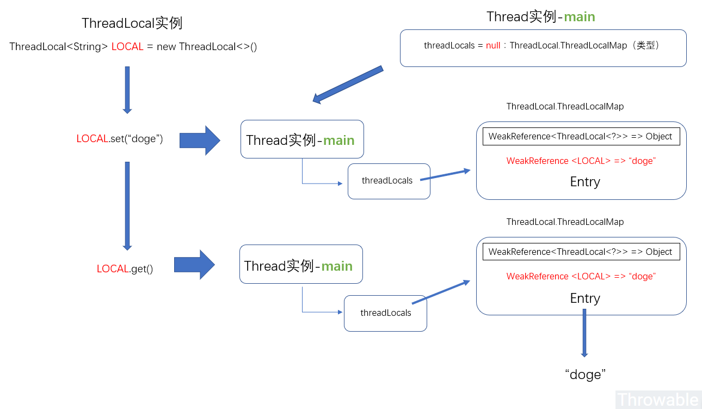
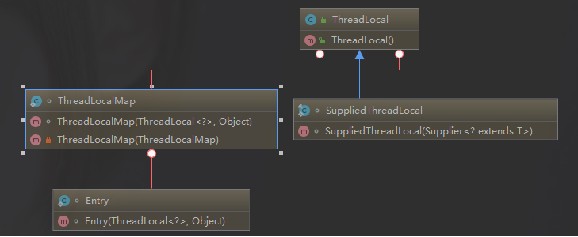
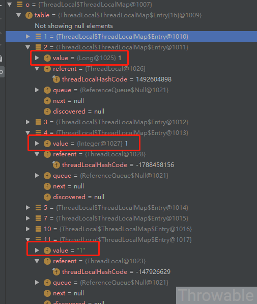
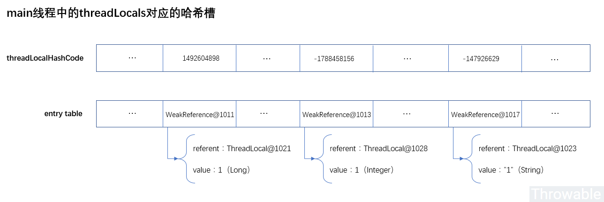
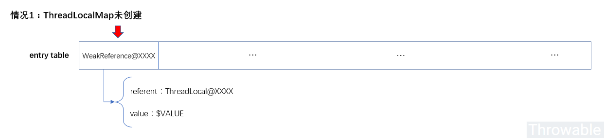
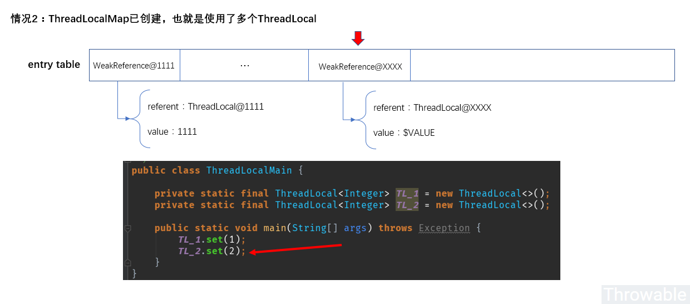
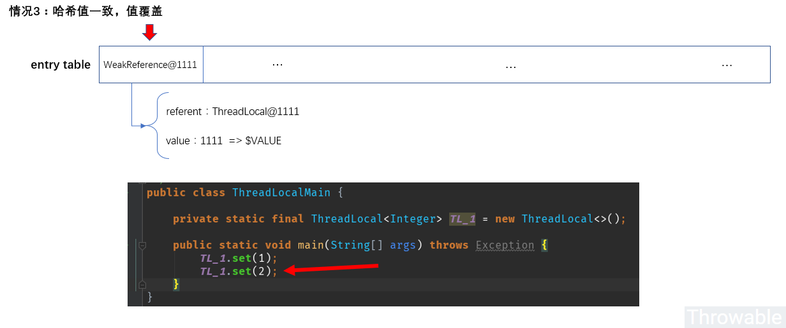
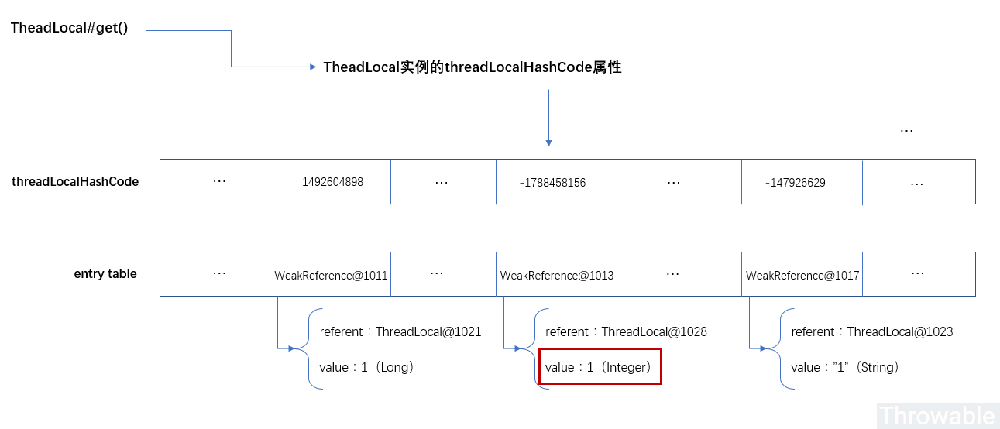
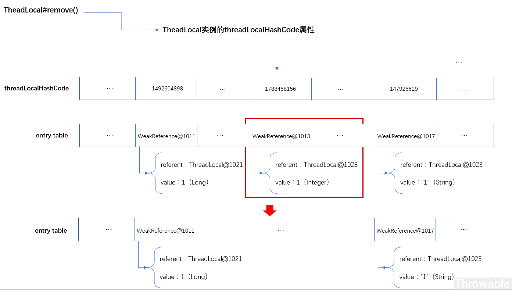

[TOC]

### ThreadLocal

#### 基础

##### 1. 要点总结

- 线程本地变量，在每个线程都有**同一个**变量的**独有拷贝**。
- 内部使用 **ThreadLocalMap** 存储变量的拷贝，数据存储与许多逻辑操作都是委托给静态内部类 ThreadLocalMap 完成的。
- 使用**线性探测法**而不是拉链法解决哈希冲突问题。
- 典型应用：**DateFormat** 的线程安全化，**ThreadLocalRandom** 类，**Spring 上下文**。

##### 2. 概述

ThreadLocal 提供**线程本地变量**。这些变量与正常的变量不同，因为**每一个线程在访问 ThreadLocal 实例的时候（通过其 get 或 set 方法）都有自己的、独立初始化的变量副本**。ThreadLocal 实例通常是类中的私有静态字段，使用它的目的是希望将状态（例如，用户 ID 或事务 ID）与线程关联起来。

**==线程本地变量==**，每个线程都有**同一个**变量的**独有拷贝**，如**多个线程**同时操作的是**同一个** ThreadLocal 对象，但每个线程都有**自己独立的值**，变动不会影响其他的线程。ThreadLocal 对象一般都定义为 **static**，便于**引用**。

ThreadLocal 用一种**存储变量与线程绑定**的方式，在每个线程中用自己的 **ThreadLocalMap** 安全**隔离**变量，为解决多线程程序的**并发问题**提供了一种新的思路，如为每个线程创建一个独立的数据库连接。因为是线程绑定的，所以在很多场景也被用来实现线程参数传递，如 Spring 的 **RequestContextHolder**。也因为每个**线程**拥有自己唯一的 ThreadLocalMap ，所以 ThreadLocalMap 是**天然线程安全**的。

##### 3. 使用场景

###### (1) 日期处理

ThreadLocal 是实现线程安全的一种方案，如对于 **DateFormat/SimpleDateFormat 是非线程安全**的，实现安全的一种方式是**使用锁**，另一种方式是每次都**创建一个新的对象**，更好的方式是使用 ThreadLocal，**每个线程使用自己的 DateFormat**，就不存在线程安全问题了。

```java
import java.text.SimpleDateFormat;
import java.util.Random;

public class ThreadLocalExample implements Runnable {

    // SimpleDateFormat 不是线程安全的，所以每个线程都要有自己独立的副本
    private static final ThreadLocal<SimpleDateFormat> formatter = ThreadLocal.withInitial(() -> new SimpleDateFormat("yyyyMMdd HHmm"));

    public static void main(String[] args) throws InterruptedException {
        ThreadLocalExample obj = new ThreadLocalExample();
        // 创建多个线程执行
        for (int i = 0; i < 10; i++) {
            Thread t = new Thread(obj, "" + i);
            Thread.sleep(new Random().nextInt(1000));
            t.start();
        }
    }

    @Override
    public void run() {
        System.out.println("Thread Name= " + Thread.currentThread().getName() + " default Formatter = " + formatter.get().toPattern());
        try {
            Thread.sleep(new Random().nextInt(1000));
        } catch (InterruptedException e) {
            e.printStackTrace();
        }
        // formatter pattern is changed here by thread, but it won't reflect to other threads
        formatter.set(new SimpleDateFormat());
        System.out.println("Thread Name= " + Thread.currentThread().getName() + " formatter = " + formatter.get().toPattern());
    }

}
```

输出

```java
Thread Name= 0 default Formatter = yyyyMMdd HHmm
Thread Name= 0 formatter = yy-M-d ah:mm
Thread Name= 1 default Formatter = yyyyMMdd HHmm
Thread Name= 2 default Formatter = yyyyMMdd HHmm
Thread Name= 1 formatter = yy-M-d ah:mm
Thread Name= 3 default Formatter = yyyyMMdd HHmm
Thread Name= 2 formatter = yy-M-d ah:mm
Thread Name= 4 default Formatter = yyyyMMdd HHmm
Thread Name= 3 formatter = yy-M-d ah:mm
Thread Name= 4 formatter = yy-M-d ah:mm
Thread Name= 5 default Formatter = yyyyMMdd HHmm
Thread Name= 5 formatter = yy-M-d ah:mm
Thread Name= 6 default Formatter = yyyyMMdd HHmm
Thread Name= 6 formatter = yy-M-d ah:mm
Thread Name= 7 default Formatter = yyyyMMdd HHmm
Thread Name= 7 formatter = yy-M-d ah:mm
Thread Name= 8 default Formatter = yyyyMMdd HHmm
Thread Name= 9 default Formatter = yyyyMMdd HHmm
Thread Name= 8 formatter = yy-M-d ah:mm
Thread Name= 9 formatter = yy-M-d ah:mm
```

从输出中可以看出，Thread-0 已经改变了 formatter 的值，但仍然是 thread-2 默认格式化程序与初始化值相同，其他线程也一样。

###### (2) 随机数

**Random** 类是线程**安全**的，但是多线程使用会存在**竞争问题**，性能会下降，所以提供了 **ThreadLocalRandom** 类，它是 Random 的子类，利用了 ThreadLocal，它没有 public 的构造方法，通过**静态**方法 current 获取对象。如：

```java
public static void main(String[] args) {
    ThreadLocalRandom threadLocalRandom = ThreadLocalRandom.current();
    System.out.println(threadLocalRandom.nextInt(100));
}
```

###### (3) 上下文信息

被广泛用在 **Spring** 等框架中。可以**存储上下文信息**，避免在不同代码之间来回传递，简化代码。

##### 4. 基本原理

ThreadLocal 虽然叫线程本地(局部)变量，但是实际上它**并不存放**任何的信息，可以这样理解：它是线程(Thread)**操作 ThreadLocalMap 中存放的变量的桥梁**。

它主要提供了**初始化、set()、get()、remove()** 几个方法。这样说可能有点抽象，下面画个图说明一下在线程中使用ThreadLocal 实例的 set() 和 get() 方法的简单流程图。

假设有如下的代码，假设主线程的线程名字是 main：

```java
public class Main {
	
	private static final ThreadLocal<String> LOCAL = new ThreadLocal<>();
	
	public static void main(String[] args) throws Exception{
		LOCAL.set("doge");
		System.out.println(LOCAL.get());
	}
}
```

**线程实例和 ThreadLocal 实例**的关系如下：



上面只描述了**单线程**的情况并且因为是主线程忽略了 Thread t = new Thread() 这一步，如果有多个线程会稍微复杂一些，但是原理是不变的，**ThreadLocal 实例**总是通过 **Thread.currentThread() 获取到当前操作线程实例，然后去操作线程实例中的 ThreadLocalMap 类型的成员变量，因此它是一个桥梁，本身不具备存储功能。**

#### 源码分析

ThreadLocal 的源码需要重点关注 **set()、get()、remove()** 几个方法。

##### 1. 内部属性

```java
// 获取下一个ThreadLocal实例的哈希魔数
private final int threadLocalHashCode = nextHashCode();
// 原子计数器，主要到它被定义为静态
private static AtomicInteger nextHashCode = new AtomicInteger();
// 哈希魔数(增长数)，也是带符号的32位整型值黄金分割值的取正
private static final int HASH_INCREMENT = 0x61c88647;
// 生成下一个哈希魔数
private static int nextHashCode() {
    return nextHashCode.getAndAdd(HASH_INCREMENT);
}
```

这里需要注意一点，threadLocalHashCode 是一个 **final** 的属性，而原子计数器变量 nextHashCode 和生成下一个哈希魔数的方法 **nextHashCode**() 是静态变量和静态方法，静态变量**只会初始化一次**。换而言之，**每新建一个ThreadLocal实例，它内部的 threadLocalHashCode 就会增加 0x61c88647**。举个例子：

```java
// t1中的threadLocalHashCode变量为0x61c88647
ThreadLocal t1 = new ThreadLocal();
// t2中的threadLocalHashCode变量为0x61c88647 + 0x61c88647
ThreadLocal t2 = new ThreadLocal();
// t3中的threadLocalHashCode变量为0x61c88647 + 0x61c88647 + 0x61c88647
ThreadLocal t3 = new ThreadLocal();
```

threadLocalHashCode 是下面的 ThreadLocalMap 结构中使用的**哈希算法的核心变量**，所以对于每个 ThreadLocal 实例，它的 **threadLocalHashCode 是唯一的**。

##### 2. 内部类ThreadLocalMap

ThreadLocal 内部类 ThreadLocalMap 使用了默认修饰符，也就是包(包私有)可访问的。**ThreadLocalMap** 是 ThreadLocal **真正的数据存储容器**，实际上 ThreadLocal 数据操作的复杂部分的所有**逻辑都在 ThreadLocalMap 中**进行，ThreadLocalMap 内部定义了一个静态类 Entry。

ThreadLocalMap 是 ThreadLocal 内部的一个 **Map** 实现，然而它并没有实现任何集合的接口规范，因为它仅供内部使用，数据结构采用 **数组 + ==开方地址法==**，**Entry** 继承 **WeakReference**，是基于 ThreadLocal 这种**特殊场景**实现的 Map，它的实现方式很值得研究。

ThreadLocalMap 类结构及其成员 Entry 定义如下：



即每个 Entry 对象都有一个 ThreadLocal 的弱引用作为 key，这是为了==**防止内存泄露**==。一旦线程结束，key变为一个**不可达**的对象，这个 Entry 就可以被 GC 了。在一些场景 (尤其是**使用线程池**) 下容易造成内存泄露问题，需要养成手动 remove 的习惯。

**ThreadLocalMap** 是 ThreadLocal 的**静态内部类**。

重点看 ThreadLocalMap 的源码。

###### (1) 成员属性

先看**成员和结构**部分：

```java
/**
 * ThreadLocalMap是一个定制的散列映射，仅适用于维护线程本地变量。
 * 它的所有方法都是定义在ThreadLocal类之内。
 * 它是包私有的，所以在Thread类中可以定义ThreadLocalMap作为变量。
 * 为了处理非常大(指的是值)和长时间的用途，哈希表的Key使用了弱引用(WeakReferences)。
 * 引用的队列(弱引用)不再被使用的时候，对应的过期的条目就能通过主动删除移出哈希表。
 */
static class ThreadLocalMap {

    // 注意这里的Entry的Key为WeakReference<ThreadLocal<?>>
    static class Entry extends WeakReference<ThreadLocal<?>> {

        // 这个是真正的存放的值
        Object value;
        // Entry的Key就是ThreadLocal实例本身，Value就是输入的值
        Entry(ThreadLocal<?> k, Object v) {
            super(k);
            value = v;
        }
    }
    // 初始化容量，必须是2的幂次方
    private static final int INITIAL_CAPACITY = 16;

    // 哈希(Entry)表，必须时扩容，长度必须为2的幂次方
    private Entry[] table;

    // 哈希表中元素(Entry)的个数
    private int size = 0;

    // 下一次需要扩容的阈值，默认值为0
    private int threshold;

    // 设置下一次需要扩容的阈值，设置值为输入值len的三分之二
    private void setThreshold(int len) {
        threshold = len * 2 / 3;
    }

    // 以len为模增加i
    private static int nextIndex(int i, int len) {
        return ((i + 1 < len) ? i + 1 : 0);
    }

    // 以len为模减少i
    private static int prevIndex(int i, int len) {
        return ((i - 1 >= 0) ? i - 1 : len - 1);
    }
}
```

这里注意到十分重要的一点：**ThreadLocalMap$Entry 是 WeakReference(弱引用)**，并且**键 Key 为 ThreadLocal 实例本身**，这里使用了无限定的泛型通配符。

Entry 继承 WeakReference，以 **ThreadLocal** 为 **key**，类似 WeakHashMap，对**内存敏感**。虽然继承 WeakReference，但只能实现对 Reference 的 **key 的回收**，而**对 value 的回收需要手动解决**。value 何时被回收？ **如果没有理解 value 的回收时间，那可能留下==内存泄露==的隐患**。

###### (2) 构造方法

接着看 ThreadLocalMap 的构造函数：

```java
// 构造ThreadLocal时候使用，对应ThreadLocal的实例方法void createMap(Thread t, T firstValue)
ThreadLocalMap(ThreadLocal<?> firstKey, Object firstValue) {
    // 哈希表默认容量为16
    table = new Entry[INITIAL_CAPACITY];
    // 计算第一个元素的哈希码
    int i = firstKey.threadLocalHashCode & (INITIAL_CAPACITY - 1);
    table[i] = new Entry(firstKey, firstValue);
    size = 1;
    setThreshold(INITIAL_CAPACITY);
}

// 构造InheritableThreadLocal时候使用，基于父线程的ThreadLocalMap里面的内容进行提取放入新的ThreadLocalMap的哈希表中
// 对应ThreadLocal的静态方法static ThreadLocalMap createInheritedMap(ThreadLocalMap parentMap)
private ThreadLocalMap(ThreadLocalMap parentMap) {
    Entry[] parentTable = parentMap.table;
    int len = parentTable.length;
    setThreshold(len);
    table = new Entry[len];
    // 基于父ThreadLocalMap的哈希表进行拷贝
    for (Entry e : parentTable) {
        if (e != null) {
            @SuppressWarnings("unchecked")
            ThreadLocal<Object> key = (ThreadLocal<Object>) e.get();
            if (key != null) {
                Object value = key.childValue(e.value);
                Entry c = new Entry(key, value);
                int h = key.threadLocalHashCode & (len - 1);
                while (table[h] != null)
                    h = nextIndex(h, len);
                table[h] = c;
                size++;
            }
        }
    }
}
```

这里注意一下，ThreadLocal 的 set() 方法调用的时候会**懒初始化**一个 ThreadLocalMap 并且**放入第一个元素**。而 ThreadLocalMap 的私有构造是提供给静态方法 ThreadLocal#createInheritedMap() 使用的。

构造函数的第一个参数就是本 ThreadLocal 实例(this)，第二个参数就是要保存的**线程本地变量**。构造函数首先创建一个长度为 **16** 的 **Entry 数组**，然后计算出 firstKey 对应的**哈希值**，然后存储到 table 中，并设置 size 和 threshold。

注意一个细节，计算 hash 的时候里面采用了 **hashCode & (size - 1)** 的算法，这相当于取模运算 hashCode % size 的一个更高效的实现（和 HashMap 中的思路相同）。正是因为这种算法，所以 size 必须是 **2 的指数**，因为这可以使得 hash 发生冲突的次数减小。

###### (3) 实例方法

接着看 ThreadLocalMap 提供给 ThreadLocal 使用的一些实例方法：

```java
// 如果Key在哈希表中找不到哈希槽的时候会调用此方法
private Entry getEntryAfterMiss(ThreadLocal<?> key, int i, Entry e) {
    Entry[] tab = table;
    int len = tab.length;
    // 这里会通过nextIndex尝试遍历整个哈希表，如果找到匹配的Key则返回Entry
    // 如果哈希表中存在Key == null的情况，调用expungeStaleEntry进行清理
    while (e != null) {
        ThreadLocal<?> k = e.get();
        if (k == key)
            return e;
        if (k == null)
            expungeStaleEntry(i);
        else
            i = nextIndex(i, len);
        e = tab[i];
    }
    return null;
}

// 1.清空staleSlot对应哈希槽的Key和Value
// 2.对staleSlot到下一个空的哈希槽之间的所有可能冲突的哈希表部分槽进行重哈希，置空Key为null的槽
// 3.注意返回值是staleSlot之后的下一个空的哈希槽的哈希码
private int expungeStaleEntry(int staleSlot) {
    Entry[] tab = table;
    int len = tab.length;

    // expunge entry at staleSlot
    // 清空staleSlot对应哈希槽的Key和Value
    tab[staleSlot].value = null;
    tab[staleSlot] = null;
    size--;

    // Rehash until we encounter null
    // 下面的过程是对staleSlot到下一个空的哈希槽之间的所有可能冲突的哈希表部分槽进行重哈希，置空Key为null的槽
    Entry e;
    int i;
    for (i = nextIndex(staleSlot, len); (e = tab[i]) != null; i = nextIndex(i, len)) {
        ThreadLocal<?> k = e.get();
        if (k == null) {
            e.value = null;
            tab[i] = null;
            size--;
        } else {
            int h = k.threadLocalHashCode & (len - 1);
            if (h != i) {
                tab[i] = null;

                // Unlike Knuth 6.4 Algorithm R, we must scan until
                // null because multiple entries could have been stale.
                while (tab[h] != null)
                    h = nextIndex(h, len);
                tab[h] = e;
            }
        }
    }
    return i;
}

// 这里个方法比较长，作用是替换哈希码为staleSlot的哈希槽中Entry的值
private void replaceStaleEntry(ThreadLocal<?> key, Object value, int staleSlot) {
    Entry[] tab = table;
    int len = tab.length;
    Entry e;

    // Back up to check for prior stale entry in current run.
    // We clean out whole runs at a time to avoid continual
    // incremental rehashing due to garbage collector freeing
    // up refs in bunches (i.e., whenever the collector runs).
    int slotToExpunge = staleSlot;
    // 这个循环主要是为了找到staleSlot之前的最前面的一个Key为null的哈希槽的哈希码
    for (int i = prevIndex(staleSlot, len); (e = tab[i]) != null; i = prevIndex(i, len))
        if (e.get() == null)
            slotToExpunge = i;

    // Find either the key or trailing null slot of run, whichever
    // occurs first
    // 遍历staleSlot之后的哈希槽，如果Key匹配则用输入值替换
    for (int i = nextIndex(staleSlot, len); (e = tab[i]) != null; i = nextIndex(i, len)) {
        ThreadLocal<?> k = e.get();

        // If we find key, then we need to swap it
        // with the stale entry to maintain hash table order.
        // The newly stale slot, or any other stale slot
        // encountered above it, can then be sent to expungeStaleEntry
        // to remove or rehash all of the other entries in run.
        if (k == key) {
            e.value = value;
            tab[i] = tab[staleSlot];
            tab[staleSlot] = e;
            // Start expunge at preceding stale entry if it exists
            if (slotToExpunge == staleSlot)
                slotToExpunge = i;
            cleanSomeSlots(expungeStaleEntry(slotToExpunge), len);
            return;
        }

        // If we didn't find stale entry on backward scan, the
        // first stale entry seen while scanning for key is the
        // first still present in the run.
        if (k == null && slotToExpunge == staleSlot)
            slotToExpunge = i;
    }
    // Key匹配不了，则新创建一个哈希槽
    // If key not found, put new entry in stale slot
    tab[staleSlot].value = null;
    tab[staleSlot] = new Entry(key, value);

    // 这里如果当前的staleSlot和找到前置的slotToExpunge不一致会进行一次清理
    // If there are any other stale entries in run, expunge them
    if (slotToExpunge != staleSlot)
        cleanSomeSlots(expungeStaleEntry(slotToExpunge), len);
}

// 对当前哈希表中所有的Key为null的Entry调用expungeStaleEntry
private void expungeStaleEntries() {
    Entry[] tab = table;
    int len = tab.length;
    for (int j = 0; j < len; j++) {
        Entry e = tab[j];
        if (e != null && e.get() == null)
            expungeStaleEntry(j);
    }
}

// 清理第i个哈希槽之后的n个哈希槽，如果遍历的时候发现Entry的Key为null，则n会重置为哈希表的长度，expungeStaleEntry有可能会重哈希使得哈希表长度发生变化
private boolean cleanSomeSlots(int i, int n) {
    boolean removed = false;
    Entry[] tab = table;
    int len = tab.length;
    do {
        i = nextIndex(i, len);
        Entry e = tab[i];
        if (e != null && e.get() == null) {
            n = len;
            removed = true;
            i = expungeStaleEntry(i);
        }
    } while ( (n >>>= 1) != 0);
    return removed;
}

/**
 * 这个方法主要给`ThreadLocal#get()`调用，通过当前ThreadLocal实例获取哈希表中对应的Entry
 *
 */
private Entry getEntry(ThreadLocal<?> key) {
    // 计算Entry的哈希值
    int i = key.threadLocalHashCode & (table.length - 1);
    Entry e = table[i]; 
    if (e != null && e.get() == key)
        return e;
    else  // 注意这里，如果e为null或者Key对不上，会调用getEntryAfterMiss
        return getEntryAfterMiss(key, i, e);
}

// 重哈希，必要时进行扩容
private void rehash() {
    // 清理所有空的哈希槽，并且进行重哈希
    expungeStaleEntries();

    // Use lower threshold for doubling to avoid hysteresis
    // 哈希表的哈希元素个数大于3/4阈值时候触发扩容
    if (size >= threshold - threshold / 4)
        resize();
}

// 扩容，简单的扩大2倍的容量        
private void resize() {
    Entry[] oldTab = table;
    int oldLen = oldTab.length;
    int newLen = oldLen * 2;
    Entry[] newTab = new Entry[newLen];
    int count = 0;

    for (Entry e : oldTab) {
        if (e != null) {
            ThreadLocal<?> k = e.get();
            if (k == null) {
                e.value = null; // Help the GC
            } else {
                int h = k.threadLocalHashCode & (newLen - 1);
                while (newTab[h] != null)
                    h = nextIndex(h, newLen);
                newTab[h] = e;
                count++;
            }
        }
    }

    setThreshold(newLen);
    size = count;
    table = newTab;
}

// 基于ThreadLocal作为key，对当前的哈希表设置值，此方法由`ThreadLocal#set()`调用
private void set(ThreadLocal<?> key, Object value) {

    // We don't use a fast path as with get() because it is at
    // least as common to use set() to create new entries as
    // it is to replace existing ones, in which case, a fast
    // path would fail more often than not.

    Entry[] tab = table;
    int len = tab.length;
    int i = key.threadLocalHashCode & (len-1);
    // 变量哈希表
    for (Entry e = tab[i]; e != null; e = tab[i = nextIndex(i, len)]) {
        ThreadLocal<?> k = e.get();
        // Key匹配，直接设置值
        if (k == key) {
            e.value = value;
            return;
        }
        // 如果Entry的Key为null，则替换该Key为当前的key，并且设置值
        if (k == null) {
            replaceStaleEntry(key, value, i);
            return;
        }
    }

    tab[i] = new Entry(key, value);
    int sz = ++size;
    // 清理当前新设置元素的哈希槽下标到sz段的哈希槽，如果清理成功并且sz大于阈值则触发扩容
    if (!cleanSomeSlots(i, sz) && sz >= threshold)
        rehash();
}
```

简单来说，ThreadLocalMap 是 ThreadLocal **真正的数据存储容器**，实际上 ThreadLocal 数据操作的复杂部分的所有逻辑都在 ThreadLocalMap 中进行，**而 ThreadLocalMap 实例是 Thread 的成员变量**，在 **ThreadLocal#set() 方法首次调用的时候设置到当前执行的线程实例中**。如果在同一个线程中使用多个 ThreadLocal 实例，实际上，每个 ThreadLocal **实例对应的是 ThreadLocalMap 的哈希表中的一个哈希槽**。举个例子，在主函数主线程中使用多个 ThreadLocal 实例：

```java
public class ThreadLocalMain {

    private static final ThreadLocal<Integer> TL_1 = new ThreadLocal<>();
    private static final ThreadLocal<String> TL_2 = new ThreadLocal<>();
    private static final ThreadLocal<Long> TL_3 = new ThreadLocal<>();

    public static void main(String[] args) throws Exception {
        TL_1.set(1);
        TL_2.set("1");
        TL_3.set(1L);
        Field field = Thread.class.getDeclaredField("threadLocals");
        field.setAccessible(true);
        Object o = field.get(Thread.currentThread());
        System.out.println(o);
    }
}
```

实际上，主线程的 **threadLocals 属性**中的哈希表中一般不止上面定义的三个 ThreadLocal，因为加载主线程的时候还有可能在**其他地方使用到 ThreadLocal**，笔者某次 Debug 的结果如下：



简化一下：



上图 threadLocalHashCode 属性一行的表是为了标出每个 Entry 的哈希槽的哈希值，实际上 threadLocalHashCode 是 ThreadLocal@XXXX 中的一个属性，这是很显然的，本来 threadLocalHashCode 就是 ThreadLocal 的一个成员变量。

上面只是简单粗略对 ThreadLocalMap 的源码进行了流水账的分析，下文会作一些详细的图，说明一下 ThreadLocal 和 ThreadLocalMap 中的一些核心操作的过程。

###### (4) ThreadLocalMap初始化

可以关注一下 java.lang.**Thread 类**里面的属性变量：

```java
public class Thread implements Runnable {

    // 传递ThreadLocal中的ThreadLocalMap变量
    ThreadLocal.ThreadLocalMap threadLocals = null;
    // 传递InheritableThreadLocal中的ThreadLocalMap变量
    ThreadLocal.ThreadLocalMap inheritableThreadLocals = null;
}
```

也就是 ThreadLocal 需要**存放和获取的数据实际上绑定在 Thread 实例的成员变量 threadLocals 中，并且是ThreadLocal#set() 方法调用的时候才进行懒加载的**，可以结合上一节的内容理解一下。

##### 3. ThreadLocal的构造方法

从 ThreadLocal 的构造函数来看，ThreadLocal 实例的构造并不会做任何操作，只是为了得到一个 ThreadLocal 的泛型实例，后续可以**把它作为 ThreadLocalMap$Entry 的键**：

```java
// 注意threadLocalHashCode在每个新`ThreadLocal`实例的构造同时已经确定了
private final int threadLocalHashCode = nextHashCode();
private static AtomicInteger nextHashCode = new AtomicInteger();
private static final int HASH_INCREMENT = 0x61c88647;
private static int nextHashCode() {
    return nextHashCode.getAndAdd(HASH_INCREMENT);
}

// 通过Supplier去覆盖initialValue方法
public static <S> ThreadLocal<S> withInitial(Supplier<? extends S> supplier) {
    return new SuppliedThreadLocal<>(supplier);
}

// 默认公有构造函数
public ThreadLocal() {

}
```

注意 **threadLocalHashCode** 在每个**新 ThreadLocal 实例的构造同时已经确定了**，这个值也是 Entry 哈希表的**哈希槽绑定的哈希值**。

##### 4. TreadLocal的set方法

ThreadLocal 中 set() 方法的源码如下：

```java
public void set(T value) {
    // 设置值前总是获取当前线程实例
    Thread t = Thread.currentThread();
    // 从当前线程实例中获取threadLocals属性
    ThreadLocalMap map = getMap(t);
    if (map != null)
        // threadLocals属性不为null则覆盖key为当前的ThreadLocal实例，值为value
        map.set(this, value);
    else
        // threadLocals属性为null，则创建ThreadLocalMap，第一个项的Key为当前的ThreadLocal实例，值为value
        createMap(t, value);
}
```

这里看到获取 ThreadLocalMap 实例时候总是**从线程实例的成员变量**获取。**threadLocals 属性是 Thread 类的一个属性**。

```java
public class Thread implements Runnable {
    // Thread类保存有一个ThreadLocalMap类型的属性threadLocals
    ThreadLocal.ThreadLocalMap threadLocals = null;
}
```

获取 map 是获取**线程**的 **ThreadLocalMap 属性**。

```java
ThreadLocalMap getMap(Thread t) {
    return t.threadLocals;
}
```

**创建 ThreadLocalMap 实例的时候，会把新实例赋值到线程实例 Thread 的 threadLocals 成员属性。**

```java
void createMap(Thread t, T firstValue) {
    // 设置当前线程实例的threadLocals属性
    t.threadLocals = new ThreadLocalMap(this, firstValue);
}
```

上面的过程源码很简单，设置值的时候总是先获取**当前线程**实例并且操作**它的变量 threadLocals**。步骤是：

- 获取当前运行线程的**实例**。
- 通过线程实例获取线程实例成员 threadLocals(ThreadLocalMap)，如果为 null，则创建一个新的ThreadLocalMap 实例赋值到 threadLocals。
- 通过 threadLocals 设置值 value，如果原来的哈希槽**已经存在值**，则进行**覆盖**。







##### 5. TreadLocal的get方法

ThreadLocal 中 get() 方法的源码如下：

````java
public T get() {
    // 获取当前线程的实例
    Thread t = Thread.currentThread();
    // 获取map是获取线程的ThreadLocalMap属性
    ThreadLocalMap map = getMap(t);
    if (map != null) {
        // 根据当前的ThreadLocal实例获取ThreadLocalMap中的Entry，使用的是ThreadLocalMap的getEntry方法
        ThreadLocalMap.Entry e = map.getEntry(this);
        if (e != null) {
            @SuppressWarnings("unchecked")
            T result = (T) e.value;
            return result;
        }
    }
    // 线程实例中的threadLocals为null，则调用initialValue方法，并且创建ThreadLocalMap赋值到threadLocals
    return setInitialValue();
}
````

```java
private T setInitialValue() {
    // 调用initialValue方法获取值
    T value = initialValue();
    Thread t = Thread.currentThread();
    ThreadLocalMap map = getMap(t);
    // ThreadLocalMap如果未初始化则进行一次创建，已初始化则直接设置值
    if (map != null)
        map.set(this, value);
    else
        createMap(t, value);
    return value;
}
```

```java
protected T initialValue() {
    return null;
}
```

**initialValue**() 方法默认返回 null，**如果 ThreadLocal 实例没有使用过 set() 方法直接使用 get() 方法**，那么ThreadLocalMap 中的此 ThreadLocal 为 Key 的项会**把值设置为 initialValue() 方法的返回值**。如果想改变这个逻辑可以对 initialValue() 方法进行覆写。



##### 6. TreadLocal的remove方法

ThreadLocal 中 remove() 方法的源码如下：

```java
public void remove() {
    // 获取Thread实例中的ThreadLocalMap
    ThreadLocalMap m = getMap(Thread.currentThread());
    if (m != null)
        // 根据当前ThreadLocal作为Key对ThreadLocalMap的元素进行移除
        m.remove(this);
}
```




#### 内存泄漏

什么情况下 ThreadLocal 的使用会导致内存泄漏？

其实 ThreadLocal 本身**不存放任何**的数据，而 ThreadLocal 中的数据实际上是**存放在线程实例**中，从实际来看是**线程内存泄漏**，底层来看是 **Thread 对象中的成员变量 threadLocals 持有大量的 K-V 结构**，并且线程一直处于**活跃状态**导致变量 threadLocals **无法释放被回收**。threadLocals 持有大量的 K-V 结构这一点的前提是要存在**大量的 ThreadLocal 实例**的定义，一般来说，一个应用不可能定义大量的 ThreadLocal，所以一般的**泄漏源**是**线程一直处于活跃状态导致变量 threadLocals 无法释放被回收**。但是 ThreadLocalMap 中的 **Entry 结构的 Key 用到了弱引用**(WeakReference<ThreadLocal<?>>)，当没有强引用来引用 ThreadLoca l实例的时候，JVM 的 GC **会回收 **ThreadLocalMap 中的这些 Key，此时 ThreadLocalMap 中会出现一些 **Key 为 null**，但是 **Value 不为 null** 的 Entry 项，这些 **Entry 项**如果不主动清理，就会一直**驻留**在 ThreadLocalMap 中。也就是为什么 ThreadLocal 中 get()、set()、remove() 这些方法中**都存在清理 ThreadLocalMap 实例 key 为 null 的代码块**。总结下来，内存泄漏可能出现的地方是：

- **大量地(静态)初始化 ThreadLocal 实例**，初始化之后不再调用 get()、set()、remove() 方法。
- 初始化了大量的 ThreadLocal，这些 ThreadLocal 中存放了**容量大的 Value**，并且使用了这些 ThreadLocal 实例的线程一直处于**活跃**的状态。

ThreadLocal 中一个设计亮点是 **ThreadLocalMap** 中的 **Entry 结构的 Key 用到了弱引用**。试想如果使用强引用，等于 ThreadLocalMap 中的所有数据**都是与 Thread 的生命周期绑定**，这样很容易出现因为大量线程持续活跃导致的内存泄漏。使用了弱引用的话，JVM 触发 GC 回收弱引用后，ThreadLocal 在**下一次调用get()、set()、remove()方法就可以删除**那些 ThreadLocalMap 中 Key 为 null 的值，起到了**惰性删除释放内存**的作用。

其实 ThreadLocal 在设置内部类 ThreadLocal.ThreadLocalMap 中构建的 Entry 哈希表已经**考虑到内存泄漏**的问题，所以 ThreadLocal.ThreadLocalMap$Entry 类设计为弱引用，类签名为 static class Entry extends WeakReference<ThreadLocal<?>>。如果弱引用关联的对象如果置为 null，那么该弱引用会在下一次 GC 时候回收弱引用关联的对象。举个例子：

```java
public class ThreadLocalMain {
    private static ThreadLocal<Integer> local1 = new ThreadLocal<>();

    public static void main(String[] args) throws Exception {
        local1.set(1);
        local1 = null;
        System.gc();
        Thread.sleep(300);
    }
}
```

这种情况下，local1 这个 ThreadLocal 在**主动 GC** 之后，线程绑定的 ThreadLocal.ThreadLocalMap 实例中的 Entry 哈希表中原来的 local1 所在的哈希槽 Entry 的引用持有值 referent (继承自 WeakReference )会变成 null，但是 Entry 中的 value 是**强引用**，还存放着 local1 这个 ThreadLocal 未回收之前的值。**这些被"孤立"的哈希槽 Entry 就是前面说到的要惰性删除的哈希槽。**

> **弱引用？**

如果一个对象**只具有弱引用**，那就类似于**可有可无的生活用品**。弱引用与软引用的区别在于：只具有弱引用的对象拥有更短暂的生命周期。在垃圾回收器线程扫描它 所管辖的内存区域的过程中，一旦发现了只具有弱引用的对象，不管当前内存空间足够与否，都会回收它的内存。不过，由于垃圾回收器是一个优先级很低的线程， 因此不一定会很快发现那些只具有弱引用的对象。

弱引用可以和一个引用队列（ReferenceQueue）联合使用，如果弱引用所引用的对象被垃圾回收，虚拟机就会把这个弱引用加入到与之关联的引用队列中。


#### 最佳实践

其实 ThreadLocal 的最佳实践很简单：在一些场景 (尤其是**使用线程池**) 下容易造成内存泄露问题，需要养成手动 remove 的习惯。

- **每次使用完 ThreadLocal 实例，都调用它的 remove() 方法，清除 Entry 中的数据。**

调用 remove() 方法最佳时机是线程运行**结束之前**的 finally 代码块中调用，这样能完全避免操作不当导致的内存泄漏，这种主动清理的方式比**惰性删除**有效。


#### 参考资料

- ThreadLocal源码分析：http://www.throwable.club/2019/02/17/java-concurrency-threadlocal-source-code/