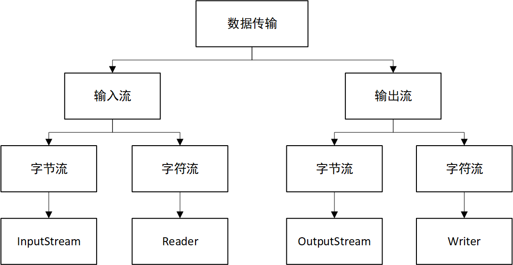
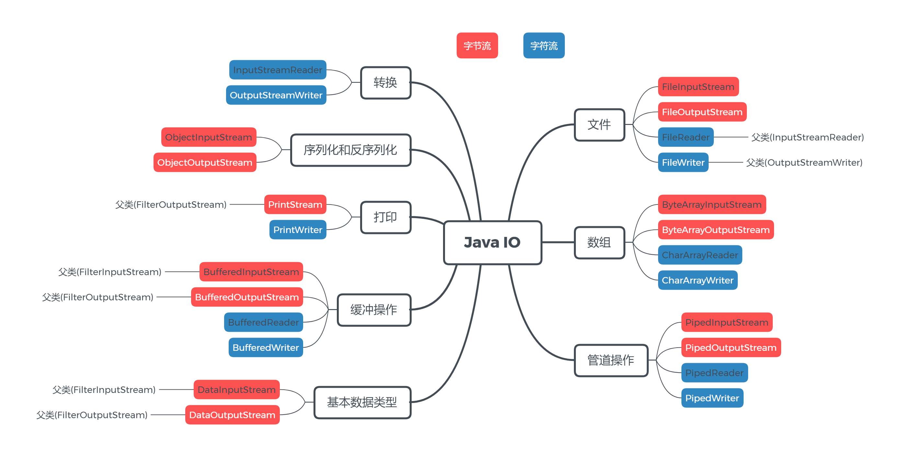
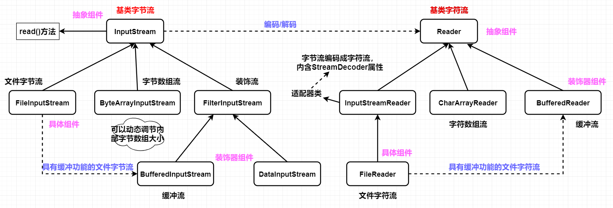
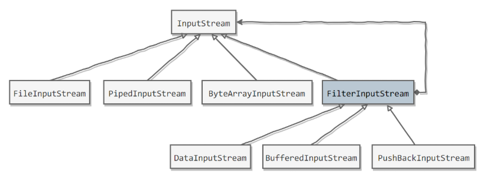

[TOC]

### IO流操作

#### 基础

数据传输的核心在于传输数据源产生的数据，Java IO 分别为**输入流和输出流**，输入流完成外部数据向计算机内存写入，输出流则反之。而针对输入流和输出流，根据**字节和字符**的不同，又分为**字节流和字符流**。



字符流与字节流的关系：Java 中最小的计算单元是**字节**，没有字符流基于**字节流**就能进行 IO 操作，只是因为现实中**大量的数据都是文本字符**数据，基于此单独设计了**字符流**，使操作更简便。

上图就是 IO 中的 4 个**顶层接口**，接下来 Java IO 又从多种**应用场景**（包括了基础数据类型、文件、数组、管道、打印、序列化）和传输效率（缓冲操作）进行了考虑，提供了种类众多的 Java IO **流的实现类**，看下图：



实际使用过程中用的最多的还是文件类操作、转换类操作、序列化操作，在此基础上可以使用 **Buffered** 来提高效率（Java IO 使用了**装饰器模式**）。下面的体系图是自己理解画的，错了不负责。



流操作类大致分为两大类，一类是针对二进制文件的==**字节流**==，另一类是针对文本文件的==**字符流**==。下面分述。


#### 字节流

File 对象仅仅用于**抽象**化描述一个**磁盘文件或目录**，却**不具备**访问和修改一个文件**内容**的能力。对文件的读写需要依靠**IO 流**，这是用于**读写文件内容**的一种设计，它能完成将磁盘文件内容输出到**内存**或者是将内存数据输出到**磁盘**文件的数据传输工作。

**字节流**的体系大致如下：


##### 1. 基类字节流InputStream/OutputStream

InputStream 和 OutputStream 分别作为读字节流和写字节流的==**基类**==，都是抽象类，且定义了最基本的**读写**操作，所有字节相关的流都必然**继承**自它们中任意一个。

###### (1) 基本API

以 InputStream 为例：

```java
public abstract int read() throws IOException;
```

**read 方法用于返回当前文件的==下一个==字节**。这是一个**抽象**的方法，并没有提供默认实现，要求**子类**必须实现。

> 这个方法返回的是 ==**int 类型**==，**为什么不用「byte」**？

read 方法返回的值是一个二进制数，一个八位的二进制可以取值的值区间为：**「0000 0000，1111 1111」**，也就是范围 **[-128, 127]**。**read 方法**规定当读取到文件的**末尾**，即文件没有下一个字节供读取时返回 ==**-1**== 。所以如果使用 byte 作为返回值类型，那么当方法返回一个 -1 时，就**无法判定**这是文件中数据内容，还是流的末尾。

而 **int 类型**占四个字节，高位的三个字节全部为 **0**，我们只使用它的最低位字节，当遇到流**结尾标志**时，返回**四个字节表示的 -1**（**32 个 1**），这就与普通数值 -1（**24 个 0 + 8 个 1**）**区别**开来了。

看另一个 read 方法，但是 InputStream 提供**默认**实现：

```java
public int read(byte b[]) throws IOException {
    return read(b, 0, b.length);
}

public int read(byte b[], int off, int len) throws IOException{
    // 方法体可查看 jdk 源码
}
```

这两个方法本质上是一样的，第一个方法是第二个方法的特殊形态，它允许传入一个**字节数组**，并要求程序将文件中读到的字节从数组索引位置 0 开始填充，供填充数组长度个字节数。而第二个方法更加宽泛一点，它允许你指定起始位置和字节总数。

InputStream 中还有其他几个方法，基本都没怎么具体实现，留待**子类实现**，如下：

- public long **skip**(long n)：跳过 n 个字节，返回实际跳过的字节数。
- public void **close**()：关闭流并释放对应的资源。
- public synchronized void **mark**(int readlimit)。
- public synchronized void **reset**()。
- public boolean **markSupported**()。

mark 方法会在当前流读取位置打上一个标志，reset 方法即**重置**读取指针到该标志处。

事实上，文件读取是**不可能重置回头读取**的，而一般都是将标志位置到重置点之间所有的字节临时保存了，当调用 reset 方法时，其实是从保存的临时字节集合进行重复读取，所以 readlimit 用于限制最大缓存容量。而 markSupported 方法则用于确定当前流**是否支持这种「回退式」**读取操作。

OutputStream 和 InputStream 是类似的，只不过一个是写一个是读，不再赘述。

###### (2) 实现文件复制

```java
public static void copyFile(String src, String dist) throws IOException {
    FileInputStream in = new FileInputStream(src);
    FileOutputStream out = new FileOutputStream(dist);

    byte[] buffer = new byte[20 * 1024];
    int cnt;

    // read() 最多读取 buffer.length 个字节
    // 返回的是实际读取的个数
    // 返回 -1 的时候表示读到 eof，即文件尾
    while ((cnt = in.read(buffer, 0, buffer.length)) != -1) {
        out.write(buffer, 0, cnt);
    }

    in.close();
    out.close();
}
```

##### 2. 文件字节流FileInput/OutputStream

依然着重点于 FileInputStream，而 FileOutputStream 是类似的。首先 FileInputStream 有以下几种构造器实例化一个对象，此外还有参数 **append** 指明了此流的写入操作是**覆盖还是追加**，true 表示追加，false 表示覆盖。

```java
// 传入文件路径
public FileInputStream(String name) throws FileNotFoundException {
    this(name != null ? new File(name) : null);
}
// 传入File对象
public FileInputStream(File file) throws FileNotFoundException {
    String name = (file != null ? file.getPath() : null);
    SecurityManager security = System.getSecurityManager();
    if (security != null) {
        security.checkRead(name);
    }
    if (name == null) {
        throw new NullPointerException();
    }
    if (file.isInvalid()) {
        throw new FileNotFoundException("Invalid file path");
    }
    fd = new FileDescriptor();
    fd.attach(this);
    path = name;
    open(name);
}
```

这两个构造器本质上也是一样的，前者是后者的特殊形态。后者的方法体大部分都只是在做**安全校验**，核心的就是一个 open 方法，用于**打开一个文件**。如果文件不存在或者文件路径和名称不合法，都将抛出 FileNotFoundException 异常。

FileInputStream 使用**本地方法 read0()**进行了实现了基类 InputStream 中的 **read 方法**：

```java
public int read() throws IOException {
    return read0();
}

private native int read0() throws IOException;
```

它用于返回流中下一个字节，返回 **-1** 说明读取到文件末尾，已无字节可读。

除此之外，FileInputStream 中还有一些其他的读取相关方法，但大多采用了**本地方法**进行了实现，比如：

- public int **read**(byte b[])：读取 b.length() 个长度的字节到数组中。
- public int **read**(byte b[], int off, int len)：读取指定长度的字节数到数组中。
- public native long **skip**(long n)：跳过 n 的字节进行读取。
- public void **close**()：释放流资源。

看一个文件读取的例子：

```java
public static void main(String[] args) throws IOException {
    FileInputStream input = new ileInputStream("C:\\test.txt");
    byte[] buffer = new byte[1024];
    int len = input.read(buffer);
    String str = new String(buffer);
    System.out.println(str);
    System.out.println(len);
    input.close();
}
```

这会打印出 test 文件中的内容和实际读出的字节数，如何保证 test 文件中内容不会超过 1024 个字节呢？为了能够完整的读出文件中的内容，一种解决办法是：将 **buffer** 定义的足够大，以期望尽可能的能够存储下文件中的所有内容。这种方法显然是不可取的，因为我们根本不可能实现知道待读文件的实际大小。第二种方式就是使用的**动态字节数组流**(下一节)，它**可以动态调整内部字节数组的大小**，保证适当的容量。

##### 3. 字节数组流ByteArrayInput/OutputStream

所谓的「字节数组流」就是围绕一个**字节数组**运作的流。字节数组流虽然并不是基于文件的流，但依然是很重要的流，因为它内部封装的**字节数组并不是固定**的，而是**动态可扩容**的，在某些场景下使用非常合适。

ByteArrayInputStream 是**读字节数组流**，可以通过以下构造函数被实例化：

```java
protected byte[] buf;
protected int pos;
protected int count;

public ByteArrayInputStream(byte[] buf) {
    this.buf = buf;
    this.pos = 0;
    this.count = buf.length;
}

public ByteArrayInputStream(byte buf[], int offset, int length)
```

**buf** 就是被封装在 ByteArrayInputStream 内部的一个**字节数组**，ByteArrayInputStream 的所有读操作都是**围绕**着它进行的。所以实例化一个 ByteArrayInputStream 对象的时候，至少需要**传入**一个**目标字节数组**。

pos 属性用于记录当前流读取的位置，count 记录了目标字节数组最后一个有效字节索引的后一个位置。理解了这一点，有关它各种的 read 方法就不难了：

```java
// 读取下一个字节
public synchronized int read() {
    return (pos < count) ? (buf[pos++] & 0xff) : -1;
}
// 读取 len 个字节放到字节数组 b 中
public synchronized int read(byte b[], int off, int len){
	// ...
}
```

因为 ByteArrayInputStream 是基于字节数组的，所有**重复读取操作**的实现就比较容易了，**基于索引实现**就可以了。

```java
public void mark(int readAheadLimit) {
    mark = pos;
}

public synchronized void reset() {
    pos = mark;
}
```

再看看输出流 **ByteArrayOutputStream** 是**写的字节数组流**。

首先，这两个属性是必须的：

```java
protected byte buf[];
// 这里的 count 表示的是 buf 中有效字节个个数
protected int count;
```

构造器：

```java
public ByteArrayOutputStream() {
    this(32);
}
    
public ByteArrayOutputStream(int size) {
    if (size < 0) {
        throw new IllegalArgumentException("Negative initial size: "+ size);
    }
    buf = new byte[size];
}
```

构造器的核心任务是，初始化内部的字节数组 buf，允许你传入 size 显式限制初始化的字节数组大小，否则将默认长度 32 。

从外部向 ByteArrayOutputStream **写内容**：

```java
public synchronized void write(int b) {
    ensureCapacity(count + 1);
    buf[count] = (byte) b;
    count += 1;
}

public synchronized void write(byte b[], int off, int len){
    if ((off < 0) || (off > b.length) || (len < 0) ||
            ((off + len) - b.length > 0)) {
            throw new IndexOutOfBoundsException();
        }
        ensureCapacity(count + len);
        System.arraycopy(b, off, buf, count, len);
        count += len;
}
```

所有写操作的第一步都是 **ensureCapacity** 方法的调用，目的是为了**确保当前流内的字节数组能容纳**本次写操作。如果计算后发现，内部的 buf 不能够支持本次写操作，则会调用 grow 方法做一次**扩容**。扩容的原理和 ArrayList 的实现是类似的，扩大为原来的**两倍**容量。

除此之外，ByteArrayOutputStream 还有一个 **writeTo** 方法将内部封装的字节数组写到某个**输出流**当中。

```java
public synchronized void writeTo(OutputStream out) throws IOException {
    out.write(buf, 0, count);
}
```

剩余的一些方法也很常用：

- public synchronized byte **toByteArray**()[]：返回内部封装的字节数组。
- public synchronized int **size**()：返回 buf 的有效字节数。
- public synchronized String **toString**()：返回该数组对应的字符串形式。

这两个流虽然被称作「流」，但它们本质上**并没有像真正的流一样去分配一些资源**，所以无需调用它的 close 方法，调了也没用。

##### 5. 装饰者缓冲流BufferedInput/OutputStream

###### (1) 装饰者模式

Java I/O 使用了==**装饰者模式**==来实现。以 InputStream 为例，

- **InputStream** 是最基本的**抽象组件**；
- FileInputStream 是 InputStream 的子类，属于**具体组件**，提供了字节流的**输入**操作；
- FilterInputStream 属于**装饰者**，用于**装饰具体组件**，为组件提供**额外**的功能。例如 BufferedInputStream 为 FileInputStream 提供**缓存**的功能。



需要**实例化**一个具有**缓存**功能的**字节流对象**时，只需要在 FileInputStream 对象上再**套一层** **BufferedInputStream** 对象即可。

```java
// 具体组件fileInputStream对象
FileInputStream fileInputStream = new FileInputStream(filePath);
// 利用BufferedInputStream装饰fileInputStream对象
BufferedInputStream bufferedInputStream = new BufferedInputStream(fileInputStream);	
```

装饰者 **DataInputStream** 类提供了对更多**数据类型进行输入**的操作，比如 int、double 等基本类型。

###### (2) 缓冲流BufferedInput/OutputStream

**装饰者流**其实是基于一种设计模式「**装饰者模式**」而实现的一种文件 IO 流，**缓冲流**只是其中的一种。使用文件读写流 FileInputStream 和 FileOutputStream 都是**一个字节一个字节**从磁盘读取或写入，非常耗时。而的**缓冲流**可以预先从磁盘一次性读出**指定容量**的**字节数**到内存中，之后的读取操作将直接从**内存**中读取，通过它能够**减少磁盘访问次数**，提升程序执行效率。

依然先以 BufferedInputStream 为例，它的几个**核心属性**有：

```java
private static int DEFAULT_BUFFER_SIZE = 8192;
// 缓冲数组
protected volatile byte buf[];
private static int MAX_BUFFER_SIZE = Integer.MAX_VALUE - 8;
protected int count;
protected int pos;
protected int markpos = -1;
protected int marklimit;
```

- buf 就是用于**缓冲读**的**字节数组**，它的值将随着流的读取而不停的被填充，继而后续的读操作可以直接**基于这个缓冲数组**。
- DEFAULT_BUFFER_SIZE 规定了**默认缓冲区**的大小，即 buf 的数组长度。MAX_BUFFER_SIZE 指明了缓冲区的上限。
- count 指向缓冲数组中最后一个**有效字节索引后一位**。pos 指向下一个**待读取**的字节索引位置。
- markpos 和 marklimit 用于**重复读**操作。

接着看看 BufferedInputStream 的几个构造器：

```java
public BufferedInputStream(InputStream in) {
    this(in, DEFAULT_BUFFER_SIZE);
}
public BufferedInputStream(InputStream in, int size) {
    super(in);
    if (size <= 0) {
        throw new IllegalArgumentException("Buffer size <= 0");
    }
    buf = new byte[size];
}
```

前者只需要传入一个「**被装饰**」的 InputStream **实例**，并使用默认大小的缓冲区。后者则可以显式指明缓冲区的大小。

此外 super(in) 会将这个 InputStream 实例保存进**父类 FilterInputStream** 的 **in 属性**字段中，并且所有实际的磁盘读操作都由这个 InputStream 实例发出。

下面看最重要的**读操作以及缓冲区是如何被填充**的。

```java
public synchronized int read() throws IOException {
    if (pos >= count) {
        fill();
        if (pos >= count)
            return -1;
    }
    return getBufIfOpen()[pos++] & 0xff;
}
```

即从**流**中读取下一个字节并返回，但细节上的实现还是稍稍有些不同。count 指向了缓冲数组中有效字节索引后一位置处，pos 指向下一个待读取的字节索引位置。理论上 pos 是不可能大于 count 的，最多等于。如果 pos 等于 count，那说明缓冲数组中所有有效字节都已经被读取过了，此时即需要**丢弃**缓冲区中那些「无用」的数据，**从磁盘重新加载一批新数据填充缓冲区**。事实上 fill 方法就是做的这个事情。

如果**成功填充了缓冲区**，那么 read 方法将**==直接从缓冲区取出一个字节==**返回给调用者。

```java
public synchronized int read(byte b[], int off, int len){
    // .....
}
```

看看 close 方法：

```java
public void close() throws IOException {
    byte[] buffer;
    while ( (buffer = buf) != null) {
        if (bufUpdater.compareAndSet(this, buffer, null)) {
            InputStream input = in;
            in = null;
            if (input != null)
                input.close();
            return;
        }
        // Else retry in case a new buf was CASed in fill()
    }
}
```

close 方法将赋空「**被装饰者**」流，并调用它的 close 方法**释放**相关资源，最终也会清空缓冲数组所占用的**内存空间**。

BufferedInputStream 提供了**读缓冲**能力，而 BufferedOutputStream 则提供了**写缓冲**能力，即内存的写操作并不会立马更新到磁盘，**暂时保存在缓冲区**，待缓冲区**满时一并写**入。

```java
protected byte buf[];
protected int count;
```

buf 代表了**内部缓冲区**，count 表示缓冲区中**实际数据容量**，即 buf 中**有效**字节数，而不是 buf 数组长度。

```java
public BufferedOutputStream(OutputStream out) {
    this(out, 8192);
}

public BufferedOutputStream(OutputStream out, int size) {
    super(out);
    if (size <= 0) {
        throw new IllegalArgumentException("Buffer size <= 0");
    }
    buf = new byte[size];
}
```

必须提供的是一个 OutputStream 输出流**实例**，也可以选择性指明缓冲区大小。

```java
public synchronized void write(int b) throws IOException {
    if (count >= buf.length) {
        flushBuffer();
    }
    buf[count++] = (byte)b;
}
```

**写方法**将首先检查缓冲区是否还能容纳本次写操作，如果不能将发起一次磁盘写操作，将缓冲区数据全部写入磁盘文件，否则将**优先写入缓冲区**。

BufferedOutputStream 也提供了 **flush 方法**向外提供接口，也即不一定非要等到缓冲区满了才向磁盘写数据，也可以显式的调用该方法让它**清空缓冲区并更新磁盘文件**。

```java
public synchronized void flush() throws IOException {
    flushBuffer();
    out.flush();
}
```


#### 字符流

##### 1. 概述

字节流处理文件的时候是**基于字节**的，而字符流处理文件则是基于一个个**字符**为基本单元的。字符流操作的本质就是==**字节流操作 + 编解码**==两个过程的**封装**，写一个字符到文件时需要将字符**编码**成二进制，然后以字节为基本单位写入文件，当读一个字符到内存时需要以字节为基本单位读出，然后**解码**成字符。

##### 2. 编码与解码

**编码**就是把**字符**转换为**字节**，而**解码**是把**字节**重新组合成**字符**。如果编码和解码过程使用不同的编码方式那么就出现了**乱码**。

字符集(character set)是一个系统支持的所有抽象字符的集合。字符(character)就是各种文字和符号，包括国家文字、标点符号、图形符号、数字等。字符编码(character encoding)，是编码字符集的字符和实际的存储值之间的转换关系。切换查看编码的方式并没有改变数据的二进制本身，只是切换了**解析数据**的方式。

- Unicode：也叫**统一字符集**，它包含了几乎世界上所有的已经发现且需要使用的字符（如中文、日文、英文等）。
- ASCII：早期的计算机系统只能处理英文，包含了**英文**所需要的所有字符。

- GBK 编码中，**中文字符占 2 个字节**，英文字符占 1 个字节。
- UTF-8 编码中，不同字符字节数可能不同，中文字符占 **3** **个字节**，英文字符占 **1 个**字节。
- UTF-16be 编码中，中文字符和英文字符都占 2 个字节。

Java 的**内存编码**使用**双字节**编码 UTF-16be，这不是指 Java 只支持这一种编码方式，而是说 char 这种类型使用 UTF-16be 进行编码。char 类型占 16 位，也就是两个字节，Java 使用这种**双字节编码**是为了让一个中文或者一个英文都能使用**一个 char** 来存储。

##### 3. String的编码方式

String 可以看成一个**字符序列**，可以指定一个编码方式将它**编码**为**字节序列**，也可以指定一个编码方式将一个字节序列**解码**为 String。

```java
String str1 = "中文";
// 指定编码方式并编码为字节数组
byte[] bytes = str1.getBytes("UTF-8");	
// 指定解码方式并解码为字符串
String str2 = new String(bytes, "UTF-8");
System.out.println(str2);
```

**双字节编码**的好处是可以使用一个 char 存储中文和英文，而将 String **转为 bytes[] 字节数组**就不需要这个好处，因此也就不需要双字节编码。getBytes() 的默认编码方式与**平台有关**，**一般为 UTF-8**。

##### 4. 基类Reader与Writer

不管是磁盘还是网络传输，**最小的存储单元都是==字节==，而不是字符**。但是在程序中操作的通常是**字符**形式的数据，因此需要提供对字符进行操作的方法。Reader 是读取**字符流**的**基类**，它提供了最基本的字符读取操作，Reader 是一个**抽象类**。

先看看它的构造器，这些构造器是给**子类**调用的，用于初始化 lock 锁对象。

```java
protected Object lock;

protected Reader() {
    this.lock = this;
}

protected Reader(Object lock) {
    if (lock == null) {
        throw new NullPointerException();
    }
    this.lock = lock;
}
```

读操作就是 read 方法。

```java
public int read() throws IOException {
    char cb[] = new char[1];
    if (read(cb, 0, 1) == -1)
        return -1;
    else
        return cb[0];
}

public int read(char cbuf[]) throws IOException {
    return read(cbuf, 0, cbuf.length);
}

abstract public int read(char cbuf[], int off, int len)
```

第一个方法用于读取一个**字符**出来，如果已经读到了文件末尾，将返回 **-1**，同样的以 ==**int**== 作为**返回值类型接收**，为什么不用 char？原因与字节流是一样的，都是因为 **-1** 这个值的**解释不确定性**。第二个方法和第三个方法是类似的，从文件中读取指定长度的字符放置到目标数组当中。

还有一些方法也是类似的：

```java
public long skip(long n);	// 跳过 n 个字符
public boolean ready();		// 下一个字符是否可读
public boolean markSupported();	// 见 reset 方法
public void mark(int readAheadLimit); 	// 见 reset 方法
public void reset();	// 用于实现重复读操作
abstract public void close();	// 关闭流
```

**Writer** 是**写的字符流**，是一个**抽象基类**，它用于将一个或多个字符写入到文件中，其 **write 方法**依然是一个**抽象**的方法，待子类来实现。

##### 5. 适配器InpustStramReader/OutputStreamWriter

适配器类，能将 InputStream/OutputSteam **转换**为 Reader/Writer。

- **InputStreamReader** 实现从字节流**解码**成**字符流**；
- **OutputStreamWriter** 实现字符流**编码**成为**字节流**。

理论上来说，所有的**字符流**都应当以**适配器为基类**，因为只有它提供了字符到字节之间的**转换**，无论你是写或是读都离不开它。

适配器字符流**继承自基类** Reader 或 Writer。主要的作用就是将一个**字节流转换成一个字符流**，以读适配器为例。它最核心的**成员**如下：

```java
private final StreamDecoder sd;
```

StreamDecoder 是一个**解码器**，用于将**字节的各种操作转换成字符**的相应操作。

然后就是构造器：

```java
public InputStreamReader(InputStream in) {
    super(in);
    try {
        sd = StreamDecoder.forInputStreamReader(in, this, (String)null); 
    } catch (UnsupportedEncodingException e) {
        throw new Error(e);
    }
}

public InputStreamReader(InputStream in, String charsetName) 
    throws UnsupportedEncodingException
{
    super(in);
    if (charsetName == null)
        throw new NullPointerException("charsetName");
    sd = StreamDecoder.forInputStreamReader(in, this, charsetName);
}
```

这两个构造器的目的都是为了**初始化这个解码器**，都调用的方法 forInputStreamReader，只是参数不同而已。我们不妨看看这个方法的实现：

```java
public static StreamDecoder forInputStreamReader(InputStream in, Object lock, String charsetName) throws UnsupportedEncodingException {
    String csn = charsetName;
    if (csn == null)
        csn = Charset.defaultCharset().name();
    try {
        if (Charset.isSupported(csn))
            return new StreamDecoder(in, lock, Charset.forName(csn));
    } catch (IllegalCharsetNameException x) { }
    throw new UnsupportedEncodingException (csn);
}
```

这是一个典型的==**静态工厂模式**==，参数 charsetName 其实代表的是一种**字符编码的名称**，如果为 null，那么将使用系统**默认**的字符编码：UTF-8 。**工厂产生解码器实例**。最终就能够得到一个**解码器实例**。

很多方法都依赖于这个**解码器**实现。

```java
public String getEncoding() {
    return sd.getEncoding();
}

public int read() throws IOException {
    return sd.read();
}

public int read(char cbuf[], int offset, int length){
    return sd.read(cbuf, offset, length);
}

public void close() throws IOException {
    sd.close();
}
```

解码器中相关的方法的实现代码还是相对复杂的，但大体过程就是：**「字节流读取 + 解码」**。

当然，OutputStreamWriter 中必然也存在一个**相反的 StreamEncoder 实例**用于**编码字符**。除了这一点外，其余的操作并都比较类似。

##### 6. 文件字符流FileReader/Writer

FileReader/Writer 不能指定编码类型，只能使用**默认**编码，如果**需要指定编码类型**需要使用适配器I**npustStramReader/OutputStreamWriter**。

FileReader/Writer **没有缓冲**，也**不能按行读写**，一般**应该**在它们的外面**包装**上对应的==**缓冲类**==。文件的字符流非常简单，除了构造器，就没有其他方法了，**完全依赖文件字节流**。

以 FileReader 为例，FileReader **继承**自 **InputStreamReader**，**有且仅有**以下三个构造器：

```java
public FileReader(String fileName) throws FileNotFoundException {
    super(new FileInputStream(fileName));
}

public FileReader(File file) throws FileNotFoundException {
    super(new FileInputStream(file));
}

public FileReader(FileDescriptor fd) {
    super(new FileInputStream(fd));
}
```

而我们的 FileReader 并没有扩展任何一个自己的方法，父类 InputStreamReader 中预实现的字符操作方法对它来说已经足够，只需要传入一个对应的字节流实例即可。FileWriter 也是类似。

##### 7. 字符数组流CharArrayReader/Writer

**字符数组流和字节数组流**是类似的，都是用于解决那种**不确定文件大小**，而需要读取其中**大量内容**的情况。由于它们内部提供**动态扩容机制**，所以既可以完全容纳目标文件，也可以控制数组大小，不至于分配过大内存而浪费了大量内存空间。

先以 CharArrayReader 为例：

```java
protected char buf[];

public CharArrayReader(char buf[]) {
    this.buf = buf;
    this.pos = 0;
    this.count = buf.length;
}

public CharArrayReader(char buf[], int offset, int length){
    // ....
}
```

构造器核心任务就是初始化一个字符数组到内部的 buf 属性中，以后所有对该字符数组流实例的读操作都**基于 buf** 这个字符数组。关于 CharArrayReader 的其他方法以及 CharArrayWriter 和上篇的字节数组流基本类似。

除此之外，还涉及一个 StringReader 和 StringWriter，其实本质上和字符数组流是一样的，毕竟 String 的本质就是 char 数组。

##### 8. 缓冲流BufferedReader/Writer

###### (1) 概述

BufferedReader/Writer 作为一种**缓冲流**，也是==**装饰者流**==，用于提供**缓冲功能**。大体上类似于字节缓冲流。

```java
private Reader in;
private char cb[];
private static int defaultCharBufferSize = 8192;

public BufferedReader(Reader in, int sz){..}

public BufferedReader(Reader in) {
    this(in, defaultCharBufferSize);
}
```

cb 是一个**字符数组**，用于**缓存**从文件流中读取的**部分字符**，可以在构造器中初始化数组长度，否则使用默认值 **8192** 。

```java
public int read() throws IOException {..}
public int read(char cbuf[], int off, int len){...}
```

read 依赖成员属性 **in 的读方法**，而 in 作为一个 **Reader** 类型，内部往往又依赖的某个 InputStream 实例的读方法。

**所以说，==几乎所有的字符流都离不开某个字节流实例。==**

BufferedWriter 大体上都是类似的，只不过一个是读一个是写而已，都围绕着内部的**字符数组**进行。

###### (2) 实现逐行输出文本文件的内容

```java
public static void readFileContent(String filePath) throws IOException {
	// 构造一个文件字符流
    FileReader fileReader = new FileReader(filePath);
    // 此处也用字符缓冲流装饰文件字符流
    BufferedReader bufferedReader = new BufferedReader(fileReader);

    String line;
    while ((line = bufferedReader.readLine()) != null) {
        System.out.println(line);
    }

    // 装饰者模式使得BufferedReader组合了一个Reader对象
    // 在调用BufferedReader的close()方法时会去调用Reader的close()方法
    // 因此只要一个close()调用即可
    bufferedReader.close();
}
```


#### 序列化

##### 1. 概述

序列化就是将一个**对象**转换成**字节序列**，方便存储和传输。

- 序列化：ObjectOutputStream.**writeObject**()
- 反序列化：ObjectInputStream.**readObject**()

==**不会**对**静态变量**进行序列化==，因为序列化只是保存**对象的状态**，静态变量是表示**类**的状态。**==transient==** 代表对象的**临时数据**，也不会被序列化。

当一个对象的实例变量引用其它对象，序列化该对象时也会把引用对象进行序列化。这是能**用序列化解决深拷贝**问题的重要原因。

##### 2. Serializable

序列化的类需要实现 **Serializable** 接口，它只是一个标记接口，**没有任何方法**需要实现。Java 有很多基础类已经实现了 serializable 接口，比如 String , Vector 等。

```java
public static void main(String[] args) throws IOException, ClassNotFoundException {

    A a1 = new A(123, "abc");
    String objectFile = "file/a1";

    ObjectOutputStream objectOutputStream = new ObjectOutputStream(new FileOutputStream(objectFile));
    // 序列化
    objectOutputStream.writeObject(a1);
    objectOutputStream.close();

    ObjectInputStream objectInputStream = new ObjectInputStream(new FileInputStream(objectFile));
    // 反序列化
    A a2 = (A) objectInputStream.readObject();
    objectInputStream.close();
    System.out.println(a2);
}

// 实现Serializable接口的类
private static class A implements Serializable {
    private static int c = 0; 	// 静态变量不会被序列化
    private int x;
    private String y;

    A(int x, String y) {
        this.x = x;
        this.y = y;
    }

    @Override
    public String toString() {
        return "x = " + x + "  " + "y = " + y;
    }
}
```

##### 3. JDK序列化与反序列化步骤

假定一个 User 类的对象需要**序列化**，序列化流程如下：

- 若 User 类**仅仅实现了 Serializable 接口**，则 ObjectOutputStream 采用**默认**的序列化方式，对 User 对象的**非 transient** 的实例变量进行序列化。ObjcetInputStream 采用**默认**的反序列化方式，对 User 对象的**非 transient** 的实例变量进行反序列化。
- 若 User 类**实现了 Serializable 接口**，并且还实现了 **readObject**(ObjectInputStream in) 和**writeObject**(ObjectOutputSteam out)，则 ObjectOutputStream 和 ObjectInputStream 会分别调用 writeObject 与 readObject 方法进行序列化与反序列化。参考 ArrayList 源码。

- 若 User 类实现了 **Externalnalizable 接口**，则它必须实现 **readExternal** 和 **writeExternal** 方法，则 ObjectOutputStream 和 ObjectInputStream 会分别调用 readExternal与 writeExternal方法进行序列化与反序列化。

**JDK类库中序列化的步骤**：

步骤一：创建一个**对象输出流**，它可以包装一个其它类型的目标输出流，如文件输出流：

```java
ObjectOutputStream oos = new ObjectOutputStream(new FileOutputStream("D:\\object.out"));
```

步骤二：通过对象输出流的 **writeObject**() 方法写对象：

```java
oos.writeObject(new User("nano", "12345656", "male"));
```

**JDK类库中反序列化的步骤**：

步骤一：创建一个**对象输入流**，它可以包装一个其它类型输入流，如文件输入流：

```java
ObjectInputStream ois= new ObjectInputStream(new FileInputStream("object.out"));
```

步骤二：通过对象输出流的 **readObject**() 方法读取对象：

```java
User user = (User) ois.readObject();
```

说明：为了正确读取数据完成反序列化，必须保证向对象输出流写对象的顺序与从对象输入流中读对象的顺序一致。

##### 4. transient关键字

transient 关键字可以使一些属性**不会**被序列化。

ArrayList 中存储数据的数组 **elementData** 是用 **transient** 修饰的，因为这个数组是**动态扩展**的，并不是所有的空间都被使用，因此就**不需要**所有的内容都被序列化。通过==**重写**==序列化和反序列化方法，使得可以只序列化数组中**有内容**的那部分数据。

```java
private transient Object[] elementData;
```

不止 ArrayList，还有好几个使用动态数组的集合类都是如此。

##### 5. serialVersionUID

序列化运行时使用一个称为 **serialVersionUID** 的**版本号**与每个可序列化类相**关联**，该序列号在反序列化过程中用于**验证**序列化对象的发送者和接收者是否为该对象加载了与序列化兼容的类。为它赋予明确的值。

显式地定义 serialVersionUID 有两种用途：

- 在某些场合，**希望类**的不同版本对序列化兼容，因此需要确保类的不同版本具有**相同**的 serialVersionUID；
- 在某些场合，**不希望类**的不同版本对序列化兼容，因此需要确保类的不同版本具有**不同**的 serialVersionUID。

##### 5. 注意事项

- 当一个父类实现序列化，子类**自动实现序列化**，不需要显式实现 Serializable 接口。
- **并非所有的对象都可以序列化**：**资源分配方面**，比如 socket，thread 类，即使可以序列化，进行传输或者保存，也无法对他们**重新进行资源分配**。


