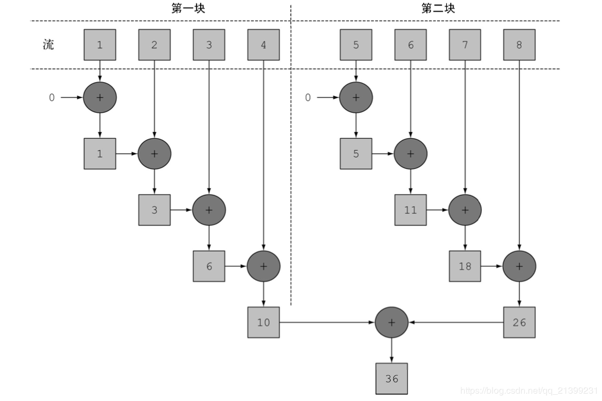

[TOC]

### 流Stream

#### 基础

##### 1. 概述

什么是流？Stream 就如同一个迭代器（Iterator），单向，不可往复，数据只能遍历一次，遍历过一次后即用尽了，就好比流水从面前流过，一去不复返。流可以在**内部进行迭代**，简化代码。

而和迭代器又不同的是，Stream 可以**并行化**操作，迭代器只能命令式地、串行化操作。顾名思义，当使用串行方式去遍历时，每个 item 读完后再读下一个 item。而使用并行去遍历时，数据会被分成多个段，其中每一个都在不同的线程中处理，然后将结果一起输出。Stream 的并行操作依赖于 Java7 中引入的 Fork/Join 框架（JSR166y）来拆分任务和加速处理过程。

Stream **不是集合**元素，它不是数据结构并不保存数据，它是有关算法和计算的，它更像一个高级版本的 **Iterator**。原始版本的 Iterator，用户只能显式地一个一个遍历元素并对其执行某些操作；高级版本的 Stream，用户只要给出需要对其包含的元素执行什么操作，比如 “过滤掉长度大于 10 的字符串”、“获取每个字符串的首字母”等，Stream 会**隐式地在内部进行遍历**，做出相应的数据转换。

Stream 的另外一大特点是，数据源本身可以是**无限**的。 

##### 2. 流的特点

流是从支持数据处理操作的源生成的**元素序列**。从这个定义看看流有什么特点：

- 元素序列：流提供了一系列接口，可以访问特定元素类型的一组有序值，这一点和集合是一样的。
- 源：流会使用一个提供数据的源，例如集合、数组或是 I/O 资源，需要注意的是，从有序的集合作为源来为流使用时，流会**保留原有的顺序**。
- 数据处理操作：这一点是流非常重要的一个特点，流提供数据处理操作，并且其功能类似于数据库的 DDL 语句，并且这些操作是可以并行执行的。
- 流水线：很多流操作本身会返回一个流，这就允许多个流操作链接起来，形成一个数据操作的大流水线，从而可以了解整个数据操作的上下文，在内部对整个流水线进行优化。
- 内部迭代：与直接使用迭代器进行外部迭代集合的方式不同，流的迭代操作是背后执行的。

##### 3. 集合与流的差别

集合与流之间的显著差异在于**什么时候开始计算**。集合是急切创建的，必须得先把所有数据加载到内存中，才能对集合中的元素进行计算；而流是延迟创建的，流只有在需要其中的数据的时候，才会进行计算，并且仅仅提供需要的数据。

- **遍历次数**：集合可以多次遍历，因为数据就在内存中；流**只能遍历一次**，因为流仅仅在需要它的时候才会创建，当遍历完之后这个流就被**消费掉**了。如果还要再遍历一遍，则需要重新创建一个流。

- **遍历方式**：集合是通过**外部迭代**的方式进行的，也就是经常使用的通过迭代器对集合进行遍历；流是通过**内部迭代**进行的，它更关注于要如何计算数据，而无需对每一次的计算方法进行实现。与外部迭代相比，内部迭代的好处是项目可以透明的并行化，可以选择一种适合你硬件的数据表示和并行实现的方式进行迭代，并且可以自动优化迭代顺序。

要在一个菜单中选择出低于 300 卡路里的菜的菜单名称，并按照卡路里进行排序。在 Java7 中要这么进行：

```java
List<Dish> lowCaloricDishes=new ArrayList<>();
for(Dish dish:menu){
    if(dish.getCalories()<300){
        lowCaloricDishes.add(dish);
    }
}
Collections.sort(lowCaloricDishes,new Comparator<Dish>(){
    public int compare(Dish d1,Dish d2){
        return Integer.compare(d1.getCalories(), d2.getCalories());
    }
});
List<String> lowCaloricDishesName=new ArrayList<>();
for(Dish dish:lowCaloricDishes){
    lowCaloricDishesName.add(dish.getName());
}
```

代码很长，并且这里面出现了一个所谓的“垃圾变量”，即其作用仅仅是为了**保存中间**结果。
Java8 中通过流及 Lambda 表达式实现：

```java
List<String> lowCaloricDishesName = menu.stream()
    .filter(e -> e.getCalories() < 300)
    .sorted(comparing(Dish::getCalories))
    .map(Dish::getName)
    .collect(toList());
```

##### 4. 产生流

有多种方式生成流。

- 从 Collection 和数组：

```java
Collection.stream()
Collection.parallelStream()
Arrays.stream(T array) or Stream.of()
```

- 从 BufferedReader：

```java
java.io.BufferedReader.lines()
```

- 静态工厂：

```java
java.util.stream.IntStream.range()
java.nio.file.Files.walk()
```

- 自己构建：

```java
java.util.Spliterator
```

- 其它：

```java
Random.ints()
BitSet.stream()
Pattern.splitAsStream(java.lang.CharSequence)
JarFile.stream()
```


#### 基础操作

##### 1. 引入

```java
List<Dish> menu = ...;

// 通过集合对象产生流
List<String> lowCaloricDishesName = menu.stream()
    // 筛选出卡路里大于400的
    .filter(d -> d.getCalories() < 400)
    // 抽取名字属性创建一个新的流
    .map(Dish::getName)
    // 这个流按List类型返回
    .collect(toList());
```

在这段代码 **filter** 和 **map** 操作被称为**中间操作**,中间操作会**返回一个新的流**，而 **collect** 则被称为**终端操作**只有终端操作才会让整个流执行并关闭。**每个流只能遍历一次** ，因为 collect 以后这个流就已经**关闭**了。

中间可以做**类型转换、筛选、规约、统计**等操作。

可以把这行代码分为**三个部分**：

- **menu.stream()**：构建一个流，并赋予这个流数据源。
- **.filter(…).sorted(…).map(…)**：这些操作是可以连接起来的，因为它们返回值是一个流，诸如这样可以连接起来从而形成一条流水线的操作，叫做**中间操作**。
- **.collect(toList())**：这个操作返回值是一个列表，流也就此结束。因此，这一类的操作叫做**终端操作**，它们用于返回一个确定的值，来终结这个流，除非流水线上触发一个终端操作，否则任何一个中间操作都不会执行。这是因为中间操作一般都可以合并优化起来，在终端操作中**一次性执行**。

举个例子看看流是如何优化的：

```java
List<String> names=menu.stream().filter(d->{
    System.out.println("filtering"+d.getName());
    return d.getCalories()>300;
}).map(d->{
    System.out.println("mapping"+d.getName());
    return d.getName();
})
    .limit(3)
    .collect(toList());
System.out.println(names);
```

这段代码打印出的结果为：

```java
filtering pork
mapping pork
filtering beef
mapping beef
filtering chicken
mapping chicken
[pork,beef,chicken]
```

可以看到，stream 做了两个优化：

1. 仅仅遍历了**前三个**。
2. filter 和 map 这两个操作被合并到了**一次迭代**中，该技术被称为**循环合并**。

##### 2. 筛选过滤和切片

Stream api 提供了四个能够对数据流进行筛选和切片的 API：

|   方法名称   |                             含义                             |
| :----------: | :----------------------------------------------------------: |
|  **filter**  | 该方法接受一个谓词函数（返回 boolean 的函数），并返回含有**满足该谓词**的流，用于**过滤** |
| **distinct** |                   该方法对数据进行**去重**                   |
|  **limit**   |           该方法根据传入的数字对数据流进行**截断**           |
|   **skip**   | 该方法与 limit 方法互斥，根据传入的数字确定要**跳过**几个元素 |

过滤通过一个 predicate 接口来过滤并只保留符合条件的元素，该操作属于**中间操作**，所以可以在过滤后的结果来应用其他 Stream 操作（比如 forEach）。forEach 需要一个函数来对过滤后的元素依次执行。

```java
// 测试 Filter(过滤)
stringList
    .stream()
    .filter((s) -> s.startsWith("a"))
    .forEach(System.out::println); // aaa2 aaa1
```

forEach 是为 Lambda 而设计的，保持了最紧凑的风格。而且 Lambda 表达式本身是可以重用的，非常方便。

##### 3. 映射

映射用于**类型的转换**，可以从对象中**提取信息**，比如将 List\<User> 集合提取姓名信息转化为 List\<String> 类型。

|  方法名称   |                             含义                             |
| :---------: | :----------------------------------------------------------: |
|   **map**   | 该方法接受一个函数，该函数会被应用到每个元素上从而**映射成一个新的元素** |
| **flatMap** | 该方法可以将流**扁平化**，把一个流中的每个值都换成另一个流，然后把所有流链接成一个流 |

中间操作 map 会将元素根据指定的 Function 接口来**依次将元素转成另外的对象**。

下面的示例展示了将字符串转换为大写字符串。也可以通过 map 来将对象转换成其他类型， map 返回的 Stream 类型是根据 map 传递进去的函数的返回值决定的。

```java
// 测试 Map 操作
stringList
    .stream()
    .map(String::toUpperCase)
    .sorted((a, b) -> b.compareTo(a))
    .forEach(System.out::println); 
// "DDD2", "DDD1", "CCC", "BBB3", "BBB2", "AAA2", "AAA1"
```

##### 4. 查找和匹配

看数据集中的某些元素**是否匹配**一个给定的属性。

|   方法名称    |                             含义                             |
| :-----------: | :----------------------------------------------------------: |
| **anyMatch**  | 该方法接受一个谓词函数（返回boolean的函数），并返回一个boolean，确定流中是否有元素能够满足该谓词判断，为终端操作 |
| **allMatch**  |    该方法与anyMatch类似，确定流中所有元素是否满足谓词判断    |
| **noneMatch** |  该方法与allMatch相对，确定流中没有任何元素能够满足谓词判断  |
|  **findAny**  | 该方法返回当前流中任意一个能够满足谓词判断的元素，该方法返回一个Optional\<T> |
| **findFirst** | 该方法返回当前流中第一个能够满足谓词判断的元素，该方法返回一个Optional\<T> |

需要注意有两点：

1.Stream 会遵循**短路**原则，与 && 和 || 类似，比如 limit、findAny 等，满足条件即返回，不会处理流中的所有元素。

2.findFirst 和 findAny 的区别在于，findAny 因为没有找到第一个的限制，因此在**并行化**中能够有更好的性能。

Stream 提供了多种**匹配操作**，允许检测指定的 Predicate 是否匹配整个 Stream。所有的匹配操作都是 **最终操作** ，并返回一个 boolean 类型的值。

```java
// 测试 Match (匹配)操作
boolean anyStartsWithA =
    stringList
    .stream()
    .anyMatch((s) -> s.startsWith("a"));
System.out.println(anyStartsWithA);      // true

boolean allStartsWithA =
    stringList
    .stream()
    .allMatch((s) -> s.startsWith("a"));

System.out.println(allStartsWithA);      // false

boolean noneStartsWithZ =
    stringList
    .stream()
    .noneMatch((s) -> s.startsWith("z"));

System.out.println(noneStartsWithZ);      // true
```

##### 5. 数值流

与 Java8 提供的常用函数式接口相似，为了**减少拆装箱**的耗费，Stream api 也提供了原始类型特化的流，即**数值流**：IntStream、LongStream和DoubleStream。数值流提供了以下几个特有的方法，来进行数值运算：

|  方法名称   |                             含义                             |
| :---------: | :----------------------------------------------------------: |
|     sum     |                      对流中所有元素求和                      |
|     max     |                    对流中所有元素求最大值                    |
|     min     |                    对流中所有元素求最小值                    |
|   average   |                    对流中所有元素求平均值                    |
|    range    | 有两个参数，用于获取数值范围，第一个参数为起始值，第二个参数为结束值，前闭后开 |
| rangeClosed | 有两个参数，用于获取数值范围，第一个参数为起始值，第二个参数为结束值，前闭后闭 |

##### 6. Sorted(排序)

排序是一个 **中间操作**，返回的是排序好后的 Stream。**如果不指定一个自定义的 Comparator 则会使用默认排序。**

```java
// 测试 Sort (排序)
stringList
    .stream()
    .sorted()
    .filter((s) -> s.startsWith("a"))
    .forEach(System.out::println);  // aaa1 aaa2
```

需要注意的是，排序只创建了一个排列好后的 Stream，而不会影响原有的数据源，排序之后原数据 stringCollection 是**不会被修改**的：

```java
System.out.println(stringList); // ddd2, aaa2, bbb1, aaa1, bbb3, ccc, bbb2, ddd1
```

##### 7. Count(计数)

计数是一个 **最终操作**，返回Stream中元素的个数，**返回值类型是 long**。

```java
// 测试 Count (计数)操作
long startsWithB =
    stringList
    .stream()
    .filter((s) -> s.startsWith("b"))
    .count();
System.out.println(startsWithB);    // 3
```

##### 8. Reduce(规约)

这是一个**最终操作** ，允许通过指定的函数来讲 stream 中的多个元素规约为一个元素，规约后的结果是通过 Optional 接口表示的：

```java
// 测试 Reduce (规约)操作
Optional<String> reduced =
    stringList
    .stream()
    .sorted()
    .reduce((s1, s2) -> s1 + "#" + s2);

reduced.ifPresent(System.out::println);
// aaa1#aaa2#bbb1#bbb2#bbb3#ccc#ddd1#ddd2
```

这个方法的主要作用是把 Stream 元素**组合起来**。它提供一个起始值（种子），然后依照运算规则（BinaryOperator），和前面 Stream 的第一个、第二个、第 n 个元素组合。从这个意义上说，字符串拼接、数值的 sum、min、max、average 都是**特殊的 reduce**。例如 Stream 的 sum 就相当于 Integer sum = integers.reduce(0, (a, b) -> a+b); 也有没有起始值的情况，这时会把 Stream 的前面两个元素组合起来，返回的是 Optional。

```java
// 字符串连接，concat = "ABCD"
String concat = Stream.of("A", "B", "C", "D").reduce("", String::concat); 
// 求最小值，minValue = -3.0
double minValue = Stream.of(-1.5, 1.0, -3.0, -2.0).reduce(Double.MAX_VALUE, Double::min); 
// 求和，sumValue = 10, 有起始值
int sumValue = Stream.of(1, 2, 3, 4).reduce(0, Integer::sum);
// 求和，sumValue = 10, 无起始值
sumValue = Stream.of(1, 2, 3, 4).reduce(Integer::sum).get();
// 过滤，字符串连接，concat = "ace"
concat = Stream.of("a", "B", "c", "D", "e", "F").
    filter(x -> x.compareTo("Z") > 0).
    reduce("", String::concat);
```


#### 高级操作

##### 1. 规约

###### (1) 常用的归约方法

|                           方法名                           |              含义              |
| :--------------------------------------------------------: | :----------------------------: |
|                   Collecotrs.counting()                    |        用于统计元素个数        |
|                     Collecotrs.maxBy()                     |       用于统计最大值元素       |
|                     Collecotrs.minBy()                     |       用于统计最小值元素       |
|   Collecotrs.summingInt()/summingDouble()/summingLong())   |  根据不同基本类型获取元素总和  |
| Collecotrs.averagingInt()/averaingDouble()/averagingLong() | 根据不同基本类型获取元素平均值 |
|                    Collecotrs.Joining()                    |         用于合并字符串         |

###### (2) 归约方法原理

其实上一节中介绍的所有的方法，都来自于下面这个方法：

```java
Collector<T, ?, U> reducing(U identity,Function<? super T, ? extends U> mapper, BinaryOperator<U> op)
```

第一个参数是归约的起始值。

- 第二个参数是一个 Function 函数接口，用于对元素进行 mapping 操作，获取相关元素值。
- 第三个参数是一个二元操作函数接口，用于将 mapping 的值进行归约。
- T 的含义是**输入值的类型**，U 的含义是**输出值的类型**，中间的类型参数代表中间变量的类型。

举一个例子，比如要对一个菜单中所有菜品的热量进行统计，则可以这么写：

```java
int TotalCalories = menu.stream()
    .collect(reducing(0, Dish::getCalories, (i,j) -> i + j));
```

##### 2. 分组

分组是收集器提供的一种类似于 SQL 语句中 **Group By** 功能的方法，就是**根据某个条件将一组元素划分成多个组**，分组主要依赖 **Collectors.groupingBy**() 方法，使用示例如下：

```java
// 根据菜品类型分组
Map<Dish.Type,List<Dish>> dishesByType = menu.stream().collect(groupingBy(Dish::getType));
// 输出结果
(FISH=[prawns, salmon], OTHER=[french fries, rice, season fruit, pizza], MEAT=[pork, beef, chicken])
```

###### (1) 多级分组

可以使用 groupingBy 方法的双参数版本实现多级分组，示例如下：

```java
// 根据菜品的类别和热量进行分组
Map<Dish.Type,Map<CaloricLevel,List<Dish>>> dishesByTypeCaloricLevel = menu.stream().collect(groupingBy(Dish::getType,groupingBy(dish -> {
    if (dish.getCalories() <=400) return CaloricLevel.DIET;
    else if (dis.getCalories()<=700) return CaloricLevel.NORMAL;
    else return CaloricLevel.FAT;})));
// 返回结果
{MEAT={DIET=[chicken],NORMAL=[beef],FAT=[pork]},{FISH={DIET=[prawns],NORMAL=[salmon]},OTHER={DIET=[rice,seasonal fruit],NORMAL=[french fries,pizza]}}}
```

通过将 groupingBy 作为上层 groupingBy 的参数传递，就能实现层层嵌套的多级分组。

###### (2) 按子组收集数据

除了可以在 groupingBy 的第二个参数中传入另一个 groupingBy 从而实现多级分组，还可以通过对第二个参数传入任何其他的函数，实现对子组数据的变更，示例如下：

```java
// 获取每一类型中卡路里最高的菜品
Map<Dish.Type, Dish> mostCaloricByType = menu.stream().collect(groupingBy(Dish::getType, collectingAndThen(maxBy(comparingInt(Dish::getCalories)))))
// 返回数据
{FISH=salmon,MEAT=pork,OTHER=pizza}
```


#### 并行流

##### 1. 概述

并行流使用方式很简单，只需要在想要并行的地方添加 **parallel**() 方法即可将**顺序流**转变为**并行流**；相反的，可以使用 **sequential** 方法将并行流再**转变为顺序流**，或者直接使用 ParallelStream API。

以一个对自然数求和的例子来说明：

```java
public static long parallelSum(long n){
    return Stream.iterate(1L,i -> i+1)
        .limit(n)
        .parallel()
        .reduce(0,Long::sum);
}
```

图解这个流程：



请注意，在现实中，对顺序流调用 parallel 方法**并不意味着流本身有任何实际的变化**。

对于**较小**的数据量，选择并行流几乎从来都**不是一个好的决定**。并行处理少数几个元素的好处还抵不上并行化造成的额外开销。

**要考虑流背后的数据结构是否易于分解**。例如，ArrayList 的拆分效率比 LinkedList 高得多，因为前者用不着遍历就可以平均拆分，而后者则必须遍历。另外，用 range 工厂方法创建的原始类型流也可以快速分解。

Java 常用的容器是否适合使用并行流：

|      容器       | 可分解性 |
| :-------------: | :------: |
|  **ArrayList**  | **极佳** |
|   LinkedList    |    差    |
| IntStream.range |   极佳   |
| Stream.itreate  |    差    |
|   **HashSet**   |  **好**  |
|     TreeSet     |    好    |

##### 2. demo

首先创建一个没有重复元素的大表：

```java
int max = 1000000;
List<String> values = new ArrayList<>(max);
for (int i = 0; i < max; i++) {
    UUID uuid = UUID.randomUUID();
    values.add(uuid.toString());
}
```

分别用串行和并行两种方式对其进行排序，最后看看所用时间的对比。

**Sequential Sort(串行排序)**

```java
// 串行排序
long t0 = System.nanoTime();
long count = values.stream().sorted().count();
System.out.println(count);

long t1 = System.nanoTime();
long millis = TimeUnit.NANOSECONDS.toMillis(t1 - t0);
System.out.println(String.format("sequential sort took: %d ms", millis));
```

```java
1000000
sequential sort took: 709 ms // 串行排序所用的时间
```

**Parallel Sort(并行排序)**

```java
// 并行排序
long t0 = System.nanoTime();
long count = values.parallelStream().sorted().count();
System.out.println(count);

long t1 = System.nanoTime();
long millis = TimeUnit.NANOSECONDS.toMillis(t1 - t0);
System.out.println(String.format("parallel sort took: %d ms", millis));

```

```java
1000000
parallel sort took: 475 ms // 串行排序所用的时间
```

上面两个代码几乎是一样的，但是并行版的快了 50% 左右，唯一需要做的改动就是将 stream() 改为 **parallelStream**()。

##### 3. 性能分析

对于简单操作，比如最简单的遍历，Stream **串行 API 性能明显差于显示迭代**，但**并行**的 Stream API 能够发挥多核特性。

如果出于**性能考虑**，1. 对于简单操作推荐**使用外部迭代手动**实现，2. 对于**复杂操作，推荐使用 Stream API**， 3. 在**多核情况下，推荐使用并行 Stream API 来发挥多核优势**，4.**单核情况下不建议**使用并行 Stream API。

如果出于**代码简洁性考虑**，使用 Stream API 能够写出更短的代码。即使是从性能方面说，尽可能的使用 Stream API 也另外一个优势，那就是只要 Java Stream 类库做了升级优化，代码不用做任何修改就能享受到升级带来的好处。


