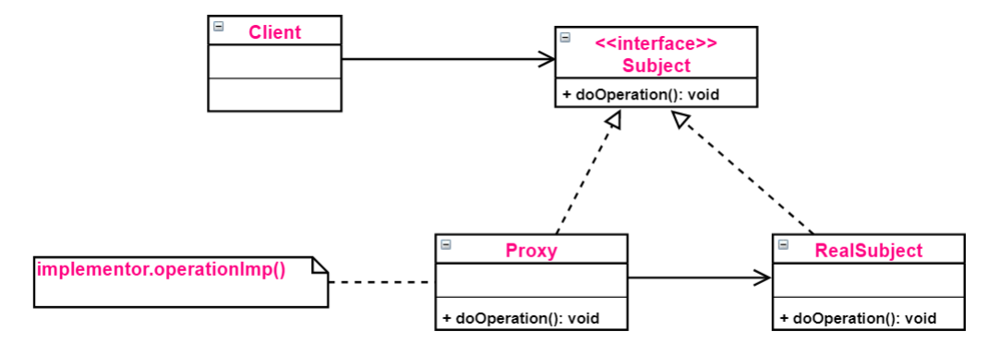
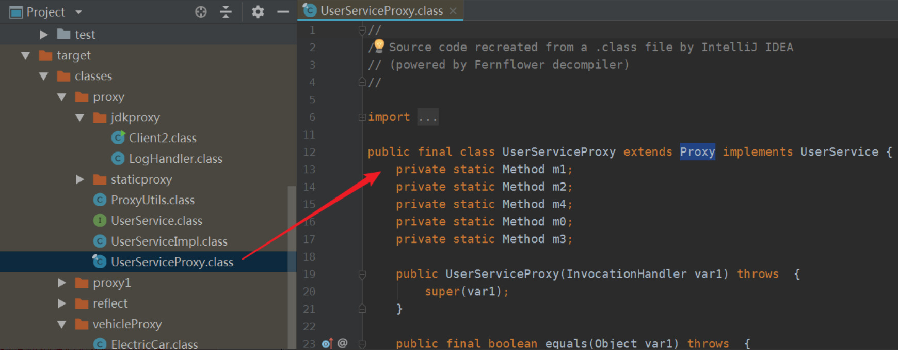

[TOC]

### 代理

#### 基础

##### 1. 概述

代理在 Java 中有着广泛的应用，比如 Spring AOP、Hibernate 数据查询、测试框架的后端 mock、RPC 远程调用、Java 注解对象获取、日志、用户鉴权、全局性异常处理、性能监控，甚至事务处理等。

代理实现：

- 静态代理
- 动态代理：两种常见的**动态代理**方式：JDK 原生动态代理和 CGLIB 动态代理。

##### 2. 代理模式

Java 代理与设计模式中的代理模式有关，什么是**代理模式**呢？

**代理模式**：给某一个对象提供一个代理，并由**代理对象**来控制对**真实对象**的访问，代理模式是一种结构型设计模式。

代理模式角色分为 3 种：

- **Subject（抽象主题角色）**：定义代理类和真实主题的**公共对外方法**，也是代理类代理真实主题的方法。

- **RealSubject（真实主题角色**）：真正实现**业务逻辑**的类。

- **Proxy（代理主题角色）**：用来**代理和封装**真实主题。

代理模式的结构比较简单，其核心是代理类，为了让客户端能够**一致性地对待**真实对象和代理对象，在代理模式中引入了**抽象层**。



代理模式**按照职责**（使用场景）来分类，至少可以分为以下几类：1、远程代理。 2、虚拟代理。 3、Copy-on-Write 代理。 4、保护（Protect or Access）代理。 5、Cache代理。 6、防火墙（Firewall）代理。 7、同步化（Synchronization）代理。 8、智能引用（Smart Reference）代理等等。

如果**根据字节码的创建时机**来分类，可以分为==**静态代理和动态代理**==：

- 所谓**静态代理**也就是在**程序运行前**就已经存在代理类的**字节码文件**，代理类和真实主题角色的关系在**运行前**就确定了。
- 而**动态代理**的源码是在程序**运行期间**由 **JVM** 根据**反射**等机制**动态的生成**，所以在**运行前并不存在代理类的字节码**文件。


#### 静态代理

##### 1. 静态代理实例

编写一个**接口** UserService ，以及该接口的一个**实现类** UserServiceImpl。

```java
public interface UserService {
    public void select();   
    public void update();
}

public class UserServiceImpl implements UserService {  
    @Override
    public void select() {  
        System.out.println("查询 selectById");
    }
    @Override
    public void update() {
        System.out.println("更新 update");
    }
}
```

通过**静态代理**对 UserServiceImpl 进行功能**增强**，在调用 select 和 update 方法之前记录一些**日志**。写一个**代理类** **UserServiceProxy**，代理类需要实现 **UserService**。

```java
public class UserServiceProxy implements UserService {
    // 被代理的对象
    private UserService target; 

    /**
     * 构造方法传入需要被代理对象
     */
    public UserServiceProxy(UserService target) {
        this.target = target;
    }
    
    // 代理类实现接口方法并加入功能增强的逻辑
    @Override
    public void select() {
        // 功能增强代码
        before();
        // 这里才实际调用真实主题角色的方法
        target.select();    
        after();
    }
    @Override
    public void update() {
        before();
        // 这里才实际调用真实主题角色的方法
        target.update();    
        after();
    }

    // 在执行方法之前执行
    private void before() {     
        System.out.println(String.format("log start time [%s] ", new Date()));
    }
    // 在执行方法之后执行
    private void after() {      
        System.out.println(String.format("log end time [%s] ", new Date()));
    }
}

```

客户端测试

```java
public class Client1 {
    public static void main(String[] args) {
        // 被代理对象
        UserService userServiceImpl = new UserServiceImpl();
        // 手动生成代理对象：需要传入被代理的userServiceImpl对象
        UserService proxy = new UserServiceProxy(userServiceImpl);
		// 调用增强后的方法
        proxy.select();
        proxy.update();
    }
}
```

输出

```java
log start time [Tue Mar 03 10:18:31 CST 2020] 
查询 selectById
log end time [Tue Mar 03 10:18:31 CST 2020] 
log start time [Tue Mar 03 10:18:31 CST 2020] 
更新 update
log end time [Tue Mar 03 10:18:31 CST 2020] 
```

静态代理可以实现**功能增强**，而且**没有侵入**原代码，这是静态代理的一个优点。

##### 2. 静态代理的缺点

虽然静态代理实现简单，且不侵入原代码，但是当场景稍微**复杂**一些的时候，静态代理的缺点也会暴露出来。静态代理类需要自己写。

1、 当需要代理**多个类**的时候，由于代理对象要实现与目标**对象一致的接口**，有两种方式：

- 只维护**一个代理类**，由这个代理类实现**多个接口**，但是这样就导致**代理类过于庞大**。
- 新建**多个代理类**，每个目标对象对应**一个代理类**，但是这样需要开发**==过多的代理类。==**

2、 当接口需要增加、删除、修改方法的时候，目标对象与代理类**都要同时修改**，**不易维护**。


#### 动态代理

##### 1. 基本原理

鉴于静态代理的缺点，可以考虑让**代理类动态的生成**，也就是动态代理。

**为什么类可以动态的生成？**这就涉及到 Java 虚拟机的**类加载机制**了，推荐《深入理解 Java 虚拟机》7.3节 类加载的过程。Java 虚拟机类加载过程主要分为五个阶段：**加载、验证、准备、解析、初始化**。其中**加载**阶段需要完成以下 3 件事情：

1. 通过一个类的全限定名来获取定义此类**的二进制字节流**。
2. 将这个字节流所代表的静态存储结构转化为方法区的运行时数据结构。
3. 在内存中生成一个代表这个类的 **java.lang.Class 对象**，作为方法区这个类的各种数据**访问入口**。

由于虚拟机规范对这 3 点要求并不具体，所以实际的实现是非常灵活的，关于第 1 点，**获取类的二进制字节流**（**class 字节码**）就有很多途径：

- **==运行时计算生成==**，这种场景使用最多的是==**动态代理技术**==，在 java.lang.reflect.**Proxy** 类中，就是用了 ProxyGenerator.**generateProxyClass** 来为特定接口生成形式为 `*$Proxy` 的代理类的**二进制字节流**。

- 从 ZIP 包获取，这是 **JAR**、EAR、WAR 等格式的基础。
- 从**网络**中获取，典型的应用是 Applet。
- 由**其它文件**生成，典型应用是 JSP，即由 JSP 文件生成对应的 Class 类。
- 从数据库中获取等等。

所以，动态代理就是想办法根据接口或目标对象，**计算出代理类的==字节码==，然后再==加载到 JVM 中==使用**。但是如何计算？如何生成？如果操作字节码？情况也许比想象的复杂得多，需要借助现有的方案。

##### 2. 常见的字节码操作类库

- **CGLIB**(Code Generation Library)：是一个功能强大，高性能和高质量的代码生成库，用于扩展 JAVA 类并在运行时实现接口。

- Apache **BCEL** (Byte Code Engineering Library)：是 Java classworking 广泛使用的一种框架，它可以深入到JVM汇编语言进行类操作的细节。
- ObjectWeb **ASM**：是一个 Java **字节码操作框架**。它可以用于**直接以二进制形式动态生成 stub 根类**或其他代理类，或者在加载时动态修改类。
- Javassist：是 Java 的加载时反射系统，它是一个用于在 Java 中编辑字节码的类库; 它使 Java 程序能够在运行时定义新类，并在 JVM 加载之前修改类文件。

为了让生成的代理类与目标对象（真实主题角色）保持**一致性**，从现在开始将介绍以下两种最常见的方式：

1. 通过==**实现接口**==的方式：**JDK** 动态代理。
2. 通过==**继承类**==的方式：**CGLIB **动态代理。


#### JDK动态代理

##### 1. 使用示例

JDK 动态代理主要涉及**两个类**：java.lang.reflect.**Proxy** 和 java.lang.reflect.**InvocationHandler**。

编写一个调用逻辑处理器 LogHandler 类，提供**日志增强**功能，并实现 **InvocationHandler** 接口；在 LogHandler 中维护一个**目标对象**，这个**对象是被代理的对象**（真实主题角色）；在 **invoke** 方法中编写**方法调用的逻辑处理**。

**代理类**如下。

```java
import java.lang.reflect.InvocationHandler;
import java.lang.reflect.Method;
import java.util.Date;

public class LogHandler implements InvocationHandler {
    // 被代理的对象，实际的方法执行者
    Object target;  
	// 传入需要代理的对象
    public LogHandler(Object target) {
        this.target = target;
    }
    // 覆写invoke方法实现增强逻辑
    @Override
    public Object invoke(Object proxy, Method method, Object[] args) throws Throwable {
        // 调用invoke方法之前执行
        before();
        // 反射调用target的method方法
        Object result = method.invoke(target, args); 
        // 调用invoke方法之后执行
        after();
        // 返回方法的执行结果
        return result;  
    }
    
    // 调用invoke方法之前执行
    private void before() {
        System.out.println(String.format("log start time [%s] ", new Date()));
    }
    
    // 调用invoke方法之后执行
    private void after() {
        System.out.println(String.format("log end time [%s] ", new Date()));
    }
}
```

编写客户端，获取**动态生成的==代理类的代理对象==**须借助 **Proxy** 类的 **newProxyInstance** 方法，具体步骤可见代码和注释。

```java
package com.nano.javase.proxy.dynamicproxy;

import com.nano.javase.proxy.staticproxy.UserService;
import com.nano.javase.proxy.staticproxy.UserServiceImpl;

import java.lang.reflect.InvocationHandler;
import java.lang.reflect.Proxy;

/**
 * JDK动态代理测试
 * @author nano
 */
public class JdkDynamicProxyTest {

    public static void main(String[] args) {
        // 设置变量可以保存动态代理类，默认名称以 $Proxy0 格式命名
        // System.getProperties().setProperty("sun.misc.ProxyGenerator.saveGeneratedFiles", "true");
        // 1. 创建需要被代理的对象，UserService接口的实现类
        UserServiceImpl userServiceImpl = new UserServiceImpl();
        // 2. 获取对应的ClassLoader
        ClassLoader classLoader = userServiceImpl.getClass().getClassLoader();
        // 3. 获取所有实现接口的Class，这里的UserServiceImpl只实现了一个接口UserService
        Class[] interfaces = userServiceImpl.getClass().getInterfaces();
        // 4. 创建一个将传给代理类的调用请求处理器，处理所有的代理对象上的方法调用
        // 这里创建的是一个自定义的日志处理器，须传入实际的执行对象 userServiceImpl
        InvocationHandler logHandler = new LogHandler(userServiceImpl);
        /*
		  5.根据上面提供的信息，创建代理类对象 
		     在这个过程中：
             a.JDK会通过根据传入的参数信息动态地在内存中创建和.class文件等同的字节码
             b.然后根据相应的字节码转换成对应的class，
             c.然后调用newInstance()创建代理实例
		 */
        UserService proxy = (UserService) Proxy.newProxyInstance(classLoader, interfaces, logHandler);
        // 通过代理对象调用增强后的方法
        proxy.select();
        proxy.update();
        // 保存JDK动态代理生成的代理类，类名保存为 UserServiceProxy
        // ProxyUtils.generateClassFile(userServiceImpl.getClass(), "UserServiceProxy");
    }
}
```

运行结果

```java
log start time [Tue Mar 03 10:44:16 CST 2020] 
查询 selectById
log end time [Tue Mar 03 10:44:16 CST 2020] 
log start time [Tue Mar 03 10:44:16 CST 2020] 
更新 update
log end time [Tue Mar 03 10:44:16 CST 2020] 
```

##### 2. JDK动态代理关键类

**InvocationHandler** 和 **Proxy** 的主要方法介绍如下：

###### (1) InvocationHandler接口

**java.lang.reflect.==InvocationHandler== 接口**代码如下。

```java
public interface InvocationHandler {
    public Object invoke(Object proxy, Method method, Object[] args)
        throws Throwable;
}
```

仅一个 invoke 方法。这个区别与反射中的 invoke 方法。它定义了**代理对象调用方法时希望执行的动作（在此进行功能增强）**，用于集中处理在动态代理类对象上的方法调用。

###### (2) Proxy类

**java.lang.reflect.==Proxy== 类**的一些方法如下。

```java
// 用于获取指定代理对象所关联的调用处理器
static InvocationHandler getInvocationHandler(Object proxy);  
// 返回指定接口的代理类
static Class<?> getProxyClass(ClassLoader loader, Class<?>... interfaces); 
// 构造实现指定接口的代理类的一个新实例，所有方法会调用给定处理器对象的 invoke 方法
static Object newProxyInstance(ClassLoader loader, Class<?>[] interfaces, InvocationHandler h); 
// 返回 cl 是否为一个代理类
static boolean isProxyClass(Class<?> cl); 
```

newProxyInstance 方法需要**传入被代理类的类加载器**，被代理类实现的全部接口数组，以及增强之后的 InvocationHandler 实例。

产生代理对象的 newProxyInstance 方法源码如下。

```java
public static Object newProxyInstance(ClassLoader loader,
                                      Class<?>[] interfaces,
                                      InvocationHandler h)
    throws IllegalArgumentException
{
    Objects.requireNonNull(h);
    final Class<?>[] intfs = interfaces.clone();
    final SecurityManager sm = System.getSecurityManager();
    if (sm != null) {
        checkProxyAccess(Reflection.getCallerClass(), loader, intfs);
    }
    // 获取class对象
    Class<?> cl = getProxyClass0(loader, intfs);
    try {
        if (sm != null) {
            checkNewProxyPermission(Reflection.getCallerClass(), cl);
        }
        // 通过class对象获取构造方法Constructor对象
        final Constructor<?> cons = cl.getConstructor(constructorParams);
        final InvocationHandler ih = h;
        if (!Modifier.isPublic(cl.getModifiers())) {
            AccessController.doPrivileged(new PrivilegedAction<Void>() {
                public Void run() {
                    cons.setAccessible(true);
                    return null;
                }
            });
        }
        // 通过Constructor对象产生代理类的对象
        return cons.newInstance(new Object[]{h});
    } catch (IllegalAccessException|InstantiationException e) {
        throw new InternalError(e.toString(), e);
    } catch (InvocationTargetException e) {
        Throwable t = e.getCause();
        if (t instanceof RuntimeException) {
            throw (RuntimeException) t;
        } else {
            throw new InternalError(t.toString(), t);
        }
    } catch (NoSuchMethodException e) {
        throw new InternalError(e.toString(), e);
    }
}
```

##### 3. JDK动态代理生成的代理类解析

**生成的代理类**到底长什么样子呢？借助下面的工具类，把代理类保存下来再探个究竟（通过设置环境变量 sun.misc.ProxyGenerator.saveGeneratedFiles=true 也可以**保存代理类**）。

```java
import sun.misc.ProxyGenerator;
import java.io.FileOutputStream;
import java.io.IOException;

public class ProxyUtils {
    /**
     * 将根据类信息动态生成的二进制字节码保存到硬盘中，默认的是clazz目录下
     * params: clazz 需要生成动态代理类的类
     * proxyName: 为动态生成的代理类的名称
     */
    public static void generateClassFile(Class clazz, String proxyName) {
        // 根据类信息和提供的代理类名称，生成字节码
        byte[] classFile = ProxyGenerator.generateProxyClass(proxyName, clazz.getInterfaces());
        String paths = clazz.getResource(".").getPath();
        System.out.println(paths);
        FileOutputStream out = null;
        try {
            // 保留到硬盘中
            out = new FileOutputStream(paths + proxyName + ".class");
            out.write(classFile);
            out.flush();
        } catch (Exception e) {
            e.printStackTrace();
        } finally {
            try {
                out.close();
            } catch (IOException e) {
                e.printStackTrace();
            }
        }
    }
}
```

然后在 JdkDynamicProxyTest 测试类的 main 的最后面加入一行代码

```java
// 保存JDK动态代理生成的代理类，类名保存为 UserServiceProxy
ProxyUtils.generateClassFile(userServiceImpl.getClass(), "UserServiceProxy");
```

IDEA 再次运行之后就可以在 target 的类路径下找到 **UserServiceProxy**.class，双击后 IDEA 的反编译插件会将该二进制 class 文件反编译。



UserServiceProxy 的代码如下所示：

```java
import java.lang.reflect.InvocationHandler;
import java.lang.reflect.Method;
import java.lang.reflect.Proxy;
import java.lang.reflect.UndeclaredThrowableException;
import proxy.UserService;

public final class UserServiceProxy extends Proxy implements UserService {
    private static Method m1;
    private static Method m2;
    private static Method m4;
    private static Method m0;
    private static Method m3;

    public UserServiceProxy(InvocationHandler var1) throws  {
        super(var1);
    }

    public final boolean equals(Object var1) throws  {
        // 省略...
    }

    public final String toString() throws  {
        // 省略...
    }
	// 业务方法
    public final void select() throws  {
        try {
            // 此处调用了InvocationHandler的invoke方法来调用被增强之后的业务代码
            super.h.invoke(this, m4, (Object[])null);
        } catch (RuntimeException | Error var2) {
            throw var2;
        } catch (Throwable var3) {
            throw new UndeclaredThrowableException(var3);
        }
    }

    public final int hashCode() throws  {
        // 省略...
    }

    public final void update() throws  {
        try {
            // 此处调用了InvocationHandler的invoke方法来调用被增强之后的业务代码
            super.h.invoke(this, m3, (Object[])null);
        } catch (RuntimeException | Error var2) {
            throw var2;
        } catch (Throwable var3) {
            throw new UndeclaredThrowableException(var3);
        }
    }
	// 静态初始化块
    static {
        try {
            // 通过反射获取方法的信息
            m1 = Class.forName("java.lang.Object").getMethod("equals", Class.forName("java.lang.Object"));
            m2 = Class.forName("java.lang.Object").getMethod("toString");
            m4 = Class.forName("proxy.UserService").getMethod("select");
            m0 = Class.forName("java.lang.Object").getMethod("hashCode");
            m3 = Class.forName("proxy.UserService").getMethod("update");
        } catch (NoSuchMethodException var2) {
            throw new NoSuchMethodError(var2.getMessage());
        } catch (ClassNotFoundException var3) {
            throw new NoClassDefFoundError(var3.getMessage());
        }
    }
}
```

从 UserServiceProxy 的代码中可以发现：

- UserServiceProxy **继承**了 **Proxy 类**，并且实现了被代理的所有接口，以及 equals、hashCode、toString 等方法。可以看到之所以**==只能代理接口==**是因为**代理类本身已经 extends 了 Proxy，而 Java 是不允许多重继承的**，但是允许实现多个接口。
- 由于 UserServiceProxy 继承了 Proxy 类，所以每个代理类都会**关联一个 InvocationHandler 方法**调用处理器。
- 类和所有方法都被 **public final 修饰**，所以代理类**只可被使用**，不可以再被继承。
- 每个方法都有一个 **Method** 对象来描述，Method 对象在 static **静态代码块**中创建，以 `m + 数字` 的格式命名
- 调用方法的时候通过 **super.h.invoke(this, m1, (Object[])null);** 调用，其中的 **super.h.invoke** 实际上是在创建代理的时候传递给 Proxy.newProxyInstance 的 **LogHandler** 对象，它继承 InvocationHandler 类，负责**实际的调用处理逻辑**。

而 LogHandler 的 invoke 方法接收到 method、args 等参数后，进行一些处理，然后通过**反射**让被代理的对象 target 执行方法。

```java
@Override
public Object invoke(Object proxy, Method method, Object[] args) throws Throwable {
    before();
    // 调用 target 的 method 方法
    Object result = method.invoke(target, args);       
    after();
    return result;  // 返回方法的执行结果
}
```


#### CGLIB动态代理

##### 1. 使用示例

Maven 引入 **CGLIB** 包，然后编写一个 UserDao 类，它**没有接口**，只有两个方法，select() 和 update()。

```java
public class UserDao {
    public void select() {
        System.out.println("UserDao 查询 selectById");
    }
    public void update() {
        System.out.println("UserDao 更新 update");
    }
}
```

编写一个 **LogInterceptor** ，继承了 **MethodInterceptor**，用于**方法的拦截回调**。在 **intercept 方法**中对业务代码进行增强。这里**直接传入**被代理对象进行方法操作。

```java
import java.lang.reflect.Method;
import java.util.Date;

public class LogInterceptor implements MethodInterceptor {
    /**
     * @param object 表示要进行增强的对象
     * @param method 表示拦截的方法
     * @param objects 数组表示参数列表，基本数据类型需要传入其包装类型，如int-->Integer、long-Long、double-->Double
     * @param methodProxy 表示对方法的代理，invokeSuper方法表示对被代理对象方法的调用
     * @return 执行结果
     * @throws Throwable
     */
    @Override
    public Object intercept(Object object, Method method, Object[] objects, MethodProxy methodProxy) throws Throwable {
        before();
        // 注意这里是调用invokeSuper而不是invoke，否则死循环，methodProxy.invokesuper执行的是原始类的方法，method.invoke执行的是子类的方法
        Object result = methodProxy.invokeSuper(object, objects);   
        after();
        return result;
    }
    private void before() {
        System.out.println(String.format("log start time [%s] ", new Date()));
    }
    private void after() {
        System.out.println(String.format("log end time [%s] ", new Date()));
    }
}
```

测试：

```java
import net.sf.cglib.proxy.Enhancer;

public class CglibTest {
    public static void main(String[] args) {
        // 被代理对象
        DaoProxy daoProxy = new DaoProxy(); 
        // enhancer
        Enhancer enhancer = new Enhancer();
        // 设置超类，cglib是通过继承来实现的
        enhancer.setSuperclass(Dao.class);  
        // 设置回调
        enhancer.setCallback(daoProxy);
		
        // 通过enhancer创建代理类对象
        Dao dao = (Dao)enhancer.create();   // 创建代理类
        // 调用代理类对象的增强后的方法
        dao.update();
        dao.select();
    }
}
```

运行结果

```java
log start time [Fri Dec 21 00:06:40 CST 2018] 
UserDao 查询 selectById
log end time [Fri Dec 21 00:06:40 CST 2018] 
log start time [Fri Dec 21 00:06:40 CST 2018] 
UserDao 更新 update
log end time [Fri Dec 21 00:06:40 CST 2018] 
```

还可以进一步实现**多个 MethodInterceptor** 进行**过滤筛选**。

```java
public class LogInterceptor2 implements MethodInterceptor {
    // 业务增强逻辑
    @Override
    public Object intercept(Object object, Method method, Object[] objects, MethodProxy methodProxy) throws Throwable {
        before();
        Object result = methodProxy.invokeSuper(object, objects);
        after();
        return result;
    }
    private void before() {
        System.out.println(String.format("log2 start time [%s] ", new Date()));
    }
    private void after() {
        System.out.println(String.format("log2 end time [%s] ", new Date()));
    }
}

// 回调过滤器: 在CGLib回调时可以设置对不同方法执行不同的回调逻辑，或者根本不执行回调。
public class DaoFilter implements CallbackFilter {
    @Override
    public int accept(Method method) {
        if ("select".equals(method.getName())) {
            return 0;   // Callback 列表第1个拦截器
        }
        return 1;   	// Callback 列表第2个拦截器，return 2 则为第3个，以此类推
    }
}
```

再次测试

```java
public class CglibTest2 {
    public static void main(String[] args) {
        LogInterceptor logInterceptor = new LogInterceptor();
        LogInterceptor2 logInterceptor2 = new LogInterceptor2();
        Enhancer enhancer = new Enhancer();
        // 设置超类，cglib是通过继承来实现的
        enhancer.setSuperclass(UserDao.class);   
        // 设置多个拦截器，NoOp.INSTANCE是一个空拦截器，不做任何处理
        enhancer.setCallbacks(new Callback[]{logInterceptor, logInterceptor2, NoOp.INSTANCE});   
        enhancer.setCallbackFilter(new DaoFilter());
		// 创建代理类对象
        UserDao proxy = (UserDao) enhancer.create();   
        proxy.select();
        proxy.update();
    }
}
```

运行结果

```java
log start time [Fri Dec 21 00:22:39 CST 2018] 
UserDao 查询 selectById
log end time [Fri Dec 21 00:22:39 CST 2018] 
log2 start time [Fri Dec 21 00:22:39 CST 2018] 
UserDao 更新 update
log2 end time [Fri Dec 21 00:22:39 CST 2018] 
```

##### 2. 总结

CGLIB 创建动态代理类的模式是：

1. 查找目标类上的所有**非 final** 的 public 类型的方法定义。
2. 将这些方法的定义转换成**字节码**。
3. 将组成的字节码转换成相应的代理的 class 对象。
4. 实现 **MethodInterceptor** 接口，用来处理对代理类上所有方法的请求。


####  JDK动态代理与CGLIB动态代理对比

**JDK 动态代理**：基于 Java **反射机制**实现，必须要**实现了==接口==**的业务类才能用这种办法生成代理对象。JDK 动态代理只需要实现 **InvocationHandler** 接口，重写 **invoke** 方法便可以完成代理的实现。JDK 的代理是利用**反射生成代理类 Proxyxx.class** 代理类字节码，并生成对象。JDK 动态代理之所以**只能代理接口**是因为**代理类本身已经 extends 了 Proxy，而 Java 是不允许多重继承的**，但是允许实现多个接口。

JDK Proxy 的优势：最小化依赖关系，减少依赖意味着简化开发和维护，JDK 本身的支持，可能比 CGLIB 更加可靠。**平滑**进行 JDK 版本升级，而字节码类库通常需要进行更新以保证在新版 Java 上能够使用。

**CGLIB 动态代理**：基于 **ASM** 机制实现，通过生成业务类的**==子类==**作为代理类。于 JDK 动态代理限制了只能基于接口设计，而对于没有接口的情况，JDK方式解决不了。CGLib 采用了**非常底层**的字节码技术，其原理是通过字节码技术**为一个类创建子类**，并在子类中**采用方法拦截**的技术拦截所有父类方法的调用，顺势**织入横切逻辑**，来完成动态代理的实现。需要实现方式实现 **MethodInterceptor** 接口，重写 **intercept** 方法，通过 **Enhancer** 类的**回调方法**来实现。由于 CGLib 由于是采用动态创建子类的方法，对于 **final 方法**，无法进行代理。

CGLib 在创建代理对象时所**花费的时间却比 JDK 多得多**，所以对于**单例的对象**，因为**无需频繁创建**对象，用 CGLib 合适，反之，使用 JDK 方式要更为合适一些。


