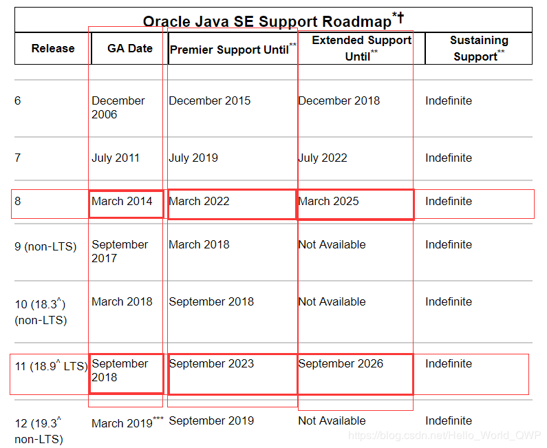

[TOC]

### 杂记

#### Java编译、链接与运行

- 从源代码到运行有编译与链接两个步骤。编译将代码编译为字节码 .class 文件，一般用 **javac 命令**完成。
- **链接**就是根据引用到的**类加载相应的字节码**并执行。
- import 是编译时概念，用于确定完全限定名，运行时只根据完全限定名寻找并加载类。

```java
javac Test.java     // Compile a class to get a .class file
java Test           // 运行上述产生的.class文件 此时不需要扩展名
```

利用 **javap** 命令对 **class 文件进行反编译**。

------

#### 文档注释

javadoc 命令只能用在 /**   */ 之间。一些注释用的标签：

```java
@see	 	// 引用其他类
@version	// 版本号
@author		// 作者
@param		// 参数信息
@return		// 返回值信息
@throws		// 异常信息
@deprecated // 弃用
```

---

#### 软件开发核心原则

- **Don't Repeat Yourself**：这是软件开发的一个基础原则，即不要做重复性劳动。也是现在所说的“极客文化”的一种。代码重复、工作重复在软件开发中都是不合理的存在。利用各种手段消除这些重复是软件开发的一个核心工作准则。
- **Keep it simple stupid**：即 KISS 原则。在做软件设计的工作中，很多时候都不要想得过于复杂，也不要过度设计和过早优化，用最简单且行之有效的方案也就避免了复杂方案带来的各种额外成本。既有利于后续的维护，也利于进一步的扩展。
- **You Ain’t Gonna Need It**：即 YAGNI 原则。只需要将应用程序必需的功能包含进来，而不要试图添加任何其他你认为可能需要的功能。因为在一个软件中，往往**80%的请求都花费在20%的功能上**。
- **Done is better than perfect**：在面对一个开发任务时，最佳的一个思路就是先把东西做出来，再去迭代优化。如果一开始就面面俱到，考虑到各种细节，那么很容易陷入牛角尖而延误项目进度。
- **Choose the most suitable things**：这是在做方案选择、技术选型时候的一个很重要的原则。在面对许多技术方案、开源实现的时候，务必做到的是不能盲目求新，要选择最合适的而非被吹得天花乱坠的。

---

#### 输入输出

构造 Scanner 对象，并与"标准输入流 "**System.in**" 关联。

牛客笔试输入输出总结：

```java
// 输入描述:
// 输入包括2行：
// 第一行为整数n(1 <= n <= 50)，即抹除一个数之后剩下的数字个数
// 第二行为n个整数num[i] (1 <= num[i] <= 1000000000)
import java.util.*;
public class Next {
    public static void main(String[] args) {
        Scanner sc = new Scanner(System.in);
        int N = sc.nextInt();
        int[] num = new int[N];
        for (int i = 0; i < N; i++) {
            // N个数存入数组中
            num[i] = sc.nextInt();
        }
    }
}
```

```java
import java.util.*;
public class Main{
    public static void main(String[] args) {
        Scanner sc = new Scanner(System.in);
        String str = sc.nextLine();
        char[] arr = str.toCharArray();
    }
}
```

```java
输入描述:
输入包括n+1行：
第一行为单词个数n(1 ≤ n ≤ 50)
接下来的n行，每行一个单词word[i]，长度length(1 ≤ length ≤ 50)。由小写字母构成
输出描述:
输出循环单词的种数
输入例子:
5
picture
turepic
icturep
word
ordw

Scanner sc = new Scanner(System.in);
demo.N = sc.nextInt();
demo.arr = new String[demo.N];
for (int i = 0; i < demo.N; i++) {
    String str = sc.next();
    demo.solve(str);
}
```

```java
// 读三行
// 6 3
// 1 3 5 2 5 4
// 1 1 0 1 0 0
Scanner scan = new Scanner(System.in);
// 先读第一行的两个数
int n = scan.nextInt();
int k = scan.nextInt();
// 构造两个数组
int[] val = new int[n];
int[] state = new int[n];
// 保存瞌睡时的累计评分
int sleep = 0;
int[] sleepval = new int[n];
// 读第二行N个值
for(int i=0;i<n;i++){
    val[i] = scan.nextInt();
}
// 读第三行的N个值
for(int i=0;i<n;i++){
    state[i] = scan.nextInt();
    if(state[i]==0){
        sleep += val[i];
    }
    sleepval[i] = sleep;
}
```

```java
// 第一行是告诉矩阵的行和列数
// 后面N行是矩阵
// 最后一行是需要查找的数
// 3 3
// 2 3 5
// 3 4 7
// 3 5 8
// 4
Scanner in = new Scanner(System.in);
int[][] matrix=null;
int a=0,b=0;
// 先读入第一行的两个数    
a = in.nextInt();
b = in.nextInt();
// 构造矩阵
matrix=new int[a][b];
// 读取后面的a行b列
for(int i=0;i<a;i++){
    for(int j=0;j<b;j++){
        matrix[i][j]=in.nextInt();
    }
}
// 读取最后一个数
int target=in.nextInt();
```

---

#### Java与C++的区别

- Java 是纯粹的**面向对象语言**，所有的对象都继承自 java.lang.Object，C++ 为了兼容 C 即支持面向对象也支持面向过程。
- Java 通过虚拟机从而实现**跨平台**特性，但是 C++ 依赖于特定的平台。
- Java **没有指针**，它的引用可以理解为**安全指针**，而 C++ 具有和 C 一样的指针。
- Java 支持**自动垃圾回收**，而 C++ 需要手动回收。
- Java **不支持多重继承**，只能通过实现**多个接口**来达到相同目的，而 C++ 支持多重继承。
- Java **不支持操作符重载**，虽然可以对两个 String 对象执行加法运算，但是这是语言内置支持的操作，不属于操作符重载，而 C++ 可以。
- Java 的 goto 是保留字，但是不可用，C++ 可以使用 goto。
- Java **不支持条件编译**，C++ 通过 #ifdef #ifndef 等预处理命令从而实现条件编译。
- **在 C 语言中，字符串或字符数组最后都会有一个额外的字符‘\0’来表示结束。但是，Java 语言中没有结束符这一概念。**

---

#### 断言

##### 1. 概述

断言机制允许在**测试期间**向代码中插入一些检査语句。当代码发布时，这些插入的检测语句将会被自动地移走。

断言使用关键字 **assert**。这个关键字有两种形式：

```java
assert 条件;
assert 条件：表达式;
```

这两种形式都会对条件进行检测， 如果结果为 false, 则抛出一个 **AssertionError** 异常。在第二种形式中，表达式将被传人 AssertionError 的构造器， 并转换成一个消息字符串。

默认情况下断言被**禁用**。可以在运行程序时用 -enableassertions 或 -ea 选项启用：

> java -enableassertions MyApp

- 在启用或禁用断言时**不必**重新编译程序。启用或禁用断言是**类加载器**(class loader) 的功能。当断言被禁用时，**类加载器将跳过**断言代码，因此，不会降低程序运行的速度。
- 断言失败是致命的、 不可恢复的错误。
- 断言检查只用于**开发和测试**阶段。断言只应该用于在测试阶段确定程序内部的**错误位置**。

单元测试必须使用断言（Junit/JunitX）。

##### 2. 常用断言方法

|                             断言                             |                             描述                             |
| :----------------------------------------------------------: | :----------------------------------------------------------: |
| void assertEquals([String message], expected value, actual value) | 断言两个值相等。值可能是类型有 int, short, long, byte, char or java.lang.Object. 第一个参数是一个可选的字符串消息 |
|   void **assertTrue**([String message], boolean condition)   |                       断言一个条件为真                       |
|     void assertFalse([String message],boolean condition)     |                       断言一个条件为假                       |
| void assertNotNull([String message], java.lang.Object object) |                   断言一个对象不为空(null)                   |
|  void assertNull([String message], java.lang.Object object)  |                    断言一个对象为空(null)                    |
| void assertSame([String message], java.lang.Object expected, java.lang.Object actual) |                 断言，两个对象引用相同的对象                 |
| void assertNotSame([String message], java.lang.Object unexpected, java.lang.Object actual) |               断言，两个对象不是引用同一个对象               |
| void assertArrayEquals([String message], expectedArray, resultArray) | 断言预期数组和结果数组相等。数组的类型可能是 int, long, short, char, byte or java.lang.Object. |


#### Java新特性

##### 1. Java9

**Java平台模块系统**：Java 平台模块系统，也就是 Project Jigsaw，把模块化开发实践引入到了 Java 平台中。在引入了模块系统之后，JDK 被重新组织成 94 个模块。Java 应用可以通过新增的 jlink 工具，创建出只包含所依赖的 JDK 模块的自定义运行时镜像。这样可以极大的减少 Java 运行时环境的大小。Java 9 模块的重要特征是在其工件（artifact）的根目录中包含了一个描述模块的 module-info.class 文 件。 工件的格式可以是传统的 JAR 文件或是 Java 9 新增的 JMOD 文件。

**Jshell**：jshell 是 Java 9 新增的一个实用工具。为 Java 提供了类似于 Python 的实时命令行交互工具。在 Jshell 中可以直接输入表达式并查看其执行结果。

**集合、Stream 和 Optional**：增加 了 List.of()、Set.of()、Map.of() 和 Map.ofEntries()等工厂方法来创建不可变集合，比如List.of("Java", "C++");、Map.of("Java", 1, "C++", 2);（这部分内容有点参考 Guava 的味道）。Stream 中增加了新的方法 ofNullable、dropWhile、takeWhile 和 iterate 方法。Collectors 中增加了新的方法 filtering 和 flatMapping。Optional 类中新增了 ifPresentOrElse、or 和 stream 等方法。

**进程 API**：Java 9 增加了 ProcessHandle 接口，可以对原生进程进行管理，尤其适合于管理长时间运行的进程。

**平台日志 API 和服务**：Java 9 允许为 JDK 和应用配置同样的日志实现。新增了 System.LoggerFinder 用来管理 JDK 使 用的日志记录器实现。JVM 在运行时只有一个系统范围的 LoggerFinder 实例。可以通过添加自己的 System.LoggerFinder 实现来让 JDK 和应用使用 SLF4J 等其他日志记录框架。

**反应式流 （ Reactive Streams ）**：在 Java9 中的 java.util.concurrent.Flow 类中新增了反应式流规范的核心接口。Flow 中包含了 Flow.Publisher、Flow.Subscriber、Flow.Subscription 和 Flow.Processor 等 4 个核心接口。Java 9 还提供了SubmissionPublisher 作为Flow.Publisher 的一个实现。

**变量句柄**：变量句柄是一个变量或一组变量的引用，包括静态域，非静态域，数组元素和堆外数据结构中的组成部分等。变量句柄的含义类似于已有的方法句柄MethodHandle。由 Java 类java.lang.invoke.VarHandle 来表示，可以使用类 java.lang.invoke.MethodHandles.Lookup 中的静态工厂方法来创建 VarHandle 对象。

**改进方法句柄（Method Handle）**：方法句柄从 Java7 开始引入，Java9 在类java.lang.invoke.MethodHandles 中新增了更多的静态方法来创建不同类型的方法句柄。

**接口私有方法** ：Java 9 允许在接口中使用私有方法。

**改进应用的安全性能** ：Java 9 新增了 4 个 SHA- 3 哈希算法，SHA3-224、SHA3-256、SHA3-384 和 S HA3-512。

##### 2. Java10

发布于 2018 年 3 月 20 日，最知名的特性应该是 **var 关键字**（局部变量类型推断）的引入了，其他还有垃圾收集器改善、GC 改进、性能提升、线程管控等一批新特性。

**var 关键字**：提供了 var 关键字声明局部变量：var list = new ArrayList\<String>(); // ArrayList\<String>。**局限性** ：只能用于带有构造器的**局部变量**和 for 循环中。

**不可变集合**：list，set，map 提供了静态方法copyOf()返回入参集合的一个不可变拷贝（以下为 JDK 的源码）

```java
static <E> List<E> copyOf(Collection<? extends E> coll) {
    return ImmutableCollections.listCopy(coll);
}
```

java.util.stream.Collectors中新增了静态方法，用于将流中的元素收集为不可变的集合

**Optional**：新增了 orElseThrow() 方法来在没有值时抛出异常。

**并行全垃圾回收器G1**：从 Java9 开始 G1 就了默认的垃圾回收器，G1 是以一种低延时的垃圾回收器来设计的，旨在避免进行 Full GC,但是 Java9 的 G1 的 FullGC 依然是使用单线程去完成标记清除算法，这可能会导致垃圾回收期在无法回收内存的时候触发 Full GC。为了最大限度地减少 Full GC 造成的应用停顿的影响，从 Java10 开始，G1 的 FullGC 改为并行的标记清除算法，同时会使用与年轻代回收和混合回收相同的并行工作线程数量，从而减少了 Full GC 的发生，以带来更好的性能提升、更大的吞吐量。

**应用程序类数据共享**：在 Java 5 中就已经引入了类数据共享机制 (Class Data Sharing，简称 CDS)，允许将一组类预处理为共享归档文件，以便在运行时能够进行内存映射以减少 Java 程序的启动时间，当多个 Java 虚拟机（JVM）共享相同的归档文件时，还可以减少动态内存的占用量，同时减少多个虚拟机在同一个物理或虚拟的机器上运行时的资源占用

Java 10 在现有的 CDS 功能基础上再次拓展，以允许应用类放置在共享存档中。CDS 特性在原来的 bootstrap 类基础之上，扩展加入了应用类的 CDS (Application Class-Data Sharing) 支持。其原理为：在启动时记录加载类的过程，写入到文本文件中，再次启动时直接读取此启动文本并加载。设想如果应用环境没有大的变化，启动速度就会得到提升

**线程-局部管控**：Java 10 中线程管控引入 JVM 安全点的概念，将允许在不运行全局 JVM 安全点的情况下实现线程回调，由线程本身或者 JVM 线程来执行，同时保持线程处于阻塞状态，这种方式使得停止单个线程变成可能，而不是只能启用或停止所有线程

**备用存储装置上的堆分配**：Java 10 中将使得 JVM 能够使用适用于不同类型的存储机制的堆，在可选内存设备上进行堆内存分配

**统一的垃圾回收接口**：Java 10 中，hotspot/gc 代码实现方面，引入一个干净的 GC 接口，改进不同 GC 源代码的隔离性，多个 GC 之间共享的实现细节代码应该存在于辅助类中。统一垃圾回收接口的主要原因是：让垃圾回收器（GC）这部分代码更加整洁，便于新人上手开发，便于后续排查相关问题。

##### 3. Java11

Java11 于 2018 年 9 月 25 日正式发布，这是很重要的一个版本！Java 11 和 2017 年 9 月份发布的 Java 9 以及 2018 年 3 月份发布的 Java 10 相比，其最大的区别就是：在长期支持(Long-Term-Support)方面，**Oracle 表示会对 Java 11 提供大力支持，这一支持将会持续至 2026 年 9 月。这是据 Java 8 以后支持的首个长期版本。**



**字符串加强**：Java 11 增加了一系列的字符串处理方法，如以下所示。

```java
// 判断字符串是否为空
" ".isBlank();//true
// 去除字符串首尾空格
" Java ".strip();// "Java" 
// 去除字符串首部空格
" Java ".stripLeading();   // "Java "  
// 去除字符串尾部空格
" Java ".stripTrailing();  // " Java"  
// 重复字符串多少次
"Java".repeat(3);             // "JavaJavaJava"  

// 返回由行终止符分隔的字符串集合。
"A\nB\nC".lines().count();    // 3 
"A\nB\nC".lines().collect(Collectors.toList()); 
```

**ZGC：可伸缩低延迟垃圾收集器**：**ZGC 即 Z Garbage Collector**，是一个可伸缩的、低延迟的垃圾收集器。

ZGC 主要为了满足如下目标进行设计：

- GC 停顿时间不超过 10ms
- 即能处理几百 MB 的小堆，也能处理几个 TB 的大堆
- 应用吞吐能力不会下降超过 15%（与 G1 回收算法相比）
- 方便在此基础上引入新的 GC 特性和利用 colord
- 针以及 Load barriers 优化奠定基础
- 当前只支持 Linux/x64 位平台

ZGC 目前 **处在实验阶段**，只支持 Linux/x64 平台。

**标准 HTTP Client 升级**：Java 11 对 Java 9 中引入并在 Java 10 中进行了更新的 Http Client API 进行了标准化，在前两个版本中进行孵化的同时，Http Client 几乎被完全重写，并且现在完全支持异步非阻塞。并且，Java11 中，Http Client 的包名由 jdk.incubator.http 改为java.net.http，该 API 通过 CompleteableFuture 提供非阻塞请求和响应语义。使用起来也很简单，如下：

```java
var request = HttpRequest.newBuilder()  
    .uri(URI.create("https://javastack.cn"))  
    .GET()  
    .build();  

var client = HttpClient.newHttpClient();  

// 同步  
HttpResponse<String> response = client.send(request, HttpResponse.BodyHandlers.ofString());  
System.out.println(response.body());  

// 异步  
client.sendAsync(request, HttpResponse.BodyHandlers.ofString())  
    .thenApply(HttpResponse::body)  
    .thenAccept(System.out::println); 
```

**简化启动单个源代码文件的方法**：增强了 Java 启动器，使其能够运行单一文件的 Java 源代码。此功能允许使用 Java 解释器直接执行 Java 源代码。源代码在内存中编译，然后由解释器执行。唯一的约束在于所有相关的类必须定义在同一个 Java 文件中。对于 Java 初学者并希望尝试简单程序的人特别有用，并且能和 jshell 一起使用。一定能程度上增强了使用 Java 来写脚本程序的能力。

**用于 Lambda 参数的局部变量语法**：从 Java 10 开始，便引入了局部变量类型推断这一关键特性。类型推断允许使用关键字 var 作为局部变量的类型而不是实际类型，编译器根据分配给变量的值推断出类型。

Java 10 中对 var 关键字存在几个限制：

- 只能用于局部变量上
- 声明时必须初始化
- 不能用作方法参数
- 不能在 Lambda 表达式中使用

**新的垃圾回收器 Epsilon**：一个完全消极的 GC 实现，分配有限的内存资源，最大限度的降低内存占用和内存吞吐延迟时间

**低开销的 Heap Profiling**：Java 11 中提供一种低开销的 Java 堆分配采样方法，能够得到堆分配的 Java 对象信息，并且能够通过 JVMTI 访问堆信息


#### 正则表达式

| 符号 |       描述       |  例子  |  能匹配  | 不能匹配 |
| :--: | :--------------: | :----: | :------: | :------: |
|  ^   | 行首或字符串开始 |  ^yo   |    yo    |   ayo    |
|  $   | 行末或字符串结束 |  yo$   |    yo    |   yop    |
|  \b  |     单词边界     | \byo\b | mu yo mu |  muyomu  |
|  \B  |    非单词边界    | \Byo\B |  muyomu  | mu yo mu |

|   符号   |                             描述                             |   例子    | 能匹配 | 不能匹配 |
| :------: | :----------------------------------------------------------: | :-------: | :----: | :------: |
| (?=xxx)  |   正向肯定预查，从任何匹配xxx的字符串开始处匹配查找字符串    |  yo(?=o)  |  yoo   |    yo    |
| (?!xxx)  | 正向否定预查，从任何不匹配pattern的字符串开始处匹配查找字符串 |  yo(?!o)  |   yo   |   yoo    |
| (?<=xxx) |        反向肯定预查，与正向肯定预查类拟，只是方向相反        |  (?<=y)o  |   yo   |   yoo    |
| (?<!xxx) |        反向否定预查，与正向否定预查类拟，只是方向相反        | (?<!goo)d |  mood  |   good   |

| 符号  |            描述             |  例子  |    能匹配     | 不能匹配 |
| :---: | :-------------------------: | :----: | :-----------: | :------: |
|  [ ]  |          字符集合           | [ace]  |    a, c, e    |    d     |
| [ - ] |          字符范围           | [a-c]  |    a, b, c    |    d     |
| [^ ]  |      不包含的字符集合       | [^abc] |     d, e      | a, b, c  |
|   .   |   匹配除断行外的任何字符    |  yo.   | yoo, yop, yoh |    yo    |
|  \s   |  空白字符，等于[\n\r\f\t ]  | la\sla |     la la     |   lala   |
|  \S   | 非空白字符，等于[^\n\r\f\t] | la\sla |     lala      |  la la   |
|  \d   |            数字             | \d{2}  |      23       |    1a    |
|  \D   |           非数字            | \D{3}  |   yoo, abc    |   yo1    |
|  \w   |   单词，等于[a-z-A-Z0-9_]   | \w{4}  |     v123      |  v12.3   |
|  \W   | 非单词，等于[^a-z-A-Z0-9_]  |  .$%?  |     .$%?      |   .ab?   |

| 特殊字符 |    描述    |
| :------: | :--------: |
|    \n    |    断行    |
|    \r    |   回车符   |
|    \t    |   制表符   |
|    \v    | 垂直制表符 |
|    \f    |    换页    |
|   [\b]   |    退格    |

|  符号   |           描述            |   例子   |   能匹配   | 不能匹配 |
| :-----: | :-----------------------: | :------: | :--------: | :------: |
|   \|    |         或，其一          |   a\|b   |    a, b    |    c     |
|  (xxx)  |   匹配xxx并获取这一匹配   | yo(o\|p) | yoo 或 yop |   yoh    |
| (?:xxx) |  匹配xxx但不获取这一匹配  |  y(?:o)  |     yo     |    ya    |
|    +    |       重复1次或多次       |   yo+    |  yo, yooo  |    y     |
|    *    |       重复0次或多次       |   yo*    |   y, yoo   |   yop    |
|    ?    |       出现0次或1次        |   yo?    |   y, yo    |    ye    |
|   ??    | ?的懒惰模式，尽可能少匹配 |  yoo??   |     yo     |   yoo    |
|   +?    |        +的懒惰模式        |   yo+?   |     yo     |   yoo    |
|   *?    |        *的懒惰模式        |   yo*?   |     y      |    yo    |
|   {n}   |          重复n次          |  yo{2}   |    yoo     |   yooo   |
|  {n,m}  |        重复n到m次         | yo{1, 3} |  yo,yooo   |  yoooo   |
|  {n,}   |        重复至少n次        |  yo{2,}  | yoo, yooo  |    yo    |

