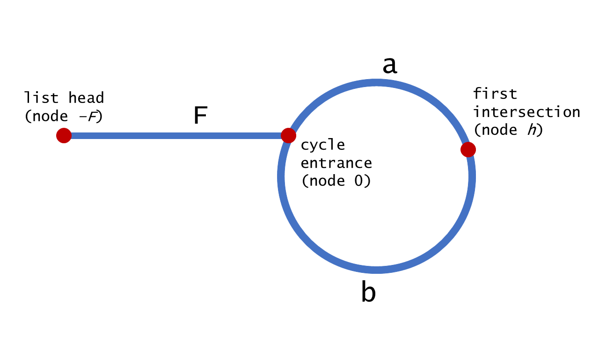

[TOC]

### 链表题目

#### 基础

##### 1. 链表类问题解题技巧

###### (1) 使用额外空间

使用**额外空间**（如 **HashMap、数组**）来辅助操作。

场景：复制链表的复制、判断链表是否有环等等。

额外空间会增加空间复杂度，而且很多题 O(1) 空间就行了，不过使用额外空间在**笔试中**很不错。快啊！面试中第一步也可以用。

###### (2) 引入dummy结点

对于**可能会改变头结点**的题目，引入 dummy 结点就是**基操**，最后返回 dummy.next 即可。非常 nice。可以试一试不加 dummy 且会改变头结点的那种情况。

场景：删除某个结点（可能把头结点删了）、两两一个交换结点（头结点会被交换出去）。

###### (3) 快慢指针或双指针

由于链表不像数组那样可以直接寻址，因此可以**引入多个指针**。**快慢指针**是非常巧妙且常见的技巧！

场景：找链表中间结点、判断链表是否有环、删除倒数第K个结点、奇偶链表。

###### (4) 牢记链表逆序的方法

很多题都需要**链表逆序**！逆序可以使用**==栈、递归、迭代==**等方式实现。栈比较费空间，递归较难理解，利用迭代可以通过画图的方式现场推出来迭代路线。

面试一定要掌握**迭代**的方式逆序。

场景：判断链表是否是回文结构（逆序后半部分）、两个链表数字相加（这个题用栈逆序贼方便，看实际情况吧）、反转指定范围链表。

###### (5) 学会画迭代思路图

这个多练练才行，不少题目使用额外空间很容易，但是空间浪费，但是她们其实可以通过迭代的方式做出来，因此**要学会分析题目画出迭代的关系，指针的变化**步骤与方式。

场景：链表逆序（迭代方式）、两两一组交换链表、奇偶链表等。

###### (6) 其他

链表是**空节点**，或者有一个值和一个指向下一个链表的指针，因此很多链表问题可以用**递归**来处理。

##### 2. 链表结点类

```java
class Node {
    int val;
    Node next;
    Node(int val){
        this.val = val;
    }
}
```

### 反转链表类题目

这类题目涉及到反转整个链表或者一部分链表。

#### 👨💯206.反转单向链表【简单】

##### [1. 题目](https://leetcode-cn.com/problems/reverse-linked-list)

反转一个单链表。示例：

```java
输入: 1->2->3->4->5->NULL
输出: 5->4->3->2->1->NULL
```

##### 2. 题解

###### (1) 利用栈

可以先将链表**全部元素压栈**，之后**依次出栈**就是逆序了。这样空间复杂度就是 O(N) 了。

###### (2) 递归法

递归方式：**递归系统压栈**的过程，系统在压栈的时候会保留现场。递归方式与使用栈类似，只不过不是显示使用栈。

看看递归过程：**1->2->3->4**。

- 程序到达 Node newHead = reverse(head.next); 时**进入递归**。
- 假设此时递归到了 3 结点，此时 head = 3 结点，temp = 3 结点 .next(实际上是 4 结点)
- 执行 Node newHead = reverse(head.next); 传入的 head.next 是 4 结点，返回的 newHead 是 4 结点。
- 接下来就是**弹栈过程**了
    - 程序继续执行 temp.next = head 就相当于 4->3。
    - head.next = null 即把  3结点指向 4 结点的指针断掉。
    - 返回新链表的头结点 newHead。
- 注意：当 return 后，系统会恢复 **2 结点**压栈时的现场，此时的 head = 2 结点；temp = 2 结点 .next (3结点)，再进行上述的操作。最后完成整个链表的翻转。

```java
public Node reverse(Node head) {
    // 递归的终止条件 只有一个元素或者无元素返回
    if (head == null || head.next == null) return head;
        
    Node newHead = reverse(head.next);
    // 使用一个temp来保存下一个结点的指针
    Node temp = head.next;
    temp.next = head;
    head.next = null;
    return newHead;
}
```

###### (3) 迭代修改指针法

也叫**头插法**。笔试会这个即可。时间复杂度 **O(N)，空间复杂度 O(1)** 的算法。

假设前面已经反转过 pre 的链表了， pre 是反转后的头部结点。如下图。

① 先通过 head 找 head 的下一个结点 next，记录下剩下没有转方向的节点的引用。

② head 节点的 next 指向 pre。

③ pre 移动到 head 处。

④ 将 head 移动到 next 处。


这样就完成了一个结点的反转。**持续下去**。代码如下。不要记代码，理解过程**自己推**就行了，分析中间的一般行为即可。

```java
/**
 * 反转单向链表
 *
 * 方法是不断把后面的指针往前面指
 * @param head 原链表头部
 * @return 反转之后的链表
 */
public Node reverseList(Node head) {
    // 初始化两个指针指向null
    Node pre = null;
    Node next = null;

    while (head != null) {
        next = head.next;
        head.next = pre;
        pre = head;
        head = next;
    }
    return pre;
}
```

**==记住下面这个头插法就行！！！==**上述修改指针较为复杂，这里用一种**两个指针**的头插法，也就是引入 **dummy 结点**，然后把**第一个结点**先弄好，之后每次将新的结点插入到 dummy 结点的**后面一个**。

```java
public ListNode reverseList(ListNode head) {
    // null或只有一个结点的情况
    if(head == null || head.next == null) {
        return head;
    }
    // 引入dummy结点
    ListNode dummy = new ListNode(0);
    // 使用一个cur表示当前正在反转的结点
    ListNode cur = head;
    // head一直后移
    head = head.next;
    // 先把链表第一个结点放到dummy后面当做反转后的最后一个结点
    dummy.next = cur;
    cur.next = null;
    // 下面就是不断遍历了
    while(head != null) {
        // cur指向头结点
        cur = head;
        // 移动头结点
        head = head.next;
        // 将cur结点插入到dummy结点之后形成新的链表
        cur.next = dummy.next;
        dummy.next = cur;
    }
    return dummy.next;
}
```

再来一种写法。

```java
private ListNode reverseList(ListNode head) {
    if (head == null) return null;
    ListNode tail = head;
    head = head.next;
    tail.next = null;
    while (head != null) {
        ListNode temp = head.next;
        head.next = tail;
        tail = head;
        head = temp;
    }
    return tail;
}
```

---

#### 👨92.反转指定范围的链表【中等】

##### [1. 题目](https://leetcode-cn.com/problems/reverse-linked-list-ii)

反转从**位置 m 到 n** 的链表。请使用**一趟扫描**完成反转。说明：1 ≤ m ≤ n ≤ 链表长度。

```java
输入: 1->2->3->4->5->NULL, m = 2, n = 4
输出: 1->4->3->2->5->NULL
```

##### 2. 题解

这里类似反转单向链表，也可以用**栈**的方式解决，但是空间复杂度较高。一般都是用迭代直接修改指针。

###### (1) 迭代法

将链表分为 3 个部分，2 个**不反转**部分和 1 个**反转**的部分。

- 前面的**不反转**部分，**保留最后一个节点**，后面的不反转部分，保留**第一个**节点。
- 对于**反转**部分，要**保留两个端点**。
- 反转结束后，将三个部分**拼接**起来。


由于**反转**的可能包含第一个结点，所以**引入 dummy 结点**。同时引入一个 **cur** 指针，**从前往后**一直遍历。

```java
public ListNode reverseBetween(ListNode head, int start, int end) {
    // 引入dummy结点
    ListNode dummy = new ListNode(0);
    dummy.next = head;
    // cur用于依次遍历这个链表
    ListNode cur = dummy;
    // 找第一部分不用变的 start = 4, end = 6
    for(int i = 0; i < start - 1; i++) {
        cur = cur.next;
    }
    // 记录第一部分不用变化的末尾节点
    ListNode originEnd = cur;
    // 得到需要变得部分的头
    ListNode revBegin = originEnd.next;
    // end - start = 2
    for(int j = 0; j <= end - start; j++) {
        cur = cur.next;
    }
    // 此时p为需要变得部分的末尾，其后面一个结点即为后面不需要变得部分的头结点
    ListNode lastStart = cur.next;
    // 当前cur指向需要反转链表的最后一个节点，此时断开指针
    cur.next = null;
    // 反转链表，经过反转，revBegin已经指向了反转后链表的末尾
    originEnd.next = reverse(revBegin);

    // 连接最后一段不需要变化的部分
    revBegin.next = lastStart;

    return dummy.next;
}

// 递归反转链表
ListNode reverse(ListNode head) {
    if (head.next == null) return head;
    ListNode last = reverse(head.next);
    head.next.next = head;
    head.next = null;
    return last;
}
```

#### 👨25.K个一组翻转链表【困难】

##### [1. 题目](https://leetcode-cn.com/problems/reverse-nodes-in-k-group)

给你一个链表，每 **k 个节点一组**进行翻转，请你返回翻转后的链表。k 是一个正整数，它的值小于或等于链表的长度。果节点总数**不是 k** 的整数倍，那么请将最后**剩余的节点保持原有顺序**。题目要求：算法只能使用**常数**的额外空间。

```java
链表：1->2->3->4->5
当 k = 2 时，应当返回: 2->1->4->3->5
当 k = 3 时，应当返回: 3->2->1->4->5
```

不是仅交换数值，需要**交换结点**。

##### 2. 题解

题目要求算法只能使用**常数**的额外空间。说明**不能用递归**，只能用**迭代**的方式进行。做题之前先自己画个图想想大致思路，理清每一个临界位置的指向。

- 首先通过 **k 次 for 循环用 end 指针指向翻转元素的末尾**。
- 此时判断一下如果翻转元素不到 k 个，即 end==null，说明**已经到达末尾**，直接返回即可。
- 接下来需要定义两个指针 **pre 和 pLast 分别记录翻转元素的前驱和后继**，以便将翻转元素前后两部分连接起来。
- 之后再重置 **pre 和 end 指针**，进入下一次循环。
- 遍历完之后返回 dummy 带头结点下一个元素即可。


由于第一个结点需要进行**反转**，所以需要一个 **dummy** 结点。

```java
public ListNode reverseKGroup(ListNode head, int k) {
    // 由于要操作第一个节点 引入dummy节点
    ListNode dummy = new ListNode(0);
    dummy.next = head;
    // 初始化双指针
    ListNode slow = dummy;
    ListNode fast = dummy;
    while (true) {
        // 让fast遍历到需要翻转的最后一个元素位置
        for (int i = 0; i < k && fast != null; i++) {
            // 说明fast到了链表尾部,此轮反转长度不够
            fast = fast.next;
        }
        // 只要fast遍历到了null直接跳出循环
        if (fast == null) break;
        // 下面就是画图改变指针指向
        // 为了别把链表搞丢，记录一下后面等待反转的链表头结点
        ListNode remainList = fast.next;
        // 定义start指向翻转元素的第一个位置
        ListNode reverseStart = slow.next;
        // 最后一个翻转元素先断链
        fast.next = null;
        // 然后通过翻转方法reverse()后接在slow后面
        slow.next = reverseList(reverseStart);
        // 保持下次循环一致的位置
        reverseStart.next = remainList;
        slow = reverseStart;
        // 反转之后重置指针
        fast = slow;
    }
    return dummy.next;
}

// 迭代反转链表的模板
public ListNode reverseList(ListNode head) {
    // 初始化两个指针指向null
    ListNode pre = null;
    ListNode next = null;

    while (head != null) {
        next = head.next;
        head.next = pre;
        pre = head;
        head = next;
    }
    return pre;
}
```

#### 24.两两交换链表中的节点【中等】

##### [1. 题目](https://leetcode-cn.com/problems/swap-nodes-in-pairs)

给定一个链表，**两两交换**其中相邻的节点，并返回交换后的链表。**不能**只是单纯的改变节点内部的值，而是**需要实际的进行节点交换**。

```
1->2->3->4 返回 2->1->4->3
```

##### 2. 题解

这里应该也可以利用 **K 个一组**反转链表的解法，只不过 **K = 2**。

###### (1) 双指针遍历法

- 首先由于需要操作**头结点**，因此引入一个 **dummy** 结点，用于保存最后返回的头结点。
- 再引入一个 **cur 结点**，后续 cur 作为 dummy 结点移动。
- 后续的结点**两两一组进行交换**，主要是注意指针的变换，类似于普通的**变量交换**，画图理解即可！
- 当完成两个之后，cur 指针往**后移动两步**，head 移动到 cur 的**后面**，再次重复上述的交换动作。直到 cur 的后面没有结点或者只有一个结点为止。

图示如下图。


```java
public ListNode swapPairs(ListNode head) {
    // Base case
    if(head == null || head.next == null) return head;
    // 引入dummy与cur结点
    ListNode dummy = new ListNode(0);
    dummy.next = head;
    ListNode cur = dummy;

    // 当cur结点后面没有结点或者仅有一个结点停止
    while(cur.next != null && cur.next.next != null) {
        // 这三步进行指针变换:画图进行交换即可！
        cur.next = head.next;
        head.next = head.next.next;
        cur.next.next = head;
        // cur往后移动2个结点
        cur = cur.next.next;
        // head移动到cur后面
        head = head.next;
    }
    return dummy.next;
}
```

###### (2) 递归解法

只能说 666 了。

```java
public class Solution {
    public ListNode swapPairs(ListNode head) {
        if(head == null || head.next == null){
            return head;
        }
        ListNode next = head.next;
        head.next = swapPairs(next.next);
        next.next = head;
        return next;
    }
}
```


### 链表合并与切分类题目

当需要变换链表时，直接引入一个 dummy 结点，然后把合格的链表弄到 dummy 后面即可。

#### 💯21.合并两个有序的链表【简单】

##### [1. 题目](https://leetcode-cn.com/problems/merge-two-sorted-lists/)

两个链表都是从小到大排列，合并两个链表，使其合并之后依然是从小到大排列。

##### 2. 题解

###### (1) 递归法

**递归版本**，额外空间为 **O(N)**。

```java
/**
* 合并两个有序链表：递归版本
*
* @param head1 链表1
* @param head2 链表2
* @return 合并后的链表
*/
public Node mergeTwoLists(Node head1, Node head2) {
    // 如果其中之一为null则返回另一个
    if (head1 == null || head2 == null) {
        return head1 != null ? head1 : head2;	// 妙
    }
    // 利用head来保存结点值
    Node head = null;
    // 到这里说明两个节点都不为null
    if (head1.value <= head2.value){
        // 合并head1并传入其下一个结点继续
        head = head1;
        head.next = mergeTwoLists(head1.next, head2);
    } else {
        // 合并head2并传入其下一个结点继续
        head = head2;
        head.next = mergeTwoLists(head1, head2.next);
    }
    return head;
}
```

###### (2) 迭代版本

**迭代版本**：就是需要找到**小的起始值**开始遍历合并。注意需要**保存链表的结点变量**即可。

```java
public ListNode mergeTwoLists2(ListNode l1, ListNode l2) {
    // 其中一个为null返回另一条
    if(l1 == null || l2 == null) return l1 == null ? l2 : l1;
    // 引入dummy结点
    ListNode dummy = new ListNode(0);
    ListNode cur = dummy;
    // 都不为null进行
    while(l1 != null && l2 != null) {
        if(l1.val < l2.val) {
            ListNode temp = l1;
            l1 = l1.next;
            temp.next = null;
            cur.next = temp;
        } else {
            ListNode temp = l2;
            l2 = l2.next;
            temp.next = null;
            cur.next = temp;
        }
        cur = cur.next;
    }
    // 到这里说明有一个为null了，连接上即可
    if(l1 == null) cur.next = l2;
    if(l2 == null) cur.next = l1;
    return dummy.next;
}
```

#### 23.合并K个有序链表【困难】

##### [1. 题目](https://leetcode-cn.com/problems/merge-k-sorted-lists)

**合并 k** 个排序链表，返回合并后的排序链表。请分析和描述算法的复杂度。

```
[
  1->4->5,
  1->3->4,
  2->6
]
输出: 1->1->2->3->4->4->5->6
```

##### 2. 题解

###### (1) 逐一比较

- 比较 k 个节点（每个链表的首节点），获得最小值的节点。
- 将选中的节点接在最终有序链表的后面。

###### (2) 用优先队列优化方法

几乎与上述方法一样，除了将 **比较环节** 用 **优先队列** 进行了优化。将**所有的数值放入到优先队列中，再逐一出队列**。

###### (3) 逐一两两合并链表

利用合并两个链表的思想，**将合并 k 个链表的问题转化成合并 2 个链表 k-1 次**。

###### (4) 分治法

这个方法沿用了上面的解法，但是进行了较大的优化。不需要对大部分节点重复遍历多次。

```java
public ListNode mergeKLists(ListNode[] lists) {
    if (lists == null || lists.length == 0) return null;
    return merge(lists, 0, lists.length - 1);
}

private ListNode merge(ListNode[] lists, int left, int right) {
    if (left == right) return lists[left];
    int mid = left + (right - left) / 2;
    ListNode l1 = merge(lists, left, mid);
    ListNode l2 = merge(lists, mid + 1, right);
    return mergeTwoLists(l1, l2);
}

private ListNode mergeTwoLists(ListNode l1, ListNode l2) {
    if (l1 == null) return l2;
    if (l2 == null) return l1;
    if (l1.val < l2.val) {
        l1.next = mergeTwoLists(l1.next, l2);
        return l1;
    } else {
        l2.next = mergeTwoLists(l1, l2.next);
        return l2;
    }
}
```

#### 86.分隔链表【中等】

##### [1. 题目](https://leetcode-cn.com/problems/partition-list)

给定一个**链表**和一个**特定值 x**，对链表进行分隔，使得所有**小于 x 的节点都在大于或等于 x 的节点之前**。应当保留两个分区中每个节点的初始相对位置。

```
输入: head = 1->4->3->2->5->2, x = 3
输出: 1->2->2->4->3->5
```

##### 2. 题解

###### (1) 双指针法

可以用两个指针`before` 和 `after` 来追踪**两个链表**。两个指针可以用于分别创建两个链表，然后将这两个链表连接即可获得所需的链表。

- 引入 **Dummy** 结点。


- 不断**遍历**原链表，**小的结点挂载到小的链表，大于等于的结点挂载到大的结点**。


- 最后将**两个链表连接起来**。整个过程没有新建结点，额外空间是 O(1) 的。

```java
public ListNode partition(ListNode head, int num) {

    // dummyLess存放小于X的结点，dummyMore存放大于等于X的结点
    ListNode dummyLess = new ListNode(0);
    ListNode less = dummyLess;
    ListNode dummyMore = new ListNode(0);
    ListNode more = dummyMore;

    while (head != null) {
        // 值小于X放在dummyLess下
        if (head.val < num) {
            less.next = head;
            less = less.next;
        } else {
            // 值大于X放在dummyMore下
            more.next = head;
            more = more.next;
        }
        // 移动指针
        head = head.next;
    }

    // 将两个链表连接起来
    more.next = null;
    less.next = dummyMore.next;
    return dummyLess.next;
}
```

#### 328.奇偶链表【中等】

##### [1. 题目](https://leetcode-cn.com/problems/odd-even-linked-list)

给定一个单链表，把所有的**奇数节点**和**偶数节点**分别**排在一起**。请注意，这里的奇数节点和偶数节点指的是**节点编号**的奇偶性，而**不是节点的值的奇偶性**。请尝试使用**原地算法**完成。你的算法的空间复杂度应为 **O(1)**，时间复杂度应为 O(N)，N 为节点总数。说明：应当保持奇数节点和偶数节点的**相对顺序**。链表的第一个节点视为奇数节点，第二个节点视为偶数节点，以此类推。

```java
输入: 1->2->3->4->5->NULL
输出: 1->3->5->2->4->NULL

输入: 2->1->3->5->6->4->7->NULL 
输出: 2->3->6->7->1->5->4->NULL
```

##### 2. 题解

###### (1) 双指针法

这个题跟上个题类似，只不过判断条件变化了。将奇节点放在一个链表里，偶链表放在另一个链表里。然后把偶链表接在奇链表的**尾部**。


```java
public ListNode oddEvenList(ListNode head) {
    // base case
    if (head == null) return null;
    // 第一个节点是奇结点（就是Head），第二个为偶结点的头结点，evenHead保存偶链表头部
    ListNode odd = head, even = head.next, evenHead = even;
    // 循环退出条件
    while (even != null && even.next != null) {
        // 奇结点的下一个是跳过一个位置的下一个
        odd.next = even.next;
        // 往后移动奇结点指针
        odd = odd.next;
        // 偶结点的下一个是跳过一个位置的下一个
        even.next = odd.next;
        // 往后移动偶结点
        even = even.next;
    }
    // 将偶链表头部连接到奇链表尾部
    odd.next = evenHead;
    // 返回头（就是奇结点头部）
    return head;
}
```

自己写的容易理解的版本：

```java
public ListNode oddEvenList(ListNode head) {
    if (head == null) return null;
    // 初始化两个dummy结点即可
    ListNode odd = new ListNode(0);
    ListNode even = new ListNode(0);
    ListNode oddCur = odd;
    ListNode evenCur = even;
    int cnt = 1;
    while(head != null) {
        if(cnt % 2 == 1) {
            oddCur.next = head;
            head = head.next;
            oddCur = oddCur.next;
            oddCur.next = null;
        } else {
            evenCur.next = head;
            head = head.next;
            evenCur = evenCur.next;
            evenCur.next = null;
        }
        cnt++;
    }
    // 连接两个链表
    oddCur.next = even.next;
    return odd.next;
}
```

#### 725.链表分隔成K个链表【中等】

##### [1.题目](https://leetcode-cn.com/problems/split-linked-list-in-parts)

给定一个头结点为 root 的链表, 编写一个函数以将链表**分隔为 k 个连续**的部分。每部分的长度应该尽可能的相等：任意两部分的长度差距不能超过 1，也就是说可能有些部分为 null。这k个部分应该按照在链表中出现的顺序进行输出，并且排在前面的部分的长度应该大于或等于后面的长度。

返回一个符合上述规则的链表的列表。

```java
输入: 
root = [1, 2, 3], k = 5
输出: [[1],[2],[3],[],[]]
解释:输入输出各部分都应该是链表，而不是数组。
例如, 输入的结点 root 的 val= 1, root.next.val = 2, \root.next.next.val = 3, 且 root.next.next.next = null。
第一个输出 output[0] 是 output[0].val = 1, output[0].next = null。
最后一个元素 output[4] 为 null, 它代表了最后一个部分为空链表。
    
输入: 
root = [1, 2, 3, 4, 5, 6, 7, 8, 9, 10], k = 3
输出: [[1, 2, 3, 4], [5, 6, 7], [8, 9, 10]]
解释:输入被分成了几个连续的部分，并且每部分的长度相差不超过1.前面部分的长度大于等于后面部分的长度。
```

##### 2. 题解

###### (1) 辅助空间法

使用额外空间，肯定可以做出来，但是代价有点高。

###### (2) 迭代法

本题实质：考察如何划分一个整数 n。巧妙类比：
（1）先数出有多少块**小糖**，得 n 块；
（2）将 n 块小糖分给 **k 个小朋友**，从左往右**均分** **(n / k)** 块；
（3）前面的**(n % k)** 个人在分的时候**多的一份**，记录一下**前面有多少个人需要多分一份**。

```java
public ListNode[] splitListToParts(ListNode root, int k) {
    int length = 0;
    ListNode head = root;
    // 先求链表长度
    while (head != null) {
        head = head.next;
        length++;
    }
    // 计算可以分成几份
    int cutCount =  length / k;
    // 如果不够分成k份， 则不需要前面几份多分， 否则前面prevCount份每份需要多分一个
    int preCount = length % k;
    ListNode[] resListNodes = new ListNode[k];
    for (int i = 0; i < k; i++) {
        // 一个部分的链表
        ListNode newHead = new ListNode(0);
        ListNode cur = newHead;
        // 判断如果prevCount > 0 ，则当前需要多分一份
        for (int j = 0; j < (preCount <= 0 ? cutCount : cutCount + 1); j++) {
            if (root != null) {
                cur.next = root;
                cur = root;
                root = root.next;
            }
        }
        // 将需要多分的数量减一
        preCount--;
        // 切断前面的节点和后面的联系
        cur.next = null;
        resListNodes[i] = newHead.next;
    }
    return resListNodes;
}
```

自己写的易于理解的版本：

```java
public ListNode[] splitListToParts2(ListNode root, int k) {
    int length = 0;
    ListNode head = root;
    // 先求链表长度
    while (head != null) {
        head = head.next;
        length++;
    }
    // 计算每份至少多少个结点
    int everyNum = length / k;
    // 表示前面多少份需要多分一个
    int moreNum = length % k;

    ListNode[] resList = new ListNode[k];
    // 当前是第几轮分配结点
    int cnt = 0;

    while (root != null) {
        // curNum是当前需要分配多少个结点
        int curNum = everyNum;
        // 前面的几个需要多分配一个结点
        if (moreNum != 0) {
            curNum++;
            moreNum--;
        }
        // 往临时结点上不断添加链表
        ListNode tempNode = new ListNode(0);
        ListNode curNode = tempNode;
        while (curNum > 0) {
            curNode.next = root;
            root = root.next;
            curNode = curNode.next;
            curNum--;
        }
        // 与原本的链断开连接
        curNode.next = null;
        resList[cnt] = tempNode.next;
        cnt++;
    }
    return resList;
}
```


#### 143.重排链表【中等】

##### [1. 题目](https://leetcode-cn.com/problems/reorder-list)

给定一个**单链表 L**：L0→L1→…→Ln-1→Ln ，将其重新排列后变为： L0→Ln→L1→Ln-1→L2→Ln-2→…

也就是**不断从链表两边取结点组合形成新的链表**。你不能只是单纯的改变节点内部的值，而是需要实际的进行**节点交换**。

```javascript
给定链表 1->2->3->4, 重新排列为 1->4->2->3.
    
给定链表 1->2->3->4->5, 重新排列为 1->5->2->4->3.
```

##### 2. 题解

###### (1) 线性表存储法

链表的缺点就是**不能随机存储**，当想取末尾元素的时候，只能从头遍历一遍，很耗费时间。第二次取末尾元素的时候，又得遍历一遍。所以先来个简单粗暴的想法，**把链表存储到线性表中**，然后用双指针依次从头尾取元素即可。

###### (2) 逆转后半部分法

利用由于是**一头一尾取元素**的特点。先利用**快慢指针找到链表的中间结点**。将后半部分**链表逆序**（可以迭代或者递归逆序）。最后将前后**两个部分的链表交替连接合并起来即可**。

```java
public void reorderList(ListNode head) {
    // Base case
    if (head == null || head.next == null || head.next.next == null) return;
    // 利用快慢指针找中点，链表分成两部分
    ListNode slow = head;
    ListNode fast = head;
    while (fast.next != null && fast.next.next != null) {
        slow = slow.next;
        fast = fast.next.next;
    }
    // 断开指针。将链表分成两个部分,newHead为新的链表的头部
    ListNode newHead = slow.next;
    slow.next = null;

    // 第二个链表逆序
    newHead = reverseList(newHead);

    // 链表节点依次交错连接合并
    while (newHead != null) {
        ListNode temp = newHead.next;
        newHead.next = head.next;
        head.next = newHead;
        head = newHead.next;
        newHead = temp;
    }
}
// 逆序一个链表
private ListNode reverseList(ListNode head) {
    if (head == null) {
        return null;
    }
    ListNode tail = head;
    head = head.next;
    tail.next = null;
    while (head != null) {
        ListNode temp = head.next;
        head.next = tail;
        tail = head;
        head = temp;
    }
    return tail;
}
```

#### 2. 两个链表当成数字相加生成新链表【中等】

##### [1. 题目](https://leetcode-cn.com/problems/add-two-numbers)

给出两个 **非空 的链表**用来表示两个**非负**的整数。其中，它们各自的位数是按照 **逆序 的方式存储**的，并且它们的每个节点只能存储 一位 数字。如果，我们将这两个数相加起来，则会返回一个新的链表来表示它们的和。您可以假设除了数字 0 之外，这两个数都不会以 0 开头。

```java
输入：(2 -> 4 -> 3) + (5 -> 6 -> 4)
输出：7 -> 0 -> 8
原因：342 + 465 = 807
```

##### 2. 题解

###### (1) 使用栈

使用两个栈，将**两个链表压栈**，然后**逐渐弹栈**，使用一个 **ca 变量来保存进位**信息。最后注意**最高位**是否有进位。

```java
public static Node addTwoListWithSatck(Node head1, Node head2) {
    // 初始化两个栈并把链表压栈
    Stack<Integer> stack1 = new Stack<>();
    Stack<Integer> stack2 = new Stack<>();
    while (head1 != null) {
        stack1.push(head1.value);
        head1 = head1.next;
    }
    while (head2 != null) {
        stack2.push(head2.value);
        head2 = head2.next;
    }
    // 记录进位 0-无进位 1-有进位
    int ca = 0;
    int n1 = 0;
    int n2 = 0;
    int n = 0;
    Node node = null;
    Node pre = null;
    // 不断弹栈
    while (!stack1.isEmpty() || !stack2.isEmpty()) {
        n1 = stack1.isEmpty() ? 0 : stack1.pop();
        n2 = stack2.isEmpty() ? 0 : stack2.pop();
        // 求两个位置的和并判断是否有进位
        n = n1 + n2 + ca;
        pre = node;
        // 只记录个位
        node = new Node(n % 10);
        node.next = pre;
        // 记录进位信息
        ca = n / 10;
    }
    // 当两个栈都弹完看看进位信息是否为1 是则还需要再加一个结点
    if (ca == 1) {
        pre = node;
        node = new Node(1);
        node.next = pre;
    }
    return node;
}
```

上述空间复杂度为 O(N)。

###### (2) 直接相加法

直接将两个链表加起来就行了。

````java
public ListNode addTwoNumbers(ListNode list1, ListNode list2) {
    // 引入dummy结点
    ListNode dummy = new ListNode(0);
    ListNode head1 = list1, head2 = list2, cur = dummy;
    // 进位标志
    int carry = 0;
    // 当两链表都为null才退出
    while (head1 != null || head2 != null) {
        // 取链表的值，如果一个已经为null则返回0,这里是重点
        int value1 = (head1 != null) ? head1.val : 0;
        int value2 = (head2 != null) ? head2.val : 0;
        // 带进位值计算和
        int sum = carry + value1 + value2;
        // 再次更新进位
        carry = sum / 10;
        // 生成新的结点
        cur.next = new ListNode(sum % 10);
        // 移动cur
        cur = cur.next;
        // 如果两个链表都不为null还要继续移动指针进行下一轮相加
        if (head1 != null) head1 = head1.next;
        if (head2 != null) head2 = head2.next;
    }
    // 最后还需要再次看看进位标志是否为1
    if (carry > 0) {
        cur.next = new ListNode(carry);
    }
    return dummy.next;
}
````

#### 61.循环向右旋转链表【中等】

##### [1. 题目](https://leetcode-cn.com/problems/rotate-list)

给定一个链表，旋转链表，将链表每个节点向**右移动** k 个位置，其中 k 是**非负数**。

```java
输入: 1->2->3->4->5->NULL, k = 2
输出: 4->5->1->2->3->NULL
解释:
向右旋转 1 步: 5->1->2->3->4->NULL
向右旋转 2 步: 4->5->1->2->3->NULL
```

```java
输入: 0->1->2->NULL, k = 4
输出: 2->0->1->NULL
解释:
向右旋转 1 步: 2->0->1->NULL
向右旋转 2 步: 1->2->0->NULL
向右旋转 3 步: 0->1->2->NULL
向右旋转 4 步: 2->0->1->NULL
```

##### 2. 题解

###### (1) 连接成环法

链表中的点**已经相连**，一次旋转操作意味着：

- 先将链表**闭合成环**。
- 找到相应的位置**断开**这个环，确定新的链表头和链表尾。


> 新的链表头在哪里？

在位置 **n-k** 处，其中 **n** 是链表中点的**个数**，新的链表**尾**就在头的前面，位于位置 **n-k-1**。

我们这里假设 k < n

> 如果 k >= n 怎么处理？

k 可以被写成 k = (k / n) * n + k % n **两者加和**的形式，其中前面的部分**不影响**最终的结果，因此**只需要考虑 k % n** 的部分，这个**值一定比 n 小**。

**取模相当于循环转了几圈。**

```java
public ListNode rotateRight(ListNode head, int k) {
    // base cases
    if (head == null) return null;
    if (head.next == null) return head;

    // 将链表合并成环形
    ListNode oldTail = head;
    // n是链表长度
    int n;
    for(n = 1; oldTail.next != null; n++)
        oldTail = oldTail.next;
    // 合并成环
    oldTail.next = head;

    // 找到新的尾部结点: (n - k % n - 1)th node
    // 新的头结点: (n - k % n)th node
    ListNode newTail = head;
    for (int i = 0; i < n - k % n - 1; i++) {
        newTail = newTail.next;
    }
    // 新的头结点
    ListNode newHead = newTail.next;

    // 打开这个环
    newTail.next = null;
    return newHead;
}
```

###### (2) 取模旋转法

**不连接成环。**

1. 求出链表的**长度 len**。
2. **k = k % len** 取余就是需要**右移的距离**。
3. **找到倒数第 k 个位置**。可以使用**双指针法**。
4. 记录**慢指针**的 next 节点，这就是最后要返回的节点。


```java
public ListNode rotateRight(ListNode head, int k) {
    // Base case
    if (head == null || k == 0) return head;
    ListNode cur = head;
    int length = 0;
    // 求出链表的长度
    while (cur != null) {
        cur = cur.next;
        length++;
    }
    // 以len为一个周期
    k = k % length;
    // 刚好回到原处
    if (k == 0) return head;
    // 保存一下头节点
    ListNode listNode = head;
    // cur重新指向head
    cur = head;
    // 先移动K个结点，也就是前面K个会放到链表末尾
    while (k > 0) {
        k--;
        cur = cur.next;
    }
    while (cur.next != null) {
        head = head.next;
        cur = cur.next;
    }
    // 记录next的位置，也就是返回值的头结点
    ListNode res = head.next;
    // 断开连接
    head.next = null;
    // 后一段的末尾指向前一段的开头
    cur.next = listNode;
    return res;
}
```


### 删除结点类题目

#### 237.删除链表结点【简单】

##### [1. 题目](https://leetcode-cn.com/problems/delete-node-in-a-linked-list/)

请编写一个函数，使其可以删除某个**链表中给定的（非末尾）节点**，将只被给定要求被删除的节点。

```java
public void deleteNode(ListNode node) {
	// Your Code
}
```

##### 2. 题解

此题是**没有给头结点**的，比较特殊，**不能通过遍历**来找到该结点。按照题目要求先**确保不是尾结点**，然后用该结点的**下一个结点的==值覆盖==**掉要删除元素的值，最后再**将重复元素断链**即达到了删除重复结点的方法。

```java
public void deleteNode(ListNode node) {
    // 如果为null则抛出异常, 并确保node不是尾节点（题目也说了不是尾结点）
    if (node == null || node.next == null) {
        throw new IllegalArgumentException("node should be valid and can not be the tail node");
    }
    // 将node后面结点的值覆盖掉node的值
    node.val = node.next.val;
    // 再将重复的那个结点断链即可
    node.next = node.next.next;
}
```

#### 203.删除等于某个值的全部节点【简单】

##### [1. 题目](https://leetcode-cn.com/problems/remove-linked-list-elements/)

删除链表中等于给定值 **val** 的所有节点。

```
输入: 1->2->6->3->4->5->6, val = 6
输出: 1->2->3->4->5
```

##### 2. 题解

由于可能需要删除头结点，**引入 dummy 节点**。需要注意几种特殊情况，一是**删除头结点**，二是需要删除的节点连在一起，三是删除末尾节点。

```java
public ListNode removeElements(ListNode head, int val) {
    // Base case
    if(head == null) return head;
    // 可能删除头结点，引入dummy节点
    ListNode dummy = new ListNode(0);
    ListNode cur = dummy;
    // 遍历一次链表即可
    while (head != null) {
        // 如果是还要的结点就接到dummy后面
        if (head.val != val) {
            cur.next = head;
            head = head.next;
            cur = cur.next;
            cur.next = null;
            // 值相同直接不管了
        } else {
            head = head.next;
        }
    }
    return dummy.next;
}
```

#### 83.删除排序链表中的重复元素【简单】

##### [1. 题目](https://leetcode-cn.com/problems/remove-duplicates-from-sorted-list)

给定一个**排序链表**，删除**所有重复**的元素，使得每个元素**只出现一次**。

```java
输入: 1->1->2
输出: 1->2

输入: 1->1->2->3->3
输出: 1->2->3
```

##### 2. 题解

解法跟上一个类似。直接**迭代遍历**，对比**当前值和下一个结点**的值，如果**相同则跳过下一个结点**，如果不同则移动当前节点到下一个。


这里头结点是肯定保留的，所以不用 dummy 结点。

```java
public ListNode deleteDuplicates(ListNode head) {
    ListNode cur = head;
    while(cur != null && cur.next != null) {
        // 结点值相同则删除重复结点
        if(cur.val == cur.next.val) {
            cur.next = cur.next.next;
            // 结点值不同则直接后移一个结点
        } else {
            cur = cur.next;
        }
    }
    return head;
}
```

自己写的版本：判断当前dummy链表的最后一个结点是否是当前head的值，如果是就忽略，不是就加入这个head结点。

```java
public ListNode deleteDuplicates2(ListNode head) {

    if(head == null || head.next == null) return head;
    // 引入dummy结点
    ListNode dummy = new ListNode(Integer.MAX_VALUE);
    ListNode cur = dummy;

    while (head != null) {
        // 判断当前dummy链表的最后一个结点是否是当前head的值，如果是就忽略，不是就加入这个head结点
        if(cur.val != head.val) {
            cur.next = head;
            head = head.next;
            cur = cur.next;
            // 断开指针
            cur.next = null;
        } else {
            head = head.next;
        }
    }
    return dummy.next;
}
```

#### 82. 删除排序链表中的重复元素II【中等】

##### [1. 题目](https://leetcode-cn.com/problems/remove-duplicates-from-sorted-list-ii)

给定一个**排序链表**，删除所有含有**重复数字**的节点，只保留原始链表中 **没有重复出现** 的数字。

```java
输入: 1->2->3->3->4->4->5
输出: 1->2->5

输入: 1->1->1->2->3
输出: 2->3
```

##### 2. 题解

迭代**滑动窗口**解决。与链表的其他题目类似，为了防止**删除头结点的极端**情况发生，先创建空结点 **dummy**，使 dummy 指向传入的 head 结点。然后创建 **cur** 的指针，指向链表的**头部**（即 dummy）。接着对 cur 指针**迭代**，因为要对比 cur( cur 最初始的定义指向空结点)指针的**下一个结点与下下一个结点的值**是否相等，为了防止产生空指针异常，故**退出迭代的条件**为：**cur.next != null && cur.next.next != null**。在迭代过程中，如果 **cur.next.val == cur.next.next.val** 说明此时**有重复元素**，此时创建一个**临时指针 temp**，指向 cur 的**下一个节点**，即temp 指向的**第一个重复元素**所在的位置。通过 while 循环**去重**，去重后，temp 指向的是**重复元素中的最后一个位置**。最后 cur.next = temp.next 就实现了**消除**重复元素。当然，如果为发现重复元素，则直接向后迭代即可。迭代完成后，返回 dummy 的 next。

```java
public ListNode deleteDuplicates(ListNode head) {
    // 可能要删掉头结点-引入dummy结点
    ListNode dummy = new ListNode(0);
    dummy.next = head;
    // 维护一个遍历指针
    ListNode cur = dummy;
    // 迭代退出条件
    while (cur.next != null && cur.next.next != null) {
        // 说明此时后面的结点有重复
        if (cur.next.val == cur.next.next.val) {
            // 来一个临时节点
            ListNode temp = cur.next;
            // 循环去重 直到temp指向重复元素的最后一个
            while (temp != null && temp.next != null && temp.val == temp.next.val) {
                temp = temp.next;
            }
            // 移动cur进行去重即可
            cur.next = temp.next;
            // 没有重复则移动指针
        } else {
            cur = cur.next;
        }
    }
    return dummy.next;
}
```

#### 19.删除链表倒数第K个结点【中等】

##### [1. 题目](https://leetcode-cn.com/problems/remove-nth-node-from-end-of-list)

给定一个链表，删除链表的**倒数第 n 个**节点，并且返回链表的**头结点**。

```
给定一个链表: 1->2->3->4->5, 和 n = 2. 当删除了倒数第二个节点后，链表变为 1->2->3->5.
```

说明：给定的 n 保证是**有效**的。进阶：你能尝试使用**一趟扫描**实现吗？

##### 2. 题解

###### (1) 两次遍历法

**删除倒数第 K 个结点**，也就是删除从列表开头数起的第 **(L - n + 1）**个结点，其中 L 是列表的**长度**。只要找到列表的长度 ，这个问题就很容易解决。


```java
public ListNode removeNthFromEnd(ListNode head, int n) {
    // 引入dummy结点
    ListNode dummy = new ListNode(0);
    // 将头结点设置为第二个结点
    dummy.next = head;
    // 首先遍历找链表长度
    int length  = 0;
    ListNode first = head;
    while (first != null) {
        length++;
        first = first.next;
    }
    length = length - n;
    first = dummy;
    while (length > 0) {
        length--;
        first = first.next;
    }
    // 删除结点
    first.next = first.next.next;
    return dummy.next;
}
```

###### (2) 双指针单次遍历法

上述算法可以优化为只使用**一次遍历**。可以使用**两个指针**而不是一个指针。第一个指针从列表的开头**向前移动** n+1 步，而第二个指针将从列表的**开头出发**。现在，这两个指针**被 n 个结点分开**。通过**同时移动两个指针向前来保持这个恒定的间隔**，直到**第一个指针到达最后一个结点**。此时**第二个指针**将指向从最后一个结点数起的**第 n 个结点**。重新链接第二个指针所引用的结点的 next 指针指向该结点的下下个结点。


这个方法不错，记住！

```java
public ListNode removeNthFromEnd(ListNode head, int n) {
    // 引入Dummy结点
    ListNode dummy = new ListNode(0);
    dummy.next = head;
    ListNode first = dummy;
    ListNode second = dummy;
    // First指针先走N步
    for (int i = 1; i <= n + 1; i++) {
        first = first.next;
    }
    // 当第一个First指针到达null时，停止
    while (first != null) {
        first = first.next;
        second = second.next;
    }
    // 此时Second指针的下一个结点就是需要删除的结点
    second.next = second.next.next;
    return dummy.next;
}
```


### 结点搜索定位类题目

#### 876.寻找链表中间结点【简单】

##### [1. 题目](https://leetcode-cn.com/problems/middle-of-the-linked-list)

给定一个带有**头结点** head 的非空单链表，返回链表的**中间结点**。如果有两个中间结点，则返回**第二个中间结点**。

```java
输入：[1,2,3,4,5]
输出：此列表中的结点 3 (序列化形式：[3,4,5])
返回的结点值为 3 。 (测评系统对该结点序列化表述是 [3,4,5])。
注意，返回了一个 ListNode 类型的对象 ans，这样：
ans.val = 3, ans.next.val = 4, ans.next.next.val = 5, 以及 ans.next.next.next = NULL.
    
输入：[1,2,3,4,5,6]
输出：此列表中的结点 4 (序列化形式：[4,5,6]) 该列表有两个中间结点，值分别为3和4，返回第二个结点。
```

##### 2. 题解

###### (1) 单指针法

使用单个指针，**遍历两次**即可。

```java
public ListNode middleNode(ListNode head) {
    // 第一次遍历求链表长度
    int n = 0;
    ListNode cur = head;
    while (cur != null) {
        ++n;
        cur = cur.next;
    }
    // 第二次遍历只走一半
    int k = 0;
    cur = head;
    while (k < n / 2) {
        ++k;
        cur = cur.next;
    }
    return cur;
}
```

###### (3) 双指针法

使用**快慢双指针**，快指针一次走两步，慢指针一次走一步。**当快指针到链尾部，慢指针就在中间了。**


```java
public ListNode middleNode(ListNode head) {
    // 初始时快慢指针都在头部
    ListNode slow = head, fast = head;
    // 迭代退出条件
    while (fast != null && fast.next != null) {
        // 快慢指针各自移动
        slow = slow.next;
        fast = fast.next.next;
    }
    return slow;
}
```


### 排序类题目

#### 147.链表的插入排序【中等】

##### [1. 题目](https://leetcode-cn.com/problems/insertion-sort-list/)

对链表进行**插入排序**。

```
输入: 4->2->1->3
输出: 1->2->3->4
```

##### 2. 题解

与传统插入排序不同，**无法**对已排序链表**从尾至首遍历**进行插入。

- 为链表增加一个头部，其值为**无穷小**。
- 对已排序链表部分**从首至尾**遍历，找到所有**小于当前遍历元素的位置**，进行链表的**尾部插入**。
- 将"**已排序链表部分**"->"**待排序链表部分**"进行**拼接**。


 ```java
public ListNode insertionSortList(ListNode head) {
    // 引入dummy结点并设置值为最小值
    ListNode dummyHead = new ListNode(Integer.MIN_VALUE);
    dummyHead.next = head;
    ListNode temp;
    ListNode cur = dummyHead;
    // 指向链尾
    ListNode end = head;
    // 外层循环, 遍历非有序的链表
    while(cur.next != null){
        // 当前的move结点的值与end结点的值是有序时, move和end往后移一位
        if(end.val <= cur.next.val){
            end = cur.next;
            cur = cur.next;
        } else {
            // head用来遍历有序链表, 寻找当前move结点应该插入的位置
            head = dummyHead;
            // while循环找到当前move结点的正确位置
            while(head.next.val < cur.next.val && head.next != cur.next){
                head = head.next;
            }
            // 当while循环结束时, head结点的下一个结点就是当前move结点应该插入的位置
            // 在正确位置将move结点插入
            temp = cur.next;
            cur.next = cur.next.next;
            temp.next = head.next;
            head.next = temp;
        }
    }
    // 最后返回哨兵dummyHead结点的下一个结点即可
    return dummyHead.next;
}
 ```

#### 148.排序链表【中等】

##### [1. 题目](https://leetcode-cn.com/problems/sort-list)

在 **O(n log n)** 时间复杂度和**常数级空间**复杂度下，对**链表进行排序**。

```java
输入: 4->2->1->3
输出: 1->2->3->4

输入: -1->5->3->4->0
输出: -1->0->3->4->5
```

##### 2. 题解

###### (1) 归并排序（递归法）

前面的链表插入排序也是可以排序，但是复杂度比较高。O(n log n) 可以联系到归并排序？根据时间复杂度我们自然想到**二分法**，从而联想到**归并**排序。

① **分割 cut 环节**： 找到当前链表**中点**，并从中点将链表**断开**（以便在下次递归 cut 时，链表片段拥有**正确边界**）；
我们使用 fast , slow 快慢**双指针法**，**奇数个节点找到中点**，偶数个节点找到**中心左边的节点**。找到中点 slow 后，执行 slow.next = null 将链表**切断**。递归分割时，输入当前链表左端点 head 和中心节点 slow 的下一个节点 tmp (因为链表是从 slow 切断的)。cut 递归终止条件： 当 head.next == null 时，说明只有一个节点了，直接返回此节点。

② **合并 merge 环节**： 将两个**排序链表合并**，转化为一个排序链表。**双指针法合并**，建立辅助 ListNode h 作为头部。设置两指针 left, right 分别指向**两链表头部**，比较两指针处节点值大小，由小到大加入合并链表头部，指针**交替前进**，直至**添加完两个链表**。返回辅助 ListNode h 作为头部的下个节点 h.next。时间复杂度 **O(l + r)**，l, r 分别代表**两个链表长度**。

③ 当题目输入的 head == null 时，直接返回 null。


```java
public ListNode sortList(ListNode head) {
    // Base case
    if(head == null || head.next == null) return head;
    // 使用快慢指针寻找链表中间节点
    ListNode slow, fast;
    slow = head; fast = head.next;
    while(fast != null && fast.next != null){
        head = head.next; fast = fast.next.next;
    }
    fast = head.next; head.next = null;
    // 分治，递归调用
    ListNode slowTemp = sortList(slow);
    ListNode fastTemp = sortList(fast);
    return merge(slowTemp, fastTemp);
}

// 归并操作-合并两个排序链表
ListNode merge(ListNode a, ListNode b){
    ListNode dummy = new ListNode(0);
    ListNode head = dummy;
    while(a != null && b != null){
        if (a.val < b.val){
            dummy.next = a; dummy = a; a = a.next;
        } else {
            dummy.next = b; dummy = b; b = b.next;
        }
    }
    dummy.next = (a == null) ? b : a;
    return head.next;
}
```


### 链表相交与环类问题

#### 💯141.判断链表是否有环【简单】

##### [1. 题目](https://leetcode-cn.com/problems/linked-list-cycle/)

给定一个链表，判断链表中**是否有环。**


##### 2. 题解

###### (1) 哈希表法

可以通过检查一个结点此前**是否被访问过**来判断链表是否为环形链表。常用的方法是使用**哈希表**。

**时间复杂度：O(n)**，对于含有 n 个元素的链表，每个元素访问最多一次。添加一个结点到哈希表中只需要花费 O(1) 的时间。**空间复杂度：O(n)**，空间取决于添加到哈希表中的元素数目，最多可以添加 n 个元素。

```java
public boolean hasCycle(ListNode head) {
    Set<ListNode> nodesSeen = new HashSet<>();
    while (head != null) {
        if (nodesSeen.contains(head)) {
            return true;
        } else {
            nodesSeen.add(head);
        }
        // 遍历指针
        head = head.next;
    }
    return false;
}
```

###### (2) 快慢双指针法

使用快慢指针。通过使用具有 **不同速度** 的快、慢两个指针遍历链表，**空间复杂度可以被降低至 O(1）**。**慢指针每次移动一步，而快指针每次移动两步。**在最糟糕的情形下，**时间复杂度为 O(N+K)，也就是 O(n)**。


```java
public boolean hasCycle(ListNode head) {
    // Base case
    if (head == null || head.next == null) {
        return false;
    }
    // 初始化时快指针在慢指针之前一步
    ListNode slow = head;
    ListNode fast = head.next;
    // 一直判断指针是否相遇
    while (slow != fast) {
        // 并判断是否已经到头
        if (fast == null || fast.next == null) {
            return false;
        }
        // 否则分别移动两个指针
        slow = slow.next;
        fast = fast.next.next;
    }
    return true;
}
```

自己写的版本：

```java
public boolean hasCycle(ListNode head) {
    if(head == null || head.next == null) {
        return false;
    }
    ListNode fast = head;
    ListNode slow = head;
    while(fast != null && fast.next != null) {
        fast = fast.next.next;
        slow = slow.next;
        if(fast == slow) return true;
    }
    return false;
}
```

#### 判断链表是否有环并返回第一个入环结点【中等】

##### [1. 题目](https://leetcode-cn.com/problems/linked-list-cycle-ii)

给定一个链表，返回链表开始入环的第一个节点。 如果链表无环，则返回 null。为了表示给定链表中的环，使用整数 pos 来表示链表尾连接到链表中的位置（索引从 0 开始）。 如果 pos 是 -1，则在该链表中没有环。

说明：不允许修改给定的链表。


##### 2. 题解

###### (1) 哈希表法

可以使用 **HashMap** 的方式来进行判断，但是**空间复杂度高**。

###### (2) 快慢双指针法

采用**“快慢指针”**的方法。就是有两个指针 fast 和 slow，开始的时候两个指针都指向链表头 head，然后在每一步

操作中 slow 向前走一步即：slow = slow.next，而 fast 每一步向前两步即：fast = fast.next.next。

由于 fast 要比 slow 移动的快，如果有环，fast 一定会先进入环，而 slow 后进入环。当两个指针都进入环之后，经过一定步的操作之后二者一定能够在环上相遇，并且此时 slow 还没有绕环一圈，也就是说一定是在 slow 走完第一圈之前相遇。可以看下图：


相遇之后 fast 指针回到头部，slow 指针不动。然后两者一起再次移动，两个都一次**移动一步**，直到相遇。

使用**双指针**，一个指针 **fast** 每次移动**两个节点**，一个指针 **slow** 每次移动**一个节点**。因为存在环，所以两个指针必定相遇在环中的某个节点上。（这个证明过程**记一下**，有的面试官会叫证明）。



计算式如下：


注意这里的编码，**==用 do while 结构==**可以让两个指针**从头开始执行**，否则需要一来就让两个指针错开。记住这个！

```java
public ListNode EntryNodeOfLoop(ListNode head) {
    // Base case
    if (head == null || head.next == null) return null;
    // 两个指针
    ListNode slow = head, fast = head;
    // 快慢指针不相同则各自移动
    do {
        fast = fast.next.next;
        slow = slow.next;
    } while (slow != fast);
    // 此时快慢指针相遇,然后快指针重置到head
    fast = head;
    // 当两个指针不同时各自移动一步直到两者相同
    while (slow != fast) {
        slow = slow.next;
        fast = fast.next;
    }
    return slow;
}
```

不用 do-while 的结构的代码要复杂很多，还是记住上面就行了。

#### 判断两个无环链表是否相交

##### 1. 题目

只是判断两个链表是否存在交点，，即 [编程之美 3.6]() 的问题。

##### 2. 题解

把第一个链表的结尾连接到第二个链表的**开头**，看第二个链表**是否存在环**；

或者**直接比较**两个链表的**最后一个节点是否相同**。

#### 💯160.找两个无环链表的第一个相交结点

##### [1. 题目](https://leetcode-cn.com/problems/intersection-of-two-linked-lists/)

判断两个**无环**的链表是否相交并得到**第一个相交**的结点。不相交就返回 null。

##### 2. 题解

###### (1) Hash表法

如果两个链表相交,那么它们一定会有公共的结点，由于结点的地址或引用可以作为结点的唯一标识,因此，可以通过判断两个链表中的结点是否有相同的地址或引用来判断链表是否相交。空间复杂度高。

###### (2) 双指针法

如果两个无环链表相交，那么从**相交节点开始**，一直到两个链表终止的这段，**二者共享**。具体如下：

① 链表 1 从头节点开始，走到最后一个节点，统计链表 1 的长度记为 **len1**，同时记录链表 1 的最后一个节点记为 end1。

② 链表 2 从头节点开始，走到最后一个节点，统计链表 2 的长度记为 **len2**，同时记录链表 2 的最后一个节点记为 end2。

③ 如果 end1 != end2，**说明二者不相交，返回 null**。否则，进入步骤 ④。

④ 如果链表 1 比较长，链表 1 **就先走 len1 - len2** 步；如果链表 2 比较长，链表 2 先走 len2 - len1 步。然后**两者一起运动，首次相等的结点就是相遇的结点**。空间复杂度为 O(1)。

```java
/**
 * 判断两个无环链表是否相交
 * @return 相交的节点或null
 */
public static Node isTwoListMeet(Node head1, Node head2) {
    if (head1 == null || head2 == null) {
        return null;
    }
    // 记录长度
    int length1 = 0;
    int length2 = 0;
    Node temp1 = head1;
    Node temp2 = head2;
    // 寻找长度 并让temp1和temp2各自到链尾部
    while (temp1.next != null) {
        temp1 = temp1.next;
        length1++;
    }
    while (temp2.next != null) {
        temp2 = temp2.next;
        length2++;
    }
    // 先比较尾部两个指针 如果不相同则肯定不相交
    if (temp1 != temp2) {
        return null;
    }
    // 此处是让temp1时钟指向较长的一根链表 temp2指向较短的链表 这是个编码技巧
    temp1 = (length1 - length2 > 0) ? head1 : head2;
    temp2 = (temp1 == head1) ? head2 : head1;
    // 求两个链表的长度差
    int gap = Math.abs(length1 - length2);
    // 链表长的temp1先走gap步
    while (gap != 0) {
        temp1 = temp1.next;
        gap--;
    }
    // 两个链表同时运动找第一个相同的点
    while (temp1 != temp2) {
        temp1 = temp1.next;
        temp2 = temp2.next;
    }
    // 返回其中一个
    return temp1;
}
```

力扣上一个解法，也是**双指针，简洁好多。。**

```java
public ListNode getIntersectionNode(ListNode headA, ListNode headB) {

    ListNode head1 = headA;
    ListNode head2 = headB;
    // 两个节点不相交
    while (head1 != head2) {
        if (head1 != null) {
            head1 = head1.next;
        } else {
            head1 = headB;
        }
        if (head2 != null) {
            head2 = head2.next;
        } else {
            head2 = headA;
        }
    }
    if (head1 == null) {
        return null;
    }
    return head1;
}
```

**再来一种解法。**

设 A 的长度为 a + c，B 的长度为 b + c，其中 c 为尾部**公共部分长度**，可知 a + c + b = b + c + a。

当访问 A 链表的指针访问到**链表尾部时**，令它从链表 B 的头部开始访问链表 B；同样地，当访问 B 链表的指针访问到链表尾部时，令它从链表 A 的头部开始访问链表 A。**这样就能控制访问 A 和 B 两个链表的指针能同时访问到交点**。

如果**不存在交点**，那么 a + b = b + a，以下实现代码中 l1 和 l2 **会同时为 null**，从而**退出**循环。

```java
public ListNode getIntersectionNode(ListNode headA, ListNode headB) {
    ListNode l1 = headA, l2 = headB;
    while (l1 != l2) {
        l1 = (l1 == null) ? headB : l1.next;
        l2 = (l2 == null) ? headA : l2.next;
    }
    return l1;
}
```

#### 判断两个有环链表是否相交

需要分为是否有环和是否相交的两种情况。各种进行讨论。如果两个有环的链表相交，那最后肯定是两个**共享一个环**。


### 其他题目

#### 138.复制结点带有随机指针的链表【中等】

##### [1. 题目](https://leetcode-cn.com/problems/copy-list-with-random-pointer)

给定一个链表，每个节点包含一个额外增加的**随机指针**，该指针可以指向链表中的**任何节点或空节点**。要求返回这个链表的 **深拷贝**。 用一个由 n 个节点组成的链表来表示输入/输出中的链表。带有随机指针的结点类如下：

```java
class Node {
    int val;
    Node next;
    // 随机指针
    Node random;
    public Node(int val) {
        this.val = val;
        this.next = null;
        this.random = null;
    }
}
```

##### 2. 题解

###### (1) Map保存法

使用一个 **Map** 来保存**原有结点与副本结点的对应关系**，然后根据原结点的关系从 map 中取对应的副本结点**并设置关系**。map 中的结点的**指针关系依然没变**。

```java
/**
 * 使用HashMap复制带有随机指针的节点链表
 *
 * @param head 原头结点
 * @return 复制后的链表
 */
private static RandomListNode copyListWithRandomPointer(RandomListNode head) {
    // 使用Map存储原始节点与对应复制后节点的关系
    HashMap<RandomListNode, RandomListNode> nodeMap = new HashMap<>();

    // 遍历第一次将全部节点放入map中，map中的结点的指针关系依然没变
    RandomListNode cur = head;
    while (cur != null) {
        nodeMap.put(cur, new RandomListNode(cur.value));
        cur = cur.next;
    }
    
    cur = head;
    // 不断从map中取之前的节点设置副本的关系
    while (cur != null) {
        nodeMap.get(cur).next = nodeMap.get(cur.next);
        nodeMap.get(cur).random = nodeMap.get(cur.random);
        cur = cur.next;
    }
    return nodeMap.get(head);
}
```

时间、空间复杂度均为 **O(N)**。

###### (2) 迭代复制法（最优）

空间复杂度降为 **O(1)**。

- 遍历两次，第一次在每个节点的后面**复制一个值一样的结点**。

- 第二次遍历时根据原有结点的**随机指针设置复制后的随机指针**（因为原结点与复制结点是挨着的，所以**有位置关系**）。

- 最后将复制后的链表与原链表**完全分开**即可。


```java
public Node copyRandomList(Node head) {
    // Base case
    if (head == null) return null;
    // 将每个节点复制到下一个结点
    Node cur = head;
    while (cur != null) {
        Node temp = new Node(cur.val);
        temp.next = cur.next;
        cur.next = temp;
        cur = cur.next.next;
    }
    // 复制随机指针
    cur = head;
    while (cur != null) {
        // 随机指针为空的不管
        if (cur.random != null) {
            // 拷贝当前节点的随机指针的指向
            cur.next.random = cur.random.next;
        }
        // 移动两步
        cur = cur.next.next;
    }
    // 将两条链表完全拆分
    cur = head;
    Node copHead = cur.next;
    Node copyCur = copHead;
    while (copyCur.next != null) {
        // 移动原链表指针
        cur.next = cur.next.next;
        cur = cur.next;
        // 移动复制链表指针
        copyCur.next = copyCur.next.next;
        copyCur = copyCur.next;
    }
    // 结束标志null
    cur.next = null;
    return copHead;
}
```

#### 💯234.判断链表是否是回文结构【简单】

##### [1. 题目](https://leetcode-cn.com/problems/palindrome-linked-list/)

请判断一个链表是否为**回文链表**。

```
输入: 1->2
输出: false
```

```
输入: 1->2->2->1
输出: true
```

##### 2. 题解

###### (1) 压栈法

采用栈的方式，将链表结点全部**压栈**，然后**逐渐弹栈依次与原链表进行比较**。需要得空间为 O(N) 。

```java
private static boolean isPalindromeListUsingStack(Node head) {
    if (head == null) return true;
    // 利用栈
    Stack<Node> stack = new Stack<>();
    // 将节点全部压栈
    Node temp = head;
    while (temp != null) {
        stack.push(temp);
        temp = temp.next;
    }
    // 元素逐个弹出与链表顺序一一比较
    while (head != null) {
        if (head.value != stack.pop().value) {
            return false;
        }
        head = head.next;
    }
    return true;
}
```

###### (2) 半边压栈法

不需要把链表全部压栈，只需要把链表的**一半**元素压栈即可。这个方法需要找到链表的**中间结点**，找的方式可以使用**双指针**。

###### (3) 逆转链表法

不用栈，首先使用**双指针**方式找到链表**中间结点**，然后从此处**反转**链表的**右半部分**，使其最后**指向中间结点**，然后从两边的**两侧同时开始移动**比较，最后一定要**恢复**链表右边的结构为原样。

这个过程虽然复杂但是空间复杂度为 **O(1)**。

```java
public boolean isPalindrome(ListNode head) {

    if (head == null) return true;

    // 找到前半部分的末尾
    ListNode firstHalfEnd = endOfFirstHalf(head);
    // 反转后半部分并得到后半部分开头
    ListNode secondHalfStart = reverseList(firstHalfEnd.next);

    // 挨着检查是否相同
    ListNode l1 = head;
    ListNode l2 = secondHalfStart;
    boolean result = true;
    while (result && l2 != null) {
        if (l1.val != l2.val) result = false;
        l1 = l1.next;
        l2 = l2.next;
    }
    // 注意把后面的半部分逆序回来
    firstHalfEnd.next = reverseList(secondHalfStart);
    return result;
}

// Taken from https://leetcode.com/problems/reverse-linked-list/solution/
private ListNode reverseList(ListNode head) {
    ListNode prev = null;
    ListNode curr = head;
    while (curr != null) {
        ListNode nextTemp = curr.next;
        curr.next = prev;
        prev = curr;
        curr = nextTemp;
    }
    return prev;
}

// 找到前半部分的末尾
private ListNode endOfFirstHalf(ListNode head) {
    ListNode fast = head;
    ListNode slow = head;
    while (fast.next != null && fast.next.next != null) {
        fast = fast.next.next;
        slow = slow.next;
    }
    return slow;
}
```

#### 链表子序列(组件)【中等】

##### [1. 题目](https://leetcode-cn.com/problems/linked-list-components)

给定一个链表（链表结点包含一个整型值）的**头结点 head**。同时给定**列表 G**，该列表是上述链表中整型值的**一个子集**。返回列表 G 中组件的个数，这里对组件的定义为：链表中一段**最长连续结点**的值（该值必须在列表 G 中）构成的集合。

```java
输入: 
head: 0->1->2->3
G = [0, 1, 3]
输出: 2 解释: 链表中,0 和 1 是相连接的，且 G 中不包含 2，所以 [0, 1] 是 G 的一个组件，同理 [3] 也是一个组件，故返回 2。
    
输入: 
head: 0->1->2->3->4
G = [0, 3, 1, 4]
输出: 2 解释: 链表中，0 和 1 是相连接的，3 和 4 是相连接的，所以 [0, 1] 和 [3, 4] 是两个组件，故返回 2。
```

##### 2. 题解

利用**额外空间**进行辅助解答。首先将数组内容放入一个 **Set** 中，用于判断**是否包含**该元素。遍历**链表**，每个结点都去 Set 中看是否包含这个值。同时维护一个 flag 变量来解决**多个元素连续出现**的情况。

```java
public int numComponents(ListNode head, int[] G) {
    // 引入Set存放数组元素
    Set<Integer> set = new HashSet<>();
    for(int i = 0; i < G.length; i++) {
        set.add(G[i]);
    }
    // 子序列个数
    int res = 0;
    // 引入标志位：true代办Set中出现了某个元素
    boolean flag = false;
    while(head != null) {
        // 如果Set包含这个元素则flag置true，如果连续出现也是true
        if(set.contains(head.val)) {
            flag = true;
        } else {
            // 一旦出现Set中不含这个元素，则判断flag状态，如果为true，则说明一个子序列结束
            if(flag == true) {
                flag = false;
                // 计数君+1
                res++;
            }
        }
        head = head.next;
    }
    // 最后判断一下标志位，防止出现最后一个元素漏判
    if(flag == true) {
        res++;
    }
    return res;
}
```

emmmm 官方的**简便写法**，其实思想一样。

```java
public int numComponents(ListNode head, int[] G) {
    // 引入Set
    Set<Integer> Gset = new HashSet();
    for (int x: G) Gset.add(x);

    ListNode cur = head;
    int ans = 0;
    while (cur != null) {
        // 如果Set包含这个值但不包含下一个值，则计数器+1
        if (Gset.contains(cur.val) &&
            (cur.next == null || !Gset.contains(cur.next.val)))
            ans++;
        cur = cur.next;
    }
    return ans;
}
```

#### 二进制链表转整数【简单】

##### [1. 题目](https://leetcode-cn.com/problems/convert-binary-number-in-a-linked-list-to-integer)

给一个**单链表**的引用结点 head。链表中每个结点的值不是 0 就是 1。已知此链表是一个整数数字的二进制表示形式。请返回该链表所表示数字的 十进制值 。


```java
输入：head = [1,0,1]
输出：5
解释：二进制数 (101) 转化为十进制数 (5)
```

##### 2. 题解

###### (1) 算法解

利用**二进制转十进制**的算法，一次遍历即可。

```java
public int getDecimalValue(ListNode head) {
    // 求和
    int sum = 0;
    while(head != null){
        // 每一位都乘2+原来的值
        sum = sum * 2 + head.val;
        head = head.next;
    }
    return sum;
}
```

###### (2) 库函数解

直接进行解析。

```java
public int getDecimalValue(ListNode head) {
    StringBuilder s = new StringBuilder();
    while(head != null) {
        s.append(head.val);
        head = head.next;
    }
    return Integer.parseInt(s.toString(), 2);
}
```

