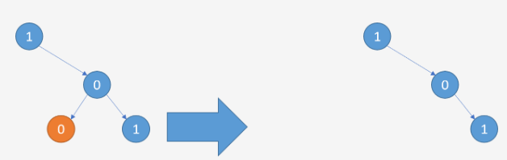
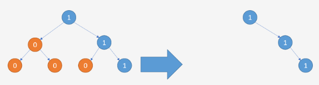
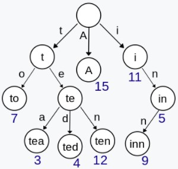

[TOC]

### 树题目

#### 技巧

- **递归**解深度相关的题，可以设置一个**全局的最大深度**，用于**记录已经访问到的最大深的深度**。
- 掌握二叉树的**迭代层序遍历**，很多题可用！只需少量修改即可。一般层序遍历的递归解法的模板也是差不多的。
- 掌握二叉树的序列化 与反序列化方法，可用用于**子树问题**的判断。
- **递归遍历**的时候，如果需要**改变顺序**，可以考虑**先递归右树**。
- 求深度的题目可以用递归，也可以用**层序遍历**进行迭代求解。
- **暴力递归**类似于**后序遍历**，也就是默认能得到左右子树的信息再构造自己的信息，**树形 dp**。


### 普通遍历类题目

树的遍历方式总体分为**两类**：**深度优先搜索（DFS）、广度优先搜索（BFS）**：

- **常见的 DFS** ： **先序遍历、中序遍历、后序遍历**。
- **常见的 BFS** ： **层序遍历（即按层遍历）**。

#### 二叉树遍历

##### 1. 题目

写出二叉树的**前序、中序、后序**遍历。

##### 2. 题解

**递归方式**会访问一个结点**三次**，在**第几次进行数据处理**就是不同的顺序了。

###### (1) 递归方式前序遍历【简单】

```java
public void preOrderRecursive(TreeNode root) {
    if (root == null) return;
    // 第一次到达结点时处理数据
    System.out.println(root.val + " ");
    preOrderRecursive(root.left);
    preOrderRecursive(root.right);
}
```

###### (2) 递归方式中序遍历【简单】

```java
public void midOrderRecursive(TreeNode root) {
    if (root == null) return;
    preOrderRecursive(root.left);
    // 第二次到达结点时处理数据
    System.out.println(root.val + " ");
    preOrderRecursive(root.right);
}
```

######  (3) 递归方式后序遍历【简单】

```java
public void postOrderRecursive(TreeNode root) {
    if (root == null) return;
    preOrderRecursive(root.left);
    preOrderRecursive(root.right);
    // 第三次到达结点时处理数据
    System.out.println(root.val + " ");
}
```

###### [(4) 144.迭代方式前序遍历【中等】](https://leetcode-cn.com/problems/binary-tree-preorder-traversal/)

迭代法本质上是在**模拟递归**，因为在递归的过程中使用了系统栈，所以在迭代的解法中常用`Stack`来模拟系统栈。

使用**栈**，先将**根节点压栈**，只要**栈不为空则一直弹出**，弹出一个处理数据，然后**先压入右子结点，再压入左子结点**（由于是利用栈，所以压入顺序相反是**==先右后左==**）。

- 先将**根节点**入**栈**。
- 从栈**弹出**一个结点，弹出后**处理数据**。
- 如果根节点存在**右**孩子，则将**右孩子**入栈。
- 如果根节点存在**左**孩子，则将**左孩子**入栈（注意：**一定是右孩子先入栈，然后左孩子入栈**）。
- 重复 2 - 4 直到**栈为空**。

```java
public List<Integer> preorderTraversal(TreeNode root) {
    if(root == null) return new ArrayList<>();
    List<Integer> resList = new ArrayList<>();
    // 准备一个栈并把根节点压栈
    Stack<TreeNode> stack = new Stack<>();
    stack.push(root);
    // 不断从栈中弹出元素弹出时处理数据，并先将右孩子压栈再将左孩子压栈
    while(!stack.isEmpty()) {
        TreeNode node = stack.pop();
        resList.add(node.val);
        // 先压入右结点，再压入左结点
        if(node.right != null) stack.push(node.right);
        if(node.left != null) stack.push(node.left);
    }
    return resList;
}
```

###### [(5) 94.迭代方式中序遍历【中等】](https://leetcode-cn.com/problems/binary-tree-inorder-traversal/)

**递归的调用过程是不断往左边走，当左边走不下去了，就打印节点，并转向右边，然后右边继续这个过程。**在迭代实现时，就可以用栈来模拟这个调用过程。也是利用**栈**的方式进行。算法过程如下：

- 先将**根节点**入栈。
- 将当前节点的**所有左孩子**入栈，直到**左孩子为空**。
- 访问**栈顶**元素，如果栈顶元素**存在右孩子**，则变换到**右子节点**继续第 2 步。
- 重复第 2、3 步，直到**栈为空**并且所有的节点都被访问。


注意这里**不用把根结点压入栈**中。

```java
public List<Integer> inorderTraversal(TreeNode root) {
    List<Integer> res = new ArrayList<>();
    Stack<TreeNode> stack = new Stack<>();
    // 条件是栈不为空且root不为null
    while (!stack.isEmpty() || root != null) {
        // 将全部左子结点压栈,这是模拟递归的调用
        if (root != null) {
            stack.push(root);
            root = root.left;
            // 当前节点为空，说明左边走到头了，从栈中弹出节点并保存
        } else {
            TreeNode temp = stack.pop();
            res.add(temp.val);
            // 然后转向右边节点，继续上面整个过程
            root = temp.right;
        }
    }
    return res;
}
```

###### [(6) 145.迭代方式后序遍历【困难】](https://leetcode-cn.com/problems/binary-tree-postorder-traversal/)

使用**两个栈** s1 和 s2。**前序遍历**的过程 是 **中左右**。将其转化成 **中右左**。也就是压栈的过程中**优先压入左子树，在压入右子树**。然后将这个结果**返回来**，这里是利用栈的先进后出**倒序打印**，即是后序遍历。

1. 将**根节点**压入 s1 中。
2. 从 s1 中**弹出**元素，并依次将其**==左孩子和右孩子压入 s1==** 中。此过程中**==每从 s1 弹出一个元素都将其压入到栈 s2 中==**。直到 **==s1 为空==**为止。
3. 从 **s2 中依次弹出元素**处理即是**后序遍历**。

```java
public List<Integer> postorderTraversal(TreeNode root) {

    if (root == null) return new ArrayList<>();
    List<Integer> resList = new ArrayList<>();


    // 准备两个栈
    Stack<TreeNode> s1 = new Stack<>();
    Stack<TreeNode> s2 = new Stack<>();
    // 根节点压入栈1
    s1.push(root);
    // 退出条件为栈1为空
    while (!s1.isEmpty()) {
        // 栈1每弹出一个元素就放入栈2
        root = s1.pop();
        s2.push(root);

        // 再将当前弹出元素的左右子节点分别入栈,一定是先左再右
        if (root.left != null) s1.push(root.left);
        if (root.right != null) s1.push(root.right);
    }
    // 当栈1为空时，依次弹出栈2就是后序遍历顺序
    while (!s2.isEmpty()) {
        resList.add(s2.pop().val);
    }
    return resList;
}
```

###### (7) 二叉树的Morris遍历【困难】

参考：https://www.jianshu.com/p/484f587c967c

可以根据 Morris 遍历**加工出二叉树的前中后序遍历**。空间复杂度 **O(1)**。


#### 590.N叉树的后序遍历【简单】

##### [1. 题目](https://leetcode-cn.com/problems/n-ary-tree-postorder-traversal/)

使用**后序遍历**方式遍历一颗 N 叉树。后序遍历顺序为：[5, 6, 3, 2, 4, 1]。


多叉树结点类 Node 如下。

```java
public class Node {
	public int val;
	public List<Node> children;
	public Node() {}
	public Node(int val) {
		this.val = val;
	}
	public Node(int val, List<Node> children) {
		this.val = val;
		this.children = children;
	}
}
```

##### 2. 题解

###### (1) 递归DFS

直接使用**递归**的方式进行遍历。比较简单，参考普通的递归后序遍历。

```java
private List<Integer> resList;

public List<Integer> postorder(Node root) {
    resList = new LinkedList<>();
    // 深度优先遍历
    dfs(root);
    return resList;
}

private void dfs(Node root) {
    // Base case
    if(root == null) return;
    // 整体后序遍历的架构，先遍历全部子结点最后再处理数据
    for(Node child : root.children) {
        dfs(child);
    }
    resList.add(root.val);
}
```

###### (2) 迭代法

可以使用和 **N叉树的前序遍历** 相同的方法，使用一个**栈**来得到**后序遍历**。首先把**根节点入栈**。当每次从**栈顶**取出一个节点 u 时，就把 u 的**所有子节点顺序压入栈**中。例如 u 的子节点从左到右为 **v1, v2, v3**，那么推入栈的顺序应当为 v1, v2, v3，这样就保证了**下一个遍历到的节点**（即 u 的第一个子节点 v3）出现在**栈顶**的位置。在遍历结束之后，我们把遍历结果**反转**，就可以得到后序遍历。

```java
public List<Integer> postorder2(Node root) {
    // Base case
    if (root == null) return new ArrayList<>();
    // 使用一个栈存储结点
    Stack<Node> stack = new Stack<>();
    // 存放结果
    LinkedList<Integer> resList = new LinkedList<>();
    // 根节点入栈
    stack.add(root);
    // 结束条件是栈为空
    while (!stack.isEmpty()) {
        // 栈中弹出一个结点
        Node node = stack.pop();
        // 将弹出节点的子结点元素加入结果
        resList.addFirst(node.val);
        // 顺序压入其他子节点
        for (Node item : node.children) {
            if (item != null) {
                stack.add(item);
            }
        }
    }
    return resList;
}
```


### 层序遍历类题目

树的**层序遍历**的套路及其深厚，掌握**使用队列的模板**就行了。

#### 102.二叉树的层序遍历 I【中等】

##### [1. 题目](https://leetcode-cn.com/problems/binary-tree-level-order-traversal)

给你一个二叉树，请你返回其按 **层序遍历** 得到的节点值，即**逐层地**，**从左到右**访问所有节点。

示例：二叉树：[3, 9, 20, null, null, 15, 7]

```java
    3
   / \
  9  20
    /  \
   15   7
```

返回其层次遍历结果：

```java
[
  [3],
  [9,20],
  [15,7]
]
```

##### 2. 题解

###### (1) 迭代法BFS

对二叉树的层序遍历就是**使用 BFS 遍历**，那么可以使用**队列**进行辅助。下面的模板是非常有用的，记住可以解很多题。

- ==**根节点入队。**==
- ==**循环直到队列为空，每次出队一个结点，并将其左右子节点入队。**==
- ==**为了控制按层进行打印，需要有个循环记录一下这一层的结点个数，所以使用一个 for 循环来遍历这一层。**==
- ==**当一层的元素处理完的时候，下一层的结点又已经全部入队，持续循环即可。**==

```java
public List<List<Integer>> levelOrder(TreeNode root) {
    // Base case
    if(root == null) return new ArrayList<>();
    // 使用辅助队列并将根节点入队列
    Queue<TreeNode> queue = new LinkedList<>() ;
    queue.add(root);
    List<List<Integer>> resList = new ArrayList<>();
    // 队列为空时退出循环
    while(queue.size() != 0) {
        // 获取当前队列中的元素个数，也就是当前这一层有多少个结点，这是为了控制访问到了某一层
        int size = queue.size();
        List<Integer> levelList = new ArrayList<>();
        // 将当前层的元素依次出队列并处理数据，每弹出一个结点并再次将其左右子节点入队列
        for(int i = 0; i < size; i++) {
            // 出队列并处理数据
            TreeNode temp = queue.poll();
            levelList.add(temp.val);
            // 将出队结点的左右子节点入队
            if(temp.left != null) queue.add(temp.left);
            if(temp.right != null) queue.add(temp.right);
        }
        // 这一层弹出的元素处理完毕
        resList.add(levelList);
        // 此时下一层的全部节点已经到队列中，再次循环即可
    }
    return resList;
}
```

###### (2) 递归法DFS

首先确认树**非空**，然后调用**递归函数** process(node, level)，参数是**当前节点和节点的层次**。程序过程如下：

- 输出列表称为 resList，当前**最高层数**就是列表的**长度 size()**。比较访问节点**所在的层次 level** 和**当前最高层**次 size 的大小，如果前者**更大就说明访问到了新的 level 则向 resList 添加一个空列表**。
- 将当前节点插入到**对应层的列表** **resList[level]** 中。
- 递归**非空的孩子节点**：process(node.left / node.right，level + 1)。

```java
public List<List<Integer>> levelOrder2(TreeNode root) {
    if (root == null) return resList;
    // 从根结点开始递归,根结点是第0层
    dfs(root, 0);
    return resList;
}

List<List<Integer>> resList = new ArrayList<>();

// 辅助方法:整体是先序遍历的模板
public void dfs(TreeNode node, int level) {
    // 说明遇到了新的一层则新建一个列表,并添加一层新的到结果中
    if (resList.size() == level) {
        resList.add(new ArrayList<>());
    }
    // 根据层数获取对应的列表并将当前节点的值加入到list中（先序遍历）
    resList.get(level).add(node.val);

    // 递归进行
    if (node.left != null) dfs(node.left, level + 1);
    if (node.right != null) dfs(node.right, level + 1);
}
```

#### 107.二叉树的层次遍历 II【简单】

##### [1. 题目](https://leetcode-cn.com/problems/binary-tree-level-order-traversal-ii)

区别上一个题目。给定一个二叉树，返回其节点值**自底向上的层次遍历**。 （即按从叶子节点所在层到**根节点所在的层**，逐层从左向右遍历）。

例如：给定二叉树 [3, 9, 20, null, null, 15, 7]

```java
	3
   / \
  9  20
    /  \
   15   7
```

返回其自底向上的层次遍历为：

```java
[
  [15,7],
  [9,20],
  [3]
]
```

##### 2. 题解

思路类似前面的普通层序遍历，但是是**反过来**的，其实很容易想到只需要把上述题目的**解逆序**即可。参考上述的 **BFS** 解法，只需在**最后调用**。

```java
Collections.reverse(resList);
```

将结果**逆序**即可。

#### 429.N叉树的层序遍历【中等】

##### [1. 题目](https://leetcode-cn.com/problems/n-ary-tree-level-order-traversal/)

给定一个 **N 叉树**，返回其节点值的**层序遍历**。 (即从左到右，逐层遍历)。例如，给定一个 `3叉树` :


返回其层序遍历：

```java
[
   [1],
   [3,2,4],
   [5,6]
]
```

##### 2. 题解

###### (1) 迭代法BFS

参考普通的层序遍历方法，也是使用一个**队列**，每出一个队列元素就将**其全部子元素放入队列**中。

详细图示：https://leetcode-cn.com/problems/n-ary-tree-level-order-traversal/solution/ncha-shu-de-ceng-xu-bian-li-by-leetcode/

```java
public List<List<Integer>> levelOrder(Node root) {
    // Base case
    if(root == null) return new ArrayList<>();
    // 使用辅助队列并将根节点入队列
    Queue<Node> queue = new LinkedList<>();
    queue.offer(root);
    List<List<Integer>> resList = new ArrayList<>();
    // 队列为空退出循环
    while(!queue.isEmpty()) {
        // 记录当前层的结点个数
        int size = queue.size();
        // 记录当前层的结果
        List<Integer> levelList = new ArrayList<>();
        // 依次弹出当前层结点并将其子节点放入队列中同时处理数据
        for(int i = 0; i < size; i++) {
            // 弹出节点并处理元素
            Node temp = queue.poll();
            levelList.add(temp.val);
            // 将该弹出节点的全部子结点依次加入队列中
            for(Node node : temp.children) {
                queue.offer(node);
            }
        }
        resList.add(levelList);
    }
    return resList;
}
```

###### (2) 递归DFS

可以使用**递归**来解决这个问题，通常**不能使用递归进行广度优先搜索**。这是因为广度优先搜索基于队列，而递归运行时使用**堆栈**，适合**深度**优先搜索。但可以**以不同的顺序添加到最终列表**中，只要**知道节点在哪一层并确保在那一层的列表顺序正确**就可以了。

这里递归的方式也是类似上面的二叉树的层序遍历方式。

```java
// 结果列表
private List<List<Integer>> resList = new ArrayList<>();

public List<List<Integer>> levelOrder2(Node root) {
    // 从第0层开始
    if (root != null) traverseNode(root, 0);
    return resList;
}

// 递归方法 传入层数
private void traverseNode(Node node, int level) {
    // 说明当前层大于结果List的size，需要新建一个list来存储当前层的元素
    if (resList.size() <= level) resList.add(new ArrayList<>());
    // 获取当前level所对应的list，并处理当前节点的数据加入到后面
    resList.get(level).add(node.val);
    // 递归全部子节点，level + 1
    for (Node child : node.children) {
        traverseNode(child, level + 1);
    }
}
```

#### 637.二叉树的层平均值【简单】

##### [1. 题目](https://leetcode-cn.com/problems/average-of-levels-in-binary-tree)

给定一个非空二叉树, 返回一个由**每层**节点**平均值**组成的数组。

```java
    3
   / \
  9  20
    /  \
   15   7
```

输出: [3, 14.5, 11]。解释：第 0 层的平均值是 3,  第 1 层是 14.5, 第 2 层是 11。因此返回 [3, 14.5, 11]。

##### 2. 题解

###### (1) 迭代法BFS

参考**层序遍历**二叉树的代码，求**每一层的平均值**即可。在原来的代码上小改即可。

```java
public List<Double> averageOfLevels(TreeNode root) {
    // Base case
    if(root == null) return new ArrayList<>();
    // 根节点入队列
    Queue<TreeNode> queue = new LinkedList<>() ;
    queue.add(root);
    List<Double> resList = new ArrayList<>();
    // 队列为空时推退出循环
    while(queue.size() != 0) {
        // 获取当前队列中的元素个数，也就是当前这一层有多少个结点
        int size = queue.size();
        // 保存这一层的节点数值的和
        double sum = 0;
        // 将当前层的元素依次出队列并处理数据，每弹出一个结点并再次将其左右子节点入队列
        for(int i = 0; i < size; i++) {
            // 出队列并处理数据
            TreeNode temp = queue.poll();
            // 转换成double类型
            sum = sum + (double)temp.val;
            // 将出队结点的左右子节点入队
            if(temp.left != null) queue.add(temp.left);
            if(temp.right != null) queue.add(temp.right);
        }
        // 这一层弹出的元素处理完毕
        resList.add(sum / size);
    }
    return resList;
}
```

###### (2) 递归DFS

可以使用**深度优先搜索**遍历整颗二叉树。使用**两个数组 sum** 存放树中**每一层的节点数值之和**，以及 **count** 存放树中每一层的**节点数量之和**。在遍历时需要**额外记录当前节点所在的高度**，并根据高度 h **更新数组元素 sum[h]** 和 count[h]。在遍历结束之后，**res = sum / cnt** 即为答案。

```java
public List <Double> averageOfLevels2(TreeNode root) {
    List<Double> resList = new ArrayList<>();
    // 记录每层的元素个数数组
    List <Integer> numberList = new ArrayList<>();
    // 记录每层元素和数组
    List <Double> sumList = new ArrayList<>();
    // 递归求上述的两个数组的值
    dfs(root, 0, sumList, numberList);
    // 求平均值（因为两个数组是对应的）
    for (int i = 0; i < resList.size(); i++)
        resList.set(i, sumList.get(i) / numberList.get(i));
    return sumList;
}

// 进行DFS-整体是先序遍历的模板
public void dfs(TreeNode root, int level, List<Double> sumList, List<Integer> numberList) {
    // Base case
    if (root == null) return;
    // 更新已有的记录
    if (level < sumList.size()) {
        sumList.set(level, sumList.get(level) + root.val);
        numberList.set(level, numberList.get(level) + 1);
        // 说明这里到了一个新的层
    } else {
        // 加入元素
        sumList.add(1.0 * root.val);
        numberList.add(1);
    }
    dfs(root.left, level + 1, sumList, numberList);
    dfs(root.right, level + 1, sumList, numberList);
}
```

#### 199.二叉树的右视图【中等】

##### [1. 题目](https://leetcode-cn.com/problems/binary-tree-right-side-view)

给定一棵二叉树，想象自己站在它的**右侧**，按照从顶部到底部的顺序，返回**从右侧所能看到的节点值**。示例：

输入: [1, 2, 3, null, 5, null, 4]   输出: [1, 3, 4]

```java
   1            <---
 /   \
2     3         <---
 \     \
  5     4       <---
```

##### 2. 题解

###### (1) 广度优先遍历法BFS

其实就是类似二叉树的**层序遍历的广度优先算法**，只不过每次处理的数据的时候仅处理**这一层的最后一个结点**即可。依然采用**队列**进行辅助。

```java
public List<Integer> rightSideView(TreeNode root) {
    // Base case
    if(root == null) return new ArrayList<>();
    // 使用队列来操作并将根节点入队列
    Queue<TreeNode> queue = new LinkedList<>();
    queue.offer(root);
    List<Integer> resList = new ArrayList<>();
    while(!queue.isEmpty()) {
        // 得到当前层的元素个数
        int size = queue.size();
        // 弹出当前层的所有元素并将其左右结点入队
        for(int i = 0; i < size; i++) {
            // 弹出节点
            TreeNode node = queue.poll();
            // 注意！当且仅当弹出结点是这一层最后一个,也就是右视图
            if(i == size - 1) resList.add(node.val);
            if(node.left != null) queue.offer(node.left);
            if(node.right != null) queue.offer(node.right);
        }
    }
    return resList;
}
```

###### (2) 深度优先遍历（前序遍历方式）

设定一个**全局变量**记录当前插入 ans 的**最大层数**，递归**先序遍历右子树**即可得到**二叉树的右视图**。

注意整个框架是**先序遍历**！即第一次访问这个结点时就处理数据，这时候先判断当前层是不是比当前最大深度高，如果是，说明是新来到了一层，而且**是新的一层的最右边的结点**（因为是遍历**右子树**，所以是**先递归右子树**）。

```java
// 当前最大层数
int level = -1;
List<Integer> resList = new ArrayList<>();

public List<Integer> rightSideView2(TreeNode root) {
    dfs(root, 0);
    return resList;
}

// 辅助方法：传入根节点，层数，结果集
public void dfs(TreeNode root, int level) {
    // Base case
    if (root == null) return;
    // 代表是新的一层，仅添加一次
    if (level > this.level) {
        this.level = level;
        resList.add(root.val);
    }
    // 先递归右子树
    dfs(root.right, level + 1);
    dfs(root.left, level + 1);
}
```

#### 103.之字形按层打印二叉树【中等】

##### [1. 题目](https://leetcode-cn.com/problems/binary-tree-zigzag-level-order-traversal)

给定一个二叉树，返回其节点值的**锯齿形层次**遍历。（即先从左往右，再从右往左进行下一层遍历，以此类推，层与层之间**交替进行**）。例如：给定二叉树 [3, 9, 20, null, null, 15, 7]

```java
   3
  / \
  9  20
    /  \
   15   7
```

返回锯齿形层次遍历如下：

```java
[
  [3],
  [20,9],
  [15,7]
]
```

##### 2. 题解

###### (1) 广度优先遍历BFS

都是一个套路啊，一定要记住 普通的层序遍历思路。这个题也是按照普通的层序遍历，**然后加一个记录层数的标志**，判断是在单层还是双层，然后决定是否**反转这一层的数据**即可。

```java
public List<List<Integer>> zigzagLevelOrder(TreeNode root) {
    // Base case
    if(root == null) return new ArrayList<>();
    // 使用队列来操作，根节点入队列
    Queue<TreeNode> queue = new LinkedList<>();
    queue.offer(root);
    List<List<Integer>> resList = new ArrayList<>();
    // 当前层是否需要逆序的标志位
    boolean reverseFlag = false;
    while(!queue.isEmpty()) {
        // 得到当前层的元素个数
        int size = queue.size();
        List<Integer> levelList = new ArrayList<>();
        // 依次弹出当前层的全部节点并插入levelList中
        for(int i = 0; i < size; i++) {
            TreeNode node = queue.poll();
            levelList.add(node.val);
            // 将左右子节点入队列
            if(node.left != null) {
                queue.offer(node.left);
            }
            if(node.right != null) {
                queue.offer(node.right);
            }
        }
        // 当一层数据处理完后，判断当前层是单层还是双层，如果是双层则反转数据
        if(reverseFlag) {
            Collections.reverse(levelList);
        }
        reverseFlag = !reverseFlag;
        resList.add(levelList);
    }
    return resList;
}
```

#### 515.二叉树每层的最大值【中等】

##### [1. 题目](https://leetcode-cn.com/problems/find-largest-value-in-each-tree-row)

您需要在二叉树的**每一行中找到最大的值**。输入: 

          1
         / \
        3   2
       / \   \  
      5   3   9 

输出: [1, 3, 9]

##### 2. 题解

###### (1) 按层遍历BFS

按照普通的按层遍历方式进行层序遍历，然后**统计每一层的最大值**即可。

```java
public List<Integer> largestValues(TreeNode root) {
    // Base case
    if(root == null) return new ArrayList<>();
    List<Integer> resList = new ArrayList<>();
    Queue<TreeNode> queue = new LinkedList<>();
    queue.offer(root);
    while(!queue.isEmpty()) {
        int size = queue.size();
        // 注意！存放当前层最大值
        int max = Integer.MIN_VALUE;
        for(int i = 0; i < size; i++) {
            TreeNode node = queue.poll();
            // 注意:更新最大值
            max = Math.max(max, node.val);
            if(node.left != null) queue.offer(node.left);
            if(node.right != null) queue.offer(node.right);
        }
        resList.add(max);
    }
    return resList;
}
```

###### (2) 递归法DFS

**递归**方式遍历，每次到某一层时判断这个**结点与这一层已有的最大值的大小关系**。整体是**先序遍历结构**。

```java
private List<Integer> resList = new ArrayList<>();

public List<Integer> largestValues2(TreeNode root) {
    dfs(root, 0);
    return resList;
}

// 递归方法：整体是先序遍历的模板
public void dfs(TreeNode root, int level) {
    // Base case
    if (root == null) return;
    // 如果当前的结点所在的层是新的层，则添加当前值到列表中作为最大值
    if (resList.size() <= level) {
        resList.add(root.val);
        // 否则是已经遍历过的层，获取已有的记录并判断是否要更新数据
    } else {
        resList.set(level, Math.max(resList.get(level), root.val));
    }
    // 递归左右子树
    dfs(root.left, level + 1);
    dfs(root.right, level + 1);
}
```

#### 1302.层数最深叶子节点的和【中等】

##### [1. 题目](https://leetcode-cn.com/problems/deepest-leaves-sum/)

给你一棵二叉树，请你返回**层数最深**的叶子节点的和。


```java
输入：root = [1,2,3,4,5,null,6,7,null,null,null,null,8]
输出：15
```

##### 2. 题解

###### (1) BFS层序遍历法

层序遍历二叉树，利用 sum 求**每一行的节点数之和**，每遍历一层，判断**队列是否还有元素**，如果还有说明**还没到最后一层**，则清空 sum，比较容易想到。下面就是层序遍历的模板。

```java
public int deepestLeavesSum(TreeNode root) {
    // Base case
    if(root == null) return 0;
    // 一层元素的和
    int sum = 0;
    Queue<TreeNode> queue = new LinkedList<TreeNode>() ;
    // 根节点入队列
    queue.add(root);
    // 队列为空时推退出循环
    while(queue.size() != 0) {
        // 获取当前队列中的元素个数，也就是当前这一层有多少个结点
        int size = queue.size();
        // 新的一层重置一次sum
        sum = 0;
        // 将当前层的元素依次出队列并处理数据，每弹出一个结点并再次将其左右子节点入队列
        for(int i = 0; i < size; i++) {
            // 出队列并处理数据
            TreeNode temp = queue.poll();
            // 求这一层的元素之和
            sum = sum + temp.val;
            // 将出队结点的左右子节点入队
            if(temp.left != null) queue.add(temp.left);
            if(temp.right != null) queue.add(temp.right);
        }
    }
    return sum;
}
```

###### (2) 递归法DFS

使用**递归**的方式，需要维护 sum 与**深度的全局变量**。整个框架是属于**前序遍历**的框架。只是处理数据的时候携带上了**已经遍历的深度值**。这个递归的模板也类似。

```java
// 结点和
private int sum = 0;

// 二叉树最大深度
private int deepLevel = 0;
public int deepestLeavesSum2(TreeNode root) {
    // 当前深度为0
    dfs(root, 0);
    return sum;
}

private void dfs(TreeNode node, int level){
    // Base case
    if (node == null) return;
    // 当前层等于已经来的深度
    if (level == deepLevel) {
        sum = sum + node.val;
        // 如果有更深的深度则更新sum和最大深度deep
    } else if (level > deepLevel){
        sum = node.val;
        deepLevel = level;
    }
    // 递归左子树和右子树
    dfs(node.left, level + 1);
    dfs(node.right, level + 1);
}
```

#### 513.找树左下角的值【中等】

##### [1. 题目](https://leetcode-cn.com/problems/find-bottom-left-tree-value)

给定一个二叉树，在树的**最后一行找到最左边的值**。输入:

        1
       / \
      2   3
     /   / \
    4   5   6
       /
      7

输出：

```java
7
```

##### 2. 题解

###### (1) 层序遍历法

可以按照**层序的模板求最后的一行的第一个节点**。这个就比较简单了，只需要做**一点修改即可**。

```java
public int findBottomLeftValue(TreeNode root) {

    // Base case
    if(root == null) return 0;
    int res = Integer.MAX_VALUE;
    // 根节点入队列
    Queue<TreeNode> queue = new LinkedList<TreeNode>() ;
    queue.add(root);
    // 队列为空时退出循环
    while(queue.size() != 0) {
        int size = queue.size();
        for(int i = 0; i < size; i++) {
            TreeNode temp = queue.poll();
            // 关键步骤！！记录每一行的第一个数！！！！！！
            if(i == 0) {
                res = temp.val;
            }
            // 将出队结点的左右子节点入队
            if(temp.left != null) queue.add(temp.left);
            if(temp.right != null) queue.add(temp.right);
        }
    }
    return res;
}
```

###### (2) 递归法 DFS

其实就是求**最后一行**的**第一个节点**。利用**递归方式**：整体采用**先序遍历**的方式，同时维护**两个变量**，一个是**某一层第一个**数的值，另一个是当前遍历到的**最深的高度**。当**第一次**当前层**大于**目前遍历到的**最深的层**的时候**更新数据**，由于是先序遍历，所以一定是每行左边第一个节点开启新的一行。

```java
// 最终的结果
int res = Integer.MIN_VALUE;
// 当前已经遍历的最深层数
int deepLevel = 0;

public int findBottomLeftValue2(TreeNode root) {
    // 从第一层开始
    helper(root, 1);
    return res;
}

// 辅助函数：传入根节点以及当前所在的层数
private void helper(TreeNode root, int level) {
    // Base case
    if(root == null) return;
    // 当第一次当前层大于目前遍历到的最深的层的时候更新数据
    // 由于是先序遍历，所以一定是每行左边第一个节点开启新的一行
    if(level > deepLevel) {
        // 更新最深的层数
        deepLevel = level;
        // 更新res值
        res = root.val;
    }
    // 递归左右子树并深度+1
    helper(root.left, level + 1);
    helper(root.right, level + 1);
}
```


### 二叉树特征判断问题

#### 958.判断是否是完全二叉树【中等】

##### [1. 题目](https://leetcode-cn.com/problems/check-completeness-of-a-binary-tree/)

给定一个二叉树，确定它是否是一个**完全二叉树**。

##### 2. 题解

###### (1) 层序遍历法

- **按层遍历**，每层都**从左到右**进行遍历（所以整体是**层序 BFS 遍历**的框架，只是加了一些逻辑）。
- 如果当前节点有右子节点但是没有左子节点，直接返回 false。
- 如果当前节点**并不是左右孩子都有**，那么之后的**节点必须全都为叶子结点**，否则返回 false。
- **维护一个标志位，标志遇到第一个不是左右孩子都有的结点时打开。**

```java
public boolean isCompleteTree(TreeNode head) {

    if (head == null) return true;
    // 使用队列来进行层序遍历并加入根结点
    Queue<TreeNode> queue = new LinkedList<>();
    queue.offer(head);
    // 后面的结点是否必须全为叶子结点的标志
    boolean isMeetLeaf = false;
    // 定义两个节点
    TreeNode left, right;
    while (!queue.isEmpty()) {
        // 弹出节点并进行判断
        head = queue.poll();
        left = head.left;
        right = head.right;
        // 不符合条件直接false
        if ((isMeetLeaf && (left != null || right != null) ||
             left == null && right != null)) {
            return false;
        }
        if (left != null) {
            queue.offer(left);
        }
        if (right != null) {
            queue.offer(right);
        } else {
            // 遇到第一个不是全有左右子节点的结点 则后面的全部节点必须为叶子结点
            isMeetLeaf = true;
        }
    }
    // 上述没有返回false则为true
    return true;
}
```

**再来一种层序遍历的解法**：把一颗树的节点（包括空节点）按**层序遍历排成一行**，当且仅当存在两个相邻节点：**前一个为null，后一个不为 null 时，才不是完全二叉树**。面试用这个！例如：

```java
       1
      / \
     2   3
    / \   \
   4   5  6
  / \    / 
 7   8  9  
层序遍历序列为：[1, 2, 3, 4, 5, 6, 7, 8, null, null, 9]，其中 null 出现在了9前面，所以不合法
```

```java
public boolean isCompleteTree2(TreeNode root) {
    Queue<TreeNode> queue = new LinkedList<>();
    TreeNode cur = root;
    queue.add(root);
    while (!queue.isEmpty()) {
        TreeNode node = queue.poll();
        // 两个都为null则直接返回
        if (cur == null && node != null) return false;
        // 滚动更新cur
        cur = node;
        // 把左右都加入queue,null也加入
        if (node != null) {
            queue.add(node.left);
            queue.add(node.right);
        }
    }
    return true;
}
```

利用完全二叉树层序遍历时节点连续出现的性质，遍历**到 null 之后再遍历到非 null 则说明不连续**。

#### 110.判断是否是平衡二叉树【简单】

##### [1. 题目](https://leetcode-cn.com/problems/balanced-binary-tree)

给定一个二叉树，判断它是否是**高度平衡的二叉树**。本题中一棵高度平衡二叉树定义为：一个二叉树每个节点 的左右两个子树的高度差的**绝对值不超过 1**。

**示例 1:** 给定二叉树 [3, 9, 20, null, null, 15, 7]

```java
    3
   / \
  9  20
    /  \
   15   7
```

返回 true 。

**示例 2:** 给定二叉树 [1,2,2,3,3,null,null,4,4]

```java
       1
      / \
     2   2
    / \
   3   3
  / \
 4   4
```

返回 false 。

##### 2. 题解

###### (1) 自底向上暴力递归法

直接使用**树形 dp 套路**求解。维护一个 **是否平衡** 的标志位，递归函数返回**当前节点的最大高度值**。递归时遇到不平衡的情况直接更新标志位。

```java
// 记录是否平衡
private boolean balance = true;

public boolean isBalanced(TreeNode root) {
    process(root);
    return balance;
}

// 树形dp的模板
private int process(TreeNode root) {
    // 节点为null返回高度为0
    if(root == null) return 0;
    // 获取左右子树的高度信息
    int leftHeight = process(root.left);
    int rightHeight = process(root.right);
    // 利用左右子树的高度信息判断是否平衡
    if(Math.abs(leftHeight - rightHeight) > 1) {
        // 直接更新不平衡结果
        balance = false;
    }
    // 构造自己的高度信息：即当前节点的最大高度值（同时需要加上自己的高度1）
    return Math.max(leftHeight, rightHeight) + 1;
}
```

#### 💯104.求二叉树的最大深度【简单】

##### [1. 题目](https://leetcode-cn.com/problems/maximum-depth-of-binary-tree/)

输入一棵二叉树的根节点，求该树的深度。从根节点到叶节点依次经过的节点（含根、叶节点）形成树的一条路径，**最长**路径的长度为树的深度。

例如：给定二叉树 [3, 9, 20, null, null, 15, 7]

        3
       / \
      9  20
        /  \
       15   7

返回它的最大深度 3 。

##### 2. 题解

###### (1) 递归法DFS(后序遍历)

树形 dp 套路求解，但是此处的**返回值就只有深度值** 本身，其实都不用额外构造返回的数据结构了。树的后序遍历 / 深度优先搜索往往利用 **递归 或 栈** 实现，本文使用**递归**实现。**关键点**： 此树的深度和其左（右）子树的深度之间的**关系**。显然，此树的深度 等于 左子树的深度 与 右子树的深度 中的 **最大值 +1** 。

```java
public int maxDepth(TreeNode root) {
    // Base case
    if(root == null) return 0;
    // 默认从左右获取信息
    int left = maxDepth(root.left);
    int right = maxDepth(root.right);
    // 构造自己的高度信息
    return Math.max(left, right) + 1;
}
```

简化一点：

```java
public int maxDepth(TreeNode root) {
    if(root == null) return 0;
    return Math.max(maxDepth(root.left), maxDepth(root.right)) + 1;
}
```

###### (2) 层序遍历(BFS)

就是普通的**层序遍历模板**。树的层序遍历 / 广度优先搜索往往利用 **队列** 实现。**关键点：** 每遍历一层，则计数器 +1 ，直到**遍历完成**，则可得到树的深度。这种方式慢一点只能击败 20%，但是**面试经常考非递归**。

```java
public int maxDepth(TreeNode root) {
    // Base case
    if(root == null) return 0;
    Queue<TreeNode> queue = new LinkedList<>();
    queue.offer(root);
    int depth = 0;
    while(!queue.isEmpty()){
        // 注意!高度+1
        depth++;
        int size = queue.size();
        // 弹出当前这一层的元素，并把其左右子节点放入队列中
        while (size-- > 0){
            TreeNode node =  queue.poll();
            if(node.left != null) queue.offer(node.left);
            if(node.right != null) queue.offer(node.right);
        }
    }
    return depth;
}
```

#### 111.二叉树的最小深度【简单】

##### [1. 题目](https://leetcode-cn.com/problems/minimum-depth-of-binary-tree)

给定一个二叉树，找出其最小深度。最小深度是**从根节点到最近叶子节点**的**最短路径**上的节点数量。说明：叶子节点是指没有子节点的节点。示例：给定二叉树 [3, 9, 20, null, null, 15, 7]。

```java
    3
   / \
  9  20
    /  \
   15   7
```

返回它的最小深度  2。

##### 2. 题解

###### (1) 自底向上暴力递归法

直接使用**暴力递归**非常 easy。

```java
public int minDepth(TreeNode root) {
    // Base case
    if(root == null) return 0;
    // 直接获取左边的信息和右边信息
    int minLeft = minDepth(root.left);
    int minRight = minDepth(root.right);
    // 构造自己的返回信息
    if(minLeft != 0 && minRight == 0) {
        return minLeft + 1;
    }
    if(minLeft == 0 && minRight != 0) {
        return minRight + 1;
    }
    // 左右高度较小的+1
    return Math.min(minLeft, minRight) + 1;
}
```

###### (2) 递归法DFS

直接利用递归法求，类似于层序遍历部分中常见的递归法套路，也就是维护一个**层数变量**，**每次遇到叶子节点**的时候判断一下是否需要更新最小深度。**笔试这个即可**。

```java
// 记录最小值
int minDepth = Integer.MAX_VALUE;
public int minDepth2(TreeNode root) {
    if(root == null) return 0;
    dfs(root, 1);
    return minDepth;
}

// 递归-整体先序遍历架构
private void dfs(TreeNode root, int level) {
    if(root == null) return;
    // 如果当前是一个叶子节点就判断是否需要更新最小深度
    if(root.left == null && root.right == null) {
        minDepth = Math.min(minDepth, level);
    }
    dfs(root.left, level + 1);
    dfs(root.right, level + 1);
}
```

###### (3) 层序遍历BFS

前面**深度优先搜索方法**的**缺陷**是**所有节点**都必须访问到，以保证能够找到最小深度。因此复杂度是 O(N) 。一个**优化**的方法是利用**广度优先搜索**，按照树的**层序遍历**，**==第一个访问到的叶子就是最小深度的节点==**，这样就不用遍历所有的节点了。

```java
public int minDepth(TreeNode root) {
    if(root == null) return 0;
    Queue<TreeNode> queue = new LinkedList<>();
    queue.add(root);
    // 注意：记录最低层数的变量
    int minDepth = 0;
    while (!queue.isEmpty()) {
        // 到了新的一层，层数++
        minDepth++;

        int levelSize = queue.size();
        while (levelSize-- > 0) {
            TreeNode node = queue.poll();
            // 如果当前是叶子节点就直接退出
            if (node.left == null && node.right == null) {
                return minDepth;
            }
            if(node.left != null) queue.add(node.left);
            if(node.right != null) queue.add(node.right);
        }
    }
    return minDepth;
}
```


#### 559.N叉树的最大深度【简单】

##### [1. 题目](https://leetcode-cn.com/problems/maximum-depth-of-n-ary-tree/)

给定一个 N 叉树，找到其最大深度。最大深度是指从根节点到最远叶子节点的最长路径上的节点总数。例如，给定一个 3叉树，返回其最大深度 3。


##### 2. 题解

###### (1) 递归法

也是使用递归法，也是用**暴力递归**即可。过程不多说了，只是获取默认信息的时候默认是从**全部的子树获取**的信息。

```java
public int maxDepth(Node root) {
    // Base case：为null退出
    if(root == null) return 0;
    // 当为叶子结点直接返回1
    if(root.children == null || root.children.size() == 0) {
        return 1;
    }
    // 使用列表存储各个子树的高度信息值
    List<Integer> heightList = new ArrayList();
    // 获取各个子树的高度信息并存入列表
    for(Node head : root.children) {
        heightList.add(maxDepth(head));
    }
    // 返回各个子树最大的高度+1
    return Collections.max(heightList) + 1;
}
```

```java
int maxDepth = 0;
public int maxDepth(Node root) {
    if (root == null) return 0;
    dfs(root, 1);
    return maxDepth;
}

private void dfs(Node root, int level) {
    if (root == null) return;
    if(root.children == null || root.children.size() == 0) {
        maxDepth = Math.max(maxDepth, level);
    }
    for (Node node : root.children) {
        dfs(node, level + 1);
    }
}
```

###### (2) 层序遍历BFS

也可以套用**层序遍历**的模板求解。这里就不放代码了。

#### 💯101.对称二叉树【简单】

##### [1. 题目](https://leetcode-cn.com/problems/symmetric-tree)

给定一个二叉树，检查它是否是**镜像对称**的。例如，二叉树 [1, 2, 2, 3, 4, 4, 3] 是对称的。

        1
       / \
      2   2
     / \ / \
    3  4 4  3

##### 2. 题解

###### (1) 递归法DFS

```java
public boolean isSymmetric(TreeNode root) {
    if (root == null) return true;
    // 调用递归函数，比较左节点，右节点
    return dfs(root.left, root.right);
}

boolean dfs(TreeNode left, TreeNode right) {
    // 递归的终止条件是两个节点都为空
    // 或者两个节点中有一个为空
    // 或者两个节点的值不相等
    if (left == null && right == null) return true;
    if (left == null || right == null) return false;
    if (left.val != right.val) return false;
    // 再递归的比较左节点的左孩子和右节点的右孩子
    // 以及比较左节点的右孩子和右节点的左孩子
    return dfs(left.left, right.right) && dfs(left.right, right.left);
}
```

#### 872.叶子相似的树【简单】

##### [1. 题目](https://leetcode-cn.com/problems/leaf-similar-trees)

请考虑一颗二叉树上**所有的叶子**，这些叶子的值按**从左到右**的顺序排列形成一个 **叶子值序列** 。


举个例子如上图所示，给定一颗叶值序列为 **(6, 7, 4, 9, 8)** 的树。如果有两颗二叉树的**叶值序列是相同**，那么就认为它们是 **叶相似** 的。如果给定的两个头结点分别为 root1 和 root2 的树是叶相似的，则返回 true；否则返回 false 。

##### 2. 题解

###### (1) DFS遍历叶子节点法

首先分别找出给定的两个树的叶值序列。之后可以比较它们看看是否相等。要找出树的叶值序列，可以使用 DFS。如果结点是**叶子**，那么 dfs 函数会**写入结点的值**，然后**递归**地探索每个子结点。这可以保证按**从左到右的顺序**访问每片叶子，因为在右孩子结点之前完全探索了左孩子结点。

```java
public boolean leafSimilar(TreeNode root1, TreeNode root2) {
    List<Integer> leaves1 = new ArrayList();
    List<Integer> leaves2 = new ArrayList();
    dfs(root1, leaves1);
    dfs(root2, leaves2);
    return leaves1.equals(leaves2);
}

// 整体是先序遍历的架构
public void dfs(TreeNode node, List<Integer> leafValues) {
    if (node == null) return;
    // 深度优先遍历树，将叶子节点值保存
    if (node.left == null && node.right == null) {
        leafValues.add(node.val);
    }
    dfs(node.left, leafValues);
    dfs(node.right, leafValues);
}
```

####  965.单值二叉树【简单】

##### [1. 题目](https://leetcode-cn.com/problems/univalued-binary-tree/)

如果二叉树每个节点**都具有相同的值**，那么该二叉树就是单值二叉树。只有给定的树是单值二叉树时，才返回 `true`；否则返回 `false`。

##### 2. 题解

###### (1) 递归法

一棵树是**单值**的，说明后面的**每一个结点值都与根节点值一样**。首先保存根节点值，然后依次判断是不是相同的即可。整体是先序遍历。

```java
int value;
public boolean isUnivalTree(TreeNode root) {
    if(root == null) return false;
    // 首先保存根节点的值
    value = root.val;
    return process(root);
}

private boolean process(TreeNode root) {
    // Base case
    if(root == null) return true;
    // 如果这个值与根节点不同则不是单值的
    if(root.val != value) return false;
    // 获取左右子树的信息
    boolean left = process(root.left);
    boolean right = process(root.right);
    // 必须左右子树都为true才是true
    return left && right;
}
```

再来一种**递归写法**。

```java
boolean res = true;
int rootVal = 0;
public boolean isUnivalTree(TreeNode root) {
    if(root == null) return false;
    rootVal = root.val;
    // 首先保存根节点的值
    process(root);
    return res;
}

private void dfs(TreeNode root) {
    // Base case
    if(root == null) return;
    // 如果这个值与根节点不同则不是单值的
    if(root.val != rootVal) res = false;
    // 获取左右子树的信息
    dfs(root.left);
    dfs(root.right);
}
```

#### 100.相同的树【简单】

##### [1. 题目](https://leetcode-cn.com/problems/same-tree)

给定两个二叉树，编写一个函数来检验**它们是否相同**。如果两个树在**结构上相同**，并且节点具有相同的值，则认为它们是相同的。示例 1：输入：[1,2,3],   [1,2,3]

               1         1
              / \       / \
             2   3     2   3

输出: true

##### 2. 题解

###### (1) 递归法

这个题是典型的操作两棵树的题目，直接使用**递归**的方式进行判断即可。整体是**先序遍历**。

```java
public boolean isSameTree2(TreeNode root2, TreeNode root2) {
    // Base case 如果两个都为空返回true
    if(root2 == null && root2 == null) return true;
    // 如果其中一个结点为空或者两个的值不同，返回false
    if((root2 == null && root2 != null) || (root2 != null && root2 == null) || (root2.val != root2.val)) {
        return false;
    }
    // 递归获取左右子树信息
    boolean left = isSameTree(root2.left, root2.left);
    boolean right = isSameTree(root2.right, root2.right);
    // 必须左右子树都是true才为true
    return left && right;
}
```

再来一种写法。

```java
boolean isSame = true;
public boolean isSameTree(TreeNode root1, TreeNode root2) {
    dfs(root1, root2);
    return isSame;
}

private void dfs(TreeNode root1, TreeNode root2) {

    // Base case 如果两个都为空返回true
    if(root1 == null && root2 == null) return;
    // 如果其中一个结点为空或者两个的值不同，返回false
    if((root1 == null && root2 != null) || (root1 != null && root2 == null) || (root1.val != root2.val)) {
        isSame = false;
        return;
    }
    // 递归获取左右子树信息
    isSameTree(root1.left, root2.left);
    isSameTree(root1.right, root2.right);
}
```


### 搜索二叉树问题

搜索二叉树利用其**特殊的结构**，往往有独特的解法。二叉搜索树**递归时如果涉及到比较**，可以每次**直接砍掉一半不用递归**。

搜索二叉树的**中序遍历是递增**的，如果依然是中序遍历的模板，**但是先遍历右子树，再处理数据，再遍历左子树就会是降序。**

#### 98.判断是否是二叉搜索树【中等】

##### [1. 题目](https://leetcode-cn.com/problems/validate-binary-search-tree)

给定一个二叉树，判断其是否是一个有效的二叉搜索树。一个二叉搜索树具有如下特征：

- 节点的左子树只包含小于当前节点的数。
- 节点的右子树只包含大于当前节点的数。
- 所有左子树和右子树自身必须也是二叉搜索树。

##### 2. 题解

###### (1) 非递归中序遍历法

对于搜索二叉树，其**中序遍历是递增**的，所以利用**非递归**的方式可以逐步检验。整体是**非递归中序遍历的模板**。

```java
public boolean isBinarySearchTree(TreeNode head) {

    if(head == null) return true;
    // 用了栈来实现中序遍历的非递归实现
    Stack<TreeNode> stack = new Stack<>();
    // 注意：维护一个前一个节点的值
    int preValue = Integer.MIN_VALUE;
    while(!stack.empty() || head != null){
        if(head != null){
            // 持续将左节点压入
            stack.push(head);
            head = head.left;
        }else{
            head = stack.pop();
            // 注意：判断是否是升序
            if(preValue > head.val) return false;
            // 注意：切换前值
            preValue = head.val;
            // 将节点切换到右子结点
            head = head.right;
        }
    }
    return true;
}
```

###### (2) 递归法

**递归**判断。

```java
long preValue = Long.MIN_VALUE;
boolean isBST = true;
public boolean isValidBST(TreeNode root) {
    // Base case
    if (root == null) return true;
    dfs(root);
    return isBST;
}
// 整体是中序遍历的模板
private void dfs(TreeNode root) {
    
    isValidBST(root.left);
    // 不满足条件
    if (root.val <= preValue) isBST = false;
    // 更新前一个值
    preValue = root.val;
    // 访问右子树
    isValidBST(root.right);
}
```

#### 700.二叉搜索树中查找结点【简单】

##### [1. 题目](https://leetcode-cn.com/problems/search-in-a-binary-search-tree/)

在一颗二叉搜索树中**找到给定的目标结点**，找不到返回 NULL。

##### 2. 题解

别看这个题简单啊，有的面试可能会考啊。

###### (1) 递归法

递归实现非常简单：

- 如果根节点为空 root == null 或者根节点的**值等于搜索值 val == root.val**，返回根节点。

- 如果 val < root.val，进入根节点的**左子树查找** searchBST(root.left, val)。

- 如果 val > root.val，进入根节点的**右子树查找** searchBST(root.right, val)。

- 返回**根节点**。

```java
public TreeNode searchBST(TreeNode root, int target) {
    // 为null或者找到就返回
    if (root == null || target == root.val) return root;

    // 整体前序遍历:根据值决定往左还是右查找
    if(target < root.val) {
        return searchBST(root.left, target);
    } else {
        return searchBST(root.right, target);
    }
}
```

###### (2) 迭代法

为了**降低空间复杂度**，将递归转换为**迭代**，有点类似于二分的代码：

- 如果根节点不空 root != null 且根节点不是目的节点 val != root.val：

- 如果 val < root.val，进入根节点的**左子树查找** root = root.left。

- 如果 val > root.val，进入根节点的**右子树查找** root = root.right。

- 返回 root。

```java
public TreeNode searchBST2(TreeNode root, int target) {
    while (root != null) {
        if(root.val == target) {
            return root;
            // 往右寻找
        } else if (root.val < target) {
            root = root.right;
        } else {
            root = root.left;
        }
    }
    return null;
}
```

下面的插入结点的过程其实就是搜索的过程，与这个题类似。

#### 701.二叉搜索树插入结点【中等】

##### [1. 题目](https://leetcode-cn.com/problems/insert-into-a-binary-search-tree)

给定二叉搜索树（BST）的**根节点**和要插入树中的**值**，将**值插入二叉搜索树**。 返回插入后二叉搜索树的**根节点**。 保证原始二叉搜索树中**不存在新值**。注意，可能存在多种有效的插入方式，只要树在插入后仍保持为二叉搜索树即可。 你可以返回任意有效的结果。例如,，给定二叉搜索树和 插入的值 5。

        4
       / \
      2   7
     / \
    1   3

##### 2. 题解

二叉搜索树的巨大优势就是：在平均情况下，能够在 **O(logN) 的时间内完成搜索和插入元素**。二叉搜索树的插入方法非常简单，将**插入的节点作为叶子节点的子节点插入**。插入到**哪个叶节点**可以遵循以下原则：

- 若 val > node.val，插入到**右**子树。
- 若 val < node.val，插入到**左**子树。

###### (1) 递归方式

算法：

- 若 val > root.val，插入到**右子树**。
- 若 val < root.val，插入到**左子树**。
- **直到** root == null，则可以**插入元素**，并返回 **TreeNode**(val)。
- 返回 root。

```java
public TreeNode insertIntoBST(TreeNode root, int val) {
    // 如果根结点为null直接返回这个值的节点
    if (root == null) return new TreeNode(val);
    // 插入左子树
    if (val > root.val) {
        root.right = insertIntoBST(root.right, val);
        // 插入右子树
    } else {
        root.left = insertIntoBST(root.left, val);
    }
    // 返回根结点
    return root;
}
```

######  (2) 迭代法

上面的递归可以转换成**迭代**的解决方案。也就是**不断根据结点值往左边或者右边找插入点**。

```java
public TreeNode insertIntoBST2(TreeNode root, int val) {
    // Base case
    if (root == null) return new TreeNode(val);
    TreeNode cur = root;
    // 遍历找到插入位置
    while (true) {
        // 小于往左边插入
        if (val < cur.val) {
            if (cur.left != null) {
                cur = cur.left;
            } else {
                cur.left = new TreeNode(val);
                break;
            }
        } else if (val > cur.val) {
            if (cur.right != null) {
                cur = cur.right;
            } else {
                cur.right = new TreeNode(val);
                break;
            }
        }
    }
    return root;
}
```

#### 938.二叉搜索树的范围和【简单】

##### [1. 题目](https://leetcode-cn.com/problems/range-sum-of-bst/)

给定二叉搜索树的根结点 `root`，返回 `L` 和 `R`（含）之间的**所有结点的值的和**。二叉搜索树保证具有唯一的值。

```
输入：root = [10,5,15,3,7,null,18], L = 7, R = 15
输出：32
```

##### 2. 题解

这个题就是利用二叉搜索树的特性，**不用每个节点都去遍历的**。在代码中用**递归和迭代**的方法分别实现了**深度优先搜索**。

###### (1) 递归法DFS

对树进行**深度优先搜索**，对于**当前节点 node**，如果 node.val **小于等于 L**，那么**只需要继续搜索它的右子树**；如果 **node.val 大于等于 R**，那么只需要继续搜索它的**左子树**；如果 **node.val 在区间 (L,  R)** 中，则需要搜索它的**所有子树**。这个方法可以。

```java
int sum;
public int rangeSumBST(TreeNode root, int L, int R) {
    sum = 0;
    dfs(root, L, R);
    return sum;
}

// 递归求解，整体先序遍历模板
public void dfs(TreeNode node, int left, int right) {
    if (node != null) {
        // 这个值OK，加上
        if (left <= node.val && node.val <= right)
            sum = sum + node.val;
        // 递归左子树
        if (left < node.val) dfs(node.left, left, right);
        // 递归右子树
        if (node.val < right) dfs(node.right, left, right);
    }
}
```

###### (2) 迭代DFS

也可以使用中序遍历的**迭代**的方式实现上述的 DFS。无非就是进行了**一次遍历**。下面的方法时间空间都不太好。

```java
public int rangeSumBST2(TreeNode root, int leftVal, int rightVal) {
    int sum = 0;
    // 使用栈
    Stack<TreeNode> stack = new Stack();
    // 根节点压栈
    stack.push(root);
    while (!stack.isEmpty()) {
        // 弹出一个节点
        TreeNode node = stack.pop();
        if (node != null) {
            // 符合条件
            if (leftVal <= node.val && node.val <= rightVal)
                sum = sum + node.val;
            // 先压左边再压右边
            if (leftVal < node.val) stack.push(node.left);
            if (node.val < rightVal) stack.push(node.right);
        }
    }
    return sum;
}
```

#### 1305.两棵二叉搜索树值的合并【中等】

##### [1. 题目](https://leetcode-cn.com/problems/all-elements-in-two-binary-search-trees/)

给你 `root1` 和 `root2` 这两棵二叉搜索树。请你返回一个列表，其中包含 **两棵树** 中的**所有整数**并按 **升序** 排序。


```java
输入：root1 = [2,1,4], root2 = [1,0,3]
输出：[0,1,1,2,3,4]
```

##### 2. 题解

###### (1) 暴力法

**遍历 + 排序**方法。对两棵树进行任意**形式的遍历**（深度优先搜索、广度优先搜索、前序遍历、中序遍历、后序遍历），并将遍历到的所有元素放入一个**数组**中，最后对这个数组进行**排序**即可。

###### (2) 遍历+有序链表排序

方法一中并没有用到**二叉搜索树本身**的性质。如果对二叉搜索树进行**中序遍历**，就可以直接得到树中所有元素**升序排序后**的结果。因此可以对两棵树**分别进行中序遍历**，得到数组 v1 和 v2，它们分别存放了两棵树中的所有元素，且均已有序。在这之后，得到的两个结果链表就是有序的，通过**归并排序的方法对 v1 和 v2 进行排序**，就可以得到最终的结果。

关键点是**合并**两个有序的链表。

```java
public List<Integer> getAllElements(TreeNode root1, TreeNode root2) {
    List<Integer> ansList1 = new ArrayList<>();
    List<Integer> ansList2 = new ArrayList<>();
    // 采用中序遍历方式将值分别放入列表
    dfs(root1, ansList1);
    dfs(root2, ansList2);
    // 归并排序合并两个有序链表
    return merge(ansList1, ansList2);
}
// 中序遍历
private void dfs(TreeNode root, List<Integer> ansList) {
    if (root == null) return;
    // 中序遍历放入值
    dfs(root.left, ansList);
    ansList.add(root.val);
    dfs(root.right, ansList);
}
// 归并排序两个有序链表
private List<Integer> merge(List<Integer> list1, List<Integer> list2) {
    List<Integer> ansList = new ArrayList<>();
    int size1 = list1.size();
    int size2 = list2.size();
    int index1, index2;
    for (index1 = 0, index2 = 0; index1 < size1 && index2 < size2;) {
        int num1 = list1.get(index1);
        int num2 = list2.get(index2);
        if (num1 < num2) {
            ansList.add(num1);
            index1++;
        } else {
            ansList.add(num2);
            index2++;
        }
    }
    while (index1 < size1) {
        ansList.add(list1.get(index1++));
    }
    while (index2 < size2) {
        ansList.add(list2.get(index2++));
    }
    return ansList;
}
```

时间复杂度：O(n) 两次的中序遍历和一次的归并操作都是 O(n) 的时间复杂度。空间复杂度：O(n)。

###### (3) **遍历+优先队列**

在树遍历的时候用一个**优先队列**（默认**小根堆**）来**添加元素**；然后将优先队列的元素**逐个取出到 list** 中即可。

````java
// 使用优先队列
private PriorityQueue<Integer> priorityQueue;

public List<Integer> getAllElements(TreeNode root1, TreeNode root2) {
    priorityQueue = new PriorityQueue<>();
    // 两个树的值分别放入优先队列
    dfs(root1);
    dfs(root2);
    List<Integer> ansList = new ArrayList<>();
    // 取值放入结果列表
    while (!priorityQueue.isEmpty()) {
        ansList.add(priorityQueue.poll());
    }
    return ansList;
}

private void dfs(TreeNode root) {
    if (root == null) return;
    priorityQueue.offer(root.val);
    dfs(root.left);
    dfs(root.right);
}
````

---

#### 501.二叉搜索树中的众数【中等】

##### [1. 题目](https://leetcode-cn.com/problems/find-mode-in-binary-search-tree/)

给定一个**有相同值**的二叉搜索树（BST），找出 BST 中的**所有众数**（出现**频率最高**的元素）。例如：给定 BST [1, null, 2, 2]，返回 [2]。

```
   1
    \
     2
    /
   2
```

##### 2. 题解

###### (1) 递归法(中序遍历)

二叉搜索树的**左右子结点和父结点**之间有大小关系的限制，且二叉树的**中序遍历是升序**的。由此，问题可以转变成在**一组升序排列的数中查找众数**。

既然数字是**升序**的，就可以**遍历一次**完成统计。从小到大遍历数据找到**次数最大**的即可。

```java
// 最大的值个数
int maxNumber = 0;
List<Integer> resList = new LinkedList<>();
// 当前值
int currentValue;
// 当前值计数器
int counter;

public int[] findMode(TreeNode root) {
    // Base case
    if (root == null) return new int[0];
    // 初始化当前值
    currentValue = root.val;
    counter = 0;
    // 进行中序遍历递归
    helper(root);
    // 列表里面存的就是众数列表
    int[] result = new int[resList.size()];
    for (int i = 0; i < resList.size(); i++) {
        result[i] = resList.get(i);
    }
    return result;
}

// 中序遍历递归:整体是中序递归的架构
public void helper(TreeNode root) {
    // Base case
    if (root == null) return;
    helper(root.left);
    // 当前值与结点值相同则当前值计数器+1
    if (currentValue == root.val) {
        counter++;
        // 否则计数器君重置为1并当前值更新为结点值
    } else if (currentValue != root.val) {
        counter = 1;
        currentValue = root.val;
    }
    // 如果当前的计数器值等于最大值将这个数记录到列表中
    if (counter == maxNumber) {
        resList.add(currentValue);
        // 说明还有数量更多的众数
    } else if (counter > maxNumber) {
        // 更新最大值个数
        maxNumber = counter;
        // 清空之前缓存的众数记录
        resList.clear();
        resList.add(currentValue);
    }

    helper(root.right);
}
```

---

#### 235.搜索二叉树的最近公共祖先【简单】

##### [1. 题目](https://leetcode-cn.com/problems/lowest-common-ancestor-of-a-binary-search-tree)

给定一个二叉搜索树，找到该树中**两个指定节点的最近公共祖先**。百度百科中最近公共祖先的定义为：“对于有根树 T 的两个结点 p、q，最近公共祖先表示为一个结点 x，满足 x 是 p、q 的祖先且 x 的深度尽可能大（一个节点也可以是它自己的祖先）。”例如，给定如下二叉搜索树:  root = [6, 2, 8, 0, 4, 7, 9, null, null, 3, 5]。


```
输入: root = [6,2,8,0,4,7,9,null,null,3,5], p = 2, q = 8
输出: 6  解释: 节点2和节点8的最近公共祖先是6
```

##### 2. 题解

**对于搜索二叉树来说，最近公共结点是小于等于两个结点的较大值，大于等于两个结点的较小值**。

###### (1) 层序迭代法BFS

直接使用**层序遍历**的方式，由于搜索二叉树的特性，找到第一个符合条件的结点即可。整体就是**层序遍历**的模板。

```java
public TreeNode lowestCommonAncestor(TreeNode root, TreeNode node1, TreeNode node2) {
    // Base case
    if(root == null) return null;
    // 得到两个目标结点的较大值和较小值
    int min = Math.min(node1.val, node2.val);
    int max = Math.max(node1.val, node2.val);
    // 使用普通层序遍历的方式进行
    Queue<TreeNode> queue = new LinkedList();
    queue.add(root);
    while(!queue.isEmpty()) {
        TreeNode node = queue.poll();
        // 判断值，第一个符合条件的就直接返回
        if(node.val >= min && node.val <= max) return node;
        if(node.left != null) queue.offer(node.left);
        if(node.right != null) queue.offer(node.right);
    }
    // 没找到返回null
    return null;
}
```

###### (2) 递归法

依然是利用搜索二叉树的特性，**如果 p 和 q 在 root 的两边，那么 root 就是 p 和 q 的最低的公共祖先**，这种情况包含三种具体的情况：

- **p 和 q 在 root 的两边**；
- p 就是 root，q 在 root 的哪边**无所谓**；
- q 就是 root，p 在 root 的哪边**无所谓**；

如果不是上面的情况，p 和 q 要么**全在** root 的左边，要么**全在** root 的右边，这时只需递归的去 root 的左子树或右子树中找 p 和 q 的最低公共祖先。

由于是找最小的公共祖先，所以**整体是后序遍历的模板**。

```java
public TreeNode LowestCommonAncestor(TreeNode root, TreeNode node1, TreeNode node2) {
    // Base case
    if (node1 == null || node2 == null || root == null) return null;
    // 两个结点都在当前节点左子树则以当前节点左子节点继续遍历
    if (node1.val < root.val && node2.val < root.val) {
        return LowestCommonAncestor(root.left, node1, node2);
    }
    // 两个结点都在当前节点右子树则以当前节点右子节点继续遍历
    if (node1.val > root.val && node2.val > root.val) {
        return LowestCommonAncestor(root.right, node1, node2);
    }
    // 如果左边大于等于，右边小于等于，找到了满足条件的直接返回root
    if (node1.val <= root.val && node2.val >= root.val) {
        return root;
    }
    return root;
}
```

这里还有一个找两个**普通**二叉树结点的最近公共祖先问题，**见后面**。

----

#### 783.二叉搜索树结点最小距离问题【简单】

##### [1. 题目](https://leetcode-cn.com/problems/minimum-distance-between-bst-nodes)

给定一个**二叉搜索树**的根节点 root，返回树中**任意两节点**的差的最小值。

```java
输入: root = [4, 2, 6, 1, 3, null, null]
输出: 1
```

给定的树 [4, 2, 6, 1, 3, null, null] 可表示为下图:

          4
        /   \
      2      6
     / \    
    1   3  

最小的差值是 1, 它是节点 1 和节点 2 的差值, 也是节点 3 和节点 2 的差值。

还有一个题是求**任意两结点的绝对值之差的最小值**，其实是一样的。连接：https://leetcode-cn.com/problems/minimum-absolute-difference-in-bst/submissions/

##### 2. 题解

这个题其实就是考察二叉搜索树的**中序遍历**是递增的性质，最小的**距离肯定产生与两个相邻的结点之间**。中序遍历可以通过递归或者迭代进行。

###### (1) 递归中序遍历法

只需要**记录前一个结点**，然后对比前一个和当前节点的值即可。整体是**中序遍历架构**，中序遍历可用递归或者迭代实现。

```java
// 记录结果
int res = Integer.MAX_VALUE;
// 记录上一个结点
TreeNode lastNode = null;

public int minDiffInBST(TreeNode root) {
    process(root);
    return res;
}

// 中序遍历二叉搜索树
private void process(TreeNode root) {
    // Base case
    if(root == null) return;
    process(root.left);
    // 如果上一个结点不为空则计算更新最小值
    if(lastNode != null) {
        res = Math.min(res, root.val - lastNode.val);
    }
    // 更新上一个结点的指针为当前节点
    lastNode = root;
    process(root.right);
}
```

###### (2) 迭代中序遍历方法

修改成**迭代方式**进行，整体就是迭代中序遍历的方式。

```java
public int midOrderUnRecursive(TreeNode root) {

    // 注意：记录前一个结点
    TreeNode lastNode = null;
    int res = Integer.MAX_VALUE;

    if (root != null) {
        // 准备一个栈
        Stack<TreeNode> stack = new Stack<>();
        // 不把头结点压栈
        while (!stack.isEmpty() || root != null) {
            // 持续将当前结点的左子节点压栈
            if (root != null) {
                stack.push(root);
                root = root.left;
            } else {
                // 弹出数据处理
                root = stack.pop();
                // 注意：处理数据
                if(lastNode != null) {
                    res = Math.min(res, root.val - lastNode.val);
                }
                lastNode = root;
                // 变到右子树
                root = root.right;
            }
        }
    }
    return res;
}
```

-----

#### 669.修剪二叉搜索树【简单】

##### [1. 题目](https://leetcode-cn.com/problems/trim-a-binary-search-tree)

给定一个**二叉搜索树**，同时给定**最小边界 L 和最大边界 R**。通过**修剪**二叉搜索树，使得**所有节点的值在 [L, R]** 中 (R >= L) 。你可能需要**改变树的根节点**，所以结果应当返回修剪好的二叉搜索树的**新的根节点**。

```java
输入: 
    1
   / \
  0   2

  L = 1
  R = 2

输出: 
    1
      \
       2
```

##### 2. 题解

###### (1) 递归法

修剪一棵树，如果根结点的值小于给定的左边界 L，那么当前结点及其**左子树**就会被修**剪掉**，修**剪后的树**应该是其**右子树**，但是右子树不一定是符合范围的树，所以要对其**右子树进行递归修剪**，然后返回修剪后的右子树。同理，根结点的值大于给定的右边界  R，修剪后的树应该是其左子树且要对左子树修剪。涉及到改变树的结构，就需要更新链接，如果当前结点值在范围内，那么修建其左右子树，并且更新左右链接。最后将当前修剪好的子树返回。
时间复杂度为O(n)， 空间复杂度与树高成正比。

自底向上的修剪所以整体是**后序遍历**架构。

```java
public TreeNode trimBST(TreeNode root, int left, int right) {
    // Base case
    if(root == null) return null;
    if(root.val < left) return trimBST(root.right, left, right);
    if(root.val > right) return trimBST(root.left, left, right);
    // 涉及到改变树结构的，肯定要改变链接
    root.left = trimBST(root.left, left, right);
    // 通过这两个链接更新，当前结点的左右子树都是修剪过的了
    root.right = trimBST(root.right, left, right);
    // 返回修改过后的root结点
    return root;
}
```

#### 💯538.把二叉搜索树转换为累加树【简单】

##### [1. 题目](https://leetcode-cn.com/problems/convert-bst-to-greater-tree)

给定一个二叉搜索树（Binary Search Tree），把它转换成为**累加树**（Greater Tree)，使得每个节点的值是**原来的节点值加上所有大于它的节点值之和**。例如：输入原始二叉搜索树：

```java
	  5
    /   \
   2     13
```

输出转换为累加树。

```java
      18
    /   \
  20     13
```

##### 2. 题解

主要是靠思考！**二叉搜索树**的中序遍历就是按照**升序排列**的。那如果**先遍历右子树则就是降序排列**的！

这个题的思路是**先处理最大的数据**，**最大的就是其本身**，所以不变，后续的结点都是**当前的结点+后面的比它大的所有结点之和**，所以维护一个 **sum 变量**，用于记录已经求**的和**。

注意：整个代码是属于**中序遍历**的框架，但是是**==先递归右子树==，==再递归左子树==**，这样处理顺序就是**从大到小**了。

```java
// 全局变量，用于记录累加和
int sum = 0;

public TreeNode convertBST(TreeNode root) {
    // Base case
    if(root == null) return null;
    // 先递归右子树
    convertBST(root.right);
    // 不断累积更新sum值
    sum = sum + root.val;
    // 将当前遍历过的节点值设置为sum
    root.val = sum;
    // 再递归左子树
    convertBST(root.left);
    return root;
}
```


### 二叉树构造与变换类题目

技巧：

- 可以考虑使用 **HashMap** 存储**位置关系**。
- 通过数组递归构造二叉树是有套路模板的，注意比较下面几个题。

#### 108.有序数组构造成搜索二叉树【简单】

##### [1. 题目](https://leetcode-cn.com/problems/convert-sorted-array-to-binary-search-tree)

将一个按照**升序排列**的有序数组，转换为一棵**高度平衡**二叉搜索树。本题中，一个高度平衡二叉树是指一个二叉树每个节点 的左右两个子树的高度差的绝对值**不超过 1**。

示例：给定有序数组: [-10, -3, 0, 5, 9]。一个**可能的答案**是：[0, -3, 9, -10, null, 5]，它可以表示下面这个高度平衡二叉搜索树。

          0
         / \
        -3  9
       /   /
     -10  5

##### 2. 题解

###### (1) 递归法

由于是高度平衡，所以考虑使用**二分方式**进行。每次取数组的**中间元素作为根节点**，根节点**左边的作为左子树**，右边的作为**右子树**。如果只有一个元素，那么**直接返回这个结点**。

```java
public TreeNode sortedArrayToBST(int[] nums) {
    return helper(nums, 0, nums.length - 1);
}

// 辅助数组，传入nums，需要构造树的起始和结束索引
private TreeNode helper(int[] nums, int start, int end) {
    // Base case
    if(start > end) return null;
    // 仅一个元素则直接返回这个元素构成的结点
    if(start == end) return new TreeNode(nums[start]);
    // 否则用中间结点构造根节点,这样才是高度平衡的
    int mid = (start + end) / 2;
    TreeNode root = new TreeNode(nums[mid]);
    // 递归构造左右子树
    root.left = helper(nums, start, mid - 1);
    root.right = helper(nums, mid + 1, end);
    // 返回构造好的根结点
    return root;
}
```

这个题可以当做**通过数组递归构造二叉树**的**模板**。

#### 654.最大二叉树【中等】

##### [1. 题目](https://leetcode-cn.com/problems/maximum-binary-tree)

给定一个**不含重复元素**的整数数组。一个以此数组构建的**最大二叉树**定义如下：

- 二叉树的**根**是数组中的**最大元素**。
- **左子树**是通过数组中最大值**左边部分构造出的最大二叉树**。
- **右子树**是通过数组中最大值右**边部分构造出的最大二叉树**。
- 通过给定的数组构建最大二叉树，并且输出这个树的**根节点**。

示例 ：输入：[3, 2, 1, 6, 0, 5]。输出：返回下面这棵树的根节点。

         6
       /   \
       3     5
        \    / 
         2  0   
           \
            1

##### 2. 题解

这个题就是套用了**上题的模板**，只是**构造条件有所变化**。

###### (1) 递归法

直接寻找当前有效数组中的最大值作为**根结点**，然后以此处的索引为分界线，构造其左右子树。

```java
int[] nums;

public TreeNode constructMaximumBinaryTree(int[] nums) {
    this.nums = nums;
    // 第一次的范围是0到length
    return helper(0, nums.length);
}

public TreeNode helper(int start, int end) {
    // Base case
    if (start >= end) return null;

    // 遍历数组寻找当前范围下的最大值作为分界线
    int max = nums[start];
    int maxIndex = start;
    for (int i = start + 1; i < end; i++) {
        if (max < nums[i]) {
            // 更新最大数值和索引值
            max = nums[i];
            maxIndex = i;
        }
    }
    // 使用最大值构造一个根结点
    TreeNode root = new TreeNode(max);
    // 递归设置左右子树
    root.left = helper(start, maxIndex);
    root.right = helper(maxIndex + 1, end);
    return root;
}
```

#### 1008.使用先序遍历构造搜索二叉树【中等】

##### [1. 题目](https://leetcode-cn.com/problems/construct-binary-search-tree-from-preorder-traversal/)

**返回**与给定**先序遍历** `preorder` 相匹配的**二叉搜索树**（binary **search** tree）的**根结点。**

```java
输入：[8,5,1,7,10,12]
输出：[8,5,10,1,7,null,12]
```


##### 2. 题解

###### (1) 递归法

**先序遍历数组的第一个节点一定是搜索二叉树的根节点**。根结点后面的值被**分为左子树部分**（小于根）和**右子树**（大于根）部分（严格区分）。找到比**根小**的值为根的**左子树**，找到比根大的值为**右子树**。递归找出所有树形关系。返回即为二叉搜索树。

**递归套路还是蛮多**的，都是默认得到**下一级的信息然后构造自己的信息返回**。

```java
public TreeNode bstFromPreorder3(int[] preorder) {
    return buildBST(preorder, 0, preorder.length - 1);
}

// 数组的范围从left到right
private TreeNode buildBST(int[] preorder, int left, int right) {
    if (left > right) return null;
    // 构造一个结点
    TreeNode root = new TreeNode(preorder[left]);
    // 如果left==right说明只有一个元素，没法再拆分了
    if (left == right) return root;
    int index = left;
    // 拆分为两部分，一部分是比preorder[left]大的，一部分是比preorder[left]小的,找到第一个满足条件的
    while (index + 1 <= right && preorder[index + 1] < preorder[left])
        index++;
    // 区间[left + 1，i]所有元素都在root节点的左子树
    // 区间[i + 1，right]所有元素都在root节点的右子树
    root.left = buildBST(preorder, left + 1, index);
    root.right = buildBST(preorder, index + 1, right);
    return root;
}
```

再来一种递归写法：

```java
int index = 0;
int[] preOrder;
int len;

public TreeNode bstFromPreorder(int[] preOrder) {
    this.preOrder = preOrder;
    len = preOrder.length;
    return helper(Integer.MIN_VALUE, Integer.MAX_VALUE);
}

// 递归构造：整体是线序遍历
public TreeNode helper(int lower, int upper) {
    // 当全部元素都用了就是构造好了
    if (index == len) return null;
    // 取一个值
    int val = preOrder[index];
    // 如果当前值不符合搜索二叉树的特性
    if (val < lower || val > upper) return null;
    index++;
    // 递归构造二叉树
    TreeNode root = new TreeNode(val);
    root.left = helper(lower, val);
    root.right = helper(val, upper);
    return root;
}
```

还可以参照**先序遍历的方式把数组元素一个个取**出来，也很好理解，直接上代码。

```java
int index = 0;

public TreeNode bstFromPreorder(int[] preorder) {
    return bstFromPreorder(preorder, Integer.MAX_VALUE);
}

public TreeNode helper(int[] preorder, int max) {
    // Base case
    if (index == preorder.length || preorder[index] > max)
        return null;
    //把数组中的元素一个个取出来创建节点
    TreeNode root = new TreeNode(preorder[index++]);
    //左子树的最大值不能超过root.val
    root.left = helper(preorder, root.val);
    //右子树的最大值不能超过max
    root.right = helper(preorder, max);
    return root;
}
```

---

#### 106.从中序与后序遍历序列构造二叉树【中等】

##### [1. 题目](https://leetcode-cn.com/problems/construct-binary-tree-from-inorder-and-postorder-traversal)

根据一棵树的**中序遍历与后序遍历**构造二叉树。注意：你可以假设树中**没有重复**的元素。例如，给出：

```java
中序遍历 inorder = [9,3,15,20,7]
后序遍历 postorder = [9,15,7,20,3]
```

返回如下的二叉树：

    	3
       / \
      9  20
        /  \
       15   7

##### 2. 题解

图解可以看看这个：https://leetcode-cn.com/problems/construct-binary-tree-from-inorder-and-postorder-traversal/solution/tu-jie-gou-zao-er-cha-shu-wei-wan-dai-xu-by-user72/ 贼 6。

根据中序遍历和后续遍历的特性对树的还原过程分析：

- 首先在**后序**遍历序列中找到**根节点(最后一个元素)**。
- 根据**根节点**在**中序**遍历序列中找到**根节点的位置。**
- 根据根节点的位置将**中序遍历序列分为左子树和右子树。**
- 根据**根节点**的位置确定**左子树和右子树**在中序数组和后续数组中的**左右边界位置**。（重要！！）确定边界之后将左右边界的数组传入递归函数。
- **递归构造左子树和右子树**。
- 返回根节点结束。

```java
// 使用辅助的HashMap存储元素，键为中序数组元素值，值为中序数组索引
HashMap<Integer, Integer> postMap = new HashMap<>();

int[] post;

public TreeNode buildTree(int[] inOrder, int[] postOrder) {
    // 将中序数组的值及其对应的索引全部放入到Map中
    for (int i = 0; i < inOrder.length; i++) postMap.put(inOrder[i], i);
    post = postOrder;
    // 使用辅助方法
    return buildTree(0, inOrder.length - 1, 0, post.length - 1);
}


public TreeNode buildTree(int inStart, int inEnd, int postStart, int postEnd) {
    // Base case
    if (inEnd < inStart || postEnd < postStart) return null;
    // 根节点等于后序数组的最后一个元素值
    int rootVal = post[postEnd];
    // 构造根节点并递归设置其左右子结点
    TreeNode root = new TreeNode(rootVal);
    // 从Map中找到等于这个值的元素的中序数组索引
    int rootIndex = postMap.get(rootVal);
    // 分别构造左右子树 左右子树的边界确定是最重要的 自己画个图看看！
    root.left = buildTree(inStart, rootIndex - 1, postStart, postStart + rootIndex - inStart - 1);
    root.right = buildTree(rootIndex + 1, inEnd, postStart + rootIndex - inStart, postEnd - 1);
    // 返回构造好的根节点
    return root;
}
```

另一种递归写法。

```java
int postIndex;
int[] postOrder;
int[] inOrder;
HashMap<Integer, Integer> indexMap = new HashMap<Integer, Integer>();

public TreeNode buildTree2(int[] inOrder, int[] postOrder) {
    this.postOrder = postOrder;
    this.inOrder = inOrder;
    // 后序数组的最后一个数是根结点
    postIndex = postOrder.length - 1;

    // 将中序数组的值及其对应的索引放入Map中
    int index = 0;
    for (Integer val : inOrder) indexMap.put(val, index++);

    return helper(0, inOrder.length - 1);
}

public TreeNode helper(int inLeft, int inRight) {
    // Base case
    if (inLeft > inRight) return null;

    // 找到后序数组的最后一个作为根元素
    int rootVal = postOrder[postIndex];
    // 构造根结点
    TreeNode root = new TreeNode(rootVal);
    // 找到中序数组中根结点的索引
    int index = indexMap.get(rootVal);
    // recursion
    postIndex--;
    // 递归构造左右子树
    root.right = helper(index + 1, inRight);
    root.left = helper(inLeft, index - 1);
    return root;
}
```

---

#### 897.递增顺序查找树【简单】

##### [1. 题目](https://leetcode-cn.com/problems/increasing-order-search-tree)

给你一个树，请你 **按中序遍历** 重新排列树，使树中**最左边的结点现在是树的根**，并且每个结点没有左子结点，只有一个右子结点。（退化成一个链表）

输入：[5, 3, 6, 2, 4, null, 8, 1, null, null, null, 7, 9]

          5
         / \
        3    6
       / \    \
      2   4    8
     /        / \ 
    1        7   9


输出：[1, null, 2, null, 3, null, 4, null, 5, null, 6, null, 7, null, 8, null, 9]

```java
 1
  \
   2
    \
     3
      \
       4
        \
         5
          \
           6
            \
             7
              \
               8
                \
                 9  
```

##### 2. 题解

可以直接新建一颗树，直接用**中序遍历**的方式进行构造。但是这样空间复杂度比较高。

这里直接使用**递归方式**修改指针，666。

```java
// cur结点沿着链表移动进行设置
TreeNode cur;
public TreeNode increasingBST(TreeNode root) {
    // 引入一个dummy节点
    TreeNode dummy = new TreeNode(0);
    cur = dummy;
    // 中序遍历递归构造
    process(root);
    // 返回右子节点
    return dummy.right;
}

// 整体中序遍历的架构，类似移动链表
public void process(TreeNode node) {
    // Base case
    if (node == null) return;
    process(node.left);
    // cur的左结点都为null
    node.left = null;
    // 把cur节点的右变成当前节点node
    cur.right = node;
    // 不断移动cur节点到链表尾部
    cur = node;
    process(node.right);
}
```

#### 1325.删除给定值的叶子节点【中等】

##### [1. 题目](https://leetcode-cn.com/problems/delete-leaves-with-a-given-value/)

给你一棵**以 root 为根**的二叉树和一个**整数 target** ，请你删除**所有值为 target 的 叶子节点** 。注意，一旦删除值为 target 的**叶子节点**，它的父节点就可能**变成叶子节点**；如果新叶子节点的**值恰好也是 target** ，那么这个节点**也应该被删除**。也就是说，你需要**重复此过程直到不能继续删除**。


##### 2. 题解

由于需要删除所有值为 target 的**叶子节点**，那么的操作**顺序**应当从二叉树的**叶子节点开始**，**逐步向上**直到二叉树的根为止。因此我们可以使用**递归**的方法遍历整颗二叉树，并在**回溯时**进行删除操作。这样对于二叉树中的每个节点，它**的子节点一定先于它被操作。这其实也就是二叉树的后序遍历**。

具体地，当回溯到某个节点 u 时，如果 u 的左右孩子均不存在（这里有两种情况，一是节点 u 的孩子本来就不存在，二是节点 u 的孩子变成了叶子节点并且值为 target，导致其被删除），并且值为 target，那么我们**要删除节点 u**，递归函数的返回值为**空节点**；如果节点 u **不需要被删除**，那么递归函数的**返回值为节点 u 本身**。

```java
// 先处理叶子所以整个是后序遍历的过程
public TreeNode removeLeafNodes(TreeNode root, int target) {
    // Base case
    if (root == null) return null;
    // 递归设置结点的左右结点值
    root.left = removeLeafNodes(root.left, target);
    root.right = removeLeafNodes(root.right, target);
    // 如果是子结点且刚好需要删除，则返回null，否则返回root本身
    // 判断是否是等于target的子节点
    if (root.left == null && root.right == null && root.val == target) {
        // 直接返回null代表删除
        return null;
    }
    // 这个结点不删除则直接返回
    return root;
}
```

#### 814.二叉树剪枝【中等】

##### [1. 题目](https://leetcode-cn.com/problems/binary-tree-pruning)

给定二叉树根结点 root ，此外树的每个结点的值**要么是 0，要么是 1**。返回移除了**所有不包含 1** 的子树的原二叉树。

( 节点 X 的子树为 X 本身，以及所有 X 的后代。)





##### 2. 题解

###### (1) 递归

整个过程是自底向上的暴力递归的结构，从下往上判断含不含 1，如果都不含 1，那直接删掉，也就是设置为 null。

```java
public TreeNode pruneTree(TreeNode root) {
    return containsOne(root) ? root : null;
}

// 整个过程是暴力递归的结构
public boolean containsOne(TreeNode node) {
    // Base case
    if (node == null) return false;
    // 左边和右边子树是否含1
    boolean left = containsOne(node.left);
    boolean right = containsOne(node.right);
    // 不含1则左右直接删掉,也就是设置为null
    if (!left) node.left = null;
    if (!right) node.right = null;
    // 自己的树是否含1
    return node.val == 1 || left || right;
}
```

#### 297.二叉树的序列化与反序列化【困难】

##### [1. 题目](https://leetcode-cn.com/problems/serialize-and-deserialize-binary-tree/)

请实现两个函数，分别用来序列化和反序列化二叉树。

二叉树的序列化是指：把一棵二叉树按照某种遍历方式的结果以某种格式保存为字符串，从而使得内存中建立起来的二叉树可以持久保存。序列化可以基于先序、中序、后序、层序的二叉树遍历方式来进行修改，序列化的结果是一个字符串，序列化时通过 某种符号表示**空节点（#），以  ！**表示一个**结点值的结束**（value!）。

二叉树的反序列化是指：根据某种遍历顺序得到的序列化字符串结果 str，**重构二叉树**。

##### 2. 题解

###### (1) 递归法

使用**先序遍历**的方式序列化与反序列化二叉树，如下。

```java
private String deserializeStr;

// 前序遍历方式序列化
public String serialize(TreeNode root) {
    if (root == null)
        return "#";
    return root.val + "!" + serialize(root.left) + "!" + serialize(root.right);
}

public TreeNode deserialize(String str) {
    deserializeStr = str;
    return deserialize();
}

// 反序列化为二叉树
private TreeNode deserialize() {
    // Base case
    if (deserializeStr.length() == 0) return null;
    // 找到下一个结点的值
    int index = deserializeStr.indexOf(" ");
    String nodeString = index == -1 ? deserializeStr : deserializeStr.substring(0, index);
    // 更新原始的反序列化字符串
    deserializeStr = index == -1 ? "" : deserializeStr.substring(index + 1);
    // 如果是#代表是null值
    if (nodeString.equals("#")) return null;
    int val = Integer.parseInt(nodeString);
    TreeNode root = new TreeNode(val);
    // 递归解析左右子结点
    root.left = deserialize();
    root.right = deserialize();
    // 然后返回自己
    return root;
}
```

###### (2) 层序方式

利用**层序遍历**的方式实现序列化与反序列化。面试用这个！

```java
public String serialize2(TreeNode root) {
    if (root == null) return "";
    StringBuilder res = new StringBuilder();
    Queue<TreeNode> queue = new LinkedList<>();
    queue.add(root);
    while (!queue.isEmpty()) {
        TreeNode node = queue.poll();
        if (node != null) {
            res.append(node.val + "#");
            // 这里即使是null节点也需要加进去
            queue.add(node.left);
            queue.add(node.right);
        } else {
            // 空节点单独序列化
            res.append("null#");
        }
    }
    res.deleteCharAt(res.length() - 1);
    return res.toString();
}

public TreeNode deserialize2(String data) {
    if (data.length() == 0) return null;
    // 拆分成结点值
    String[] nums = data.split("#");
    // 构造根结点
    TreeNode root = new TreeNode(Integer.parseInt(nums[0]));
    // 也是利用队列来不断出队列进行设置
    Queue<TreeNode> queue = new LinkedList<>();
    queue.add(root);
    int numIndex = 1;
    while (!queue.isEmpty()) {
        // 弹出根结点
        TreeNode node = queue.poll();
        // 不断设置其左右结点
        if (!"null".equals(nums[numIndex])) {
            node.left = new TreeNode(Integer.parseInt(nums[numIndex]));
            queue.add(node.left);
        }
        numIndex++;
        if (!"null".equals(nums[numIndex])) {
            node.right = new TreeNode(Integer.parseInt(nums[numIndex]));
            queue.add(node.right);
        }
        numIndex++;
    }
    return root;
}
```

#### 💯226.二叉树的镜像【简单】

##### [1. 题目](https://leetcode-cn.com/problems/invert-binary-tree)

翻转一棵二叉树，得到二叉树的**镜像**。输入：

     	  4
        /   \
      2     7
     / \   / \
    1   3 6   9

输出：

          4
        /   \
      7     2
     / \   / \
    9   6 3   1

##### 2. 题解

观察一下，其实就是**交换了每个结点的左右子树**。所以可以用**递归的方式从下往上进行交换**，这样先操作子节点再操作根节点就是典型的**后序遍历**。所以整体递归的架构是**后序遍历**。

```java
public TreeNode invertTree(TreeNode root) {
    if (root == null) return null;
    // 先获取左右的子树信息
    TreeNode right = invertTree(root.right);
    TreeNode left = invertTree(root.left);
    // 分别设置之后返回自己
    root.left = right;
    root.right = left;
    return root;
}
```

#### 💯617.合并二叉树【简单】

##### [1. 题目](https://leetcode-cn.com/problems/merge-two-binary-trees)

给定两个二叉树，想象当你将它们中的一个覆盖到另一个上时，两个二叉树的一些节点便会**重叠**。你需要将他们合并为一个新的二叉树。合并的规则是如果**两个节点重叠**，那么将他们的**值相加作为节点合并后的新值**，否则不为 NULL 的节点将直接作为新二叉树的节点。输入：

```java
          1                         2                             
         / \                       / \                            
        3   2                     1   3                        
       /                           \   \                      
      5                             4   7      
```

输出合并后的树：

```java
	     3
	    / \
	   4   5
	  / \   \ 
	 5   4   7
```

注意: 合并必须从两个树的**根节点**开始。

##### 2. 题解

###### (1) 递归法

可以对这两棵树**同时进行前序遍历**，并将对应的节点进行**合并**。在遍历时，如果两棵树的当前节点**均不为空**，就将它们的值进行**相加**，并对它们的左孩子和右孩子进行**递归合并**；如果其中**有一棵树为空**，那么返回**另一颗树作为结果**；如果两棵树均为空，此时返回任意一棵树均可（因为都是空）。

下面合并的时候把 t1 t2 的值直接合并到 t1 之上。

[过程图解](https://leetcode-cn.com/problems/merge-two-binary-trees/solution/he-bing-er-cha-shu-by-leetcode/)

```java
public TreeNode mergeTrees(TreeNode t1, TreeNode t2) {
    // Base case:只要其中一个为null直接返回另一个即可
    if (t1 == null) return t2;
    if (t2 == null) return t1;
    // 假设都合并到t1树上
    t1.val = t1.val + t2.val;
    // 递归并获取到左右子树
    t1.left = mergeTrees(t1.left, t2.left);
    t1.right = mergeTrees(t1.right, t2.right);
    // 返回合并后的树
    return t1;
}
```

###### (2) 迭代法

也可以用迭代的方法。首先把两棵树的**根节点入栈**，栈中的**每个元素都会存放两个根节点**，并且**栈顶的元素表示当前需要处理的节点**。在迭代的每一步中，我们取出栈顶的元素并把它移出栈，并将它们的值**相加**。随后分别考虑这两个节点的**左孩子和右孩子**，如果两个节点**都有左孩子**，那么就将左孩子**入栈**；如果**只有一个节点有左孩子**，那么将其作为第一个节点的左孩子，不入栈；如果都没有左孩子，那么不用做任何事情。对于右孩子同理。最后返回第一棵树的根节点作为答案。

```java
public TreeNode mergeTrees(TreeNode t1, TreeNode t2) {
    // Base case
    if (t1 == null) return t2;
    Stack<TreeNode[]> stack = new Stack<>();
    stack.push(new TreeNode[] {t1, t2});
    while (!stack.isEmpty()) {
        TreeNode[] t = stack.pop();
        // 都为空
        if (t[0] == null || t[1] == null) continue;
        t[0].val += t[1].val;
        if (t[0].left == null) {
            t[0].left = t[1].left;
        } else {
            stack.push(new TreeNode[] {t[0].left, t[1].left});
        }
        if (t[0].right == null) {
            t[0].right = t[1].right;
        } else {
            stack.push(new TreeNode[] {t[0].right, t[1].right});
        }
    }
    return t1;
}
```


### 距离与路径相关问题

#### 112.根结点到叶子节点路径总合【简单】

##### [1. 题目](https://leetcode-cn.com/problems/path-sum)

给定一个二叉树和一个**目标和**，判断该树中是否存在**根节点到叶子节点**的路径，这条路径上**所有节点值相加等于目标**和。说明：叶子节点是指没有子节点的节点。示例：给定如下二叉树，以及目标和 sum = 22。

```java
          5
         / \
        4   8
       /   / \
      11  13  4
     /  \      \
    7    2      1
```

返回 true, 因为存在目标和为 22 的根节点到叶子节点的路径 5->4->11->2。

##### 2. 题解

###### (1) 递归法

直接**先序递归**，每经过一个节点就将目标值减去节点值，并与之后的节点值对比，如果**刚好相等且为叶子节点**，则认为找到。

```java
private boolean isFind = false;

public boolean hasPathSum(TreeNode root, int sum) {
    helper(root, sum);
    return isFind;
}

// 整体中序递归模板
private void helper(TreeNode root, int sum) {
    // Base case
    if(root == null) return;
    // 如果当前的sum等于结点值且当前正好为根结点则找到
    if(sum == root.val && (root.left == null && root.right == null)) isFind = true;
    helper(root.left, sum - root.val);
    helper(root.right, sum - root.val);
}
```

###### (2) 迭代法

利用**栈**进行。

```java
public boolean hasPathSum2(TreeNode root, int sum) {
    if (root == null) return false;

    LinkedList<TreeNode> nodeStack = new LinkedList<>();
    LinkedList<Integer> sumStack = new LinkedList<>();
    nodeStack.add(root);
    sumStack.add(sum - root.val);
    TreeNode node;
    int currSum;
    while (!nodeStack.isEmpty() ) {
        node = nodeStack.pollLast();
        currSum = sumStack.pollLast();
        if ((node.right == null) && (node.left == null) && (currSum == 0)) return true;

        if (node.right != null) {
            nodeStack.add(node.right);
            sumStack.add(currSum - node.right.val);
        }
        if (node.left != null) {
            nodeStack.add(node.left);
            sumStack.add(currSum - node.left.val);
        }
    }
    return false;
}
```

#### 863.二叉树中所有距离为K的结点【中等】

##### [1. 题目](https://leetcode-cn.com/problems/all-nodes-distance-k-in-binary-tree)

给定一个**二叉树**（具有根结点 root）， 一个**目标结点** **target** ，和一个**整数值 K** 。返回**到目标结点 target 距离为 K** 的**所有结点**的值的列表。 答案可以以**任何顺序**返回。

示例 1：输入：root = [3, 5, 1, 6, 2, 0, 8, null, null, 7, 4],  target = 5, K = 2。输出：[7, 4, 1]


解释：所求结点为与目标结点（**值为 5**）距离**为 2** 的结点，值分别为 7，4，以及 1。

##### 2. 题解

###### (1) DFS+BFS

首先**每个结点找到它的父结点**然后存储在 hashmap<TreeNode(**儿子**), TreeNode(**父亲**)> 中，根节点没有父亲，所以**不存入**里面。然后这时候就可以把**目标节点 target 看成一个新的根节点**，这时候就是一个**新树**，距离它为 K 的结点也就是处在第 **K+1 层的结点**(根在第一层)，这时候只需采用**层序遍历**，找到**第 K+1 层**的所有结点即可。需要注意的是，遍历只能**从 target 开始**一直向**下一个方向**的遍历，所以遇到原来 target 的**父节点时，不能再返回来左右子树遍历了**，也就是父节点只能添加一次，所以用一个 set 来存储**已经添加**的结点，再次遍历时，要看结点是否已经在 set 中，不在才能继续遍历，否则跳过。

```java
// 存放当前节点及其父节点的指针的Map
HashMap<TreeNode, TreeNode> map = new HashMap<>();

public List<Integer> distanceK(TreeNode root, TreeNode targetNode, int K) {
    // base case
    if (root == null || targetNode == null) return new ArrayList<>();

    // 用于记录已经访问过的结点
    HashSet<TreeNode> set = new HashSet<>();
    // 存放答案
    List<Integer> resList = new LinkedList<>();
    // 使用队列遍历
    Queue<TreeNode> queue = new LinkedList<>();

    // 深度优先遍历找到每个节点的父节点信息并记录到map中,根节点的parent为null
    dfs(root, null);
    // 目标结点入队列与Set中
    queue.add(targetNode);
    set.add(targetNode);
    // 下面是层序遍历的逻辑BFS
    while (!queue.isEmpty() && K > 0) {
        // 判断当前层的结点数
        int size = queue.size();
        // 层数--
        K--;
        // 弹出这一层的全部结点,前面的几层不做数据处理
        while (size > 0) {
            TreeNode node = queue.poll();
            if (node.left != null && set.add(node.left) == true) queue.add(node.left);
            if (node.right != null && set.add(node.right) == true) queue.add(node.right);
            if (map.containsKey(node) && set.add(map.get(node)) == true) queue.add(map.get(node));
            size--;
        }
    }
    // 现在到了第K层这一层的数据就是答案
    while (!queue.isEmpty()) {
        resList.add(queue.poll().val);
    }

    return resList;
}

// 找到结点的父节点信息并存入map中
public void dfs(TreeNode root, TreeNode parent) {
    if (parent != null) map.put(root, parent);
    if (root.left != null) dfs(root.left, root);
    if (root.right != null) dfs(root.right, root);
}
```

#### 💯543.二叉树的直径【简单】

##### [1. 题目](https://leetcode-cn.com/problems/diameter-of-binary-tree)

给定一棵二叉树，你需要计算它的**直径长度**。一棵二叉树的直径长度是**任意两个结点路径长度中的最大值**。这条路径可能穿过也可能不穿过根结点。

示例：给定二叉树

          1
         / \
        2   3
       / \     
      4   5    

返回 3, 它的长度是路径 [4, 2, 1, 3] 或者 [5, 2, 1, 3]。注意：两结点之间的路径长度是以它们之间边的数目表示。

##### 2. 题解

###### (1) 深度优先搜索

一条路径的长度为**该路径经过的节点数减一**，所以求直径（即求路径长度的最大值）等效于求路径经过节点数的最大值减一。而任意一条路径均可以被看作由某个节点为起点，从其**左儿子和右儿子向下遍历的路径拼接**得到。所以整体架构是**后序遍历**。也是典型的**树形 dp** 的方法。

[过程图示](https://leetcode-cn.com/problems/diameter-of-binary-tree/solution/shi-pin-jie-shi-di-gui-dai-ma-de-yun-xing-guo-chen/)

```java
int res = 0;
public int diameterOfBinaryTree(TreeNode root) {
    dfs(root);
    return res;
}

// 自底向上暴力递归模板
public int dfs(TreeNode node) {
    // Base case
    if (node == null) return 0;
    // 分别获取左右子树的直径信息
    int leftDiameter = dfs(node.left);
    int rightDiameter = dfs(node.right);
    // 计算L+R+1并更新ans
    res = Math.max(res, leftDiameter + rightDiameter + 1);
    // 构造自己的直径值并返回
    return Math.max(leftDiameter, rightDiameter) + 1;
}
```

---

#### 257.二叉树的所有路径【简单】

##### [1. 题目](https://leetcode-cn.com/problems/binary-tree-paths)

给定一个二叉树，返回所有从根节点到叶子节点的路径。说明: 叶子节点是指没有子节点的节点。示例输入：

```java
   1
 /   \
2     3
 \
  5
```

输出: ["1->2->5", "1->3"]。解释: 所有根节点到叶子节点的路径为: 1->2->5, 1->3。

##### 2. 题解

###### (1) 递归法

直接就是**前序递归**遍历的模板，当遇到**子结点的时候进行数据处理**。这里不要用 StringBuilder，它会记录状态导致不正确。

```java
private List<String> resList = new ArrayList<>();

public List<String> binaryTreePaths(TreeNode root) {
    if(root == null) return new ArrayList<>();
    dfs(root, "");
    return resList;
}

public void dfs(TreeNode root, String res) {
    // Base case
    if(root == null) return;
    // 遇到叶子节点就加入结果集并返回
    if(root.left == null && root.right == null) {
        res = res + root.val;
        resList.add(res);
        return;
        // 非叶子节点就需要额外加入箭头符号
    } else {
        res = res + root.val + "->";
    }
    // 递归
    dfs(root.left, res);
    dfs(root.right, res);
}
```

#### 129.求根到叶子节点数字之和【中等】

##### [1. 题目](https://leetcode-cn.com/problems/sum-root-to-leaf-numbers)

给定一个二叉树，它的每个结点都存放一个 0-9 的数字，每条从根到叶子节点的路径都代表一个数字。例如，从根到叶子节点路径 1->2->3 代表数字 123。计算从根到叶子节点生成的所有数字之和。示例 1:

```java
输入: [1,2,3]
    1
   / \
  2   3
输出: 25
解释:
从根到叶子节点路径 1->2 代表数字 12.
从根到叶子节点路径 1->3 代表数字 13.
因此，数字总和 = 12 + 13 = 25.
```

##### 2. 题解

直接**先序遍历**的模板套用一下即可，比较好理解。自己写的代码如下：

```java
int res = 0;
public int sumNumbers(TreeNode root) {
    if(root == null) return 0;
    process(root, "");
    return res;
}

private void process(TreeNode root, String num) {
    if(root == null) return;
    num = num + root.val;
    // 说明到了子结点就进行处理
    if(root.left == null && root.right == null) {
        if(!"".equals(num)) {
            System.out.println(num);
            res = res + Integer.parseInt(num);
        }
        return;
    }
    process(root.left, num);
    process(root.right, num);
}
```

大佬的**简短代码**。

```java
public int sumNumbers(TreeNode root) {
    return helper(root, 0);
}

public int helper(TreeNode root, int i){
    if (root == null) return 0;
    int temp = i * 10 + root.val;
    if (root.left == null && root.right == null) return temp;
    return helper(root.left, temp) + helper(root.right, temp);
}
```

#### 404.二叉树左子节点的和【简单】

##### [1. 题目](https://leetcode-cn.com/problems/sum-of-left-leaves)

计算给定二叉树的**所有左叶子之和**。示例：

        3
       / \
      9  20
        /  \
       15   7

在这个二叉树中，有两个左叶子，分别是 9 和 15，所以返回 24。

##### 2. 题解

###### (1) 递归法

整体**先序**遍历。维护一个变量，用于**判断当前节点是否是左子节点**，如果是则加上，否则**继续递归**。

```java
private int sum;
public int sumOfLeftLeaves(TreeNode root) {
    process(root, false);
    return sum;
}
// 递归整体先序遍历的架构
private void process(TreeNode root, boolean isLeft) {
    if(root == null) return;
    // 当前节点是叶子节点且是左结点则相加
    if(root.left == null && root.right == null && isLeft) {
        sum = sum + root.val;
    }
    // 递归左子树时默认为true，如果此时为子节点则加起来
    process(root.left, true);
    process(root.right, false);
}
```

#### 687.最长同值路径【简单】

##### [1. 题目](https://leetcode-cn.com/problems/longest-univalue-path)

给定一个二叉树，找到**最长的路径**，这个路径中的**每个节点具有相同值**。 这条路径可以经过也**可以不经过根节点**。注意：两个节点之间的路径长度由它们之间的边数表示。输入：

              5
             / \
            4   5
           / \   \
          1   1   5

输出：3。

##### 2. 题解

###### (1) 递归法

最长同值路径分为 2 种情况：

1. 以 root 为**起点**，经过左子树或者右子树，如图中(2)。
2. 不是以 root 为起点，root 是**中间点**，如图中(1)。


```java
int res = 0;    // 结果
public int longestUnivaluePath(TreeNode root) {
    helper(root);
    return res;
}
// 搜索以root为起点的最长同值路径,要么经过左子树，要么经过右子树
public int helper(TreeNode root) {
    if (root == null) return 0;
    // 以root为起点的最长同值路径
    int maxLength = 0;
    int leftLength = helper(root.left);     // 以root.left为起点的最长同值路径
    int rightLength = helper(root.right);   // 以root.right为起点的最长同值路径
    // 情况2，不需要更新maxLength，但要更新结果
    if (root.left != null && root.right != null &&
        root.val == root.left.val && root.val == root.right.val) {
        res = Math.max(res, leftLength + rightLength + 2);
    }
    // 从左右子树中选取最长同值路径
    if (root.left != null && root.val == root.left.val) {
        maxLength = leftLength + 1;
    }
    if (root.right != null && root.val == root.right.val) {
        maxLength = Math.max(maxLength, rightLength + 1);
    }
    // 更新结果
    res = Math.max(res, maxLength);
    return maxLength;
}
```

#### 563.二叉树的坡度【简单】

##### [1. 题目](https://leetcode-cn.com/problems/binary-tree-tilt)

给定一个二叉树，计算整个树的**坡度**。一个树的节点的坡度定义为，该节点**左子树的结点之和**和**右子树结点之和**的**差的绝对值**。空结点的的坡度是 0。整个树的坡度就是其**所有节点**的**坡度之和**。

```java
输入: 
         1
       /   \
      2     3
输出: 1
解释: 
结点的坡度 2 : 0
结点的坡度 3 : 0
结点的坡度 1 : |2-3| = 1
树的坡度 : 0 + 0 + 1 = 1
```

##### 2. 题解

###### (1) 递归法

借助**暴力递归**的思想，每次迭代的**返回值**是以当前节点为树的整棵树的**所有节点值之和**。然后递归的过程中将每个节点的坡度计算并加上。暴力递归好简单。整个模板是**后序遍历**模板。

```java
// 最后的答案
private int res = 0;

public int findTilt(TreeNode root) {
    process(root);
    return res;
}

// 暴力递归
private int process(TreeNode root) {
    // Base case
    if(root == null) return 0;
    // 从左右子树获取其所有节点值之和的信息
    int left = process(root.left);
    int right = process(root.right);
    // 当时计算每个节点的坡度值并更新res
    int poDu = Math.abs(left - right);
    res = res + poDu;
    // 返回以自己为根节点的整棵树的所有节点值之和
    return left + right + root.val;
}
```

#### 1026.节点与其祖先之间的最大差值【中等】

##### [1. 题目](https://leetcode-cn.com/problems/maximum-difference-between-node-and-ancestor)

给定**二叉树的根节点 root**，找出存在于**不同节点 A 和 B 之间的最大值 V**，其中 **V = |A.val - B.val|**，**且 A 是 B 的祖先。**（如果 A 的任何子节点之一为 B，或者 A 的任何子节点是 B 的祖先，那么我们认为 A 是 B 的祖先）示例：


输入：[8,3,10,1,6,null,14,null,null,4,7,13]  输出：7
解释： 这里有大量的节点与其祖先的差值，其中一些如下：

```java
|8 - 3| = 5
|3 - 7| = 4
|8 - 1| = 7
|10 - 13| = 3
```

在所有可能的差值中，最大值 7 由 **|8 - 1| = 7** 得出。

##### 2. 题解

###### (1) 递归法

对于当前节点 node：在它所在的路径上(从 root 到 node)的最大差值 value 必定是 MAX(abs(max_value-node.val), abs(min_value-node.val)) 。其中 max_value 为**路径上的节点最大值**，min_value 为路径上的**节点最小值**，因为最大差值的绝对值 value 可能是最大值减去当前节点得到的，也可能是最小值减去当前节点得到的，可以想象成一个**数轴**，两端分别为 max_value 和 min_value，我们要求的 value 实际上是**节点到两端的最大距离**。

DFS 的过程中更新 **max_value 和 min_value**，同时记录当前最大值 res 即可。

```java
int res = 0;

public int maxAncestorDiff(TreeNode root) {
    dfs(root, root.val, root.val);
    return res;
}

public void dfs(TreeNode node, int maxValue, int minValue) {
    // Base case
    if (node == null) return;
    // 更新结果
    res = Math.max(res, Math.max(Math.abs(maxValue - node.val), Math.abs(minValue - node.val)));
    // 更新最大值
    if (node.val > maxValue) maxValue = node.val;
    // 更新最小值
    if (node.val < minValue) minValue = node.val;
    // 递归
    dfs(node.left, maxValue, minValue);
    dfs(node.right, maxValue, minValue);
}
```

#### 988.从叶结点开始的最小字符串【中等】

##### [1. 题目](https://leetcode-cn.com/problems/smallest-string-starting-from-leaf)

给定一颗**根结点为 root 的二叉树**，树中的每一个结点都有一个从 **0 到 25 的值**，分别代表字母 'a' 到 'z'：值 0 代表 'a'，值 1 代表 'b'，依此类推。找出按**字典序最小的字符串**，该字符串从这棵树的一个**叶结点开始，到根结点结束**。

（小贴士：字符串中任何较短的前缀在字典序上都是较小的：例如，在字典序上 "ab" 比 "aba" 要小。叶结点是指没有子结点的结点。）

**示例 1：**


```
输入：[25,1,3,1,3,0,2]  输出："adz"
```

**示例 2：**


```
输入：[2,2,1,null,1,0,null,0]  输出："abc"
```

##### 2. 题解

###### (1) 递归法

直接用**前序遍历**的方式遍历整棵树，同时记录遍历的路径，如果遍历到当前节点是**叶子节点**，则进行**字典序的对比，如果小就更新**。

```java
private String resStr = "";

public String smallestFromLeaf(TreeNode root) {
    if (root == null) {
        return "";
    }
    dfs(root, "");
    return resStr;
}

private void dfs(TreeNode root, String path) {
    if (root == null) return;
    // 构造字符串
    path = (char) ('a' + root.val) + path;
    // 当前的结点为叶子结点，此时利用字符串进行对比
    if (root.left == null && root.right == null) {
        // 若所生成字符串比当前最小字符串小，则更新保留
        if ("".equals(resStr) || path.compareTo(resStr) < 0) resStr = path;
        return; 
    }
    // 递归
    dfs(root.left, path);
    dfs(root.right, path);
}
```


### Trie树



Trie，又称**前缀树或字典树**，用于判断**字符串是否存在或者是否具有某种字符串前缀**。

#### 208.实现一个Trie【中等】

##### [1. 题目](https://leetcode-cn.com/problems/implement-trie-prefix-tree/)

实现一个 Trie (前缀树)，包含 insert, search, 和 startsWith 这三个操作。你可以假设所有的输入都是由小写字母 a-z 构成的。

```java
Trie trie = new Trie();

trie.insert("apple");
trie.search("apple");   // 返回 true
trie.search("app");     // 返回 false
trie.startsWith("app"); // 返回 true
trie.insert("app");   
trie.search("app");     // 返回 true
```

##### 2. 题解

```java
class Trie {

    private class Node {
        Node[] childs = new Node[26];
        boolean isLeaf;
    }

    private Node root = new Node();

    public Trie() {
    }

    public void insert(String word) {
        insert(word, root);
    }

    private void insert(String word, Node node) {
        if (node == null) return;
        if (word.length() == 0) {
            node.isLeaf = true;
            return;
        }
        int index = indexForChar(word.charAt(0));
        if (node.childs[index] == null) {
            node.childs[index] = new Node();
        }
        insert(word.substring(1), node.childs[index]);
    }

    public boolean search(String word) {
        return search(word, root);
    }

    private boolean search(String word, Node node) {
        if (node == null) return false;
        if (word.length() == 0) return node.isLeaf;
        int index = indexForChar(word.charAt(0));
        return search(word.substring(1), node.childs[index]);
    }

    public boolean startsWith(String prefix) {
        return startWith(prefix, root);
    }

    private boolean startWith(String prefix, Node node) {
        if (node == null) return false;
        if (prefix.length() == 0) return true;
        int index = indexForChar(prefix.charAt(0));
        return startWith(prefix.substring(1), node.childs[index]);
    }

    private int indexForChar(char c) {
        return c - 'a';
    }
}
```

#### 677.键值映射【中等】

##### [1. 题目](https://leetcode-cn.com/problems/map-sum-pairs/)

实现一个 **MapSum 类**里的两个方法，insert 和 sum。对于方法 insert，你将得到一对（字符串，整数）的键值对。字符串表示键，整数表示值。如果键已经存在，那么原来的键值对将被替代成新的键值对。对于方法 sum，你将得到一个**表示前缀的字符串**，你需要返回所有以该前缀开头的键的值的总和。

```java
输入: insert("apple", 3), 输出: Null
输入: sum("ap"), 输出: 3
输入: insert("app", 2), 输出: Null
输入: sum("ap"), 输出: 5
```

##### 2. 题解

```java
class MapSum {

    private class Node {
        Node[] child = new Node[26];
        int value;
    }

    private Node root = new Node();

    public MapSum() {

    }

    public void insert(String key, int val) {
        insert(key, root, val);
    }

    private void insert(String key, Node node, int val) {
        if (node == null) return;
        if (key.length() == 0) {
            node.value = val;
            return;
        }
        int index = indexForChar(key.charAt(0));
        if (node.child[index] == null) {
            node.child[index] = new Node();
        }
        insert(key.substring(1), node.child[index], val);
    }

    public int sum(String prefix) {
        return sum(prefix, root);
    }

    private int sum(String prefix, Node node) {
        if (node == null) return 0;
        if (prefix.length() != 0) {
            int index = indexForChar(prefix.charAt(0));
            return sum(prefix.substring(1), node.child[index]);
        }
        int sum = node.value;
        for (Node child : node.child) {
            sum += sum(prefix, child);
        }
        return sum;
    }

    private int indexForChar(char c) {
        return c - 'a';
    }
}
```


