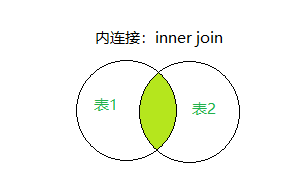
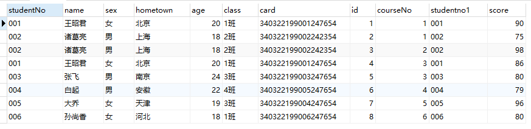
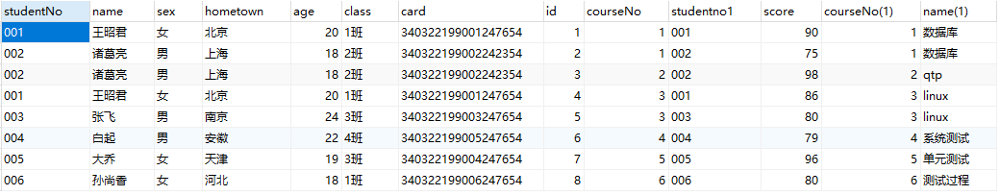
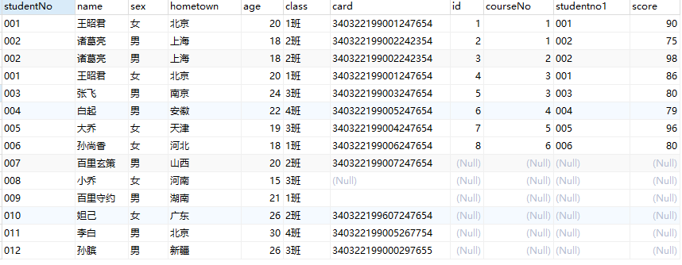
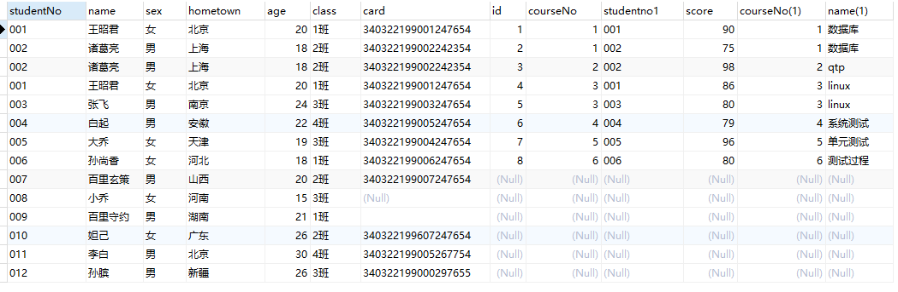
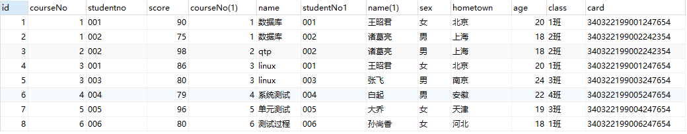

[TOC]

### MySQL基础

#### 基础中的基础

##### 1. 概述

SQL（Structured Query Language)，标准 SQL 由 ANSI 标准委员会管理，从而称为 ANSI SQL。各个 DBMS 都有自己的实现，如 PL/SQL、Transact-SQL 等。SQL 语句不区分大小写，但是数据库表名、列名和值是否区分依赖于具体的 DBMS 以及配置。

##### 2. 规范与约定

- MySQL 不区分大小写，但建议关键字大写，表名、列名小写。
- 每条命令最好用分号结尾。

- 每条命令根据需要，可以进行缩进或换行，如：

```mysql
SELECT
	*
FROM
	studentinfo;
```

##### 3. SQL语言分类

- **DDL**（Data Define Languge）: **数据定义**语言，如：CREATE、DROP、ALTER。

- **DQL**（Data Query Language）：**数据查询**语言，如：SELECT。
- **DML**（Data Manipulate Language）: **数据操作**语言，如：INSERT 、UPDATE、DELETE。
- **TCL**（Transaction Control Language）：**事务控制**语言，如：COMMIT、ROLLBACK。

##### 4. 基本使用

###### (1) 常用命令

```mysql
/*创建Test数据库*/
CREATE DATABASE [IF NOT EXISTS] test;
/*查看当前所有的数据库默认有三个库不能动！里面是数据库信息！*/
SHOW DATABASES;   
/*使用指定的库*/
USE 库名;
/*查看当前库的所有表*/
SHOW TABLES;
/*查看其它库的所有表,库的使用没变化，只是显示了其他库的表*/
SHOW TABLES FROM 库名;
/*创建表*/
CREATE TABLE 表名(
		列名 列类型,
		列名 列类型，
	  ...
);
/*查看表结构*/
DESC 表名;
/*查看服务器的版本*/
SELECT version();  # 方式一：登录到mysql服务端
mysql --version    # 方式二：没有登录到mysql服务端
mysql --V
```

###### (2) 连接数据库

```mysql
mysql 【-h主机名 -P端口号 】-u用户名 -p密码
mysql -h localhost -P 3306 -u root -p 
mysql -h 120.79.59.125 -u root # 登录到服务器的MySQL
mysql -u root -p  # 然后输入密码登录
```


#### MySQL数据类型

##### 1. 数值类型

###### (1) 整型

**TINYINT, SMALLINT, MEDIUMINT, INT, BIGINT** 分别使用 **8, 16, 24, 32, 64 位**存储空间，一般情况下**越小**的列越好。

**INT(11)** 中的数字只是规定了交互工具**显示字符**的个数，对于存储和计算来说是没有意义的。

###### (2) 浮点数

**FLOAT 和 DOUBLE 为浮点**类型，**DECIMAL 为高精度小数**类型。CPU 原生支持浮点运算，但是不支持 DECIMAl 类型的计算，因此 DECIMAL 的计算比浮点类型需要更高的代价。

FLOAT、DOUBLE 和 DECIMAL 都可以指定**列宽**，例如 **DECIMAL(18, 9)** 表示总共 18 位，取 9 位存储小数部分，剩下 9 位存储整数部分。

##### 2. 字符串

###### (1) CHAR与VARCHAR

主要有 **CHAR（定长） 和 VARCHAR（变长）** 两种类型。

**VARCHAR** 这种**变长类型**能够**节省空间**，因为只需要存储必要的内容。但是在执行 UPDATE 时可能会使行变得比原来长，当超出一个页所能容纳的大小时，就要执行额外的操作。MyISAM 会将行拆成不同的片段存储，而 InnoDB 则需要分裂页来使行放进页内。

如果字符串**长度比较确定且几乎一致**，最好使用 **CHAR** 类型。

在进行存储和检索时，会**保留** VARCHAR 末尾的空格，而会**删除** CHAR 末尾的空格。

###### (2) 其他类型

字符串类型还有 BINARY、VARBINARY、BLOB、TEXT、ENUM 和 SET 等。

BINARY 和 VARBINARY 类似于 CHAR 和 VARCHAR，不同的是它们包含二进制字符串而不要非二进制字符串。也就是说，它们包含字节字符串而不是字符字符串。这说明它们没有字符集，并且排序和比较基于列值字节的数值值。

**BLOB** 是一个**二进制大对象**，可以容纳可变数量的数据。有 4 种 BLOB 类型：TINYBLOB、BLOB、MEDIUMBLOB 和 LONGBLOB。它们区别在于可容纳存储范围不同。

有 4 种 **TEXT 类型**：TINYTEXT、TEXT、MEDIUMTEXT 和 LONGTEXT。对应的这 4 种 BLOB 类型，可存储的最大长度不同，可根据实际情况选择。

##### 3. 时间和日期

表示时间值的日期和时间类型为 DATETIME、DATE、TIMESTAMP、TIME 和 YEAR。

|       类型        | 大小 ( bytes) |             范围             |          格式           |           用途           |
| :---------------: | :-----------: | :--------------------------: | :---------------------: | :----------------------: |
|     **DATE**      |       3       |    1000-01-01/9999-12-31     |       YYYY-MM-DD        |          日期值          |
|     **TIME**      |       3       |   '-838:59:59'/'838:59:59'   |        HH:MM:SS         |     时间值或持续时间     |
|     **YEAR**      |       1       |          1901/2155           |          YYYY           |          年份值          |
| **==DATETIME==**  |     **8**     | 表示的时间范围：1000-9999 年 | **YYYY-MM-DD HH:MM:SS** |     混合日期和时间值     |
| **==TIMESTAMP==** |     **4**     |  表示时间范围：1970-2038年   |   **YYYYMMDD HHMMSS**   | 混合日期和时间值，时间戳 |

###### (1) DATETIME

能够保存从 1001 年到 9999 年的日期和时间，精度为**秒**，使用 **8 字节**的存储空间。它与**时区无关**。

默认情况下，MySQL 以一种可排序的、无歧义的格式显示 **DATETIME** 值，例如“2008-01-16 22:37:08”，这是 ANSI 标准定义的日期和时间表示方法。

**阿里巴巴**规范**建议**使用此类型。

###### (2) TIMESTAMP

和 UNIX 时间戳相同，保存从 1970 年 1 月 1 日午夜（格林威治时间）以来的秒数，使用 **4 个字节**，只能表示从 1970 年到 2038 年。它和**时区有关**，也就是说一个时间戳在不同的时区所代表的**具体时间是不同**的。

MySQL 提供了 FROM_UNIXTIME() 函数把 UNIX 时间戳转换为日期，并提供了 UNIX_TIMESTAMP() 函数把日期转换为 UNIX 时间戳。默认情况下，如果插入时没有指定 TIMESTAMP 列的值，会将这个值设置为当前时间。

TIMESTAMP 比 DATETIME **空间效率**更高。


#### MySQL运算符

主要分为几个大类，并进行优先级对比。

##### 1. 算术运算符

|    运算符    |   作用   |
| :----------: | :------: |
|    **+**     |   加法   |
|    **-**     |   减法   |
|    *****     |   乘法   |
| **/ 或 DIV** |   除法   |
| **% 或 MOD** | **取模** |

##### 2. 比较运算符

SELECT 语句中的条件语句经常要使用比较运算符。通过这些比较运算符，可以判断表中的**哪些记录是符合条件**的。比较结果为真，则返回 1，为假则返回 0，比较结果不确定则返回 NULL。

|        符号         |            描述            |                             备注                             |
| :-----------------: | :------------------------: | :----------------------------------------------------------: |
|        **=**        |            等于            |                                                              |
|     **<>, !=**      |           不等于           |                                                              |
|        **>**        |            大于            |                                                              |
|        **<**        |            小于            |                                                              |
|       **<=**        |          小于等于          |                                                              |
|       **>=**        |          大于等于          |                                                              |
|     **BETWEEN**     |         在两值之间         |                         >=min&&<=max                         |
|   **NOT BETWEEN**   |        不在两值之间        |                                                              |
|       **IN**        |          在集合中          |                                                              |
|     **NOT IN**      |         不在集合中         |                                                              |
|       **<=>**       | 严格比较两个NULL值是否相等 | 两个操作码均为 NULL 时，其所得值为 1；而当一个操作码为 NULL时，其所得值为 0 |
|      **LIKE**       |          模糊匹配          |                                                              |
| **REGEXP 或 RLIKE** |         正则式匹配         |                                                              |
|     **IS NULL**     |            为空            |                                                              |
|   **IS NOT NULL**   |           不为空           |                                                              |

##### 3. 逻辑运算符

逻辑运算符用来**判断表达式的真假**。如果表达式是真，结果返回 1。如果表达式是假，结果返回 0。

|   运算符号   |   作用   |
| :----------: | :------: |
| **NOT 或 !** |  逻辑非  |
|   **AND**    |  逻辑与  |
|    **OR**    |  逻辑或  |
|   **XOR**    | 逻辑异或 |

##### 4. 位运算符

位运算符是在二进制数上进行计算的运算符。位运算会先将操作数变成**二进制数**，进行位运算，然后再将计算结果从二进制数变回**十进制数**。

| 运算符号 |   作用   |
| :------: | :------: |
|  **&**   |  按位与  |
|  **\|**  |  按位或  |
|  **^**   | 按位异或 |
|  **!**   |   取反   |
|  **<<**  |   左移   |
|  **>>**  |   右移   |

##### 5. 优先级

不同运算符之间优先级不同，不知道具体多少**直接加括号**最省事。


### DDL数据定义语言

#### 数据库的管理

```mysql
# 创建库Books
CREATE DATABASE IF NOT EXISTS books ;
# 库的修改
RENAME DATABASE books TO 新库名;
# 更改库的字符集
ALTER DATABASE books CHARACTER SET gbk;
# 库的删除
DROP DATABASE IF EXISTS books;
```

#### 数据表的管理

##### 1. 创建表

```mysql
CREATE TABLE [IF NOT EXISTS] 表名(
    列名 列的类型【(长度) 约束】,
    列名 列的类型【(长度) 约束】,
    列名 列的类型【(长度) 约束】,
    ...
    列名 列的类型【(长度) 约束】
);
```

```mysql
CREATE TABLE [IF NOT EXISTS] stuinfo(
    stuId INT,
    stuName VARCHAR(20),
    gender CHAR,
    bornDate DATETIME
);
```

##### 2. 修改表

修改表结构 SQL 如下：

```mysql
ALTER TABLE 表名 ADD|MODIFY|DROP|CHANGE COLUMN 字段名 【字段类型】;
```

例子如下：

```mysql
# 修改列名
ALTER TABLE book CHANGE COLUMN publishdate pubDate DATETIME;
# 修改列的类型或约束
ALTER TABLE book MODIFY COLUMN pubdate TIMESTAMP;
# 添加新列
ALTER TABLE author ADD COLUMN annual DOUBLE; 
# 删除列
ALTER TABLE book_author DROP COLUMN annual;
# 修改表名
ALTER TABLE author RENAME TO book_author;
DESC book;
```

##### 3. 删除表

```mysql
DROP TABLE IF EXISTS book_author;
```

一种常见的写法：

```mysql
DROP TABLE IF EXISTS 旧表名;
CREATE TABLE 表名();
```

##### 4. 表数据的复制

```mysql
INSERT INTO author VALUES
(1,'村上春树','日本'),
(2,'莫言','中国'),
(3,'冯唐','中国'),
(4,'金庸','中国');

# 1.仅仅复制表的结构
CREATE TABLE copy LIKE author;

# 2.复制表的结构+数据
CREATE TABLE copy2 
SELECT * FROM author;

# 3.只复制部分数据
CREATE TABLE copy3
SELECT id, au_name
FROM author 
WHERE nation = '中国';

# 4.仅仅复制某些字段而不复制数据
CREATE TABLE copy4 
SELECT id, au_name
FROM author
WHERE 0;  # 表示不复制数据
```


#### 表字段的约束

约束：一种限制，用于限制表中的数据，为了保证表中的数据的**准确和可靠性**。

##### 1. 六大约束

|      约束       |                             描述                             |
| :-------------: | :----------------------------------------------------------: |
|  **NOT NULL**   |             **非空**，用于保证该字段的值不能为空             |
|   **DEFAULT**   |               **默认**，用于保证该字段有默认值               |
| **PRIMARY KEY** |       **主键**，用于保证该字段的值具有唯一性，并且非空       |
|   **UNIQUE**    |       **唯一**，用于保证该字段的值具有唯一性，可以为空       |
|    **CHECK**    |    **检查约束**【mysql中不支持，语法上支持但是写了没用】     |
| **FOREIGN KEY** | **外键**，用于限制**两个表**的关系，用于保证该**字段的值**必须来自于**主表的关联列的值**。在**==从表==添加外键**约束，用于引用**==主表==中某列**的值 |

可以在**创建表或者修改表**时添加表的约束。

约束可以分为列级约束与表级约束，**列级约束**：六大约束语法上都支持，但外键约束没有效果。**表级约束**：除了非空、默认，其他的都支持。

```mysql
CREATE TABLE 表名(
    字段名 字段类型 列级约束,
    字段名 字段类型,
    表级约束
)
```

##### 2. 创建表时添加约束

###### (1) 添加列级约束

语法：**直接在字段名和类型后面追加约束类型即可**。只支持：**默认、非空、主键、唯一**约束。

```mysql
# 添加列级约束实例
CREATE TABLE stuinfo(
    id INT PRIMARY KEY,  # 主键约束
    stuName VARCHAR(20) NOT NULL UNIQUE,  # 非空约束
    gender CHAR(1) CHECK(gender = '男' OR gender = '女'),	# 检查约束,其实没效果
    seat INT UNIQUE, # 唯一约束
    age INT DEFAULT 18, # 默认约束
    majorId INT
);

# 查看stuinfo中的所有索引，包括主键、外键、唯一
SHOW INDEX FROM stuinfo;
```

###### (2) 添加表级约束

语法：在**各个字段的最下面**添加：**【CONSTRAINT 约束名】 约束类型(字段名)** 。

```mysql
# 添加表级约束实例
CREATE TABLE stuinfo(
    id INT PRIMARY KEY,  # 主键约束
    stuName VARCHAR(20) NOT NULL UNIQUE,  # 非空约束
    gender CHAR(1) CHECK(gender = '男' OR gender = '女'),	# 检查约束,其实没效果
    seat INT UNIQUE, # 唯一约束
    age INT DEFAULT 18, # 默认约束
    majorId INT    # 下面加了外键的列
    # 下面添加表级约束
    CONSTRAINT pk PRIMARY KEY(id),  # 主键约束
    CONSTRAINT uq UNIQUE(seat),		# 唯一键约束
    CONSTRAINT ck CHECK(gender = '男' OR gender  = '女'), # 检查，其实无效果
    # 外键majorid与major表的id
    CONSTRAINT fk_stuinfo_major FOREIGN KEY(majorid) REFERENCES major(id) 	
);
# 查看stuinfo中的所有索引，包括主键、外键、唯一
SHOW INDEX FROM stuinfo;
```

##### 3. 修改表时添加约束

- 修改时添加**列级**约束。

```mysql
ALTER TABLE 表名 MODIFY COLUMN 字段名 字段类型 新约束;
```

- 修改时添加**表级**约束。

```mysql
ALTER TABLE 表名 ADD 【constraint 约束名】 约束类型(字段名) 【外键的引用】;
```

```mysql
DROP TABLE IF EXISTS stuinfo;
CREATE TABLE stuinfo(
    id INT,
    stuname VARCHAR(20),
    gender CHAR(1),
    seat INT,
    age INT,
    majorid INT
)
DESC stuinfo;
# 1.添加非空约束
ALTER TABLE stuinfo MODIFY COLUMN stuname VARCHAR(20) NOT NULL;
# 2.添加默认约束
ALTER TABLE stuinfo MODIFY COLUMN age INT DEFAULT 18;
# 3.添加主键
# 3.1列级约束
ALTER TABLE stuinfo MODIFY COLUMN id INT PRIMARY KEY;
# 3.2表级约束
ALTER TABLE stuinfo ADD PRIMARY KEY(id);
# 4.添加唯一
# 4.1列级约束
ALTER TABLE stuinfo MODIFY COLUMN seat INT UNIQUE;
# 4.2表级约束
ALTER TABLE stuinfo ADD UNIQUE(seat);
# 5.添加外键
ALTER TABLE stuinfo ADD CONSTRAINT fk_stuinfo_major FOREIGN KEY(majorid) REFERENCES major(id); 
```

##### 4. 修改表时删除约束

```mysql
# 1.删除非空约束
ALTER TABLE stuinfo MODIFY COLUMN stuname VARCHAR(20) NULL;
# 2.删除默认约束
ALTER TABLE stuinfo MODIFY COLUMN age INT ;
# 3.删除主键
ALTER TABLE stuinfo DROP PRIMARY KEY;
# 4.删除唯一
ALTER TABLE stuinfo DROP INDEX seat;
# 5.删除外键
ALTER TABLE stuinfo DROP FOREIGN KEY fk_stuinfo_major;
SHOW INDEX FROM stuinfo;
```


### DQL数据查询语言

先建几个表方便后续使用。

**部门表**：

```mysql
DROP TABLE IF EXISTS `departments`;
CREATE TABLE `departments` (
    `department_id` int(4) NOT NULL AUTO_INCREMENT,	# 部门ID
    `department_name` varchar(3) DEFAULT NULL,		# 部门名称
    `manager_id` int(6) DEFAULT NULL,	# 经理ID
    `location_id` int(4) DEFAULT NULL,  # 地址ID
    PRIMARY KEY (`department_id`),		# 主键
    KEY `loc_id_fk` (`location_id`),
    CONSTRAINT `loc_id_fk` FOREIGN KEY (`location_id`) REFERENCES `locations` (`location_id`)
) ENGINE=InnoDB AUTO_INCREMENT=271 DEFAULT CHARSET=gb2312;
```

**员工表**：

```mysql
DROP TABLE IF EXISTS `employees`;
CREATE TABLE `employees` (
    `employee_id` int(6) NOT NULL AUTO_INCREMENT,	# 员工ID
    `first_name` varchar(20) DEFAULT NULL,	# 姓
    `last_name` varchar(25) DEFAULT NULL,	# 名
    `email` varchar(25) DEFAULT NULL,		# 邮箱
    `phone_number` varchar(20) DEFAULT NULL,# 电话
    `job_id` varchar(10) DEFAULT NULL,		# 工作id
    `salary` double(10,2) DEFAULT NULL,		# 薪水
    `commission_pct` double(4,2) DEFAULT NULL,
    `manager_id` int(6) DEFAULT NULL,		# 经理id
    `department_id` int(4) DEFAULT NULL,	# 部门id
    `hiredate` datetime DEFAULT NULL,		# 录用日期
    PRIMARY KEY (`employee_id`),
    KEY `dept_id_fk` (`department_id`),
    KEY `job_id_fk` (`job_id`),
    CONSTRAINT `dept_id_fk` FOREIGN KEY (`department_id`) REFERENCES `departments` (`department_id`),
    CONSTRAINT `job_id_fk` FOREIGN KEY (`job_id`) REFERENCES `jobs` (`job_id`)
) ENGINE=InnoDB AUTO_INCREMENT=207 DEFAULT CHARSET=gb2312;
```

**职位表**：

```mysql
DROP TABLE IF EXISTS `jobs`;
CREATE TABLE `jobs` (
    `job_id` varchar(10) NOT NULL,			# 职位id
    `job_title` varchar(35) DEFAULT NULL,	# 职位名称
    `min_salary` int(6) DEFAULT NULL,		# 最低薪资
    `max_salary` int(6) DEFAULT NULL,		# 最高薪资
    PRIMARY KEY (`job_id`)
) ENGINE=InnoDB DEFAULT CHARSET=gb2312;
```

**地址表**：

```mysql
DROP TABLE IF EXISTS `locations`;
CREATE TABLE `locations` (
    `location_id` int(11) NOT NULL AUTO_INCREMENT,	# 地址id
    `street_address` varchar(40) DEFAULT NULL,		# 街道
    `postal_code` varchar(12) DEFAULT NULL,			# 邮编
    `city` varchar(30) DEFAULT NULL,				# 城市
    `state_province` varchar(25) DEFAULT NULL,		# 省份
    `country_id` varchar(2) DEFAULT NULL,			# 国家
    PRIMARY KEY (`location_id`)
) ENGINE = InnoDB AUTO_INCREMENT = 3201 DEFAULT CHARSET = gb2312;
```

#### 基础查询

##### 1. 概述

基本查询格式如下：

```sql
SELECT 查询列表 FROM 表名;
```

通过 SELECT 查询完结果是一个临时性的**虚拟的表格**，不是真实存在。查询列表可以是**常量值、表达式、字段、函数等**。

**(1) 查询常量值：**

```mysql
SELECT 100;
```

**(2) 查询表达式**：

```mysql
SELECT 100%98;
```

**(3) 查询函数**：相当于**调用函数**并得到其返回值。

```mysql
SELECT VERSION();
```

**(4) 查询字段**：

```mysql
# 查询单个字段
SELECT max_salary FROM jobs;
# 查询多个字段
SELECT max_salary, min_salary FROM jobs;
# 查询全部字段显示顺序与表的定义一样
SELECT * FROM jobs; 
# 可以使用`字段` 引号来包裹某字段来区分关键字	
SELECT `Jack`;	
```

##### 2. 字段起别名AS

便于理解，如果要查询的**字段有重名**的情况，使用别名可以区分开来，**显示的结果为别名值**。也可以省略 AS。

```mysql
mysql> SELECT 100%98 AS RESULT;
mysql> SELECT 100%98 RESULT;
```

```mysql
SELECT last_name AS 姓, first_name AS 名 FROM employees;
```

```mysql
SELECT salary AS `OUT PUT` FROM employees;  # 使用引号区分关键词
```

##### 3. 查询去重DISTINCT

**DISTINCT** 放在需要去重的字段**之前**。

```mysql
# 案例：查询员工表中所有的部门编号
SELECT department_id FROM employees;
# 会显示全部部门编号，很多重复，可以加上DISTINCT去重。
SELECT DISTINCT department_id FROM employees;
```

##### 4. 组合查询结果CONCAT()

有时候希望把不同字段的查询结果**组合起来**。先看错误示范：

```mysql
# 案例：查询员工名和姓连接成一个字段，并显示成 姓名 输出 (此法不对，输出为0) 
SELECT last_name + first_name AS 姓名 FROM employees;  
```

Java 中的 + 号可当运算符或者连接符。而**MySQL 中的 + 号仅能当运算符**。

(1) 两个操作数都为数值型，执行加法运算。

```mysql
SELECT 100 + 90;  # 190
```

(2) 其中一个为**字符型**时会视图将字符型数值转换成**数值型**，如果**转换成功**则继续做加法运算。如果转换**失败**则将字符型的**数值转换成 0**。

```mysql
SELECT '123' + 90;  # 213 转换成功
SELECT 'a123' + 90; # 90  转换失败
```

(3) 只要其中一方为 null，则结果为 null。

```mysql
SELECT null + 90;   # null
```

**那怎么办？？？**

在 MySQL 中**拼接用 ==CONCAT()== 函数**。

```mysql
# 将员工的姓名连接在一起输出
mysql> SELECT CONCAT(last_name, ', ', first_name) AS FullName FROM employees;
+--------------------+
| FullName           |
+--------------------+
| K_ing, Steven      |
| Kochhar, Neena     |
| De Haan, Lex       |
| Hunold, Alexander  |
| Ernst, Bruce       |
+--------------------+
```

查询结果将姓和名两个字段的**结果连接**在了一起。并且结果使用了“，”进行**分隔**。

**CONCAT()**  用于连接两个字段的结果。许多数据库会使用空格把一个值填充为列宽，因此连接的结果会出现一些**不必要的空格**，使用 **TRIM()** 可以去除首尾空格。

```sql
SELECT CONCAT(TRIM(col1), '(', TRIM(col2), ')') AS concat_col
FROM mytable;
```

##### 5. 非空查询※

**NULL 结果和其他字段==拼接==查询结果就会为 NULL** 。

所以 **IFNULL 函数**可以**判断查询的字段是否为 NULL ，如果为 NULL   则返回**设置的默认值 ，如上述的 0。使用 **IFNULL() 函数**。

```mysql
# 设置0为max_salary的默认值，如果为NULL就设置为0
SELECT IFNULL(max_salary, 0) AS 最大薪水, max_salary FROM employees;
```

##### 6. 限制行数LIMIT

LeetCode 中经常使用。限制返回的**行数**，可以有两个参数，**第一个参数**为**起始行**，从 ==**0 开始**==；第**二个参数**为返回的**总行数**。

返回前 5 行（两句等价）：

```mysql
SELECT * FROM mytable LIMIT 5;  # 默认有第一行
SELECT * FROM mytable LIMIT 0, 5;
```

返回第 3 \~ 5 行：

```mysql
SELECT * FROM mytable LIMIT 2, 3;  # 第三行开始，总共三行
```


#### 条件查询

语法：

```mysql
SELECT 查询列表 FROM 表名 WHERE 筛选条件；
```

判断筛选条件**是否成立**，成立则显示，否则不显示。**先筛选，再查询**显示结果。

##### 1. 按条件运算符筛选

条件运算符表：

| 符合 |   释义   | 符号 |        释义        |
| :--: | :------: | :--: | :----------------: |
|  >   |   大于   |  <   |        小于        |
| \>=  | 大于等于 |  <=  |      小于等于      |
|  =   |   等于   |      |                    |
|  !=  |  不等于  |  <>  | 不等于（**推荐**） |

```mysql
# 案例1：查询工资>12000的员工信息
SELECT * FROM employees WHERE salary > 12000;
```

```mysql
# 案例2：查询部门编号不等于90号的员工名和部门编号
SELECT last_name, department_id FROM employees WHERE department_id <> 90;
```

##### 2. 按逻辑表达式分类

逻辑**运算符**: AND 与 OR 优先处理 AND。

|     运算符     |                         释义                          |
| :------------: | :---------------------------------------------------: |
| **AND**（&&）  |  两个条件如果**同时**成立，结果为 true，否则为 false  |
| **OR**（\|\|） | 两个条件只要有**一个**成立，结果为 true，否则为 false |
|  **NOT**（!）  |                       条件取反                        |

- 逻辑**表达式**：用于连接条件表达式 可以使用**多个**条件表达式

```mysql
# 案例1：查询工资在10000到20000之间的员工名、工资以及奖金
SELECT last_name, salary, commission_pct FROM employees WHERE salary >= 10000 AND salary <= 20000;
```

```mysql
# 案例2：查询部门编号不是在90到110之间，或者工资高于15000的员工信息
SELECT * FROM employees WHERE NOT (department_id >= 90 AND  department_id <= 110) OR salary > 15000; # 进行了一波取反操作
```

##### 3. 模糊查询

###### (1) LIKE

一般和**通配符**搭配使用：

- **%** : 任意多个字符, 包含 0 个字符。
- **_** : 任意单个字符。
- (特殊情况通配符) 需要**转义**。

```mysql
# 案例1：查询员工名中包含字符a的员工信息
select * from employees where last_name like '%a%';
```

```mysql
# 案例2：查询员工名中第三个字符为 e，第五个字符为 a 的员工名和工资
select last_name, salary FROM employees WHERE last_name LIKE '__e_a%';
```

```mysql
# 案例3：查询员工名中第二个字符为_的员工名(特殊情况通配符) 需要转义
SELECT last_name FROM employees WHERE
	last_name LIKE '_$_%' ESCAPE '$'; 	# 法1：使用ESCAPE指定转义字符
	last_name LIKE '_\_%';				# 法2：使用默认的转移字符 \
```

###### (2) BETWEEN AND

使用 BETWEEN AND 可以提高语句的简洁度。**包含**临界值，相当于大于等于和小于等于。

```mysql
# 案例1：查询员工编号在100到120之间的员工信息
SELECT * FROM employees WHERE employee_id <= 120 AND employee_id >= 100;
# 简洁版本
SELECT * FROM employees WHERE employee_id BETWEEN 120 AND 100;
```

###### (3) IN

含义：判断某字段的值是否属于 **IN 列表**中的某一项。

- IN 列表的值类型**必须一致或兼容**。
- IN 列表中**不支持**通配符。

```mysql
# 案例：查询员工的工种编号是 IT、AD 中的一个员工名和工种编号
SELECT last_name, job_id FROM employees WHERE job_id = 'IT' OR job_id = 'AD';

# 改进版本 可选值在小括号内逗号隔开
SELECT last_name, job_id FROM employees WHERE job_id IN('IT', 'AD');	
```

###### (4) IS (NOT) NULL

**=== 或 <> 不能用于判断 NULL值，而使用 IS NULL 或 IS NOT NULL可以判断 NULL值。==**但是 IS 不能查询具体的数值。

```mysql
# 案例1：查询没有奖金的员工名和奖金率
SELECT last_name, commission_pct FROM employees WHERE commission_pct IS NULL;
```

```mysql
# 案例2：查询有奖金的员工名和奖金率
SELECT last_name, commission_pct FROM employees WHERE commission_pct IS NOT NULL;	
```

> **安全等于 <=>** 

**IS NULL** : 仅仅可以判断 **NULL 值**，可读性较高，建议使用。**<=>** : 既可以判断 NULL 值，又可以判断**普通**的数值，可读性较低，用的**较少**。

```mysql
# 案例1：查询没有奖金的员工名和奖金率
SELECT last_name, commission_pct FROM employees WHERE commission_pct <=> NULL;
```

```mysql
# 案例2：查询工资为12000的员工信息
SELECT last_name, salary FROM employees WHERE salary <=> 12000;
```

##### 4. 通配符

通配符也是用在过滤语句中，但它只能用于**文本字段**。

-  **%**  ：匹配 >=0 个任意字符。

-  **\_**    ：匹配 **==1** 个任意字符。

-  **[ ]**  ：可以匹配**集合内**的字符，例如 [ab] 将匹配字符 a 或者 b。用脱字符 ^ 可以对其进行**否定**，也就是不匹配集合内的字符。

可以使用 **Like** 来进行通配符**匹配**。

```mysql
SELECT * FROM mytable WHERE col LIKE '[^AB]%'; # 不以A和B开头的任意文本
```

不要滥用通配符，通配符位于**开头处**匹配会**非常慢**，因为无法使用索引。


#### 查询排序

基本语法：

```mysql
SELECT 查询列表 FROM 表 WHERE 条件 ORDER BY 排序的字段|表达式|函数|别名 【ASC|DESC】;
```

- **ASC** 代表的是**升序**，可以**省略**。**DESC** 代表的是**降序**。
- ORDER BY 子句可以支持 **单个字段、别名、表达式、函数、多个字段**。
- ORDER BY 子句在查询语句的**最后面**，但在 LIMIT 子句之前。
- 可以按**多个列**进行排序，并且为每个列分别指定**不同的排序方式**。

```mysql
# Case1: 查询员工信息，要求工资从高到低排序 按单个字段排序
SELECT * FROM employees ORDER BY salary DESC;
```

```mysql
# Case2：查询部门编号大于等于90的员工信息，按入职时间先后排序
SELECT * FROM employees WHERE department_id >= 90 OEDER BY hiredate ASC;
```

```mysql
# Case3：按年薪的高低显示员工的信息和年薪（按表达式排序）奖金commission_pct可能为NULL，防止出错使用IFNULL为其设置默认值0，否则整个表达式都是NULL
# 表达式太长可以用别名！
SELECT *, salary * 12 * (1 + IFNULL(commission_pct, 0)) AS yearSalary FROM employees ORDER BY yearSalary DESC;  
```

```mysql
# Case4: 按姓名的长度显示员工的姓名和工资（按函数排序）
SELECT LENGTH(last_name) AS nameLength, last_name, salary FROM employees ORDER BY LENGTH(last_name) DESC;
```

```mysql
# Case5: 查询员工信息，要求先按工资排序，再按员工编号排序（按多个字段排序）
# 整体的salary是升序，如果有几个工资相同的情况，则员工编号按降序排列。
SELECT * FROM employees OREDER BY salary ASC, employee_id DESC; 
```


#### 常见函数

基本使用。

```mysql
SELECT 函数名（实参列表） [FROM 表];
```

##### 1. 普通函数

###### (1) 文本处理函数

```mysql
CONCAT(); # 拼接
SUBSTR(); # 截取子串
UPPER(); # 转换成大写
LOWER(); # 转换成小写
TRIM(); # 去前后指定的空格和字符
LTRIM(); # 去左边空格
RTRIM(); # 去右边空格
REPLACE(); # 替换
LPAD(); # 左填充
RPAD(); # 右填充
INSTR(); # 返回子串第一次出现的索引
LENGTH(); # 获取字节个数
```

```mysql
# 1.LENGTH 获取参数值的字节个数
SELECT LENGTH('john');			
SELECT LENGTH('张三丰hahaha');
SHOW VARIABLES LIKE '%char%';	# 查看字符集
```

```mysql
# 2.concat 拼接字符串 使用_隔开
SELECT CONCAT(last_name, '_', first_name) AS name FROM employees;
```

```mysql
# 3.upper、lower
SELECT UPPER('john');
SELECT LOWER('joHn');
# 示例：将姓变大写，名变小写，然后以'_'隔开拼接
SELECT CONCAT(UPPER(last_name), '_', LOWER(first_name))  AS name FROM employees;
```

```mysql
# 4.SUBSTR、SUBSTRING 注意：索引从1开始
# 截取从指定索引处后面所有字符 索引从1开始
SELECT SUBSTR('123456789', 7)  out_put;	 # out_put = ‘789’
# 截取从指定索引处指定字符长度的字符
SELECT SUBSTR('123456789', 1, 3) out_put;  # out_put = '123'
# 案例：姓名中首字符大写，其他字符小写然后用_拼接，显示出来
SELECT CONCAT(UPPER(SUBSTR(last_name,1,1)),'_',LOWER(SUBSTR(last_name,2)))  out_put
FROM employees;
```

```mysql
# 5.INSTR返回子串第一次出现的索引，如果找不到返回0
SELECT INSTR('12345678', '234') AS out_put;  # 2
```

```mysql
# 6.TRIM
# 去掉前后空格
SELECT LENGTH(TRIM('    张翠山    ')) AS out_put;	# 张翠山
# 指定a为去掉的字符
SELECT TRIM('a' FROM 'aaaaaaaaa张aaaaaaaaaaaa翠山aaaaaaaaaaaaaaa')  AS out_put;	# 张aaaaaaaaaaaa翠山
```

```mysql
# 7.LAPD：用指定的字符实现左填充指定长度
SELECT LPAD('殷素素', 10, '*') AS out_put;  # *******殷素素
```

```mysql
# 8.RPAD：用指定的字符实现右填充指定长度
SELECT RPAD('Boy', 12, 'ab') AS out_put;   # Boyababababa
```

```mysql
# 9.REPLACE：替换
SELECT REPLACE('周芷若周芷若张无忌爱上了周芷若', '周芷若', '赵敏') AS out_put;	# 赵敏赵敏张无忌爱上了赵敏
```

###### (2) 数值处理函数

```mysql
ROUND(); # 四舍五入
RAND(); # 随机数
FLOOR(); # 向下取整
CEIL(); # 向上取整
MOD(); # 取余
TRUNCATE(); # 截断
```

```mysql
# ROUND 四舍五入
SELECT ROUND(-1.55);		# 2
# 重载 第二位是位数
SELECT ROUND(1.567, 2);		# 1.57
# CEIL 向上取整,返回 >= 该参数的最小整数
SELECT CEIL(-1.02);			# -1
# FLOOR 向下取整，返回 <= 该参数的最大整数
SELECT FLOOR(-9.99); 		# -10
# TRUNCATE 截断 第二个参数是小数位数
SELECT TRUNCATE(1.69999, 1);# 1.6
# MOD取余
/*
 * mod(a,b) ：  a-a/b*b
 * mod(-10,-3):-10-(-10)/(-3)*(-3)=-1
 */
SELECT MOD(10, -3);	# -1
SELECT 10 % 3;
```

###### (3) 日期函数

```mysql
NOW(); # 当前系统日期+时间
CURDATE(); # 当前系统日期
CURTIME(); # 当前系统时间
STR_TO_DATE(); # 将字符转换成日期
DTA_FORMAT(); # 将日期转换成字符
```

```mysql
# NOW 返回当前系统日期+时间
SELECT NOW();		# 2019-07-22 14:45:33
# CURDATE 返回当前系统日期，不包含时间
SELECT CURDATE();	# 2019-07-22
# CURTIME 返回当前时间，不包含日期
SELECT CURTIME();	# 14:46:14
# 可以获取指定的部分，年、月、日、小时、分钟、秒
SELECT YEAR(NOW()) AS 年;
SELECT YEAR('1998-1-1') AS 年;	# 年 1998
SELECT  YEAR(hiredate) AS 年 FROM employees;
SELECT MONTH(NOW()) AS 月;
SELECT MONTHNAME(NOW()) AS 月;	# September
```

```mysql
# STR_TO_DATE 将字符通过指定的格式转换成日期
SELECT STR_TO_DATE('1998-3-2', '%Y-%c-%d') AS out_put;

# 查询入职日期为1992-4-3的员工信息 这是默认的日期格式 是可以查询的
SELECT * FROM employees WHERE hiredate = '1992-4-3';

# 非标准格式的字符串查询日期需要转换一下
SELECT * FROM employees WHERE hiredate = STR_TO_DATE('4-3 1992','%c-%d %Y');
```

**字符串转时间格式表格**

| 序号 | 格式符 |        功能         |
| :--: | :----: | :-----------------: |
|  1   |   %Y   |     四位的年份      |
|  2   |   %y   |      2位的年份      |
|  3   |   %m   | 月份（01,02…11,12） |
|  4   |   %c   | 月份（1,2,…11,12）  |
|  5   |   %d   |    日（01,02,…）    |
|  6   |   %H   |  小时（24小时制）   |
|  7   |   %h   |  小时（12小时制）   |
|  8   |   %i   |  分钟（00,01…59）   |
|  9   |   %s   |   秒（00,01,…59）   |

```mysql
# DATE_FORMAT 将日期转换成字符
SELECT DATE_FORMAT(NOW(), '%y年%m月%d日') AS out_put;# 19年07月22日
# 查询有奖金的员工名和入职日期(xx月/xx日 xx年)
SELECT last_name, DATE_FORMAT(hiredate, '%m月/%d日 %y年') AS hire_time FROM employees
WHERE commission_pct IS NOT NULL;
```

###### (4) 其他函数

```mysql
version(); # 版本
database(); # 当前库
user(); # 当前连接用户
```

##### 2. 聚集函数

一般用作**统计功能**，又叫统计函数。这五个聚集函数都**忽略 NULL 值**，除了 **COUNT(*)**。

```mysql
AVG();		# 返回某列的平均值
COUNT();	# 返回某列的行数
MAX();		# 返回某列的最大值
MIN();		# 返回某列的最小值
SUM();		# 返回某列的和
```

对于 **COUNT()**：

- 使用 **COUNT(*)** 对表中**行的数目**进行计数， 不管表列中**包含的是空值（NULL）还是非空值**。
- 使用 **COUNT(column)** 对**特定列中具有值（也就是不为 NULL）**的行进行计数。

```mysql
# 1、基础查询
SELECT SUM(salary) FROM employees;
SELECT AVG(salary) FROM employees;
SELECT MIN(salary) FROM employees;
SELECT MAX(salary) FROM employees;
SELECT COUNT(salary) FROM employees;
# 可以搭配其他函数使用
SELECT SUM(salary),AVG(salary),MAX(salary),MIN(salary),COUNT(salary) FROM employees;
SELECT SUM(salary),ROUND(AVG(salary),2),MAX(salary),MIN(salary),COUNT(salary) FROM employees;
```

```mysql
# 2、参数支持哪些类型
SELECT SUM(last_name), AVG(last_name) FROM employees;
SELECT SUM(hiredate), AVG(hiredate) FROM employees;
SELECT MAX(last_name), MIN(last_name) FROM employees;
SELECT MAX(hiredate), MIN(hiredate) FROM employees;
SELECT COUNT(commission_pct) FROM employees;
SELECT COUNT(last_name) FROM employees;
```

```mysql
# 3、是否忽略NULL
SELECT SUM(commission_pct), AVG(commission_pct), SUM(commission_pct)/35, SUM(commission_pct)/107 FROM employees;
SELECT MAX(commission_pct), MIN(commission_pct) FROM employees;
SELECT COUNT(commission_pct) FROM employees;
SELECT commission_pct FROM employees;
```

```mysql
# 4、和DISTINCT搭配进行去重后结果的统计
SELECT SUM(DISTINCT salary), SUM(salary) FROM employees;
SELECT COUNT(DISTINCT salary), COUNT(salary) FROM employees;
```

```mysql
# 5、CUONT函数的详细介绍
SELECT COUNT(salary) FROM employees;
SELECT COUNT(*) FROM employees;
SELECT COUNT(1) FROM employees;
```

```mysql
# 6、和分组函数一同查询的字段有限制
SELECT AVG(salary), employee_id  FROM employees;
```


#### 分组查询

分组就是把具有**相同的数据值**的行放在**同一组**中。可以对同一分组数据使用**汇总函数**进行处理，例如求**分组数据的平均值**等。指定的分组字段除了能按该字段进行分组，也会自动按该字段进行**排序**。

**基本语法**

```mysql
# 查询列表要求是分组函数和GROUP BY后出现的字段
SELECT 查询的字段, 分组函数 FROM 表 [WHERE 筛选条件] GROUP BY 分组的字段 [ORDER BY 子句];
```

**GROUP BY** 自动按分组字段进行排序，**ORDER BY** 也可以按**汇总**字段来进行**排序**。和**分组函数一同查询的字段**必须是 GROUP BY **后**出现的字段，除了**汇总字段**外（如聚集函数），SELECT 语句中的**每一字段**都必须在 **GROUP BY** 子句中**给出**。**分组函数**做条件肯定是放在 **HAVING** 子句中，HAVING 后也可以支持**别名**。**GROUP BY** 子句支持单个字段分组，多个字段分组，多个字段之间用**逗号隔开没有顺序**要求。

**==WHERE 过滤行，HAVING 过滤分组，行过滤应当先于分组过滤==**。

分组查询规定：**GROUP BY 子句出现在 WHERE 子句之后，ORDER BY 子句之前。NULL 的行会单独分为一组**。

|                |       数据源       |          位置           |     关键字     |
| :------------: | :----------------: | :---------------------: | :------------: |
| **分组前筛选** |     **原始表**     | GROUP BY 子句的**前面** | **==WHERE==**  |
| **分组后筛选** | **分组后**的结果集 | GROUP BY 子句的**后面** | **==HAVING==** |

下面的例子中，许多都是使用了聚集函数的，注意**除了聚集函数之外的查询字段，都必须在 GROUP BY 之后出现**，注意观察。

```mysql
# 案例：查询每个工种的最高工资 
SELECT MAX(salary), job_id FROM employees GROUP BY job_id;
```

```mysql
# 案例：查询每个位置上的部门个数
SELECT COUNT(*), location_id FROM departments GROUP BY location_id;
```

**添加条件查询**：

```mysql
# 案例1：查询邮箱中包含a字符的 每个部门的最高工资
SELECT MAX(salary), department_id FROM employees WHERE email LIKE '%a%' GROUP BY department_id;
```

```mysql
# 案例2：查询有奖金的每个领导手下员工的平均工资
SELECT AVG(salary), manager_id FROM employees WHERE commission_pct IS NOT NULL GROUP BY manager_id;
```

**分组后筛选**：

```mysql
# 案例1：查询哪个部门的员工个数>5 先查询每个部门的员工个数，再筛选结果
SELECT COUNT(*), department_id FROM employees GROUP BY department_id HAVING COUNT(*) > 5;
```

```mysql
# 案例2：每个工种有奖金的员工的最高工资>12000的工种编号和最高工资
SELECT MAX(salary), job_id FROM employees WHERE commission_pct IS NOT NULL
GROUP BY job_id HAVING MAX(salary) > 12000;
```

```mysql
# 案例3：领导编号>102的每个领导手下的最低工资大于5000的领导编号和最低工资
SELECT manager_id, MIN(salary) FROM employees WHERE manager_id > 102 GROUP BY manager_id HAVING MIN(salary) > 5000;
```

**添加排序**：

```mysql
# 案例：每个工种有奖金的员工的最高工资>6000的工种编号和最高工资,按最高工资升序
SELECT job_id, MAX(salary) AS m FROM employees WHERE commission_pct IS NOT NULL
GROUP BY job_id HAVING m > 6000 ORDER BY m;
+--------+----------+
| job_id | m        |
+--------+----------+
| SA_REP | 11500.00 |
| SA_MAN | 14000.00 |
+--------+----------+
```

**按多个字段分组**：

```mysql
# 案例：查询每个工种每个部门的最低工资,并按最低工资降序，这里job_id, department_id字段都必须出现在GROUP BY子句之后
SELECT MIN(salary), job_id, department_id FROM employees GROUP BY department_id, job_id ORDER BY MIN(salary) DESC;
```


#### 连接查询

又称**多表查询**，用于连接多个表，使用 **JOIN** 关键字，并且条件语句是 **ON** 而不是 WHERE。

##### 1. 连接查询分类

###### (1) 按标准分

- SQL92 标准：仅仅支持**内连接**(即等值连接、非等值连接和自连接)。
- SQL99 标准【推荐】：支持**内连接 + 外连接**（左外和右外）+ **交叉连接**。

###### (2) 按功能分

(1) **交叉连接**：不适用任何匹配条件，生成**笛卡尔积**。

(2) **内连接**：只连接**匹配**的行。

- **等值连接**：连接条件中**使用等值方法**连接两个表。
- **非等值连接**：连接条件中**使用非等值方法**连接两个表。
- **自连接**：自己和自己做**笛卡尔积**。

(3) **外连接**：

- **左外连接**：**左表(A)**的记录将会**全部**表示出来，而**右表**(B)只会**显示符合搜索条件**的记录。右表记录不足的地方均为**NULL**。
- **右外连接**：与左外连接**相反**。
- **全外连接**：实现左外和右外连接的效果。

##### 2. 交叉连接

产生**笛卡尔乘积**：如果连接条件省略或无效则会出现，所有行都会**互相连接**。

现象：表1 有 m 行，表 2 有 n 行，结果 = **m * n** 行。

```mysql
select * from person, dept;
```

用处不大。解决办法：添加上**连接条件**。

##### 3. 内连接INNER JOIN

**内连接就是在两张表进行连接查询时，只保留两张表中完全匹配的结果集。**



为了便于连接的理解，再来几个表：

```mysql
DROP TABLE IF EXISTS students;
CREATE TABLE students (
    studentNo VARCHAR(10) PRIMARY KEY,
    NAME VARCHAR(10),
    sex VARCHAR(1),
    hometown VARCHAR(20),
    age TINYINT(4),
    class VARCHAR(10),
    card VARCHAR(20));
INSERT INTO students VALUES
('001', '王昭君', '女', '北京', '20', '1班', '340322199001247654'),
('002', '诸葛亮', '男', '上海', '18', '2班', '340322199002242354'),
('003', '张飞', '男', '南京', '24', '3班', '340322199003247654'),
('004', '白起', '男', '安徽', '22', '4班', '340322199005247654'),
('005', '大乔', '女', '天津', '19', '3班', '340322199004247654'),
('006', '孙尚香', '女', '河北', '18', '1班', '340322199006247654'),
('007', '百里玄策', '男', '山西', '20', '2班', '340322199007247654'),
('008', '小乔', '女', '河南', '15', '3班', NULL),
('009', '百里守约', '男', '湖南', '21', '1班', ''),
('010', '妲己', '女', '广东', '26', '2班', '340322199607247654'),
('011', '李白', '男', '北京', '30', '4班', '340322199005267754'),
('012', '孙膑', '男', '新疆', '26', '3班', '340322199000297655');

DROP TABLE IF EXISTS courses;
CREATE TABLE courses (
    courseNo INT(10) UNSIGNED PRIMARY KEY AUTO_INCREMENT,
    NAME VARCHAR(10));
INSERT INTO courses VALUES
('1', '数据库'),
('2', 'qtp'),
('3', 'linux'),
('4', '系统测试'),
('5', '单元测试'),
('6', '测试过程');

DROP TABLE IF EXISTS scores;
CREATE TABLE scores (
    id INT(10) UNSIGNED PRIMARY KEY AUTO_INCREMENT,
    courseNo INT(10),
    studentno VARCHAR(10),
    score TINYINT(4));
INSERT INTO scores VALUES
('1', '1', '001', '90'),
('2', '1', '002', '75'),
('3', '2', '002', '98'),
('4', '3', '001', '86'),
('5', '3', '003', '80'),
('6', '4', '004', '79'),
('7', '5', '005', '96'),
('8', '6', '006', '80');
```

###### (1) 等值连接

等值连接有 SQL92 与 SQL99 两种标准写法，建议 SQL99。

**SQL92 标准**：**等值**的含义就是连接条件中**使用等于号**(=)运算符**比较被连接列的列值**。写好 WHERE 中的**连接条件**。等值连接的结果 **=** 多个表的**交集**。n 表连接，至少需要 n-1 个连接条件。多个表不分主次，没有顺序要求。一般需要为表起别名，提高阅读性和性能。基本语法如下：

```mysql
SELECT * FROM 表1, 表2 WHERE 表1.列 = 表2.列;
```

**==SQL99 标准==**：使用 **INNER JOIN 关键字**进行连接。可以添加排序、分组、筛选。INNER 可以省略。筛选条件放在 WHERE 后面，连接条件放在 ON 后面，提高分离性，便于阅读。基本语法如下：

```mysql
SELECT * FROM 表1 INNER JOIN 表2 ON 表1.列 = 表2.列;
```

```mysql
# 查询学生信息及学生的成绩
SELECT * FROM students AS stu,scores AS sc WHERE
stu.studentNo = sc.studentNo;

SELECT * FROM students AS stu
INNER JOIN scores AS sc ON stu.studentNo = sc.studentNo;
```

结果如下：



```mysql
# 查询课程信息及课程的成绩
SELECT * FROM courses cs,scores sc WHERE
cs.courseNo = sc.courseNo;

SELECT * FROM courses AS cs
INNER JOIN scores AS sc ON cs.courseNo = sc.courseNo;
# 结果如下：
+----------+-------------+----+----------+-----------+-------+
| courseNo | name        | id | courseNo | studentno | score |
+----------+-------------+----+----------+-----------+-------+
|        1 | 数据库       |  1 |        1 | 001       |    90 |
|        1 | 数据库       |  2 |        1 | 002       |    75 |
|        2 | qtp         |  3 |        2 | 002       |    98 |
|        3 | linux       |  4 |        3 | 001       |    86 |
|        3 | linux       |  5 |        3 | 003       |    80 |
|        4 | 系统测试     |  6 |        4 | 004       |    79 |
|        5 | 单元测试     |  7 |        5 | 005       |    96 |
|        6 | 测试过程     |  8 |        6 | 006       |    80 |
+----------+--------------+----+----------+----------+-------+
```

```mysql
# 查询学生信息及学生的课程对应的成绩
SELECT * FROM students AS stu,courses AS cs,scores AS sc
WHERE
stu.studentNo = sc.studentno
AND cs.courseNo = sc.courseNo;

SELECT * FROM students AS stu
INNER JOIN scores AS sc ON stu.studentNo = sc.studentNo
INNER JOIN courses cs ON cs.courseNo = sc.courseNo;
```

结果如下：



```mysql
# 查询王昭君的成绩，要求显示姓名、课程号、成绩
SELECT stu.name,sc.courseNo,sc.score
fromstudents stu,scores sc
WHERE
stu.studentNo = sc.studentNo
AND stu.name = '王昭君';

SELECT stu.name,sc.courseNo,sc.score
FROM
students stu
INNER JOIN scores sc ON stu.studentNo = sc.studentNo
WHERE
stu.name = '王昭君';
# 结果如下：
+-----------+----------+-------+
| name      | courseNo | score |
+-----------+----------+-------+
| 王昭君     |        1 |    90 |
| 王昭君     |        3 |    86 |
+-----------+----------+-------+
```

###### (2) 自连接

**自连接**可以看成**内连接**的一种特殊形式，只是**连接的表是自身**而已。就是自己和自己做**笛卡尔积**。

SQL92 标准：

```Mysql
# 一张员工表，包含员工姓名和员工所属部门，要找出与Jim处在同一部门的所有员工姓名
# 子查询版本:先查询Jim所在的部门，然后用WHERE筛选
SELECT name FROM employee WHERE department = (SELECT department FROM employee WHERE name = "Jim");
# 自连接版本:
SELECT e1.name 
FROM employee AS e1 INNER JOIN employee AS e2
ON e1.department = e2.department AND e2.name = "Jim";
```

```mysql
# 案例：查询员工名和上级的名称,这里可以为同一个表起两个别名
SELECT e.employee_id, e.last_name, m.employee_id, m.last_name
FROM employees e, employees m
WHERE e.`manager_id` = m.`employee_id`;
```

SQL99 标准：

```mysql
# 查询员工的名字、上级的名字
SELECT e.last_name, m.last_name
FROM employees AS e
JOIN employees AS m
ON e.`manager_id`= m.`employee_id`;
```

```mysql
# 查询姓名中包含字符k的员工的名字、上级的名字
SELECT e.last_name,m.last_name
FROM employees AS e
JOIN employees AS m
ON e.`manager_id`= m.`employee_id`
WHERE e.`last_name` LIKE '%k%';		# 添加筛选条件
```

##### 4. 外连接

SQL92 标准不支持外连接，SQL99 标准同时支持**内连接**(即**等值连接、非等值连接和自连接**)、**外连接和交叉连接**。

通过 **JOIN** 关键字实现**外连接**。

```mysql
SELECT 字段 FROM 表1
【INNER|INNER INNER|INNER OUTER|OUTER】OUTER 表2 ON 连接条件
【INNER|INNER INNER|INNER OUTER|OUTER】OUTER 表3 ON 连接条件
【WHERE 筛选条件】
【GROUP BY 分组字段】
【HAVING 分组后的筛选条件】
【ORDER BY 排序的字段或表达式】
```

应用场景：用于查询一个表**中有**，另一个表**没有**的记录。主要分为**左外连接、右外连接、全外连接**。

**外连接**的查询结果为**主表**中的**所有记录**。如果从表中**有和它匹配**的，则显示**匹配的值**。如果从表中**没有和它匹配**的，则显示 **NULL**。

外连接查询结果 = **内连接结果 + 主表中有而从表没有的记录**。

**左外**连接，LEFT JOIN **左边的是主表**。**右外**连接，RIGHT JOIN **右边的是主表**。左外和右外交换两个表的**顺序**，可以实现同样的效果。

**全外连接** = 内连接的结果 + 表 1 中有但表 2 没有的 + 表 2 中有但表 1 没有的。

###### (1) LEFT JOIN

**左连接**在两张表进行连接查询时，会返回**左表所有的行**，对于**右表中不存在的数据使用 NULL 填充**。


```mysql
SELECT * FROM 表1
LEFT JOIN 表2 ON 表1.列 = 表2.列;
```

```mysql
# 查询所有学生的成绩，包括没有成绩的学生
SELECT * FROM students AS stu
LEFT JOIN scores AS sc ON stu.studentNo = sc.studentNo;
```

结果如下：这里左表是 student 表，共 12 行，所以左连接结果也是 12 行。



```mysql
# 查询所有学生的成绩，包括没有成绩的学生，需要显示课程名
SELECT * FROM students AS stu
LEFT JOIN scores AS sc ON stu.studentNo = sc.studentNo
LEFT JOIN courses cs ON cs.courseNo = sc.courseNo;
```

结果如下：



###### (3) RIGHT JOIN

**右连接**在两张表进 行连接查询时，**会返回右表所有的行**，对于**左表中不存在的数据使用 NULL 填充**。


```mysql
SELECT * FROM 表1
RIGHT JOIN 表2 ON 表1.列 = 表2.列;
```

```mysql
# 查询所有课程的成绩，包括没有成绩的课程
SELECT * FROM scores AS sc
RIGHT JOIN courses AS cs ON cs.courseNo = sc.courseNo;
# 结果如下：
+------+----------+-----------+-------+----------+--------------+
| id   | courseNo | studentno | score | courseNo | name         |
+------+----------+-----------+-------+----------+--------------+
|    1 |        1 | 001       |    90 |        1 | 数据库        |
|    2 |        1 | 002       |    75 |        1 | 数据库        |
|    3 |        2 | 002       |    98 |        2 | qtp          |
|    4 |        3 | 001       |    86 |        3 | linux        |
|    5 |        3 | 003       |    80 |        3 | linux        |
|    6 |        4 | 004       |    79 |        4 | 系统测试      |
|    7 |        5 | 005       |    96 |        5 | 单元测试      |
|    8 |        6 | 006       |    80 |        6 | 测试过程      |
+------+----------+-----------+-------+----------+--------------+
```

````mysql
# 查询所有课程的成绩，包括没有成绩的课程，包括学生信息
SELECT * FROM scores AS sc
RIGHT JOIN courses AS cs ON cs.courseNo = sc.courseNo
LEFT JOIN students stu ON stu.studentNo = sc.studentNo;
````

结果如下：



###### (4) FULL JOIN

**在两张表进行连接查询时，返回左表和右表中所有没有匹配的行。**

##### 5. 自然连接

**自然连接**是把**同名列**通过**等值测试**连接起来的，同名列可以**有多个**。

**内连接和自然连接**的区别：内连接需要自己**提供**连接的列，而自然连接**自动连接**所有**同名列**。

```sql
SELECT A.value, B.value
FROM tablea AS A NATURAL JOIN tableb AS B;
```


#### 子查询

一条查询语句中又嵌套了另一条**完整的 SELECT 语句**，其中**被嵌套**的 SELECT 语句，称为子查询或**内查询**。

**分类：**按结果集的**行列数**不同：

- 标量子查询（结果集只有**一行一列**）※
- 列子查询（结果集只有**一列多行**）※	
- 行子查询（结果集有**一行多列**）
- 表子查询（结果集一般为**多行多列**）

子查询可以放在不同的**位置**：

- WHERE 或 HAVING 后面
- SELECT 后面
- FROM 后面
- EXISTS 后面

子查询**优先**于主查询执行，主查询使用了子查询的执行结果，子查询都放在**小括号**内。子查询可以放在 FROM 后面、SELECT 后面、WHERE 后面、HAVING 后面，但一般放在**条件的右侧**。

##### 1. WHERE或HAVING后面

子查询根据**查询结果**的**行数不同**分为以下两类：
**① 单行子查询**：结果集只有一行，一般搭配单行操作符使用：>  <  =  <>  >=  <=等。
**② 多行子查询**：结果集有多行，一般搭配多行操作符使用：ANY、ALL、IN、NOT IN 等。

###### (1) 标量子查询★

**子查询**的**结果**为**一行一列**。

```mysql
# 案例1：谁的工资比Abel高?
# 1.查询Abel的工资
SELECT salary
FROM employees
WHERE last_name = 'Abel'
# 2.查询员工的信息，满足salary>1中结果
SELECT *
FROM employees
WHERE salary > (
	SELECT salary
	FROM employees
	WHERE last_name = 'Abel'
);
```

```mysql
# 案例2：返回job_id与141号员工相同，salary比143号员工多的员工姓名，job_id 和工资
# 1.查询141号员工的job_id
SELECT job_id
FROM employees
WHERE employee_id = 141

# 2.查询143号员工的salary
SELECT salary
FROM employees
WHERE employee_id = 143

# 3.查询员工的姓名，job_id 和工资，要求job_id = 1并且salary > 2中
SELECT last_name,job_id,salary
FROM employees
WHERE job_id = (
	SELECT job_id
	FROM employees
	WHERE employee_id = 141
) AND salary>(
	SELECT salary
	FROM employees
	WHERE employee_id = 143
);
```

```mysql
# 案例3：返回公司工资最少的员工的last_name,job_id和salary
# 1.查询公司的 最低工资
SELECT MIN(salary)
FROM employees

# 2.查询last_name, job_id和salary，要求salary = 1中
SELECT last_name,job_id,salary
FROM employees
WHERE salary = (
	SELECT MIN(salary)
	FROM employees
);
```

```mysql
# 案例4：查询最低工资大于50号部门最低工资的部门id和其最低工资
# 1.查询50号部门的最低工资
SELECT  MIN(salary)
FROM employees
WHERE department_id = 50
# 2.查询每个部门的最低工资
SELECT MIN(salary),department_id
FROM employees
GROUP BY department_id
# 3.在2基础上筛选，满足min(salary) > 1结果
SELECT MIN(salary),department_id
FROM employees
GROUP BY department_id
HAVING MIN(salary)>(
    SELECT  MIN(salary)
    FROM employees
    WHERE department_id = 50
);
```

###### (2) 列子查询★

子查询结果为**一列多行**。

```mysql
# 案例1：返回location_id是1400或1700的部门中的所有员工姓名
# 1.查询location_id是1400或1700的部门编号
SELECT DISTINCT department_id
FROM departments
WHERE location_id IN(1400,1700);
# 2.查询员工姓名，要求部门号是上述列表中的某一个
SELECT last_name
FROM employees
WHERE department_id <> ALL(
	SELECT DISTINCT department_id
	FROM departments
	WHERE location_id IN(1400,1700)
);
```

```mysql
# 案例2：返回其它工种中比job_id为‘IT_PROG’工种任一工资低的员工的员工号、姓名、job_id 以及salary
# 1.查询job_id为‘IT_PROG’部门任一工资
SELECT DISTINCT salary
FROM employees
WHERE job_id = 'IT_PROG';
# 2.查询员工号、姓名、job_id 以及salary，salary<(1)的任意一个
SELECT last_name,employee_id,job_id,salary
FROM employees
WHERE salary < ANY(
    SELECT DISTINCT salary
    FROM employees
    WHERE job_id = 'IT_PROG'
) AND job_id<>'IT_PROG';

#或
SELECT last_name,employee_id,job_id,salary
FROM employees
WHERE salary < (
    SELECT MAX(salary)
    FROM employees
    WHERE job_id = 'IT_PROG'
) AND job_id<>'IT_PROG';
```

```mysql
# 案例3：返回其它部门中比job_id为‘IT_PROG’部门所有工资都低的员工   的员工号、姓名、job_id 以及salary
SELECT last_name,employee_id,job_id,salary
FROM employees
WHERE salary<ALL(
	SELECT DISTINCT salary
	FROM employees
	WHERE job_id = 'IT_PROG'
) AND job_id<>'IT_PROG';

#或
SELECT last_name,employee_id,job_id,salary
FROM employees
WHERE salary<(
	SELECT MIN( salary)
	FROM employees
	WHERE job_id = 'IT_PROG'
) AND job_id <> 'IT_PROG';
```

###### (3) 行子查询

子查询**结果**集**一行多列**或**多行多列**。

```mysql
# 案例：查询员工编号最小并且工资最高的员工信息
SELECT * 
FROM employees
WHERE (employee_id,salary) = (
    SELECT MIN(employee_id), MAX(salary)
    FROM employees
);
# 1.查询最小的员工编号
SELECT MIN(employee_id)
FROM employees;

# 2.查询最高工资
SELECT MAX(salary)
FROM employees;

# 3.查询员工信息
SELECT *
FROM employees
WHERE employee_id=(
    SELECT MIN(employee_id)
    FROM employees
)AND salary=(
    SELECT MAX(salary)
    FROM employees
);
```

##### 2. SELECT后面

仅仅支持**标量子查询**，也就是子查询的结果为**一行一列**。

```mysql
# 案例1：查询每个部门的员工个数
SELECT d.*, (
    SELECT COUNT(*)
    FROM employees AS e
    WHERE e.department_id = d.`department_id`
) AS counter FROM departments d;
```

```mysql
# 案例2：查询员工号=102的部门名
SELECT (
	SELECT department_name,e.department_id
	FROM departments d
	INNER JOIN employees e
	ON d.department_id=e.department_id
	WHERE e.employee_id=102
) 部门名;
```

##### 3. FROM后面

将子查询结果充当**一张表**，要求**必须起别名**。

```mysql
# 案例：查询每个部门的平均工资的工资等级
# 1.查询每个部门的平均工资
SELECT AVG(salary), department_id
FROM employees
GROUP BY department_id

SELECT * FROM job_grades;
# 2.连接1的结果集和job_grades表，筛选条件平均工资 between lowest_sal and highest_sal
SELECT ag_dep.*,g.`grade_level`
FROM (
    SELECT AVG(salary) ag, department_id
    FROM employees
    GROUP BY department_id
) AS ag_dep INNER JOIN job_grades g ON ag_dep.ag BETWEEN lowest_sal AND highest_sal;
```

##### 4. EXISTS后面(相关子查询)

语法：**exists** (完整的查询语句)，结果：**1 或 0**。

```mysql
# 案例1：查询有员工的部门名
# IN
SELECT department_name
FROM departments d
WHERE d.`department_id` IN(
    SELECT department_id
    FROM employees
)

# EXISTS
SELECT department_name
FROM departments d
WHERE EXISTS(
    SELECT *
    FROM employees e
    WHERE d.`department_id` = e.`department_id`
);
```

```mysql
# 案例2：查询没有女朋友的男神信息
# IN
SELECT bo.*
FROM boys bo
WHERE bo.id NOT IN(
	SELECT boyfriend_id
	FROM beauty
)

# EXISTS
SELECT bo.*
FROM boys bo
WHERE NOT EXISTS(
	SELECT boyfriend_id
	FROM beauty b
	WHERE bo.`id` = b.`boyfriend_id`
);
```


#### 分页查询

结果很多可以使用**分页查询**。如果有 100000 条数据，不是说一次全部查出来，而是**分页**去提交请求查询少量数据。**LIMIT 子句放在最后面**。

```mysql
SELECT 字段|表达式,...
FROM 表
【WHERE 条件】
【GROUP BY 分组字段】
【HAVING 条件】
【ORDER BY 排序的字段】
LIMIT 【要显示条目的起始索引（起始索引从0开始），要显示的条目个数】;
```

特点：起始条目索引**从 0 开始**。**分页公式**：

```mysql
# sizePerPage:每页显示条目数
# page:要显示的页数
SELECT * FROM 表 LIMIT (page - 1) * sizePerPage, sizePerPage;
```

```mysql
# 案例1：查询前五条员工信息(等价)
SELECT * FROM  employees LIMIT 0, 5;
SELECT * FROM  employees LIMIT 5;

# 案例2：查询第11条——第25条
SELECT * FROM  employees LIMIT 10, 15;

# 案例3：有奖金的员工信息，并且工资较高的前10名显示出来
SELECT 
    * 
FROM
    employees 
WHERE commission_pct IS NOT NULL 
ORDER BY salary DESC 
LIMIT 10;
```


#### 组合查询

将**多条**查询语句的结果**合并成一个结果**。应用场景：要查询的结果来自于**多个表**，且多个表**没有直接的连接关系**，但查询的信息一致时。**UNION** 代表**去重**，**UNION ALL**代表**不去重**。

- **UNION 语句**：用于将不同表中相同列中查询的数据展示出来；（不包括重复数据）

- **UNION ALL 语句**：用于将不同表中相同列中查询的数据展示出来；（包括重复数据）

语法：也就是不同的 SELECT 语句用 **UNION 或者 UNION ALL 连接**起来。

```mysql
SELECT 字段|常量|表达式|函数 【FROM 表】 【WHERE 条件】 UNION 【ALL】
SELECT 字段|常量|表达式|函数 【FROM 表】 【WHERE 条件】 UNION 【ALL】
SELECT 字段|常量|表达式|函数 【FROM 表】 【WHERE 条件】 UNION 【ALL】
#.....
SELECT 字段|常量|表达式|函数 【FROM 表】 【WHERE 条件】
```

- 多条查询语句的查询的**列数**必须是**一致**的。
- 多条查询语句的查询的**列的类型几乎相同**。
- 只能包含**一个 OEDER BY** 子句，并且必须位于语句的**最后**。

```mysql
# 案例：查询部门编号>90或邮箱包含a的员工信息
SELECT * FROM employees WHERE email LIKE '%a%' OR department_id > 90;

SELECT * FROM employees WHERE email LIKE '%a%'
UNION
SELECT * FROM employees WHERE department_id > 90;
```

```mysql
# 案例：查询中国用户中男性的信息以及外国用户中年男性的用户信息
SELECT id, cname FROM t_ca WHERE csex='男'
UNION ALL
SELECT t_id, tname FROM t_ua WHERE tGender = 'male';
```


### DML数据操作语言

#### 增加数据

##### 1. 概述

```mysql
INSERT INTO 表名(字段名，...) VALUES(值1，...);
```

字段类型和值类型一致或兼容，字段个数和值的个数必须**一致**，而且**一一对应**，字段可以省略，但默认所有字段，并且顺序和表中的存储**顺序一致**。可以为空的字段，可以**不用**插入值，或用 **NULL** 填充，**不可以为空**的字段，**必须**插入值。

可以同时**插入多行**数据，而且还可以使用 **子查询**。

```mysql
# 1.插入的值的类型要与列的类型一致或兼容 没有的写为NULL
INSERT INTO beauty(id, NAME, sex, borndate, phone, photo, boyfriend_id)
VALUES(13, '唐艺昕', '女', '1990-4-23', '1898888888', NULL, 2);
```

```mysql
# 2.不可以为NULL的列必须插入值。可以为NULL的列如何插入值
# 方式一：
INSERT INTO beauty(id, NAME, sex, borndate, phone, photo, boyfriend_id)
VALUES(13, '唐艺昕', '女', '1990-4-23', '1898888888', NULL, 2);
# 方式二：数据库会加默认值或者NULL填充未指定的字段
INSERT INTO beauty(id, NAME, sex, phone)
VALUES(15, '娜扎', '女', '1388888888');
```

```mysql
# 3.列的顺序可以调换，一一对应即可
INSERT INTO beauty(NAME, sex, id, phone)
VALUES('蒋欣', '女', 16, '110');
```

```mysql
# 4.列数和值的个数必须一致
INSERT INTO beauty(NAME, sex, id, phone)
VALUES('关晓彤', '女', 17, '110');
```

```mysql
# 5.可以省略列名，默认所有列，而且列的顺序和表中列的顺序一致
INSERT INTO beauty
VALUES(18, '张飞', '男', NULL, '119', NULL, NULL);
```

```mysql
# 6.使用上述方式2插入数据
INSERT INTO beauty SET id = 19, NAME = '刘涛',phone='999';
```

```mysql
# 7.同时插入多行数据
INSERT INTO beauty
VALUES(23, '唐艺昕1', '女', '1990-4-23', '1898888888', NULL, 2)
,(24, '唐艺昕2', '女', '1990-4-23', '1898888888', NULL, 2)
,(25, '唐艺昕3', '女', '1990-4-23', '1898888888', NULL, 2);

# 8.支持子查询
INSERT INTO beauty(id, NAME, phone)
SELECT 26, '宋茜', '11809866';  # 后面是一个完整的语句，相当于一个子查询
```


#### 删除数据

##### 1. DELETE语句

###### (1) 单表数据删除 ★

```mysql
DELETE FROM 表名 【WHERE 筛选条件】;
```

一般需要加 **WHERE** 条件，否则**全删**了。使用更新和删除操作时一定要用 **WHERE** 子句，不然会把**整张表的数据都删了**。可以先用 SELECT 语句进行测试，防止错误删除。

```mysql
# 1.单表的删除
# 案例：删除手机号以9结尾的女神信息
DELETE FROM beauty WHERE phone LIKE '%9';
```

######  (2) 多表数据删除

需要用到**连接**。

SQL92 语法：

```mysql
DELETE 别名1，别名2 FROM 表1 别名1，表2 别名2 
WHERE 连接条件
AND 筛选条件;
```

SQL99 语法：

```mysql
DELETE 表1的别名, 表2的别名
FROM 表1 别名
INNER|LEFT|RIGHT JOIN 表2 别名 ON 连接条件
WHERE 筛选条件;
```

```mysql
# 案例：删除张无忌的女朋友的信息
DELETE b
FROM beauty b
INNER JOIN boys bo ON b.`boyfriend_id` = bo.`id`
WHERE bo.`boyName` = '张无忌';
```

```mysql
# 案例：删除黄晓明的信息以及他女朋友的信息
DELETE b,bo
FROM beauty b
INNER JOIN boys bo ON b.`boyfriend_id` = bo.`id`
WHERE bo.`boyName` = '黄晓明';
```

##### 2. TRUNCATE语句

相当于**清空数据、全删**。

```mysql
TRUNCATE TABLE 表名;
```

```mysql
# 删除boys表的内容
TRUNCATE TABLE boys;
```

DELETE 与 TRUNCATE 两种方式的区别：

- **TRUNCATE 不能加 WHERE 条件**，而 DELETE 可以加 WHERE 条件。
- TRUNCATE 的效率高一丢丢。
- TRUNCATE 删除带自增长的列的表后，如果再插入数据，数据**从 1 开始。**
- DELETE 删除带自增长列的表后，如果再插入数据，数据从上一次的**断点**处开始。
- TRUNCATE 删除**不能回滚**，DELETE 删除**可以回滚。**


#### 修改数据

##### 1. 修改单表数据

```mysql
UPDATE 表名 SET 字段 = 新值, 字段 = 新值 [WHERE 条件];
```

一般都要加 **WHERE** 条件，否则会把所有的都修改了。

```mysql
# 案例1：修改beauty表中姓唐的女神的电话为13899888899
UPDATE beauty SET phone = '13899888899' WHERE NAME LIKE '唐%';
```

```mysql
# 案例2：修改boys表中id好为2的名称为张飞，魅力值 10
UPDATE boys SET boyname= '张飞', usercp = 10 WHERE id = 2;
```

##### 2. 修改多表数据

SQL92 语法：

```mysql
UPDATE 表1 别名1, 表2 别名2 SET 字段 = 新值，字段 = 新值
WHERE 连接条件 AND 筛选条件;
```

SQL99 语法：

```mysql
UPDATE 表1 别名
INNER|LEFT|RIGHT JOIN 表2 别名
ON 连接条件
SET 列 = 值, ...
WHERE 筛选条件;
```

```mysql
# 案例 1：修改张无忌的女朋友的手机号为114
UPDATE boys bo
INNER JOIN beauty b ON bo.`id` = b.`boyfriend_id`
SET b.`phone` = '119', bo.`userCP` = 1000
WHERE bo.`boyName` = '张无忌';
```

```mysql
# 案例2：修改没有男朋友的女神的男朋友编号都为2号
UPDATE boys bo
RIGHT JOIN beauty b ON bo.`id` = b.`boyfriend_id`
SET b.`boyfriend_id` = 2
WHERE bo.`id` IS NULL;
```


### 其他

#### 字符集

**基本术语**：

- **字符集**为**字母和符号**的集合。
- **编码**为某个字符集成员的内部表示。
- **校对字符**指定**如何比较**，主要用于**排序和分组**。

除了给表指定字符集和校对外，也可以给列指定：

```sql
CREATE TABLE mytable
(col VARCHAR(10) CHARACTER SET latin COLLATE latin1_general_ci)
DEFAULT CHARACTER SET hebrew COLLATE hebrew_general_ci;
```

可以在**排序、分组时指定校对**：

```sql
SELECT *
FROM mytable
ORDER BY col COLLATE latin1_general_ci;
```


#### 权限管理

MySQL 的**账户信息**保存在 **mysql** 这个数据库中。

```sql
USE mysql;
SELECT user FROM user;
```

**创建账户**：新创建的账户**没有任何**权限。

```sql
CREATE USER myuser IDENTIFIED BY 'mypassword';
```

**修改账户名**：

```sql
RENAME myuser TO newuser;
```

**删除账户**：

```sql
DROP USER myuser;
```

**查看权限★**：

```sql
SHOW GRANTS FOR myuser;
```

**授予权限★**：

账户用 **username@host** 的形式定义，**username@%** 使用的是**默认主机名**。

```sql
GRANT SELECT, INSERT ON mydatabase.* TO myuser;
```

**删除权限**：**GRANT** 和 **REVOKE** 可在几个层次上控制访问权限：

- 整个服务器，使用 GRANT ALL 和 REVOKE ALL。
- 整个数据库，使用 **ON database.\*；**
- 特定的表，使用 ON database.table。
- 特定的列。
- 特定的**存储过程**。

```sql
REVOKE SELECT, INSERT ON mydatabase.* FROM myuser;
```

**更改密码**：必须使用 Password() 函数进行**加密**。

```sql
SET PASSWROD FOR myuser = Password('new_password');
```


#### 参考资料

- 【连接查询】https://blog.csdn.net/weixin_43883625/article/details/99310513


