[TOC]

### JVM内存区域与对象解析

#### JVM概览

这里先看看虚拟机整体架构及所包含的内容。如下面的体系结构图所示（**Java8 之前**），JVM 分为三个主要的**子系统**：

1. **类加载器子系统**。
2. **运行时数据区。**
3. **执行引擎**。


##### 1. 类加载器子系统

Java 的动态类加载功能是由类加载器子系统处理的。它负责加载、链接，并且在**运行时**首次引用类的时候初始化类，而不是在编译期间。

**(1) 加载**

这个组件负责加载类。BootStrap 类加载器、Extension 类加载器和 Application 类加载器是实现这个功能的三大类加载器。

1. **BootStrap 类加载器**：负责从 classpath 加载类，如果没有类存在，将只加载**rt.jar**。这个加载器的优先级最高。
2. **Extension 类加载器**：负责加载**扩展文件夹（jre\lib）**中的类。
3. **Application 类加载器**：负责加载**应用级 classpath **和环境变量指向的路径下的类。

上述**类加载器**在加载类文件时遵循**委托层次结构算法**。

**(2) 链接**

1. **校验**：字节码验证器将校验生成的字节码是否正确，如果校验失败，我们将获得**校验错误信息**。
2. **准备**：对于所有的静态变量，内存将被申请并分配默认值。
3. **解析**：所有**标记的内存引用**从**方法区域**被替换成的**原始引用**。

**(3) 初始化**

这是类加载的最后阶段，所有的静态变量都将被分配原值，静态代码块将被执行。

##### 2. 运行时数据区

运行时数据区被划分为五个主要部分：

- **方法区**：所有**类级数据**都将存储在这里，包括**静态变量**。每一个JVM只有一个方法区，并且它是一个共享资源。
- **堆区**：所有**对象**及其对应的**实例变量**和**数组**等存储在此，每个JVM同样只有一个堆区。由于**方法区**和**堆区**是多线程内存共享，因此存储的数据是非线程安全的。
- **栈区**：每个线程都会创建一个单独的**运行时栈**。在每一次**方法调用**，都会在栈内存中创建一个**栈帧（Stack Frame）**。所有**局部变量**将在栈内存中创建。栈区是线程安全的，因为它不是一个共享资源。栈帧可以被划分为三个实体：

> **局部变量数组** —— 与方法中有多少局部变量有关，相应的值将存储在此处。
> **操作数栈** —— 如果任何的中间操作需要被执行，**操作数栈**将作为运行时工作区来执行操作。
> **帧数据** —— 与方法相对应的所有符号存储在此。在任何异常情况下，catch 块的信息被保留在帧数据中。

- **程序计数器**：每一个线程都有单独的 **PC 寄存器**，一旦执行指令，PC 寄存器将被下一条指令**更新**，保存当前**执行指令**的地址。
- **本地方法栈**：本地方法栈保存本地方法信息，每一个线程都会创建一个单独的本地方栈。

##### 3. 执行引擎

分配到运行时数据区的字节码将被执行引擎执行。执行引擎读取字节码并逐一执行。

- **解释器**：解释器能更加快速地解释字节码，但是执行缓慢。解释器的缺点是当多次调用一个方法时，每次都要重新解释。
- **JIT 编译器（即时编译器）**：JIT 编译器弥补了解释器的不足。执行引擎使用解释器来转换字节码，当它发现重复的代码时，它将使用JIT编译器来编译整个字节码并转换为本地代码。本地代码将直接被重复的方法所调用，从而提高系统性能。
- **中间代码生成器**：生成中间代码。
- **代码优化器**：负责优化上述生成的中间代码。
- **目标代码生成器**：负责生成机器码或者本地代码。
- **分析器**：一个特殊的组件，负责查找**热点代码，**比如一个方法是否被调用多次。
- **垃圾回收器**：回收并删除未引用的对象。可以通过调用 **System.gc()** 来触发垃圾回收，但不能保证它执行。JVM的垃圾回收是回收被创建的对象。

**Java本地接口（JNI）**：**JNI**与**本地方法库**交互，并为执行引擎提供**本地方法库**。

**本地方法库（Native Method Libraries）**：它是执行引擎所需的本地库集合。


#### 运行时数据区域

**运行时数据区**：经过编译生成的字节码文件（class文件），由 Classloader（类加载子系统）加载后交给执行引擎执行，在执行引擎执行的过程中产生的数据会存储在一块内存区域。这块内存区域就是运行时区域。

**程序计数器、Java 虚拟机栈和本地方法栈**是线程==**私有**==的，每个线程都有分配这些内存。其余的是线程共享部分，分为 Java6 和 Java8 版本。线程私有即随着线程的创建而创建，随着线程的死亡而死亡。

以下是 **Java6 版本**，**方法区**在虚拟机进程中存在于单独的内存中，线程共享。

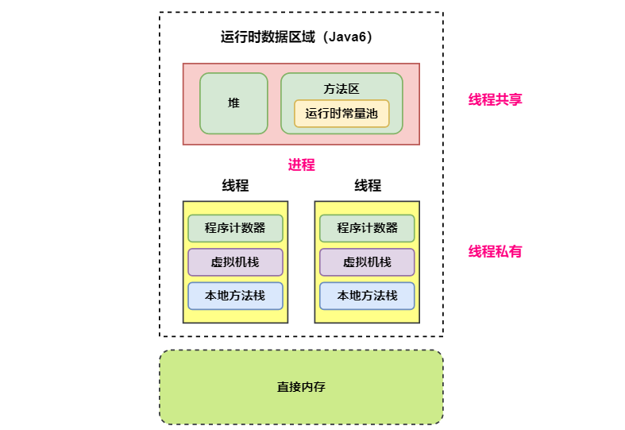

以下是 **Java8** 版本的**运行时数据区**，方法区由**元空间**实现。**元空间**存在于**直接内存**中。

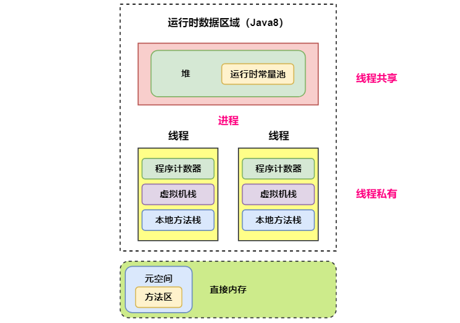

##### 1. 程序计数器

线程**私有**。程序计数器用于记录正在执行的虚拟机**字节码指令的地址**（如果正在执行的是本地方法则为空）。可以看成是当前线程执行字节码的**行号指示器**，每执行一句代码都会改变程序计数器。

**每个线程**都需要有一个**独立的程序计数器**，各个线程之间计数器**互不影响**，独立存储，使线程切换后能够恢复到正确的执行位置。

此内存区域是唯一一个**没有**规定 **OutOfMemoryError** 的区域。程序计数器私有主要是为了**线程切换后能恢复到正确的执行位置**。

##### 2. 虚拟机栈

###### (1) 概述

线程**私有**。

**栈内存**说的就是**虚拟机栈**，这里的栈也就是基于平时的普通 **LIFO** 栈实现的，里面存放的就是一个个的**栈帧**。每个**方法**在执行的同时会**创建一个栈帧**用于存储局部变量表、操作数栈、常量池引用、返回地址（方法出口）等信息。从**方法调用**直至执行完成的过程，就对应着一个**栈帧**在 Java 虚拟机栈中**入栈和出栈**的过程。

程序中的**局部变量**就是存放在**栈帧**上的。**局部变量表主要存放了编译器可知的各种数据类型**（boolean、byte、char、short、int、float、long、double）、**对象引用**（reference 类型，它不同于对象本身，可能是一个指向对象起始地址的引用指针，也可能是指向一个代表对象的句柄或其他与此对象相关的位置）。

程序中每执行一个**方法**都会分配一个**栈帧**来保存方法内的**各种数据**。栈及栈帧结构如下。

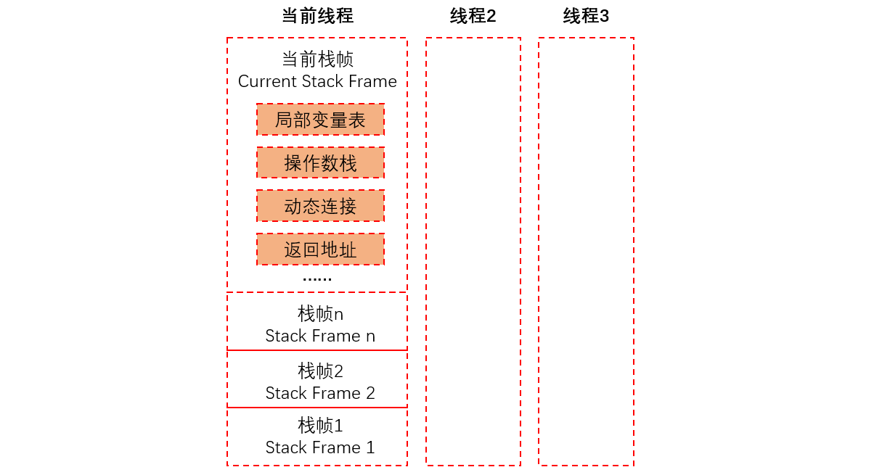

进行数值计算的时候，会把**变量值加载到操作数栈**进行操作。比如求 a + b 的值，就会把 a 和 b 都加载到操作数栈并进行计算。

###### (2) 参数配置

可以通过 **-Xss** 这个虚拟机参数来指定**每个线程**的 Java 虚拟机**栈内存**大小（记忆：**ss = stack size**）：

```java
java -Xss512M TestJava
```

-Xss 设置越小，栈深值越小，说明一个线程栈里能分配的栈帧就越少，但是对 JVM 整体来说能开启的线程数会更多。

虚拟机栈该区域可能抛出以下两种异常：

- 当**线程请求的栈深度超过最大值**，会抛出 **StackOverflowError** 异常；
- **栈**可以进行**动态扩展**，但如果无法申请到**足够内存**，会抛出 **OutOfMemoryError** 异常。

> **扩展：方法如何调用？**

虚拟机栈可用类比数据结构中**栈**，虚拟机栈中保存的主要内容是**栈帧**，每一次函数调用都会有一个对应的**栈帧被压入虚拟机栈**，每一个函数调用结束后，都会有一个栈帧被弹出。Java 方法有两种返回方式：

1. return 语句。
2. 抛出异常。

不管哪种返回方式都会**导致栈帧被弹出**。

##### 3. 本地方法栈

本地方法栈与 Java 虚拟机栈类似，它们之间的区别只不过是虚拟机栈为虚拟机执行 Java 方法服务，而本地方法栈则为虚拟机使用 **Native 方法**服务。也是线程**私有**的。

本地方法一般是用其它语言（C、C++ 或汇编语言等）编写的，并且被编译为基于本机硬件和操作系统的程序，对待这些方法需要特别处理。本地方法被执行的时候，在本地方法栈也会创建一个**栈帧**，用于存放该本地方法的局部变量表、操作数栈、动态链接、出口信息。方法执行完毕后相应的栈帧也会出栈并释放内存空间，也可能会出现 **StackOverFlowError 和 OutOfMemoryError** 两种异常。


总结：为了**保证线程中的局部变量不被别的线程访问到**，虚拟机栈和本地方法栈**都是线程私有**的。

##### 4. 堆

###### (1) 概述

线程**共享**。所有==**对象实例**==及数组都在这里分配**内存**，是**垃圾收集的主要区域**（"**GC 堆**"）。现代的垃圾收集器基本都是采用**分代收集算法**，其主要的思想是针对**不同类型的对象**采取不同的垃圾回收算法。可以大致将堆分成**新生代**（Young Generation）与**老年代**（Old Generation）两块。

###### (2) OutOfMemoryError异常

堆不需要连续内存，并且可以**动态增加**其内存，增加失败会抛出 **OutOfMemoryError** 异常。并且出现这种错误之后的表现形式还会有几种：

- **OutOfMemoryError: GC Overhead Limit Exceeded**：当 JVM 花太多时间执行垃圾回收并且只能回收很少的堆空间时，就会发生此错误。
- **java.lang.OutOfMemoryError: Java heap space**：假如在创建新的对象时, 堆内存中的空间不足以存放新创建的对象，就会引发 java.lang.OutOfMemoryError: Java heap space 错误。(和本机物理内存无关，和配置的内存大小有关！)

###### (3) 参数配置

可以通过 ==**-Xms 和 -Xmx**== 这两个虚拟机参数来指定一个程序的**堆内存**大小，第一个参数设置**初始值**，第二个参数设置**最大值**。

```java
java -Xms1M -Xmx2M HackTheJava
```

###### (4) 实例对象在内存中存储在哪？

**==如果实例对象存储在堆区时==**：实例对象内存存在**堆区**，实例的**引用**存在**栈上**，实例的**元数据 Class 存在方法区或者元空间**。

**实例对象**也**不一定存在堆区**的。不一定，如果实例对象**没有线程逃逸行为**，那么是**有可能**在线程的**栈上创建实例**的。

##### 5. 方法区

###### (1) 概述

线程**共享区域**。用于存放已被加载的**类信息、常量、==静态变量==、即时编译器编译后的代码**等数据。**方法区是一个 JVM 规范，==永久代与元空间都是其一种实现方式==**。在 JDK1.8 之后，原来**永久代**的数据被分到了==**堆和元空间**==中。

**与堆的联系**：**静态变量**的定义（类的元信息）在**方法区**（永久代或者元空间中），但是其**实际引用**的对象是在**堆**中，这就是联系了。

**异常**：和堆一样不需要连续的内存，并且可以动态扩展，动态扩展失败一样会抛出 **OutOfMemoryError** 异常。

**垃圾回收**：对这块区域进行垃圾回收的主要目标是对**常量池的回收和对类的卸载**，但是一般比较难实现，回收效果与效率很低。

###### (2) 元空间

为了更容易管理方法区，JDK 1.8 移除了永久代，并把**方法区移至==元空间==**，它位于**直接内存**中。

> **方法区与永久代和元空间的关系**

《Java 虚拟机规范》只是规定了有方法区这么个概念和它的作用，并没有规定如何去实现它。所以在不同的 JVM 上方法区的实现就可能是不同的。 **方法区和永久代的关系很像 Java 中接口和类的关系，类实现了接口。方法区就是定义的标准定义的接口，而永久代就是 HotSpot 虚拟机对虚拟机规范中方法区的一种实现方式，元空间则是另一种实现方式。** 也就是说，**永久代和元空间是 HotSpot 的概念**，**方法区是 Java 虚拟机规范**中的定义，是一种规范，而永久代是一种实现，一个是标准一个是实现，其他的虚拟机实现并没有永久代这一说法。

>  **为什么要将永久代 (PermGen) 替换为元空间 (MetaSpace) ?**

整个永久代有一个 JVM 本身**设置固定大小上限**，无法进行调整，而**元空间使用的是直接内存**，受本机可用内存的限制，虽然元空间仍旧可能溢出，但是比原来出现的几率会更小。元空间里面存放的是**类的元数据**，这样加载多少类的元数据就不由 MaxPermSize 控制了, 而由系统的实际可用空间来控制，这样能加载的类就更多了。

###### (3) 参数配置

JDK1.7 及之前，设置永久代的参数：

```java
-XX:PermSize  	// 设置永久代最小空间大小。
-XX:MaxPermSize //设置永久代最大空间大小。
```

JDK 1.8 元空间使用的是**直接内存**，设置参数为：

```java
-XX:MetaspaceSize = N 		// 设置Metaspace的初始（和最小大小）
-XX:MaxMetaspaceSize = N 	// 设置Metaspace的最大大小
```

##### 6. 运行时常量池

###### (1) 概述

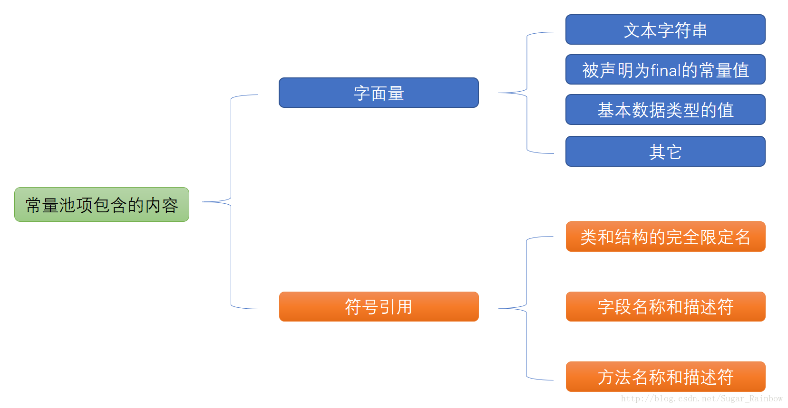

JDK7 之前运行时常量池是**方法区**的一部分。**Class 文件**中的**常量池**（**编译器**时生成的字面量和符号引用）会在**类加载**后被放入这个区域。除了在编译期生成的常量，还允许**动态生成**（即**运行期间**将新的常量放入池中），例如 String 类的 intern()。

**JDK1.7 及之后版本的 JVM 已经将运行时常量池从方法区中移了出来，在 Java 堆（Heap）中开辟了一块区域存放运行时常量池。**

Class 常量池可以理解为是 **Class 文件中的资源仓库**。 Class 文件中除了包含类的版本、字段、方法、接口等描述信息外，还有一项信息就是**常量池(constant pool table)**，用于存放编译期生成的各种**字面量(Literal)和符号引用(Symbolic References)**。

先看一个类 Math.class。

```java
package com.nano.jvm;

public class Math {
    public Math() {
    }

    public int compute() {
        int a = 1;
        int b = 2;
        int c = (a + b) * 10;
        return c;
    }

    public static void main(String[] args) {
        Math math = new Math();
        math.compute();
    }
}
```

下面是编译后的 Math.class 的文件。

```java
cafe babe 0000 0034 001e 0a00 0500 1a07
001b 0a00 0200 1a0a 0002 001c 0700 1d01
0006 3c69 6e69 743e 0100 0328 2956 0100
0443 6f64 6501 000f 4c69 6e65 4e75 6d62
6572 5461 626c 6501 0012 4c6f 6361 6c56
6172 6961 626c 6554 6162 6c65 0100 0474
6869 7301 0013 4c63 6f6d 2f6e 616e 6f2f
6a76 6d2f 4d61 7468 3b01 0007 636f 6d70
7574 6501 0003 2829 4901 0001 6101 0001
4901 0001 6201 0001 6301 0004 6d61 696e
0100 1628 5b4c 6a61 7661 2f6c 616e 672f
5374 7269 6e67 3b29 5601 0004 6172 6773
0100 135b 4c6a 6176 612f 6c61 6e67 2f53
7472 696e 673b 0100 046d 6174 6801 000a
536f 7572 6365 4669 6c65 0100 094d 6174
682e 6a61 7661 0c00 0600 0701 0011 636f
6d2f 6e61 6e6f 2f6a 766d 2f4d 6174 680c
000d 000e 0100 106a 6176 612f 6c61 6e67
2f4f 626a 6563 7400 2100 0200 0500 0000
0000 0300 0100 0600 0700 0100 0800 0000
2f00 0100 0100 0000 052a b700 01b1 0000
0002 0009 0000 0006 0001 0000 0009 000a
0000 000c 0001 0000 0005 000b 000c 0000
0001 000d 000e 0001 0008 0000 0061 0002
0004 0000 000d 043c 053d 1b1c 6010 0a68
3e1d ac00 0000 0200 0900 0000 1200 0400
0000 1000 0200 1100 0400 1200 0b00 1300
0a00 0000 2a00 0400 0000 0d00 0b00 0c00
0000 0200 0b00 0f00 1000 0100 0400 0900
1100 1000 0200 0b00 0200 1200 1000 0300
0900 1300 1400 0100 0800 0000 4a00 0200
0200 0000 0ebb 0002 59b7 0003 4c2b b600
0457 b100 0000 0200 0900 0000 0e00 0300
0000 1700 0800 1800 0d00 1900 0a00 0000
1600 0200 0000 0e00 1500 1600 0000 0800
0600 1700 0c00 0100 0100 1800 0000 0200
```

一般不会去人工解析这种 16 进制的**字节码文件**，可以通过 **javap 命令生成更可读的 JVM 字节码指令文件**：

```java
javap -v Math.class
```

编译后得到的 **Constant Pool** 就是**常量池信息**。

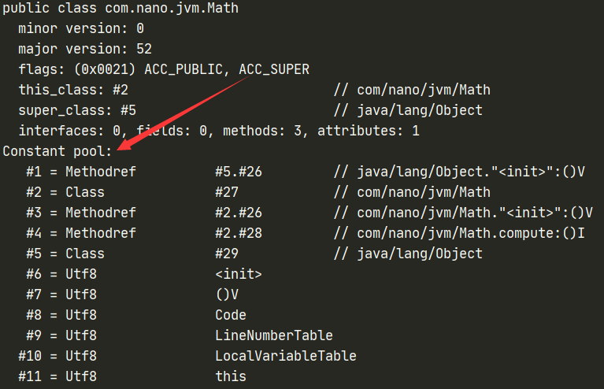

**常量池**中主要存放两大类常量：**字面量和符号引用**。

**(1) 字面量**：**指由字母、数字等构成的字符串或者数值常量**。

字面量指等号**右边直接赋的值**，如：int a = 1 这里的 a 为左值，1 为右值。在这个例子中 1 就是字面量。

```java
int a = 1;
int b = 2;
int c = "abcdefg";
```

**(2) 符号引用**：符号引用是**编译原理**中的概念，是相对于**直接引用**来说的。主要包括了以下三类常量：

- 类和接口的**全限定名**。
- 字段的**名称和描述符**。
- 方法的**名称和描述符**。

上面的 a，b 就是字段名称，就是一种**符号引用**，还有 Math 类常量池里的 Lcom/nano/jvm/Math; 是类的**全限定名**， main 和 compute 是方法**名称**，() 是一种 UTF8 格式的描述符，这些都是符号引用。

这些常量池现在是**静态信息**，可以看成是**静态常量池**，只有到**运行时被加载到内存**后，这些符号才有对应的**内存地址**信息，这些常量池一旦被装入内存就变成**运行时常量池**，对应的**符号引用**在程序**加载或运行**时会被**转变为被加载到==内存==区域的代码的直接引用**，也就是**动态链接**。

例如，compute() 这个**符号引用**在运行时就会被转变为 compute() 方法具体**代码在方法区内存中的地址**，主要通过对象头里的**类型指针去转换直接引用**。

###### (2) 字符串常量池

> **字符串常量池的设计思想**

字符串的**分配**和其他的对象分配一样，耗费高昂的时间与空间代价，作为最基础的数据类型，大量频繁的创建字符串，极大程度地影响程序的性能。JVM 为了提高性能和减少内存开销，在实例化**字符串常量**的时候进行了一些**优化**：

- 为字符串字面量开辟一个**字符串常量池**，类似于**缓存区**。
- 创建**字符串常量**时，首先**查询字符串常量池是否存在该字符串**。
- 存在该**字符串**，返回**引用实例**，不存在，**实例化该字符串并放入池**中。

> **三种字符串操作**

- **直接赋值字符串**

```java
String s = "Lucy";  // s指向常量池中的引用
```

这种方式创建的字符串对象，**只会在常量池**中。因为有"Lucy"这个字面量，创建对象 s 的时候，JVM 会先去常量池中通过 equals(key) 方法，判断是否有相同的对象。如果有，则直接返回该对象在常量池中的引用；如果没有，则会在常量池中创建一个新对象，再返回引用。

- **new String();**

```java
String s1 = new String("Lucy");  // s1指向内存中的对象引用
```

这种方式会**保证字符串常量池和堆中都有这个对象**，没有**就创建**，最后**返回内存中的对象引用**。步骤大致如下：因为有 "Lucy" 这个字面量，所以会先检查字符串常量池中是否存在字符串 "Lucy"。如果不存在，先在字符串常量池里创建一个字符串对象；再去内存中创建一个字符串对象 "Lucy"；存在的话，就直接去内存中创建一个字符串对象 "Lucy"；最后，将**内存中的引用返回**。

- **intern() 方法**

```java
String s1 = new String("hello");   
String s2 = s1.intern();

System.out.println(s1 == s2);
```

String 中的 intern 方法是一个 **native** 的方法，当调用 intern 方法时，如果池中已经包含一个等于此 String 对象的字符串（用 equals(oject) 方法确定），则返回**池中**的字符串。**否则，将 intern 返回的引用指向当前字符串 s1**(Jdk1.6 版本需要将 s1 复制到字符串常量池里)。

> **字符串常量池位置**

- Jdk1.6 及之前： 有永久代，运行时常量池在**永久代**，运行时常量池包含字符串常量池。

- Jdk1.7：虽然有永久代但已经逐步“去永久代”，字符串常量池从永久代里的运行时常量池分离到**堆里**。

- Jdk1.8及之后： 无永久代，**运行时常量池在元空间**，**字符串常量池里依然在堆里**。

用一个程序证明下字符串常量池在哪里：

```java
/**
 * VM Args： -Xms10M -Xmx10M
 */
public class RuntimeConstantPoolOOM {
    public static void main(String[] args) {

        ArrayList<String> list = new ArrayList<>();
        for (int i = 0; i < 100000000; i++) {
            for (int j = 0; j < 1000000; j++) {
                list.add(String.valueOf(i + j / 1000000).intern());  //
            }
        }
    }
}
```

运行结果：

```java
jdk7及以上：Exception in thread "main" java.lang.OutOfMemoryError: Java heap space
jdk6：Exception in thread "main" java.lang.OutOfMemoryError: PermGen space
```

> **字符串常量池设计原理**

字符串常量池底层是 hotspot 的 C++ 实现的，底层是一个 **HashTable**， 保存的**本质上是字符串对象的引用**。

看一道比较常见的面试题，下面的代码创建了多少个 String 对象？

```java
String s1 = new String("he") + new String("llo");
String s2 = s1.intern();
 
System.out.println(s1 == s2);
// 在JDK1.6下输出是 false，创建 6个对象
// 在 JDK1.7及以上的版本输出是true，创建了5个对象
// 这里没有考虑GC，但这些对象确实存在或存在过
```

为什么输出会有这些变化呢？主要还是**字符串池从永久代中脱离、移入堆区的原因**， intern() 方法也相应发生了变化：

(1) 在 JDK 1.6 中，调用 **intern**() 首先会在字符串池中寻找 equal() 相等的字符串，假如字符串存在就返回该字符串在字符串池中的引用；假如字符串不存在，虚拟机会重新在**永久代上创建一个实例**，将 StringTable 的一个表项指向这个新创建的实例。

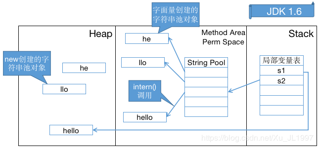

 

(2) 在 JDK 1.7 (及以上版本)中，由于**字符串池不在永久代**了，intern() 做了一些修改，更方便地利用**堆中**的对象。字符串存在时和 JDK 1.6一样，但是字符串**不存在时不再需要重新创建实例，可以直接指向堆上的实例**。

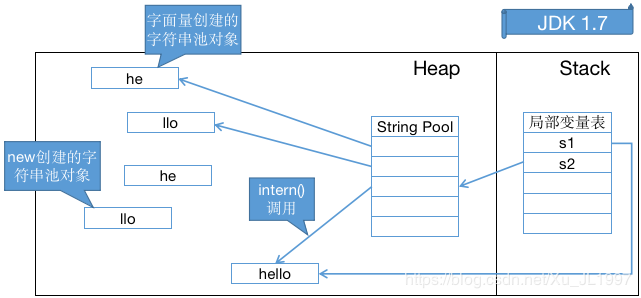

 

由上面两个图，也不难理解为什么 JDK 1.6 字符串池溢出会抛出 OutOfMemoryError: PermGen space ，而在 JDK 1.7 及以上版本抛出 OutOfMemoryError: Java heap space 。

> **String常量池问题的几个例子**

示例 1：

```java
String s0 = "Lucy";
String s1 = "Lucy";
String s2 = "Lu" + "cy";
System.out.println(s0 == s1); //true
System.out.println(s0 == s2); //true
```

分析：因为例子中的 s0 和 s1中的 "Lucy" 都是**字符串常量**，它们在**编译期就被确定**了，所以 s0\==s1 为 true；而 "Lu" 和 "cy" 也都是字符串常量，当一个字符串由多个字符串常量连接而成时，它自己肯定也是字符串常量，所以 s2 也同样在编译期就被**优化**为一个字符串常量 "Lucy"，所以 s2 也是常量池中 "Lucy" 的一个引用。所以 s0\==s1==s2。

示例 2：

```java
String s0 = "Lucy";
String s1 = new String("Lucy");
String s2 = "Lu" + new String("cy");
System.out.println(s0 == s1);　　// false
System.out.println(s0 == s2);　 // false
System.out.println(s1 == s2);　　// false
```

分析：用 new String() 创建的字符串**不是常量**，**不能在编译期就确定**，所以 new String() 创建的字符串**不放入常量池**中，它们**有自己的地址空间**。s0 还是常量池中 "Lucy" 的引用，s1 因为无法在编译期确定，所以是**运行时创建的新对象 "Lucy" 的引用，s2 因为有后半部分 new String("cy") 所以**也无法在编译期确定，所以也是一个**新创建**对象 "Lucy" 的引用。

示例 3：

```java
String a = "a1";
String b = "a" + 1;
System.out.println(a == b); // result = true 

String a = "atrue";
String b = "a" + "true";
System.out.println(a == b); // result = true 

String a = "a3.4";
String b = "a" + 3.4;
System.out.println(a == b); // result = true
```

分析：JVM 对于**字符串常量**的 "+ "号连接，将在**程序编译期**时就将常量字符串的 "+" 连接**优化为连接后的值**，比如 "a" + 1 来说，经编译器优化后在 class 中就已经是 "a1"。在**编译期其字符串常量的值就确定下**来，故上面程序最终的结果都为 true。

示例 4：

```java
String a = "ab";
String bb = "b";
String b = "a" + bb;

System.out.println(a == b); // result = false
```

分析：JVM 对于**字符串引用**，由于在字符串的 "+" 连接中，有**字符串引用存在**，而引用的值在**程序编译期是无法确定**的，即 "a" + bb **无法被编译器优化**，只有在程序运行期来动态分配并将连接后的新地址赋给 b。所以上面程序的结果也就为false。

示例 5：

```java
String a = "ab";
final String bb = "b";
String b = "a" + bb;

System.out.println(a == b); // result = true
```

分析：和示例 4 中唯一不同的是 bb 字符串加了 **final 修饰**，对于 final 修饰的变量，它在**编译时被解析为常量值**的一个本地拷贝存储到自己的常量池中或嵌入到它的字节码流中。所以此时的 "a" + bb 和 "a" + "b" 效果是**一样**的。故上面程序的结果为 true。

示例 6：

```java
String a = "ab";
final String bb = getBB();
String b = "a" + bb;

System.out.println(a == b); //result = false

private static String getBB() {  
    return "b";  
}
```

分析：JVM 对于**字符串引用 bb**，它的值在编译期**无法确定**，只有在程序运行期调用方法后，将方法的返回值和 "a" 来动态连接并分配地址为 b，故上面 程序的结果为 false。

**关于String是不可变的**，通过上面例子可以得出得知：

```java
String  s  =  "a" + "b" + "c";  // 就等价于String s = "abc";
String  a  =  "a";
String  b  =  "b";
String  c  =  "c";
String  s1  =   a  +  b  +  c;
```

s1 就不一样了，可以通过观察其 **JVM 指令码**发现 s1 的 "+" 操作会变成如下操作：

```java
StringBuilder temp = new StringBuilder();
temp.append(a).append(b).append(c);
String s = temp.toString();
```

 **最后再看一个例子**：

```java
// 字符串常量池："计算机"和"技术"  堆内存：str1引用的对象"计算机技术"  
// 堆内存中还有个StringBuilder的对象，但是会被gc回收，StringBuilder的toString方法会new String()，这个String才是真正返回的对象引用
String str2 = new StringBuilder("计算机").append("技术").toString();   //没有出现"计算机技术"字面量，所以不会在常量池里生成"计算机技术"对象
System.out.println(str2 == str2.intern());  // true
// 计算机技术在池中没有，但是在heap中存在，则intern时，会直接返回该heap中的引用

// 字符串常量池："ja"和"va" 堆内存：str1引用的对象"java"  
// 堆内存中还有个StringBuilder的对象，但是会被gc回收，StringBuilder的toString方法会new String()，这个String才是真正返回的对象引用
// 没有出现"java"字面量，所以不会在常量池里生成"java"对象
String str1 = new StringBuilder("ja").append("va").toString();    
System.out.println(str1 == str1.intern());  // false
// java是关键字，在JVM初始化的相关类里肯定早就放进字符串常量池了

String s1 = new String("test");  
System.out.println(s1 == s1.intern());   // false
// "test"作为字面量，放入了池中，而new时s1指向的是heap中新生成的string对象，s1.intern()指向的是"test"字面量之前在池中生成的字符串对象

String s2 = new StringBuilder("abc").toString();
System.out.println(s2 == s2.intern());  // false
```

##### 7. 直接内存

**直接内存并不是虚拟机运行时数据区的一部分，也不是虚拟机规范中定义的内存区域，但是这部分内存也被频繁地使用。而且也可能导致 OutOfMemoryError 错误出现。**

**元空间**就是在直接内存中。

大量 NIO 操作会用到**直接内存**。在 JDK 1.4 中新引入了 ==**NIO 类**==，它可以使用 Native 函数库直接分配**堆外内存**，然后通过 Java 堆里的 **DirectByteBuffer** 对象作为这块内存的引用进行操作。这样能在一些场景中显著提高性能，因为**避免**了在堆内存和堆外内存来回**拷贝**数据。

直接内存的分配**不会受到 Java 堆**大小的限制，但是受到本机总内存限制。

##### 8. 综合实例

看一个 Test 类：

```java
public class Test {
	// 计算方法 一个方法对应一个栈帧
	public int compute() {
		int a = 1;
		int b = 2;
		int c = (a + b) * 10;
		return c;
	}
	// main方法
	public static void main(String[] args) {
		Test test = new Test();
		test.compute();
	}
}
```

使用 **javap -c** 对 Test.class 类进行**反编译**得到如下字节码指令。

```java
D:\code\JavaNotesCode\jvm\target\classes\com\nano\jvm>javap -c Math.class
Compiled from "Math.java"
public class com.nano.jvm.Math {
  public com.nano.jvm.Math();
    Code:
       0: aload_0
       1: invokespecial #1                  // Method java/lang/Object."<init>":()V
       4: return
  // 计算方法	
  public int compute();
    Code:
       0: iconst_1
       1: istore_1
       2: iconst_2
       3: istore_2
       4: iload_1
       5: iload_2
       6: iadd
       7: bipush        10
       9: imul
      10: istore_3
      11: iload_3
      12: ireturn

  // main方法        
  public static void main(java.lang.String[]);
    Code:
       0: new           #2                  // class com/nano/jvm/Math
       3: dup
       4: invokespecial #3                  // Method "<init>":()V
       7: astore_1
       8: aload_1
       9: invokevirtual #4                  // Method compute:()I
      12: pop
      13: return
}
```

可以看到两个方法都被反编译出来。Code 下面各个字节码指令之前的号码就可以看成是**行号**，**程序计数器**就是记录执行时的这些行号。上面的计算过程可以通过下面的**架构**表示：

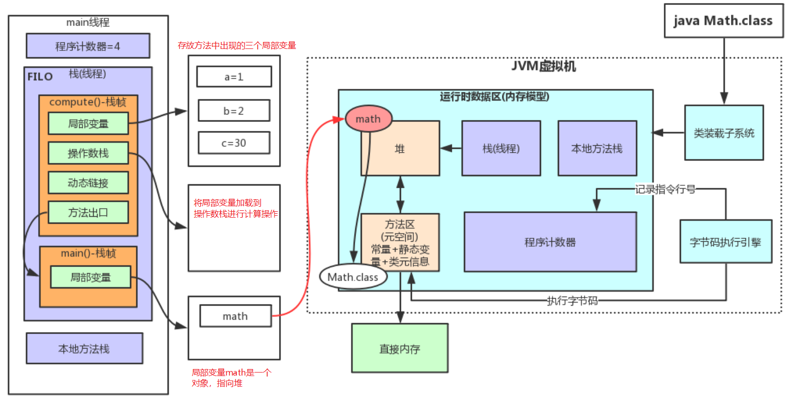

可以看到这个 main 线程中**分配了两个栈帧**，一个是 **main 方法的栈帧**，一个是 **compute 方法的栈帧**，**局部变量 a b c 都在局部变量表中，计算 a + b 的时候需要把它们加载到操作数栈进行加法**，具体可以看字节码的指令就是这个过程。

在 main 方法对应的栈帧中，**math 变量**是一个**普通对象**，它指向**堆中**的实例。

栈溢出 **StackOverflowError** demo。设置 -Xss128k。这里 128K 指的是**一个线程**的最大栈空间，而不是全部线程。

```java
// JVM设置  -Xss128k(默认1M)
public class StackOverflowTest {
    // 记录栈深度
    static int count = 0;
    
    static void redo() {
        count++;
        redo();
    }

    public static void main(String[] args) {
        try {
            redo();
        } catch (Throwable t) {
            t.printStackTrace();
            System.out.println(count);
        }
    }
}
```

运行结果，栈溢出：

```java
java.lang.StackOverflowError
    at com.tuling.jvm.StackOverflowTest.redo(StackOverflowTest.java:12)
    at com.tuling.jvm.StackOverflowTest.redo(StackOverflowTest.java:13)
    at com.tuling.jvm.StackOverflowTest.redo(StackOverflowTest.java:13)
    ......   
```

这里一直递归调用一个方法，直到**栈溢出**，打印出当前线程可以调用的最大深度。

再使用 **javap -v** 参数**反编译** Math.class，可以看到反编译出**更多的信息**。

```java
D:\code\2_Study\JavaNotesCode\jvm\target\classes\com\nano\jvm>javap -v Math.class
Classfile /D:/code/2_Study/JavaNotesCode/jvm/target/classes/com/nano/jvm/Math.class
  Last modified 2020年6月19日; size 577 bytes
  MD5 checksum bc7052bfb6a3c55c76b7fd36721067da
  Compiled from "Math.java"
public class com.nano.jvm.Math
  minor version: 0
  major version: 52
  flags: (0x0021) ACC_PUBLIC, ACC_SUPER
  this_class: #2                          // com/nano/jvm/Math
  super_class: #5                         // java/lang/Object
  interfaces: 0, fields: 0, methods: 3, attributes: 1

// 常量池信息      
Constant pool:
   #1 = Methodref          #5.#26         // java/lang/Object."<init>":()V
   #2 = Class              #27            // com/nano/jvm/Math
   #3 = Methodref          #2.#26         // com/nano/jvm/Math."<init>":()V
   #4 = Methodref          #2.#28         // com/nano/jvm/Math.compute:()I
   #5 = Class              #29            // java/lang/Object
   #6 = Utf8               <init>
   #7 = Utf8               ()V
   #8 = Utf8               Code
   #9 = Utf8               LineNumberTable
  #10 = Utf8               LocalVariableTable
  #11 = Utf8               this
  #12 = Utf8               Lcom/nano/jvm/Math;
  #13 = Utf8               compute
  #14 = Utf8               ()I
  #15 = Utf8               a
  #16 = Utf8               I
  #17 = Utf8               b
  #18 = Utf8               c
  #19 = Utf8               main
  #20 = Utf8               ([Ljava/lang/String;)V
  #21 = Utf8               args
  #22 = Utf8               [Ljava/lang/String;
  #23 = Utf8               math
  #24 = Utf8               SourceFile
  #25 = Utf8               Math.java
  #26 = NameAndType        #6:#7          // "<init>":()V
  #27 = Utf8               com/nano/jvm/Math
  #28 = NameAndType        #13:#14        // compute:()I
  #29 = Utf8               java/lang/Object
{
  public com.nano.jvm.Math();
    descriptor: ()V
    flags: (0x0001) ACC_PUBLIC
    Code:
      stack=1, locals=1, args_size=1
         0: aload_0
         1: invokespecial #1                  // Method java/lang/Object."<init>":()V
         4: return
      LineNumberTable:
        line 9: 0
      LocalVariableTable:
        Start  Length  Slot  Name   Signature
            0       5     0  this   Lcom/nano/jvm/Math;

  public int compute();
    descriptor: ()I
    flags: (0x0001) ACC_PUBLIC
    Code:
      stack=2, locals=4, args_size=1
         0: iconst_1
         1: istore_1
         2: iconst_2
         3: istore_2
         4: iload_1
         5: iload_2
         6: iadd
         7: bipush        10
         9: imul
        10: istore_3
        11: iload_3
        12: ireturn
      LineNumberTable:
        line 16: 0
        line 17: 2
        line 18: 4
        line 19: 11
      LocalVariableTable:
        Start  Length  Slot  Name   Signature
            0      13     0  this   Lcom/nano/jvm/Math;
            2      11     1     a   I
            4       9     2     b   I
           11       2     3     c   I

  public static void main(java.lang.String[]);
    descriptor: ([Ljava/lang/String;)V
    flags: (0x0009) ACC_PUBLIC, ACC_STATIC
    Code:
      stack=2, locals=2, args_size=1
         0: new           #2                  // class com/nano/jvm/Math
         3: dup
         4: invokespecial #3                  // Method "<init>":()V
         7: astore_1
         8: aload_1
         // 这里调用#4，可以去常量池中看#4是对应的就是compute符号
         9: invokevirtual #4                  // Method compute:()I
        12: pop
        13: return
      LineNumberTable:
        line 23: 0
        line 24: 8
        line 25: 13
      LocalVariableTable:
        Start  Length  Slot  Name   Signature
            0      14     0  args   [Ljava/lang/String;
            8       6     1  math   Lcom/nano/jvm/Math;
}
SourceFile: "Math.java"
```

个人理解：一个程序的执行也就是**执行的 JVM 的字节码指令**，这些指令是被**存放到方法区**中的，它们都有**各自的入口地址**。当一个栈上的**方法需要执行**时，就需要将方法中的符号（**符号引用**）对应到**方法区中的入口地址（直接引用）**，这样字节码执行引擎**才能获取到字节码并执行方法**。符号引用转换为直接应用的过程就是解析中的链接，这里就有**静态链接和动态链接**。 

**常量池**里面就有很多东西，其中就有一系列的**符号**，代表着**类名称，方法名称**等。对象头里面的指针找到方法区中对应方法所对应的**字节码**的**入口地址**，并放到栈帧的**动态链接**部分中。这也就是符号引用转换为 JVM 指令码地址的直接引用。其实解析阶段的静态链接和动态链接做的事情其实都差不多，其实也就是将方法符号引用转换为对应的**字节码**的**入口地址**（也就是**直接引用**）的过程，只是静态方法等在类加载的时候就完成了，所以是静态链接，而普通方法是在运行的时候完成，所以是动态链接。如果是运行时再去寻找符号引用所对应的 JVM 字节码的入口地址，那就比较灵活了，就可以得到**不同**的入口地址，进而实现**多态**。

下图是堆的结构图。新 new 的对象一般是分配在 Eden 区，如果对象太大也可能直接分配到老年代中。

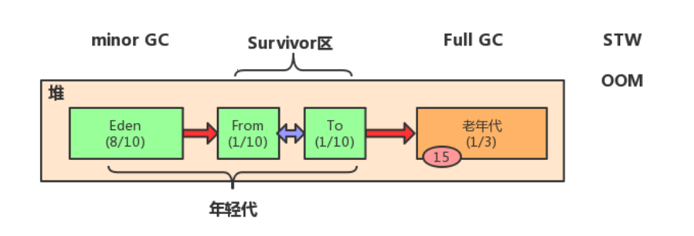

Eden 区满了就会触发 Minor GC，是对 Eden 区及 Survivor 中的对象进行回收。比如一个线程执行完了，那么栈帧没了，栈帧中指向对堆中的引用就消失了，这些对象就会被回收。垃圾收集就是靠字节码执行引擎开启垃圾收集线程。每次 Minor GC 会将 Eden 以及 Survivor 中一个区域（假设为 From 区）的存活对象移动到 Survivor 中的另一个区，再经历一次 Minor GC 就会再次将Eden 以及 Survivor 中（From）的存活对象放到 Survivor 中的另一个区中（假设为 To 区），下一次 Minor GC 又会挪到 From 区，也就是 Survivor 区总有一个区是干净的。每经历一次 Minor GC，那么对象头中的年龄计数器就会 + 1，如果到了一定的年龄，对象就会被放到老年代中。当老年代满了就会执行 Full GC。

##### 9. JVM参数配置总结

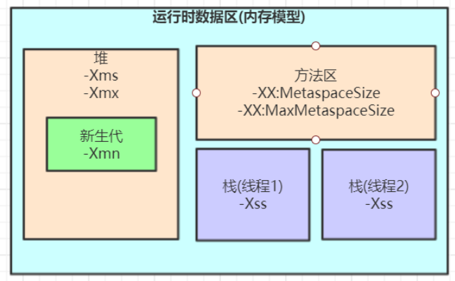

**Spring Boot 程序**的 JVM 参数设置格式：

```java
java ‐Xms2048M ‐Xmx2048M ‐Xmn1024M ‐Xss512K ‐XX:MetaspaceSize=256M ‐XX:MaxMetaspaceSize=256M ‐jar microservice‐eureka‐server.jar
```

Tomcat 启动直接加在 bin 目录下 catalina.sh 文件里。

**JVM 参数大小设置并没有固定标准，需要根据实际项目情况分析。**

对于 Spring 项目，一般容器内的**核心对象**（如各种 Service 对象）经过多次 Minor GC 后会被分配到**老年代**中，而一些用于**处理业务的临时对象尽量控制其在新生代**中，比如处理一个订单中有一些订单对象是临时的，使用完后让其在新生代被回收掉即可，别让它们存活太多导致移动到老年代中了。


#### 对象创建过程

在语言层面上，创建对象（例如克隆、反序列化）通常仅仅是一个 **new** 关键字而己，而在虚拟机中，对象（指普通 Java 对象，**非数组和Class 对象**等） 的创建是一个非常复杂的过程。

> **new一个对象发生了什么？**


记住一点：**只要使用 new 方法，便需要创建新的对象。**

##### 1. 类加载检查

首先检查这个类**是否已被**加载、解析和初始化过。如果没有，那必须**先执行**相应的**类加载过程**。

##### 2. 内存分配

在**类加载检查**通过后，接下来虚拟机将为新生对象**分配内存**。对象所需的内存大小在**类加载完成后便可确定**，为对象分配空间的任务就是把一块确定大小的内存从 Java 堆中划分出来。

###### (1) 内存分配方式

**内存分配方式**有 **"指针碰撞"** 和 **"空闲列表"** 两种，**选择那种分配方式根据堆是否规整决定，而堆是否规整又由所采用的垃圾收集器是否带有压缩整理功能决定**。

- 假设 Java 堆中**内存是绝对规整**的，就仅仅是把指针向空闲空间那边挪动一段与对象大小相等的距离，这种分配方式称为**"指针碰撞"**（ Bump the Pointer）。

- 如果 Java 堆中的**内存并不是规整**的，已使用的内存和空闲的**内存相互交错**，虚拟机就必须维护一个列表，记录哪些内存块是可用的， 在分配的时候从列表中找到一块足够大的空间划分给对象实例， 并更新列表上的记录，这种分配方式称为 **"空闲列表"** (Free List)。

因此，在使用 Serial、ParNew 等带 Compact（紧凑）过程的收集器时，系统采用的分配算法是**指针碰撞**，而使用 CMS 这种基于 Mark-Sweep 算法的收集器时，通常采用**空闲列表**。

###### (2) 内存分配并发问题

创建对象的时候有一个很重要的问题就是**线程安全**，在实际开发过程中，创建对象是很频繁的事情，作为虚拟机来说，必须要保证线程是安全的，通常来讲，**虚拟机采用两种方式来保证线程安全**：

- **CAS + 失败重试：** CAS 是乐观锁的一种实现方式。所谓乐观锁就是，每次不加锁而是假设没有冲突而去完成某项操作，如果因为冲突失败就重试，直到成功为止。**虚拟机采用 CAS 配上失败重试的方式保证更新操作的原子性。**
- **TLAB：** 为每一个线程预先在 **Eden 区**分配一块内存，JVM 在给线程中的对象分配内存时，**首先在 TLAB 分配**，当对象大于 TLAB 中的剩余内存或 TLAB 的内存已用尽时，再采用上述的 CAS 进行内存分配。

##### 3. 初始化零值

初始化零值给属性设置**==默认值==**。内存分配完成后，虚拟机需要将分配到的**内存空间都初始化为零值**（不包括对象头），这一步操作保证了对象的**实例字段**在代码中可以**不赋初始值**就直接使用，程序能访问到这些字段的数据类型所对应的零值。

##### 4. 设置对象头

初始化零值完成之后，**虚拟机要对对象进行必要的设置**。比如对这个对象是那个类的实例、如何才能找到类的元数据信息、对象的哈希码、对象的 GC 分代年龄等在对象头中的信息进行设置。此外，虚拟机也根据对象当前运行**状态**的不同，如是否启用**偏向锁**等进行对象头的设置。具体参考下面的**对象头内容**部分。

##### 5. 执行init方法

从虚拟机的视角来看此时一个**新的对象**已经产生了，但从 Java **程序**的角度来看，对象创建才刚开始，方法还没有执行，**所有的字段都还是默认的初始零值**。之后便执行 **\<init> 方法** 把对象**按照实际代码进行幅值**，这样一个真正可用的对象才算完全产生出来。


#### 对象的内存布局

内存中 Java 是如何保存对象的？在 HotSpot 虚拟机中，对象在内存中存储布局分为 **3 块区域**：**对象头（Header）、实例数据（Instance Data）、对齐填充（Padding）**，下面详细讲解各部分内容。

###### (1) 对象头

HotSpot 虚拟机的对象头包括两部分（非数组对象）信息，如下图所示：

- **第一部分**用于存储对象自身的**运行时数据**，如哈希码（HashCode）、GC 分代年龄、锁状态标志、线程持有的锁、偏向线程 ID、偏向时间戳、对象分代年龄，这部分信息称为**“Mark Word”**；Mark Word 被设计成一个非固定的数据结构以便在极小的空间内存储尽量多的信息，它会根据自己的状态**复用**自己的存储空间。
- **第二部分**是**类型指针**，即对象指向它的**类元数据**的指针，虚拟机通过这个指针来确定这个对象是**哪个类**的实例。
- 如果对象是一个 Java **数组**，那在对象头中还必须有**一块**用于记录**数组长度**的数据。因为虚拟机可以通过普通 Java 对象的元数据信息确定 Java 对象的大小，但是从数组的元数据中无法确定数组的大小。

**Mark Word** 在**不同的锁状态**下存储的内容不同，在 32 位 JVM 中是这样的：


###### (2) 实例数据

实例数据部分是对象**真正**存储的**有效信息**，也是在程序代码中所定义的各种类型的字段内容。

###### (3) 对齐填充

对齐填充不是必然存在的，没有特别的含义，它仅起到**占位符**的作用。由于 HotSpot VM 的自动内存管理系统要求对象起始地址必须是 **8 字节**的整数倍，所以对象的大小必须是 8 字节的整数倍，当对象实例数据部分所占长度不够没有对齐时，就需要通过对齐填充来补全。

> **如何估算对象大小**？

32 位系统下，当使用 **new Object()** 时，JVM 将会分配 **8**（Mark Word + 类型指针） 字节的空间，128 个 Object 对象将占用 1KB 的空间。

如果是 **new Integer()**，那么对象里还有一个 **int 值**，其占用 **4 字节**，这个对象也就是 8 + 4 = 12 字节，对齐后，该对象就是 16 字节。

以上只是一些简单的对象，那么常规对象的内部属性是怎么排布的？

```java
Class A {
    int i;
    byte b;
    String str;
}
```

其中对象头部占用 "Mark Word"(4) + "类型指针"(4) = 8 字节；byte 8 位长，占用 1 字节；int 32 位长，占用 4 字节；String 只有引用，占用 4 字节。那么对象 A 一共占用了 8+1+4+4 = 17 字节，按照 8 字节对齐原则，对象大小也就是 24 字节。

这个计算看起来是没有问题的，对象的大小也确实是 24 字节，但是**对齐**的位置并不对：在 HotSpot VM 中，对象排布时，间隙是在 4 字节基础上的（在 32 位和 64 位压缩模式下），上述例子中，int 后面的 byte，空隙只剩下 3 字节，接下来的 String 对象引用需要 4 字节来存放，因此 byte 和对象引用之间就会有 3 字节对齐，对象引用排布后，最后会有 4 字节对齐，因此结果上依然是 7 字节对齐。


#### 对象访问定位

为了表示对象的属性、方法等信息，不得不需要**结构描述**。每一个  Java类，在被 JVM 加载的时候，JVM 会给这个类创建一个 **instanceKlass** 类型数据，保存在**方法区**，用来在 JVM 层表示该 Java 类。Hotspot VM 使用**对象头部的一个元数据指针指向 Class 区域**的方式来找到对象的 Class 描述，以及内部的方法、属性入口。如下图所示：

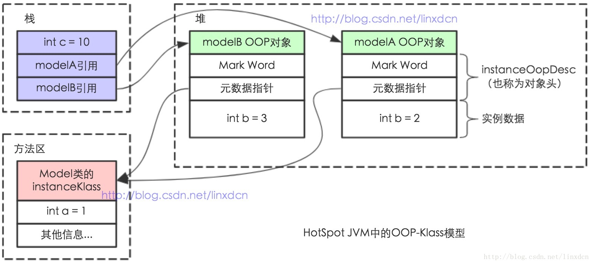

Java 程序通过**栈**上的 ==**reference 数据**==来操作堆上的**具体对象**，由于 **reference** 类型在 Java 虚拟机规范中只规定了一个指向对象引用。而没有规定这个引用应该通过何种方式去定位、访问堆中的对象的具体位置，它取决于 Java 虚拟机实现。目前主要有两种实现方式 **(1) 使用句柄**和 **(2) 直接指针**：

###### (1) 使用句柄

**使用句柄（类似间接指针）：**在 Java **堆**中划分出一块**内存**来作为**句柄池**，reference 中存储的就是**对象的句柄地址**，句柄中包含对象实例数据与类型各自具体地址信息。示例图如下图所示。

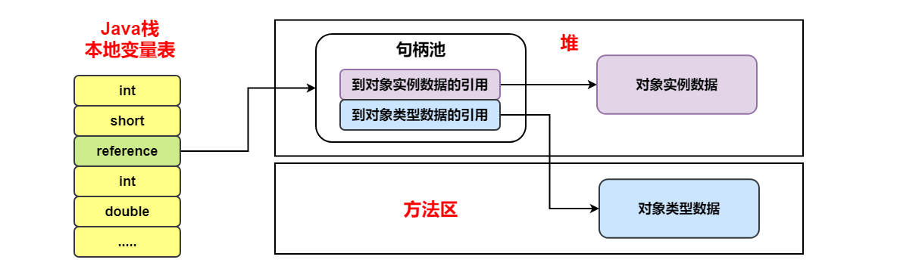

###### (2) 直接指针

**直接指针访问：**Java 堆中的对象布要考虑如何放置访问类型数据相关的信息，而 **reference** 中存储的**直接就是对象地址**。示例图如下图所示。**Hotspot 虚拟机采用此种方式**。

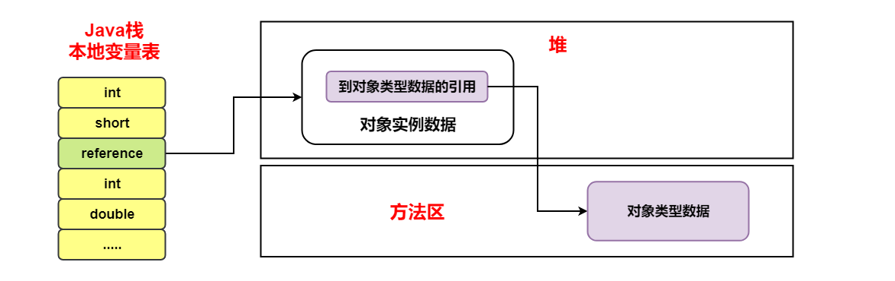

**两者的比较：**

- **使用句柄**的好处是 reference 中存储的是**稳定的句柄地址**，在对象被移动时只会改变句柄中的实例数据指针，而 reference 本身不需要修改。

- **直接指针访问**的最大好处就是速度更快，节省一次指针定位时间开销。


#### 参考资料

- 《深入理解 Java 虚拟机：JVM 高级特性与最佳实践（第二版》
- 《实战 java 虚拟机》
- https://docs.oracle.com/javase/specs/index.html
- http://www.pointsoftware.ch/en/under-the-hood-runtime-data-areas-javas-memory-model/
- [https://dzone.com/articles/jvm-permgen-%E2%80%93-where-art-thou](https://dzone.com/articles/jvm-permgen-–-where-art-thou)
- https://stackoverflow.com/questions/9095748/method-area-and-permgen
- 深入解析String#internhttps://tech.meituan.com/2014/03/06/in-depth-understanding-string-intern.html

- https://blog.csdn.net/wangbiao007/article/details/78545189


