[TOC]

### 内存分配与垃圾收集

JVM 需解决问题：对象是如何分配内存的？何时进行垃圾回收？怎么回收？Java 自动内存管理最核心的功能是**堆**内存中对象**内存的分配与回收**。

#### 堆的基本结构

HotSpot 虚拟机堆内存的基本结构如下，分为：

- **新生代**（含 Eden 区，From Survivor 区和 To Survivor 区）
- **老年代**
- **永久代**（已经移除）。

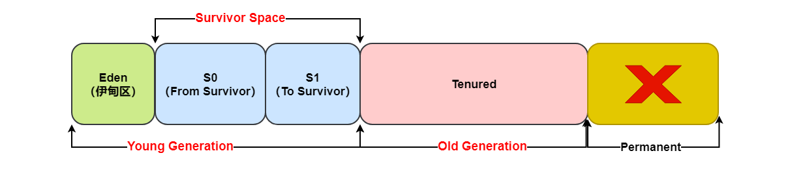

Java 堆是垃圾收集器管理的主要区域，因此也被称作 **GC 堆（Garbage Collected Heap）**。从垃圾回收的角度，由于现在收集器基本都采用**分代垃圾收集算法**，所以 Java 堆还可以细分为：**新生代和老年代**。再细致一点分的话分成：Eden 空间、From Survivor、To Survivor 空间等。**进一步划分的目的是更好地回收内存，或者更快地分配内存。**

> **S0 与 S1 的区别与联系？**

经过一次 GC 后，Eden 区和 "From" 区已经被**清空**。这个时候，"From" 和 "To" 会**交换**他们的角色（复制），也就是新的 "To" 就是上次 GC 前的“From”，新的 "From" 就是上次 GC 前的 "To"。

不管怎样，都会保证名为 **To** 的 Survivor 区域是**空的**。Minor GC 会一直重复这样的过程，直到 "To" 区被填满，"To" 区被填满之后，会将所有对象移动到老年代中。这两个区一次**只用一个**，Minor GC 时采用**复制算法**将 Eden 区和一个 Survivor 区的存活对象复制到另一个区中。因此在新生代中垃圾回收算法多为**复制算法**。


#### 内存分配策略

基于上述**堆结构**的划分，以下是 Hotspot 虚拟机在 **Serial/Serial Old** 收集器下的内存分配与回收策略。

##### 1. 对象优先在Eden区分配

大多数情况下，对象优先在**新生代的 Eden 区** 上分配，当 Eden 空间不够时，发起 **Minor GC**，Minor GC 后存活的**对象 Survivor 区放不下，则会被移到老年代**。

看看 demo：添加 -XX:+PrintGCDetails 可以**打印 GC 日志**。这里分配 **Eden 区**大概 60M，From 与 To 区大概 10M。

```java
// 添加运行JVM参数： -XX:+PrintGCDetails
public class GCTest {
    public static void main(String[] args) throws InterruptedException {
        byte[] allocation1;
        // 这里分配60M空间
        allocation1 = new byte[60000 * 1024];
    }
}
```

运行结果：

```java
Heap
PSYoungGen      total 76288K, used 65536K [0x000000076b400000, 0x0000000770900000, 0x00000007c0000000)
// Eden区用了100%
eden space 65536K, 100% used [0x000000076b400000,0x000000076f400000,0x000000076f400000)
from space 10752K, 0% used [0x000000076fe80000,0x000000076fe80000,0x0000000770900000)
to   space 10752K, 0% used [0x000000076f400000,0x000000076f400000,0x000000076fe80000)
// 老年代用了0K
ParOldGen       total 175104K, used 0K [0x00000006c1c00000, 0x00000006cc700000, 0x000000076b400000)
object space 175104K, 0% used [0x00000006c1c00000,0x00000006c1c00000,0x00000006cc700000)
// 元空间
Metaspace       used 3342K, capacity 4496K, committed 4864K, reserved 1056768K
class space    used 361K, capacity 388K, committed 512K, reserved 1048576K
```

可以看出 eden 区内存几乎已经**被分配完全**（即使程序什么也不做，新生代也会使用至少几 M 内存）。**假如再为 allocation2 分配内存会出现什么情况？**

```java
// 添加运行JVM参数： -XX:+PrintGCDetails
public class GCTest {
    public static void main(String[] args) throws InterruptedException {
        byte[] allocation1, allocation2;
        // 这里分配60M
        allocation1 = new byte[60000*1024];
        // 这里再分配8M
        allocation2 = new byte[8000*1024];
    }
}
```

运行结果：

```java
[GC (Allocation Failure) [PSYoungGen: 65253K->936K(76288K)] 65253K->60944K(251392K), 0.0279083 secs] [Times: user=0.13 sys=0.02, real=0.03 secs] 
Heap
// 年轻代用了9591K，大概就是8M+其他的一些自带的内存
PSYoungGen      total 76288K, used 9591K [0x000000076b400000, 0x0000000774900000, 0x00000007c0000000)
eden space 65536K, 13% used [0x000000076b400000,0x000000076bc73ef8,0x000000076f400000)
from space 10752K, 8% used [0x000000076f400000,0x000000076f4ea020,0x000000076fe80000)
to   space 10752K, 0% used [0x0000000773e80000,0x0000000773e80000,0x0000000774900000)
// 老年代用了60M
ParOldGen       total 175104K, used 60008K [0x00000006c1c00000, 0x00000006cc700000, 0x000000076b400000)
object space 175104K, 34% used [0x00000006c1c00000,0x00000006c569a010,0x00000006cc700000)
Metaspace       used 3342K, capacity 4496K, committed 4864K, reserved 1056768K
class space    used 361K, capacity 388K, committed 512K, reserved 1048576K
```

对比之前，可以看到**第一行**就打印了 GC 日志。

```java
[GC (Allocation Failure) [PSYoungGen: 65253K->936K(76288K)] 65253K->60944K(251392K), 0.0279083 secs] [Times: user=0.13 sys=0.02, real=0.03 secs] 
```

这里就是第一次在 Eden 区放了一个 **60M** 的大对象，第二次分配 8M 对象时，**Eden 区满了**，触发一次 **Minor GC**，就会尝试将 60M 的放到 **From 区**，但是 From 区只有 10M 放不下，所以把原来 **60M 的对象放到老年代**。之后就会把 **8M 新对象**放到 Eden 区中。因为给 allocation2 分配内存的时候 eden 区内存**几乎已经被分配完**了，当 Eden 区没有足够空间进行分配时，虚拟机将发起一次 Minor GC，GC 期间虚拟机又发现 allocation1 无法存入 Survior 空间，所以只好把**新生代**的对象**提前转移到老年代**中去，老年代上的空间**足够存放 allocation1**，所以不会出现 Full GC。执行 Minor GC 后，后面分配的对象如果能够存在 eden 区的话，还是会在 eden 区分配内存。

下面验证一下再加几个 **1M** 的小对象：

```java
public class GCTest {
    public static void main(String[] args) throws InterruptedException {
        byte[] allocation1, allocation2, allocation3, allocation4, allocation5, allocation6;
        // 60M的对象
        allocation1 = new byte[60000*1024];
        // 8M的对象
        allocation2 = new byte[8000*1024];
        // 再加几个1M的对象
        allocation3 = new byte[1000*1024];
        allocation4 = new byte[1000*1024];
        allocation5 = new byte[1000*1024];
        allocation6 = new sbyte[1000*1024];
    }
}
```

运行结果

```java
[GC (Allocation Failure) [PSYoungGen: 65253K->952K(76288K)] 65253K->60960K(251392K), 0.0311467 secs] [Times: user=0.08 sys=0.02, real=0.03 secs] 
Heap
PSYoungGen total 76288K, used 13878K [0x000000076b400000, 0x0000000774900000, 0x00000007c0000000)
// 新的几个1M对象分配到Eden区
eden space 65536K, 19% used [0x000000076b400000,0x000000076c09fb68,0x000000076f400000)
from space 10752K, 8% used [0x000000076f400000,0x000000076f4ee030,0x000000076fe80000)
to   space 10752K, 0% used [0x0000000773e80000,0x0000000773e80000,0x0000000774900000)
// 老年代没变化
ParOldGen       total 175104K, used 60008K [0x00000006c1c00000, 0x00000006cc700000, 0x000000076b400000)
object space 175104K, 34% used [0x00000006c1c00000,0x00000006c569a010,0x00000006cc700000)
Metaspace       used 3343K, capacity 4496K, committed 4864K, reserved 1056768K
class space    used 361K, capacity 388K, committed 512K, reserved 1048576K
```

跟上面的类似，新增的几个比较小的 **1M** 的对象都是分配在 **Eden 区**的。

##### 2. 大对象直接进入老年代

**大对象**是指需要**连续内存空间**的对象，最典型的大对象是那种**很长的字符串以及数组**。如果一个对象的大小直接已经超过了 Eden 区的大小，则**直接就放到老年代**了。经常出现大对象会提**前触**发垃圾收集以获取足够的连续空间分配给大对象。避免为大对象分配内存时由于**分配担保机制**带来的复制而**降低效率**。

**-XX:PretenureSizeThreshold**，大于此值的对象**直接在老年代**分配，避免在 Eden 和 Survivor 之间的大量内存复制（新生代采用复制算法收集内存）。该参数只对 **Serial 和 ParNew 两个收集器有效**。

**为什么要这样呢？** 这是为了避免为**大对象分配内存时的复制操作而降低效率**。举个例子：如果 Eden 区 60M，From 和 To 都是 10M，当一个对象 4M 时，假设会一直引用这个对象，那么这个 4M 的对象就会因为 Minor GC 在 From 和 To 之间不断移动，影响 GC 性能。

##### 3. 长期存活的对象进入老年代

JVM 为对象定义**年龄计数器**，对象在 Eden 出生并经过 **Minor GC** 依然存活，将移动到 **Survivor** 中，年龄就增加 1 岁，增加到**一定年龄**则移动到老年代中。默认晋升年龄并不都是 **15**，这个是要**区分垃圾收集器**的，CMS 就是 6。

如果对象在 Eden 出生并经过第一次 **Minor GC** 后仍然能够存活，并且能被 **Survivor 容纳**的话，将被移动到 Survivor 空间中，并将对象年龄设为 1。对象在 Survivor 中每熬过一次 MinorGC，年龄就增加 1 岁，当它的年龄增加到一定程度（默认为 **15** 岁，CMS 收集器默认 6 岁，不同的垃圾收集器会略微有点不同），就会被晋升到**老年代**中。

-**XX:MaxTenuringThreshold** 用来定义**年龄的阈值**。

##### 4. 对象动态年龄判定机制

虚拟机并不是永远要求对象的年龄必须达到 **MaxTenuringThreshold** 才能晋升老年代，如果在 **Survivor 中相同年龄所有对象大小的总和大于 Survivor 空间的==一半==**，则年龄大于或等于该年龄的对象可以直接进入老年代，**无需**等到 MaxTenuringThreshold 中要求的年龄。

当前放对象的 **Survivor** 区域里(其中一块区域，放对象的那块 s 区)，一批对象的总大小大于这块 Survivor 区域内存大小的 **50%**(-XX:TargetSurvivorRatio 可以指定)，那么此时**大于等于**这批对象年龄最大值的对象，就可以**直接**进入老年代了。例如 Survivor 区域里现在有一批对象，年龄 1+ 年龄 2 + 年龄 n 的多个年龄对象**总和超过了 Survivor 区域的50%**，此时就会把年龄 n (含)以上的对象**都放入**老年代。这个规则其实是希望那些**可能是长期存活**的对象，尽早进入老年代。

**对象动态年龄判断机制一般是在 Minor GC 之后触发的。**

##### 5. 老年代空间分配担保机制

在发生 **Minor GC** 之前，虚拟机**==先检查老年代最大可用的连续空间==**是否大于**==新生代所有对象总空间==**，如果条件成立的话，那么 Minor GC 可以确认是**安全**的，这就是**老年代空间分配担保机制**。**担保失败**可能会触发 **Full GC**。

如果**不成立**的话虚拟机会查看 **HandlePromotionFailure**（可以理解成**担保参数**） 的值是否**允许担保失败**，如果允许那么就会继续检查老年代最大可用的连续空间是否大于历次晋升到老年代对象的平均大小，如果大于，将尝试着进行一次 **Minor GC**；如果**小于**（则空间分配担保**失败**），或者 HandlePromotionFailure 的值**不允许冒险**，那么就要进行一次 **Full GC**。

这里其实就是**假设**年轻代的**全部对象**都突然一下子放到老年代中，如果老年代**都能放得下**，那就可以**放心做 Minor GC**了，因为 Minor GC **最多**也就是把年轻代的全部对象都放到老年代中，如果不能全部放下，那就需要考虑一下是**否有必要执行一次 Full GC** 来清理老年代的空间来存放可能到来的年轻代对象了。**担保的含义**就是担保老年代中一定有空间来存放年轻代中可能来的对象。

年轻代每次 **Minor GC** 之前 JVM 都会计算下老年代**剩余可用空间**。如果这个可用空间**小于年轻代里现有的所有对象大小之和**(**包括垃圾对象**)，就会看一个“-XX:-HandlePromotionFailure”(Jdk1.8 默认就设置了)的参数是否设置了这个参数，如果有这个参数，就会看看老年代的可用内存大小，是否大于之前每一次 Minor GC 后进入老年代的对象的**平均大小**。如果上一步结果是**小于或者之前说的参数没有设置**，那么就会**触发一次 Full GC**，对**老年代和年轻代一起回收一次垃圾**，如果回收完还是没有足够空间存放新的对象就会发生 "**OOM**"。

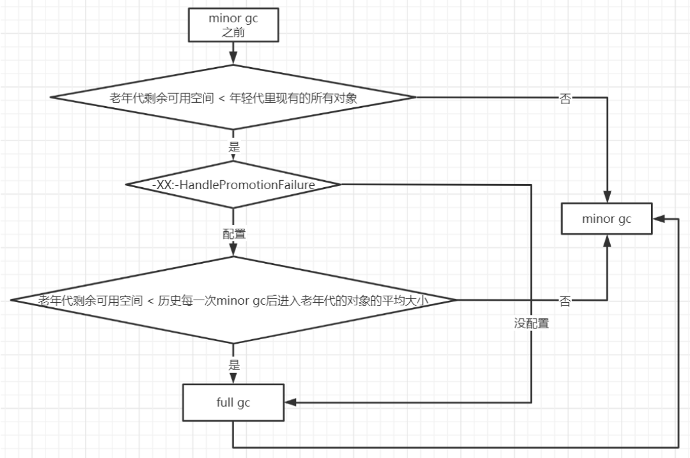

**为何这样做**？其实原因就是如果 Minor GC 执行后，如果老年代空间不够依然需要进行 Full GC 的话，**不如直接一来就进行一次 Full GC**，还能同时对**堆的所有位置**进行垃圾收集，免得 Minor GC 做了之后还要做 Full GC。而且做了 Full GC 之后 Minor GC 也可以不用做了。

##### 6. 对象栈上分配

通过 JVM 内存分配可以知道对象一般都是在**堆**上进行分配，当对象**没有被引用**的时候，需要依靠 GC 进行**回收内存**，如果对象数量较多的时候，会给 GC 带来较大压力，也间接影响了应用的性能。为了减少**临时对象**在堆内分配的数量，JVM 通过**逃逸分析**确定该对象**不会被外部访问**。如果**不会逃逸**可以将该对象在**==栈上分配==**内存，这样该对象所占用的**内存空间就可以随栈帧出栈而销毁，就减轻了垃圾回收的压力**。**栈上分配依赖于逃逸分析和标量替换**。

**对象逃逸分析**：就是分析**对象动态作用域**，当一个对象在方法中被定义后，它可能被外部方法所引用，例如作为调用参数传递到其他地方中，逃逸分析就分析该对象会不会被外部访问。

**标量替换：**通过逃逸分析确定该对象**不会**被外部访问，并且对象可以被进一步分解时，**JVM不会创建该对象**，而是将该对象成员变量分解若干个被这个方法使用的成员变量所代替，这些代替的成员变量在栈帧或寄存器上分配空间，这样就不会因为没有一大块连续空间导致对象内存不够分配。开启标量替换参数(-XX:+EliminateAllocations)，**JDK7 之后默认开启**。

##### 7. Eden与Survivor区默认8:1:1

大量的对象被分配在 **eden 区**，eden 区满了后会触发 Minor GC，可能会有 99% 以上的对象成为垃圾被回收掉，剩余存活的对象会被挪到为空的那块 survivor 区，下一次 eden 区满了后又会触发 Minor GC，把 eden 区和 survivor 去垃圾对象回收，把剩余存活的对象一次性挪动到另外一块为空的 survivor 区，因为新生代的对象都是朝生夕死的，**存活时间很短，所以 JVM 默认的 8:1:1 的比例是很合适的**，让 eden 区尽量的大，survivor 区够用即可 JVM 默认有这个参数 -XX:+UseAdaptiveSizePolicy，会导致这个比例自动变化，如果不想这个比例有变化可以设置参数 -XX:-UseAdaptiveSizePolicy。


#### Minor GC与Full GC

针对**新生代**和**老年代**有不同的 **GC 方法**即 Minor GC 和 Full GC。

##### 1. 对比

- **新生代 GC（Minor GC/Young GC）**: 指发生**新生代**的的垃圾收集动作，Minor GC 非常**频繁**，回收速度一般也比较快。
- **老年代 GC（Full GC/Major GC）**: 一般会同时回收**老年代，年轻代，方法区**的垃圾，出现了 Major GC 经常会伴随至少一次的 Minor GC（并非绝对），Major GC 的速度一般会比 Minor GC 的**慢** 10 倍以上。

##### 2. Minor GC的触发条件

Minor GC 发生在**新生代**上，因为新生代对象存活时间很短，因此 Minor GC 会**频繁**执行，执行的速度一般也会比较快。

**Eden 区满了**就触发了 Minor GC。

- 新生代中的垃圾收集动作，采用的是**复制算法**。
- 对于较大的对象，在 Minor GC 的时候可以直接进入**老年代**。

##### 3. Full GC的触发条件

对于 Minor GC，其触发条件非常简单，当 **Eden 空间满**时，就将触发一次 **Minor GC**。而 Full GC 发生在**老年代**上，老年代对象其存活时间长，因此 Full GC **很少执行**，执行速度会比 Minor GC 慢很多。而 Full GC 则相对复杂，有以下条件：

###### (1). 调用 System.gc()

只是**建议**虚拟机执行 Full GC，但是虚拟机**不一定**真正去执行。不建议使用这种方式，而是让虚拟机管理内存。（常考）

###### (2). 老年代空间不足

**老年代空间不足**的常见场景为前文所讲的大对象直接进入老年代、长期存活的对象进入老年代等。为了避免以上原因引起的 Full GC，应当尽量**不要创建过大的对象以及数组**。

除此之外，可以**通过 -Xmn 虚拟机参数调大新生代的大小，让对象尽量在新生代被回收掉**，不进入老年代。

还可以通过 **-XX:MaxTenuringThreshold** 调大对象进入老年代的**年龄**，让**对象在新生代多存活一段时间**。

###### (3). 空间分配担保失败

使用**复制算法**的 Minor GC 需要老年代的内存空间作**担保**，如果**担保失败**会执行一次 **Full GC**。

###### (4). JDK7及以前的永久代空间不足

在 JDK 1.7 及以前，HotSpot 虚拟机中的**方法区是用永久代**实现的，永久代中存放的为一些 Class 的信息、常量、静态变量等数据。当系统中要加载的类、反射的类和调用的方法较多时，永久代可能会**被占满**，Spring 这种就经常使用反射，在未配置为采用 CMS GC 的情况下也会执行 Full GC。如果经过 Full GC 仍然回收不了，那么虚拟机会抛出 java.lang.OutOfMemoryError。

为避免以上原因引起的 Full GC，可采用的方法为**增大永久代空间或转为使用 CMS GC**。

###### (5). Concurrent Mode Failure

执行 CMS GC 的过程中同时有对象要放入老年代，而此时老年代空间不足（可能是 GC 过程中浮动垃圾过多导致暂时性的空间不足），便会报 Concurrent Mode Failure 错误，并触发 Full GC。解决办法就是要**让年老代留有足够的空间**，以保证新对象空间的分配。


#### 判断对象是否可回收？

##### 1. 引用计数算法

为对象添加一个**引用计数器**，当对象增加一个引用时计数器加 1，引用失效时减 1，引用计数为 0 的对象可被回收。

这个方法实现简单，效率高，但是目前主流的虚拟机中并没有选择这个算法来管理内存，其最主要的原因是它很难解决对象之间**相互循环引用**的问题。在两个对象出现**循环引用**的情况下，此时引用计数器永远不为 0，导致**无法**对它们进行回收，就造成了**内存泄漏**问题。

```java
public class CircularReferenceTest {

    private Object instance = null;

    public static void main(String[] args) {
        CircularReferenceTest a = new CircularReferenceTest();
        CircularReferenceTest b = new CircularReferenceTest();
        // 循环引用
        a.instance = b;
        b.instance = a;
        // 同时置空
        a = null;
        b = null;
        // doSomething();
    }
}
```

在上述代码中，a 与 b 引用的对象实例互相持有了对象的引用，因此当把对 a 对象与 b 对象的引用去除之后，由于两个对象还存在互相之间的引用，如果采用引用计数法就会导致两个 Test 对象无法被回收。

##### 2. 可达性分析算法

可达性分析算法就是以 **GC Roots** 为**起始点**进行搜索，**可达**的对象都是**存活**的，不可达的对象被认定为垃圾对象可被回收。是主流的判断方法。

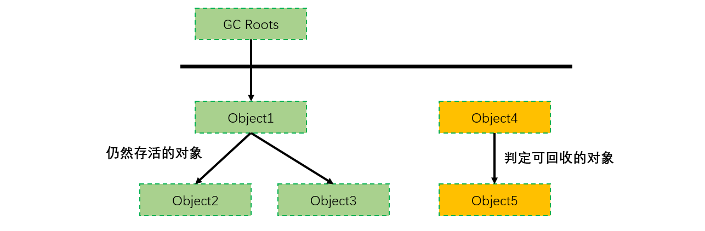

Java 虚拟机使用该算法来判断对象是否可被回收，**GC Roots 对象**有如下：

- ==虚拟机**栈**中**引用的对象**==。对象类型分配到**堆**中，方法栈中存在到堆中对象的引用，当线程结束之后，这些对象就没有任何引用了。
- **方法区**中的**静态变量。**
- **常量池**中**常量**引用的对象。
- **本地方法栈**中 JNI （即一般说的 Native 方法）引用的对象。

GC Roots 的节点主要在**全局性的引用**（例如常量或者类静态属性）与**执行上下文**（例如栈帧中的本地变量表）中。

##### 3. 对象自救与finalize

**不可达的对象并非"非死不可"**。即使在可达性分析法中**不可达**的对象，也并非是 "非死不可" 的，这时候它们暂时处于 "**缓刑阶段**"，要真正宣告一个对象死亡，至少要经历**两次标记**过程。

**标记的前提是对象在进行可达性分析后发现没有与 GC Roots 相连接的引用链。**

**第一次标记**：可达性分析法中**不可达的对象**被**第一次标记**并且进行一次**筛选**，筛选的条件是**此对象是否有必要执行 ==finalize== 方法**。当对象没有**覆写** finalize 方法，或 finalize 方法已经被虚拟机**调用过**时，对象将被**直接回收**。

**第二次标记**：如果这个对象覆写了 finalize 方法，finalize 方法是对象脱逃死亡命运的**最后一次机会**，如果对象要在 finalize() 中成功拯救自己，只要**重新与 GC Root 引用链上的任何的一个对象建立关联**即可，譬如把自己**赋值给某个类变量或对象的成员变量**，那在第二次标记时它将移除出 "即将回收" 的集合。如果对象这时候还没逃脱，那基本上它就真的被回收了。

注意：一个对象的 finalize() 方法**只会被执行一次**，也就是说通过调用 finalize 方法自我救命的机会**就一次**。

```java
// 静态变量，这里就是一个GCRoot对象
private static List<User> userList = new ArrayList();

@Override
protected void finalize() throws Throwable {
    // 使用静态变量来挂钩GCRoot对象
    Test.userList.add(this);
    System.out.println("关闭资源，userid=" + id + "即将被回收");
}
```

**总结如何自我救赎：**

1. 对象**覆写**了 **finalize**() 方法（这样在被**判死后才会调用此方法**，才有机会做最后的救赎）。
2. 在 **finalize**() 方法中**重新引用到 "GC  Roots" 链**上（如把当前对象的引用 this 赋值给某对象的类变量/成员变量，重新建立可达的引用）。

虽然以上以对象救赎举例，但 finalize() 的作用往往被认为是**用来做最后的资源回收**。而且 finalize() 的调用具有**不确定性**，只保证方法会调用，但**不保证方法里的任务会被执行完**（比如一个对象可能还在自救的过程中，就被回收了）。它用来回收资源也不会有什么好的表现。综上：finalize() 方法**并没有什么鸟用**。


#### 引用类型

无论是通过引用计数算法判断对象的引用数量，还是通过可达性分析算法判断对象是否可达，判定**对象是否可被回收都与引用**有关。Java 提供了四种强度不同的引用类型：**==强软弱虚==**（强度递减）。

##### 1. 强引用

被强引用关联的对象**不会**被回收。使用 new 一个新对象的方式来创建强引用，最普遍，类似**生活必需品**。

当内存空间不足，Java 虚拟机**宁愿**抛出 OutOfMemoryError 错误，使程序异常终止，也**不会**靠随意回收具有强引用的对象来解决内存不足问题。

```java
Object obj = new Object();
```

##### 2. 软引用

被**软引用**关联的对象只有在**内存不够**的情况下才会被回收。将对象用 SoftReference 软引用类型的对象包裹，正常情况不会被回收，但是 **GC 做完**后发现释放不出空间存放新的对象，则会把这些软引用的对象回收掉。**类似可有可无的生活用品**。如果内存**足够**，垃圾回收器就**不会**回收它，如果没有回收，那么就可以继续使用。

软引用可用来实现**内存敏感的高速缓存**。

使用 **SoftReference** 类来创建软引用。

```java
Object obj = new Object();
SoftReference<Object> sf = new SoftReference<Object>(obj);
obj = null;  // 使对象只被软引用关联
```

软引用在实际中有重要的应用，例如浏览器的后退按钮。按后退时，这个后退时显示的网页内容是**重新进行请求**还是从缓存中取出呢？这就要看具体的实现策略了。如果一个网页在浏览结束时就进行内容的回收，则按后退查看前面浏览过的页面时，需要重新构建。如果将浏览过的网页存储到内存中会造成内存的大量浪费，甚至会造成内存溢出。

##### 3. 弱引用

弱引用与软引用的区别在于：**只具有弱引用的对象拥有更短暂的生命周期**。发生 **GC 的时候**，如果发现有**弱引用对象**，不管内存够不够**都会直接进行回收**。

使用 **WeakReference** 类来创建弱引用。

```java
Object obj = new Object();
WeakReference<Object> wf = new WeakReference<Object>(obj);
obj = null;
```

##### 4. 虚引用

又称为幽灵引用或者幻影引用，一个对象是否有虚引用的存在，不会对其生存时间造成影响，也**无法**通过虚引用得到一个对象。如果一个对象仅持有虚引用，那么它就和**没有任何引用一样**，在**任何时候都可能被垃圾回收**。为一个对象设置虚引用的**唯一目的**是能在这个对象被回收时收到一个系统通知。

使用 **PhantomReference** 来创建虚引用。

```java
Object obj = new Object();
PhantomReference<Object> pf = new PhantomReference<Object>(obj, null);
obj = null;
```

##### 5. 引用队列

**软引用和弱引用**都可以和一个**引用队列**（ReferenceQueue）联合使用，如果软引用或弱引用所引用的对象**被垃圾回收**，虚拟机就会把这个软引用或弱引用加入到**与之关联的引用队列中**。 虚引用**必须和引用队列**（ReferenceQueue）联合使用。当垃圾回收器准备回收一个对象时，如果发现它还有虚引用，就会在回收对象的内存之前，把这个虚引用加入到与之关联的引用队列中。程序可以通过判断引用队列中是否已经加入了虚引用，来了解被引用的对象是否将要被垃圾回收。程序如果发现某个虚引用已经被加入到引用队列，那么就可以在所引用的对象的内存被回收之前采取必要的行动。


#### 静态方法区回收

Java 虚拟机规范中规定可以**不要求虚拟机在方法区实现垃圾收集**。因为方法区主要存放**永久代**对象，而永久代对象的回收率比新生代低很多，所以在方法区上进行**回收性价比不高**，且回收的条件非常**苛刻**。

但是为了避免内存溢出，在大量使用**反射、动态代理、GGLib 等** ByteCode 框架、动态生成 Jsp 以及 OSGI 这类**频繁自定义 ClassLoader** 的场景都需要**虚拟机具备类卸载**的功能，以保证永久代**不会溢出**。

> 方法区的垃圾回收主要是对**常量池**的回收和对**类的卸载**。（**废弃常量与无用的类**）

**类的卸载**条件很多，需要满足以下三个条件，并且满足了条件也不一定会被卸载，同时满足以下的条件才是**无用**的类：

- 该类所有的**实例都已经被回收**，此时堆中不存在该类的任何实例。
- 加载该类的 **ClassLoader** 已经被回收。
- 该类对应的 **Class 对象**没有在任何地方被**引用**，无法在任何地方通过**反射访问**该类方法。

> **如何判断一个常量是废弃常量**?

Java 8 之后运行时常量池从**方法区**移动到了**堆**中，因此也有 **GC** 发生。运行时常量池主要回收的是**废弃的常量**。如何判断一个常量是废弃常量呢？

假如在常量池中存在字符串 "abc"，如果**当前没有任何 String 对象引用该字符串常量**的话，就说明常量 "abc" 就是废弃常量，如果这时发生内存回收的话而且有必要的话，"abc" 就会被系统清理出常量池。


#### 垃圾收集算法

主要有四种算法。四种算法可以应用在不同的区域及场合。

##### 1. 标记-清除算法

主要分为**标记**与**清除**两个步骤。

**标记阶段**：程序会检查每个对象是否为**活动对象**，如果是活动对象，则程序会在**对象头部**打上标记。

**清除阶段**：会进行对象回收并取消标志位，另外，还会判断回收后的分块与前一个空闲分块是否连续，若连续，会**合并这两个分块**。回收对象就是把对象作为分块，**连接到被称为 “空闲链表” 的单向链表**，之后进行分配时只需要**遍历**这个空闲链表，就可以找到分块。

在**分配**时，程序会搜索空闲链表寻找空间大于等于新对象大小 size 的块 block。如果它找到的块等于 size，会直接返回这个分块；如果找到的块大于 size，会将块分割成大小为 size 与 (block - size) 的两部分，返回大小为 size 的分块，并把大小为 (block - size) 的块返回给空闲链表。

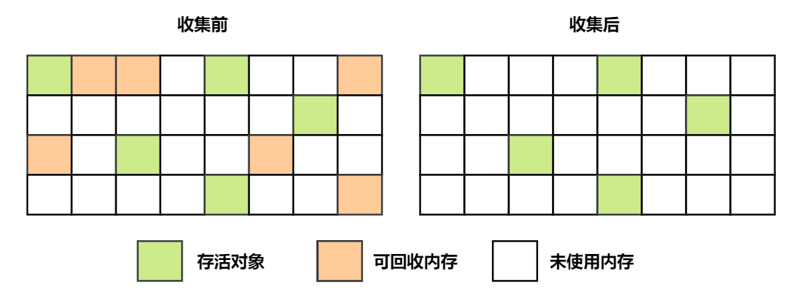

**问题**：

- 标记和清除过程效率**都不高**；
- 会产生大量不连续的**内存碎片**，导致无法给**大对象**分配内存。如果后面一直没有内存给大对象就会一直触发 **Full GC**。

##### 2. 复制算法

将**内存**划分为大小相等的**两块**，每次**只使用其中一块**，当这一块内存用完了就将还存活的对象复制到**另一块上面**，然后再把使用过的内存空间进行一次清理。


现在的商业虚拟机**==都采用==**这种收集算法回收==**新生代**==，但**并不是划分为大小相等**的两块，而是一块**较大的 Eden 空间和两块较小的 Survivor 空间**，每次使用 Eden 和其中**一块 Survivor**。就是前述的 **S0 和 S1 区域**，回收时将 Eden 和 Survivor 中还存活着的对象全部**复制到另一块 Survivor** 上，最后清理 Eden 和使用过的那一块 Survivor，确保总是有一半是干净的内存。而且由于新生代大部分对象存活率**都低**，所以复制的时候需要**复制的对象一般也不多**，因此效率还不错。

HotSpot 虚拟机的 Eden 和 Survivor 大小比例默认为 ==**8:1**==，保证了内存的利用率达到 90%。如果每次回收有多于 10% 的对象存活，那么一块 Survivor 就**不够用**了，此时需要依赖于**老年代进行空间分配担保**，也就是借用老年代的空间存储放不下的对象。如果空间担保失败，则触发  Full GC。

**不足**：主要不足是只使用了**一半**的内存，而且如果存活对象过多时导致**复制**开销较大。

##### 3. 标记-整理算法

让所有存活的对象都**向一端移动**，然后直接清理掉端边界以外的内存。适用于**老年代**的特点（大对象，且存活时间长的对象）。

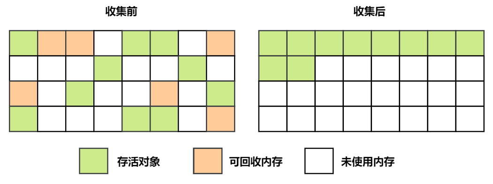

**优点**：**不会产生内存碎片**。

**不足**：需要**移动**大量对象，处理效率比较低。

##### 4. 分代收集算法

现在的商业虚拟机几乎都采用**分代收集算法**，这种算法没有什么新的思想，它根据**对象存活周期的不同将内存划分为几块（如新生代、老年代）**，然后根据各个年代的**特点**选择**合适**的垃圾收集算法（这也是为什么一般将堆分为**新生代和老年代**的原因）。

- **新生代**使用：**复制算法**。在**新生代**中，每次收集都会有**大量对象死去**，所以可以选择**复制算法**，每次垃圾收集需要复制的对象通常**不会太多**。

- **老年代**使用：**标记-清除** 或者 **标记-整理** 算法（老年代中对象存活率较高）。老年代的**对象存活几率是比较高**的，而且没有额外的空间对它进行分配担保，所以必须选择“**标记-清除**”或“**标记-整理**”算法进行垃圾收集。“标记-清除”或“标记-整理”算法会比复制算法**慢** 10 倍以上。


#### HotSpot虚拟机垃圾收集的算法实现

##### 1. 枚举根节点GC Roots

以**可达性分析**中从 **GC Roots** 节点找引用链这个操作为例，可以作为 GC Roots 的节点主要在**全局性的引用**（例如常量或者类静态属性）与**执行上下文**（例如栈帧中的本地变量表）中。

但是现在很多应用仅仅**方法区**就有数百兆，如果要**逐个检查**这里面的引用，那么必然会消耗很多的时间。另外，可达性分析对**执行时间的敏感**还体现在 **GC 停顿**上，因为这项分析工作必须在一个能确保一致性的快照中进行---这里的“一致性”指的是在整个分析过程中整个执行系统看起来就像是被冻结在某个时间点上，不可以出现分析过程中对象引用关系还在不停变化的情况，该点不满足的话分析结果准确性就无法得到保证。

这个点是**导致 GC 进行时必须停顿**所有 Java 执行线程的其中一个重要原因，即使是号称不会发生停顿的 CMS 收集器中，枚举根节点也是必须要停顿的。

由于目前主流 Java 虚拟机使用的都是**准确式 GC**，所以当执行系统停顿下来后，并不需要一个不漏的检查完成所有执行上下文和全局的引用位置，**虚拟机应当是有办法直接得知那些地方存放着对象引用的。** 在 HotSpot  的实现中，是使用一组被称为 **OopMap** 的数据结构来达到这个目的，在**类加载完成**的时候，HotSpot 就把对象上什么偏移量是什么类型计算出来，并**放入 OopMap** 数据结构中了；在 JIT 编译过程中，也会在特定的位置记录下栈和寄存器中哪些位置是引用。

这样， **GC 在扫描**时就可以直接得知这些信息了。

##### 2. 安全点

在 **OopMap** 的帮助下，HotSpot 可以**快速并且准确**的**完成 GC Roots 枚举**（也就是找到所有的 GC Roots），但是一个很现实的问题随之而来：**可能导致引用关系变化**，也就是说在执行程序的时候 GC Roots 的引用关系可能因为**代码的执行而发生变化**，这时候进入 GC 就可能出问题。

实际上 HotSpot 也的确没有为每一条指令都生成 OopMap，只是在**“特定的位置” 记录了这些信息**，这些位置被称为是**安全点**，**即程序执行时并非是在所有地方都能停顿下来开始 GC ，只有==到达安全点时才能暂停==。**

安全点的选择既不能太少以至于让 GC 等待太长时间，也不能过于频繁以至于过分增大运行时负荷。

**所以，安全点的选定基本上是以程序“是否具有让程序长时间执行的特征”为标准进行选定的——因为每条指令执行的时间都非常短暂，程序不太可能因为指令流长度太长这个原因而过长时间运行，“长时间执行”的最明显特征就是指令序列复用，例如方法调用、循环跳转、异常跳转等，所以具有这些功能的指令才会产生安全点。**

**安全点**就是指代码中一些**特定的位置**，当线程运行到这些位置时它的**状态是确定的**，这样 JVM 就可以**安全的进行一些操作**，比如 **GC** 等，**==所以 GC 不是想什么时候做就立即触发的，是需要等待所有线程运行到安全点后才能触发==**。

这些特定的安全点位置主要有以下几种：

1. 方法返回之前
2. 调用某个方法之后
3. 抛出异常的位置
4. 循环的末尾

大体实现思想是当垃圾收集需要**中断线程**的时候， 不直接对线程操作， 仅仅简单地设置一个**标志位**， 各个线程执行过程时会不停地主动去**轮询这个标志**， 一旦发现中断标志为真时就自己在**最近的安全点上主动中断挂起**。 轮询标志的地方和安全点是重合的。

##### 3. 安全区域

使用安全点似乎已经完美解决了**如何进入 GC 的问题**，但实际情况却并不一定，安全点机制保证了程序执行，在不太长的时间内就会遇到可以进入 GC 的安全点。

但是线程“不执行”的时候呢？所谓不执行就是没有分配 CPU 时间，典型的例子就是线程处于 Sleep 状态或者 Blocked 状态，这时候线程无法响应 JVM 的中断请求，“走”到安全点去中断挂起，JVM 显然也不太可能等待线程重新被分配 CPU 时间。

对于这种状况，就需要**安全区域**来解决。**安全区域就是在一段代码片段中，引用关系不会发生变化，在这个区域中的==任意地方==开始 GC 都是安全的。**

在线程执行到安全区域中的代码时，首先标识自己已经进入了安全区域，当这段时间里 JVM 要发起 GC 时，就**不用管**标识自己为安全区域状态的线程了。当线程要离开安全区域时，它要检查系统是否已经完成了根节点枚举（或者是整个 GC 过程），如果完成了，那线程就继续执行，否则它就必须等待直到收到可以安全离开安全区域的信号为止。

安全点是对**正在执行的线程设定**的。如果一个线程处于 Sleep 或中断状态，它就不能响应 JVM 的中断请求，再运行到安全点上。因此 JVM 引入了安全区域。安全区域是指在一段代码片段中，**引用关系不会发生变化**。在这个区域内的**任意地方开始 GC 都是安全的**。


#### 垃圾收集器

**如果说收集算法是内存回收的方法论，那么垃圾收集器就是内存回收算法的具体实现。没有万能的**垃圾收集器，**需要根据==具体应用场景==选择适合自己的垃圾收集器**。

**垃圾收集范围**：垃圾收集（GC）主要是针对**==堆和方法区==**进行。**程序计数器、虚拟机栈和本地方法栈这三个区域属于线程私有**的，只存在于线程的生命周期内，线程结束之后就会消失，因此**不需要**对这三个区域进行垃圾回收。

下图是 HotSpot 虚拟机中的 7 个垃圾收集器，**连线**表示垃圾收集器可以**配合使用**。注意哪些收集器使用的范围。

- **新生代收集器**：Serial、ParNew、Parallel Scavenge 收集器。
- **老年代收集器**：Serial Old、ParNew Old、**CMS 收集器**。
- **新生代与老年代均可**：**G1 收集器**。

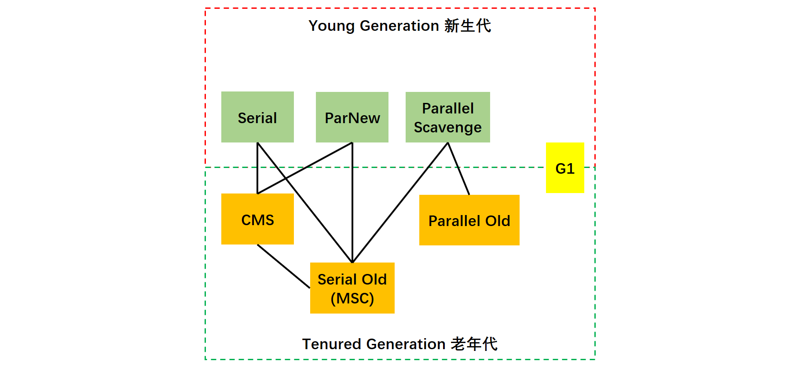

> **几个概念**

- **单线程与多线程**：单线程指的是垃圾收集器**只使用一个线程**，而多线程使用多个线程。
- **串行与并行**：**串行**指的是垃圾收集器与用户程序**交替执行**，这意味着在执行垃圾收集的时候需要**停顿用户程序**；**并行**指的是垃圾收集器和用户程序**同时执行**，只有**CMS 和 G1 是并行**方式执行。

> **停顿时间与吞吐量的权衡**

- **==停顿时间==越短就越适合需要与==用户交互==的程序，良好的响应速度能提升用户体验。**使用 **Parallel Scavenge 和 Parallel Old** 收集器。缩短停顿时间是以牺牲吞吐量和新生代空间来换取的：新生代空间变小，垃圾回收变得频繁，导致吞吐量下降。
- **==高吞吐量==则可以高效率地利用 CPU 时间，尽快完成程序的运算任务，适合在==后台运算而不需要太多交互==的任务。** 可以使用 **CMS** 收集器。

> **STW = Stop The World**

就是**停止全部用户线程进行 GC 操作**。

##### 1. Serial收集器

配置参数：**-XX:+UseSerialGC  -XX:+UseSerialOldGC**。

Serial 翻译为**串行**，也就是说它以**串行的方式执行**。它是**单线程**的收集器，只会使用一个线程进行垃圾收集工作。它在垃圾收集时**必须暂停其他**的工作线程（Stop The World），直到收集结束。参考下图。下图是 Serial 配合 Serial Old 一起使用，这里**新生代采用复制算法，老年代采用标记-整理算法。**


它的优点是**简单高效**，在**单个 CPU** 环境下，由于没有线程交互的开销，因此拥有**最高的单线程收集效率**。

它是虚拟机运行在 **Client** 模式下的默认新生代收集器，因为在该场景下内存一般不会很大。

##### 2. ParNew收集器

Serial 收集器适合单 CPU 下工作，如果有**多 CPU**，那么可以考虑用 ParNew 收集器。它是 **Serial** 收集器对应的**多线程**版本。多条垃圾收集线程**并行**工作，依然需要暂停全部用户线程（STW），除多个线程并行执行垃圾收集外，其余行为（控制参数、收集算法、回收策略等等）和 Serial 收集器**完全一样**。

它是虚拟机在 **Server** 模式下默认的**新生代收集器**。下图是 ParNew 配合 SerialOld 收集器进行，这里**新生代采用复制算法，老年代采用标记-整理算法。**


**默认**开启的**线程数量**与 **CPU 数量**相同，可以使用 -XX:ParallelGCThreads 参数来设置**线程数**。

##### 3. Parallel Scavenge收集器

与 ParNew 一样是**多线程**收集器。但是主要关注**==吞吐量==**。因此它被称为**“吞吐量优先”**收集器。这里的**吞吐量**指 CPU 用于运行用户代码的时间占总时间的比值。

> **吞吐量 = 运行用户代码时间 / (运行用户代码时间 + 垃圾收集时间)**

下图是 Parallel Scavenge 搭配 Parallel Old，这里**新生代采用复制算法，老年代采用标记-整理算法。**


可以通过一个开关参数打开 GC **自适应的调节策略**（GC Ergonomics），就不需要手工指定新生代的大小（-Xmn）、Eden 和 Survivor 区的比例、晋升老年代对象年龄等细节参数了。虚拟机会根据当前系统的运行情况收集性能监控信息，**动态调整**这些参数以提供最合适的停顿时间或者最大的吞吐量。

**停顿时间越短**就越适合需要与用户交互的程序，良好的响应速度能提升用户体验。而**高吞吐量**则可以高效率地利用 CPU 时间，尽快完成程序的运算任务，主要适合在**后台运算**而不需要太多交互的任务。

**与 ParNew 的不同之处：自适应调节策略**是 Parallel Scavenge 与 ParNew 收集器的一个**重要区别**。此外，Parallel Scavenge 收集器关注点是**吞吐量**（高效率的利用CPU），许多收集器关注点更多的是用户线程的停顿时间（提高用户体验）。

Parallel Scavenge 收集器提供了两个参数用于**精确控制吞吐量**：

- **最大垃圾收集停顿时间：** -XX:MaxGCPauseMills，这个参数允许的值是一个大于 0 的毫秒数，收集器将尽可能地保证内存回收所花费的时间**不超过设定值**。但 GC 的停顿时间缩短是以牺牲吞吐量和新生代空间来换取的。停顿时间下降，但吞吐量也降下来了。
- **吞吐量大小：**-XX:GCTimeRatio，这个参数的值是一个大于 0 且小于 100 的整数，也就是**垃圾收集时间占总时间的比例**，相当于吞吐量的倒数。区间 1/(1+99) ~ 1/(1+1)，即 1% ~ 50%。

**其他参数**：

- **-XX:+UserAdaptiveSizePolicy**： GC 自适应调节策略（GC Ergonomics），打开参数后，就不需要手工指定新生代的大小（-Xmn）、Eden 与 Survivor 区的比例（-XX:SurvivorRatio）、晋升老年代对象的年龄（-XX:PretenureSizeThreshold）等细节参数了。

##### 4. Serial Old收集器

是 **Serial** 收集器的**老年代**版本，也是给 **Client** 场景下的虚拟机使用。它同样是一个**单线程**收集器，使用 "标记-整理" 算法。


如果用在 Server 场景下，它有两大用途：

- 在 JDK5 以及之前版本（Parallel Old 诞生以前）中与 Parallel Scavenge 收集器搭配使用。
- 作为 CMS 收集器的后备预案，在并发收集发生 Concurrent Mode Failure 时使用。

##### 5. Parallel Old收集器

是 **Parallel Scavenge** 收集器的**老年代**版本，也是关注**吞吐量**。使用多线程和 "标记-整理" 算法。


在注重**吞吐量**以及 **CPU 资源敏感**的场合，都可以优先考虑 Parallel Scavenge 加 Parallel Old 收集器。

##### 6. CMS收集器

CMS 只能用在**==老年代==**，通常搭配 **ParNew** 使用。

CMS（Concurrent Mark Sweep），Concurrent 指**并发**，Mark Sweep 指的是**标记 - 清除算法**。是一种以**==获取最短回收停顿时间==**为目标的收集器，注重用户体验。比如**服务器尤其重视服务响应速度**，希望系统的停顿时间最短。**它非常符合在注重==用户体验==的应用上使用，它是 HotSpot 虚拟机第一款真正意义上的==并发收集器==，它第一次实现了让垃圾收集线程与用户线程（基本上）同时工作。**

###### (1) 收集流程

分为以下四个流程：

- **初始标记**：**暂停所有**的其他线程，并记录下 GC Roots **==直接==能引用的对象（也就是 GC Root 直接连接的对象，后面的引用链上的对象不管）**，虽然这里会 Stop The Word（**STW**）但是**速度很快**。
- **并发标记**：并发标记阶段就是从上一步找到的 GC Roots 的**直接关联对象**开始**遍历整个对象图**的过程，从而得到所有跟 GC Root 连接的对象，这个过程耗时**最长**但是**不需要停顿**用户线程， 可以与垃圾收集线程一起**并发运行**。

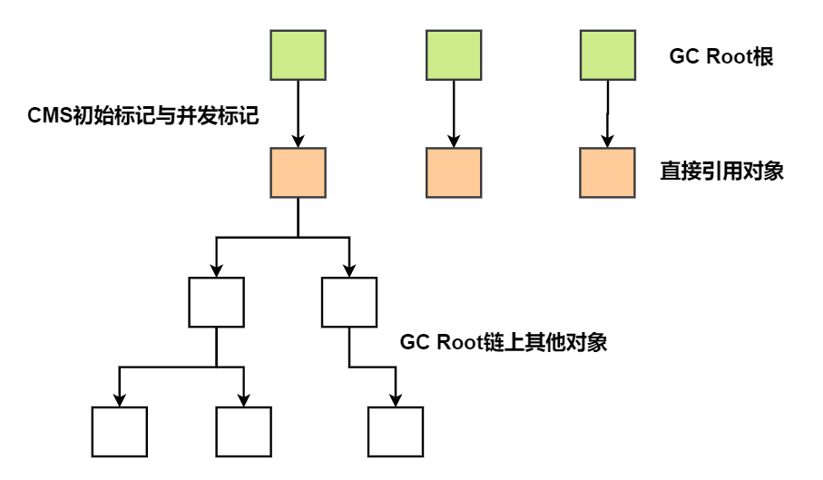

- **重新标记**：为了**修正并发标记**期间因用户程序**继续运作而导致标记产生变动**的那一部分对象的标记记录，需要停止其他线程，也需要进行 Stop The Word（STW）。**这个阶段的停顿时间一般会比初始标记阶段的时间稍长，但也远远比并发标记阶段时间短**。
- **并发清理**： 开启用户线程，同时 GC 线程开始对未标记的区域做**清扫**。**不需要**停顿。

在整个过程中**耗时最长的并发标记和并发清除**过程中，收集器线程都可以与用户线程一起工作，**不需要进行停顿**。需要 STW 的地方都是耗时比较短的初始标记和重新标记阶段。


###### (2) 优缺点

**优点**：**并发收集、低停顿**。

**缺点：**

- **对 CPU 资源敏感吞吐量低**：缩短停顿时间是以牺牲吞吐量和新生代空间来换取的：新生代空间变小，垃圾回收变得频繁，导致吞吐量下降。导致 CPU 利用率不够高。垃圾收集会和服务**抢资源**。
- **无法处理浮动垃圾**，可能出现 **Concurrent Mode Failure** 异常。**浮动垃圾**是指并发清除阶段由于**用户线程继续运行**而产生的垃圾，这部分垃圾只能到**下一次** GC 时才能进行回收。由于浮动垃圾的存在，因此需要预留出一部分内存，意味着 CMS 收集不能像其它收集器那样等待老年代快满的时候再回收。如果**预留的内存不够存放浮动垃圾**，那么也许没回收完就**再次触发 Full GC**，就会出现 **Concurrent Mode Failure**，这时虚拟机将临时启用 **Serial Old** 来替代 CMS。
- **标记 - 清除算法导致的空间碎片**，往往出现老年代空间剩余，但无法找到**足够大连续空间**来分配当前对象，不得不提前触发一次 **Full GC**。当然通过参数 -XX:+UseCMSCompactAtFullCollection 可以让 JVM 在执行完标记清除后再做整理。

###### (3) 参数

CMS 相关虚拟机参数：

- -XX:**+UseConcMarkSweepGC**：**启用 CMS**。
- -XX:**ConcGCThreads**：并发的 GC 线程数。
- -XX:+UseCMSCompactAtFullCollection：FullGC 之后做压缩整理（减少碎片），Mark Sweep **不会**自动进行碎片整理，需要在此配置。
- -XX:CMSFullGCsBeforeCompaction：多少次 FullGC 之后**压缩一次**，默认是 0，代表每次 FullGC 后都会压缩一次。
- -XX:CMSInitiatingOccupancyFraction: 当老年代使用达到该**比例**时会触发 FullGC（默认是92，这是百分比）。
- -XX:+UseCMSInitiatingOccupancyOnly：只使用设定的回收阈值(-XX:CMSInitiatingOccupancyFraction 设定的值)，如果不指定，JVM 仅在第一次使用设定值，后续则会自动调整。
- -XX:+CMSScavengeBeforeRemark：在 CMS GC **前启动一次 Minor GC**，目的在于**减少老年代对年轻代的引用**（因为年轻代很多对象都是垃圾对象），降低 CMS GC 的标记阶段时的开销，一般 CMS 的 GC 耗时 80% 都在**并发标记阶段**。
- -XX:+CMSParallellnitialMarkEnabled：表示在初始标记的多线程执行，减少 STW。
- -XX:+CMSParallelRemarkEnabled：在重新标记的时候多线程执行，降低 STW。

###### (4) 应用实例

**内存较小**的系统推荐使用：**ParNew+CMS**。一般的应用场景都是可以用这个的。

##### 7. G1收集器

###### (1) 概述

**G1**（Garbage-First），它是一款**面向服务端**应用的垃圾收集器，主要针对配备**多颗处理器及大容量内存**的机器，**以极高概率满足 GC 停顿时间要求的同时,还具备高吞吐量性能特征**。 JDK9 中默认的垃圾收集器就是 G1。

**G1 可以同时用在年轻代和老年代。**堆被分为新生代和老年代，其它收集器进行收集的范围都是整个新生代或者老年代中的一个，而 **G1 可以直接对新生代和老年代一起回收。**G1 的设计原则就是简单可行的性能调优，G1 将新生代，老年代的物理空间划分取消了。


G1 把**堆**划分成多个大小相等的**独立区域**（Region），新生代和老年代**不再**物理隔离，各个区域是**不一定连续**的。如下图所示。

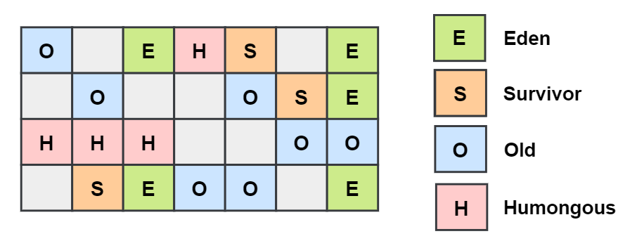

一般 **Region** 大小等于**堆大小除以 2048（个）**，比如堆大小为 4096 M，则 Region 大小为 2M，当然也可以用参数 "-XX:G1HeapRegionSize" 手动指定 Region 大小，但是推荐默认的计算方式。

G1 保留了**年轻代和老年代的概念**，但**不再是物理隔离**了，它们都是（**可以不连续**）Region 的集合。默认**年轻代**对堆内存的占比是 **5%**，如果堆大小为 4096 M，那么年轻代占据 200MB 左右的内存，对应大概是 100 个 Region，可以通过“-XX:G1NewSizePercent”设置**年轻代初始占比**，在系统运行中，JVM 会**不停的给年轻代增加更多**的 Region，但是最多新生代的占比不会超过 60%，可以通过“-XX:G1MaxNewSizePercent”调整。年轻代中的 Eden 和 Survivor 对应的 region 也跟之前一样，默认 **8:1:1**，假设年轻代现在有1000 个 region，eden 区对应 800 个，s0 对应 100 个，s1 对应 100 个。

一个 Region 可能之前是年轻代，如果 Region 进行了垃圾回收，之后可能又会变成老年代，也就是说 Region 的**区域功能可能会动态变化**。

G1 垃圾收集器对于对象什么时候会转移到老年代跟之前讲过的原则一样，**唯一不同的是对大对象的处理**，G1 有**专门分配大对象**的 Region 叫 **Humongous区**，而**不是让大对象直接进入老年代的 Region** 中。在 G1 中，大对象的判定规则就是一个**大对象**超过了一个 **Region 大小的 50%**，比如按照上面算的，每个 Region 是 2M，只要一个大对象超过了 1M，就会被放入 Humongous 中，而且一个大对象如果太大，可能会**横跨多个** Region 来存放。用 **Humongous** 区专门**存放短期巨型对象**，不用直接进老年代，可以节约老年代的空间，避免因为老年代空间不够的 GC 开销。Full GC 的时候除了收集年轻代和老年代之外，也会将 Humongous 区一并回收。

通过引入 **Region** 的概念，从而将原来的一整块内存空间划分成多个的**小空间**，使得每个**小空间**可以**单独**进行垃圾回收。这种划分方法带来了很大的灵活性，使得可预测的停顿时间模型成为可能。通过记录每个 Region 垃圾回收时间以及回收所获得的空间（这两个值是通过过去回收的经验获得），并维护一个**优先列表**，每次根据允许的收集时间，优先回收**价值最大**的 Region。每个 Region 都有一个 **Remembered Set**，用来记录该 Region 对象的引用对象所在的 Region。通过使用 Remembered Set，在做可达性分析的时候就可以**避免全堆扫描**。

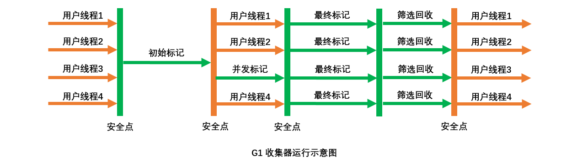

###### (2) 采集流程

如果**不计算**维护 Remembered Set 的操作，G1 收集器的运作大致可划分为以下几个步骤（前几个步骤与 CMS 收集器类似，主要区别在于**第四步**）：

- **初始标记**：类似 CMS 的初始标记，暂停所有的其他线程，并记录下 GC Roots 直接能引用的对象，**速度很快** 。
- **并发标记**：类似 CMS 的并发标记。
- **最终标记**：类似 CMS 的重新标记。为了修正在**并发标记期间**因用户程序**继续运作**而导致标记产生变动的那一部分标记记录，虚拟机将这段时间对象变化记录在线程的 Remembered Set Logs 里面，最终标记阶段需要把 Remembered Set Logs 的数据合并到 Remembered Set 中。这阶段需要停顿线程，但是可并行执行。
- **筛选回收**：首先对各个 Region 中的**==回收价值和成本进行排序==**，根据用户所期望的 GC **停顿时间(可以用 JVM 参数 -XX:MaxGCPauseMillis 指定)**来制定回收计划。比如说老年代此时有 1000 个 Region 都满了，但是因为根据预期设置的停顿时间，本次垃圾回收可能**只能停顿 200 毫秒**，那么通过之前回收成本计算得知，可能回收其中 800 个 Region 刚好需要 200ms，那么就只会回收 800 个 Region，尽量把 GC 导致的停顿时间控制在指定的范围内。此阶段其实也可以做到与用户程序一起并发执行，但是因为只回收**一部分 Region**，时间是用户可控制的，而且停顿用户线程将大幅度提高收集效率。

**G1 收集器在后台维护了一个优先列表，每次根据允许的收集时间，优先选择回收价值最大的 Region (这也就是它的名字 Garbage-First 的由来)，比如一个 Region 花 200ms 能回收 10M 垃圾，另外一个 Region 花 50ms 能回收 20M 垃圾，在回收时间有限情况下，G1 当然会优先选择后面这个 Region 回收**。这种使用 Region 划分内存空间以及有**优先级**的区域回收方式，保证了 G1 收集器在**有限时间内可以尽可能高的收集效率**。

G1 不管是年轻代或是老年代，**回收算法主要用的是==复制算法==**，**将一个 region 中的存活对象复制到另一个 region 中，这种不会像 CMS 那样回收完因为有很多内存碎片还需要整理一次，G1 采用复制算法回收几乎不会有太多内存碎片（看图上觉得可能也会有很多空格，这不算内存碎片，因为一个 region 格子可以存放很多对象）**。

总结 CMS 与 G1 的相同与不同：CMS 与 G1 的前面几个步骤都类似，初始标记、并发标记、再次标记（最终标记），不同主要在于最后一步的筛选回收的部分，G1 通过分 region 的方式可以设置**具体的停顿时间**，并且 G1 不会产生内存碎片。

###### (3) 特点

具备如下**特点**：

- **并行与并发**。G1 能充分利用 CPU、多核环境下的硬件优势，使用多个 CPU（CPU 或者 CPU核心）来**缩短** Stop-The-World 停顿时间。部分其他收集器原本需要停顿 Java 线程来执行 GC 动作，G1 收集器仍然可以通过并发的方式让程序继续执行。
- **空间整合**：**整体**来看是基于“**标记 - 整理**”算法实现的收集器，从**局部**（两个 Region 之间）上来看是基于“**复制**”算法实现的，这意味着运行期间**不会产生内存空间碎片**。
- **可预测的停顿**：这是 G1 相对于 CMS 的另一个大**优势**，**降低停顿时间**是 G1 和 CMS 共同的关注点，但 G1 除了追求低停顿外，还能建立**可预测的停顿时间模型**，能让使用者明确指定在一个**长度为 M 毫秒的时间片段**(通过参数"**-XX:MaxGCPauseMillis**"指定)内完成垃圾收集。

毫无疑问， 可以**由用户指定期望的停顿时间**是 G1 收集器很强大的一个功能， 设置不同的期望停顿时间， 可使得 G1 在不同应用场景中取得关注吞吐量和关注延迟之间的最佳平衡。 不过这里设置的“期望值”必须是符合实际的， 不能异想天开， 毕竟 G1 是要冻结用户线程来复制对象的， 这个停顿时间再怎么低也得有个**限度**。 它默认的停顿目标为**两百毫秒**， 一般来说， 回收阶段占到几十到一百甚至接近两百毫秒都很正常， 但如果把停顿时间调得非常低， 譬如设置为二十毫秒， 很可能出现的结果就是由于停顿目标时间太短， 导致每次选出来的回收集只占堆内存很小的一部分， 收集器收集的速度逐渐跟不上分配器分配的速度， 导致**垃圾慢慢堆积**。 很可能一开始收集器还能从空闲的堆内存中获得一些喘息的时间， 但应用运行时间一长就不行了， 最终占满堆引发 Full GC 反而降低性能， 所以通常把期望停顿时间设置为一两百毫秒或者两三百毫秒会是比较合理的。

###### (4) 参数

可配置的虚拟机参数如下：

- -XX:**+UseG1GC**：使用 G1 收集器。

- -XX:**ParallelGCThreads**：指定 GC 工作的**线程数量**。
- -XX:G1HeapRegionSize：指定 Region 大小(1MB~32MB，且必须是 2 的幂)，默认将整堆划分为 2048 个分区。
- -**XX:MaxGCPauseMillis**：**目标暂停时间**(默认 **200ms**)。
- -XX:G1NewSizePercent：新生代内存初始空间(默认整堆 5%)。
- -XX:G1MaxNewSizePercent：新生代内存最大空间。
- -XX:TargetSurvivorRatio：Survivor 区的填充容量(默认 50%)，Survivor 区域里的一批对象(年龄1 + 年龄2 + 年龄n 的多个年龄对象)总和超过了 Survivor 区域的 50%，此时就会把年龄 n (含)以上的对象都放入老年代。
- -XX:MaxTenuringThreshold：最大年龄阈值(默认 15)。
- -XX:InitiatingHeapOccupancyPercent：老年代占用空间达到整堆内存阈值(默认 45%)，则执行新生代和老年代的混合收集(**MixedGC**)，比如我们之前说的堆默认有 2048 个 Region ，如果有接近 1000 个 Region 都是老年代的 Region ，则可能就要触发 MixedGC 了。
- -XX:G1HeapWastePercent(默认 5%)：GC 过程中空出来的 region 是否充足阈值，在混合回收的时候，对 Region 回收都是基于复制算法进行的，都是把要回收的 Region 里的存活对象放入其他 Region，然后这个 Region 中的垃圾对象全部清理掉，这样的话在回收过程就会不断空出来新的 Region，一旦空闲出来的 Region 数量达到了堆内存的 5%，此时就会立即停止混合回收，意味着本次混合回收就结束了。
- -XX:G1MixedGCLiveThresholdPercent(默认85%)： Region 中的存活对象低于这个值时才会回收该 Region ，如果超过这个值，存活对象过多，回收的的意义不大。
- -XX:G1MixedGCCountTarget：在一次回收过程中指定做几次筛选回收(默认 8 次)，在最后一个筛选回收阶段可以回收一会，然后暂停回收，恢复系统运行，一会再开始回收，这样可以让系统不至于单次停顿时间过长。

###### (5) G1垃圾收集分类

**YoungGC**：YoungGC 并不是说现有的 Eden 区放满了就会马上触发，G1 会计算下现在 Eden 区回收大概要多久时间，如果回收时间远远小于参数 -XX:MaxGCPauseMills 设定的值，那么**增加年轻代的 region**，继续存放新对象，不会马上做 Young GC，**直到下一次 Eden 区放满**，G1 计算回收时间接近参数 -**XX:MaxGCPauseMills** 设定的值，那么就会触发 Young GC。

**MixedGC**：不是 FullGC，老年代的堆占有率达到参数(**-XX:InitiatingHeapOccupancyPercent**)设定的值则触发，回收**所有的 Young 和部分 Old** (根据期望的 GC 停顿时间确定 old 区垃圾收集的优先顺序)以及大对象区，正常情况 G1 的垃圾收集是先做 **MixedGC**，主要使用**复制算法**，需要把各个 region 中存活的对象拷贝到别的 region 里去，拷贝过程中如果发现**没有足够的空 region** 能够承载拷贝对象就会触发一次 Full GC。

**Full GC**：停止**系统程序**，然后采用单线程进行标记、清理和压缩整理，好空闲出来一批 Region 来供下一次 MixedGC 使用，这个过程是非常耗时的。

###### (6) G1垃圾收集器优化建议

这里**核心在于调节 -==XX:MaxGCPauseMills== 这个参数的值**，需要保证**年轻代 GC 别太频繁**的同时，还得考虑每次 GC 过后的存活对象有多少，避免存活对象太多快速进入老年代，**频繁触发 MixedGC**。

假设参数 -**XX:MaxGCPauseMills（停顿时间）** 设置的**值很大**，导致系统运行很久，年轻代可能都占用了堆内存的 60%了，此时才触发年轻代 GC。那么存活下来的对象可能就会**很多**，此时就会导致 Survivor 区域放不下那么多的对象，就会进入**老年代**中。或者是你年轻代 GC 过后，存活下来的对象过多，导致进入 Survivor 区域后触发了动态年龄判定规则，达到了 Survivor 区域的 50%，也会快速导致一些对象进入老年代中。

> **什么场景适合使用**G1?

1. 50% 以上的堆被**存活对象**占用。
2. 对象分配和晋升的**速度变化**非常大。
3. 垃圾回收**时间特别长**，超过 1 秒。
4. 8GB 以上的**堆内存**(建议值)，也就是**大内存**下。
5. 停顿时间是 **500ms 以内**。

###### (7) G1应用实例

对于 Kafka 这样的支撑高并发消息系统来说，**每秒处理几万甚至几十万消息**时很正常的，一般部署 kafka 需要用**大内存机器**(比如 64G)，也就是说可以给年轻代分配三四十 G 的内存用来支撑高并发处理，这里就涉及到一个问题了，以前常说的对于 eden 区的 Young GC 是**很快**的，这种情况下它的执行还会很快吗？很显然不可能，因为内存太大，处理还是要花不少时间的，假设三四十 G 内存回收可能最快也要**几秒钟**，按 kafka 这个**并发量放满三四十 G 的 eden 区可能也就一两分钟**，那么意味着整个系统**每运行一两分钟就会因为 Young GC 卡顿几秒钟**没法处理新消息，显然是不行的。那么对于这种情况如何优化了，可以使用 G1 收集器，设置 -XX:MaxGCPauseMills 为 **50ms**，假设 50ms 能够回收三到四个 G 内存，然后 50ms 的卡顿其实完全能够接受，用户几乎无感知，那么整个系统就可以在卡顿几乎无感知的情况下**一边处理业务一边收集垃圾**。

**G1 天生就适合这种大内存机器的 JVM 运行，可以比较完美的解决大内存垃圾回收时间过长的问题。**

##### 8. 比较与选择

|        收集器         | 单线程/并行 | 串行/并发 |  新生代/老年代  |       收集算法       |     目标     |                   适用场景                    |
| :-------------------: | :---------: | :-------: | :-------------: | :------------------: | :----------: | :-------------------------------------------: |
|      **Serial**       |   单线程    |   串行    |     新生代      |         复制         | 响应速度优先 |          单 CPU 环境下的 Client 模式          |
|      **ParNew**       |    并行     |   串行    |     新生代      |       复制算法       | 响应速度优先 |   多 CPU 环境时在 Server 模式下与 CMS 配合    |
| **Parallel Scavenge** |    并行     |   串行    |     新生代      |       复制算法       |  吞吐量优先  |       在后台运算而不需要太多交互的任务        |
|    **Serial Old**     |   单线程    |   串行    |     老年代      |      标记-整理       | 响应速度优先 |  单 CPU 环境下的 Client 模式、CMS 的后备预案  |
|   **Parallel Old**    |    并行     |   串行    |     老年代      |      标记-整理       |  吞吐量优先  |       在后台运算而不需要太多交互的任务        |
|        **CMS**        |  **并行**   | **并发**  |     老年代      |      标记-清除       | 响应速度优先 | 集中在互联网站或 B/S 系统服务端上的 Java 应用 |
|        **G1**         |  **并行**   | **并发**  | 新生代 + 老年代 | 标记-整理 + 复制算法 | 响应速度优先 |       **面向服务端应用，将来替换 CMS**        |

**内存较小推荐使用 ParNew+CMS。内存较大使用 G1。**

一些选用的策略：

1. 优先调整堆的大小让服务器自己来选择。
2. 如果内存小于 100M，使用串行收集器。
3. 如果是**单核**，并且没有停顿时间的要求，串行或 JVM 自己选择。
4. 如果允许停顿时间超过 1 秒，选择并行或者 JVM 自己选。
5. 如果响应时间最重要，并且不能超过 1 秒，使用并发收集器。

Jdk1.7 默认垃圾收集器 Parallel Scavenge（新生代）+Parallel Old（老年代）。

**Jdk1.8** 默认垃圾收集器 **Parallel Scavenge（新生代）+Parallel Old（老年代）**。

**Jdk1.9** 默认垃圾收集器 **G1**。


#### 垃圾收集器参数总结

垃圾收集相关的常用参数：

|              参数              |                             描述                             |
| :----------------------------: | :----------------------------------------------------------: |
|        **UseSerialGC**         | 虚拟机运行在 Client 模式下的默认值，打开此开关后，使用 Serial + Serial Old 的收集器组合进行内存回收 |
|          UseParNewGC           | 打开此开关后，使用  ParNew + Serial Old 的收集器组合进行内存回收 |
|       UseConcMarkSweepGC       | 打开此开关后，使用 ParNew+ CMS + Serial Old 的收集器组合进行内存回收。Serial Old 收集器将作为 CMS 收集器出现 Concurrent Mode Failure 失败后的后备收集器使用 |
|         UseParallelGC          | 虚拟机运行在 Server 模式下的默认值，打开此开关后，使用 Parallel Scavenge + Serial Old (PS Mark Sweep) 的收集器组合进行内存回收 |
|       UserParallelOldGC        | 打开此开关后，使用 Parallel Scavenge + Parallel Old 的收集器组合进行内存回收 |
|       **SurvivorRatio**        | 新生代中 Eden 区域与 Survivor 区域的容量比值，默认为 8，代表Eden: Survivor = **8:1** |
|     PretenureSizeThreshold     | 直接晋升到老年代的对象大小，设置这个参数后，大于这个参数的对象将直接在老年代分配 |
|      MaxTenuringThreshold      | 晋升到老年代的对象年龄。每个对象在坚持过一次 Minor GC 之后，年龄就增加1，当超过这个参数值时就进入老年代 |
|     UseAdaptiveSizePolicy      |     动态调整 Java 堆中各个区域的大小以及进入老年代的年龄     |
|     HandlePromotionFailure     | 是否允许分配担保失败，即老年代的剩余空间不足以应付新生代的整个Eden 和 Survivor 区的所有对象都存活的极端情况 |
|     **ParallelGCThreads**      |              设置并行 GC 时进行内存回收的线程数              |
|          GCTimeRatio           | GC 时间占总时间的比率，默认值是 99， 即允许 1% 的 GC 时间。仅在使用 Parallel Scavenge 收集器时生效 |
|      **MaxGCPauseMillis**      | 设置 GC 的**最大停顿**时间。仅在使用 Parallel Scavenge 收集器时生效 |
| CMSInitiatingOccupancyFraction | 设置 CMS 收集器在老年代时间被使用多少后触发垃圾收集。默认值为68%，仅在使用 CMS 收集器时生效 |
| UseCMSCompactAtFullCollection  | 设置 CMS 收集器在完成垃圾收集后是否要进行一次内存碎片整理。仅在使用 CMS 收集器时生效 |
|   CMSFullGCsBeforeCompaction   | 设置 CMS 收集器在进行若干次垃圾收集后再启动一次内存碎片整理，仅在使用 CMS 收集器时生效 |


#### 虚拟机参数调优实例

**==调优全部都是根据业务具体的场景和 JVM 内存分配机制来的==**。

##### 1. 电商系统优化JVM参数(ParNew+CMS)

大型电商系统后端现在一般都是拆分为多个**子系统**部署的，比如，商品系统，库存系统，订单系统，促销系统，会员系统等等。这里以比较核心的订单系统为例： 

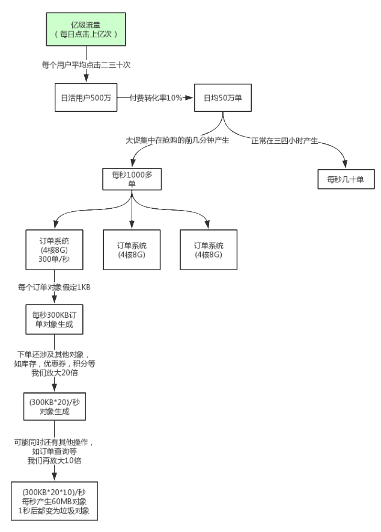

对于 **8G** 内存的服务器一般是分配 **4G** 内存给 JVM，一般的 JVM **参数配置**如下：

```java
-Xms3072M -Xmx3072M -Xmn1536M -Xss1M -XX:MetaspaceSize=256M -XX:MaxMetaspaceSize=256M  -XX:SurvivorRatio=8
```

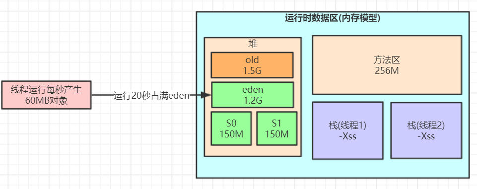

系统按**每秒生成 60MB 的速度**来生成对象，大概运行 **20 秒**就会撑满 eden 区，会触发 Minor GC，大概会有 95% 以上对象成为垃圾被回收，可能最后**一两秒**生成的对象**还被引用着**，暂估为 **100MB** 左右，那么这 100M 会被挪到 **S0 区**，根据**动态对象年龄判断原则**，这 **100MB** 对象同龄而且总和大于 S0 区的 **50%**，那么这些对象都会被挪到**老年代**，到了老年代不到**一秒**又变成了**垃圾对象**，很明显，**survivor 区**大小设置有点小。

分析下系统业务（其实**电商很多业务**都这样）就知道，明显**大部分**对象都是**短生存周期**的，**根本不应该频繁进入老年代**，也**==没必要给老年代维持过大的内存空间==，得让对象尽量留在新生代里**。

于是可以**更新**下 JVM 参数设置：

```java
-Xms3072M -Xmx3072M -Xmn2048M -Xss1M -XX:PermSize=256M -XX:MaxPermSize=256M  
-XX:SurvivorRatio=8 
```

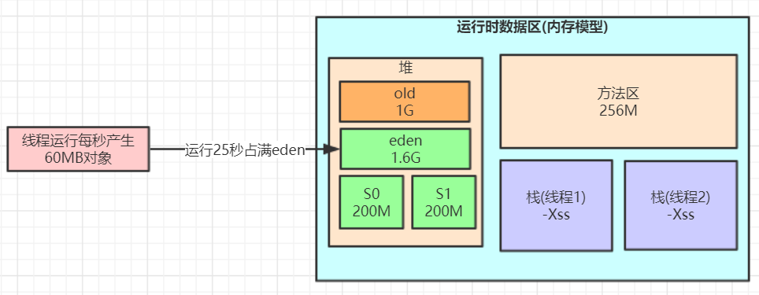

这样就降低了因为**对象动态年龄判断原则导致的对象频繁进入老年代**的问题，其实**==很多优化无非就是让短期存活的对象尽量都留在 survivor 里，不要进入老年代，这样在 minor gc 的时候这些对象都会被回收，不会进到老年代从而导致 full gc==**。

对于对象年龄应该为多少才移动到老年代比较合适，本例中一次 Minor GC 要间隔二三十秒，**大多数对象一般在几秒内就会变为垃圾**，完全可以将默认的 15 岁改小一点，比如改为 5，那么意味着对象要经过 **5 次 Minor GC** 才会进入老年代，整个时间也有一两分钟了，如果对象这么**长时间都没被回收**，完全可以认为这些对象是会存活的比较长的对象，可以移动到老年代，而不是继续一直占用 survivor 区空间。

对于多大的对象直接进入老年代(参数 -XX:PretenureSizeThreshold)，这个一般可以结合你自己系统看下有没有什么大对象生成，预估下大对象的大小，一般来说设置为 **1M** 就差不多了，很少有超过 1M 的大对象，这些对象一般就是系统中初始化分配的缓存对象，比如**大的缓存** List，Map 之类的对象。

可以再次适当调整 JVM 参数如下：

```java
-Xms3072M -Xmx3072M -Xmn2048M -Xss1M  -XX:PermSize=256M -XX:MaxPermSize=256M  -XX:SurvivorRatio=8 
-XX:MaxTenuringThreshold=5 -XX:PretenureSizeThreshold=1M -XX:+UseParNewGC -XX:+UseConcMarkSweepGC
```

对于**老年代 CMS 的参数**如何设置可以思考下，首先想下当前这个系统有**哪些对象**可能会长期存活躲过 5 次以上  Minor GC 最终进入老年代。**无非就是那些 Spring 容器里的 Bean，线程池对象，一些初始化缓存数据对象等，这些加起来充其量也就几十 MB。**

还有就是某次 Minor GC 完了之后还有超过 200M 的对象存活，那么就会直接**进入老年代**，比如**突然某一秒瞬间要处理五六百单，那么每秒生成的对象可能有一百多 M，再加上整个系统可能压力剧增，一个订单要好几秒才能处理完，下一秒可能又有很多订单过来。**

可以估算下大概每隔**五六分钟**出现一次这样的情况，那么大概**半小时到一小时**之间就可能因为老年代满了触发一次 Full GC，Full GC 的触发条件还有之前说过的**老年代空间分配担保机制**，历次的 Minor GC 挪动到老年代的对象大小肯定是非常小的，所以几乎**不会**在 Minor GC 触发之前由于老年代空间分配担保失败而产生 Full GC，其实在半小时后发生 Full GC，这时候已经过了抢购的最高峰期，后续可能几小时才做一次 Full GC。对于碎片整理，因为都是 1 小时或几小时才做一次 FullGC，是可以每做**完一次就开始碎片整理**。

综上，只要**年轻代**参数设置合理，老年代 CMS 的参数设置**基本都可以用默认值**，如下所示：

```java
-Xms3072M -Xmx3072M -Xmn2048M -Xss1M  -XX:PermSize=256M -XX:MaxPermSize=256M  -XX:SurvivorRatio=8 
-XX:MaxTenuringThreshold=5 -XX:PretenureSizeThreshold=1M -XX:+UseParNewGC -XX:+UseConcMarkSweepGC 
-XX:CMSInitiatingOccupancyFaction=92 -XX:+UseCMSCompactAtFullCollection -XX:CMSFullGCsBeforeCompaction=0
```

总结一下，核心思想就是：让**长久存活的对象早到老年代**，**尽量别让短生命周期的对象跑到老年代去**，让它们在新生代就被处理掉。

##### 2. 系统频繁Full GC导致系统卡顿实例

配置如下：

- 机器配置：2 核 4G，JVM内存大小：2G，系统运行时间：7天。
- 期间发生的 Full GC 次数和耗时：500 多次，200 多秒。
- 期间发生的 Young GC 次数和耗时：1 万多次，500 多秒。

大致算下来每天会发生 70 多次 Full GC，**平均每小时 3 次**，每次 Full GC 在 400 毫秒左右（太频繁了）；

每天会发生 1000 多次 Young GC，每分钟会发生 1 次，每次 Young GC 在 **50 毫秒**左右。

JVM 参数设置如下：

```java
-Xms1536M -Xmx1536M -Xmn512M -Xss256K -XX:SurvivorRatio=6  -XX:MetaspaceSize=256M -XX:MaxMetaspaceSize=256M 
-XX:+UseParNewGC  -XX:+UseConcMarkSweepGC  -XX:CMSInitiatingOccupancyFraction=75 -XX:+UseCMSInitiatingOccupancyOnly 
```

画出对应的图：

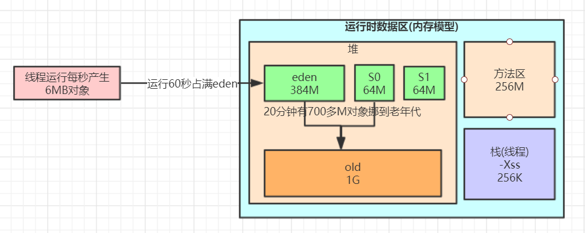

这里结合**对象挪动到老年代那些规则**推理问题。也就是基本上都是根据**内存分配策略并结合实际的场景**来看这些设置的参数是否合理，然后进行调优。比如下面的代码：

```java
import java.util.ArrayList;

@RestController
public class IndexController {

    @RequestMapping("/user/process")
    public String processUserData() throws InterruptedException {
        ArrayList<User> users = queryUsers();

        for (User user: users) {
            //TODO 业务处理
            System.out.println("user:" + user.toString());
        }
        return "end";
    }

    /**
     * 模拟批量查询用户场景
     * @return
     */
    private ArrayList<User> queryUsers() {
        ArrayList<User> users = new ArrayList<>();
        for (int i = 0; i < 5000; i++) {
            users.add(new User(i,"zhuge"));
        }
        return users;
    }
}
```

模拟了一个示例程序，**打印了 jstat 的结果**如下：

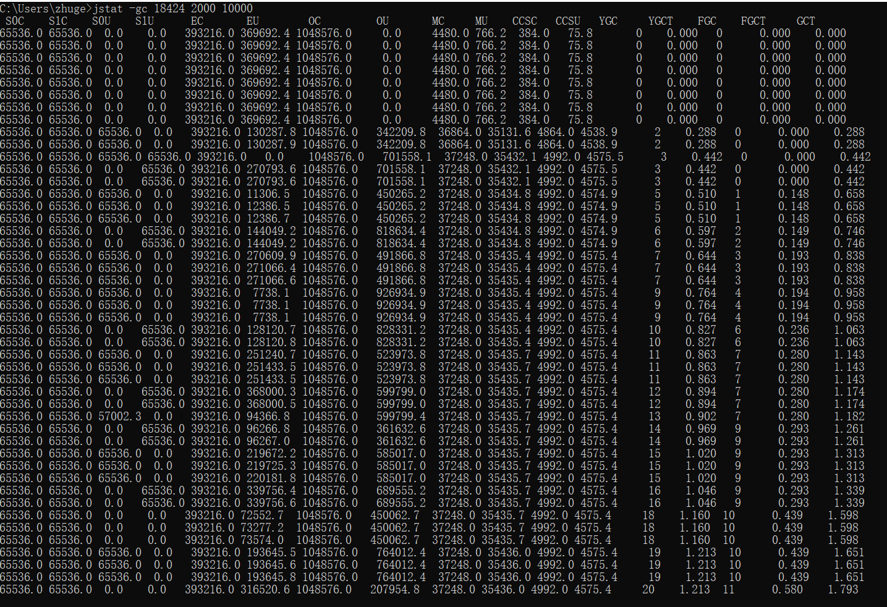

可以看到 young gc 和 full gc 都太频繁了，而且看到有**大量的对象频繁的被挪动到老年代**，这种情况可以借助 jmap 命令大概看下是什么对象。

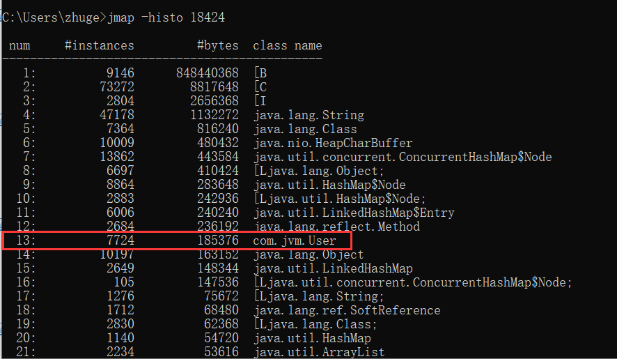

正是代码中的对象。对于这种业务场景可以**先优化下 JVM 参数**：

```java
-Xms1536M -Xmx1536M -Xmn1024M -Xss256K -XX:SurvivorRatio=6  -XX:MetaspaceSize=256M -XX:MaxMetaspaceSize=256M 
-XX:+UseParNewGC  -XX:+UseConcMarkSweepGC  -XX:CMSInitiatingOccupancyFraction=92 -XX:+UseCMSInitiatingOccupancyOnly 
```

改进后画图如下：

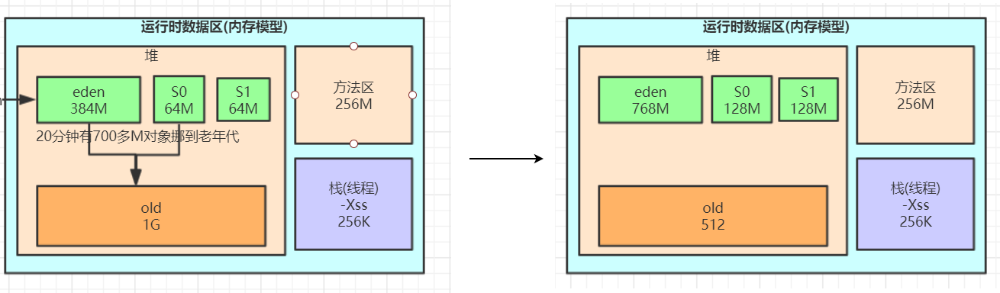

所以这里其实**大概**就是触发了内存分配策略中的**对象动态年龄判定机制**，这里可能一秒钟产生 6M 对象，原本 From 区才 64M，50% 才 32M，这里如果高并发下，许多线程的任务在段时间内执行不玩，造成大量存活对象的积压，所以会触发 GC，此时很容易达到 S0 或 S1 的 50%，触发对象动态年龄判定机制，所以这些对象直接放到老年代中，导致过不了太久老年代就满了，所以造成频繁 FullGC。所以这里优化就是减少老年代的内存（其实大部分对象都是短周期的），并给年轻代多一些内存。

如果这样改进效果不大，可以考虑一下机制，比如是否有太多大对象。


#### 内存泄漏与内存溢出

##### 1. 内存泄漏

**内存泄露**：是指**无用对象**（不再使用的对象）**持续占有内存**或无用对象的内存得不到及时释放，从而造成的内存空间的浪费称为内存泄露。

Java 在有向图中，存在通路可以与其相连但是这些对象是无用的，即程序以后不会再使用这些对象就可能造成内存泄漏。因为这些对象不会被 GC 所回收，然而它却占用内存。

##### 2. 内存泄漏原因

那么，Java 内存泄漏根本原因是什么呢？**长生命周期的对象持有短生命周期对象的引用就很可能发生内存泄露**，尽管短生命周期对象已经不再需要，但是**因为长生命周期对象持有它的引用而导致==不能被回收==**，这就是 Java 中内存泄露的发生场景。具体主要有如下几大类：

###### (1) 静态集合类

使用静态集合类，比如 Set、Vector、HashMap 等集合类的时候需要特别注意。当这些类被定义成静态的时候，由于他们的生命周期跟应用程序一样长，这时候就有可能发生内存泄漏。 

```java
// 例子 
class StaticTest { 
    private static Vector v = new Vector(10); 
    public void init() { 
        for (int i = 1; i < 100; i++) { 
            Object object = new Object(); 
            v.add(object); 
            object = null; 
        } 
    } 
} 
```

在上面的代码中，循环申请 object 对象，并添加到 Vector 中，然后设置 object = null（就是清除栈中引用变量object），但是这些对象被 vector 引用着，必然不能被 GC 回收，造成内存泄露。因此要释放这些对象，还需要将它们从 vector中 删除，最简单的方法就是将 **vector=null**，清空集合类中的引用。 

######  (2) 监听器

在 Java 编程中经常都需要和监听器打交道，通常一个应用中会用到很多监听器，但往往在释放的时候却没有去删除这些监听器，从而增加了内存泄漏的机会。 

###### (3) 各种连接

比如**数据库连接**（dataSourse.getConnection()），网络连接 (socket) 和 IO 连接，除非其显式的调用了其 **close**() 方 法将其连接关闭，**否则是不会自动被 GC 回收的**。对于 Resultset 和 Statement 对象可以不进行显式回收，但 Connection 一定要显式回收，因为 Connection 在任何时候都无法自动回收，而 Connection一旦回收，Resultset 和 Statement 对象就会立即为 NULL。但是如果使用**连接池**，情况就不一样了，除了要显式地关闭连接，还必须显式地关闭 Resultset Statement 对象（关闭其中一个，另外一个也会关闭），否则就会造成大量的 Statement 对象无法释放，从而引起内存泄漏。这种情况下一般都会在 try 里面去的连接，在 finally 里面释放连接。 

###### (4) 内部类和外部模块等的引用

**内部类**的引用是比较容易遗忘的一种，而且一旦没释放可能导致一系列的后继类对象没有释放。在调用外部模块的时候，也应该注意防止内存泄漏，如果模块 A 调用了外部模块 B 的一个方法，如： public void register(Object o) 这个方法有可能就使得 A 模块持有传入对象的引用，这时候需要查看 B 模块是否提供了出去引用的方法，这种情况容易忽略，而且发生内存泄漏的话，还比较难察觉。 

###### (5) 单例模式

因为单利对象初始化后将在 JVM 的**整个生命周期内存在**，如果它持有一个外部对象的（生命周期比较短）引用，那么这个外部对象就不能被回收，从而导致内存泄漏。如果这个外部对象还持有其他对象的引用，那么内存泄漏更严重。 

##### 3.  **内存泄露查询工具**

- **MemoryAnalyzer**：一个功能丰富的 JAVA **堆转储**文件分析工具，可以发现内存漏洞和减少内存消耗。
- **EclipseMAT**：是一款开源的 JAVA 内存分析软件，查找内存泄漏，能容易找到大块内存并验证谁在一直占用它，它是基于 Eclipse RCP(Rich Client Platform)，可以下载 RCP 的独立版本或者 Eclipse 的插件。
- **JProbe**：分析 Java 的**内存泄漏**。 

##### 4. 内存溢出

**内存溢出**：指程序运行过程中**无法申请到足够的内存**而导致的一种错误。**内存泄露是内存溢出的一种诱因**，不是唯一因素。


#### 溢出异常

##### 1. 堆溢出异常

堆用于存储对象实例，只要不断地创建对象，并且保证 GC Roots 到对象之间有可达路径来避免垃圾回收机制清除这些对象，那么在**对象数量到达最大堆的容量限制**后就会产生内存溢出异常。

将堆的大小限制为 20MB，不可扩展（将堆的最小值 -Xms 参数与最大值 -Xmx 参数设置为一样即可避免堆自动扩展），通过参数 **-XX:+HeapDumpOnOutOfMemoryError** 可以让虚拟机在出现内存溢出异常时 Dump 出当前的内存堆转储快照以便后续分析。

```java
public class HeapOOM {

    static class OOMObject{}
    public static void main(String[] args) {
        List<OOMObject> list = new ArrayList<HeapOOM.OOMObject>();
        while(true) {
            list.add(new OOMObject());
        }
    }
}
```

当出现堆内存溢出时，异常堆栈信息“java.lang.OutOfMemoryError”会跟着进一步提示 “**Java heap space**”。

要解决这个区域的异常，一般的手段是先通过**内存映像分析工具**（如 Eclipse Memory Analyzer）对 Dump 出来的**堆转储快照进行分析**，重点是确认内存中的对象是否是必要的，也就是要先分清除到底是出现了**内存泄漏（Memory Leak）还是内存溢出（Memory Overflow）。**

如果是**内存泄漏**，可进一步通过工具查看泄漏对象到 GC Roots 的引用链。于是就能找到泄露对象是通过怎样的路径与 GC Roots 相关联并导致垃圾收集器无法自动回收他们的。掌握了泄漏对象的类型信息及 GC Roots 引用链的信息，就可以比较准确的定位出泄漏代码的位置。

如果**不存在泄漏**，换句话说就是内存中的对象确实还必须存活着，那就应当检查虚拟机的**堆参数**（-Xmx 与 -Xms），与机器物理内存对比看是否还可以调大，从代码上检查是否存在某些对象生命周期过长、持有状态时间过长的情况，尝试减少的程序运行期的内存消耗。

##### 2. 虚拟机栈和本地方法栈溢出

由于在 Hotspot 虚拟机中**不区分虚拟机栈和本地方法栈**，可以通过修改 **-Xss** 设定。

- 如果线程请求的栈深度大于虚拟机允许的**最大深度**，将抛出 **StackOverflowError** 异常。
- 如果虚拟机在扩展栈时无法申请到足够的**内存空间**，将抛出 **OutOfMemoryError** 异常。

这两种异常有一些重叠的部分：当栈空间无法继续分配时，到底是内存太小，还是已经使用的栈空间过大，其本质只是对同一件事情的两种不同描述。

可以通过递归调用的方式进行测试：

```java
public void stackLeak() {
	stackLeak();
}
```

##### 3. 方法区溢出

**动态代理**可能在运行时产生大量的**类导致方法区溢出**，所以 Spring 等实用 CGLIB 可以配置较大的**方法区**。

##### 4. 本机直接内存溢出

**DirectoryMemory** 可以通过 -**XX：MaxDirectMemorySize** 指定，如果不指定则默认与 Java 堆大小一样。其明显特征是 Heap Dump 文件中不会看见明显的异常，如果 Dump 文件很小，程序中又直接或者间接**使用了 NIO**，可以检查一下是否是这方面原因。


#### 常见面试题

- 如何判断对象是否死亡（两种方法）。
- 简单的介绍一下强引用、软引用、弱引用、虚引用（虚引用与软引用和弱引用的区别、使用软引用能带来的好处）。
- 如何判断一个常量是废弃常量
- 如何判断一个类是无用的类
- 垃圾收集有哪些算法，各自的特点？
- HotSpot 为什么要分为新生代和老年代？
- 常见的垃圾回收器有哪些？
- 介绍一下 CMS，G1 收集器。
- Minor GC 和 Full GC 有什么不同呢？


#### 参考资料

- 如何阅读GC日志：https://www.jianshu.com/p/4e508ed55155

- 《深入理解 Java 虚拟机：JVM 高级特性与最佳实践（第二版》
- https://my.oschina.net/hosee/blog/644618
- https://docs.oracle.com/javase/specs/jvms/se8/html/index.html


