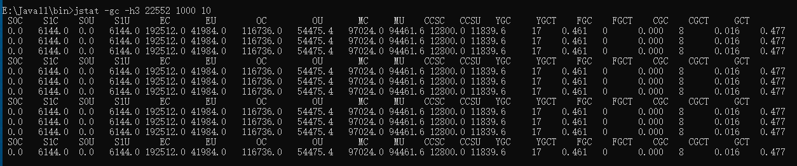
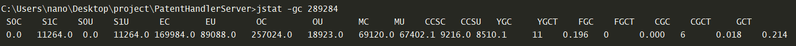
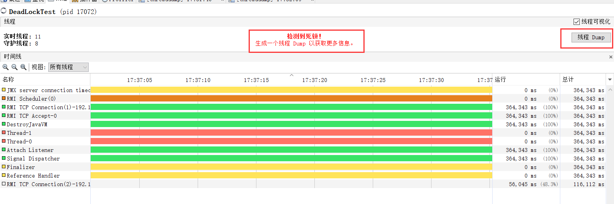
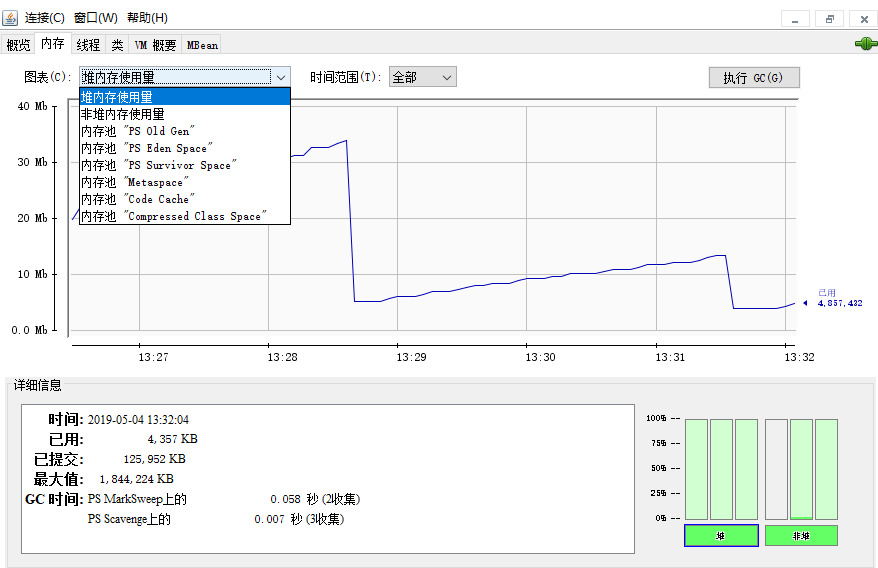
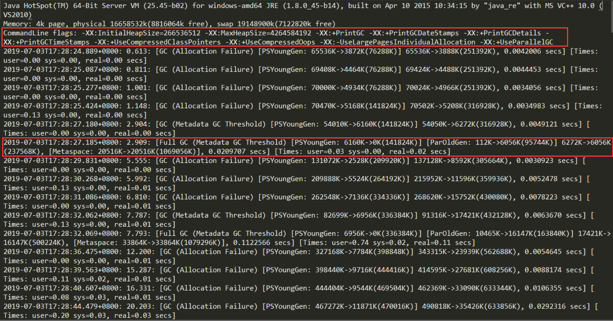
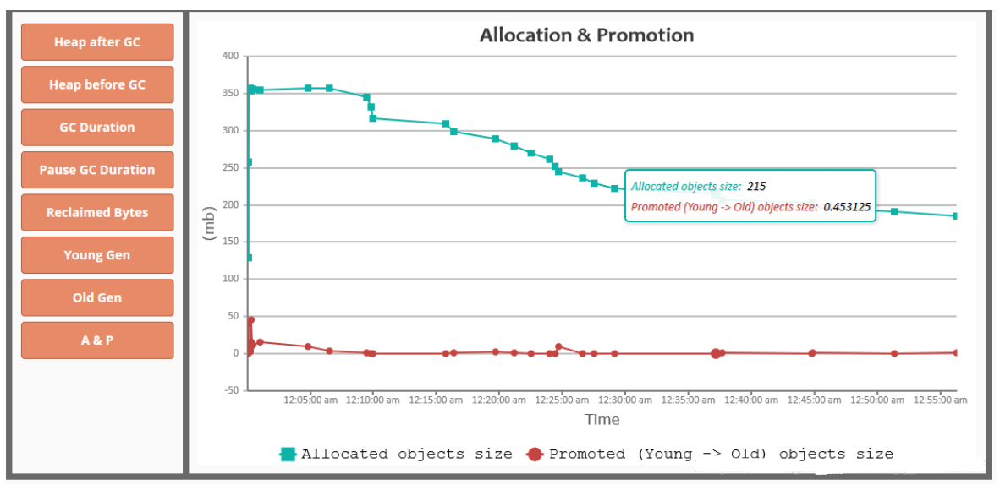

[TOC]

### JVM监控和故障处理工具

给一个系统定位问题可以分析**运行日志、异常堆栈、GC日志、线程快照文件（threaddump/javacore文件）、堆转储快照（heapdump/hprof文件）**等内容。

#### JDK的命令行工具

这些命令在 JDK 安装目录下的 **bin** 目录下：

|    名称    |                           主要作用                           |
| :--------: | :----------------------------------------------------------: |
|  **jps**   | Jvm Process Status Tool，显示指定系统内所有的 HotSpot 虚拟机**进程** |
| **jstat**  | Jvm Statistics Monitoring Tool，用于收集 HotSpot **虚拟机各方面的运行数据** |
| **jinfo**  |     Configuration Info for Java，显示**虚拟机配置**信息      |
|  **jmap**  | Memory Map for Java，生成虚拟机的**内存转储快照**（heapdump 文件） |
|  **jhat**  | Jvm Heap Dump Browser，用于**分析 heapmap 文件**，它会建立一个 http/html 服务器让用户可以在浏览器上查看分析结果 |
| **jstack** |        Stack Trace for Java，显示虚拟机的**线程快照**        |

##### 1. jps虚拟机进程状况工具

以列出正在运行的**虚拟机进程**，并显示虚拟机执行**主类名称**以及这些进程的本地虚拟机**唯一 ID**。看到 ID 之后就能定位到某个 Java 应用，然后进行后续操作。jps 命令格式：

```java
jps [options] [hostid]
```

**options 参数选项说明如下：**

```shell
-q # 不输出类名、Jar名和传入main方法的参数
-m # 输出传入main方法的参数
-l # 输出main类或Jar的全限名
-v # 输出传入JVM的参数
```

不加参数：

```java
C:\Users\Nano>jps
7360 NettyClient2
17396
7972 Launcher
16504 Jps
17340 NettyServer
```

- **jps -l**:  输出**主类的全名**，如果进程执行的是 **Jar 包**，输出 Jar 路径。

```java
C:\Users\Nano>jps -l
7360 firstNettyDemo.NettyClient2
17396
7972 org.jetbrains.jps.cmdline.Launcher
16492 sun.tools.jps.Jps
17340 firstNettyDemo.NettyServer
```

- **jps -v**：输出虚拟机进程启动时 **JVM 参数**。

##### 2. ==jstat==监视虚拟机各种运行状态信息

###### (1) 概述

jstat 是用于监视虚拟机各种**运行状态信息**的命令行工具。它可以显示本地或者远程虚拟机进程中的**类装载、内存、垃圾回收、JIT编译**等运行数据，可以查看**堆内存各部分的使用量，以及加载类的数量**，在仅提供了纯文本控制台环境的服务器上，它将是**运行期定位虚拟机性能问题的==首选工具==**。**非常重要**！！！可以用于**内存分配调优**，需要用熟悉！

jstat 的命令格式：

```java
jstat [-命令选项] [vmid] [间隔时间(毫秒)] [查询次数]
```

常见的 **option** 如下：

```java
jstat -class vmid 		// 显示ClassLoader的相关信息
jstat -compiler vmid 	// 显示JIT编译的相关信息
jstat -gc vmid   		// 显示与GC相关的堆信息
jstat -gccapacity vmid 	// 显示整个堆内存的容量及使用情况
jstat -gcnew vmid 		// 显示新生代信息
jstat -gcnewcapcacity vmid 	// 显示新生代大小与使用情况
jstat -gcold vmid 		// 显示老年代和永久代的信息
jstat -gcoldcapacity vmid 	// 显示老年代的大小
jstat -gcpermcapacity vmid 	// 显示永久代大小
jstat -gcutil vmid 		// 显示垃圾收集信息
```

根据这些参数可以对各个区参数进行查看，出来的参数大同小异。

例子 1：

```java
jstat -gc -h3 31736 1000 10
```



表示分析**进程 id 为 31736** 的 **GC** 情况，每隔 1000ms 打印一次记录，打印 10 次停止，每 3 行后打印指标头部。

例子 2：需要每 1000 毫秒查询一次进程 16418 垃圾收集状况，一共查询 10 次，命令如下：


###### (2) 垃圾回收统计

**==jstat -gc pid== 最常用**，可以评估程序内存使用及 **GC 压力整体情况**，需记住！



- S0C：第一个幸存区的大小，单位 KB。
- S1C：第二个幸存区的大小。
- S0U：第一个幸存区的使用大小。
- S1U：第二个幸存区的使用大小。
- EC：伊甸园区的大小。
- EU：伊甸园区的使用大小。
- OC：老年代大小。
- OU：老年代使用大小。
- MC：方法区大小(元空间)。
- MU：方法区使用大小。
- CCSC：压缩类空间大小。
- CCSU：压缩类空间使用大小。
- YGC：年轻代垃圾回收**次数**，启动以来总共的次数。
- YGCT：年轻代垃圾回收消耗时间，单位 s，YGC 的**总时间**。
- FGC：老年代垃圾回收总次数。
- FGCT：老年代垃圾回收消耗时间，单位 s，FGC **总时间**。
- GCT：垃圾回收消耗总时间，单位 s，全部 GC 的**总时间**。

根据这些参数就可以看 JVM 的状态，用于**调优**！

##### 3. jinfo实时查看与调整虚拟机各项参数

查看正在运行的 Java 应用程序的扩展参数。

- **jinfo pid**：输出当前 jvm 进程的**全部参数和系统属性** (第一部分是系统的属性，第二部分是 JVM 的参数)。

```java
D:\code\2_Study\JavaNotesCode\jvm\target\classes\com\nano\jvm>jinfo 25992
// Java系统参数    
Java System Properties:
#Mon Jun 22 11:06:57 CST 2020
java.runtime.name=Java(TM) SE Runtime Environment
sun.boot.library.path=E\:\\Java8\\jre\\bin
java.vm.version=25.202-b08
java.vm.vendor=Oracle Corporation
java.vendor.url=http\://java.oracle.com/
path.separator=;
java.vm.name=Java HotSpot(TM) 64-Bit Server VM
file.encoding.pkg=sun.io
user.script=
user.country=CN
sun.java.launcher=SUN_STANDARD
sun.os.patch.level=
java.vm.specification.name=Java Virtual Machine Specification
user.dir=D\:\\code\\2_Study\\JavaNotesCode
java.runtime.version=1.8.0_202-b08
java.awt.graphicsenv=sun.awt.Win32GraphicsEnvironment
java.endorsed.dirs=E\:\\Java8\\jre\\lib\\endorsed
os.arch=amd64
java.io.tmpdir=C\:\\Users\\cz\\AppData\\Local\\Temp\\
line.separator=\r\n
java.vm.specification.vendor=Oracle Corporation
user.variant=
os.name=Windows 10
sun.jnu.encoding=GBK
java.library.path=E\:\\Java8\\bin;C\:\\WINDOWS\\Sun\\Java\\bin;C\:\\WINDOWS\\system32;C\:\\WINDOWS;E\:\\Xshell\\;%JAVA_HOME%\\bin;C\:\\Program Files (x86)\\NVIDIA Corporation\\PhysX\\Co
mmon;E\:\\Python3.7.0\\Scripts\\;E\:\\Python3.7.0\\;C\:\\ProgramData\\Oracle\\Java\\javapath;C\:\\WINDOWS\\system32;C\:\\WINDOWS;C\:\\WINDOWS\\System32\\Wbem;C\:\\WINDOWS\\System32\\Win
dowsPowerShell\\v1.0\\;C\:\\Program Files (x86)\\Windows Kits\\8.1\\Windows Performance Toolkit\\;E\:\\MySQL\\bin;C\:\\WINDOWS\\System32\\OpenSSH\\;E\:\\Microsoft VS Code\\bin;E\:\\node
js\\;E\:\\MySQL\\mysql-8.0.16-winx64\\bin;E\:\\Gradle\\gradle-5.5\\bin;E\:\\Git\\cmd;E\:\\python38\\Scripts\\;E\:\\python38\\;C\:\\Users\\cz\\AppData\\Local\\Microsoft\\WindowsApps;E\:\
\maven\\apache-maven-3.6.0\\bin;C\:\\Users\\cz\\AppData\\Local\\Microsoft\\WindowsApps;E\:\\Microsoft VS Code\\bin;E\:\\Java9\\bin;C\:\\Users\\cz\\AppData\\Roaming\\npm;.
java.specification.name=Java Platform API Specification
java.class.version=52.0
sun.management.compiler=HotSpot 64-Bit Tiered Compilers
os.version=10.0
user.home=C\:\\Users\\cz
user.timezone=Asia/Shanghai
java.awt.printerjob=sun.awt.windows.WPrinterJob
file.encoding=UTF-8
java.specification.version=1.8
java.class.path=E\:\\Java8\\jre\\lib\\charsets.jar;E\:\\Java8\\jre\\lib\\deploy.jar;E\:\\Java8\\jre\\lib\\ext\\access-bridge-64.jar;E\:\\Java8\\jre\\lib\\ext\\cldrdata.jar;E\:\\Java8\\j
re\\lib\\ext\\dnsns.jar;E\:\\Java8\\jre\\lib\\ext\\jaccess.jar;E\:\\Java8\\jre\\lib\\ext\\jfxrt.jar;E\:\\Java8\\jre\\lib\\ext\\localedata.jar;E\:\\Java8\\jre\\lib\\ext\\nashorn.jar;E\:\
\Java8\\jre\\lib\\ext\\sunec.jar;E\:\\Java8\\jre\\lib\\ext\\sunjce_provider.jar;E\:\\Java8\\jre\\lib\\ext\\sunmscapi.jar;E\:\\Java8\\jre\\lib\\ext\\sunpkcs11.jar;E\:\\Java8\\jre\\lib\\e
xt\\zipfs.jar;E\:\\Java8\\jre\\lib\\javaws.jar;E\:\\Java8\\jre\\lib\\jce.jar;E\:\\Java8\\jre\\lib\\jfr.jar;E\:\\Java8\\jre\\lib\\jfxswt.jar;E\:\\Java8\\jre\\lib\\jsse.jar;E\:\\Java8\\jr
e\\lib\\management-agent.jar;E\:\\Java8\\jre\\lib\\plugin.jar;E\:\\Java8\\jre\\lib\\resources.jar;E\:\\Java8\\jre\\lib\\rt.jar;D\:\\code\\2_Study\\JavaNotesCode\\jvm\\target\\classes;C\
:\\Users\\cz\\.m2\\repository\\cn\\hutool\\hutool-all\\5.0.5\\hutool-all-5.0.5.jar;C\:\\Users\\cz\\.m2\\repository\\com\\alibaba\\fastjson\\1.2.47\\fastjson-1.2.47.jar;C\:\\Users\\cz\\.
m2\\repository\\log4j\\log4j\\1.2.17\\log4j-1.2.17.jar;E\:\\IntelliJ IDEA Community Edition 2020.1.1\\lib\\idea_rt.jar
user.name=cz
java.vm.specification.version=1.8
sun.java.command=com.nano.jvm.tools.TestJmap
java.home=E\:\\Java8\\jre
sun.arch.data.model=64
user.language=zh
java.specification.vendor=Oracle Corporation
awt.toolkit=sun.awt.windows.WToolkit
java.vm.info=mixed mode
java.version=1.8.0_202
java.ext.dirs=E\:\\Java8\\jre\\lib\\ext;C\:\\WINDOWS\\Sun\\Java\\lib\\ext
sun.boot.class.path=E\:\\Java8\\jre\\lib\\resources.jar;E\:\\Java8\\jre\\lib\\rt.jar;E\:\\Java8\\jre\\lib\\sunrsasign.jar;E\:\\Java8\\jre\\lib\\jsse.jar;E\:\\Java8\\jre\\lib\\jce.jar;E\
:\\Java8\\jre\\lib\\charsets.jar;E\:\\Java8\\jre\\lib\\jfr.jar;E\:\\Java8\\jre\\classes
java.vendor=Oracle Corporation
file.separator=\\
java.vendor.url.bug=http\://bugreport.sun.com/bugreport/
sun.io.unicode.encoding=UnicodeLittle
sun.cpu.endian=little
sun.desktop=windows
sun.cpu.isalist=amd64

// JVM参数    
VM Flags:
-XX:CICompilerCount=4 -XX:InitialHeapSize=268435456 -XX:MaxHeapSize=4280287232 -XX:MaxNewSize=1426587648 -XX:MinHeapDeltaBytes=524288 -XX:NewSize=89128960 -XX:OldSize=179306496 -XX:+Use
CompressedClassPointers -XX:+UseCompressedOops -XX:+UseFastUnorderedTimeStamps -XX:-UseLargePagesIndividualAllocation -XX:+UseParallelGC

VM Arguments:
jvm_args: -javaagent:E:\IntelliJ IDEA Community Edition 2020.1.1\lib\idea_rt.jar=57799:E:\IntelliJ IDEA Community Edition 2020.1.1\bin -Dfile.encoding=UTF-8
java_command: com.nano.jvm.tools.TestJmap
java_class_path (initial): E:\Java8\jre\lib\charsets.jar;E:\Java8\jre\lib\deploy.jar;E:\Java8\jre\lib\ext\access-bridge-64.jar;E:\Java8\jre\lib\ext\cldrdata.jar;E:\Java8\jre\lib\ext\dns
ns.jar;E:\Java8\jre\lib\ext\jaccess.jar;E:\Java8\jre\lib\ext\jfxrt.jar;E:\Java8\jre\lib\ext\localedata.jar;E:\Java8\jre\lib\ext\nashorn.jar;E:\Java8\jre\lib\ext\sunec.jar;E:\Java8\jre\l
ib\ext\sunjce_provider.jar;E:\Java8\jre\lib\ext\sunmscapi.jar;E:\Java8\jre\lib\ext\sunpkcs11.jar;E:\Java8\jre\lib\ext\zipfs.jar;E:\Java8\jre\lib\javaws.jar;E:\Java8\jre\lib\jce.jar;E:\J
ava8\jre\lib\jfr.jar;E:\Java8\jre\lib\jfxswt.jar;E:\Java8\jre\lib\jsse.jar;E:\Java8\jre\lib\management-agent.jar;E:\Java8\jre\lib\plugin.jar;E:\Java8\jre\lib\resources.jar;E:\Java8\jre\
lib\rt.jar;D:\code\2_Study\JavaNotesCode\jvm\target\classes;C:\Users\cz\.m2\repository\cn\hutool\hutool-all\5.0.5\hutool-all-5.0.5.jar;C:\Users\cz\.m2\repository\com\alibaba\fastjson\1.
2.47\fastjson-1.2.47.jar;C:\Users\cz\.m2\repository\log4j\log4j\1.2.17\log4j-1.2.17.jar;E:\IntelliJ IDEA Community Edition 2020.1.1\lib\idea_rt.jar
Launcher Type: SUN_STANDARD
```

- **jinfo -flags pid**：单独查看 **JVM 参数**。

```java
D:\code\2_Study\JavaNotesCode\jvm\target\classes\com\nano\jvm>jinfo -flags 25992
VM Flags:
-XX:CICompilerCount=4 -XX:InitialHeapSize=268435456 -XX:MaxHeapSize=4280287232 -XX:MaxNewSize=1426587648 -XX:MinHeapDeltaBytes=524288 -XX:NewSize=89128960 -XX:OldSize=179306496 -XX:+Use
CompressedClassPointers -XX:+UseCompressedOops -XX:+UseFastUnorderedTimeStamps -XX:-UseLargePagesIndividualAllocation -XX:+UseParallelGC
```

- **jinfo -flag name vmid** : 输出**对应名称的参数**的具体值。比如输出 MaxHeapSize、查看当前 JVM 进程是否开启打印 GC 日志 ( -XX:PrintGCDetails：详细 GC 日志模式，这两个都是默认关闭的)。

```java
C:\Users\Nano>jinfo  -flag MaxHeapSize 17340
-XX:MaxHeapSize=2124414976
C:\Users\Nano>jinfo  -flag PrintGC 17340
-XX:-PrintGC
```

查看 2788 进程的 MaxPerm 大小可以用：

```shell
[root@nano]$ jinfo -flag MaxPermSize 2788
-XX:MaxPermSize=134217728
```

- **info -sysprops pid**：单独查看系统属性。

##### 4. jmap生成堆转储快照

- **查看实例个数与占用内存大小。**

- **堆信息**。
- **堆内存 dump 文件**。

jmap 命令用于生成==**堆转储快照**==。jmap 的作用并不仅仅为了获取 **dump 文件**，它还可以查询 finalize 执行队列、Java 堆和永久代的详细信息。**如空间使用率、当前用的是哪种收集器等**。

jmap 的命令格式：

```java
jmap [option] vmid
```

先用 jps 获取正在运行的**进程号**。

```bash
[root@nano] $ jps
21992 GradleDaemon
25992 TestJmap
```

###### (1) 获取堆转储文件

**示例**：将指定应用程序的**堆快照**输出到**桌面**。后面可以通过 jhat、Visual VM 等工具**分析**该堆文件。

```java
C:\Users\Nano>jmap -dump:format=b,file=C:\Users\SnailClimb\Desktop\heap.hprof 17340
// 下面是输出    
Dumping heap to C:\Users\SnailClimb\Desktop\heap.hprof ...
Heap dump file created
```

Sun JDK 提供 **jhat 与 jmap** 搭配使用，来**分析 dump 生成的堆快照**。jhat 内置了一个微型的 HTTP/HTML 服务器，生成 dump 文件的分析结果后，可以在**浏览器**中查看。访问 http://localhost:7000/ 即可。

```java
C:\Users\Nano>jhat C:\Users\SnailClimb\Desktop\heap.hprof
Reading from C:\Users\SnailClimb\Desktop\heap.hprof...
Dump file created Sat May 04 12:30:31 CST 2019
Snapshot read, resolving...
Resolving 131419 objects...
Chasing references, expect 26 dots..........................
Eliminating duplicate references..........................
Snapshot resolved.
Started HTTP server on port 7000
Server is ready.
```

可以用 **visual vm** 工具导入 dump 文件分析。

###### (2) 查看实例个数与占用内存大小

主要使用 -**histo** 参数**查看实例个数与占用内存大小**。

```bash
[root@nano] $ jmap -histo 25992

 num     #instances         #bytes  class name
----------------------------------------------
   1:           658        4189056  [I
   2:          1197        1177576  [B
   3:          7504         816120  [C
   4:          5779         138696  java.lang.String
   5:           691          78976  java.lang.Class
   6:          1298          61136  [Ljava.lang.Object;
   7:           791          31640  java.util.TreeMap$Entry
   8:           634          25360  java.util.LinkedHashMap$Entry
   9:           456          22144  [Ljava.lang.String;
  10:           368          11776  java.util.HashMap$Node
  11:            38          11584  [Ljava.util.HashMap$Node;
  12:           152          10944  java.lang.reflect.Field
  13:           388           9312  java.lang.StringBuilder
  14:           251           8032  java.io.File
  15:           242           7744  java.util.Hashtable$Entry
  16:           107           6848  java.net.URL
  17:           253           6072  java.lang.StringBuffer
```

- num：序号。
- instances：实例**数量**。
- bytes：占用空间大小。
- class name：类名称，[C is a char[]，[S is a short[]，[I is a int[]，[B is a byte[]，[[I is a int\[][]。

###### (3) 自动生成dump文件

可以设置**内存溢出自动导出** dump 文件(内存很大的时候，可能会导不出来)。

1. **-XX:+HeapDumpOnOutOfMemoryError**
2. **-XX:HeapDumpPath=./ （路径）**

```java
public class OOMTest {

   public static List<Object> list = new ArrayList<>();

   // JVM参数设置    
   // -Xms10M -Xmx10M -XX:+PrintGCDetails -XX:+HeapDumpOnOutOfMemoryError -XX:HeapDumpPath=D:\jvm.dump 
   public static void main(String[] args) {
      List<Object> list = new ArrayList<>();
      int i = 0;
      int j = 0;
      while (true) {
         list.add(new User(i++, UUID.randomUUID().toString()));
         new User(j--, UUID.randomUUID().toString());
      }
   }
}
```

##### 6. jstack生成虚拟机当前时刻的线程快照

**jstack** 命令用于生成虚拟机当前时刻的**线程快照**（一般称为 **threaddump** 或者 javacore 文件）。线程快照就是当前虚拟机内每一条线程正在执行的**方法堆栈集合**，生成线程快照的主要目的是**定位线程出现长时间==停顿==的原因**，如**线程死锁、死循环、请求外部资源导致长时间等待**等。线程出现**停顿**的时候通过 jstack 来查看各个线程的调用堆栈，就可以知道没有响应的线程到底在后台做些什么事情。

jstack 命令格式：

```java
jstack [option] vmid（进程号）
```

###### (1) 死锁分析

**下面是一个线程死锁的代码。通过 jstack 命令进行死锁检查，输出死锁信息，找到发生死锁的线程。**

```java
public class DeadLockDemo {
    private static Object resource1 = new Object();	// 资源 1
    private static Object resource2 = new Object();	// 资源 2

    public static void main(String[] args) {
        new Thread(() -> {
            // 锁定资源1
            synchronized (resource1) {
                System.out.println(Thread.currentThread() + "get resource1");
                try {
                    // 睡眠等待
                    Thread.sleep(1000);
                } catch (InterruptedException e) {
                    e.printStackTrace();
                }
                System.out.println(Thread.currentThread() + "waiting get resource2");
                // 请求资源2
                synchronized (resource2) {
                    System.out.println(Thread.currentThread() + "get resource2");
                }
            }
        }, "线程 1").start();

        new Thread(() -> {
            // 锁定资源1
            synchronized (resource2) {
                System.out.println(Thread.currentThread() + "get resource2");
                try {
                    // 睡眠等待
                    Thread.sleep(1000);
                } catch (InterruptedException e) {
                    e.printStackTrace();
                }
                System.out.println(Thread.currentThread() + "waiting get resource1");
                // 请求资源2
                synchronized (resource1) {
                    System.out.println(Thread.currentThread() + "get resource1");
                }
            }
        }, "线程 2").start();
    }
}
```

两个线程互相等待资源，造成死锁。输出：

```java
Thread[线程 1,5,main]get resource1
Thread[线程 2,5,main]get resource2
Thread[线程 1,5,main]waiting get resource2
Thread[线程 2,5,main]waiting get resource1
```

**通过 jstack 命令分析：**

```java
// 输出当前线程信息
C:\Users\Nano>jps
13792 KotlinCompileDaemon
7360 NettyClient2
17396
7972 Launcher
8932 Launcher
9256 DeadLockDemo
10764 Jps
17340 NettyServer
```

查看指定进程号的线程快照

```java
C:\Users\Nano>jstack 9256
```

输出的部分内容如下：

```java
Found one Java-level deadlock:
=============================
"线程 2":
  waiting to lock monitor 0x000000000333e668 (object 0x00000000d5efe1c0, a java.lang.Object),
  which is held by "线程 1"
"线程 1":
  waiting to lock monitor 0x000000000333be88 (object 0x00000000d5efe1d0, a java.lang.Object),
  which is held by "线程 2"

Java stack information for the threads listed above:
===================================================
"线程 2":
        at DeadLockDemo.lambda$main$1(DeadLockDemo.java:31)
        - waiting to lock <0x00000000d5efe1c0> (a java.lang.Object)
        - locked <0x00000000d5efe1d0> (a java.lang.Object)
        at DeadLockDemo$$Lambda$2/1078694789.run(Unknown Source)
        at java.lang.Thread.run(Thread.java:748)
"线程 1":
        at DeadLockDemo.lambda$main$0(DeadLockDemo.java:16)
        - waiting to lock <0x00000000d5efe1d0> (a java.lang.Object)
        - locked <0x00000000d5efe1c0> (a java.lang.Object)
        at DeadLockDemo$$Lambda$1/1324119927.run(Unknown Source)
        at java.lang.Thread.run(Thread.java:748)
// 找到一个死锁
Found 1 deadlock.
```

 **jstack 命令**已经找到发生死锁的线程的具体信息。

还可以用 **visual vm** 自动检测死锁。



###### (2) jstack找出占用CPU最高的堆栈信息

这里可以找到一个 **Java 进程里面占用 CPU 最多的线程**，从而找到是哪里的代码出了问题。

1. 使用命令 **top -p \<pid>** ，显示 Java 进程的内存情况，PID 是 Java 进程号，比如 4977。
2. 按 H，获取每个线程的**内存**情况。
3. 找到内存和 CPU 占用最高的线程 PID，比如 4977。
4. 转为十六进制得到 0x1371，此为线程 id 的十六进制表示。
5. 执行 **jstack 4977|grep -A 10 1371**，得到线程堆栈信息中 1371 这个线程所在行的后面 10 行。
6. 查看对应的**堆栈信息**找出可能存在问题的代码。


#### JDK可视化工具

JDK 中除了提供大量的命令行工具外，还有两个功能强大的可视化工具：**JConsole 和 VisualVM**。

##### 1. JConsole

JConsole 能够监视 JVM 内存的使用情况、线程堆栈跟踪、已装入的类和 VM 信息以及 CE MBean。它是一个 Java GUI 监视工具，可以以图表化的形式显示各种数据。并可通过远程连接监视远程的服务器 VM。用 Java 写的 GUI 程序，用来监控 VM，并可监控远程的 VM，非常易用，而且功能非常强。命令行里打 JConsole ，选则进程就可以了。

提供**内存监控和线程监控**的功能。



##### 2. VisualVM多合一故障处理工具

VisualVM 是一个集成多个 JDK 命令行工具的可视化工具。VisualVM 基于 NetBeans 平台开发，它具备了插件扩展功能的特性，通过插件的扩展，可用于显示虚拟机进程及进程的配置和环境信息(jps，jinfo)，监视应用程序的 CPU、GC、堆、方法区及线程的信息(jstat、jstack)等。VisualVM 在 JDK/bin 目录下。

生产环境少用可视化的工具，比较耗性能。

- 生成、浏览堆转储快照。
- 分析程序性能。


#### 堆转储

##### 1. 什么是堆转储

**Heap Dump** 也叫**堆转储文件**，是一个 Java 进程在**某个时间点上的内存快照**。Heap Dump 有多种类型的。不过总体上 Heap Dump 在触发快照的时候都保存了 Java 对象和类的信息。通常在**写 Heap Dump 文件**前会**触发一次 Full GC**，所以 Heap Dump 文件中保存的是 **Full GC 后**留下的对象信息。

##### 2. 堆转储的用途

一般在 Heap Dump 文件中可以获取到如下信息：

- **对象信息**：类、成员变量、直接量以及引用值。
- **类信息**：类加载器、名称、超类、静态成员。
- **Garbage Collections Roots**：JVM 可达的对象。
- **线程栈以及本地变量**：获取快照时的线程栈信息，以及局部变量的详细信息。

因此可以分析如下问题：

- 找出**内存泄漏**的原因。
- 找出重复引用的 jar 或类。
- 分析**集合**的使用。
- 分析**类加载器**。

对 Heap Dump 的分析就是对应用的内存使用进行分析，从而更加合理地使用内存。

##### 3. 获取堆转储文件

- **设置虚拟机参数-XX:+HeapDumpOnOutOfMemoryError**：设置此参数可以在发生 **OutOfMemoryError** 后获取到一份 HPROF 二进制 Heap Dump 文件，生成的文件会直接写入到工作目录。

```java
-XX:+HeapDumpOnOutOfMemoryError
```

- **设置虚拟机参数-XX:+HeapDumpOnCtrlBreak**：设置这个参数就可以在需要的时候按下 **CTRL+BREAK** 组合键**随时**获取一份 Heap Dump 文件。

```java
-XX:+HeapDumpOnCtrlBreak
```

- **使用 jmap 工具**：这个算是用的**最多**的方式。参考前述内容即可。

```java
jmap -dump:format=b,file=<filename.hprof> <pid>
```

- **使用 jconsole 工具**


#### 工具与虚拟机调优

**==用 jstat gc -pid 命令==**可以计算出如下一些**关键数据**，先给自己的系统设置一些**初始性的 JVM 参数**，比如堆内存大小，年轻代大小，Eden 和 Survivor 的比例，老年代的大小，大对象的阈值，大龄对象进入老年代的阈值等。

**年轻代对象增长的速率**

可以执行命令 **jstat -gc pid 1000 10** (每隔 1 秒执行 1 次命令，共执行 10 次)，通过观察 **EU**(eden 区的使用)来估算每秒 eden 大概**新增多少对象**，如果系统负载不高，可以把频率 1 秒换成 1 分钟，甚至 10 分钟来观察整体情况。注意，一般系统可能有高峰期和日常期，所以需要在不同的时间分别估算不同情况下对象增长速率。

**Young GC的触发频率和每次耗时**

知道年轻代对象增长速率我们就能推根据 eden 区的大小推算出 Young GC 大概多久触发一次，Young GC 的平均耗时可以通过 YGCT/YGC 公式算出，根据结果大概就能知道**系统大概多久会因为 Young GC的 执行而卡顿多久。**

**每次Young GC后有多少对象存活和进入老年代**

这个因为之前已经大概知道 Young GC 的频率，假设是每 5 分钟一次，那么可以执行命令 jstat -gc pid 300000 10 ，观察每次结果 **eden**，**survivor 和老年代**使用的变化情况，在每次 gc 后 eden 区使用一般会大幅减少，survivor 和老年代都有可能增长，这些增长的对象就是每次 Young GC 后存活的对象，同时还可以看出每次 Young GC 后进去老年代大概多少对象，从而可以推算出**老年代对象增长速率。**

**Full GC的触发频率和每次耗时**

知道了老年代对象的增长速率就可以推算出 **Full GC 的触发频率**了，Full GC 的每次耗时可以用公式 FGCT/FGC 计算得出。

**优化思路**其实简单来说就是**尽量让每次 Young GC 后的存活对象小于 Survivor 区域的 50%，都留存在年轻代里。尽量别让对象进入老年代。尽量减少 Full GC 的频率，避免频繁 Full GC 对 JVM 性能的影响。**


#### GC日志

##### 1. 概述

对于 Java 应用可以通过一些配置把程序运行过程中的 **GC 日志全部打印**出来，然后分析 GC 日志得到关键性指标，分析 GC 原因，调优 JVM 参数。常见参数如下。

```java
-XX:+PrintGC 		// 输出GC日志
-XX:+PrintGCDetails // 输出GC的详细日志
-XX:+PrintGCTimeStamps 	// 输出GC的时间戳（以基准时间的形式）
-XX:+PrintGCDateStamps 	// 输出GC的时间戳（以日期的形式，如 2013-05-04T21:53:59.234+0800）
-XX:+PrintHeapAtGC 		// 在进行GC的前后打印出堆的信息
-Xloggc:../logs/gc.log 	// 日志文件的输出路径
```

比如 **Spring Boot** 程序启动时添加：

```java
‐XX:+PrintGCDetails ‐XX:+PrintGCTimeStamps ‐XX:+PrintGCDateStamps ‐Xloggc:./gc.log
```

Tomcat 则直接加在 **JAVA_OPTS** 变量里。

##### 2. 日志分析

一份摘自《深入理解 Java 虚拟机》中的一段 **GC 日志**：

```java
33.125:[GC[DefNew:3324K->152K(3712K), 0.0025925 secs]3324K->152K(11904K), 0.0031680 secs]
100.667:[Full GC[Tenured:0 K->210K(10240K), 0.0149142secs]4603K->210K(19456K), [Perm:2999K->2999K(21248K)], 0.0150007 secs][Times:user=0.01 sys=0.00, real=0.02 secs]
```

如何理解？

- 首先 33.125 和 100.667 这个数值的意义是代表 GC 发生的**时间**，该数字是 GC 启动以来的时间。
- GC 和 Full GC 则代表这次 GC 发生的**类型**，如果为 Full GC。则代表这次 GC 是S top The World 的。如果通      过 System.gc() 方法触发的则会显示 Full GC(System)。
- DefNew、Tenured、Perm 表示 GC 发生的**区域**，这里显示的区域名称与使用的 GC 收集器是密切相关的。
- 3324K-＞152K（3712K）则代表 **GC 前**该区域内已使用的**容量**->**GC后**该区域内已使用的容量（该区域内的总容量）。
- 之后的 0.0025925 secs 表示这次 GC 所占用的时间单位为**秒**。
- 3324K->152K(11904K) 则是 **GC 前** Java 堆已使用容量-＞**GC 后** Java 堆已使用容量（Java 堆总容量）。
- [Times:user=0.01 sys=0.00, real=0.02 secs]这里面的 user、sys、real 分别代表用户态消耗 CPU 的时间和内核态消耗的 CPU 的时间和操作开始到结束所经历的时间。

**再看一个 GC 日志：**



可以看到图中**第一行红框**，是**项目的配置参数**。这里不仅配置了打印 GC 日志，还有相关的 VM 内存参数。 

**第二行红框**中的是在这个 GC 时间点**发生 GC 之后相关 GC 情况**。 

- 对于 2.909 这是具体发生 GC 的时间点。这是时间戳是从 JVM **启动开始计算**的，前面还有具体的发生时间日期。 
- Full GC(Metadata GC Threshold) 指这是一次 FullGC，括号里是 GC 的原因， PSYoungGen 是年轻代的 GC，ParOldGen 是老年代的 GC，Metaspace 是元空间的 GC。
- 6160K->0K(141824K)，这三个数字分别对应 GC 之前占用年轻代的大小，GC 之后年轻代占用，以及整个年轻代的大小。 
- 112K->6056K(95744K)，这三个数字分别对应 GC 之前占用老年代的大小，GC 之后老年代占用，以及整个老年代的大小。 
- 6272K->6056K(237568K)，这三个数字分别对应 GC 之前占用堆内存的大小，GC 之后堆内存占用，以及整个堆内存的大小。 
- 20516K->20516K(1069056K)，这三个数字分别对应 GC 之前占用元空间内存的大小，GC 之后元空间内存占用，以及整个元空间内存的大小。 
- 0.0209707是该时间点 GC 总耗费时间。 

通过上面的这些参数就能知道 GC 的垃圾收集情况。但是如果 GC 日志**过多且繁杂**（有时候为了发现问题往往需要连续运行很多，比如几个周，这就会有很多的 GC 日志，直接去看就不现实），那就可以使用可视化工具 **gceasy** 进行分析。我们可以看到堆内存在 GC 之前和之后的变化，以及其他信息。这是个在线的工具，非常酷炫啊。功能很多。




#### **参考资料**

- 虚拟机性能监控与故障处理工具：http://blog.csdn.net/wsyw126/article/details/62422005
- 堆转储分析：https://blog.csdn.net/hehmxy/article/details/89114116

