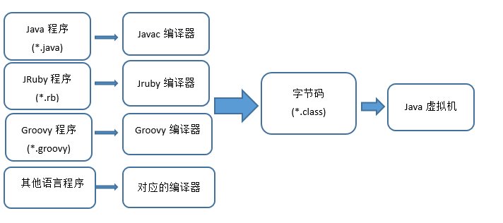
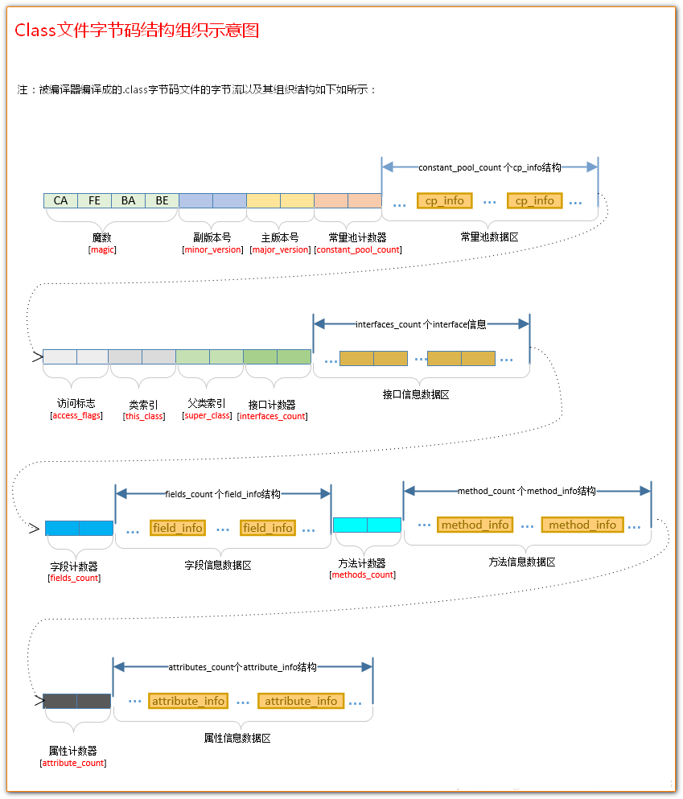
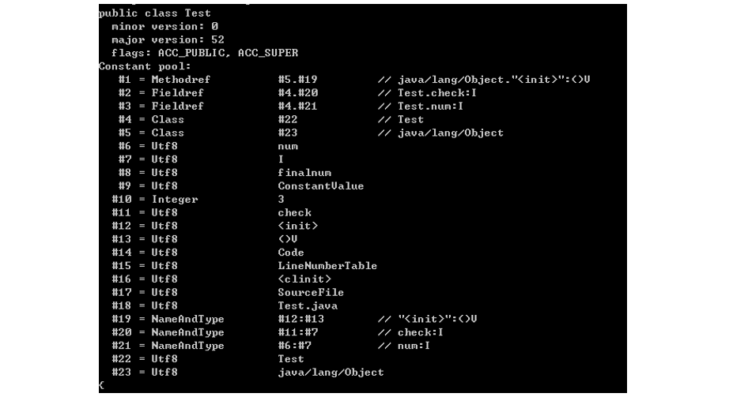
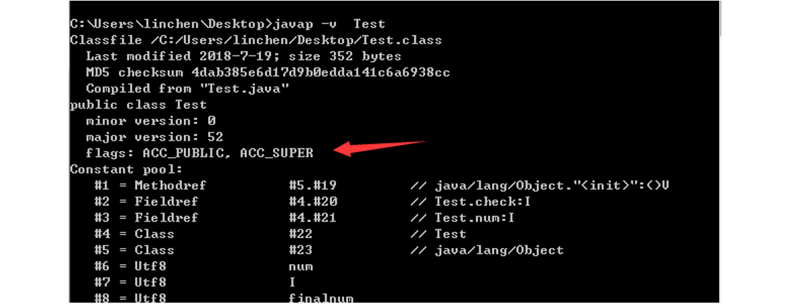
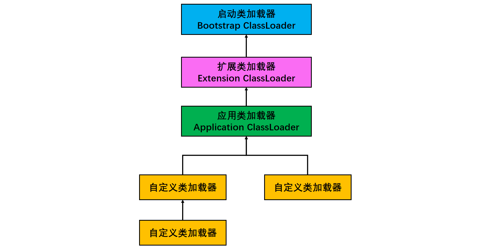

[TOC]

### 类文件结构与类加载机制

#### 平台无关性

各种不同平台的虚拟机与所有平台都使用统一的程序存储格式--**字节码**，是构成**平台无关性的基石**。实现语言无关性的基础仍然是**虚拟机和字节码的存储格式**。把代码编译成 Class 文件，虚拟机并不关心 Class 的来源是何种语言。



#### Class类文件结构

**Class 文件**是一组以 **8 位**字节数为基础单位的**二进制流**，各个数据项目严格按照顺序紧凑排列在 Class 文件之中，中间没有添加任何分隔符，整个 Class 文件存储的内容几乎全部是程序的必要的数据。Class 文件类似于 C 语言**结构体**的伪结构的存储数据，这种结构中只有两种数据类型：**无符号数**和**表**。

**无符号数**属于基本的**数据类型**，下表展示了对应的类型介绍：

| 数据类型 | 字节数 |
| :------: | :----: |
|    u1    |   1    |
|    u2    |   2    |
|    u4    |   4    |
|    u8    |   8    |

**无符号数**可以用来描述**数字，索引引用，数量值**或者按照UTF-8编码构成的**字符串值**。

**表**是由**多个无符号数**或者其他表作为数据项构成的复合数据类型，所有表习惯性以 "**info**" 结尾，表用于描述有层次结构的复合结构数据。整个 Class 文件本质上就是一张**表**。

无论是**无符号数还是表**，当需要描述同一类型但是数量不定的多个数据的时候，经常会使用一个前置容量计数器加若干个连续的数据项的形式，这时候称之为某一类型的**集合**。

根据 Java 虚拟机规范，类文件由单个 **ClassFile 结构**组成：

```c
ClassFile {
    u4             magic; // Class 文件的标志
    u2             minor_version;// Class 的小版本号
    u2             major_version;// Class 的大版本号
    u2             constant_pool_count;// 常量池的数量
    cp_info        constant_pool[constant_pool_count-1];// 常量池
    u2             access_flags;// Class 的访问标记
    u2             this_class;// 当前类
    u2             super_class;// 父类
    u2             interfaces_count;// 接口
    u2             interfaces[interfaces_count];// 一个类可以实现多个接口
    u2             fields_count;// Class 文件的字段属性
    field_info     fields[fields_count];// 一个类会可以有个字段
    u2             methods_count;// Class 文件的方法数量
    method_info    methods[methods_count];// 一个类可以有个多个方法
    u2             attributes_count;// 此类的属性表中的属性数
    attribute_info attributes[attributes_count];// 属性表集合
}
```

这里将下面 Java 文件通过 javac 编译为  **.class** 文件：

```java
public class Test {
    private static int num = 3;
    private static final int finalnum = 3;
    private int check;
    public Test(){
        check = 23;
    }
}
```

**class 文件**对应的**字节流码**：

```java
cafe babe 0000 0034 0018 0a00 0500 1309
0004 0014 0900 0400 1507 0016 0700 1701
0003 6e75 6d01 0001 4901 0008 6669 6e61
6c6e 756d 0100 0d43 6f6e 7374 616e 7456
616c 7565 0300 0000 0301 0005 6368 6563
6b01 0006 3c69 6e69 743e 0100 0328 2956
0100 0443 6f64 6501 000f 4c69 6e65 4e75
6d62 6572 5461 626c 6501 0008 3c63 6c69
6e69 743e 0100 0a53 6f75 7263 6546 696c
6501 0009 5465 7374 2e6a 6176 610c 000c
000d 0c00 0b00 070c 0006 0007 0100 0454
6573 7401 0010 6a61 7661 2f6c 616e 672f
4f62 6a65 6374 0021 0004 0005 0000 0003
000a 0006 0007 0000 001a 0008 0007 0001
0009 0000 0002 000a 0002 000b 0007 0000
0002 0001 000c 000d 0001 000e 0000 002b
0002 0001 0000 000b 2ab7 0001 2a10 17b5
0002 b100 0000 0100 0f00 0000 0e00 0300
0000 0500 0400 0600 0a00 0700 0800 1000
0d00 0100 0e00 0000 1d00 0100 0000 0000
0506 b300 03b1 0000 0001 000f 0000 0006
0001 0000 0002 0001 0011 0000 0002 0012
```

**Class 文件字节码结构组织示意图** （原出处不明）：



##### 1. 魔数

可以看到第一个字符为 u4 类型的 **magic** 变量，称之为**魔数**，该变量来表明是否是一个虚拟机能接受的 **Class 文件**。上面的 Class 字节流显示 4 个字节 magic 是 **0xcafe babe**，咖啡宝贝的意思。

##### 2. 主次版本号

minor_version 代表 Java 的**次版本号**占**两个字节**，major_version 代表**主版本号**也占两个字节。在上述 Class 文件中：

- minor_version：**0x0000**
- major_version：**0x0034**

34 代表十进制的 52，说明 Java 版本为 1.8，可以通过 `java -version` 来验证准确性。

##### 3. 常量池

```c
u2             constant_pool_count;					// 常量池的数量
cp_info        constant_pool[constant_pool_count-1];// 常量池
```

接下来的是常量池的**入口**，常量池可以理解为 Class 文件中的**资源仓库**。由于常量池的数量是**不固定**的，所以需要放置 u2 类型的数据来表示常量池容量的**计数值** constant_pool_count，即上述 Class 文件中的 0x0018，转换为十进制为 24，表明当前常量池中有 23 项常量，索引范围为 1-24。

常量池中主要存放着两大类常量：**字面量(Literal)**以及**符号引用**(Symbolic References)。

**字面量**接近于 Java 层中的**常量**的概念，如文本字符串，申明为 final 的常量值等等。

**符号引用**则属于**编译原理**方面的概念，主要包括下面三类：

- 类和接口的全限定名
- 字段的名称和描述符
- 方法的名称和描述符

Java 在执行 javac 编译的时候，不像 c/c++ 一样有链接的步骤，而是在**虚拟机加载 Class 文件时候**进行**动态**的链接。**也就说在 Class 文件中不会保存各个方法、字段的最终内存信息，这些字段、方法的符号引用不经过运行期转化的话是无法获得真正的内存入口的。**当虚拟机运行的时候，需要从 Class 文件的**常量池获得对应的符号引用**，然后在**类创建或者运行时解析**，翻译到具体的内存地址当中。

**常量池**中每一项常量都是一个**表**，这 14 种表有一个共同的特点：**开始的第一位是一个 u1 类型的标志位 -tag 来标识常量的类型，代表当前这个常量属于哪种常量类型。**

|               类型               | 标志（tag） |          描述          |
| :------------------------------: | :---------: | :--------------------: |
|        CONSTANT_utf8_info        |      1      |   UTF-8 编码的字符串   |
|      CONSTANT_Integer_info       |      3      |       整形字面量       |
|       CONSTANT_Float_info        |      4      |      浮点型字面量      |
|        CONSTANT_Long_info        |     ５      |      长整型字面量      |
|       CONSTANT_Double_info       |     ６      |   双精度浮点型字面量   |
|       CONSTANT_Class_info        |     ７      |   类或接口的符号引用   |
|       CONSTANT_String_info       |     ８      |    字符串类型字面量    |
|      CONSTANT_Fieldref_info      |     ９      |     字段的符号引用     |
|     CONSTANT_Methodref_info      |     10      | **类中方法的符号引用** |
| CONSTANT_InterfaceMethodref_info |     11      |  接口中方法的符号引用  |
|    CONSTANT_NameAndType_info     |     12      |  字段或方法的符号引用  |
|     CONSTANT_MothodType_info     |     16      |      标志方法类型      |
|    CONSTANT_MethodHandle_info    |     15      |      表示方法句柄      |
|   CONSTANT_InvokeDynamic_info    |     18      | 表示一个动态方法调用点 |

**.class 文件**可以通过 javap -v class 类名指令来看一下其常量池中的信息(javap -v  class类名-> temp.txt ：将结果输出到 temp.txt 文件)。

上述都是字面量和符号引用。

下面 CONSTANT_Methodref_info 这个**符号引用**包括两部分， 一部分是该方法所在的**类**， 另一部分是该方法的方法名和描述符。 这就是所谓的“**类中方法的符号引用**”。

```c
CONSTANT_Methodref_info {
    u1 tag;
    u2 class_index;             // CONSTANT_Class_info
    u2 name_and_type_index;     // CONSTANT_NameAndType_info
}
```

可以 javap 来反编译字节码来用得常量池的信息。

```java
javap -p Test
```

截图如下:



上图中 Constant pool 表示 **Class 文件中的常量池**，图中**总共 23 个常量值**，跟上面通过字节码计算的方式得出的结果一致。可以看到第一个 **CONSTANT_Methodref_info** 对应的是 **init** 方法，来自于 Obejct 类，返回值为 void，参数为空。

##### 4. 访问标志

在常量池结束之后，紧接着的两个字节表示访问标志，这个标志用于**识别类或者接口层次的访问信息**，包括：

- 这个 Class 是**类还是接口**。
- 是否定义为 **public** 类型。
- 是否定义为 **abstract** 类型。
- 如果是类，是否被声明为 **final** 类型。
- ...

这个也可以通过反编译查看对应的标志：



可以看到 Test 类的 flag 为 **ACC_PUBLIC 和 ACC_SUPER**。

##### 5. 类索引、父索引和接口索引集合

类索引 (this_class) 以及父类索引 (super_class) 都是一个 u2 类型的数据，接口索引集合(interfaces)是一组 u2 类型的数据集合，在 Class 文件中，通过上述三个数据来**确定这个类的==继承关系==**。

**类索引**确定这个类的**全限定名**，**父类索引**确定这个类的**父类的全限定名**，除了 Object 类 之外，其他的所有类的父类索引都不为 0，**接口索引**集合用来描述该类实现了**哪些接口**。

##### 6. 字段表集合

```c
u2             fields_count;// Class 文件的字段的个数
field_info     fields[fields_count];// 一个类会可以有个字段
```

字段表用于描述接口或者类中**声明的变量**。字段包括**静态**变量以及**实例**变量，但**不包括**在方法内部声明的**局部变量**。

一个字段可以包含的信息如下：

- 字段的作用域 (public, private, protected)
- 实例变量还是类变量(有无 static 修饰符)
- 可变性(final)
- 并发可见性(volatile，强制从主内存中读写)
- 是否可序列化(transient)
- 字段数据类型(基本类型，对象，数组)
- 字段名称

各个修饰符都可以用布尔值来设定是否存在，对于字段的数据类型以及名称，则只能引用常量池中的常量来描述了。

##### 7. 方法表集合

```c
u2             methods_count;			// Class 文件的方法的数量
method_info    methods[methods_count];	// 一个类可以有个多个方法
```

Class 文件存储格式中对**方法的描述**与对字段的描述几乎是一样的。

因为 **volatile** 以及 **transient** 关键字**不能修饰方法**，所以方法表的访问标志中**没有** ACC_VOLATILE 和ACC_TRANSIENT 标志。但是可以使用 **synchronized，native，strictfp 和 abstract** 关键字修饰方法，则对应增加了访问标志。

如果父类方法在子类中**没有被重写**，那么方法表集合中就不会出现父类的方法信息，但是有可能出现由**编译器自动添加**的方法，比如 \<init> 和 \<clinit> 方法。

##### 8. 属性表集合

在 Class 文件，字段表，方法表中都可以携带自己的属性表集合，以用于描述某些场景专有的信息。与 Class 文件中其它的数据项目要求的顺序、长度和内容不同，属性表集合的限制稍微宽松一些，不再要求各个属性表具有严格的顺序，并且只要不与已有的属性名重复，任何人实现的编译器都可以向属性表中写 入自己定义的属性信息，Java 虚拟机运行时会忽略掉它不认识的属性。


#### 类的生命周期

注意对比之前 **new 一个关键字会发生什么**部分的内容，之前只是讲了对象创建过程。

类的**生命周期**如下图所示。


具体包括以下几个阶段：**加载 、连接（包含验证 、准备、解析）、初始化、使用、卸载**。

**加载、验证、准备、初始化、卸载**这几个阶段的顺序是**确定**的，而==**解析阶段**==则不一定：它在某些情况下**可以**在**初始化阶段之后**再开始，这是为了支持 Java 语言的运行时绑定（也称为**动态绑定**）。所以通常上述的过程都是相互**交叉混合**进行的，通常会在一个阶段执行时调用、激活另一个阶段。

##### 1. 加载

加载是类加载的一个阶段，注意不要混淆。类是在**运行期**间第一次使用时**动态加载**的，而不是一次性加载所有类。如果一次性加载会占用很多的内存。

加载过程完成以下三件事：

- 通过类的完全限定名称获取定义该类的**二进制**字节流。
- 将该字节流表示的静态存储结构转换为方法区的**运行时存储结构**。
- 在内存中生成一个代表该类的 **Class 对象**，作为方法区中该类各种数据的访问入口。

其中**类的二进制字节流**可以从以下方式中获取：

- **文件**：从 ZIP 包读取，这很常见，最终成为之后 JAR、EAR、WAR 格式的基础。
- **网络**：从**网络**中获取，这种场景最典型的应用是 Applet。
- **运行时计算生成**：这种场景使用得最多得就是**动态代理技术**，在 java.lang.reflect.Proxy 中，就是用了 ProxyGenerator.generateProxyClass 的代理类的二进制字节流。
- **由其他文件生成**：由其他文件生成，典型场景是 **JSP 应用**，即由 JSP 文件生成对应的 Class 类。
- **数据库**：从数据库读取，这种场景相对少见，例如有些中间件服务器（如 SAP Netweaver）可以选择把程序安装到数据库中来完成程序代码在集群间的分发。 

> **数组类与非数组类的加载**

**注意：** **非数组类**加载阶段既可以使用系统提供的类加载器来完成，也可以由**用户自定义的类加载器**去完成。（即覆写一个类加载器的 **loadClass**() 方法）。

对于**数组类**有些不同，**数组类本身不通过类加载器创建**，它是由**虚拟机直接创建**的。但是数组类的**元素类型**最终是要靠**类加载器**去创建。

##### 2. 验证

**验证**是连接阶段的第一步，这一阶段的**目的是为了确保 Class 文件的字节流中包含的信息符合当前虚拟机的要求**，并且不会危害虚拟机自身的安全。虚拟机如果不检查输入的字节流，并对其完全信任的话，很可能会因为载入了有害的字节流而导致系统崩溃，所以验证是虚拟机对**自身保护**的一项重要工作。

大致上会完成 4 个阶段的校验工作：**文件格式、元数据、字节码、符号引用**。

**(1) 文件格式验证**：验证字节流是否符合 **Class 文件格式的规范**，并且能被当前版本的虚拟机处理。该验证阶段的主要目的是保证输入的字节流能正确地解析并存储于方法区之内。如**魔数以及版本号**是否合理等。

**(2) 元数据验证**：该阶段对字节码描述的信息进行**语义分析**，保证不存在不符合 Java 语言规范的元数据信息。比如是否有父类？继承了 final 类？非抽象类实现了所有的抽象方法？

**(3) 字节码验证**：通过数据流和控制流分析，确保程序语义是合法、符合逻辑的。会进行运行检查、栈数据类型和操作码数据参数吻合与否、跳转指令指定到合理的位置。

**(4) 符号引用验证**：最后一个阶段的校验发生在**虚拟机将符号**引用转化为**直接引用**的时候，这个转化动作将在连接的第三个阶段——解析阶段中发生。符号引用验证的目的是确保解析动作能正常执行。验证的内容主要有：符号引用中通过字符串描述的**全限定名**是否能找到对应的**类**；在指定类中是否存在符号方法的**字段描述**及简单名称所描述的**方法和字段**；符号引用中的类、字段和方法的**访问性**（private、protected、public、default）是否可被当前类访问。

##### 3. 准备

**准备阶段**是正式为**类变量分配内存**并设置类变量**==初始值==**的阶段，这些变量所使用的**内存**都将在**方法区中进行分配**。（备注：这时候进行内存分配的==**仅包括类变量**==（被 static 修饰的变量），而**不包括实例变量**，实例变量将会在对象实例化时随着对象一起分配在 Java **堆中**）。

**初始值**通常是数据类型的**默认零值**。

**实例变量不会在这阶段分配内存**，它将会在对象实例化时随着对象一起分配在堆中。注意，实例化不是类加载的一个过程，类加载发生在所有实例化操作之前，并且**类加载只进行一次，实例化可以进行多次**。

初始值一般为 **0 值**，例如下面的类变量 value 被初始化为 0 而不是 123，在初始化的 **\<clinit> 中才会被设置为代码中的值**。

基本数据类型的零值表：

| 数据类型 |     零值     | 数据类型  |   零值    |
| :------: | :----------: | :-------: | :-------: |
|   int    |      0       |  boolean  | **false** |
|   long   |      0L      |   float   | **0.0f**  |
|  short   |  (short) 0   |  double   |   0.0d    |
|   char   | **'\u0000'** | reference | **null**  |
|   byte   |   (byte) 0   |           |           |

**注意：**

```java
public static int value = 123;
```

静态变量 value 在准备阶段过后的==**初始值为 0**== 而不是 123，这时候**尚未**开始执行任何方法，把 value 赋值为123 的动作将在**初始化阶段**才会被执行。

一些特殊情况（加了 **final 修饰符**）：如果类变量是**常量**，那么它**将初始化为表达式所定义的值**而不是 0。

```java
public static final int value = 123; 
```

编译时 Javac 将会为 value 生成 **ConstantValue  属性**，在**准备阶段**虚拟机就会根据 ConstantValue 的设置将 value 赋值为 123。

**注意**：方法内部的**局部变量**不像类变量具有“准备阶段”，所以在**程序中必须初始化**使用，因此**局部变量**没有赋初始值是不能使用的。

##### 4. 解析

将常量池的**符号引用**替换为**==直接引用==**的过程。分为：类或接口的解析、字段解析、类方法解析、接口方法解析等。

其中**解析过程**在某些情况下可以在**初始化阶段之后**再开始，这就是**动态绑定**。

> **符号引用与直接引用的关联？**

- **符号引用** (Symbolic References)：符号引用以一组**符号**来描述所引用的目标，符号可以是符合约定的任何形式的**字面量**，符号引用与虚拟机实现的内存布局无关，引用的目标并**不一定**已经加载到**内存**中。

- **直接引用** (Direct References)：直接引用可以是**直接指向目标**的指针、相对偏移量或是一个能间接定位到目标的句柄。直接引用与虚拟机实现的内存布局相关，引用的**目标必定已经在内存**中存在。可以通俗的理解为一个代码片段的**入口地址**。

虚拟机规范没有规定解析阶段发生的具体时间，虚拟机实现可以根据需要来判断到底是在类被加载时解析还是等到一个符号引用将要被使用前才去解析。

解析动作主要针对类或接口、字段、类方法、接口方法、方法类型、方法句柄和调用点限定符 **7 类符号引用**进行。

对一个符号引用进行多次解析请求是很常见的，为了避免这个问题，虚拟机实现可以在第一个解析成功后**缓存结果**，后续使用这个结果即可。但是如果第一次失败，后面都会失败。

综上，**解析阶段是虚拟机将常量池内的==符号引用==替换为==直接引用==的过程，也就是得到类或者字段、方法在==内存==中的指针或者偏移量。**

##### 5. 初始化

在准备阶段，类变量已经赋过一次系统要求的**默认初始值**（零值），而在**初始化**阶段才**真正开始执行程序员在类中定义的 Java 程序**代码来**初始化类变量和其它资源**。

初始化阶段是虚拟机执行==**类构造器 \<clinit>() 方法**==的过程。\<clinit>() 是由编译器**自动收集**类中所有**类变量**的**赋值动作**和**静态语句块中的语句**合并产生的，编译器收集的顺序由语句在**源文件中出现的顺序决定**。特别注意的是，**==静态语句块只能访问到定义在它之前的类变量，定义在它之后的类变量只能赋值，不能访问==**。例如以下代码：

```java
public class Test {
    static {
        i = 0;                // 给变量赋值可以正常编译通过
        System.out.print(i);  // 这句编译器会提示“非法向前引用”
    }
    static int i = 1;
}
```

- 虚拟机中第一个被执行的  &lt;clinit>() 方法的**类**肯定是 java.lang.**Object**。
- 由于**父类的 &lt;clinit>() 方法先执行**，也就意味着**父类中定义的静态语句块的执行要==优先于子类==**。例如以下代码：

```java
static class Parent {
    public static int A = 1;
    static {
        A = 2;
    }
}

static class Sub extends Parent {
    public static int B = A;
}

public static void main(String[] args) {
     System.out.println(Sub.B); 
     // 2
}
```

- 接口中**不可以**使用静态语句块，但仍然有**类变量初始化的赋值操作**，因此**接口与类一样都会生成 &lt;clinit>()** 方法。但接口与类不同的是，执行接口的 &lt;clinit>() 方法不需要先执行父接口的 &lt;clinit>() 方法。只有当父接口中定义的变量使用时，父接口才会初始化。另外，接口的**实现类**在初始化时也一样不会执行接口的 &lt;clinit>() 方法。
- **虚拟机会保证一个类的 &lt;clinit>() 方法在多线程环境下被正确的==加锁和同步==**，如果多个线程同时初始化一个类，只会有一个线程执行这个类的 &lt;clinit>() 方法，其它线程都会**阻塞等待**，直到当前活动线程执行 &lt;clinit>() 方法完毕。如果在一个类的 &lt;clinit>() 方法中有耗时的操作，就可能造成多个线程阻塞，在实际过程中此种阻塞很隐蔽。

##### 6. 卸载

**卸载类**即该类的 Class 对象被 GC。卸载类需要满足 3 个比较难以达到的要求（就是类被 GC 的条件）:

1. 该类的所有的实例对象都已被回收，堆不存在该类的实例对象。
2. 该类没有在其他任何地方被引用。
3. 该类的类加载器的实例已被 GC。

上面的要求很难达到，所有 GC 还是一般发生在**堆**中。JDK 自带的 BootstrapClassLoader, ExtensionClassLoader, ApplicationClassLoader 负责加载 JDK 提供的**类**，所以**它们(类加载器的实例)肯定不会被回收**。而**自定义**的类加载器的实例是可以被回收的，所以使用**自定义加载器加载的类是可以被卸载掉**的。


#### 类初始化的时机

##### 1. **主动引用**

虚拟机规范中并没有强制约束何时进行**加载**，但是规范严格规定了有且只有下列**五种**情况**必须对类进行初始化**（加载、验证、准备都会随之发生）：

- 遇到 **new、getstatic、putstatic、invokestatic**  这四条字节码指令时，如果类没有进行过初始化，则必须先触发其初始化。最常见的生成这 4 条指令的场景是：使用 **new  关键字实例化对象**的时候；读取或设置一个**类的静态字段**（被 final  修饰、已在编译期把结果放入常量池的静态字段除外）的时候；以及调用一个类的静态方法的时候。
- 使用 java.lang.**reflect 包**的方法对类进行**反射调用**的时候，如果类没有进行初始化，则需要先将其初始化。
- 当初始化**一个类**的时候，如果发现其**父类还没有进行过初始化**，则需要先**触发其父类的初始化**。
- 当虚拟机启动时，用户需要指定一个要执行的**主类**（包含 main() 方法的那个类），虚拟机会先初始化这个主类。
- 当使用 JDK 1.7 的**动态语言支持**时，如果一个 java.lang.invoke.**MethodHandle** 实例最后的解析结果为  REF_getStatic, REF_putStatic, REF_invokeStatic  的方法句柄，并且这个方法句柄所对应的类没有进行过初始化，则需要先触发其初始化。

而对于接口，当一个接口在初始化时，并不要求其父接口全部都完成了初始化，只有在**真正使用到父接口**时（如引用父接口中定义的常量）才会初始化。

##### 2. **被动引用**

**所有引用类的方式都不会触发初始化称为==被动引用==，下面是 3 个被动引用例子：**

**(1) 通过子类引用父类==静态==字段，不会导致子类初始化。**

```java
public class SuperClass {
    static {
        System.out.println("SuperClass（父类）被初始化了。。。");
    }
    public static int value = 66;
}
```

```java
public class Subclass extends SuperClass {
    static {
        System.out.println("Subclass（子类）被初始化了。。。");

    }
}
```

```java
public class Test1 {

    public static void main(String[] args) {

        // 1:通过子类调用父类的静态字段不会导致子类初始化
        // System.out.println(Subclass.value);//SuperClass（父类）被初始化了。。。66
        // 2:通过数组定义引用类，不会触发此类的初始化
        SuperClass[] superClasses = new SuperClass[3];
        // 3:通过new 创建对象,可以实现类初始化，必须把1下面的代码注释掉才有效果不然经过1的时候类已经初始化了，下面这条语句也就没用了。
        //SuperClass superClass = new SuperClass();
    }
}
```

**(2) 通过==数组定义==引用类，==不会==触发此类的初始化；该过程会对==数组类==进行初始化，数组类是一个由虚拟机自动生成的、直接继承自 Object 的子类，其中包含了数组的属性和方法。**

```java
SuperClass[] sca = new SuperClass[10];
```

**(3) ==常量==在编译阶段会存入调用类的==常量池==中，本质上并没有直接引用定义常量的类，因此==不会==触发定义常量的类的初始化。**

```java
public class ConstClass {
    static {
        System.out.println("ConstClass被初始化了。。。");
    }
    public static final String HELLO = "hello world";
}
```

```java
public class Test2 {

    public static void main(String[] args) {
        // 输出结果：hello world
        System.out.println(ConstClass.HELLO);
    }
}
```


#### 类加载器

虚拟机将加载二进制字节流的动作放在虚拟机外实现，让程序自己决定**如何获取所需要的实现类**，实现这个动作的代码模块称为 "**类加载器**"。**类加载器**在**类层次划分、OSGi、热部署和代码加密**等领域有重要作用。注意：**系统类一来就会全部加载到虚拟机中，自己写的类只在用到的时候才进行加载**。

##### 1. 类的相等

**两个类相等**，需要类本身相等，并且使用**同一个类加载器**进行加载。这是因为**每一个类加载器**都拥有一个**独立的类名称空间**。**相同的字节码被不同的类加载器加载的类不相等**。

这里的**相等**，包括类的 Class 对象的 **equals**() 方法、**isAssignableFrom**() 方法、**isInstance**() 方法的返回结果为 true，也包括使用 instanceof 关键字做对象所属关系判定结果为 true。

##### 2. 类加载器分类

从**虚拟机**的角度来讲，只存在以下两种不同的类加载器：

- **启动类加载器（Bootstrap ClassLoader）**，使用 C++ 实现，是虚拟机自身的一部分；

- **所有其它**类的加载器，使用 Java 实现，独立于虚拟机，**继承**自抽象类 java.lang.**ClassLoader**。

从**开发人员**的角度看，类加载器可以划分得更细致一些：

- **==启动类加载器（Bootstrap ClassLoader）==**此类加载器负责将存放在 &lt;**JRE_HOME>\lib** 目录中的，或者被 -**Xbootclasspath** 参数所指定的路径中的，并且是虚拟机识别的（仅按照文件名识别，如 rt.jar，名字不符合的类库即使放在 lib 目录中也不会被加载）类库加载到虚拟机内存中。启动类加载器无法被 Java 程序直接引用，用户在编写自定义类加载器时，如果需要把加载请求委派给启动类加载器，直接使用 null 代替即可。
- **==扩展类加载器（Extension ClassLoader）==**这个类加载器是由 sun.misc.Launcher$**ExtClassLoader** 实现的。它负责将 &lt;**JAVA_HOME>\lib\ext** 或者被 java.ext.dir 系统变量所指定路径中的所有类库加载到内存中，开发者可以直接使用扩展类加载器。
- **==系统类加载器（Application ClassLoader）==**这个类加载器是由 sun.misc.Launcher$**AppClassLoader** 实现的。由于这个类加载器是 ClassLoader 中的 **getSystemClassLoader**() 方法的返回值，因此一般称为**系统类加载器**。它负责**加载用户类路径（ClassPath）上所指定**的类库，开发者可以直接使用这个类加载器，如果应用程序中没有自定义过自己的类加载器，一般情况下这个就是程序中**默认**的类加载器。
- **自定义类加载器**：负责加载用户自定义路径下的类包。

每一个**类**都有一个对应它的**类加载器**。系统中的 ClassLoder 在协同工作的时候会默认使用 **双亲委派模型** 。即在类加载的时候，系统会首先判断当前类是否被加载过。已经被加载的类会直接返回，否则才会**尝试加载**。

加载的时候，首先会把该请求**委派该父类加载器**的 **loadClass() 处理**，因此所有的请求最终都应该传送到顶层的启动类加载器 **BootstrapClassLoader** 中。 当父类加载器无法处理时，**子加载器才会尝试自己去加载**。当父类加载器为 null 时，会使用启动类加载器 BootstrapClassLoader 作为父类加载器。

每个类加载都有一个父类加载器，测试一下。

```java
public class ClassLoaderTest {
    public static void main(String[] args) {
        System.out.println("Current ClassLoader is: " + ClassLoaderTest.class.getClassLoader());
        System.out.println("The Parent ClassLoader is: " + ClassLoaderTest.class.getClassLoader().getParent());
        System.out.println("The GrandParent ClassLoader is: " + ClassLoaderTest.class.getClassLoader().getParent().getParent());
    }
}
```

```java
Current ClassLoader is: jdk.internal.loader.ClassLoaders$AppClassLoader@1f89ab83
The Parent ClassLoader is: jdk.internal.loader.ClassLoaders$PlatformClassLoader@340f438e
The GrandParent ClassLoader is: null
```

**AppClassLoader 的父类加载器为 ExtClassLoader，ExtClassLoader 的父类加载器为 null，null 并不代表 ExtClassLoader 没有父类加载器，而是 BootstrapClassLoader 。**

应用程序是由三种类加载器互相配合从而实现类加载，除此之外还可以加入**自己定义的类加载器**。

##### 3. 自定义类加载器

自定义类加载器的优势：高度的灵活性、通过自定义类加载器可以实现热部署、代码加密等。

**自定义类加载器**只需要**继承** java.lang.**ClassLoader** 抽象类，该类有两个核心方法，一个是 **loadClass**(String,  boolean)，实现了双亲委派机制，loadClass 方法源码如下：

```java
private final ClassLoader parent; 
protected Class<?> loadClass(String name, boolean resolve) throws ClassNotFoundException {
    synchronized (getClassLoadingLock(name)) {
        // 首先，检查请求的类是否已经被加载过
        Class<?> c = findLoadedClass(name);
        if (c == null) {
            long t0 = System.nanoTime();
            try {
                if (parent != null) {// 父加载器不为空，调用父加载器loadClass()方法处理
                    c = parent.loadClass(name, false);
                } else {// 父加载器为空，使用启动类加载器 BootstrapClassLoader 加载
                    c = findBootstrapClassOrNull(name);
                }
            } catch (ClassNotFoundException e) {
                // 抛出异常说明父类加载器无法完成加载请求
            }

            if (c == null) {
                long t1 = System.nanoTime();
                // 自己尝试加载
                c = findClass(name);

                // this is the defining class loader; record the stats
                sun.misc.PerfCounter.getParentDelegationTime().addTime(t1 - t0);
                sun.misc.PerfCounter.getFindClassTime().addElapsedTimeFrom(t1);
                sun.misc.PerfCounter.getFindClasses().increment();
            }
        }
        if (resolve) {
            resolveClass(c);
        }
        return c;
    }
}
```

大体逻辑如下：

- 首先检查一下指定名称的类是否已经加载过，如果加载过了，就不需要再加载，直接返回。
- 如果此类没有加载过，那么，再判断一下**是否有父加载器**；如果有父加载器，则由父加载器加载（即调用 **parent.loadClass**(name, false);）.或者是调用 bootstrap 类加载器来加载。
- 如果父加载器及 bootstrap 类加载器都没有找到指定的类，那么调用**当前**类加载器的 **findClass** 方法来完成类加载。

还有一个方法是 **findClass**，默认实现是抛出异常，**==自定义类加载器主要是重写 findClass 方法==** ：

以下是抽象类 java.lang.**ClassLoader** 的源码，其中的 **loadClass**() 方法运行过程如下：**先检查类是否已经加载过，如果没有则让==父类==加载器去加载。当父类加载器加载失败时抛出 ClassNotFoundException，此时尝试自己去加载。**

> **loadClass(), findClass(), defineClass()** 的区别？

- **loadclass**()：判断是否已加载，使用双亲委派模型，请求父加载器，都为空，使用 findclass() 。

- **findclass**()：根据名称或位置加载 .class 字节码,然后使用 defineClass()。

- **defineclass()**：解析定义 .class 字节流，返回 class 对象。

以下代码中的 FileSystemClassLoader 是**自定义**类加载器，用于加载**文件系统**上的类。它首先根据类的全名在文件系统上查找类的字节代码文件（.class 文件），然后**读取**该文件内容，最后通过 **defineClass()** 方法来把这些字节代码转换成 **java.lang.Class 类**的实例。

```java
// 自定义文件系统类加载器
public class FileSystemClassLoader extends ClassLoader {

    private String rootDir;

    public FileSystemClassLoader(String rootDir) {
        this.rootDir = rootDir;
    }
	
    // 这里覆写findClass方法
    protected Class<?> findClass(String name) throws ClassNotFoundException {
        byte[] classData = getClassData(name);
        if (classData == null) {
            throw new ClassNotFoundException();
        } else {
            return defineClass(name, classData, 0, classData.length);
        }
    }

    private byte[] getClassData(String className) {
        String path = classNameToPath(className);
        try {
            InputStream ins = new FileInputStream(path);
            ByteArrayOutputStream baos = new ByteArrayOutputStream();
            int bufferSize = 4096;
            byte[] buffer = new byte[bufferSize];
            int bytesNumRead;
            while ((bytesNumRead = ins.read(buffer)) != -1) {
                baos.write(buffer, 0, bytesNumRead);
            }
            return baos.toByteArray();
        } catch (IOException e) {
            e.printStackTrace();
        }
        return null;
    }

    private String classNameToPath(String className) {
        return rootDir + File.separatorChar
                + className.replace('.', File.separatorChar) + ".class";
    }
}
```

##### 5. 类加载器初始化过程

参见类运行加载全过程图可知其中会创建 JVM 启动器实例 sun.misc.**Launcher**。sun.misc.Launcher 初始化使用了**单例模式**设计，保证一个 JVM 虚拟机内只有一个 sun.misc.Launcher 实例。

在 Launcher 构造方法内部，其创建了**两个类加载器**，分别是 sun.misc.Launcher.**ExtClassLoader** (扩展类加载器)和 sun.misc.Launcher.**AppClassLoader** (应用类加载器)。

JVM 默认使用 **Launcher** 的 **getClassLoader**() 方法返回的类加载器 AppClassLoader 的实例加载应用程序。

```java
// Launcher的构造方法
public Launcher() {
    Launcher.ExtClassLoader var1;
    try {
        // 构造扩展类加载器，在构造的过程中将其父加载器设置为null
        var1 = Launcher.ExtClassLoader.getExtClassLoader();
    } catch (IOException var10) {
        throw new InternalError("Could not create extension class loader", var10);
    }

    try {
        // 构造应用类加载器，在构造的过程中将其父加载器设置为ExtClassLoader，
        // Launcher的loader属性值是AppClassLoader，一般都是用这个类加载器来加载自己写的应用程序
        this.loader = Launcher.AppClassLoader.getAppClassLoader(var1);
    } catch (IOException var9) {
        throw new InternalError("Could not create application class loader", var9);
    }

    Thread.currentThread().setContextClassLoader(this.loader);
    String var2 = System.getProperty("java.security.manager");
    //......// 省略一些不需关注代码
}
```

##### 6. 自定义类加载器的典型应用

###### (1) Tomcat

**Tomcat** 的类加载器架构，自己定义了多个类加载器。

- 保证了同一个服务器的两个 Web 应用程序的 Java 类库**隔离**；
- 保证了同一个服务器的两个 Web 应用程序的 Java 类库又可以**相互共享**；比如多个 Spring 组织的应用程序不能共享，会造成资源浪费；
- 保证了服务器尽可能保证自身的安全不受不受部署 Web 应用程序影响；
- 支持 JSP 应用的服务器，大多需要支持热替换 (HotSwap) 功能。

###### (2) OSGi

OSGi(Open Service GateWay Initiative)，是基于 Java 语言的**动态模块化**规范。已成为 Java 世界事实上的模块化标准。

##### 7. 双亲委派模型

###### (1) 概述

下图展示了**类加载器之间的层次关系**，称为**==双亲委派模型==**（Parents Delegation Model）。该模型要求除了顶层的启动类加载器外，其它的类加载器都要有自己的父类加载器。这里的父子关系一般通过**组合关系**（Composition）来实现，而**不是继承关系**（Inheritance）。



###### (2) 好处

使用双亲委派模型来组织类加载器之间的关系，有一个显而易见的**好处**就是 Java 类随着它的类加载器一起具备了一种带有优先级的层次关系。从而使得**基础类得到统一**。

双亲委派模型保证了 Java 程序的稳定运行，可以**避免类的重复加载**（JVM 区分不同类的方式不仅仅根据类名，相同的类文件被不同的类加载器加载产生的是两个不同的类），也保证了 Java 的**核心 API 优先加载不被篡改**。如果没有使用双亲委派模型，而是每个类加载器加载自己的话就会出现一些问题，比如编写一个称为 **java.lang.Object 类**的话，那么程序运行的时候，系统就会出现**多个不同的 Object 类**。

注意：双亲委派模型是 Java 设计者们推荐给开发者们的一种类加载器实现方式，并不是一个强制性的约束模型。在 Java 的世界中大部分的类加载器都遵循这个模型，但也有例外。

**总结为什么要设计双亲委派机制？**为了**==核心类安全与防止重复加载==**。

- **沙箱安全机制**：自己写的 java.lang.String.class 类不会被加载，这样便可以防止核心 API 库被随意篡改。
- **避免类的重复加载**：当父亲已经加载了该类时，就没有必要子 ClassLoader 再加载一次，保证**被加载类的唯一性**。

看一个类加载示例：

```java
// 这里的包与JDK的String类一样
package java.lang;

public class String {
    public static void main(String[] args) {
        System.out.println("**************My String Class**************");
    }
}
```

运行结果：

```java
错误: 在类 java.lang.String 中找不到 main 方法, 请将 main 方法定义为:
   public static void main(String[] args)
否则 JavaFX 应用程序类必须扩展javafx.application.Application
```

这个类全路径名与系统类 String 的全路径名一样，当加载当前 String 类的时候，发现已经有了一个，则不会加载当前类了。

**全盘负责委托机制**：“**全盘负责**”是指当一个 ClassLoder 装载一个**类**时，除非显示的使用另外一个 ClassLoder，否则**该类所依赖及引用的类也由这个 ClassLoder 载入**。

###### (3) 破坏双亲委派模型

**==打破双亲委派机制方法==**：**覆写**类加载方法，实现自己的**加载逻辑**，不委派给双亲加载。**打破双亲委派机制其实就是加载类的时候不用双亲委派机制，而是自己直接加载某个路径下的 class 文件就行了。**

举个例子：再来一个**沙箱安全机制**示例，尝试打破双亲委派机制，用**自定义类加载器**加载自己实现的 **java.lang.String.class**。这里 String 类的类加载器是自定义的类加载器，而 JDK 中的 String 类是系统自带的类加载器，**两者不同**，所以即使这里两个 String 类的包名都一样，也是可以在 JVM 中共存的。

```java
public class MyClassLoaderTest {
    static class MyClassLoader extends ClassLoader {
        private String classPath;

        public MyClassLoader(String classPath) {
            this.classPath = classPath;
        }

        private byte[] loadByte(String name) throws Exception {
            name = name.replaceAll("\\.", "/");
            FileInputStream fis = new FileInputStream(classPath + "/" + name
                                                      + ".class");
            int len = fis.available();
            byte[] data = new byte[len];
            fis.read(data);
            fis.close();
            return data;

        }

        protected Class<?> findClass(String name) throws ClassNotFoundException {
            try {
                byte[] data = loadByte(name);
                return defineClass(name, data, 0, data.length);
            } catch (Exception e) {
                e.printStackTrace();
                throw new ClassNotFoundException();
            }
        }

        /**
         * 重写类加载方法，实现自己的加载逻辑，不委派给双亲加载
         * @param name
         * @param resolve
         * @return
         * @throws ClassNotFoundException
         */
        protected Class<?> loadClass(String name, boolean resolve)
            throws ClassNotFoundException {
            synchronized (getClassLoadingLock(name)) {
                // First, check if the class has already been loaded
                Class<?> c = findLoadedClass(name);

                if (c == null) {
                    // If still not found, then invoke findClass in order
                    // to find the class.
                    long t1 = System.nanoTime();
                    c = findClass(name);

                    // this is the defining class loader; record the stats
                    sun.misc.PerfCounter.getFindClassTime().addElapsedTimeFrom(t1);
                    sun.misc.PerfCounter.getFindClasses().increment();
                }
                if (resolve) {
                    resolveClass(c);
                }
                return c;
            }
        }
    }

    public static void main(String args[]) throws Exception {
        MyClassLoader classLoader = new MyClassLoader("D:/test");
        // 尝试用自己改写类加载机制去加载自己写的java.lang.String.class
        Class clazz = classLoader.loadClass("java.lang.String");
        Object obj = clazz.newInstance();
        Method method= clazz.getDeclaredMethod("sout", null);
        method.invoke(obj, null);
        System.out.println(clazz.getClassLoader().getClass().getName());
    }
}
```

运行结果：

```java
java.lang.SecurityException: Prohibited package name: java.lang
    at java.lang.ClassLoader.preDefineClass(ClassLoader.java:659)
    at java.lang.ClassLoader.defineClass(ClassLoader.java:758)
```

> **双亲委派模型“被破坏”历史**

**第一次破坏**是因为类加载器和抽象类 java.lang.ClassLoader 在 JDK1.0 就存在的，而双亲委派模型在 JDK1.2 之后才被引入，为了兼容已经存在的用户自定义类加载器，引入双亲委派模型时做了一定的妥协：在java.lang.ClassLoader 中引入了一个 findClass() 方法，在此之前，用户去继承 java.lang.Classloader 的唯一目的就是重写 loadClass() 方法。JDK1.2 之后**不提倡用户去覆盖 loadClass() 方法**，而是把自己的类加载逻辑写到 **==findClass==**() 方法中，如果 loadClass() 方法中如果父类加载失败，则会调用自己的 findClass() 方法来完成加载，这样就可以保证新写出来的类加载器是**符合**双亲委派模型规则的。

**第二次破坏**是因为模型自身的缺陷，现实中存在这样的场景：基础的类加载器需要求调用用户的代码，而基础的类加载器可能不认识用户的代码。为此，Java 设计团队引入的设计时“**线程上下文类加载器**（Thread Context ClassLoader）”。这样可以通过**父类加载器请求子类加载器去完成类加载动作**。已经违背了双亲委派模型的一般性原则。

**第三次破坏** 是由于用户对**程序动态性**的追求导致的。这里所说的动态性是指：“代码热替换”、“模块热部署”等。说白了就是希望应用程序能够像计算机外设一样，接上鼠标、U盘不用重启机器就能立即使用。OSGi 是当前业界“事实上”的 Java 模块化标准，OSGi 实现**模块化热部署的关键是它==自定义的类加载器==机制的实现**。每一个程序模块（OSGi 中称为 Bundle）都有一个自己的**类加载器**，当需要更换一个 Bundle 时，就把 **==Bundle 连同类加载器一起换掉==**以实现代码的热替换。在 OSGi 环境下，类加载器**不再是双亲委派模型中的树状结构**，而是进一步发展为更加复杂的网状结构。

###### (4) Tomcat打破双亲委派机制

以 Tomcat 类加载为例，Tomcat 如果使用默认的双亲委派类加载机制行不行？

思考一下：Tomcat 是个 web 容器， 那么它要解决什么问题： 

- 一个 web 容器可能需要**部署两个应用程序**，不同的应用程序可能会**依赖同一个第三方类库的不同版本**，不能要求同一个类库在同一个服务器只有一份，因此要保证每个应用程序的类库都是独立的，保证**相互隔离**。 

- 部署在同一个 Web 容器中**相同的类库相同的版本可以共享**。否则，如果服务器有 10 个应用程序，那么要有 10 份相同的类库加载进虚拟机。 

- **Web 容器也有自己依赖的类库，不能与应用程序的类库混淆**。基于安全考虑，应该让容器的类库和程序的**类库隔离**开来。 

- Web 容器要支持 jsp 的修改，我们知道，jsp 文件最终也是要编译成 class 文件才能在虚拟机中运行，但程序运行后修改 jsp 已经是司空见惯的事情， Web 容器需要支持 jsp 修改后不用重启。

再看看原始问题：**Tomcat 如果使用默认的双亲委派类加载机制行不行？** 答案是**不行**的。为什么？

第一个问题，如果使用默认的类加载器机制，那么是无法加载两个相同类库的不同版本的，默认的类加器是不管是什么版本的，只在乎全限定类名，并且只有一份。

第二个问题，默认的类加载器是能够实现的，因为他的职责就是保证**唯一性**。

第三个问题和第一个问题一样。

再看第四个问题，如何要实现 jsp 文件的热加载。jsp 文件其实也就是 **class 文件**，那么如果修改了，但类名还是一样，类加载器会直接取方法区中已经存在的，修改后的 jsp 是**不会重新加载**的。那么怎么办呢？可以直接**卸载掉这 jsp 文件的类加载器**，所以可以让**每个 jsp 文件对应一个唯一的类加载器**，当一个 jsp 文件修改了，就直接卸载这个 jsp 类加载器。重新创建类加载器，重新加载 jsp 文件。


Tomcat 的几个**主要类加载器**：

- **CommonClassLoader**：Tomcat 最基本的类加载器，加载路径中的 class 可以被 Tomcat 容器本身以及各个 Webapp 访问。
- **CatalinaClassLoader**：Tomcat 容器私有的类加载器，加载路径中的 class 对于 Webapp 不可见。
- **SharedClassLoader**：各个 Webapp 共享的类加载器，加载路径中的 class 对于所有 Webapp 可见，但是对于 Tomcat 容器不可见。
- **WebappClassLoader**：各**个 Webapp 私有的类加载器**，加载路径中的 class 只**对当前 Webapp 可见**，比如加载 war 包里相关的类，每个 war 包应用都有自己的 WebappClassLoader，实现**相互隔离**，比如不同 war 包应用引入了不同的 spring 版本，这样实现就能加载各自的 spring 版本；每个 war 包都有一个 WebappClassLoader 来加载自己的东西，不再进行双亲委派，打破了双亲委派机制。

从图中的委派关系中可以看出：

**CommonClassLoader** 能加载的类都可以被 CatalinaClassLoader 和 SharedClassLoader 使用，从而实现了**公有类库**的共用，而 CatalinaClassLoader 和 SharedClassLoader 自己**能加载的类则与对方相互隔离**。

**WebAppClassLoader** 可以使用 SharedClassLoader 加载到的类，但各个 WebAppClassLoader 实例之间**相互隔离**。

而 JasperLoader 的加载范围仅仅是这个 JSP 文件所编译出来的那一个 .Class 文件，它出现的目的就是为了被丢弃：当 Web 容器检测到 JSP 文件被修改时，会替换掉目前的 JasperLoader 的实例，并通过再建立一个新的 Jsp 类加载器来实现 JSP 文件的热加载功能。

Tomcat 这种类加载机制违背了 Java 推荐的双亲委派模型了吗？答案是：**违背了**。 Tomcat 为了实现隔离性，**每个 webappClassLoader 加载自己的目录下的 class 文件，不会传递给父类加载器，打破了双亲委派机制**。

**模拟实现 Tomcat 的 webappClassLoader 加载自己 war 包应用内不同版本类实现相互共存与隔离**。

```java
public class MyClassLoaderTest {
    static class MyClassLoader extends ClassLoader {
        private String classPath;

        public MyClassLoader(String classPath) {
            this.classPath = classPath;
        }

        private byte[] loadByte(String name) throws Exception {
            name = name.replaceAll("\\.", "/");
            FileInputStream fis = new FileInputStream(classPath + "/" + name
                                                      + ".class");
            int len = fis.available();
            byte[] data = new byte[len];
            fis.read(data);
            fis.close();
            return data;

        }

        protected Class<?> findClass(String name) throws ClassNotFoundException {
            try {
                byte[] data = loadByte(name);
                return defineClass(name, data, 0, data.length);
            } catch (Exception e) {
                e.printStackTrace();
                throw new ClassNotFoundException();
            }
        }

        /**
         * 重写类加载方法，实现自己的加载逻辑，不委派给双亲加载
         * @param name
         * @param resolve
         * @return
         * @throws ClassNotFoundException
         */
        @Override
        protected Class<?> loadClass(String name, boolean resolve)
            throws ClassNotFoundException {
            synchronized (getClassLoadingLock(name)) {
                // First, check if the class has already been loaded
                Class<?> c = findLoadedClass(name);

                if (c == null) {
                    // If still not found, then invoke findClass in order
                    // to find the class.
                    long t1 = System.nanoTime();

                    // 非自定义的类还是走双亲委派加载
                    if (!name.startsWith("com.tuling.jvm")){
                        c = this.getParent().loadClass(name);
                    }else{
                        c = findClass(name);
                    }

                    // this is the defining class loader; record the stats
                    sun.misc.PerfCounter.getFindClassTime().addElapsedTimeFrom(t1);
                    sun.misc.PerfCounter.getFindClasses().increment();
                }
                if (resolve) {
                    resolveClass(c);
                }
                return c;
            }
        }
    }

    public static void main(String args[]) throws Exception {
        // 下面使用同一个类加载器加载不同路径下的class文件，路径就相当于不同应用的war包目录
        MyClassLoader classLoader = new MyClassLoader("D:/test");
        Class clazz = classLoader.loadClass("com.nano.jvm.User1");
        Object obj = clazz.newInstance();
        Method method= clazz.getDeclaredMethod("sout", null);
        method.invoke(obj, null);
        System.out.println(clazz.getClassLoader());

        System.out.println();
        // 这里加载第二个目录的class文件
        MyClassLoader classLoader1 = new MyClassLoader("D:/test1");
        Class clazz1 = classLoader1.loadClass("com.nano.jvm.User1");
        Object obj1 = clazz1.newInstance();
        Method method1= clazz1.getDeclaredMethod("sout", null);
        method1.invoke(obj1, null);
        System.out.println(clazz1.getClassLoader());
    }
}
```

运行结果：

```
=======自己的加载器加载类调用方法=======
com.nano.jvm.MyClassLoaderTest$MyClassLoader@266474c2

=======另外一个User1版本：自己的加载器加载类调用方法=======
com.nano.jvm.MyClassLoaderTest$MyClassLoader@66d3c617
```

注意：同一个 JVM 内，**两个相同包名和类名的类对象可以共存**，因为他们的**类加载器可以不一样**，所以看两个类对象是否是同一个，除了看类的包名和类名是否都相同之外，还需要他们的**类加载器也是同一个才能认为他们是同一个**。

> **同一个类的不同版本如何加载到 JVM 中？**

**自定义类加载器**就行了。类似于 Tomcat。


#### 参考资料

- <https://docs.oracle.com/javase/specs/jvms/se7/html/jvms-4.html>
- <https://coolshell.cn/articles/9229.html>
- <https://blog.csdn.net/luanlouis/article/details/39960815>
- 《实战 Java 虚拟机》
- https://blog.csdn.net/xiaobao5214/article/details/81674215
- https://blog.csdn.net/xyang81/article/details/7292380
- https://juejin.im/post/5c04892351882516e70dcc9b
- http://gityuan.com/2016/01/24/java-classloader/
- https://blog.csdn.net/qq_31777123/article/details/80036682


