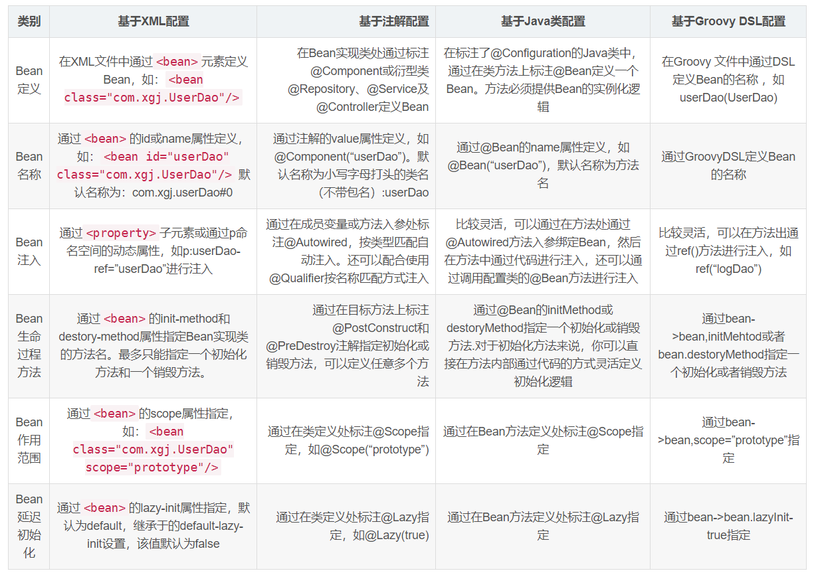
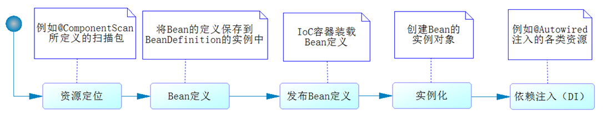
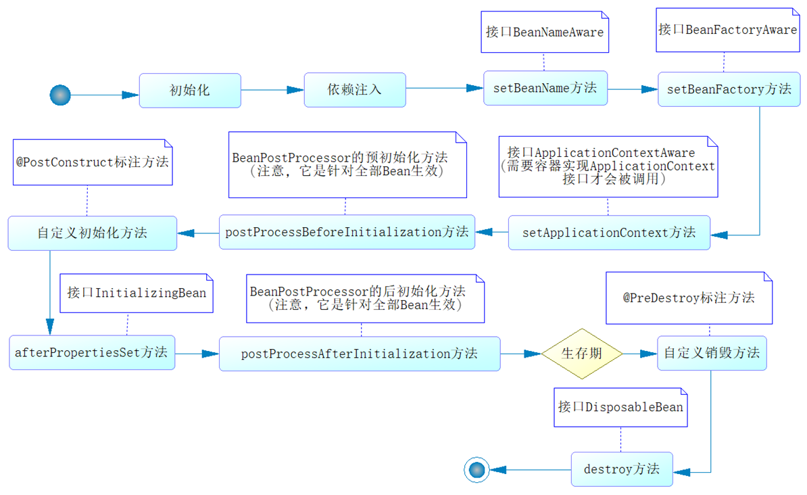
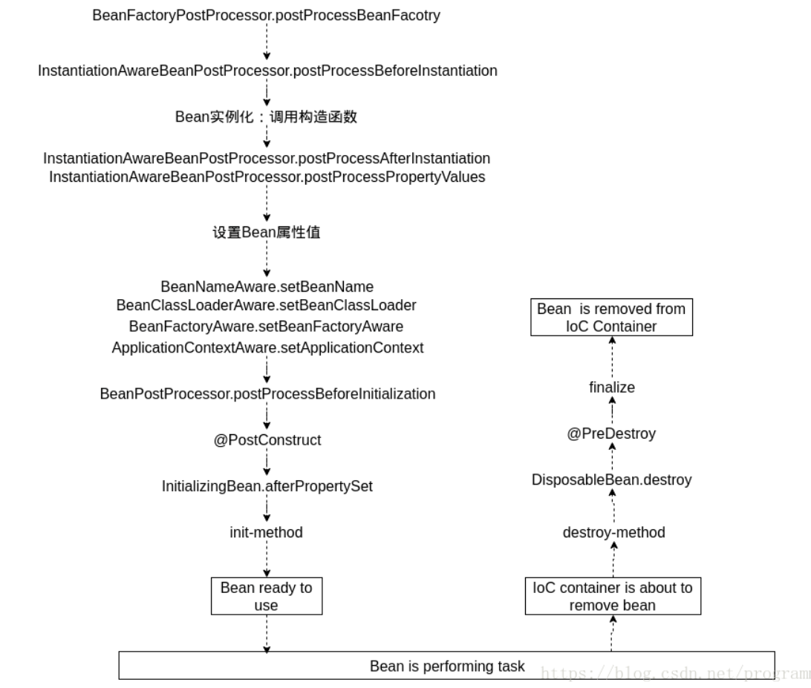
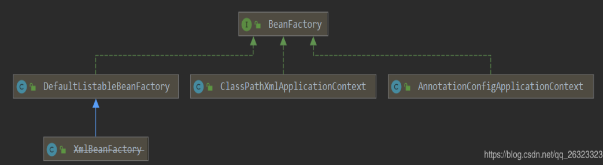

[TOC]

### Spring IOC

在 Spring 中，那些组成应用程序的主体及由 Spring IOC 容器所管理的对象，被称之为 **bean**。简单地讲，bean 就是由 IOC 容器初始化、装配及管理的对象，除此之外，bean 就与应用程序中的其他对象没有什么区别了。而 bean 的定义以及 bean 相互间的依赖关系将通过配置元数据来描述。

#### 控制反转IOC

##### 1. 谈谈对IOC的理解？

IoC（Inverse of Control 控制反转）是一种**设计思想**，就是**将原本在程序中手动创建对象的控制权，交由 Spring 框架来管理。**  IoC 在其他语言中也有应用并非 Spring 特有。 **IoC 容器是 Spring 用来实现 IoC 的载体，  IoC 容器实际上就是个Map（key，value）,Map 中存放的是各种对象。**

**控制**就是开发人员本来可以**控制**对象的**创建、管理**过程，**反转**就是将这个**权利交给外部的环境**去实现，比如 IOC 容器。反转之后失去了创建管理对象的权利，但是可以**不用再考虑对象的创建、管理等一系列的事情**。这样可以很大程度上简化应用的开发，把应用从复杂的依赖关系中解放出来。

将对象之间的**相互依赖关系**交给 IoC 容器来管理，并由 IoC 容器完成对象的**注入**。  **IoC 容器就像是一个工厂一样，当需要创建一个对象的时候，只需要配置好配置文件/注解即可，完全不用考虑对象是如何被创建出来的。** 在实际项目中一个 Service 类可能有几百甚至上千个类作为它的底层，假如需要实例化这个 Service，可能要每次都要搞清这个 Service 所有底层类的构造函数，这可能会把人逼疯。如果利用 IoC 的话，就只需要完成配置然后在需要的地方引用就行了，这大大增加了项目的可维护性且降低了开发难度。

例如：现有类 A 依赖于类 B：

- **传统的开发方式** ：在类 A 中手动 new 出一个 B 的对象出来。
- **使用 IoC 思想的开发方式** ：不通过 new 关键字来创建对象，而是通过 IoC 容器(Spring 框架) 来生成实例化对象。需要哪个对象，**直接从 IoC 容器里面获取**即可。

##### 2. 控制反转的好处

IoC 的思想就是两方之间不互相依赖，由第三方容器来管理相关资源。这样做的好处在于：

1. 对象之间的**耦合度**或者说依赖程度降低；
2. 资源变的**容易管理**；
3. 降低了项目的开发难度并增加了可维护性。

##### 3. IOC与DI的关系

- IOC 是一种设计思想，这个设计思想就是 将原本在程序中手动创建对象的控制权，交由 Spring 框架来管理。

- DI 是**依赖注入**，向**类里面属性注入值**。**依赖注入**是 IOC 最常见以及最合理的**实现方式**。**依赖注入不能单独存在，需要在 IOC 基础上完成操作**。

##### 4. 依赖倒置原则

假设设计一辆汽车：先设计轮子，然后根据轮子大小设计底盘，接着根据底盘设计车身，最后根据车身设计好整个汽车。这里就出现了一个**“依赖”关系**：汽车依赖车身，车身依赖底盘，底盘依赖轮子。


这样设计看起来没问题，但是可维护性却很低。假设设计完工之后上司却突然说根据市场需求的变动，要把车子的轮子设计都改大一码。这下就蛋疼了：因为是根据轮子的尺寸设计的底盘，轮子的尺寸一改，底盘的设计就得修改；同样因为是根据底盘设计的车身，那么车身也得改，同理汽车设计也得改——整个设计几乎都得改！

现在换一种思路。先设计汽车的**大概样子**，然后根据汽车的样子来设计车身，根据车身来设计底盘，最后根据底盘来设计轮子。这时候，**依赖关系就倒置**过来了：轮子依赖底盘， 底盘依赖车身， 车身依赖汽车。


这时候，上司再说要改动轮子的设计，**就只需要改动轮子的设计**，而不需要动底盘，车身，汽车的设计了。

这就是依赖倒置原则——**把原本的高层建筑依赖底层建筑“倒置”过来，变成底层建筑依赖高层建筑**。高层建筑决定需要什么，底层去实现这样的需求，但是高层并不用管底层是怎么实现的。这样就不会出现前面的“牵一发动全身”的情况。

这几种概念的关系如下：


#### Bean作用域

Scope 用来声明容器中的对象所应该处的限定场景或者说该对象的存活时间，即容器在对象进入其相应的 scope之前，生成并装配这些对象，在该对象不再处于这些 scope 的限定之后，容器通常会销毁 Spring 的 IoC 容器这些对象。

**Spring 的单例是基于 BeanFactory 也就是 Spring 容器的，单例 Bean 在此容器内只有一个，Java 的单例是基于 JVM，每个 JVM 内只有一个实例**。

在大多数情况下单例 bean 是很理想的方案，不过有时候使用的类是易变的，它们**会保持一些状态**，因此重用是不安全的。在这种情况下，将 class 声明为单例的就不是那么明智了。因为对象会被污染，所以 Spring 定义了多种作用域的bean。

##### 1. 作用域分类

|     Scope      |                         Description                          |
| :------------: | :----------------------------------------------------------: |
| **singleton**  | （**默认的**）在每个 Spring IoC 容器中，一个 bean 定义对应只会有唯一一个 bean 实例 |
| **prototype**  |              一个 bean 定义可以有多个 bean 实例              |
|  **request**   | 一个 bean 定义对应于单个 **HTTP 请求**的生命周期，仅适用于 **WebApplicationContext** 环境。 |
|  **session**   |    一个 bean 定义对应于单个 **HTTP Session** 的生命周期。    |
| global session |           仅仅在基于 portlet 的 web 应用中才有意义           |

五种作用域中，**request、session** 和 **global session** 三种作用域仅在基于 web 的应用中使用，只能用在基于 web 的 Spring ApplicationContext 环境。

##### 2. singleton

在 Spring 的 IoC 容器中只存在**一个实例**，所有对该对象的引用将**共享**这个实例。该实例从容器启动，并因为第一次被请求而初始化之后，将一直存活到容器退出，也就是说，它与 IoC 容器“几乎”拥有相同的“寿命”。标记为 singleton 的 bean是由容器来保证这种类型的 bean 在**同一个容器中**只存在一个共享实例；而 Singleton 模式则是保证在同一个 **Classloader** **中**只存在一个这种类型的实例。

在不指定 @Scope 的情况下，**所有**的 bean 都是**单实例**的 bean, 而且是**==饿汉加载==**，也就是容器启动就进行实例创建。

如果对 singleton 的 bean 指定为 **@Lazy 懒加载**，那么容器启动的时候不创建对象，而在**第一次使用**的时候才会创建该对象。

````java
@Bean
@Lazy
public Person person() {
    return new Person();
}
````

> **Spring中的单例bean的线程安全问题**

单例 bean **存在线程问题**，主要是因为当**多个**线程操作**同一个对象**的时候，对这个对象的**非静态成员变量的写操作**会存在线程安全问题。常见的有两种解决办法：

1. 在 Bean 对象中尽量避免定义可变的成员变量（不太现实）。

2. 在**类**中定义一个 **ThreadLocal** 成员变量，将需要的**==可变成员变量==保存在 ThreadLocal 中**（推荐的一种方式）。

##### 3. prototype

当一个 bean 的作用域为 prototype 时，表示一个 bean **定义**对应**多个对象实例**。 prototype 作用域的 bean 会导致在每次对该 bean 请求（将其**注入**到另一个 bean 中，或者以程序的方式调用容器的 getBean() 方法）时都会**创建一个新**的 bean 实例。prototype 是原型类型，在**创建容器的时候并没有实例化**，而是当获取 bean 的时候才会去创建一个对象，而且每次获取到的对象是一个**新的对象**。

虽然这种类型的对象的**实例化以及属性设置**等工作都是由容器负责的，但是只要准备完毕，并且对象实例返回给请求方之后，**容器就不再拥有当前返回对象的引用**，请求方需要**自己负责**当前返回对象的后继生命周期的管理工作，包括该对象的销毁。

根据经验，对**==有状态的== bean 应该使用 prototype 作用域**（比如保存每个顾客信息的对象），而对无状态的 bean 则应该使用 singleton 作用域。  在 XML 中将 bean 定义成 prototype ，可以这样配置：

```java
<bean id="account" class="com.foo.DefaultAccount" scope="prototype"/>  
<bean id="account" class="com.foo.DefaultAccount" singleton="false"/> 
```

也可通过 **@Scope 注解**进行配置。

singleton 与 prototype 用法最大区别：**有无状态**。

##### 4. request

每一次 HTTP 请求都会产生一个新的 bean，该 bean 仅在当前 HTTP request 内有效。**request 只适用于 Web 程序，每一次 HTTP 请求都会产生一个新的 bean，同时该 bean 仅在当前 HTTP request 内有效，当请求结束后，该对象的生命周期即告结束。** 在 XML 中将 bean 定义成 request ，可以这样配置：

```java
<bean id="loginAction" class=cn.csdn.LoginAction" scope="request"/>
```

##### 5. session

**会话**：用户打开浏览器会话开始，直到关闭浏览器会话才会结束。一次会话期间只会创建一个 session 对象。服务器会为每个会话创建一个 session 对象，所以 session 中的数据可供当前会话中所有 servlet 共享。

每一次 HTTP 请求都会产生一个新的 bean，该 bean 仅在当前 HTTP session 内有效。session 只适用于 Web 程序，session 作用域表示该针对每一次 HTTP 请求都会产生一个新的 bean，同时该 bean 仅在**当前 HTTP session 内有效**。与 request 作用域一样，可以根据需要放心的更改所创建实例的内部状态，而别的 HTTP session 中根据 userPreferences 创建的实例，将不会看到这些特定于某个 HTTP session 的状态变化。当 HTTP session 最终被废弃的时候，在该 HTTP session 作用域内的 bean 也会被废弃掉。

```xml
<bean id="userPreferences" class="com.foo.UserPreferences" scope="session"/>
```

##### 6. globalSession

global session 作用域类似于标准的 HTTP session 作用域，不过仅仅在基于 portlet 的 web 应用中才有意义。Portlet 规范定义了全局 Session 的概念，它被所有构成某个 portlet web 应用的各种不同的 portlet 所共享。在 global session  作用域中定义的 bean 被限定于全局 portlet Session 的生命周期范围内。

```xml
<bean id="user" class="com.foo.Preferences "scope="globalSession"/>
```

##### 7. @Scope注解

如下所示为一个POJO类使用 @Scope 注解。使用 ConfigurableBeanFactory 只能提供单例 (SCOPE_SINGLETON)和原型 (SCOPE_PROTOTYPE)。在 MVC 中，还可以使用 WebApplicationContext 去提供 MVC 下特有的**作用域**形式，如请求（SCOPE_REQUEST），会话（SCOPE_SESSION）。

```java
import org.springframework.beans.factory.config.ConfigurableBeanFactory;
import org.springframework.context.annotation.Profile;
import org.springframework.context.annotation.Scope;
import org.springframework.stereotype.Component;

@Component
@Scope(ConfigurableBeanFactory.SCOPE_SINGLETON)  	// 设置bean作用域
// @Scope(WebApplicationContext.SCOPE_REQUSET)  	// 设置bean作用域(For MVC)
public class TestBean {
}
```


#### Bean的装配与注册

Spring 为实现 Bean 的信息定义，提供了**基于注解、基于配置类、基于 XML、基于 Groovy** 这几种 bean 装配方式，各种配置方式可混合使用。基于 XML 与 Groovy 配置这里就不涉及了。 

##### 1. 基于配置类的装配

通过**配置类**对一个 bean 进行装配。

- @**Configuration** 说明为一个**配置类**。
- @**ComponentScan** 标明采用何种策略去**扫描装配** Bean，默认扫描配置类当前所在的包及其子包。可以自定义扫描路径。
- 将 **@Bean** 标注方法返回的 bean 装配到 IOC 容器中。

看一个关于数据源的 Bean 装配的实例。

```java
@Configuration
@ComponentScan(basePackages = "com.springboot.chapter3.*") 
@ImportResource(value = {"classpath:spring-other.xml"})
public class AppConfig {
    
	@Bean(name = "dataSource", destroyMethod = "close")
	public DataSource getDevDataSource() {
		Properties props = new Properties();
		props.setProperty("driver", "com.mysql.jdbc.Driver");
		props.setProperty("url", "jdbc:mysql://localhost:3306/dev_spring_boot");
		props.setProperty("username", "root");
		props.setProperty("password", "123456");
		DataSource dataSource = null;
		try {
			dataSource = BasicDataSourceFactory.createDataSource(props);
		} catch (Exception e) {
			e.printStackTrace();
		}
		return dataSource;
	}
}
```

##### 2. 基于注解的装配

定义一个 POJO 类，直接在此类里面**注入属性**。

- @**Component** 标明这个类被装配到容器中。
- @**Value** 字段中注入**属性值**。

```java
import org.springframework.beans.factory.annotation.Value;
import org.springframework.stereotype.Component;

// 指定user为bean名称 如果不指定则把类名首字母小写当做类名称
@Component("user")      
public class User {

    // @Value注入属性值
	@Value("1")         
	private Long id;
	@Value("user_name_1")
	private String userName;
	@Value("note_1")
	private String note;

	// Getters and Setters
}
```

##### 3. 装配方式对比

几种配置方式对比：



##### 4. @Conditional条件装配Bean

**满足一定条件才装配 Bean**，否则不装配，比如数据库配置信息不全就不装配。@Conditional 注解用于条件装配 Bean，需要配合 Condition 接口使用。

```java
@Configuration
@ComponentScan(basePackages = "com.springboot.chapter3.*")
@ImportResource(value = {"classpath:spring-other.xml"})
public class AppConfig {
	
	@Bean(name = "dataSource", destroyMethod = "close")
    // 传入的类需实现Condition接口
	@Conditional(DatabaseConditional.class)      
	public DataSource getDataSource(            
        // 使用@Value去取配置文件中的值并注入
			@Value("${database.driverName}") String driver,
			@Value("${database.url}") String url,
			@Value("${database.username}") String username, 
			@Value("${database.password}") String password
		) {
		Properties props = new Properties();
		props.setProperty("driver", driver);
		props.setProperty("url", url);
		props.setProperty("username", username);
		props.setProperty("password", password);
		DataSource dataSource = null;
		try {
			dataSource = BasicDataSourceFactory.createDataSource(props);
		} catch (Exception e) {
			e.printStackTrace();
		}
		return dataSource;
	}
}	
```

上述的 **@Conditional(DatabaseConditional.class)** 传入了 DatabaseConditional 类，传入 @Conditional 注解的类需要实现 Condition 接口。

```java
import org.springframework.context.annotation.Condition;
import org.springframework.context.annotation.ConditionContext;
import org.springframework.core.env.Environment;
import org.springframework.core.type.AnnotatedTypeMetadata;

public class DatabaseConditional implements Condition {

    /**
	 * 数据库装配条件 不符合条件的就不装配
	 * @param context 条件上下文
	 * @param 
	 */
	@Override
	public boolean matches(ConditionContext context, AnnotatedTypeMetadata metadata) {
		Environment env = context.getEnvironment();
        // 此处是判断条件
		return env.containsProperty("database.driverName") && env.containsProperty("database.url") 
				&& env.containsProperty("database.username") && env.containsProperty("database.password");
	}
}
```

只有满足了**上述自定义的条件**，才会**装配** DataSource 。

##### 5. 装配导入组件的注解

往 IOC 容器**添加组件**的注解主要有下面。

**(1)** 通过 **@ComponentScan + @Controller @Service @Respository @Component**。适用场景: 将**自己写的组件**加载到容器中。

一般使用 **@Autowired** 注解自动装配 bean，要想把类标识成可用于 @Autowired 注解自动装配的 bean 的类，采用以下注解可实现：

- @**Component** ：通用的注解，可标注**任意类**为 Spring 组件。如果一个 Bean **不知道**属于哪个层，可以使用@Component 注解标注。
- @**Repository** : 对应**持久层**即 Dao 层，主要用于数据库相关操作。
- @**Service** : 对应**服务层**，主要涉及一些复杂的逻辑，需要用到 Dao 层。
- @**Controller** : 对应 Spring MVC **控制层**，主要用户接受用户请求并调用 Service 层返回数据给前端页面。

**(2)** 通过 **@Bean** 的方式来导入组件(适用于导入**第三方组件**的类)。

> **@Component和@Bean的区别是什么？**

- 作用对象不同：@Component 注解作用于**类**，而 @Bean 注解作用于**方法**。
- @Component 通常是通过**类路径扫描**来自动侦测以及自动装配到 Spring 容器中（可以使用 @ComponentScan 注解定义要扫描的路径从中找出标识了需要装配的类自动装配到 Spring 的 bean 容器中）。@Bean 注解通常是在标有该注解的方法中**定义产生这个 bean**，@Bean告诉了 Spring 这是某个类的示例，当需要用它的时候还给我。
- @Bean 注解比 Component 注解的自定义性更强，而且很多地方只能通过 **@Bean 注解来注册 bean**。比如引用**第三方库**中的类需要装配到 Spring 容器时，则只能通过 @Bean 来实现。

**(3)** 通过 **@Import** 来**导入组件** （导入组件的 id 为全类名路径）。也可以导入**第三方**组件。

```java
@Configuration
@Import(value = {Person.class, Car.class})
public class MainConfig {
}
```

通过 **@Import 的 ImportSeletor 类**实现组件的导入 (导入组件的 id 为全类名路径)  。**自动装配**原理经常使用。

```java
public class TulingImportSelector implements ImportSelector {
    // 可以获取导入类的注解信息
    @Override
    public String[] selectImports(AnnotationMetadata importingClassMetadata) {
        return new String[]{"com.tuling.testimport.compent.Dog"};
    }
}   
```

使用这个 TulingImportSelector。

```java
@Configuration
@Import(value = {Person.class, Car.class, TulingImportSelector.class})
public class MainConfig {
}
```

通过 @Import 的 **ImportBeanDefinitionRegister** 导入组件 (可以指定 bean 的名称）。Bean **定义注册器**。

```java
public class TulingBeanDefinitionRegister implements ImportBeanDefinitionRegistrar {
    @Override
    public void registerBeanDefinitions(AnnotationMetadata importingClassMetadata, BeanDefinitionRegistry registry) {
        // 创建一个bean定义对象
        RootBeanDefinition rootBeanDefinition = new RootBeanDefinition(Cat.class);
        // 把bean定义对象导入到容器中
        registry.registerBeanDefinition("cat", rootBeanDefinition);
    }
}
```

```java
@Configuration
//@Import(value = {Person.class, Car.class})
//@Import(value = {Person.class, Car.class, TulingImportSelector.class})
@Import(value = {Person.class, Car.class, TulingImportSelector.class, TulingBeanDefinitionRegister.class})
public class MainConfig {
}
```

**(4)** 通过实现 **FacotryBean 接口**来实现添加组件。整合**第三方的复杂初始化对象**。典型的是 **SqlSessionFactoryBean** 组件。

```java
public class CarFactoryBean implements FactoryBean<Car> {
    // 返回bean的对象
    @Override
    public Car getObject() throws Exception {
        return new Car();
    } 
    // 返回bean的类型
    @Override
    public Class<?> getObjectType() {
        return Car.class;
    } 
    // 是否为单例
    @Override
    public boolean isSingleton() {
        return true;
    }
}
```

注入这个组件。

```java
@Configuration
@ImportResource(locations = {"classpath:beans.xml"})
public class MainConfig {
    @Bean
    public CarFactoryBean carFactoryBean() {
        return new CarFactoryBean();
    }
}
```


#### 属性设置

##### 1. @Value注解设置属性

使用 **@Value 注解**可以注入为 bean 设置属性，@Value 内可以直接设置属性值，也可以使用 Spring 表达式，也可以引用配置文件中的属性值。

```java
public class Person {
    // 通过普通的方式
    @Value("Tom")
    private String firstName;
    // spel方式来赋值
    @Value("#{28-8}")
    private Integer age;
    // 通过读取外部配置文件的值
    @Value("${person.lastName}")
    private String lastName;
}
```

##### 2.. 属性配置文件

###### (1) application.properties

是**默认**的配置文件，yml 文件也是类似的效果。

```properties
# application.properties中
database.url = jdbc:mysql://localhost:3306/test_db
database.username = root
database.password = 123456
```

可以在类中注入属性文件中的值。

```java
@Component
public class DatabaseProperties{
    
    @Value("${database.url}")   // 此处引用配置文件中的属性并注入
    private String url = null;
}
```

如果都用上述的方法可能需要写很多次，因此可以用如下方法直接指定属性文件中的值，如 database，然后用全限定名去定位值，如 database.url。

```java
@Component
@ConfigurationProperties("database")    // 使用此注解传入字符串database，会去配置文件寻找对应的属性自动注入
public class DatabaseProperties{
    
    private String url = null;
    // Getters and Setters
}
```

###### (2) 自定义属性配置文件

如把数据库连接信息放入 **jdbc.properties** 中，然后使用 **@PropertySource** 去定义对应的**属性配置文件**, @PropertySource 注解需要在配置类中标注，value 值可以有多个。ignoreResourceNotFound 指示找不到文件就忽略。

```java
@SpringBootApplication
@ComponentScan(basePackages = {"com.springboot.chapter"})
 // 指定配置文件路径
@PropertySource(value = {"classpath:jdbc.properties"}, ignoreResourceNotFound = ture) 
public class IoCTest{
    public static void main(String[] args){
        SpringApplication.run(IoCTest.class, args);
    }
}
```


#### 依赖注入DI

##### 1. 概述

**定义**：在依赖注入的模式下，创建被调用者得工作不再由调用者来完成，创建被调用者实例的工作通常由 Spring 容器完成，然后注入调用者。**创建对象时，向类里的属性设置值**。

所谓依赖注入，就是把底层类作为参数传入上层类，实现上层类对下层类的控制。DI 依赖注入，向类里面属性注入值 ，依赖注入不能单独存在，需要在 IOC 基础上完成操作。

##### 2. 依赖注入方式

一般而言，依赖注入可以分为 3 种方式。

- **构造器**注入。
- **setter** 注入。
- 接口注入。
- **注解**注入(@Autowired) 

**构造器注入和 setter 注入和注解注入**是主要的方式，而接口注入是从别的地方注入的方式。

###### (1) 构造器注入

构造器注入**依赖于构造方法**实现，而构造方法可以是**有参数的或者是无参数**的。我们一般是通过类的构造方法来创建类对象，Spring 也可以采用**反射的方式**，通过使用构造方法来完成注入，这就是构造器注入的原理。

```java
public class Role {
    private Long id;
    private String roleName;
    private String note;

    public Role(String roleName, String note) {
        this.roleName = roleName;
        this.note = note;
    }

    /******** setter and getter *******/
}
```

这个时候是**没有办法利用无参数的构造方法**去创建对象的，为了使 Spring 能够正确创建这个对象。

```xml
<bean id="role1" class="com.nano.pojo.Role">
    <constructor-arg index="0" value="总经理"/>
    <constructor-arg index="1" value="公司管理者"/>
</bean>
```

**constructor-arg** 元素用于定义类构造方法的**参数**，其中 **index** 用于定义参数的**位置**，而 value 则是**设置值**，通过这样的定义 Spring 便知道使用 Role(String,String) 这样的**构造方法**去创建对象了。这样注入比较简单的，但是缺点也很明显，如果参数很多，那么这种构造方法就比较复杂了，这个时候应该考虑 setter 注入。

###### (2) setter注入

setter 注入利用 JavaBean 规范所定义的 setter 方法来完成注入，灵活且可读性高。它消除了使用构造器注入时出现**多个参数的可能性**，首先可以把构造方法声明为**无参数**的，然后使用 setter 注入为其设置对应的值，其实也是通过 Java **反射技术得以现实**的。这里假设先在代码清单中为 Role 类加入一个没有参数的构造方法，然后做代码清单的配置。

```xml
<bean id="role2" class="com.nano.pojo.Role">
    <property name="roleName" value="高级工程师"/>
    <property name="note" value="重要人员"/>
</bean
```

这样 Spring 就会通过**反射调用无参构造方法生成对象**，同时通过反射对应的 setter 注入配置的值了。这种方式是基于 xml 配置时 Spring 最为主要的注入方式。

###### (3) 接口注入

有些时候资源**并非来自于自身系统**，而是来自于外界，比如数据库连接资源完全可以在 Tomcat 下配置，然后通过 JNDI 的形式去获取它，这样数据库连接资源是属于开发工程外的资源，这个时候可以采用接口注入的形式来获取它。

比如在 Web 工程中，配置的数据源往往是通过服务器（比如Tomcat）去配置的，这个时候可以用 JNDI 的形式通过接口将它注入 Spring IoC 容器中来。

###### (4) 注解注入@Autowired与@Resource

现在一般都用这个了吧。

> **注解@Autowired**

getBean() 方法支持根据类型和名称来获取对应的 bean。@Autowired 注解首先根据类型去**寻找对应的 bean**，找不到再根据**属性名称和 bean 名称**来寻找 bean。默认必须找到对应 Bean，否则报错（可以使用 required = false 关闭必须装配）。

@Autowired 可以标注在**属性**上，也可以标注在方法上，还可以标注在入参上。

```java
@Autowired	
private Animal animal = null;
```

```java
@Override
@Autowired
public void setAnimal(Animal animal) {
    this.animal = animal;
}
```

```java
public BussinessPerson(@Autowired Animal animal) {
    this.animal = animal;
}
```

> **使用@Primary与@Qualifier消除歧义问题**

两个接口：动物与人接口。

```java
public interface Person {
	public void service();
	public void setAnimal(Animal animal);
}
```

```java
public interface Animal {
	public void use();
}
```

实现接口：

**狗类**

```java
@Component
public class Dog implements Animal {
	@Override
	public void use() {
		System.out.println("狗【" + Dog.class.getSimpleName()+"】是看门用的。");
	}
}
```

```java
@Component
public class BussinessPerson implements Person{
    // 自动注入实现了动物接口的类
    @Autowired	
    private Animal animal = null;

    @Override
    public void service() {
        this.animal.use();
    }

    @Override
    public void setAnimal(Animal animal) {
        this.animal = animal;
    }
}
```

上述 BussinessPerson 中自动注入实现了动物接口的类，此时容器中实现了 Animal 接口的**只有 Dog 类**，因此成功注入 Dog 的实例。如果再实现一个动物类。

**猫类**

```java
@Component
public class Cat implements Animal {
	@Override
	public void use() {
		System.out.println("猫【" + Cat.class.getSimpleName()+"】是抓老鼠。");
	}
}
```

此时 Dog 类和 Cat 类都实现了 Animal 接口。BussinessPerson 的自动注入会报错，因为**不知道注入哪一个**实例。产生注入失败是因为**按类型查找**，动物 Animal 接口有多个类型，这就是存在歧义。

**注解 @Primary** 可以修改**优先权**。比如在 Cat 类上使用此注解。

```java
@Component
@Primary
public class Cat implements Animal {...}
```

此时容器会**优先**注入 Cat 实例到 Animal 中。@Primary 也可以用在多个类上，此时也会有歧义，可以使用 **@Qualifier 注解**。@Qualifier 注解的配置项 **value** 需要一个字符串去定义，它可以与 @Autowired 一起去通过**类型域名称一起寻找 Bean**。如下。此时注入的就是 Dog 类的实例。

```java
@Autowired
@Qualifier("dog")
Animal animal = null;
```

> **@autowire和@resourse的区别？**

@Resource 和 @Autowired 都是做 bean 的**注入**时使用，其实 @Resource 并不是 Spring 的注解，它的包是 javax.annotation.Resource。 

1、**共同点**

两者都可以写在字段和 setter 方法上。两者如果都写在字段上，那么就不需要再写 setter 方法。

2、**不同点**

**@Resource 的作用相当于 @Autowired，只不过 @Autowired 按照 byType 自动注入。**

**(1) @Autowired**

@Autowired 为 Spring 提供的注解，需要导入包 org.springframework.beans.factory.annotation.Autowired; 只按照 byType 注入。

```java
public class TestServiceImpl {
    // 下面两种@Autowired只要使用一种即可
    @Autowired
    private UserDao userDao; // 用于字段上
    
    @Autowired
    public void setUserDao(UserDao userDao) { // 用于属性的方法上
        this.userDao = userDao;
    }
}
```

@Autowired 注解是按照**类型**（byType）装配依赖对象，默认情况下它要求依赖对象必须存在，如果需要允许 null 值，可以设置它的 required 属性为 false。如果想使用**按照名称**（byName）来装配，可以结合 @Qualifier 注解一起使用。如下：

```java
public class TestServiceImpl {
    @Autowired
    @Qualifier("userDao")
    private UserDao userDao; 
}
```

**(2) @Resource**

@Resource 默认按照 **ByName 自动注入**，由 J2EE 提供，需要导入包 javax.annotation.Resource。@Resource 有两个重要的属性：name 和 type，而 Spring 将 @Resource 注解的 name 属性解析为 bean 的名字，而 type 属性则解析为 bean 的类型。所以如果使用 name 属性，则使用 byName 的自动注入策略，而使用 type 属性时则使用 byType 自动注入策略。如果既不制定 name 也不制定 type 属性，这时将通过反射机制使用 byName 自动注入策略。

```javascript
public class TestServiceImpl {
    // 下面两种@Resource只要使用一种即可
    @Resource(name="userDao")
    private UserDao userDao; // 用于字段上
    
    @Resource(name="userDao")
    public void setUserDao(UserDao userDao) { // 用于属性的setter方法上
        this.userDao = userDao;
    }
}
```

注：最好是将 @Resource 放在 setter 方法上，因为这样更符合面向对象的思想，通过 set、get 去操作属性，而不是直接去操作属性。

**@Resource 装配顺序：**

1. 如果**同时指定了 name 和 type**，则从 Spring 上下文中找到唯一匹配的 bean 进行装配，找不到则抛出异常。

2. 如果指定了 **name**，则从上下文中查找名称（id）匹配的 bean 进行装配，找不到则抛出异常。

3. 如果指定了 **type**，则从上下文中找到类似匹配的唯一 bean 进行装配，找不到或是找到多个，都会抛出异常。
4. 如果既没有指定 name，又没有指定 type，则自动按照 byName 方式进行装配；如果没有匹配，则回退为一个原始类型进行匹配，如果匹配则自动装配。


#### Bean的生命周期

Bean**定义**、Bean**初始化**、Bean**生存期**、Bean**销毁**。

##### 1. Spring初始化Bean流程

- **资源定位**(例如 @ComponentScan 所定义的扫描包)。
- Bean 定义(将 Bean 的定义保存到 BeanDefinition 的实例中)。
- 发布 Bean 定义( IOC 容器装载 Bean 的定义)。
- 实例化(创建 Bean 的实例对象)。
- 依赖注入(例如 @Autowired 类的各类资源)。



##### 2. Spring Bean的生命周期



- Bean 容器找到**配置文件**中 Spring Bean 的定义。
- Bean 容器利用**反射**创建一个 Bean 的**实例**。
- 如果涉及到一些属性值 利用 set 方法**设置一些属性值**。
- 如果 Bean 实现了 **BeanNameAware** 接口，调用 setBeanName() 方法，传入 **Bean 的名字**。
- 如果 Bean 实现了 **BeanClassLoaderAware** 接口，调用 setBeanClassLoader() 方法，传入 ClassLoader 对象的实例。
- 如果 Bean 实现了 **BeanFactoryAware** 接口，调用 setBeanFactory() 方法，传入 **BeanFactory 对象**的实例。
- 与上面的类似，如果实现了**其他 *Aware 接口**，就调用相应的方法。
- 如果有和加载这个 Bean 的 Spring 容器相关的 **BeanPostProcessor** 对象，执行 **postProcessBeforeInitialization**() 方法。
- 如果 Bean 实现了 **InitializingBean** 接口，执行 **afterPropertiesSet**() 方法。
- 如果 Bean 在配置文件中的定义包含 **init-method** 属性，执行指定的方法。
- 如果有和加载这个 Bean 的 Spring 容器相关的 **BeanPostProcessor** 对象，执行 **postProcessAfterInitialization**() 方法
- 当要销毁 Bean 的时候，如果 Bean 实现了 **DisposableBean** 接口，执行 **destroy**() 方法。
- 当要销毁 Bean 的时候，如果 Bean 在配置文件中的定义包含 **destroy-method** 属性，执行指定的方法。


若容器注册了以上各种**接口**，程序那么将会按照以上的流程进行。

再来一张流程图。

 

【Spring bean 的生命周期】面试的时候的回答：

1. **实例化**一个 Bean，也就是通常说的 new；
2. 按照 Spring 上下文对实例化的 Bean 进行配置，也就是 **IOC 注入**；
3. 如果这个 Bean 实现了 **BeanNameAware 接口**，会调用它实现的 **setBeanName**(String beanId) 方法，此处传递的是 Spring 配置文件中 Bean 的 ID；
4. 如果这个 Bean 实现了 **BeanFactoryAware 接口**，会调用它实现的 **setBeanFactory**()，传递的是 Spring **工厂本身**（可以用这个方法获取到其他 Bean）；
5. 如果这个 Bean 实现了 **ApplicationContextAware接口**，会调用 **setApplicationContext**(ApplicationContext)方法，传入 **Spring 上下文**，该方式同样可以实现步骤 4，但**比 4 更好**，以为 ApplicationContext 是 BeanFactory 的子接口，有更多的**实现方法**；
6. 如果这个 Bean 关联了 **BeanPostProcessor 接口**，将会调用 **postProcessBeforeInitialization**(Object obj,  String s)方法，BeanPostProcessor 经常被**用作是 Bean 内容的更改**，并且由于这个是在 Bean 初始化**结束时**调用 After 方法，也可用于**内存或缓存技术**；
7. 如果这个 Bean 在 Spring 配置文件中配置了 **init-method 属性**会自动调用其配置的初始化方法；
8. 如果这个 Bean 关联了 **BeanPostProcessor 接口**，将会调用 **postAfterInitialization**(Object obj, String s) 方法；

注意：以上工作完成以后就可以**使用这个 Bean 了**，这是一个 singleton 的 bean，所以一般情况下调用同一个 ID 获取的 Bean 会是在内容**地址相同**的实例。

1. 当 Bean 不再需要时，会经过清理阶段，如果 Bean 实现了 **DisposableBean 接口**，会调用其实现的 **destroy 方法**。
2. 最后，如果这个 Bean 的 Spring 配置中配置了 **destroy-method 属性**，会自动调用其配置的**销毁方法**。

这 10 个步骤可以作为面试模板，另外这里描述的是应用 Spring 上下文 Bean 的生命周期，如果应用 Spring 的工厂也就是 BeanFactory 的话去掉第 5 步就 Ok 了。

下面将仔细讲解各接口作用。

##### 3. 各个接口方法分类

Bean 的完整生命周期经历了各种**方法调用**，这些方法可以划分为以下几类：

- **Bean 自身的方法**：这个包括了 Bean 本身调用的方法和通过配置文件中 **\<bean>** 的 **init-method** 和 **destroy-method** 指定的**初始化以及销毁**方法。

- **Bean 级生命周期接口方法**：这个包括了 BeanNameAware、BeanFactoryAware、InitializingBean 和DiposableBean 这些接口的方法。

- **容器级生命周期接口方法**：这个包括了 **InstantiationAwareBeanPostProcessor** 和 **BeanPostProcessor** 这两个接口实现，一般称它们的实现类为“**后处理器**”。

- **工厂后处理器接口方法**：这个包括了 AspectJWeavingEnabler, ConfigurationClassPostProcessor, CustomAutowireConfigurer 等等非常有用的**工厂后处理器接口**的方法。工厂后处理器也是**容器级**的。在应用上下文装配配置文件之后立即调用。

##### 4. 初始化initialization和销毁destroy方法

有时需要在 Bean 属性值 set 好之后和 Bean 销毁之前做一些事情，比如检查 Bean 中某个属性是否被正常的设置好值了。Spring 框架提供了多种方法让我们可以在 Spring Bean 的生命周期中执行 **initialization 和 pre-destroy** 方法。

**1. 实现InitializingBean和DisposableBean接口**

这两个接口都只包含**一个方法**。通过实现 **InitializingBean** 接口的 **afterPropertiesSet**() 方法可以在 Bean **属性值设置好之后**做一些操作，实现 **DisposableBean** 接口的 **destroy**() 方法可以在销毁 Bean 之前做一些操作。

例子如下：

```java
public class GiraffeService implements InitializingBean, DisposableBean {
    @Override
    public void afterPropertiesSet() throws Exception {
        System.out.println("执行InitializingBean接口的afterPropertiesSet方法");
    }
    @Override
    public void destroy() throws Exception {
        System.out.println("执行DisposableBean接口的destroy方法");
    }
}
```

这种方法比较简单，但是**不建议使用**。因为这样会将 Bean 的实现和 Spring 框架**耦合在一起**。

**2. 在bean的配置文件中指定init-method和destroy-method方法**

Spring 允许用户创建自己的 **init 方法和 destroy 方法**，只要在 Bean 的配置文件中指定 init-method 和 destroy-method 的值就可以在 Bean 初始化时和销毁之前执行一些操作。

例子如下：

```java
public class GiraffeService {
    // 通过<bean>的destroy-method属性指定的销毁方法
    public void destroyMethod() throws Exception {
        System.out.println("执行配置的destroy-method");
    }
    // 通过<bean>的init-method属性指定的初始化方法
    public void initMethod() throws Exception {
        System.out.println("执行配置的init-method");
    }
}
```

配置文件中的配置：

```xml
<bean name="giraffeService" class="com.giraffe.spring.service.GiraffeService" init-method="initMethod" destroy-method="destroyMethod">
</bean>
```

需要注意的是自定义的 init-method 和 post-method 方法可以抛异常但是不能有参数。这种方式比较推荐，因为可以自己创建方法，无需将 Bean 的实现直接依赖于 Spring 的框架。

**3. 使用@PostConstruct和@PreDestroy注解**

除了 xml 配置的方式，Spring 也支持用 **@PostConstruct** 和 **@PreDestroy** 注解来指定 init 和 destroy 方法。这两个注解均在 javax.annotation 包中。例子如下：

```java
public class GiraffeService {
    @PostConstruct
    public void initPostConstruct(){
        System.out.println("执行PostConstruct注解标注的方法");
    }
    @PreDestroy
    public void preDestroy(){
        System.out.println("执行preDestroy注解标注的方法");
    }
}
```

为了注解可以生效，需要在**配置文件**中定义org.springframework.context.annotation.**CommonAnnotationBeanPostProcessor**  或 context:annotation-config。配置文件：

```xml
<bean class="org.springframework.context.annotation.CommonAnnotationBeanPostProcessor" />
```

##### 5. 实现*Aware接口在Bean中使用Spring框架的一些对象

有些时候需要在 **Bean 的初始化**中使用 **Spring ==框架自身==的一些对象**来执行一些操作，比如获取 ServletContext 的一些参数，获取 ApplicaitionContext 中的 BeanDefinition 的名字，获取 Bean 在容器中的名字等等。**==为了让 Bean 可以获取到框架自身的一些对象，Spring 提供了一组名为 *Aware 的接口。==**

这些接口均继承于 org.springframework.beans.factory.**Aware 标记接口**，并提供一个将由 **Bean 实现的 set* 方法**， Spring 通过基于 **setter 的依赖注入方式**使相应的对象可以被 Bean 使用。

介绍一些**重要的 Aware 接口**：

- **ApplicationContextAware**：获得 **ApplicationContext** 对象，可以用来获取**所有 BeanDefinition** 的名字。
- **BeanFactoryAware**：获得 **BeanFactory** 对象，可以用来检测 Bean 的作用域。
- **BeanNameAware**：获得 Bean 在**配置文件**中定义的名字。
- **ResourceLoaderAware**：获得 ResourceLoader 对象，可以获得 **classpath** 中某个文件。
- **ServletContextAware**：在一个 MVC 应用中可以获取 **ServletContext** 对象，可以读取 context 中的参数。
- **ServletConfigAware**：在一个 MVC 应用中可以获取 **ServletConfig** 对象，可以读取 config 中的参数。

以下是实现上述接口的例子。

```java
public class GiraffeService implements ApplicationContextAware,
ApplicationEventPublisherAware, BeanClassLoaderAware, BeanFactoryAware,
BeanNameAware, EnvironmentAware, ImportAware, ResourceLoaderAware{
    @Override
    public void setBeanClassLoader(ClassLoader classLoader) {
        System.out.println("执行setBeanClassLoader,ClassLoader Name = " + classLoader.getClass().getName());
    }
    @Override
    public void setBeanFactory(BeanFactory beanFactory) throws BeansException {
        System.out.println("执行setBeanFactory,setBeanFactory:: giraffe bean singleton=" +  beanFactory.isSingleton("giraffeService"));
    }
    @Override
    public void setBeanName(String s) {
        System.out.println("执行setBeanName:: Bean Name defined in context=" + s);
    }
    @Override
    public void setApplicationContext(ApplicationContext applicationContext) throws BeansException {
        System.out.println("执行setApplicationContext:: Bean Definition Names="
                           + Arrays.toString(applicationContext.getBeanDefinitionNames()));
    }
    @Override
    public void setApplicationEventPublisher(ApplicationEventPublisher applicationEventPublisher) {
        System.out.println("执行setApplicationEventPublisher");
    }
    @Override
    public void setEnvironment(Environment environment) {
        System.out.println("执行setEnvironment");
    }
    @Override
    public void setResourceLoader(ResourceLoader resourceLoader) {
        Resource resource = resourceLoader.getResource("classpath:spring-beans.xml");
        System.out.println("执行setResourceLoader:: Resource File Name="
                           + resource.getFilename());
    }
    @Override
    public void setImportMetadata(AnnotationMetadata annotationMetadata) {
        System.out.println("执行setImportMetadata");
    }
}
```

##### 6. BeanPostProcessor

上面的 ***Aware** 接口是针对**==某个==实现这些接口的 Bean 定制初始化**的过程，Spring 同样可以针对容器中的**==所有 Bean==**，或者**==某些== Bean** 定制初始化过程，只需**提供一个实现 BeanPostProcessor 接口的类**即可。 该接口中包含两个方法， **postProcessBeforeInitialization** 和 **postProcessAfterInitialization**。 

```java
public interface BeanPostProcessor {
    @Nullable
    default Object postProcessBeforeInitialization(Object bean, String beanName) throws BeansException {
        return bean;
    }

    @Nullable
    default Object postProcessAfterInitialization(Object bean, String beanName) throws BeansException {
        return bean;
    }
}
```

postProcessBeforeInitialization 方法会在容器中的 **Bean 初始化之前执行，** postProcessAfterInitialization 方法在容器中的 **Bean 初始化之后**执行。

例子如下：

```java
public class CustomerBeanPostProcessor implements BeanPostProcessor {
    @Override
    public Object postProcessBeforeInitialization(Object bean, String beanName) throws BeansException {
        System.out.println("执行BeanPostProcessor的postProcessBeforeInitialization方法,beanName=" + beanName);
        return bean;
    }
    @Override
    public Object postProcessAfterInitialization(Object bean, String beanName) throws BeansException {
        System.out.println("执行BeanPostProcessor的postProcessAfterInitialization方法,beanName=" + beanName);
        return bean;
    }
}
```

要将 BeanPostProcessor 的 Bean 像其他 Bean 一样定义在配置文件中配置。

```xml  
<bean class="com.giraffe.spring.service.CustomerBeanPostProcessor"/>
```

##### 7. 单例与非单例对象生命周期例子

其实很多时候并不会真的去实现上面说描述的那些接口，那么下面就除去那些接口，针对 bean 的单例和非单例来描述下 bean 的生命周期：

###### (1) 单例管理的对象

当 scope = "singleton"，即默认情况下，会在**启动容器时（即实例化容器时）时实例化**。但可以指定 Bean 的 **lazy-init= "true"** 来延迟初始化 bean，这时候只有在第一次获取 bean 时才会初始化 bean，即第一次请求该 bean 时才初始化。如下配置：

```xml
<bean id="ServiceImpl" class="cn.csdn.service.ServiceImpl" lazy-init="true"/>  
```

如果想对**所有的**默认单例 bean 都应用延迟初始化，可以在根节点 beans 设置 default-lazy-init 属性为 true，如下所示：

```xml
<beans default-lazy-init="true" …>
```

默认情况下，Spring 在读取 xml 文件的时候，就会**创建对象**。在创建对象的时候先**调用构造**器，然后调用 **init-method 属性值**中所指定的方法。对象在被销毁的时候，会调用 **destroy-method 属性值**中所指定的方法（例如调用 Container.destroy() 方法的时候）。写一个测试类，代码如下：

```java
public class LifeBean {
    private String name;  

    public LifeBean(){  
        System.out.println("LifeBean()构造函数");  
    }  
    public String getName() {  
        return name;  
    }  

    public void setName(String name) {  
        System.out.println("setName()");  
        this.name = name;  
    }  

    public void init(){  
        System.out.println("this is init of lifeBean");  
    }  

    public void destory(){  
        System.out.println("this is destory of lifeBean " + this);  
    }  
}
```

life.xml 配置如下：

```xml
<bean id="life_singleton" class="com.bean.LifeBean" scope="singleton" 
      init-method="init" destroy-method="destory" lazy-init="true"/>
```

测试代码：

```java
public class LifeTest {
    @Test 
    public void test() {
        AbstractApplicationContext container = 
        new ClassPathXmlApplicationContext("life.xml");
        LifeBean life1 = (LifeBean)container.getBean("life");
        System.out.println(life1);
        container.close();
    }
}
```

运行结果：

```
LifeBean()构造函数
this is init of lifeBean
com.bean.LifeBean@573f2bb1
……
this is destory of lifeBean com.bean.LifeBean@573f2bb1
```

###### (2) 非单例管理的对象

当 scope="prototype" 时，容器也会**延迟初始化** bean，Spring 读取 xml 文件的时候，并**不会立刻创建对象**，而是在**第一次请求该 bean 时才初始化**（如调用 getBean 方法时）。在第一次请求每一个 prototype 的 bean 时，Spring 容器都会调用其**构造器创建这个对象**，然后调用 **init-method** 属性值中所指定的方法。对象销毁的时候，Spring 容器**不会**帮我们调用任何方法（**不会调用 destroy 方法**），因为是非单例，这个类型的对象有**很多个**，Spring 容器一旦把这个对象交给你之后，就**不再管理**这个对象了。

测试 prototype bean 的生命周期 life.xml 配置如下：

```xml
<bean id="life_prototype" class="com.bean.LifeBean" scope="prototype" init-method="init" destroy-method="destory"/>
```

测试程序：

```java
public class LifeTest {
    @Test 
    public void test() {
        // 获取容器
        AbstractApplicationContext container 
            = new ClassPathXmlApplicationContext("life.xml");
        LifeBean life1 = (LifeBean)container.getBean("life_singleton");
        System.out.println(life1);

        LifeBean life3 = (LifeBean)container.getBean("life_prototype");
        System.out.println(life3);
        container.close();
    }
}
```

运行结果：

```
LifeBean()构造函数
this is init of lifeBean
com.bean.LifeBean@573f2bb1
LifeBean()构造函数
this is init of lifeBean
com.bean.LifeBean@5ae9a829
……
this is destory of lifeBean com.bean.LifeBean@573f2bb1
```

可以发现对于作用域为 **prototype** 的 bean ，其 destroy 方法**并没有被调用**。如果 bean 的 scope 设为 prototype 时，当容器**关闭时，destroy 方法不会被调用**。对于 prototype 作用域的 bean，有一点非常重要，那就是 Spring **不能对一个 prototype bean 的整个生命周期负责**：容器在初始化、配置、装饰或者是装配完一个 prototype 实例后，将它交给客户端，随后就对该 prototype 实例**不闻不问**了。 不管何种作用域，容器都会调用所有对象的初始化生命周期回调方法。但对 prototype 而言，**任何配置好的析构生命周期回调方法都将不会被调用**。清除 prototype 作用域的对象并释放任何 prototype bean 所持有的昂贵资源，都是**客户端代码的职责**（让 Spring 容器释放被 prototype 作用域 bean 占用资源的一种可行方式是，通过使用 bean 的后置处理器，该处理器持有要被清除的 bean 的引用）。谈及 prototype 作用域的 bean 时，在某些方面你可以将 Spring 容器的角色看作**普通 new 操作**的替代者，任何迟于该时间点的生命周期事宜都得交由客户端来处理。

Spring 容器可以管理 **singleton** 作用域下 bean 的生命周期，在此作用域下，Spring 能够**精确地知道 bean 何时被创建，何时初始化完成，以及何时被销毁**。而对于 prototype 作用域的 bean，**Spring 只负责创建**，当容器创建了 bean 的实例后，bean 的实例就交给了客户端的代码管理，Spring 容器将不再跟踪其生命周期，并且不会管理那些被配置成 prototype 作用域的 bean 的生命周期。


#### BeanFactory与ApplicationContext

##### 1.BeanFactory 

BeanFactory 是 Spring 里面最顶层的接口，提供了最简单的**容器**的功能，只提供了实例化对象和获取对象的功能。它在启动的时候**不会去实例化 Bean**，中有从容器中获取 Bean 的时候才会去实例化；

##### 2.ApplicationContext

ApplicationContext 是 BeanFactory 的**实现类**，除了提供 BeanFactory 所支持的**所有功能**外，ApplicationContext 还有额外的功能：

- **默认初始化所有**的 Singleton 实例，也可以通过配置取消预初始化。
- 继承 MessageSource，因此支持**国际化**。
- **资源访问**，比如访问 URL 和文件（ResourceLoader）；
- **事件机制**，（有继承关系）上下文 ，使得每一个上下文都专注于一个特定的层次，比如应用的 web 层；
- 同时加载**多个配置文件**。
- 消息发送、响应机制（ApplicationEventPublisher）；
- 以**声明式**方式创建并启动 Spring 容器。

由于 ApplicationContext 会**预先初始化所有的 Singleton Bean**，于是在系统创建前期会有较大的**系统开销**，但一旦 ApplicationContext 初始化完成，程序后面获取 Singleton Bean 实例时候将有较好的性能。也可以为 bean 设置 **lazy-init 属性**为 true，即 Spring 容器将不会预先初始化该 bean。

ApplicationContext的三个实现类：

- **ClassPathXmlApplication**：把上下文文件当成类路径资源。
- **FileSystemXmlApplication**：从文件系统中的 XML 文件载入上下文定义信息。
- **XmlWebApplicationContext**：从Web系统中的XML文件载入上下文定义信息。

##### 3. 延迟实例化与非延迟实例化的优缺点

**BeanFactory** 延迟实例化的**优点**：应用启动的时候占用资源很少，对资源要求较高的应用，比较有优势。

**缺点**：速度会相对来说慢一些。而且有可能会出现空指针异常的错误，而且通过 bean 工厂创建的 bean 生命周期会简单一些。

**ApplicationContext** 不延迟实例化的**优点**：

- 所有的 Bean 在启动的时候都加载，系统运行的速度快；且能在系统启动的时候，尽早的发现系统中的配置问题。
- 可以用于 web 场景，在启动的时候就把所有的 Bean 都加载了。

**缺点**：把费时的操作放到系统启动中完成，所有的对象都可以**预加载**，缺点就是消耗服务器的内存。


#### BeanFactory与FactoryBean

这两个特别像，但是功能却千差万别。

**BeanFactory** 是 Spring **容器的基础实现类**，它是负责**生产和管理** Bean 的一个**工厂**。当然 BeanFactory 只是一个**接口**，它的常用实现有 XmlBeanFactory、**DefaultListableBeanFactory**、**ApplicationContext **等。



**FactoryBean** 是一个**接口**，具有三个方法如下： 

```java
public interface FactoryBean<T> {
 	// 返回由 FactoryBean 创建的Bean实例
	T getObject() throws Exception;
 	// 返回 FactoryBean 创建Bean的类型
	Class<?> getObjectType();
 	// 返回是否是 singleton
	boolean isSingleton();
}
```

常规的 Bean 都是 Spring **使用 Class 的反射**获取具体**实例**，如果 Bean 的获取过程**比较复杂**，那么常规的 xml 配置需要配置**大量属性值**，这个时候就可以**使用 FactoryBean**，实现这个接口，在其 **getObject() 方法中初始化这个 bean**。 比如装配 MyBatis 中的 **SqlSessionFactoryBean** 或者**数据库连接**对象就可以用这个。

FactoryBean 使用实例：

```java
public class StudentFactoryBean implements FactoryBean {
 	// 通过getObject方法返回实例
    @Override
    public Object getObject() throws Exception {
        Student student = new Student();
        student.setAge(22);
        student.setName("jj");
        student.setId(10);
        return student;
    }
 
    // 对象具体类型
    @Override
    public Class<?> getObjectType() {
        return Student.class;
    }
 
    // 是否单例
    @Override
    public boolean isSingleton() {
        return true;
    }
}
```

 在**配置类**中添加该 bean。

```java
@Configuration
public class SpringConfiguration {
    // 添加Bean
    @Bean
    public StudentFactoryBean studentFactoryBean(){
        return new StudentFactoryBean();
    }
}
```

测试

```java
@Test
public void testStudentFactoryBean(){
    AnnotationConfigApplicationContext applicationContext
        = new AnnotationConfigApplicationContext(SpringConfiguration.class);
    Student student = (Student) applicationContext.getBean("studentFactoryBean");
    System.out.println(student);
}
// res
Student(id=10, name=test:jj, age=22)
```

小结：

- **BeanFactory：工厂类接口，Spring 容器的核心接口，用于实例化 bean 以及管理配置 bean 之间的依赖关系**。

- **FactoryBean：实例化 bean 过程比较复杂时可以考虑使用**。


#### Bean相关

##### 1. id和name

每个 Bean 在 Spring 容器中都有一个**唯一的名字**（beanName）和 0 个或**多个别名**（aliases）。从 Spring 容器中获取 Bean 的时候，可以根据 **beanName**，也可以通过**别名**。

```java
beanFactory.getBean("beanName or alias");
```

在配置 \<bean /> 的过程中，可以配置 id 和 name，看几个例子就知道是怎么回事了。

```xml
<bean id="messageService" name="m1, m2, m3" class="com.javadoop.example.MessageServiceImpl">
```

以上配置的结果就是：beanName 为 **messageService**，别名有 3 个，分别为 m1、m2、m3。

```xml
<bean name="m1, m2, m3" class="com.javadoop.example.MessageServiceImpl" />
```

以上配置的结果就是：beanName 为 m1，别名有 2 个，分别为 m2、m3。

```xml
<bean class="com.javadoop.example.MessageServiceImpl">
```

beanName 为：com.javadoop.example.MessageServiceImpl#0，

别名 1 个，为： com.javadoop.example.MessageServiceImpl。

```xml
<bean id="messageService" class="com.javadoop.example.MessageServiceImpl">
```

以上配置的结果就是：beanName 为 messageService，没有别名。

##### 2. 配置是否允许Bean覆盖、是否允许循环依赖

默认情况下，**allowBeanDefinitionOverriding** 属性为 null。如果在同一配置文件中 Bean id 或 name 重复了，会抛错，但是如果不是同一配置文件中，会发生覆盖。

可是有些时候希望在系统启动的过程中就**严格杜绝发生 Bean 覆盖**，因为万一出现这种情况，会增加排查问题的成本。

**循环依赖**说的是 A 依赖 B，而 B 又依赖 A。或者是 A 依赖 B，B 依赖 C，而 C 却依赖 A。默认 **allowCircularReferences** 也是 null。

它们两个属性是一起出现的，必然可以在同一个地方一起进行配置。

##### 3. 初始化Bean的回调

有以下四种方案：

```xml
<bean id="exampleInitBean" class="examples.ExampleBean" init-method="init"/>
```

````java
public class AnotherExampleBean implements InitializingBean {

    public void afterPropertiesSet() {
        // do some initialization work
    }
}
````

```java
@Bean(initMethod = "init")
public Foo foo() {
    return new Foo();
}
```

```java
@PostConstruct
public void init() {

}
```

##### 4. 销毁Bean的回调

```xml
<bean id="exampleInitBean" class="examples.ExampleBean" destroy-method="cleanup"/>
```

```java
public class AnotherExampleBean implements DisposableBean {

    public void destroy() {
        // do some destruction work (like releasing pooled connections)
    }
}
```

```java
@Bean(destroyMethod = "cleanup")
public Bar bar() {
    return new Bar();
}
```

```java
@PreDestroy
public void cleanup() {

}
```

##### 7. ConversionService

ConversionService 最有用的场景就是用来将**前端传过来的参数和后端的 Controller 方法上的参数进行绑定**。

像前端传过来的字符串、整数要转换为后端的 **String、Integer** 很容易，但是如果 Controller 方法需要的是一个**枚举值**，或者是 **Date** 这些非基础类型（含基础类型包装类）值的时候，就可以考虑**采用 ConversionService 来进行转换**。

```xml
<bean id="conversionService"
      class="org.springframework.context.support.ConversionServiceFactoryBean">
    <property name="converters">
        <list>
            <bean class="com.javadoop.learning.utils.StringToEnumConverterFactory"/>
        </list>
    </property>
</bean>
```

ConversionService 接口很简单，所以要**自定义一个 convert** 的话也很简单。

下面再说一个实现这种转换很简单的方式，那就是实现 **Converter 接口**。看一个很简单的例子。

```java
public class StringToDateConverter implements Converter<String, Date> {
    @Override
    public Date convert(String source) {
        try {
            return DateUtils.parseDate(source, "yyyy-MM-dd", "yyyy-MM-dd HH:mm:ss", "yyyy-MM-dd HH:mm", "HH:mm:ss", "HH:mm");
        } catch (ParseException e) {
            return null;
        }
    }
}
```

只要**注册这个 Bean** 就可以了。这样前端往后端传的时间描述字符串就很容易绑定成 Date 类型了，不需要其他任何操作。

##### 8. Bean继承

在初始化 Bean 的地方，说过了这个：

```java
RootBeanDefinition bd = getMergedLocalBeanDefinition(beanName);
```

这里涉及到的就是  \<bean parent="" />  中的 **parent 属性**，看看 Spring 中是用这个来干什么的。

首先要明白这里的继承和 Java 语法中的继承**没有任何关系**，不过思路是相通的。child bean 会继承 parent bean 的所有配置，也可以覆盖一些配置，当然也可以新增额外的配置。

Spring 中提供了继承自 AbstractBeanDefinition 的 **ChildBeanDefinition** 来表示 child bean。

看如下一个例子：

```xml
<bean id="inheritedTestBean" abstract="true" class="org.springframework.beans.TestBean">
    <property name="name" value="parent"/>
    <property name="age" value="1"/>
</bean>

<bean id="inheritsWithDifferentClass" class="org.springframework.beans.DerivedTestBean"
      parent="inheritedTestBean" init-method="initialize">

    <property name="name" value="override"/>
</bean>
```

parent bean 设置了 `abstract="true"` 所以它不会被实例化，child bean 继承了 parent bean 的两个属性，但是对 name 属性进行了覆写。child bean 会继承 scope、构造器参数值、属性值、init-method、destroy-method 等等。

不是说 parent bean 中的 abstract = true 在这里是必须的，只是说如果加上了以后 Spring 在实例化 singleton beans 的时候会忽略这个 bean。

比如下面这个极端 parent bean，它没有指定 class，所以毫无疑问这个 bean 的作用就是用来充当模板用的 parent bean，此处就必须加上 abstract = true。

```xml
<bean id="inheritedTestBeanWithoutClass" abstract="true">
    <property name="name" value="parent"/>
    <property name="age" value="1"/>
</bean>
```

##### 9. 方法注入

一般应用中大多数的 Bean **都是 singleton** 的。singleton 依赖 singleton，或者 prototype 依赖 prototype 都很好解决，**直接设置属性依赖**就可以了。

但是如果**是 singleton 依赖 prototype** 呢？这个时候不能用属性依赖，因为如果用属性依赖的话，每次其实拿到的还是第一次初始化时候的 bean。

一种解决方案就是**不要用属性依赖**，每次**获取依赖的 bean 的时候从 BeanFactory 中取**。这个也是大家最常用的方式了。另一种解决方案就是这里要介绍的通过使用 Lookup method。

###### (1) lookup-method

来看一下 Spring Reference 中提供的一个例子：

```java
package fiona.apple;
public abstract class CommandManager {

    public Object process(Object commandState) {
        // grab a new instance of the appropriate Command interface
        Command command = createCommand();
        // set the state on the (hopefully brand new) Command instance
        command.setState(commandState);
        return command.execute();
    }

    // okay... but where is the implementation of this method?
    protected abstract Command createCommand();
}
```

xml 配置  **\<lookup-method />：**

```xml
<!-- a stateful bean deployed as a prototype (non-singleton) -->
<bean id="myCommand" class="fiona.apple.AsyncCommand" scope="prototype">
    <!-- inject dependencies here as required -->
</bean>

<!-- commandProcessor uses statefulCommandHelper -->
<bean id="commandManager" class="fiona.apple.CommandManager">
    <lookup-method name="createCommand" bean="myCommand"/>
</bean>
```

Spring 采用 **CGLIB 生成字节码**的方式来生成一个**子类**。定义的类不能定义为 final class，抽象方法上也不能加 final。

lookup-method 上的配置也可以采用**注解**来完成：

```java
public abstract class CommandManager {

    public Object process(Object commandState) {
        MyCommand command = createCommand();
        command.setState(commandState);
        return command.execute();
    }

    @Lookup("myCommand")
    protected abstract Command createCommand();
}
```

###### (2) replaced-method

记住它的功能，就是**替换掉 bean 中的一些方法**。

```java
public class MyValueCalculator {

    public String computeValue(String input) {
        // some real code...
    }

    // some other methods...
}
```

方法覆写，注意要实现 **MethodReplacer** 接口：

```java
public class ReplacementComputeValue implements org.springframework.beans.factory.support.MethodReplacer {

    public Object reimplement(Object o, Method m, Object[] args) throws Throwable {
        // get the input value, work with it, and return a computed result
        String input = (String) args[0];
        //...
        return ...;
    }
}
```

配置也很简单：

```xml
<bean id="myValueCalculator" class="x.y.z.MyValueCalculator">
    <!-- 定义 computeValue 这个方法要被替换掉 -->
    <replaced-method name="computeValue" replacer="replacementComputeValue">
        <arg-type>String</arg-type>
    </replaced-method>
</bean>

<bean id="replacementComputeValue" class="a.b.c.ReplacementComputeValue"/>
```

##### 10. BeanPostProcessor

应该说 **BeanPostProcessor** 概念在 Spring 中也是比较重要的。看下接口定义：

```java
public interface BeanPostProcessor {
	// Before
    Object postProcessBeforeInitialization(Object bean, String beanName) throws BeansException;
	// After
    Object postProcessAfterInitialization(Object bean, String beanName) throws BeansException;
}
```

看这个接口中的两个方法名字大体上可以猜测 bean 在**初始化之前**会执行 **postProcessBeforeInitialization** 这个方法，初始化**完成之后**会执行 **postProcessAfterInitialization** 这个方法。但是这么理解是非常片面的。

首先要明白除了自己定义的 **BeanPostProcessor** 实现外，Spring 容器也在启动时**自动给加了几个**。如在获取 BeanFactory 的 **obtainFactory**() 方法结束后的 **prepareBeanFactory**(factory)，大家仔细看会发现，Spring 往容器中添加了这**两个 BeanPostProcessor：ApplicationContextAwareProcessor、ApplicationListenerDetector**。

回到这个接口本身，第一个方法接受的第一个参数是 bean 实例，第二个参数是 bean 的名字，重点在返回值将会作为**新的 bean 实例**，所以，没事的话这里不能随便返回个 null。所以这里可以对一些我们**想要修饰的 bean 实例做一些事情**。但是对于 Spring 框架来说，它会决定是不是要在这个方法中返回 bean 实例的代理，这样就有更大的想象空间了。

如果自己定义一个 bean 实现 BeanPostProcessor 的话，它的执行时机是什么时候？如果仔细看了代码分析的话，其实很容易知道了，**在 bean 实例化完成、属性注入完成之后，会执行回调方法**，具体请参见类 AbstractAutowireCapableBeanFactory#initBean 方法。

首先会回调几个**实现了 Aware 接口的 bean**，然后就**开始回调 BeanPostProcessor 的 postProcessBeforeInitialization 方法，之后是回调 init-method，然后再回调 BeanPostProcessor 的 postProcessAfterInitialization 方法**。


#### 参考资料

- 【Spring 依赖注入】https://www.cnblogs.com/ooo0/p/10962360.html
- 【Spring Bean的生命周期】https://www.cnblogs.com/zrtqsk/p/3735273.html
- 【Spring中bean的作用域与生命周期】https://blog.csdn.net/fuzhongmin05/article/details/73389779