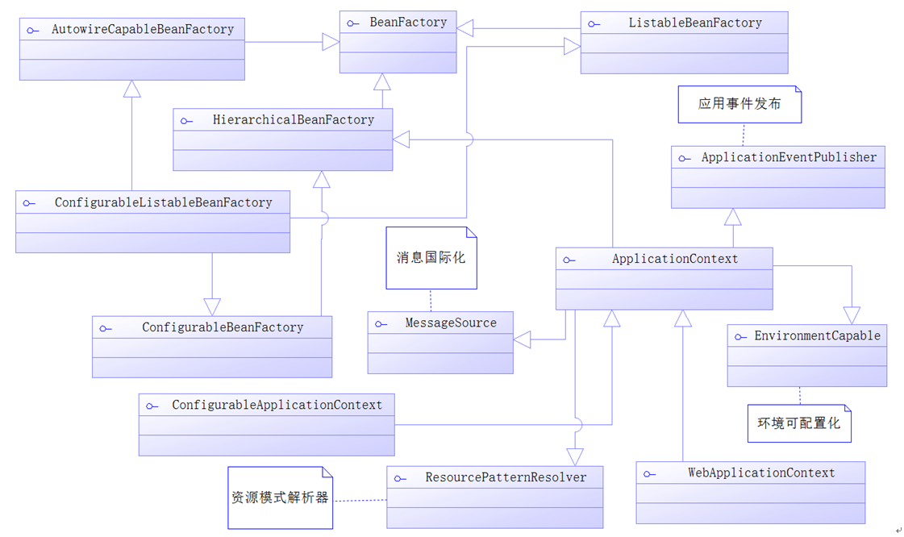

[TOC]

### IOC源码分析

#### IOC容器

所有IOC容器都需要实现接口BeanFactory或其子接口，它是一个顶级容器接口。

##### BeanFactory源码分析

```java
package org.springframework.beans.factory;

/**
BeanFactory接口源码
*/
public interface BeanFactory {

    /**
     * 用来引用一个实例，或把它和工厂产生的Bean区分开，就是说，如果一个FactoryBean的名字为a，那么，&a会得到那个Factory
     */
    String FACTORY_BEAN_PREFIX = "&";       // 前缀

    /*
     * 四个不同形式的getBean方法，获取实例
     */
    Object getBean(String name) throws BeansException;

    <T> T getBean(String name, Class<T> requiredType) throws BeansException;

    <T> T getBean(Class<T> requiredType) throws BeansException;

    Object getBean(String name, Object... args) throws BeansException;

    boolean containsBean(String name);      // 是否包含Bean

    boolean isSingleton(String name) throws NoSuchBeanDefinitionException;      // 是否为单实例

    boolean isPrototype(String name) throws NoSuchBeanDefinitionException;      // 是否为原型（多实例）

    boolean isTypeMatch(String name, Class<?> targetType) throws NoSuchBeanDefinitionException;   // 名称、类型是否匹配

    Class<?> getType(String name) throws NoSuchBeanDefinitionException;     // 获取类型

    String[] getAliases(String name);       // 根据实例的名字获取实例的别名

}
```

- bean默认单例存在。getBean方法返回的是同一个bean对象。
- 允许我们按名称或类型获取bean。
- ApplicationContext 是 BeanFactory 的子接口。
- AnnotationConfigApplicationContext 是一个基于注解的IOC容器。都包含上述的这些方法。

**Spring IoC容器的接口设计**



