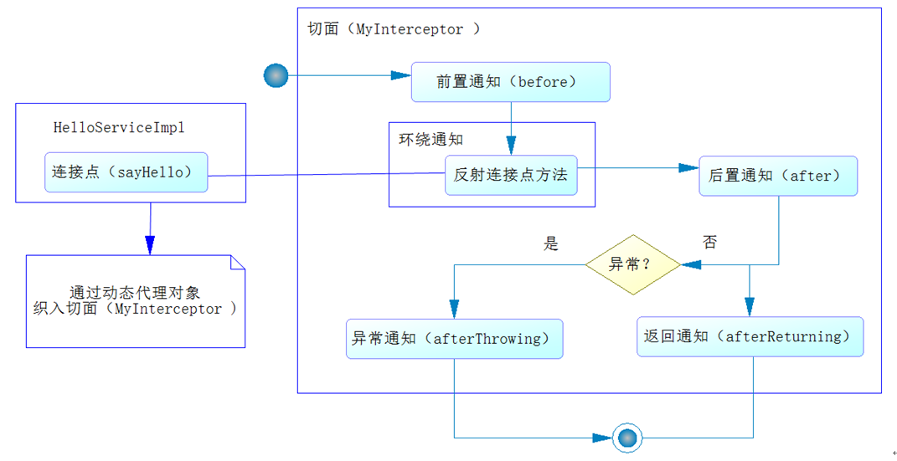

[TOC]

### Spring AOP

#### 基础

##### 1. 概述

AOP(Aspect-Oriented Programming 面向切面编程)能够将那些与业务无关，**却为业务模块所共同调用的逻辑或责任（例如事务处理、日志管理、权限控制等）封装起来**，便于**减少系统的重复代码**，**降低模块间的耦合度**，并**有利于未来的可拓展性和可维护性**。核心：**约定编程**。AOP 主要用来**解决**在不改变原有业务逻辑的情况下，增强横切逻辑代码，根本上解耦合，避免横切逻辑代码重复的**问题**。

应用场景：**数据库事务、日志功能、权限管理、记录运行时间、应用统计功能**等。


AOP 就是典型的代理模式的体现。面向切面编程提供声明式事务管理。

##### 2. AOP与事务

以下是数据库操作的流程图。


其中大量的操作都是**默认**的操作流程，所以数据库的打开和关闭以及事物的提交和回滚都是可以通过默认的流程实现的，我们只需要关注 SQL 的编写。

Spring AOP 的**流程约定**如下：



##### 3. 基本术语

- **切面**（Aspect）：一个关注点的模块化，这个关注点可能会横切多个对象。事务管理是 J2EE 应用中一个关于横切关注点的很好的例子。在 Spring AOP 中，切面可以使用基于模式或者基于 @Aspect 注解的方式来实现。
- **连接点**（Joinpoint）：在程序执行过程中某个特定的点，比如某方法调用的时候或者处理异常的时候。在 Spring AOP 中，一个连接点总是表示一个方法的执行。
- **通知**（Advice）：在切面的某个特定的连接点上执行的动作。其中包括了 **"around"、"before" 和 "after"** 等不同类型的通知（通知的类型将在后面部分进行讨论）。许多 AOP 框架（包括 Spring）都是以拦截器做通知模型，并维护一个以连接点为中心的拦截器链。
- **切入点**（Pointcut）：匹配连接点的断言。通知和一个切入点表达式关联，并在满足这个切入点的连接点上运行（例如，当执行某个特定名称的方法时）。**切入点表达式**如何和连接点匹配是 AOP 的核心：Spring 缺省使用AspectJ 切入点语法。
- **引入**（Introduction）：用来给一个类型声明额外的方法或属性（也被称为连接类型声明（inter-type declaration））。Spring 允许引入新的接口（以及一个对应的实现）到任何被代理的对象。例如，可以使用引入来使一个 bean 实现 IsModified 接口，以便简化缓存机制。
- **目标对象**（Target Object）：被一个或者多个切面所通知的对象。也被称做被通知（advised）对象。既然Spring AOP是通过运行时代理实现的，这个对象永远是一个被代理（proxied）对象。
- **AOP 代理**（AOP Proxy）：AOP 框架创建的对象，用来实现切面契约（例如通知方法执行等等）。在 Spring 中，AOP 代理可以是 JDK 动态代理或者 CGLIB 代理。
- **织入**（Weaving）：把切面连接到其它的应用程序类型或者对象上，并创建一个被通知的对象。这些可以在编译时（例如使用 AspectJ 编译器），类加载时和运行时完成。Spring 和其他纯 Java AOP 框架一样，在**运行时**完成织入。


#### AOP实现方式与原理

##### 1. Spring AOP和AspectJ AOP

实现 AOP 有 Spring 自带的 Spring AOP 以及集成的 AspectJ AOP。

**Spring AOP 属于==运行时==增强，而 AspectJ 是==编译时==增强。** Spring AOP **基于代理**(Proxying)，而 AspectJ **基于字节码**操作(Bytecode Manipulation)。Spring AOP 是纯 Java 实现，在运行期对目标对象进行代理，织入增强代码。AspectJ 第三方开源技术，Spring 已经整合 AspectJ，提供对 AspectJ 注解的支持，开发 AOP 程序 更加容易（企业主流）。

Spring AOP 已经**集成了 AspectJ**  ，AspectJ  应该算的上是 Java 生态系统中最**完整**的 AOP 框架了。AspectJ  相比于 Spring AOP 功能**更加强大**，但是 Spring AOP 相对来说更简单，

如果项目中切面比较少，那么两者性能差异不大。但是，当切面**太多**的话，最好选择 **AspectJ** ，它比 Spring AOP **快很多**。

##### 2. AOP实现原理

**Spring AOP 就是基于动态代理的**，如果要代理的对象实现了某个**接口**，那么 Spring AOP 会使用 **JDK Proxy**，去创建代理对象，而对于没有实现接口的对象，就无法使用 JDK Proxy 去进行代理了，这时候 Spring AOP 会使用 **Cglib** ，这时候 Spring AOP 会使用 **Cglib** 生成一个被代理对象的子类来作为代理。

**注意**：Spring AOP 底层会判断用户是根据**接口代理**还是**目标类代理**，如果针对接口代理就使用 JDK 代理，如果针对目标类代理就使用 Cglib 代理。当前也可以配置强行使用 Cglib。

###### (1) JDK动态代理

JDK 内置的 Proxy 动态代理可以在**运行时动态生成字节码**，而没必要针对每个类编写代理类。JDKProxy 返回动态代理类，是目标类所**实现接口**的另一个实现版本，它实现了对目标类的代理 。注意：必须要**有接口**才能进行代理，代理后对象必须**转换为接口类型**。

###### (2) CGLIB动态代理

CGLibProxy 返回的动态代理类，则是目标代理类的一个**子类**。 CGLIB 继承被代理的类，重写方法，织入通知，动态生成字节码并运行。被代理的类**不能是 final 的**。


#### 基于@AspectJ的AOP

在 Spring 里面进行 AOP 操作也可以使用 **AspectJ 实现**。AspectJ 不是 Spring 的一部分，和 Spring 一起使用进行 Aop操作，Spring2.0 以后新增了对 Spring 的支持。

使用 **AspectJ 实现 AOP** 有两种方式：

- 基于 AspectJ 的 **xml 配置**。
- 基于 AspectJ 的**注解方式**。

##### 1. 基于Xml配置实现

**AOP 配置代码：** Book 类。

```java
public class Book {
    public void add() {
        System.out.println("add......");
    }
}
```

MyBook 增强类。

```java
public class MyBook {
    public void before1() {
        System.out.println("前置增强......");
    }

    public void after1() {
        System.out.println("后置增强......");
    }

    // 环绕通知
    public void around1(ProceedingJoinPoint proceedingJoinPoint) throws Throwable {
        //方法之前
        System.out.println("方法之前.....");
        //执行被增强的方法
        proceedingJoinPoint.proceed();
        //方法之后
        System.out.println("方法之后......");
    }
}
```

xml 配置：

```xml
<!--1. 配置对象-->
<bean id="book" class="cn.blinkit.aop.Book"></bean>
<bean id="myBook" class="cn.blinkit.aop.MyBook"></bean>

<!--2. 配置aop操作-->
<aop:config>
    <!--2.1 配置切入点-->
    <aop:pointcut id="pointcut1" expression="execution(* cn.blinkit.aop.Book.*(..))"></aop:pointcut>

    <!--2.2 配置切面，把增强用到方法上面-->
    <aop:aspect ref="myBook">
        <!--
            aop:before   :前置通知
            aop:after    :后置通知
            aop:around   :环绕通知
            配置增强类型
            method : 增强类里面使用哪个方法作为前置 -->
        <aop:before method="before1" pointcut-ref="pointcut1"></aop:before>
        <aop:after method="after1" pointcut-ref="pointcut1"></aop:after>
        <aop:around method="around1" pointcut-ref="pointcut1"></aop:around>
    </aop:aspect>
</aop:config>
```

测试代码

```java
public class AOPTest {
    @Test
    public void testBook() {
        ApplicationContext context = new ClassPathXmlApplicationContext("cn/blinkit/aop/spring-aop.xml");
        Book book = (Book) context.getBean("book");
        book.add();

    }
}
```

##### 1. 使用注解实现AOP

###### (1) 确定连接点

首先确定在什么地方使用 AOP，确定**连接点(就是什么类的什么方法)**。 首先定义一个**接口**：

```java
// 用户服务接口
public interface UserService {
	public void printUser();
	public void printUser(User user);
	public void manyAspects();
}
```

实现此接口

```java
// 用户服务接口实现类
@Service
public class UserServiceImpl implements UserService {
	
	private User user = null;

	@Override
	public void printUser(User user) {
		if (user == null) {
			throw new RuntimeException("检查用户参数是否为空......");
		}
		System.out.print("id =" + user.getId());
		System.out.print("\tusername =" + user.getUsername());
		System.out.println("\tnote =" + user.getNote());
	}

	@Override
	public void printUser() {
		if (user == null) {
			throw new RuntimeException("检查用户参数是否为空......");
		}
		System.out.print("id =" + user.getId());
		System.out.print("\tusername =" + user.getUsername());
		System.out.println("\tnote =" + user.getNote());
	}
	
    @Override
	public void manyAspects() {
		System.out.println("测试多个切面顺序");
	}
	// Getter and setter
}
```

所以将上述的 **printUser**() 方法作为**连接点**。

###### (2) 开发切面与定义切点

使用 @Aspect **注解定义一个切面类**。方法中的 **@After、@Before、@AfterThrowing** 等注解是定义流程中的方法。

```java
@Aspect
public class MyAspect {
    // 此方法为切点，下面的传入此方法名即可
	@Pointcut("execution(* com.springboot.chapter4.*.*.*.*.print(..)) && bean('userServiceImpl')")
	public void pointCut() {
	}
	
	@Before("pointCut() && args(user)")
	public void beforeParam( User user) {
		System.out.println("before ......");
	} 
	
	@Before("pointCut()")
	public void before() {
		System.out.println("before ......");
	}
	
	@After("pointCut()")
	public void after() {
		System.out.println("after ......");
	}
	
	@AfterReturning("pointCut()")
	public void afterReturning() {
		System.out.println("afterReturning ......");
	}
	
	@AfterThrowing("pointCut()")
	public void afterThrowing() {
		System.out.println("afterThrowing ......");
	}

	@Around("pointCut()")
	public void around(ProceedingJoinPoint jp) throws Throwable {
		System.out.println("around before......");
		jp.proceed();
		System.out.println("around after......");
	}
}
```

上述中

```java
@Pointcut("execution(* com.springboot.chapter4.*.*.*.*.print(..)) && bean('userServiceImpl')")
public void pointCut() {
}
```

**@Pointcut** 注解定义了一个**切点**， 使用一个**方法名指代**，如 pointCut()。后面的 @AfterThrowing("pointCut()") 等注解中传入此方法名即可。

@Pointcut 注解中定义一个正则式，用于**拦截方法**。

```java
execution(* com.springboot.chapter4.*.*.*.*.print(..)
```

- **execution** 表示执行的时候拦截里面的**正则匹配的方法**。
- **\*** 表示任意返回值的方法。
- com.springboot.chapter4.*.*.*.*.print **指定方法**。
- **(..)** 表示**任意参数**进行匹配。

###### (3) 装配切面类

```java
// 指定扫描包
@SpringBootApplication(scanBasePackages = { "com.springboot.chapter4.aspect" })
public class Chapter4Application {

	// 启动切面
	public static void main(String[] args) {
		SpringApplication.run(Chapter4Application.class, args);
	}

	// 装配切面类到容器中
	@Bean(name = "myAspect")        // 与自定义的切面类对应
	public MyAspect initMyAspect() {
		return new MyAspect();	
	}
}
```

###### (4) 测试AOP

在 Controller 中调用对应的方法测试。

```java
@Controller
@RequestMapping("/user")
public class UserController {

	@Autowired
	private UserService userService = null;

	@RequestMapping("/print")
	@ResponseBody
	public User printUser(Long id, String userName, String note) {
		User user = new User();
		user.setId(id);
		user.setUsername(userName);
		user.setNote(note);
        // 此处调用了printUser方法就会调用切面中的逻辑
		userService.printUser(user);  
		return user;
	}
}	
```

##### 3. 使用多个切面

定义第一个切面类，实现 **Orderd 接口**。

```java
@Aspect
public class MyAspect1 implements Ordered {     // 实现Order接口
	
	@Override
	public int getOrder() {
		return 1;
	}

	@Pointcut("execution(* com.springboot.chapter4.aspect.service.impl.UserServiceImpl.manyAspects(..))")
	public void manyAspects() {
	}

	@Before("manyAspects()")
	public void before() {
		System.out.println("MyAspect1 before ......");
	}

	@After("manyAspects()")
	public void after() {
		System.out.println("MyAspect1 after ......");
	}

	@After("manyAspects()")
	public void afterReturning() {
		System.out.println("MyAspect1 afterReturning ......");
	}

}
```

定义第二个切面类 使用 @Order 注解。

```java
@Aspect
@Order(2)       // 使用@Order注解
public class MyAspect2 implements Ordered  {
	
	@Pointcut("execution(* com.springboot.chapter4.aspect.service.impl.UserServiceImpl.manyAspects(..))")
	public void manyAspects() {
	}

	@Before("manyAspects()")
	public void before() {
		System.out.println("MyAspect2 before ......");
	}

	@After("manyAspects()")
	public void after() {
		System.out.println("MyAspect2 after ......");
	}

	@After("manyAspects()")
	public void afterReturning() {
		System.out.println("MyAspect2 afterReturning ......");
	}

	@Override
	public int getOrder() {
		return 2;
	}
}
```

以下配置多个切面类。

```java
// 指定扫描包
@SpringBootApplication(scanBasePackages = { "com.springboot.chapter4.aspect" })
public class Chapter4Application {

	// 启动切面
	public static void main(String[] args) {
		SpringApplication.run(Chapter4Application.class, args);
	}

	// 定义切面
	@Bean(name = "myAspect")
	public MyAspect initMyAspect() {
		return new MyAspect();
	}

	// 定义切面
	@Bean(name = "myAspect2")
	public MyAspect2 initMyAspect2() {
		return new MyAspect2();
	}

	// 定义切面
	@Bean(name = "myAspect1")
	public MyAspect1 initMyAspect1() {
		return new MyAspect1();
	}

}
```

上述的多个切面可以是监控同一个方法，当调用方法时，使用 **@Order** 注解或者实现 Order接口 都能定义不同切面的执行顺序。推荐使用 **@Order** 注解。


