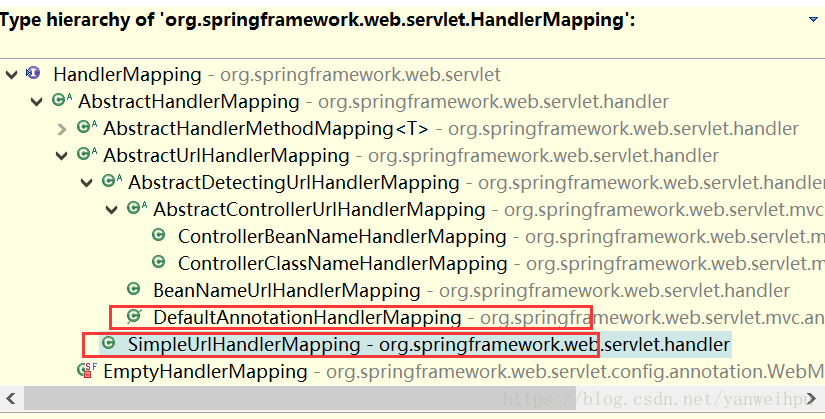
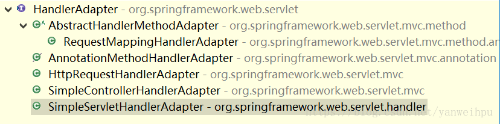
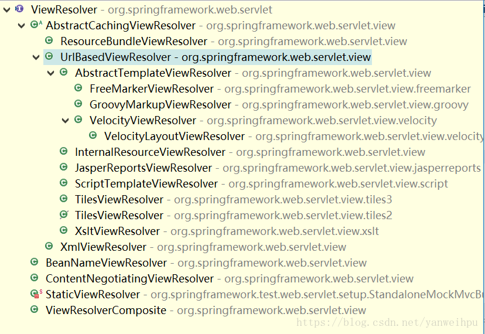

[TOC]

### Spring MVC

SpringMVC 框架是以**请求**为驱动，围绕 **Servlet** 设计，将请求发给控制器，然后通过模型对象，分派器来展示请求结果视图。其中核心类是 **DispatcherServlet**，它是一个 Servlet，顶层是实现的 Servlet 接口。

#### 基础

##### 1. 对MVC的理解

Spring MVC 之前是 Model1 和 Model2 时代。

- **Model1 时代** : 很多学 Java 后端比较晚的朋友可能并没有接触过  Model1 模式下的 JavaWeb 应用开发。在 Model1 模式下，整个 Web 应用几乎全部用 JSP 页面组成，只用少量的 JavaBean 来处理数据库连接、访问等操作。这个模式下 JSP 即是控制层又是表现层。显而易见，这种模式存在很多问题。比如①将控制逻辑和表现逻辑混杂在一起，导致代码重用率极低；②前端和后端相互依赖，难以进行测试并且开发效率极低；
- **Model2 时代** ：学过 Servlet 并做过相关 Demo 的朋友应该了解“Java Bean(Model)+ JSP（View,）+Servlet（Controller）  ”这种开发模式,这就是早期的 JavaWeb MVC 开发模式。Model:系统涉及的数据，也就是 dao 和 bean。View：展示模型中的数据，只是用来展示。Controller：处理用户请求都发送给 ，返回数据给 JSP 并展示给用户。

Model2 模式下还存在很多问题，Model2 的抽象和封装程度还远远不够，使用 Model2 进行开发时不可避免地会重复造轮子，这就大大降低了程序的可维护性和复用性。于是很多 JavaWeb 开发相关的 MVC 框架应运而生比如 Struts2，但是 Struts2 比较笨重。随着 Spring 轻量级开发框架的流行，Spring 生态圈出现了 Spring MVC 框架， Spring MVC 是当前最优秀的 MVC 框架。相比于 Struts2 ， Spring MVC 使用更加简单和方便，开发效率更高，并且 Spring MVC 运行速度更快。

MVC 是一种**设计模式**，Spring MVC 是一款很优秀的 MVC 框架。Spring MVC 可以帮助我们进行更简洁 的Web 层的开发，并且它天生与 Spring 框架集成。Spring MVC 下我们一般把后端项目分为 **Service层（处理业务）、Dao层（数据库操作）、Entity层（实体类）、Controller层(控制层，返回数据给前台页面)**。

##### 2. 基本使用

需要在 **web.xml** 中配置 **DispatcherServlet** ，并且需要配置 Spring 监听器 ContextLoaderListener。

```xml
<listener>
    <listener-class>org.springframework.web.context.ContextLoaderListener
    </listener-class>
</listener>
<servlet>
    <servlet-name>springmvc</servlet-name>
    <servlet-class>org.springframework.web.servlet.DispatcherServlet
    </servlet-class>
    <!--如果不设置init-param标签，则必须在/WEB-INF/下创建xxx-servlet.xml文件，其中xxx是servlet-name中配置的名称-->
    <init-param>
        <param-name>contextConfigLocation</param-name>
        <param-value>classpath:spring/springmvc-servlet.xml</param-value>
    </init-param>
    <load-on-startup>1</load-on-startup>
</servlet>
<servlet-mapping>
    <servlet-name>springmvc</servlet-name>
    <url-pattern>/</url-pattern>
</servlet-mapping>
```

#### SpringMVC工作流程

**流程如下：**

**客户端发送请求 -> 前端控制器 DispatcherServlet 接受客户端请求 -> 找到处理器映射 HandlerMapping 解析请求对应的 Handler-> HandlerAdapter 会根据 Handler 来调用真正的处理器开始处理请求，并处理相应的业务逻辑 -> 处理器返回一个模型视图 ModelAndView -> 视图解析器进行解析 -> 返回一个视图对象->前端控制器 DispatcherServlet 渲染数据（Moder）->将得到视图对象返回给用户**。

**如下图所示（重要）：**


**流程说明（重要）：**

- 客户端的所有请求都交给前端控制器 **DispatcherServlet** 来处理，它会负责调用系统的其他模块来真正处理用户的请求。  
- DispatcherServlet 收到请求后，将根据请求的**信息**（包括 URL、HTTP 协议方法、请求头、请求参数、Cookie 等）以及 **HandlerMapping** 的配置找到**处理该请求的 Handler**（**任何一个对象**都可以作为请求的 Handler）。  
- 在这个地方 Spring 会通过 **HandlerAdapter** 对该**处理进行封装**。  
- HandlerAdapter 是一个**适配器**，它用统一的接口对**各种 Handler 中的方法进行调用**。  
- Handler 完成对用户请求的处理后，会返回一个 **ModelAndView** 对象给 DispatcherServlet，ModelAndView 包含了数据模型以及相应的视图的信息。  
- ModelAndView 的视图是**逻辑**视图，DispatcherServlet 还要借助 **ViewResolver** 完成从逻辑视图到真实视图对象的**解析**工作。  
- 当得到**真正的视图对**象后，DispatcherServlet 会利用视图对象对模型数据进行**渲染**。  
- 客户端得到响应，可能是一个普通的 HTML 页面，也可以是 XML 或 JSON 字符串，还可以是一张图片或者一个 PDF 文件。 


#### SpringMVC重要组件

##### 1. 前端控制器DispatcherServlet

**作用**：Spring MVC 的入口函数。接收请求，响应结果，相当于转发器，中央处理器。有了 DispatcherServlet 减少了其它组件之间的耦合度。用户请求到达前端控制器，它就相当于 MVC 模式中的 C，DispatcherServlet 是整个流程控制的中心，由它**调用其它组件处理用户的请求**，DispatcherServlet 的存在降低了组件之间的耦合性。

##### 2. 处理器映射器HandlerMapping

不需要工程师开发，由框架提供。

**作用**：**根据请求的 URL 查找 Handler**。HandlerMapping 负责根据用户请求找到 Handler 即处理器（Controller），SpringMVC 提供了**不同的映射器实现不同的映射方式**，例如：配置文件方式，实现接口方式，注解方式等。

##### 3. 处理器适配器HandlerAdapter

**作用**：按照**特定规则（HandlerAdapter 要求的规则）去执行 Handler**。

通过 **HandlerAdapter** 执行 **handler**，这是**适配器模式**的应用，通过扩展适配器可以对更多类型的处理器进行执行。

##### 4. 处理器Handler

需要自己开发。

注意：编写 Handler 时按照 **HandlerAdapter** 的要求去做，这样适配器才可以去正确执行 Handler。
Handler 是继 DispatcherServlet 前端控制器的**后端控制器**，在 DispatcherServlet 的控制下 Handler 对具体的用户请求进行处理。
由于 Handler 涉及到具体的**用户业务请求**，所以一般情况需要工程师根据业务需求开发 Handler。

##### 5. 视图解析器ViewResolver

不需要工程师开发，由框架提供。

作用：进行**视图解析**，根据**逻辑视图**名解析成**真正的视图**（view）。
ViewResolver 负责将处理结果生成 View 视图，ViewResolver 首先根据逻辑视图名解析成物理视图名即具体的页面地址，再生成 View 视图对象，最后对 View 进行**渲染**将处理结果通过页面展示给用户。 Spring MVC 框架提供了很多的 **View 视图类型**，包括：jstlView、freemarkerView、pdfView 等。

一般情况下需要通过**页面标签或页面模版技术**将模型数据通过页面展示给用户，需要由工程师根据业务需求开发具体的页面。

##### 6. 视图View

View 是一个接口，实现类支持不同的 View 类型（jsp、freemarker、pdf...）

注意：处理器 **Handler**（也就是平常说的 Controller 控制器）以及**视图层 view** 都是需要自己手动开发的。其他的一些组件比如：前端控制器 DispatcherServlet、处理器映射器 HandlerMapping、处理器适配器 HandlerAdapte r等等都是框架提供的，不需要自己手动开发。

#### DispatcherServlet详细解析

源码如下：

```java
package org.springframework.web.servlet;

@SuppressWarnings("serial")
public class DispatcherServlet extends FrameworkServlet {

    public static final String MULTIPART_RESOLVER_BEAN_NAME = "multipartResolver";
    public static final String LOCALE_RESOLVER_BEAN_NAME = "localeResolver";
    public static final String THEME_RESOLVER_BEAN_NAME = "themeResolver";
    public static final String HANDLER_MAPPING_BEAN_NAME = "handlerMapping";
    public static final String HANDLER_ADAPTER_BEAN_NAME = "handlerAdapter";
    public static final String HANDLER_EXCEPTION_RESOLVER_BEAN_NAME = "handlerExceptionResolver";
    public static final String REQUEST_TO_VIEW_NAME_TRANSLATOR_BEAN_NAME = "viewNameTranslator";
    public static final String VIEW_RESOLVER_BEAN_NAME = "viewResolver";
    public static final String FLASH_MAP_MANAGER_BEAN_NAME = "flashMapManager";
    public static final String WEB_APPLICATION_CONTEXT_ATTRIBUTE = DispatcherServlet.class.getName() + ".CONTEXT";
    public static final String LOCALE_RESOLVER_ATTRIBUTE = DispatcherServlet.class.getName() + ".LOCALE_RESOLVER";
    public static final String THEME_RESOLVER_ATTRIBUTE = DispatcherServlet.class.getName() + ".THEME_RESOLVER";
    public static final String THEME_SOURCE_ATTRIBUTE = DispatcherServlet.class.getName() + ".THEME_SOURCE";
    public static final String INPUT_FLASH_MAP_ATTRIBUTE = DispatcherServlet.class.getName() + ".INPUT_FLASH_MAP";
    public static final String OUTPUT_FLASH_MAP_ATTRIBUTE = DispatcherServlet.class.getName() + ".OUTPUT_FLASH_MAP";
    public static final String FLASH_MAP_MANAGER_ATTRIBUTE = DispatcherServlet.class.getName() + ".FLASH_MAP_MANAGER";
    public static final String EXCEPTION_ATTRIBUTE = DispatcherServlet.class.getName() + ".EXCEPTION";
    public static final String PAGE_NOT_FOUND_LOG_CATEGORY = "org.springframework.web.servlet.PageNotFound";
    private static final String DEFAULT_STRATEGIES_PATH = "DispatcherServlet.properties";
    protected static final Log pageNotFoundLogger = LogFactory.getLog(PAGE_NOT_FOUND_LOG_CATEGORY);
    private static final Properties defaultStrategies;
    static {
        try {
            ClassPathResource resource = new ClassPathResource(DEFAULT_STRATEGIES_PATH, DispatcherServlet.class);
            defaultStrategies = PropertiesLoaderUtils.loadProperties(resource);
        }
        catch (IOException ex) {
            throw new IllegalStateException("Could not load 'DispatcherServlet.properties': " + ex.getMessage());
        }
    }

    /** Detect all HandlerMappings or just expect "handlerMapping" bean? */
    private boolean detectAllHandlerMappings = true;

    /** Detect all HandlerAdapters or just expect "handlerAdapter" bean? */
    private boolean detectAllHandlerAdapters = true;

    /** Detect all HandlerExceptionResolvers or just expect "handlerExceptionResolver" bean? */
    private boolean detectAllHandlerExceptionResolvers = true;

    /** Detect all ViewResolvers or just expect "viewResolver" bean? */
    private boolean detectAllViewResolvers = true;

    /** Throw a NoHandlerFoundException if no Handler was found to process this request? **/
    private boolean throwExceptionIfNoHandlerFound = false;

    /** Perform cleanup of request attributes after include request? */
    private boolean cleanupAfterInclude = true;

    /** MultipartResolver used by this servlet */
    private MultipartResolver multipartResolver;

    /** LocaleResolver used by this servlet */
    private LocaleResolver localeResolver;

    /** ThemeResolver used by this servlet */
    private ThemeResolver themeResolver;

    /** List of HandlerMappings used by this servlet */
    private List<HandlerMapping> handlerMappings;

    /** List of HandlerAdapters used by this servlet */
    private List<HandlerAdapter> handlerAdapters;

    /** List of HandlerExceptionResolvers used by this servlet */
    private List<HandlerExceptionResolver> handlerExceptionResolvers;

    /** RequestToViewNameTranslator used by this servlet */
    private RequestToViewNameTranslator viewNameTranslator;

    private FlashMapManager flashMapManager;

    /** List of ViewResolvers used by this servlet */
    private List<ViewResolver> viewResolvers;

    public DispatcherServlet() {
        super();
    }

    public DispatcherServlet(WebApplicationContext webApplicationContext) {
        super(webApplicationContext);
    }
    @Override
    protected void onRefresh(ApplicationContext context) {
        initStrategies(context);
    }

    protected void initStrategies(ApplicationContext context) {
        initMultipartResolver(context);
        initLocaleResolver(context);
        initThemeResolver(context);
        initHandlerMappings(context);
        initHandlerAdapters(context);
        initHandlerExceptionResolvers(context);
        initRequestToViewNameTranslator(context);
        initViewResolvers(context);
        initFlashMapManager(context);
    }
}
```

DispatcherServlet 类中的**属性 beans**：

- **HandlerMapping**：用于 **handlers** 映射请求和一系列的对于拦截器的前处理和后处理，大部分用 @Controller 注解。
- **HandlerAdapter**：帮助 DispatcherServlet **处理映射请求处理程序的适配器**，而不用考虑实际调用的是 哪个处理程序。
- **ViewResolver**：根据实际配置解析实际的 View 类型。
- **ThemeResolver**：解决 Web 应用程序可以使用的**主题**，例如提供个性化布局。
- **MultipartResolver**：解析多部分请求，以支持从 HTML 表单上传文件。- 
- **FlashMapManager**：存储并检索可用于将一个请求属性传递到另一个请求的 input 和 output 的 FlashMap，通常用于重定向。

在 Web MVC 框架中，每个 **DispatcherServlet** 都拥自己的 **WebApplicationContext**，它继承了 ApplicationContext。 **WebApplicationContext** 包含了其上下文和 Servlet 实例之间共享的所有的基础框架 beans。

**HandlerMapping**



HandlerMapping 接口处理请求的**映射 HandlerMapping 接口**的实现类：

- **SimpleUrlHandlerMapping** 类通过**配置文件把 URL 映射到 Controller** 类。
- **DefaultAnnotationHandlerMapping** 类通过**注解把 URL 映射到 Controller** 类。

**HandlerAdapter**



HandlerAdapter 接口：**处理请求映射**。

AnnotationMethodHandlerAdapter：通过**注解**，把请求 URL 映射到 Controller 类的方法上。

**HandlerExceptionResolver**


HandlerExceptionResolver 接口：**异常处理接口**。

- SimpleMappingExceptionResolver：通过**配置文件**进行异常处理。
- AnnotationMethodHandlerExceptionResolver：通过**注解**进行异常处理。

**ViewResolver**



ViewResolver 接口解析 View 视图。

UrlBasedViewResolver 类通过**配置文件**，把一个视图名交给到一个 View 来处理。