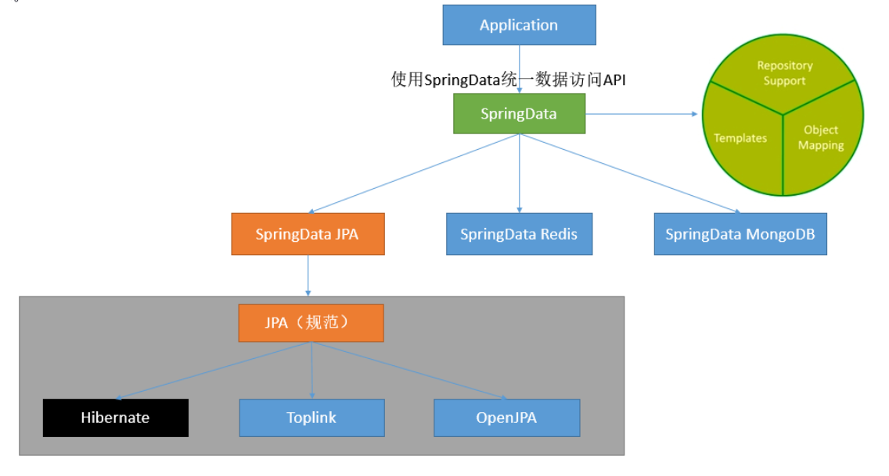
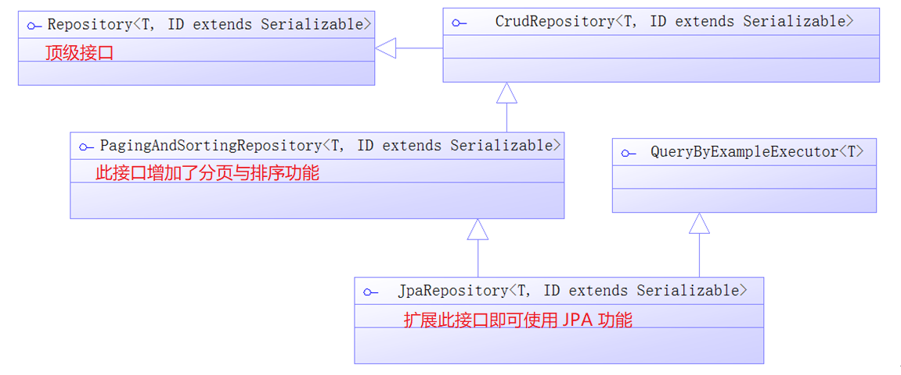
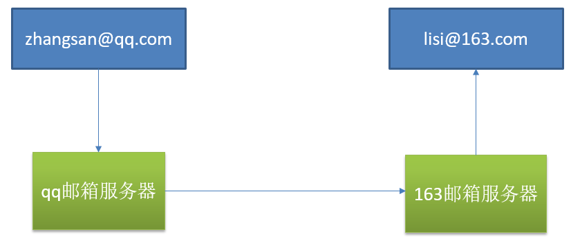
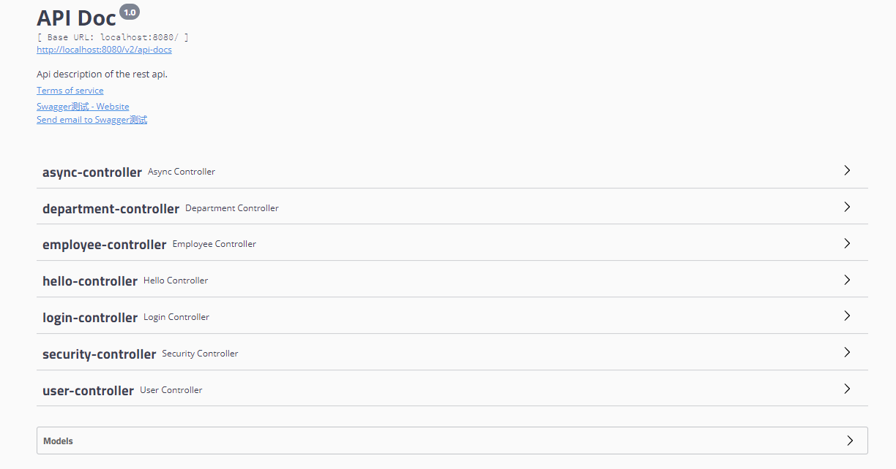
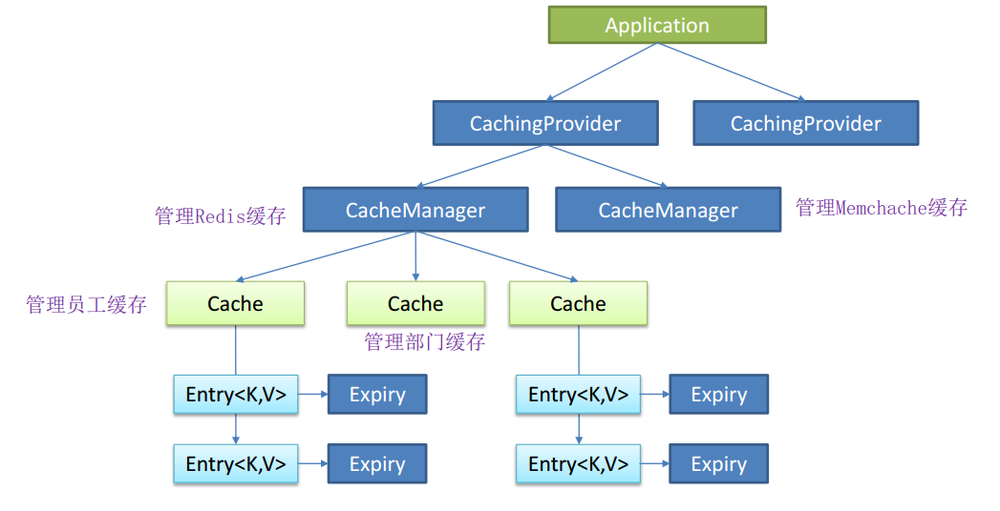
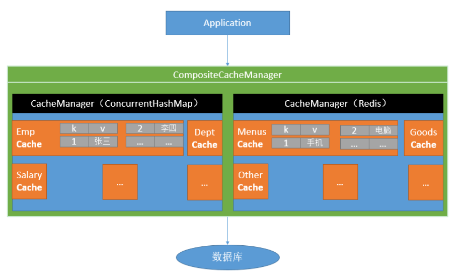

[TOC]

### Spring Boot应用整合

#### Spring数据访问

##### 1. JDBC

###### (1) 概述

依赖如下

```xml
<dependency>
	<groupId>org.springframework.boot</groupId>
	<artifactId>spring-boot-starter-jdbc</artifactId>
</dependency>
<dependency>
	<groupId>mysql</groupId>
	<artifactId>mysql-connector-java</artifactId>
	<scope>runtime</scope>
</dependency>
```

配置文件如下：

```yaml
# yaml配置数据源
spring:
  datasource:
    username: root
    password: 123456
    url: jdbc:mysql://192.168.15.22:3306/jdbc
    driver-class-name: com.mysql.jdbc.Driver
```

```java
// 测试
@RunWith(SpringRunner.class)
@SpringBootTest
@Slf4j
public class DataBaseTest {
    // 注入配置的数据源
    @Autowired
    DataSource dataSource;

    @Test
    public void testDbConnection() throws SQLException {
        log.info(dataSource.getClass() + "");
        Connection connection = dataSource.getConnection();
        log.info(connection + "");
        connection.close();
    }
}
```

默认是用 org.apache.tomcat.jdbc.pool.**DataSource** 作为数据源；数据源的相关配置都在 **DataSourceProperties** 里面。

###### (2) JdbcTemplate

配置数据源后，容器中已经自动配置好了 **JdbcTemplate 类**，可以直接使用。定义服务接口：

```java
public interface JdbcTmplUserService {
	public User getUser(Long id);
	public List<User> findUsers(String userName, String note);
	public int insertUser(User user);
	public int updateUser(User user);
	public int deleteUser(Long id);
	public User getUser2(Long id);
	public User getUser3(Long id);
}
```

实现该接口：

```java
@Service
public class JdbcTmplUserServiceImpl implements JdbcTmplUserService {

    // 自动注入
	@Autowired
	private JdbcTemplate jdbcTemplate = null;

	// 获取映射关系
	private RowMapper<User> getUserMapper() {
		// 使用Lambda表达式创建用户映射关系
		RowMapper<User> userRowMapper = (ResultSet rs, int rownum) -> {
			User user = new User();
			user.setId(rs.getLong("id"));
			user.setUserName(rs.getString("user_name"));
			int sexId = rs.getInt("sex");
			SexEnum sex = SexEnum.getEnumById(sexId);
			user.setSex(sex);
			user.setNote(rs.getString("note"));
			return user;
		};
		return userRowMapper;
	}

	// 获取对象
	@Override
	public User getUser(Long id) {
		// 执行的SQL
		String sql = " select id, user_name, sex, note from t_user where id = ?";
		// 参数
		Object[] params = new Object[] { id };
		User user = jdbcTemplate.queryForObject(sql, params, getUserMapper());
		return user;
	}

	// 查询用户列表
	@Override
	public List<User> findUsers(String userName, String note) {
		// 执行的SQL
		String sql = " select id, user_name, sex, note from t_user " + "where user_name like concat('%', ?, '%') "
				+ "and note like concat('%', ?, '%')";
		// 参数
		Object[] params = new Object[] { userName, note };
		// 使用匿名类实现
		List<User> userList = jdbcTemplate.query(sql, params, getUserMapper());
		return userList;
	}

	// 插入数据库
	@Override
	public int insertUser(User user) {
		String sql = " insert into t_user (user_name, sex, note) values( ? , ?, ?)";
		return jdbcTemplate.update(sql, user.getUserName(), user.getSex().getId(), user.getNote());
	}

	// 更新数据库
	@Override
	public int updateUser(User user) {
		// 执行的SQL
		String sql = " update t_user set user_name = ?, sex = ?, note = ?  " + " where id = ?";
		return jdbcTemplate.update(sql, user.getUserName(), user.getSex().getId(), user.getNote(), user.getId());
	}

	// 删除数据
	@Override
	public int deleteUser(Long id) {
		// 执行的SQL
		String sql = " delete from t_user where id = ?";
		return jdbcTemplate.update(sql, id);
	}
	
}
```

对 JdbcTemplate 的映射关系需要**开发者自己实现 RowMapper 接口**，以完成数据库到 POJO 对象的**映射**。JdbcTemplate 每**调用一次就会进行一次数据库连接**，两条语句就会产生两次连接，不推荐。有时需要执行**多条SQL 时**，可以使用 **StatementCallback** 接口或 ConnectionCallback 接口，如下所示。

```java
public User getUser2(Long id) {
    // 通过Lambda表达式使用 StatementCallback
    User result = this.jdbcTemplate.execute((Statement stmt) -> {
        String sql1 = "select count(*) total from t_user where id= " + id;
        ResultSet rs1 = stmt.executeQuery(sql1);
        while (rs1.next()) {
            int total = rs1.getInt("total");
            System.out.println(total);
        }
        // 执行的SQL
        String sql2 = " select id, user_name, sex, note from t_user"
            + " where id = " + id;
        ResultSet rs2 = stmt.executeQuery(sql2);
        User user = null;
        while (rs2.next()) {
            int rowNum = rs2.getRow();
            user= getUserMapper().mapRow(rs2, rowNum);
        }
        return user;
    });
    return result;
}

public User getUser3(Long id) {
    // 通过Lambda表达式使用 ConnectionCallback 接口
    return this.jdbcTemplate.execute((Connection conn) -> {
        String sql1 = " select count(*) as total from t_user"
            + " where id = ?";
        PreparedStatement ps1 = conn.prepareStatement(sql1);
        ps1.setLong(1, id);
        ResultSet rs1 = ps1.executeQuery();
        while (rs1.next()) {
            System.out.println(rs1.getInt("total"));
        }
        String sql2 = " select id, user_name, sex, note from t_user "
            + "where id = ?";
        PreparedStatement ps2 = conn.prepareStatement(sql2);
        ps2.setLong(1, id);
        ResultSet rs2 = ps2.executeQuery();
        User user = null;
        while (rs2.next()) {
            int rowNum = rs2.getRow();
            user= getUserMapper().mapRow(rs2, rowNum);
        }
        return user;
    });
}
```

#####  2. 数据源与数据库

###### (1) 配置数据库

使用 spring-boot-starter-jpa 之后默认使用**内存数据库**，如 h2, hqldb, Derby 等。

**(1) 使用默认数据库**

依赖如下

```xml
<dependency>
	<groupId>org.springframework.boot</groupId>
	<artifactId>spring-boot-starter-data-jpa</artifactId>
</dependency>
<dependency>
	<groupId>com.h2database</groupId>
	<artifactId>h2</artifactId>
	<scope>runtime</scope>
</dependency>
```

此时使用的是 h2 内嵌数据库。

**(2) 自定义数据源**

删除 h2 的依赖，添加 **MySQL** 的依赖。

```xml
<dependency>
    <groupId>mysql</groupId>
    <artifactId>mysql-connector-java</artifactId>
</dependency>
<dependency>
    <groupId>org.springframework.boot</groupId>
    <artifactId>spring-boot-starter-jdbc</artifactId>
</dependency>
<dependency>
    <groupId>org.springframework.boot</groupId>
    <artifactId>spring-boot-starter-data-jpa</artifactId>
</dependency>
```

在配置文件 application.properties 中修改配置即可**配置数据源**。

```properties
spring.datasource.url = jdbc:mysql://localhost:3306/chapter5
spring.datasource.username = root
spring.datasource.password = 123456
#spring.datasource.driver-class-name = com.mysql.jdbc.Driver

# 使用Tomcat 自带的数据库连接池
spring.datasource.tomcat.max-idle = 10
spring.datasource.tomcat.max-active = 50
spring.datasource.tomcat.max-wait = 10000
spring.datasource.tomcat.initial-size = 5
```

如果使用 DBCP 数据源需要加依赖

```xml
<dependency>
	<groupId>org.apache.commons</groupId>
	<artifactId>commons-dbcp2</artifactId>
</dependency>
```

同时配置如下

```properties
spring.datasource.url = jdbc:mysql://localhost:3306/spring_boot_chapter5
spring.datasource.username = root
spring.datasource.password = 123456
 
spring.datasource.type = org.apache.commons.dbcp2.BasicDataSource
spring.datasource.dbcp2.max-idle = 10
spring.datasource.dbcp2.max-total = 50
spring.datasource.dbcp2.max-wait-millis = 10000
spring.datasource.dbcp2.initial-size = 5
```

###### (2) 整合Druid

配置如下：

```properties
spring:
  # 数据源基本配置
  datasource:
    username: root
    password: 123456
    url: jdbc:mysql://120.79.59.125:3305/nano?characterEncoding=utf8&useSSL=true
    driver-class-name: com.mysql.jdbc.Driver
    type: com.alibaba.druid.pool.DruidDataSource  # 使用type指定数据源 不使用默认数据源

  # 数据源其他配置 需要写个配置类配置一下 不然下面的配置不会生效 因为DataSourceProperties类中不会生效
    initialSize: 5
    minIdle: 5
    maxActive: 20
    maxWait: 60000
    timeBetweenEvictionRunsMillis: 60000
    minEvictableIdleTimeMillis: 300000
    validationQuery: SELECT 1 FROM DUAL
    testWhileIdle: true
    testOnBorrow: false
    testOnReturn: false
    poolPreparedStatements: true
    #   配置监控统计拦截的filters，去掉后监控界面sql无法统计，'wall'用于防火墙
    #filters: stat,wall,log4j  不要配置这条不然打不开不知道为啥
    maxPoolPreparedStatementPerConnectionSize: 20
    useGlobalDataSourceStat: true
    connectionProperties: druid.stat.mergeSql=true;druid.stat.slowSqlMillis=500

```

yml 文件中配置了上述的参数，还需要**自定义一个配置类**来进行额外的设置，不然有的配置不能生效，一般不用。

```java
// 导入druid数据源
@Configuration
public class DruidConfig {
    // 创建自己的数据源并加入到容器中	
    @ConfigurationProperties(prefix = "spring.datasource")
    @Bean
    public DataSource druid(){
       return  new DruidDataSource();
    }

    // 配置Druid的监控
    // 配置一个管理后台的Servlet
    @Bean
    public ServletRegistrationBean statViewServlet(){
        ServletRegistrationBean bean = new ServletRegistrationBean(new StatViewServlet(), "/druid/*");
        Map<String,String> initParams = new HashMap<>();
	    // 配置后台管理登录信息
        initParams.put("loginUsername","admin");
        initParams.put("loginPassword","123456");
        // 默认就是允许所有访问
        initParams.put("allow","");
        // 配置拒绝访问IP
        initParams.put("deny","192.168.15.21");
        bean.setInitParameters(initParams);
        return bean;
    }

    /**
     * 配置一个web监控的filter
     * @return Filter
     */
    @Bean
    public FilterRegistrationBean webStatFilter(){
        FilterRegistrationBean bean = new FilterRegistrationBean();
        bean.setFilter(new WebStatFilter());
        Map<String,String> initParams = new HashMap<>();
        // 排除拦截
        initParams.put("exclusions","*.js,*.css,/druid/*");
        bean.setInitParameters(initParams);
        bean.setUrlPatterns(Arrays.asList("/*"));
        return  bean;
    }
}
```

此时登录 localhost:8080/druid/ 即可访问**管理页面**，登录账户上面配置类有设置。

##### 3. 整合SpringData JPA

###### (1) SpringData简介



###### (2) 整合JPA步骤

JPA 即 **Java Persistence API**， Java 持久化 API，是定义了**对象关系映射（ORM）以及实体对象持久化的标准接口**。

JPA 维护的核心是实体，它是通过一个持久化上下文维持。持久化上下文包括三个部分：

- **对象关系映射（ORM）**
- **实体操作 API**
- **查询语言**

(1) 编写一个**实体类（bean）和数据表进行映射，并且配置好映射关系**；

```java
// 标明是一个实体类
@Entity(name = "user")
// 定义映射的表
@Table(name = "t_user")
public class User {
    // 标明主键及生成策略，递增
    @Id
    @GeneratedValue(strategy = GenerationType.IDENTITY)
    private Long id = null;

    // 定义属性和表的映射关系 有时候数据库表名与类字段名对应不上就可以用这个
    @Column(name = "user_name")
    private String userName = null;

    private String note = null;

    // 定义转换器 将枚举类转换成数据库存储的类型
    @Convert(converter = SexConverter.class)
    private SexEnum sex = null;

    // Getters and Setters
}
```

以下是**性别转换器**，用于转换性别枚举。

```java
public class SexConverter implements AttributeConverter<SexEnum, Integer>{

    // 将枚举转换为数据库列
    @Override
    public Integer convertToDatabaseColumn(SexEnum sex) {
        return sex.getId();
    }

    // 将数据库列转换为枚举
    @Override
    public SexEnum convertToEntityAttribute(Integer id) {
        return SexEnum.getEnumById(id);
    }
}
```

(2) 编写一个 **Dao 接口**来操作实体类对应的**数据表（Repository）**。Spring 的 JPA 接口设计如下。



定义 JPA接口，**不需要任何实现类**，只需要扩展这个接口即可有默认的实现。**第一个泛型参数为 User，是 DAO 的实体类，第二个泛型参数是主键的类型，传入 Long 型。**

```java
public interface JpaUserRepository extends JpaRepository<User, Long> {
}
```

(3) 基本的配置 **JpaProperties**。

```yaml
# application.yml中
spring:  
 jpa:
    hibernate:
    # 更新或者创建数据表结构 如果没有数据表就创建 有就更新 使用这种方式都不需要创建数据库 可以自动根据实体类创建数据表
      ddl-auto: update
    # 允许控制台显示SQL
    show-sql: true
```

(4) 测试类，开发控制器。

```java
@Controller
@RequestMapping("/jpa")
public class JpaController {

    // 注入JPA接口，这里不需要使用实现类
    @Autowired
    private JpaUserRepository jpaUserRepository = null;

    @RequestMapping("/getUser")
    @ResponseBody
    public User getUser(Long id) {
        // 使用JPA接口查询对象
        User user = jpaUserRepository.findById(id).get();
        return user;
    }
}
```

配置类标注实体扫描，下列的注解是非必须的，只要加了 JPA 的 starter 就会**自动扫描**。

```java
// 定义JPA接口扫描包路径
@EnableJpaRepositories(basePackages = "com.springboot.chapter5.dao")
// 定义实体Bean扫描包路径
@EntityScan(basePackages = "com.springboot.chapter5.pojo")
```

如果满足不了需求还可以使用 **@Query 注解自定义**查询语句。

```java
@Query("from user where user_name like concat('%', ?1, '%') " 
    + "and note like concat('', ?2, '%')")
public List<User> findUsers(String userName, String note);
```

###### (3) JPA命名规则

同时满足一定的命名规则的方法还可以不写任何代码实现查询，如下：

|        关键字         |          方法命名           |       sql where字句        |
| :-------------------: | :-------------------------: | :------------------------: |
|        **And**        |      findByNameAndPwd       |  where name= ? and pwd =?  |
|        **Or**         |       findByNameOrSex       |   where name= ? or sex=?   |
|     **Is,Equals**     |   findById,findByIdEquals   |        where id= ?         |
|      **Between**      |       findByIdBetween       |  where id between ? and ?  |
|     **LessThan**      |      findByIdLessThan       |        where id < ?        |
|  **LessThanEquals**   |   findByIdLessThanEquals    |       where id <= ?        |
|    **GreaterThan**    |     findByIdGreaterThan     |        where id > ?        |
| **GreaterThanEquals** |  findByIdGreaterThanEquals  |       where id > = ?       |
|       **After**       |        findByIdAfter        |        where id > ?        |
|      **Before**       |       findByIdBefore        |        where id < ?        |
|      **IsNull**       |      findByNameIsNull       |     where name is null     |
| **isNotNull,NotNull** |      findByNameNotNull      |   where name is not null   |
|       **Like**        |       findByNameLike        |     where name like ?      |
|      **NotLike**      |      findByNameNotLike      |   where name not like ?    |
|   **StartingWith**    |   findByNameStartingWith    |    where name like '?%'    |
|    **EndingWith**     |    findByNameEndingWith     |    where name like '%?'    |
|    **Containing**     |    findByNameContaining     |   where name like '%?%'    |
|      **OrderBy**      |    findByIdOrderByXDesc     | where id=? order by x desc |
|        **Not**        |        findByNameNot        |      where name <> ?       |
|        **In**         | findByIdIn(Collection<?> c) |      where id in (?)       |
|       **NotIn**       |        findByNameNot        |      where name <> ?       |
|       **True**        |        findByAaaTue         |      where aaa = true      |
|       **False**       |       findByAaaFalse        |     where aaa = false      |
|    **IgnoreCase**     |    findByNameIgnoreCase     | where UPPER(name)=UPPER(?) |
|        **top**        |         findTop100          |  top 10/where ROWNUM <=10  |

###### (4) 字段不持久化

假如有下面一个类：

```java
Entity(name="USER");
public class User {
    @Id
    @GeneratedValue(strategy = GenerationType.AUTO)
    @Column(name = "ID")
    private Long id;

    @Column(name="USER_NAME")
    private String userName;

    @Column(name="PASSWORD")
    private String password;

    private String secrect;
}
```

如果我们想让`secrect` 这个字段不被持久化，也就是不被数据库存储怎么办？可以采用下面几种方法：

```java
static String transient1; // not persistent because of static
final String transient2 = “Satish”; // not persistent because of final
transient String transient3; // not persistent because of transient
@Transient
String transient4; // not persistent because of @Transient
```


#### 整合日志框架

##### 1. 日志框架概述

**常见日志框架**：JUL、JCL、Jboss-logging、logback、log4j、log4j2、slf4j....

|                  日志门面  （日志的抽象层）                  |                           日志实现                           |
| :----------------------------------------------------------: | :----------------------------------------------------------: |
| ~~JCL（Jakarta  Commons Logging）~~    **slf4j**（Simple  Logging Facade for Java）    **~~jboss-logging~~** | **Log4j**  JUL（java.util.logging）  **Log4j2**  **Logback** |

一般选择：

- 日志**门面**：  **slf4j**。
- 日志**实现**：Logback。

##### 2. 整合日志框架

**SpringBoot 能自动适配所有的日志，而且底层使用 slf4j+logback 的方式记录日志，引入其他框架的时候，只需要把这个框架依赖的日志框架排除掉即可。**

SpringBoot 默认配置好了日志：

```java
Logger logger = LoggerFactory.getLogger(getClass());
@Test
public void contextLoads() {
    // 日志的级别，由低到高：trace<debug<info<warn<error
    // 可以调整输出的日志级别：日志就只会在这个级别以以后的高级别生效
    logger.trace("这是trace日志...");
    logger.debug("这是debug日志...");
    // SpringBoot默认给使用的是info级别的，没有指定级别的就用SpringBoot默认规定的级别；root级别
    logger.info("这是info日志...");
    logger.warn("这是warn日志...");
    logger.error("这是error日志...");
}
```

日志输出格式：

    %d表示日期时间，
    %thread表示线程名，
    %-5level：级别从左显示5个字符宽度
    %logger{50} 表示logger名字最长50个字符，否则按照句点分割。 
    %msg：日志消息，
    %n是换行符
    %d{yyyy-MM-dd HH:mm:ss.SSS} [%thread] %-5level %logger{50} - %msg%n

SpringBoot 修改日志的**默认配置**：

```properties
logging.level.com.atguigu=trace
#logging.path=
# 不指定路径在当前项目下生成springboot.log日志
# 可以指定完整的路径；
#logging.file=G:/springboot.log

# 在当前磁盘的根路径下创建spring文件夹和里面的log文件夹；使用 spring.log 作为默认文件
logging.path=/spring/log
#  在控制台输出的日志的格式
logging.pattern.console=%d{yyyy-MM-dd} [%thread] %-5level %logger{50} - %msg%n
# 指定文件中日志输出的格式
logging.pattern.file=%d{yyyy-MM-dd} === [%thread] === %-5level === %logger{50} ==== %msg%n
```

| logging.file | logging.path | Example  |            Description             |
| :----------: | :----------: | :------: | :--------------------------------: |
|    (none)    |    (none)    |          |           只在控制台输出           |
|  指定文件名  |    (none)    |  my.log  |        输出日志到my.log文件        |
|    (none)    |   指定目录   | /var/log | 输出到指定目录的 spring.log 文件中 |

##### 3. 切换日志框架

底层依赖关系：


可以看到日志门面就是 slf4j，而实现用的是 Logback。如果需要切换其他的日志实现，可以直接**修改依赖**即可。


#### 任务调度

##### 1. 定时任务

项目中经常需要执行一些定时任务，比如需要在每天凌晨时候，分析一次前一天的日志信息。Spring 提供了异步执行任务调度的方式，提供 **TaskExecutor 、TaskScheduler** 接口。

**两个注解：@EnableScheduling、@Scheduled**。

###### (1) cron表达式

用于构建定时任务表达式：

| **字段** |       **允许值**        | **允许的特殊字符** |
| :------: | :---------------------: | :----------------: |
|    秒    |          0-59           |     , -   * /      |
|    分    |          0-59           |     , -   * /      |
|   小时   |          0-23           |     , -   * /      |
|   日期   |          1-31           | , -   * ? / L W C  |
|   月份   |          1-12           |     , -   * /      |
|   星期   | 0-7或SUN-SAT   0,7是SUN | , -   * ? / L C #  |

| **特殊字符** |        **代表含义**        |
| :----------: | :------------------------: |
|      ,       |            枚举            |
|      -       |            区间            |
|      *       |            任意            |
|      /       |            步长            |
|      ?       |      日/星期冲突匹配       |
|      L       |            最后            |
|      W       |           工作日           |
|      C       | 和calendar联系后计算过的值 |
|      #       |   星期，4#2，第2个星期四   |

时间顺序： **second(秒), minute（分）, hour（时）, day of month（日）, month（月）, day of week（周几）**

表达式例子：

 *  【0 0/5 14,18 * * ?】 每天 14 点整，和 18 点整，每隔 5 分钟执行一次。
 *  【0 15 10 ? * 1-6】 每个月的周一至周六 10:15 分执行一次。
 *  【0 0 2 ? * 6L】每个月的最后一个周六凌晨 2 点执行一次。
 *  【0 0 2 LW * ?】每个月的最后一个工作日凌晨 2 点执行一次。
 *  【0 0 2-4 ? * 1#1】每个月的第一个周一凌晨 2 点到 4 点期间，每个整点都执行一次。

测试

```java
@SpringBootApplication
// 开启基于注解的定时任务功能
@EnableScheduling	
public class DemoApplication {
    public static void main(String[] args) {
        SpringApplication.run(DemoApplication.class, args);
    }
}
```

```java
@Service
public class ScheduledService {

    // @Scheduled(cron = "0 * * * * MON-SAT") 
    // @Scheduled(cron = "0,1,2,3,4 * * * * MON-SAT")  枚举
    // @Scheduled(cron = "0-4 * * * * MON-SAT") 区间
    @Scheduled(cron = "0/4 * * * * MON-SAT")  // 每4秒执行一次
    public void hello(){
        System.out.println("hello ... ");
    }
}
```


#### 热部署

依赖

```xml
<dependency>
	<groupId>org.springframework.boot</groupId>
	<artifactId>spring-boot-starter-devtools</artifactId>
    <optional>true</optional>
</dependency>
```

修改后 使用Ctrl + F9 进行快捷编译即可。


#### 监控

通过引入 spring-boot-starter-**actuator**，可以使用 Spring Boot 提供的准生产环境下的应用监控和管理功能。可以通过 HTTP，JMX，SSH 协议来进行操作，自动得到审计、健康及指标信息等。

##### 1. 监控和管理端点

可以监控的常见端点如下：

| **端点名**  |          **描述**           |
| :---------: | :-------------------------: |
| autoconfig  |      所有自动配置信息       |
| auditevents |          审计事件           |
|    beans    |      所有 Bean 的信息       |
| configprops |        所有配置属性         |
|    dump     |        线程状态信息         |
|     env     |        当前环境信息         |
|   health    |        应用健康状况         |
|    info     |        当前应用信息         |
|   metrics   |       应用的各项指标        |
|  mappings   | 应用@RequestMapping映射路径 |
|  shutdown   |  关闭当前应用（默认关闭）   |
|    trace    | 追踪信息（最新的http请求）  |


#### 邮件任务

利用 Spring Boot **发送邮件**，先发送到 QQ 服务器再转发给其他的。



依赖

```xml
<dependency>
    <groupId>org.springframework.boot</groupId>
    <artifactId>spring-boot-starter-mail</artifactId>
</dependency>
```

配置信息

```properties
spring.mail.host=smtp.servie.com
spring.mail.username=用户名   # 发送方的邮箱
spring.mail.password=密码     # 对于qq邮箱而言，密码指的就是发送方的授权码，需要去邮箱申请
spring.mail.port=465
spring.mail.protocol=smtp
spring.mail.properties.mail.smtp.auth=true
# 是否用启用加密传送的协议验证项
spring.mail.properties.mail.smtp.ssl.enable=true
# 注意：在spring.mail.password处的值是需要在邮箱设置里面生成的授权码，不是真实的密码
```

实现：

```java
import org.springframework.beans.factory.annotation.Autowired;
import org.springframework.core.io.FileSystemResource;
import org.springframework.mail.javamail.JavaMailSender;
import org.springframework.mail.javamail.MimeMessageHelper;
import org.springframework.stereotype.Component;
import javax.mail.MessagingException;
import javax.mail.internet.MimeMessage;
import java.io.File;

@Component("emailtool")
public class EmailTool {
    @Autowired
    private JavaMailSender javaMailSender;

    @Autowired
    private JavaMailSender mailSender;

    // 发送简单信息
    @Override
    public void sendSimpleMail(String to, String subject, String content) throws MailException {
        SimpleMailMessage message = new SimpleMailMessage();
        message.setFrom(from); // 邮件发送者
        message.setTo(to); // 邮件接受者
        message.setSubject(subject); // 主题
        message.setText(content); // 内容
        mailSender.send(message);
    }

    // 发送复杂邮件信息 可带附件啥的
    public void sendSimpleMail(){
        MimeMessage message = null;
        try {
            message = javaMailSender.createMimeMessage();
            MimeMessageHelper helper = new MimeMessageHelper(message, true);
            helper.setFrom("jiajinhao@dbgo.cn");
            helper.setTo("653484166@qq.com");
            helper.setSubject("标题：发送Html内容");

            StringBuffer sb = new StringBuffer();
            sb.append("<h1>大标题-h1</h1>")
                .append("<p style='color:#F00'>红色字</p>")
                .append("<p style='text-align:right'>右对齐</p>");
            helper.setText(sb.toString(), true);
            FileSystemResource fileSystemResource=new FileSystemResource(new File("D:\76678.pdf"))
                helper.addAttachment("电子发票"，fileSystemResource);
            javaMailSender.send(message);
        } catch (MessagingException e) {
            e.printStackTrace();
        }
    }
}
```


#### 整合Swagger

依赖

```xml
<!--引入swagger-->
<dependency>
    <groupId>io.springfox</groupId>
    <artifactId>springfox-swagger2</artifactId>
    <version>2.9.2</version>
</dependency>
<dependency>
    <groupId>io.springfox</groupId>
    <artifactId>springfox-swagger-ui</artifactId>
    <version>2.9.2</version>
</dependency>
```

配置类：

```java
@Configuration// 配置类
@EnableSwagger2 // swagger注解
public class SwaggerConfig {

    @Bean
    public Docket webApiConfig(){
        return new Docket(DocumentationType.SWAGGER_2)
            .groupName("webApi")
            .apiInfo(webApiInfo())
            .select()
            //.paths(Predicates.not(PathSelectors.regex("/admin/.*")))
            .paths(Predicates.not(PathSelectors.regex("/error.*")))
            .build()
            // 添加登录认证
            .securitySchemes(securitySchemes())
            .securityContexts(securityContexts());
    }

    private ApiInfo webApiInfo(){

        return new ApiInfoBuilder()
            .title("后端API接口文档")
            .description("本文档描述了数据采集，信息获取的相关接口")
            .version("1.0")
            .contact(new Contact("nano", "http://120.79.59.125", "1174520426@qq.com"))
            .build();
    }

    private List<ApiKey> securitySchemes() {
        // 设置请求头信息
        List<ApiKey> result = new ArrayList<>();
        ApiKey apiKey = new ApiKey("Authorization", "Authorization", "header");
        result.add(apiKey);
        return result;
    }


    private List<SecurityContext> securityContexts() {
        // 设置需要登录认证的路径
        List<SecurityContext> result = new ArrayList<>();
        result.add(getContextByPath("/brand/.*"));
        result.add(getContextByPath("/info/.*"));
        return result;
    }

    private SecurityContext getContextByPath(String pathRegex){
        return SecurityContext.builder()
            .securityReferences(defaultAuth())
            .forPaths(PathSelectors.regex(pathRegex))
            .build();
    }

    private List<SecurityReference> defaultAuth() {
        List<SecurityReference> result = new ArrayList<>();
        AuthorizationScope authorizationScope = new AuthorizationScope("global", "accessEverything");
        AuthorizationScope[] authorizationScopes = new AuthorizationScope[1];
        authorizationScopes[0] = authorizationScope;
        result.add(new SecurityReference("Authorization", authorizationScopes));
        return result;
    }
}
```

在 Controller 上标注 API 信息：

```java
@RestController
public class UserController {

    @Autowired
    UserRepository userRepository;

    @ApiOperation(value = "获取用户", notes = "根据id查询用户信息")
    @ApiImplicitParam(name = "id", value = "用户id", required = true, dataType = "Integer")
    @GetMapping("/user/{id}")
    public User getUser(@PathVariable("id") Integer id){
        User user = userRepository.findById(id).get();
        return user;
    }
}    
```

其他常见的注解如下：

```java
@Api：表示标识这个类是swagger的资源 
@ApiOperation：描述针对特定路径的操作或HTTP方法
@ApiImplicitParam：表示API操作中的单个参数
@ApiImplicitParams：允许多个ApiImplicitParam对象列表的包装器
@ApiModel：提供关于Swagger模型的额外信息
@ApiModelProperty：添加和操作模型属性的数据
@ApiParam：为操作参数添加额外的元数据
@ApiResponse：描述一个操作的可能响应
@ApiResponses：允许多个ApiResponse对象列表的包装器
@ResponseHeader：表示可以作为响应的一部分提供的标头
@Authorization：声明要在资源或操作上使用的授权方案
@AuthorizationScope：描述OAuth2授权范围
```

启动项目后访问   http://localhost:8080/swagger-ui.html




#### 缓存

缓存可以存取一下临时性的数据，如发送给用户的三分钟有效的验证码之类。

##### 1. JSR-107

Java Caching 定义了 5 个核心**接口**，分别是 **CachingProvider, CacheManager, Cache, Entry 和 Expiry**。

- **CachingProvider**：定义了创建、配置、获取、管理和控制多个 CacheManager。一个应用可以在运行期访问多个CachingProvider。
- **CacheManager**：定义了创建、配置、获取、管理和控制多个**唯一命名的 Cache**，这些 Cache 存在于 CacheManager 的上下文中。一个 CacheManager 仅被一个 CachingProvider 所拥有。
- **Cache**：是一个类似 Map 的数据结构并临时存储以 **Key 为索引**的值。一个 Cache 仅被一个 CacheManager 所拥有。
- **Entry**：是一个存储在 Cache 中的 key-value 对。
- **Expiry**：每一个存储在 Cache 中的条目有一个定义的有效期。一旦超过这个时间，条目为过期的状态。一旦过期，条目将不可访问、更新和删除。缓存有效期可以通过 ExpiryPolicy 设置。 



##### 2. Spring缓存抽象

Spring 从 3.1 开始定义了 org.springframework.cache.**Cache** 和 org.springframework.cache.**CacheManager **接口来**统一不同的缓存技术**；并支持使用 JCache（JSR-107）注解简化开发。

- **Cache 接口为缓存的组件规范定义**，包含缓存的各种操作集合。
- Cache 接口下 Spring 提供了**各种 xxxCache 的实现**；如RedisCache，EhCacheCache，ConcurrentMapCache等。



##### 3. Spring Boot整合Redis

依赖

```xml
<!--引入缓存依赖-->
<dependency>
    <groupId>org.springframework.boot</groupId>
    <artifactId>spring-boot-starter-cache</artifactId>
</dependency>
<!--没有引入Redis就使用默认的缓存机制-->
<dependency>
    <groupId>org.springframework.boot</groupId>
    <artifactId>spring-boot-starter-data-redis</artifactId>
</dependency>
```

Spring Boot 默认往容器中注入了 **StringRedisTemplate 和 RedisTemplate**。使用的时候**直接注入**即可。

配置：

```yml
# application.yml中配置Redis服务器地址
spring:
  redis:
    host: 120.79.59.125
```


