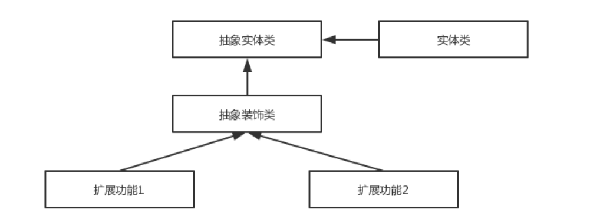

[TOC]

### Spring中的设计模式

#### 设计模式体现总结

Spring 框架中用到了哪些设计模式？

- **工厂模式**：Spring 使用工厂模式通过 **BeanFactory、ApplicationContext 创建 bean 对象**。
- **代理模式**：Spring **AOP 功能**的实现。
- **单例模式**：Spring 中的 Bean 默认都是**单例**的。
- **模板方法模式**：Spring 中 jdbcTemplate、hibernateTemplate 等以 **Template 结尾的对数据库操作的类**就使用到了模板模式。
- **包装器模式**：当项目需要连接多个数据库，而且不同的客户在每次访问中根据需要会去访问不同的数据库。包装器模式让可以根据客户的需求能够动态切换不同的数据源。
- **观察者模式**：**Spring 事件驱动模型**就是观察者模式很经典的一个应用。
- **适配器模式**：**Spring AOP** 的**增强或通知**(Advice)使用到了适配器模式、**Spring MVC** 中也是用到了**适配器模式适配 Controller**。

#### 控制反转(IoC)和依赖注入(DI)

**IoC(Inversion of Control,控制反转)** 是 Spring 中一个非常重要的概念，它不是具体技术而是一种解耦的**设计思想**。它的主要目的是借助于“第三方”(Spring 中的 IOC 容器) 实现具有依赖关系的对象之间的解耦(IOC容易管理对象，你只管使用即可)，从而降低代码之间的耦合度。**IOC 是一个原则，而不是一个模式，以下模式（但不限于）实现了 IoC 原则。**


Spring IOC 容器就像是一个工厂一样，当需要创建一个对象的时候，只需要配置好配置文件/注解即可，完全不用考虑对象是如何被创建出来的。 IOC 容器负责创建对象，将对象连接在一起，配置这些对象，并从创建中处理这些对象的整个生命周期，直到它们被完全销毁。

**DI(Dependecy Inject, 依赖注入)是实现控制反转的一种设计模式，依赖注入就是将实例变量传入到一个对象中去。**

#### 工厂方法模式

Spring 容器就是实例化和管理 Bean 的**工厂**。**工厂模式**隐藏了创建类的细节，返回值必定是**接口或者抽象类**，而不是具体的某个对象，工厂类根据条件生成不同的**子类实例**。当得到子类的**实例**后，就可以调用基类中的方法，不必考虑返回的是哪一个子类的实例。

工厂方法模式在各种 **BeanFactory 以及 ApplicationContext** 创建中都用到了。Spring 使用工厂模式可以通过 BeanFactory 或 ApplicationContext **创建 bean 对象**。

#### 单例设计模式

系统中有一些对象其实只需要一个，比如线程池、缓存、对话框、注册表、日志对象、充当打印机、显卡等设备驱动程序的对象。事实上，这一类对象**只能有一个实例**，如果制造出多个实例就可能会导致一些问题的产生，比如程序的行为异常、资源使用过量、或者不一致性的结果。

**使用单例模式的好处:**

- 对于频繁使用的对象，可以**省略创建对象所花费**的时间，这对于那些重量级对象而言，是非常可观的一笔系统开销；
- 由于 new 操作的次数减少，因而对系统内存的使用频率也会降低，这将减轻 GC 压力，缩短 GC 停顿时间。

单例模式体现：**Spring 默认将所有的 Bean 设置成 单例模式，即对所有的相同 id 的 Bean 的请求，都将返回同一个共享的 Bean 实例。这样就可以大大降低 Java 创建对象和销毁时的系统开销**。

**Spring 配置实现单例的方式：**

- **xml** : \<bean id="userService" class="top.snailclimb.UserService" scope="singleton"/>
- **注解**：@Scope(value = "singleton")

**Spring 通过 ConcurrentHashMap 实现单例注册表的特殊方式实现单例模式**。Spring 实现单例的**核心代码**如下：

```java
// 通过ConcurrentHashMap(线程安全)实现单例注册表
private final Map<String, Object> singletonObjects 
    = new ConcurrentHashMap<String, Object>(64);

public Object getSingleton(String beanName, ObjectFactory<?> singletonFactory) {
    Assert.notNull(beanName, "'beanName' must not be null");
    synchronized (this.singletonObjects) {
        // 检查缓存中是否存在实例  
        Object singletonObject = this.singletonObjects.get(beanName);
        if (singletonObject == null) {
            //...省略代码
            try {
                singletonObject = singletonFactory.getObject();
            }
            //...省略代码
            // 如果实例对象在不存在，则将beanName注册到单例注册表中
            addSingleton(beanName, singletonObject);
        }
        return (singletonObject != NULL_OBJECT ? singletonObject : null);
    }
}
// 将对象添加到单例注册表
protected void addSingleton(String beanName, Object singletonObject) {
    synchronized (this.singletonObjects) {
        this.singletonObjects
            .put(beanName, (singletonObject != null ? singletonObject : NULL_OBJECT));
    }
}
```

#### 代理模式

##### 1. AOP与代理模式

AOP 能够将那些与业务无关，却为业务模块所共同调用的逻辑或责任（例如事务处理、日志管理、权限控制等）封装起来，便于减少系统的重复代码，降低模块间的耦合度，并有利于未来的可拓展性和可维护性。

体现：**Spring AOP 就是基于动态代理的**，如果要代理的对象实现了某个接口，那么 Spring AOP 会使用**JDK Proxy**，去创建代理对象，而对于没有实现接口的对象，Spring AOP会 使用 **Cglib** 生成一个**被代理对象的子类**来作为代理类。

当然也可以使用 **AspectJ**，Spring AOP 已经集成了AspectJ  ，AspectJ  应该算的上是 Java 生态系统中最完整的 AOP 框架了。

代理模式的一个很好的例子是 org.springframework.aop.framework.**ProxyFactoryBean**。该工厂根据 Spring bean 构建 AOP 代理。该类实现了定义 getObject() 方法的 **FactoryBean 接口**。此方法用于将需求 Bean 的实例返回给 beanFactory。在这种情况下，它不是返回的实例而是 AOP 代理。

#### 模板方法模式

**模板方法模式**是一种行为设计模式，它定义一个操作中的算法的骨架，而将一些步骤延迟到子类中。 模板方法使得子类可以不改变一个算法的结构即可重定义该算法的某些特定步骤的实现方式。

```java
public abstract class Template {
    // 这就是模板方法
    public final void TemplateMethod(){
        PrimitiveOperation1();  
        PrimitiveOperation2();
        PrimitiveOperation3();
    }

    protected void  PrimitiveOperation1(){
        // 当前类实现
    }

    // 被子类实现的方法
    protected abstract void PrimitiveOperation2();
    protected abstract void PrimitiveOperation3();
}

// 实现模板方法的子类
public class TemplateImpl extends Template {
    @Override
    public void PrimitiveOperation2() {
        // 当前子类实现
    }

    @Override
    public void PrimitiveOperation3() {
        // 当前子类实现
    }
}
```

体现：Spring 中 **jdbcTemplate、redisTemplate、hibernateTemplate** 等**以 Template 结尾的对数据库操作的类**就使用到了模板模式。一般情况下，都是使用继承的方式来实现模板模式，但是 Spring 并没有使用这种方式，而是**使用Callback 模式与模板方法模式配合**，既达到了代码复用的效果，同时增加了灵活性。

#### 观察者模式

观察者模式是一种对象行为型模式。它表示的是一种对象与对象之间具有依赖关系，当一个对象发生改变的时候，这个对象所依赖的对象也会做出反应。

体现：**Spring 事件驱动模型就是观察者模式很经典的一个应用**。Spring 事件驱动模型非常有用，在很多场景都可以解耦代码。**Spring 中观察者模式常用的地方是 listener 的实现，如 ApplicationListener**。


##### 1. Spring事件驱动模型

事件驱动模型中对应观察者模式的**几种角色**如下。

###### (1) 事件角色

**ApplicationEvent** (org.springframework.context包下)充当**事件的角色**，这是一个抽象类，它继承了java.util.EventObject 并实现了 java.io.Serializable 接口。

Spring 中默认存在**以下事件**，他们都是对 ApplicationContextEvent 的实现(继承自 ApplicationContextEvent)：

- ContextStartedEvent：ApplicationContext 启动后触发的事件;
- ContextStoppedEvent：ApplicationContext 停止后触发的事件;
- ContextRefreshedEvent：ApplicationContext 初始化或刷新完成后触发的事件;
- ContextClosedEvent：ApplicationContext 关闭后触发的事件。


###### (2) 事件监听者角色

**ApplicationListener** 充当了事件监听者角色，它是一个接口，里面只定义了一个 **onApplicationEvent()** 方法来处理ApplicationEvent。ApplicationListener 接口类源码如下，可以看出接口定义看出接口中的事件只要实现了  ApplicationEvent 就可以了。所以在 Spring 中只要**实现 ApplicationListener 接口实现 onApplicationEvent() 方法即可完成监听事件**。

```java
package org.springframework.context;
import java.util.EventListener;
@FunctionalInterface
public interface ApplicationListener<E extends ApplicationEvent> extends EventListener {
    void onApplicationEvent(E var1);
}
```

###### (3) 事件发布者角色

**ApplicationEventPublisher** 充当了**事件的发布者**，它也是一个**接口**。

```java
@FunctionalInterface
public interface ApplicationEventPublisher {
    default void publishEvent(ApplicationEvent event) {
        this.publishEvent((Object)event);
    }

    void publishEvent(Object var1);
}
```

ApplicationEventPublisher 接口的 **publishEvent**() 这个方法在 **AbstractApplicationContext** 类中被实现，事件真正是通过 **ApplicationEventMulticaster** 来广播出去的。

##### 2. Spring的事件流程总结

1. 定义一个**事件**：实现一个继承自 **ApplicationEvent**，并且写相应的构造函数；
2. 定义一个**事件监听者**：实现 **ApplicationListener** 接口，重写 onApplicationEvent() 方法；
3. 使用**事件发布者发布消息**：可以通过 ApplicationEventPublisher 的 **publishEvent**() 方法发布消息。

Example：

```java
// 定义一个事件,继承自ApplicationEvent并且写相应的构造函数
public class DemoEvent extends ApplicationEvent{
    private static final long serialVersionUID = 1L;
    private String message;
    public DemoEvent(Object source,String message){
        super(source);
        this.message = message;
    }
    public String getMessage() {
        return message;
    }
}
```

定义一个事件监听者，实现 ApplicationListener 接口，重写 **onApplicationEvent**() 方法；

```java
@Component
public class DemoListener implements ApplicationListener<DemoEvent>{
    // 使用onApplicationEvent接收消息
    @Override
    public void onApplicationEvent(DemoEvent event) {
        String msg = event.getMessage();
        System.out.println("接收到的信息是："+msg);
    }
}
```

发布事件，可以通过 ApplicationEventPublisher 的 publishEvent() 方法发布消息。

```java
@Component
public class DemoPublisher {
    @Autowired
    ApplicationContext applicationContext;
    
    public void publish(String message){
        // 发布事件
        applicationContext.publishEvent(new DemoEvent(this, message));
    }
}
```

当调用 DemoPublisher 的 **publish**() 方法的时候，比如 demoPublisher.publish("你好") ，控制台就会打印出：接收到的信息是：你好 。

#### 适配器模式

**适配器模式**(Adapter Pattern) 将一个**接口**转换成客户希望的**另一个接口**，适配器模式使接口**不兼容**的那些类可以一起工作，其别名为**包装器**(Wrapper)。

##### 1. Spring AOP中的适配器模式

Spring AOP 的**实现是基于代理模式**，但是 Spring AOP 的**增强或通知**(Advice)使用到了**适配器模式**，与之相关的接口是 **AdvisorAdapter** 。Advice 常用的类型有：BeforeAdvice、AfterAdvice、AfterReturningAdvice等等。每个类型Advice（通知）都有**对应的拦截器**：MethodBeforeAdviceInterceptor、AfterReturningAdviceAdapter、AfterReturningAdviceInterceptor。Spring 预定义的通知要通过**对应的适配器**，适配成 **MethodInterceptor** 接口(方法拦截器)类型的对象（如：MethodBeforeAdviceInterceptor 负责适配 MethodBeforeAdvice）。

**在 Spring 的 AOP 中，使用 Advice（通知）来增强被代理类的功能**。Spring 实现这一 AOP 功能的原理就使用**代理模式**（1、JDK动态代理。2、CGLib字节码生成技术代理。）对类进行方法级别的**切面增强**，即生成被代理类的代理类， 并在代理类的方法前，设置拦截器，通过执行拦截器重的内容增强了代理方法的功能，实现的面向切面编程。

##### 2. Spring MVC中的适配器模式

在 Spring MVC 中，**DispatcherServlet** 根据请求信息调用 **HandlerMapping**，解析请求对应的 **Handler**。解析到对应的 Handler（也就是平常的 Controller 控制器）后，开始由 **HandlerAdapter** 适配器处理。**HandlerAdapter 作为期望接口，具体的适配器实现类用于对目标类进行适配，Controller 作为需要适配的类。**

**为什么要在 Spring MVC 中使用适配器模式？** Spring MVC 中的 **Controller 种类众多**，不同类型的 Controller 通过不同的方法来对请求进行处理。如果不利用适配器模式的话，**DispatcherServlet** 直接获取对应类型的 Controller，需要的**自行判断**，像下面这段代码一样：

```java
if (mappedHandler.getHandler() instanceof MultiActionController) {  
    ((MultiActionController)mappedHandler.getHandler()).xxx  
} else if (mappedHandler.getHandler() instanceof XXX) {  
    ...  
} else if(...) {  
    ...  
}  
```

增加一个 Controller 类型就要在上面代码中再加入一行判断语句，这种形式就使得程序难以维护，也违反了设计模式中的开闭原则，即对扩展开放，对修改关闭。

#### 装饰者模式

**装饰者模式**可以**动态**地给对象添加一些**额外的属性或行为**。相比于使用继承，装饰者模式更加灵活。简单点儿说就是当**需要修改原有**的功能，但又**不愿直接去修改原有的代码**时，设计一个 Decorator **套在原有代码外面**。其实在 JDK 中就有很多地方用到了装饰者模式，比如 **InputStream 家族**，InputStream 类下有 FileInputStream (读取文件)、 BufferedInputStream (增加缓存，使读取文件速度大大提升)等子类都在**不修改 InputStream 代码的情况下扩展了它的功能。**



Spring 中配置 **DataSource** 的时候，DataSource **可能是不同的数据库和数据源**，用装饰者模式就可以根据客户的需求在少修改原有类的代码下动态切换不同的数据源。Spring 中用到的包装器模式在类名上含有 **Wrapper 或者 Decorator**。这些类基本上都是动态地给一个对象添加一些额外的职责。


#### 参考资料

- 《Spring技术内幕》
- <https://blog.eduonix.com/java-programming-2/learn-design-patterns-used-spring-framework/>
- <http://blog.yeamin.top/2018/03/27/单例模式-Spring单例实现原理分析/>
- <https://www.tutorialsteacher.com/ioc/inversion-of-control> 
- <https://design-patterns.readthedocs.io/zh_CN/latest/behavioral_patterns/observer.html>
- <https://juejin.im/post/5a8eb261f265da4e9e307230>
- <https://juejin.im/post/5ba28986f265da0abc2b6084>

