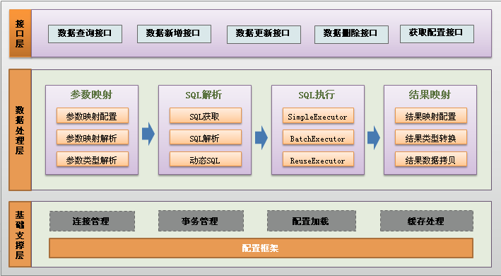
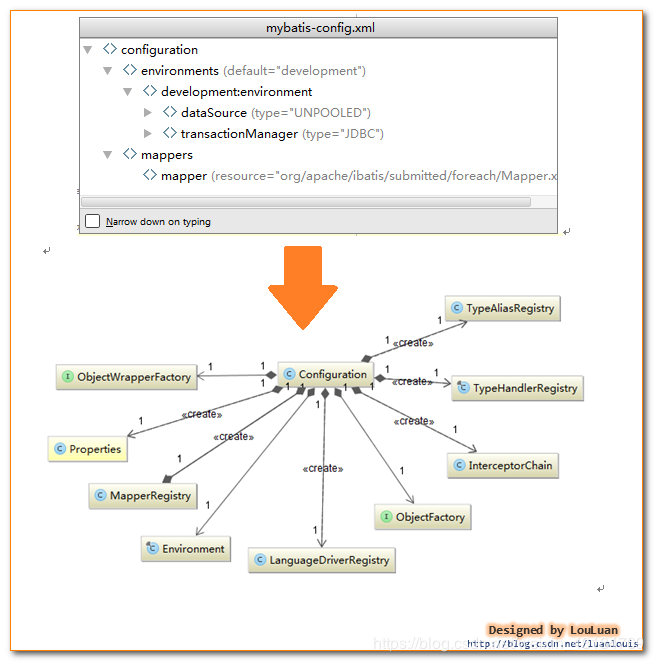
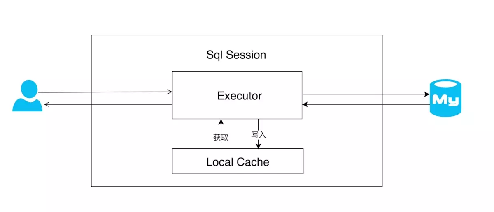
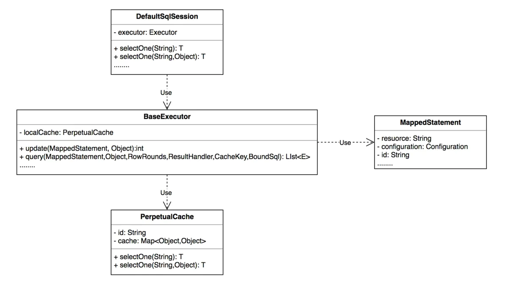
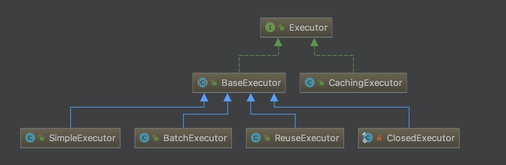
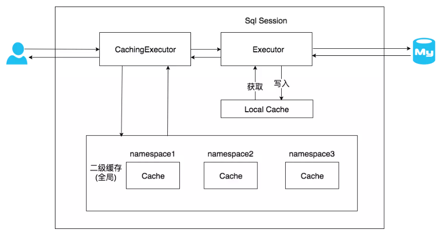
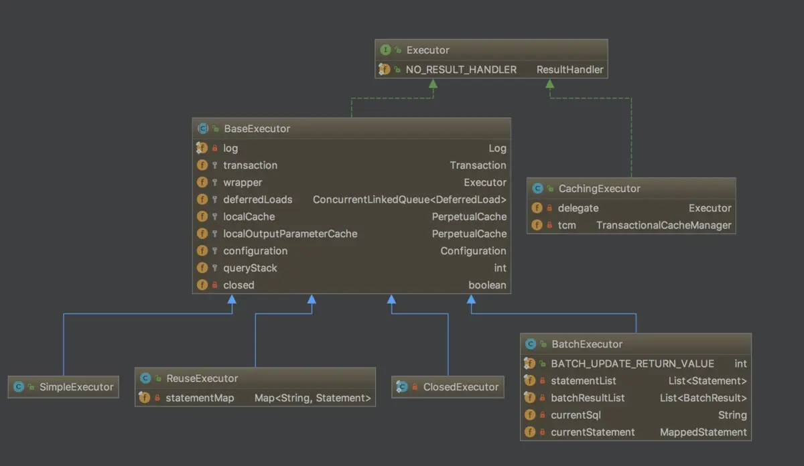
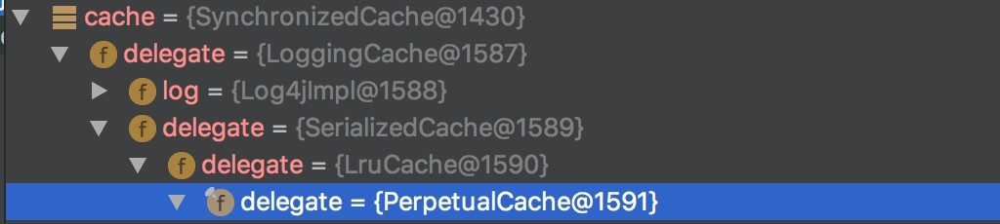

[TOC]

### MyBatis

#### JDBC

这里主要讲解 JDBC 怎么演变到 Mybatis 的渐变过程，重点讲解了为什么要将 JDBC 封装成 Mybaits 这样一个持久层框架。再而论述 Mybatis 作为一个数据持久层框架本身有待**改进之处**。

##### 1. JDBC执行流程

最基础的通过 JDBC 查询数据库数据，一般需要以下七个步骤：

（1） 加载 JDBC **驱动**

（2） 建立并获取**数据库连接**

（3） 创建 **JDBC Statements** 对象

（4） 设置 SQL 语句的**传入参数**

（5） **执行** SQL 语句并获得查询结果

（6） 对查询结果进行**转换处理**并将处理结果返回

（7） **释放**相关资源（关闭 Connection，关闭 Statement，关闭 ResultSet）

###### (1) 加载JDBC驱动程序

在连接数据库之前，首先要加载想要连接的数据库的驱动到 JVM（Java虚拟机），这通过 java.lang.Class 类的静态方法 **forName**(String className) 实现。

例如：

```java
try{
    // 加载MySql的驱动类
    Class.forName("com.mysql.jdbc.Driver") ;
} catch(ClassNotFoundException e) {
    System.out.println("找不到驱动程序类 ，加载驱动失败！");
    e.printStackTrace() ;
}
```

成功加载后，会将 Driver 类的实例注册到 **DriverManager** 类中。

###### (2) 提供JDBC连接的URL

连接 URL 定义了连接数据库时的协议、子协议、数据源标识。

```
书写形式：协议：子协议：数据源标识
```

- **协议**：在 JDBC 中总是以 jdbc 开始 。

- **子协议**：是桥连接的驱动程序或是数据库管理系统名称。

- **数据源标识**：标记找到数据库来源的地址与连接端口。

例如：

```properties
jdbc:mysql://localhost:3306/test?useUnicode=true&characterEncoding=gbk;useUnicode=true
```

表示使用 Unicode 字符集。如果 characterEncoding 设置为 gb2312 或 GBK，本参数必须设置为 true 。characterEncoding=gbk：字符编码方式。

###### (3) 获取数据库连接

要连接数据库，需要向 java.sql.**DriverManager **请求并获得 **Connection 对象**， 该对象就代表**一个数据库的连接**。使用 DriverManager 的 **getConnectin**(String url , String username , String password ) 方法传入指定的欲连接的数据库的路径、数据库的用户名和密码来获得。例如：

```java
String url = "jdbc:mysql://localhost:3306/test" ;
String username = "root" ;
String password = "root" ;
try{
    Connection con = DriverManager.getConnection(url, username, password ) ;
}catch(SQLException se){
    System.out.println("数据库连接失败！");
    se.printStackTrace() ;
}
```

###### (4) 创建一个Statement

要执行 SQL 语句，必须获得 java.sql.**Statement** 实例，Statement 实例分为以下 3 种类型：

1、执行**静态 SQL** 语句。通常通过 **Statement** 实例实现。

2、执行**动态 SQL**语句。通常通过 **PreparedStatement** 实例实现。

3、执行数据库**存储过程**。通常通过 **CallableStatement** 实例实现。

具体的实现方式：

```java
Statement stmt = con.createStatement(); 
PreparedStatement pstmt = con.prepareStatement(sql); 
CallableStatement cstmt = con.prepareCall("XXXXXXXX");
```

###### (5) 执行SQL语句

**Statement** 接口提供了三种执行 SQL 语句的方法：**executeQuery 、executeUpdate 和 execute**。

- **ResultSet executeQuery(String sqlString)**：执行查询数据库的 SQL 语句 ，返回一个结果集（ResultSet）对象。
- **int executeUpdate(String sqlString)**：用于执行 INSERT、UPDATE 或 DELETE 语句以及 SQL DDL 语句，如：CREATE TABLE 和 DROP TABLE 等。
- **execute(sqlString)**：用于执行返回**多个结果集**、多个更新计数或二者组合的语句。 

具体实现的代码：

```java
ResultSet rs = stmt.executeQuery(“SELECT * FROM …”); 
int rows = stmt.executeUpdate(“INSERT INTO …”); 
boolean flag = stmt.execute(String sql);
```

###### (6) 处理结果

两种情况：

- 执行**更新**返回的是本次操作**影响到的记录数**。
- 执行**查询**返回的结果是一个 **ResultSet 对象**。

**ResultSet** 包含符合 SQL 语句中条件的**所有行**，并且它通过一套 **get 方法**提供了对这些行中数据的访问。使用结果集（ResultSet）对象的访问方法获取数据：（列是从左到右编号的，并且从列 1 开始）。

```java
while(rs.next()){
    String name = rs.getString(“name”) ;
    String pass = rs.getString(1) ; // 此方法比较高效
}
```

###### (7) 关闭JDBC对象

操作完成以后要把所有使用的 JDBC 对象**全都关闭**，以释放 JDBC 资源，关闭顺序和声明**顺序相反**：关闭记录集、关闭声明、关闭连接对象。

```java
if(rs != null){ // 关闭记录集
    try{
        rs.close() ;
    }catch(SQLException e){
        e.printStackTrace() ;
    }
}
if(stmt != null){ // 关闭声明
    try{
        stmt.close() ;
    }catch(SQLException e){
        e.printStackTrace() ;
    }
}
if(conn != null){ // 关闭连接对象
    try{
        conn.close() ;
    }catch(SQLException e){
        e.printStackTrace() ;
    }
}
```

JDBC 用起来是**比较繁杂的，很多步骤都是重复**的，而且存在一些问题，所以才有了 MyBatis 这样的框架。

##### 2. JDBC到Mybatis的演化

上面基础的 JDBC 共有七个步骤，有的步骤是可以**进一步封装**的，减少代码量。

###### (1) 第一步优化：连接获取和释放

**问题描述**：数据库连接**频繁的开启和关闭**本身就造成了资源的浪费，影响系统的性能。

**解决问题**：数据库连接的获取和关闭可以使用**数据库连接池**来解决资源浪费的问题。通过连接池就可以反复利用已经建立的连接去访问数据库了。减少连接的开启和关闭的时间。

**问题描述**：但是现在**连接池多种多样**，可能存在变化，有可能采用 DBCP 的连接池，也有可能采用容器本身的 JNDI 数据库连接池。

**解决问题**：可以通过 **DataSource** 进行**隔离解耦**，统一从 DataSource 里面获取**数据库连接**，DataSource 具体由 DBCP 实现还是由容器的 JNDI 实现都可以，所以将 DataSource 的**具体实现通过让用户配置来应对变化**。

###### (2) 第二步优化：SQL统一存取

**问题描述**：使用 JDBC 进行**操作数据库**时，SQL 语句基本都散落在各个 Java 类中，这样有三个不足之处：

- 第一，可读性很差，不利于维护以及做性能调优。

- 第二，改动 Java 代码需要重新编译、打包部署。

- 第三，不利于取出 SQL 在数据库客户端执行（取出后还得删掉中间的 Java 代码，编写好的 SQL 语句写好后还得通过＋号在 Java 进行拼凑）。

**解决问题**：可以考虑不把 SQL 语句写到 Java 代码中，那么把 SQL 语句放到哪里呢？首先需要有一个**统一存放**的地方，可以将这些 SQL 语句**统一集中放到配置文件或者数据库**里面（以 key-value 的格式存放）。然后通过 SQL 语句的 **key 值**去获取对应的 SQL 语句。既然将 SQL 语句都统一放在**配置文件或者数据库**中，那么这里就涉及一个 SQL 语句的**加载问题**。

###### (3) 第三步优化：传入参数映射和动态SQL

**问题描述**：很多情况下都可以通过在 SQL 语句中**设置占位符**来达到使用**传入参数**的目的，这种方式本身就有一定局限性，它是按照一定**顺序**传入参数的，要与占位符**一一匹配**。但是，如果传入的参数是不确定的（比如列表查询，根据用户填写的查询条件不同，传入查询的参数也是不同的，有时是一个参数、有时可能是三个参数），那么就得在后台代码中自己根据请求的传入参数去拼凑相应的 SQL 语句，这样还是避免不了在 Java 代码里面写 SQL 语句。既然已经把 SQL 语句统一存放在配置文件或者数据库中了，怎么做到能够**根据前台传入参数的不同**，**动态生成**对应的 SQL 语句呢？

**解决问题**：第一，先解决这个**动态问题**，按照正常的思维，通过 if 和 else 这类的判断来进行是最直观的，可以想到 JSTL 中的 \<if test="">\</if> 这样的**标签**，那么，能不能将这类的**标签**引入到 SQL 语句中呢？假设可以，那么这里就需要一个专门的 **SQL 解析器**来**解析这样的 SQL 语句**，但是 if 判断的变量来自于哪里？传入的值本身是可变的，那么得为这个值定义一个**不变的变量名称**，而且这个变量名称必须和对应的值要有对应关系，可以通过这个变量名称找到对应的值，这个时候想到了 **key-value 的 Map**。**解析的时候根据变量名的具体值来判断**。

假如前面可以判断没有问题，那么假如判断的结果是 true，那么就需要输出的标签里面的 SQL 片段，但是怎么解决在标签里面使用**变量名称**的问题呢？这里需要使用一种有别于 SQL 的语法来**嵌入变量**（比如使用＃变量名＃）。这样，SQL 语句经过解析后就可以**动态的生成符合上下文**的 SQL 语句。

还有，怎么区分开占位符变量和非占位变量？有时候单单使用占位符是满足不了的，占位符只能为查询条件占位，SQL 语句其他地方使用不了。这里我们可以使用 **#变量名#** 表示**占位符变量**，使用 **\$变量名$** 表示**非占位符变量**。

###### (4) 第四步优化：结果映射和结果缓存

**问题描述**：执行 SQL 语句、获取执行结果、对执行结果进行转换处理、释放相关资源是一整套下来的。假如是执行查询语句，那么执行 SQL 语句后，返回的是一个 **ResultSet** 结果集，这个时候就需要将 ResultSet 对象的数据**取出来**，不然等到释放资源时就取不到这些结果信息了。从前面的优化来看，以及将获取连接、设置传入参数、执行 SQL 语句、释放资源这些都封装起来了，只剩下结果处理这块还没有进行封装，如果能封装起来，每个数据库操作都不用自己写那么一大堆 Java 代码，直接调用一个封装的方法就可以搞定了。

**解决问题**：分析一下，一般对**执行结果的有哪些处理**，有可能将结果**不做任何处理**就直接返回，也有可能将结果**转换成一个 JavaBean 对象返回**、一个 Map 返回、一个 List 返回等等，结果处理可能是多种多样的。从这里看，必须告诉 SQL 处理器两点：第一，**需要返回什么类型的对象**；第二，需要返回的**对象的数据结构怎么跟执行的结果映射**，这样才能将具体的值 copy 到对应的数据结构上。

接下来，可以进而考虑对 SQL 执行结果的**缓存**来提升性能。缓存数据都是 **key-value** 的格式，那么这个 key 怎么来呢？怎么保证唯一呢？即使同一条 SQL 语句几次访问的过程中由于**传入参数**的不同，得到的执行 SQL 语句也是**不同**的。但是 **SQL 语句和传入参数两部分合起来**可以作为数据缓存的 **key 值**。

###### (5) 第五步优化：解决重复SQL语句问题

**问题描述**：由于将所有 SQL 语句都放到**配置文件**中，这个时候会遇到一个 **SQL 重复**的问题，几个功能的 SQL 语句其实**都差不多**，有些可能是 SELECT 后面那段不同、有些可能是 WHERE 语句不同。有时候表结构改了，那么就需要改多个地方，不利于维护。

**解决问题**：当出现重复代码时怎么办？将重复的代码抽离出来成为独立的一个类，然后在各个需要使用的地方进行引用。对于 SQL 重复的问题，也可以采用这种方式，通过**将 SQL 片段模块化**，将重复的 SQL 片段独立成一个 SQL 块，然后在各个 SQL 语句**引用重复的 SQL 块**，这样需要修改时只需要修改一处即可。 

###### (6) 优化总结

总结一下上面对 JDBC 的**优化和封装**：

（1） 使用**数据库连接池**对连接进行管理。

（2） SQL 语句统一存放到**配置文件。**

（3） SQL 语句**变量和传入参数**的映射以及**动态SQL**。

（4） 动态 SQL 语句的**处理**。

（5） 对数据库操作结果的**映射和结果缓存**。

（6） SQL 语句的重复。

##### 5.  Mybaits有待改进之处

**问题描述**：Mybaits 所有的数据库操作都是基于 SQL 语句，导致什么样的数据库操作**都要写 SQL 语句**。一个应用系统要写的 SQL 语句实在**太多**了。

**改进方法**：对数据库进行的操作大部分都是对表数据的**增删改查**，很多都是对**单表**的数据进行操作，由这点可以想到一个问题：单表操作可不可以不写 SQL 语句，通过 JavaBean 的**默认映射器生成对应的 SQL 语句**，比如：一个类 UserInfo 对应于 USER_INFO 表， userId 属性对应于 USER_ID 字段。这样就可以通过**反射可以获取到对应的表结构**了，**拼凑成对应的 SQL 语句**显然不是问题。


#### MyBatis框架整体设计

MyBatis 是一款优秀的**持久层框架**，它支持定制化 SQL、存储过程以及高级映射。MyBatis 避免了几乎所有的 JDBC 代码和手动设置参数以及获取结果集。MyBatis 可以使用简单的 **XML 或注解来配置和映射原生类型**、接口和 Java 的 POJO（Plain Old Java Objects，普通老式 Java 对象）为数据库中的记录。

其它持久层解决方案：JDBC、DataUtils、JdbcTemplate、Hibernate。

##### 1. 整体设计

###### (1) 总体流程

(1) **加载配置并初始化**

**触发条件**：加载配置文件。配置来源于两个地方，一处是**配置文件**，一处是 Java 代码的**注解**，将 SQL 的配置信息加载成为一个个 **MappedStatement** 对象（包括了传入参数映射配置、执行的 SQL 语句、结果映射配置），存储在**内存**中。

(2) **接收调用请求**

**触发条件**：调用 Mybatis 提供的 API。

传入参数：为 SQL 的 ID 和传入**参数**对象。

处理过程：将请求传递给下层的请求处理层进行处理。

(3) **处理操作请求**

触发条件：API 接口层**传递请求**过来

传入参数：为 SQL 的 ID 和传入参数对象

处理过程：

​    (A) 根据 SQL 的 **ID** 查找对应的 **MappedStatement** 对象。

​    (B) 根据**传入参数对象解析 MappedStatement 对象**，得到最终要**执行的 SQL 和执行传入参数**。

​    (C) 获取**数据库连接**，根据得到的最终 SQL 语句和执行传入参数到数据库执行，并得到执行结果。

​    (D) 根据 **MappedStatement** 对象中的**结果映射配置对得到的执行结果进行转换处理**，并得到最终的处理结果。

​    (E) **释放**连接资源。

(4) **返回处理结果**

将最终的处理结果返回。

###### (2) 功能架构设计

功能架构讲解：



把 Mybatis 的功能架构分为**三层**：

(1) **API接口层**：提供给外部使用的接口 API，开发人员通过这些**本地 API 来操纵数据库**。接口层一接收到调用请求就会调用数据处理层来完成具体的数据处理。

(2) **数据处理层**：负责具体的 SQL 查找、SQL 解析、SQL 执行和执行结果映射处理等。它主要的目的是**根据调用的请求完成一次数据库操作**。

(3) **基础支撑层**：负责最基础的功能支撑，包括**连接管理、事务管理、配置加载和缓存处理**，这些都是**共用**的东西，将他们抽取出来作为最基础的组件。为上层的数据处理层提供最基础的支撑。

###### (3) 框架架构设计


框架架构讲解：

(1) **加载配置**：配置来源于两个地方，一处是**配置文件**，一处是 Java 代码的**注解**，将 SQL 的配置信息加载成为一个个 **MappedStatement** 对象（包括了传入参数映射配置、执行的SQL语句、结果映射配置），存储在**内存**中。

(2) **SQL解析**：当 API 接口层接收到调用请求时，会接收到传入 SQL 的 ID 和**传入对象**（可以是Map、JavaBean或者基本数据类型），Mybatis 会**根据 SQL 的 ID 找到对应的 MappedStatement**，然后根据传入**参数对象**对 **MappedStatement** 进行**解析**，解析后可以得到**最终要执行的 SQL 语句和参数**。

(3) **SQL执行**：将最终得到的 SQL 和参数拿到数据库进行执行，得到操作数据库的结果。

(4) **结果映射**：将操作数据库的结果**按照映射的配置进行转换**，可以转换成 HashMap、JavaBean 或者基本数据类型，并将最终结果返回。


#### Mapper文件

##### 1. SQL语句块statement

通过原生 JDBC 写 DAO 的年代 ，程序员最怕莫过于 **拼接 SQL 语句**，拼接参数与设置返回结果集，Hibernate 将拼接 SQL时代成为过去，通过 ORM 映谢，完全不需要处理任何 SQL，但这又带来了新的问题就是。**无法编写自定义 SQL** 从而丧失了灵活活及更好的性能。MyBatis 通过 mapper 映射 SQL 很好解决了这一点。它无需在 JAVA 代码中拼接 SQL，而是将其**移至 mapper 文件集中处理 SQL**节约了大量的开发时间。

###### (1) Mapper中的元素

- cache：对给定命名空间的缓存配置。

- resultMap：结果集映射。

- sql：可被其他语句引用的可重用语句块。

- insert：插入语句。

- update：更新语句。

- delete：删除语句。

- select：查询语句。

###### (2) select用法及属性

示例：

```xml
<select id="selectById" resultType="com.tuling.mybatis.dao.Account">
    select * from account where id = #{id}
</select>
```

属性：

```xml
<select
        id="selectById"    
        parameterType="User" 
        resultType="hashmap"  
        resultMap="userResultMap" 
        flushCache="false"   
        useCache="true"     
        timeout="10"
        statementType= PREPARED">
```

- id：语句块的唯一标识 与接口中方法名称对应。

- parameterType：参数java类型。

- resultType：返回结果java类型。

- resultMap：返回结果映射。

- flushCache：true 每次调用都会刷新 一二级缓存。

- useCache：true 是否保存至二级缓存当中去。

###### (3) insert&update&delete用法

```xml
<insert
        id="addUser"  
        parameterType="User"  
        flushCache="true" 
        statementType="PREPARED"
        keyProperty=""    
        keyColumn=""    
        useGeneratedKeys="" 
        timeout="20">
```

- id：语句块的唯一标识 与接口中方法名称对应。
- parameterType：参数java类型。
- flushCache：true 每次调用都会刷新 一二级缓存。
- statementType：执行类型。
- keyProperty：主键对应的java 属性，多个用 逗号分割。
- keyColumn：主键列，多个用 逗号分割。
- useGeneratedKeys：插入成功后将 将值回设至 原参数。

示例：

```xml
<insert id="addUser" keyColumn="id" keyProperty="id" useGeneratedKeys="true"
        parameterType="com.tuling.mybatis.dao.User">
    insert into user (name,updateTime,createTime) values (#{name},#{updateTime},#{createTime})
</insert>
```


#### 参数映射

参数映射是最强大功能之一，基可以通过以下方式进行引用。

- 单个简单参数引用：如果方法中只有一个参数可通过任意名称 进行引用。
- 多个简单参数引用：通过参数下标引用 #{arg0} #{arg1} 或 #{param1} ,#{param2}。
- 对像属性引用：直接通过对象属性名称引用，嵌套对像通过. 号进行引用。
- map key 值引用。
- 变量名称引用(需要 JDK1.8 支持) ：通过方法中参数名称引用，需要 JDK1.8 支持，且在编译时必须加上 -parameters 编译命令。

#### 结果集映射

结果集映射是指将 **resultSet** 中内容封装转换成 **Java对像**，在纯 JDBC 时代全部都是用调用 resultSet 的 getXXX(columnName) 来获取属性并封装。代码量大，编程效率低尤其当数据模型是 1 对多，或多对多这种复杂关系，这种封装代码将会变得非常复杂。结果集映射就是为解决这个问题通过 resultMap 集中处理结果集与 JAVA 对象的关系。

**结果集自动映射**：在 select 中指定 **resultType**=“” 后无需要任何配置 MyBatis 会基于 resultType 中的 Java 类型及属性**自动推断**生成 一个隐示的 resultMap 从而完成**结果映射**。

**resultMap**：但有时 JDBC 并不是与 Java Bean 完全贴合，这时就需要手动设置 resultMap。

```xml
<resultMap id="account2" type="com.tuling.mybatis.dao.Account">
    <id property="id"/>
    <result property="createTimestamp" column="createTimestamp"
            typeHandler="com.tuling.mybatis.dao.LongTimeHandler"/>
</resultMap>
```

这时在 select 元素中用 resultMap ="account2" 即可引用该 map 映射。

**基本元素与属性**

- **ID：**用于**结果集中的唯一标识**，在**缓存**中很有用，缓存对比 ID 字段进行匹配。

- **result：**设置一个某通过字段
- property：Java 中的类型
- jdbcType：
- javaType：
- column：
- typeHandler：

示例：

```xml
<resultMap id="accountAndUser" type="com.tuling.mybatis.dao.Account">
    <id property="id" column="id"/>
    <association property="user" javaType="com.tuling.mybatis.dao.User">
        <id property="id" column="user_id"/>
        <result property="name" column="userName"/>
    </association>
</resultMap>

<select id="selectAccountAndUser" resultMap="accountAndUser">
    SELECT a.*, b.name userName from account a,user b where a.user_id=b.id
</select>
```

引入外部 Select，

```xml
<!--基于多次查询拼装引入-->
<resultMap id="accountAndUser2" type="com.tuling.mybatis.dao.Account">
    <id property="id" column="id"/>
    <association property="user" javaType="com.tuling.mybatis.dao.User" select="selectUser" column="user_id">
    </association>
</resultMap>

<select id="selectUser" resultType="com.tuling.mybatis.dao.User">
    select * from user where id = #{id}
</select>
```


#### 配置文件读取与解析

##### 1. 准备工作

编写测试代码（具体请参考《Mybatis入门示例》），设置断点，以Debug模式运行，具体代码如下: 

```java
String resource = "mybatis.cfg.xml";  
Reader reader = Resources.getResourceAsReader(resource);  
SqlSessionFactory ssf = new SqlSessionFactoryBuilder().build(reader);  
SqlSession session = ssf.openSession();  
```

##### 2. 源码分析

对上面的代码进行**跟踪和分析**。首先按照顺序先看看第一行和第二行代码，看看它主要完成什么事情：

```java
String resource = "mybatis.cfg.xml";  
Reader reader = Resources.getResourceAsReader(resource);  
```

读取 Mybaits 的**主配置配置文件**，并返回该文件的**输入流**，Mybatis 所有的 SQL 语句都写在 **XML 配置文件**里面，所以第一步就需要读取这些 XML 配置文件，这个不难理解，关键是读取文件后怎么**存放**。

接着看第三行代码（如下），该代码主要是读取配置文件流并将这些**配置信息**存放到 **Configuration** 类中。

```java
SqlSessionFactory ssf = new SqlSessionFactoryBuilder().build(reader);  
```

**SqlSessionFactoryBuilder** 的 build 的方法如下:

```java
public SqlSessionFactory build(Reader reader) {  
    return build(reader, null, null);  
}  
```

其实是调用该类的另一个 build 方法来执行的，具体代码如下:

```java
public SqlSessionFactory build(Reader reader, String environment, 
                               Properties properties) {  
    try {  

        XMLConfigBuilder parser = new XMLConfigBuilder(reader, environment, properties); 
        return build(parser.parse());  
    } catch (Exception e) {  
        throw ExceptionFactory.wrapException("Error building SqlSession.", e);  
    } finally {  
        ErrorContext.instance().reset();  
        try {  
            reader.close();  
        } catch (IOException e) {  
            // Intentionally ignore. Prefer previous error.  
        }  
    }  
} 
```

重点看一下里面两行:

```java
// 创建一个配置文件流的解析对象XMLConfigBuilder,其实这里是将环境和配置文件流赋予解析类  
XMLConfigBuilder parser = new XMLConfigBuilder(reader, environment, properties);  
// 解析类对配置文件进行解析并将解析的内容存放到Configuration对象中,并返回SqlSessionFactory  
return build(parser.parse());  
```

这里的 **XMLConfigBuilder** 初始化其实调用的代码如下：

```java
private XMLConfigBuilder(XPathParser parser, String environment, Properties props) {  
    super(new Configuration());  
    ErrorContext.instance().resource("SQL Mapper Configuration");  
    this.configuration.setVariables(props);  
    this.parsed = false;  
    this.environment = environment;  
    this.parser = parser;   
}  
```

 **XMLConfigBuilder** 的 **parse** 方法执行代码如下：

```java
public Configuration parse() {  
    if (parsed) {  
        throw new BuilderException("Each MapperConfigParser can only be used once.");  
    }  
    parsed = true;  
    parseConfiguration(parser.evalNode("/configuration"));  
    return configuration;  
} 
```

解析的内容主要是在 **parseConfiguration** 方法中，它主要完成的工作是**读取配置文件的各个节点**，然后将这些**数据映射到内存配置对象 Configuration 中**，看一下 parseConfiguration 方法内容：

```java
private void parseConfiguration(XNode root) {  
    try {  
        typeAliasesElement(root.evalNode("typeAliases"));  
        pluginElement(root.evalNode("plugins"));  
        objectFactoryElement(root.evalNode("objectFactory"));  
        objectWrapperFactoryElement(root.evalNode("objectWrapperFactory"));  
        propertiesElement(root.evalNode("properties"));  
        settingsElement(root.evalNode("settings"));  
        environmentsElement(root.evalNode("environments"));  
        typeHandlerElement(root.evalNode("typeHandlers"));  
        mapperElement(root.evalNode("mappers"));  
    } catch (Exception e) {  
        throw new BuilderException("Error parsing SQL Mapper Configuration. Cause: " + e, e);  
    }  
}  
```

最后的 **build** 方法其实是**传入配置对象**进去，创建 **DefaultSqlSessionFactory** 实例出来。DefaultSqlSessionFactory 是 SqlSessionFactory 的**默认实现**。

```java
public SqlSessionFactory build(Configuration config) {  
    return new DefaultSqlSessionFactory(config);  
} 
```

**Configuration 对象的结构和 xml 配置文件的对象一一对应。**

回顾一下 xml 中的**配置标签**有哪些：**properties（属性），settings（设置），typeAliases（类型别名），typeHandlers（类型处理器），objectFactory（对象工厂），mappers（映射器）等**。

**Configuration** 也有对应的**对象属性**来封装它们。



发散一下思路，既然**解析 xml** 是对 Configuration 中的属性进行复制，那么同样可以在一个**类中创建 Configuration 对象**，手动设置其中**属性的值**来达到配置的效果。这就是通过 XML 配置文件与通过类配置的方式来进行配置。

最后看一下第四行代码： 

```java
SqlSession session = ssf.openSession();  
```

通过调用 DefaultSqlSessionFactory 的 **openSession** 方法返回一个 **SqlSession 实例**，看一下具体是怎么得到一个 SqlSession 实例的。首先调用 **openSessionFromDataSource** 方法。 

```java
public SqlSession openSession() {  
    return openSessionFromDataSource(configuration.getDefaultExecutorType(), null, false);  
}  
```

 下面看一下 **openSessionFromDataSource** 方法的逻辑：

```java
private SqlSession openSessionFromDataSource(ExecutorType execType, TransactionIsolationLevel level, boolean autoCommit) {  
    Connection connection = null;  
    try {  
        // 获取配置信息里面的环境信息，这些环境信息都是包括使用哪种数据库，连接数据库的信息，事务  
        final Environment environment = configuration.getEnvironment();  
        // 根据环境信息关于数据库的配置获取数据源  
        final DataSource dataSource = getDataSourceFromEnvironment(environment);  
        // 根据环境信息关于事务的配置获取事务工厂  
        TransactionFactory transactionFactory = getTransactionFactoryFromEnvironment(environment);  
        connection = dataSource.getConnection();  
        if (level != null) {  
            // 设置连接的事务隔离级别  
            connection.setTransactionIsolation(level.getLevel());  
        }  
        // 对connection进行包装，使连接具备日志功能，这里用的是代理。  
        connection = wrapConnection(connection);  
        // 从事务工厂获取一个事务实例  
        Transaction tx = transactionFactory.newTransaction(connection, autoCommit);  
        // 从配置信息中获取一个执行器实例  
        Executor executor = configuration.newExecutor(tx, execType);  
        // 返回SqlSession的一个默认实例  
        return new DefaultSqlSession(configuration, executor, autoCommit);  
    } catch (Exception e) {  
        closeConnection(connection);  
        throw ExceptionFactory.wrapException("Error opening session.  Cause: " + e, e); 
    } finally {  
        ErrorContext.instance().reset();  
    }  
} 
```

**传入参数**说明：

（1）**ExecutorType**：执行类型，ExecutorType 主要有三种类型：**SIMPLE, REUSE, BATCH**，默认是 SIMPLE，都在枚举类 ExecutorType 里面。Executor 也是一个**接口**，他有三个常用的实现类 BatchExecutor（重用语句并执行批量更新），ReuseExecutor（重用预处理语句prepared statements），SimpleExecutor（普通的执行器，默认）。

（2）**TransactionIsolationLevel**：事务**隔离级别**，都在枚举类 **TransactionIsolationLevel** 中定义。

（3）**autoCommit**：是否**自动提交**，主要是事务提交的设置。

**DefaultSqlSession** 是 **SqlSession** 的实现类，该类主要提供操作数据库的方法给开发人员使用。

SqlSession 是一个**接口**，它有两个实现类：**DefaultSqlSession（默认）**和 SqlSessionManager（弃用，不做介绍），它是 MyBatis 中用于和**数据库交互**的顶层类，通常将它与 **ThreadLocal** 绑定，**一个会话使用一个 SqlSession**，并且在使用完毕后需要 close。SqlSession 中的两个最重要的**参数**：Configuration 配置类和 Executor 执行器。

这里总结一下上面的过程，总共由**三个步骤**：

步骤一：读取 Mybatis 的**主配置文件**，并将文件读成**文件流形式**(InputStream)。

步骤二：从主配置文件流中读取文件的**各个节点信息**并存放到 **Configuration** 对象中。读取 **mappers** 节点的引用文件，并将这些文件的各个节点信息存放到 **Configuration** 对象。

步骤三：根据 **Configuration** 对象的信息获取**数据库连接**，并设置**连接的事务隔离级别**等信息，将经过**包装数据库连接对象** SqlSession 接口返回，DefaultSqlSession 是 SqlSession 的实现类，所以这里返回的是 **DefaultSqlSession**，SqlSession 接口里面就是对外提供的**各种数据库操作**。


#### MyBatis缓存

MyBatis 提供了一级缓存和二级缓存，用于减轻数据压力，提高数据库性能。

- **一级缓存**：也称为**本地缓存**，是 **SqlSession 级别**的缓存，用于保存用户在一次会话过程中查询的结果，用户**一次会话中只能使用一个**sqlSession，一级缓存是**自动开启**的，不允许关闭。不同的 sqlSession 之间的缓存数据区域（HashMap）是**互相不影响**的。
- **二级缓存**：也称为**全局缓存**，是 **mapper 级别**的缓存，是针对一个表的查结果的存储，可以**共享给所有针对这张表的查询的用户**。也就是说对于 mapper 级别的缓存不同的 sqlsession 是可以**共享**的。多个 SqlSession 去操作同一个 Mapper 的 sql 语句，多个 SqlSession 可以**共用二级缓存**，二级缓存是**跨 SqlSession** 的。

##### 1. 一级缓存

###### (1) 一级缓存使用场景

订单表与会员表是存在**一对多**的关系，为了尽可能**减少 join 查询**，进行了**分阶段**查询，即先查询出订单表，再根据 member_id 字段查询出会员表，最后进行数据整合 。如果订单表中存在**重复**的 member_id，就会出现很多没必要的**重复查询**。

针对这种情况 MyBatis 通过一级缓存来实现，在**同一次查询会话中如果出现相同的语句及参数**，就会从缓存中取出而不在走数据库查询。一级缓存**只能作用于查询会话**中，所以也叫做**会话缓存**。其实一级缓存生命周期比较短，因为限制挺多的。

**会话**就是一次完整的交流，再一次交流过程中包含多次请求响应，而发送的请求都是同一个用户，**SqlSession** 就是用户与数据库进行一次会话过程中使用的接口。

在应用运行过程中，**在一次数据库会话中，执行多次查询条件完全相同的 SQL，会优先命中一级缓存，避免直接对数据库中直接查询**。



示例：

```java
LabelMapper mapper = session.getMapper(LabelMapper.class);
Label label = mapper.getById(23);
Label label2 = mapper.getById(23);
Label label3 = sqlSessionFactory.openSession()
    .getMapper(LabelMapper.class).getById(23);
Label label4 = session.getMapper(Label2Mapper.class).getById(23);
System.out.println(label == label2);	// true：缓存生效
System.out.println(label3 == label2);	// false：属于不同的session，缓存失效
System.out.println(label4 == label2);   // false：同一个session但是是不同的mapper，缓存失效
```

###### (2) 一级缓存的生效条件

MyBatis 一级缓存是**默认开启**的，但是有的时候一级缓存**是会失效**的。可以结合上述的例子进行理解。

1. 必须是**相同的 SQL 和参数**。

2. 必须是**相同的会话 session**。

3. 必须是**相同的 namespace**，即同一个 **mapper**（即使是 session 相同但 mapper 不同也不行）。

4. 必须是**相同的 statement**，即同一个 mapper 接口中的**同一个方法**。即 mapper 中**两个方法**对应的 SQL 相同也不行。

5. 查询语句中间**没有执行** session.clearCache() 方法（代表**清空一级缓存**）。

6. 查询语句中间**没有执行 insert update delete 方法**（无论改变了什么记录，只要执行了这些方法都会导致一级缓存失效）。

###### (3) 一级缓存源码解析

每个 **SqlSession** 中都持有 **Excutor**，每个 Excutor 中有一个 **LocalCache**。当用户发起询问时，MyBatis 根据当前执行的语句生成 **MappedStatement**，在 LocalCache 进行查询，如果缓存**命中**的话，直接返回结果给用户，如果缓存没有命中的话，查询数据库，结果写入 LocalCache，最后返回结果给用户。





**SqlSession：** 对外提供了用户和数据库之间交互需要的**所有方法**，隐藏了底层细节。默认实现类是 **DefaultSqlSession**。

**Executor：** SqlSession 向用户提供操作数据库的方法，但和数据库操作有关的**职责**都会**委托给 Executor**。Executor 有**两个实现类**，和**一级缓存关联的是 BaseExecutor**。

**BaseExecutor：** BaseExecutor 是一个实现了 Executor 接口的抽象类，定义若干抽象方法，在执行的时候，把具体的操作委托给**子类**进行执行。

**PerpetualCache：**对 Cache 接口最基本实现，内部**持有 HashMap**，对**一级缓存的操作**实则是对 HashMap 的操作。

SqlSession 初始化时会创建 Executor 的实例，Mybatis 默认使用的是 **SimpleExecutor**，初始化代码如下所示:

```java
public Executor newExecutor(Transaction transaction, ExecutorType executorType) {
    executorType = executorType == null ? defaultExecutorType : executorType;
    executorType = executorType == null ? ExecutorType.SIMPLE : executorType;
    Executor executor;
    if (ExecutorType.BATCH == executorType) {
        executor = new BatchExecutor(this, transaction);
    } else if (ExecutorType.REUSE == executorType) {
        executor = new ReuseExecutor(this, transaction);
    } else {
        executor = new SimpleExecutor(this, transaction);
    }
    // 如果启用二级缓存，使用CahingExecutor装饰类
    if (cacheEnabled) {
        executor = new CachingExecutor(executor);
    }
    executor = (Executor) interceptorChain.pluginAll(executor);
    return executor;
}
```

**SqlSession** 在**提交**的时候会**清空本地缓存**，因为 commit 操作一般对应**插入、更新或者删除**操作，**清空缓存防止读取脏数据**。

```java
@Override
public void commit(boolean required) throws SQLException {
    if (closed) {
        throw new ExecutorException("Cannot commit, transaction is already closed");
    }
    // 清空本地缓存
    clearLocalCache();
    flushStatements();
    if (required) {
        transaction.commit();
    }
}
```

sqlSession 的 insert 方法和 delete 方法，都会统一调用 **update 的流程。**

```java
@Override
public int insert(String statement, Object parameter) {
    return update(statement, parameter);
}
@Override
public int delete(String statement) {
    return update(statement, null);
}
```

**update 方法**也是委托给了 **Executor 执行**。**BaseExecutor** 的执行方法如下所示。

```java
@Override
public int update(MappedStatement ms, Object parameter) throws SQLException {
    ErrorContext.instance().resource(ms.getResource()).activity("executing an update").object(ms.getId());
    if (closed) {
        throw new ExecutorException("Executor was closed.");
    }
    clearLocalCache();
    return doUpdate(ms, parameter);
}
```

总结缓存**获取**的方法调用过程。

```java
>mapper.mapper.selectById(23)
 >org.apache.ibatis.session.defaults.DefaultSqlSession#selectList()
  >org.apache.ibatis.executor.CachingExecutor#query()	// 缓存执行器
   >org.apache.ibatis.executor.BaseExecutor#query() 142L	
    >org.apache.ibatis.cache.impl.PerpetualCache#getObject 55L	// 真正存放缓存数据的地方
```

总结缓存**存储**的方法调用过程。

```java
>mapper.mapper.selectById(23)
 >org.apache.ibatis.session.defaults.DefaultSqlSession#selectList()
  >org.apache.ibatis.executor.CachingExecutor#query()	// 缓存执行器
   >org.apache.ibatis.executor.BaseExecutor#query() 142L
    // 发现没有缓存则直接从数据库查询
    >org.apache.ibatis.executor.BaseExecutor#queryFromDatabase	
     >org.apache.ibatis.cache.impl.PerpetualCache#putObject	// 将数据放入缓存中
```

可以看到上述的缓存获取和存储的过程中，前面的步骤都是一样的，即先执行 DefaultSqlSession 的 **selectList**() 方法，然后执行到**缓存执行器 CachingExecutor 的 query() 方法进行查询**，进而调用 BaseExecutor 的 **query**() 方法。这里之前的步骤都是相同的，之后会看是否存在缓存，如果有缓存记录则直接获取缓存，否则直接查询数据库并放入到缓存中。

执行 **update** 等过程为什么会导致**一级缓存失效**。通过对 **clearCache** 作为入口可以追踪到，一级缓存的实现 **PerpetualCache**。

```java
>org.apache.ibatis.session.defaults.DefaultSqlSession#clearCache
  >org.apache.ibatis.executor.CachingExecutor#clearLocalCache
     >org.apache.ibatis.executor.BaseExecutor#clearLocalCache
        >org.apache.ibatis.cache.impl.PerpetualCache#clear
```

注意：**刷新缓存是清空这个 SqlSession 的所有缓存， 不单单是某个键。**

###### (4) 总结

- **MyBatis 一级缓存的生命周期和 SqlSession 一致**。
- MyBatis 一级缓存内部设计简单，只是一个没有容量限定的 HashMap，在缓存的功能性上有所欠缺。
- MyBatis 的一级缓存最大范围是 **SqlSession 内**部，有多个 SqlSession 或者分布式的环境下，数据库写操作会引起脏数据。
- MyBatis 和 **Spring 整合**后进行 mapper 代理开发，**不支持一级缓存**。

##### 2. 二级缓存

开启**二级缓存**后，会使用 **CachingExecutor** 装饰 Executor，进入一级缓存的**查询流程前**，先在 CachingExecutor 进行**二级缓存的查询**，具体的工作流程如下所示。**先查全局的二级缓存，如果没有则查各个 session 自己的一级缓存，如果没有再查数据库。**



**二级缓存**开启后，同一个 namespace 下的所有操作语句，都影响着**同一个 Cache**，即二级缓存被多个 SqlSession 共享，是一个**全局的变量**。当开启缓存后，数据的查询执行的流程就是 **二级缓存 -> 一级缓存 -> 数据库**。

###### (1) 二级缓存使用场景

业务系统中存在很多的静态数据如，字典表、菜单表、权限表等，这些数据的特性是**不会轻易修改但又是查询的热点数据**。一级缓存针对的是同一个会话当中相同 SQL，并不适合这种热点数据的缓存场景。为了解决这个问题引入了二级缓存，它**脱离于会话之外**。

使用例子：在 **Mapper 上加上 @CacheNamespace** 注解。

```java
@CacheNamespace()
public interface LabelMapper {
    @Select("select * from t_label where id =#{id}")
    Label getById(Integer id);
}
```

属性说明：

```java
@CacheNamespace(
    implementation = PerpetualCache.class, // 缓存实现Cache接口实现类
    eviction = LruCache.class,	// 缓存算法 定义回收的策略，常见的有FIFO，LRU
    flushInterval = 60000, 		// 配置一定时间自动刷新缓存，单位是毫秒
    size = 1024,  				// 最大缓存引用对象 1024次查询的结果
    readWrite = true, 			// 是否可写
    blocking = false  			// 若缓存中找不到对应的key，是否会一直blocking，直到有对应的数据进入缓存
)
```

blocking 属性可以用于**防止缓存击穿**。这是通过**加锁**实现的。也可以在 MyBatis 核心配置文件，通过 settings 标签开发二级缓存。在对应的 **Mapper 文件**中**添加 cache 标签**。

###### (2) 二级缓存使用条件

1. 当会话**提交或关闭**之后才会**填充二级缓存**，也就是必须调用 session.**close**() 方法后**缓存才放到缓存池**。

2. 必须是在**同一个命名空间**之下。

3. 必须是**相同的 statement 即同一个 mapper 接口**中的同一个方法。

4. 必须是**相同的 SQL 语句和参数**。

5. 如果 readWrite=true ，实体对像必须实现 Serializable 接口。

###### (3) 二级缓存清除条件

1. 有**修改会话提交**之后，才会执行**清空操作**。
2. 任何一种**增删改操作**都会清空整个 namespace 中的缓存。

###### (4) 源码分析

MyBatis 在为 SqlSession 对象创建 Excutor 对象时候，会 Executor 对象加上一个**装饰者：CachingExecutor**，这时 SqlSession 使用 CachingExecutor 对象来完成操作请求。CachingExecutor 对于查询请求，会先判断该查询请求在二级缓存中是否有缓存，如果有则直接返回缓存结果；如果没有再交给真正的 Executor 对象来完成查询操作，之后 CachingExecutor 会将真正 Executor 返回的查询结果放置到缓存中，然后再返回给用户。



源码分析从 CachingExecutor 的 **query 方法**展开，源代码走读过程中涉及到的知识点较多，不能一一详细讲解。

CachingExecutor 的 **query** 方法，首先会从 **MappedStatement** 中获得在配置初始化时赋予的 Cache。

```java
Cache cache = ms.getCache();
```

本质上是**装饰器模式**的使用，具体的**装饰链**是：

```java
SynchronizedCache -> LoggingCache -> SerializedCache -> LruCache -> PerpetualCache。
```



以下是具体这些 **Cache 实现类**的介绍，他们的组合为 **Cache 赋予了不同的能力**。

- **SynchronizedCache**： 同步 Cache，实现比较简单，直接使用 **synchronized** 修饰方法。
- **LoggingCache**： **日志功能**，装饰类，用于记录缓存的命中率，如果开启了 DEBUG 模式，则会输出命中率日志。
- **SerializedCache**： **序列化功能**，将值序列化后存到缓存中。该功能用于缓存返回一份实例的 Copy，用于保存线程安全。
- **LruCache**： 采用了 **Lru 算法**的 Cache 实现，移除最近最少使用的 key/value。
- **PerpetualCache**： 作为为最基础的缓存类，底层实现比较简单，直接使用了 HashMap。

可以为**每条 Mapper 语句**设置是否要**刷新缓存**，可以指定 select 语句是否使用缓存，如下所示：

```java
<select ... flushCache="false" useCache="true"/>
<insert ... flushCache="true"/>
<update ... flushCache="true"/>
<delete ... flushCache="true"/>
```

然后是判断是否需要**刷新缓存**，代码如下所示：

```java
flushCacheIfRequired(ms);
```

**在默认的设置中 SELECT 语句不会刷新缓存，insert/update/delete 会刷新缓存**。进入该方法。代码如下所示：

```java
private void flushCacheIfRequired(MappedStatement ms) {
    Cache cache = ms.getCache();
    if (cache != null && ms.isFlushCacheRequired()) {      
      tcm.clear(cache);
    }
}
```

MyBatis 的 CachingExecutor 持有了 **TransactionalCacheManager**，即上述代码中的 tcm。

**TransactionalCacheManager** 中持有了一个Map，代码如下所示：

```java
private Map<Cache, TransactionalCache> transactionalCaches = new HashMap<Cache, TransactionalCache>();
```

这个 Map 保存了 Cache 和用 TransactionalCache 包装后的 Cache 的映射关系。

TransactionalCache 实现了 Cache 接口，CachingExecutor 会默认使用他包装初始生成的 Cache，作用是如果事务提交，对缓存的操作才会生效，如果事务回滚或者不提交事务，则不对缓存产生影响。

在 **TransactionalCache** 的 clear 中有以下两句。清空了需要在提交时加入缓存的列表，同时设定提交时清空缓存，代码如下所示：

```java
@Override
public void clear() {
	clearOnCommit = true;
	entriesToAddOnCommit.clear();
}
```

CachingExecutor 继续往下走，ensureNoOutParams 主要是用来**处理存储过程**的，暂时不用考虑。

```java
if (ms.isUseCache() && resultHandler == null) {
	ensureNoOutParams(ms, parameterObject, boundSql);
```

之后会尝试从 tcm 中**获取缓存的列表**。

```java
List<E> list = (List<E>) tcm.getObject(cache, key);
```

在 getObject 方法中，会把获取值的职责一路传递，最终到 **PerpetualCache**。如果没有查到，会把 key 加入 Miss 集合，这个主要是为了**统计命中率**。

```java
Object object = delegate.getObject(key);
if (object == null) {
	entriesMissedInCache.add(key);
}
```

CachingExecutor 继续往下走，如果查询到数据，则调用 **tcm.putObject 方法，往缓存中放入值**。

```java
if (list == null) {
	list = delegate.<E> query(ms, parameterObject, rowBounds, resultHandler, key, boundSql);
	tcm.putObject(cache, key, list); // issue #578 and #116
}
```

tcm 的 put 方法也不是直接操作缓存，只是在把这次的数据和 key 放入待提交的 Map 中。

```java
@Override
public void putObject(Object key, Object object) {
    entriesToAddOnCommit.put(key, object);
}
```

从以上的代码分析中可以明白，如果不调用 commit 方法的话，由于 TranscationalCache 的作用，并不会对二级缓存造成直接的影响。因此看看 Sqlsession 的 commit 方法中做了什么。代码如下所示：

```java
@Override
public void commit(boolean force) {
    try {
        executor.commit(isCommitOrRollbackRequired(force));
    //....    
```

因为使用了 CachingExecutor，首先会进入 CachingExecutor 实现的 commit 方法。

```java
@Override
public void commit(boolean required) throws SQLException {
    delegate.commit(required);
    tcm.commit();
}
```

会把具体 commit 的职责委托给包装的 Executor。主要是看下 tcm.commit()，tcm 最终又会调用到TrancationalCache。

```java
public void commit() {
    if (clearOnCommit) {
      delegate.clear();
    }
    flushPendingEntries();
    reset();
}
```

看到这里的 clearOnCommit 就想起刚才 TrancationalCache 的 clear 方法设置的标志位，真正的**清理 Cache** 是放到这里来进行的。**具体清理的职责委托给了包装的 Cache 类**。之后进入 flushPendingEntries 方法。代码如下所示：

```java
private void flushPendingEntries() {
    for (Map.Entry<Object, Object> entry : entriesToAddOnCommit.entrySet()) {
      delegate.putObject(entry.getKey(), entry.getValue());
    }
    //................
}
```

在 flushPendingEntries 中，将待提交的 Map 进行循环处理，委托给包装 的Cache 类，进行 putObject 的操作。

后续的查询操作会重复执行这套流程。如果是 **insert|update|delete** 的话，会统一进入 CachingExecutor 的 update 方法，其中调用了这个函数，代码如下所示：

```java
private void flushCacheIfRequired(MappedStatement ms) 
```

**在二级缓存执行流程后就会进入一级缓存的执行流程**，因此不再赘述。

**清除缓存**的方法调用总结：

```java
>org.apache.ibatis.session.defaults.DefaultSqlSession#selectList() 147L
  >org.apache.ibatis.executor.CachingExecutor#query() 81L
    >org.apache.ibatis.executor.CachingExecutor#query() 95L
     >org.apache.ibatis.executor.CachingExecutor#flushCacheIfRequired() 164L // 清除缓存
```

获取缓存**关键源码**！

```java
>org.apache.ibatis.cache.TransactionalCacheManager#getObject() 
  >org.apache.ibatis.cache.decorators.TransactionalCache#getObject() 
    >org.apache.ibatis.cache.decorators.SynchronizedCache#getObject() 
      >org.apache.ibatis.cache.decorators.LoggingCache#getObject() 
        >org.apache.ibatis.cache.decorators.SerializedCache#getObject() 
          >org.apache.ibatis.cache.decorators.ScheduledCache#getObject() 
            >org.apache.ibatis.cache.decorators.LruCache#getObject() 
              >org.apache.ibatis.cache.impl.PerpetualCache#getObject() 
```

保存二级缓存关键源码！

```java
>org.apache.ibatis.executor.CachingExecutor#close() 
  >org.apache.ibatis.cache.TransactionalCacheManager#commit() 
    >org.apache.ibatis.cache.decorators.TransactionalCache#flushPendingEntries() 
      >org.apache.ibatis.cache.decorators.SynchronizedCache#putObject() 
        >org.apache.ibatis.cache.decorators.LoggingCache#putObject() 
          >org.apache.ibatis.cache.decorators.SerializedCache#putObject() 
            >org.apache.ibatis.cache.decorators.ScheduledCache#putObject() 
              >org.apache.ibatis.cache.decorators.LruCache#putObject() 
                >org.apache.ibatis.cache.impl.PerpetualCache#putObject() 
```

###### (5) 总结

1. MyBatis 的二级缓存相对于一级缓存来说，实现了 **SqlSession 之间缓存数据的共享**，同时粒度更加的细，能够到 namespace 级别，通过 Cache 接口实现类不同的组合，对 Cache 的可控性也更强。
2. MyBatis 在**多表查询**时，极大可能会出现**脏数据**，有设计上的缺陷，安全使用二级缓存的条件比较苛刻。
3. 在分布式环境下，由于默认的 MyBatis Cache 实现都是**基于本地**的，**分布式环境下必然会出现读取到脏数据**，需要使用集中式缓存将 MyBatis 的 Cache 接口实现，有一定的开发成本，直接**使用 Redis、Memcached 等分布式缓存可能成本更低，安全性也更高。**

建议 MyBatis 缓存特性在生产环境中进行关闭，**单纯作为一个 ORM 框架**使用可能更为合适。


#### 一次SQL查询的源码分析

这里探讨一下一次 SQL 查询怎么进行的。 Mybatis **完成一次 SQL 查询**需要使用的代码如下：

```java
String resource = "mybatis.cfg.xml";  
Reader reader = Resources.getResourceAsReader(resource);  
SqlSessionFactory ssf = new SqlSessionFactoryBuilder().build(reader);  

SqlSession session = ssf.openSession();  

try {  
    UserInfo user = (UserInfo) session.selectOne("User.selectUser", "1");  
    System.out.println(user);  
} catch (Exception e) {  
    e.printStackTrace();  
} finally {  
    session.close();  
}
```

本次需要进行深入跟踪分析的是：

```java
SqlSession session = ssf.openSession();  
UserInfo user = (UserInfo) session.selectOne("User.selectUser", "1");  
```

第一步：打开一个**会话**，看看里面具体做了什么事情。

```java
SqlSession session = ssf.openSession();  
```

DefaultSqlSessionFactory 的 **openSession**() 方法内容如下：

```java
public SqlSession openSession() {  
    return openSessionFromDataSource(configuration.getDefaultExecutorType(), null, false);  
}  
```

跟进去，看一下 openSessionFromDataSource 方法到底做了啥：

```java
private SqlSession openSessionFromDataSource(ExecutorType execType, TransactionIsolationLevel level, boolean autoCommit) {  
    Connection connection = null;  
    try {  
        final Environment environment = configuration.getEnvironment();  
        final DataSource dataSource = getDataSourceFromEnvironment(environment);  
        TransactionFactory transactionFactory = getTransactionFactoryFromEnvironment(environment);  
        connection = dataSource.getConnection();  
        if (level != null) {  
            connection.setTransactionIsolation(level.getLevel());  
        }  
        connection = wrapConnection(connection);  
        Transaction tx = transactionFactory.newTransaction(connection, autoCommit);  
        Executor executor = configuration.newExecutor(tx, execType);  
        return new DefaultSqlSession(configuration, executor, autoCommit);  
    } catch (Exception e) {  
        closeConnection(connection);  
        throw ExceptionFactory.wrapException("Error opening session.  Cause: " + e, e);  
    } finally {  
        ErrorContext.instance().reset();  
    }  
}  
```

这里分析一下这里所涉及的步骤：

（1）获取前面加载配置文件的**环境信息**，并且获取环境信息中配置的**数据源**。

（2）通过数据源获取一个**连接**，对**连接进行包装代理**（通过 JDK 的代理来实现**日志功能**）。

（3）设置**连接的事务信息（是否自动提交、事务级别）**，从配置环境中获取事务工厂，事务工厂获取一个**新的事务**。

（4）传入事务对象获取一个**新的执行器**，并传入**执行器、配置信息等获取一个执行会话对象**。

从上面的代码可以得出，**一次配置加载只能有且对应一个数据源**。对于上述步骤不难理解，重点看看新建执行器和 **DefaultSqlSession**。

首先，看看 newExecutor 到底做了什么？

```java
public Executor newExecutor(Transaction transaction, ExecutorType executorType) {  
    executorType = executorType == null ? defaultExecutorType : executorType;  
    executorType = executorType == null ? ExecutorType.SIMPLE : executorType;  
    Executor executor;  
    if (ExecutorType.BATCH == executorType) {  
        executor = new BatchExecutor(this, transaction);  
    } else if (ExecutorType.REUSE == executorType) {  
        executor = new ReuseExecutor(this, transaction);  
    } else {  
        executor = new SimpleExecutor(this, transaction);  
    }  
    if (cacheEnabled) {  
        executor = new CachingExecutor(executor);  
    }  
    executor = (Executor) interceptorChain.pluginAll(executor);  
    return executor;  
}  
```

上面代码的执行步骤如下：

（1）判断**执行器类型**，如果配置文件中没有配置执行器类型，则采用默认执行类型 ExecutorType.SIMPLE。

（2）根据执行器类型返回**不同类型的执行器**（执行器有三种，分别是 **BatchExecutor、SimpleExecutor 和 CachingExecutor**，后面我们再详细看看）。

（3）**跟执行器绑定拦截器插件**（这里也是使用**代理**来实现）。

DefaultSqlSession 到底是干什么的呢？DefaultSqlSession 实现了 **SqlSession** 接口，里面有各种各样的 **SQL 执行方法**，主要用于 SQL 操作的**对外接口**，它会的**调用执行器来执行实际的 SQL 语句**。

介绍一下 **MappedStatement** ：

**作用：** **MappedStatement 与 Mapper 配置文件中的一个 select/update/insert/delete 节点相对应**。mapper 中配置的标签都被封装到了此对象中，主要用途是**描述一条 SQL 语句**。

**初始化过程**：回顾刚开始介绍的加载配置文件的过程中，会对 mybatis-config.xml 中的各个标签都进行**解析**，其中有  **mappers** 标签用来引入 mapper.xml 文件或者配置 mapper 接口的目录。

```xml
<select id="getUser" resultType="user" >
    select * from user where id=#{id}
</select>
```

这样的一个 select 标签会在初始化配置文件时被解析**封装成一个 MappedStatement 对象**，然后存储在 Configuration 对象的 **mappedStatements** 属性中，mappedStatements 是一个 **HashMap**，**存储时 key = 全限定类名 + 方法名，value = 对应的 MappedStatement 对象。**在 Configuration 中对应的属性为:

```java
Map<String, MappedStatement> mappedStatements = new StrictMap<MappedStatement>("Mapped Statements collection")
```

接下来看看 SQL 查询是怎么进行的。

```java
UserInfo user = (UserInfo) session.selectOne("User.selectUser", "1");  
```

实际调用的是 **DefaultSqlSession** 类的 **selectOne** 方法，该方法代码如下：

```java
public Object selectOne(String statement, Object parameter) {  
    // Popular vote was to return null on 0 results and throw exception on too many.  
    List list = selectList(statement, parameter);  
    // 调用的是查询列表只是判断结果是不是只有一个
    if (list.size() == 1) {  
        return list.get(0);  
    } else if (list.size() > 1) {  
        throw new TooManyResultsException("Expected one result (or null) to be returned by selectOne(), but found: " + list.size());  
    } else {  
        return null;  
    }  
}  
```

再看看 selectList 方法（实际上是调用该类的另一个 selectList 方法来实现的）：

```java
public List selectList(String statement, Object parameter) {  
    return selectList(statement, parameter, RowBounds.DEFAULT);  
}  

public List selectList(String statement, Object parameter, RowBounds rowBounds) {  
    try { 
        // 获取Statement
        MappedStatement ms = configuration.getMappedStatement(statement);  
        // 使用执行器进行查询
        return executor.query(ms, wrapCollection(parameter), rowBounds, Executor.NO_RESULT_HANDLER);  
    } catch (Exception e) {  
        throw ExceptionFactory.wrapException("Error querying database.  Cause: " + e, e);  
    } finally {  
        ErrorContext.instance().reset();  
    }  
}  
```

第二个 **selectList** 的执行步骤如下：

（1）根据 SQL 的 **ID 到配置信息中找对应的 MappedStatement**，在之前配置被加载初始化的时候看到了系统会把配置文件中的 SQL 块解析并放到一个 MappedStatement 里面，并将 MappedStatement 对象放到一个 **Map 里面**进行存放，Map 的 **key 值是该 SQL 块的 ID**。

（2）调用**执行器**的 **query** 方法，**传入 MappedStatement 对象、SQL 参数对象、范围对象（此处为空）和结果处理方式。**

目前只剩下一个疑问，那就是**执行器到底怎么执行 SQL** 的呢？上面已经知道默认情况下是采用 **SimpleExecutor** 执行的，看看这个类的 **doQuery** 方法：

```java
public List doQuery(MappedStatement ms, Object parameter, RowBounds rowBounds, ResultHandler resultHandler) throws SQLException {  
    Statement stmt = null;  
    try {  
        // 获取配置
        Configuration configuration = ms.getConfiguration();  
        // 通过配置对象获取一个新的 StatementHandler，该类主要用来处理一次SQL操作。
        StatementHandler handler = configuration.newStatementHandler(this, ms, parameter, rowBounds, resultHandler);  
        // 预处理 StatementHandler 对象，得到 Statement 对象。
        stmt = prepareStatement(handler);  
        // 通过StatementHandler的query方法来执行 SQL，并对执行结果进行处理
        return handler.query(stmt, resultHandler);  
    } finally {  
        closeStatement(stmt);  
    }  
}  
```

doQuery 方法的内部执行步骤：

（1） 获取**配置信息**对象。

（2）通过配置对象获取一个新的 **StatementHandler**，该类主要用来处理**一次 SQL 操作**。

（3）预处理 StatementHandler 对象，**得到 Statement 对象**。

（4）传入 Statement 和**结果处理**对象，通过 **StatementHandler 的 query 方法来执行 SQL**，并对执行结果进行处理。

看一下 newStatementHandler 到底做了什么？

```java
public StatementHandler newStatementHandler(Executor executor, MappedStatement mappedStatement, Object parameterObject, RowBounds rowBounds, ResultHandler resultHandler) {  
    StatementHandler statementHandler = new RoutingStatementHandler(executor, mappedStatement, parameterObject, rowBounds, resultHandler);  
    // 绑定拦截器方法
    statementHandler = (StatementHandler) interceptorChain.pluginAll(statementHandler); 
    return statementHandler;  
}  
```

上面代码的执行步骤：

（1）根据相关的**参数**获取对应的 **StatementHandler** 对象。

（2）为 StatementHandler 对象**绑定拦截器插件**。

RoutingStatementHandler 类的构造方法 **RoutingStatementHandler** 如下：

```java
public RoutingStatementHandler(Executor executor, MappedStatement ms, Object parameter, RowBounds rowBounds, ResultHandler resultHandler) {  

    switch (ms.getStatementType()) {  
        case STATEMENT:  
            delegate = new SimpleStatementHandler(executor, ms, parameter, rowBounds, resultHandler);  
            break;  
        case PREPARED:  
            delegate = new PreparedStatementHandler(executor, ms, parameter, rowBounds, resultHandler);  
            break;  
        case CALLABLE:  
            delegate = new CallableStatementHandler(executor, ms, parameter, rowBounds, resultHandler);  
            break;  
        default:  
            throw new ExecutorException("Unknown statement type: " + ms.getStatementType());  
    }  
}  
```

根据 MappedStatement 对象的 **StatementType** 来创建**不同的 StatementHandler**，这个跟前面执行器的方式类似。StatementType 有 **STATEMENT**、**PREPARED** 和 **CALLABLE** 三种类型，跟 **JDBC 里面的 Statement 类型一一对应**。

看一下前面 **prepareStatement** 方法具体内容：

```java
private Statement prepareStatement(StatementHandler handler) throws SQLException {  
    Statement stmt;  
    Connection connection = transaction.getConnection();  
    // 从连接中获取Statement对象  
    stmt = handler.prepare(connection);  
    // 处理预编译的传入参数  
    handler.parameterize(stmt);  
    return stmt;  
}  
```


#### 参考资料

- MyBatis缓存：https://www.jianshu.com/p/b4522c9212fb
- 美团MyBatis缓存总结：https://tech.meituan.com/2018/01/19/mybatis-cache.html