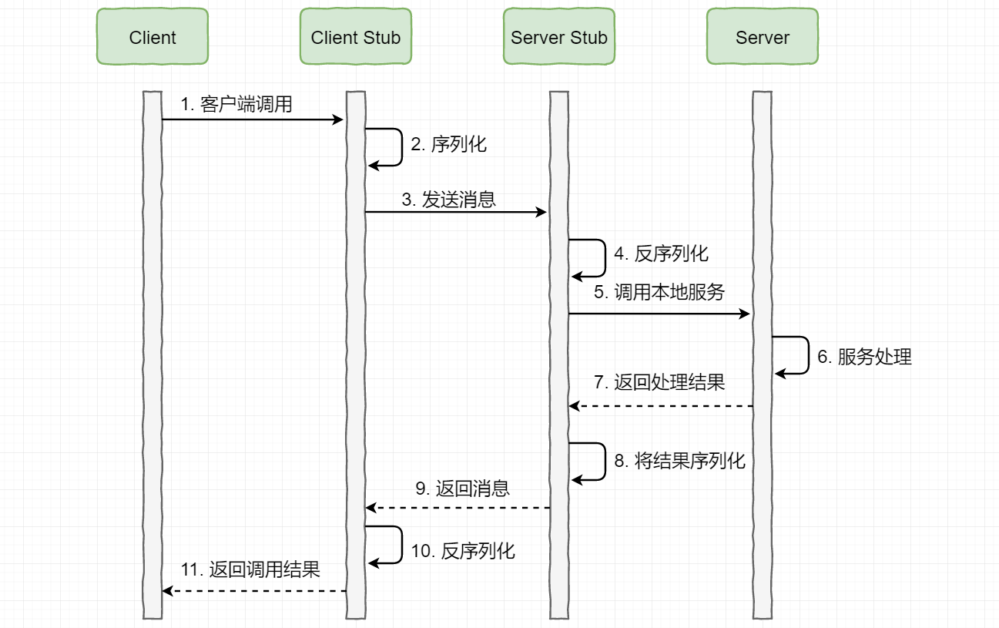

[TOC]

### RPC

#### 基础

##### 1. 概述

RPC（Remote Procedure Call）即**远程过程调用**，它是一种通过网络从远程计算机程序上请求服务，而不需要了解底层网络技术的协议。比如两个不同的服务 A、B 部署在两台不同的机器上，那么服务 A 如果想要调用服务 B 中的某个方法该怎么办呢？使用 HTTP 请求当然可以，但是可能会比**较慢而且一些优化做的并不好**。 RPC 的出现就是为了解决这个问题。

**RPC 让分布式或者微服务系统中不同服务之间的调用像本地调用一样简单。**

##### 2. RPC基本原理

图示如下：

1. **服务消费方**（client）调用**以本地调用方式调用服务**。
2. client stub 接收到**调用后负责将方法、参数等组装成能够进行网络传输的消息体**。
3. client stub 找到**服务地址**，并将消息发送到**服务端**。
4. server stub 收到消息后进行**解码**。
5. server stub 收到消息后进行解码；
6. server stub 根据**解码结果调用本地的服务**。
7. 本地服务**执行并将结果返回给 server stub**。
8. server stub 将返回结果**打包成消息并发送至消费方**。
9. client stub **接收到消息，并进行解码**。
10. 服务消费方得到最终结果。

下面再来一个时序图：

##### 3. 常见的RPC框架

成熟的 RPC 框架还提供好了“服务自动注册与发现”、"智能负载均衡"、“可视化的服务治理和运维”、“运行期流量调度”等等功能，这些也算是选择 RPC 进行服务注册和发现的一方面原因。

- **RMI（JDK自带）：** JDK 自带的 RPC，有很多局限性，不推荐使用。
- **Dubbo**：Dubbo 是 阿里巴巴公司开源的一个高性能优秀的服务框架，使得应用可通过高性能的 RPC 实现服务的输出和输入功能，可以和 Spring 框架无缝集成。目前 Dubbo 已经成为 **Spring Cloud Alibaba** 中的官方组件。
- **gRPC**：gRPC 是可以在**任何环境**中运行的现代开源高性能 RPC 框架。它可以通过可插拔的支持来有效地连接数据中心内和跨数据中心的服务，以实现负载平衡，跟踪，运行状况检查和身份验证。它也适用于分布式计算的最后一英里，以将设备，移动应用程序和浏览器连接到后端服务。

- **Hessian**：Hessian 是一个轻量级的 remotingonhttp 工具，使用简单的方法提供了 RMI 的功能。 相比WebService，Hessian 更简单、快捷。采用的是二进制RPC协议，因为采用的是二进制协议，所以它很适合于发送二进制数据。
- **Thrift**：Apache Thrift 是 Facebook 开源的跨语言的 RPC 通信框架，目前已经捐献给 Apache 基金会管理，由于其跨语言特性和出色的性能，在很多互联网公司得到应用，有能力的公司甚至会基于 thrift 研发一套分布式服务框架，增加诸如服务注册、服务发现等功能。

##### 4. HTTP与RPC

RPC 只是一种**概念、一种设计**，就是为了解决 **不同服务之间的调用问题**, 它一般会包含有 **传输协议** 和 **序列化协议** 这两个。

但是，HTTP  是**一种协议**，RPC框架**可以使用 HTTP 协议作为传输协议**或者直接使用 TCP 作为传输协议，使用不同的协议一般也是为了**适应不同的场景**。

很多文章中还会提到说 HTTP 协议相较于自定义 TCP 报文协议，增加的开销在于连接的建立与断开，但是这个观点已经被否认，下面截取自知乎中一个回答，原回答地址：https://www.zhihu.com/question/41609070/answer/191965937。

>首先要否认一点 HTTP 协议相较于自定义 TCP 报文协议，增加的开销在于连接的建立与断开。HTTP 协议是支持连接池复用的，也就是建立一定数量的连接不断开，并不会频繁的创建和销毁连接。二一要说的是 HTTP 也可以使用 Protobuf 这种二进制编码协议对内容进行编码，因此二者最大的区别还是在传输协议上。

