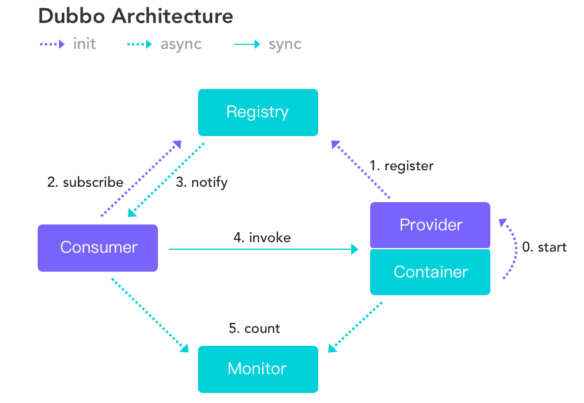

[TOC]

### Dubbo

Dubbo 官网：http://dubbo.apache.org/zh-cn/index.html

Dubbo 中文文档： http://dubbo.apache.org/zh-cn/index.html

#### 基础

##### 1. 概述

Apache **Dubbo** 是一款高性能、轻量级的开源 **RPC 框架**，它提供了三大核心能力：**面向接口的远程方法调用**，**智能容错和负载均衡**，**以及服务自动注册和发现**。简单来说 Dubbo 是一个**分布式服务框架**，致力于提供高性能和透明化的 RPC 远程服务调用方案，以及 SOA 服务治理方案。

Dubbo 的诞生和 **SOA 分布式架构**的流行有着莫大的关系。SOA **面向服务的架构**（Service Oriented Architecture），也就是把工程按照业务逻辑拆分成**服务层、表现层**两个工程。服务层中包含业务逻辑，只需要对外提供服务即可。表现层只需要处理和页面的交互，业务逻辑都是调用服务层的服务来实现。SOA 架构中有两个主要角色：**服务提供者**（Provider）**和服务使用者**（Consumer）。


**如果要开发分布式程序，可以直接基于 HTTP 接口进行通信，但是为什么要用 Dubbo？**

主要可以从 Dubbo 提供的下面**四点特性**来说为什么要用 Dubbo：

1. **负载均衡**：同一个服务部署在不同的机器时该调用那一台机器上的服务。
2. **服务调用链路生成**：随着系统的发展，服务越来越多，服务间依赖关系变得错踪复杂，甚至分不清哪个应用要在哪个应用之前启动，架构师都不能完整的描述应用的架构关系。Dubbo 可以解决服务之间互相调用问题。
3. **服务访问压力以及时长统计、资源调度和治理**：基于访问压力实时管理集群容量，提高集群利用率。
4. **服务降级**：某个服务挂掉之后调用备用服务。

另外，Dubbo 除了能够应用在分布式系统中，也可以应用在现在比较火的**微服务系统**中。不过，由于 Spring Cloud 在微服务中应用更加广泛，所以一般提 Dubbo 的话，大部分是分布式系统的情况。

#### Dubbo架构

##### 1. 架构图解

架构图如下：



**节点说明：**

- **Provider**：暴露服务的服务提供方。
- **Consumer**：调用远程服务的服务消费方。
- **Registry**：服务注册与发现的注册中心。
- **Monitor**：统计服务的调用次数和调用时间的监控中心。
- **Container**：服务运行容器。

**调用关系：**

1. 服务容器负责启动，加载，运行服务提供者。
2. 服务提供者在启动时，向注册中心注册自己提供的服务。
3. 服务消费者在启动时，向注册中心订阅自己所需的服务。
4. 注册中心返回服务提供者地址列表给消费者，如果有变更，注册中心将基于长连接推送变更数据给消费者。
5. 服务消费者，从提供者地址列表中，基于软负载均衡算法，选一台提供者进行调用，如果调用失败，再选另一台调用。
6. 服务消费者和提供者，在内存中累计调用次数和调用时间，定时每分钟发送一次统计数据到监控中心。

**要点总结：**

- **注册中心负责服务地址的注册与查找，相当于目录服务，服务提供者和消费者只在启动时与注册中心交互，注册中心不转发请求，压力较小**。
- **监控中心负责统计各服务调用次数，调用时间等，统计先在内存汇总后每分钟一次发送到监控中心服务器，并以报表展示**。
- **注册中心，服务提供者，服务消费者三者之间均为长连接，监控中心除外**。
- **注册中心通过长连接感知服务提供者的存在，服务提供者宕机，注册中心将立即推送事件通知消费者**。
- **注册中心和监控中心全部宕机，不影响已运行的提供者和消费者，消费者在本地缓存了提供者列表**。
- **注册中心和监控中心都是可选的，服务消费者可以直连服务提供者**。
- **服务提供者无状态，任意一台宕掉后，不影响使用**。
- **服务提供者全部宕掉后，服务消费者应用将无法使用，并无限次重连等待服务提供者恢复**。

##### 2. Dubbo分层工作原理


图中从下至上分为**十层**，各层均为**单向依赖**，右边的黑色箭头代表层之间的依赖关系，每一层都可以剥离上层被复用，其中，Service 和 Config 层为 **API**，其它各层均为 **SPI**。

**各层说明**：

- 第一层：**service层**，接口层，给服务提供者和消费者来实现的。
- 第二层：**config层**，配置层，主要是对 Dubbo 进行各种配置的。
- 第三层：**proxy层**，服务接口透明代理，生成服务的客户端 Stub 和服务器端 Skeleton。
- 第四层：**registry层**，服务注册层，负责服务的注册与发现。
- 第五层：**cluster层**，集群层，封装多个服务提供者的路由以及负载均衡，将多个实例组合成一个服务。
- 第六层：**monitor层**，监控层，对 RPC 接口的调用次数和调用时间进行监控。
- 第七层：**protocol层**，远程调用层，封装 RPC 调用。
- 第八层：**exchange层**，信息交换层，封装请求响应模式，同步转异步。
- 第九层：**transport层**，网络传输层，抽象 Mina 和 Netty 为统一接口。
- 第十层：**serialize层**，数据序列化层，网络传输需要。


#### Dubbo负载均衡

##### 1. 负载均衡

负载均衡改善了跨多个计算资源（例如计算机，计算机集群，网络链接，中央处理单元或磁盘驱动的的工作负载分布。负载平衡旨在优化资源使用，最大化吞吐量，最小化响应时间，并避免任何单个资源的过载。使用具有负载平衡而不是单个组件的多个组件可以通过冗余提高可靠性和可用性。负载平衡通常涉及专用软件或硬件。

负载均衡就是为了避免单个服务器响应同一请求，容易造成服务器宕机、崩溃等问题。

##### 2. Dubbo负载均衡策略

在集群负载均衡时，Dubbo 提供了**多种均衡策略**，默认为 **random 随机调用**。可以自行扩展负载均衡策略。

###### (1) 基于权重的随机负载均衡机制

默认的策略，基于权重的随机负载均衡机制。在一个截面上碰撞的概率高，但调用量越大分布越均匀，而且按概率使用权重后也比较均匀，有利于动态调整提供者权重。

###### (2) 基于权重的轮询负载均衡机制

**不推荐**。轮循，按公约后的权重设置轮循比率。存在慢的提供者累积请求的问题，比如：第二台机器很慢，但没挂，当请求调到第二台时就卡在那，久而久之，所有请求都卡在调到第二台上。

###### (3) 最少活跃调用数机制

最少活跃调用数，相同活跃数的随机，活跃数指调用前后计数差。使慢的提供者收到更少请求，因为越慢的提供者的调用前后计数差会越大。

###### (4) 一致性哈希机制

相同参数的请求总是发到同一提供者。如果需要的不是随机负载均衡，是要一类请求都到一个节点，那就用这个一致性hash策略。当某一台提供者挂时，原本发往该提供者的请求，基于虚拟节点，平摊到其它提供者，不会引起剧烈变动。

##### 3. 负载均衡的配置

###### (1)Xml 配置

服务端服务级别

```java
<dubbo:service interface="..." loadbalance="roundrobin" />
```

客户端服务级别

```java
<dubbo:reference interface="..." loadbalance="roundrobin" />
```

服务端方法级别

```java
<dubbo:service interface="...">
    <dubbo:method name="..." loadbalance="roundrobin"/>
</dubbo:service>
```

客户端方法级别

```java
<dubbo:reference interface="...">
    <dubbo:method name="..." loadbalance="roundrobin"/>
</dubbo:reference>
```

###### (2) 注解配置方式

消费方基于基于注解的服务级别配置方式：

```java
@Reference(loadbalance = "roundrobin")
HelloService helloService;
```


#### Dubbo通信协议

##### 1. Dubbo通信协议

###### (1) Dubbo协议

**默认**就是 Dubbo 协议，**单一长连接**，进行的是 **NIO 异步通**信，基于 Hessian 作为**序列化协议**。使用的场景是：**传输数据量小**（每次请求在 100kb 以内），但是**并发量很高**。

为了要支持高并发场景，一般是服务提供者就几台机器，但是服务消费者有上百台，可能每天调用量达到上亿次！此时用**长连接**是最合适的，就是跟每个服务消费者维持一个长连接就可以，可能总共就 100 个连接。然后后面直接基于长连接 NIO 异步通信，可以**支撑高并发请求**。长连接，通俗点说，就是建立连接过后可以持续发送请求，无须再建立连接。


而短连接，每次要发送**请求之前，需要先重新建立一次连接**。


###### (2) RMI协议

走 Java 二进制序列化，多个短连接，适合消费者和提供者数量差不多的情况，适用于文件的传输，一般较少用。

###### (3) Hessian协议

走 hessian 序列化协议，多个短连接，适用于提供者数量比消费者数量还多的情况，适用于文件的传输，一般较少用。

###### (4) HTTP协议

走表单序列化。

###### (5) WebService

走 SOAP 文本序列化。

##### 2. Dubbo序列化协议

Dubbo 支持 Hession、Java 二进制序列化、JSON、SOAP 文本序列化多种序列化协议。但是 **Hessian 是其默认的序列化协议**。


#### 集群容错策略

##### 1. Failover Cluster模式

失败自动切换，自动重试其他机器，**默认**就是这个，常见于读操作。可以通过以下几种方式配置重试次数：

``` xml
<dubbo:service retries="2" />
```

或者

``` xml
<dubbo:reference retries="2" />
```

或者

``` xml
<dubbo:reference>
    <dubbo:method name="findFoo" retries="2" />
</dubbo:reference>
```

##### 2. Failfast Cluster模式

一次调用失败就立即失败，常见于**非幂等性的写操作**，比如新增一条记录（调用失败就立即失败）

##### 3. Failsafe Cluster模式

出现异常时忽略掉，常用于不重要的接口调用，比如记录日志。配置示例如下：

``` xml
<dubbo:service cluster="failsafe" />
```

或者

``` xml
<dubbo:reference cluster="failsafe" />
```

##### 4. Failback Cluster模式

失败了后台自动记录请求，然后定时重发，比较适合于写消息队列这种。

##### 5. Forking Cluster模式

**并行调用**多个 provider，只要一个成功就立即返回。常用于实时性要求比较高的读操作，但是会浪费更多的服务资源，可通过 **forks="2"** 来设置最大并行数。

##### 6. Broadcast Cluster模式

**逐个调用**所有的 provider。任何一个 provider 出错则报错（从 `2.1.0` 版本开始支持）。通常用于通知所有提供者更新缓存或日志等本地资源信息。

关于 dubbo 集群容错策略更加详细的描述，可以查看官网 http://dubbo.apache.org/zh-cn/docs/source_code_guide/cluster.html 。


#### Dubbo SPI

##### 1.概述

SPI 就是 service provider interface。比如一个接口有 3 个实现类，那么在系统运行的时候对这个接口到底选择哪个实现类？这就需要 SPI了，**需要根据指定的配置或者是默认的配置，去找到对应的实现类加载进来，然后用这个实现类的实例对象。**

举个栗子。有一个接口 A。A1/A2/A3 分别是接口 A 的不同实现。通过配置 **接口 A = 实现 A2**，那么在系统实际运行的时候，会加载配置，用**实现 A2 实例化一个对象来提供服务**。

SPI 机制一般用在哪儿？**插件扩展的场景**，比如开发了一个给别人使用的开源框架，如果想让别人自己写个插件，放到自己的开源框架里面，从而扩展某个功能，这个时候 SPI 思想就用上了。

##### 2.Java SPI思想

SPI 经典的思想体现，大家平时都在用，比如说 **jdbc**。Java 定义了一套 jdbc 的接口，但是 Java 并没有提供 jdbc 的实现类。但是实际上项目跑的时候，要使用 jdbc 接口的哪些实现类呢？一般来说要根据自己使用的数据库，比如 MySQL，就将 mysql-jdbc-connector.jar 引入。在系统运行的时候，碰到使用 jdbc 的接口，会在底层使用引入的那个 jar 中提供的实现类。

##### 3. Dubbo的SPI思想

Dubbo 也用了 SPI 思想，不过没有用 JDK 的 SPI 机制，是自己实现的一套 SPI 机制。

``` java
Protocol protocol = ExtensionLoader.getExtensionLoader(Protocol.class).getAdaptiveExtension();
```

Protocol 接口在系统运行的时候，Dubbo 会判断一下应该选用这个 **Protocol 接口的哪个实现类来实例化对象**来使用。

它会去找一个配置的 Protocol，将配置的 Protocol 实现类，加载到 JVM 中来，然后实例化对象，就用的那个 Protocol 实现类就可以了。

上面那行代码就是 Dubbo 里大量使用的，就是对很多组件，都是保留一个接口和多个实现，然后在系统运行的时候动态根据配置去找到对应的实现类。如果没配置，那就走默认的实现。

``` java
@SPI("dubbo")  
public interface Protocol {  

    int getDefaultPort();  

    @Adaptive  
    <T> Exporter<T> export(Invoker<T> invoker) throws RpcException;  

    @Adaptive  
    <T> Invoker<T> refer(Class<T> type, URL url) throws RpcException;  
    
    void destroy();  
}  
```

在 Dubbo 自己的 jar 里，在 **/META_INF/dubbo/internal/com.alibaba.dubbo.rpc.Protocol** 文件中：

``` xml
dubbo=com.alibaba.dubbo.rpc.protocol.dubbo.DubboProtocol
http=com.alibaba.dubbo.rpc.protocol.http.HttpProtocol
hessian=com.alibaba.dubbo.rpc.protocol.hessian.HessianProtocol
```

所以说，这就看到了 dubbo 的 SPI 机制默认是怎么玩儿的了，其实就是 Protocol 接口， **@SPI("dubbo")** 说的是，通过 SPI 机制来提供实现类，实现类是通过 dubbo 作为默认 key 去配置文件里找到的，配置文件名称与接口全限定名一样的，通过 dubbo 作为 key 可以找到默认的实现类就是 **com.alibaba.dubbo.rpc.protocol.dubbo.DubboProtocol** 。

如果想要动态替换掉默认的实现类，需要使用 **@Adaptive 接口**，Protocol 接口中，有两个方法加了 **@Adaptive** 注解，就是说那俩接口会被代理实现。

比如这个 Protocol 接口搞了俩 `@Adaptive` 注解标注了方法，在运行的时候会针对 Protocol 生成代理类，这个代理类的那俩方法里面会有代理代码，代理代码会在运行的时候动态根据 url 中的 protocol 来获取那个 key，默认是 dubbo，你也可以自己指定，你如果指定了别的 key，那么就会获取别的实现类的实例了。

##### 4. 如何自己扩展dubbo中的组件

自己写个工程，要是那种可以**打成 jar 包**的，里面的 **src/main/resources** 目录下，搞一个 **META-INF/services** ，里面放个文件叫： **com.alibaba.dubbo.rpc.Protocol** ，文件里搞一个 my=com.bingo.MyProtocol 。自己把 jar 弄到 nexus 私服里去。

然后自己搞一个 **dubbo provider 工程**，在这个工程里面依赖自己的那个 jar，然后在 spring 配置文件里给个配置：

``` xml
<dubbo:protocol name=”my” port=”20000” />
```

provider 启动的时候，就会加载到 jar 包里的 **my=com.bingo.MyProtocol 这行配置**里，接着会根据自己的配置使用定义好的 MyProtocol 了，这个就是简单说明一下，通过上述方式，可以替换掉大量的 dubbo 内部的组件，就是扔个自己的 jar 包，然后配置一下即可。


dubbo 里面提供了大量的类似上面的扩展点，就是说如果要扩展一个东西，只要自己写个 jar，让 consumer 或者是 provider 工程，依赖自己的那个 jar，在自己的 jar 里指定目录下配置好接口名称对应的文件，里面通过 **key=实现类** 。

然后对于对应的组件，类似 **\<dubbo:protocol>** 用自己的那个  key 对应的实现类来实现某个接口，可以自己去扩展 dubbo 的各种功能，提供自己的实现。


#### Zookeeper宕机与Dubbo直连

在实际生产中，假如 Zookeeper 注册中心**宕机**，一段时间内服务消费方**还是能够调用提供方的服务的**，实际上它使用的**本地缓存进行通讯**，这只是 Dubbo 健壮性的一种体现。

**Dubbo 健壮性的表现：**

1. 监控中心宕掉不影响使用，只是丢失部分采样数据。
2. 数据库宕掉后，注册中心仍能通过缓存提供服务列表查询，但不能注册新服务。
3. 注册中心对等集群，任意一台宕掉后，将自动切换到另一台。
4. 注册中心全部宕掉后，服务提供者和服务消费者仍能通过本地缓存通讯。
5. 服务提供者无状态，任意一台宕掉后，不影响使用。
6. 服务提供者全部宕掉后，服务消费者应用将无法使用，并无限次重连等待服务提供者恢复。

注册中心负责服务地址的注册与查找，相当于目录服务，服务提供者和消费者只在启动时与注册中心交互，注册中心不转发请求，压力较小。所以可以**完全可以绕过注册中心**：采用 **dubbo 直连** ，即在服务消费方配置服务提供方的位置信息。

**Xml 配置方式：**

```xml
<dubbo:reference id="userService" interface="com.zang.gmall.service.UserService" url="dubbo://localhost:20880" />
```

**注解方式：**

```java
 @Reference(url = "127.0.0.1:20880")   
 HelloService helloService;
```


