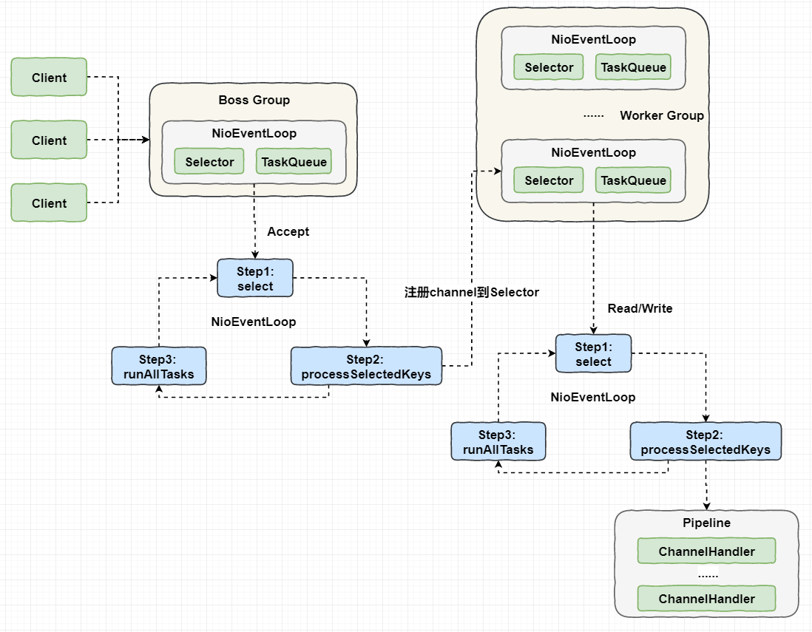
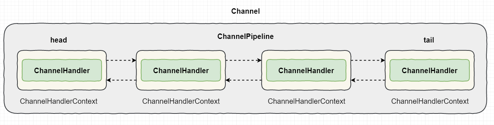
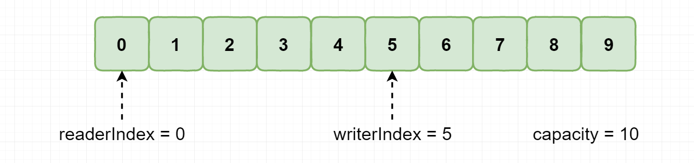
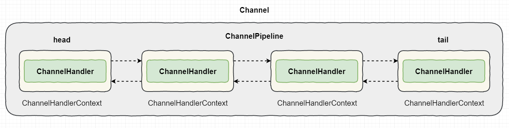
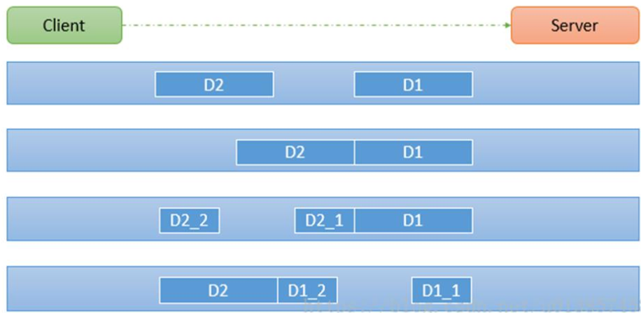
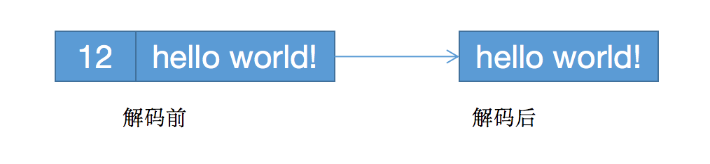
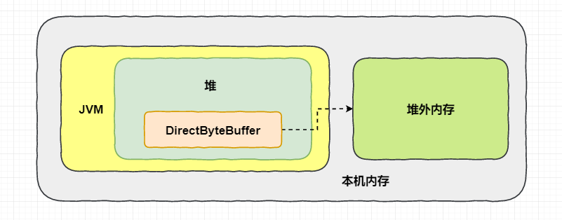
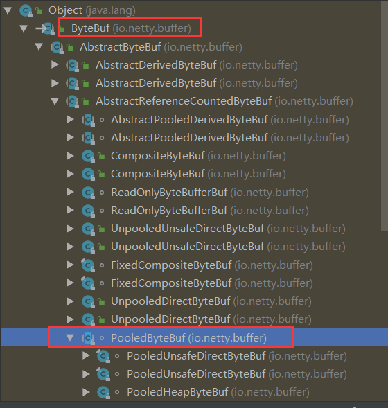
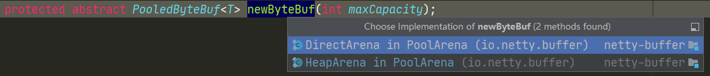

[TOC]

### Netty核心功能与线程模型

Netty 是一个**异步的事件驱动**的**网络**应用**框架**。

#### Netty基础

##### 1. 概述

**Java NIO 的类库**和 API 繁杂，需要熟练掌握 Selector、 ServerSocketChannel、 SocketChannel、 ByteBuffer等，使用非常麻烦。 且开发工作量和难度都非常大： 例如客户端面临断线重连、 网络闪断、心跳处理、半包读写、 网络拥塞和异常流的处理等等。

**Netty 对 JDK 自带的 NIO 的 API 进行了良好的封装**，解决了上述问题。且 Netty 拥有高性能、 吞吐量更高，延迟更低，减少资源消耗，**最小化不必要的内存复制**等优点。Netty 现在都在用的是 **4.x**，5.x 版本已经废弃，Netty 4.x 需要 JDK 6 以上版本支持。

##### 2. Netty使用场景

- **RPC**：在分布式系统中，各个节点之间需要**远程服务调用**，高性能的 **RPC 框架**必不可少，Netty 作为**异步高性能的通信框架**，往往作为基础通信组件被这些 RPC 框架使用。典型的应用有：阿里分布式服务框架 **Dubbo** 的 RPC 框架使用 Dubbo 协议进行节点间通信，Dubbo 协议默认使用 Netty 作为基础通信组件，用于实现。各进程节点之间的内部通信。**RocketMQ 底层**也是用的 Netty 作为**基础通信组件**。经典的 **Hadoop** 的高性能通信和序列化组件 **Avro 的 RPC 框架**，默认采用 Netty 进行跨界点通信，它的 Netty Service 基于 Netty 框架二次封装实现。

- **游戏服务器**：无论是手游服务端还是大型的网络游戏，Java 语言得到了越来越广泛的应用。Netty 作为高性能的基础通信组件，它本身提供了 TCP/UDP 和 HTTP 协议栈。

Netty 相关开源项目：https://netty.io/wiki/related-projects.html

#### Netty线程模型

##### 1. 线程模型架构图

可以先理解下《Scalable IO in Java》这篇文章里说的一些 IO 处理模式，Netty 的**线程模型**如下图所示：



对比 NIO 的线程模型，NIO 的模型其实就一个 **Selector 同时需要处理连接事件和读写事件**。如果读写事件太多造成积压，这就造成连接事件得不到及时处理。一种升级的模型其实可以理解成有**两个 Selector**，一个专门用于处理连接事件，一个专门用于处理读写事件。所以一个 Selector 连接建立后，获取**通道并注册到另一个 Selector 上**，专门用于读写事件，这样就舒服多了。这种就可以成为**一主一从**结构。

其实 Netty 一般情况是 **一主多从**架构。可以**设置有多个 Selector**。也可以是**多主多从**架构。

##### 2. 线程模型解释

Netty 抽象出**两组线程池** **BossGroup** 和 **WorkerGroup**，BossGroup 专门负责接收**客户端的连接**，WorkerGroup 专门**负责网络的读写**。

BossGroup 和 WorkerGroup 类型都是 **NioEventLoopGroup**。NioEventLoopGroup 相当于一个**事件循环线程组**，这个组中含有多个事件循环线程， 每一个事件循环线程是 **NioEventLoop**。一个 **NioEventLoop 可以理解为一个线程**。每个 NioEventLoop **都有一个 selector**，相当于一个线程就有一个 Selector，用于监听注册在其上的 socketChannel 的网络通讯。

每个 **Boss  NioEventLoop 线程**内部循环执行的步骤有 3 步：

- 处理 **==accept 事件==** , 与 client 建立连接 , 生成 **NioSocketChannel 通道**。
- 将 **NioSocketChannel** **注册到某个 Worker NioEventLoop 的 selector 之上**。
- 处理**任务队列**的任务 ， 即 runAllTasks。

每个 **Worker  NioEventLoop** 线程循环执行的步骤：

- **轮询注册**到自己 **Selector** 上的所有 **NioSocketChannel** 的 **read, write** 事件（只处理读写事件）。
- 处理 I/O 事件， 即 **read , write 事件**， 并在对应 **NioSocketChannel** 处理业务。
- runAllTasks 处理**任务队列 TaskQueue 的任务** ，一些耗时的业务处理一般可以放入 **TaskQueue** 中慢慢处理，这样不影响数据在 **pipeline** 中的流动处理。

每个 Worker NIOEventLoop 处理 **NioSocketChannel** 业务时，会使用 **pipeline** (管道)，管道中维护了很多 **handler** 处理器用来处理 channel 中的数据。

注意：一个 NioEventLoop 就是一个**线程池**，只不过里面只有**一个**线程，**每个线程**都有一个 **TaskQueue**，用于执行比较耗时的任务。


#### Netty模块组件

##### 1. Bootstrap、ServerBootstrap

Bootstrap 意思是**引导类**，一个 Netty 应用通常由一个 Bootstrap 开始，主要作用是**配置整个 Netty 程序并串联各个组件**。**Bootstrap** 类是**客户端启动引导类**，**ServerBootstrap** 是**服务端启动引导类**。

##### 2. Future、ChannelFuture

Netty 中所有的 IO 操作都是**异步**的，不能立刻得知消息是否被正确处理。但是可以过一会等它执行完成或者直接注册一个监听，具体的实现就是通过 **Future 和 ChannelFutures** 注册一个监听，当**操作执行成功或失败时监听会自动触发注册的监听事件**。

##### 3. Channel

Netty 网络通信的组件，能够用于执行网络 I/O 操作。Channel 为用户提供：

- 当前网络连接的**通道的状态**（例如是否打开？是否已连接？）
- 网络连接的**配置参数** （例如接收缓冲区大小）
- 提供异步的**网络 I/O 操作**(如建立连接，读写，绑定端口)，异步调用意味着任何 I/O 调用都将立即返回，并且不保证在调用结束时所请求的 I/O 操作已完成。
- 调用立即返回一个 **ChannelFuture** 实例，通过注册监听器到 **ChannelFuture** 上，可以 I/O 操作成功、失败或取消时回调通知调用方。
- 支持关联 I/O 操作与对应的处理程序。

**不同协议、不同的阻塞类型的连接都有不同的 Channel 类型与之对应。**

下面是一些常用的 Channel 类型：

```java
NioSocketChannel // 异步的客户端 TCP Socket连接
NioServerSocketChannel 	// 异步的服务器端TCP Socket连接
NioDatagramChannel		// 异步的UDP连接
NioSctpChannel	// 异步的客户端 Sctp 连接
NioSctpServerChannel	// 异步的Sctp服务器端连接，这些通道涵盖了UDP和TCP网络IO以及文件IO
```

##### 4. Selector

Netty 基于 **Selector 对象实现 I/O 多路复用**，通过 **Selector 一个线程可以监听多个连接的 Channel 事件**。当向一个 **Selector 中注册 Channel 后**，Selector 内部的机制就可以**自动不断地查询(Select) 这些注册的 Channel** 是否有**已就绪的 I/O 事件**（例如可读，可写，网络连接完成等），这样程序就可以很简单地使用**一个线程**高效地管理多个 Channel 。

##### 5. NioEventLoop

NioEventLoop 维护了**一个线程和任务队列**，支持异步提交执行任务，线程启动时会调用 NioEventLoop 的 **run 方法**，执行 I/O 任务和非 I/O 任务：

- **IO 任务**，即 **selectionKey** 中 ready 的事件，如 **accept、connect、read、write** 等，由 **processSelectedKeys** 方法触发。

- **非 IO 任务**，添加到 **taskQueue** 中的任务，如 **register0、bind0** 等任务，由 **runAllTasks 方法触发**。

##### 6. NioEventLoopGroup

NioEventLoopGroup 主要管理 **EventLoop 的生命周期**，可以理解为一个**线程池**，内部维护了**一组线程**，每个线程(NioEventLoop)负责处理**多个 Channel 上的事件**，而**一个 Channel 只对应于一个线程**。

##### 7. ChannelHandler

**ChannelHandler** 是一个**接口**，**处理 I/O 事件或拦截 I/O 操作**，并将其**转发到其 ChannelPipeline**(业务处理链)中的下一个处理程序。

ChannelHandler 本身并没有提供很多方法，因为这个接口有许多的方法需要实现。为了使用方便可以继承它的**子类**：

```java
ChannelInboundHandler 	// 用于处理入站I/O事件
ChannelOutboundHandler 	// 用于处理出站I/O操作
```

或者使用以下**适配器**类：

```java
ChannelInboundHandlerAdapter  // 用于处理入站I/O事件
ChannelOutboundHandlerAdapter // 用于处理出站I/O操作
```

##### 8. ChannelHandlerContext

保存 **Channel 相关**的**所有上下文信息**，同时关联一个 **ChannelHandler 对象**。

##### 9. ChannelPipline

用于**保存 ChannelHandler 的 List**，用于**处理或拦截 Channel 的入站事件和出站操作**。ChannelPipeline 实现了一种**高级形式的拦截过滤器模式**，使用户可以完全控制事件的处理方式，以及 Channel 中各个的 ChannelHandler 如何**相互交互**。

在 Netty 中**每个 Channel 都有且仅有一个 ChannelPipeline 与之对应**，它们的组成关系如下： 



一个 Channel 包含了一个 **ChannelPipeline**，而 ChannelPipeline 中又维护了一个由 **ChannelHandlerContext** 组成的**双向链表**，并且每个 ChannelHandlerContext 中又**关联着一个 ChannelHandler**。

**read** 事件(入站事件)和 **write** 事件(出站事件)在一个**双向链表**中，**入站**事件会从链表 **head 往后传递**到最后一个入站的 handler，**出站**事件会从链表 **tail 往前传递**到最前一个出站的 handler，**两种类型的 handler 互不干扰**。

#### 基于Netty的简单客户端服务器实现

Netty 的 maven 依赖：

```xml
<dependency>
    <groupId>io.netty</groupId>
    <artifactId>netty-all</artifactId>
    <version>4.1.35.Final</version>
</dependency>
```

**服务端代码**：

```java
public class NettyServer {

    public static void main(String[] args) throws Exception {
        // 创建两个线程组bossGroup和workerGroup, 含有的子线程NioEventLoop的个数默认为cpu核数的两倍
        // bossGroup只是处理连接请求 ,真正的和客户端业务处理，会交给workerGroup完成
        EventLoopGroup bossGroup = new NioEventLoopGroup(10);
        // 这里设置有10个Selector
        EventLoopGroup workerGroup = new NioEventLoopGroup(10);
        try {
            // 创建服务器端的启动对象
            ServerBootstrap bootstrap = new ServerBootstrap();
            // 使用链式编程来配置参数
            // 设置两个线程组
            bootstrap.group(bossGroup, workerGroup)
                // 使用NioServerSocketChannel作为服务器的通道实现
                .channel(NioServerSocketChannel.class)
                // 初始化服务器连接队列大小，服务端处理客户端连接请求是顺序处理的,所以同一时间只能处理一个客户端连接。
                // 多个客户端同时来的时候,服务端将不能处理的客户端连接请求放在队列中等待处理
                .option(ChannelOption.SO_BACKLOG, 1024)
                // 创建通道初始化对象，设置初始化参数 这个SocketChannel是Netty里面的，不是NIO里面那个
                .childHandler(new ChannelInitializer<SocketChannel>() {
                    // 可以把下面的理解为一个回调函数
                    @Override
                    protected void initChannel(SocketChannel ch) throws Exception {
                        // 对workerGroup的SocketChannel设置处理器
                        ch.pipeline().addLast(new NettyServerHandler());
                    }
                });
            System.out.println("netty server start。。");
            // 绑定一个端口并且同步, 生成了一个ChannelFuture异步对象，通过isDone()等方法可以判断异步事件的执行情况
            // 启动服务器(并绑定端口)，bind是异步操作，sync方法是等待异步操作执行完毕
            ChannelFuture cf = bootstrap.bind(9000).sync();
            // 给cf注册监听器，监听我们关心的事件
            /*cf.addListener(new ChannelFutureListener() {
                @Override
                public void operationComplete(ChannelFuture future) throws Exception {
                    if (cf.isSuccess()) {
                        System.out.println("监听端口9000成功");
                    } else {
                        System.out.println("监听端口9000失败");
                    }
                }
            });*/
            // 对通道关闭进行监听，closeFuture是异步操作，监听通道关闭
            // 通过sync方法同步等待通道关闭处理完毕，这里会阻塞等待通道关闭完成
            cf.channel().closeFuture().sync();
        } finally {
            bossGroup.shutdownGracefully();
            workerGroup.shutdownGracefully();
        }
    }
}
```

服务端 Handler：

```java
/**
 * 自定义Handler需要继承netty规定好的某个HandlerAdapter(规范)
 * @author cz
 */
public class NettyServerHandler extends ChannelInboundHandlerAdapter {

    /**
     * 读取客户端发送的数据
     *
     * @param ctx 上下文对象,含有通道channel,管道pipeline
     * @param msg 就是客户端发送的数据
     * @throws Exception Exception
     */
    @Override
    public void channelRead(ChannelHandlerContext ctx, Object msg) throws Exception {
        System.out.println("服务器读取线程 " + Thread.currentThread().getName());
        //Channel channel = ctx.channel();
        //ChannelPipeline pipeline = ctx.pipeline(); //本质是一个双向链接, 出站入站
        // 将msg转成一个ByteBuf，类似NIO的ByteBuffer
        ByteBuf buf = (ByteBuf) msg;
        System.out.println("客户端发送消息是:" + buf.toString(CharsetUtil.UTF_8));
    }

    /**
     * 数据读取完毕处理方法 说明上一个channelRead方法读完
     *
     * @param ctx 上下文
     * @throws Exception Exception
     */
    @Override
    public void channelReadComplete(ChannelHandlerContext ctx) throws Exception {
        // 上一个方法执行完之后写数据到客户端
        ByteBuf buf = Unpooled.copiedBuffer("HelloClient".getBytes(CharsetUtil.UTF_8));
        ctx.writeAndFlush(buf);
    }

    /**
     * 处理异常, 一般是需要关闭通道
     *
     * @param ctx 上下文
     * @param cause 异常原因
     * @throws Exception Exception
     */
    @Override
    public void exceptionCaught(ChannelHandlerContext ctx, Throwable cause) throws Exception {
        ctx.close();
    }
}
```

客户端代码：

```java
/**
 * Netty客户端
 * @author cz
 */
public class NettyClient {
    public static void main(String[] args) throws Exception {
        // 客户端需要一个事件循环组
        EventLoopGroup group = new NioEventLoopGroup();
        try {
            // 创建客户端启动对象
            // 注意客户端使用的不是ServerBootstrap而是Bootstrap
            Bootstrap bootstrap = new Bootstrap();
            // 设置相关参数 // 设置线程组
            bootstrap.group(group)
                    // 使用NioSocketChannel作为客户端的通道实现
                    .channel(NioSocketChannel.class)
                    .handler(new ChannelInitializer<SocketChannel>() {
                        @Override
                        protected void initChannel(SocketChannel ch) throws Exception {
                            // 加入处理器
                            ch.pipeline().addLast(new NettyClientHandler());
                        }
                    });

            System.out.println("netty client start。。");
            // 启动客户端去连接服务器端
            ChannelFuture cf = bootstrap.connect("127.0.0.1", 9000).sync();
            // 对通道关闭进行监听
            cf.channel().closeFuture().sync();
        } finally {
            group.shutdownGracefully();
        }
    }
}
```

客户端 Handler：

```java
/**
 * 客户端处理类
 * @author cz
 */
public class NettyClientHandler extends ChannelInboundHandlerAdapter {

    /**
     * 当客户端连接服务器完成就会触发该方法
     *
     * @param ctx 上下文
     * @throws Exception Exception
     */
    @Override
    public void channelActive(ChannelHandlerContext ctx) throws Exception {
        ByteBuf buf = Unpooled.copiedBuffer("HelloServer".getBytes(CharsetUtil.UTF_8));
        ctx.writeAndFlush(buf);
    }

    /**
     * 当通道有读取事件时会触发，即服务端发送数据给客户端
     *
     * @param ctx 上下文
     * @param msg 消息
     * @throws Exception Exception
     */
    @Override
    public void channelRead(ChannelHandlerContext ctx, Object msg) throws Exception {
        ByteBuf buf = (ByteBuf) msg;
        System.out.println("收到服务端的消息:" + buf.toString(CharsetUtil.UTF_8));
        System.out.println("服务端的地址： " + ctx.channel().remoteAddress());
    }

    @Override
    public void exceptionCaught(ChannelHandlerContext ctx, Throwable cause) throws Exception {
        cause.printStackTrace();
        ctx.close();
    }
}
```

Netty 框架的目标就是让业务逻辑从网络基础应用编码中分离出来，因此可以专注业务的开发，而不需写一大堆类似 NIO 的网络处理操作。

#### ByteBuf

从结构上来说，ByteBuf 由一串**字节数组**构成，数组中每个**字节用来存放信息**。

ByteBuf 提供了**两个索引**，一个用于**读取**数据，一个用于**写入**数据。这两个索引通过在**字节数组中移动**，来定位需要读或者写信息的位置。

当从 ByteBuf 读取时，它的 **readerIndex**（读索引）将会根据读取的字节数**递增**。

当写 ByteBuf 时，它的 **writerIndex** 也会根据写入的字节数进行**递增**。



需要注意的是极限的**情况是 readerIndex 刚好读到了 writerIndex 写入的地方**。

如果 readerIndex 超过了 writerIndex 的时候，Netty 会抛出 IndexOutOfBoundsException 异常。

示例代码：

```java
/**
 * ByteBuf测试类
 * @author cz
 */
public class NettyByteBufTest {
    public static void main(String[] args) {
        // 创建byteBuf对象，该对象内部包含一个字节数组byte[10]
        // 通过readerindex和writerIndex和capacity，将buffer分成三个区域
        // 已经读取的区域：[0,readerindex)
        // 可读取的区域：[readerindex, writerIndex)
        // 可写的区域: [writerIndex, capacity)
        ByteBuf byteBuf = Unpooled.buffer(10);
        // (ridx: 0, widx: 0, cap: 10)
        System.out.println("byteBuf=" + byteBuf);
        // 写入8个字节
        for (int i = 0; i < 8; i++) {
            byteBuf.writeByte(i);
        }
        // (ridx: 0, widx: 8, cap: 10)这里writeIndex变成了8
        System.out.println("byteBuf=" + byteBuf);
        // 读取数据
        for (int i = 0; i < 5; i++) {
            System.out.print(byteBuf.getByte(i) + " ");
        }
        // (ridx: 0, widx: 8, cap: 10) readIndex没变，调用getByte()方法不会改变readIndex
        System.out.println("byteBuf=" + byteBuf);

        // 再次调用读数据
        for (int i = 0; i < 5; i++) {
            System.out.print(byteBuf.readByte() + " ");
        }
        // (ridx: 5, widx: 8, cap: 10),readIndex变化，调用readByte()方法会改变readIndex
        System.out.println("byteBuf=" + byteBuf);

        // 用Unpooled工具类创建ByteBuf
        ByteBuf byteBuf2 = Unpooled.copiedBuffer("hello,Cindy!", CharsetUtil.UTF_8);
        // 使用相关的方法
        if (byteBuf2.hasArray()) {
            byte[] content = byteBuf2.array();
            // 将content转成字符串
            System.out.println(new String(content, CharsetUtil.UTF_8));
            System.out.println("byteBuf=" + byteBuf2);
            System.out.println(byteBuf2.readerIndex()); // 0
            System.out.println(byteBuf2.writerIndex()); // 12
            System.out.println(byteBuf2.capacity());    // 36
			 // 获取数组0这个位置的字符h的ascii码，h=104
            System.out.println(byteBuf2.getByte(0)); 

            int len = byteBuf2.readableBytes();         // 可读的字节数  12
            System.out.println("len=" + len);

            // 使用for取出各个字节
            for (int i = 0; i < len; i++) {
                System.out.print((char) byteBuf2.getByte(i) + " ");
            }

            // 范围读取
            System.out.println(byteBuf2.getCharSequence(0, 6, CharsetUtil.UTF_8));
            System.out.println(byteBuf2.getCharSequence(6, 6, CharsetUtil.UTF_8));
        }
    }
}
```

输出如下：

```java
byteBuf=UnpooledByteBufAllocator$InstrumentedUnpooledUnsafeHeapByteBuf(ridx: 0, widx: 0, cap: 10)
byteBuf=UnpooledByteBufAllocator$InstrumentedUnpooledUnsafeHeapByteBuf(ridx: 0, widx: 8, cap: 10)
0 1 2 3 4 byteBuf=UnpooledByteBufAllocator$InstrumentedUnpooledUnsafeHeapByteBuf(ridx: 0, widx: 8, cap: 10)
0 1 2 3 4 byteBuf=UnpooledByteBufAllocator$InstrumentedUnpooledUnsafeHeapByteBuf(ridx: 5, widx: 8, cap: 10)
hello,Cindy!                        
byteBuf=UnpooledByteBufAllocator$InstrumentedUnpooledUnsafeHeapByteBuf(ridx: 0, widx: 12, cap: 36)
0
12
36
104
len=12
h e l l o , C i n d y ! hello,
Cindy!
```


#### 基于Netty的群聊系统

腾讯课堂聊天窗口就是一个聊天室（实现群聊）。

服务端：

```java
/**
 * 群聊服务器
 * @author cz
 */
public class ChatServer {

    public static void main(String[] args) throws Exception {

        EventLoopGroup bossGroup = new NioEventLoopGroup(1);
        EventLoopGroup workerGroup = new NioEventLoopGroup();
        try {
            ServerBootstrap bootstrap = new ServerBootstrap();
            bootstrap.group(bossGroup, workerGroup)
                    .channel(NioServerSocketChannel.class)
                    .option(ChannelOption.SO_BACKLOG, 1024)
                    .childHandler(new ChannelInitializer<SocketChannel>() {
                        @Override
                        protected void initChannel(SocketChannel ch) throws Exception {
                            ChannelPipeline pipeline = ch.pipeline();
                            // 向pipeline加入解码器
                            pipeline.addLast("decoder", new StringDecoder());
                            // 向pipeline加入编码器
                            pipeline.addLast("encoder", new StringEncoder());
                            // 加入自己的业务处理handler
                            pipeline.addLast(new ChatServerHandler());
                        }
                    });
            System.out.println("聊天室server启动。。");
            ChannelFuture channelFuture = bootstrap.bind(9000).sync();
            // 关闭通道
            channelFuture.channel().closeFuture().sync();
        } finally {
            bossGroup.shutdownGracefully();
            workerGroup.shutdownGracefully();
        }
    }
}
```

服务器端 Handler：

```java
/**
 * 聊天室服务器处理器
 * @author cz
 */
public class ChatServerHandler extends SimpleChannelInboundHandler<String> {

    /**
     * GlobalEventExecutor.INSTANCE是全局的事件执行器，是一个单例
     */
    private static ChannelGroup channelGroup = new DefaultChannelGroup(GlobalEventExecutor.INSTANCE);

    SimpleDateFormat sdf = new SimpleDateFormat("yyyy-MM-dd HH:mm:ss");

    /**
     * 表示Channel处于就绪状态,提示上线
     */
    @Override
    public void channelActive(ChannelHandlerContext ctx) throws Exception {
        Channel channel = ctx.channel();
        // 将该客户加入聊天的信息推送给其它在线的客户端
        // 该方法会将channelGroup中所有的channel遍历，并发送消息
        channelGroup.writeAndFlush("[客户端]" + channel.remoteAddress() + " 上线了 " + sdf.format(new
                                                                                            java.util.Date())+ "\n");
        // 将当前channel加入到channelGroup中
        channelGroup.add(channel);
        System.out.println(ctx.channel().remoteAddress() + " 上线了"+ "\n");
    }

    /**
     * 表示channel处于不活动状态,提示离线了
     */
    @Override
    public void channelInactive(ChannelHandlerContext ctx) throws Exception {
        Channel channel = ctx.channel();
        // 将客户离开信息推送给当前在线的客户
        channelGroup.writeAndFlush("[客户端]" + channel.remoteAddress() + " 下线了"+ "\n");
        System.out.println(ctx.channel().remoteAddress() + " 下线了"+ "\n");
        System.out.println("ChannelGroup size=" + channelGroup.size());
    }

    /**
     * 读取数据
     */
    @Override
    protected void channelRead0(ChannelHandlerContext ctx, String msg) throws Exception {
        // 获取到当前channel
        Channel channel = ctx.channel();
        // 这时我们遍历channelGroup里面所有的Channel,根据不同的情况,回送不同的消息
        channelGroup.forEach(ch -> {
            // 不是当前的 channel,转发消息
            if (channel != ch) {
                ch.writeAndFlush("[客户端]" + channel.remoteAddress() + " 发送了消息：" + msg + "\n");
                // 回显自己发送的消息给自己
            } else {
                ch.writeAndFlush("[自己]发送了消息：" + msg + "\n");
            }
        });
    }

    @Override
    public void exceptionCaught(ChannelHandlerContext ctx, Throwable cause) throws Exception {
        // 关闭通道
        ctx.close();
    }
}
```

客户端

```java
/**
 * 群聊客户端
 * @author cz
 */
public class ChatClient {

    public static void main(String[] args) throws Exception {

        EventLoopGroup group = new NioEventLoopGroup();
        try {
            Bootstrap bootstrap = new Bootstrap()
                    .group(group)
                    .channel(NioSocketChannel.class)
                    .handler(new ChannelInitializer<SocketChannel>() {
                        @Override
                        protected void initChannel(SocketChannel ch) throws Exception {
                            ChannelPipeline pipeline = ch.pipeline();
                            pipeline.addLast(new StringEncoder());
                            pipeline.addLast(new StringDecoder());
                            // 添加客户端处理器
                            pipeline.addLast(new ChatClientHandler());
                        }
                    });
            ChannelFuture channelFuture = bootstrap.connect("127.0.0.1", 9000).sync();
            // 得到channel
            Channel channel = channelFuture.channel();
            System.out.println("========" + channel.localAddress() + "========");
            // 客户端需要输入信息,创建一个扫描器
            Scanner scanner = new Scanner(System.in);
            while (scanner.hasNextLine()) {
                String msg = scanner.nextLine();
                // 通过channel发送到服务器端
                channel.writeAndFlush(msg);
            }
        } finally {
            group.shutdownGracefully();
        }
    }
}
```

客户端 Handler：

```java
/**
 * 客户端处理器
 * @author cz
 */
public class ChatClientHandler extends SimpleChannelInboundHandler<String> {

    /**
     * 接收到数据
     *
     * @param ctx 上下文
     * @param msg 消息
     * @throws Exception Exception
     */
    @Override
    protected void channelRead0(ChannelHandlerContext ctx, String msg) throws Exception {
        // 打印出接收到的数据
        System.out.println(msg.trim());
    }
}
```


#### Netty编解码

##### 1. 编解码组件

Netty 涉及到**编解码的组件**有 **Channel、ChannelHandler、ChannelPipe** 等，先大概了解下这几个组件的作用。

###### (1) ChannelHandler

**ChannelHandler** 充当了**处理入站和出站数据的应用程序逻辑容器**。例如，实现 **ChannelInboundHandler** 接口（或 ChannelInboundHandlerAdapter），就可以接收**入站事件**和数据，这些数据随后会**被应用程序的业务逻辑处理**。当要给连接的客户端**发送响应**时，也可以从 ChannelInboundHandler **冲刷**数据。业务逻辑通常写在一个或者**多个 ChannelInboundHandler** 中。ChannelOutboundHandler 原理一样，只不过它是用来**处理出站数据**的。

###### (2) ChannelPipeline

ChannelPipeline 是 **ChannelHandler 链的容器**。**以客户端应用程序为例**，如果事件的运动方向是从客户端到服务端的，那么称这些事件为**出站的**，即客户端发送给服务端的数据会通过 pipeline 中的一系列 **ChannelOutboundHandler(ChannelOutboundHandler 调用是从 tail 到 head 方向逐个调用每个 handler 的逻辑)**，并被这些 Handler 处理。反之则称为**入站**，入站只调用 pipeline 里的 **ChannelInboundHandler** 逻辑**(ChannelInboundHandler 调用是从 head 到 tail 方向逐个调用每个 handler 的逻辑)**。

ChannelHandler 链只有一个链，是一个**双向链表**。



##### 2. 编码解码器

当通过 Netty 发送或者**接受一个消息**的时候，就将会发生一次**数据转换**，需要将数据转换为**二进制字节流**。入站收到二进制字节流消息会被**解码**：从**字节**转换为另一种格式（比如 Java 对象）；如果是**出站**消息，它会被**编码成字节**。

如果**不注册编解码器**的话，发送消息需要像下面这样：

```java
ByteBuf buf = Unpooled
    .copiedBuffer("HelloClient".getBytes(CharsetUtil.UTF_8));
ctx.writeAndFlush(buf);
```

如果直接发送字符串是**不行**的，发不出去，除非**注册一个编解码器**。

```java
ctx.writeAndFlush("Test");
```

Netty 提供了一系列实用的**编码解码器**，他们都实现了 ChannelInboundHandler 或者 ChannelOutboundHandler 接口。在这些类中，**channelRead** 方法已经被**覆写**了。以入站为例，对于每个从入站 Channel 读取的消息，这个方法会被调用。随后，它将调用由已知**解码器**所提供的 **decode**() 方法进行解码，并将**已经解码的字节**转发给 ChannelPipeline 中的下一个 ChannelInboundHandler。

Netty 提供了很多编解码器，比如**编解码字符串的 StringEncoder 和 StringDecoder**，编解码对象的 ObjectEncoder 和 ObjectDecoder 等。


```java
bootstrap.group(bossGroup, workerGroup)
    .channel(NioServerSocketChannel.class)
    .option(ChannelOption.SO_BACKLOG, 1024)
    .childHandler(new ChannelInitializer<SocketChannel>() {
        @Override
        protected void initChannel(SocketChannel ch) throws Exception {
            ChannelPipeline pipeline = ch.pipeline();
            // 向pipeline加入解码器
            pipeline.addLast("decoder", new StringDecoder());
            // 向pipeline加入编码器
            pipeline.addLast("encoder", new StringEncoder());
            // 加入自己的业务处理handler
            pipeline.addLast(new ChatServerHandler());
        }
    });
```

这里往 PipeLine 中注册编解码器，其实 **StringEncoder 其实也是一个 ChannelHandler**，所以 StringEncoder 也就是**被加入到处理事件的 ChannelHandler 链中**。StringDecoder 是一个 **ChannelInboundHandler**，而 StringEncoder 是一个 **ChannelOutboundHandler**，所以对于出站与入站只会调用其中的一个。ChannelOutboundHandler 和 ChannelInboundHandler 都是 ChannelHandler。

对于出站与入站事件都会经历一条 ChannelHandler 链进行处理，然而会根据出站还是入站事件选择对应的 ChannelHandler 进行处理，不符合的不管。**出站事件只关注 ChannelOutboundHandler 的一些列 Handler，而入站事件只关注 ChannelInboundHandler 的一些列的 Handler。**所以**出站只会执行 StringEncoder 进行编码**，而**入站只会执行 StringDecoder 进行解码**。

这里不同的 ChannelHandler **加入处理链的顺序**是有讲究的，如果是同一类型的，比如都是 ChannelOutboundHandler  则会**有先后调用**的顺序。

Netty 中有许多内置编解码器。比如有对象的编解码器 ObjectEncoder。

```java
bootstrap.group(group).channel(NioSocketChannel.class)
    .handler(new ChannelInitializer<SocketChannel>() {
        @Override
        protected void initChannel(SocketChannel ch) throws Exception {
            ChannelPipeline pipeline = ch.pipeline();
            pipeline.addLast(new StringEncoder());
            pipeline.addLast(new ObjectEncoder());
        }
    });
```

##### 3. 自定义编解码器

也可以通过继承 **ByteToMessageDecoder 和 MessageToByteEncoder 自定义编解码器**。比如直接通过上下文发送一个 **Long 型**的数据。

```java
ctx.writeAndFlush(2000L);
```

这里就可以自定义一个编解码器。

**解码器**：

```java
public class ByteToLongDecoder extends ByteToMessageDecoder {
    
    @Override
    protected void decode(ChannelHandlerContext ctx, ByteBuf in, List<Object> out) throws Exception {
        System.out.println("ByteToLongDecoder decode 被调用");
        // 因为long8个字节, 需要判断有8个字节，才能读取一个long
        if(in.readableBytes() >= 8) {
            out.add(in.readLong());
        }
    }
}
```

**编码器**：

```java
public class LongToByteEncoder extends MessageToByteEncoder<Long> {

    @Override
    protected void encode(ChannelHandlerContext ctx, Long msg, ByteBuf out) throws Exception {
        System.out.println("LongToByteEncoder encode被调用");
        System.out.println("msg=" + msg);
        out.writeLong(msg);
    }
}
```


#### Netty粘包拆包

##### 1. 概述

TCP 粘包拆包是指发送方发送的**若干数据包**到接收方接收时**粘成一包**或某个**数据包被拆开接收**。如下图所示，client 发了两个数据包 D1 和 D2，但是 server 端可能会收到如下几种情况的数据。



代码示例：

改变上述聊天室的客户端代码：

```java
public class ChatClient {

    public static void main(String[] args) throws Exception {

        EventLoopGroup group = new NioEventLoopGroup();
        try {
            Bootstrap bootstrap = new Bootstrap()
                    .group(group)
                    .channel(NioSocketChannel.class)
                    .handler(new ChannelInitializer<SocketChannel>() {
                        @Override
                        protected void initChannel(SocketChannel ch) throws Exception {
                            ChannelPipeline pipeline = ch.pipeline();
                            pipeline.addLast(new StringEncoder());
                            pipeline.addLast(new StringDecoder());
                            // 添加客户端处理器
                            pipeline.addLast(new ChatClientHandler());
                        }
                    });
            ChannelFuture channelFuture = bootstrap.connect("127.0.0.1", 9000).sync();
            // 得到channel
            Channel channel = channelFuture.channel();
            System.out.println("========" + channel.localAddress() + "========");
			// 此处连接成功后直接连续发200个字符串
            for (int i = 0; i < 200; i++) {
                channel.writeAndFlush("Hello!NanoJava!");
            }

        } finally {
            group.shutdownGracefully();
        }
    }
}
```

即让客户端连接成功后直接连续发200个字符串。

这时候看看服务端接收的消息：

```java
/127.0.0.1:63873 上线了

Hello!NanoJava!
Hello!NanoJava!
Hello!NanoJava!Hello!NanoJava!
Hello!NanoJava!Hello!NanoJava!
Hello!NanoJava!Hello!NanoJava!
Hello!NanoJava!Hello!NanoJava!
Hello!NanoJava!Hello!NanoJava!
Hello!NanoJava!Hello!NanoJava!
Hello!NanoJava!Hello!NanoJava!
Hello!NanoJava!Hello!NanoJava!
Hello!NanoJava!Hello!NanoJava!
Hello!NanoJava!Hello!NanoJava!
Hello!NanoJava!Hello!NanoJava!
Hello!NanoJava!Hello!NanoJava!Hello!NanoJava!
Hello!NanoJava!Hello!NanoJava!Hello!NanoJava!
Hello!NanoJava!Hello!NanoJava!
Hello!NanoJava!
Hello!NanoJava!Hello!NanoJava!
Hello!NanoJava!Hello!NanoJava!
Hello!NanoJava!Hello!NanoJava!
Hello!NanoJava!Hello!NanoJava!Hello!NanoJava!
Hello!NanoJava!
Hello!NanoJava!Hello!NanoJava!
Hello!NanoJava!Hello!NanoJava!
Hello!NanoJava!Hello!NanoJava!
Hello!NanoJava!
Hello!NanoJava!
Hello!NanoJava!Hello!NanoJava!
Hello!NanoJava!
Hello!NanoJava!Hello!NanoJava!
Hello!NanoJava!
Hello!NanoJava!Hello!NanoJava!
Hello!NanoJava!Hello!NanoJava!
Hello!NanoJava!
Hello!NanoJava!Hello!NanoJava!
/127.0.0.1:63873 下线了

ChannelGroup size=0
```

这里就很明显的发生了粘包，多个包粘在了一起。

**为什么出现粘包现象**：TCP 是**面向连接**的， 面向流的， 提供高可靠性服务。 收发两端（客户端和服务器端） 都要有**成对的 socket**，发送端为了将多个包更有效的发给对方，使用了**优化方法（Nagle 算法）**，将**多次间隔较小且数据量小**的数据， **合并成一个大的数据块， 然后进行封包**。 这样做虽然提高了效率， 但是接收端就**难于分辨出完整的数据包**了， 因为面向流的通信是**无消息保护边界**的。

##### 2. 解决方案

###### (1) 空格补全

客户端在发送数据包的时候，每个包都**固定长度**，比如 1024 个字节大小，如果客户端发送的数据长度不足 1024 个字节，则通过**补充空格的方式补全到指定长度**。

###### (2) 格式化数据

每条数据有**固定的格式**（开始符、结束符），这种方法简单易行，但选择开始符和结束符的时候一定要注意每条数据的**内部一定不能出现**开始符或结束符。

比如客户端在每个包的**末尾使用固定的分隔符**，例如 **\r\n**，如果一个包被拆分了，则等待下一个包发送过来之后找到其中的 \r\n，然后对其拆分后的头部部分与前一个包的剩余部分进行**合并**，这样就得到了一个完整的包。

###### (3) 发送长度

将**消息分为头部和消息体**，在**头部**中保存有当前**整个消息的长度**，只有在读取到足够长度的消息之后才算是读到了一个完整的消息。

发送每条数据的时候，将数据的**长度一并发送**，比如可以选择**每条数据的前 4 位是数据的长度**，**应用层**处理时可以根据长度来判断每条数据的开始和结束。示例代码如下：这里就是**自定义消息体并配合自定义的编解码器进行**。

首先**封装自定义的消息体**。

```java
/**
 * 自定义协议包
 * @author cz
 */
@Data
public class MyMessageProtocol {

    /**
     * 定义一次发送包体长度
     */
    private int len;

    /**
     * 一次发送包体内容
     */
    private byte[] content;
}
```

自定义**编码器**：

```java
/**
 * 自定义消息体编码器
 * @author cz
 */
public class MyMessageEncoder extends MessageToByteEncoder<MyMessageProtocol> {
    @Override
    protected void encode(ChannelHandlerContext ctx, MyMessageProtocol msg, ByteBuf out) throws Exception {
        System.out.println("MyMessageEncoder encode 方法被调用");
        out.writeInt(msg.getLen());
        out.writeBytes(msg.getContent());
    }
}
```

自定义**解码器**：

```java
/**
 * 自定义消息体解码器
 * @author cz
 */
public class MyMessageDecoder extends ByteToMessageDecoder {

    int length = 0;

    @Override
    protected void decode(ChannelHandlerContext ctx, ByteBuf in, List<Object> out) throws Exception {
        System.out.println();
        System.out.println("MyMessageDecoder decode被调用");
        // 需要将得到二进制字节码-> MyMessageProtocol 数据包(对象)
        System.out.println(in);
		// 先收int类型的字节代表是长度
        if(in.readableBytes() >= 4) {
            if (length == 0){
                length = in.readInt();
            }
            if (in.readableBytes() < length) {
                System.out.println("当前可读数据不够，继续等待。。");
                return;
            }
            byte[] content = new byte[length];
            if (in.readableBytes() >= length){
                in.readBytes(content);

                // 封装成MyMessageProtocol对象，传递到下一个handler业务处理
                MyMessageProtocol messageProtocol = new MyMessageProtocol();
                messageProtocol.setLen(length);
                messageProtocol.setContent(content);
                out.add(messageProtocol);
            }
            length = 0;
        }
    }
}
```

##### 3. Netty提供的解决方案

###### (1) FixedLengthFrameDecoder

对于使用**固定长度的粘包和拆包场景**，可以使用 FixedLengthFrameDecoder，该解码一器会**每次读取固定长度的消息**，如果当前读取到的消息不足指定长度，那么就会**等待**下一个消息到达后进行补足。其使用也比较简单，只需要在**构造函数中指定每个消息的长度**即可。这里需要注意的是，FixedLengthFrameDecoder 只是一个**解码器**，Netty 也只提供了一个解码器，这是因为对于解码是需要等待下一个包的进行补全的，代码相对复杂，而对于编码器，用户可以自行编写，因为编码时只需要将不足指定长度的部分进行补全即可。

下面的示例中展示了如何使用 FixedLengthFrameDecoder 来进行粘包和拆包处理：

```java
public class EchoServer {

    public void bind(int port) throws InterruptedException {
        EventLoopGroup bossGroup = new NioEventLoopGroup();
        EventLoopGroup workerGroup = new NioEventLoopGroup();
        try {
            ServerBootstrap bootstrap = new ServerBootstrap();
            bootstrap.group(bossGroup, workerGroup)
                .channel(NioServerSocketChannel.class)
                .option(ChannelOption.SO_BACKLOG, 1024)
                .handler(new LoggingHandler(LogLevel.INFO))
                .childHandler(new ChannelInitializer<SocketChannel>() {
                    @Override
                    protected void initChannel(SocketChannel ch) throws Exception {
                        // 这里将FixedLengthFrameDecoder添加
                        // 到pipeline中，指定固定长度为20
                        ch.pipeline()
                            .addLast(new FixedLengthFrameDecoder(20));
                        // 将前一步解码得到的数据转码为字符串
                        ch.pipeline().addLast(new StringDecoder());
                        // 这里FixedLengthFrameEncoder是自定义的，
                        // 用于将长度不足20的消息进行补全空格
                        ch.pipeline().addLast(new FixedLengthFrameEncoder(20));
                        // 最终的数据处理
                        ch.pipeline().addLast(new EchoServerHandler());
                    }
                });

            ChannelFuture future = bootstrap.bind(port).sync();
            future.channel().closeFuture().sync();
        } finally {
            bossGroup.shutdownGracefully();
            workerGroup.shutdownGracefully();
        }
    }

    public static void main(String[] args) throws InterruptedException {
        new EchoServer().bind(8080);
    }
}
```

上面的 pipeline 中，对于入栈数据，这里主要添加了 FixedLengthFrameDecoder 和StringDecoder，前面一个用于处理固定长度的消息的粘包和拆包问题，第二个则是将处理之后的消息转换为字符串。最后由 EchoServerHandler 处理最终得到的数据，处理完成后，将处理得到的数据交由 FixedLengthFrameEncoder 处理，该编码器是自定义实现，主要作用是将长度不足 20 的消息进行空格补全。下面是自定义 FixedLengthFrameEncoder 的实现代码：

```java
public class FixedLengthFrameEncoder extends MessageToByteEncoder<String> {
    private int length;

    public FixedLengthFrameEncoder(int length) {
        this.length = length;
    }

    @Override
    protected void encode(ChannelHandlerContext ctx, String msg, ByteBuf out)
        throws Exception {
        // 对于超过指定长度的消息，这里直接抛出异常
        if (msg.length() > length) {
            throw new UnsupportedOperationException(
                "message length is too large, it's limited " + length);
        }

        // 如果长度不足，则进行补全
        if (msg.length() < length) {
            msg = addSpace(msg);
        }

        ctx.writeAndFlush(Unpooled.wrappedBuffer(msg.getBytes()));
    }

    // 进行空格补全
    private String addSpace(String msg) {
        StringBuilder builder = new StringBuilder(msg);
        for (int i = 0; i < length - msg.length(); i++) {
            builder.append(" ");
        }

        return builder.toString();
    }
}
```

这里 FixedLengthFrameEncode r实现了 **decode**() 方法，在该方法中，主要是将消息长度不足 20 的消息进行空格补全。

###### (2) LineBasedFrameDecoder与DelimiterBasedFrameDecoder

对于通过**分隔符进行粘包和拆包问题的处理**，Netty 提供了两个编解码的类，LineBasedFrameDecoder 和 DelimiterBasedFrameDecoder。这里 LineBasedFrameDecoder 的作用主要是通过**换行符**，即 \n 或者 \r\n 对数据进行处理；而 DelimiterBasedFrameDecoder 的作用则是通过**用户指定的分隔符**对数据进行粘包和拆包处理。同样的，这两个类都是**解码器类**，而对于数据的编码，也即在每个数据包最后添加换行符或者指定分割符的部分需要用户自行进行处理。这里以 DelimiterBasedFrameDecoder 为例进行讲解，如下是 EchoServer 中使用该类的代码片段，其余部分与前面的例子中的完全一致：

```java
@Override
protected void initChannel(SocketChannel ch) throws Exception {
    String delimiter = "_$";
    // 将delimiter设置到DelimiterBasedFrameDecoder中，经过该解码一器进行处理之后，源数据将会
    // 被按照_$进行分隔，这里1024指的是分隔的最大长度，即当读取到1024个字节的数据之后，若还是未
    // 读取到分隔符，则舍弃当前数据段，因为其很有可能是由于码流紊乱造成的
    ch.pipeline().addLast(new DelimiterBasedFrameDecoder(1024,
        Unpooled.wrappedBuffer(delimiter.getBytes())));
    // 将分隔之后的字节数据转换为字符串数据
    ch.pipeline().addLast(new StringDecoder());
    // 这是我们自定义的一个编码器，主要作用是在返回的响应数据最后添加分隔符
    ch.pipeline().addLast(new DelimiterBasedFrameEncoder(delimiter));
    // 最终处理数据并且返回响应的handler
    ch.pipeline().addLast(new EchoServerHandler());
}
```

上面 pipeline 的设置中，添加的解码一器主要有 DelimiterBasedFrameDecoder 和 StringDecoder，经过这两个处理器处理之后，接收到的**字节流就会被分隔**，并且转换为字符串数据，最终交由 EchoServerHandler 处理。这里 DelimiterBasedFrameEncoder 是**自定义的编码器**，其主要作用是在返回的响应数据之后添加分隔符。如下是该编码器的源码：

```java
public class DelimiterBasedFrameEncoder extends MessageToByteEncoder<String> {

    private String delimiter;

    public DelimiterBasedFrameEncoder(String delimiter) {
        this.delimiter = delimiter;
    }

    @Override
    protected void encode(ChannelHandlerContext ctx, String msg, ByteBuf out) 
        throws Exception {
        // 在响应的数据后面添加分隔符
        ctx.writeAndFlush(Unpooled.wrappedBuffer((msg + delimiter).getBytes()));
    }
}
```

###### (3) LengthFieldBasedFrameDecoder与LengthFieldPrepender

这里 LengthFieldBasedFrameDecoder 与 LengthFieldPrepende r需要**配合**起来使用，其实本质上来讲，这两者一个是解码，一个是编码的关系。它们**处理粘拆包的主要思想是在生成的数据包中添加一个长度字段，用于记录当前数据包的长度**。LengthFieldBasedFrameDecoder 会按照参数指定的包长度偏移量数据对接收到的数据进行解码，从而得到目标消息体数据；而 LengthFieldPrepender 则会在响应的数据前面添加指定的字节数据，这个字节数据中保存了当前消息体的整体字节数据长度。LengthFieldBasedFrameDecoder 的解码过程如下图所示：




#### Netty心跳检测机制

##### 1. 心跳机制概述

**心跳**即在 TCP **长连接**中，客户端和服务器之间**定期发送的一种特殊的数据包**，通知对方**自己还在线**，以确保 TCP 连接的有效性。这可以用于**检测连接断开**的情况，比如客户端**直接断电**，导致服务端并不知道已经断线的情况。

在 Netty 中, 实现心跳机制的关键是 **IdleStateHandler**, 看下它的构造器：

```java
public IdleStateHandler(int readerIdleTimeSeconds, int writerIdleTimeSeconds, int allIdleTimeSeconds) {
    this((long)readerIdleTimeSeconds, (long)writerIdleTimeSeconds, (long)allIdleTimeSeconds, TimeUnit.SECONDS);
}
```

这里解释下**三个参数**的含义：

- **readerIdleTimeSeconds**：读超时。即当在指定的时间间隔内没有从 Channel 读取到数据时，会触发一个 READER_IDLE 的 IdleStateEvent 事件。
- **writerIdleTimeSeconds**：写超时。即当在指定的时间间隔内没有数据写入到 Channel 时，会触发一个 WRITER_IDLE 的 IdleStateEvent 事件。
- **allIdleTimeSeconds**：读/写超时。即当在指定的时间间隔内**没有读或写操作时**，会触发一个 ALL_IDLE 的 IdleStateEvent 事件。

注：这三个参数默认的时间单位是**秒**。若需要指定其他时间单位，可以使用另一个构造方法：

```java
IdleStateHandler(boolean observeOutput, long readerIdleTime, long writerIdleTime, long allIdleTime, TimeUnit unit)
```

要实现 Netty **服务端心跳检测机制**需要在服务器端的 **ChannelInitializer** 中加入如下的代码：

```java
pipeline.addLast(new IdleStateHandler(3, 0, 0, TimeUnit.SECONDS));
```

这里 IdleStateHandler 是 Netty 提供的一种 **ChannelHandler**。

##### 2. 心跳机制源码分析

初步地看下 IdleStateHandler 源码，先看下 IdleStateHandler 中的 **channelRead 方法**：

```java
@Override
public void channelRead(ChannelHandlerContext ctx, Object msg) throws Exception {
    if (readerIdleTimeNanos > 0 || allIdleTimeNanos > 0) {
        reading = true;
        firstReaderIdleEvent = firstAllIdleEvent = true;
    }
    // 这里对消息进行透传
    ctx.fireChannelRead(msg);
}
```

最后一句代码其实表示该方法**只是进行了透传**，不做任何业务逻辑处理，让 channelPipe 中的**下一个** handler 处理 channelRead 方法。

再看看 **channelActive** 方法：

```java
@Override
public void channelActive(ChannelHandlerContext ctx) throws Exception {
    // This method will be invoked only if this handler was added
    // before channelActive() event is fired.  If a user adds this handler
    // after the channelActive() event, initialize() will be called by beforeAdd().
    // 重要
    initialize(ctx);
    super.channelActive(ctx);
}
```

这里有个 **initialize** 的方法，这是 IdleStateHandler 的**精髓**，接着探究：

```java
private void initialize(ChannelHandlerContext ctx) {
    // Avoid the case where destroy() is called before scheduling timeouts.
    // See: https://github.com/netty/netty/issues/143
    switch (state) {
        case 1:
        case 2:
            return;
    }

    state = 1;
    initOutputChanged(ctx);

    lastReadTime = lastWriteTime = ticksInNanos();
    if (readerIdleTimeNanos > 0) {
        readerIdleTimeout = schedule(ctx, new ReaderIdleTimeoutTask(ctx),
                                     readerIdleTimeNanos, TimeUnit.NANOSECONDS);
    }
    if (writerIdleTimeNanos > 0) {
        writerIdleTimeout = schedule(ctx, new WriterIdleTimeoutTask(ctx),
                                     writerIdleTimeNanos, TimeUnit.NANOSECONDS);
    }
    if (allIdleTimeNanos > 0) {
        allIdleTimeout = schedule(ctx, new AllIdleTimeoutTask(ctx),
                                  allIdleTimeNanos, TimeUnit.NANOSECONDS);
    }
}
```

这边会触发一个 **Task**，**ReaderIdleTimeoutTask**，这个 task 里的 **run 方法源码**是这样的：

```java
@Override
protected void run(ChannelHandlerContext ctx) {
    long nextDelay = readerIdleTimeNanos;
    if (!reading) {
        // (1)当前时间减去最后一次channelRead方法调用的时间
        nextDelay -= ticksInNanos() - lastReadTime;
    }
	// (2)说明超时了
    if (nextDelay <= 0) {
        // Reader is idle - set a new timeout and notify the callback.
        readerIdleTimeout = schedule(ctx, this, readerIdleTimeNanos, TimeUnit.NANOSECONDS);

        boolean first = firstReaderIdleEvent;
        firstReaderIdleEvent = false;

        try {
            IdleStateEvent event = newIdleStateEvent(IdleState.READER_IDLE, first);
            // (3)触发下一个handler的userEventTriggered方法
            channelIdle(ctx, event);
        } catch (Throwable t) {
            ctx.fireExceptionCaught(t);
        }
    } else {
        // Read occurred before the timeout - set a new timeout with shorter delay.
        readerIdleTimeout = schedule(ctx, this, nextDelay, TimeUnit.NANOSECONDS);
    }
}
```

(1) 处代码是用当前时间**减去最后一次 channelRead 方法调用的时间**，假如这个结果是 6s，说明最后一次调用 channelRead 已经是 6s 之前的事情了，如果设置的是 5s，那么 nextDelay 则为 -1，说明**超时了**，那么 (3) 处代码则会触发下一个 handler 的 **userEventTriggered** 方法：

```java
protected void channelIdle(ChannelHandlerContext ctx, IdleStateEvent evt) throws Exception {
    ctx.fireUserEventTriggered(evt);
}
```

如果**没有超时则不触发** userEventTriggered 方法。

##### 3. 心跳检测代码示例

Netty 心跳检测代码。服务端示例：

```java
public class HeartBeatServer {

    public static void main(String[] args) throws Exception {
        EventLoopGroup boss = new NioEventLoopGroup();
        EventLoopGroup worker = new NioEventLoopGroup();
        try {
            ServerBootstrap bootstrap = new ServerBootstrap();
            bootstrap.group(boss, worker)
                .channel(NioServerSocketChannel.class)
                .childHandler(new ChannelInitializer<SocketChannel>() {
                    @Override
                    protected void initChannel(SocketChannel ch) throws Exception {
                        // 得到Pipeline
                        ChannelPipeline pipeline = ch.pipeline();
                        // 添加编解码器
                        pipeline.addLast("decoder", new StringDecoder());
                        pipeline.addLast("encoder", new StringEncoder());
                        // IdleStateHandler的readerIdleTime参数指定超过3秒
                        // 还没收到客户端的连接，会触发IdleStateEvent事件并且
                        // 交给下一个handler处理，下一个handler必须
                        // 实现userEventTriggered方法处理对应事件
                        pipeline.addLast(new IdleStateHandler(3, 0, 0, TimeUnit.SECONDS));
                        pipeline.addLast(new HeartBeatServerHandler());
                    }
                });
            System.out.println("netty server start。。");
            ChannelFuture future = bootstrap.bind(9000).sync();
            future.channel().closeFuture().sync();
        } catch (Exception e) {
            e.printStackTrace();
        } finally {
            worker.shutdownGracefully();
            boss.shutdownGracefully();
        }
    }
}
```

**服务端**心跳处理器。这里主要对**超时事件进行处理**，如果超过三次超时，则会关闭通道。

```java
/**
 * 服务器心跳处理器
 * @author cz
 */
public class HeartBeatServerHandler extends SimpleChannelInboundHandler<String> {

    int readIdleTimes = 0;

    @Override
    protected void channelRead0(ChannelHandlerContext ctx, String s) throws Exception {
        System.out.println(" ====== > [server] message received : " + s);
        if ("Heartbeat Packet".equals(s)) {
            ctx.channel().writeAndFlush("ok");
        } else {
            System.out.println("其他信息处理 ... ");
        }
    }

    @Override
    public void userEventTriggered(ChannelHandlerContext ctx, Object evt) throws Exception {
        IdleStateEvent event = (IdleStateEvent) evt;

        String eventType = null;
        switch (event.state()) {
            case READER_IDLE:
                eventType = "读空闲";
                // 读空闲的计数加1
                readIdleTimes++;
                break;
            case WRITER_IDLE:
                eventType = "写空闲";
                // 不处理
                break;
            case ALL_IDLE:
                eventType = "读写空闲";
                // 不处理
                break;

            default:
        }
        System.out.println(ctx.channel().remoteAddress() + "超时事件：" + eventType);
        if (readIdleTimes > 3) {
            System.out.println("[server]读空闲超过3次，关闭连接，释放更多资源");
            ctx.channel().writeAndFlush("IDLE close");
            ctx.channel().close();
        }
    }

    @Override
    public void channelActive(ChannelHandlerContext ctx) throws Exception {
        System.err.println("===" + ctx.channel().remoteAddress() + " is active ===");
    }
}
```

客户端及其 **Handler** 如下。这里一直发送消息到服务端模拟心跳机制，同时会随机休眠，这个休眠时间可能超过服务端设置的超时时间，从而实现断线模拟。

```java
/**
 * 带心跳机制的Client
 * @author cz
 */
public class HeartBeatClient {
    public static void main(String[] args) throws Exception {

        EventLoopGroup eventLoopGroup = new NioEventLoopGroup();
        try {
            Bootstrap bootstrap = new Bootstrap();
            bootstrap.group(eventLoopGroup).channel(NioSocketChannel.class)
                    .handler(new ChannelInitializer<SocketChannel>() {
                        @Override
                        protected void initChannel(SocketChannel ch) throws Exception {
                            ChannelPipeline pipeline = ch.pipeline();
                            pipeline.addLast("decoder", new StringDecoder());
                            pipeline.addLast("encoder", new StringEncoder());
                            // 只添加心跳处理器
                            pipeline.addLast(new HeartBeatClientHandler());
                        }
                    });

            System.out.println("netty client start。。");
            Channel channel = bootstrap.connect("127.0.0.1", 9000).sync().channel();
            String text = "Heartbeat Packet";
            Random random = new Random();
            // 一直发送心跳消息
            while (channel.isActive()) {
                // 这里随机休眠几秒发送一次数据
                int num = random.nextInt(10);
                Thread.sleep(num * 1000);
                channel.writeAndFlush(text);
            }
        } catch (Exception e) {
            e.printStackTrace();
        } finally {
            eventLoopGroup.shutdownGracefully();
        }
    }

    static class HeartBeatClientHandler extends SimpleChannelInboundHandler<String> {
        @Override
        protected void channelRead0(ChannelHandlerContext ctx, String msg) throws Exception {
            System.out.println("Client received :" + msg);
            if ("IDLE Close".equals(msg)) {
                System.out.println(" 服务端关闭连接，客户端也关闭");
                ctx.channel().closeFuture();
            }
        }
    }
}
```

日志如下：

```java
netty server start。。
=== /127.0.0.1:58505 is active ===
 ====== > [server] message received : Heartbeat Packet
/127.0.0.1:58505超时事件：读空闲
 ====== > [server] message received : Heartbeat Packet
/127.0.0.1:58505超时事件：读空闲
/127.0.0.1:58505超时事件：读空闲
 ====== > [server] message received : Heartbeat Packet
/127.0.0.1:58505超时事件：读空闲
[server]读空闲超过3次，关闭连接，释放更多资源
```

```java
netty client start。。
Client received :ok
Client received :ok
Client received :ok
Client received :IDLE close
```


#### Netty零拷贝

##### 1. 直接内存

**直接内存（Direct Memory）**并不是虚拟机运行时数据区的一部分，也不是 Java 虚拟机规范中定义的内存区域，某些情况下这部分内存也会被频繁地使用，而且也可能导致 OutOfMemoryError 异常出现。Java 里用 **DirectByteBuffer** 可以分配一块**直接内存(堆外内存)**，**元空间对应的内存也叫作直接内存**，它们**对应的都是机器的物理内存**。**DirectByteBuffer 对象**是在**堆内**的，其**存放有堆外内存的地址值**，指向的**直接内存是在堆外**，其**数据**是存放在堆外的直接内存中的。



```java
/**
 * 直接内存与堆内存的区别
 */
public class DirectMemoryTest {

    public static void heapAccess() {
        long startTime = System.currentTimeMillis();
        // 分配堆内存
        ByteBuffer buffer = ByteBuffer.allocate(1000);
        for (int i = 0; i < 100000; i++) {
            for (int j = 0; j < 200; j++) {
                buffer.putInt(j);
            }
            buffer.flip();
            for (int j = 0; j < 200; j++) {
                buffer.getInt();
            }
            buffer.clear();
        }
        long endTime = System.currentTimeMillis();
        System.out.println("堆内存访问:" + (endTime - startTime) + "ms");
    }

    public static void directAccess() {
        long startTime = System.currentTimeMillis();
        // 分配直接内存
        ByteBuffer buffer = ByteBuffer.allocateDirect(1000);
        for (int i = 0; i < 100000; i++) {
            for (int j = 0; j < 200; j++) {
                buffer.putInt(j);
            }
            buffer.flip();
            for (int j = 0; j < 200; j++) {
                buffer.getInt();
            }
            buffer.clear();
        }
        long endTime = System.currentTimeMillis();
        System.out.println("直接内存访问:" + (endTime - startTime) + "ms");
    }

    public static void heapAllocate() {
        long startTime = System.currentTimeMillis();
        for (int i = 0; i < 100000; i++) {
            ByteBuffer.allocate(100);
        }
        long endTime = System.currentTimeMillis();
        System.out.println("堆内存申请:" + (endTime - startTime) + "ms");
    }

    public static void directAllocate() {
        long startTime = System.currentTimeMillis();
        for (int i = 0; i < 100000; i++) {
            ByteBuffer.allocateDirect(100);
        }
        long endTime = System.currentTimeMillis();
        System.out.println("直接内存申请:" + (endTime - startTime) + "ms");
    }

    public static void main(String args[]) {
        for (int i = 0; i < 10; i++) {
            heapAccess();
            directAccess();
        }

        System.out.println();

        for (int i = 0; i < 10; i++) {
            heapAllocate();
            directAllocate();
        }
    }
}
```

运行结果：

```
堆内存访问:44ms
直接内存访问:29ms
堆内存访问:33ms
直接内存访问:19ms
堆内存访问:55ms
直接内存访问:38ms
堆内存访问:39ms
直接内存访问:20ms
堆内存访问:38ms
直接内存访问:18ms
堆内存访问:36ms
直接内存访问:19ms
堆内存访问:34ms
直接内存访问:19ms
堆内存访问:40ms
直接内存访问:20ms
堆内存访问:37ms
直接内存访问:24ms
堆内存访问:59ms
直接内存访问:25ms

堆内存申请:11ms
直接内存申请:36ms
堆内存申请:13ms
直接内存申请:52ms
堆内存申请:62ms
直接内存申请:40ms
堆内存申请:2ms
直接内存申请:37ms
堆内存申请:1ms
直接内存申请:81ms
堆内存申请:2ms
直接内存申请:23ms
堆内存申请:1ms
直接内存申请:31ms
堆内存申请:2ms
直接内存申请:32ms
堆内存申请:7ms
直接内存申请:41ms
堆内存申请:8ms
直接内存申请:142ms
```

从程序运行结果看出**==直接内存申请较慢，但访问效率高==**。在虚拟机实现上，**本地 IO** 一般会**直接操作直接内存**（直接内存=>系统调用=>硬盘/网卡），而**非直接内存**则需要**二次拷贝**（堆内存=>直接内存=>系统调用=>硬盘/网卡）。

**直接内存分配源码分析**：

```java
public static ByteBuffer allocateDirect(int capacity) {
    return new DirectByteBuffer(capacity);
}

DirectByteBuffer(int cap) {                   // package-private
    super(-1, 0, cap, cap);
    boolean pa = VM.isDirectMemoryPageAligned();
    int ps = Bits.pageSize();
    long size = Math.max(1L, (long)cap + (pa ? ps : 0));
    // 判断是否有足够的直接内存空间分配，可通过-XX:MaxDirectMemorySize=<size>参数指定直接内存最大可分配空间，如果不指定默认为最大堆内存大小，
    // 在分配直接内存时如果发现空间不够会显示调用System.gc()触发一次full gc回收掉一部分无用的直接内存的引用对象，同时直接内存也会被释放掉
    // 如果释放完分配空间还是不够会抛出异常java.lang.OutOfMemoryError
    Bits.reserveMemory(size, cap);

    // base存放的就是分配的直接内存的地址
    long base = 0;
    try {
        // 调用unsafe本地方法分配直接内存
        base = unsafe.allocateMemory(size);
    } catch (OutOfMemoryError x) {
        // 分配失败，释放内存
        Bits.unreserveMemory(size, cap);
        throw x;
    }
    unsafe.setMemory(base, size, (byte) 0);
    if (pa && (base % ps != 0)) {
        // Round up to page boundary
        address = base + ps - (base & (ps - 1));
    } else {
        address = base;
    }

    // 使用Cleaner机制注册内存回收处理函数，当直接内存引用对象被GC清理掉时，
    // 会提前调用这里注册的释放直接内存的Deallocator线程对象的run方法
    cleaner = Cleaner.create(this, new Deallocator(base, size, cap));
    att = null;
}

// 申请一块本地内存。内存空间是未初始化的，其内容是无法预期的。
// 使用freeMemory释放内存，使用reallocateMemory修改内存大小
public native long allocateMemory(long bytes);

// openjdk8/hotspot/src/share/vm/prims/unsafe.cpp
UNSAFE_ENTRY(jlong, Unsafe_AllocateMemory(JNIEnv *env, jobject unsafe, jlong size))
    UnsafeWrapper("Unsafe_AllocateMemory");
size_t sz = (size_t)size;
if (sz != (julong)size || size < 0) {
    THROW_0(vmSymbols::java_lang_IllegalArgumentException());
}
if (sz == 0) {
    return 0;
}
sz = round_to(sz, HeapWordSize);
// 调用os::malloc申请内存，内部使用malloc这个C标准库的函数申请内存
void* x = os::malloc(sz, mtInternal);
if (x == NULL) {
    THROW_0(vmSymbols::java_lang_OutOfMemoryError());
}
// Copy::fill_to_words((HeapWord*)x, sz / HeapWordSize);
return addr_to_java(x);
UNSAFE_END
```

**使用直接内存的优缺点：**

**优点**：不占用堆内存空间，减少了 GC 发生；虚拟机实现上，本地 IO 会直接操作直接内存（直接内存=>系统调用=>硬盘/网卡），而非直接内存则需要**二次拷贝**（堆内存=>直接内存=>系统调用=>硬盘/网卡）。

**缺点**：直接内存的初始分配较慢；没有 JVM 直接帮助管理内存，容易发生内存溢出。为了避免一直没有 FULL GC，最终导致直接内存把物理内存被耗完。可以指定**直接内存的最大值**，通过-XX：MaxDirectMemorySize 来指定，当达到阈值的时候，调用 system.gc 来进行一次 FULL GC，间接把那些没有被使用的直接内存回收掉。

##### 2. 零拷贝

Netty 的接收和发送 **ByteBuffer** 采用 **DIRECT BUFFERS**，使用堆外==**直接内存**==进行 **Socket 读写**，**不需要进行字节缓冲区的二次拷贝**。使用直接内存使得**数据可以不用拷贝到 JVM 内存**中，便可以**直接写入 Socket 中，这样就减少了拷贝的次数，这就是零拷贝**。

如果使用传统的 JVM 堆内存（HEAP BUFFERS）进行 Socket 读写，JVM 会将**堆内存**中的数据**拷贝**一份到直接内存中，然后才能写入 Socket 中。JVM 堆内存的数据是**不能直接写入** Socket 中的。**相比于堆外直接内存，消息在发送过程中多了一次缓冲区的内存拷贝。** JVM 对操作系统来说就是**用户态**，所以零拷贝只是不用把 IO 放在**内核态**的数据再拷贝到引用进程 JVM 的内存中。

可以看下 Netty 的读写源码，比如 AbstractNioByteChannel 类中的内部类 NioByteUnsafe 的 read() 源码即 **NioByteUnsafe**.read()：

```java
@Override
public final void read() {
    final ChannelConfig config = config();
    if (shouldBreakReadReady(config)) {
        clearReadPending();
        return;
    }
    final ChannelPipeline pipeline = pipeline();
    final ByteBufAllocator allocator = config.getAllocator();
    final RecvByteBufAllocator.Handle allocHandle = recvBufAllocHandle();
    allocHandle.reset(config);

    ByteBuf byteBuf = null;
    boolean close = false;
    try {
        do {
            // 分配内存
            byteBuf = allocHandle.allocate(allocator);
            allocHandle.lastBytesRead(doReadBytes(byteBuf));
            //...
        }
    }
}
```

PooledUnsafeDirectByteBuf 类的 initMemoryAddress() 方法：

```java
private void initMemoryAddress() {
    memoryAddress = PlatformDependent.directBufferAddress(memory) + offset;
}
```


#### Netty高并发高性能架构设计精髓

Netty 为什么这么牛？

- **主从 Reactor 线程模型**。
- NIO **多路复用**非阻塞。
- **无锁串行化**设计思想。
- 支持**高性能序列化**协议。
- **零拷贝**(直接内存的使用)。
- ByteBuf **内存池**设计。
- 灵活的 TCP **参数配置**能力。
- 并发优化。

##### 1. 无锁串行化设计

在大多数场景下，并行多线程处理可以提升系统的并发性能。但是，如果对于共享资源的并发访问处理不当，会带来严重的**锁竞争**，这最终会导致性能的下降。为了尽可能的避免锁竞争带来的性能损耗，可以通过**串行化设计**，即**消息的处理尽可能在同一个线程内完成，期间不进行线程切换，这样就避免了多线程竞争和同步锁**。

为了尽可能提升性能，Netty 采用了**串行无锁化设计**，在 IO 线程内部进行串行操作，避免多线程竞争导致的性能下降。表面上看，串行化设计似乎 CPU 利用率不高，并发程度不够。但是，通过调整 NIO 线程池的线程参数，可以同时启动多个串行化的线程并行运行，这种局部无锁化的串行线程设计相比一个队列-多个工作线程模型性能更优。

Netty 的 **NioEventLoop** 读取到消息之后，**直接调用 ChannelPipeline 的 fireChannelRead(Object msg)**，只要用户不主动切换线程，一直会由 **NioEventLoop 调用到用户的 Handler，期间不进行线程切换**，这种串行化处理方式避免了多线程操作导致的锁的竞争，从性能角度看是最优的。

一个 Pipeline 中有**多个 Handler 也会在一个线程内全部串行执行，不涉及线程切换等问题**。

##### 2. ByteBuf内存池设计

随着 JVM 虚拟机和 JIT 即时编译技术的发展，**对象的分配和回收**是个非常轻量级的工作。但是对于**缓冲区 Buffer** (相当于一个内存块)，情况却稍有不同，特别是对于**堆外直接内存的分配和回收，是一件耗时的操作**。为了尽量重用缓冲区， Netty 提供了**基于 ByteBuf 内存池的缓冲区重用机制**。需要的时候直接从**池子里获取 ByteBuf 使用**即可，使用完毕之后就重新放回到池子里去。下面一起看下 Netty ByteBuf 的实现：



可以看下 Netty 的读写源码里面用到的 **ByteBuf 内存池**，看 ByteBufAllocator 接口的方法：

```java
ByteBuf directBuffer(int initialCapacity, int maxCapacity);
```

抽象类 AbstractByteBufAllocator 实现了这个接口并实现了这个方法。

```java
@Override
public ByteBuf directBuffer(int initialCapacity, int maxCapacity) {
    if (initialCapacity == 0 && maxCapacity == 0) {
        return emptyBuf;
    }
    validate(initialCapacity, maxCapacity);
    // 得到一个ByteBuf
    return newDirectBuffer(initialCapacity, maxCapacity);
}
```

继续看 **newDirectBuffer** 方法，发现它是一个**抽象方法**：

```java
protected abstract ByteBuf newDirectBuffer(int initialCapacity, int maxCapacity);
```

由 AbstractByteBufAllocator 的**子类** **PooledByteBufAllocator** 负责具体实现。代码跳转到 PooledByteBufAllocator 实现的 **newDirectBuffer** 方法，从 Cache 中获取内存区域 PoolArena，调用它的 **allocate** 方法进行**内存分配**：

```java
@Override
protected ByteBuf newDirectBuffer(int initialCapacity, int maxCapacity) {
    PoolThreadCache cache = threadCache.get();
    PoolArena<ByteBuffer> directArena = cache.directArena;

    final ByteBuf buf;
    if (directArena != null) {
        buf = directArena.allocate(cache, initialCapacity, maxCapacity);
    } else {
        buf = PlatformDependent.hasUnsafe() ?
            UnsafeByteBufUtil.newUnsafeDirectByteBuf(this, initialCapacity, maxCapacity) :
        new UnpooledDirectByteBuf(this, initialCapacity, maxCapacity);
    }

    return toLeakAwareBuffer(buf);
}
```

**PoolArena 的 allocate** 方法如下：

```java
PooledByteBuf<T> allocate(PoolThreadCache cache, int reqCapacity, int maxCapacity) {
    PooledByteBuf<T> buf = newByteBuf(maxCapacity);
    allocate(cache, buf, reqCapacity);
    return buf;
}
```

重点分析 **newByteBuf** 的实现，它同样是个**抽象方法**，由子类 **DirectArena 和 HeapArena** 来实现不同类型的**缓冲区分配**。



这里使用的是**直接内存**，因此重点分析 **DirectArena** 的实现：

```java
@Override
protected PooledByteBuf<ByteBuffer> newByteBuf(int maxCapacity) {
    if (HAS_UNSAFE) {
        return PooledUnsafeDirectByteBuf.newInstance(maxCapacity);
    } else {
        return PooledDirectByteBuf.newInstance(maxCapacity);
    }
}
```

 最终执行了 **PooledUnsafeDirectByteBuf** 的 **newInstance** 方法，代码如下：

```java
static PooledDirectByteBuf newInstance(int maxCapacity) {
    PooledDirectByteBuf buf = RECYCLER.get();
    buf.reuse(maxCapacity);
    return buf;
}
```

通过 RECYCLER 的 get 方法**循环使用 ByteBuf 对象**，如果是**非内存池**实现，则直接创建一个**新的 ByteBuf 对象**。

##### 3. 灵活的TCP参数配置能力

合理设置 **TCP 参数**在某些场景下对于性能的提升可以起到显著的效果，例如接收缓冲区 SO_RCVBUF 和发送缓冲区 SO_SNDBUF。如果设置不当，对性能的影响是非常大的。通常建议值为 **128K 或者 256K**。

Netty 在启动辅助类 **ChannelOption** 中可以灵活的**配置 TCP 参数**，满足不同的用户场景。


##### 4. 并发优化

- **volatile** 的大量、正确使用。
- **CAS** 和原子类的广泛使用。
- 线程**安全容器**的使用。
- 通过**读写锁**提升并发性能。


#### 源码分析

##### 1. 看源码方法

- **先使用：**先看官方文档快速掌握框架的**基本使用**。
- **抓主线：**找一个 demo 入手，顺藤摸瓜快速**静态**看一遍框架的**主线**源码(**抓大放小**)，**画出源码主流程图**，切勿一开始就**陷入源码的细枝末节**，否则会把自己绕晕。
- **画图做笔记：**总结框架的一些**核心**功能点，从这些功能点入手深入到源码的细节，**边看源码边画源码走向图**，并对关键**源码的理解做笔记**，把**源码里的闪光点都记录下来**，后续借鉴到工作项目中，理解能力强的可以直接看静态源码，也可以边看源码边 debug 源码执行过程，观察一些关键变量的值。
- **整合总结：**所有功能点的源码都分析完后，回到主流程图再梳理一遍，争取把自己画的所有图都在脑袋里做一个整合。

##### 2. Netty线程模型源码剖析图

源自图灵诸葛，图链接：https://www.processon.com/view/link/5dee0943e4b079080a26c2ac

Netty 就是对 Java NIO 代码的进一步封装。


#### 参考资料

- [Netty粘包拆包解析](https://www.cnblogs.com/AIPAOJIAO/p/10631551.html)