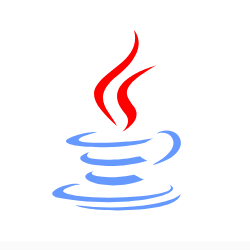

**整理**了一波学到头秃的 Java 入坑笔记，劝退一波，别搞后端了，转算法去吧！

|  |  |  |  |  |  |  |  |  |
| :----------------------------------------------------------: | :----------------------------------------------------------: | :----------------------------------------------------------: | :----------------------------------------------------------: | :----------------------------------------------------------: | :----------------------------------------------------------: | :----------------------------------------------------------: | :----------------------------------------------------------: | :----------------------------------------------------------: |
|                           **Java**                           |                         **设计模式**                         |                           **算法**                           |                           **网络**                           |                         **操作系统**                         |                          **数据库**                          |                          **Spring**                          |                          **分布式**                          |                          **大数据**                          |

### 目录

----

#### Java

##### 1. 基础

- **基础**：数据与程序结构、关键字等。
- **对象与类**：继承、接口、抽象类、内部类、枚举、常用类、常用接口、注解等。
- **异常**：异常体系等。
- **泛型**：用法、类型参数、通配符等。

##### 2. 集合与容器

- **集合容器类**：队列、列表、栈、Map、Set 等结构，含 ArrayList、LinkedList、ArrayDeque、PriorityQueue、HashMap、LinkedHashMap、TreeMap 及并发容器类等。

##### 3. 并发

- **并发**：线程基础、JMM、AQS、CAS、锁与线程安全（Synchronized、ReentrantLock）、JUC、线程池、定时任务、TreadLocal 等。

##### 4. Java8/IO/其他

- **Java8**：Lambda、流 Stream 等。
- **IO**：文件操作、IO流、网络操作等（NIO 放到了 Netty 部分）。
- **其他**：Java性能问题定位、必备技能等。

----

#### 数据结构与算法

#### 网络

- **网络基础与物理层**：网络分层、物理层等。
- **数据链路层**：点对点信道、广播信道、PPP 协议、以太网、局域网等。
- **网络层**：IP 协议栈、ICMP协议、路由选择协议（RIP、OSPF、BGP协议等）、IPV6、VPN 等。
- **传输层**：UDP、TCP、ARQ协议、TCP 可靠传输、TCP连接释放等、
- **应用层**：DNS、FTP、DHCP、邮件协议等。
- **网络安全**：密码体制、数字签名、鉴别、安全协议、Web攻击技术（CSRF、XSS、SQL注入、DOS等）等。
- **HTTP**：报文结构、HTTP方法、HTTP状态码、HTTP首部、HTTP应用等。
- **HTTPS**：加密、认证、完整性保护、TLS等。

----

#### 操作系统

##### 1. 操作系统理论

- **操作系统概述**：操作系统基本特征、基本功能、系统调用、系统中断等。
- **进程管理**：进程与线程、进程描述符、进程状态、进程调度算法、进程同步、线程同步、进程间通信、死锁等。
- **内存管理**：内存管理机制、虚拟地址、虚拟内存、分页、分段等。
- **IO管理与磁盘调度**：磁盘结构、磁盘调度算法等。
- **编译原理**：编译系统、目标文件、动态链接、静态链接等。
- **IO模型**：五种 IO 模型、IO 多路复用实现等。

##### 2. Linux

- **Linux基础**：磁盘接口、分区表、开机监测程序等。
- **Linux文件与文件系统**：文件系统、目录、文件、文件与目录操作命令等。
- **Linux Shell编程**：基础、变量操作、数据流重定向、提取与转换、排序指令、测试指令等。
- **Linux系统管理**：Linux启动、进程管理、系统资源管理、网络管理、定时任务等。

#### 数据库

#### JVM

#### 设计模式

#### Spring

#### 缓存

#### ORM

#### 分布式与系统设计

#### 消息队列

#### RPC

#### Netty

#### 搜索引擎

### 备注

本项目 Markdown 文件均由 **Typora** 编辑器整理，且使用了高亮语法（标识重点），Typora 需要打开高亮开关，看起来才舒服。如下图。

针对部分内容有相应图示，**架构图**源文件在各种小章节的文件夹之下，可使用如下软件打开：

- 桌面版：https://github.com/jgraph/drawio-desktop

- 在线版：https://www.draw.io/

### 参考资料

由于是站在巨人的肩膀上前进，**==侵删==**。

##### 1. 参考书籍

- 《Java 核心技术卷》 凯S.霍斯特曼
- BruceEckel. Java 编程思想: 第 4 版 [M]. 机械工业出版社, 2007
- 《深入理解 Java 虚拟机第二版》 周志明
- 《计算机网络第七版》 谢希仁

##### 2. 参考项目

参考了不少优秀的项目啊（大佬们是真的）。

- https://github.com/CyC2018/CS-Notes

**欢迎三连**~

 