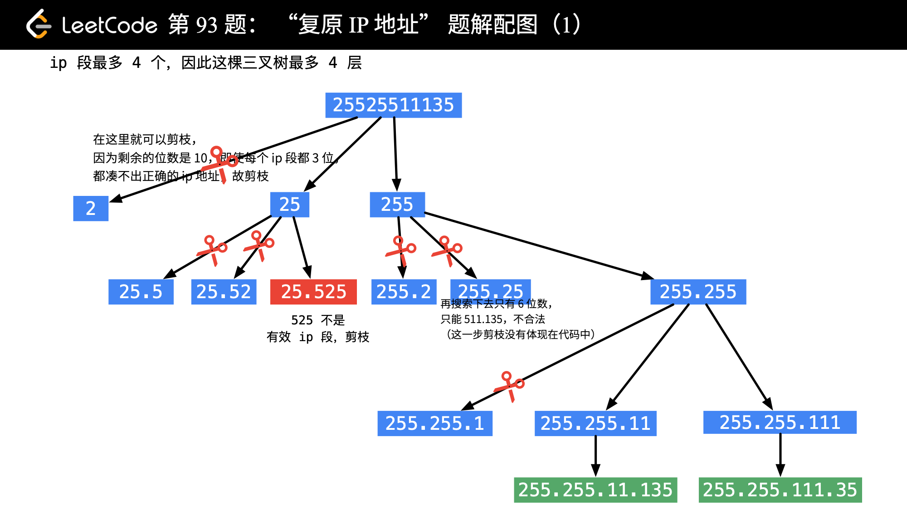
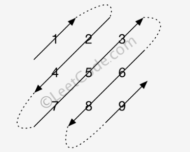
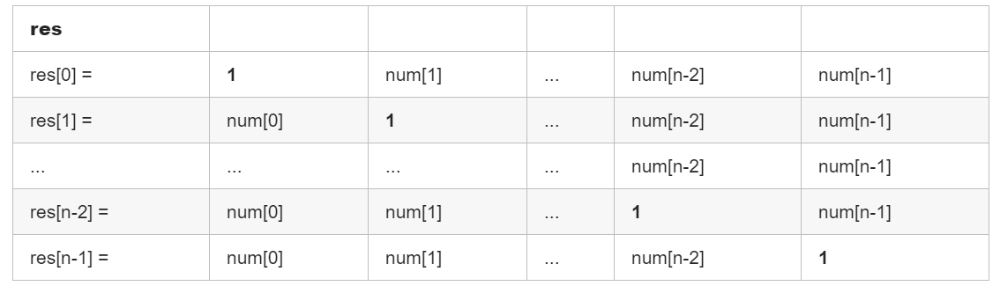
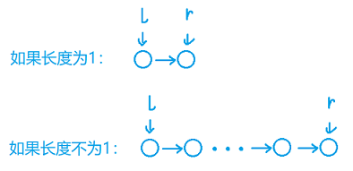
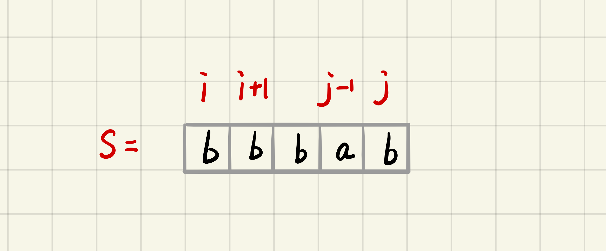
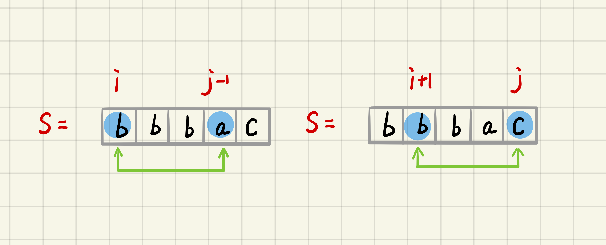
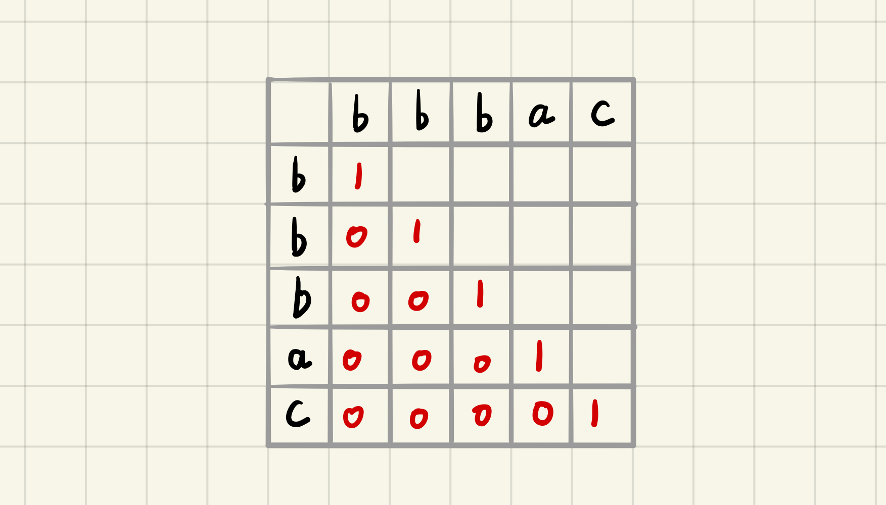
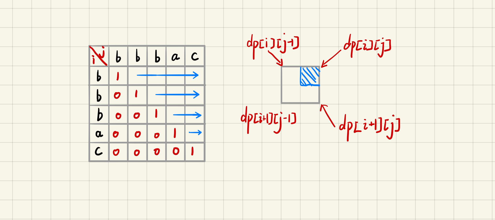
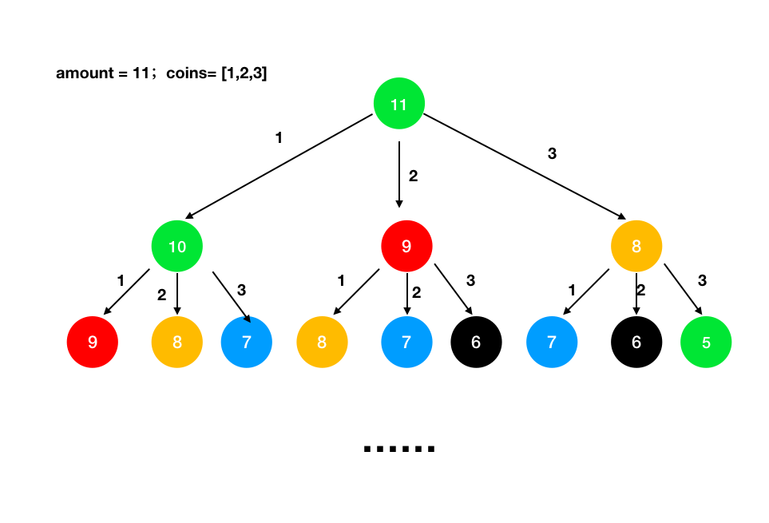
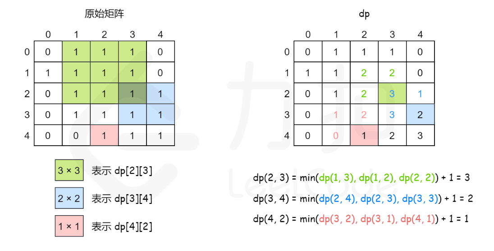

[TOC]

### 面试总结

#### 算法总结

- HashMap 可以用于空间换时间。
- 链表多引入 dummy 结点。

##### 1. 算法模板

###### 回溯模板

```java
List<答案> result;
public void backTrack(路径, 选择列表){
    if(满足结束条件) {
        result.add(路径);
        return;
    }
    for (选择 in 选择列表) {
        做选择;
        backtrack(路径, 选择列表);
        撤销选择;
    }
}
```

**其核心就是 for 循环里面的递归，在递归调用之前「做选择」，在递归调用之后「撤销选择」**。**只要在递归之前做出选择，在递归之后撤销刚才的选择**，就能正确得到每个节点的选择列表和路径。

典型题目：全排列。

###### 二分模板

```java
int binarySearch(int[] nums, int target) {
    int left = 0; 
    int right = nums.length - 1; // 注意

    while(left <= right) {
        int mid = left + (right - left) / 2;
        if(nums[mid] == target)
            return mid; 
        else if (nums[mid] < target)
            left = mid + 1; // 注意
        else if (nums[mid] > target)
            right = mid - 1; // 注意
    }
    return -1;
}
```

while 里面的 left 与 right 是否相等，**以及 left 和 right 每次是 mid 还是 mid + 1，还是 mid - 1**，这需要看具体的**区间**而定。

每次 left 与 right 变化时需不需要加一减一需要看这个边界是否已经搜索过了。如果是**闭区间**的某个边界已经搜索过，那么就需要跳过。

注意「搜索区间」和 while 的终止条件，如果存在漏掉的元素，记得在最后检查。

如需定义**左闭右开**的「搜索区间」搜索左右边界，只要在 **nums[mid] == target** 时做修改即可，搜索**右侧时需要减一**。

如果将「搜索区间」全都统一成**两端都闭**，只要稍改 **nums[mid] == target** 条件处的代码和返回的逻辑即可，推荐拿小本本记下，作为二分搜索模板。

###### 层序遍历模板

**迭代法**：利用队列。

```java
public List<List<Integer>> levelOrder(TreeNode root) {
    // Base case
    if(root == null) return new ArrayList<>();
    // 使用辅助队列并将根节点入队列
    Queue<TreeNode> queue = new LinkedList<>() ;
    queue.add(root);
    List<List<Integer>> resList = new ArrayList<>();
    // 队列为空时退出循环
    while(queue.size() != 0) {
        // 获取当前队列中的元素个数，也就是当前这一层有多少个结点，这是为了控制访问到了某一层
        int size = queue.size();
        List<Integer> levelList = new ArrayList<>();
        // 将当前层的元素依次出队列并处理数据，每弹出一个结点并再次将其左右子节点入队列
        for(int i = 0; i < size; i++) {
            // 出队列并处理数据
            TreeNode temp = queue.poll();
            levelList.add(temp.val);
            // 将出队结点的左右子节点入队
            if(temp.left != null) queue.add(temp.left);
            if(temp.right != null) queue.add(temp.right);
        }
        // 这一层弹出的元素处理完毕
        resList.add(levelList);
        // 此时下一层的全部节点已经到队列中，再次循环即可
    }
    return resList;
}
```

**递归法**：

```java
public List<List<Integer>> levelOrder2(TreeNode root) {
    if (root == null) return resList;
    // 从根结点开始递归,根结点是第0层
    dfs(root, 0);
    return resList;
}

List<List<Integer>> resList = new ArrayList<>();

// 辅助方法:整体是先序遍历的模板
public void dfs(TreeNode node, int level) {
    // 说明遇到了新的一层则新建一个列表,并添加一层新的到结果中
    if (resList.size() == level) {
        resList.add(new ArrayList<>());
    }
    // 根据层数获取对应的列表并将当前节点的值加入到list中（先序遍历）
    resList.get(level).add(node.val);

    // 递归进行
    if (node.left != null) dfs(node.left, level + 1);
    if (node.right != null) dfs(node.right, level + 1);
}
```

###### 滑动窗口模板

```java
int left = 0, right = 0;

while (right < s.size()) {
    window.add(s[right]);
    right++;

    while (valid) {
        window.remove(s[left]);
        left++;
    }
}
```

window 的数据类型可以视具体情况而定，比如可以使用**哈希表**充当计数器，当然也可以用一个**数组**实现同样效果。

###### 链表快慢指针

```java
ListNode fast = head;
ListNode slow = head;
while (fast != null && fast.next != null) {
    fast = fast.next.next;
    slow = slow.next;
}
```

寻找**链表中点**的模板：

```java
ListNode fast = head;
ListNode slow = head;
while (fast != null && fast.next != null) {
    fast = fast.next.next;
    slow = slow.next;
}
// slow就在中间位置
return slow;
```

注意：当链表的长度是**奇数**时，slow 恰巧停在**中点位置**；如果**长度是偶数**，slow 最终的位置是**中间偏右**。


寻找链表中点的一个重要作用是对链表进行**归并排序**。回想数组的归并排序：求中点索引递归地把数组二分，最后合并两个有序数组。对于链表，合并两个有序链表是很简单的，难点就在于二分。

###### 子序列问题模板

一维的 dp 数组：

```java
int n = array.length;
int[] dp = new int[n];

for (int i = 1; i < n; i++) {
    for (int j = 0; j < i; j++) {
        dp[i] = 最值(dp[i], dp[j] + ...)
    }
}
```

应用：**最长递增子序列**。

二维的 dp 数组：

```java
int n = arr.length;
int[][] dp = new int[n][n];

for (int i = 0; i < n; i++) {
    for (int j = 0; j < n; j++) {
        if (arr[i] == arr[j]) 
            dp[i][j] = dp[i][j] + ...;
        else
            dp[i][j] = 最值(...);
    }
}
```

应用：涉及两个字符串/数组的子序列。最长公共子序列，最长公共子串等。

#### 撸代码

##### 双指针题目

###### 两数之和

📘 **公司**：字节、华为

**[题目](https://leetcode-cn.com/problems/two-sum/submissions/)**：普通版本，给一个数组，找出其中**和为 target 的**任意两个数。 

**双指针遍历**：先排序，然后用头尾两个指针，分别开始遍历，两个数字和大于 target  时，右指针向前移动，小于 target  时左指针向后移动。

```java
public int[] twoSum(int[] nums, int target) {
    // Base case
    if(nums == null || nums.length == 0) return new int[]{};
    // 排个序
    Arrays.sort(nums);
    int i = 0;
    int j = nums.length - 1;
    // 左右指针不相遇
    while(i < j) {
        int sum = nums[i] + nums[j];
        if(sum > target) {
            j--;
        } else if(sum < target) {
            i++;
        } else {
            // 返回这两个数
            return new int[]{nums[i], nums[j]};
        }
    }
    return new int[]{};
}
```

**进阶**：**递增数组**，找出和为 target 的数对。求 a + b = target 的对数，例如 [1, 1, 2, 3, 4, 5, 6, 7, 7, 8, 9]，target  = 8，这里应该是 5 对。

```java
public ArrayList<int[]> findPair(int[] nums, int target){
    int len = nums.length;
    int i = 0;
    int j = len - 1;
    ArrayList<int[]> resList = new ArrayList<>();
    while(i < j){
        int sum = nums[i] + nums[j];
        if(sum > target){
            j--;
        } else if (sum < target){
            i++;
        } else {
            resList.add(new int[]{nums[i], nums[j]});
        }
    }
    return resList;
}
```

###### 三数之和

📘 **公司**：字节

**题目**：普通三数之和。

**题解**：暴力法，**排序+二分**查找，**排序+双指针代码如下**。

也是利用**双指针**，同时需要**注意去重**。

```java
public static List<List<Integer>> threeSum(int[] nums) {
    List<List<Integer>> resList = new ArrayList();
    // Base case
    int len = nums.length;
    if (len < 3) return resList;
    // 对原始数组排序
    Arrays.sort(nums);

    for (int i = 0; i < len; i++) {
        // 如果当前数字大于0，则三数之和一定大于0，所以结束循环
        if (nums[i] > 0) break;
        // 注意去重：相同的数就判断一次即可
        if (i > 0 && nums[i] == nums[i - 1]) continue;
        // 当前元素右边部分的左右指针,这与两数之和一样
        int left = i + 1;
        int right = len - 1;
        while (left < right) {
            int sum = nums[i] + nums[left] + nums[right];
            if (sum == 0) {
                resList.add(Arrays.asList(nums[i], nums[left], nums[right]));
                // 去重
                while (left < right && nums[left] == nums[left + 1]) left++; 
                while (left < right && nums[right] == nums[right - 1]) right--; 
                left++;
                right--;
            } else if (sum < 0) {
                left++;
            } else if (sum > 0) {
                right--;
            }
        }
    }
    return resList;
}
```

**拓展**：最接近三数之和。

**拓展**：给定一个数组，找出所有的三个数之和为零的组合。

###### 有序数组的平方(H)

📘 **公司**：字节(2)

**题目**：有序数组平方后，数组当中有多少不同的数字（相同算一个）。

如果不是排序数组，可以使用 Set 来保存数字的平方，重复就存不进去。

**题解**：**排序数组平方后两头大，中间小，可以用双指针共同向中间扫描，扫描时去掉重复元素**，同时用一个 res 来记录有多少个不同数字。

```java
public int diffSquareNum(int nums[]) {
    int n = nums.length;
    if(n == 0 || nums == null) return 0;
    int sum = 0;
    int left = 0;
    int right = n - 1;
    while(left <= right){
        // 说明两个数平方相同
        if(nums[left] + nums[right] == 0){
            sum++;
         	// 这里开始去掉后面重复的数字
            int temp = nums[left]; 
            while(left <= right && nums[left] == temp)
                left++;
            while(left <= right && nums[right] == -temp)
                right--;
        } else if (nums[left] + nums[right] < 0){
            sum++;
            int temp = nums[left];
            while(left <= right && nums[left] == temp)
                left++;
        } else {
            sum++;
            int temp = nums[right];
            while(left <= right && nums[right] == temp)
                right--;
        }
    }
    return sum;
}
```

###### 先增后减数组中不重复数字个数(H)

📘 **公司**：字节(2)

**题目**：一个数组**先递增再递减**，找出数组不重复的个数，比如 [1, 3, 9, 1]，结果为 3，不能使用额外空间，复杂度 o(n)。

**题解**：类似上一题，**左右双指针**从两头向中间逼近。

```java
public int diffnum(int[] nums) {
    int n = nums.length;
    if (n == 0 || nums == null) return 0;
    int left = 0;
    int right = n - 1;
    int sum = 0;
    while (left <= right) {
        if (nums[left] == nums[right]) {
            sum++;
            int temp = nums[left];
            while (left <= right && nums[right] == temp)
                right--;
            while (left <= right && nums[left] == temp)
                left++;
        } else if (nums[left] < nums[right]) {
            sum++;
            int temp = nums[left];
            while (left <= right && nums[left] == temp)
                left++;
        } else {
            sum++;
            int temp = nums[right];
            while (left <= right && nums[right] == temp)
                right--;
        }
    }
    return sum;
}
```

###### 最短需要升序的子数组

[**题目**](https://leetcode-cn.com/problems/shortest-unsorted-continuous-subarray/)：给定一个整数数组，你需要寻找一个**连续的子数组**，如果对这个子数组进行**升序排序**，那么**整个数组**都会变为**升序排序**。你找到的子数组应是**最短**的，请输出它的长度。

```java
输入: [2, 6, 4, 8, 10, 9, 15]  输出: 5
解释: 你只需要对 [6, 4, 8, 10, 9] 进行升序排序，那么整个表都会变为升序排序
```

**双指针**：同时**从前往后**和**从后往前**遍历，分别得到要排序数组的**右边界和左边界**。

**寻找右边界**：**从前往后**遍历的过程中，用 **max** 记录遍历过的**最大值**，如果 max 大于当前的 nums[i]，说明nums[i] 的位置**不正确**，属于**需要排序的数组**，因此将右边界更新为 i，然后**更新 max**；这样最终可以找到需要排序的数组的右边界，右边界之后的元素都大于 max。

**寻找左边界**：**从后往前**遍历的过程中，用 **min** 记录遍历过的**最小值**，如果 min 小于当前的 nums[j]，说明nums[j] 的位置**不正确**，应该属于需要排序的数组，因此将左边界更新为 j，然后更新 min；这样最终可以找到需要排序的数组的左边界，左边界之前的元素都小于min。

左右边界的范围就是最短的数组。

```java
public int findUnsortedSubarray(int[] nums) {
    int len = nums.length;
    // 左右指针
    int left = 0, right = -1;
    // 记录最大的数与最小的数
    int max = nums[0], min = nums[len - 1];

    // 从左往右找右边界
    for (int i = 0; i < len; i++) {
        if (nums[i] < max) {
            right = i;
        } else {
            max = nums[i];
        }
    }
    // 从右往左找左边界
    for (int i = len - 1; i >= 0; i--) {
        if (nums[i] > min) {
            left = i;
        } else {
            min = nums[i];
        }
    }
    // 求出边界范围
    return right - left + 1;
}
```


##### 区间类题目

###### 合并区间(H)

📘 **公司**：字节、猿辅导

**题目**：给出一个区间的集合，请**合并所有重叠的区间**。

```java
输入: [[1,3],[2,6],[8,10],[15,18]]  输出: [[1,6],[8,10],[15,18]]
解释: 区间 [1,3] 和 [2,6] 重叠, 将它们合并为 [1,6].
```

**题解**：按照全部区间的第一个元素排序，然后使用一个列表来遍历合并。整体就是两两合并区间。两个区间的**六种关**系。


```java
public int[][] merge(int[][] intervals) {
    int len = intervals.length;
    if (len < 2) return intervals;

    // 按照起点排序
    Arrays.sort(intervals, Comparator.comparingInt(o -> o[0]));

    // 也可以使用 Stack，因为我们只关心结果集的最后一个区间
    List<int[]> res = new ArrayList<>();
    res.add(intervals[0]);

    for (int i = 1; i < len; i++) {
        // 取出当前区间
        int[] temp = intervals[i];
        // 每次新的区间与当前结果集中的最后一个区间的末尾端点进行比较
        int[] peek = res.get(res.size() - 1);
        if (temp[0] <= peek[1]) {
            // 注意:这里应该取最大
            peek[1] = Math.max(temp[1], peek[1]);
        } else {
            // 说明两者完全不重叠
            res.add(temp);
        }
    }
    return res.toArray(new int[res.size()][]);
}
```

###### 区间调度

**题目**：给你很多形如 **[start, end]** 的闭区间，请设计一个算法，**算出这些区间中最多有几个互不相交的区间**。

比如给定区间 [[1,3], [2,4], [3,6]]，这些区间最多有 2 个区间互不相交，即 [[1,3], [3,6]]，算法应该返回 2。注意边界相同并不算相交。这个题目与每天参加的活动量或者排课的问题有点类似。

**贪心思路**：

1. 从区间集合 **intvs** 中选择一个**区间 x**，这个 x 是在当前所有区间中**结束最早的**（end 最小）。这里可以先**按照 end** 排序。
2. 把**所有与 x 区间相交的区间从区间集合 intvs 中删除**。
3. 重复步骤 1 和 2，直到 intvs 为空为止。之前选出的那些 x 就是最大不相交子集。

过程如下：


由于事先进行**排序**，不难发现所有与 x 相交的区间**必然会与 x 的 end 相交**；如果一个区间不想与 x 的 end 相交，它的 start 必须要大于（或等于）x 的 end：


看下代码：

```java
public int intervalSchedule(int[][] intervals) {
    if (intervals.length == 0) return 0;
    // 按end升序排序
    Arrays.sort(intervals, new Comparator<int[]>() {
        public int compare(int[] a, int[] b) {
            return a[1] - b[1];
        }
    });
    // 至少有一个区间不相交
    int count = 1;
    // 排序后第一个区间就是x
    int xEnd = intervals[0][1];
    for (int[] interval : intervals) {
        int start = interval[0];
        if (start >= xEnd) {
            // 找到下一个选择的区间了
            count++;
            xEnd = interval[1];
        }
    }
    return count;
}
```

拓展：[LeetCode 435](https://leetcode-cn.com/problems/non-overlapping-intervals/)，无重叠区间。给定一个区间的集合，找到需要移除区间的最小数量，**使剩余区间互不重叠**。这个就用上面的改进一下即可。

[LeetCode 452 题](https://leetcode-cn.com/problems/minimum-number-of-arrows-to-burst-balloons/)，射气球。用最少的箭射爆全部气球。直接寻找最多个不重叠区间即可。

###### 看电影问题

📘 **公司**：猿辅导

已知电影开始与结束时间，看最多场电影

###### 尽可能参加会议的个数

📘 **公司**：字节

**[题目](https://leetcode-cn.com/problems/maximum-number-of-events-that-can-be-attended/)**：给你一个数组 events，其中 events[i] = **[startDayi, endDayi]** ，表示会议 i 开始于 startDayi ，结束于 endDayi 。你可以在满足 startDayi <= d <= endDayi 中的**任意一天 d 参加会议 i** 。注意，**一天只能参加一个会议**。请返回可以参加的 最大 会议数目。

```
输入：events = [[1,4],[4,4],[2,2],[3,4],[1,1]]  输出：4
```

**贪心算法**：

```java
public int maxEvents(int[][] events) {
    // 按照开始时间进行排序
    Arrays.sort(events, (o1, o2) -> o1[0] - o2[0]);
    // 小顶堆
    PriorityQueue<Integer> queue = new PriorityQueue<>();
    // 结果、开始时间、events下标、有多少组数据
    int res = 0, last = 1, i = 0, n = events.length;
    while (i < n || !queue.isEmpty()) {
        // 将start相同的会议都放进堆里
        while (i < n && events[i][0] == last) {
            queue.offer(events[i++][1]);
        }
        // pop掉当前天数之前的
        while (!queue.isEmpty() && queue.peek() < last) {
            queue.poll();
        }
        // 顶上的就是要参加的
        if (!queue.isEmpty()) {
            queue.poll();
            res++;
        }
        last++;
    }
    return res;
}
```

下面是一个更容易理解的解法，但是时间会超。

```java
public int maxEvents2(int[][] events) {
    int len = events.length;
    if (len == 1) return 1;
    // 构造一个map, 记录当前是否已经参加会议
    Set<Integer> set = new HashSet<>();
    // 按照结束时间排序, 结束时间相同的开始时间早的在前
    Arrays.sort(events, new Comparator<int[]>() {
        @Override
        public int compare(int[] o1, int[] o2) {
            if (o1[1] == o2[1]) return o1[0] - o2[0];
            return o1[1] - o2[1];
        }
    });

    // 遍历
    for (int i = 0; i < len; i++) {
        // 如果当天没有参加过会议, 则添加该次会议的开始时间
        if (!set.contains(events[i][0])) {
            set.add(events[i][0]);
        } else {
            // 否则的话遍历结束时间范围
            int start = events[i][0];
            int end = events[i][1];
            while (end > start) {
                start++;
                // 如果在返回内有时间则参加会议, 并break
                if (!set.contains(start)) {
                    set.add(start);
                    break;
                }
            }
        }
    }
    // 最后返回总共参加了多少会议
    return set.size();
}
```

###### 区间列表的交集

📘 **公司**：猿辅导

**[题目](https://leetcode-cn.com/problems/interval-list-intersections/)**：给定两个由一些 **闭区间** 组成的列表，每个区间列表都是成对不相交的，并且已经排序。返回这两个区间列表的交集。（形式上，闭区间 [a, b]（其中 a <= b）表示实数 x 的**集合**，而 a <= x <= b。两个闭区间的交集是一组实数，要么为空集，要么为闭区间。例如，[1, 3] 和 [2, 4] 的交集为 [2, 3]。）


```java
public int[][] intervalIntersection(int[][] A, int[][] B) {
    List<int[]> ans = new ArrayList();
    int i = 0, j = 0;

    while (i < A.length && j < B.length) {
        // low:区间的起点
        // high:区间的终点
        int low = Math.max(A[i][0], B[j][0]);
        int high = Math.min(A[i][1], B[j][1]);
        // 说明找到一个交集部分
        if (low <= high)
            ans.add(new int[]{low, high});
        // 移动当前较小的那个区间
        if (A[i][1] < B[j][1]) {
            i++;
        } else {
            j++;
        }
    }
    return ans.toArray(new int[ans.size()][]);
}
```

##### 滑动窗口题目

###### 和为S的连续正整数序列

📘 **公司**：字节

**题目**：输入一个正整数 target ，输出所有和为 target 的**连续正整数**序列（至少含有两个数）。序列内的数字由小到大排列，不同序列按照首个数字从小到大排列。输入：target = 9。输出：[[2, 3, 4], [4, 5]]。

**滑动窗口**：窗口左右两端都只能向右移动，当和小于 sum 时，j++，和大于 sum 时，i++，和等于 sum 就记录下窗口中 i 到 j 中的序列，然后窗口继续后移，查找下一个满足条件的序列。

```java
public int[][] findContinuousSequence(int target) {
    // 窗口仅含1
    int i = 1;
    int j = 1;
    int sum = 0;
    List<int[]> resList = new ArrayList<>();
    // 序列是由小到大排列，所以如果 i>target/2，那么i+i+1肯定大于target
    while (i <= target / 2) {
        // 如果小于目标值就移动右边界同时加上右边界值
        if (sum < target) {
            sum = sum + j;
            j++;
            // 大于目标值就移动左边界同时减去左边界值
        } else if (sum > target) {
            sum = sum - i;
            i++;
            // 相等的值出现了就记录到结果列表中
        } else {
            int[] temp = new int[j - i];
            for (int m = i; m < j; m++) temp[m - i] = m;
            resList.add(temp);
            // 左边界向右移动
            sum = sum - i;
            i++;
        }
    }
    return resList.toArray(new int[resList.size()][]);
}
```

**拓展**：和为S的正整数序列**个数**。**题目**：一个数组里面多个元素和等于 target 的答案数（**多个元素可以不连续**）。可以使用上面的**滑动窗口**，由于只是求个数，所以也可以**动态规划**做。比如：数组[2,1,3,4,5,10]，target=5  答案为 3 个，即 [2, 3], [5], [1, 4]。

###### 子串寻找

📘 **公司**：字节

给定 **m 个不重复的字符** [a, b, c, d]，以及一个**长度为 n 的字符串** tbcacbdata，问能否在这个**字符串中找到一个长度为 m 的连续子串**，使得这个子串刚好由上面 m 个字符组成，顺序无所谓，返回任意满足条件的一个子串的起始位置，未找到返回-1。比如上面这个例子，acbd，3。

直接用**滑动窗口**即可。

###### 找出至多包含K个字符的最长子串T

📘 **公司**：字节、猿辅导

给定一个字符串 s ，找出 **至多 包含 k 个不同字符**的最长子串 T ，输出子串 T 长度。

用的**滑动窗口**解决，已经是**O(N)**。

###### 最小覆盖子串

**题目**：给定一个字符串 S、一个字符串 T，在字符串 S 里找出**包含 T 所有字母**的最小子串。顺序无所谓，但这个子串一定是所有可能子串中最短的。

```java
输入: S = "ADOBECODEBANC" T = "ABC" 输出:"BANC"
```

**滑动窗口解决**：

- 在字符串 S 中使用双指针中的左右指针，**初始化 left = right = 0**，把**索引闭区间 [left, right] 称为一个「窗口」**。

- 先**不断地增加 right 指针扩大窗口 [left, right]**，直到窗口中的字符串符合要求（包含了 T 中的所有字符）。

- 此时**停止增加 right**，转而不断增加 left 指针**缩小窗口 [left, right]**，直到窗口中的字符串不再符合要求（不包含 T 中的所有字符了）。同时，每次增加 left 都要更新一轮结果。

- 重复第 2 和第 3 步，直到 right 到达字符串 S 的尽头。

**第 2 步相当于在寻找一个「可行解」，然后第 3 步在优化这个「可行解」，最终找到最优解。**左右指针轮流前进，窗口大小增增减减，窗口不断向右滑动。动图如下：


```java
// 使用两个map来保存S与T中的字符串是否匹配
Map<Character, Integer> oriMap = new HashMap<>();
Map<Character, Integer> cntMap = new HashMap<>();

public String minWindow(String s, String t) {
    int tLen = t.length();
    // 把T字符串的全部内容放入到Map中计数
    for (int i = 0; i < tLen; i++) {
        char c = t.charAt(i);
        oriMap.put(c, oriMap.getOrDefault(c, 0) + 1);
    }
    // 窗口左右指针
    int left = 0, right = -1;
    int len = Integer.MAX_VALUE, ansL = -1, ansR = -1;
    int sLen = s.length();
    while (right < sLen) {
        right++;
        if (right < sLen && oriMap.containsKey(s.charAt(right))) {
            cntMap.put(s.charAt(right), cntMap.getOrDefault(s.charAt(right), 0) + 1);
        }
        while (check() && left <= right) {
            if (right - left + 1 < len) {
                len = right - left + 1;
                ansL = left;
                ansR = left + len;
            }
            if (oriMap.containsKey(s.charAt(left))) {
                cntMap.put(s.charAt(left), cntMap.getOrDefault(s.charAt(left), 0) - 1);
            }
            left++;
        }
    }
    return ansL == -1 ? "" : s.substring(ansL, ansR);
}

// 判断窗口内的字符是否完全包含T字符串的内容
public boolean check() {
    Iterator iter = oriMap.entrySet().iterator();
    while (iter.hasNext()) {
        Map.Entry entry = (Map.Entry) iter.next();
        Character key = (Character) entry.getKey();
        Integer val = (Integer) entry.getValue();
        if (cntMap.getOrDefault(key, 0) < val) {
            return false;
        }
    }
    return true;
}
```

**滑动窗口题目**：

1. 无重复字符的最长子串：力扣3
2. 串联所有单词的子串：力扣30
3. 最小覆盖子串：力扣76

4. 至多包含两个不同字符的最长子串：力扣159

5. 长度最小的子数组：力扣209

6. 滑动窗口最大值：力扣239

7. 字符串的排列：力扣567

8. 最小区间：力扣632

9. 最小窗口子序列：力扣727

##### 二分题目

###### 有序数组查找一个元素第一次出现的位置(H)

📘 **公司**：字节

出现有序就考虑用**二分法**。

```java
public static int find(int[] nums, int target) {
    int len = nums.length;
    if (len == 0 || nums == null) return -1;
    if (nums[len - 1] < target) return -1;
    // 左右指针
    int left = 0;
    int right = len - 1;
    // 二分
    while (left < right) {
        int mid = (left + right) / 2;
        if (nums[mid] < target) {
            left = mid + 1;
        } else {
            right = mid;
        }
    }
    // 找到
    if (nums[left] == target) {
        return left;
    } else {
        return -1;
    }
}
```

###### 有序数组第一个不小于target的下标

📘 **公司**：字节

返回指向有序范围数组中第一个不小于（即大于或等于）指定target 的下标，或若找不到这种元素则返回 -1,时间复杂度要求O(log n)。有人说这题跟leetcode35一样，但是面试官说的是这题的元素可以重复的，leetcode是保证不会重复的。

```java
public static int helper(int[] array, int target) {
    // 三个边界条件: 1.数组是空  2.数组长度是0  3.数组的最大的那个数都比target小
    if (array == null || array.length == 0 || array[array.length - 1] < target) {
        return -1;
    }
    int start = 0;
    int end = array.length - 1;
    while (start < end) {
        int mid = (start + end) / 2;
        if (array[mid] >= target) {
            end = mid;
        } else {
            start = mid + 1;
        }
    }
    return start;
}
```

###### 有序数组查找目标值范围

📘 **公司**：字节

**题目**：给定一个**升序有重复数组**，一个目标值，查找该值在数组中的涵盖范围，并返回该范围。时间复杂度要求为O(log(n))。比如给定：[5, 7, 7, 8, 8, 10] and target value 8, return [3, 4]。

可以使用**滑动窗口**。

也可以用**二分**分别确定左右的范围。

```java
public int[] searchRange(int[] nums, int target) {
    int[] result = new int[2];
    result[0] = findLeft(nums, target);
    result[1] = findRight(nums, target);
    return result;
}
public int findLeft(int[] nums, int target) {
    int left = 0, right = nums.length - 1;
    while (left <= right) {
        int mid = left + ((right - left) >> 1);
        if (nums[mid] < target)  {
            left = mid + 1;
        } else if (nums[mid] > target) {
            right = mid - 1;
        } else if (nums[mid] == target) {
            right = mid - 1;
        }
    }
    if (left >= nums.length || nums[left] != target) return -1;
    return left;
}
public int findRight(int[] nums, int target) {
    int left = 0, right = nums.length - 1;
    while (left <= right) {
        int mid = left + ((right - left) >> 1);
        if (nums[mid] < target)  {
            left = mid + 1;
        } else if (nums[mid] > target) {
            right = mid - 1;
        } else if (nums[mid] == target) {
            left = mid + 1;
        }
    }
    if (right < 0 || nums[right] != target) return -1;
    return right;
}
```

###### 旋转数组的最小数字

**题目**：把一个有序数组**最开始**的**若干个元素**搬到**数组的末尾**，称之为**数组的旋转**。找出有序旋转数组中的最小值。

这里可能出现**重复**的数字，判断比较麻烦。用二分法。

```java
public int minNumberInRotateArray2(int[] nums) {
    if (nums.length == 0) return 0;
    int left = 0, right = nums.length - 1;
    while (left < right) {
        int mid = left + (right - left) / 2;
        // 左右中值都一样
        if (nums[left] == nums[mid] && nums[mid] == nums[right]) {
            // 此时从左到右顺序查找
            return minNumber(nums, left, right);
            // 中间小于右边
        } else if (nums[mid] <= nums[right]) {
            right = mid;
            // 中间小于左边
        } else {
            left = mid + 1;
        }
    }
    return nums[left];
}

private int minNumber(int[] nums, int left, int right) {
    for (int i = left; i < right; i++) {
        if (nums[i] > nums[i + 1]) {
            return nums[i + 1];
        }
    }
    return nums[left];
}
```

**拓展：如何得到一个上面的旋转数组？**这里用 O(1) 的空间实现。**先分别把两个子数组内容逆序，然后再把整个数组进行逆序即可**。

###### 有序数组中的单一元素

📘 **公司**：猿辅导

**[题目](https://leetcode-cn.com/problems/single-element-in-a-sorted-array/)**：给定一个只包含整数的有序数组，每个元素都会出现两次，唯有一个数只会出现一次，找出这个数。要求时间复杂度o(lgn)。

```
输入: [1,1,2,3,3,4,4,8,8]   输出: 2
```

可以用**异或法**，但是这样复杂度就是 **O(N)** 了。

由于是**有序**数组，所以可以用**二分**。取数组**中间**的数，当中间数的**下标为奇数**，说明**前后元素的个数为奇数**，**偶数则剩余个数为偶数**。**奇数时**：当 nums[h] 等于 [h+1]，唯一数处于前 h-1，反之处于后 h+1。**偶数时**：当 nums[h] 等于 [h+1]，唯一数处于后 h+2，反之处于前h。(**就是要保证剩余查找元素个数奇数**)。

```java
public int singleNonDuplicate(int[] nums) {
    int left = 0, right = nums.length - 1;
    while (left < right) {
        int mid = (right + left) / 2;
        // 中间索引为奇数
        if (mid % 2 == 1) {
            if (nums[mid] == nums[mid + 1]) {
                right = mid - 1;
            } else {
                left = mid + 1;
            }
            // 中间索引为偶数
        } else {
            if (nums[mid] == nums[mid + 1]) {
                left = mid + 2;
            } else {
                right = mid;
            }
        }
    }
    return nums[left];
}
```

##### 回溯与矩阵查找题目

###### 相加之和的组合总数III

📘 **公司**：字节

**[题目](https://leetcode-cn.com/problems/combination-sum-iii/)**：找出所有**相加之和为 n 的 k 个数的组合**。组合中只允许含有 1 - 9 的正整数，并且每种组合中不存在重复的数字。

```
输入: k = 3, n = 9   输出: [[1,2,6], [1,3,5], [2,3,4]]
```

使用回溯法找出每次的路径即可。

```java
List<List<Integer>> resList = new ArrayList<>();
// 记录一次路径
List<Integer> pathList = new ArrayList<>();
public List<List<Integer>> combinationSum3(int k, int n) {
    process(1, 0, n, k);
    return resList;
}

private void process(int start, int level, int target, int k) {
    if (target < 0) return;
    // 这里总和已经达到了n,而且总和个数满足了k个情况
    if (target == 0 && level == k) {
        resList.add(new ArrayList<>(pathList));
        return;
    }
    // 从1到9挨着遍历
    for (int i = start; i <= 9; i++) {
        // 选择i
        pathList.add(i);
        // 递归
        process(i + 1, level + 1, target - i, k);
        // 撤消选择i,进行回溯
        pathList.remove(pathList.size() - 1);
    }
}
```

###### 岛屿数量

📘 **公司**：猿辅导、拼多多

**题解**：使用**回溯**模板。

```java
public int numIslands(char[][] grid) {
    int res = 0;
    for (int i = 0; i < grid.length; i++) {
        for (int j = 0; j < grid[0].length; j++) {
            // 如果当前格子是1,则代表是新的岛屿
            if (grid[i][j] == '1') {
                // 通过深度优先遍历把这个岛屿所涉及的全部位置找出来并座上标记
                dfs(grid, i, j);
                res++;
            }
        }
    }
    return res;
}

private void dfs(char[][] grid, int i, int j) {
    // 不能越界，同时所访问的位置不能为0或者2
    if (i < 0 || j < 0 || i >= grid.length || j >= grid[0].length || grid[i][j] == '0' || grid[i][j] == '2') return;
    // 访问之后标记已经被访问
    grid[i][j] = '2';
    dfs(grid, i + 1, j);
    dfs(grid, i, j + 1);
    dfs(grid, i - 1, j);
    dfs(grid, i, j - 1);
    // 由于这里访问过的位置在之后的遍历中不需要再次访问,所以不用回溯
}
```

###### 岛屿最大面积

与上题类似，回溯。

```java
public int maxAreaOfIsland(int[][] grid) {
    int res = 0;
    for (int i = 0; i < grid.length; i++) {
        for (int j = 0; j < grid[0].length; j++) {
            // 如果当前格子是1,则代表是新的岛屿
            // 通过深度优先遍历把这个岛屿所涉及的全部位置找出来并座上标记
            res = Math.max(res, dfs(grid, i, j));
        }
    }
    return res;
}

private int dfs(int[][] grid, int i, int j) {
    // 不能越界，同时所访问的位置不能为0或者2
    if (i < 0 || j < 0 || i >= grid.length || j >= grid[0].length || grid[i][j] == 0 || grid[i][j] == 2) return 0;
    // 到了这里说明是一个新的格子，此时面积应该+1
    // 访问之后标记已经被访问
    grid[i][j] = 2;
    int area1 = dfs(grid, i + 1, j);
    int area2 = dfs(grid, i, j + 1);
    int area3 = dfs(grid, i - 1, j);
    int area4 = dfs(grid, i, j - 1);
    // 返回上下左右的面积+1
    return area1 + area2 + area3 + area4 + 1;
}
```

###### 矩阵中字符串的路径

📘 **公司**：字节

**[题目](https://leetcode-cn.com/problems/ju-zhen-zhong-de-lu-jing-lcof/)**：判断一个字符矩阵中是否包含给定字符串的路径。

**经典回溯算法**：

```java
char[][] matrix;
char[] word;
public boolean exist(char[][] matrix, String word) {
    this.matrix = matrix;
    this.word = word.toCharArray();
    for(int i = 0; i < matrix.length; i++) {
        for(int j = 0; j < matrix[0].length; j++) {
            // 以矩阵每个位置为开头进行dfs查询
            if(dfs(i, j, 0)) return true;
        }
    }
    return false;
}

// 以某个位置开始进行DFS搜索
boolean dfs(int i, int j, int walkLen) {
    // Base case: 数组越界直接退出
    if(i >= matrix.length || i < 0 || j >= matrix[0].length || j < 0) return false;
    // 当前位置与目标位置的字符不对应,直接返回
    if(matrix[i][j] != word[walkLen]) return false;
    // 到这里,说明每个字符都是对应的,且已经遍历的步长已经等于目标单词的长度了
    if(walkLen == word.length - 1) return true;
    // 这里是将访问过的位置修改成一个不可能出现的字符,用于标记已经访问,也可以单独使用一个visited数组进行
    char tmp = matrix[i][j];
    matrix[i][j] = '/';
    // 往四个方向增加搜索,同时已经搜索的步长+1
    boolean res = dfs(i + 1, j, walkLen + 1)
        || dfs(i - 1, j, walkLen + 1)
        || dfs(i, j + 1, walkLen + 1)
        || dfs(i , j - 1, walkLen + 1);
    // 回溯,撤消修改
    matrix[i][j] = tmp;
    return res;
}
```

###### 全排列(H)

📘 **公司**：字节(2)、拼多多

**题目**：给定一个数组，输出全部组合。

利用回溯算法的模板。n 个不重复的数，全排列共有 **n!** 个。

下面是**无重复数字**的全排列。

```java
List<List<Integer>> res = new LinkedList<>();

List<List<Integer>> permute(int[] nums) {
    // 使用一个列表来记录「路径」
    LinkedList<Integer> track = new LinkedList<>();
    backTrack(nums, track);
    return res;
}

// 路径:记录在track中
// 选择列表:nums中不存在于track的那些元素
// 结束条件:nums中的元素全都在track中出现
public void backTrack(int[] nums, LinkedList<Integer> track) {
    // 触发结束条件
    if (track.size() == nums.length) {
        res.add(new LinkedList(track));
        return;
    }
    // 挨着递归
    for (int i = 0; i < nums.length; i++) {
        // 排除不合法的选择
        if (track.contains(nums[i])) continue;
        // 做选择
        track.add(nums[i]);
        // 进入下一层决策树
        backTrack(nums, track);
        // 取消之前的选择
        track.removeLast();
    }
}
```

**比较交换法**：**从第一个字符起每个字符分别与它后面的字符进行交换**。

```java
private static List<String> resList = new ArrayList<>();

public static void permutation(char[] nums, int start) {

    if(nums == null || start < 0) return;

    // 起始位置等于长度则成功
    if(start == nums.length) {
        resList.add(new String(nums));
        return;
    }
    // 从第一个字符起每个字符分别与它后面的字符进行交换
    for (int i = start; i < nums.length; i++) {
        // 交换一个字符
        swap(nums, start, i);
        permutation(nums, start + 1);
        // 再次交换回溯原来的状态
        swap(nums, start, i);
    }
}

private static void swap(char[] nums, int i, int j) {
    char temp = nums[i];
    nums[i] = nums[j];
    nums[j] = temp;
}
```

如果有**重复**的元素，**思路就是从第一个字符起每个字符分别与它后面非重复出现的字符进行交换**。

```java
private static List<String> resList = new ArrayList<>();

public static void permutation(char[] nums, int start) {

    if(nums == null || start < 0) return;

    // 起始位置等于长度则成功
    if(start == nums.length) {
        resList.add(new String(nums));
        return;
    }
    // 从头开始固定字符
    for (int i = start; i < nums.length; i++) {
        // 多加的一句话
        if(!isDuplicate(nums, start, i)) continue;
        // 交换一个字符
        swap(nums, start, i);
        permutation(nums, start + 1);
        // 回溯原来的状态
        swap(nums, start, i);
    }
}

// 判断[begin, end)区间内是否有字符与end相等
private static boolean isDuplicate(char[] nums, int begin, int end) {
    for (int i = begin; i < end; i++) {
        if(nums[i] == nums[end]) {
            return false;
        }
    }
    return true;
}

private static void swap(char[] nums, int i, int j) {
    char temp = nums[i];
    nums[i] = nums[j];
    nums[j] = temp;
}
```

###### 八皇后

📘 **公司**：猿辅导

阴间题目，看不懂。

```java
private List<List<String>> resList;
private List<String> solution;
private int[] queue;
private int N;

public List<List<String>> solveNQueens(int n) {
    //递归回溯
    resList = new ArrayList<>();
    N = n;
    queue = new int[n];
    search(0);
    return resList;
}

// cur为当前行数
private void search(int cur) {
    if (cur == N) { //找到一种解法
        solution = new ArrayList<>();
        for (int i = 0; i < N; i++) {
            StringBuffer col = new StringBuffer();
            for (int j = 0; j < N; j++) {
                if (queue[i] == j)
                    col.append('Q'); // 是皇后
                else
                    col.append('.');
            }
            solution.add(col.toString());
        }
        resList.add(solution);
    } else {
        if (cur == 0) {
            //初始化皇后数组
            for (int i = 0; i < N; i++) {
                queue[i] = -1;
            }
        }
        for (int i = 0; i < N; i++) { // 尝试把皇后放在（cur，i）位置
            int j;
            for (j = 0; j < cur; j++) { // 已经摆放的皇后（j, que[j])
                // 和已经摆放的皇后比较
                if (queue[j] == i || cur + i == j + queue[j] || cur - i == j - queue[j]) { //冲突
                    break;// 跳出循环，不需要继续比较
                }
            }
            if (j == cur) {// 没有冲突，可以摆放
                queue[cur] = i;// 记录皇后位置
                search(cur + 1);// 继续寻找下一行
                // 回溯
                queue[cur] = -1;// 清除位置
            }
        }
    }
}
```

###### 矩阵中的最长递增路径长度

📘 **公司**：字节

**[题目](https://leetcode-cn.com/problems/longest-increasing-path-in-a-matrix/)**：给定 **m * n** 的矩阵，可以从**任意位置**开始，向上下左右四个方向移动，要求下一个位置上的元素要大于当前元素，找出**矩阵中最长递增路径长度**。

```java
输入: nums = 
[
  [9,9,4],
  [6,6,8],
  [2,1,1]
] 
输出: 4  解释: 最长递增路径为 [1, 2, 6, 9]。
```

遍历所有点为起点的情况，取最大值即可。由于A-B-C-D路径中同时也把 B、C、D 三点的结果计算出来了，所以**存在重复计算**，使用一个 map 以起点坐标组合为**键记录结果**。

```java
// 记录中间结果
Map<Long, Integer> map = new HashMap<>();

public int longestIncreasingPath(int[][] matrix) {
    if (matrix.length == 0) return 0; // 空数组的处理
    int res = Integer.MIN_VALUE;
    for (int i = 0; i < matrix.length; i++) {   // 遍历所有点为起点时的结果
        for (int j = 0; j < matrix[0].length; j++) {
            res = Math.max(res, helper(matrix, i, j));  // 更新res
        }
    }
    return res;
}

public int helper(int[][] matrix, int i, int j) {
    // 计算以当前坐标为起点的组合键
    long key = (long) i << 32 | j;
    // 如果当前答案已经计算过
    if (map.containsKey(key)) return map.get(key);
    int ans = 1;
    // 向上
    if (i - 1 >= 0 && matrix[i - 1][j] > matrix[i][j])
        ans = Math.max(ans, helper(matrix, i - 1, j) + 1);
    // 向下
    if (i + 1 < matrix.length && matrix[i + 1][j] > matrix[i][j])
        ans = Math.max(ans, helper(matrix, i + 1, j) + 1);
    // 向左
    if (j - 1 >= 0 && matrix[i][j - 1] > matrix[i][j])
        ans = Math.max(ans, helper(matrix, i, j - 1) + 1);
    // 向右
    if (j + 1 < matrix[0].length && matrix[i][j + 1] > matrix[i][j])
        ans = Math.max(ans, helper(matrix, i, j + 1) + 1);
    // 记录当前答案
    map.put(key, ans);
    return ans;
}
```

###### 复原IP地址

📘 **公司**：猿辅导、字节

**[题目](https://leetcode-cn.com/problems/restore-ip-addresses/)**：给定一个只包含数字的字符串，复原它并返回所有可能的 IP 地址格式。

```java
输入：s = "010010"  输出：["0.10.0.10","0.100.1.0"]
输入：s = "101023"  输出：["1.0.10.23","1.0.102.3","10.1.0.23","10.10.2.3","101.0.2.3"] 
```

**[回溯算法](https://leetcode-cn.com/problems/restore-ip-addresses/solution/hui-su-suan-fa-hua-tu-fen-xi-jian-zhi-tiao-jian-by/)**：回溯算法事实上就是在一个**树形问题上做深度优先遍历**，因此 首先需要把**问题转换为树形问题**。可以画图模拟一下如何通过指定的字符串 s 生成 IP 地址的过程，把树形图画出来。

画树形图的过程中，会发现有些枝叶是没有必要的，把没有必要的枝叶剪去的操作就是**剪枝**。



一开始，字符串的长度小于 4 或者大于 12 ，一定不能拼凑出合法的 ip 地址。

每一个**结点**可以选择**截取的方法只有 3 种**：截 1 位、截 2 位、截 3 位，因此**每一个结点可以生长出的分支最多只有 3 条分支**。

由于 ip 段最多就 4 个段，因此这棵三叉树最多 4 层，这个条件作为递归终止条件之一。

```java
private List<String> resList = new ArrayList<>();
// 字符串长度
private int len = 0;
public List<String> restoreIpAddresses(String str) {
    len = str.length();
    // 长度不对肯定不行
    if (len > 12 || len < 4) return resList;

    Deque<String> path = new ArrayDeque<>(4);
    dfs(str, 0, 4, path);
    return resList;
}

// 需要一个变量记录剩余多少段还没被分割
private void dfs(String str, int begin, int leftNum, Deque<String> path) {
    if (begin == len) {
        // 当剩余的段数为0,则直接加入结果集
        if (leftNum == 0) {
            resList.add(String.join(".", path));
        }
        return;
    }
    // 这里有三种选择,也就是最多选三个字符组成一个IP段
    for (int i = begin; i < begin + 3; i++) {
        // Base case
        if (i >= len) break;
        // 说明当前还没分配的字符串长度大于每段为3的上限
        if ((len - i) > leftNum * 3) continue;
        // 判断当前的段是合格的才继续递归,否则进行剪枝
        if (judgeIpSegment(str, begin, i)) {
            // 如果能够成功则把当前的IP段加入路径中
            String currentIpSegment = str.substring(begin, i + 1);
            path.addLast(currentIpSegment);
            // 深度遍历
            dfs(str, i + 1, leftNum - 1, path);
            // 路径回溯撤消选择
            path.removeLast();
        }
    }
}

// 判断一个字符串是否符合一个IP段的要求
private boolean judgeIpSegment(String str, int left, int right) {
    int len = right - left + 1;
    // 如果长度大于1且开头为0则不对
    if (len > 1 && str.charAt(left) == '0') return false;
    // 解析成数字
    int num = Integer.parseInt(str.substring(left, right + 1));
    return num >= 0 && num <= 255;
}
```


##### 数组题目

###### 合并两个有序数组

📘 **公司**：字节(2)

**题目**：有两个排序数组 nums1（长度为 m） 和 nums2（长度为 n），**原地合并数组**。假设 nums1 有**足够的空间**放下 nums2。

**从后往前遍历，将值从后往前存入**。存入时比较当前两个指针指向的数字大小，选较大的存入，然后往前移动指针。

```java
public void merge(int[] nums1, int m, int[] nums2, int n) {
    // 表示从后向前当前插入位置
    int index = m + n - 1;
    // 指向nums1末尾
    int p1 = m - 1;
    // 指向nums2末尾
    int p2 = n - 1;
    // 将数组nums2全部数据插入到数组nums1为止
    while (p2 >= 0) {
        // p1位置有效且p1值较大
        if(p1 >= 0 && nums1[p1] >= nums2[p2]) {
            nums1[index] = nums1[p1];
            p1--;
        } else {
            nums1[index] = nums2[p2];
            p2--;
        }
        // 从右往左移动index
        index--;
    }
}
```

###### 合并N个有序数组

📘 **公司**：猿辅导、字节

算法 合并k个有序数组，先说思路，说了两两合并、分治。让写分治。

###### 螺旋矩阵(H)

📘 **公司**：字节、猿辅导(2)、拼多多

**[题目1](https://leetcode-cn.com/problems/spiral-matrix-ii/)**：给一个 n * n 的**方阵**，螺旋填入数字。

```java
public static int[][] generateMatrix(int n) {
    int[][] res = new int[n][n];
    // 上下左右四个边界
    int left = 0, right = n - 1, up = 0, down = n - 1;
    // 直到num小于平方
    int num = 1;
    while (num <= n * n) {
        // 从左往右
        for (int i = left; i <= right; i++) {
            res[up][i] = num;
            num++;
        }
        up++;
        // 从上往下
        for (int i = up; i <= down; i++) {
            res[i][right] = num;
            num++;
        }
        right--;
        // 从左往右
        for (int i = right; i >= left; i--) {
            res[down][i] = num;
            num++;
        }
        down--;
        // 从下到上
        for (int i = down; i >= up; i--) {
            res[i][left] = num;
            num++;
        }
        left++;
    }
    return res;
}
```

**[题目](https://leetcode-cn.com/problems/spiral-matrix/)**：给定一个包含 **m x n** 个元素的矩阵（m 行, n 列），按照顺时针螺旋顺序打印数组。

从外部向内部**逐层遍历**打印矩阵，最外面一圈打印完，里面仍然是一个矩阵。仅当圈内有多于两行才循环打印，如果只有一行或者一列就单独打印了。

```java
public List<Integer> spiralOrder(int[][] matrix) {
    List<Integer> resList = new ArrayList<>();
    if (matrix == null || matrix.length == 0) return resList;
    // 上下左右四个指针
    int left = 0;
    int up = 0;
    int down = matrix.length - 1;
    int right = matrix[0].length - 1;
    // 多于两行才进行打印
    while (left < down && up < right) {
        // 从左到右
        for (int i = up; i < right; i++) resList.add(matrix[left][i]);	
        // 从上到下
        for (int i = left; i < down; i++) resList.add(matrix[i][right]);
        // 从右往左
        for (int i = right; i > up; i--) resList.add(matrix[down][i]);
        // 从下到上
        for (int i = down; i > left; i--) resList.add(matrix[i][up]);	
        left++;
        down--;
        up++;
        right--;
    }
    // 只有一行时
    if (up == right) {
        while (left <= down) {
            resList.add(matrix[left++][up]);
        }
    } else {
        // 只有一列时
        if (left == down) {
            while (up <= right) {
                resList.add(matrix[left][up++]);
            }
        }
    }
    return resList;
}
```

###### 矩阵顺时针翻转90度

📘 **公司**：猿辅导

**题解**：矩阵转换 90 度，**则原矩阵的纵下标转变为新矩阵的横下标；原矩阵的横下标转变为新矩阵的纵下标，并且顺序相反**。

```java
public static int[][] change(int[][] matrix) {
    // 矩阵形状变化
    int[][] res = new int[matrix[0].length][matrix.length];
    int dst = matrix.length - 1;
    for (int i = 0; i < matrix.length; i++, dst--) {
        for (int j = 0; j < matrix[0].length; j++) {
            // 核心代码
            res[j][dst] = matrix[i][j];
        }
    }
    return res;
}
```

###### 矩阵的对角线遍历

📘 **公司**：猿辅导

**[题目](https://leetcode-cn.com/problems/diagonal-traverse/)**：像下面这样对角线遍历打印数组。



对于 m*n 矩阵，所有方向应该有 **m+n-1** 次。

```java
public int[] findDiagonalOrder(int[][] matrix) {
    // 考虑边界 []
    if (matrix == null || matrix.length == 0 || matrix[0].length == 0) return new int[0];
    // m行 n列
    int m = matrix.length;
    int n = matrix[0].length;
    // 用来记录加入到结果数组的元素的下标
    int count = 0;
    // 用来保存结果的数组 大小为矩阵的元素个数
    int[] result = new int[m * n];
    for (int i = 0; i < m + n - 1; i++) {
        // i为0或偶数时 沿对角线向上遍历
        if (i % 2 == 0) {
            // 发现规律x+y = i 然后找边界（x坐标超过主对角线时的情况）
            int x = i < m ? i : m - 1;
            int y = i - x;
            // 开始遍历 x坐标不断减 y坐标不断加 当x减到0 或者 y加到列n的值
            while (x >= 0 && y < n) {
                result[count] = matrix[x][y];
                x--;
                y++;
                count++;
            }
        } else {
            // 沿对角线向下遍历
            int y = i < n ? i : n - 1;
            int x = i - y;
            //y 坐标不断减 x坐标不断加 当y减到0 或者 x加到行m的值
            while (y >= 0 && x < m) {
                result[count] = matrix[x][y];
                y--;
                x++;
                count++;
            }
        }
    }
    return result;
}
```

###### 加油站

📘 **公司**：字节

**[题目](https://leetcode-cn.com/problems/gas-station/)**：在一条**环路**上有 N 个加油站，其中第 i 个加油站有汽油 gas[i] 升。你有一辆油箱**容量无限**的的汽车，从第 i 个加油站开往第 i+1 个加油站需要消耗汽油 **cost**[i] 升。你从其中的一个加油站出发，开始时油箱**为空**。如果你可以绕环路行驶一周，则返回出发时加油站的编号，否则返回 -1。**输入:** gas = [1, 2, 3, 4, 5] cost = [3, 4, 5, 1, 2] **输出:** 3。

```java
public int canCompleteCircuit(int[] gas, int[] cost) {
    int len = gas.length;
    // 总油量
    int sumTank = 0;
    // 当前油箱内的油量
    int curTank = 0;
    int startStation = 0;
    for (int i = 0; i < len; i++) {
        sumTank += gas[i] - cost[i];
        curTank += gas[i] - cost[i];
        if (curTank < 0) {
            startStation = i + 1;
            curTank = 0;
        }
    }
    return sumTank >= 0 ? startStation : -1;
}
```

###### 圆圈中剩下的数字

📘 **公司**：字节

[**题目**](https://leetcode-cn.com/problems/yuan-quan-zhong-zui-hou-sheng-xia-de-shu-zi-lcof/)：让小朋友们围成一个**大圈**。然后，随机指定一个**数 m**，让编号**为 0 的小朋友开始报数**。每次喊到 **m-1** 的那个小朋友要出列唱首歌，然后可以在礼品箱中任意的挑选礼物，并且**不再回到圈中**，从他的下一个小朋友开始，继续 **0...m-1 报数** .... 这样下去 .... 直到剩下最后一个小朋友，可以不用表演。

```java
public int lastRemaining(int n, int m) {
    // 构造一个链表
    ArrayList<Integer> list = new ArrayList<>();
    // 将数字加到链表中
    for (int i = 0; i < n; i++) list.add(i);

    int index = 0;
    // 不断移除一个元素直到只剩下一个元素
    while (list.size() > 1) {
        // index +=m-1;
        // while(index>list.size()-1) index = index-list.size();
        // 上面两步等价于下面用需要报的数对当前链表长度取模
        index = (index + m - 1) % list.size();
        // 去掉这个位置的元素
        list.remove(index);
    }
    return list.get(0);
}
```

[还可以反推](https://leetcode-cn.com/problems/yuan-quan-zhong-zui-hou-sheng-xia-de-shu-zi-lcof/solution/javajie-jue-yue-se-fu-huan-wen-ti-gao-su-ni-wei-sh/)：

```java
public int lastRemaining(int n, int m) {
    int ans = 0;
    // 最后一轮剩下2个人，所以从2开始反推
    for (int i = 2; i <= n; i++) {
        ans = (ans + m) % i;
    }
    return ans;
}
```

###### 下一个更大的数

📘 **公司**：字节

**题目**：**找出给定数字下一个比它大的数字**。如果不存在下一个更大的排列，则将数字重新排列成最小的排列（即升序排列）。


**从右往左找第一个降序的序列**（图中找到 4），然后**再从右往左寻找第一个大于当前位置的数**（5），交换 4 和 5，最后**逆序 4 后面部分数字**。

```java
public void nextPermutation(int[] nums) {
    // 从右往左找第一个降序的位置
    int i = nums.length - 2;
    while (i >= 0 && nums[i + 1] <= nums[i]) {
        i--;
    }
    // 从右往左找第一个大于i位置的元素
    if (i >= 0) {
        int j = nums.length - 1;
        while (j >= i && nums[j] <= nums[i]) {
            j--;
        }
        // 交换两个
        swap(nums, i, j);
    }
    // 逆序i后面的全部元素
    reverse(nums, i + 1);
}

private void reverse(int[] nums, int start) {
    int i = start, j = nums.length - 1;
    while (i < j) {
        swap(nums, i, j);
        i++;
        j--;
    }
}

private void swap(int[] nums, int i, int j) {
    int temp = nums[i];
    nums[i] = nums[j];
    nums[j] = temp;
}
```

###### 无序数组第一个缺失的数

📘 **公司**：字节

**题目**：一个**无序数组**，从小到大找到第一个缺的数，比如 [8 2 4 3 6 9 7 11 12]，第一个缺的就是 5。

用**数组**作为哈希表，将数字 i 放入数组中的 i **索引处**，然后**找中间没有存入数字的位置**。时间和空间复杂度都是 O(N)。

```java
public int findLost(int[] nums) {
    // 找到最大值和最小值
    int min = nums[0];
    int max = nums[0];
    for (int value : nums) {
        min = Math.min(min, value);
        max = Math.max(max, value);
    }
    // 初始化一个范围数组
    int[] temp = new int[max - min + 1];
    for (int i = 0; i < temp.length; i++) {
        temp[i] = min - 1;
    }
    for (int value : nums) temp[value] = value;
    int i = 0;
    // 找到没有的地方
    while (i < temp.length) {
        if (temp[i] == min - 1) break;
        i++;
    }
    return i;
}
```

可以使用**位图**节省空间。

###### 跳跃游戏

📘 **公司**：字节

**题目(leetcode55)**：给一个数组，例如[1, 2, 3, 4, 5]，a[i] 表示在**该位置可以向前行走的最大距离**，判断是否可以到达数组的最后一个元素。比如 [3, 2, 1, 0, 4]，返回 false。

**贪心思想**：**每次走最大的距离**，如果能超过末尾元素，说明只要调小步伐就一定可以达到最后位置。依据：**如果一个位置能够到达，那么这个位置左侧所有位置都能到达**。

```java
public boolean canJump(int[] nums) {
    int len = nums.length;
    // 当前最右的距离
    int rightMax = 0;
    for (int i = 0; i < len; i++) {
        // 说明当前的rightMax已经超过了当前的i索引位置
        if (i <= rightMax) {
            // 看看是否需要更新rightMax
            rightMax = Math.max(rightMax, i + nums[i]);
        }
        // 如果此时已经超过末尾直接返回
        if (rightMax >= len - 1) return true;
    }
    return false;
}
```

方法2：计算 0 的个数，看看能不能到。

```java
public boolean canJump2(int[] nums) {
    // 数组第一个元素为0且数组元素大于一个的时候,必定不能到达
    if (nums[0] == 0 && nums.length > 1) return false;
    // 未跳过的0的数量
    int zeroCounter = 0;
    for (int i = 0; i < nums.length - 1; i++) {
        // 遇到0,未跳过的0计数+1
        if (nums[i] == 0) {
            zeroCounter++;
            for (int j = 0; j < i; j++) {
                if (nums[j] >= i - j + 1) {
                    // 如果遇到的这个0前面有数字可以跳过它,那么未跳过的0计数-1
                    zeroCounter--;
                    // 跳过之后就去寻找下一个0
                    break;
                }
            }
        }
    }
    // 如果所有的0都能跳过，那么未跳过的0计数为0，返回true
    if (zeroCounter == 0) return true;
    return false;
}
```

###### 和至少为K的最短子数组

**[题目](https://leetcode-cn.com/problems/shortest-subarray-with-sum-at-least-k/)**：返回数组 A 的最短的非空连续子数组的长度，该子数组的和至少为 K 。如果没有和至少为 K 的非空子数组，返回 -1 。例如：

```
输入：A = [2,-1,2], K = 3   输出：3
```

代码贴出来，不太懂。

```java
public int shortestSubarray(int[] nums, int K) {
    int len = nums.length;
    long[] temp = new long[len + 1];
    for (int i = 0; i < len; i++) {
        temp[i + 1] = temp[i] + (long) nums[i];
    }
    int res = len + 1;
    Deque<Integer> monoQueue = new LinkedList();

    for (int y = 0; y < temp.length; ++y) {
        while (!monoQueue.isEmpty() && temp[y] <= temp[monoQueue.getLast()]) {
            monoQueue.removeLast();
        }
        while (!monoQueue.isEmpty() && temp[y] >= temp[monoQueue.getFirst()] + K) {
            res = Math.min(res, y - monoQueue.removeFirst());
        }
        monoQueue.addLast(y);
    }

    return res < len + 1 ? res : -1;
}
```

###### 接雨水(H)

📘 **公司**：字节(4)

**题目**：普通接雨水。**每一列**能存的雨水量是他左边**最高墙和右边最高墙中较低的那堵墙的高度**减去自身墙的高度。所以可以用**数组记录每列左右最高墙的高度**，然后计算每一列可以存的雨水量。   


**普通遍历法**：时间O(N^2)，空间O(1)。也就是每到**一个新的位置**就找左边最高的和右边最高的，如果比两边都低则能接雨水。否则没有雨水。

动态规划：时间复杂度O(N)，空间复杂度O(N)。使用动态规划可以减少每次找左右最高的重复次数。也就是直接**用两个数组分别保存当前位置左右出现过的最大高度**。leftMax 与 rightMax 是**单调递增**的。

```java
public int trap2(int[] height) {
    int sum = 0;
    int[] leftMax = new int[height.length];
    int[] rightMax = new int[height.length];
	// 从左往右找某位置左边最大的值
    for (int i = 1; i < height.length - 1; i++) {
        // 当前位置与前一个位置比较
        leftMax[i] = Math.max(leftMax[i - 1], height[i - 1]);
    }
    // 从右往左找某位置右边最大的值
    for (int i = height.length - 2; i >= 0; i--) {
        rightMax[i] = Math.max(rightMax[i + 1], height[i + 1]);
    }
    for (int i = 1; i < height.length - 1; i++) {
        // 找到左右最大值中较小的一个,且这个最小值必须大于当前高度才能有水
        int min = Math.min(leftMax[i], rightMax[i]);
        if (min > height[i]) {
            // 只计算自己这一部分能够接的雨水量
            sum = sum + (min - height[i]);
        }
    }
    return sum;
}
```

###### 二维接雨水

📘 **公司**：字节

###### 二维数组中的查找

📘 **公司**：字节

在二维有序数组中查找一个数。**从右往左，从上往下**遍历找。

```java
public boolean findNumberIn2DArray(int[][] matrix, int target) {
    // Base case
    if(matrix == null || matrix.length == 0 || matrix[0].length == 0) return false;
    // 从右上角开始遍历
    int row = 0;
    int col = matrix[0].length - 1;
    // 维护别超出范围
    while((row <= matrix.length - 1) && (col >= 0)) {
        if(target == matrix[row][col]) {
            return true;
        } else if(target < matrix[row][col]) {
            col--;
        } else {
            row++;
        }
    }
    return false;
}
```

###### 找出重复一次的元素

📘 **公司**：字节

一个长度为 N 的数组，里面元素值在 **1-N** 之间（闭区间）。找出**重复元素**。 时间O(n) 空间O(1)。

```java
public int findRepeatNumber(int[] nums) {
    // Base case
    if (nums == null || nums.length <= 0) return -1;
    // 遍历一次数组
    for (int i = 0; i < nums.length; i++) {
        // 如果当前位置不等于索引则不断进行交换
        while (nums[i] != i) {
            // 如果目标索引处已经有了元素则说明重复
            if (nums[i] == nums[nums[i]]) {
                return nums[i];
            }
            // 否则进行交换
            swap(nums, i, nums[i]);
        }
    }
    return -1;
}

private void swap(int[] nums, int i, int j) {
    int t = nums[i];
    nums[i] = nums[j];
    nums[j] = t;
}
```

###### 除自身以外数组的乘积

📘 **公司**：字节

**[题目](https://leetcode-cn.com/problems/product-of-array-except-self/)**：给你一个长度为 n 的**整数数组 nums**，其中 n > 1，返回输出数组 output ，其中 output[i] 等于 nums 中除 nums[i] **之外其余各元素的乘积**。不能用除法。

```
输入: [1,2,3,4]   输出: [24,12,8,6]
```

可以将 **res** 数组**列成乘积形式**，不同的 **n 组成每行内容**，形成一个**矩阵**，可以发现矩阵 **主对角线** 全部为 1 （当前数字不相乘，等价为乘 1）；

因此分别计算矩阵的 **下三角** 和 **上三角**，并且在计算过程中储存过程值，最终可以在**遍历 2 遍** nums 下完成结果计算。



```java
public int[] productExceptSelf(int[] nums) {
    int[] res = new int[nums.length];
    // 初始化为1
    int p = 1, q = 1;
    // 从左到右遍历
    for (int i = 0; i < nums.length; i++) {
        res[i] = p;
        // p为当前元素左边元素的全部乘积
        p = p * nums[i];
    }
    // 从右往左遍历
    for (int i = nums.length - 1; i > 0; i--) {
        // q为该数右边的全部乘积,且不断更新
        q = q * nums[i];
        // 让i-1位置计算的之前的乘积与i的右边位置的累积相乘并更新之前的记录
        res[i - 1] = res[i - 1] * q;
    }
    return res;
}
```

###### 柠檬水找零

📘 **公司**：字节

**[题目](https://leetcode-cn.com/problems/lemonade-change/)**：一个数组是顾客支付的用于购买 **5 元柠檬水**的钱的数量顺序，每次支付净赚 5 元，多于 5 元需要找零，问给的数组能否支持完成交易。每次给的钱只能是 5，10，20 等面额。

```
输入：[5,5,5,10,20]   输出：true
输入：[5,5,10]        输出：true
输入：[5,5,10,10,20]  输出：false
```

**贪心算法**，模拟真实情形即可，如果是收入 5 元，则不用找钱，如果是 10 元则找零 5 元的，如果是 20 元，则优先找 10 + 5 元的，没有再给三个 5 元。

```java
public boolean lemonadeChange(int[] bills) {
    int five = 0, ten = 0;
    for (int money: bills) {
        // 支付的5元
        if (money == 5) {
            five++;
            // 支付的10元
        } else if (money == 10) {
            if (five == 0) return false;
            five--;
            ten++;
            // 支付的20元
        } else {
            // 如果5元还有且10元还有,则优先支付10元的
            if (five > 0 && ten > 0) {
                five--;
                ten--;
                // 否则支付3个5元
            } else if (five >= 3) {
                five = five - 3;
            } else {
                // 无法支付
                return false;
            }
        }
    }
    return true;
}
```

###### 最小未出现正数

📘 **公司**：字节

###### 有序旋转数组的中位数

📘 **公司**：字节

**题目**：一个有序数组，从随机一位截断，把前段放在后边，如 4 5 6 7 1 2 3求中位数。

首先需要找到**最小元素**的位置。

###### 找出只出现一次的数字

📘 **公司**：猿辅导

###### 数组切分

📘 **公司**：猿辅导

把一组数（范围1-100）分成两组使得两组数的平均值之差最大。

###### 马走日

📘 **公司**：猿辅导

马走日，判断能否从一个点到另一个点，并返回路径。

###### 1-n的字典排序数组

📘 **公司**：猿辅导

给定一个数 n，输出 1-n 的**字典排序数组**，如 n=160，输出 [1,10,100,101,....,109,11,110,....,160]。

###### 视频拼接

📘 **公司**：字节

LeetCode 1024

###### 两个有序数组求中位数

📘 **公司**：字节

拓展：两个有序数组求第 K 大的数。

##### 链表题目

###### 反转链表(H)

📘 **公司**：猿辅导(2)

**迭代（头插法）**：

```java
public ListNode reverseList(ListNode head) {
    if(head == null || head.next == null) return head;
    // 引入dummy结点
    ListNode dummy = new ListNode(0);
    // 使用一个cur表示当前正在反转的结点
    ListNode cur = head;
    // head一直后移
    head = head.next;
    // 先把链表第一个结点放到dummy后面当做反转后的最后一个结点
    dummy.next = cur;
    cur.next = null;
    // 下面就是不断遍历了
    while(head != null) {
        // cur指向头结点
        cur = head;
        // 移动头结点
        head = head.next;
        // 将cur结点插入到dummy结点之后形成新的链表
        cur.next = dummy.next;
        dummy.next = cur;
    }
    return dummy.next;
}
```

递归：

```java
public ListNode reverse(ListNode head) {
    // 递归的终止条件 只有一个元素或者无元素返回
    if (head == null || head.next == null) return head;

    ListNode newHead = reverse(head.next);
    // 使用一个temp来保存下一个结点的指针
    ListNode temp = head.next;
    temp.next = head;
    head.next = null;
    return newHead;
}
```

###### 双向链表逆序

📘 **公司**：猿辅导

```java
private static DoubleNode reversalList(DoubleNode head) {
    DoubleNode pre = null;
    DoubleNode next;
    while (head != null) {
        next = head.next;
        head.next = pre;
        head.pre = next;
        pre = head;
        head = next;
    }
    return pre;
}
```

###### K个一组反转链表(H)

📘 **公司**：字节(2)、猿辅导

```java
public ListNode reverseKGroup(ListNode head, int k) {
    // 由于要操作第一个节点 引入dummy节点
    ListNode dummy = new ListNode(0);
    dummy.next = head;
    // 初始化双指针
    ListNode slow = dummy;
    ListNode fast = dummy;
    while (true) {
        // 让fast遍历到需要翻转的最后一个元素位置
        for (int i = 0; i < k && fast != null; i++) {
            fast = fast.next;
        }
        // 只要fast遍历到了null说明长度不够一次反转直接跳出循环
        if (fast == null) break;
        // 下面就是画图改变指针指向
        // 为了别把链表搞丢，记录一下后面等待反转的链表头结点
        ListNode remainList = fast.next;
        // 定义start指向翻转元素的第一个位置
        ListNode reverseStart = slow.next;
        // 最后一个翻转元素先断链
        fast.next = null;
        // 然后通过翻转方法reverse()后接在slow后面
        slow.next = reverseList(reverseStart);
        // 保持下次循环一致的位置
        reverseStart.next = remainList;
        slow = reverseStart;
        // 反转之后重置指针
        fast = slow;
    }
    return dummy.next;
}

// 迭代反转链表的模板
public ListNode reverseList(ListNode head) {
    // 初始化两个指针指向null
    ListNode pre = null;
    ListNode next = null;

    while (head != null) {
        next = head.next;
        head.next = pre;
        pre = head;
        head = next;
    }
    return pre;
}
```

###### 反转链表的M到N部分(H)

📘 **公司**：字节(2)、猿辅导(2)

**[题目](https://leetcode-cn.com/problems/reverse-linked-list-ii/)**：反转从位置 *m* 到 *n* 的链表。请使用一趟扫描完成反转。

```java
输入: 1->2->3->4->5->NULL, m = 2, n = 4     输出: 1->4->3->2->5->NULL
```

```java
public ListNode reverseBetween(ListNode head, int start, int end) {
    // 引入dummy结点
    ListNode dummy = new ListNode(0);
    dummy.next = head;
    // cur用于依次遍历这个链表
    ListNode cur = dummy;
    // 找第一部分不用变的 start = 4, end = 6
    for(int i = 0; i < start - 1; i++) {
        cur = cur.next;
    }
    // 记录第一部分不用变化的末尾节点
    ListNode originEnd = cur;
    // 得到需要变得部分的头
    ListNode revBegin = originEnd.next;
    // end - start = 2
    for(int j = 0; j <= end - start; j++) {
        cur = cur.next;
    }
    // 此时p为需要变得部分的末尾，其后面一个结点即为后面不需要变得部分的头结点
    ListNode lastStart = cur.next;
    // 当前cur指向需要反转链表的最后一个节点，此时断开指针
    cur.next = null;
    // 反转链表，经过反转，revBegin已经指向了反转后链表的末尾
    originEnd.next = reverse(revBegin);

    // 连接最后一段不需要变化的部分
    revBegin.next = lastStart;
    return dummy.next;
}

// 递归反转链表
ListNode reverse(ListNode head) {
    if (head.next == null) return head;
    ListNode last = reverse(head.next);
    head.next.next = head;
    head.next = null;
    return last;
}
```

###### 回文链表(H)

📘 **公司**：字节(3)

[**题目**](https://leetcode-cn.com/problems/palindrome-linked-list/)：请判断一个链表是否为**回文链表**。

不用栈，首先使用**双指针**方式找到链表**中间结点**，然后从此处**反转**链表的**右半部分**，使其最后**指向中间结点**，然后从两边的**两侧同时开始移动**比较。这个过程虽然复杂但是空间复杂度为 **O(1)**。

```java
public static boolean isPalindrome(ListNode head) {
    ListNode dummy = new ListNode(-1);
    dummy.next = head;
    // 遍历结束时slow指向的是mid的前一个,这里跟模板有点出入
    ListNode slow = dummy;
    ListNode fast = head;
    while (fast != null && fast.next != null){
        slow = slow.next;
        fast = fast.next.next;
    }
    // 逆序后面的链表
    ListNode head2 = reverse(slow.next);
    // 断开连接
    slow.next = null;
    while (head != null && head2 != null){
        if(head.val != head2.val) return false;
        else{
            head = head.next;
            head2 = head2.next;
        }
    }
    return true;
}

// 反转链表
private static ListNode reverse(ListNode head){
    if(head == null) return null;
    ListNode dummy = new ListNode(0);
    dummy.next = head;
    ListNode pre = dummy;
    ListNode cur = pre.next;
    while (cur.next != null){
        ListNode nex = cur.next;
        cur.next = nex.next;
        nex.next = pre.next;
        pre.next = nex;
    }
    return pre.next;
}
```

###### 链表求和(H)

📘 **公司**：字节、猿辅导(3)

**题目**：给定两个用链表表示的整数，每个节点包含一个数位。这些数位是**反向存放**的，也就是个位排在链表首部。编写函数对这两个整数求和，并用链表形式返回结果。

```java
public ListNode addTwoNumbers(ListNode list1, ListNode list2) {
    // 引入dummy结点
    ListNode dummy = new ListNode(0);
    ListNode head1 = list1, head2 = list2, cur = dummy;
    // 进位标志
    int carry = 0;
    // 当两链表都为null才退出
    while (head1 != null || head2 != null) {
        // 要点：取链表的值，如果一个已经为null则返回0
        int value1 = (head1 != null) ? head1.val : 0;
        int value2 = (head2 != null) ? head2.val : 0;
        // 带进位值计算和
        int sum = carry + value1 + value2;
        // 再次更新进位
        carry = sum / 10;
        // 生成新的结点
        cur.next = new ListNode(sum % 10);
        cur = cur.next;
        // 如果链表不为null还要继续移动指针进行下一轮相加
        if (head1 != null) head1 = head1.next;
        if (head2 != null) head2 = head2.next;
    }
    // 最后还需要再次看看进位标志是否为1
    if (carry > 0) {
        cur.next = new ListNode(carry);
    }
    return dummy.next;
}
```

如果是**顺序存放**，那么**直接逆序，求和之后再逆序**。

###### 合并两个有序链表(H)

📘 **公司**：字节、猿辅导

递归：

```java
/**
* 合并两个有序链表：递归版本
*
* @param head1 链表1
* @param head2 链表2
* @return 合并后的链表
*/
public Node mergeTwoLists(Node head1, Node head2) {
    // 如果其中之一为null则返回另一个
    if (head1 == null || head2 == null) {
        return head1 != null ? head1 : head2;	// 妙
    }
    // 利用head来保存结点值
    Node head = null;
    // 到这里说明两个节点都不为null
    if (head1.value <= head2.value){
        // 合并head1并传入其下一个结点继续
        head = head1;
        head.next = mergeTwoLists(head1.next, head2);
    } else {
        // 合并head2并传入其下一个结点继续
        head = head2;
        head.next = mergeTwoLists(head1, head2.next);
    }
    return head;
}
```

迭代：

```java
public ListNode mergeTwoLists2(ListNode l1, ListNode l2) {
    // 其中一个为null返回另一条
    if(l1 == null || l2 == null) return l1 == null ? l2 : l1;
    // 引入dummy结点
    ListNode dummy = new ListNode(0);
    ListNode cur = dummy;
    // 有一个为null就退出循环
    while(l1 != null && l2 != null) {
        if(l1.val < l2.val) {
            ListNode temp = l1;
            l1 = l1.next;
            temp.next = null;
            cur.next = temp;
        } else {
            ListNode temp = l2;
            l2 = l2.next;
            temp.next = null;
            cur.next = temp;
        }
        cur = cur.next;
    }
    // 到这里说明有一个为null了，连接上即可
    if(l1 == null) cur.next = l2;
    if(l2 == null) cur.next = l1;
    return dummy.next;
}
```

###### 合并k个链表(H)

📘 **公司**：字节(3)

**[题目](https://leetcode-cn.com/problems/merge-k-sorted-lists/)**：给你一个链表数组，每个链表都已经按升序排列。请你将所有链表合并到一个升序链表中，返回合并后的链表。

```java
输入：lists = [[1,4,5],[1,3,4],[2,6]]   输出：[1,1,2,3,4,4,5,6]
解释：链表数组如下：
[
  1->4->5,
  1->3->4,
  2->6
]
将它们合并到一个有序链表中得到: 1->1->2->3->4->4->5->6。
```

参考上面链表模板。寻找**链表中点**的一个重要作用是对**链表进行归并排序**。数组的归并排序：求中点索引递归地把数组二分，最后合并两个有序数组。对于链表，合并两个有序链表是很简单的，难点就在于二分。

```java
public ListNode mergeKLists(ListNode[] lists) {
    if (lists == null || lists.length == 0) return null;
    return merge(lists, 0, lists.length - 1);
}
// 合并从left到right区间内的链表
private ListNode merge(ListNode[] lists, int left, int right) {
    // 直接返回链表
    if (left == right) return lists[left];
    // 找中间索引
    int mid = left + (right - left) / 2;
    // 分别归并左右
    ListNode l1 = merge(lists, left, mid);
    ListNode l2 = merge(lists, mid + 1, right);
    return mergeTwoLists(l1, l2);
}

// 递归法合并两条有序数组
private ListNode mergeTwoLists(ListNode l1, ListNode l2) {
    if (l1 == null) return l2;
    if (l2 == null) return l1;
    if (l1.val < l2.val) {
        l1.next = mergeTwoLists(l1.next, l2);
        return l1;
    } else {
        l2.next = mergeTwoLists(l1, l2.next);
        return l2;
    }
}
```

###### 比给定值大的结点移到链表末尾

📘 **公司**：猿辅导

[**题目**](https://leetcode-cn.com/problems/partition-list)：给定一个**链表**和一个**特定值 x**，对链表进行分隔，使得所有**小于 x 的节点都在大于或等于 x 的节点之前**。应当保留两个分区中每个节点的初始相对位置。

```java
输入: head = 1->4->3->2->5->2, x = 3   输出: 1->2->2->4->3->5
```

双指针法，挨着遍历即可：

```java
public ListNode partition(ListNode head, int num) {

    // dummyLess存放小于X的结点，dummyMore存放大于等于X的结点
    ListNode dummyLess = new ListNode(0);
    ListNode less = dummyLess;
    ListNode dummyMore = new ListNode(0);
    ListNode more = dummyMore;

    while (head != null) {
        // 值小于X放在dummyLess下
        if (head.val < num) {
            less.next = head;
            less = less.next;
        } else {
            // 值大于X放在dummyMore下
            more.next = head;
            more = more.next;
        }
        // 移动指针
        head = head.next;
    }

    // 将两个链表连接起来
    more.next = null;
    less.next = dummyMore.next;
    return dummyLess.next;
}
```

###### 奇偶链表

📘 **公司**：猿辅导(3)

[**题目**](https://leetcode-cn.com/problems/odd-even-linked-list)：给定一个单链表，把所有的**奇数节点**和**偶数节点**分别**排在一起**。

```java
输入: 1->2->3->4->5->NULL   输出: 1->3->5->2->4->NULL
输入: 2->1->3->5->6->4->7->NULL   输出: 2->3->6->7->1->5->4->NULL
```

双指针，引入两个 dummy。

```java
public ListNode oddEvenList(ListNode head) {
    if (head == null) return null;
    // 初始化两个dummy结点即可
    ListNode odd = new ListNode(0);
    ListNode even = new ListNode(0);
    ListNode oddCur = odd;
    ListNode evenCur = even;
    int cnt = 1;
    while(head != null) {
        if(cnt % 2 == 1) {
            oddCur.next = head;
            head = head.next;
            oddCur = oddCur.next;
            oddCur.next = null;
        } else {
            evenCur.next = head;
            head = head.next;
            evenCur = evenCur.next;
            evenCur.next = null;
        }
        cnt++;
    }
    // 连接两个链表
    oddCur.next = even.next;
    return odd.next;
}
```

###### 删除链表重复元素(H)

📘 **公司**：猿辅导(2)

[**题目**](https://leetcode-cn.com/problems/remove-duplicates-from-sorted-list-ii)：给定一个**排序链表**，删除所有含有**重复数字**的节点，只保留原始链表中 **没有重复出现** 的数字。

```java
输入: 1->2->3->3->4->4->5   输出: 1->2->5
输入: 1->1->1->2->3         输出: 2->3
```

基本思路就是每一次区间 **[l, r)**（左闭右开）中的**数字相同**，然后判断该区间的**长度是否为 1**，若长度为 1 则通过**尾插法**插入到答案中。



```java
public ListNode deleteDuplicates(ListNode head) {
    if (head == null) return head;
    // 建立一个虚拟头结点
    ListNode dummy = new ListNode(-1);
    // 定义一个尾巴,用于尾插法
    ListNode tail = dummy;
    // 引入快慢指针
    ListNode fast = head;
    ListNode slow = head;

    while (fast != null) {
        // 当快指针不为空且快慢指针值相同就持续移动快指针
        while (fast != null && fast.val == slow.val) {
            fast = fast.next;
        }
        // 如果长度为1就使用尾插法将这个结点接到dummy后面
        if (slow.next == fast) {
            // 基本的尾插法
            tail.next = slow;
            tail = slow;
            // 这里记得将尾部的后面置为null
            tail.next = null;
        }
        // 重新将慢指针移动到快指针处
        slow = fast;
    }
    return dummy.next;
}
```

###### 删除链表倒数第K个结点(H)

📘 **公司**：字节(2)

**双指针遍历法**。第一个指针从列表的开头**向前移动** n+1 步，而第二个指针将从列表的**开头出发**。直到第一个指针遇到 null。


```java
public ListNode removeNthFromEnd(ListNode head, int k) {
    // 引入dummy结点
    ListNode dummy = new ListNode(0);
    dummy.next = head;
    ListNode fast = dummy;
    ListNode slow = dummy;
    // fast指针先走k步
    for (int i = 1; i <= k + 1; i++) {
        fast = fast.next;
    }
    // 当fast指针到达null时停止
    while (fast != null) {
        fast = fast.next;
        slow = slow.next;
    }
    // 此时slow指针的下一个结点就是需要删除的结点
    slow.next = slow.next.next;
    return dummy.next;
}
```

###### 链表实现一个栈

📘 **公司**：字节

###### 两个链表的第一个公共节点

📘 **公司**：字节(2)

**[题目](https://leetcode-cn.com/problems/liang-ge-lian-biao-de-di-yi-ge-gong-gong-jie-dian-lcof/)**：两个链表，可能相交，找出**相交的节点**。

**[动图图解](https://leetcode-cn.com/problems/liang-ge-lian-biao-de-di-yi-ge-gong-gong-jie-dian-lcof/solution/shuang-zhi-zhen-fa-lang-man-xiang-yu-by-ml-zimingm/)**：使用**两个指针 node1，node2** 分别指向两个链表 headA，headB 的**头结点**，然后同时分别**逐结点遍历**，当 node1 到达链表 headA 的**末尾时**，**重新定位到链表 headB 的头结点**；当 node2 到达链表 headB 的**末尾**时，重新**定位到链表 headA 的头结点**。持续遍历，当它们**相遇**时，所指向的结点就是第一个公共结点。

```java
public ListNode FindFirstCommonNode(ListNode head1, ListNode head2) {
    ListNode l1 = head1, l2 = head2;
    // 没有相遇就持续移动
    while (l1 != l2) {
        // 如果l1到了l1的末尾就重新指向head2
        l1 = (l1 == null) ? head2 : l1.next;
        // 如果l2到了l2的末尾就重新指向head1
        l2 = (l2 == null) ? head1 : l2.next;
    }
    return l1;
}
```

###### 有环链表入口节点(H)

📘 **公司**：字节(2)

**题解**：设置**快慢指针**，都从链表头出发，快指针每次走两步，慢指针一次走一步，假如有环，一定相遇于环中某点。接着让两个指针分别从相遇点和链表头出发，两者都改为每次走一步，最终相遇于环入口。证明一下：


记住计算式，面试官可能会问。如下：


```java
public ListNode EntryNodeOfLoop(ListNode head) {
    ListNode fast = head;
    ListNode slow = head;
    if (fast == null || fast.next == null) return null;
    // 使用双指针模板移动快慢指针
    while (fast != null && fast.next != null) {
        fast = fast.next.next;
        slow = slow.next;
        // 直到双指针相遇
        if (fast == slow) break;
    }
    // 慢指针重新回到头
    slow = head;
    // 两指针同时移动
    while (fast != slow) {
        fast = fast.next;
        slow = slow.next;
    }
    return fast;
}
```

###### 复制带有随机指针的链表

📘 **公司**：字节

带有随机指针的链表结点类。

```java
class Node {
    int val;
    Node next;
    // 随机指针
    Node random;
    public Node(int val) {
        this.val = val;
        this.next = null;
        this.random = null;
    }
}
```

可以使用 Map 保存每个结点的关系。

也可以像下面这样，在每个原结点的后面都创建一个新的结点，然后通过原结点的指针关系进行复制，最后分离两个链表即可。


```java
public Node copyRandomList(Node head) {
    // Base case
    if (head == null) return null;
    // 将每个节点复制到下一个结点
    Node cur = head;
    while (cur != null) {
        Node temp = new Node(cur.val);
        temp.next = cur.next;
        cur.next = temp;
        cur = cur.next.next;
    }
    // 复制随机指针
    cur = head;
    while (cur != null) {
        // 随机指针为空的不管
        if (cur.random != null) {
            // 拷贝当前节点的随机指针的指向
            cur.next.random = cur.random.next;
        }
        // 移动两步
        cur = cur.next.next;
    }
    // 将两条链表完全拆分
    cur = head;
    Node copHead = cur.next;
    Node copyCur = copHead;
    while (copyCur.next != null) {
        // 移动原链表指针
        cur.next = cur.next.next;
        cur = cur.next;
        // 移动复制链表指针
        copyCur.next = copyCur.next.next;
        copyCur = copyCur.next;
    }
    // 结束标志null
    cur.next = null;
    return copHead;
}
```

###### 链表排序(H)

📘 **公司**：猿辅导(3)

使用**归并法**进行链表排序，参考数组的归并法，也就是找中点分成两部分，然后分别合并。

```java
public ListNode sortList(ListNode head) {
    // Base case
    if(head == null || head.next == null) return head;
    // 使用快慢指针寻找链表中间节点
    ListNode slow, fast;
    slow = head; fast = head.next;
    while(fast != null && fast.next != null){
        head = head.next; fast = fast.next.next;
    }
    fast = head.next; head.next = null;
    // 分治,递归调用
    ListNode slowTemp = sortList(slow);
    ListNode fastTemp = sortList(fast);
    return merge(slowTemp, fastTemp);
}

// 归并操作-合并两个排序链表
ListNode merge(ListNode a, ListNode b){
    ListNode dummy = new ListNode(0);
    ListNode head = dummy;
    while(a != null && b != null){
        if (a.val < b.val){
            dummy.next = a; dummy = a; a = a.next;
        } else {
            dummy.next = b; dummy = b; b = b.next;
        }
    }
    dummy.next = (a == null) ? b : a;
    return head.next;
}
```

##### 栈与队列题目

###### 最小值栈(H)

📘 **公司**：字节(2)

**普通问题**：实现一个能够返回最小值的最小值栈。

```java
// 存放数据的栈
private Stack<Integer> dataStack = new Stack<>();
// 存放最小元素的栈
private Stack<Integer> minStack = new Stack<>();

public void push(int node) {
    // 所有数据正常压入普通栈
    dataStack.push(node);
    // 如果为空直接加
    if(minStack.isEmpty()) {
        minStack.push(node);
    } else {
        // 否则看谁小就加进去
        minStack.push(Math.min(minStack.peek(), node));
    }
}

public void pop() {
    dataStack.pop();
    minStack.pop();
}

public int top() {
    return dataStack.peek();
}

public int min() {
    return minStack.peek();
}
```

上面还能只通过**一个变量**来记录最大值，使得空间变成 O(1)。

**进阶**：通过**数组**实现一个栈，并有个函数返回栈的最小值。

###### 两个栈实现一个队列(H)

📘 **公司**：字节(2)

使用**两个栈实现队列**，一个元素需要经过**两个栈才能出队列**，在经过第一个**栈时元素顺序被反转**，经过**第二个栈时再次被反转**，此时就是先进先出顺序。

```java
private Stack<Integer> inStack = new Stack<>();
private Stack<Integer> outStack = new Stack<>();

public void push(int x) {
    // 压入就压到in栈
    inStack.push(x);
}

public int pop() {
    // 出栈为空
    if(outStack.isEmpty()) {
        // 如果入栈也为空，抛异常
        if(inStack.isEmpty()) return -1;
        // 将入栈的全部元素放到出栈中
        while(!inStack.isEmpty()) {
            outStack.push(inStack.pop());
        }
    }
    // 弹出元素
    return outStack.pop();
}

public boolean empty() {
    // 看看是否都为空
    return inStack.isEmpty() && outStack.isEmpty();
}
```

###### 两个队列实现一个栈

📘 **公司**：字节

在将一个元素 x 插入队列时，为了维护原来的**后进先出**顺序，需要让 **x 插入队列首部**。而队列的**默认插入顺序是队列尾部**，因此在将 x **插入队列尾部**之后，需要让**除了 x 之外的所有元素出队列**，**然后依次再入队列**，也就是换个方向插入到队列的**末尾**。

```java
private Queue<Integer> queue = new LinkedList<>();

public void push(int x) {
    // 得到当前队列的大小
    int size = queue.size();
    // 加入到队列中
    queue.add(x);
    // 把前面的元素全部搬运到刚插入的元素的后面
    for (int i = 0; i < size; i++) {
        queue.add(queue.poll());
    }
}

public int pop() {
    return queue.remove();
}

public int top() {
    return queue.peek();
}

public boolean empty() {
    return queue.isEmpty();
}
```

###### 判断字符串括号是否有效

📘 **公司**：字节

判断一个字符串中的括号是否有效，并输出第一个使字符串无效的括号的位置。

```java
public boolean isValid(String s) {
    Stack<Character> stack = new Stack<>();
    // 遍历这个字符串
    for (char c : s.toCharArray()) {
        // 遇到规定的符号就压栈
        if (c == '(' || c == '{' || c == '[') {
            stack.push(c);
            // 表示遇到闭括号
        } else {
            // 如果此时栈为空直接为false
            if (stack.isEmpty()) {
                return false;
            }
            // 弹出栈顶符号
            char temp = stack.pop();
            // 分别判断是否相同
            if ((temp == '(' && c != ')')) return false;
            if ((temp == '[' && c != ']')) return false;
            if ((temp == '{' && c != '}')) return false;
        }
    }
    // 最后看栈是否为空
    return stack.isEmpty();
}
```

###### 数组中下一个更大的数字

📘 **公司**：字节

**[题目](https://leetcode-cn.com/problems/daily-temperatures)**：根据每日 气温 列表，请重新生成一个列表，对应位置的输入是你需要再等待多久温度才会升高超过该日的天数。如果之后都不会升高，请在该位置用 0 来代替。例如，给定一个列表 temperatures = [73, 74, 75, 71, 69, 72, 76, 73]，你的输出应该是 [1, 1, 4, 2, 1, 1, 0, 0]。

**题意**：一个数组，求对于每个元素，比它小的左边的第一个元素下标，输出一个数组。

[**动画图解**](https://leetcode-cn.com/problems/daily-temperatures/solution/leetcode-tu-jie-739mei-ri-wen-du-by-misterbooo/)：**单调递减栈法**。遍历整个数组，如果**栈不空**，且**当前数字大于栈顶元素**，那么如果直接入栈的话就不是 **递减栈** ，所以需要**取出栈顶**元素，由于**当前数字大于栈顶元素的数字**，而且一定是第一个大于栈顶元素的数，**直接求出下标差就是二者的距离**。

这时候**继续**比较新的栈顶元素与当前元素的大小，直到**当前数字小于等于栈顶元素停止**，然后将当前数字**入栈**，这样就可以一直保持递减栈，且每个数字和第一个大于它的数的距离也可以算出来。

注意：**栈中存的是元素的下标**。

```java
public int[] dailyTemperatures(int[] temp) {
    Stack<Integer> stack = new Stack<>();
    int[] res = new int[temp.length];
    for (int i = 0; i < temp.length; i++) {
        // 当前温度大于栈顶温度
        while (!stack.isEmpty() && temp[i] > temp[stack.peek()]) {
            // 弹出可以求出值的索引
            int index = stack.pop();
            // 当前i减去栈顶索引即是最大距离
            res[index] = i - index;
        }
        // 一轮比较完成,当前元素压栈
        stack.push(i);
    }
    return res;
}
```

##### 树题目

###### 二叉树非递归前序遍历

📘 **公司**：字节

使用**栈**，先将**根节点压栈**，只要**栈不为空则一直弹出**，弹出一个处理数据，然后**先压入右子结点，再压入左子结点**（由于是利用栈，所以压入顺序相反是**==先右后左==**）。

```java
public List<Integer> preOrderTraversal(TreeNode root) {
    List<Integer> resList = new ArrayList<>();
    if(root == null) return resList;
    // 准备一个栈并把根节点压栈
    Stack<TreeNode> stack = new Stack<>();
    // 根结点压栈
    stack.push(root);
    // 不断从栈中弹出元素弹出时处理数据，并先将右孩子压栈再将左孩子压栈
    while(!stack.isEmpty()) {
        // 弹出节点并处理数据
        TreeNode node = stack.pop();
        resList.add(node.val);
        // 先压入右结点，再压入左结点
        if(node.right != null) stack.push(node.right);
        if(node.left != null) stack.push(node.left);
    }
    return resList;
}
```

###### 二叉树非递归中序遍历(H)

📘 **公司**：字节、猿辅导(2)

非递归的流程：

先将**根节点**入栈。将当前节点的**所有左孩子**入栈，直到**左孩子为空**。访问**栈顶**元素，如果栈顶元素**存在右孩子**，则变换到**右子节点**继续第 2 步。


注意这里**不用把根结点压入栈**中。注意：两个 **while**。

```java
public List<Integer> inorderTraversal(TreeNode root) {
    List<Integer> res = new ArrayList<>();
    Stack<TreeNode> stack = new Stack<>();
    // 条件是栈不为空且root不为null
    while (!stack.isEmpty() || root != null) {
        // 将当前root的全部左子结点压栈,模拟递归调用
        while (root != null) {
            stack.push(root);
            root = root.left;
            // 当前节点为null，说明左边走到头，此时可以栈中弹出节点并处理数据
        }
        // 处理当前节点
        TreeNode temp = stack.pop();
        res.add(temp.val);
        // 马上切换处理右子节点
        root = temp.right;
    }
    return res;
}
```

###### 二叉树非递归后序遍历

📘 **公司**：字节

**前序遍历**的过程 是 **中左右**。将其转化成 **中右左**。也就是压栈的过程中**优先压入左子树，再压入右子树**。然后将这个结果**返回来**，这里是利用栈的先进后出**倒序打印**，即是**后序遍历**。

```java
public List<Integer> postorderTraversal(TreeNode root) {

    if (root == null) return new ArrayList<>();
    List<Integer> resList = new ArrayList<>();
    // 准备两个栈
    Stack<TreeNode> s1 = new Stack<>();
    Stack<TreeNode> s2 = new Stack<>();
    // 根节点压入栈1
    s1.push(root);
    // 退出条件为栈1为空
    while (!s1.isEmpty()) {
        // 栈1每弹出一个元素就放入栈2
        root = s1.pop();
        s2.push(root);
        // 再将当前弹出元素的左右子节点分别入栈,一定是先左再右
        if (root.left != null) s1.push(root.left);
        if (root.right != null) s1.push(root.right);
    }
    // 当栈1为空时，依次弹出栈2就是后序遍历顺序
    while (!s2.isEmpty()) {
        resList.add(s2.pop().val);
    }
    return resList;
}
```

###### 二叉树的层序遍历(H)

📘 **公司**：字节

这里迭代和递归是两个**==模板==**。可解决很多类似问题。

**迭代法**：可使用**队列**，将左右节点节点先后加入**队列尾**，每次从**队列头**取出节点进入输出链表。

```java
public List<List<Integer>> levelOrder(TreeNode root) {
    // Base case
    if(root == null) return new ArrayList<>();
    // 使用辅助队列并将根节点入队列
    Queue<TreeNode> queue = new LinkedList<>() ;
    queue.add(root);
    List<List<Integer>> resList = new ArrayList<>();
    // 队列为空时退出循环
    while(queue.size() != 0) {
        // 获取当前队列中的元素个数，也就是当前这一层有多少个结点，这是为了控制访问到了某一层
        int size = queue.size();
        List<Integer> levelList = new ArrayList<>();
        // 将当前层的元素依次出队列并处理数据，每弹出一个结点并再次将其左右子节点入队列
        for(int i = 0; i < size; i++) {
            // 出队列并处理数据
            TreeNode temp = queue.poll();
            levelList.add(temp.val);
            // 将出队结点的左右子节点入队
            if(temp.left != null) queue.add(temp.left);
            if(temp.right != null) queue.add(temp.right);
        }
        // 这一层弹出的元素处理完毕
        resList.add(levelList);
        // 此时下一层的全部节点已经到队列中，再次循环即可
    }
    return resList;
}
```

**递归法**：递归的关键就是维护一个 level 变量记录当前的层数，如果结果列表 size 小于 level 说明到了新的一层。

```java
public List<List<Integer>> levelOrder2(TreeNode root) {
    if (root == null) return resList;
    // 从根结点开始递归,根结点是第0层
    dfs(root, 0);
    return resList;
}

List<List<Integer>> resList = new ArrayList<>();

// 辅助方法:整体是先序遍历的模板
public void dfs(TreeNode node, int level) {
    // 说明遇到了新的一层则新建一个列表,并添加一层新的到结果中
    if (resList.size() == level) {
        resList.add(new ArrayList<>());
    }
    // 根据层数获取对应的列表并将当前节点的值加入到list中（先序遍历）
    resList.get(level).add(node.val);

    // 递归进行
    if (node.left != null) dfs(node.left, level + 1);
    if (node.right != null) dfs(node.right, level + 1);
}
```

###### 之字形遍历二叉树(H)

📘 **公司**：字节、猿辅导

层序遍历维护一个变量，遇到偶数层就逆序一下。

```java
Collections.reverse(levelList);
```

###### 二叉树右视图(H)

📘 **公司**：字节、猿辅导

找层序遍历每层**最后一个节点**。还考过二叉树左视图。利用层序遍历最后一个节点即可。核心代码如下：

```java
while(!queue.isEmpty()) {
    // 得到当前层的元素个数
    int size = queue.size();
    // 弹出当前层的所有元素并将其左右结点入队
    for(int i = 0; i < size; i++) {
        // 弹出节点
        TreeNode node = queue.poll();
        // 注意！当且仅当弹出结点是这一层最后一个,也就是右视图
        if(i == size - 1) resList.add(node.val);
        if(node.left != null) queue.offer(node.left);
        if(node.right != null) queue.offer(node.right);
    }
}
```

看看递归法：

```java
// 当前最大层数
int level = -1;
List<Integer> resList = new ArrayList<>();

public List<Integer> rightSideView2(TreeNode root) {
    dfs(root, 0);
    return resList;
}

// 辅助方法：传入根节点，层数，结果集
public void dfs(TreeNode root, int level) {
    // Base case
    if (root == null) return;
    // 代表是新的一层，仅添加一次
    if (level > this.level) {
        this.level = level;
        resList.add(root.val);
    }
    // 先递归右子树
    dfs(root.right, level + 1);
    dfs(root.left, level + 1);
}
```

###### 二叉搜索树第K大节点

📘 **公司**：字节

题目：求搜索二叉树第 K 大的数，注意这里不是普通的从左到右的中序遍历，而是**从右到左**的中序遍历模板。

**递归**：直接维护一个**计数器**，中序递归遍历即可。注意是先递归左子树再递归右子树。

```java
int res, index;

public int kthLargest2(TreeNode root, int k) {
    index = k;
    dfs(root);
    return res;
}

public void dfs(TreeNode root) {
    if (root == null) return;
    dfs(root.right);
    if (index == 0) return;
    index--;
    if (index == 0) res = root.val;
    dfs(root.left);
}
```

**迭代**：使用二叉树的**迭代中序遍历**方式进行遍历，也是维护一个计数器即可。注意是先持续压入右结点，再变换到左结点。

```java
public int kthLargest(TreeNode root, int k) {
    Stack<TreeNode> stack = new Stack<>();
    int cnt = 0;
    while (root != null || !stack.isEmpty()) {
        while (root != null) {
            stack.push(root);
            root = root.right;
        }
        root = stack.pop();
        cnt++;
        if (cnt == k) return root.val;
        root = root.left;
    }
    return 0;
}
```

###### 判断是否是搜索二叉树(H)

📘 **公司**：字节(2)、猿辅导

递归+迭代：**类似于上个题**，只不过是持续判断大小，需要维护**上一个结点**的值。

###### 二叉搜索树转双向链表(H)

📘 **公司**：字节、猿辅导、拼多多

猿辅导：**二叉搜索树转双向链表**。字节：要求空间复杂度O(1)，讲讲时间复杂度。

主要就是在**中序遍历**的时候注意修改指针即可。

```java
// 双向链表头尾结点
TreeNode head = null;
TreeNode end = null;

public TreeNode treeToDoublyList(TreeNode root) {
    if(root == null) return null;
    // 递归构造
    dfs(root);
    head.left = end;
    end.right = head;
    return head;
}

// 整体中序遍历模板
void dfs(TreeNode root) {
    if(root == null) return;
    dfs(root.left);
    // 当前结点指向root结点
    root.left = end;
    // 如果end为空则直接加入
    if(end == null) {
        head = root;
    } else {
        // end结点的右之前当前结点
        end.right = root;
    }
    // end移动到当前结点
    end = root;
    dfs(root.right);
}
```

###### 搜索二叉树任意两节点差值最小值

📘 **公司**：猿辅导(2)、字节

[**题目**](https://leetcode-cn.com/problems/minimum-distance-between-bst-nodes)：给定一个**二叉搜索树**的根节点 root，返回树中**任意两节点**的差的最小值。

中序递归：

```java
// 记录结果
int res = Integer.MAX_VALUE;
// 记录上一个结点
TreeNode lastNode = null;

public int minDiffInBST(TreeNode root) {
    process(root);
    return res;
}

// 中序遍历二叉搜索树
private void process(TreeNode root) {
    // Base case
    if(root == null) return;
    process(root.left);
    // 如果上一个结点不为空则计算更新最小值
    if(lastNode != null) {
        res = Math.min(res, root.val - lastNode.val);
    }
    // 更新上一个结点的指针为当前节点
    lastNode = root;
    process(root.right);
}
```

中序迭代：

```java
public int midOrderUnRecursive(TreeNode root) {

    // 注意：记录前一个结点
    TreeNode lastNode = null;
    int res = Integer.MAX_VALUE;

    if (root != null) {
        // 准备一个栈
        Stack<TreeNode> stack = new Stack<>();
        // 不把头结点压栈
        while (!stack.isEmpty() || root != null) {
            // 持续将当前结点的左子节点压栈
            if (root != null) {
                stack.push(root);
                root = root.left;
            } else {
                // 弹出数据处理
                root = stack.pop();
                // 注意：处理数据
                if(lastNode != null) {
                    res = Math.min(res, root.val - lastNode.val);
                }
                lastNode = root;
                // 变到右子树
                root = root.right;
            }
        }
    }
    return res;
}
```

###### 完全二叉树的节点个数

📘 **公司**：字节

**题目**：求完全二叉树结点个数，要求小于 O(n) 时间复杂度。

首先统计二叉树左右子树的**层数**，有以下两种情况：

- **left == right**。这说明，左子树一定是满二叉树，因为节点已经填充到右子树了，左子树必定已经填满了。所以可以直接得到左子树的节点总数为 2^left - 1，加上当前的 root 节点就是 2^left。再对右子树进行递归统计。            
- **left != right**。说明此时**最后一层不满**，但倒数第二层已经满了，可以直接得到**右子树的节点个数**。同理，右子树节点 +root 节点，总数为 **2^right**。再对左子树进行递归查找。

时间复杂度为 O(logN*logN) < O(n)。

```java
public int countNodes(TreeNode root) {
    if (root == null) return 0;
    int leftLevel = countLevel(root.left);
    int rightLevel = countLevel(root.right);
    if (leftLevel == rightLevel) {
        // 移位运算，1向左移动left次，相当于1*2^n
        return countNodes(root.right) + (1 << leftLevel);
    } else {
        return countNodes(root.left) + (1 << rightLevel);
    }
}
// 计算层数
private int countLevel(TreeNode root) {
    int level = 0;
    while (root != null) {
        level++;
        root = root.left;
    }
    return level;
}
```

###### 根结点到叶子节点数字之和

📘 **公司**：字节

[**题目**](https://leetcode-cn.com/problems/sum-root-to-leaf-numbers)：给定一个二叉树，它的每个结点都存放一个 0-9 的数字，每条从根到叶子节点的路径都代表一个数字。例如，**从根到叶子节点路径 1->2->3 代表数字 123**。计算**从根到叶子节点生成的所有数字之和**。

先序遍历即可：

```java
int res = 0;
public int sumNumbers(TreeNode root) {
    if(root == null) return 0;
    process(root, "");
    return res;
}

private void process(TreeNode root, String num) {
    if(root == null) return;
    num = num + root.val;
    // 说明到了子结点就进行处理
    if(root.left == null && root.right == null) {
        if(!"".equals(num)) {
            System.out.println(num);
            res = res + Integer.parseInt(num);
        }
        return;
    }
    process(root.left, num);
    process(root.right, num);
    // 这里不用回溯,因为字符串每次生成新的
}
```

###### 二叉树的最大路径和(H)

📘 **公司**：字节(2)

**[题目](https://leetcode-cn.com/problems/binary-tree-maximum-path-sum/)**：路径被定义为一条从**树中任意节点**出发，达到任意节点的序列。该路径至少包含一个节点，且不一定经过根节点。

```java
输入: [-10,9,20,null,null,15,7]  输出: 42
   -10
   / \
  9  20
    /  \
   15   7
```

树形 dp 的典型套路。

```java
int res = Integer.MIN_VALUE;
public int maxPathSum(TreeNode root) {
    if (root == null) return 0;
    dfs(root);
    return res;
}

public int dfs(TreeNode root) {
    // Base case
    if (root == null) return 0;
    // 获取左右孩子的贡献,如果是负的就取0
    int leftMax  = Math.max(0, dfs(root.left));
    int rightMax = Math.max(0, dfs(root.right));
    // 看看是否需要更新答案
    res = Math.max(res, root.val + leftMax + rightMax);
    // 返回当前节点的总贡献
    return root.val + Math.max(leftMax, rightMax);
}
```

###### 路径总和

[题目](https://leetcode-cn.com/problems/path-sum/)给定一个二叉树和一个目标和，判断该树中是否存在**根节点到叶子节点**的路径，这条路径上所有节点值相加等于目标和。

```java
private boolean isFind = false;

public boolean hasPathSum(TreeNode root, int sum) {
    helper(root, sum);
    return isFind;
}

// 整体中序递归模板
private void helper(TreeNode root, int sum) {
    // Base case
    if(root == null) return;
    // 如果当前的sum等于结点值且当前正好为根结点则找到
    if(sum == root.val && (root.left == null && root.right == null)) {
        isFind = true;
    }
    // 更新sum值
    sum = sum - root.val;
    helper(root.left, sum);
    helper(root.right, sum);
}
```

迭代法：

```java
public boolean hasPathSum2(TreeNode root, int sum) {
    if(root == null) return false;
    Stack<TreeNode> nodeStack = new Stack<>();
    Stack<Integer> numStack = new Stack<>();

    nodeStack.push(root);
    numStack.push(sum - root.val);

    while(!nodeStack.isEmpty()){
        TreeNode node = nodeStack.pop();
        Integer value = numStack.pop();

        if(node.left == null && node.right == null && value == 0) return true;

        if(node.left != null){
            nodeStack.push(node.left);
            numStack.push(value - node.left.val);
        }
        if(node.right != null){
            nodeStack.push(node.right);
            numStack.push(value - node.right.val);
        }
    }
    return false;
}
```

[进阶](https://leetcode-cn.com/problems/path-sum-ii/)：找出上面符合条件的全部路径。

注意这里由于传入的是 **tempList 作为参数，不是像 基本类型或者 String 这种，所以需要在最后进行==回溯==**。

```java
List<List<Integer>> resList = new ArrayList<>();

public List<List<Integer>> pathSum(TreeNode root, int sum) {
    List<List<Integer>> ans = new ArrayList<>();
    ArrayList<Integer> tmp = new ArrayList<>();
    // 递归求解路径总和
    path(root, sum, tmp);
    return ans;
}

private void path(TreeNode root, int sum, ArrayList<Integer> tempList) {
    if (root == null) return;
    tempList.add(root.val);
    // 复合条件加入结果
    if (root.left == null && root.right == null && sum == root.val) {
        resList.add(new ArrayList<>(tempList));
    }
    path(root.left, sum - root.val, tempList);
    path(root.right, sum - root.val, tempList);
    // 这里利用了回溯的思想:每次回退上一个节点再寻找另一条边的节点作为新路径
    tempList.remove(tempList.size() - 1);
}
```

###### 两个节点最近公共祖先(H)

📘 **公司**：字节(2)

**二叉查找树**：两个节点 p, q 的公共祖先 root 满足 root.val >= p.val && root.val <= q.val。


```java
public TreeNode lowestCommonAncestor(TreeNode root, TreeNode p, TreeNode q) {
    // Base case
    if (root == null) return null;
    // 两个值都小于当前节点 继续往左边找
    if (root.val > p.val && root.val > q.val) {
        return lowestCommonAncestor(root.left, p, q);
    }
    // 两个值都大于当节点值 继续往右边找
    if (root.val < p.val && root.val < q.val) {
        return lowestCommonAncestor(root.right, p, q);
    }
    // 一个小一个大则算找到了
    return root;
}
```

**[普通二叉树](https://leetcode.com/problems/lowest-common-ancestor-of-a-binary-tree/description/)**：在**左右子树中查找是否存在 p 或者 q**，如果 p 和 q 分别在两个子树中，那么就说明**根节点就是最低公共祖先**。整体就是树形 dp 的套路解法。

```java
public TreeNode lowestCommonAncestor(TreeNode root, TreeNode p, TreeNode q) {
    // Base case:返回null或者返回自己
    if(root == null || root == p || root == q) return root;
    // 分别找左右的信息
    TreeNode left = lowestCommonAncestor(root.left, p, q);
    TreeNode right = lowestCommonAncestor(root.right, p, q);
    // 构造自己的返回信息
    // root的左子树没有node1和node2,那么一定在root的右子树上
    if(left == null) return right;
    // root的右子树没有node1和node2,那么一定在root的左子树上
    if(right == null) return left;
    // node1和node2分别在root的左右两边,则说明root就是最近的
    return root;
}
```

###### 前序与中序重建二叉树

📘 **公司**：字节

**题目**：根据**前序遍历**和**中序遍历**结果重建二叉树。

[题解](https://leetcode-cn.com/problems/zhong-jian-er-cha-shu-lcof/solution/er-cha-shu-de-qian-xu-bian-li-fen-zhi-si-xiang-by-/)：需要把中序遍历的索引与值放到 **Map** 中**方便检索**。


```java
// 缓存中序遍历数组每个值对应的索引
HashMap<Integer, Integer> dict = new HashMap<>();

int[] po;

public TreeNode buildTree(int[] preOrder, int[] inOrder) {
    // 前序遍历数组
    po = preOrder;
    // 将中序遍历的结果放入Map并记录其索引位置
    for(int i = 0; i < inOrder.length; i++) {
        dict.put(inOrder[i], i);
    }
    // 第一个根结点就是前序数组的0位置
    return process(0, 0, inOrder.length - 1);
}

TreeNode process(int preRoot, int inLeft, int inRight) {
    // Base case
    if(inLeft > inRight) return null;
    // 构造根结点：就是前序数组的第一个元素
    TreeNode root = new TreeNode(po[preRoot]);
    // 从字典中找到根结点的索引位置
    int rootIndex = dict.get(po[preRoot]);
    // 递归构造左右子树
    root.left = process(preRoot + 1, inLeft, rootIndex - 1);
    root.right = process(preRoot + rootIndex - inLeft + 1, rootIndex + 1, inRight);
    return root;
}
```

###### 中序和后序重建二叉树

📘 **公司**：猿辅导

[**题目**](https://leetcode-cn.com/problems/construct-binary-tree-from-inorder-and-postorder-traversal)：根据一棵树的**中序遍历与后序遍历**构造二叉树。注意：你可以假设树中**没有重复**的元素。

[图解过程](https://leetcode-cn.com/problems/construct-binary-tree-from-inorder-and-postorder-traversal/solution/tu-jie-gou-zao-er-cha-shu-wei-wan-dai-xu-by-user72/ )。

```java
// 使用辅助的HashMap存储元素，键为中序数组元素值，值为中序数组索引
HashMap<Integer, Integer> postMap = new HashMap<>();

int[] post;

public TreeNode buildTree(int[] inOrder, int[] postOrder) {
    // 将中序数组的值及其对应的索引全部放入到Map中
    for (int i = 0; i < inOrder.length; i++) postMap.put(inOrder[i], i);
    post = postOrder;
    // 使用辅助方法
    return buildTree(0, inOrder.length - 1, 0, post.length - 1);
}


public TreeNode buildTree(int inStart, int inEnd, int postStart, int postEnd) {
    // Base case
    if (inEnd < inStart || postEnd < postStart) return null;
    // 根节点等于后序数组的最后一个元素值
    int rootVal = post[postEnd];
    // 构造根节点并递归设置其左右子结点
    TreeNode root = new TreeNode(rootVal);
    // 从Map中找到等于这个值的元素的中序数组索引
    int rootIndex = postMap.get(rootVal);
    // 分别构造左右子树 左右子树的边界确定是最重要的 自己画个图看看！
    root.left = buildTree(inStart, rootIndex - 1, postStart, postStart + rootIndex - inStart - 1);
    root.right = buildTree(rootIndex + 1, inEnd, postStart + rootIndex - inStart, postEnd - 1);
    // 返回构造好的根节点
    return root;
}
```

###### 二叉树最大直径

📘 **公司**：字节

[**题目**](https://leetcode-cn.com/problems/diameter-of-binary-tree)：给定一棵二叉树，你需要计算它的**直径长度**。一棵二叉树的直径长度是**任意两个结点路径长度中的最大值**。这条路径可能穿过也可能不穿过根结点。示例：给定二叉树

          1
         / \
        2   3
       / \     
      4   5    

返回 **3**, 它的长度是路径 [4, 2, 1, 3] 或者 [5, 2, 1, 3]。注意：两结点之间的路径长度是以它们之间边的数目表示。

典型的树形 dp 套路问题。

```java
int res = 0;
public int diameterOfBinaryTree(TreeNode root) {
    dfs(root);
    return res;
}

// 自底向上暴力递归模板
public int dfs(TreeNode node) {
    // Base case
    if (node == null) return 0;
    // 分别获取左右子树的直径信息
    int leftDiameter = dfs(node.left);
    int rightDiameter = dfs(node.right);
    // 计算L+R+1并更新ans
    res = Math.max(res, leftDiameter + rightDiameter + 1);
    // 构造自己的直径值并返回
    return Math.max(leftDiameter, rightDiameter) + 1;
}
```

###### 二叉树最大深度

📘 **公司**：猿辅导(2)

要求递归+非递归。

递归：

```java
public int maxDepth(TreeNode root) {
    // Base case
    if(root == null) return 0;
    // 默认从左右获取信息
    int left = maxDepth(root.left);
    int right = maxDepth(root.right);
    // 构造自己的高度信息
    return Math.max(left, right) + 1;
}
```

迭代就用**层序遍历**即可：

```java
public int maxDepth(TreeNode root) {
    // Base case
    if(root == null) return 0;
    Queue<TreeNode> queue = new LinkedList<>();
    queue.offer(root);
    int depth = 0;
    while(!queue.isEmpty()){
        // 注意!高度+1
        depth++;
        int size = queue.size();
        // 弹出当前这一层的元素，并把其左右子节点放入队列中
        while (size-- > 0){
            TreeNode node =  queue.poll();
            if(node.left != null) queue.offer(node.left);
            if(node.right != null) queue.offer(node.right);
        }
    }
    return depth;
}
```

###### 二叉树剪枝

📘 **公司**：猿辅导

[**题目**](https://leetcode-cn.com/problems/binary-tree-pruning)：给定二叉树根结点 root ，此外树的每个结点的值**要么是 0，要么是 1**。返回移除了**所有不包含 1** 的子树的原二叉树。


整个过程是自底向上的**暴力递归**的结构，从下往上判断含不含 1，**如果都不含 1，那直接删掉，也就是设置为 null**。

```java
public TreeNode pruneTree(TreeNode root) {
    return containsOne(root) ? root : null;
}

// 整个过程是暴力递归的结构
public boolean containsOne(TreeNode node) {
    // Base case
    if (node == null) return false;
    // 左边和右边子树是否含1
    boolean left = containsOne(node.left);
    boolean right = containsOne(node.right);
    // 不含1则左右直接删掉,也就是设置为null
    if (!left) node.left = null;
    if (!right) node.right = null;
    // 自己的树是否含1
    return node.val == 1 || left || right;
}
```

一个简单的写法，直接**后序遍历**的模板：

```java
public TreeNode pruneTree(TreeNode root) {
    // Base case
    if (root == null) return null;
    // 设置左右结点
    root.left = pruneTree(root.left);
    root.right = pruneTree(root.right);
    // 如果为0且为叶子结点则返回null
    if (root.val == 0 && root.left == null && root.right == null) return null;
    return root;
}
```

###### 二叉树中所有距离为K的结点

📘 **公司**：字节

[**题目**](https://leetcode-cn.com/problems/all-nodes-distance-k-in-binary-tree)：给定一个**二叉树**（具有根结点 root）， 一个**目标结点** **target** ，和一个**整数值 K** 。返回**到目标结点 target 距离为 K** 的**所有结点**的值的列表。 答案可以以**任何顺序**返回。

示例 1：输入：root = [3, 5, 1, 6, 2, 0, 8, null, null, 7, 4],  target = 5, K = 2。输出：[7, 4, 1]


解释：所求结点为与目标结点（**值为 5**）距离**为 2** 的结点，值分别为 7，4，以及 1。

首先**每个结点找到它的父结点**然后存储在 hashmap<TreeNode(**儿子**), TreeNode(**父亲**)> 中，根节点没有父亲，所以**不存入**里面。然后这时候就可以把**目标节点 target 看成一个新的根节点**，这时候就是一个**新树**，距离它为 K 的结点也就是处在第 **K+1 层的结点**(根在第一层)，这时候只需采用**层序遍历**，找到**第 K+1 层**的所有结点即可。需要注意的是，遍历只能**从 target 开始**一直向**下一个方向**的遍历，所以遇到原来 target 的**父节点时，不能再返回来左右子树遍历了**，也就是父节点只能添加一次，所以用一个 set 来存储**已经添加**的结点，再次遍历时，要看结点是否已经在 set 中，不在才能继续遍历，否则跳过。

```java
// 存放当前节点及其父节点的指针的Map
HashMap<TreeNode, TreeNode> map = new HashMap<>();

public List<Integer> distanceK(TreeNode root, TreeNode targetNode, int K) {
    // base case
    if (root == null || targetNode == null) return new ArrayList<>();

    // 用于记录已经访问过的结点
    HashSet<TreeNode> set = new HashSet<>();
    // 存放答案
    List<Integer> resList = new LinkedList<>();
    // 使用队列遍历
    Queue<TreeNode> queue = new LinkedList<>();

    // 深度优先遍历找到每个节点的父节点信息并记录到map中,根节点的parent为null
    dfs(root, null);
    // 目标结点入队列与Set中
    queue.add(targetNode);
    set.add(targetNode);
    // 下面是层序遍历的逻辑BFS
    while (!queue.isEmpty() && K > 0) {
        // 判断当前层的结点数
        int size = queue.size();
        // 层数--
        K--;
        // 弹出这一层的全部结点,前面的几层不做数据处理
        while (size > 0) {
            TreeNode node = queue.poll();
            if (node.left != null && set.add(node.left) == true) queue.add(node.left);
            if (node.right != null && set.add(node.right) == true) queue.add(node.right);
            if (map.containsKey(node) && set.add(map.get(node)) == true) queue.add(map.get(node));
            size--;
        }
    }
    // 现在到了第K层这一层的数据就是答案
    while (!queue.isEmpty()) {
        resList.add(queue.poll().val);
    }
    return resList;
}

// 找到结点的父节点信息并存入map中
public void dfs(TreeNode root, TreeNode parent) {
    if (parent != null) map.put(root, parent);
    if (root.left != null) dfs(root.left, root);
    if (root.right != null) dfs(root.right, root);
}
```

###### 判断满二叉树

📘 **公司**：字节

用**层序遍历**判断每一层的节点个数是否满足要求。

##### 5. 动态规划

###### 最长公共子序列(H)

📘 **公司**：字节(2)、猿辅导

**题目**：给定两个字符串 **text1** 和 **text2**，返回这两个字符串的**最长公共子序列的长度**。


```java
public int longestCommonSubsequence(String text1, String text2) {
    int m = text1.length(), n = text2.length();
    int[][] dp = new int[m + 1][n + 1];
    for (int i = 0; i < m; i++) {
        for (int j = 0; j < n; j++) {
            // 分别获取两个串的字符
            char c1 = text1.charAt(i), c2 = text2.charAt(j);
            if (c1 == c2) {
                // 去找它们前面各退一格的值加1即可
                dp[i + 1][j + 1] = dp[i][j] + 1;
            } else {
                // 要么是text1往前退一格，要么是text2往前退一格，两个的最大值
                dp[i + 1][j + 1] = Math.max(dp[i + 1][j], dp[i][j + 1]);
            }
        }
    }
    return dp[m][n];
}
```

###### 数组最长递增子序列(H)

📘 **公司**：字节(3)

```
输入: [10,9,2,5,3,7,101,18]    输出: 4  
解释: 最长的上升子序列是 [2,3,7,101]，它的长度是 4。
```

**普通**：找最长递增子序列的**长度**。状态转移方程如下：

```java
dp[i] = max{1 + dp[j] for j < i if num[j] < num[i]}
```

**也就是当前的 dp[i] 等于之前的所有小于 nums[i] 的位置中 dp 值最大的。**

```java
public int lengthOfLIS(int[] nums) {
    // Base case
    int len = nums.length;
    if (len == 0) return 0;

    int res = 1;
    int[] dp = new int[len];
    // 初始化dp,全部填充为1
    Arrays.fill(dp, 1);

    for (int i = 1; i < len; i++) {
        // 找到之前所有小于nums[i]的值中dp值最大的
        for (int j = 0; j < i; j++) {
            // 说明当前元素大于之前的值,可能带来增益
            if (nums[i] > nums[j]) {
                dp[i] = Math.max(dp[i], dp[j] + 1);
            }
        }
    }
    // 找dp中最大的值
    for (int i = 0; i < len; i++) {
        res = Math.max(dp[i], res);
    }
    return res;
}
```

时间复杂度 O(N^2)。这里还可以**优化成二分**的，暂时不会写。

**升级**：返回这个**递增子序列**。

```java
public List<List<Integer>> lengthOfLIS3(int[] nums) {
    List<List<Integer>> resList = new ArrayList<>();
    int n = nums.length;
    if (n == 0) return null;

    int maxLength = 1;
    int[] dp = new int[n];
    // 初始化dp
    Arrays.fill(dp, 1);

    for (int i = 1; i < n; i++) {
        for (int j = 0; j < i; j++) {
            if (nums[j] < nums[i]) {
                dp[i] = Math.max(dp[i], dp[j] + 1);
            }
        }
        // 每次更新最大的值
        maxLength = Math.max(maxLength, dp[i]);
    }

    // 记录一下有几个最长上升子序列及其位置
    List<Integer> lisIndex = new ArrayList<>();
    // 寻找所有最大上升子序列的结束位置
    for (int i = 0; i < n; i++) {
        if (dp[i] == maxLength) {
            lisIndex.add(i);
        }
    }

    for (int lastIndex : lisIndex) {
        ArrayList<Integer> list = new ArrayList<>();
        int nowMemoCount = dp[lastIndex];
        for (int i = lastIndex; i >= 0; i--) {
            if (nowMemoCount - dp[i] == 1 || nowMemoCount - dp[i] == 0) {
                list.add(nums[i]);
                nowMemoCount--;
            }
        }
        // 由于是从后往前加的结果，需要转换结果
        Collections.reverse(list);
        resList.add(list);
    }
    return resList;
}
```

类似题目：**套娃，信封嵌套，多米诺骨牌**。

###### 数组最长数值连续序列

📘 **公司**：字节

**[题目](https://leetcode-cn.com/problems/longest-consecutive-sequence/)**：给定一个**未排序**的整数数组，找出最长连续序列的长度。

```java
输入: [100, 4, 200, 1, 3, 2] 输出: 4
解释: 最长连续序列是 [1, 2, 3, 4]。它的长度为 4。
```

**题解**：使用**哈希表**，这个题好像没有使用动态规划，直接用**哈希表可以有 O(N) 复杂度**。

```java
public int longestConsecutive(int[] nums) {
    if (nums.length == 0) return 0;
    // 记录区间 [left, right]
    Map<Integer, Integer> map = new HashMap<>();
    // 数据全部放入到map中,键值都是这个数字
    for (int left : nums) map.put(left, left);
    int max = Integer.MIN_VALUE;
    for (int num : nums) {
        int right = num;
        // 利用前面已知的右边界，快速找到当前需要的右边界
        while (map.containsKey(right + 1)) {
            right = map.get(right + 1);
        }
        map.put(num, right);
        max = Math.max(max, right - num + 1);
    }
    return max;
}
```

###### 连续子数组最大和(H)

**题目**：{6, -3, -2, 7, -15, 1, 2, 2}，连续子数组的**最大和为 8**（从第 0 个开始，到第 3 个为止）。也叫**最大子段和**。

```java
public int maxSubArray(int[] nums) {
    // Base case
    if (nums == null || nums.length == 0) return 0;
    // 最大和初始化为最小值
    int maxSum = Integer.MIN_VALUE;
    // 求和
    int sum = 0;
    // 遍历数组
    for (int val : nums) {
        // 如果sum已经小于0则没有增益，此处开启新一轮计数
        if (sum <= 0) {
            sum = val;
        } else {
            // 如果sum大于0则更新sum
            sum = sum + val;
        }
        // 滚动更新
        maxSum = Math.max(maxSum, sum);
    }
    return maxSum;
}
```

另一个版本： 

```java
public int maxSubArray2(int[] nums) {
    // 最大数组自序和
    int res = nums[0];
    // 包含最后一个元素的最大自序和
    int end = nums[0];
    for (int i = 1; i < nums.length; i++) {
        end = Math.max(end + nums[i], nums[i]);
        res = Math.max(end, res);
    }
    return res;
}
```

###### 连续子数组最大乘积

📘 **公司**：字节

**[题目](https://leetcode-cn.com/problems/maximum-product-subarray/)**：给你一个整数数组 nums ，请你找出数组中**乘积最大的连续子数组**（该子数组中至少包含一个数字），并返回该子数组所对应的乘积。

```
输入: [2,3,-2,4]  输出: 6  解释: 子数组 [2,3] 有最大乘积 6。
```

```java
public int maxProduct(int[] nums) {
    if (nums == null || nums.length == 0) return 0;
    int res = nums[0];
    int preMax = nums[0];
    int preMin = nums[0];
    for (int i = 1; i < nums.length; i++) {
        int curMax = Math.max(Math.max(preMax * nums[i], preMin * nums[i]), nums[i]);
        int curMin = Math.min(Math.min(preMax * nums[i], preMin * nums[i]), nums[i]);
        res = Math.max(res, curMax);
        preMax = curMax;
        preMin = curMin;
    }
    return res;
}
```

###### 最长公共子串(H)

📘 **公司**：拼爹爹、字节

```java
public static int getMaxSubStr(String str1, String str2) {

    int len1 = str1.length();
    int len2 = str2.length();
    int[][] dp = new int[len1 + 1][len2 + 1];

    // 初始化dp数组
    for (int i = 0; i < len1 + 1; i++) dp[i][0] = 0;
    for (int i = 0; i < len2 + 1; i++) dp[0][i] = 0;

    int max = 0;
    for (int i = 1; i < len1 + 1; i++) {
        for (int j = 1; j < len2 + 1; j++) {
            // 如果两个字符相同
            if(str1.charAt(i) == str2.charAt(j)) {
                dp[i][j] = dp[i - 1][j - 1] + 1;
                // 更新max字段
                max = Math.max(max, dp[i][j]);
                // 字符不同直接为0
            } else {
                dp[i][j] = 0;
            }
        }
    }
    return max;
}
```

###### 最长回文子串(H)

📘 **公司**：字节、猿辅导(2)

**题目**：给定一个字符串 s，找到 s 中最长的回文子串。你可以假设 s 的最大长度为 1000。

**题解**：可以将原字符串进行逆序，然后寻找**原字符串与逆序后字符串的最长公共子串**，参考前面一题。

优化：**中心扩展法**。

```java
// 最长回文串的起始指针
private static int startIndex;
// 最长回文串长度
private static int maxLen;
public static String longestPalindrome (String str) {
    if (str == null || str.length() < 2) return str;

    // 最多到长度-1
    for (int i = 0; i < str.length() - 1; i++) {
        // 奇数长度回文串
        findMaxByCenter(str, i, i);
        // 偶数长度回文串
        findMaxByCenter(str, i, i + 1);
    }
    return str.substring(startIndex, startIndex + maxLen);
}
// 指定扩展中心
private static void findMaxByCenter(String str, int left, int right) {
    // 中心扩展
    while (left >= 0 && right <= str.length() && str.charAt(left) == str.charAt(right)) {
        left--;
        right++;
    }
    // 如果找到更长的则更新结果
    if(maxLen < right - left + 1) {
        startIndex = left + 1;
        maxLen = right - left + 1;
    }
}
```

###### 回文子串个数

📘 **公司**：字节

**[题目](https://leetcode-cn.com/problems/palindromic-substrings/)**：给定一个字符串，你的任务是计算这个字符串中有多少个回文子串。

这个题直接用上题的**中心拓展法**即可，只是每次拓展的时候统计一下个数，只是稍作修改。

```java
int counter = 0;

public int countSubstrings(String s) {
    for (int i = 0; i < s.length(); i++) {
        // 回文串长度为奇数
        count(s, i, i);
        // 回文串长度为偶数
        count(s, i, i + 1);
    }
    return counter;
}

private void count(String str, int start, int end) {
    while (start >= 0 && end < str.length() && str.charAt(start) == str.charAt(end)) {
        counter++;
        start--;
        end++;
    }
}
```

题目：与上题类似，不过**子序列不一定连续**。

**动态规划**：dp\[i][j] 表示字符串 **s[i⋯j]** 的**最长回文子序列**的长度。



假设现在知道了 **dp\[i+1][j-1]**，如何计算 **dp\[i][j]** 呢？只需要观察 **s[i] 等不等于 s[j]** 即可。

当 **s[i] = s[j]**，那么就说明在原先的基础上又**增加了回文子序列的长度**，说明：

```java
dp[i][j] = dp[i + 1][j - 1] + 2;
```

当 **s[i] != s[j]**，那么说明 s[i]、s[j] **至少有一个不在回文子序列**中。那就变成了下图所示：



表明这时的 dp\[i][j] 只需**取两者之间的最大值**即可。即：

```java
dp[i][j] = max(dp[i][j - 1], dp[i + 1][j]);
```

由于一个字符就能构成一个回文子序列，且长度为 1，故初始化 **dp\[i][j] = 1**，这里 **i 一直是小于 j 的，不存在 i 大于 j 的情况**。所以 dp 表初始化为如下状态，即下三角的情况不存在，直接初始化为 0，且对角线初始化为 1：



这样的 dp 数组决定了**遍历的顺序**，由于最终的结果是 **dp\[0][n - 1]**，所以这里需要**从下向上**遍历，如图所示：



**总结状态转移方程**：

```java
dp[i][j] = dp[i + 1][j - 1] + 2;	// s.charAt(i) == s.charAt(j);
dp[i][j] = Math.max(dp[i + 1][j], dp[i][j - 1]); // s.charAt(i) != s.charAt(j);
```

代码：

```java
public static int longestPalindromeSubseq(String str) {
    int len = str.length();
    int[][] dp = new int[len][len];
    // 初始化dp数组的对角线为1
    for (int i = 0; i < str.length(); i++) dp[i][i] = 1;
    // 从下往上
    for (int i = len - 1; i >= 0; i--) {
        // 从左往右遍历上三角形
        for (int j = i + 1; j < len; j++) {
            // 如果相等就+2
            if (str.charAt(i) == str.charAt(j)) {
                dp[i][j] = dp[i + 1][j - 1] + 2;
            } else {
                // 不相等就找左右最大的情况
                dp[i][j] = Math.max(dp[i + 1][j], dp[i][j - 1]);
            }
        }
    }
    return dp[0][len - 1];
}
```

###### 不含重复字符的最长子字符串(H)

📘 **公司**：字节(3)

**题目**：请从字符串中找出一个**最长的不包含重复字符的子字符串**，计算该最长子字符串的长度。

**哈希表统计**： 使用一个 Map 记录**已经遍历过的元素的索引**，然后滚动更新，同时**从 map 中记录当前元素之前出现的位置**。面试用这个就行，这个时间空间都不错。[动画图解](https://leetcode-cn.com/problems/zui-chang-bu-han-zhong-fu-zi-fu-de-zi-zi-fu-chuan-lcof/solution/mian-shi-ti-48-zui-chang-bu-han-zhong-fu-zi-fu-d-9/)。

```java
public int lengthOfLongestSubstring(String str) {
    // 记录字符位置的map,空间为O(1)
    Map<Character, Integer> dic = new HashMap<>();
    // 记录当前元素之前出现过的位置
    int lastShowIndex = -1;
    int res = 0;
    // 遍历字符串
    for (int i = 0; i < str.length(); i++) {
        // 如果字典中已经包含了这个字符,说明之前出现过
        if (dic.containsKey(str.charAt(i))) {
            // 记录当前元素之前出现过的位置
            lastShowIndex = Math.max(lastShowIndex, dic.get(str.charAt(i)));
        }
        // 不断更新哈希表记录
        dic.put(str.charAt(i), i);
        // 更新结果,如果i没有更新,那么temp
        res = Math.max(res, i - lastShowIndex);
    }
    return res;
}
```

遇到子串问题，首先想到的就是**滑动窗口技巧**。

使用 **window** 作为计数器记录窗口中的**字符出现次数**，然后先向**右移动 right**，当 window 中**出现重复字符**时，**开始移动 left 缩小窗口**，如此往复：

```java
public int lengthOfLongestSubstring2(String str) {
    // Set记录每个字符是否出现过
    Set<Character> set = new HashSet<Character>();
    int len = str.length();
    // 右指针初始值为-1，相当于在字符串的左边界的左侧，还没有开始移动
    int right = -1, res = 0;

    for (int i = 0; i < len; i++) {
        // 左指针向右移动一格，移除一个字符
        if (i != 0) {
            set.remove(str.charAt(i - 1));
        }
        // 不断地移动右指针
        while (right + 1 < len && !set.contains(str.charAt(right + 1))) {
            set.add(str.charAt(right + 1));
            right++;
        }
        // 更新记录,第i到right个字符是一个极长的无重复字符子串
        res = Math.max(res, right - i + 1);
    }
    return res;
}
```

###### 编辑距离

📘 **公司**：字节

**题目**：编辑距离问题就是给两个字符串 s1 和 s2，只能用**插入、删除、替换**三种操作，让把 s1 变成 s2，求最少的操作数。

**解决两个字符串的动态规划问题，一般都是用两个指针 `i,j` 分别指向两个字符串的最后，然后一步步往前走，缩小问题的规模**。

base case 是 i 走完 s1 或 j 走完 s2，可以直接返回另一个字符串**剩下的长度**。对于每对儿字符 s1[i] 和 s2[j]，可以有**四种**操作：

```python
if s1[i] == s2[j]:
    啥都别做（skip）
    i, j 同时向前移动
else:
    三选一：
        插入（insert）
        删除（delete）
        替换（replace）
```

这里三选一就选最小的操作。首先**明确 dp 数组**的含义，dp 数组是一个**二维数组**。


dp\[..][0] 和 dp\[0][..] 对应 base case。数组索引至少是 0，所以 **dp 数组**会多加一位。

```java
public int minDistance(String s1, String s2) {
    int m = s1.length(), n = s2.length();
    int[][] dp = new int[m + 1][n + 1];
    // 初始化dp数组
    for (int i = 0; i <= m; i++) dp[i][0] = i;
    for (int j = 0; j <= n; j++) dp[0][j] = j;
    // 从左到右,从上到下执行dp操作
    for (int i = 1; i <= m; i++) {
        for (int j = 1; j <= n; j++) {
            // 相同则什么都不做,直接跳过
            if (s1.charAt(i - 1) == s2.charAt(j - 1)) {
                dp[i][j] = dp[i - 1][j - 1];
            } else {
                // 三种操作中取最小的
                dp[i][j] = min(
                    dp[i - 1][j] + 1,		// 插入
                    dp[i][j - 1] + 1,		// 删除
                    dp[i - 1][j - 1] + 1	// 替换
                );
            }
        }
    }
    // 储存着整个s1和s2的最小编辑距离
    return dp[m][n];
}

private int min(int a, int b, int c) {
    return Math.min(a, Math.min(b, c));
}
```

###### 买卖股票系列问题

📘 **公司**：字节(4)

**一次买卖【简单】K= 1**：普通遍历版本。也就是找到**当前遇到过的最小**的价格。

```java
public int maxProfit(int[] price) {
    if(price == null || price.length == 0) return 0;
    // 维护到目前为止最小的价格
    int soFarMin = price[0];
    int res = 0;
    for(int i = 1; i < price.length; i++) {
        res = Math.max(res, price[i] - soFarMin);
        soFarMin = Math.min(soFarMin, price[i]);
    }
    return res;
}
```

**一次买卖【简单】K= 1**：动态规划版本。

```java
public int maxProfit(int[] price) {
    int n = price.length;
    int ans = 0;
    int[][] dp = new int[n][2];
    dp[0][0] = 0;
    dp[0][1] = Integer.MIN_VALUE;
    for(int i = 1;i < n; i++){
        dp[i][0] = Math.max(dp[i - 1][0], dp[i - 1][1] + price[i]);
        dp[i][1] = Math.max(dp[i - 1][1], - price[i]);
    }
    return dp[n - 1][0];
}
```

**不限买卖次数【简单】 K= 无穷**：遍历整个股票交易日价格列表 price，策略是**所有上涨交易日都买卖**（赚到所有利润），所有**下降交易日都不买卖**（永不亏钱）。

普通方法：

```java
public int maxProfit(int[] prices) {
    int res = 0;
    for (int i = 1; i < prices.length; i++) {
        // 说明当天相比前一条涨价了，就卖出
        int tmp = prices[i] - prices[i - 1];
        if (tmp > 0) {
            res = res + tmp;
        }
    }
    return profit;
}
```

**动态规划解法**：

```java
// 不限制次数：
dp[i][0] = max(dp[i - 1][0], dp[i - 1][1] + prices[i]);
dp[i][1] = max(dp[i - 1][1], dp[i - 1][0] - prices[i]);
```

**含有一天冷冻期【中等】**：

转移方程：

```java
dp[i][0] = max(dp[i - 1][0], dp[i - 1][1] + prices[i]);
dp[i][1] = max(dp[i - 1][1], dp[i - 2][0] - prices[i]);
```

解释：第 i 天选择 buy 的时候，**要从 i - 2 的状态转移，而不是 i - 1** 。

```java
public int maxProfit(int[] prices) {
    int len = prices.length;
    if (len < 2) return 0;
	
    int[][] dp = new int[len][3];

    // 初始化
    dp[0][0] = 0;
    dp[0][1] = -prices[0];
    dp[0][2] = 0;

    for (int i = 1; i < len; i++) {
        dp[i][0] = Math.max(dp[i - 1][0], dp[i - 1][1] + prices[i]);
        dp[i][1] = Math.max(dp[i - 1][1], dp[i - 1][2] - prices[i]);
        dp[i][2] = dp[i - 1][0];
    }
    return Math.max(dp[len - 1][0], dp[len - 1][2]);
}
```

**有交易费【中等】**：转移方程如下：

```java
dp[i][0] = max(dp[i - 1][0], dp[i - 1][1] + prices[i]);
dp[i][1] = max(dp[i - 1][1], dp[i - 1][0] - prices[i] - fee);
```

解释：相当于**买入股票的价格升高**了。在第一个式子里减也是一样的，相当于卖出股票的价格减小了。

**最多两次买卖【困难】**：原始的动态转移方程，没有可化简的地方。

```java
dp[i][k][0] = max(dp[i-1][k][0], dp[i-1][k][1] + prices[i]);
dp[i][k][1] = max(dp[i-1][k][1], dp[i-1][k-1][0] - prices[i]);
```

---

买卖股票有 6 个题，所以这里重点关注第四题，也就是**最多可以进行 K 次交易**的情况。**第一题是只进行一次交易，相当于 k = 1；第二题是不限交易次数，相当于 k = +infinity（正无穷）；第三题是只进行 2 次交易，相当于 k = 2；剩下两道也是不限次数，但是加了交易「冷冻期」和「手续费」的额外条件，其实就是第二题的变种，都很容易处理。**

这里**利用「状态」进行穷举**。具体到**每一天**，看看总**共有几种可能的「状态」，再找出每个「状态」对应的「选择」**。要穷举所有「状态」，穷举的目的是根据对应的「选择」更新状态。听起来抽象，但只要记住「状态」和「选择」两个词就行，下面实操一下就很容易明白了。

```python
for 状态1 in 状态1的所有取值：
    for 状态2 in 状态2的所有取值：
        for ...
            dp[状态1][状态2][...] = 择优(选择1，选择2...)
```

比如说这个问题，**每天都有三种「选择」**：**买入、卖出、无操作**，用 buy, sell, rest 表示这三种选择。但问题是，并不是每天都可以任意选择这三种选择的，**因为 sell 必须在 buy 之后，buy 必须在 sell 之后**。那么 rest 操作还应该分两种状态，一种**是 buy 之后的 rest（持有了股票）**，一种**是 sell 之后的 rest（没有持有股票）**。而且还有交易次数 k 的限制，就是说 buy 还只能在 k > 0 的前提下操作。

**这个问题的「状态」有三个**，第一个是**天数**，第二个是**允许交易的最大次数**，第三个是**当前的持有状态**（即之前说的 rest 的状态，不妨用 1 表示持有，0 表示没有持有）。然后用一个**三维数组**就可以装下这几种状态的全部组合：

```python
dp[i][k][0 or 1]
0 <= i <= n-1, 1 <= k <= K
n 为天数，大 K 为最多交易数
此问题共 n × K × 2 种状态，全部穷举就能搞定。

for 0 <= i < n:
    for 1 <= k <= K:
        for s in {0, 1}:
            dp[i][k][s] = max(buy, sell, rest)
```

dp\[3]\[2][1] 的含义就是：今天是第三天，现在手上持有着股票，至今最多进行 2 次交易。想求的最终答案是 dp\[n - 1]\[K][0]，即**最后一天，最多允许 K 次交易**，最多获得多少利润。

状态转移方程：

```java
dp[i][k][0] = max(dp[i-1][k][0], dp[i-1][k][1] + prices[i])
              max(选择 rest, 选择 sell)
解释：今天我没有持有股票，有两种可能：
要么是我昨天就没有持有，然后今天选择 rest，所以我今天还是没有持有；
要么是我昨天持有股票，但是今天我 sell 了，所以我今天没有持有股票了。

dp[i][k][1] = max(dp[i-1][k][1], dp[i-1][k-1][0] - prices[i])
              max(选择 rest, 选择 buy)
解释：今天我持有着股票，有两种可能：
要么我昨天就持有着股票，然后今天选择 rest，所以我今天还持有着股票；
要么我昨天本没有持有，但今天我选择 buy，所以今天我就持有股票了。
```

**如果 buy，就要从利润中减去 prices[i]，如果 sell，就要给利润增加 prices[i]**。

###### 打家劫舍系列问题

**打家劫舍I**：一排房子，不能打劫相邻的房子，求最大收益。

定义 **dp 数组**用来存储**最大的抢劫量**，其中 dp[i] 表示抢到**第 i 个住户时**的最大抢劫量。由于不能抢劫邻近住户，如果抢劫了**第 i -1** 个住户，那么就不能再抢劫**第 i 个**住户，所以


```java
public int rob(int[] nums) {
    // Base case
    if (nums == null || nums.length == 0) return 0;
    if (nums.length == 1) return nums[0];
    int[] dp = new int[nums.length];
    // 初始化DP
    dp[0] = nums[0];
    dp[1] = Math.max(nums[0], nums[1]);
    for(int i = 2; i < nums.length; i++) {
        // 两种情况找最大的
        dp[i] = Math.max(dp[i - 1], dp[i - 2] + nums[i]);
    }
    return dp[dp.length - 1];
}
```

**打家劫舍II**：题目跟上题一样，只不过条件改成**所有的房屋都围成一圈**。

**环状排列**意味着**第一个房子和最后一个房子**中只能**选择一个**偷窃，因此可以把此环状排列房间问题**约化为两个单排排列房间子问题**：

- 在**不偷窃第一个房子**的情况下（即 nums[1:]），最大金额是 P1；
- 在**不偷窃最后一个房子**的情况下（即 nums[:n-1]），最大金额是 P2。

**综合偷窃最大金额**： 为以  上两种情况的较大值，即 **max(p1, p2)**。


```java
public int rob(int[] nums) {
    // Base case
    if (nums == null || nums.length == 0) return 0;
    int len = nums.length;
    if (len == 1) return nums[0];
    // 不偷窃第一个房子和不偷窃最后一个房子取较大值
    return Math.max(normalRob(nums, 0, len - 2), normalRob(nums, 1, len - 1));
}

// 指定范围的打家劫舍
private int normalRob(int[] nums, int start, int end) {
    int slow = 0, fast = 0;
    for (int i = start; i <= end; i++) {
        int temp = Math.max(fast, slow + nums[i]);
        slow = fast;
        fast = temp;
    }
    return fast;
}
```

**打家劫舍III**：房子排列成一棵二叉树！房子在二叉树的节点上，**相连**的两个房子不能同时被抢劫。

整体的思路完全没变，还是做抢或者不抢的选择，去收益较大的选择。树形 dp 套路解：

```java
public int rob(TreeNode root) {
    int[] res = dfs(root);
    return Math.max(res[0], res[1]);
}

private int[] dfs(TreeNode node) {
    // Base case
    if (node == null) return new int[]{0, 0};

    // 分类讨论的标准是：当前结点偷或者不偷
    // 由于需要后序遍历，所以先计算左右子结点，然后计算当前结点的状态值
    int[] left = dfs(node.left);
    int[] right = dfs(node.right);

    // dp[0]：以当前node为根结点的子树能够偷取的最大价值，规定node结点不偷
    // dp[1]：以当前node为根结点的子树能够偷取的最大价值，规定node结点偷
    int[] dp = new int[2];

    dp[0] = Math.max(left[0], left[1]) + Math.max(right[0], right[1]);
    dp[1] = node.val + left[0] + right[0];
    return dp;
}
```

###### 零钱兑换

📘 **公司**：字节

**[题目](https://leetcode-cn.com/problems/coin-change/)**：已知 k 种面值的硬币，面值分别为 c1, c2 ... ck，每种硬币的**数量无限**，再给一个总金额 amount，问**最少需要几枚硬币**凑出这个金额，如果不可能凑出，算法返回 -1 。比如说 k = 3，面值分别为 1，2，5，总金额 amount = 11。那么最少需要 3 枚硬币凑出，即 11 = 5 + 5 + 1。凑不出来返回 -1。

**暴力递归法**：最好理解，但是时间会爆掉。

```java
int res = Integer.MAX_VALUE;
public int coinChange(int[] coins, int amount) {
    if (coins.length == 0) return -1;

    findWay(coins, amount, 0);

    // 如果没有任何一种硬币组合能组成总金额，返回 -1。
    if (res == Integer.MAX_VALUE) return -1;
    return res;
}

public void findWay(int[] coins, int amount, int count) {
    // Base case
    if (amount < 0) return;
    // 刚好金额到0了,更新一下答案
    if (amount == 0) {
        res = Math.min(res, count);
    }
    // 每次选择coin里面的一个硬币
    for (int i = 0; i < coins.length; i++) {
        findWay(coins, amount - coins[i], count + 1);
    }
}
```

**[记忆化搜索](https://leetcode-cn.com/problems/coin-change/solution/javadi-gui-ji-yi-hua-sou-suo-dong-tai-gui-hua-by-s/)**：在进行递归的时候，有很多重复的节点要进行操作，这样会浪费很多的时间。**使用数组 memo[] 来保存节点的值**。**memo[n] 表示钱币 n 可以被换取的最少的硬币数，不能换取就为 -1**。findWay 函数的目的是为了找到 amount 数量的零钱可以兑换的最少硬币数量。在进行递归的时候，如果 memo[n] 已经有值了，就不用继续递归了，可以直接的调用。



```java
int[] memo;

public int coinChange2(int[] coins, int amount) {
    if (coins.length == 0) return -1;
    memo = new int[amount];
    return findWay(coins, amount);
}

// memo[n]表示钱币n可以被换取的最少的硬币数，不能换取就为-1
// findWay函数的目的是为了找到amount数量的零钱可以兑换的最少硬币数量,返回其值int
public int findWay(int[] coins, int amount) {
    if (amount < 0) return -1;
    if (amount == 0) return 0;
    // 记忆化的处理,如果memo已经有值就不用继续下面的循环,直接的返回memo[n]的最优值
    if (memo[amount - 1] != 0) {
        return memo[amount - 1];
    }
    int min = Integer.MAX_VALUE;
    for (int i = 0; i < coins.length; i++) {
        // 递归求每种硬币需要多少
        int res = findWay(coins, amount - coins[i]);
        if (res >= 0 && res < min) {
            // 加1是为了加上得到res结果的那个步骤中，兑换的一个硬币
            min = res + 1;
        }
    }
    // 记录到备忘录中
    memo[amount - 1] = (min == Integer.MAX_VALUE ? -1 : min);
    return memo[amount - 1];
}
```

**动态规划**：记忆化搜索是先从 memo[amonut-1] 开始，从上到下。动态规划**从 memo[0] 开始，从下到上**。

```java
public int coinChange3(int[] coins, int amount) {
    // 自底向上的动态规划
    if (coins.length == 0) return -1;

    // memo[n]的值表示的凑成总金额为n所需的最少的硬币个数
    int[] memo = new int[amount + 1];
    // 给memo赋初值，最多的硬币数就是全部使用面值1的硬币进行换
    // amount+1是不可能达到的换取数量，于是使用其进行填充
    Arrays.fill(memo, amount + 1);
    memo[0] = 0;
    // 钱数从1到amout
    for (int i = 1; i <= amount; i++) {
        // 遍历每个coin
        for (int j = 0; j < coins.length; j++) {
            // 说明当前能换钱
            if (i - coins[j] >= 0) {
                // memo[i]有两种实现的方式，一种是包含当前的coins[i],
                // 那么剩余钱就是 i-coins[i],这种操作要兑换的硬币数是memo[i-coins[j]] + 1
                // 另一种就是不包含,要兑换的硬币数是memo[i]
                memo[i] = Math.min(memo[i], memo[i - coins[j]] + 1);
            }
        }
    }
    return memo[amount] == (amount + 1) ? -1 : memo[amount];
}
```

###### 换钱的最大方法数

📘 **公司**：字节

**[题目](https://leetcode-cn.com/problems/coin-change-2/)**：给定不同面额的硬币和一个总金额。写出函数来计算可以凑成总金额的**硬币组合数**。假设每一种面额的硬币有**无限个**。

###### 整数拆分方案

📘 **公司**：字节

**题目**：给一个**正整数**，表示成**一个或多个不同的正整数的和**，输出所有的解决方案。 

###### 背包问题

0-1背包：一个物品只能选1次，选或者不选。

完全背包问题：每个物品可以选无限次。

多重背包问题：每个物品选择的次数不同且有限制。

混合背包：不同物品的限制

二维费用的背包问题

###### 划分数组为和相等的两部分

[**题目**](https://leetcode-cn.com/problems/partition-equal-subset-sum/)：

###### 括号生成(H)

📘 **公司**：字节、猿辅导

**题目**：数字 n 代表生成括号的**对数**，请你设计一个函数，用于能够生成所有可能的并且 **有效的** 括号组合。

```java
输入：n = 3
输出：[
       "((()))",
       "(()())",
       "(())()",
       "()(())",
       "()()()"
     ]
```

回溯法。

```java
List<String> resList = new ArrayList<>();

public List<String> generateParenthesis(int n) {
    if (n == 0) return resList;
    // 执行深度优先遍历，搜索可能的结果
    dfs("", n, n);
    return resList;
}

/**
 * @param tempStr 当前递归得到的结果
 * @param left   左括号还有几个可以使用
 * @param right  右括号还有几个可以使用
 */
private void dfs(String tempStr, int left, int right) {
    // 因为每一次尝试，都使用新的字符串变量，所以无需回溯
    // 在递归终止的时候，直接把它添加到结果集即可
    if (left == 0 && right == 0) {
        resList.add(tempStr);
        return;
    }

    // 剪枝（左括号可以使用的个数严格大于右括号可以使用的个数才剪枝，注意这个细节）
    if (left > right) return;
    if (left > 0) dfs(tempStr + "(", left - 1, right);
    if (right > 0) dfs(tempStr + ")", left, right - 1);
}
```

###### 选择博弈问题

题目：两个挑选一排石头，用一个数组 piles 表示，piles[i] 表示第 i 堆石子有多少个。两人轮流拿石头，一次拿一堆，但是只能拿走**最左边或者最右边**的石头堆。所有石头被拿完后，谁拥有的石头多，谁获胜。假设两人都无比聪明。石头的堆数可以是任意正整数，石头的总数也可以是任意正整数，这样就能打破先手必胜的局面了。比如有三堆石头 **piles = [1, 100, 3]**，先手不管拿 1 还是 3，能够决定胜负的 100 都会被后手拿走，后手会获胜。

**假设两人都很聪明**，设计一个算法，返回**先手和后手的最后得分（石头总数）之差**。比如上面先手能获得 4 分，后手会获得 100 分，应该返回 -96。

###### 剪绳子

📘 **公司**：字节

**题解：**每次剪一刀之后，剩余部分还可以继续剪，那么就是**计算出所有可能的情况，取最大值**。自底向上改善递归从上而下重复计算的问题。

```java
public int cutRope(int target) {
    if(target == 2) return 1;
    if(target == 3) return 2;
    if(target == 4) return 4;
    int[] dp = new int[target + 1];

    // 下面3行是n>=4的情况，跟n<=3不同，4可以分很多段，比如分成1、3，
    // 这里3可以不需要再分了，因为3分段最大才2，不分就是3。记录最大的。
    dp[1] = 1;
    dp[2] = 2;
    dp[3] = 3;
    // 用来记录最大值
    int res = 0;
    for(int i = 4; i <= target; i++){
        for(int j = 1; j <= i / 2; j++){
            res = Math.max(res, dp[j] * dp[i - j]);
        }
        dp[i] = res;
    }
    return dp[target];
}
```

贪心算法：可以证明，每段长度为3是最大乘积。

###### 单词拆分

📘 **公司**：字节

**[题目](https://leetcode-cn.com/problems/word-break/)**：给定一个**非空**字符串 *s* 和一个包含**非空**单词列表的字典 wordDict，判定 s 是否可以被空格拆分为一个或多个在字典中出现的单词。拆分时可以重复使用字典中的单词。

```
输入: s = "applepenapple", wordDict = ["apple", "pen"]  输出: true
输入: s = "catsandog", wordDict = ["cats", "dog", "sand", "and", "cat"]  输出: false
```

**动态规划**：dp[i] 表示 s 前 i 个字符能否拆分。转移方程：

```java
dp[j] = dp[i] && check(s[i + 1, j]);
```

check(s[i+1, j]) 就是判断 **i+1 到 j** 这一段字符是否能够拆分。每到一个 位置，就以当前位置为结尾，去看前面的单词子串是否在给定的单词列表里，如果在且刚好这个单词的开头也能分，那么当前位置就能够拆分。

```java
public Set<String> set = new HashSet<>();

public boolean wordBreak(String str, List<String> wordDict) {
    // 初始化dp
    boolean[] dp = new boolean[str.length() + 1];
    dp[0] = true;

    // 构建一个哈希表方便check
    set.addAll(wordDict);

    // 从左往右遍历
    for (int j = 1; j <= str.length(); j++) {
        // 从当前位置往前找
        for (int i = j - 1; i >= 0; i--) {
            // 往前寻找一个dp[i]位置为true且当前i到j范围内的子串在集合内的位置,能够找到就马上退出
            dp[j] = dp[i] && set.contains(str.substring(i, j));
            // 直到dp[j]能行则退出当前循环
            if (dp[j]) break;
        }
    }
    return dp[str.length()];
}
```

###### 放苹果的方法数

📘 **公司**：字节

**题目**：把 M 个同样的苹果放在 N 个同样的盘子里，允许有的盘子**空着不放**，问共有多少种不同的分法？注意：5、1、1 和 1、5、1 是**同一种**分法，即顺序无关。

```java
public int appleNum(int apple, int plate) {
    // Base case
    // 当没有苹果可放的时候,只存在一种情况,那就是盘子全为空
    // 当只剩下一个盘子的时候,也只有一种情况,就是所有的果子都放在这个盘子里
    if (apple == 0 || plate == 1) return 1;
    // 当盘子的数量比苹果多的时候
    if(plate > apple) {
        return appleNum(apple, plate);
    } else {
        // 第一种情况,至少存在一个空盘子,所以拿去那个空盘子
        // 第二种情况,每个盘子里都有苹果,那么每个盘子里拿掉一个苹果
        return appleNum(apple, plate - 1) + appleNum(apple - plate, plate);
    }
}
```

###### 最大正方形面积

📘 **公司**：猿辅导

**[题目](https://leetcode-cn.com/problems/maximal-square/)**：在一个由 0 和 1 组成的二维矩阵内，找到只包含 1 的最大正方形，并返回其面积。

```java
输入: 
1 0 1 0 0
1 0 1 1 1
1 1 1 1 1
1 0 0 1 0
输出: 4
```

**动态规划**：用 dp(i, j) 表示以 (i, j) 为**右下角**，且只包含 1 的**正方形**的**边长最大值**。

对于每个位置 (i, j) 检查在矩阵中该位置的值：

如果该位置的值是 0，则 dp(i, j) = 0，因为当前位置不可能在由 1 组成的正方形中；

如果该位置的值是 1，则 dp(i, j) 的值由**其上方、左方和左上方的三个相邻位置**的 dp 值决定。具体而言，当前位置的元素值等于三个相邻位置的元素中的**最小值加 1**，状态转移方程如下：

```java
dp(i, j) = min(dp(i − 1, j), dp(i − 1, j − 1), dp(i, j − 1)) + 1;
```

如下图所示：



```java
public int maximalSquare(char[][] matrix) {
    // 记录最大边长
    int maxSide = 0;
    if (matrix == null || matrix.length == 0 || matrix[0].length == 0) return maxSide;
    int rows = matrix.length, columns = matrix[0].length;
    int[][] dp = new int[rows][columns];
    // 初始化第一行和第一列,原数组值为多少就是多少
    for (int i = 0; i < rows; i++) {
        dp[i][0] = matrix[i][0] - '0';
        // 使用这一步是为了兼顾数组只有一个元素或者只有一行或一列的情况
        maxSide = Math.max(maxSide, dp[i][0]);
    }
    for (int i = 0; i < columns; i++) {
        dp[0][i] = matrix[0][i] - '0';
        maxSide = Math.max(maxSide, dp[0][i]);
    }

    // 从左到右,从上到下遍历
    for (int i = 1; i < rows; i++) {
        for (int j = 1; j < columns; j++) {
            if (matrix[i][j] == '1') {
                // 找其余三个位置的最小值+1
                dp[i][j] = Math.min(Math.min(dp[i - 1][j], dp[i][j - 1]), dp[i - 1][j - 1]) + 1;
                // 更新最大变长
                maxSide = Math.max(maxSide, dp[i][j]);
            }
            // 否则默认数组为0,不用管了
        }
    }
    // 面积等于最大变长的平方
    return maxSide * maxSide;
}
```


##### 字符串题目

###### 翻转字符串中的单词(H)

📘 公司：字节(2)

**题目**：翻转字符串中的单词。**仅 O(1) 空间**，所以需要传入**一个 char 数组**。

```java
Input: "I am a student."   Output: "student. a am I"
```

题解：**对字符串进行两次反转操作，第一次是字符串整体反转，这样之后里面每个单词都反转了，所以这时候需要根据空格找到单词，对每个单词再次进行反转**。

```java
public static String reverseWords(String str) {
    int len = str.length();
    char[] chars = str.toCharArray();
    // 先把整体逆序
    reverse(chars, 0, len - 1);
    // 然后不断根据空格找出一个单词,并将这个单词逆序
    int wordStart = 0;
    for (int i = 0; i < str.length(); i++) {
        if(chars[i] == ' ') {
            // 当前单词的开始是WordStart,结束是i-1
            reverse(chars, wordStart, i - 1);
            wordStart = i + 1;
        }
    }
    // 反转一下最后一个单词
    reverse(chars, wordStart, len - 1);
    // 返回结果
    return new String(chars);
}

// 反转一个字符串
private static void reverse(char[] nums, int i, int j) {
    while (i < j) {
        swap(nums, i, j);
        i++;
        j--;
    }
}

private static void swap(char[] nums, int i, int j) {
    char temp = nums[i];
    nums[i] = nums[j];
    nums[j] = temp;
}
```

如果传入的是 **字符串**，那么可以直接利用 StringBuilder 快速解决。

```java
public String reverseWords2(String str) {
    String emptyStr = " ";
    String[] splits = str.trim().split(emptyStr);
    StringBuilder sb = new StringBuilder();
    //为了后面处理方法统一，先拼接上最后一个单词
    sb.append(splits[splits.length - 1]);
    for (int i = splits.length - 2; i >= 0; i--) {
        if (!splits[i].isEmpty()) {
            sb.append(emptyStr);
            sb.append(splits[i]);
        }
    }
    return sb.toString();
}
```

###### 域名反转

📘 **公司**：字节

**题目**：反转一个域名，比如：([www.toutiao.com-](https://www.nowcoder.com/discuss/www.toutiao.com-)>com.toutiao.www)。

其实就是跟上面的题**一模一样**，只不过是将空格改为点号。**核心代码**：

```java
for (int i = 0; i < str.length(); i++) {
    // 这里之前是空格但是现在换为.号
    if(chars[i] == '.') {
        // 当前单词的开始是WordStart,结束是i-1
        reverse(chars, wordStart, i - 1);
        wordStart = i + 1;
    }
}
```

###### 旋转字符串

**题目**：判断一个字符串是否是由另一个字符串旋转而来，比如 "123456789" 可以旋转得到 "567891234"。

**拓展：如何得到一个上面的旋转字符串？**这里用 O(1) 的空间实现。**先分别把两个子字符串内容逆序，然后再把整个字符串进行逆序即可**。

回到这个题。字符串 **S1 旋转得到的字符串**一定是 **S1S1** 的子串，因此可以这样判断。

###### 一个字符串向左滚动k个单位

📘 **公司**：字节

这里用 O(1) 的空间实现。**先分别把两个子串内容逆序，然后再把整个子串进行逆序即可**。

###### 中文数字转阿拉伯数字

📘 **公司**：字节

**题目**：中文数字格式：**一万三千五百四十一**。阿拉伯数字格式：13541。

**中文数字**中要分**单位和数字**分别处理，可以用**两个数组**分别保存**中文数字**和**中文单位**，每次循环扫描给的中文数字，去匹配对应的数字。中文数字数字可以用数组下标对应数字。

```java
// 数字数组与单位数组
static char[] numArray = {'零','一', '二', '三', '四', '五', '六', '七', '八', '九'};
static char[] unitArray = {'十', '百', '千', '万', '亿'};
public static int chineseNumToArabicNum(String chineseNum) {
    int result = 0;
    // 存放一个单位的数字如：十万
    int temp = 1;
    // 判断是否有表示单位的文字
    int count = 0;
    for (int i = 0; i < chineseNum.length(); i++) {
        // 判断是否是单位
        boolean b = true;
        char c = chineseNum.charAt(i);
        for (int j = 0; j < numArray.length; j++) {
            // 匹配上说明是数字
            if (c == numArray[j]) {
                // 添加下一个单位之前，先把上一个单位值添加到结果中
                if (count != 0) {
                    result = result + temp;
                    temp = 1;
                    count = 0;
                }
                // 下标+1，就是对应的值
                temp = j;
                b = false;
                break;
            }
        }
        if (b) {  // 单位{'十','百','千','万','亿'}
            for (int j = 0; j < unitArray.length; j++) {
                if (c == unitArray[j]) {
                    switch (j) {
                        case 0:
                            temp *= 10;
                            break;
                        case 1:
                            temp *= 100;
                            break;
                        case 2:
                            temp *= 1000;
                            break;
                        case 3:
                            temp *= 10000;
                            break;
                        case 4:
                            temp *= 100000000;
                            break;
                        default:
                            break;
                    }
                    count++;
                }
            }
        }
        if (i == chineseNum.length() - 1) {  // 遍历到最后一个字符
            result += temp;
        }
    }
    return result;
}
```

###### 版本数字比较

📘 **公司**：字节

**[题目](https://leetcode-cn.com/problems/compare-version-numbers/)**：比如"1.10.0"版本比"1.8.1"版本新，**不允许使用 split 等函数**。比较两个版本号 version1 和 version2。如果 version1 > version2 返回 1，如果 version1 < version2 返回 -1， 除此之外返回 0。

如果要用 split 函数，需要**转义点号**。

```java
String[] versionArr2 = version2.split("\\.");
```

```java
public int compareVersion(String version1, String version2) {

    // 注意这里需要转义
    String[] v1 = version1.split("\\.");
    String[] v2 = version2.split("\\.");
    // 两个都遍历完才算完成
    for (int i = 0; i < Math.max(v1.length, v2.length); i++) {
        // 缺少的就用0比较
        int num1 = i < v1.length ? Integer.parseInt(v1[i]) : 0;
        int num2 = i < v2.length ? Integer.parseInt(v2[i]) : 0;
        if (num1 > num2) {
            return 1;
        } else if (num1 < num2) {
            return -1;
        }
    }
    // 全部相等
    return 0;
}
```

###### 正则匹配

📘 **公司**：字节

###### 字符串解码

📘 **公司**：字节

**[题目](https://leetcode-cn.com/problems/decode-string/)**：给定一个经过编码的字符串，返回它解码后的字符串。方括号配合数字表示字符串出现的**次数**。

```
输入：s = "3[a]2[bc]"  输出："aaabcbc"
输入：s = "3[a2[c]]"   输出："accaccacc"
输入：s = "2[abc]3[cd]ef" 输出："abcabccdcdcdef"
```

**辅助栈法**：本题难点在于括号内嵌套括号，需要**从内向外**生成与拼接字符串，这与栈的**先入后出**特性对应。

```java
public String decodeString(String str) {
    // 结果集（字符串拼接用StringBuilder），表示上一层（数字字符之前）的字符串
    StringBuilder resBuilder = new StringBuilder();

    // 数字栈,存储当前需要循环拼接的次数
    Stack<Integer> numStack = new Stack<>();
    // 字符串栈,存储当前已拼接的字符串
    Stack<StringBuilder> strStack = new Stack<>();
    // 数字,用于处理>10的数字字符
    StringBuilder numBuilder = new StringBuilder();

    for (int i = 0, len = str.length(); i < len; i++) {
        char cur = str.charAt(i);
        // 1.如果当前字符为0~9,加入数字numBuilder中
        if (Character.isDigit(cur)) {
            numBuilder.append(cur - '0');
            // 2.如果当前字符为'[',开始入栈操作
        } else if (cur == '[') {
            // 数字栈中加入之前获取到的数字字符串（强转Integer）
            numStack.push(Integer.valueOf(numBuilder.toString()));
            // 字符串栈中加入当前操作拼接的字符串
            strStack.push(resBuilder);
            // 重新实例化字符结果集和数字集,用于里层的字符操作
            resBuilder = new StringBuilder();
            numBuilder = new StringBuilder();
            // 3.如果当前字符为']',开始出栈操作
        } else if (cur == ']') {
            // 取出数字,代表需要循环拼接的字符的次数
            int times = numStack.pop();
            // 需要拼接的字符串
            String innerString = resBuilder.toString();
            // 循环从1开始，因为当前的字符已有内容
            for (int loop = 1; loop < times; loop++) {
                resBuilder.append(innerString);
            }
            // 取出字符串（上一层中拼接的字符串）,并拼接上当前结果
            resBuilder = strStack.pop().append(resBuilder);
            // 4.如果为其他字符，则直接拼接
        } else {
            resBuilder.append(cur);
        }
    }
    return resBuilder.toString();
}
```

###### 相似字符串

📘 **公司**：猿辅导

**题目**：判断两个字符串是否是相似字符串，相似的含义是只允许交换一次字符串的两个位置，使得和第二个字符串相等，那么他们就是相似的。面试官给的测试用例：

```java
ab, ba => true   abax, abax => true  abc, abc => false   aac, abc => false
```

```java
public static boolean isSamiliarStr(String str1, String sr2) {

    if(str1 == null || str2 == null) return true;
    if((str1 == null && str2 != null) || (str1 != null && str2 == null)) return false;
    if (str1.length() != str2.length()) return false;
	// 记录不相同的个数
    int misMatchNum = 0;
    // 记录不相同的字符
    Set<Character> misMatchSet = new HashSet<>();
    for (int i = 0; i < str1.length(); i++) {
        if(str1.charAt(i) != str2.charAt(i)) {
            misMatchNum++;
            misMatchSet.add(str1.charAt(i));
            misMatchSet.add(str2.charAt(i));
            if (misMatchNum > 2 || misMatchSet.size() > 2) return false;
        }
    }
    // 说明字符串相同
    if (misMatchNum == 0) return false;
    return true;
}
```

###### 换位字符串

**题目**：如果两个字符串组成的**字符相同，仅仅是字符位置不同**，则称为换位字符串。

**空间换时间**，使用 256 个 ASCII 码空间来记录字符的个数。

```java
public static boolean isSimilarStr(String str1, String str2) {
    if(str1 == null && str2 == null) return true;
    if ((str1 == null && str2 != null) || (str1 != null && str2 == null)) return false;
    // 记录字符数量的数组
    int[] cnt = new int[256];
    // 记录数量
    for (int i = 0; i < str1.length(); i++) {
        cnt[(int) str1.charAt(i)]++;
    }
    // 减少数量
    for (int i = 0; i < str2.length(); i++) {
        cnt[(int) str2.charAt(i)]--;
    }
    // 只要有一个位置不为0则为false
    for (int i = 0; i < cnt.length; i++) {
        if (cnt[i] != 0) return false;
    }
    return true;
}
```

**延伸**：用上面的方法可以用于判断一个字符串是否**包含**另一个字符串的全部内容。先找到较长的字符串，然后使用数组统计字符个数，之后遍历较短的字符串，相应位置字符串减一，最后看计数数组中有没有**负数**，如果有则说明不包含。

##### 数学相关题目

###### 最大公约数

📘 **公司**：字节

辗转相除法。

```java
public int gcd(int m, int n) {
    return n == 0 ? m : gcd(n, m % n);
}
```

**N 个数的最大公约数**，直接求出前两个的最大公约数，然后以此为结果与下一个数求最大公约数，依次计算即可。

###### 一个数的全部质因数

**题目**：求一个数的全部质因数。

从最小质因数 k = 2 开始，用 num 去持续的除以 2，直到不能整除，然后 k 加一再继续除变大之后的 K，直到 K 等于剩下的 num 退出。 

```java
public static List<Integer> getNum(int num) {

    if(num <= 1) return new ArrayList<>();
    List<Integer> resList = new ArrayList<>();

    // 最小质因数,从小变到大
    int k = 2;

    // 进行循环判断
    while (k <= num) {
        // 如果已经等于n,直接退出
        if (k == num) {
            resList.add(k);
            return resList;
        } else if (num % k == 0) {
            resList.add(k);
            num = num / k;
        } else {
            k++;
        }
    }
    return resList;
}
```

###### 求平方根

📘 **公司**：字节(2)、猿辅导

写一个函数，求平方根，函数参数为目标数字和精度，测试案例 fn(4.1,0.001) fn(501.1,0.001) fn(0.045,0.001)。

**二分法**：e 是精度。

```java
public static float sqrt(float num, float e) {
    float x = 0;
    if (num > 0 && e > 0) {
        float low = 0;
        float high = num;
        while (low < high) {
            float mid = (low + high) / 2;
            if (mid * mid < num - e) {
                low = mid;
            } else if (mid * mid > num + e) {
                high = mid;
            } else {
                x = mid;
                break;
            }
        }
    }
    return x;
}
```

**牛顿迭代法**：

```java
public static double square(int num) {
    double x1 = 1, x2;
    // 牛顿迭代公式
    x2 = x1 / 2.0 + num / (2 * x1);
    // 在达到精度之前持续计算
    while (Math.abs(x2 - x1) > 0.0001) {
        x1 = x2;
        // 牛顿迭代公式
        x2 = x1 / 2.0 + num / (2 * x1);
    }
    return x2;
}
```

###### 不含358的数字

📘 **公司**：字节

给定一个区间（a, b）,求该区间内不含数字 3, 5, 8 的数字个数。

###### 丑数

📘 **公司**：字节

**[题目](https://leetcode-cn.com/problems/ugly-number/)**：编写一个程序判断给定的数是否为丑数。丑数就是只包含质因数 `2, 3, 5` 的**正整数**。

任何一个丑数都可以写成 **n = 2^i * 3^j * 5^k**。于是按照 2, 3, 5 的顺序**依次循环除**，当除到**不是当前因数的倍数**时，进行下一个因素的整除，这样最后剩下的数为 1 则为丑数。

```java
public boolean isUgly(int num) {
    if (num <= 0) return false;
    // 因子列表
    int[] factor = new int[]{2, 3, 5};
    for (int i : factor) {
        // 分别取因子,直到不能整除为止
        while (num % i == 0) {
            num = num / i;
        }
    }
    // 最后看结果是否为1
    if (num == 1) return true;
    return false;
}
```

###### 大数求和

📘 **公司**：字节、猿辅导

**库函数**：使用 BigDecimal，肯定不能用，但是可以说。

**双指针**：代码如下。

```java
public String addStrings(String num1, String num2) {
    StringBuilder res = new StringBuilder();
    // 双指针
    int i = num1.length() - 1, j = num2.length() - 1, carry = 0;
    // 两个都遍历完成为止
    while(i >= 0 || j >= 0){
        int n1 = i >= 0 ? num1.charAt(i) - '0' : 0;
        int n2 = j >= 0 ? num2.charAt(j) - '0' : 0;
        int tmp = n1 + n2 + carry;
        carry = tmp / 10;
        res.append(tmp % 10);
        i--; j--;
    }
    if(carry == 1) res.append(1);
    // 最后记得逆序
    return res.reverse().toString();
}
```

###### 大数相乘

📘 **公司**：字节

**题目**：给定**两个以字符串形式**表示的非负整数 num1 和 num2，返回 num1 和 num2 的**乘积**，它们的乘积也表示为字符串形式。

**题解**：遍历 **num2 每一位与 num1 进行相乘**，将每一步的结果进行**累加**。累加就使用前面**字符串累加**的代码。


```java
public String multiply(String num1, String num2) {
    if (num1.equals("0") || num2.equals("0")) return "0";
    // 保存计算结果
    String res = "0";

    // num2逐位与num1相乘
    for (int i = num2.length() - 1; i >= 0; i--) {
        int carry = 0;
        // 保存num2第i位数字与num1相乘的结果
        StringBuilder temp = new StringBuilder();
        // 补0
        for (int j = 0; j < num2.length() - 1 - i; j++) {
            temp.append(0);
        }
        int n2 = num2.charAt(i) - '0';

        // num2的第i位数字n2与num1相乘
        for (int j = num1.length() - 1; j >= 0 || carry != 0; j--) {
            int n1 = j < 0 ? 0 : num1.charAt(j) - '0';
            int product = (n1 * n2 + carry) % 10;
            temp.append(product);
            carry = (n1 * n2 + carry) / 10;
        }
        // 将当前结果与新计算的结果求和作为新的结果
        res = addStrings(res, temp.reverse().toString());
    }
    return res;
}

// 下面是字符串相加的模板
public String addStrings(String num1, String num2) {
    StringBuilder res = new StringBuilder();
    // 双指针
    int i = num1.length() - 1, j = num2.length() - 1, carry = 0;
    // 只要有一个不为0即可
    while(i >= 0 || j >= 0){
        int n1 = i >= 0 ? num1.charAt(i) - '0' : 0;
        int n2 = j >= 0 ? num2.charAt(j) - '0' : 0;
        int tmp = n1 + n2 + carry;
        carry = tmp / 10;
        res.append(tmp % 10);
        i--; j--;
    }
    if(carry == 1) res.append(1);
    // 最后记得逆序
    return res.reverse().toString();
}
```

##### 位运算

Java 中的位运算：

```java
static int Integer.bitCount();           // 统计1的数量
static int Integer.highestOneBit();      // 获得最高位
static String toBinaryString(int i);     // 转换为二进制表示的字符串
```

###### 不用中间变量交换两个数

📘 **公司**：字节

```java
a = a ^ b;
b = a ^ b;
a = a ^ b;
```

###### 二进制中1的个数

两种方式：

```java
public int hammingWeight(int num) {
    int res = 0;
    while(num != 0) {
        // 与1相与，如果是1则是1
        if((num & 1) == 1) res++;
        // 往右移位1位直到num为0
        num = num >>> 1;
    }
    return res;
}
```

```java
public int hammingWeight(int n) {
    int res = 0;
    while(n != 0) {
        res++;
        // 关键
        n = n & (n - 1);
    }
    return res;
}
```

###### 判断一个数是否是2的N次方

如果一个数是 **2 的 N 次方**，那么其二进制位中**仅有 1 位为 1**。或者判断 n = n & (n - 1) 是否为 0。

```java
public boolean isTwoPower(int num) {
    if(num < 1) return false;
    // 如果满足条件,那么num与num-1的每一位都不相同,所以与的结果为0
    int m = num & (num - 1);
    return m == 0;
}
```

###### 只出现一次的数字

使用**异或运算**，如果**两个数相同，则其异或结果为 0**。如果把全部数字都做异或，最后的结果就是只出现一次的数字。

```java
public int singleNumber(int[] nums) {
    int res = nums[0];
    // 每个数字都做异或运算
    for(int i = 1; i < nums.length; i++) {
        res = res ^ nums[i];
    }
    return res;
}
```

###### 数组中唯一重复的数

**题目**：将数字 1 - 1000 放到大小 1001 的数组中，有且仅有有一个数字重复出现了一次，找出这个数字。这个题与找出 1-N 中**唯一缺失的数字**其实是类似的。

**(1) 累加求和法**：数组**全部数字加起来的和减去 1 到 1000 的和就是重复的数字**。但是数字过大可能溢出。

**(2) 异或法**：相同数字异或结果为 0，任何数字与 0 异或结果为这个数。所以可以先把数组里的元素逐一进行异或运算，得到的结果再分别与 1- 1000 进行异或运算，得到的结果就是重复的数字。

```java
public int findNumber(int[] nums) {
    if(nums == null) return -1;
	// 全部数字相异或
    int res = 0;
    for (int i = 0; i < nums.length; i++) {
        res = res ^ nums[i];
    }
    // 分别异或
    for (int i = 1; i <= 1000; i++) {
        res = res ^ i;
    }
    return res;
}
```

##### 大数据与内存限制

###### 总结

**位图 BitMap**。位图是以 **bit 位**为单位进行数据存储，这样每个字节 8 个位就可以表示 8 个数字，普通的一个 int 占 4 个字节即 32 位，用了位图之后可以将**空间节省 32 倍**。求解**数据重复**的问题，一般首先考虑**位图法**，比如找出没有出现的数、找出出现两次的数、找出不重复的电话号码。

**分治法**：将大文件**求哈希**进行分别计算，最后统一计算即可。

###### 布隆过滤器

允许有一定的**误判**。

场景：**网页黑名单判断、垃圾邮件过滤系统、爬虫网址判重**等，对空间有限制但是又容忍一定的失误率的场景。

使用多个 Hash 函数对同一个输入进行计算，映射到位图的不同位置，映射到的地方就**涂黑**。判断的时候也是分别计算多个 Hash 函数的映射结果，如果全为黑，不一定保证绝对正确（**误判**），但是如果**有一个为白，就能保证一定是没有**的。

计算的时候可以根据**失误率以及样本量**来根据公式计算**布隆过滤器的大小以及哈希函数的个数**。

实现的方式可以自己写，或者用 Guava，可以直接配置 **失误率**。

如果黑名单比例过大，可以考虑建立**白名单**。

###### 20亿个整数中出现次数最多的数

**题目**：有一个包含 20 亿个全是 32 位整数的大文件，只用 2GB 内存找到出现**次数最多**的数。

将大文件根据哈希函数分成 16 个小文件，这样每一个小文件上出现的不同数字的个数就不会超过 2 亿个，这样再使用 **HashMap** 分别统计每个小文件中出现次数最多的数，最后找出第一名即可。

###### 四十亿个数中未出现的数

**题目**：32 位无符号整数范围 0 - 4294967295，现在有一个正好包含 40 亿个无符号整数的文件，所在范围中必然有一些未出现的数，可以使用最多 1G 的内存，找出所有未出现的数。

由于是找出未出现的数，所以可以使用 **位图**。8 个bit 为一个 B，所以 4294967295 个位也就是 500M 的样子。

**进阶**：内存限制到 10M。这个时候将所有数据分成 **50 个组**，也就是一个**数 num / 67108864 的结果就是其组的序号**，然后一个组一个组单独使用位图进行寻找。

**进阶**：找出所有出现了**两次**的数。这时候也是使用位图，但是**一个数使用 2 个位**。这样可以**最多纪录一个数出现了三次**。

###### 一致性哈希

如果是**硬模**，那么数据迁移的时候需要进行**大量的再哈希**。一致性哈希就是：哈希构成一个环，定位数据的时候先计算哈希值，然后定位到环中相应的位置，然后**顺时针找到最近的机器**，这就是数据的归属。扩容与收缩的时候只影响相邻的两个节点的数据。

如果机器数量少，可能引起**数据倾斜**的问题。所以引入了**虚拟节点**的机制，即对每一台机器通过不同的哈希函数计算出多个哈希值，对多个位置都放置一个服务节点，成为虚拟节点。具体做法可以通过 **机器 IP + 端口**的形式实现。

###### 查询最热门的字符串

(1) **分治法**：设置一个 hash 函数将大文件分成许多个小文件，单独处理。

(2) **trie 树法**：如果字符串有**大量相同前缀**时，可以用**字典树**来统计**字符串出现的次数**。

###### 统计不同电话号码数量

**题目**：如何统计大文件中不同电话号码的数量？电话号码长度为 8。

题解：**电话号码可以看成一个整数**。直接使用**位图**。8 位电话号码可以范围为 00000000-99999999。用一个 bit 表示一个电话号码，则需要一亿个位，也就是大约 100M 的内存。

位图通常由一个整数数组实现，假设用 int 的数组，一个 int 长度为 32 位。假设电话号码为 P，那么 P/32 就是电话号码在**数组中的位置**，P % 32 就是其在这个数字中的**某一位**的位置。如果存在，设置该位为 1 即可。

###### 10G数据1G内存排序

**外部排序**：当数据量超过内存量，需要借助于**外存保留排序的中间阶段**。

(1) 按可用**内存的大小**，把外存上的大文件分成 10 个 1G 的**子文件**，把这些**子文件依次读入内存**，并利用有效的**内部排序**方法对它们进行排序，再将排序后得到的**有序子文件重新写入外存**。

(2) 对这些有序子文件**逐趟归并**，使其逐渐由小到大，**直至得到整个有序文件为止**。（归并过程需要用到最小堆和一个内存缓冲区）。内存中开辟一个大小为 **10 的最小堆**，和一个缓冲区（小于 1G，不要太小）。取 10 份排序好的数据的**首位进入最小堆**。则**最小的数位于堆顶**，移除堆顶元素并**写入缓冲区**，然后从移除元素的元素所属数组中的下一位进入最小堆，在次移除堆顶进入缓冲区。**直到缓冲区满**，缓冲区**回写磁盘，清空缓冲区**，再次将数据置入最小堆...
直到 10 份数据全部写完，然后将最小堆剩下的元素按顺序回写磁盘即可。

###### 2G内存求10G文件的中位数

第一步：要表示 10G 个整数，最少需要一个 64 位的数据空间。（10G = 5 * 2^31 > 2^32 )。

第二步：分区间。

2G 的内存，能够表示**多少个 64bit**，就能分多少个区间。

区间数位：2G / 64bit = 256M 个区间。

第三步：求区间表示范围。

32bit 的整数最大值为 2^32 - 1，所以**区间的范围是 2^32 / 256M = 16**。

即 0 ~ 15 ，16 ~ 31，32 ~ 47，......（总共 2**56M** 个)。

此时我们有 256M个区间，大小总共为256M * 64bit = 2G内存。

第四步：遍历 10G 个整数。每读取一个整数就将此**整数对应的区间+1**。

第五步：找出中位数所在的区间。

统计**每个区间中整数的值**。然后从第一个区间的整数值开始累加。当累加到 **5G** 时停止。此时的区间便**包含中位数**。记下此区间所表示的范围，设为[a, a+15]。并且记下此区间之前**所有区间的累加和**，设为 m。释放掉除包含中位数区间的其他所有区间的内存。

第六步：再次遍历 10G 个整数，统计出现在区间 **[a,a+15] 中每个值的计数**，有 16 个数值，按照 a 到 a+15 排序。设为n0,n1,n2,...n15。

第七步：当 m+n0+n1+...+nx 首次大于 5G 时，此时的 a+x 就是所求的**中位数**。

###### 判断IP地址是否存在

**题目**：有一个 IP 地址库，假设有几十万条 IP，如何判断某个 IP 地址是否在这个库中？

**分治法**：将 IP 地址根据**前三位**分成 256 份，然后看这个 IP 地址对应的网段，只比对这个网段里面是否有这个IP，当然还可以继续分下去，根据数据量来决定分成多少份。      

**位图**：将每一条 IP 对应位图中的一个位，2^32 次方(42 亿多)个数据只需要 512M 空间。可以实现 O(1) 的时间搜索，O(n) 的时间存储。但是位图有一定的**误差率**。

###### 不同的ID个数

**题目**：一个 5T 的文件，里面全是 id（1-10^9），如何计算不同 id 的个数？

**分治+哈希法**：将 id 根据哈希函数分配到不同的**文件**，再逐个文件内找不同的。

**位图法**：这个最省内存。

##### 其他

###### 快排(H)

📘 **公司**：字节、招银网络、**所有公司**

```java
public static void quickSort(int[] array) {
    if (array == null || array.length < 2) return;
    quickSort(array, 0, array.length - 1);
}

private static void quickSort(int[] array, int left, int right) {
    // 这里是if,不是while,因为这个循环里面根本没有更新left与right
    if (left < right) {
        // 返回索引
        int index = partition(array, left, right);
        // 这里pivot已经计算过了，所以取pivot的两边
        quickSort(array, left, index - 1);
        quickSort(array, index + 1, right);
    }
}

private static int partition(int[] array, int left, int right) {
    // Base case
    if(left == right) return left;
    // 挑选一个随机的pivot索引并交换到第一个位置上
    int randomPivot = left + (int) (Math.random() * (right - left + 1));
    swap(array, randomPivot, left);
    // 数组第一个值为pivot值
    int pivotValue = array[left];
    // 两个指针分别指向范围内第二个以及最后一个元素
    int i = left + 1;
    int j = right;
    while (true) {
        // 找到第一个可以交换的双指针
        while (i <= j && array[i] <= pivotValue) i++;
        while (i <= j && array[j] >= pivotValue) j--;
        // 数组越界退出
        if(i >= j) break;
        // 交换两个值
        swap(array, i, j);
    }
    // 交换第一个pivot元素和j位置,这个时候j左边的元素都小于等于j,右边的元素都大于j
    swap(array, left, j);
    return j;
}

private static void swap(int[] nums, int i, int j) {
    int temp = nums[i];
    nums[i] = nums[j];
    nums[j] = temp;
}
```

快速排序是**原地排序**，**不需要辅助数组，但是==递归调用==需要辅助栈**。快速排序**最好情况**下是每次都正好将数组**对半分**，这样递归调用**次数才是最少**的。**最坏情况**下，第一次从最小的元素切分，第二次从第二小的元素切分，如此这般。因此**最坏**的情况下需要比较 N<sup>2</sup>/2，此时复杂度是 **O(N^2^)**。

平均 **O(NlogN)**，最好 **O(NlogN)**，最坏 **O(N^2^)**。

**快排优化**：1. 小于 20 个元素的小数组可以采用**插入排序**；2. pivot 值最好是**随机取**；3. 如果有大量**重复元素**，可以使用**三向切分**。

###### 数组中第K大的数(H)

📘 **公司**：字节(2)、猿辅导、**所有公司**

LeetCode215。借用了**快排**的思想，但是 partition 的时候可以少写一些。

```java
public int findKthLargest(int[] nums, int k) {
    int len = nums.length;
    int left = 0;
    int right = len - 1;
    // 转换一下，第k大元素的索引是len-k
    int target = len - k;
    // 没到条件持续执行
    while (true) {
        int index = partition(nums, left, right);
        if (index == target) {
            return nums[index];
        } else if (index < target) {
            left = index + 1;
        } else {
            right = index - 1;
        }
    }
}

public int partition(int[] nums, int left, int right) {
    int pivot = nums[left];
    int j = left;
    // 从left右边一个开始
    for (int i = left + 1; i <= right; i++) {
        // 将小于pivot的交换到pivot左边
        if (nums[i] < pivot) {
            j++;
            swap(nums, j, i);
        }
    }
    swap(nums, j, left);
    return j;
}

private void swap(int[] nums, int i, int j) {
    int temp = nums[i];
    nums[i] = nums[j];
    nums[j] = temp;
}
```

###### TopK

📘 **公司**：字节、猿辅导

**题目**：返回前 K 大的元素。

可以用堆排序，可以**先取前 k 个元素构造大顶堆**，然后遍历后面的元素，如果**读取到的元素比堆顶元素小**，直接丢弃，如果比堆顶大，就替换掉堆顶元素，然后调整堆。时间复杂度 O(NlogK)。

这里使用快排 patition。其实只是比上面的说了一个存储多个元素的过程。

```java
public ArrayList<Integer> topK(int[] nums, int k) {
    ArrayList<Integer> resList = new ArrayList<>();
    // 如果元素个数较小
    if (nums.length <= k) {
        for (int num : nums) {
            resList.add(num);
        }
        return resList;
    }
    int len = nums.length;
    int left = 0;
    int right = len - 1;
    // 由于是topk,所以是反向减的
    int target = len - k;
    int index = 0;
    while (true) {
        index = partition(nums, left, right);
        if (index == target) {
            break;
        } else if (index < target) {
            left = index + 1;
        } else {
            right = index - 1;
        }
    }
    for (int i = target; i < len; i++) {
        resList.add(nums[i]);
    }
    return resList;
}

public int partition(int[] nums, int left, int right) {
    int pivot = nums[left];
    int j = left;
    for (int i = left + 1; i <= right; i++) {
        // 当前值大于pivot值
        if (nums[i] > pivot) {
            j++;
            swap(nums, i, j);
        }
    }
    swap(nums, left, j);
    return j;
}

public void swap(int[] nums, int i, int j) {
    int temp = nums[i];
    nums[i] = nums[j];
    nums[j] = temp;
}
```

###### 堆与大数据的TopK

📘 **公司**：字节

**题目**：10 亿个数字，求前 K 个数。

将前 K 个元素调整为**最小堆**。依次将 K+1 后面的元素（看做新元素），与**堆顶元素**（堆的最小值）进行比较：如果堆顶元素比新元素**要大，则新元素不用入堆**，忽略；如果**堆顶元素比新元素要小**，则将新元素替换掉堆顶元素，然后进行调整堆（始终保证堆顶元素是堆中元素的最小值）。

TODO：这里有点**不太明白**，待补充。

```java
// 构建大根堆:将array看成完全二叉树的顺序存储结构
private static int[] buildMaxHeap(int[] array) {
    // 从最后一个节点array.length - 1的父节点(array.length - 1 - 1）/ 2开始
    // 直到根节点0,反复调整堆
    for (int i = (array.length - 2) / 2; i >= 0; i--) {
        adjustDownToUp(array, i, array.length);
    }
    return array;
}

// 将元素array[k]自下往上逐步调整树形结构
private static void adjustDownToUp(int[] array, int k, int length) {
    int temp = array[k];
    for (int i = 2 * k + 1; i < length - 1; i = 2 * i + 1) {
        // i为初始化为节点k的左孩子,沿节点较大的子节点向下调整
        if (i < length && array[i] < array[i + 1]) {
            // 取节点较大的子节点的下标
            i++;   // 如果节点的右孩子>左孩子,则取右孩子节点的下标
        }
        if (temp >= array[i]) {  // 根节点 >=左右子女中关键字较大者,调整结束
            break;
        } else {   // 根节点 <左右子女中关键字较大者
            array[k] = array[i]; // 将左右子结点中较大值array[i]调整到双亲节点上
            k = i; // 【关键】修改k值,以便继续向下调整
        }
    }
    array[k] = temp;  // 被调整的结点的值放人最终位置
}

public static int[] heapSort(int[] array) {
    // 初始化堆
    array = buildMaxHeap(array);
    for (int i = array.length - 1; i > 1; i--) {
        // 将堆顶元素和堆底元素交换,即得到当前最大元素正确的排序位置
        int temp = array[0];
        array[0] = array[i];
        array[i] = temp;
        // 整理,将剩余的元素整理成堆
        adjustDownToUp(array, 0, i);
    }
    return array;
}

public static int[] findMin(int[] array, int[] all) {
    array = buildMaxHeap(array);
    // 前面100个数字(0-99号)已经取出了
    for (int i = 100; i < all.length - 1; i++) {
        if (all[i] >= array[0]) {
            continue;
        } else {
            array[0] = all[i];
            adjustDownToUp(array, 0, array.length);
        }
    }
    return array;
}
```

###### 归并排序

```java
public static void mergeSort(int[] array) {
    // Base case
    if (array == null || array.length < 2) return;
    mergeSort(array, 0, array.length - 1);
}

private static void mergeSort(int[] array, int left, int right) {
    // 当切分到仅一个元素时返回
    if (left == right) return;
    // 当前数组中值
    int mid = left + ((right - left) / 2);
    // 分别对两边排序
    mergeSort(array, left, mid);
    mergeSort(array, mid + 1, right);
    // 最后对左右两部分结果进行合并
    merge(array, left, mid, right);
}

public static void merge(int[] array, int left, int mid, int right) {
    // 辅助数组
    int[] tmp = new int[array.length];
    // p1、p2是检测指针，k是元素存放指针
    int p1 = left, p2 = mid + 1, k = left;
    // 也就是合并两个有序的数组到一个数组
    while (p1 <= mid && p2 <= right) {
        if (array[p1] <= array[p2]) {
            tmp[k++] = array[p1++];
        } else {
            tmp[k++] = array[p2++];
        }
    }
    // 说明其中一个数组复制完了，直接将后面所有元素加到合并的序列中
    while (p1 <= mid) tmp[k++] = array[p1++];
    while (p2 <= right) tmp[k++] = array[p2++];

    // 复制回原数组
    for (int i = left; i <= right; i++) {
        array[i] = tmp[i];
    }
}
```

###### 随机数生成器(H)

📘 **公司**：字节(4)

**题目：根据(1, 5)随机数生成器，生成(1, 7)之内的随机数。**

rand1To5：{1，2，3，4，5}

rand1To5 - 1：{0，1，2，3，4}

(rand1To5() - 1) * 5：{0，5，10，15，20}

两者组合可以随机生成 0 - 24 中的任意数。

```java
// 1-5的随机数生成器
public static int rand1To5() {
    return (int) (Math.random() * 5) + 1;
}

public static int rand1To7() {
    int num = 0;
    while (true) {
        num = (rand1To5() - 1) * 5 + rand1To5() - 1;
        if (num <= 20) break;
    }
    return num % 7 + 1;
}
```

**题目**：**给定一个 0-4 随机数生成器 如何生成 0-6 随机数**。

```java
public static int rand7() {
    while (true) {
        // 0-24,超过21的不要,重新计算
        int num = 5 * rand5() + rand5();
        if (num < 21) {
            return num % 7;
        }
    }
}

public static int rand5() {
    return (int) (Math.random() * 5);
}
```

**题目：用 0-6 随机生成器生成 0-9 随机数。**

```java
public static int rand10() {
    while (true) {
        // 注意rand7是随机调用了两次
        int num = 7 * rand7() + rand7();
        // 排除41-48，因为他们不能生成9，会造成各个数字出现的概率不同
        if (num < 41) {
            return num % 10;
        }
    }
}
```

**检验方式**：随机生成 100000 个数，统计一下分布。

###### 分数排名

📘 **公司**：字节

题目：高考成绩 2000 万数据，分数 0 - 750，问如何快速知道任一分数排名。

**使用桶排序**。

###### 前缀树(H)

📘 **公司**：字节(2)

[**题目**](https://leetcode-cn.com/problems/implement-trie-prefix-tree/)：实现一个 **Trie** (前缀树)，包含 **insert, search, 和 startsWith** 这三个操作。可以假设所有的输入都是由小写字母 a-z 构成的。

```java
public class Trie {

    // 内部节点
    private class Node {
        // 子结点
        Node[] childs = new Node[26];
        // 叶子节点
        boolean isLeaf;
    }
    // 根结点
    private Node root = new Node();

    public Trie() {}

    public void insert(String word) {
        // 插入到根结点
        insert(word, root);
    }

    private void insert(String word, Node node) {
        if (node == null) return;
        if (word.length() == 0) {
            node.isLeaf = true;
            return;
        }
        int index = indexForChar(word.charAt(0));
        if (node.childs[index] == null) {
            node.childs[index] = new Node();
        }
        insert(word.substring(1), node.childs[index]);
    }

    public boolean search(String word) {
        return search(word, root);
    }

    private boolean search(String word, Node node) {
        if (node == null) return false;
        if (word.length() == 0) return node.isLeaf;
        int index = indexForChar(word.charAt(0));
        return search(word.substring(1), node.childs[index]);
    }

    public boolean startsWith(String prefix) {
        return startWith(prefix, root);
    }

    private boolean startWith(String prefix, Node node) {
        if (node == null) return false;
        if (prefix.length() == 0) return true;
        int index = indexForChar(prefix.charAt(0));
        return startWith(prefix.substring(1), node.childs[index]);
    }

    private int indexForChar(char c) {
        return c - 'a';
    }
}
```

###### 随机打乱数组

**从后往前遍历，从前面的数组中随机选择一个数与后面的数交换。**

```java
private static Random random = new Random();

public static void shuffle(int[] nums) {
    int len = nums.length;
    // 从后往前选择一个随机数并与后面的交换
    for (int i = len; i > 0; i--) {
        int randInd = random.nextInt(i);
        swap(nums, randInd, i - 1);
    }
}

public static void swap(int[] a, int i, int j) {
    int temp = a[i];
    a[i] = a[j];
    a[j] = temp;
}
```


#### 业务代码

##### 1. 设计模式

###### 单例模式

📘 **公司**：字节(2)

**写一个单例模式**：

**懒汉式**：直接实例化（饿了马上就要吃）。

```java
private static Singleton uniqueInstance1 = new Singleton();
```

**懒汉式**：延迟实例化（因为懒所以开始不初始化）。

```java
// 定义一个私有内部方法防止外部构造对象
private Singleton() {}
private static Singleton uniqueInstance;
// 对整个方法加锁
public static synchronized Singleton getUniqueInstance() {
    if (uniqueInstance == null) {
        uniqueInstance = new Singleton();
    }
    return uniqueInstance;
}
```

**双重校验锁**：uniqueInstance 采用 ==**volatile**== 关键字修饰可以**保证可见性并禁止指令重排序**，也能**防止空指针异常**的出现。因为 uniqueInstance = new Singleton(); 这一步其实是分成了三步执行的。

```java
public class Singleton {
    // 私有构造方法
    private Singleton() {}
    // volatile关键字保证可见性并禁止指令重排序
    private volatile static Singleton singleton;
  
    // 方法上不用加锁了
    public static Singleton getSingleton() {
        if (singleton == null) {
            synchronized (Singleton.class) { // 仅仅在初始化的时候才加锁,加锁对类对象加锁
                if (singleton == null) {
                    singleton = new Singleton();
                }
            }
        }
        return singleton;
    }
}
```

**静态内部类方式**：当 Singleton 类加载时，**静态内部类 SingletonHolder 没有**被加载进内存。只有**当调用 getUniqueInstance() 方法**从而触发 **SingletonHolder.INSTANCE** 时 SingletonHolder **才会被加载** ，此时初始化 INSTANCE 实例，并且 **JVM** 能确保 INSTANCE **只被实例化一次**。

```java
public class Singleton {

    private Singleton() {}

    // 使用静态内部类 可安全的延迟加载
    private static class SingletonHolder {
        private static final Singleton INSTANCE = new Singleton();
    }

    // 调用时才触发静态内部类加载生成单例实例
    public static Singleton getUniqueInstance() {
        return SingletonHolder.INSTANCE;
    }
}
```

**枚举实现**：可以防止反射攻击与序列化攻击。

```java
public enum Singleton {
    INSTANCE;
    
    private String objName;

    public String getObjName() {
        return objName;
    }

    public void setObjName(String objName) {
        this.objName = objName;
    }
}
```

##### 2. 多线程

###### 两个线程打印奇数偶数

📘 **公司**：字节(2)、猿辅导

这里基于 **synchronized** 实现。

```java
// 计数器
private static int count = 0;
// 弄一个对象锁
private final static Object lock = new Object();

static class TurningRunner implements Runnable {
    @Override
    public void run() {
        while (count <= 10) {
            // 获取锁
            synchronized (lock) {
                // 拿到锁就打印
                System.out.println(count);
                count++;
                // 唤醒其他线程
                lock.notifyAll();
                try {
                    // 如果任务还没有结束，则让出当前的锁并休眠
                    if (count <= 10) {
                        lock.wait();
                    }
                } catch (InterruptedException e) {
                    e.printStackTrace();
                }
            }
        }
    }
}

public static void main(String[] args) throws InterruptedException {
    Thread a = new Thread(new TurningRunner(), "偶数");
    Thread b = new Thread(new TurningRunner(), "奇数");
    a.start();
    b.start();
}
```

使用显示锁实现：

```java
// 定义全局锁
private static ReentrantLock lock = new ReentrantLock();
// 两个条件
private static Condition conditionA = lock.newCondition();
private static Condition conditionB = lock.newCondition();

private static int counter = 0;

public static void main(String[] args) {
    Thread thread1 = new Thread(runnable1);
    Thread thread2 = new Thread(runnable2);
    thread1.setPriority(Thread.MAX_PRIORITY);
    thread1.start();
    thread2.start();
}


static Runnable runnable1 = new Runnable() {
    @Override
    public void run() {
        for (int i = 0 ; i < 10 ; i ++){
            try {
                lock.lock();
                System.out.println(counter++);
                // 打印完之后A等待B唤醒
                conditionA.await();
                conditionB.signal();
            } catch (InterruptedException e) {
                e.printStackTrace();
            }finally {
                lock.unlock();
            }
        }
    }
};


static Runnable runnable2 = new Runnable() {
    @Override
    public void run() {
        for (int i = 0 ; i < 10 ; i ++){
            try {
                lock.lock();
                System.out.println(counter++);
                // 打印完之后A唤醒B等待
                conditionA.signal();
                // 这里一定要先唤醒A再阻塞B,不然可能发生死锁
                conditionB.await();
            } catch (InterruptedException e) {
                e.printStackTrace();
            }finally {
                lock.unlock();
            }
        }
    }
};
```

###### 三个线程交替打印

📘 **公司**：阿里、网易

使用 **ReentrantLock 与 Condition** 配合。

```java
private static int count = 0;
// 定义全局锁
private static ReentrantLock lock = new ReentrantLock();
// 通过一个锁生成三个condition
private static Condition conditionA = lock.newCondition();
private static Condition conditionB = lock.newCondition();
private static Condition conditionC = lock.newCondition();

// 栅栏,用于控制打印多少轮
private static CountDownLatch countDownLatch = new CountDownLatch(10);

public static void main(String[] args) {
    Thread thread1 = new Thread(runnable1);
    Thread thread2 = new Thread(runnable2);
    Thread thread3 = new Thread(runnable3);
    thread1.setPriority(Thread.MAX_PRIORITY);
    thread1.start();
    thread2.start();
    thread3.start();
    try {
        // 栅栏在此处等待完成
        countDownLatch.await();
        System.out.println("完成");
    } catch (InterruptedException e) {
        e.printStackTrace();
    }
}

static Runnable runnable1 = new Runnable() {
    @Override
    public void run() {
        for (int i = 0; i < 10; i++) {
            try {
                lock.lock();
                if (count % 3 != 0)
                    conditionA.await();
                System.out.print("A");
                count++;
                conditionB.signal();
            } catch (InterruptedException e) {
                e.printStackTrace();
            } finally {
                lock.unlock();
            }
        }
    }
};

static Runnable runnable2 = new Runnable() {
    @Override
    public void run() {
        for (int i = 0; i < 10; i++) {
            try {
                lock.lock();
                if (count % 3 != 1)
                    conditionB.await();
                System.out.print("B");
                count++;
                conditionC.signal();// 唤醒条件3
            } catch (InterruptedException e) {
                e.printStackTrace();
            } finally {
                lock.unlock();
            }
        }
    }
};

static Runnable runnable3 = new Runnable() {
    @Override
    public void run() {
        for (int i = 0; i < 10; i++) {
            try {
                lock.lock();
                if (count % 3 != 2)
                    conditionC.await();
                System.out.print("C");
                count++;
                conditionA.signal();// 唤醒条件1
                // 完成一轮则减一
                countDownLatch.countDown();
            } catch (InterruptedException e) {
                e.printStackTrace();
            } finally {
                lock.unlock();
            }
        }
    }
};
```

###### 写一个死锁

需要定义两个资源，然后在分别加锁的情况下再去请求另一个锁。

```java
// 定义两个资源
private static Object resource1 = new Object();
private static Object resource2 = new Object();

public static void main(String[] args) {
    new Thread(() -> {
        // 资源1加锁
        synchronized (resource1) {
            System.out.println(Thread.currentThread() + "Get resource1");
            try {
                // 这里休眠1秒
                Thread.sleep(1000);
            } catch (InterruptedException e) {
                e.printStackTrace();
            }
            System.out.println(Thread.currentThread() + "Waiting get resource2");
            // 等待1秒后才申请资源2
            synchronized (resource2) {
                System.out.println(Thread.currentThread() + "Get resource2");
            }
        }
    }, "线程 1").start();

    new Thread(() -> {
        // 资源2加锁
        synchronized (resource2) {
            System.out.println(Thread.currentThread() + "get resource2");
            try {
                // 这里休眠1秒
                Thread.sleep(1000);
            } catch (InterruptedException e) {
                e.printStackTrace();
            }
            System.out.println(Thread.currentThread() + "waiting get resource1");
            // 等待1秒后才申请资源1
            synchronized (resource1) {
                System.out.println(Thread.currentThread() + "get resource1");
            }
        }
    }, "线程 2").start();
}
```

###### 无锁队列

📘 **公司**：字节

怎么实现一个无锁队列？无锁队列怎么避免 ABA 问题？简单写一下实现代码。

```java
public class LockFreeQueue {

    private AtomicReferenceArray atomicReferenceArray;
    // 代表为空,没有元素
    private static final Integer EMPTY = null;
    // 头指针尾指针
    AtomicInteger head, tail;

    public LockFreeQueue(int size) {
        atomicReferenceArray = new AtomicReferenceArray(new Integer[size + 1]);
        head = new AtomicInteger(0);
        tail = new AtomicInteger(0);
    }

    /**
	 * 入队
	 */
    public boolean add(Integer element) {
        int index = (tail.get() + 1) % atomicReferenceArray.length();
        if (index == head.get() % atomicReferenceArray.length()) {
            System.out.println("当前队列已满," + element + "无法入队!");
            return false;
        }
        while (!atomicReferenceArray.compareAndSet(index, EMPTY, element)) {
            return add(element);
        }
        // 移动尾指针
        tail.incrementAndGet();
        System.out.println("入队成功!" + element);
        return true;
    }

    /**
	 * 出队
	 */
    public Integer poll() {
        if (head.get() == tail.get()) {
            System.out.println("当前队列为空");
            return null;
        }
        int index = (head.get() + 1) % atomicReferenceArray.length();
        Integer element = (Integer) atomicReferenceArray.get(index);
        // 有可能其它线程也在出队
        if (element == null) {
            return poll();
        }
        while (!atomicReferenceArray.compareAndSet(index, element, EMPTY)) {
            return poll();
        }
        head.incrementAndGet();
        System.out.println("出队成功!" + element);
        return element;
    }

    // 打印队列内容
    public void print() {
        StringBuffer buffer = new StringBuffer("[");
        for (int i = 0; i < atomicReferenceArray.length(); i++) {
            if (i == head.get() || atomicReferenceArray.get(i) == null) {
                continue;
            }
            buffer.append(atomicReferenceArray.get(i) + ",");
        }
        buffer.deleteCharAt(buffer.length() - 1);
        buffer.append("]");
        System.out.println("队列内容:" + buffer.toString());
    }
}
```

###### 生产者消费者问题

📘 **公司**：阿里

基于显示锁的生产者与消费者模型。注意只有一个仓库，生产者和消费者都往仓库里面放东西。

```java
public class Storage {

	// 仓库最大存储量
	private static final int MAX_SIZE = 10;
	// 仓库存储的队列
	private Queue<String> queue = new LinkedList<>();
	// 锁
	private final Lock lock = new ReentrantLock();
	// 仓库满的条件变量
	private final Condition fullCondition = lock.newCondition();
	// 仓库空的条件变量
	private final Condition emptyCondition = lock.newCondition();

	// 生产者
	public void produce(String good) {
		try {
			// 获得锁
			lock.lock();
			while (queue.size() >= MAX_SIZE) {
				System.out.println("仓库已满");
				// 仓库满了生产者等待,满条件等待
				fullCondition.await();
			}
			// 生产者添加货物
			queue.offer(good);
			System.out.println("生产者:" + Thread.currentThread().getName() + "生产产品,库存:" + queue.size());
			// 解锁空条件
			emptyCondition.signalAll();
		} catch (Exception e) {
			e.printStackTrace();
		} finally {
			lock.unlock();
		}
	}

	// 消费者方法
	public void consume() {
		try {
			// 获得锁
			lock.lock();
			while (queue.size() == 0) {
				System.out.println("仓库为空");
				// 达成空条件,等待
				emptyCondition.await();
			}
			// 从队列弹出元素消费
			queue.poll();
			System.out.println("消费者:" + Thread.currentThread().getName() + "消费产品,库存:" + queue.size());
			// 释放掉满条件
			fullCondition.signalAll();
		} catch (Exception e) {
			e.printStackTrace();
		} finally {
			lock.unlock();
		}
	}

	// 消费者
	static class Producer implements Runnable {
		private Storage storage;

		public Producer(Storage storage) {
			this.storage = storage;
		}

		@Override
		public void run() {
			while (true) {
				try {
					Thread.sleep(1000);
					storage.produce("123");
				} catch (InterruptedException e) {
					e.printStackTrace();
				}
			}
		}
	}

	// 消费者
	static class Consumer implements Runnable {
		private Storage storage;

		public Consumer(Storage storage) {
			this.storage = storage;
		}

		@Override
		public void run() {
			while (true) {
				try {
					Thread.sleep(3000);
					storage.consume();
				} catch (InterruptedException e) {
					e.printStackTrace();
				}
			}
		}
	}

	public static void main(String[] args) {
		// 注意这里只有一个仓库
		Storage storage = new Storage();
		// 生产者和消费者都往仓库里面放东西,所以传入同一个仓库实例
		Thread p1 = new Thread(new Producer(storage));
		Thread p2 = new Thread(new Producer(storage));
		Thread p3 = new Thread(new Producer(storage));

		Thread c1 = new Thread(new Consumer(storage));
		Thread c2 = new Thread(new Consumer(storage));
		Thread c3 = new Thread(new Consumer(storage));

		p1.start();
		p2.start();
		p3.start();
		c1.start();
		c2.start();
		c3.start();
	}
}
```

##### 3. 数据结构

###### LRU(H)

📘 **公司**：字节(2)、快手

LRU 特点：查找快，插入快，删除快，有顺序之分。其数据结构如下：


定义结点类：

```java
private static class Node {
    String key;		// 键
    Object value;	// Object类型的值
    // 前驱与后续指针
    Node next;
    Node pre;

    public Node(String key, Object value) {
        this.key = key;
        this.value = value;
    }
}
```

注意：不管是 put 方法还是 get 方法，**都需要将访问的结点重新放到链表头部**，所以会**抽出一个公共**的方法。

**put 方法**：如果没有结点，则新建一个结点，同时首尾指针均指向新结点；如果已存在键，则更新值，同时需要将访问的结点移动到头部（抽象为公共方法）；如果没有这个键，需要判断一下容量是否足够，如果不够需要移除尾结点，然后将新的结点加入链表头部。

**get 方法**：如果 map 中有键，就直接返回值，同时需要将访问的结点移动到头部（抽象为公共方法）。没有返回 null。

**removeAndInsert 方法**：抽象为公共方法，实现将访问过的结点移动到**链表头部**。分三种情况：**头结点**（不变）、**尾结点**（需要单独处理指针）、**中间结点**（移除该结点并重新加入到头部）。

```java
public class LRUCache {
    // 存放元素
    Map<String, Node> map = new HashMap<>();
    // 链表的头尾指针
    Node head, tail;
    // 缓存最⼤容量
    int capacity;

    public LRUCache(int capacity) {
        this.capacity = capacity;
    }

    /**
	 * 插入元素
	 */
    public void put(String key, Object value) {
        // 说明缓存中没有任何元素
        if (head == null) {
            // 创建新结点,head与tail同时指向新结点
            head = new Node(key, value);
            tail = head;
            // 新结点放入map
            map.put(key, head);
        }
        // 说明缓存中已经存在这个元素
        Node node = map.get(key);
        if (node != null) {
            // 更新值
            node.value = value;
            // 把这个结点从链表删除并且插⼊到头结点
            removeAndInsert(node);
        } else {
            // 说明当前缓存不存在这个值
            Node newHead = new Node(key, value);
            // 此处溢出则需要删除最近最近未使用的节点也就是尾部结点
            if (map.size() >= capacity) {
                // 删除尾结点并移除map
                map.remove(tail.key);
                tail = tail.pre;
                tail.next = null;
            }
            // 放入新的结点
            map.put(key, newHead);
            // 将新的结点插入链表头部
            newHead.next = head;
            head.pre = newHead;
            head = newHead;
        }
    }

    /**
	 * 从缓存中取值
	 */
    public Object get(String key) {
        // 获取值
        Node node = map.get(key);
        // 如果有值则需要将这个结点放到链表头部
        if (node != null) {
            // 把这个节点删除并插⼊到头结点
            removeAndInsert(node);
            return node.value;
        }
        // 没有这个键就返回null
        return null;
    }

    // 将结点变幻到头结点的统一操作
    private void removeAndInsert(Node node) {
        // 特殊情况先判断，例如该节点是头结点或是尾部节点
        if (node == head) {
            return;
        } else if (node == tail) {
            tail = node.pre;
            tail.next = null;
        } else {
            // 移除node
            node.pre.next = node.next;
            node.next.pre = node.pre;
        }
        // 插⼊到头结点
        node.next = head;
        node.pre = null;
        head.pre = node;
        head = node;
    }

    private static class Node {
        String key;		// 键
        Object value;	// Object类型的值
        // 前驱与后续指针
        Node next;
        Node pre;

        public Node(String key, Object value) {
            this.key = key;
            this.value = value;
        }
    }
}
```

###### LFU

📘 **公司**：字节

**[题目](https://leetcode-cn.com/problems/lfu-cache/)**： 为最不经常使用（LFU）缓存算法设计并实现数据结构。应该支持以下操作：**get 和 put。**

- **get**(key)：如果键存在于缓存中，则获取**键的值**（总是正数），否则返回 -1。
- **put**(key, value)：如果键**已存在**，则**变更其值**；如果键不存在，请插入键值对。当**缓存达到其容量**时，则应该在插入新项之前，使**最不经常使用的项无效**。在此问题中，当存在**平局（即两个或更多个键具有相同使用频率）时，应该去除最久未使用的键。**

**项的使用次数**就是自插入该项以来对其调用 get 和 put 函数的**次数之和**。使用次数会在对应项被移除后置为 0 。


考到就很恐怖。

```java
public class LFUCache {
	// 双链表中的链表节点对象
	protected static class Node {
		private final int key;
		private int value;
		private int freq; // 被访问的频率
		// 前后指针
		protected Node pre;
		protected Node next;

		public Node(int key, int value, int freq) {
			this.key = key;
			this.value = value;
			this.freq = freq;
		}

		public Node(int key, int value, int freq, Node pre, Node next) {
			this.key = key;
			this.value = value;
			this.freq = freq;
			this.pre = null;
			this.next = null;
		}

		public void updateValue(int value) {
			this.value = value;
		}

		public void increFreq() {
			this.freq++;
		}

		public int getKey() {
			return this.key;
		}

		public int getValue() {
			return this.value;
		}

		public int getFreq() {
			return this.freq;
		}

		public static final Node createEmptyNode() {
			return new Node(-1, -1, -1, null, null);
		}
	}

	// 自定义的双向链表类
	protected static class LinkedList {
		// 双向链表的头尾结点
		private final Node head;
		private final Node tail;

		public LinkedList() {
			// 创建空节点
			this.head = Node.createEmptyNode();
			this.tail = Node.createEmptyNode();
			this.head.next = this.tail;
			this.tail.pre = this.head;
		}

		/**
		 * 将指定的节点插入到链表的第一个位置
		 */
		public void insertFirst(Node node) {
			if (node == null) throw new IllegalArgumentException();
			node.next = this.head.next;
			this.head.next.pre = node;
			node.pre = this.head;
			this.head.next = node;
		}

		/**
		 * 从链表中删除指定的节点
		 */
		public void deleteNode(Node node) {
			if (node == null) throw new IllegalArgumentException();
			node.pre.next = node.next;
			node.next.pre = node.pre;
			node.pre = null;
			node.next = null;
		}

		/**
		 * 从链表中获取最后一个节点
		 */
		public Node getLastNode() {
			if (this.head.next == this.tail) {
				return Node.createEmptyNode();
			}
			return this.tail.pre;
		}

		/**
		 * 判断链表是否为空，除了head和tail没有其他节点即为空链表
		 */
		public boolean isEmpty() {
			return this.head.next == this.tail;
		}
	}

	// key->Node: 存储键值的hash表
	private final Map<Integer, Node> keyMap = new HashMap<>();

	// freq->LinkedList: 存储频率的hash表
	private final Map<Integer, LinkedList> freqMap = new HashMap<>();

	// 最大容量
	private final int capacity;

	// 缓存中最低频率
	private int minFreq = 0;

	public LFUCache(int capacity) {
		this.capacity = capacity;
	}

	/**
	 * 获取一个元素，如果key不存在则返回-1，否则返回对应的value，同时更新被访问元素的频率
	 */
	public int get(int key) {
		// 没找到
		if (!this.keyMap.containsKey(key)) return -1;
		Node node = this.keyMap.get(key);
		// 增加使用频率
		this.increment(node);
		return node.getValue();
	}

	/**
	 * 插入指定的key和value，如果key存在则更新value，同时更新频率，
	 * 如果key不存并且缓存满了，则删除频率最低的元素，并插入新元素。否则，直接插入新元素
	 */
	public void put(int key, int value) {
		if (this.keyMap.containsKey(key)) {
			Node node = this.keyMap.get(key);
			node.updateValue(value);
			this.increment(node);
		} else {
			if (this.capacity == 0) {
				return;
			}
			if (this.keyMap.size() == this.capacity) {
				this.remoteMinFreqNode();
			}
			Node node = new Node(key, value, 1);
			this.increment(node, true);
			this.keyMap.put(key, node);
		}
	}


	/**
	 * 更新节点的访问频率
	 */
	private void increment(Node node) {
		increment(node, false);
	}

	/**
	 * 更新节点的访问频率
	 * @param isNewNode 是否是新节点，新插入的节点和非新插入节点更新逻辑不同
	 */
	private void increment(Node node, boolean isNewNode) {
		if (isNewNode) {
			this.minFreq = 1;
			this.insertToLinkedList(node);
		} else {
			this.deleteNode(node);
			node.increFreq();
			this.insertToLinkedList(node);
			if (!this.freqMap.containsKey(this.minFreq)) {
				++this.minFreq;
			}
		}
	}

	/**
	 * 根据节点的频率，插入到对应的LinkedList中，如果LinkedList不存在则创建
	 */
	private void insertToLinkedList(Node node) {
		if (!this.freqMap.containsKey(node.getFreq())) {
			this.freqMap.put(node.getFreq(), new LinkedList());
		}
		LinkedList linkedList = this.freqMap.get(node.getFreq());
		linkedList.insertFirst(node);
	}

	/**
	 * 删除指定的节点，如果节点删除后，对应的双链表为空，则从__freqMap中删除这个链表
	 */
	private void deleteNode(Node node) {
		LinkedList linkedList = this.freqMap.get(node.getFreq());
		linkedList.deleteNode(node);
		if (linkedList.isEmpty()) {
			this.freqMap.remove(node.getFreq());
		}
	}

	/**
	 * 删除频率最低的元素，从freqMap和keyMap中都要删除这个节点，
	 * 如果节点删除后对应的链表为空，则要从__freqMap中删除这个链表
	 */
	private void remoteMinFreqNode() {
		LinkedList linkedList = this.freqMap.get(this.minFreq);
		Node node = linkedList.getLastNode();
		linkedList.deleteNode(node);
		this.keyMap.remove(node.getKey());
		if (linkedList.isEmpty()) {
			this.freqMap.remove(node.getFreq());
		}
	}
}
```

###### 堆

📘 **公司**：字节

**题目**：手写一个堆。获取父节点及左右子节点。

注意数组的第一个索引 0 空着不用。


PS：因为数组索引是数组，为了方便区分，将**字符**作为数组元素。把 arr[1] 作为整棵树的根的话，每个节点的父节点和左右孩子的索引都可以通过简单的运算得到。二叉堆还分为最大堆和最小堆。**最大堆的性质是：每个节点都大于等于它的两个子节点**。

这里是写一个**大顶堆**。显然堆顶，也就是 arr[1] 一定是所有元素中**最大的元素**。

优先级队列这种数据结构有一个很有用的功能，当**插入或者删除元素**的时候，元素会**自动排序**，这底层的原理就是二叉堆的操作。

对于最大堆，会破坏堆性质的有有两种情况：

1. 如果某个**节点 A** 比它的**子节点（中的一个）小**，那么 **A 就不配做父节点**，应该下去，下面那个**更大的节点上来做父节点**，这就是对 A 进行**下沉**。

2. 如果某个**节点 A** 比它的**父节点大**，那么 **A 不应该做子节点**，应该把父节点换下来，自己去做**父节点**，这就是对 A 的**上浮**。

因为上浮某个节点 A，只需要 A 和其**父节点**比较大小即可，上浮 swim 的图示：


**下沉**比上浮略微复杂一点，因为**下沉**某个节点 A，需要 A 和其**两个子节点**比较大小，如果 **A 不是最大的就需要调整位置，要把较大的那个子节点和 A 交换**。下沉的图示：


下面堆的两个核心方法：

**insert 方法先把要插入的元素添加到堆底的最后，然后让其上浮到正确位置**。


**delMax 方法先把堆顶元素 A 和堆底最后的元素 B 对调，然后删除 A，最后让 B 下沉到正确位置。**


错位的节点 A 可能要上浮（或下沉）很**多次**，才能到达正确的位置，恢复堆的性质。所以 sink 与 swim 的代码中肯定有一个 **while 循环**。整体代码如下：

```java
public class MaxHeap {

    // 存储元素的数组
    private int[] data;
    // 元素个数
    private int capacity = 0;

    public MaxHeap(int cap) {
        // 索引0不用，所以多分配一个空间
        data = new int[cap + 1];
    }

    // 返回当前队列中最大元素
    public int max() {
        return data[1];
    }

    // 插入元素
    public void insert(int num) {
        capacity++;
        // 先把新元素加到最后
        data[capacity] = num;
        // 然后让它上浮到正确的位置
        swim(capacity);
    }

    // 删除并返回当前队列中最大元素
    public int delMax() {
        // 最大堆的堆顶就是最大元素
        int max = data[1];
        // 把这个最大元素换到最后，删除之
        swap(1, capacity);
        // 元素置0模拟删除
        data[capacity] = 0;
        capacity--;
        // 让pq[1]下沉到正确位置
        sink(1);
        return max;
    }

    // 上浮元素
    private void swim(int index) {
        // 如果浮到堆顶,就不能再上浮
        while (index > 1 && data[index] > data[parent(index)]) {
            // 如果第index个元素比上层大,将index换上去
            swap(parent(index), index);
            // 替换index
            index = parent(index);
        }
    }

    // 下沉第index个元素,以维护最大堆性质
    private void sink(int index) {
        // 如果沉到堆底,就沉不下去了
        while (left(index) <= capacity) {
            // 先假设左边节点较大
            int older = left(index);
            // 如果右边节点存在,比一下大小
            if (right(index) <= capacity && data[right(index)] > data[older]) {
                // 现在右边是较大的结点
                older = right(index);
            }
            // 结点index比俩孩子都大,就不必下沉了
            if (data[index] > data[older]) break;
            // 否则与较大的一边交换,下沉index结点
            swap(index, older);
            // 下沉索引为较大的结点的索引
            index = older;
        }
    }

    // 交换数组的两个元素
    private void swap(int i, int j) {
        int temp = data[i];
        data[i] = data[j];
        data[j] = temp;
    }

    // 父节点的索引
    int parent(int root) {
        return root / 2;
    }

    // 左孩子的索引
    int left(int root) {
        return root * 2;
    }

    // 右孩子的索引
    int right(int root) {
        return root * 2 + 1;
    }
}
```

##### 4. 其他

###### 覆写equals方法

写出**完美equals方法**的建议（源自 JavaCore）：

- 检测 this 与 otherObject 是否**引用同一对象**（地址相同）。
- 检测 otherObject **是否为 null**（null 就肯定不是了）。
- 比较 this 与 otherObject 是否属于**同一个类**（类型不同也不是）。
- 将 otherObject **类型转换**为相应的类类型变量。
- 现在开始对**所有需要比较的域依次进行比较**。使用 **==** 比较**基本类型域**，使用 **equals 比较对象域**。这里就需要看对不同类自己的情况写。

```java
// 以下是Employee类的equals方法
public boolean equals(Object otherObject){
     // 检测this与otherObject是否引用同一对象
    if(this == otherObject) return true;   
    // 检测otherObject是否为null
    if(otherObject == null) return false;   
    // 比较this与otherObject是否属于同一种类型
    if(this.getClass() != otherObject.geClass()) return false;
    // 将otherObject转换为相应的类类型变量：类型转换
    Employee other = (Employee) otherObject;    
    // 现在开始对所有需要比较的域进行比较。使用 == 比较基本类型域，使用equals比较对象域。
    return Object.equals(name, other.name) && salary == other.salary && Objects.equals(hireDay, other.hireDay);
}
```

