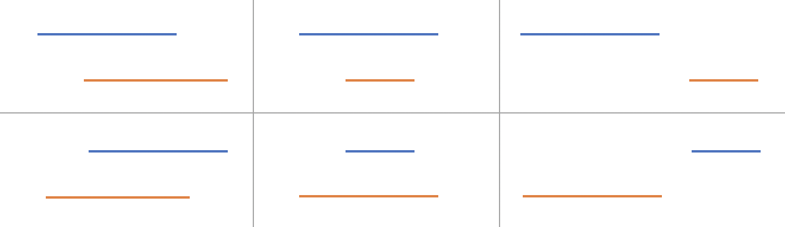
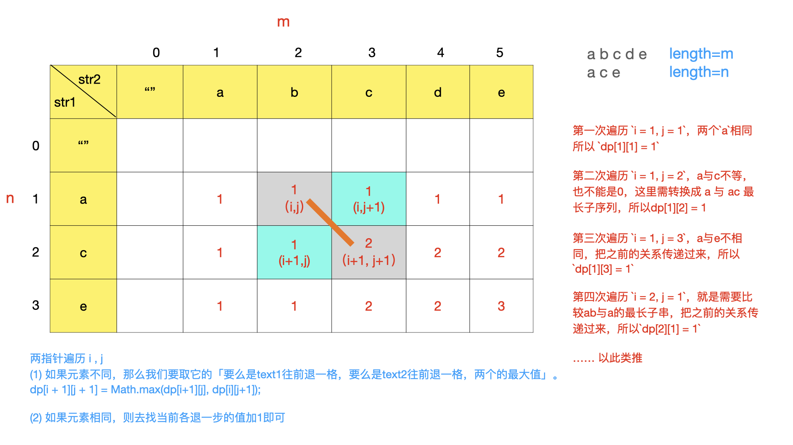
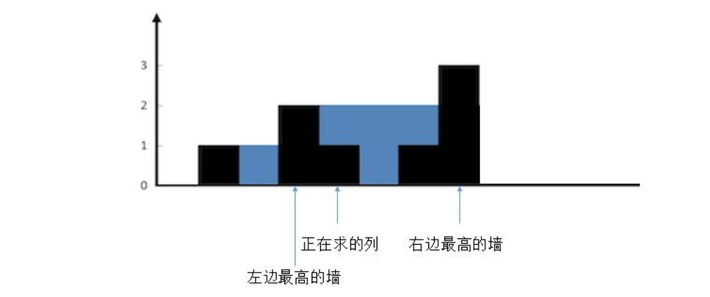
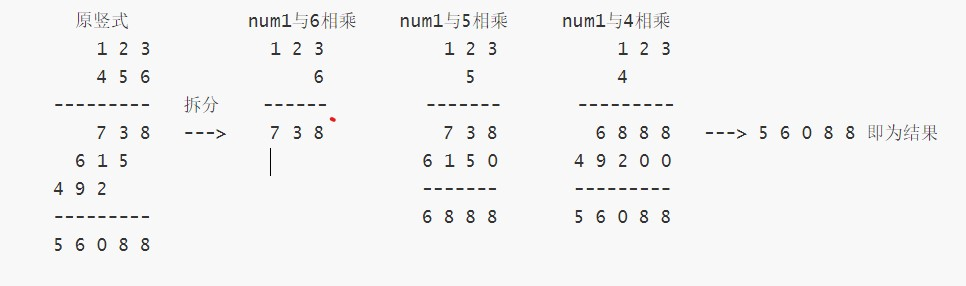

[TOC]

### 面试总结

#### 算法总结

##### 1. 算法模板

###### 回溯模板

```java
List<答案> result;
public void backTrack(路径, 选择列表){
    if(满足结束条件) {
        result.add(路径);
        return;
    }
    for (选择 in 选择列表) {
        做选择;
        backtrack(路径, 选择列表);
        撤销选择;
    }
}
```

**其核心就是 for 循环里面的递归，在递归调用之前「做选择」，在递归调用之后「撤销选择」**。**只要在递归之前做出选择，在递归之后撤销刚才的选择**，就能正确得到每个节点的选择列表和路径。

典型题目：全排列。

###### 二分模板

```java
int binarySearch(int[] nums, int target) {
    int left = 0; 
    int right = nums.length - 1; // 注意

    while(left <= right) {
        int mid = left + (right - left) / 2;
        if(nums[mid] == target)
            return mid; 
        else if (nums[mid] < target)
            left = mid + 1; // 注意
        else if (nums[mid] > target)
            right = mid - 1; // 注意
    }
    return -1;
}
```

while 里面的 left 与 right 是否相等，**以及 left 和 right 每次是 mid 还是 mid + 1，还是 mid - 1**，这需要看具体的**区间**而定。

每次 left 与 right 变化时需不需要加一减一需要看这个边界是否已经搜索过了。如果是**闭区间**的某个边界已经搜索过，那么就需要跳过。

注意「搜索区间」和 while 的终止条件，如果存在漏掉的元素，记得在最后检查。

如需定义**左闭右开**的「搜索区间」搜索左右边界，只要在 **nums[mid] == target** 时做修改即可，搜索**右侧时需要减一**。

如果将「搜索区间」全都统一成**两端都闭**，只要稍改 **nums[mid] == target** 条件处的代码和返回的逻辑即可，推荐拿小本本记下，作为二分搜索模板。

###### 层序遍历模板

**迭代法**：利用队列。

```java
public List<List<Integer>> levelOrder(TreeNode root) {
    // Base case
    if(root == null) return new ArrayList<>();
    // 使用辅助队列并将根节点入队列
    Queue<TreeNode> queue = new LinkedList<>() ;
    queue.add(root);
    List<List<Integer>> resList = new ArrayList<>();
    // 队列为空时退出循环
    while(queue.size() != 0) {
        // 获取当前队列中的元素个数，也就是当前这一层有多少个结点，这是为了控制访问到了某一层
        int size = queue.size();
        List<Integer> levelList = new ArrayList<>();
        // 将当前层的元素依次出队列并处理数据，每弹出一个结点并再次将其左右子节点入队列
        for(int i = 0; i < size; i++) {
            // 出队列并处理数据
            TreeNode temp = queue.poll();
            levelList.add(temp.val);
            // 将出队结点的左右子节点入队
            if(temp.left != null) queue.add(temp.left);
            if(temp.right != null) queue.add(temp.right);
        }
        // 这一层弹出的元素处理完毕
        resList.add(levelList);
        // 此时下一层的全部节点已经到队列中，再次循环即可
    }
    return resList;
}
```

**递归法**：

```java
public List<List<Integer>> levelOrder2(TreeNode root) {
    if (root == null) return resList;
    // 从根结点开始递归,根结点是第0层
    dfs(root, 0);
    return resList;
}

List<List<Integer>> resList = new ArrayList<>();

// 辅助方法:整体是先序遍历的模板
public void dfs(TreeNode node, int level) {
    // 说明遇到了新的一层则新建一个列表,并添加一层新的到结果中
    if (resList.size() == level) {
        resList.add(new ArrayList<>());
    }
    // 根据层数获取对应的列表并将当前节点的值加入到list中（先序遍历）
    resList.get(level).add(node.val);

    // 递归进行
    if (node.left != null) dfs(node.left, level + 1);
    if (node.right != null) dfs(node.right, level + 1);
}
```

#### 撸代码

##### 1. 数组题目

###### 两数之和

📘 **公司**：字节、华为

**题目**：普通版本，给一个数组，找出其中和为 target 的任意两个数。

```java
public int[] twoSum(int[] nums, int target) {
    
    if(nums == null || nums.length == 0) return new int[]{};
    
    Arrays.sort(nums);
    int i = 0;
    int j = nums.length - 1;
    while(i < j) {
        int sum = nums[i] + nums[j];
        if(sum > target) {
            j--;
        } else if(sum < target) {
            i++;
        } else {
            // 返回这两个数
            return new int[]{nums[i], nums[j]};
        }
    }
    return new int[]{};
}
```

**进阶**：递增数组，找出和为 k 的数对。求 a + b = k 的对数，例如 [1, 1, 2, 3, 4, 5, 6, 7, 7, 8, 9]，k = 8，这里应该是 5 对。

**双指针遍历**：用头尾两个指针，分别开始遍历，两个数字和大于 k 时，右指针向前移动，小于 k 时左指针向后移动。

```java
public ArrayList<Integer> findPair(int[] nums, int k){
    int len = nums.length;
    int i = 0;
    int j = len - 1;
    ArrayList<Integer> resList = new ArrayList<>();
    while(i < j){
        if(nums[i] + nums[j] < k){
            i++;
        } else if (nums[i] + nums[j] > k){
            j--;
        } else {
            resList.add(nums[i]);
            resList.add(nums[j]);
        }
    }
    return resList;
}
```

###### 三数之和

📘 **公司**：字节

**题目**：普通三数之和。

**题解**：暴力法，排序+二分查找，**排序+双指针代码如下**。

```java
public static List<List<Integer>> threeSum(int[] nums) {
    List<List<Integer>> resList = new ArrayList();
    // Base case
    int len = nums.length;
    if (len < 3) return resList;
    // 对原始数组排序
    Arrays.sort(nums);

    for (int i = 0; i < len; i++) {
        // 如果当前数字大于0，则三数之和一定大于0，所以结束循环
        if (nums[i] > 0) break;
        // 去重相同的数就判断一次即可
        if (i > 0 && nums[i] == nums[i - 1]) continue;
        // 当前元素右边部分的左右指针
        int left = i + 1;
        int right = len - 1;
        while (left < right) {
            int sum = nums[i] + nums[left] + nums[right];
            if (sum == 0) {
                resList.add(Arrays.asList(nums[i], nums[left], nums[right]));
                // 去重
                while (left < right && nums[left] == nums[left + 1]) left++; 
                while (left < right && nums[right] == nums[right - 1]) right--; 
                left++;
                right--;
            } else if (sum < 0) {
                left++;
            } else if (sum > 0) {
                right--;
            }
        }
    }
    return resList;
}
```

**拓展**：最接近三数之和。

**拓展**：给定一个数组，找出所有的三个数之和为零的组合。

###### 合并两个有序数组

📘 **公司**：字节(2)

**题目**：有两个排序数组 nums1（长度为 m） 和 nums2（长度为 n），**原地合并数组**。假设 nums1 有**足够的空间**放下 nums2。

**从后往前遍历，将值从后往前存入**。存入时比较当前两个指针指向的数字大小，选较大的存入，然后往前移动指针。

```java
public void merge(int[] nums1, int m, int[] nums2, int n) {
    // 表示从后向前当前插入位置
    int index = m + n - 1;
    // 指向nums1末尾
    int p1 = m - 1;
    // 指向nums2末尾
    int p2 = n - 1;
    // 将数组nums2全部数据插入到数组nums1为止
    while (p2 >= 0) {
        // p1位置有效且p1值较大
        if(p1 >= 0 && nums1[p1] >= nums2[p2]) {
            nums1[index] = nums1[p1];
            p1--;
        } else {
            nums1[index] = nums2[p2];
            p2--;
        }
        // 从右往左移动index
        index--;
    }
}
```

###### 合并区间(H)

📘 **公司**：字节、猿辅导

**题目**：给出一个区间的集合，请**合并所有重叠的区间**。

```java
输入: [[1,3],[2,6],[8,10],[15,18]]  输出: [[1,6],[8,10],[15,18]]
解释: 区间 [1,3] 和 [2,6] 重叠, 将它们合并为 [1,6].
```

**题解**：按照全部区间的第一个元素排序，然后使用一个列表来遍历合并。整体就是两两合并区间。两个区间的**六种关**系。



```java
public int[][] merge(int[][] intervals) {
    int len = intervals.length;
    if (len < 2) return intervals;

    // 按照起点排序
    Arrays.sort(intervals, Comparator.comparingInt(o -> o[0]));

    // 也可以使用 Stack，因为我们只关心结果集的最后一个区间
    List<int[]> res = new ArrayList<>();
    res.add(intervals[0]);

    for (int i = 1; i < len; i++) {
        // 取出当前区间
        int[] temp = intervals[i];
        // 每次新的区间与当前结果集中的最后一个区间的末尾端点进行比较
        int[] peek = res.get(res.size() - 1);
        if (temp[0] <= peek[1]) {
            // 注意:这里应该取最大
            peek[1] = Math.max(temp[1], peek[1]);
        } else {
            // 说明两者完全不重叠
            res.add(temp);
        }
    }
    return res.toArray(new int[res.size()][]);
}
```

###### 和为S的连续正整数序列

📘 **公司**：字节

**题目**：输入一个正整数 target ，输出所有和为 target 的**连续正整数**序列（至少含有两个数）。序列内的数字由小到大排列，不同序列按照首个数字从小到大排列。输入：target = 9。输出：[[2, 3, 4], [4, 5]]。

**滑动窗口**：窗口左右两端都只能向右移动，当和小于 sum 时，j++，和大于 sum 时，i++，和等于 sum 就记录下窗口中 i 到 j 中的序列，然后窗口继续后移，查找下一个满足条件的序列。

```java
public int[][] findContinuousSequence(int target) {
    // 窗口仅含1
    int i = 1;
    int j = 1;
    int sum = 0;
    List<int[]> resList = new ArrayList<>();
    // 序列是由小到大排列，所以如果 i>target/2，那么i+i+1肯定大于target
    while (i <= target / 2) {
        // 如果小于目标值就移动右边界同时加上右边界值
        if (sum < target) {
            sum = sum + j;
            j++;
            // 大于目标值就移动左边界同时减去左边界值
        } else if (sum > target) {
            sum = sum - i;
            i++;
            // 相等的值出现了就记录到结果列表中
        } else {
            int[] temp = new int[j - i];
            for (int m = i; m < j; m++) temp[m - i] = m;
            resList.add(temp);
            // 左边界向右移动
            sum = sum - i;
            i++;
        }
    }
    return resList.toArray(new int[resList.size()][]);
}
```

###### 和为S的正整数序列个数

**题目**：一个数组里面多个元素和等于 target 的答案数（**多个元素可以不连续**）。

一开始用的滑动窗口，后来在面试官的提示下用动态规划做。比如：数组[2,1,3,4,5,10]，target=5  答案为 3 个，即[2, 3], [5], [1, 4]。

###### 有序重复数组确定目标值范围

📘 **公司**：字节

可以使用**滑动窗口**。能否使用二分？？

###### 有序数组的平方(H)

📘 **公司**：字节(2)

**题目**：有序数组平方后，数组当中有多少不同的数字（相同算一个）。

如果不是排序数组，可以使用 Set 来保存数字的平方，重复就存不进去。

**题解**：**排序数组平方后两头大，中间小，可以用双指针共同向中间扫描，扫描时去掉重复元素**，同时用一个 res 来记录有多少个不同数字。

```java
public int diffSquareNum(int nums[]) {
    int n = nums.length;
    if(n == 0 || nums == null) return 0;
    int sum = 0;
    int left = 0;
    int right = n - 1;
    while(left <= right){
        // 说明两个数平方相同
        if(nums[left] + nums[right] == 0){
            sum++;
         	// 这里开始去掉后面重复的数字
            int temp = nums[left]; 
            while(left <= right && nums[left] == temp)
                left++;
            while(left <= right && nums[right] == -temp)
                right--;
        } else if (nums[left] + nums[right] < 0){
            sum++;
            int temp = nums[left];
            while(left <= right && nums[left] == temp)
                left++;
        } else {
            sum++;
            int temp = nums[right];
            while(left <= right && nums[right] == temp)
                right--;
        }
    }
    return sum;
}
```

###### 先增后减数组中不重复数字个数

📘 **公司**：字节

**题目**：一个数组**先递增再递减**，找出数组不重复的个数，比如 [1, 3, 9, 1]，结果为 3，不能使用额外空间，复杂度 o(n)。

**题解**：类似上一题，双指针从两头向中间逼近。

```java
public int diffnum(int[] nums) {
    int n = nums.length;
    if (n == 0 || nums == null) return 0;
    int left = 0;
    int right = n - 1;
    int sum = 0;
    while (left <= right) {
        if (nums[left] == nums[right]) {
            sum++;
            int temp = nums[left];
            while (left <= right && nums[right] == temp)
                right--;
            while (left <= right && nums[left] == temp)
                left++;
        } else if (nums[left] < nums[right]) {
            sum++;
            int temp = nums[left];
            while (left <= right && nums[left] == temp)
                left++;
        } else {
            sum++;
            int temp = nums[right];
            while (left <= right && nums[right] == temp)
                right--;
        }
    }
    return sum;
}
```

###### 螺旋打印矩阵(H)

📘 **公司**：字节、猿辅导(2)、拼多多

**题目**：给一个 n * n 的**方阵**，螺旋填入数字。

```java
public int[][] generateMatrix(int n) {
    int[][] nums = new int[n][n];
    int num = 1;
    int up = 0;
    int right = n - 1;
    int down = n - 1;
    int left = 0;
    // 直到num小于平方
    while (num <= n * n) {
        for (int col = left; col <= right; col++) {
            nums[up][col] = num;
            num++;
        }
        up++;
        for (int row = up; row <= down; row++) {
            nums[row][right] = num;
            num++;
        }
        right--;
        for (int col = right; col >= left; col--) {
            nums[down][col] = num;
            num++;
        }
        down--;
        for (int row = down; row >= up; row--) {
            nums[row][left] = num;
            num++;
        }
        left++;
    }
    return nums;
}
```

**题目**：给定一个矩阵，螺旋打印出来。

###### 矩阵顺时针翻转90度

📘 **公司**：猿辅导

###### 全排列(H)

📘 **公司**：字节(2)、拼多多

**题目**：给定一个数组，输出全部组合。

利用回溯算法的模板。n 个不重复的数，全排列共有 **n!** 个。

下面是**无重复数字**的全排列。

```java
List<List<Integer>> res = new LinkedList<>();

List<List<Integer>> permute(int[] nums) {
    // 使用一个列表来记录「路径」
    LinkedList<Integer> track = new LinkedList<>();
    backTrack(nums, track);
    return res;
}

// 路径:记录在track中
// 选择列表:nums中不存在于track的那些元素
// 结束条件:nums中的元素全都在track中出现
public void backTrack(int[] nums, LinkedList<Integer> track) {
    // 触发结束条件
    if (track.size() == nums.length) {
        res.add(new LinkedList(track));
        return;
    }
    // 挨着递归
    for (int i = 0; i < nums.length; i++) {
        // 排除不合法的选择
        if (track.contains(nums[i])) continue;
        // 做选择
        track.add(nums[i]);
        // 进入下一层决策树
        backTrack(nums, track);
        // 取消之前的选择
        track.removeLast();
    }
}
```

###### 岛屿数量

📘 **公司**：猿辅导、拼多多

**题解**：使用回溯模板。

```java
public int numIslands(char[][] grid) {
    int res = 0;
    for (int i = 0; i < grid.length; i++) {
        for (int j = 0; j < grid[0].length; j++) {
            // 如果当前格子是1,则代表是新的岛屿
            if (grid[i][j] == '1') {
                // 通过深度优先遍历把这个岛屿所涉及的全部位置找出来并座上标记
                dfs(grid, i, j);
                res++;
            }
        }
    }
    return res;
}

private void dfs(char[][] grid, int i, int j) {
    // 不能越界，同时所访问的位置不能为0或者2
    if (i < 0 || j < 0 || i >= grid.length || j >= grid[0].length || grid[i][j] == '0' || grid[i][j] == '2') return;
    // 访问之后标记已经被访问
    grid[i][j] = '2';
    dfs(grid, i + 1, j);
    dfs(grid, i, j + 1);
    dfs(grid, i - 1, j);
    dfs(grid, i, j - 1);
}
```

###### 岛屿最大面积

与上题类似，回溯。

```java
public int maxAreaOfIsland(int[][] grid) {
    int res = 0;
    for (int i = 0; i < grid.length; i++) {
        for (int j = 0; j < grid[0].length; j++) {
            // 如果当前格子是1,则代表是新的岛屿
            // 通过深度优先遍历把这个岛屿所涉及的全部位置找出来并座上标记
            res = Math.max(res, dfs(grid, i, j));
        }
    }
    return res;
}

private int dfs(int[][] grid, int i, int j) {
    // 不能越界，同时所访问的位置不能为0或者2
    if (i < 0 || j < 0 || i >= grid.length || j >= grid[0].length || grid[i][j] == 0 || grid[i][j] == 2) return 0;
    // 到了这里说明是一个新的格子，此时面积应该+1
    // 访问之后标记已经被访问
    grid[i][j] = 2;
    int area1 = dfs(grid, i + 1, j);
    int area2 = dfs(grid, i, j + 1);
    int area3 = dfs(grid, i - 1, j);
    int area4 = dfs(grid, i, j - 1);
    return area1 + area2 + area3 + area4 + 1;
}
```

###### 加油站

📘 **公司**：字节

**[题目](https://leetcode-cn.com/problems/gas-station/)**：在一条环路上有 N 个加油站，其中第 i 个加油站有汽油 gas[i] 升。你有一辆油箱容量无限的的汽车，从第 i 个加油站开往第 i+1 个加油站需要消耗汽油 cost[i] 升。你从其中的一个加油站出发，开始时油箱为空。如果你可以绕环路行驶一周，则返回出发时加油站的编号，否则返回 -1。**输入:** gas = [1,2,3,4,5] cost = [3,4,5,1,2] **输出:** 3。

```java
public int canCompleteCircuit(int[] gas, int[] cost) {
    int len = gas.length;
    // 总油量
    int sumTank = 0;
    // 当前油箱内的油量
    int curTank = 0;
    int startStation = 0;
    for (int i = 0; i < len; i++) {
        sumTank += gas[i] - cost[i];
        curTank += gas[i] - cost[i];
        if (curTank < 0) {
            startStation = i + 1;
            curTank = 0;
        }
    }
    return sumTank >= 0 ? startStation : -1;
}
```

###### 圆圈中剩下的数字

📘 **公司**：字节

[**题目**](https://leetcode-cn.com/problems/yuan-quan-zhong-zui-hou-sheng-xia-de-shu-zi-lcof/)：让小朋友们围成一个**大圈**。然后，随机指定一个**数 m**，让编号**为 0 的小朋友开始报数**。每次喊到 **m-1** 的那个小朋友要出列唱首歌，然后可以在礼品箱中任意的挑选礼物，并且**不再回到圈中**，从他的下一个小朋友开始，继续 **0...m-1 报数** .... 这样下去 .... 直到剩下最后一个小朋友，可以不用表演。

```java
public int lastRemaining(int n, int m) {
    // 构造一个链表
    ArrayList<Integer> list = new ArrayList<>();
    // 将数字加到链表中
    for (int i = 0; i < n; i++) list.add(i);

    int index = 0;
    // 不断移除一个元素直到只剩下一个元素
    while (list.size() > 1) {
        // index +=m-1;
        // while(index>list.size()-1) index = index-list.size();
        // 上面两步等价于下面用需要报的数对当前链表长度取模
        index = (index + m - 1) % list.size();
        // 去掉这个位置的元素
        list.remove(index);
    }
    return list.get(0);
}
```

[还可以反推](https://leetcode-cn.com/problems/yuan-quan-zhong-zui-hou-sheng-xia-de-shu-zi-lcof/solution/javajie-jue-yue-se-fu-huan-wen-ti-gao-su-ni-wei-sh/)：

```java
public int lastRemaining(int n, int m) {
    int ans = 0;
    // 最后一轮剩下2个人，所以从2开始反推
    for (int i = 2; i <= n; i++) {
        ans = (ans + m) % i;
    }
    return ans;
}
```

###### 下一个更大的数

📘 **公司**：字节

**题目**：**找出给定数字下一个比它大的数字**。如果不存在下一个更大的排列，则将数字重新排列成最小的排列（即升序排列）。


从右往左找第一个降序的序列（图中找到 4），然后再从右往左寻找第一个大于当前位置的数（5），交换 4 和 5，最后逆序 4 后面部分数字。

```java
public void nextPermutation(int[] nums) {
    // 从右往左找第一个降序的位置
    int i = nums.length - 2;
    while (i >= 0 && nums[i + 1] <= nums[i]) {
        i--;
    }
    // 从右往左找第一个大于i位置的元素
    if (i >= 0) {
        int j = nums.length - 1;
        while (j >= i && nums[j] <= nums[i]) {
            j--;
        }
        // 交换两个
        swap(nums, i, j);
    }
    // 逆序i后面的全部元素
    reverse(nums, i + 1);
}

private void reverse(int[] nums, int start) {
    int i = start, j = nums.length - 1;
    while (i < j) {
        swap(nums, i, j);
        i++;
        j--;
    }
}

private void swap(int[] nums, int i, int j) {
    int temp = nums[i];
    nums[i] = nums[j];
    nums[j] = temp;
}
```

###### 无序数组第一个缺失的数

📘 **公司**：字节

**题目**：一个无序数组，从小到大找到第一个缺的数，比如[8 2 4 3 6 9 7 11 12]，第一个缺的就是 5。

用**数组**作为哈希表，将数字 i 放入数组中的 i **索引处**，然后**找中间没有存入数字的位置**。时间和空间复杂度都是 O(N)。

```java
public int findLost(int[] nums) {
    // 找到最大值和最小值
    int min = nums[0];
    int max = nums[0];
    for (int value : nums) {
        min = Math.min(min, value);
        max = Math.max(max, value);
    }
    int[] temp = new int[max - min + 1];
    for (int i = 0; i < temp.length; i++) {
        temp[i] = min - 1;
    }
    for (int value : nums) temp[value] = value;
    int i = 0;
    // 找到没有的地方
    while (i < temp.length) {
        if (temp[i] == min - 1) break;
        i++;
    }
    return i;
}
```

可以使用位图节省空间。

###### 最小未出现正数

📘 **公司**：字节

###### 有序数组的中位数

📘 **公司**：字节

一个有序数组，从随机一位截断，把前段放在后边，如 4 5 6 7 1 2 3求中位数

###### 数组不重复的个数

📘 **公司**：字节

一个数据先递增再递减，找出数组不重复的个数，比如 [1, 3, 9, 1]，结果为3，不能使用额外空间，复杂度o(n)

###### 跳跃游戏

📘 **公司**：字节

**题目(leetcode55)**：给一个数组，例如[1, 2, 3, 4, 5]，a[i] 表示在该位置可以向前行走的最大距离，判断是否可以到达数组的最后一个元素。

贪心思想：**每次走最大的距离**，如果能超过末尾元素，说明只要调小步伐就一定可以达到最后位置。依据：**如果一个位置能够到达，那么这个位置左侧所有位置都能到达**。

```java
public boolean canJump(int[] nums) {
    int len = nums.length;
    int rightmost = 0;
    for (int i = 0; i < len; ++i) {
        if (i <= rightmost) {
            rightmost = Math.max(rightmost, i + nums[i]);
            if (rightmost >= len - 1) {
                return true;
            }
        }
    }
    return false;
}
```

```java
public boolean canJump2(int[] nums) {
    // 数组第一个元素为0且数组元素大于一个的时候,必定不能到达
    if (nums[0] == 0 && nums.length > 1) return false;
    // 未跳过的0的数量
    int zeroCounter = 0;
    for (int i = 0; i < nums.length - 1; i++) {
        // 遇到0,未跳过的0计数+1
        if (nums[i] == 0) {
            zeroCounter++;
            for (int j = 0; j < i; j++) {
                if (nums[j] >= i - j + 1) {
                    // 如果遇到的这个0前面有数字可以跳过它,那么未跳过的0计数-1
                    zeroCounter--;
                    // 跳过之后就去寻找下一个0
                    break;
                }
            }
        }
    }
    // 如果所有的0都能跳过，那么未跳过的0计数为0，返回true
    if (zeroCounter == 0) return true;
    return false;
}
```

###### 最长公共子序列(H)

📘 **公司**：字节(2)、猿辅导

**题目**：给定两个字符串 text1 和 text2，返回这两个字符串的**最长公共子序列的长度**。



```java
public int longestCommonSubsequence(String text1, String text2) {
    int m = text1.length(), n = text2.length();
    int[][] dp = new int[m + 1][n + 1];
    for (int i = 0; i < m; i++) {
        for (int j = 0; j < n; j++) {
            // 分别获取两个串的字符
            char c1 = text1.charAt(i), c2 = text2.charAt(j);
            if (c1 == c2) {
                // 去找它们前面各退一格的值加1即可
                dp[i + 1][j + 1] = dp[i][j] + 1;
            } else {
                // 要么是text1往前退一格，要么是text2往前退一格，两个的最大值
                dp[i + 1][j + 1] = Math.max(dp[i + 1][j], dp[i][j + 1]);
            }
        }
    }
    return dp[m][n];
}
```

###### 数组最长递增子序列(H)

📘 **公司**：字节(2)

**普通**：找最长递增子序列的**长度**。状态转移方程如下：

```java
dp[i] = max{1 + dp[j] for j < i if num[j] < num[i]}
```

**也就是当前的 dp[i] 等于之前的所有小于 nums[i] 的位置中 dp 值最大的。**

```java
public int lengthOfLIS(int[] nums) {
    // Base case
    int len = nums.length;
    if (len == 0) return 0;

    int res = 1;
    int[] dp = new int[len];
    // 初始化dp，全部填充为1
    Arrays.fill(dp, 1);

    for (int i = 1; i < len; i++) {
        // 找到之前所有小于nums[i]的值中dp值最大的
        for (int j = 0; j < i; j++) {
            if (nums[j] < nums[i]) {
                dp[i] = Math.max(dp[i], dp[j] + 1);
            }
        }
    }
    // 找dp中最大的值
    for (int i = 0; i < len; i++) {
        res = Math.max(dp[i], res);
    }
    return res;
}
```

这里还可以**优化成二分**的，暂时不会写。

**升级**：返回这个递增子数组。

```java
public List<List<Integer>> lengthOfLIS3(int[] nums) {
    List<List<Integer>> resList = new ArrayList<>();
    int n = nums.length;
    if (n == 0) return null;

    int maxLength = 1;
    int[] dp = new int[n];
    // 初始化dp
    Arrays.fill(dp, 1);

    for (int i = 1; i < n; i++) {
        for (int j = 0; j < i; j++) {
            if (nums[j] < nums[i]) {
                dp[i] = Math.max(dp[i], dp[j] + 1);
            }
        }
        // 每次更新最大的值
        maxLength = Math.max(maxLength, dp[i]);
    }

    // 记录一下有几个最长上升子序列及其位置
    List<Integer> lisIndex = new ArrayList<>();
    // 寻找所有最大上升子序列的结束位置
    for (int i = 0; i < n; i++) {
        if (dp[i] == maxLength) {
            lisIndex.add(i);
        }
    }

    for (int lastIndex : lisIndex) {
        ArrayList<Integer> list = new ArrayList<>();
        int nowMemoCount = dp[lastIndex];
        for (int i = lastIndex; i >= 0; i--) {
            if (nowMemoCount - dp[i] == 1 || nowMemoCount - dp[i] == 0) {
                list.add(nums[i]);
                nowMemoCount--;
            }
        }
        // 由于是从后往前加的结果，需要转换结果
        Collections.reverse(list);
        resList.add(list);
    }
    return resList;
}
```

###### 数组最长数值连续序列

📘 **公司**：字节

**题目**：给定一个未排序的整数数组，找出最长连续序列的长度。

```java
输入: [100, 4, 200, 1, 3, 2] 输出: 4
解释: 最长连续序列是 [1, 2, 3, 4]。它的长度为 4。
```

**题解**：使用**哈希表**，这个题好像没有使用动态规划，直接用**哈希表可以有 O(N) 复杂度**。

```java
public int longestConsecutive(int[] nums) {
    if (nums.length == 0) return 0;
    // 记录区间 [left, right]
    Map<Integer, Integer> map = new HashMap<>();
    // 数据全部放入到map中,键值都是这个数字
    for (int left : nums) map.put(left, left);
    int max = Integer.MIN_VALUE;
    for (int num : nums) {
        int right = num;
        // 利用前面已知的右边界，快速找到当前需要的右边界
        while (map.containsKey(right + 1)) {
            right = map.get(right + 1);
        }
        map.put(num, right);
        max = Math.max(max, right - num + 1);
    }
    return max;
}
```

###### 连续子数组最大乘积

📘 **公司**：字节

###### 最短连续子数组

求和大于N的最短连续子数组的长度

###### 最大子段和

📘 **公司**：字节

###### 接雨水(H)

📘 **公司**：字节(4)

**题目**：普通接雨水。对于**每一列**来说，他能存的雨水量是他左边**最高墙和右边最高墙中较低的那堵墙的高度**减去自身墙的高度。所以可以用**数组记录每列左右最高墙的高度**，然后计算每一列可以存的雨水量。   



**普通遍历法**：时间O(N^2)，空间O(1)。也就是每到**一个新的位置**就找左边最高的和右边最高的，如果比两边都低则能接雨水。否则没有雨水。

动态规划：时间复杂度O(N)，空间复杂度O(N)。使用动态规划可以减少每次找左右最高的重复次数。也就是直接**用两个数组分别保存当前位置左右出现过的最大高度**。leftMax 与 rightMax 是**单调递增**的。

```java
public int trap2(int[] height) {
    int sum = 0;
    int[] leftMax = new int[height.length];
    int[] rightMax = new int[height.length];

    for (int i = 1; i < height.length - 1; i++) {
        // 当前位置与前一个位置比较
        leftMax[i] = Math.max(leftMax[i - 1], height[i - 1]);
    }
    for (int i = height.length - 2; i >= 0; i--) {
        rightMax[i] = Math.max(rightMax[i + 1], height[i + 1]);
    }
    for (int i = 1; i < height.length - 1; i++) {
        // 找到左右中最小的一个,这个最小值必须大于当前高度才能有水
        int min = Math.min(leftMax[i], rightMax[i]);
        if (min > height[i]) {
            sum = sum + (min - height[i]);
        }
    }
    return sum;
}
```

###### 二维接雨水

📘 **公司**：字节

###### 有序数组查找一个元素第一次出现的位置

📘 **公司**：字节

###### 矩阵中的最长递增路径长度

📘 **公司**：字节

给定 **m * n** 的矩阵，可以从**任意位置**开始，向上下左右四个方向移动，要求下一个位置上的元素要大于当前元素，找出矩阵中最长递增路径长度。

###### 放苹果的方法数

📘 **公司**：字节

放苹果(把 M 个同样的苹果放在 N 个同样的盘子里，允许有的盘子空着不放，问共有多少种不同的分法？)
注意：5、1、1 和 1、5、1 是同一种分法，即顺序无关。

###### 视频拼接

📘 **公司**：字节

LeetCode1024

###### 尽可能参加会议的个数

📘 **公司**：字节

https://leetcode-cn.com/problems/maximum-number-of-events-that-can-be-attended/

###### 下一个更大的数字

📘 **公司**：字节

https://leetcode-cn.com/problems/daily-temperatures

变化：一个数组，求对于每个元素，比它小的左边的第一个元素下标，输出一个数组。

###### 二维数组输出为一维数组

二维数组，每一行是有序的，输出为一个一维有序数组，口述。

###### 矩阵中的路径

📘 **公司**：字节

剑指offer题目

###### 一个数组向左滚动k个单位

📘 **公司**：字节

一个数组向左滚动k个单位，然后需要你各种优化

###### 合并K个有序数组

📘 **公司**：字节

算法 合并k个有序数组，先说思路，说了两两合并、分治。让写分治

###### 有序数组第一个不小于target的下标

📘 **公司**：字节

返回指向有序范围数组中第一个不小于（即大于或等于）指定target 的下标，或若找不到这种元素则返回 -1,时间复杂度要求O(log n)。有人说这题跟leetcode35一样，但是面试官说的是这题的元素可以重复的，leetcode是保证不会重复的。

```java
public static int helper(int[] array, int target) {
    // 三个边界条件: 1.数组是空  2.数组长度是0  3.数组的最大的那个数都比target小
    if (array == null || array.length == 0 || array[array.length - 1] < target) {
        return -1;
    }
    int start = 0;
    int end = array.length - 1;
    while (start < end) {
        int mid = (start + end) / 2;
        if (array[mid] >= target) {
            end = mid;
        } else {
            start = mid + 1;
        }
    }
    return start;
}
```

###### 有序数组中目标值第一次出现的位置

📘 **公司**：字节、猿辅导

字节：我先口述了直接遍历，哈希表，然后提出要用二分，他说那就写个二分吧。一开始写的是正常的二分，发现没有考虑重复元素的情况，然后改成查找左边界了。然后给面试官解释了一下，面试官明白了就没出题了。

猿辅导：非严格递增数组1，2，3，3，3，4，5，找到目标数字所在的第一个位置，无则输出-1，如3，输出2，要求O(log n);

###### 两个有序数组找第k个

📘 **公司**：字节

要求O(logk)时间复杂度

###### 二维数组中的查找

📘 **公司**：字节

剑指offer

###### 找出重复一次的元素

📘 **公司**：字节

一个长度为N的数组，里面元素值在1-N之间（闭区间）。找出重复元素 时间O(n) 空间O(1)

###### 马走日

📘 **公司**：猿辅导

马走日，判断能否从一个点到另一个点，并返回路径

###### 1-n的字典排序数组

📘 **公司**：猿辅导

给定一个数n，输出1-n的字典排序数组，如n=160，输出[1,10,100,101,....,109,11,110,....,160]

###### 看电影问题

📘 **公司**：猿辅导

已知电影开始与结束时间，看最多场电影

###### 找出只出现一次的数字

📘 **公司**：猿辅导

###### 有序数组中唯一出现一次的数

📘 **公司**：猿辅导

[1,1,2,2,3,3,4,5,5,6,6,7,7......]有序数组中唯一的数，输出4。要求时间复杂度o(lgn)

###### 区间列表的交集

📘 **公司**：猿辅导

lc986

###### 对角线遍历

📘 **公司**：猿辅导

https://leetcode-cn.com/problems/diagonal-traverse/

###### 最大正方形面积

📘 **公司**：猿辅导

https://blog.csdn.net/xiezongsheng1990/article/details/79938839

###### 数组切分

📘 **公司**：猿辅导

把一组数（范围1-100）分成两组使得两组数的平均值之差最大

###### 八皇后

📘 **公司**：猿辅导

###### 组合总和

📘 **公司**：字节

https://leetcode-cn.com/problems/combination-sum-iii/

###### 除自身以外数组的乘积

📘 **公司**：字节

LeetCode238

##### 2. 链表题目

###### 链表求和(H)

📘 **公司**：字节、猿辅导(3)

**题目**：给定两个用链表表示的整数，每个节点包含一个数位。这些数位是**反向存放**的，也就是个位排在链表首部。编写函数对这两个整数求和，并用链表形式返回结果。

```java
public ListNode addTwoNumbers(ListNode list1, ListNode list2) {
    // 引入dummy结点
    ListNode dummy = new ListNode(0);
    ListNode head1 = list1, head2 = list2, cur = dummy;
    // 进位标志
    int carry = 0;
    // 当两链表都为null才退出
    while (head1 != null || head2 != null) {
        // 取链表的值，如果一个已经为null则返回0
        int value1 = (head1 != null) ? head1.val : 0;
        int value2 = (head2 != null) ? head2.val : 0;
        // 带进位值计算和
        int sum = carry + value1 + value2;
        // 再次更新进位
        carry = sum / 10;
        // 生成新的结点
        cur.next = new ListNode(sum % 10);
        cur = cur.next;
        // 如果链表不为null还要继续移动指针进行下一轮相加
        if (head1 != null) head1 = head1.next;
        if (head2 != null) head2 = head2.next;
    }
    // 最后还需要再次看看进位标志是否为1
    if (carry > 0) {
        cur.next = new ListNode(carry);
    }
    return dummy.next;
}
```

如果是**顺序存放**，那么**直接逆序，求和之后再逆序**。

###### 链表实现一个栈

📘 **公司**：字节

###### 链表首个相交结点

📘 **公司**：字节(2)

两个链表，可能相交，找出相交的节点

###### 有环链表入口节点(H)

📘 **公司**：字节(2)

**题解**：设置快慢指针，都从链表头出发，快指针每次走两步，慢指针一次走一步，假如有环，一定相遇于环中某点。接着让两个指针分别从相遇点和链表头出发，两者都改为每次走一步，最终相遇于环入口。证明一下：


计算式如下：


```java
public ListNode EntryNodeOfLoop(ListNode head) {
    ListNode fast = head;
    ListNode slow = head;
    if (fast == null || fast.next == null) return null;
    // 快慢指针移动
    while (fast != null && fast.next != null) {
        fast = fast.next.next;
        slow = slow.next;
        // 双指针相遇
        if (fast == slow) break;
    }
    // 慢指针重新回到头
    slow = head;
    // 两指针同时移动
    while (fast != slow) {
        fast = fast.next;
        slow = slow.next;
    }
    return fast;
}
```


###### 反转链表的M到N部分(2)

📘 **公司**：字节(2)、猿辅导(2)

###### 合并两个有序链表(2)

📘 **公司**：字节、猿辅导

递归+迭代

###### 合并k个链表(3)

📘 **公司**：字节

###### 链表按指定size翻转

📘 **公司**：字节

###### 链表倒数第K个结点(2)

📘 **公司**：字节

###### 拷贝带有随机指针的链表

📘 **公司**：字节

###### 回文链表(3)

📘 **公司**：字节

###### 删除链表重复元素(2)

📘 **公司**：猿辅导(2)

去除单向链表中重复的元素，只要出现重复一个不留1 2 2 3-->1 3

###### 反转链表(H)

📘 **公司**：猿辅导(2)

**迭代（头插法）**：

```java
public ListNode reverseList(ListNode head) {
    if(head == null || head.next == null) return head;
    // 引入dummy结点
    ListNode dummy = new ListNode(0);
    // 使用一个cur表示当前正在反转的结点
    ListNode cur = head;
    // head一直后移
    head = head.next;
    // 先把链表第一个结点放到dummy后面当做反转后的最后一个结点
    dummy.next = cur;
    cur.next = null;
    // 下面就是不断遍历了
    while(head != null) {
        // cur指向头结点
        cur = head;
        // 移动头结点
        head = head.next;
        // 将cur结点插入到dummy结点之后形成新的链表
        cur.next = dummy.next;
        dummy.next = cur;
    }
    return dummy.next;
}
```

递归：

```java
public ListNode reverse(ListNode head) {
    // 递归的终止条件 只有一个元素或者无元素返回
    if (head == null || head.next == null) return head;

    ListNode newHead = reverse(head.next);
    // 使用一个temp来保存下一个结点的指针
    ListNode temp = head.next;
    temp.next = head;
    head.next = null;
    return newHead;
}
```

###### 双向链表逆序

📘 **公司**：猿辅导

```java
private static DoubleNode reversalList(DoubleNode head) {
    DoubleNode pre = null;
    DoubleNode next;
    while (head != null) {
        next = head.next;
        head.next = pre;
        head.pre = next;
        pre = head;
        head = next;
    }
    return pre;
}
```

###### K个一组反转链表(H)

📘 **公司**：字节(2)、猿辅导

```java
public ListNode reverseKGroup(ListNode head, int k) {
    // 由于要操作第一个节点 引入dummy节点
    ListNode dummy = new ListNode(0);
    dummy.next = head;
    // 初始化双指针
    ListNode slow = dummy;
    ListNode fast = dummy;
    while (true) {
        // 让fast遍历到需要翻转的最后一个元素位置
        for (int i = 0; i < k && fast != null; i++) {
            fast = fast.next;
        }
        // 只要fast遍历到了null说明长度不够一次反转直接跳出循环
        if (fast == null) break;
        // 下面就是画图改变指针指向
        // 为了别把链表搞丢，记录一下后面等待反转的链表头结点
        ListNode remainList = fast.next;
        // 定义start指向翻转元素的第一个位置
        ListNode reverseStart = slow.next;
        // 最后一个翻转元素先断链
        fast.next = null;
        // 然后通过翻转方法reverse()后接在slow后面
        slow.next = reverseList(reverseStart);
        // 保持下次循环一致的位置
        reverseStart.next = remainList;
        slow = reverseStart;
        // 反转之后重置指针
        fast = slow;
    }
    return dummy.next;
}

// 迭代反转链表的模板
public ListNode reverseList(ListNode head) {
    // 初始化两个指针指向null
    ListNode pre = null;
    ListNode next = null;

    while (head != null) {
        next = head.next;
        head.next = pre;
        pre = head;
        head = next;
    }
    return pre;
}
```

###### 链表排序

📘 **公司**：猿辅导

###### 比给定值大的结点移到链表末尾

📘 **公司**：猿辅导

一个链表，给定一个目标值，比目标值大的节点去到链表后面，要求不改变相对顺序

比如1 3 2 1 3 2 1 给定目标值2，返回链表1 2 1 2 1 3 33.

###### 拆分奇偶链表

📘 **公司**：猿辅导(3)

###### 对链表排序

📘 **公司**：猿辅导(2)

对链表进行Sort，Node的val为final，不允许使用数组，List，因为考察的是对链表的操作

##### 3. 栈与队列

###### 最小值栈(H)

📘 **公司**：字节(2)

**普通问题**：实现一个能够返回最小值的最小值栈。

```java
// 存放数据的栈
private Stack<Integer> dataStack = new Stack<>();
// 存放最小元素的栈
private Stack<Integer> minStack = new Stack<>();

public void push(int node) {
    // 所有数据正常压入普通栈
    dataStack.push(node);
    // 如果为空直接加
    if(minStack.isEmpty()) {
        minStack.push(node);
    } else {
        // 否则看谁小就加进去
        minStack.push(Math.min(minStack.peek(), node));
    }
}

public void pop() {
    dataStack.pop();
    minStack.pop();
}

public int top() {
    return dataStack.peek();
}

public int min() {
    return minStack.peek();
}
```

上面还能只通过**一个变量**来记录最大值，使得空间变成 O(1)。

**进阶**：通过**数组**实现一个栈，并有个函数返回栈的最小值。

###### 两个栈实现一个队列(H)

📘 **公司**：字节(2)

使用**两个栈实现队列**，一个元素需要经过**两个栈才能出队列**，在经过第一个**栈时元素顺序被反转**，经过**第二个栈时再次被反转**，此时就是先进先出顺序。

```java
private Stack<Integer> inStack = new Stack<>();
private Stack<Integer> outStack = new Stack<>();

public void push(int x) {
    // 压入就压到in栈
    inStack.push(x);
}

public int pop() {
    // 出栈为空
    if(outStack.isEmpty()) {
        // 如果入栈也为空，抛异常
        if(inStack.isEmpty()) return -1;
        // 将入栈的全部元素放到出栈中
        while(!inStack.isEmpty()) {
            outStack.push(inStack.pop());
        }
    }
    // 弹出元素
    return outStack.pop();
}

public boolean empty() {
    // 看看是否都为空
    return inStack.isEmpty() && outStack.isEmpty();
}
```

###### 两个队列实现一个栈

📘 **公司**：字节

在将一个元素 x 插入队列时，为了维护原来的**后进先出**顺序，需要让 **x 插入队列首部**。而队列的**默认插入顺序是队列尾部**，因此在将 x **插入队列尾部**之后，需要让**除了 x 之外的所有元素出队列**，**然后依次再入队列**，也就是换个方向插入到队列的**末尾**。

```java
private Queue<Integer> queue = new LinkedList<>();

public void push(int x) {
    // 得到当前队列的大小
    int size = queue.size();
    // 加入到队列中
    queue.add(x);
    // 把前面的元素全部搬运到刚插入的元素的后面
    for (int i = 0; i < size; i++) {
        queue.add(queue.poll());
    }
}

public int pop() {
    return queue.remove();
}

public int top() {
    return queue.peek();
}

public boolean empty() {
    return queue.isEmpty();
}
```

###### 判断字符串括号是否有效

📘 **公司**：字节

判断一个字符串中的括号是否有效，并输出第一个使字符串无效的括号的位置。

```java
public boolean isValid(String s) {
    Stack<Character> stack = new Stack<>();
    // 遍历这个字符串
    for (char c : s.toCharArray()) {
        // 遇到规定的符号就压栈
        if (c == '(' || c == '{' || c == '[') {
            stack.push(c);
            // 表示遇到闭括号
        } else {
            // 如果此时栈为空直接为false
            if (stack.isEmpty()) {
                return false;
            }
            // 弹出栈顶符号
            char temp = stack.pop();
            // 分别判断是否相同
            if ((temp == '(' && c != ')')) return false;
            if ((temp == '[' && c != ']')) return false;
            if ((temp == '{' && c != '}')) return false;
        }
    }
    // 最后看栈是否为空
    return stack.isEmpty();
}
```

##### 4. 树

###### 二叉树非递归前序遍历

📘 **公司**：字节

使用**栈**，先将**根节点压栈**，只要**栈不为空则一直弹出**，弹出一个处理数据，然后**先压入右子结点，再压入左子结点**（由于是利用栈，所以压入顺序相反是**==先右后左==**）。

```java
public List<Integer> preOrderTraversal(TreeNode root) {
    List<Integer> resList = new ArrayList<>();
    if(root == null) return resList;
    // 准备一个栈并把根节点压栈
    Stack<TreeNode> stack = new Stack<>();
    // 根结点压栈
    stack.push(root);
    // 不断从栈中弹出元素弹出时处理数据，并先将右孩子压栈再将左孩子压栈
    while(!stack.isEmpty()) {
        // 弹出节点并处理数据
        TreeNode node = stack.pop();
        resList.add(node.val);
        // 先压入右结点，再压入左结点
        if(node.right != null) stack.push(node.right);
        if(node.left != null) stack.push(node.left);
    }
    return resList;
}
```

###### 二叉树非递归中序遍历(H)

📘 **公司**：字节、猿辅导(2)

非递归的流程：

先将**根节点**入栈。将当前节点的**所有左孩子**入栈，直到**左孩子为空**。访问**栈顶**元素，如果栈顶元素**存在右孩子**，则变换到**右子节点**继续第 2 步。


注意这里**不用把根结点压入栈**中。注意：两个 **while**。

```java
public List<Integer> inorderTraversal(TreeNode root) {
    List<Integer> res = new ArrayList<>();
    Stack<TreeNode> stack = new Stack<>();
    // 条件是栈不为空且root不为null
    while (!stack.isEmpty() || root != null) {
        // 将当前root的全部左子结点压栈,模拟递归调用
        while (root != null) {
            stack.push(root);
            root = root.left;
            // 当前节点为null，说明左边走到头，此时可以栈中弹出节点并处理数据
        }
        // 处理当前节点
        TreeNode temp = stack.pop();
        res.add(temp.val);
        // 马上切换处理右子节点
        root = temp.right;
    }
    return res;
}
```

###### 二叉树非递归后序遍历

📘 **公司**：字节

**前序遍历**的过程 是 **中左右**。将其转化成 **中右左**。也就是压栈的过程中**优先压入左子树，再压入右子树**。然后将这个结果**返回来**，这里是利用栈的先进后出**倒序打印**，即是**后序遍历**。

```java
public List<Integer> postorderTraversal(TreeNode root) {

    if (root == null) return new ArrayList<>();
    List<Integer> resList = new ArrayList<>();
    // 准备两个栈
    Stack<TreeNode> s1 = new Stack<>();
    Stack<TreeNode> s2 = new Stack<>();
    // 根节点压入栈1
    s1.push(root);
    // 退出条件为栈1为空
    while (!s1.isEmpty()) {
        // 栈1每弹出一个元素就放入栈2
        root = s1.pop();
        s2.push(root);
        // 再将当前弹出元素的左右子节点分别入栈,一定是先左再右
        if (root.left != null) s1.push(root.left);
        if (root.right != null) s1.push(root.right);
    }
    // 当栈1为空时，依次弹出栈2就是后序遍历顺序
    while (!s2.isEmpty()) {
        resList.add(s2.pop().val);
    }
    return resList;
}
```

###### 二叉树的层序遍历(H)

📘 **公司**：字节

这里迭代和递归是两个**==模板==**。可解决很多类似问题。

**迭代法**：可使用**队列**，将左右节点节点先后加入**队列尾**，每次从**队列头**取出节点进入输出链表。

```java
public List<List<Integer>> levelOrder(TreeNode root) {
    // Base case
    if(root == null) return new ArrayList<>();
    // 使用辅助队列并将根节点入队列
    Queue<TreeNode> queue = new LinkedList<>() ;
    queue.add(root);
    List<List<Integer>> resList = new ArrayList<>();
    // 队列为空时退出循环
    while(queue.size() != 0) {
        // 获取当前队列中的元素个数，也就是当前这一层有多少个结点，这是为了控制访问到了某一层
        int size = queue.size();
        List<Integer> levelList = new ArrayList<>();
        // 将当前层的元素依次出队列并处理数据，每弹出一个结点并再次将其左右子节点入队列
        for(int i = 0; i < size; i++) {
            // 出队列并处理数据
            TreeNode temp = queue.poll();
            levelList.add(temp.val);
            // 将出队结点的左右子节点入队
            if(temp.left != null) queue.add(temp.left);
            if(temp.right != null) queue.add(temp.right);
        }
        // 这一层弹出的元素处理完毕
        resList.add(levelList);
        // 此时下一层的全部节点已经到队列中，再次循环即可
    }
    return resList;
}
```

**递归法**：递归的关键就是维护一个 level 变量记录当前的层数，如果结果列表 size 小于 level 说明到了新的一层。

```java
public List<List<Integer>> levelOrder2(TreeNode root) {
    if (root == null) return resList;
    // 从根结点开始递归,根结点是第0层
    dfs(root, 0);
    return resList;
}

List<List<Integer>> resList = new ArrayList<>();

// 辅助方法:整体是先序遍历的模板
public void dfs(TreeNode node, int level) {
    // 说明遇到了新的一层则新建一个列表,并添加一层新的到结果中
    if (resList.size() == level) {
        resList.add(new ArrayList<>());
    }
    // 根据层数获取对应的列表并将当前节点的值加入到list中（先序遍历）
    resList.get(level).add(node.val);

    // 递归进行
    if (node.left != null) dfs(node.left, level + 1);
    if (node.right != null) dfs(node.right, level + 1);
}
```

###### 之字形遍历二叉树(H)

📘 **公司**：字节、猿辅导

层序遍历维护一个变量，遇到偶数层就逆序一下。

```java
Collections.reverse(levelList);
```

###### 二叉树右视图(H)

📘 **公司**：字节、猿辅导

找层序遍历每层**最后一个节点**。还考过二叉树左视图。利用层序遍历最后一个节点即可。核心代码如下：

```java
while(!queue.isEmpty()) {
    // 得到当前层的元素个数
    int size = queue.size();
    // 弹出当前层的所有元素并将其左右结点入队
    for(int i = 0; i < size; i++) {
        // 弹出节点
        TreeNode node = queue.poll();
        // 注意！当且仅当弹出结点是这一层最后一个,也就是右视图
        if(i == size - 1) resList.add(node.val);
        if(node.left != null) queue.offer(node.left);
        if(node.right != null) queue.offer(node.right);
    }
}
```

看看递归法：

```java
// 当前最大层数
int level = -1;
List<Integer> resList = new ArrayList<>();

public List<Integer> rightSideView2(TreeNode root) {
    dfs(root, 0);
    return resList;
}

// 辅助方法：传入根节点，层数，结果集
public void dfs(TreeNode root, int level) {
    // Base case
    if (root == null) return;
    // 代表是新的一层，仅添加一次
    if (level > this.level) {
        this.level = level;
        resList.add(root.val);
    }
    // 先递归右子树
    dfs(root.right, level + 1);
    dfs(root.left, level + 1);
}
```

###### 二叉树各层节点数

📘 **公司**：字节

递归、非递归。直接套用层序遍历的**模板**。

###### 二叉搜索树第K大节点

📘 **公司**：字节

题目：求搜索二叉树第 K 大的数，注意这里不是普通的从左到右的中序遍历，而是**从右到左**的中序遍历模板。

**递归**：直接维护一个**计数器**，中序递归遍历即可。注意是先递归左子树再递归右子树。

```java
int res, index;

public int kthLargest2(TreeNode root, int k) {
    index = k;
    dfs(root);
    return res;
}

public void dfs(TreeNode root) {
    if (root == null) return;
    dfs(root.right);
    if (index == 0) return;
    index--;
    if (index == 0) res = root.val;
    dfs(root.left);
}
```

**迭代**：使用二叉树的**迭代中序遍历**方式进行遍历，也是维护一个计数器即可。注意是先持续压入右结点，再变换到左结点。

```java
public int kthLargest(TreeNode root, int k) {
    Stack<TreeNode> stack = new Stack<>();
    int cnt = 0;
    while (root != null || !stack.isEmpty()) {
        while (root != null) {
            stack.push(root);
            root = root.right;
        }
        root = stack.pop();
        cnt++;
        if (cnt == k) return root.val;
        root = root.left;
    }
    return 0;
}
```


###### 判断是否是搜索二叉树(H)

📘 **公司**：字节(2)、猿辅导

递归+迭代：类似于上个题，只不过是持续判断大小，需要维护**上一个结点**的值。

判断一个树是否为二叉搜索树（不要中序遍历看是否递增那种方法）

###### 完全二叉树的节点个数

📘 **公司**：字节

**题目**：求完全二叉树结点个数，要求小于 O(n) 时间复杂度。

首先统计二叉树左右子树的**层数**，有以下两种情况：

- **left == right**。这说明，左子树一定是满二叉树，因为节点已经填充到右子树了，左子树必定已经填满了。所以可以直接得到左子树的节点总数为 2^left - 1，加上当前的 root 节点就是 2^left。再对右子树进行递归统计。            
- **left != right**。说明此时**最后一层不满**，但倒数第二层已经满了，可以直接得到**右子树的节点个数**。同理，右子树节点 +root 节点，总数为 **2^right**。再对左子树进行递归查找。

时间复杂度为 O(logN*logN) < O(n)。

```java
public int countNodes(TreeNode root) {
    if (root == null) return 0;
    int leftLevel = countLevel(root.left);
    int rightLevel = countLevel(root.right);
    if (leftLevel == rightLevel) {
        // 移位运算，1向左移动left次，相当于1*2^n
        return countNodes(root.right) + (1 << leftLevel);
    } else {
        return countNodes(root.left) + (1 << rightLevel);
    }
}
// 计算层数
private int countLevel(TreeNode root) {
    int level = 0;
    while (root != null) {
        level++;
        root = root.left;
    }
    return level;
}
```

###### 根结点到叶子节点数字之和

📘 **公司**：字节

LeetCode129

###### 二叉树中的最大路径和

📘 **公司**：字节

路径被定义为一条从树中任意节点出发，达到任意节点的序列。该路径至少包含一个节点，且不一定经过根节点。

###### 两个节点最近公共祖先(H)

📘 **公司**：字节(2)

**二叉查找树**：两个节点 p, q 的公共祖先 root 满足 root.val >= p.val && root.val <= q.val。


```java
public TreeNode lowestCommonAncestor(TreeNode root, TreeNode p, TreeNode q) {
    // Base case
    if (root == null) return null;
    // 两个值都小于当前节点 继续往左边找
    if (root.val > p.val && root.val > q.val) {
        return lowestCommonAncestor(root.left, p, q);
    }
    // 两个值都大于当节点值 继续往右边找
    if (root.val < p.val && root.val < q.val) {
        return lowestCommonAncestor(root.right, p, q);
    }
    // 一个小一个大则算找到了
    return root;
}
```

**[普通二叉树](https://leetcode.com/problems/lowest-common-ancestor-of-a-binary-tree/description/)**：在**左右子树中查找是否存在 p 或者 q**，如果 p 和 q 分别在两个子树中，那么就说明**根节点就是最低公共祖先**。整体就是树形 dp 的套路解法。

```java
public TreeNode lowestCommonAncestor(TreeNode root, TreeNode p, TreeNode q) {
    // Base case:返回null或者返回自己
    if(root == null || root == p || root == q) {
        return root;
    }
    // 分别找左右的信息
    TreeNode left = lowestCommonAncestor(root.left, p, q);
    TreeNode right = lowestCommonAncestor(root.right, p, q);
    // 构造自己的返回信息
    if(left == null) return right;
    if(right == null) return left;
    return root;
}
```

###### 路径总和

[题目](https://leetcode-cn.com/problems/path-sum/)给定一个二叉树和一个目标和，判断该树中是否存在**根节点到叶子节点**的路径，这条路径上所有节点值相加等于目标和。

```java
private boolean isFind = false;

public boolean hasPathSum(TreeNode root, int sum) {
    helper(root, sum);
    return isFind;
}

// 整体中序递归模板
private void helper(TreeNode root, int sum) {
    // Base case
    if(root == null) return;
    // 如果当前的sum等于结点值且当前正好为根结点则找到
    if(sum == root.val && (root.left == null && root.right == null)) {
        isFind = true;
    }
    // 更新sum值
    sum = sum - root.val;
    helper(root.left, sum);
    helper(root.right, sum);
}
```

迭代法：

```java
public boolean hasPathSum2(TreeNode root, int sum) {
    if(root == null) return false;
    Stack<TreeNode> nodeStack = new Stack<>();
    Stack<Integer> numStack = new Stack<>();

    nodeStack.push(root);
    numStack.push(sum - root.val);

    while(!nodeStack.isEmpty()){
        TreeNode node = nodeStack.pop();
        Integer value = numStack.pop();

        if(node.left == null && node.right == null && value == 0) return true;

        if(node.left != null){
            nodeStack.push(node.left);
            numStack.push(value - node.left.val);
        }
        if(node.right != null){
            nodeStack.push(node.right);
            numStack.push(value - node.right.val);
        }
    }
    return false;
}
```

[进阶](https://leetcode-cn.com/problems/path-sum-ii/)：找出上面符合条件的全部路径。

注意这里由于传入的是 **tempList 作为参数，不是像 基本类型或者 String 这种，所以需要在最后进行==回溯==**。

```java
List<List<Integer>> resList = new ArrayList<>();

public List<List<Integer>> pathSum(TreeNode root, int sum) {
    List<List<Integer>> ans = new ArrayList<>();
    ArrayList<Integer> tmp = new ArrayList<>();
    // 递归求解路径总和
    path(root, sum, tmp);
    return ans;
}

private void path(TreeNode root, int sum, ArrayList<Integer> tempList) {
    if (root == null) return;
    tempList.add(root.val);
    // 复合条件加入结果
    if (root.left == null && root.right == null && sum == root.val) {
        resList.add(new ArrayList<>(tempList));
    }
    path(root.left, sum - root.val, tempList);
    path(root.right, sum - root.val, tempList);
    // 这里利用了回溯的思想:每次回退上一个节点再寻找另一条边的节点作为新路径
    tempList.remove(tempList.size() - 1);
}
```


###### 二叉树的最大路径和

📘 **公司**：字节

**[题目](https://leetcode-cn.com/problems/binary-tree-maximum-path-sum/)**（困难）：路径被定义为一条从树中**任意节点出发，达到任意节点的序列**。该路径**至少包含一个**节点，且**不一定经过根节点**。

```java
int maxSum = Integer.MIN_VALUE;
public int maxPathSum(TreeNode root) {
    if (root == null) return 0;
    dfs(root);
    return maxSum;
}

public int dfs(TreeNode root) {
    if (root == null) return 0;
    // 求左右的最大路径和
    int leftGain = Math.max(0, dfs(root.left));
    int rightGain = Math.max(0, dfs(root.right));

    maxSum = Math.max(maxSum, root.val + leftGain + rightGain);
    return root.val + Math.max(leftGain, rightGain);
}
```

###### 重建二叉树

📘 **公司**：字节

**题目**：根据**前序遍历**和**中序遍历**结果重建二叉树。

[题解](https://leetcode-cn.com/problems/zhong-jian-er-cha-shu-lcof/solution/er-cha-shu-de-qian-xu-bian-li-fen-zhi-si-xiang-by-/)：


```java
// 缓存中序遍历数组每个值对应的索引
HashMap<Integer, Integer> dict = new HashMap<>();

int[] po;

public TreeNode buildTree(int[] preOrder, int[] inOrder) {
    // 前序遍历数组
    po = preOrder;
    // 将中序遍历的结果放入Map并记录其索引位置
    for(int i = 0; i < inOrder.length; i++) {
        dict.put(inOrder[i], i);
    }
    // 第一个根结点就是前序数组的0位置
    return process(0, 0, inOrder.length - 1);
}

TreeNode process(int preRoot, int inLeft, int inRight) {
    // Base case
    if(inLeft > inRight) return null;
    // 构造根结点：就是前序数组的第一个元素
    TreeNode root = new TreeNode(po[preRoot]);
    // 从字典中找到根结点的索引位置
    int rootIndex = dict.get(po[preRoot]);
    // 递归构造左右子树
    root.left = process(preRoot + 1, inLeft, rootIndex - 1);
    root.right = process(preRoot + rootIndex - inLeft + 1, rootIndex + 1, inRight);
    return root;
}
```

###### 二叉搜索树转链表(H)

📘 **公司**：字节、猿辅导、拼多多

字节：要求空间复杂度O(1)，讲讲时间复杂度

猿辅导：二叉搜索树转双向链表

###### 二叉树最大直径

📘 **公司**：字节

###### 二叉树的最长路径

📘 **公司**：字节

###### 搜索二叉树任意两节点差值最小值

📘 **公司**：猿辅导(2)

 **公司**：字节

###### 二叉树最大深度

📘 **公司**：猿辅导(2)

要求递归+非递归

###### 中序遍历和后序遍历还原二叉树

📘 **公司**：猿辅导

###### 二叉树剪枝

📘 **公司**：猿辅导

###### 二叉树中所有距离为K的结点

📘 **公司**：字节

LeetCode863

###### 判断满二叉树

📘 **公司**：字节

##### 5. 动态规划

###### 买卖股票的最佳时机

📘 **公司**：字节(4)

**一次买卖【简单】**：普通遍历版本。

```java
public int maxProfit(int[] price) {
    if(price == null || price.length == 0) return 0;
    int soFarMin = price[0];
    int res = 0;
    for(int i = 1; i < price.length; i++) {
        res = Math.max(res, price[i] - soFarMin);
        soFarMin = Math.min(soFarMin, price[i]);
    }
    return res;
}
```

**一次买卖【简单】**：动态规划版本。

```java
public int maxProfit(int[] price) {
    int n = price.length;
    int ans = 0;
    int[][] dp = new int[n][2];
    dp[0][0] = 0;
    dp[0][1] = Integer.MIN_VALUE;
    for(int i = 1;i < n; i++){
        dp[i][0] = Math.max(dp[i - 1][0], dp[i - 1][1] + price[i]);
        dp[i][1] = Math.max(dp[i - 1][1], - price[i]);
    }
    return dp[i][0];
}
```

**不限买卖次数【简单】**：遍历整个股票交易日价格列表 price，策略是**所有上涨交易日都买卖**（赚到所有利润），所有**下降交易日都不买卖**（永不亏钱）。

普通方法：

```java
public int maxProfit(int[] prices) {
    int res = 0;
    for (int i = 1; i < prices.length; i++) {
        // 说明当天相比前一条涨价了，就卖出
        int tmp = prices[i] - prices[i - 1];
        if (tmp > 0) {
            res = res + tmp;
        }
    }
    return profit;
}
```

动态规划：

```java
// 不限制次数：
dp[i][0] = max(dp[i - 1][0], dp[i - 1][1] + prices[i]);
dp[i][1] = max(dp[i - 1][1], dp[i - 1][0] - prices[i]);
```

**含有一天冷冻期【中等】**：

转移方程：

```java
dp[i][0] = max(dp[i - 1][0], dp[i - 1][1] + prices[i]);
dp[i][1] = max(dp[i - 1][1], dp[i - 2][0] - prices[i]);
```

解释：第 i 天选择 buy 的时候，**要从 i - 2 的状态转移，而不是 i - 1** 。

```java
public int maxProfit(int[] prices) {
    int len = prices.length;
    if (len < 2) return 0;
	
    int[][] dp = new int[len][3];

    // 初始化
    dp[0][0] = 0;
    dp[0][1] = -prices[0];
    dp[0][2] = 0;

    for (int i = 1; i < len; i++) {
        dp[i][0] = Math.max(dp[i - 1][0], dp[i - 1][1] + prices[i]);
        dp[i][1] = Math.max(dp[i - 1][1], dp[i - 1][2] - prices[i]);
        dp[i][2] = dp[i - 1][0];
    }
    return Math.max(dp[len - 1][0], dp[len - 1][2]);
}
```

**有交易费【中等】**：转移方程如下：

```java
dp[i][0] = max(dp[i - 1][0], dp[i - 1][1] + prices[i]);
dp[i][1] = max(dp[i - 1][1], dp[i - 1][0] - prices[i] - fee);
```

解释：相当于**买入股票的价格升高**了。在第一个式子里减也是一样的，相当于卖出股票的价格减小了。

**最多两次买卖【困难】**：原始的动态转移方程，没有可化简的地方。

```java
dp[i][k][0] = max(dp[i-1][k][0], dp[i-1][k][1] + prices[i]);
dp[i][k][1] = max(dp[i-1][k][1], dp[i-1][k-1][0] - prices[i]);
```

###### 剪绳子

📘 **公司**：字节

**题解：**每次剪一刀之后，剩余部分还可以继续剪，那么就是**计算出所有可能的情况，取最大值**。自底向上改善递归从上而下重复计算的问题。

```java
public int cutRope(int target) {
    if(target == 2) return 1;
    if(target == 3) return 2;
    if(target == 4) return 4;
    int[] dp = new int[target + 1];

    // 下面3行是n>=4的情况，跟n<=3不同，4可以分很多段，比如分成1、3，
    // 这里3可以不需要再分了，因为3分段最大才2，不分就是3。记录最大的。
    dp[1] = 1;
    dp[2] = 2;
    dp[3] = 3;
    // 用来记录最大值
    int res = 0;
    for(int i = 4; i <= target; i++){
        for(int j = 1; j <= i / 2; j++){
            res = Math.max(res, dp[j] * dp[i - j]);
        }
        dp[i] = res;
    }
    return dp[target];
}
```

贪心算法：可以证明，每段长度为3是最大乘积。

###### 柠檬水找零

📘 **公司**：字节

（LeetCode860）

###### 零钱兑换

📘 **公司**：字节

**题目**：已知 k 种面值的硬币，面值分别为 c1, c2 ... ck，每种硬币的**数量无限**，再给一个总金额 amount，问**最少需要几枚硬币**凑出这个金额，如果不可能凑出，算法返回 -1 。比如说 k = 3，面值分别为 1，2，5，总金额 amount = 11。那么最少需要 3 枚硬币凑出，即 11 = 5 + 5 + 1。

**题解**：符合最优子结构。因为硬币的数量是**没有限制**的，子问题之间没有相互限制，是互相独立的。先确定「**状态**」，也就是原问题和子问题中**变化的变量**。由于硬币数量无限，所以**唯一的状态就是目标金额 amount**。然后确定 dp 函数的定义：当前的**目标金额是 n**，至少需要 **dp(n) 个硬币**凑出该金额。

然后确定「选择」并择优，也就是对于每个状态，可以做出什么选择改变当前状态。具体到这个问题，无论当的目标金额是多少，选择就是从面额列表 coins 中选择一个硬币，然后**目标金额就会减少**：

###### 换钱的最大方法数

📘 **公司**：字节

###### 括号生成(H)

📘 **公司**：字节、猿辅导

**题目**：数字 *n* 代表生成括号的对数，请你设计一个函数，用于能够生成所有可能的并且 **有效的** 括号组合。

```java
输入：n = 3
输出：[
       "((()))",
       "(()())",
       "(())()",
       "()(())",
       "()()()"
     ]
```

回溯法。

```java
List<String> resList = new ArrayList<>();

public List<String> generateParenthesis(int n) {
    if (n == 0) return resList;
    // 执行深度优先遍历，搜索可能的结果
    dfs("", n, n);
    return resList;
}

/**
 * @param tempStr 当前递归得到的结果
 * @param left   左括号还有几个可以使用
 * @param right  右括号还有几个可以使用
 */
private void dfs(String tempStr, int left, int right) {
    // 因为每一次尝试，都使用新的字符串变量，所以无需回溯
    // 在递归终止的时候，直接把它添加到结果集即可
    if (left == 0 && right == 0) {
        resList.add(tempStr);
        return;
    }

    // 剪枝（左括号可以使用的个数严格大于右括号可以使用的个数，才剪枝，注意这个细节）
    if (left > right) return;

    if (left > 0) dfs(tempStr + "(", left - 1, right);
    if (right > 0) dfs(tempStr + ")", left, right - 1);
}
```

##### 6. 字符串

###### 翻转字符串中的单词(H)

📘 公司：字节(2)

**题目**：翻转字符串中的单词。**仅 O(1) 空间**，所以需要传入**一个 char 数组**。

```java
Input: "I am a student."   Output: "student. a am I"
```

```java
public String reverseWords(String str) {
    int len = str.length();
    char[] chars = str.toCharArray();
    int i = 0, j = 0;
    while (j <= len) {
        if (j == len || chars[j] == ' ') {
            reverse(chars, i, j - 1);
            i = j + 1;
        }
        j++;
    }
    reverse(chars, 0, len - 1);
    return new String(chars);
}

// 仅仅反转一个单词
private void reverse(char[] c, int i, int j) {
    while (i < j) swap(c, i++, j--);
}

private void swap(char[] nums, int i, int j) {
    char temp = nums[i];
    nums[i] = nums[j];
    nums[j] = temp;
}
```

如果传入的是 字符串，那么可以直接利用 StringBuilder 快速解决。

```java
public String reverseWords2(String str) {
    String emptyStr = " ";
    String[] splits = str.trim().split(emptyStr);
    StringBuilder sb = new StringBuilder();
    //为了后面处理方法统一，先拼接上最后一个单词
    sb.append(splits[splits.length - 1]);
    for (int i = splits.length - 2; i >= 0; i--) {
        if (!splits[i].isEmpty()) {
            sb.append(emptyStr);
            sb.append(splits[i]);
        }
    }
    return sb.toString();
}
```

###### 最长不含重复字符的子字符串(H)

📘 **公司**：字节(2)

**题目**：请从字符串中找出一个**最长的不包含重复字符的子字符串**，计算该最长子字符串的长度。

**哈希表统计**： 使用一个 Map 记录**已经遍历过的元素的索引**，然后滚动更新，同时**从 map 中记录当前元素之前出现的位置**。面试用这个就行，这个时间空间都不错。[动画图解](https://leetcode-cn.com/problems/zui-chang-bu-han-zhong-fu-zi-fu-de-zi-zi-fu-chuan-lcof/solution/mian-shi-ti-48-zui-chang-bu-han-zhong-fu-zi-fu-d-9/)。

```java
public int lengthOfLongestSubstring(String str) {
    // 记录字符位置的map,空间为O(1)
    Map<Character, Integer> dic = new HashMap<>();
    // 记录当前元素之前出现过的位置
    int lastShowIndex = -1;
    int res = 0;
    // 遍历字符串
    for (int i = 0; i < str.length(); i++) {
        // 如果字典中已经包含了这个字符,说明之前出现过
        if (dic.containsKey(str.charAt(i))) {
            // 记录当前元素之前出现过的位置
            lastShowIndex = Math.max(lastShowIndex, dic.get(str.charAt(i)));
        }
        // 不断更新哈希表记录
        dic.put(str.charAt(i), i);
        // 更新结果,如果i没有更新,那么temp
        res = Math.max(res, i - lastShowIndex);
    }
    return res;
}
```

###### 中文数字转阿拉伯数字

📘 **公司**：字节

**题目**：中文数字格式：一万三千五百四十一。阿拉伯数字格式：13541。

中文数字中要分**单位和数字**分别处理，可以用两个数组分别保存中文数字和中文单位，每次循环扫描给的中文数字，去匹配对应的数字。中文数字数字可以用数组下标对应数字。

```java
static char[] cnArr = {'零','一', '二', '三', '四', '五', '六', '七', '八', '九'};
static char[] chArr = {'十', '百', '千', '万', '亿'};
public static int chineseNumToArabicNum(String chineseNum) {
    int result = 0;
    // 存放一个单位的数字如：十万
    int temp = 1;
    // 判断是否有表示单位的文字
    int count = 0;
    for (int i = 0; i < chineseNum.length(); i++) {
        boolean b = true;// 判断是否是单位
        char c = chineseNum.charAt(i);
        for (int j = 0; j < cnArr.length; j++) {  // 非单位，即数字
            if (c == cnArr[j]) {
                if (count != 0) { // 添加下一个单位之前，先把上一个单位值添加到结果中
                    result += temp;
                    temp = 1;
                    count = 0;
                }
                // 下标+1，就是对应的值
                temp = j;
                b = false;
                break;
            }
        }
        if (b) {  // 单位{'十','百','千','万','亿'}
            for (int j = 0; j < chArr.length; j++) {
                if (c == chArr[j]) {
                    switch (j) {
                        case 0:
                            temp *= 10;
                            break;
                        case 1:
                            temp *= 100;
                            break;
                        case 2:
                            temp *= 1000;
                            break;
                        case 3:
                            temp *= 10000;
                            break;
                        case 4:
                            temp *= 100000000;
                            break;
                        default:
                            break;
                    }
                    count++;
                }
            }
        }
        if (i == chineseNum.length() - 1) {  // 遍历到最后一个字符
            result += temp;
        }
    }
    return result;
}
```

###### 版本数字比较

📘 **公司**：字节

比如"1.10.0"版本比"1.8.1"版本新，不允许使用split等函数

###### 数字字符串的第N个字符

📘 **公司**：字节

算法题，一个形如 123456789101112……的字符串，输入一个n（很大很大），输出字符串第 n 个字符

###### 子串寻找

📘 **公司**：字节

给定 m 个不重复的字符 [a, b, c, d]，以及一个长度为 n 的字符串 tbcacbdata，问能否在这个字符串中找到一个长度为 m 的连续子串，使得这个子串刚好由上面 m 个字符组成，顺序无所谓，返回任意满足条件的一个子串的起始位置，未找到返回-1。比如上面这个例子，acbd，3。

###### 最长回文子串(H)

📘 **公司**：字节、猿辅导(2)

**题目**：给定一个字符串 s，找到 s 中最长的回文子串。你可以假设 s 的最大长度为 1000。

###### 回文子串个数

📘 **公司**：字节

###### 最长公共子串

📘 **公司**：拼爹爹

###### 两个字符串的编辑距离

📘 **公司**：字节(2)

算法：给出两个字符串，求最短编辑距离（Leetcode原题，要是之前没做过我估计当场我肯定不会）

算法：上面在求出最短编辑距离的同时，给出编辑的过程

###### 域名反转

📘 **公司**：字节

([www.toutiao.com-](https://www.nowcoder.com/discuss/www.toutiao.com-)>com.toutiao.www)

###### 正则匹配

📘 **公司**：字节

###### 字符串解码

📘 **公司**：字节

https://leetcode-cn.com/problems/decode-string/

###### 找出至多包含K个字符的最长子串T

📘 **公司**：字节、猿辅导

给定一个字符串 s ，找出 至多 包含 k 个不同字符的最长子串 T ，输出子串 T 长度。

用的滑动窗口解决，已经是**O(N)**

###### 单词拆分

📘 **公司**：字节

https://leetcode-cn.com/problems/word-break/

###### 复原IP地址

📘 **公司**：猿辅导、字节

Lc93

ip地址字符串转换成32位整数

###### 相似字符串

📘 **公司**：猿辅导

判断两个字符串是否是相似字符串，相似的含义是只允许交换一次字符串的两个位置，使得和第二个字符串相等，那么他们就是相似的。

面试官给的测试用例：相似字符串：
ab, ba => true
abax, abax => true
abc, abc => false
aac, abc => false

##### 7. 数学

###### 最大公因数

📘 **公司**：字节

###### 求平方根

📘 **公司**：字节(2)、猿辅导

写一个函数，求平方根，函数参数为目标数字和精度，测试案例 fn(4.1,0.001) fn(501.1,0.001) fn(0.045,0.001)。

**二分法**：e 是精度。

```java
public static float sqrt(float num, float e) {
    float x = 0;
    if (num > 0 && e > 0) {
        float low = 0;
        float high = num;
        while (low < high) {
            float mid = (low + high) / 2;
            if (mid * mid < num - e) {
                low = mid;
            } else if (mid * mid > num + e) {
                high = mid;
            } else {
                x = mid;
                break;
            }
        }
    }
    return x;
}
```

**牛顿迭代法**：

```java
public static double square(int num) {
    double x1 = 1, x2;
    // 牛顿迭代公式
    x2 = x1 / 2.0 + num / (2 * x1);
    while (Math.abs(x2 - x1) > 0.0001) {
        x1 = x2;
        x2 = x1 / 2.0 + num / (2 * x1);
    }
    return x2;
}
```

###### 整数拆分方案

📘 **公司**：字节

给一个正整数，表示成一个或多个不同的正整数的和，输出所有的解决方案

###### 不含358的数字

📘 **公司**：字节

给定一个区间（a, b）,求该区间内不含数字3, 5, 8的数字个数

###### 丑数

📘 **公司**：字节

https://leetcode-cn.com/problems/ugly-number/

###### 大数求和

📘 **公司**：字节、猿辅导

**库函数**：使用 BigDecimal，肯定不能用，但是可以说。

**双指针**：代码如下。

```java
public String addStrings(String num1, String num2) {
    StringBuilder res = new StringBuilder();
    // 双指针
    int i = num1.length() - 1, j = num2.length() - 1, carry = 0;
    // 只要有一个不为0即可
    while(i >= 0 || j >= 0){
        int n1 = i >= 0 ? num1.charAt(i) - '0' : 0;
        int n2 = j >= 0 ? num2.charAt(j) - '0' : 0;
        int tmp = n1 + n2 + carry;
        carry = tmp / 10;
        res.append(tmp % 10);
        i--; j--;
    }
    if(carry == 1) res.append(1);
    // 最后记得逆序
    return res.reverse().toString();
}
```

###### 大数相乘

📘 **公司**：字节

**题目**：给定两个以字符串形式表示的非负整数 num1 和 num2，返回 num1 和 num2 的乘积，它们的乘积也表示为字符串形式。

**题解**：遍历 num2 每一位与 num1 进行相乘，将每一步的结果进行**累加**。累加就使用前面**字符串累加**的代码。



```java
public String multiply(String num1, String num2) {
    if (num1.equals("0") || num2.equals("0")) return "0";
    // 保存计算结果
    String res = "0";

    // num2逐位与num1相乘
    for (int i = num2.length() - 1; i >= 0; i--) {
        int carry = 0;
        // 保存num2第i位数字与num1相乘的结果
        StringBuilder temp = new StringBuilder();
        // 补0
        for (int j = 0; j < num2.length() - 1 - i; j++) {
            temp.append(0);
        }
        int n2 = num2.charAt(i) - '0';

        // num2的第i位数字n2与num1相乘
        for (int j = num1.length() - 1; j >= 0 || carry != 0; j--) {
            int n1 = j < 0 ? 0 : num1.charAt(j) - '0';
            int product = (n1 * n2 + carry) % 10;
            temp.append(product);
            carry = (n1 * n2 + carry) / 10;
        }
        // 将当前结果与新计算的结果求和作为新的结果
        res = addStrings(res, temp.reverse().toString());
    }
    return res;
}

// 下面是字符串相加的模板
public String addStrings(String num1, String num2) {
    StringBuilder res = new StringBuilder();
    // 双指针
    int i = num1.length() - 1, j = num2.length() - 1, carry = 0;
    // 只要有一个不为0即可
    while(i >= 0 || j >= 0){
        int n1 = i >= 0 ? num1.charAt(i) - '0' : 0;
        int n2 = j >= 0 ? num2.charAt(j) - '0' : 0;
        int tmp = n1 + n2 + carry;
        carry = tmp / 10;
        res.append(tmp % 10);
        i--; j--;
    }
    if(carry == 1) res.append(1);
    // 最后记得逆序
    return res.reverse().toString();
}
```

###### 求商

📘 **公司**：猿辅导

求商，不能使用乘法、除法和求模（考虑的边界条件比较多）

###### 求因数个数

📘 **公司**：华为

对给出一个数组中的每个元素求因数个数

##### 8. 位运算

Java 中的位运算：

```java
static int Integer.bitCount();           // 统计1的数量
static int Integer.highestOneBit();      // 获得最高位
static String toBinaryString(int i);     // 转换为二进制表示的字符串
```

###### 不用中间变量交换两个数

📘 **公司**：字节

```java
a = a ^ b;
b = a ^ b;
a = a ^ b;
```

###### 二进制中1的个数

两种方式：

```java
public int hammingWeight(int num) {
    int res = 0;
    while(num != 0) {
        // 与1相与，如果是1则是1
        if((num & 1) == 1) res++;
        // 往右移位1位直到num为0
        num = num >>> 1;
    }
    return res;
}
```

```java
public int hammingWeight(int n) {
    int res = 0;
    while(n != 0) {
        res++;
        // 关键
        n = n & (n - 1);
    }
    return res;
}
```

###### 只出现一次的数字

使用**异或运算**，如果**两个数相同，则其异或结果为 0**。如果把全部数字都做异或，最后的结果就是只出现一次的数字。

```java
public int singleNumber(int[] nums) {
    int res = nums[0];
    // 每个数字都做异或运算
    for(int i = 1; i < nums.length; i++) {
        res = res ^ nums[i];
    }
    return res;
}
```


##### 9. 大数据与内存限制

---

32G数据1G内存排序

---

大量url找出频率最高的k个

---

**一亿个正整数,范围是0-42亿。求出现次数是2的数字，空间复杂度**             

​      使用位图bitMap。位图是以bit位为单位进行数据存储，这样每个字节8个位就可以存储8个数字，普通的一个int占4个字节，32位，用了位图之后可以将空间节省32倍。      

​      开一个42亿大小的位图，将这一亿个数字存进数字大小对应的位置，一个bit每存进去一个数字，就将value+1,比如第一次存8，就将索引为8的位置的value置为1，第二次就置为2，存完之后搜索value为2的key是多少。      

​      32位机器最大能表示的数字是42亿9千多万。      

​      42亿bit /(8*1024*1024) = 500MB

---

算法：有一个IP地址库，假设有几十万条ip，如何判断某个ip地址是否在这个库中？             

​      思路一：分治法，将ip地址根据前三位分成256份，然后看这个ip地址对应的网段，只比对这个网段里面是否有这个ip，当然还可以继续分下去，根据数据量来决定分成多少份。      

​      思路二：位图，将每一条ip对应位图中的一个位，2^32次方(42亿多)个数据只需要512M空间。可以实现O(1)的时间搜索，O(n)的时间存储。

----

**2g内存，要求一个10g文件的中位数**

http://blog.sina.com.cn/s/blog_8e9c63c70101f5pl.html

---

**情景题，一个5T的文件，里面全是id，1-10^9 ，如何计算不同id的个数？**

哈希到不同的文件，再逐个文件内找不同的。

---

##### 10. 其他

###### 快排(N)

📘 **公司**：字节、招银网络

```java
public static void quickSort(int[] array) {
    if (array == null || array.length < 2) return;
    quickSort(array, 0, array.length - 1);
}

private static void quickSort(int[] array, int left, int right) {
    // 这里是if,不是while,因为这个循环里面根本没有更新left与right
    if (left < right) {
        int pivot = partition(array, left, right);
        // 这里pivot已经计算过了，所以取pivot的两边
        quickSort(array, left, pivot - 1);
        quickSort(array, pivot + 1, right);
    }
}

private static int partition(int[] array, int left, int right) {
    // Base case
    if(left == right) return left;
    // 挑选一个随机的pivot索引并交换到第一个位置上
    int randomPivot = left + (int) (Math.random() * (right - left + 1));
    swap(array, randomPivot, left);
    // 数组第一个值为pivot值
    int pivotValue = array[left];
    // 从第二个位置处开始
    int i = left + 1;
    int j = right;
    while (true) {
        // 找到第一个可以交换的双指针
        while (i <= j && array[i] <= pivotValue) i++;
        while (i <= j && array[j] >= pivotValue) j--;
        // 数组越界退出
        if(i >= j) break;
        // 交换两个值
        swap(array, i, j);
    }
    // 交换第一个pivot元素和j位置,这个时候j左边的元素都小于等于j,右边的元素都大于j
    swap(array, left, j);
    return j;
}

private static void swap(int[] nums, int i, int j) {
    int temp = nums[i];
    nums[i] = nums[j];
    nums[j] = temp;
}
```

快速排序是**原地排序**，**不需要辅助数组，但是==递归调用==需要辅助栈**。快速排序**最好情况**下是每次都正好将数组**对半分**，这样递归调用**次数才是最少**的。**最坏情况**下，第一次从最小的元素切分，第二次从第二小的元素切分，如此这般。因此**最坏**的情况下需要比较 N<sup>2</sup>/2，此时复杂度是 **O(N^2^)**。

平均 **O(NlogN)**，最好 **O(NlogN)**，最坏 **O(N^2^)**。

**快排优化**：1. 小于 20 个元素的小数组可以采用插入排序；2. pivot 值最好是随机取；3. 如果有大量重复元素，可以使用**三向切分**。

###### 数组中第K大的数(H)

📘 **公司**：字节(2)、猿辅导

LeetCode215。借用了快排的思想，但是 partition 的时候可以少写一些。

```java
public int findKthLargest(int[] nums, int k) {
    int len = nums.length;
    int left = 0;
    int right = len - 1;
    // 转换一下，第k大元素的索引是len-k
    int target = len - k;
    while (true) {
        int index = partition(nums, left, right);
        if (index == target) {
            return nums[index];
        } else if (index < target) {
            left = index + 1;
        } else {
            right = index - 1;
        }
    }
}

public int partition(int[] nums, int left, int right) {
    int pivot = nums[left];
    int j = left;
    for (int i = left + 1; i <= right; i++) {
        if (nums[i] < pivot) {
            j++;
            swap(nums, j, i);
        }
    }
    swap(nums, j, left);
    return j;
}

private void swap(int[] nums, int i, int j) {
    int temp = nums[i];
    nums[i] = nums[j];
    nums[j] = temp;
}
```

###### TopK

📘 **公司**：字节、猿辅导

**题目**：返回前 K 大的元素。

可以用堆排序，可以**先取前 k 个元素构造大顶堆**，然后遍历后面的元素，如果**读取到的元素比堆顶元素小**，直接丢弃，如果比堆顶大，就替换掉堆顶元素，然后调整堆。时间复杂度 O(NlogK)。

这里使用快排 patition。

```java
public ArrayList<Integer> topK(int[] nums, int k) {
    ArrayList<Integer> resList = new ArrayList<>();
    // 如果元素个数较小
    if (nums.length <= k) {
        for (int num : nums) {
            resList.add(num);
        }
        return resList;
    }
    int len = nums.length;
    int left = 0;
    int right = len - 1;
    int target = len - k;
    int index = 0;
    while (true) {
        index = partition(nums, left, right);
        if (index == target) {
            break;
        } else if (index < target) {
            left = index + 1;
        } else {
            right = index - 1;
        }
    }
    for (int i = target; i < len; i++) {
        resList.add(nums[i]);
    }
    return resList;
}

public int partition(int[] nums, int left, int right) {
    int pivot = nums[left];
    int j = left;
    for (int i = left + 1; i <= right; i++) {
        // 当前值大于pivot值
        if (nums[i] > pivot) {
            j++;
            swap(nums, i, j);
        }
    }
    swap(nums, left, j);
    return j;
}

public void swap(int[] nums, int i, int j) {
    int temp = nums[i];
    nums[i] = nums[j];
    nums[j] = temp;
}
```

###### 堆与大数据的TopK

📘 **公司**：字节

**题目**：10 亿个数字，求前 K 个数。

将前 K 个元素调整为**最小堆**。依次将 K+1 后面的元素（看做新元素），与**堆顶元素**（堆的最小值）进行比较：如果堆顶元素比新元素**要大，则新元素不用入堆**，忽略；如果**堆顶元素比新元素要小**，则将新元素替换掉堆顶元素，然后进行调整堆（始终保证堆顶元素是堆中元素的最小值）。

TODO：这里有点不太明白，待补充。

```java
// 构建大根堆:将array看成完全二叉树的顺序存储结构
private static int[] buildMaxHeap(int[] array) {
    // 从最后一个节点array.length - 1的父节点(array.length - 1 - 1）/ 2开始
    // 直到根节点0,反复调整堆
    for (int i = (array.length - 2) / 2; i >= 0; i--) {
        adjustDownToUp(array, i, array.length);
    }
    return array;
}

// 将元素array[k]自下往上逐步调整树形结构
private static void adjustDownToUp(int[] array, int k, int length) {
    int temp = array[k];
    for (int i = 2 * k + 1; i < length - 1; i = 2 * i + 1) {
        // i为初始化为节点k的左孩子,沿节点较大的子节点向下调整
        if (i < length && array[i] < array[i + 1]) {
            // 取节点较大的子节点的下标
            i++;   // 如果节点的右孩子>左孩子,则取右孩子节点的下标
        }
        if (temp >= array[i]) {  // 根节点 >=左右子女中关键字较大者,调整结束
            break;
        } else {   // 根节点 <左右子女中关键字较大者
            array[k] = array[i]; // 将左右子结点中较大值array[i]调整到双亲节点上
            k = i; // 【关键】修改k值,以便继续向下调整
        }
    }
    array[k] = temp;  // 被调整的结点的值放人最终位置
}

public static int[] heapSort(int[] array) {
    // 初始化堆
    array = buildMaxHeap(array);
    for (int i = array.length - 1; i > 1; i--) {
        // 将堆顶元素和堆底元素交换,即得到当前最大元素正确的排序位置
        int temp = array[0];
        array[0] = array[i];
        array[i] = temp;
        // 整理,将剩余的元素整理成堆
        adjustDownToUp(array, 0, i);
    }
    return array;
}

public static int[] findMin(int[] array, int[] all) {
    array = buildMaxHeap(array);
    // 前面100个数字(0-99号)已经取出了
    for (int i = 100; i < all.length - 1; i++) {
        if (all[i] >= array[0]) {
            continue;
        } else {
            array[0] = all[i];
            adjustDownToUp(array, 0, array.length);
        }
    }
    return array;
}
```

###### 随机数生成器(H)

📘 **公司**：字节(4)

**题目：根据(1, 5)随机数生成器，生成(1, 7)之内的随机数。**

```java
// 1-5的随机数生成器
public static int rand1To5() {
    return (int) (Math.random() * 5) + 1;
}

public static int rand1To7() {
    int num = 0;
    while (true) {
        num = (rand1To5() - 1) * 5 + rand1To5() - 1;
        if (num <= 20) break;
    }
    return num % 7 + 1;
}
```

**题目**：**给定一个 0-4 随机数生成器 如何生成 0-6 随机数**。

```java
public static int rand7() {
    while (true) {
        // 0-24,超过21的不要,重新计算
        int num = 5 * rand5() + rand5();
        if (num < 21) {
            return num % 7;
        }
    }
}

public static int rand5() {
    return (int) (Math.random() * 5);
}
```

**题目：用 0-6 随机生成器生成 0-9 随机数。**

```java
public static int rand10() {
    while (true) {
        // 注意rand7是随机调用了两次
        int num = 7 * rand7() + rand7();
        // 排除41-48，因为他们不能生成9，会造成各个数字出现的概率不同
        if (num < 41) {
            return num % 10;
        }
    }
}
```

**检验方式**：随机生成 100000 个数，统计一下分布。

###### 分数排名

📘 **公司**：字节

高考成绩 2000 万数据，分数 0 - 750，如何快速知道排名，如何知道任一分数排名 --->桶排序

###### 前缀树(2)

📘 **公司**：字节

###### 随机打乱数组

###### 其他题目

---

有两个人，有开始上班时间和下班时间，这两个人上班期间会有会议时间；求这两个人上班期间的共同空余时间

---

有一个很大很大的输入流，大到没有存储器可以将其存储下来，也不知道到底有多大，而且只输入一次，如何从这个输入流中随机取得 7 个记录。

---


#### 业务代码

##### 1. 设计模式

###### 单例模式

📘 **公司**：字节(2)

**写一个单例模式**：

**懒汉式**：直接实例化（饿了马上就要吃）。

```java
private static Singleton uniqueInstance1 = new Singleton();
```

**懒汉式**：延迟实例化（因为懒所以开始不初始化）。

```java
// 定义一个私有内部方法防止外部构造对象
private Singleton() {}
private static Singleton uniqueInstance;
// 对整个方法加锁
public static synchronized Singleton getUniqueInstance() {
    if (uniqueInstance == null) {
        uniqueInstance = new Singleton();
    }
    return uniqueInstance;
}
```

**双重校验锁**：uniqueInstance 采用 ==**volatile**== 关键字修饰可以**保证可见性并禁止指令重排序**，也能**防止空指针异常**的出现。因为 uniqueInstance = new Singleton(); 这一步其实是分成了三步执行的。

```java
public class Singleton {
    // 私有构造方法
    private Singleton() {}
    // volatile关键字保证可见性并禁止指令重排序
    private volatile static Singleton singleton;
  
    // 方法上不用加锁了
    public static Singleton getSingleton() {
        if (singleton == null) {
            synchronized (Singleton.class) { // 仅仅在初始化的时候才加锁,加锁对类对象加锁
                if (singleton == null) {
                    singleton = new Singleton();
                }
            }
        }
        return singleton;
    }
}
```

**静态内部类方式**：当 Singleton 类加载时，**静态内部类 SingletonHolder 没有**被加载进内存。只有**当调用 getUniqueInstance() 方法**从而触发 **SingletonHolder.INSTANCE** 时 SingletonHolder **才会被加载** ，此时初始化 INSTANCE 实例，并且 **JVM** 能确保 INSTANCE **只被实例化一次**。

```java
public class Singleton {

    private Singleton() {}

    // 使用静态内部类 可安全的延迟加载
    private static class SingletonHolder {
        private static final Singleton INSTANCE = new Singleton();
    }

    // 调用时才触发静态内部类加载生成单例实例
    public static Singleton getUniqueInstance() {
        return SingletonHolder.INSTANCE;
    }
}
```

**枚举实现**：可以防止反射攻击与序列化攻击。

```java
public enum Singleton {
    INSTANCE;
    
    private String objName;

    public String getObjName() {
        return objName;
    }

    public void setObjName(String objName) {
        this.objName = objName;
    }
}
```

##### 2. 多线程

###### 三个线程循环打印ABC

📘 **公司**：字节、猿辅导

本题有多种方法实现，如 wait，notify，synchronized 等，这里给出基于 Lock 的实现。

猿辅导：多线程打印数字。

###### 写一个死锁

###### 两个线程轮流打印奇数偶数

📘 **公司**：字节

###### 无锁队列

📘 **公司**：字节

怎么实现一个无锁队列？无锁队列怎么避免ABA问题？简单写一下实现代码

###### 生产者消费者问题

📘 **公司**：阿里

##### 3. 数据结构

###### LRU(2)

📘 **公司**：字节(2)、快手

定义结点类：

```java
private static class LRUNode {
    String key;
    Object value;
    LRUNode next;
    LRUNode pre;

    public LRUNode(String key, Object value) {
        this.key = key;
        this.value = value;
    }
}
```

注意：不管是 put 方法还是 get 方法，**都需要将访问的结点重新放到链表头部**，所以会抽出一个公共的方法。

```java
public class LRUCache {
	// 存放元素
	Map<String, LRUNode> map = new HashMap<>();
	LRUNode head;
	LRUNode tail;
	// 缓存最⼤容量大于1
	int capacity;

	public LRUCache(int capacity) {
		this.capacity = capacity;
	}

	/**
	 * 插入元素
	 * @param key 键
	 * @param value 值
	 */
	public void put(String key, Object value) {
		// 说明缓存中没有任何元素
		if (head == null) {
			head = new LRUNode(key, value);
			tail = head;
			map.put(key, head);
		}
		// 说明缓存中已经存在这个元素了
		LRUNode node = map.get(key);
		if (node != null) {
			// 更新值
			node.value = value;
			// 把这个结点从链表删除并且插⼊到头结点
			removeAndInsert(node);
		} else {
			// 说明当前缓存不存在这个值
			LRUNode newHead = new LRUNode(key, value);
			// 此处溢出则需要删除最近最近未使用的节点
			if (map.size() >= capacity) {
				map.remove(tail.key);
				// 删除尾结点
				tail = tail.pre;
				tail.next = null;
			}
			map.put(key, newHead);
			// 将新的结点插入链表头部
			newHead.next = head;
			head.pre = newHead;
			head = newHead;
		}
	}

	/**
	 * 从缓存中取值
	 */
	public Object get(String key) {
		LRUNode node = map.get(key);
		// 如果有值则需要将这个结点放到链表头部
		if (node != null) {
			// 把这个节点删除并插⼊到头结点
			removeAndInsert(node);
			return node.value;
		}
		return null;
	}

	private void removeAndInsert(LRUNode node) {
		// 特殊情况先判断，例如该节点是头结点或是尾部节点
		if (node == head) {
			return;
		} else if (node == tail) {
			tail = node.pre;
			tail.next = null;
		} else {
			node.pre.next = node.next;
			node.next.pre = node.pre;
		}
		// 插⼊到头结点
		node.next = head;
		node.pre = null;
		head.pre = node;
		head = node;
	}
}
```


###### LFU

📘 **公司**：字节

###### 堆

📘 **公司**：字节

###### 设计双端队列

设计一个数据结构实现双端队列，支持两端插入删除和根据index查找，所有操作O(1)时间复杂度


#### Java

###### 基础

- sychronized锁状态转换
- 几种GC算法，**内存碎片如何解决**
- synchronized锁升级机制
- 说一下CountDownLatch和CyclicBarrier
- hashcode 方法的底层实现
- hashmap中如何计算下标
- 内存泄漏问题，什么情况会引发（答了各种流未关闭，以及threadlocal中的key）
- 多态及多态实现原理
- 在java里面，final，finally，finalize它们三个有什么区别
- 举几个你用过的exception的例子
- java中，在hashmap中放入100个元素，如果希望不发生扩容，那么一开始声明的hashmap应该多大呢？

###### 集合

- HashMap的put()流程，扩容
- 讲一讲concurrentHashMap，如果下标空是怎么操作的。concurrenthashmap加锁和扩容机制
- aqs原理

###### 并发

- 说一下CAS 以及应用，CAS有什么问题
- CAS为什么是原子性的。底层CAS怎么实现的
- 两个线程读，一个线程写，如何实现，不用锁可以吗
- wait()和sleep()的区别
- callable和runnable有什么本质区别
- 介绍一下ThreadLoacl的实现原理，如果ThreadLoaclMap的Key有null的情况呢？
- ThreadLocal 原理，线程池中使用 ThreadLocal 会有什么问题，为什么？

###### 线程池

- 项目中如何使用线程池
- 线程池参数
- 线程池添加任务的过程
- 拒绝策略？默认拒绝策略？有没有自定义过拒绝策略？

###### 其他

#### 数据结构

- 红黑树了解哪些
- 快排时间复杂度。为什么会退化？单次partition的时间复杂度。怎么让它不退化（随机打乱）。
    排序算法的稳定性是什么意思。快速排序讲一哈，时间复杂度，怎么使得快排避免O(n2)复杂度。时间复杂度，怎么计算的，为什么是O(nlogn)
- 可能存在比nlogn还低的，基于交换的排序算法吗？
- 压缩算法：1万个数在文件中，范围在 1- 65536 之间，如何压缩。


#### 网络

##### 1. 基础

###### TCP/UDP

- tcp、udp区别，tcp可靠连接用什么保证，三次握手、四次挥手各个状态名称，TIME_WAIT为什么是2MSL，如何解决TIME_WAIT状态过多。什么时候出现TIME_WAIT，谁出现，大量time_wait会怎么样。2msl原因  1msl行不行。
- 四次挥手最后等待为什么2MSL
- TIME_WAIT和CLOSE_WAIT的区别
- close_wait太多怎么检测和解决
- SYN Flood是什么？有什么解决办法？
- TCP的长连接与短连接
- 有什么基于UDP的可靠连接协议，如何使用udp实现可靠传输(3)
- 拥塞控制
- TCP 连接底层用了哪些 系统调用？ 如果服务端与客户端同时调用 close() 会发生什么？
- TCP 如何保证可靠传输(2)
- TCP粘包？
- 一个数据包，从发出到接收经历了什么
- UDP和TCP的区别（N）
- UDP有哪些协议
- 如果服务端的**机器**挂了，而客户端去连接会发生什么？如果是服务端的**进程**挂了，客户端去连接会发生什么？
- tcp三次握手第三个包丢了会怎么样
- 客户端挂了以后，服务器怎么办，tcp连接会不会断开（问吐了）
- UDP协议为什么能实现广播
- 如果发报文段1 2 3 4 5，收到2 1 4 5，收到每个报文段时返回的是什么
- TCP的keep alive字段。HTTP的keep alive字段
- tcp慢启动

###### DNS

- DNS解析过程（访问流程），DNS劫持了解吗（如何防御？HTTPS？），DNS用的协议。

###### ARP

- ARP详细说说
- ARP，如果要查找的MAC地址不在同一个网段怎么办
- arp欺骗是什么？如何避免？
- ARP协议，怎么工作的、属于哪一层，为什么属于数据链路层，数据链路层会认识ip地址吗

###### 其他

- 浏览器输入url发生了什么？（细说，包括每一层涉及到的协议）(3)
- RIP协议怎么解决的环路问题
- 公网ip和内网ip怎么转换
- 应用层有什么协议。HTTP，SMTP，DNS
- ICMP了解吗？是做什么的？ping的具体过程？ICMP作用
- ISO分层
- 路由器和交换机的区别

##### 2. HTTP

- http2.0
- http code
- get和post的区别？
- SSL握手过程，然后问我第一次握手是什么加密，第二次握手怎么加密
- http1.0和1.1和2.0有什么区别
- https怎么实现负载均衡的？有哪些负载均衡的算法？
- https与http的区别，详细讲述一下SSL
- PUT和POST的区别
- get能把参数放body吗，post能把参数放在url里面吗。post不用request body可以吗
- 状态码301 302 502 504。http响应码，问了502
- HTTP里面可以放哪些数据？
- **跨域了解吗？知道是什么原理吗？**cookie支持跨域吗？
- 项目HTTPS的握手过程，能被中间人劫持吗？
- cookie session讲一下(N)
- https是对请求头还是请求体加密？
- 除了get和post，还用到别的方法了吗？
- .content-length一定有吗？如果数据特别长，一次都能读取吗？那length表示的是每次读取的长度还是总长度？
- 长连接是干啥用的？举个场景说。长连接的连接数有限制吗？
- .cookie可以包括哪些类型的数据？cookie里面保存了什么数据。
- 用户禁用cookie之后怎么保持有状态连接。
- get和post的区别，post一定会发两个包嘛？
- http2.0和http1.0区别，http2.0可以推送弹幕消息吗
- HTTP是怎么找到TCP的
- 服务器如何处理**大文件**传输


#### 操作系统

##### 1. 基础

- 单个进程分配最大内存多少(2)

- IO多路复用，讲下select、poll、epoll

- 用户态、内核态

- 两个进程怎么共享一个物理内存页

- 有操作过共享内存吗

- 什么是僵尸进程(3)僵尸进程和孤儿进程。僵尸进程太多了有什么危害

- 32位，4G的内存，内存布局，操作系统内存模型？

- 虚拟内存

- 进程栈与线程栈的区别

- 进程、线程、协程区别，有么有用过协程？管程是啥？

- 进程切换怎么切换

- 进程的通信方式(N)，以及对应的应用场景。进程间通信方式及其优缺点

- 父子进程了解吗，如何创建一个子进程？

- 线程能访问虚拟内存的哪些空间

- 线程间通信？

- 虚拟地址和物理地址怎么换算

- 操作系统中的fork？

- 为什么要IO多路复用

- epoll触发问题

- 介绍下虚拟内存和物理内存，如何映射的呢

- CPU中断

- 死锁产生条件

- 栈和堆的区别

- 比较分页与分段

- 操作系统中内存管理用到的数据结构有哪些

- 进程间通信中的共享内存通信，怎么保证安全

    

##### 2. Linux

- linux进程怎么实现类似一个进程底下多线程的资源共享
- Linux中的流控工具 Traffic Control 的原理
- Linux如何查看内存情况
- Linux命令 给文件改名 查文件 查文件内容 查暴露端口
- 什么是软硬链接
- 线程cpu占用率过高，如何查询
- linux的对象池、内存、写时拷贝
- linux系统 如果有个进程在写数据，另一个进程用remove会怎么样
- Linux内存布局
- linux top命令 具体CPU负载是怎么计算出来的 （不会）
- 怎么查看端口 netstate
- 提供一个日志文件，里面是用户的访问记录，用shell命令做一些统计工作


#### 数据库

##### 1. 基础

- 数据库范式讲一下
- MySQL慢查询
- Binlog是什么，Redo log和Undo log在事务中表现了怎样的角色。mysql redo日志 undo日志 二进制日志讲讲。
- 介绍一下binlog
- 说一下 高并发情况下mysql中update good set count = count + 1 where id = 1 会发生什么，为什么会这样？
- 说一下 mysql的for update
- 说一下MySQL可重复读的隔离级别下如何保证不幻读
- InnoDB、Myisam区别
- 可重复读的实现(mvcc，锁等等)、
- MySQL的锁，间隙锁，乐观锁，悲观锁怎么实现
- 索引有哪些，数据结构是什么，区别是什么
- inner join、left join、right join的区别？
- Mysql回表
- mysql的undolog和redulog的意义。
- MVCC
- 复合索引的数据结构是怎么存储的
- 分布式数据库 二阶段提交
- 数据库的索引是什么，索引为什么提高查找速度，什么时候用索引，什么时候不用
- MySQL默认隔离级别是什么，可重复读是如何避免幻读现象的？gap lock、next-key locks是属于哪种锁？
- 讲一讲gap lock和next-key lock，具体是怎么锁的，比如age=20,锁的是id还是age
- MVCC
- 聚簇索引和非聚簇索引区别，sql 语句执行有哪些步骤？
- MySQL 索引使用的注意事项
- DDL、DML、DCL分别指什么
- explain命令
- left join，right join，inner join
- 数据库事物ACID（原子性、一致性、隔离性、持久性）
- 事物的隔离级别（读未提交、读以提交、可重复读、可序列化读）
- 脏读、幻读、不可重复读
- 数据库的几大范式
- 数据库常见的命令
- 说说分库与分表设计
- 分库与分表带来的分布式困境与应对之策（如何解决分布式下的分库分表，全局表？）
- 说说 SQL 优化之道
- MySQL遇到的死锁问题、如何排查与解决
- 存储引擎的 InnoDB与MyISAM区别，优缺点，使用场景
- 索引类别（B+树索引、全文索引、哈希索引）、索引的原理
- 什么是自适应哈希索引（AHI）
- 为什么要用 B+tree作为MySQL索引的数据结构
- 聚集索引与非聚集索引的区别
- 遇到过索引失效的情况没，什么时候可能会出现，如何解决
- limit 20000 加载很慢怎么解决
- 如何选择合适的分布式主键方案
- 选择合适的数据存储方案
- 常见的几种分布式ID的设计方案
- 常见的数据库优化方案，在你的项目中数据库如何进行优化的
- for update 的一个SQL是否会触发间隙锁？（猿辅导）

---

##### 2. 场景设计

- 多线程事务回滚：开启1万个线程，每个线程往mysql中写入1千条数据，共1千万条数据，如何保证这一千万条数据要么都插入成功，要么都插入失败。即当其中一条线程出现异常，或者处理结果为非预期结果，则全部线程均回滚。
- 微博如何设计表，考虑：用户，博文，评论，点赞。
- 场景 火车买票，多区间，设计表
- 场景 抖音 关注 粉丝 设计表

##### 3. 撸SQL

> **查询平均成绩大于等于 60 分的同学的学生编号和学生姓名和平均成绩**

**写法1**：先从成绩表分组过滤平均成绩大于60的学生id和成绩。再和学生表连接，获取学生姓名

```mysql
select student.s_id, student.s_name, a.avg from student
inner join (
    select s_id, avg(s_score) from score 
    group by s_id having avg(s_score)>=60
) AS a 
on student.id=a.s_id
```

**写法2**：直接连接两表。

```mysql
select a.s_id, a.s_name, avg(b.s_score) as avg_score
    from student a join score b
    on a.s_id = b.s_id
    group by 
    a.s_id
    a.s_name
    having
    avg_score >= 60;
```

----

> **统计全校重名最多的十个名字**

```mysql
select sname, count(distinct sno) as times
from student
group by sname
order by times desc
limit 10;
```

---

- sql-统计不同分数段人数
- 学生表，求学生的总成绩并按成绩降序。
- 公司表与员工工资表，求平均工资大于5000的公司
- sql查询一个月内数据的前5 的id
- 手写sql 找某个列最大的那条记录
- 写一个简单的去重复的sql语句
- 手撕数据库sql语句：老师表、学生表和老师学生对应表，查询学生最多的老师。


#### JVM

- Class类文件怎么回收
- xms xmx分别代表什么
- GC ROOTS具体是怎么遍历的？
- CMS和G1的优缺点，G1能百分百保证在指定时间内完成回收吗


#### Redis

- 跳表。介绍一下、画一下基本结构，搜索插入数据过程，**时间复杂度**。问到为什么用跳表而不是红黑树？跳表怎么实现代码描述？查询和插入复杂度
- Redis还有什么高级数据结构？
- Redis了解哪些（我把底层的SDS，渐进式hash，压缩表，raft算法，gossip协议疯狂输出）
- 持久化方式 RDB 和 AOF，然后说了一堆指令，相关的指令。
- 你用redis怎么避免缓存穿透
- redlock
- Redis内存淘汰机制
- redis的五种对象数据结构，底层编码
- Redis分布式锁是怎么实现的。如果多个线程同时要setnx，redis会怎么做
- redis怎么实现事务
- Redis 有哪些数据类型，可参考《[Redis常见的5种不同的数据类型详解](http://mp.weixin.qq.com/s?__biz=MzI1NDQ3MjQxNA==&mid=2247483987&idx=1&sn=5c5e4cd5bc73a7e6f84e5d6adfab0935&chksm=e9c5fbe2deb272f4b5b75bd2ac92bb27950452623ec83c0e1add7e30c773160421fab1571680&scene=21#wechat_redirect)》
- Redis 内部结构
- Redis 使用场景
- Redis 持久化机制，可参考《[使用快照和AOF将Redis数据持久化到硬盘中](http://mp.weixin.qq.com/s?__biz=MzI1NDQ3MjQxNA==&mid=2247483992&idx=1&sn=8f554bc490c4db1a78a30144f873e911&chksm=e9c5fbe9deb272fff47483c241e6d2a7aae99dc8f6fe9fee31f2dd214d0cf81b33d51f7a7dbe&scene=21#wechat_redirect)》
- Redis 集群方案与实现
- Redis 为什么是单线程的？
- 缓存雪崩、缓存穿透、缓存预热、缓存更新、缓存降级
- 使用缓存的合理性问题
- Redis常见的回收策略
- redis限流如何做的


#### Spring

- Spring MVC工作流程
- 常用注解说一下
- Spring里面的设计模式
- @Autowired注解原理
- Servlet的生命周期
- 转发与重定向的区别
- BeanFactory 和 ApplicationContext 有什么区别
- Spring Bean 的生命周期
- Spring IOC 如何实现
- Spring中Bean的作用域，默认的是哪一个
- 说说 Spring AOP、Spring AOP 实现原理
- 动态代理（CGLib 与 JDK）、优缺点、性能对比、如何选择
- Spring 事务实现方式、事务的传播机制、默认的事务类别
- Spring 事务底层原理
- Spring事务失效（事务嵌套），JDK动态代理给Spring事务埋下的坑，可参考《[JDK动态代理给Spring事务埋下的坑！](http://mp.weixin.qq.com/s?__biz=MzI1NDQ3MjQxNA==&mid=2247484940&idx=1&sn=0a0a7198e96f57d610d3421b19573002&chksm=e9c5ffbddeb276ab64ff3b3efde003193902c69acda797fdc04124f6c2a786255d58817b5a5c&scene=21#wechat_redirect)》
- 如何自定义注解实现功能
- Spring MVC 运行流程
- Spring MVC 启动流程
- Spring 的单例实现原理
- Spring 框架中用到了哪些设计模式
- Spring 其他产品（Srping Boot、Spring Cloud、Spring Secuirity、Spring Data、Spring AMQP 等）
- 有没有用到Spring Boot，Spring Boot的认识、原理
- MyBatis的原理


#### MQ

- mq消息可靠性 重复消费
- mq怎么实现延迟队列
- mq基本组件
- Kafka发送消息的三种方式
- 消息队列怎样解决消息的重复消费和漏消费
- Kafka、RabbitMQ、RocketMQ的优缺点，怎么选择？
- 项目 消息加入异步队列超时或者失败，你是怎么处理的。
- 消息队列的使用场景
- 消息的重发补偿解决思路
- 消息的幂等性解决思路
- 消息的堆积解决思路
- 自己如何实现消息队列
- 如何保证消息的有序性
- 服务端消息堆积，如何解救？说了消息队列，分发处理，还有其他方法么？如果堆积了，可以将消息丢弃么？不会，说了看情况，如果不重要的，可以丢弃。
- 问了一下kafka的一些机制。通过kafka消息队列异步落数据库时，如何保证数据可靠地落到数据库里。
- 为什么kafka的一个partition里面的消息，一个consumer group里面只有一个消费者能消费，而不能两个消费者同时并行地消费。
- 如果一个消费者拉走了一条消息，但是还没消费就挂了，kafka如何保证这条消息能够被消费而不导致消息丢失。
- 消息队列如何保证不丢，你们是怎么做的


#### ZK

- zookeeper中的节点类型，服务端宕机后zk发生的变化


#### Netty

- 为什么选择 Netty
- 说说业务中，Netty 的使用场景
- 原生的 NIO 在 JDK 1.7 版本存在 epoll bug
- 什么是TCP 粘包/拆包
- TCP粘包/拆包的解决办法
- Netty 线程模型
- 说说 Netty 的零拷贝
- Netty 内部执行流程
- Netty 重连实现

#### 分布式

- 谈谈业务中使用分布式的场景
- Session 分布式方案
- Session 分布式处理
- 分布式锁的应用场景、分布式锁的产生原因、基本概念
- 分布是锁的常见解决方案
- 分布式事务的常见解决方案
- 集群与负载均衡的算法与实现
- 说说分库与分表设计，可参考《[数据库分库分表策略的具体实现方案](http://mp.weixin.qq.com/s?__biz=MzI1NDQ3MjQxNA==&mid=2247483931&idx=1&sn=6eda41aa81c1243422a603205d2fad22&chksm=e9c5fbaadeb272bc92537803c14a6f55e1170b1a3b8f60160f66417800c0ace960dfe192717a&scene=21#wechat_redirect)》
- 分库与分表带来的分布式困境与应对之策


#### 设计模式

- 说一个你最熟悉的设计模式
- 原则有哪些
- 


#### 项目问题

- 项目最牛逼的代码是什么？
- 如何提升项目性能。
- 数据库查询优化怎么做的
- 项目里面用了哪些Redis的数据结构？
- 项目里出现过oom吗，怎么排查
- 项目里用过多线程相关吗
- 项目是如何保证缓存和数据源的数据一致性的？
- 框架中什么地方用到了反射？
- 项目中用了什么设计模式？


#### 智力题

---

> **一硬币，一面向上概率0.7，一面0.3，如何公平？**

**抛两次，正反 A 胜，反正 B 胜。**

----

> **概率题：两个人轮流抛硬币，先抛到正面的赢，问先抛的人赢的概率**

**2/3**：每一轮抛硬币，**A 先抛赢得概率是1/2**，B 后抛赢得概率是**（1/2）*（1/2）= 1/4**。那么每一轮 A 赢得概率都是 B 赢得概率的 2 倍，总概率为 1，所以 **A 赢的概率是 2/3**。

---

> **连续抛掷硬币，直到最近三次硬币抛掷结果是“正反反”或者“反反正”。如果是前者A获胜；如果是后者B获胜。这个游戏公平吗？**

A和B获胜的概率比？
什么情况B就跟A公平了？
什么情况B的获胜概率比较大？

----

> **两根香，一根烧完 1 小时，如何测量 15 分钟**

开始时**一根香两头点着**，一根香只点一头，**两头点着的香烧完说明过去了半小时**，这时将只点了一头的香另一头也点着，从这时开始到烧完就是 15 分钟。

---

> **64 匹马，8 个跑道，选跑最快的 4 匹马需要比赛多少次。**

如果**可以计时**的话，只需要 8 场就行了。

不能计时：锦标赛排序算法，需要次数：8 + 1 + 1 + 1 = **11**。

**第一步**：首先每 8 匹马跑一次，总共**需要 8 次**，假设结果中 A1>A2>A3>......,B1>B2>B3>....等，这 8 组的第一名不一定就是前 8 名。这里可以淘汰掉每组的后四名，每组后 4 名一定进不了前四。这里需要**八场比赛**。


**第二步**：这 8 组中的**第一名拉出来跑一次**，那么**这次最快的一定是总的第一名**，假设是 A1，同时**假设 B1>C1>D1**。这时还要**角逐 2, 3, 4 名**，那这一轮中的**第五名到第八名都可以直接舍弃**，因为这几组**所有的马**一定进不了前 4 名。这里需要 **1 场比赛**。


这个时候总冠军已经诞生，它就是 A1，蓝色区域的已经全部淘汰，而其他可能跑得最快的三匹马只可能是下图中的黄色区域了（**A2, A3, A4, B1, B2, B3, C1, C2, D1**，共 9 匹马）


**第三步**：只要从上面的 9 匹马中找出跑得**最快的三匹马**就可以了，但是现在只要 8 个跑道，**怎么办**？那就**随机选出 8 匹马**进行一次比赛，这里需要**比赛一场**。

**第四步**：上面比赛完，选出了**前三名**，但是 9 匹马中**还有一匹马**没跑，它可能是一个潜力股啊，那就和**前三名比一比**，这**四匹马比一场，选出前三名**。最后加上总冠军，就是最快的四匹马，这里需要**一场比赛**。

所以**总共 11 场**比赛。但是如果第 10 轮选择 A4 不上场，如果 A3 获得了第 4 名，那么 A4 就不需要比赛了，这样总共就是 10 场。

但是这里可能会问最少的次数，最少的话应该 9 次就行了，前面 8 次必须的，第 9 次则刚好遇到。

变化题：25 匹马，5 个赛道，最少比几次能找出最快的 3 匹马。

---

> **坐标系中有一个球桌，四个角坐标：(0,0), (0,4), (2,4), (2,0)，一颗球在(1,1)，请问从哪些角度可以射入洞内（可无限次碰撞）？**

一般想法是将球镜像对称，但这道题是把**洞镜像对称**。**将这个桌面在这个平面无限延展，可类比成无限张球桌紧密放置**。**那么每一个和球洞的连线都是合法路径**。

---

> **54 张扑克牌，平均分成 3 份，大小王在同一份的概率**

首先**大王**一定会在某一份中，然后要计算**这一份中还要包含小王的概率**。去掉大王还剩 53 张牌，这一份还可以分 17 张牌，那么**每次分到小王的概率是 1/53**，所以**总概率是17/53**。


---

> **有 n 个苹果，两个人去取，每次只能取一个或两个，取到最后一个就输，请问有没有必胜的方法，你应该先取还是后取？**

用 n 对 3 进行取模，如果取模的结果是 0 或者 2，就先取，如果结果是 1，就后取，这样可以立于不败之地。

---

> **12个球 一个不一样，轻或重，秤几次可以找到**

---

> **有n个点，都落在圆周上，问所有点都落在直径一侧的概率是多少**

---

> **一个路口观察十分钟有车经过的概率是99%，那么五分钟能观察到有车经过的概率是多少。**

---

#### 场景及系统设计题

如果你的用户反应页面刷不出来你会如何排查

----

服务器内存泄漏，怎么排查问题？具体使用这些工具按什么规则排查、

---

如果一台机子访问量高，都是tcp短连接，可能会有什么问题？（不太懂）

---

**让你设计一个微信发红包的api，你会怎么设计，不能有人领到的红包里面没钱，红包数值精确到分。**

传入参数有总钱数，分的份数，随机分还是等分。先判断钱数能不能分那么多份，这个直接用总钱数>=0.01份数判断就可以了。然后根据分发策略，选择随机还是等分，随机的话就给 1到总钱数-（总份数-1）0.01 的随机数（总钱数以分为单位），等分的话直接除判断能不能除开，有余数就将余数加到最后一份里面。

发红包的算法：

二倍均值法：假设**剩余**红包金额为 m 元，**剩余人数为 n**，那么有如下公式：

**每次抢到的金额 = 随机区间 [0.01，m / n × 2 - 0.01]元**。

---

**需求：谁关注了我，我关注了谁，谁与我互相关注。表该如何设计，索引怎么建。查询语句怎么写**

**粉丝关注表使用四列**，主键 id，userId，fansId，是否互相关注。**用两行数据来保存互相的关注关系**，这样查询起来更方便，用空间换时间。

主键有主键索引，剩下的字段不适合建索引，因为字段重复太多。

---

**分布式多个机器生成id，如何保证不重复?**

**snowflake方案**、**用Redis生成ID**

----

**数据库连接池怎么设计?**

需要考虑的问题：      

1. 限制连接池中最多、可以容纳的连接数目，避免过度消耗系统资源。               
2. 当客户请求连接，而连接池中所有连接都已被占用时，该如何处理呢？一种方式是让客户一直等待，直到有空闲连接，另一种方式是为客户分配一个新的临时连接。               
3. 当客户不再使用连接，需要把连接重新放回连接池。               
4. 连接池中允许处于空闲状态的连接的最大项目。假定允许的最长空闲时间为十分钟，并且允许空闲状态的连接最大数目为5，              

那么当连接池中有n个(n>5)连接处于空闲状态的时间超过十分钟时，**就应该把n-5个连接关闭，并且从连接池中删除，**这样才能更有效的利用系统资源。

----

**扫码登录是如何实现的？**

---

**1亿个正整数,范围是0-42亿。求出现次数是2的数字，空间复杂度**

用位图bitMap。位图是以bit位为单位进行数据存储，这样每个字节8个位就可以存储8个数字，普通的一个int占4个字节，32位，用了位图之后可以将空间节省32倍。      

开一个42亿大小的位图，将这一亿个数字存进数字大小对应的位置，一个bit每存进去一个数字，就将value+1,比如第一次存8，就将索引为8的位置的value置为1，第二次就置为2，存完之后搜索value为2的key是多少。      

32位机器最大能表示的数字是42亿9千多万。      

42亿bit /(8 * 1024 * 1024) = 500MB。

----

**算法：有一个IP地址库，假设有几十万条ip，如何判断某个ip地址是否在这个库中？**

**思路一**：分治法，将ip地址根据前三位分成256份，然后看这个ip地址对应的网段，只比对这个网段里面是否有这个ip，当然还可以继续分下去，根据数据量来决定分成多少份。      

**思路二**：位图，将每一条ip对应位图中的一个位，2^32次方(42亿多)个数据只需要512M空间。可以实现O(1)的时间搜索，O(n)的时间存储。

----

**场景题：2g内存，要求一个10g文件的中位数**

http://blog.sina.com.cn/s/blog_8e9c63c70101f5pl.html

----

**情景题，一个5T的文件，里面全是id，1-10^9 ，如何计算不同id的个数？**

哈希到不同的文件，再逐个文件内找不同的。

----

**场景题：Redis设置高并发抢单一的东西，如何避免高并发对一个键进行访问？**

----

**场景设计：系统中有几万个任务需要在各自的特定时刻触发执行，怎么做？**

----

**场景题：游戏里，一个玩家可能吃到很多种debuff，每个debuff有一定持续时间。给你一个定时器，怎么设计数据结构，来维护玩家的debuff状态？**

----

**一个很复杂的场景，大概是微博用户有个关注列表，以及知道各种大V的动态，设计数据结构啥的，到最后在用户这边显示一个更新微博列表这样。最后扯了一堆围绕红黑树的实现**

----

千万数据查一个id的出现次数 要求时间空间复杂度尽量优化

---

如何实现微信的“消息撤回”

“消息撤回”为什么要给定时间限制

如何实现一个类似朋友圈的功能

----

两个用户同时支付订单，如何不重复支付

两个用户同时登录，如何把另外一个用户挤下线；

---

设计一个短网址系统

----

如何防止表单重复提交

---

如何设计一个生成唯一UUID的算法？

---

扫描二维码登录的过程解析；

---

实现一个负载均衡的算法，服务器资源分配为70%、20%、10%；

#### HR面

- 兴趣爱好
- 最大的优点与缺点
- 项目分工
- 项目中最大的困难，如何解决的
- 有哪些offer？已经投了哪些公司？
- 为什么转专业？（机械就做自动化相关的，研究生做物联网）
- 项目角色
- 项目中所遇到的挑战，难点
- 职业规划
- 做过最有成就感的事情
- 遇到过的最大困难
- 说说你的优缺点、亮点
- 说说你最近在看什么书、什么博客、在研究什么新技术、再看那些开源项目的源代码
- 说说你觉得最有意义的技术书籍
- 工作之余做什么事情、平时是如何学习的，怎样提升自己的能力
- 说说个人发展方向方面的思考
- 说说你认为的服务端开发工程师应该具备哪些能力
- 说说你认为的架构师是什么样的，架构师主要做什么
- 如何看待加班的问题
- 平时如何学习的（先应用、再原理和源码；看书、视频、专栏、源码）

#### 反问问题

- 是否可以提前实习？
- 对新人是如何培养的？