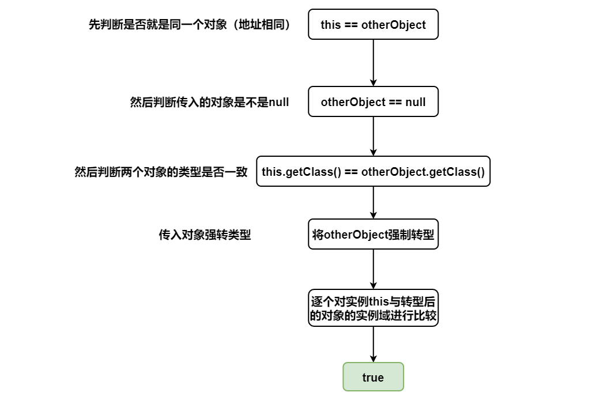
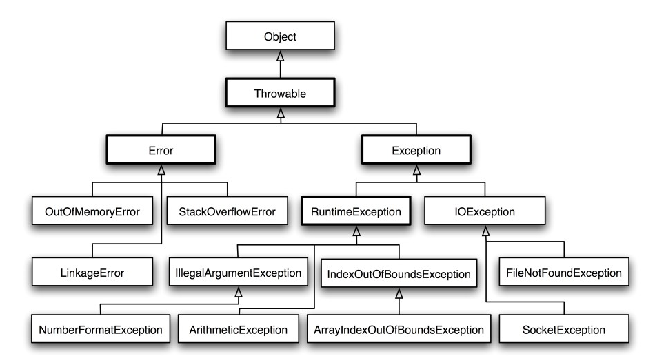
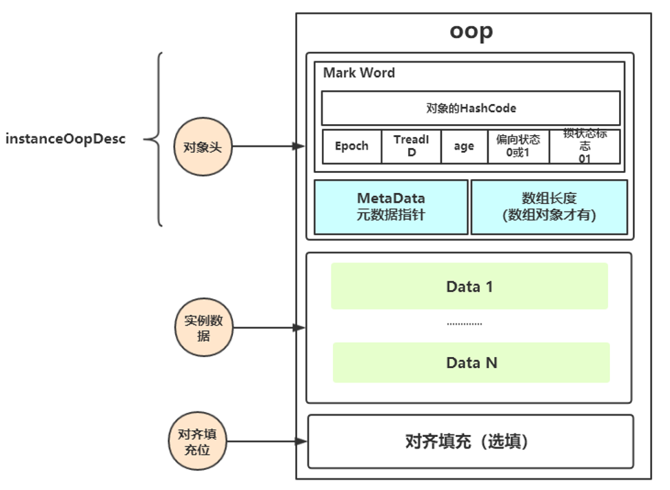
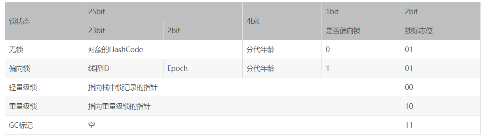
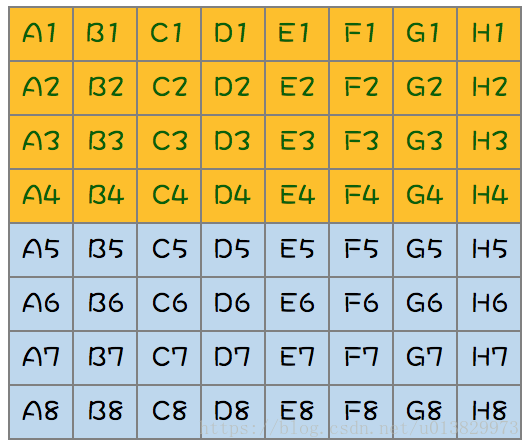
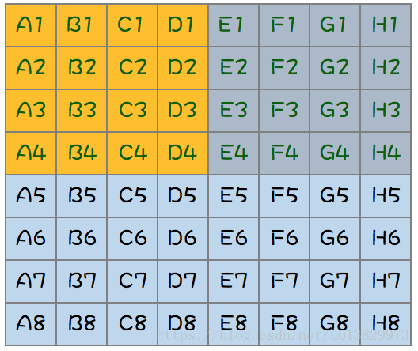
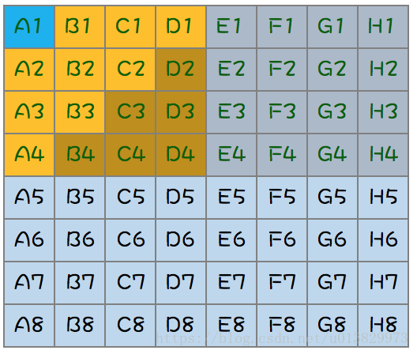
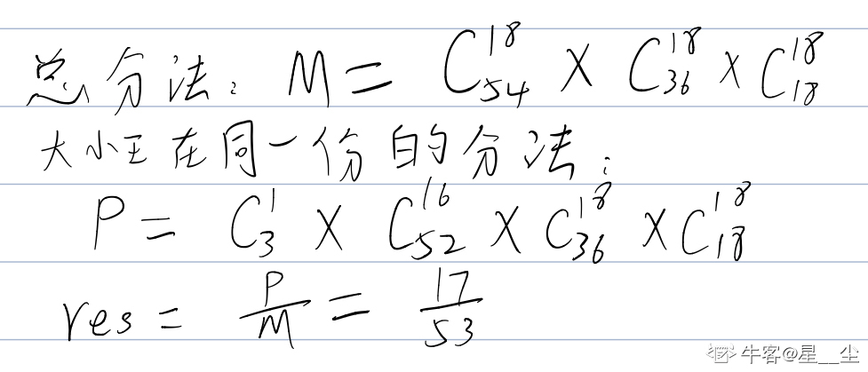

#### Java

##### 1. 数据类型与程序结构

float 存储格式：符号（1 位）+ 指数（8 位）+ 有效数字（23 位）。

**浮点数运算也是不精确的**，==**比较的时候别用 float**==。金融计算用 BigDecimal 类或者采用整型存储最小单位（人民币的分），在需要时转换。

基本数据类型所占字节：**11224488**。

int 类型是 **4 字节**，范围：**(-2 ^ 31, 2 ^ 31 - 1)**，因为有一位是**符号位**。注意一个 Integer 对象是 16 字节，因为包含有 12 字节的对象头信息。

char 用于表示**一个字符**，本质上是一个固定占用**两个字节**的无符号**正整数**。

Java 的参数是以**==值传递==**的形式传入方法中，而**不是**引用传递。对于引用类型，传递的是对象的**==地址值==**。

switch 表达式支持的类型可以是 ==**byte, short, int, char，枚举， String（Java7 之后）**==。支持的都是==**小整数类型**==（String 转为 **hashCode** 也为整数）。不支持 null 与 long。switch 语句如果分支比**较少**，可以直接转换为**跳转指令**。如果分支较多，则会使用**跳转表**（**32 位**），**存储不下** long 型值（64 位 / **8 字节**）。

##### 2. 类的基础与继承

###### 构造方法

**构造方法不能被继承，不能被覆写，不能被直接调用。**但是可以多个构造方法**重载**。构造方法也可以是==**私有**==的，比如用在**单例模式**中。

###### 初始化

**普通初始化块**会在 **==构造方法调用之前==** 执行，**==每次==构造对象**时就会执行。**构造方法**与普通初始化块在每次生成实例对象时**都执行一次**。

**静态初始化块**会在==**类第一次加载**==的时候调用，仅调用**一次**。可对类中的**静态域**进行初始化。

执行顺序：**静态初始化块 -> 初始化块 -> 构造方法**。

存在**继承**的情况下较复杂，**初始化顺序**为（常考）：==**静态优先、父类优先、初始化块优先于构造方法**==。执行顺序为：

- 父类（**静态变量、静态语句块**）
- 子类（**静态变量、静态语句块**）
- 父类（**实例变量、普通语句块**）
- 父类（**构造方法**）
- 子类（**实例变量、普通语句块**）
- 子类（**构造方法**）

静态变量初始化时，首先会**首先声明所有静态变量并赋==默认值==**，然后再**按代码顺序对被初始化**的变量**重新赋值**，这里的赋值可以是直接赋值也可以是静态初始化块内部赋值。**静态变量**的**声明与初始化**是两个不同的操作，静态变量的**声明**在**编译时**已经明确了**内存的位置**。由于静态变量的声明在**编译**时已经**明确**，所以静态变量的声明与初始化在编码顺序上可以**颠倒**。也就是说**可以先**编写初始化的代码，再编写声明代码。

###### 覆写与重载

**覆写**指在类的**继承体系**中，子类实现了一个与父类在**方法签名上完全相同**的一个方法。**元空间有一个方法表保存着每个可以实例化类的方法信息**，JVM 可以通过方法表快速的激活实例方法。如果某个类覆写了父类的某个方法，则方法表中的方法指向引用会指向子类的实现处。覆写时**方法名、参数类型及个数必须严格一致**，为了满足里式替换原则，覆写还有**三个限制条件**，可以总结为：**一大两小两同**。

- **一大**：子类的方法访问权限控制符只能相同或变大。
- **两小**：子类抛出异常和返回值只能相同或变小，能够转型为父类对象。
- **两同**：方法名和参数名必须完全相同。

重载存在于**同一个类**中，指不同方法**方法名称上相同**，但是**参数类型、个数、顺序**至少有一个不同。也就是**方法签名不同**。

**方法签名 = 方法名 + 参数类型**。==**返回类型不是**==方法签名的一部分，所以返回值不同而其它都相同**不算**是重载。

###### 多态

**多态**指的是编译层面无法确定最终调用的方法体，以覆写为基础来实现面向对象特性，在运行期由 JVM 进行动态绑定，调用合适的覆写方法体来执行，**本书认为多态专指覆写**。多态是同一个**行为**具有多个**不同表现形式或形态**的能力。

对于 **private、static 和 final 方法或者构造器**，编译器可以**准确知道**要调用哪个方法，将这种调用方式称为**静态绑定**。

**静态类型**：指出现在**声明**中的类型，静态类型是在**编译**时确定的。所以变量 animal 的静态类型是 **Animal** 。 

**动态类型**：指**运行时**某一时刻变量**指向对象**的类型，动态类型随着运行进程改变。所以 Animal animal = dog 使得变量 animal 的动态类型为 Dog。

**变量决定使用哪个方法名，动态类型决定了可以调用的方法版本。**

**多态实现原理**：JVM 的**方法调用**指令有五个，分别是：

- **invokestatic**：调用静态方法；

- **invokespecial**：调用实例构造器 \<init>方法、私有方法和父类方法；

- **invokevirtual**：调用虚方法；

- **invokeinterface**：调用接口方法，运行时确定具体实现；

- **invokedynamic**：运行时动态解析所引用的方法，然后再执行，用于支持动态类型语言。

其中，invokestatic 和 invokespecial 用于**静态绑定**，invokevirtual 和 invokeinterface 用于**动态绑定**。可以看出，动态绑定主要应用于**虚方法和接口方法**。

##### 3. 接口与抽象类

###### 概述

一个接口中可包含：**常量，普通方法，默认方法，静态方法，私有方法**。

- **Java7 及之前**，它可以看成是一个**完全抽象**的类，也就是说它不能有任何的方法实现。接口里面只能有常量变量和抽象方法，实现类必须实现全部抽象方法。
- **Java8** 接口引入**默认方法**和**静态方法**。默认方法解决修改接口的成本高的问题。
- **Java9** 接口引入 private 方法。可以在接口中编写**私有方法**与私有静态方法。可以解决**多个默认方法之间重复代码**问题。

Java8 之后接口中使用 **default** 修饰**默认方法**，为接口方法提供**默认实现**。Spring 中很多默认实现方法。默认方法是为了解决**接口升级**问题。Java8 之前**修改接口方法成本极高**。Java8 引入**默认方法另一大用处是==函数式数据处理==**的需求，是为了**便于给接口增加新的功能**。**引入默认方法，不仅给接口增加了功能，而且其他实现类不用做任何改变**。

**接口方法冲突**：**接口与超类**之间的冲突(**==超类优先==**)。**接口与接口**之间冲突(需要**覆写方法**来**解决二义性**)。

**接口与抽象类比较**：

==抽象类**不能实例化**==。

- 从**设计层面**上看，**抽象类**提供了一种 **IS-A** 关系，那么就必须满足**里式替换**原则，即子类对象必须能够替换掉所有父类对象。而**接口**更像是一种 **LIKE-A** 关系，它只是提供一种方法实现契约，并不要求接口和实现接口的类具有 IS-A 关系。
- 从**使用层面**上看，一个类可以**实现多个接口**，但是只能**继承一个抽象类**。多数情况下，**==接口优先于抽象类==**。因为接口没有抽象类严格的类层次结构要求，可以灵活地为一个类添加行为。从 Java8 开始，**接口也可以有默认的方法实现，使得修改接口的成本也变的很低**。

##### 4. 内部类

分为：普通内部类、静态内部类、匿名内部类、局部内部类。

内部类是一种**编译器**现象，与虚拟机无关。**编译器**将会把内部类翻译成用 **$** (美元符号）分隔外部类名与内部类名的**常规类文件**， 而虚拟机则对此一无所知。每个内部类都会被编译为一个**独立**的类。

**普通内部类**：**普通内部类对象依赖外部类对象**而存在，即在创建一个普通内部类对象时**首先需要创建其外部类对象**。可以把这个内部类理解为外部类的一个**==实例属性==**。**内部类对象**可以访问**外部类对象中所有访问权限的字段**，原理就是外部类知道内部类的**类型信息**，所以外部类可以访问内部类的类型信息；反过来内部类是通过**编译**后**持有外部类对象的引用**才能访问外部类的**非静态**字段。

**静态内部类**：一个类的**静态成员**独立于这个类的**任何一个对象**存在。在有访问权限的地方就可以通过 **类名.静态成员名** 的形式来访问这个静态成员。**静态内部类**也可以理解为一个外部类的**==静态成员==**，**创建一个类的静态内部类对象不需要依赖其外部类对象**。**内部与外部类的静态属性可以互相访问**。

**匿名内部类**：在匿名内部类中可以使用外部类的属性，但是外部类却**不能**使用匿名内部类中定义的属性，因为是**匿名**内部类，因此在外部类中无法获取这个类的类名，也就**无法得到属性信息**。

**局部内部类**：局部内部类的定义只在其特定的**方法体或代码块**中有效，一旦出了这个**定义域**，那么其定义就**失效**了。局部内部类**不仅能够访问包含它们的外部类**， 还**可以访问==局部变量==**。不过那些局部变量**必须**事实上为 ==**final**==。

**原理解析**：**其实==内部类持有外部类的一个引用==，在==内部类构造函数==中会将外部类的引用传递进来**。这个可以通过反编译得到字节码观察出来。**编译器**给内部类提供了一个接受 InnerClassTest 类型对象（即外部类对象）的**构造方法**，内部类本身还定义了一个名为 **this$0** 的 InnerClassTest 类型的**引用**，这个引用在构造方法中指向了参数所对应的外部类对象。所以内部类是持有外部类对象的**引用**的，因此内部类可以使用外部类的 private 属性。

**匿名内部类和局部内部类**都持有外部类对象的引用，所以可以访问外部类非静态字段，然而外部类是**不知道**匿名内部类和局部内部类的**类型信息**的，所以外部类不能访问其字段。

总之，**非静态内部类（普通、匿名、局部）中都会持有对外部类的对象的引用，从而可以访问外部类对象。反过来就要看外部类是否知道内部类的类型信息了。**

##### 5. 枚举类

**enum 类中的每个属性默认就是 ==static final== 的**。所有枚举类都是 **java.lang.Enum** 类的**子类**。enum 类的构造方法是 protected 的，所以普通**枚举类的构造方法**是特殊的存在，**它可以被定义，但是不能加 public 修饰符**，因为它**默认继承了 enum 类的 protected** 修饰符。

从枚举类**反编译**得到的代码可以看到，枚举类编译出来的**属性**都是 **static** 类型的，而 static 类型的属性会在类被加载之后初始化，而 Java 类的**加载和初始化**过程都是**线程安全**的，所以**创建**一个 enum 类型是天生**线程安全**的。

**好处**：可读性、编译时检查、严格单例。

enum 关键字定义的类，其**实例对象**只能在这个 enum 类中**定义好**，它的实例个数是**有限**的，外部是不能创建实例对象的。如果**不自定义**枚举类的**成员变量和构造方法**，只定义枚举**实例**，则枚举实例内容都将以**字符串**的形式存在，在**类加载**的时候虚拟机会通过 ==**protected**== **Enum**(String name, int ordinal) **构造函数**被创建为基本的 Enum **实例**。比如一个星期的枚举类，定义了七天，那么是由**虚拟机**来调用私有构造方法生成七个枚举实例，其他地方无法生成。

**枚举与单例模式**：**由 JVM 从根本上提供保障，绝对防止多次实例化**，是更简洁、高效、安全的实现单例的方式。枚举实现单例可以解决**序列化和反射**破坏单例的问题。**枚举序列化**确实**不会重新创建新实例**，因为编译器在枚举类中禁止了一些用于序列化与反序列化的方法。对于**防反射破坏**的问题：反射中 **Constructor.newInstance 方法**可以生成实例，但是其**源码**中对当前类是否是 ENUM 类做了判断，如果是就直接抛异常。

##### 6. Object类

```java
// 返回当前运行时对象的Class对象
public final native Class<?> getClass();
// 返回对象的哈希码，主要使用在哈希表中，如HashMap
public native int hashCode();
// 比较2个对象的内存地址是否相等
public boolean equals(Object obj);
// 创建并返回当前对象的一份拷贝。Object本身没有实现Cloneable接口，所以不重写clone方法并且进行调用的话会发生CloneNotSupportedException异常
protected native Object clone() throws CloneNotSupportedException
// 返回类的名字@实例的哈希码的16进制的字符串，建议Object所有的子类都重写这个方法
public String toString();
// 不能重写。唤醒一个在此对象监视器上等待的线程(监视器相当于就是锁的概念)。如果有多个线程在等待只会任意唤醒一个
public final native void notify();
// 不能重写。跟notify一样，唯一的区别就是会唤醒在此对象监视器上等待的所有线程
public final native void notifyAll();
// 不能重写。暂停线程的执行。注意：sleep方法没有释放锁，而wait方法释放了锁。timeout是等待时间
public final native void wait(long timeout) throws InterruptedException
// 多了nanos参数，这个参数表示额外时间，指超时的时间还需要加上nanos毫秒
public final void wait(long timeout, int nanos) throws InterruptedException
// 跟之前的2个wait方法一样，只不过该方法一直等待，没有超时时间这个概念
public final void wait() throws InterruptedException
// 实例被垃圾回收器回收的时候触发的操作
protected void finalize() throws Throwable { }
```

###### equals()

用来检查一个对象与调用这个 equals() 的这个对象**是否相等**。Object 类**默认**的 eqauls() 函数进行比较的依据是：调用它的对象和传入的对象的**引用**是否相等，默认进行的是**引用比较**。

**对于引用类型，== 判断两个变量是否引用==同一个==对象，而 equals() 判断两个对象内容是否==等价==。**

**等价的特性**：覆写 equals() 函数的时候要遵守一些**规则**。

- **自反性**：对于任意非空的引用值 x，x.equals(x) 返回值为真。
- **对称性**：对于任意非空的引用值 x 和 y，x.equals(y) 必须和 y.equals(x) 返回**相同**的结果。
- **传递性**：对于任意的非空引用值 x, y 和 z, 如果 x.equals(y) 返回真，y.equals(z) 返回真，那么 x.equals(z) 也必须返回真。
- **一致性**：对于任意非空的引用值 x 和 y，无论调用 x.equals(y) 多少次，都要返回**相同**的结果。在比较的过程中，对象中的数据不能被修改。

**覆写** equals 方法的步骤：

- 检测 this 与 otherObject 是否**引用同一对象**（地址相同）。
- 检测 otherObject **是否为 null**（null 就肯定不是了）。
- 比较 this 与 otherObject 是否属于**同一个类**（类型不同也不是）。
- 将 otherObject **类型转换**为相应的类类型变量。
- 现在开始对**所有需要比较的域依次进行比较**。使用 **==** 比较**基本类型域**，使用 **equals 比较对象域**。这里就需要看对不同类自己的情况写。

```java
// 以下是Employee类的equals方法
public boolean equals(Object otherObject){
     // 检测this与otherObject是否引用同一对象
    if(this == otherObject) return true;   
    // 检测otherObject是否为null
    if(otherObject == null) return false;   
    // 比较this与otherObject是否属于同一种类型
    if(this.getClass() != otherObject.geClass()) return false;
    // 将otherObject转换为相应的类类型变量：类型转换
    Employee other = (Employee) otherObject;    
    // 现在开始对所有需要比较的域进行比较。使用 == 比较基本类型域，使用equals比较对象域。
    return Object.equals(name, other.name) && salary == other.salary && Objects.equals(hireDay, other.hireDay);
}
```



###### hashCode()

hashCode() 返回**散列值**，散列值是由对象导出的一个**整形值**。每个对象都有一个**默认的散列值**，不覆写这个方法就返回对象的**存储地址**。

> 为什么需要同时覆写 equals 方法和 hashCode 方法？

因为两种定义必须**一致**：如果 x.equals(y) 返回 **true**，那么 x.hashCode() 与 y.hashCode() 就必须**相同**。在覆写 **equals**() 方法时应当**总是同时覆写** hashCode() 方法，保证**等价的两个对象散列值**也**相等**。

**因为 HashMap 或 HashSet 就是同时通过这个两个方法来判断对象是否存在的，当键发生哈希冲突时，仅一个方法是不能有效的组织与检索的。**

最方便的就是利用 **Objects 工具类覆写 hashCode** 方法。

```java
// 一个简单的覆写hashCode方法
@Override
public int hashCode() {
    // 传入多个对象到hash()返回hashCode
	return Objects.hash(firstName, lastName);   
}
```

###### wait()

wait 方法会引起**当前线程阻塞**，直到另外一个线程在**对应的锁对象**上调用 notify 或 notifyAll 方法，或达到了方法参数中**指定的时间**，当前线程才会被唤醒。

###### notify()

**唤醒**可能等待**该对象**的**对象锁的其他线程**。由 JVM（与优先级无关）**随机挑选**一个**处于 wait 状态**的线程进行唤醒。

###### finalize()

该方法用于**垃圾回收**。用于对象被回收之前的**自救**（详见 JVM 部分）。

##### 7. 包装类

**缓存池**：为了减少开销，运用了**池化思想**，为这些不可变的对象创造相应的**缓存池**，用于共享数据，是一种==**享元模式**==的思想。由于包装类内部的数据表示是使用 **final** 修饰的所以是**不可变**的，所以缓存的对象可以被**安全的共享**。

Integer 缓存池的大小==默认为 **-128\~127**==。其他的包装类也有缓存池，但是只有 Integer 可以修改缓存池大小，需要配置**虚拟机参数**。

**==valueOf()== 方法**的实现比较简单，就是先判断值是否在**缓存池**中，如果在的话就**直接返回缓存池的内容**。编译器会在**自动装箱**过程调用 **valueOf**() 方法，因此多个值相同且值在缓存池**范围内**的 Integer 实例使用自动装箱来创建，那么就会引用**相同的对象**。

建议包装类都用用 **equals**() 方法比较，不要直接用 == 。

> **new Integer(123)** 与 **Integer.valueOf(123)** 的区别?

- new Integer(123) 每次都会**==新建==一个对象**（用了 new 关键字）。
- Integer.valueOf(123) 会使用**缓存池中的对象**，多次调用会取得**同一个对象**的引用。

##### 8. String类

String 类对象为**==不可变==**字符串。优点是编译器可以共享。String 被声明为 **==final==**，因此它**不可被继承**。在 Java 9 **之后**，String 类的实现改用 **==byte 数组==**存储字符串，同时使用 **coder** 来标识使用了哪种**编码**。**value 数组被声明为 final**，这意味着 value 数组初始化之后就**不能再引用其它数组**。并且 String 内部没有改变 value 数组的方法，因此可以保证 String **不可变**，由于是不可变对象，所以**天生线程安全**。

许多**看似修改** String 的方法，实际上都是通过**创建新的 String 对象**来实现的。

**不可变的好处**：可以换成 hash 值，避免重复计算；可以创建 缓存池；参数安全性；线程安全。

**字符串常量池**（String Pool）保存着所有**字符串字面量**（literal strings），这些字面量在**编译时期**就确定。还可以使用 **String 的 ==intern()==** 方法在运行过程中**将字符串添加到 String Pool** 中。虚拟机为字符串字面量开辟一个**字符串常量池**，类似于**缓存区**，创建**字符串常量**时，首先**查询字符串常量池是否存在该字符串**，如果存在该**字符串**，返回**引用实例**，不存在，**实例化该字符串并放入池**中。

两种创建**字符串对象**的方式：1）采用**字面值**的方式赋值  2）采用 **new** 关键字新建一个**字符串对象**。

**字面量**形式创建会在编译时就**==自动==地将字符串放入 String Pool 中**。

**注意**：**new String()** 方式首先检查 String pool 中有没有这个字符串，如果没有则先在 String pool 中创建一个字符串，然后再在**堆**中创建一个字符串，并返回堆中字符串的引用。如果 String Pool 中已经有了，则仅在堆中创建。所以可能**创建一个对象也可能创建两个对象**。

总结：

- 单独使用 "" 引号创建的字面量字符串和使用只包含常量的字符串连接符如 "aa" + "bb" 创建的字符串都是**常量**，**编译期**就已经确定存储到 String Pool 中。
- 使用 **new String("")** 创建的对象会存储到**堆中**（如果 pool 中没有也会创建），是**运行期**新创建的。
- 使用包含变量的字符串连接如 "aa" + s 创建的对象是**运行期**才创建的，存储到 **堆** 中。
- 运行期调用 String 的 intern() 方法可以向 String Pool 中动态添加字符串。

在 Java7 之前，String Pool 被放在**运行时常量池**中，它属于**永久代**。而在 Java 7，String Pool 被移到**==堆==**中。这是因为永久代的空间**有限**，在大量使用字符串的场景下会导致 OutOfMemoryError 错误。

> **StringBuilder、StringBuffer、String对比**

**可变性** ：String **不可变**（字符数组用 final 修饰），每次操作都是产生**新对象**。StringBuffer 和 StringBuilder 可变，可以多次修改，操作不产生新对象。

**线程安全**：String **不可变**，因此是**线程安全**的；StringBuilder 不是**线程安全**的；StringBuffer 是线程安全的，内部使用 **synchronized** 进行同步，所以**速度慢**。

**基本原则**：如果要操作少量的数据，用 String ；单线程操作大量数据，用 StringBuilder ；多线程操作大量数据，用 StringBuffer。

##### 9. 其他类

BigInteger 用于处理大型数据，可以处理**任意长度**数字序列的数值，BigDecimal 用于**精确计算**（如财务数据）

##### 10. 常用接口

###### 比较器接口

```java
public interface Comparator<T> {
    // 比较方法
    int compare(T first, T second);     
}
```

###### 克隆接口

clone() 是 **protected** 方法，一个类**不显式**去**覆写 clone()**，**其它类**就**不能直接去调用**该类实例的 clone() 方法。

**要克隆必须实现 Cloneable 接口然后再覆写 clone() 方法，并且将 clone 定义为 public 方法，**这样其他类才能调用。否则就会抛出 **CloneNotSupportedException**。clone 方法中可直接调用 Object 类的方法（**由虚拟机实现**的 native 方法）即 **super.clone()**，直接用 clone 方法是实现的**浅克隆**。**深克隆**需要自己去克隆所有的属性。

浅拷贝中 String 等**不可变**的对象即使是浅拷贝也是**安全**的，**基本数据类型**也是。

Effective Java 建议最好不要去使用 clone()，**可以使用==拷贝构造方法==或者==拷贝工厂==来拷贝一个对象**。即自己实现一个用于拷贝原对象的**构造方法**，传入需要拷贝的原对象进行状态拷贝。

**序列化**一个对象时，当一个对象的实例变量引用其它对象，序列化该对象时也会把引用对象进行序列化。所以能**用序列化解决深拷贝问题**。

##### 11. 关键字

###### final

实例域可以包含**基本数据类型**或者**引用类型**，final 修饰后效果不同。

- 对于**基本**类型，final 使==**数值不变**==；声明数据为==**常量**==，可以是编译时常量，也可以是在运行时被初始化后**不能被改变**的常量。
- 对于**引用**类型，final 使==**引用不变**==，构造器初始化之后就不能再修改，也就是这个变量**不能引用其它对象**。相当于该实例域==**没有 setter 方法**==。但是**被引用**对象的**内部数据**是可以修改的。

final 修饰**方法**表示该方法不能被子类**覆写**。final 修饰类时表明该类**不允许**被**继承**。

> **final、finally和finalize区别**

**final**：用于声明**属性、方法和类**，分别表示属性不可变、方法不可覆盖和类不可被继承。

**finally**：用于**搭配 try catch 语句来处理异常情况**。finally 一般情况下是都会执行的（可能也不会执行，参考异常部分），可以用于执行一些关闭资源操作。

**finalize()**：是 **Object** 中的方法。这里涉及到 JVM 如何判定对象是否存活的可达性分析算法，可达性分析算法对 GC Roots 不可达的对象进行标记，如果这个**对象覆写了 finalize 方法**，且在方法将这个对象重新与 GC Roots 关联的话，对象就**不会被回收**，用于对象被回收之前的**自救**（引诱面试官去问 JVM）。

###### strictfp

strictfp，即 **strict float point** (**精确浮点**)。 如果想让**浮点运算更加精确**，而且不会因为不同的硬件平台所执行的结果不一致的话，可以用关键字 strictfp。

###### super与this

- this 引用**当前对象**是实实在在存在的，可以作为**函数参数**，可以作为**返回值**，但 super 只是一个关键字，不能作为参数与返回值，它只是告诉**编译器**访问父类的相关变量与方法。

- super() 和 this() 均需放在构造方法内**第一行**。

- this 和 super **不能同时出现在一个构造函数里面**，因为 this 必然会调用其它的构造函数，其它的构造函数必然也会有 super 语句的存在，所以在同一个构造函数里面有相同的语句，就失去了语句的意义，编译器也不会通过。

##### 12. 注解

Java 注解是**附加在代码**中的一些**元信息**，用于一些工具在编译、运行时进行解析和使用，起到**说明、配置**的功能。

为什么用注解/场景：生成注释文档，实现替代**配置文件**功能，实现**编译时进行格式检查**。

**元注解**：元注解就是**修饰注解**的注解，通常用在注解的定义上，一般用于指定某个注解**生命周期以及作用目标**等信息。

|     元注解      |                             用途                             |
| :-------------: | :----------------------------------------------------------: |
| @**Retention**  | 定义该注解的**生命周期**。RetentionPolicy.**CLASS**，RetentionPolicy.**RUNTIME**等 |
|   @**Target**   | 定义注解可以用于**什么地方**。ElementType.**FIELD**、ElementType.**METHOD**等 |
| @**Documented** |               注解是否将包含在 **JavaDoc** 中                |
| @**Inherited**  |                  是否允许子类**继承**该注解                  |

Annotation 型定义为 @**interface**, 所有的 Annotation 会自动继承 java.lang.**Annotation** 这一**接口**，并且不能再去继承别的类或是接口。**参数成员**只能用基本类型 byte、short、char、int、long、float、double、boolean 八种**基本数据类型**和**String、Enum、Class、annotations** 等**数据类型**，以及这一些**类型的数组**。

要获取类方法和字段的注解信息，需通过**==反射==**来获取 **Annotation 对象**。

**注解本质**是一个继承了 **Annotation** 接口的**特殊接口**，其具体**实现类**是 Java 运行时生成的**动态代理类**。通过**反射获取注解**时，返回的是 Java **运行时生成的动态代理对象 $Proxy1**。通过代理对象**调用自定义注解（注解就是特殊的接口）**的**方法**，会最终调用 **AnnotationInvocationHandler** 的 **invoke** 方法。该方法会从 **memberValues 这个 Map 中索引出对应的值**。而 memberValues 的来源是 Java **常量池**。

##### 13. 异常体系

###### 基础



Throwable 可以用来表示任何可以作为异常抛出的**类**，分为两种： **Error（错误）**  和 **Exception（异常）**。异常和错误的区别是，**异常是可以被处理的，而错误是没法处理的**。 

**Exception** 是异常，主要分为两种：

- **受查异常** ：程序==**编译阶段**==发生异常，必须要使用 **try…catch**（或者 throws）进行处理否则编译不通过；受查就是**可以检查**到的，与 **IO 操作相关**的很多异常就是这个。比如 ：ClassNotFoundException，NoSuchFieldException，NoSuchMetodException。除了 **RuntimeException** 及其子类以外，都是受查异常。
- **非受查异常** ：程序==**运行时**==错误，例如除 0 会引发 ArithmeticException，此时程序崩溃并且无法恢复。派生于 **Error** 类和 **RuntimeException 类**的异常。程序运行过程中才能发现的异常，所以是**不能检查**的异常。

可能会叫说几个异常类型。

**受查异常**使用 ==**throws**== 关键词**声明**异常。**非受查异常**使用 ==**throw**== 关键词**抛出**异常。

###### try-catch-finally

finally 用于**回收资源**。涉及**资源操作**的都需要执行！！比如文件打开、Redis 或 MySQL 连接等。不管是**否有异常被捕获**， finally 子句中的代码**都被执行**。

**注意**：就算 **try 语句中含有 return 语句，那么 finally 语句依然会执行**。try 代码块中的 **break 或 continue** 语句也可能使控制权进入 finally 代码块。

当 **finally 子句包含 return 语句**时，将会出现一种**意想不到**的结果，假设利用 return 语句从 **try** 语句块中**退出**。**在方法返回前，finally 子句的内容将被执行**。如果 finally 子句中也有一个 return 语句，这个返回值将会==**覆盖**==原始的**返回值**。

如果需要**关闭资源**，最好使用**带资源的 try 语句**，但是这个资源实现了 **AutoCloseable** 接口。

> **finally语句块一定会执行吗？**

不一定。1. **代码没有执行到 try 块中**，后面的 finally 也不会执行。2. 当在 try 块或者 catch 块中**有 System.exit(0);** 3. 一个线程在执行 try 语句块或者 catch 语句块时被打断（interrupted）或者被终止（killed）；4. 断电了。

##### 14. 泛型

**泛型的本质是参数实例化，解决不确定具体对象类型的问题。**泛型只是一种编写代码时的语法检查。使用泛型可以让编译器对**类型进行检查**，避免**插入错误类型**的对象。它提供了**编译期的类型安全**，确保你只能把**正确类型**的对象放入集合中，避免了在运行时出现 **ClassCastException**。

泛型只在**编译阶段**有效而不会进入到运行时阶段。在**编译过程**中，正确**检验泛型结果**后，会将泛型的相关信息**擦除**，并且在对象进入和离开方法的边界处**添加类型检查和类型转换**的方法。

**使用泛型的好处**：**安全性、可读性、代码重用**。安全性是指编译器会帮检测类型错误，使类型安全；可读是指编码的时候直接就知道集合里面是什么类型；代码重用是指泛型合并了同类型的处理代码。

泛型可有泛型**类**、泛型**方法**、泛型**接口**。

泛型方法的返回类型之前是==**类型参数**==，可以对类型参数进行**限定**。如 **\<T extends Comparable>**。

**编译期**进行泛型**类型擦除**会把**类型变量**替换为相应的**限定类型**。泛型的诸多限制多半是由**类型擦除**造成的。

**重要★**：==**\<T>**是**类型参数**，**T 是返回类型**==，类型参数放在**返回值之前**。**\<T extends Comparable>** 也是**类型参数**，限定**传入的类型**。

类型参数上界可以是**类或接口**，此时 **T** 必须**实现**这个接口或者继承这个类。如果有多个类型变量和多个限定类型，限定类型用 **& 分隔**，类型变量用**逗号分隔**。

除了用 \<T> 表示泛型外，还有 **\<?>** 这种形式。**？** 被称为**通配符**。Sub 是 Base 的子类，**不代表 List\<Sub> 和 List\<Base> 有继承关系**。Java 中**集合是==不能协变==**的，也就是说 List\<Base> 不是 List\<Sub> 的父类，这时候就可以用到**通配符**了。

通配符主要有以下三类：

- **无边界的通配符**：就是 ==**\<?>**==, 比如 **List<?>**。无边界的通配符的主要作用就是让**泛型能够接受==未知类型==**的数据。
- **固定上边界**的通配符：使用**固定上边界**的通配符的泛型, 就能够接受**指定类及其子类类型**的数据。要声明使用该类通配符, 采用 ==**<? extends E> **== 的形式，这里的 **E** 就是该泛型的**上边界**。注意：这里虽然用的是 **extends** 关键字, 却不仅限于继承了父类 E 的子类, 也可以代指实现了**接口** E 的**类**。
- **固定下边界**的通配符：使用**固定下边界**的通配符的泛型, 就能够接受**指定类及其父类类型**的数据。要声明使用该类通配符, 采用 ==**<? super E>**== 的形式, 这里的 **E** 就是该泛型的**下边界**。

==**类型擦除**：Java 泛型是通过**类型擦除**实现的==。 **类型擦除**指的是**泛型相关的信息在编译后被擦除的情况**，其过程就是**擦除(erased) 类型变量**, 并**替换**为相应的**限定类型**。**类型参数**给类型擦除指定一个**边界**，类型擦除之后所有的类型参数都用它们的**限定类型替换**，无限定类型的变量用 **Object** 替换。所以泛型信息只存在于代码**编译阶段**。

在泛型类被**类型擦除**的时候，如果类型参数**没有指定上限**，如 \<T> 则会被转译成普通的 **Object** 类型，如果指定了类型参数上限如 \<T extends String> 则类型参数就被**替换成类型上限**。

##### 15. 集合类

###### 概述

**集合框架**主要包括 **Collection** 和 **Map** 两大体系，Collection 存储着对象的**集合**，而 Map 存储着键值对（两个对象）的**映射表**。


容器：**普通容器、同步容器、并发容器类**。常见的同步容器类，几乎都是直接加 **synchronized** 实现的：

- **Vector**(implements List)
- **Hashtable**(implements Map)
- **Stack**(extends Vector)。
- **Collections.synchronizedXxxx**。

**同步容器**的**单个操作是安全**的，但是**迭代操作不是**。如果在遍历容器时发生了**结构性变化**，就会**抛出异常**。同步容器没有解决这个问题，要避免这个异常，需要在遍历时给整个容器对象加锁。由于加了**锁**，所以**开销**比较大。

> Hashtable与HashMap对比

- **底层数据结构：** 内部都是用**数组存放元素**。JDK1.8 以后的 HashMap 在解决哈希冲突时有了较大的变化，当链表长度大于阈值（默认为8）（将链表转换成红黑树前会判断，如果当前数组的长度小于 64，那么会选择先进行数组扩容，而不是转换为红黑树）时，将链表转化为红黑树，以减少搜索时间。Hashtable 没有这样的机制。
- **线程安全性**： HashMap 是**非**线程安全的，HashTable 内部的方法基本都经过 **synchronized** 修饰所以是线程安全的。
- **效率：** HashTable 加了锁，效率低下。要同时保证**线程安全与效率**的话就使用 **ConcurrentHashMap**。
- **对 Null key 和 Null value 的支持：** HashMap 中，**null 可以作为键**，这样的**键只有一个，**可以有一个或多个键所对应的值为 null。但是 HashTable **不支持键或值**为 null，插入 null 直接抛出 NPE。
- **内部初始容量大小和数组扩容量大小不同：** ① 不指定容量初始值时 Hashtable 默认的初始大小为 **11**，之后每次扩容为原来的 **2n+1**。HashMap 默认的初始化大小为 **16**。之后每次扩容为原来的 **2 倍**。② 创建时如果**给定**了容量初始值，那么 Hashtable 会**直接使用**这个容量值。而 HashMap 会将其扩充为 **2 的幂次方**大小。

###### ArrayList

- **基本结构**：ArrayList 内部使用**动态数组**实现元素存储，同时也实现了 RandomAccess 接口，所以支持**快速随机访问**。并允许插入所有元素，包括 **null**，元素**可重复**。**动态数组**是通过 **transient** 修饰的，默认**不被序列化**（因为动态数组可能**没有存满**），ArrayList 自定义了序列化与反序列化的方法保证只对数组中的**有效元素**进行序列化。

- **增**：每次**添加元素**时通过  **ensureCapacityInternal() 方法** 检查动态元素数组**容量是否足够**。如果初始化时**没有指定**数组大小，那么**第一次**添加元素时**会扩容**，这时候就会**扩容到默认的 10**。如果容量不够时，需要使用 **grow() 方法进行动态扩容**，新容量的大小为 **oldCapacity + (oldCapacity >> 1)**，也就是旧容量的 **1.5 倍**。扩容时会**复制**原来的数组，所以扩容的开销很大，所以一定要根据业务场景**指定初始化容量**防止过多的扩容与复制开销（阿里规范）。

- **删改查**：指定位置的插入与删除元素效率低，因为需要**移动其它**元素。实现了 **RandomAccess** 接口，可实现**快速随机**访问，按照**索引**进行访问的效率很高，效率为 O(1)。按照内容**查找**元素效率**较低**，效率为 O(N)。

- **安全性**：ArrayList 是线程**不安全**的，建议在**单线程**中才使用 ArrayList，**多线程**可以使用 Vector 类、**Collections.synchronizedList**、JUC 的 **CopyOnWriteArrayList** 类等方法解决并发安全问题。

- **迭代删除**：ArrayList 的**迭代器**会返回一个 **内部类 Itr 对象**，**迭代时删除元素**应该使用**迭代器的 remove** 方法而非 ArrayList **本身的 remove** 方法，否则会产生 **Fail Fast** 异常。当然一般使用一次 ArrayList 的 remove 方法是没问题的。使用 ArrayList 的 **iterator**() 方法获取到**迭代器**进行遍历时，会把 ArrayList **当前状态下的 modCount 赋值给 Itr 类的 expectedModCount** 属性，相当于创建迭代器时候对外部的 modCount 记录了一个**版本快照**。如果在迭代过程中使用了 ArrayList 的 **remove**() 或 **add**() 方法，它们会修改外部的 modCount 就会加 1 ，但是迭代器中的 **expectedModeCount** 并没有变化，当我们再使用迭代器的 next() 方法时，它会调用 **checkForComodification**() 方法，通过对比发现现在的 expectedModCount 已经与外部的 modCount **不一致**了，则会抛出ConcurrentModificationException 异常。

    但是**如果使用**内部类 **Itr 迭代器提供的 remove()方法**，它会调用 ArrayList 提供的 remove 方法，同时还有一个操作：**==expectedModCount = modCount==**;，这会修改当前迭代器内部记录的 expectedModCount 的值，所以就不会存在版本不一致问题，也就不会抛出异常。

- **modCount** 属性是继承自 **AbstractList** 的，用来记录 **结构发生变化的次数**。结构发生变化是指添加或者删除至少一个元素的所有操作，或者是调整内部数组的大小，仅仅只是设置元素的值不算结构发生变化。如果迭代或者序列化会检查 modCount 版本，如果不一致则会产生 **Fail Fast 异常**。

- **序列化**：基于**数组**实现，并且具有**动态扩容**特性，因此保存元素的数组**不一定都会被使用**，那么**就没必要全部**进行序列化。所以保存元素的数组 **elementData** 使用 **transient** 修饰，该关键字声明数组默认**不会被序列化**。ArrayList 实现了 **writeObject**() 和 **readObject**() 来控制==**只序列化数组中有元素填充那部分**==内容。注意：序列化时也会**检查 modCount**，如果序列化时并发**修改**列表，可能造成 Fail Fast 而抛异常。

###### LinkedList

LinkedList 也实现了 List 接口，内部基于**==双向链表==**实现，所以其特点与 ArrayList 几乎**相反**。LinkedList 还实现了 **Deque** 接口，可以按照**队列、栈和双端队列**的方式进行操作。LinkedList 也是线程**不安全**的队列。

**获取数据**：由于具有**双向指针**，所以查找时会判断待搜索的**索引**与整个链表的**长度**关系，如果**小于链表长度一半**，那么就从头遍历，否则从尾部遍历，这样最多也就遍历半个链表长度。可以**提高查找效率**。

**与ArrayList比较**：

- **数据结构与实现**：ArrayList 基于**动态数组**实现，LinkedList 基于**双向链表**实现。
- **线程安全性**：ArrayList 和 LinkedList **都不**保证线程安全。
- **元素访问**：ArrayList 支持快速**随机访问**，LinkedList **不支持**。
- **增删元素效率**： ArrayList 采用**数组**存储，插入元素到数组末尾复杂度为 O(1)，但是在指定位置插入元素与删除元素复杂度为 O(N)。LinkedList 采用**链表**存储，在删除元素的时候不需要挪动后面的元素，操作基本都是修改指针，LinkedList 在**任意位置**添加删除元素**更快**。
- **内存空间占用**：ArrayList 的空间浪费主要体现在 list 列表的结尾会预留一定的**容量空间**，而 LinkedList 的空间花费则体现在它的每一个结点都需要消耗比 ArrayList 更多的空间。

###### ArrayDeque

ArrayDeque 实现了 Dueue 接口，可用于**队列、双端队列、栈**等。当做栈使用效率要高于 Stack；作为**队列**使用时，效率也比基于双向链表的 **LinkedList** 要好一些。

ArrayDeque 内部采用**环形动态数组**进行数据存储，但是要求**数组元素个数为 2 的幂次方**个，这样可以实现**环形索引**，更加高效。数组容量不够也会进行**自动扩容**，扩容时元素会**复制重排**放在环形数组的前面部分位置。

ArrayDeque **不支持**值为 **null** 的元素。

ArrayDeque 在**迭代**时**检查并发修改并没有使用**类似于 ArrayList 等容器中使用的 **modCount**，而是通过**尾部索引**来确定的。这样有可能检查不到。

ArrayDeque 对**数组的大小**(即队列的容量)有特殊的要求，==必须是 **2^n**（**2 的幂次方**）==。传入的容量就算不是 2 的幂次方时也会被 allocateElements 方法修改为 2 的幂次方。

环形数组满的情况：

```java
(tail = (tail + 1) & (elements.length - 1)) == head
```

下一个位置的索引：

```java
(tail + 1) & (elements.length - 1)
```

可见在容量保证为 **2^n** 的情况下，仅通过**位与**操作就可以完成==**环形索引**==的计算，**而不需要**进行边界的判断，实现上更为**高效**。

###### PriorityQueue

PriorityQueue 优先级队列，实现了队列接口 **Queue**，每个元素都有优先级，**队头**的元素永远都是**优先级最高**的。内部元素**不是完全有序**，但是**逐个**出队列会得到**完全有序**的输出（从源码上看入列操作并**没有**对所有加入的元素**进行优先级排序**。**仅仅保证数组==第一个==元素是最小的即可**）。

**效率**：基于**堆**实现。堆在**概念上是树，存储上是数组**，父子有特殊顺序，根是最大/最小值，构建、添加、删除效率都很高。查看头部元素效率很高，为 O(1)， 入队、出队效率比较高，为 O(log2(N))，构建堆 **heapify** 的效率为 O(N)。

###### HashMap

**建议通看源码**。面试非常喜欢问！**重点**是根据 key 获取哈希桶数组**索引位置**、**put 方法**的详细执行、**扩容过程**三个具有代表性的点。

**数据结构**：HashMap 基于**数组+链表+红黑树**（JDK1.8 增加了红黑树部分）实现的。当**链表长度太长（默认超过 8）且元素个数大于 64 时，链表就转换为红黑树**。

**基本属性**：

- **table**：哈希桶**数组**存放 Node 结点链表， table 的**长度**必须是 **2 的幂**。Node[] table 的初始化长度 **length 默认值**是 **16**。**常规的设计**是把**桶的大小设计为素数**来减小哈希冲突，比如 **Hashtable** 初始化桶大小为 **11**，就是桶大小设计为素数的应用（Hashtable 扩容后**不能**保证还是素数）。HashMap 之所以采用这种**非常规**设计，主要是为了在**取模和扩容时做优化**，同时为了减少冲突， HashMap 定位哈希桶索引位置时加入了**高位参与运算**的过程。
- **size**：**实际**存储元素的**数量**，size() 方法实际返回的就是这个值，isEmpty() 也是判断该值是否为空。
- **modCount**：记录**结构被改变的次数**，fail-fast 机制。内部结构发生变化指的是元素增删，某个 key 对应的 value 值被**覆盖修改**不属于结构变化。
- **loadFactor**：**负载因子**。默认为 **0.75**，这是对**空间和时间效率**的一个**平衡选择**，建议用默认值，除非在时间和空间比较特殊的情况下，如果内存空间很多而又对时间效率要求很高，可以**降低**负载因子 loadFactor 的值；相反如果内存空间紧张而对时间效率要求不高，可以增加 loadFactor 的值，这个值**可以大于 1**。
- **threshold**：**扩容阈值**，在 HashMap 中存储的 Node 键值对**超过这个数量**时，就会触发扩容 resize。threshold 是当前 HashMap 所能容纳的**最大数据量的 Node (键值对)个数**。在数组定义好长度之后，负载因子**越大**，所能容纳的键值对**个数越多**。**扩容阈值**：**threshold = loadFactor * table.length**。
- **entrySet：HashMap** 将数据转换成 set 的另一种存储形式，这个变量主要用于**迭代功能**。

**数组容量**：默认为 16，不是也会初始化为 2 的幂次方。

**数组的位置定位**：位置定位应该尽量均匀。

```java
// 求hash值的方法// jdk1.8与jdk1.7
static final int hash(Object key) {   
     int h;
     // h = key.hashCode() 为第一步:取hashCode值
     // h ^ (h >>> 16)  为第二步:高位参与运算
     return (key == null) ? 0 : (h = key.hashCode()) ^ (h >>> 16);
}
```

这里的 **Hash() 算法**本质上就是**三步**：==**取 key 的 hashCode 值、高位运算、取模运算**==。在 JDK1.8 中，优化了**高位运算**的算法，通过键的 **hashCode() 的高 16 位异或低 16 位实现**。**也就是说先通过高位异或低位求取键的哈希值**，之后就需要通过哈希值**寻找**到对应的**数组的槽**。直接取模是开销较大的，由于数组长度为 2 的幂次方，所以求槽的时候是可以用**位运算**的。下面是求**桶位置**的方法。

```java
// 求桶位置的方法// jdk1.7的源码，jdk1.8没有这个方法，但是实现原理一样的
static int indexFor(int h, int length) {  
     return h & (length - 1);  // 第三步:取模运算
}
```

**h & (length - 1)**运算**等价于对 length 取模**，也就是 **h % length**，但是 **& 比 %** 具有更高的**效率**。这也是为什么数组长度 为 2 的幂次方的原因。

**put 方法的流程**：

① 判断键值对**数组 table[i]** 是否为**空**或为 null，否则执行 **resize**() 进行扩容；

② 根据键值 **key** 计算 **hash 值**得到插入的**数组索引 i**（前述内容），如果 **table[i]==null**，表明这个桶**还没有**数据，直接**新建节点**添加，转向 ⑥，如果 table[i] 不为空，说明已经有**数据链表**，则转向 ③；

③ 判断 table[i] 的**首个**元素是否和 key 一样，如果相同直接**覆盖 value**，否则转向 ④，这里的**相同**指的是 **hashCode** 以及 **equals**；

④ 判断 **table**[i] 是否为 **treeNode**，即 **table**[i] 是否是**红黑树**，如果是**红黑树**，则直接在树中**插入键值对**，否则转向 ⑤；

⑤ **遍历** table[i]，判断链表**长度是否大于8**，大于 8 的话把链表转换为**红黑树**，在红黑树中执行**插入操作**，否则遍历链表进行插入操作；遍历过程中若发现 key 已经存在**直接覆盖** value 即可；

⑥ **插入成功**后，判断实际存在的键值对数量 size 是否超多了最大容量 threshold，如果超过，进行**扩容**。

**扩容原理**：和扩容相关的**参数**主要有：capacity、size、threshold 和 loadFactor。

|      参数      |                             含义                             |
| :------------: | :----------------------------------------------------------: |
|  **capacity**  | table 的数组大小，**默认为 16**。需要注意的是 capacity 必须保证为 **2 的 n 次方**。 |
|    **size**    |                   **实际**存放键值对数量。                   |
| **threshold**  | size 的**临界值**，当 size 大于等于 threshold 就必须进行**扩容**操作。 |
| **loadFactor** | **装载因子**，table 能够使用的**比例**，threshold = capacity * loadFactor。默认 **0.75**。 |

**扩容过程**：首先**数组长度**变为原来的**两倍**，由于使用的是 2 次幂的扩展，所以旧元素的位置要么是在**原位置**，要么是在原位置再**移动原数组长度（oldSize）**的位置。Java8 在扩充 HashMap 的时候，**不需要**像 JDK1.7 的实现那样**重新计算 hash**，只需要看看**原来的** hash 值**新增**的那个 **bit 是 1 还是 0** 就好了，**==是 0 的话索引不变，是 1 的话索引变成“原索引 + oldCap==”**。JDK1.7 中 rehash 的时候，旧链表迁移新链表的时候，**如果在新表的数组索引位置相同**，则链表**元素会倒置**（因为是头插法）。JDK1.8 **不会倒置**（因为是尾插法）。

**线程安全**：**JDK7 中的多线程 resize 操作使用头插法可能导致循环链表**。HashMap 在**多线程**并发场景下，**同时扩容**期间存在**结点位置互换指针引用**的问题，可能导致**循环链表**。Java8 修复了这个 Bug。

> **为啥Java8改用了尾插法？**

JDK7 之前采用**头插法**是因为最近到来的数据往往是查询几率较高的，所以放在头部可以提高**查询速率**。

Java8 采用尾插法**主要是为了安全, 防止环化**。**使用头插会改变链表的上的顺序，但是如果使用尾插，在扩容时会保持链表元素==原本的顺序==，扩容转移后前后**链表顺序不变，保持之前节点的引用关系，就不会出现链表成环的问题了。

> **HashMap线程安全吗？**

即使 Java8 采用**尾插法**解决了循环链表的问题，但是由于方法都是**没有加同步锁**的，那么如果多线程同时 put 元素可能因为哈希冲突导致数据丢失情况，所以多线程状态下**依然不安全**。

HashMap **不是线程安全**的，如果需要满足线程安全，可以用 Collections 的 synchronizedMap 方法使 HashMap 具有线程安全的能力，或者使用 **ConcurrentHashMap**。

> **JDK8的优化？**

- **数据结构**：Java7 采用的是数组+链表。Java8 采用的是 数组+链表+红黑树，一个桶存储的**链表长度大于 8** 时会将**链表**转换为**红黑树**。
- **循环链表问题解决**：多线程扩容时，Java7 的头插法可能会导致循环链表的问题，Java8 采用尾插法解决了这个问题。
- **再哈希的优化**：Java7 再哈希时新数组索引是直接**重新计算**的，而 Java8 则是通过**位运算来判断新增的一位**是 0 还是 1，0 的话就索引位置不变，1 的话则新的索引位置需要在原位置基础上增加原数组长度，避免了重新计算。

###### LinkedHashMap

LinkedHashMap 是 HashMap 的**子类**，**覆写**了 HashMap 中的一些**空方法**，从而实现了对顺序的控制。比如 **newNode**（插入新结点时用）、**afterNodeAccess**（get、put 方法中用）、**afterNodeInsertion**（put 方法中用） 方法等。LinkedHashMap 的内部静态**结点类** Entry 直接**继承**了 HashMap 的结点类 **Node**，并**拓展了前后两个指针 before 和 after**，因此实现了**双向链表结构**。

LinkedHashMap 可以保持元素按**插入或访问有序**，顺序为**插入顺序（accessOrder 为 false，默认）或访问顺序（accessOrder 为 true）**。与 TreeMap **按键**排序不同。

**线程安全**：HashMap 是**线程不安全**的，LinkedHashMap 同样是线程**不安全**的。

**数据结构**：LinkedHashMap 其实可以看成 **HashMap + 双向链表**组成。

**LRU**：**配置 accessOrder 为 true** 可以设置为**访问顺序**，这可以当做一个 **LRU**。基于 LinkedHashMap 要实现最大缓存值的 LRU，需要继承 LinkedHashMap 并开启 **accessOrder 为 true**，同时覆写 **removeEldestEntry** 方法才能控制最大的元素个数。

###### TreeMap

TreeMap 是一个**有序的 key-value 集合**，它是通过**红黑树**实现的，红黑树结构**天然支持排序**，默认情况下**通过 Key 值**的**自然顺序**进行排序；TreeMap 是按照**键**而不是值**有序**，都是对**键**进行比较。

TreeMap 继承了 NavigableMap 接口，NavigableMap 接口继承了 SortedMap 接口，可支持一系列的导航定位以及导航操作的方法，当然只是提供了接口，需要 TreeMap 自己去实现。

```java
// String.CASE_INSENSITIVE_ORDER是String类中的一个忽略大小写的Comparator
Map<String, String> map = new TreeMap<>(String.CASE_INSENSITIVE_ORDER);
// 逆序并忽略大小写
Map<String, String> map = new TreeMap<>(Collections.reverseOrder(String.CASE_INSENSITIVE_ORDER));
```

**for 循环**

```java
// 与HashMap迭代类似
for (Map.Entry entry : treeMap.entrySet()) {
      System.out.println(entry);
}
```

底层数据结构**红黑树**：

**红黑树规则特点：**

1. **节点**分为**红色或者黑色**；
2. **根节点**必为**黑色**；
3. **叶子节点都为黑色**，且为 null；
4. 连接**红色节点**的两个子节点都为黑色（红黑树**不会出现相邻的红色节点**）；
5. 从任意节点出发，到其**每个叶子节点的路径中包含相同数量的黑色节点**。
6. 新插入的结点为**红色**。

**红黑树自平衡基本操作：**

1. **变色**：在不违反上述红黑树规则特点情况下，将红黑树某个 node 节点颜色**由红变黑**，或者**由黑变红**。
2. **左旋**：**逆时针**旋转两个节点，让一个节点被其右子节点取代，而该节点成为右子节点的左子节点。
3. **右旋**：**顺时针**旋转两个节点，让一个节点被其左子节点取代，而该节点成为左子节点的右子节点。

###### WeakHashMap

WeakHashMap 主要用来**实现缓存**，通过使用 WeakHashMap 来引用**缓存对象**，由 JVM 对这部分**缓存进行回收**。因为WeakHashMap 的 Entry **继承自 WeakReference**，当某个键不再正常使用时，被 WeakReference 关联的对象在**下一次垃圾**回收时会**被回收**（弱引用）。

###### CopyOnWriteArrayList

**基础**：CopyOnWriteArrayList实现了 **List** 接口，与其他 List 实现类用法类似。它以**原子方式**支持一些复合操作。它的迭代器不支持修改操作，但也不会抛出 ConcurrentModificationException。迭代时不需要像同步容器那边对整个列表对象加锁。

**线程安全性**：是线程安全的，可以被多个线程并发访问。**读取方法不加锁，其他的写（添加、修改、删除）都会加锁。**写操作在一个**复制的数组**上进行，读操作还是在**原始数组**中进行，读写分离，**互不影响**。写操作需要加锁，防止并发写入时导致写入数据丢失。写操作结束之后需要把原始数组**指向新的**复制数组。

**写时复制**：如果有**多个**调用者同时要求读取**相同的资源**（如内存或者是磁盘上的数据存储），他们会共同获取相同的指针**指向相同的资源**，如果某个调用者**尝试修改资源**时，系统才会**真正复制一份专用副本给该调用者**，而其他调用者所见到的依然是**最初**的资源。修改之后，再将原资源的**引用指向新的资源**。这过程对其他的调用者都是透明的。

**锁问题**：CopyOnWriteArrayList **读是完全不用加锁**的，并且**写入也不会阻塞读取操作**，只有写入和写入之间需要进行同步等待，读操作的性能得到大幅度提升。

**源码实现**：底层通过**数组**存储数据，CopyOnWriteArrayList 内部有一个 **ReentrantLock** 显式锁对象，是一种**支持重入的独占锁**，任意时刻只允许**一个线程**获得锁，所以可以安全的并发去**写数组**。**读取**操作**不需要进行同步控制和加锁**，因为内部数组 array **不会发生修改**，只会被另外一个 array 替换，因此可以保证数据安全。如果读的时候有多个线程正在向 CopyOnWriteArrayList **添加数据**，**读**还是会读到**旧的数据**，因为写的时候**不会锁住旧的** CopyOnWriteArrayList。**写操作使用了显式锁**，重点在 **Object[] newElements = Arrays.copyOf(elements, len + 1);** 这里拷贝旧数组元素并生成一个新的数组，然后将新的元素加入到 newElements 中，再将新的数组**替换**成老的数组，修改就完成了。如果不加锁多线程写的时候会 Copy 出 N 个副本出来。当修改完成后，**读取**线程可以**立即察觉**到这个修改，因为 array 被 **volatile** 修饰了。

**由于是读不加锁，所以读读是并行的，而且读写也可以并行，只不过写的过程中读的数据是旧版本的数据**，但是**不允许多个线程同时进行写操作**。每个写操作都需要先获取**锁**。

**每次修改操作，都会创建一个数组**，复制原数组的内容到新数组，在**新**数组上进行修改，然后以**原子方式**设置内部的数组引用，这就是**写时复制**机制的体现。

CopyOnWriteArrayList 的缺点就是**修改代价十分昂贵**，**每次修改都伴随着一次的数组复制**；但同时优点就是它是**线程安全的**。

**写时复制存在的问题**：(1) **内存占用问题**：在进行**写操作**的时候，内存里会**同时驻扎两个对象**的内存。(2) **数据一致性问题**：CopyOnWrite 容器只能保证**数据的最终一致性**，不能保证数据的**实时一致性**，因为部分写操作的数据还**未同步**到**读数组**中，**如果有写的情况发生，那么读可能读到的依然是旧数据**。

**应用场景**：适用于**读多写少**的场景。**不适合内存敏感以及对实时性要求很高**的场景。

###### ConcurrentHashMap

Hashtable 这种是通过全表锁锁住整个表，性能低下。ConcurrentHashMap 锁的粒度更低。

**特点**：并发安全，支持高并发，**读操作完全并行**，**写操作==一定程度==并行**。与**同步容器**相比，**迭代不需要加锁。**具有**弱一致性**。

**JDK7**：JDK1.7 中的数据结构是由一个 **Segment 数组和多个 HashEntry 数组** 构成。这种结构会经历**两次哈希计算**。Segment 数组的意义就是将一个大的 table 分割成多个小的 table 来进行**加锁**，也就是前面提到的**锁分离技术**，而每**一个 Segment 元素存储的是 HashEntry 数组 + 链表**，这个和 HashMap 的数据存储结构一样。**Segment 分段锁继承**自 **ReentrantLock**。具有**显式锁**的机制。Segment 继承了 **ReentrantLock**，也就带**有锁**的功能，当执行 put 操作时，会进行**第一次 key 的 hash 来定位 Segment 的位置**，如果该 Segment **还没有初始化**，即通过 **CAS** 操作进行赋值，然后进行**第二次 hash 操作**，找到相应 **HashEntry** 的位置，这里会利用继承过来的**锁的特性**，在将数据插入指定的 HashEntry 位置时（链表的尾端），会通过继承 ReentrantLock 的 **tryLock**() 方法尝试去**获取锁**，如果**获取成功**就直接插入相应的位置，如果已经有线程获取该 Segment 的锁，那当前线程会以**自旋**的方式去继续的调用 tryLock() 方法去**获取锁**，超过指定次数就**挂起，等待唤醒**。 总结：**ReentrantLock+Segment+HashEntry**。

**JDK8**：JDK1.8 的实现已经**摒弃了 Segment 的概念**，而是直接用 **==Node数组+链表(Node结点)+红黑树(TreeBin 结点)==** 的数据结构来实现，**并发控制使用 ==Synchronized 和 CAS==** 来操作，整个看起来就像是优化过且线程安全的 HashMap。synchronized 只锁定**当前链表或红黑二叉树的首节点**，这样只要 hash 不冲突，就不会产生并发，效率又提升 N 倍。虽然在 JDK1.8 中**还能看到 Segment **的数据结构，但是已经简化了属性，只是为了**兼容**旧版本。总结：**synchronized+CAS+数组+链表+红黑树**。

---

**put 方法**：对当前的 table 进行**无条件自循环**直到 **put** 成功，可以分成以下**六步流程**来概述：

- 如果**没有初始化**就先调用 **initTable**() 方法来进行**初始化**过程。
- 如果**没有 hash 冲突**（也就是 key 对应的数据桶**还没有元素**时）就**直接 CAS 插入**。
- 如果**还在进行扩容**操作就**先进行扩容**（**辅助扩容**）。
- 如果**存在 hash 冲突**（说明 key 对应的数据桶**已有**数据链表了），就**加锁**来保证线程安全（注意这里是对单个 桶 的**头结点**进行加锁），这里有两种情况，一种是**链表形式**就直接遍历到**尾端插入**，一种是**红黑树**就按照红黑树结构**插入**。当然如果是 key 相同则进行值的**替换**。
- 最后一个如果该链表的**数量大于阈值 8**，就要先转换成**红黑树**的结构，break 再一次进入循环。
- 如果添加成功就调用 **addCount**() 方法统计 **size**，并且检查是否**需要扩容**。

**sizeCtl** 是 ConcurrentHashMap 的**初始化**、**扩容操作**中一个至关重要的控制变量，其声明：

```java
private transient volatile int sizeCtl;
```

其取值可能为:

- **0**：初始值。
- **-1**：**正在进行初始化**。
- **负值(小于-1)**：表示正在**进行扩容**，ConcurrentHashMap 支持**多线程并行扩容**。
- **正数**：表示下一次**触发扩容**的**临界值大小**，即**当前值 * 0.75(负载因子)**。

**初始化**：ConcurrentHashMap 只允许**一个线程**进行**初始化**操作，当其它线程竞争失败 (sizeCtl < 0) 时便会进行**自旋**，直到**竞争成功**(初始化)线程**完成初始化**后，那么此时 table 便**不再为 null**，也就**退出了** while 循环。也就是使用 CAS 解决了**并发更新**首节点造成**数据丢失**的问题。

**扩容过程**：如果当前数据槽中的元素个数未达到 **MIN_TREEIFY_CAPACITY**（默认 64），那么**不再转为红黑树**，转而进行**扩容**。ConcurrentHashMap 支持**==多线程并行扩容==**，具体来说，是支持**多线程将节点从老的数组拷贝到新的数组**。helpTransfer() 方法的目的就是**调用多个**工作线程**一起帮助进行扩容**，而不是只有检查到要扩容的那个线程进行扩容操作，**其他线程就要等待扩容操作完成才能工作**。

**转移算法**：关键在于**如何判断是否需要转移结点到新的位置**。

- **无需转移**，即扩容前后节点的桶位**不变**。
- **扩容后的桶位号为扩容前 + 原数组的大小**（这与 Java8 的扩容情况类似），假设原数组大小为 8，扩容后为 16，有节点哈希值为 11，原先在桶位 3，那么扩容后位 3 + 8 = 11.

以大小 8 和 16 为例，8 的**取余 mask** 为：0111。而 16 的 **mask** 为：1111。所以只要用**哈希值 & 8**，判断结果**是否为零**即可。如果是 0 则不动，是 1 则需要变换。

**弱一致性**：ConcurrentHaspMap **迭代器**创建之后，就会按照哈希表结构遍历**读取每个元素**，但在遍历过程中，内部元素可能会因为其他线程的**写入修改发生变化**，如果变化发生在**已遍历的部分**，迭代器就**不会反映**出来，而如果变化部分发生在未遍历过的部分，迭代器就会发现并反映出来，这就是**弱一致性**。

###### BlockingQueue

##### 16. 并发

###### 多线程基础

**并发与并行**：并发是在**同一时间段**来看，多个任务都在执行，但是**单位时间内不一定同时**执行。并行是**单位时间内**，**多个任务同时执行**，就是多个 CPU 时。

---

**任务类型**：CPU 密集型主要进行大量**计算、逻辑判断**等操作，此时系统运作大部分的状况是 **CPU 负载较高**，这个时候**线程数 = CPU 核数 + 1**。**IO 密集型**指的是涉及到**网络、磁盘 IO** 相关的任务，这类任务的特点是 **CPU 消耗很少**，任务的大部分时间都在**等待 IO 操作完成**。IO 密集型任务线程数一般设置为：**线程数 = （（线程等待时间+线程 CPU 时间）/ 线程 CPU 时间 ）* CPU 数目**。

---

> **线程状态?**

- **New**：新建，创建一个线程实例但是还没开始。
- **Runnable**：可执行，调用 start() 方法之后进入，但是具体执不执行看 CPU 调度。
- **Blocked**：阻塞，就是**等待锁**的状态。当一个线程试图**获取对象锁**（不是显式锁，而是 **synchronized**），而该锁被其他线程持有，则该线程进入阻塞状态。需要由 JVM 调度器来决定唤醒自己，**不响应中断**。
- **Waiting**：无限期等待。当**一个线程**等待**另一个线程**通知调度器一个条件时，该线程进入**等待状态**。它的特点是**需要等待另一个线程显式地唤醒自己，实现灵活，可响应中断**。需要等待**其它**线程**显式地==唤醒==**，否则**不会**被分配 CPU 时间片。进入方法：无参的 Object.**wait**()，无参的 Thread.**join**()，LockSupport.**park**() 方法。退出方法：Object.**notify**() / Object.**notifyAll**()，LockSupport.**unpark**(Thread)。
- **Timed Waiting**：限期等待。**无需等待**其它**线程显式**地唤醒，在一定**时间**之后会被**系统自动唤醒**。进入方法：Thread.**sleep**() 方法，有参的 Object.**wait**() 方法等。
- **Terminated**：可以是线程结束任务之后**自己结束**，或者产生了**异常**而结束。

---

> **sleep与wait的区别？**

- 两者**最主要**的区别：**sleep 方法没有释放锁，而 wait 方法释放了锁**（只有释放锁别的线程才能拿到锁）。
- **所属对象**：sleep 是 **Thread 类**的一个方法，而 wait 是属于 **Object 类**的方法。
- **功能**：两者都可以**暂停**线程的执行。wait 通常是挂起一个线程而用于**线程间交互/通信**，sleep 通常是休眠一个线程用于**暂停执行**。
- **特点**：wait() 方法被调用后，线程**不会自动苏醒**，需要别的线程调用同一个对象上的 notify() 或者 notifyAll() 方法。sleep() 方法执行完成后，线程**会自动苏醒**。

> **锁与阻塞和等待的联系**？

虽然 synchronized 和 JUC 里的 Lock 都有锁的功能，但线程进入的**状态**是**不一样**的。**synchronized 会让线程进入==阻塞==态，而 JUC 里的 Lock 是用 LockSupport.park()/unpark() 来实现阻塞/唤醒的，会让线程进入==等待态==**。虽然等锁时进入的状态不一样，但被唤醒后又都进入 runnable 态，从行为效果来看又是一样的。

> **创建线程的方法？**

- 继承 **Thread** 类。
- 实现 **Runnable** 接口。
- 实现 **Callable** 接口。可以有返回值，返回值通过 **FutureTask** 进行封装。
- 使用**线程池**。阿里推荐。

> **JVM 中如何创建线程？**

JVM 中创建线程有 2 种方式：

- new java.lang.**Thread**().start()。
- 使用 **JNI** 将一个 **native thread** attach 到 JVM 中。

> **线程基本属性与方法?**

**优先级**：使用 **setPriority**() 方法进行设置。其中每个线程的优先级都在**1- 10** 之间，默认为 5。

**start() 方法**：新开启一个线程并执行其 **run**() 方法，内部通过调用 **native start0()** 来实现。一个线程**只能 start 一次**，因为会判断当前线程**是否首次启动**，不是的话抛异常。如果**直接调用 run()** 方法则只是当做一个**普通方法**调用，还是在**主线程**里执行。

**sleep() 方法**：会**休眠**当前正在执行的线程，**==sleep 方法不会释放锁==**，也就是说如果当前线程持有对某个对象的锁，则即使调用 sleep 方法，其他线程也无法得到这个对象锁。

**yield() 方法**：静态方法 Thread.**yield**() 的调用声明了当前线程已经完成了生命周期中最重要的部分，可以**切换**给其它线程来执行。它同样==不会释放锁==。这个方法只是建议 CPU 可以优先调度其他线程，调用 yield 方法并**不会让线程进入阻塞状态**，而是让线程**重回就绪状态**，它只需要**等待重新获取** CPU 执行时间。

**join() 方法**：线程**没有执行完之前**，会一直**阻塞在 join 方法处**，所以可以用来保证线程的**顺序性**的。**join**() 实际是调用了 Object类的 **wait**()，只不过它**不用等待 notify()/notifyAll()**（因为 join 方法在调用 wait 方法时**都设置了超时参数**）。它结束的条件是：1）等待**时间到**；2）目标线程已经 **run 完**（通过 isAlive() 来判断）。

> **线程中断的方法？**

线程中断最重要的 3 个方法都属于 **Thread** 类！

**interrupt**()：中断目标线程，给目标线程发一个**中断信号**，线程被打上**中断标记**。但是这里仅仅是将线程**中断标志位置位**，至于线程作何动作那得**线程自己决定**了。通常有两种：

- 如果线程因为 **sleep()、wait()、join()** 等处于**阻塞**状态，那么线程会**定时检查中断状态位**，如果发现中断状态位为 true，则会在这些阻塞方法调用处抛出 **InterruptedException** 异常，并且在抛出异常后**立即将线程的中断状态位清除**，即重新设置为 **false**。抛出异常是为了线程**从阻塞状态醒过来**，并在结束线程前让程序员有足够的时间来**处理中断请求**。
- 如果线程正在**运行、争用** synchronized、lock() 等，那么是**不可中断**的，它们会忽略。

**interrupted**()：是**静态方法**。此方法读取线程的**中断标志位**，**会清除并重置中断标志位**。如果调用 interrupt() 方法会**设置**线程的**中断标记**，此时调用 **interrupted**() 方法会**返回 true**。因此可以在**循环体**中使用 **interrupted()** 方法来判断线程**是否处于中断状态**，从而提前结束线程。

**isInterrupted**()：是**实例方法**，是**调用该方法的对象所表示的那个线程的 isInterrupted()**，**不会重置**当前线程的中断状态。

> **如何中断一个线程？**

调用一个线程的 **interrupt()** 来**中断**该线程，如果该线程处于**阻塞、限期等待或者无限期等待**状态，那么就会抛出 **InterruptedException**，从而提前结束该线程。但是**==不能==中断 I/O 阻塞和 synchronized 锁阻塞**。

**interrupt() 方法不会抛出 InterruptedException异常**！InterruptedException 异常是由一些**引起阻塞的方法**抛出的！！并且，这些方法抛出异常后会重新**清除中断标志**！！！

可能引起阻塞方法：**join**()、**sleep**()、**wait**() 等，但是这几个方法会在抛出异常后将标志位清除。

如果仅调用了 interrupt() 方法来发送一个中断信号但是没有任何处理中断标志位的逻辑，那么程序就不会有任何响应。可以加上下面的中断标志位的判断。

```java
// 加入中断标志位判断
if (Thread.currentThread().isInterrupted()) {
    System.out.println("Java技术栈线程被中断，程序退出。");
    return;
}
```

###### JMM与Volatile 

> **缓存一致性问题？**

**处理器**上的**寄存器**的读写的速度比**内存**快几个数量级，为了解决这种**速度矛盾**，在它们之间加入了**高速缓存**，而且缓存一般有多级：一级缓存、二级缓存、三级缓存。很多时候寄存器是直接从**缓存**中读取缓存数据的，但是**内存**中才是存放各种数据的主要位置。但是加入**高速缓存**带来了一个新的问题：**==缓存一致性问题==**。如果多个缓存**共享同一块主内存**区域，那么多个缓存的数据可能会不一致，需要一些**协议**来解决这个问题。

> **JMM模型**

**==主内存==**主要存储的是 Java **实例对象**，所有**线程创建的实例对象==都存放在主内存中==**，不管该实例对象是成员变量还是方法中的本地变量(也称局部变量)，当然也包括了共享的类信息、常量、静态变量。由于是共享数据区域，**多条线程对同一个变量进行访问可能会发生线程安全问题**。

**==工作内存==**主要存储当前方法的所有**本地变量信息**(工作内存中**存储着主内存中的变量==副本拷贝==**)，每个线程只能访问自己的工作内存，即线程中的本地变量对其它线程是**不可见**的，就算是两个线程执行的是同一段代码，它们也会各自在自己的工作内存中创建属于**当前线程的本地变量**，当然也包括了字节码行号指示器、相关 Native 方法的信息。注意由于工作内存是每个线程的私有数据，线程间无法相互访问工作内存，因此**存储在工作内存的数据不存在线程安全问题**。

**JVM** 运行程序的实体是**线程**，而每个线程创建时 JVM 都会为其创建一个**工作内存**(有些地方称为栈空间)，用于**存储线程私有的数据**，而 Java 内存模型中规定**所有变量都存储在主内存**，**主内存是共享内存区域，所有线程都可以访问，但线程对变量的操作(读取赋值等)必须在工作内存中进行，首先要将变量从主内存拷贝的自己的工作内存空间，然后对变量进行操作，操作完成后再将变量写回主内存，不能直接操作主内存中的变量，工作内存中存储着主内存中的变量副本拷贝**。

在当前的 Java 内存模型下，线程可以把变量保存**本地内存**（比如机器的**寄存器**）中，**而不是直接在主存**中进行读写。这就可能造成一个线程在主存中修改了一个变量的值，而另外一个线程还继续使用它在寄存器中的变量值的拷贝，造成**数据的不一致**。

> **为什么要有Java内存模型**？

Java **内存模型**试图屏蔽各种**硬件和操作系统的内存访问差异**，以实现让 Java 程序在各种平台下都能达到**一致的内存访问效果**。

> **JMM与JVM模型的联系**

JMM 与 JVM 内存区域的**划分是不同的概念层次**，更恰当说 **JMM 描述的是==一组规则==**，通过**这组规则控制程序中各个变量在共享数据区域和私有数据区域的访问方式**，JMM 是围绕**==原子性，有序性、可见性==**展开。

> **内存间交互的8种操作**

主内存与工作内存之间的**具体交互协议**，即一个变量如何从主内存拷贝到工作内存、如何从工作内存同步到主内存之间的实现细节，Java 内存模型定义了**八种操作**来完成。如下图所示，发现围绕箭头**绕了一圈**。


- **lock**（锁定）：作用于**主内存**的变量，把一个**变量**标识为**一条线程独占**的状态。
- **unclock**（解锁）：作用于**主内存**的变量，把一个处于**锁定状态的变量释放**出来，释放后的变量才可以被其他线程锁定。
- **read**（读取）：作用于**主内存**的变量，把一个变量的值从**主内存**传输到线程的**工作内存**，以便随后的 **load** 动作使用。
- **load**（载入）：作用于**工作内存**的变量，把 read 操作从主内存中得到的变量值**放入工作内存的变量副本**中。
- **use**（使用）：作用于**工作内存**的变量，把**工作内存**中一个变量的值传递给**执行引擎**。
- **assign**（赋值）：作用于**工作内存**的变量，把**执行引擎**接收到的值赋给**工作内存**的变量。
- **store**（存储）：作用于**工作内存**的变量，把工作内存中一个变量的值传送给**主内存**中，以便随后的 write 操作使用。
- **write**（写入）：作用于**主内存**的变量，把 store 操作从工作内存中得到的变量的值放入**主内存的变量**中。

如果要把一个变量从**主内存中复制到工作内存**中，就需要**按顺序地执行 read 和 load 操作**，如果把变量从**工作内存中同步到主内存**中，就需要按**顺序地执行 store 和 write 操作**。但 Java 内存模型**==只要求上述操作必须按顺序执行，而没有保证必须是连续执行。==**  

> **并发编程的可见性&原子性&有序性问题及解决**

**原子性问题**：cnt++ 不是原子性的，这里涉及的**内存间的交互操作**有 3 个：**load、assign、store**。这些**单个操作具备原子性**，**组合在一起不一定具有原子性**。**解决**：使用原子变量如 AtomicInteger，可以通过 **synchronized 和 Lock** 实现**原子性**，因为加锁能够保证任一时刻只有一个线程访问资源。

**可见性问题**：**可见性指的是当一个线程修改了某个共享变量的值，其他线程是否能够马上得知这个修改的值**。串行程序不存在可见性问题，多线程程序存在可见性问题。**解决**：Java 内存模型是通过在变量修改后**将新值同步回主内存**，==在变量**读取前**从主内存**刷新变量值**来实现可见性的==。主要有三种解决可见性问题的方式：

- ==**volatile**==：轻量级。**volatile 关键字保证可见性**。当一个共享变量被 volatile 修饰时，它会保证**修改的值立即被其他的线程看到**，即修改的值**立即更新到主存**中，当其他线程需要读取时，它会去内存中读取新值。
- ==**synchronized 与显示锁**==：可以保证任一时刻只有一个线程能访问共享资源，并保证在其**释放锁之前**将修改的变量**刷新到内存**中。
- ==**final**==：即时编译器在 final 写操作后，会插入**内存屏障**，来禁止重排序，保证可见性。

**有序性问题**：有序性是指：在**本线程**内观察，所有操作都是**有序**的；而在一个线程观察另一个线程，所有操作都是**无序**的，无序是因为发生了**指令重排序**。在 Java 内存模型中，**允许**编译器和处理器对指令进行**重排序**，重排序过程不会影响到单线程程序的执行，却会影响到**多线程并发执行的正确性**。解决方式如下：

- **==volatile==**：通过添加**内存屏障**的方式来**禁止指令重排**，即重排序时不能把后面的指令放到内存屏障之前。
- ==**synchronized 与显示锁**==：保证每个时刻**只有一个线程**执行同步代码，相当于是让**线程顺序执行**同步代码，自然就保证了有序性。  

> **指令重排序**

为了**提高性能**，**编译器和处理器**常常会对**指令做重排序**。**它能使机器指令能更符合 CPU 的执行特性，最大限度的发挥机器性能**。

指令重排序包括：**编译器重排序**和**处理器重排序**。但是重排序需要遵循一定的规则：

**1. 重排序操作不会对存在数据依赖关系的操作进行重排序。**比如：a=1; b=a; 

**2. 重排序是为了优化性能，但是不管怎么重排序，单线程下程序的执行结果不能被改变，这也是必须遵守的 as-if-serial语义**。

**重排序可能导致数据不一致性问题**。

> **解决指令重排序导致的可见性问题**

对于**编译器重排序**，JMM 的编译器重排序规则会**禁止特定类型**的编译器重排序（不是所有的编译器重排序都要禁止）。

对于**处理器重排序**，JMM 的处理器重排序规则会要求 Java 编译器在**生成指令序列时，插入特定类型的==内存屏障指令==**，通过内存屏障指令来禁止特定类型的处理器重排序（不是所有的处理器重排序都要禁止），**Volatile** 关键字就是通过加入内存屏障实现的禁止指令重排序。

> **Volatile**

作用：**(1) 保证可见性**：对 **volatile 变量**的修改操作**其他线程是能够立即感知**到的。将一个共享变量声明为 volatile 后，当**写**一个 volatile 变量时，JMM 会把该线程对应的**本地内存**中的变量**==强制刷新到主内存==**中去，这个写会操作会导致其他线程中的**缓存无效**。**读操作**会强制要求线程去**主内存读取最新的数据**。**(2) 禁止指令重排序优化**。这可以避免多线程环境下程序出现乱序执行的现象，其实现方式就是通过**==添加内存屏障==**实现的。由于编译器和处理器都能执行指令重排优化，而如果在**指令间插入一条内存屏障可以告知编译器或者 CPU 禁止在内存屏障前后的指令执行重排序优化。**

但是像 num++ 这种**复合**操作， volatile **无法保证其原子性**，解决方案就是使用并发包中的原子操作类，通过**循环 CAS** 地方式来保证 num++ 操作的原子性。

> **volatile与CAS的大量使用会有啥问题？**

可能会导致**==总线风暴==**问题。这要看 JMM 模型，由于 volatile 的 **MESI** 缓存一致性协议需要不断的从**主内存嗅探**和 CAS 不断循环无效交互导致**总线带宽达到峰值**。

解决办法：**部分** volatile 和 CAS 使用 **synchronized**。volatile 与 synchronize 同时使用的场景：**单例模式**。

> **内存屏障**

**编译器和处理器**必须**同时遵守重排**规则。**多核处理器**需使用**内存屏障指令**来**确保一致性**。**内存屏障**又称内存栅栏，是一个 **CPU 指令**。内存屏障的作用：

- **强制刷出各种 CPU 的缓存数据**，因此任何 CPU 上的线程都能读取到这些数据的**最新版本**（解决可见性问题）。
- **禁止**指令重排序（解决重排序问题）。

在 volatile **读前插**读屏障，**写后插**写屏障，**避免 CPU 重排序**导致的问题，实现多线程之间数据的**可见性**。

对于处理器来说，**内存屏障**会导致 **CPU 缓存的刷新**，刷新时会遵循缓存一致性协议。

- **Synchronized**：**解锁时**，JVM 会强制**刷新 CPU 缓存**，导致当前线程更改，对其他线程可见。
- **volatile**：标记 volatile 的字段，在**写**操作时，会强制**刷新 CPU 缓存**，每次读取都是**直接读内存**。
- **final**：即时编译器在 final 写操作后，会插入**内存屏障**，来禁止重排序，保证可见性。

> **还有没有什么方法可以禁止指令重排序？**

**禁止指令重排序**其实只需要加**内存屏障**就行了。上述的加锁、volatile、final 等都会加上内存屏障，如果不用这些，还可以**自己手动在代码中加内存屏障**。可以利用 **Unsafe** 类中的 **loadFence()、storeFence()** 等方法。

###### JUC与AQS

AQS 即 **AbstractQueuedSynchronizer**，是 JUC 的核心。JUC 当中的大多数**同步器**实现都是围绕着**共同的基础行为**，比如**等待队列、条件队列、独占获取、共享获取**等，而这个行为的抽象就基于 AQS 实现，AQS 定义了一套**多线程访问共享资源的同步器框架**，是一个**依赖状态(state)的同步器**。使用 AQS 能简单且高效地构造出应用广泛的**大量的同步器**，比如 ReentrantLock，Semaphore，ReentrantReadWriteLock，SynchronousQueue，FutureTask 等等皆是基于 AQS 的。

**AQS 核心思想是，如果被请求的共享资源空闲，则将当前请求资源的线程设置为有效的工作线程，并且将共享资源设置为锁定状态。如果被请求的共享资源被占用，那么就需要一套线程阻塞等待以及被唤醒时锁分配的机制，这个机制 AQS 是用 CLH 队列锁实现的，即将暂时获取不到锁的线程加入到队列中。**

**Node结点**：AQS 是将每条请求共享资源的**线程**封装成一个 CLH 锁队列的一个**结点**（Node）来实现锁的分配。它是 AbstractQueuedSynchronizer 中的一个**静态内部类**，是构成 **CLH 队列**的重要类。

**结点状态waitStatus**：Node 结点是对**每一个等待获取资源的线程的封装**，其包含了**需要同步的线程本身**及其**等待状态**，如是否被阻塞、是否等待唤醒、是否已经被取消等。变量 **waitStatus** 则表示当前 Node 结点的**等待状态**，共有 **5** 种取值 CANCELLED、SIGNAL、CONDITION、PROPAGATE、0。注意，**==负值表示结点处于有效等待状态，而正值表示结点已被取消。所以源码中很多地方用 > 0、< 0来判断结点的状态是否正常==**。

**框架核心组件**：AQS 维护了一个 **==volatile int state==** 状态量（代表共享资源）和一个 **FIFO 线程等待队列（==CLH== 队列）**（多线程争用资源被**阻塞时会进入此队列**）。这里 volatile 是**核心**关键词。AQS 维护一个**共享资源 ==state==**，通过内置的 **==CLH 等待队列==（FIFO队列）** 来完成获取资源线程的**排队**工作。

**(1) state状态量**：AQS 使用一个 int 成员变量来表示**同步状态**，通过内置的 **FIFO 队列**来完成获取**资源线程的排队**工作。AQS 使用 **CAS** 对该**同步状态进行原子操作**实现对其值的修改。

```java
private volatile int state;    // 共享变量，使用volatile修饰保证线程可见性
```

**state 状态信息**通过 protected 类型的 **getState，setState，compareAndSetState** 进行操作与访问。int 类型的 state 共 32 位，分别描述**读锁和写锁的数量**，于是将 state 变量“**按位切割**”切分成了两个部分：

- **高 16 位**表示**读锁**状态（**读锁个数**）。
- **低 16 位**表示**写锁**状态（**写锁个数**）。

**(2) CLH队列**：即AQS 当中的**同步等待队列**。CLH 队列是通过静态内部类 **Node 结点**组成的**双向链表**，每个 Node 结点维护一个 prev 引用和 next 引用，分别指向自己的**前驱和后继结点**。AQS 自身维护两个指针，分别指向队列**头部 head 和尾部 tail**。这个**队列**可以用来构建**锁**或者其他相关的**同步装置**的基础框架。CLH 队列其实就是个**双端双向链表**。当线程**获取资源失败**（比如 tryAcquire 时试图**设置 state 状态失败**），**线程被封装并被构造**成**一个结点**加入 **CLH 队列**中（Node 结点的一个**属性**就是 Thread），同时当前**线程**会被**阻塞**在队列中（通过 **LockSupport.park** 实现，其实是**等待态**）。当持有同步状态的线程**释放同步状态**时，会**唤醒**后继结点，然后此结点线程继续加入到对同步状态的争夺中。

**(3) 条件等待队列**：Condition 是一个多线程间协调通信的工具类，使得某个或者某些线程一起等待某个条件（Condition），只有当该条件具备时，这些等待线程才会被唤醒，从而重新争夺锁。不管是**条件队列**还是 **CLH 等待队列**，都是基于 **AQS 内部类 Node 构建**。注意：**等待队列是双向链表，而条件队列是单向链表**。条件队列里面 prev = null，next = null。条件队列**不是必须**的 , 只有当程序中**需要** Condition 的时候**才会存在这个单向链表** , 并且可能会有**多个条件队列**。

**资源共享方式**：AQS 定义**两种资源共享方式（同步方式）**：

- **Exclusive**（独占）：只有一个线程能执行，如 ReentrantLock。又可分为公平锁和非公平锁。公平锁：按照线程在队列中的排队顺序，先到者先拿到锁。非公平锁：当线程要获取锁时，无视队列顺序直接去抢锁，谁抢到就是谁的。
- **Share**（共享）：多个线程可同时执行，如 Semaphore/CountDownLatch。Semaphore、CountDownLatch、 CyclicBarrier、ReadWriteLock 后面会讲到。

ReentrantReadWriteLock 可以看成是**组合式**，因为 ReentrantReadWriteLock 也就是读写锁允许多个线程同时对某一资源进行读。

不同的**自定义**同步器争用共享资源的方式也不同。**自定义同步器在实现时只需要实现共享资源 state 的获取与释放方式即可**，至于具体线程等待队列的维护（如获取资源失败入队/唤醒出队等），AQS 已经在**顶层**实现好了。自定义**同步器实现时主要实现以下几种方法：**

- **isHeldExclusively**()：该线程是否正在**独占资源**。只有用到 **condition** 才需要去实现它。
- **tryAcquire**(int)：**独占**方式。尝试**获取**资源，成功则返回 true，失败则返回 false。
- **tryRelease**(int)：**独占**方式。尝试**释放**资源，成功则返回 true，失败则返回 false。
- **tryAcquireShared**(int)：**共享**方式。尝试获取资源。**负数表示失败**；0 表示成功，但没有剩余可用资源；正数**表示成功**，且有剩余资源。
- **tryReleaseShared**(int)：**共享**方式。尝试释放资源，如果释放后允许唤醒后续等待结点返回 true，否则返回 false。

一般来说，自定义同步器要么是**独占方式**，要么是**共享方式**，他们也只需实现 **tryAcquire-tryRelease、tryAcquireShared-tryReleaseShared** 中的**一种**即可（当然也有独占和共享**都有**的如 ReentrantReadWriteLock）。

**独占模式源码**：调用自定义同步器的 **tryAcquire**() 尝试**直接去获取资源**，如果成功则直接返回。没成功，则 **addWaiter**() 将该线程加入**等待队列的尾部**，并标记为**独占模式**。acquireQueued() 使线程在**等待队列中休息**，有机会时（轮到自己，会被 unpark()）会去**尝试获取资源**。获取到资源后才返回。如果在整个等待过程中被中断过，则返回 true，否则返回 false。如果线程在等待过程中**被中断过**，它是不响应的。只是获取资源后才再进行自我中断 selfInterrupt()，将中断补上。

**共享模式源码**：**tryAcquireShared**() 尝试获取资源，成功则直接返回；失败则通过 **doAcquireShared**() 进入**等待队列 park()**，直到被 unpark()/interrupt() 并成功获取到资源才返回。整个等待过程也是**忽略中断**的。其实跟 **acquire**() 的流程大同小异，只不过多了个**自己拿到资源后，还会去唤醒后继队友的操作（这才是共享嘛）**。

**AQS与模板方法模式**：AQS 同步器的设计是**基于模板方法模式**的，如果需要自定义同步器一般的方式是这样（模板方法模式很经典的一个应用）：

1. 使用者**继承 AbstractQueuedSynchronizer** 并覆写指定的方法。
2. 将 AQS 组合在自定义同步组件的实现中，并调用其**模板方法**，而这些**模板方法会调用使用者重写的方法**。

**AQS 使用了模板方法模式，自定义同步器时需要覆写上面 5 个 AQS 提供的模板方法（一般独占模式只需要覆写前三个方法就行了）**。具体方式：首先需要继承 **AbstractQueuedSynchronizer** 这个类，然后根据需求去**重写**相应的方法，比如要实现一个**独占锁**，那就去重写 **tryAcquire**，**tryRelease** 方法，要实现**共享锁**，就去重写 **tryAcquireShared**，**tryReleaseShared**；最后，在组件中**调用 AQS 中的模板方法**就可以了，而这些模板方法是**会调用到之前重写的那些方法**的。也就是说只需要很小的工作量就可以实现自己的**同步组件**，重写的那些方法，仅仅是一些简单的对于共享资源 **state 的获取和释放操作**，至于像是获取资源失败，线程需要阻塞之类的操作，自然是 AQS 自己完成了。

###### 锁与互斥同步

Java 提供了**两种锁机制**来控制多个线程对共享资源的**互斥访问**，第一个是 JVM 实现的 **synchronized**，而另一个是 JDK 实现的基于 API 的 **ReentrantLock**。

---

**synchronized** 

> **synchronized基本用法**

synchronized **保护的是一个对象**。

(1) 同步**实例方法**，锁是**当前实例对象**。如果是不同的对象就不会产生竞争，因为两个对象**各自拥有**自己的**锁和等待队列**，因此这两个线程就**不需要同步**。

(2) 同步**静态方法**，锁是当前**类对象**，即 **StaticCounter.class**。**类对象**也有一个**锁与等待队列**。所以多个线程访问同一个加锁的静态方法需要等待。

(3) 同步**代码块**，锁是**括号里面的对象**。

补充：synchronized **几乎不可能跨方法加锁**（即在一个方法中加锁，在一个方法中解锁）。但是实在要跨方法加锁可以使用 **Unsafe 类**中的加**锁方法 + 一个全局对象**。这是越过虚拟机**直接操作底层**，不推荐。

> **项目中用过synchronized吗？**

可以回答用在了单例模式上，**双重校验锁实现对象单例（线程安全）**。

> **synchronized的特性**

(1) 可重入性：即**同一个执行线程**，它获得了**对象锁**之后，可以**直接调用其他需要同样锁的代码**，无需等待。

(2) 内存可见性：synchronized 可以实现**原子操作**，避免出现**竞态条件**。同时还可以**解决内存可见性**问题，在**释放锁**时，所有的写入都会**写回内存**，获得锁后，都会从**内存**读取最新数据，而**不是利用的缓存**。

(3) 死锁：应该避免在**持有一个锁**的同时去**申请另一个锁**，如果确实需要多个锁，所有代码都应该**按照相同的顺序**去申请锁。可以使用**显示锁 Lock** 的方式来**解决部分死锁**问题，它支持尝试获取锁和**带时间限制**的获取锁方法，使用这些方法可以在获取不到锁的时候放弃已经持有的锁。

(4) 性能：早期版本中 synchronized 属于重量级锁。JDK1.6 对锁的实现引入了**大量的优化**，如**自旋锁、适应性自旋锁、锁消除、锁粗化、偏向锁、轻量级锁**等技术来减少锁操作的开销。

> **synchronized原理解析**

synchronized 对应的**内存间交互**操作为：**lock 和 unlock**，在**虚拟机**实现上对应的**字节码**指令为 **monitorenter 和 monitorexit**。**synchronized 关键字底层原理属于 JVM 层面**。

**synchronized同步语句块**：反编译后发现 **synchronized 同步语句块的实现使用的是 monitorenter 和 monitorexit 指令，其中 monitorenter 指令指向同步代码块的开始位置，monitorexit 指令则指明同步代码块的结束位置**。当执行 monitorenter 指令时，线程试图**获取锁**也就是获取 **monitor**(monitor 对象存在于每个 Java 对象的**对象头**中，synchronized 锁便是通过这种方式获取锁的，也是为什么 **Java 中任意对象可以作为锁**的原因) 的持有权。当计数器为 0 则可以**成功获取**，获取后将**锁计数器**设为 1 也就是加 1。相应的在执行 **monitorexit** 指令后，将**锁计数器设为 0**，表明锁被释放。如果获取对象锁失败，那当前线程就要阻塞等待，直到锁被另外一个线程释放为止。如果有**可重入**的情况，锁计数器会持续**增加**。

**synchronized修饰普通方法**：反编译后发现 synchronized 修饰的方法并**没有** monitorenter 指令和 monitorexit 指令，取得代之的是 **==ACC_SYNCHRONIZED==** 标识，该标识指明了该方法是一个**同步方法**（要看到这个标识，javap 指令必须**加 -v 参数**，不然显示不完全），JVM 通过该 **ACC_SYNCHRONIZED 访问标志**来辨别一个方法是否声明为同步方法，从而执行相应的同步调用。

**synchronized修饰静态方法**：这与修饰同步语句块类似，只不过这里获取的是 Class 对象的 monitor 锁。

> **Monitor对象**

**每个对象**在创建的时候在 JVM 中就会维护有一个**自己的 Monitor (监视器锁)**。synchronized 是基于 JVM **内置锁**实现，**维护了内部对象 Monitor (监视器锁)**，通过**进入与退出 Monitor 对象实现方法与代码块同步，监视器锁的实现依赖底层操作系统的 Mutex lock（互斥锁）**。synchronized 关键字被编译成**字节码**后会被翻译成 **monitorenter 和 monitorexit 两条指令**分别在**同步块逻辑代码**的**起始位置与结束位置**。  

如果有多个线程同时请求对象的 **Monitor 锁**，只有成功获取锁的线程能够得到 **Monitor 锁**，并执行相关的业务代码，其他没用得到锁的线程会进入到这个 **Monitor 对象**的**等待队列**中，当线程获取锁后，会通知各个等待的线程再去**竞争锁**。

**monitor 对象**存在每个对象的**对象头**中 (**MarkWord** 结构中存储了指向 **monitor 对象**的指针)，也就是为什么 notify，notifyall，wait 方法都**是属于 Object 对象的方法**的原因。那么对象是**如何记录锁状态**的呢？答案是**锁状态是被记录在每个对象的对象头（Mark Word）**中，看看对象的内存布局。

> **对象内存布局与对头**

对象在内存中存储布局分为 **3 块区域**：**对象头（Header）、实例数据（Instance Data）、对齐填充（Padding）**，这里主要关注对象头。对象头包含：**hash 码**，对象所属的年代，对象锁，**锁状态标志**，偏向锁（线程）ID，偏向时间，数组长度（数组对象）等内容。



**==Mark Word==** 在不同的**锁状态**下存储的内容不同（**锁升级的过程**会改变 Mark Word的值），在 **32 位 JVM** 中是这么存的：



**重量级锁就是 synchronized 锁**，锁的**标记位为 10**，其中指针指向 monitor 对象的**起始地址**。**每一个对象**在 JVM 中都存在一个 **monitor** 对象与之相关联，monitor 对象可以与对象一起创建销毁或者当线程试图获取对象锁的时候**自动生成**，monitor 被**线程持有**之后就处于**锁定的状态**。

> **锁优化与锁升级**

锁优化主要是指 **JVM** 对 **==synchronized==** 的优化。JDK1.6 对锁的实现引入了大量的优化，如**偏向锁、轻量级锁、自旋锁、适应性自旋锁、锁消除、锁粗化**等技术来减少锁操作的开销。

**锁粗化**：如果一系列的连续操作都对**同一个对象**反复加锁和解锁，**频繁的加锁操作就会导致性能损耗**。如 StringBuffer。如果虚拟机探测到由这样的一串零碎的操作都对**同一个对象**加锁，将会把**==加锁的范围扩展==（粗化）**到**整个操作序列**的**外部**，这样只需要**加锁一次**就可以了。

**锁消除**：锁消除是指对于被检测出**不可能存在竞争**的**共享数据**的**锁进行消除**。**锁消除**主要是通过**逃逸分析**来决策支持的，如果**堆上**的共享数据**不可能逃逸**出去被其它线程访问到，那么就可以把它们当成**私有数据**对待，也就可以将它们的锁进行消除。比如 String 类的**拼接**。

**锁升级过程**：JDK1.6 引入了**偏向锁和轻量级锁**，从而让锁拥有了**四个状态**：**无锁状态（unlocked）、偏向锁状态（biasble）、轻量级锁状态（lightweight locked）和重量级锁状态（inflated）**。这些状态被保持在**对象头**的 **Mark Word** 中。其中 tag bits 对应了**五个状态**，这些状态在右侧的锁标志位中给出。几种锁会随着**竞争的激烈而逐渐升级**，注意锁**可以升级不可降级**，这种策略是为了提高获得锁和释放锁的效率。


**偏向锁**：当一个锁对象**才创建**时，是**没有任何线程获得过这个锁**的，这个时候是**==无锁状态==**。偏向锁适用于**只有一个线程**访问的场景。偏向锁不会自动释放。其思想是偏向于让**第一个**获取**锁对象的线程**，这个线程在**之后获取该锁**就**不再需要**进行同步操作。当锁对象**第一次**被线程获得的时候，进入**偏向状态**，**这个线程**以后每次进入这个锁相关的同步块就**不需要再进行任何同步**操作。注意：当有**==另外一个线程==**去尝试获取这个锁对象时，**偏向状态就宣告结束**，此时**撤销偏向**（Revoke Bias）后恢复到**未锁定**状态或者**轻量级锁**状态。

**轻量级锁**：如果偏向锁失败，进入轻量级锁阶段。轻量级锁能够提升程序性能的依据是**“对绝大部分的锁，在整个同步周期内都不存在竞争”**。**轻量级锁**是相对于传统的重量级锁而言，它**使用 CAS 操作**来避免重量级锁使用互斥量的开销。对于绝大部分的锁，在整个同步周期内都是**不存在竞争**的，因此也就不需要都使用互斥量进行同步，==可以**先采用 CAS 操作**进行同步，如果 CAS 失败了**再改用互斥锁**进行同步==。CAS 则让需要等待的线程**自旋**（自旋锁），不会释放 CPU 执行权，只需要等待小段时间即可获取到锁。如果有**两条以上的线程争用同一个锁**，那轻量级锁就不再有效，要**膨胀为重量级锁**。

**锁升级带来的问题**：系统并发高的时候可能导致**锁膨胀升级**，但是 JVM 规定 synchronized 锁升级之后**无法锁降级**；升级之后，如果系统的并发下来了，无疑降低了处理速度。因此可以进行一段时间进行统计，**统计并发度已经很低**，如果还是重量级锁，则进行**锁对象的切换**。换一个锁对象，这样又开始偏向锁状态，提升了处理速度；锁对象切换时候，需要注意并发操作。可以用一些第三方架包可以**获取对象的消息头详情**，获取当前锁对象是否处于**重量级锁**状态。

> **Lock基础**

在 **try...catch 模块**之前使用 **lock** 加锁（阿里规范），在 **finally** 模块中**释放锁**（保证锁必须释放）。下面是示范代码。

```java
Lock myLock = ...; 
myLock.lock();
try {
    // access the resource protected by this lock
} finally {
    myLock.unlock();
}
```

> **lock和tryLock的区别**

- lock 拿不到锁会一直等待。tryLock 是去尝试，拿不到就返回 false，拿到返回 true。
- tryLock 是可以被中断的，lock 不可以。


###### 线程安全总结

###### JUC组件与线程协作

###### Atomic与Unsafe与CAS

###### 线程池与定时任务

###### ThreadLocal

##### 17. IO

##### 18. 动态与函数式编程

###### 反射

###### 代理

##### 19.面试问题

###### 基础

- sychronized 锁状态转换
- 几种GC算法，**内存碎片如何解决**
- synchronized锁升级机制
- 说一下CountDownLatch和CyclicBarrier
- hashcode 方法的底层实现
- hashmap中如何计算下标
- 内存泄漏问题，什么情况会引发（答了各种流未关闭，以及threadlocal中的key）
- 多态及多态实现原理
- 在java里面，final，finally，finalize它们三个有什么区别
- 举几个你用过的exception的例子
- java中，在hashmap中放入100个元素，如果希望不发生扩容，那么一开始声明的hashmap应该多大呢？

###### 集合

- HashMap的put()流程，扩容
- 讲一讲concurrentHashMap，如果**下标空**是怎么操作的。concurrenthashmap**加锁和扩容机制**
- aqs原理

###### 并发

- 说一下CAS 以及应用，CAS有什么问题，CAS存在的问题（ABA问题，其他的？）
- CAS为什么是原子性的。底层CAS怎么实现的
- 两个线程读，一个线程写，如何实现，不用锁可以吗
- wait()和sleep()的区别
- callable和runnable有什么本质区别
- 停止一个正在运行的线程
- interrupted与isInterrupted方法的区别。
- 介绍一下ThreadLoacl的实现原理，如果ThreadLoaclMap的Key有null的情况呢？
- ThreadLocal 原理，线程池中使用 ThreadLocal 会有什么问题，为什么？

###### 线程池

- 项目中如何使用线程池
- 线程池参数
- 线程池添加任务的过程
- 拒绝策略？默认拒绝策略？有没有自定义过拒绝策略？

###### JVM

- Class类文件怎么回收
- xms xmx分别代表什么
- GC ROOTS具体是怎么遍历的？GC Root有哪些。
- CMS和G1的优缺点，G1能百分百保证在指定时间内完成回收吗
- 类加载机制，双亲委派模型、findClass 和 loadClass。
- Class.forName与ClassLoader的区别。
- final/static关键字的对象存放在内存什么位置。

###### 其他

- 序列化底层实现


#### 数据结构与算法

##### 面试问题

- 快排时间复杂度。为什么会退化？单次partition的时间复杂度。怎么让它不退化（随机打乱）。
    排序算法的稳定性是什么意思。快速排序讲一哈，时间复杂度，怎么使得快排避免O(n2)复杂度。时间复杂度，怎么计算的，为什么是O(nlogn)
- 可能存在比nlogn还低的，基于交换的排序算法吗？
- 压缩算法：1万个数在文件中，范围在 1- 65536 之间，如何压缩。


#### 网络

##### 1. 网络基础与物理层

**主机间通信方式**：客户端-服务端模式（CS）、对等模式（P2P）。

**网络体系分层**：

- **五层体系**：物理层、数据链路层、传输层、网络层、应用层。
- **OSI七层体系**：共七层，上面的前四层一样 + 应用层扩展为（会话层 + 表示层 + 应用层）。
- **TCP/IP体系**：共四层，数据链路层与物理层合并为 网络接口层。

**五层体系的作用**：

- **物理层**：从物理层面实现传输数据比特流。
- **数据链路层**：为**同一链路的主机**提供数据传输服务。PPP 协议、CSMA/CD 协议等。
- **网络层**：**为==主机==提供数据传输服务**。IP、ARP 协议等。
- **传输层**：**为==进程==提供通用数据传输服务**。**UDP、TCP** 协议等。
- **应用层**：为特定应用程序提供数据传输服务，例如 **HTTP、DNS 等协议**。

**数据在各层传递过程**：在**向下**的过程中，需要**添加**下层协议所需要的**首部或者尾部**，而在**向上**的过程中不断**拆开**首部和尾部。

##### 2. 数据链路层

数据链路层**作用**：将**网络层**交下来的数据报（分组）封**装成帧发送到链路**上，同时也可以取出接收到的帧中的数据交给网络层。数据链路层的协议数据单元：**帧**。

###### 信道类型

**点对点信道**：是**一对一通信**。因为**不会发生碰撞**，因此也比较简单，使用 **PPP 协议**进行控制。

**广播信道**：是**一对多通信**，一个节点发送的数据能够被广播信道上**所有**的节点接收到。所有的节点都在同一个广播信道上发送数据，因此需要有专门的控制方法进行协调，**避免发生冲突**（冲突也叫碰撞）。主要有两种控制方法进行协调，一个是使用**信道复用**技术，一是使用 **CSMA/CD** 协议。

###### 点对点信道的三个问题

**封装成帧**：将网络层传下来的分组添加**首部和尾部**，用于**标记帧的开始和结束**。**MTU：最大传送单元**---即帧的数据部分的长度上限。

**透明传输**：帧使用首部和尾部进行**定界**，如果帧的**数据部分**含有和**首部尾部**相同的内容，**那么帧的开始与结束位置就会被错误的判定**。可以用“**字节填充法”**解决透明传输的问题。

**差错检测**：使用**循环冗余检验**（CRC）来检查比特差错。

###### PPP协议

互联网用户通常需要连接到某个 **ISP** 之后才能接入到互联网，PPP 协议是**用户计算机和 ISP 进行通信**时所使用的数据链路层协议。

###### 局域网的数据链路层

**广播信道**可以进行**一对多**的通信，而==**局域网**使用的就是**广播信道**==，局域网技术非常重要，所以看看**局域网**的数据链路层。 

**局域网随机接入的碰撞检测协议**： **CSMA/CD** 协议。 

MAC 地址是固化在**网络适配器**的 **ROM** 中的地址，所以又叫**物理地址**。 **MAC 地址**是**==链路层地址==**，长度为 6 字节（48 位），用于唯一标识**网络适配器**（网卡）。**适配器**从网络上每收到一个 **MAC 帧**就首先用硬件检查 **MAC 帧**中的 **MAC 地址**。

**数据链路层拓展以太网**：使用**交换机**。**以太网交换机的特点**：本质上就是一个**多接口的网桥**。以太网交换机是一种**即插即用设备**，其内部的**帧交换表**（又称为**地址表**）是通过**自学习算法**自动地逐渐建立起来的。交换机具有**自学习**能力，学习的是==**交换表的内容，交换表中存储着 MAC 地址到接口的映射**==。**以太网交**换机**不使用共享总线**，==**没有碰撞**==问题，因此**==不使用 CSMA/CD 协议==**，而是以**全双工方式工作**。但仍然**采用以太网的帧结构**。

##### 3. 网络层

###### 网际协议IP

与 **IP 协议**配套使用的还有三个协议：

- **地址解析协议 ARP**（Address Resolution Protocol）
- **网际控制报文协议 ICMP**（Internet Control Message Protocol）
- **网际组管理协议 IGMP**（Internet Group Management Protocol）

**IP  地址的编址方式**经历了三个历史**阶段**：基础分类、子网划分、无分类。

**（1）基础分类**

网络号 + 主机号。


**A 类、B 类、C 类**地址**网络号（net-id）**字段分别是 1 个、2 个、3 个**字节长**。由于 IP 共 4 个字节，所以 A 类、B 类、C 类地址**主机**号（host-id）**，分别是 3 个、2 个、1 个字节长。**而在**网络号字段**的最前面有 **1-3 位**固定的**类别号**，分别为 **==0,  10, 110==**。

**（2）子网划分**

通过在**==主机号==**字段中拿一部分作为**子网号**，把两级 IP 地址划分为**三级 IP** 地址。从主机号**借用若干个位**作为**子网号 subnet-id**，而主机号也就相应**减少**了若干个位。

**IP地址 ::= {<网络号>, <子网号>, <主机号>}**

根据 IP 数据报中的**目的网络号**先找到连接在本单位网络上的**路由器**；然后此路由器在收到 IP 数据报后，再按目的**网络号**和**子网号**找到**目的子网**；**最后**就将 IP 数据报直接交付给目的**主机**。 

**子网掩码规则**：子网掩码的长度还是为 **32 位**。**==某位 ＝ 1==：IP地址中的对应位为==网络号和子网号==**，**==某位 ＝ 0==：IP 地址中的对应位为==主机号==**。


重要的结论：**==(IP 地址)  & (子网掩码)  = 网络地址==**。 

**(3) 无分类编址CIDR**

用于**构建超网**。**无分类编址 CIDR** 消除了传统 ABC 类地址以及子网的概念，使用**==网络前缀和主机号==**来对 IP 地址进行编码，网络前缀的长度可以根据需要变化。

**IP 地址 ::= {< 网络前缀号 >, < 主机号 >}**

CIDR 的记法上采用在 **IP 地址**后面加上**==网络前缀长度==**的方法，例如 128.14.35.7/**20** 表示**前 20 位为网络前缀**  （这个数值**对应于三级编址中==子网掩码中 1 的个数==**） 。CIDR 的地址掩码可以继续称为子网掩码，子网掩码**首 1 长度为网络前缀的长度**。

一个 CIDR 表示的网络就可以表示原来的**很多个网络**，并且在路由表中只需要**一个路由**就可以代替原来的多个路由，**减少了路由表项**的数量。把这种通过使用**网络前缀**来减少路由表项的方式称为**路由聚合**。

---

**路由器只根据目的主机的 IP 地址的网络号进行路由选择**。在**具体的物理网络的链路层只能看见 MAC 帧而看不见 IP 数据报。在 IP 层抽象的互联网上只能看到 IP 数据报。** **IP 地址放在 IP 数据报的首部，而硬件地址放在 MAC 帧的首部。在网络层和网络层以上使用的是 IP地址，而数据链路层及以下使用的是硬件地址。**

**IP 数据报**的首部的**源地址和目的地址**是**不变**的，而 **MAC 帧**首部中的 **MAC 源地址和目的地址**却是在**不断变换**的（通过不同的网络）。

###### 地址解析协议ARP

不管在网络层上使用的是什么协议，在实际**网络的链路**上传送数据帧时，最终还是必须使用**硬件地址**。

主机或路由器怎么知道应当在 **MAC 帧**的首部填入什么样的**硬件地址**？路由器中的**路由表**又是怎么得出的？

第一个问题的答案就是使用**==地址解析协议APR==：从网络层使用的 ==IP 地址解析==出在数据链路层使用的 ==MAC 硬件地址==**，然后**将 MAC 地址放到 MAC 帧的首部**。

每一个主机都设有一个 ==**ARP 高速缓存**== (ARP cache)，记录所在的**局域网**上的各主机和路由器的 **IP 地址**到**硬件地址（MAC 地址）**的**映射表**。

==**ARP** 是解决**同一个局域网**上的主机或路由器的 **IP 地址**和**硬件地址**的**映射**问题。== **如果所要找的主机和源主机不在同一个局域网上，那么就要通过 ARP 找到一个位于本局域网上的某个==路由器==的硬件地址，然后把分组发送给这个路由器，让这个路由器把分组转发给下一个网络。剩下的工作就由==下一个网络==来做**。

**ARP 工作流程**：==**ARP 实现由 IP 地址得到 MAC 地址。**==如果主机 A 知道主机 B 的 **IP 地址**，但是 ARP 高速缓存中**没有**该 IP 地址到 MAC 地址的**映射**，但是 A 主机发送给 B 的 **MAC 数据帧是必须要 MAC 地址**的，此时主机 A 通过**广播的方式发送 ARP 请求分组**，主机 B 收到该请求后会发送 ARP 响应分组给主机 A **告知其 MAC 地址**，随后主机 A 向其 ARP 高速**缓存中写入**主机 B 的 IP 地址到 MAC 地址的**映射**。

**ARP 欺骗**：ARP 欺骗就是通过**伪造 IP 地址和 MAC 地址**对实现 ARP 欺骗的，它能够在网络中**产生大量的 ARP 包**，来让网络堵塞。攻击主机只要持续的**发送假的 ARP 包**，让网络中的主机缓存错误的 IP-MAC 对应信息，造成网络中断或中间人攻击。ARP 攻击主要是在**局域网中的**，因为 ARP 包是不会垮网络传播的。所以划分 VLAN 能够减少当受到 ARP 攻击后，网络受影响的范围。

---

###### IP数据报格式

-  **版本**  : IPv4 或 IPv6。
-  **首部长度**  : 占 **4 位**，因此最大值为 15。
-  **总长度**  : 包括首部长度和数据部分长度。最长 **65536** 字节，但总长度也不能超过**数据链路层**的**最大传输单元 MTU** 的长度，超过需要对数据报进行**分片**处理。
-  **==生存时间 TTL==** ：防止无法交付的数据报在互联网中不断兜圈子。以路由器**跳数**为单位，经过一个路由器就会**减 1**。当 **TTL 为 0** 时就**丢弃**数据报。TTL 为 1 则只能在**本局域网**中传播。
-  **协议** ：指出**携带的数据**应该上交给**什么协议**进行处理，例如 **ICMP、TCP、UDP 、IP、IPv6**、OSPF 等。
-  **首部检验和** ：由于数据报每经过一个**路由器**都要重新**计算检验和**。
-  **标识**  : 在数据报长度过长从而发生**分片**的情况下，相同数据报的不同分片具有**相同的标识符**。
-  **片偏移**  : 和标识符一起，用于发生**分片**的情况。片偏移的**单位**为 8 字节。各分出的数据片需要复制原来的头部信息但是改一下片偏移信息，由此判断不同分片属于同一个数据报。
-  **源地址**：4 字节。
-  **目的地址**：4 字节。注意：**IP 包里面有 IP 地址，TCP 包里面只有端口信息，没有 IP 地址**。


##### 1. 基础面试题

###### TCP/UDP

> UDP TCP 的区别？

**TCP、UDP的区别**：（1）连接：UDP 无连接、TCP 有连接。（2）报文交付：UDP 尽最大努力交付，不保证可靠交付；（3）**拥塞控制**：UDP没有拥塞控制；（4）**通信方式**：UDP 支持一对一、一对多、多对多等，TCP 仅一对一；（5）**首部开销**：UDP 首部 8 字节，TCP 首部 20 字节。

**UDP 首部**：共 8 字节。

> 三次握手、四次挥手各个状态名称


> TIME_WAIT 为什么等待 2MSL?

**MSL** 中文可以译为“**==报文最大生存时间==**”。等待 2MSL 时间主要**目的**是**怕最后一个 ACK** 包对方**没收到**，那么对方在**超时后将重发第三次握手的 FIN 包**，主动关闭端接到**重发的 FIN 包后可以再发一个 ACK 应答包**，从而确保四次挥手完成。

> 为什么是 2MSL？

这个应该是确保客户端发出的最后一次 ack 包可以到达客户端， 如果等待 2msl 没有收到服务端重发请求，就可以完全断开连接了。如果收到服务端的超时重发请求，断开方就再次发送 ack 包，msl 是报文最长存活时间，客户端发给服务端的
报文，最长会经过 msl 个时间，如果超过这个时间，服务端没有收到，服务端就发报文要求客户端重传，这个报文最多 msl 个时间到达客户端，两个加起来就是 2msl。

> 如何解决 TIME_WAIT 状态过多？

根据 TCP 协议，主动发起关闭的一方，会进入 TIME_WAIT 状态，持续 2*MSL(Max Segment Lifetime)，缺省为 4 分钟。可以设置变短一些。

> SYN Flood是什么？有什么解决办法？

SYN Flood 是一种 Dos 攻击方式。SYN Flood 攻击利用的是 TCP 协议的三次握手(Three-Way Handshake)过程进行的攻击。TCP 服务器收到 TCP SYN request 包时，在发送 TCP SYN + ACK 包回客户机前，TCP 服务器要**先分配好一个数据区专门**服务于这个即将形成的 TCP 连接，这个时候的连接状态称为**半打开连接**(Half-open Connection)。

在最常见的 SYN Flood 攻击中，攻击者在短时间内发送大量的 TCP SYN 包给受害者。受害者(服务器)为每个 TCP SYN 包分配一个特定的数据区，只要**这些 SYN 包具有不同的源地址**(攻击者很容易伪造)。这将给 TCP 服务器造成很大的系统负担，最终导致系统不能正常工作。

解决方法：从前面 SYN Flood 原理可以看到，消耗服务器资源主要是因为当 SYN 数据报文一到达，系统立即分配 TCB（传输控制模块），从而占用了资源。而 SYN Flood 由于很难建立起正常连接，因此**当正常连接建立起来后再分配 TCB 则可以有效地减轻服务器资源的消耗。**常见的方法是**使用 Syn Cache 和 Syn Cookie 技术。**

**(1) Syn Cache 技术**：这种技术是**在收到 SYN 数据报文时不急于去分配 TCB，而是先回应一个 SYN ACK 报文，并在一个专用 HASH 表（Cache）中保存这种半开连接信息，直到收到正确的回应 ACK 报文再分配 TCB。**

**(2) Syn Cookie 技术**：完全不使用任何存储资源，它使用一种特殊的算法生成 Sequence Number，这种算法考虑到了对方的 IP、端口、己方 IP、端口的固定信息，以及对方无法知道而己方比较固定的一些信息，如 MSS、时间等，在收到对方的 ACK 报文后，**重新计算一遍**，看其是否与对方回应报文中的（Sequence Number-1）相同，从而决定是否分配 TCB资源。

**(3) 使用SYN Proxy防火墙**。

> TCP 的长连接与短连接

所谓长连接，指在一个 TCP 连接上可以连续发送多个数据包，在 TCP **连接保持期间**，如果没有数据包发送，需要双方发**检测包**以维持此连接，一般需要自己做在线维持（不发生RST包和四次挥手）。 

连接→数据传输→保持连接(心跳)→数据传输→保持连接(心跳)→……→关闭连接（一个TCP连接通道多个读写通信）； 

这就要求长连接在没有数据通信时，**定时发送数据包(心跳)**，以维持连接状态。TCP 保活功能，保活功能主要为**服务器**应用提供，服务器应用希望知道客户主机是否崩溃，从而可以代表客户使用资源。

短连接是指通信双方有数据交互时，就建立一个 TCP 连接，数据发送完成后，则断开此 TCP 连接。

**对比**：长连接多用于操作频繁（读写），点对点的通讯，而且连接数不能太多情况。

> 如何使用 UDP 实现可靠传输

传输层无法保证数据的可靠传输，只能**通过应用层**来实现了。实现的方式可以参照 TCP 可靠性传输的方式，只是实现不在传输层，实现转移到了应用层。主要方式：

- 添加 **seq/ack 机制**，确保数据发送到对端。
- 添加发送和**接收缓冲区**，配合**超时重传机制**进行丢失数据的重传。

相关的协议：

- **RUDP**：提供一组数据服务质量增强机制，如拥塞控制的改进、重发机制及淡化服务器算法等，从而在包丢失和网络拥塞的情况下， RTP 客户机（实时位置）面前呈现的就是一个高质量的 RTP 流。
- **RTP**：为数据提供了具有实时特征的端对端传送服务，如在组播或单播网络服务下的交互式视频音频或模拟数据。
- **UDT**：UDT 建于 UDP之上，并引入新的拥塞控制和数据可靠性控制机制。UDT 是**面向连接的双向的应用层协议**。它同时支持可靠的数据流传输和部分可靠的数据报传输。由于 UDT 完全在 UDP 上实现，它也可以应用在除了高速数据传输之外的其它应用领域，例如点到点技术（P2P），防火墙穿透，多媒体数据传输等等。

> TCP 连接底层用了哪些系统调用？

这些系统调用包括 **socket**()、**bind**()、**listen**()、**accept**()、**connect**()、**send**()、receieve()、**close**()、shutdown()。

> 如果服务端与客户端同时调用 close() 会发生什么？

双端同时 fin_wait_1，同时 time_wait。

> 断开网线？

如果网线断开的时间短暂，在SO_KEEPALIVE设定的探测时间间隔内，并且两端在此期间没有任何针对此长连接的网络操作。当连上网线后此TCP连接可以自动恢复，继续进行正常的网络操作。

如果网线断开的时间很长，超出了SO_KEEPALIVE设定的探测时间间隔，或者两端期间在此有了任何针对此长连接的网络操作。当连上网线时就会出现ETIMEDOUT或者ECONNRESET的错误。你必须重新建立一个新的长连接进行网络操作。

> TCP粘包？为什么会发生TCP粘包?

因此 TCP 的 socket 编程，收发两端（客户端和服务器端）都要有成对的 socket，因此发送端为了**将多个包更有效的发到对方**，使用了优化方法（Nagle算法），将**多次间隔较小、数据量小的数据，合并成一个大的数据块**，然后进行封包。这样接收端就难于分辨出来了，必须提供科学的拆包机制。

出现粘包现象的原因是多方面的，它既可能由**发送方**造成，也可能由**接收方**造成。

**针对粘包的问题，一般有 3 种解决方案：**

**(1)发送固定长度的消息**。

**(2)把消息的尺寸与消息一块发送**。

**(3)使用特殊标记来区分消息间隔**。

> TCP 的 keep alive 字段与 HTTP的 keep alive 字段

TCP 属于传输层，所谓 TCP 的keep-alive的说法其实并不科学，TCP 传输层通过三次握手连接后，会**自动发心跳包检测连接还存在**（所谓 keep-alive），如果心跳异常，会发起 FIN 断开连接。

HTTP 属于应用层，而且 HTTP 本质上是短连接，但为了节省创建连接的开销，一般 HTTP 协议中 Header 会带上 keep-alive 字段，目的很简单，**在建立链接后保持的时间由这个字段决定**，若该链接超出 keep-alive 时间**无 HTTP 请求交互（即Idle状态），HTTP将主动发起链路断开**。

不能进入思维误区，HTTP是在TCP之上的，换句话说HTTP的数据包都要走TCP字节流发往对端，HTTP处于IDLE状态时，TCP层依旧是有字节流交互的（心跳），但这并不会影响HTTP层主动发起断开，而在断开交互的过程中，依旧也包含了TCP层FIN起始的4次断开握手行为。

###### DNS

> DNS 用的传输层协议

DNS 可以使用 **UDP 或者 TCP** 进行传输，使用的端口号都为 **53**。**大多数情况下 DNS 使用 ==UDP== 进行传输**。那 TCP 是可靠的，UDP 不可靠。DNS 应该是**可靠**的，但它使用 UDP，**为什么？**

- UDP 速度**更快**。TCP 很慢，因为它需要 3 次握手。DNS 服务器上的**负载**也是一个重要因素。DNS 服务器（因为它们使用 UDP）没有保持连接。
- DNS 请求通常非常小，非常适合 UDP 段。
- UDP 不可靠，但可以在**应用层添加可靠性**。应用程序可以使用 UDP，并且可以通过在**应用程序层使用超时和重新发送**来实现可靠性。

在两种情况下会使用 **TCP** 进行传输：

- 如果返回的响应超过的 **512 字节**（UDP 最大只支持 512 字节的数据）。
- 区域传送（区域传送是主域名服务器向辅助域名服务器传送变化的那部分数据）。

> DNS 解析过程（访问流程）

**主机向==本地域名服务器==的查询一般都是采用==递归查询==**。如果主机所询问的**本地域名服务器不知道**被查询域名的 IP 地址，那么本地域名服务器就以 **DNS 客户的身份**，向其他**根域名服务器**继续发出查询请求报文。每个域名服务器都维护一个**高速缓存**，存放最近用过的名字以及从何处获得**名字映射信息**的记录。

> DNS 劫持？

DNS 劫持现象：输入的网址是[http://www.google.com](https://link.zhihu.com/?target=http%3A//www.google.com)，出来的是百度的页面。

HTTP 劫持现象：打开的是知乎的页面，右下角弹出偶系渣渣辉的广告，有人半途上车塞小广告。HTTP 劫持很好判断，当年正常访问一个无广告的页面时，页面上出现广告弹窗，八成就是运营商劫持了HTTP。

###### ARP

> ARP 欺骗是什么？如何避免？

ARP欺骗就是通过伪造IP地址和MAC地址对实现ARP欺骗的，它能够在网络中产生大量的ARP包，来让网络堵塞。攻击主机只要持续的发送假的ARP包，让网络中的主机缓存错误的IP-MAC对应信心，造成网络中断或中间人攻击。ARP攻击主要是在局域网中的，因为ARP包是不会垮网络传播的。所以划分VLAN能够减少当受到ARP攻击后，网络受影响的范围。


- ARP详细说说
- ARP，如果要查找的MAC地址不在同一个网段怎么办
- ARP协议，怎么工作的、属于哪一层，为什么属于数据链路层，数据链路层会认识ip地址吗

###### 其他

- 浏览器输入url发生了什么？（细说，包括每一层涉及到的协议）(3)
- RIP协议怎么解决的环路问题
- 公网ip和内网ip怎么转换
- 应用层有什么协议。HTTP，SMTP，DNS
- ICMP了解吗？是做什么的？ping的具体过程？ICMP作用
- ISO分层
- 路由器和交换机的区别

##### 2. HTTP面试题

- http2.0
- http code
- get和post的区别？
- SSL握手过程，然后问我第一次握手是什么加密，第二次握手怎么加密
- http1.0和1.1和2.0有什么区别
- https怎么实现负载均衡的？有哪些负载均衡的算法？通过 nginx 负载均衡跳转 https。
- https与http的区别，详细讲述一下SSL
- PUT和POST的区别
- get能把参数放body吗，post能把参数放在url里面吗。post不用request body可以吗
- 状态码301 302 502 504。http响应码，问了**502**
- HTTP里面可以放哪些数据？
- **跨域了解吗？知道是什么原理吗？**cookie支持跨域吗？
- 项目HTTPS的握手过程，能被中间人劫持吗？
- cookie session讲一下(N)
- https是对请求头还是请求体加密？：在http请求之前进行SSL握手，握手完成之后才开始进行http通讯，**内容全部**加密。
- 除了get和post，还用到别的方法了吗？
- .content-length一定有吗？如果数据特别长，一次都能读取吗？那length表示的是每次读取的长度还是总长度？
- 长连接是干啥用的？举个场景说。长连接的连接数有限制吗？
- cookie可以包括哪些类型的数据？cookie里面保存了什么数据。
- 用户禁用cookie之后怎么保持有状态连接。
- get和post的区别，post一定会发两个包嘛？
- http2.0和http1.0区别，http2.0可以**推送弹幕消息**吗
- HTTP是怎么找到TCP的
- 服务器如何处理**大文件**传输


#### 操作系统

##### 1. 基础

> 孤儿进程与僵尸进程

一个**父进程**退出，而它的一个或多个子进程还在运行，那么这些**子进程将成为孤儿进程**。孤儿进程将被 **init 进程**（进程号为 1）所**收养**，并由 **init 进程对它们完成状态收集工作**。由于**孤儿进程会被 init 进程收养**，所以孤儿进程不会对系统造成危害。

一个**子进程**的进程描述符在**子进程退出时不会释放**，只有当**父进程通过 wait() 或 waitpid() 获取了子进程信息后才会释放**。如果子进程**退出**，而父进程并**没有调用 wait() 或 waitpid()**，那么子进程的**进程描述符**仍然保存在系统中，这种进程称之为**僵尸进程**。

> epoll 水平触发与边沿触发？

**epoll** 的描述符事件有**两种触发模式**：**LT**（level trigger）和 **ET**（edge trigger）。

**水平触发模式**：当 **epoll_wait**() 检测到**描述符事件到达**时，将此**事件通知进程**，进程可以**不立即**处理该事件，下次调用 epoll_wait() 会**再次通知进程**。是**默认**的一种模式，并且同时支持 Blocking 和 No-Blocking。

**边沿触发模式**：和水平模式不同的是，通知之后进程**必须立即处理事件**，下次再调用 epoll_wait() 时不会再得到事件到达的通知。这种模式很大程度上减少了 epoll 事件被重复触发的次数，因此效率要比 LT 模式高。只支持 No-Blocking，以避免由于一个文件句柄的阻塞读/阻塞写操作把处理多个文件描述符的任务饿死。


- 单个进程分配最大内存多少 (2) 32位的计算机为 4G？
- IO 多路复用，讲下select、poll、epoll，边沿触发，水平触发。
- 用户态、内核态
- 两个进程怎么共享一个物理内存页
- 有操作过共享内存吗

- 32 位，4G 的内存，内存布局，操作系统内存模型？
- 虚拟内存
- 进程栈与线程栈的区别
- 进程、线程、协程区别，有么有用过协程？管程是啥？
- 进程切换怎么切换
- 进程的通信方式(N)，以及对应的应用场景。进程间通信方式及其优缺点
- 父子进程了解吗，如何创建一个子进程？
- 线程能访问虚拟内存的哪些空间
- 线程间通信？
- 虚拟地址和物理地址怎么换算
- 操作系统中的 fork？
- 为什么要IO多路复用
- epoll触发问题，边沿触发，水平触发
- 介绍下虚拟内存和物理内存，如何映射的呢
- CPU中断
- 死锁产生条件
- 栈和堆的区别
- 比较分页与分段
- 操作系统中内存管理用到的数据结构有哪些
- 进程间通信中的共享内存通信，怎么保证安全

##### 2. Linux

> 软连接（符号链接）与硬连接（实体连接）

**硬链接的文件拥有相同的 inode**，因为操作系统是**靠 inode 来区分文件**的，2 个 inode 相同的文件，就代表它们**是一个文件**。删除一个文件并不会对其他拥有相同 inode 的文件产生影响，只有当 inode 相同的**所有文件被删除**了，也就是把硬链接和源文件都删除，这个文件才会被删除。

**软链接**文件保存着**源文件所在的绝对路径**，在读取时会定位到**源文件**上，可以理解为 **Windows 的快捷方式。**当符号链接被删除时，并不会影响源文件。当**源文件**被删除了，链接文件就**打不开**了。因为记录的是**路径**，所以可以为**==目录==建立链接**。


- linux进程怎么实现类似一个进程底下多线程的资源共享
- Linux中的流控工具 Traffic Control 的原理
- Linux如何查看内存情况
- Linux命令 给文件改名 查文件 查文件内容 查暴露端口
- 什么是软硬链接
- 线程cpu占用率过高，如何查询
- linux的对象池、内存、写时拷贝
- linux系统 如果有个进程在写数据，另一个进程用remove会怎么样
- Linux内存布局
- linux top命令 具体CPU负载是怎么计算出来的 （不会）  top 的loadaverage是如何计算的？
- 怎么查看端口 netstate
- 提供一个日志文件，里面是用户的访问记录，用shell命令做一些统计工作
- 如何查看服务器负载？
- 如何查看端口占用情况？
- 


#### 数据库

##### 1. 基础

- **数据库范式讲一下**
- ACID
- MySQL 慢查询
- Binlog 是什么，Redo log 和 Undo log 在事务中表现了怎样的角色。mysql redo 日志 undo 日志 二进制日志讲讲。
- 介绍一下 binlog。
- 说一下 高并发情况下 mysql 中 update good set count = count + 1 where id = 1  会发生什么，为什么会这样？
- 说一下 mysql的for update
- 说一下MySQL可重复读的隔离级别下如何保证不幻读
- InnoDB、Myisam区别
- 可重复读的实现(mvcc，锁等等)、
- MySQL的锁，间隙锁，乐观锁，悲观锁怎么实现
- 索引有哪些，数据结构是什么，区别是什么
- inner join、left join、right join的区别？连接分为内连接与外连接，**内连接仅选出两张表中互相匹配的数据，而外连接会选出其他不匹配的记录。**（参考网易的书）
- Mysql回表
- mysql的undolog和redulog的意义。
- MVCC
- 复合索引的数据结构是怎么存储的
- 分布式数据库 二阶段提交
- 数据库的索引是什么，索引为什么提高查找速度，什么时候用索引，什么时候不用
- MySQL默认隔离级别是什么，可重复读是如何避免幻读现象的？gap lock、next-key locks是属于哪种锁？
- 讲一讲gap lock和next-key lock，具体是怎么锁的，比如age=20,锁的是id还是age
- MVCC
- 聚簇索引和非聚簇索引区别，sql 语句执行有哪些步骤？
- MySQL 索引使用的注意事项
- DDL、DML、DCL分别指什么
- explain命令
- left join，right join，inner join
- 数据库事物ACID（原子性、一致性、隔离性、持久性）
- 事物的隔离级别（读未提交、读以提交、可重复读、可序列化读）
- 脏读、幻读、不可重复读
- 数据库的几大范式
- 数据库常见的命令
- 说说分库与分表设计
- 分库与分表带来的分布式困境与应对之策（如何解决分布式下的分库分表，全局表？）
- 说说 SQL 优化之道
- MySQL遇到的死锁问题、如何排查与解决
- 存储引擎的 InnoDB与MyISAM区别，优缺点，使用场景
- 索引类别（B+树索引、全文索引、哈希索引）、索引的原理
- 什么是自适应哈希索引（AHI）
- 为什么要用 B+tree作为MySQL索引的数据结构
- 聚集索引与非聚集索引的区别
- 遇到过索引失效的情况没，什么时候可能会出现，如何解决
- limit 20000 加载很慢怎么解决
- 如何选择合适的分布式主键方案
- 选择合适的数据存储方案
- 常见的几种分布式ID的设计方案
- 常见的数据库优化方案，在你的项目中数据库如何进行优化的
- **for update** 的一个SQL是否**会触发间隙锁**？（猿辅导）
- 覆盖索引
- 索引什么时候失效
- Explain
- MVCC
- 死锁
- 查询优化
- 主从复制
- 读写分离

---

##### 2. 场景设计

- 多线程事务回滚：开启1万个线程，每个线程往mysql中写入1千条数据，共1千万条数据，如何保证这一千万条数据要么都插入成功，要么都插入失败。即当其中一条线程出现异常，或者处理结果为非预期结果，则全部线程均回滚。
- 微博如何设计表，考虑：用户，博文，评论，点赞。
- 场景：火车买票，多区间，设计表。
- 场景：抖音 关注 粉丝 设计表。

##### 3. 撸SQL

> **查询平均成绩大于等于60分的同学的学生编号和学生姓名和平均成绩**

**写法1**：先从成绩表分组过滤平均成绩大于 60 的学生 id 和成绩。再和学生表连接，获取学生姓名。

```mysql
select student.s_id, student.s_name, a.avg from student
inner join (
    select s_id, avg(s_score) from score 
    group by s_id having avg(s_score)>=60
) AS a 
on student.id=a.s_id
```

**写法2**：直接连接两表。

```mysql
select a.s_id, a.s_name, avg(b.s_score) as avg_score
    from student a join score b
    on a.s_id = b.s_id
    group by 
    a.s_id
    a.s_name
    having
    avg_score >= 60;
```

----

> **统计全校重名最多的十个名字**

```mysql
SELECT sname, count(distinct sno) as times
from student
group by sname
order by times desc
limit 10;
```

---

- sql-统计不同分数段人数
- 学生表，求学生的总成绩并按成绩降序。
- 公司表与员工工资表，求平均工资大于5000的公司
- sql查询一个月内数据的前5 的id
- 手写sql 找某个列最大的那条记录
- 写一个简单的去重复的sql语句
- 手撕数据库sql语句：老师表、学生表和老师学生对应表，查询学生最多的老师。


#### Redis

- 跳表。介绍一下、画一下基本结构，搜索插入数据过程，**时间复杂度**。问到为什么用跳表而不是红黑树？跳表怎么实现代码描述？查询和插入复杂度
- Redis还有什么高级数据结构？
- Redis了解哪些（我把底层的SDS，渐进式hash，压缩表，raft算法，gossip协议疯狂输出）
- 持久化方式 RDB 和 AOF，然后说了一堆指令，相关的指令。
- 你用redis怎么避免缓存穿透
- redlock
- Redis内存淘汰机制
- redis的五种对象数据结构，底层编码
- Redis分布式锁是怎么实现的。如果多个线程同时要setnx，redis会怎么做
- redis怎么实现事务
- Redis 有哪些数据类型，可参考《[Redis常见的5种不同的数据类型详解](http://mp.weixin.qq.com/s?__biz=MzI1NDQ3MjQxNA==&mid=2247483987&idx=1&sn=5c5e4cd5bc73a7e6f84e5d6adfab0935&chksm=e9c5fbe2deb272f4b5b75bd2ac92bb27950452623ec83c0e1add7e30c773160421fab1571680&scene=21#wechat_redirect)》
- Redis 内部结构
- Redis 使用场景
- Redis 持久化机制，可参考《[使用快照和AOF将Redis数据持久化到硬盘中](http://mp.weixin.qq.com/s?__biz=MzI1NDQ3MjQxNA==&mid=2247483992&idx=1&sn=8f554bc490c4db1a78a30144f873e911&chksm=e9c5fbe9deb272fff47483c241e6d2a7aae99dc8f6fe9fee31f2dd214d0cf81b33d51f7a7dbe&scene=21#wechat_redirect)》
- Redis 集群方案与实现
- Redis 为什么是单线程的？
- 缓存雪崩、缓存穿透、缓存预热、缓存更新、缓存降级
- 使用缓存的合理性问题
- Redis常见的回收策略，数据淘汰策略。
- redis限流如何做的
- Redis是单线程的，如何提高多核CPU的利用率？**一个机器通过不同端口开多个实例**。
- 如何Redis并发竞争key问题。
- 数据分片模型
- 哈希槽
- **缓存与数据库双写一致性**


#### Spring

- Spring MVC工作流程
- 常用注解说一下
- Spring里面的设计模式
- @Autowired注解原理
- Servlet的生命周期
- 转发与重定向的区别
- BeanFactory 和 ApplicationContext 有什么区别
- Spring Bean 的生命周期
- Spring IOC 如何实现
- Spring中Bean的作用域，默认的是哪一个
- 说说 Spring AOP、Spring AOP 实现原理
- 动态代理（CGLib 与 JDK）、优缺点、性能对比、如何选择
- Spring 事务实现方式、事务的传播机制、默认的事务类别
- Spring 事务底层原理
- Spring事务失效（事务嵌套），JDK动态代理给Spring事务埋下的坑，可参考《[JDK动态代理给Spring事务埋下的坑！](http://mp.weixin.qq.com/s?__biz=MzI1NDQ3MjQxNA==&mid=2247484940&idx=1&sn=0a0a7198e96f57d610d3421b19573002&chksm=e9c5ffbddeb276ab64ff3b3efde003193902c69acda797fdc04124f6c2a786255d58817b5a5c&scene=21#wechat_redirect)》
- 如何自定义注解实现功能
- Spring MVC 运行流程
- Spring MVC 启动流程
- Spring 的单例实现原理
- Spring 框架中用到了哪些设计模式
- Spring 其他产品（Srping Boot、Spring Cloud、Spring Secuirity、Spring Data、Spring AMQP 等）
- 有没有用到Spring Boot，Spring Boot的认识、原理
- MyBatis的原理


#### 消息队列

##### 1. 基础

###### 消息模型

**点对点模型**：消息生产者向消息队列中发送了一个消息之后，只能**被一个消费者消费一次**。**不可重复消费**。

**发布/订阅模型**：消息生产者向频道发送一个消息之后，**多个消费者可以从该频道订阅到这条消息并消费**。**可以重复消费**。

**对比观察者模式与发布订阅模型**：观察者模式中，观察者和主题都知道对方的存在；而在发布与订阅模式中，生产者与消费者不知道对方的存在，它们之间通过频道进行通信。**观察者模式是同步的**，当事件触发时，主题会调用观察者的方法，然后等待方法返回；**而发布与订阅模式是异步的**，生产者向频道发送一个消息之后，就不需要关心消费者何时去订阅这个消息，可以立即返回。

###### 使用场景

**解耦**：降低系统之间的耦合，减少开发维护难度。

**异步**：降低响应的时间。

**削峰**：高峰期减轻数据库压力。

###### 使用消息队列的问题

**系统可用性降低**：系统可用性在某种程度上降低，因为需要考虑消息中间件的高可用问题。

**系统复杂性提高**：加入MQ之后需要保证消息**没有被重复消费、处理消息丢失的情况、保证消息传递的顺序性、消息堆积**等等问题！

**一致性问题**：消息队列可以实现异步来提高响应速度，但是如果后面其实没有消费就会导致一致性问题。


##### 面试题

- mq消息可靠性 重复消费
- mq怎么实现延迟队列
- mq基本组件
- Kafka发送消息的三种方式
- 消息队列怎样解决消息的重复消费和漏消费
- Kafka、RabbitMQ、RocketMQ的优缺点，怎么选择？
- 项目 消息加入异步队列超时或者失败，你是怎么处理的。
- 消息队列的使用场景
- 消息的重发补偿解决思路
- 消息的幂等性解决思路
- 消息的堆积解决思路
- 自己如何实现消息队列
- 如何保证消息的有序性
- 服务端消息堆积，如何解救？说了消息队列，分发处理，还有其他方法么？如果堆积了，可以将消息丢弃么？不会，说了看情况，如果不重要的，可以丢弃。
- 问了一下kafka的一些机制。通过kafka消息队列异步落数据库时，如何保证数据可靠地落到数据库里。
- 为什么kafka的一个partition里面的消息，一个consumer group里面只有一个消费者能消费，而不能两个消费者同时并行地消费。
- 如果一个消费者拉走了一条消息，但是还没消费就挂了，kafka如何保证这条消息能够被消费而不导致消息丢失。
- 消息队列如何保证不丢，你们是怎么做的
- 多少个消费者？多少个partition？


#### ZK

- zookeeper中的节点类型，服务端宕机后zk发生的变化


#### Netty

- 为什么选择 Netty
- 说说业务中，Netty 的使用场景
- 原生的 NIO 在 JDK 1.7 版本存在 epoll bug
- 什么是TCP 粘包/拆包
- TCP粘包/拆包的解决办法
- Netty 线程模型
- 说说 Netty 的零拷贝
- Netty 内部执行流程
- Netty 重连实现
- **Netty内存共享**

#### 分布式

- 谈谈业务中使用分布式的场景
- Session 分布式方案
- Session 分布式处理
- 分布式锁的应用场景、分布式锁的产生原因、基本概念
- 分布是锁的常见解决方案
- 分布式事务的常见解决方案
- 集群与负载均衡的算法与实现
- 说说分库与分表设计，可参考《[数据库分库分表策略的具体实现方案](http://mp.weixin.qq.com/s?__biz=MzI1NDQ3MjQxNA==&mid=2247483931&idx=1&sn=6eda41aa81c1243422a603205d2fad22&chksm=e9c5fbaadeb272bc92537803c14a6f55e1170b1a3b8f60160f66417800c0ace960dfe192717a&scene=21#wechat_redirect)》
- 分库与分表带来的分布式困境与应对之策
- Paxos协议
- Raft协议
- ZAB协议
- 基于Zookeeper的分布式锁
- 


#### 设计模式

- 说一个你最熟悉的设计模式
- 原则有哪些
- 


#### 项目问题

- 项目最牛逼的代码是什么？

- 如何提升项目性能。

- 数据库查询优化怎么做的

- 项目里面用了哪些Redis的数据结构？

- 项目里出现过oom吗，怎么排查

- 项目里用过多线程相关吗

- 项目是如何保证缓存和数据源的数据一致性的？

- 框架中什么地方用到了反射？

- 项目中用了什么设计模式？

- GC调优经历？

- 项目架构？

- 项目有没有自定义过注解？**有用过注解吗**？

    用过啊，先说几个**常见**的注解。比如 @Override，以及 @Deprecated，还有注释注解。

    然后说一下使用了**自定义注解**。比如定义了一个用于**统计方法执行时间**的注解。只有标注了这个注解的方法才统计执行时间（用在执行时间可能很长的方法上）。

- 项目中mysql、redis遇到的问题

- 项目负载均衡：采集是通过客户端做的负载均衡，信息管理平台通过 Nginx 做的负载均衡。


#### 智力题

---

> **一硬币，一面向上概率0.7，一面0.3，如何公平？**

**抛两次，正反 A 胜，反正 B 胜。**

----

> **概率题：两个人轮流抛硬币，先抛到正面的赢，问先抛的人赢的概率**

**2/3**：每一轮抛硬币，**A 先抛赢得概率是1/2**，B 后抛赢得概率是**（1/2）*（1/2）= 1/4**。那么每一轮 A 赢得概率都是 B 赢得概率的 2 倍，总概率为 1，所以 **A 赢的概率是 2/3**。

---

> **连续抛掷硬币，直到最近三次硬币抛掷结果是“正反反”或者“反反正”。如果是前者A获胜；如果是后者B获胜。这个游戏公平吗？**

A和B获胜的概率比？
什么情况B就跟A公平了？
什么情况B的获胜概率比较大？

----

> **两根香，一根烧完 1 小时，如何测量 15 分钟**

开始时**一根香两头点着**，一根香只点一头，**两头点着的香烧完说明过去了半小时**，这时将只点了一头的香另一头也点着，从这时开始到烧完就是 15 分钟。

---

> **64 匹马，8 个跑道，选跑最快的 4 匹马需要比赛多少次。**

如果**可以计时**的话，只需要 8 场就行了。

不能计时：锦标赛排序算法，需要次数：8 + 1 + 1 + 1 = **11**。

**第一步**：首先每 8 匹马跑一次，总共**需要 8 次**，假设结果中 A1>A2>A3>......,B1>B2>B3>....等，这 8 组的第一名不一定就是前 8 名。这里可以淘汰掉每组的后四名，每组后 4 名一定进不了前四。这里需要**八场比赛**。



**第二步**：这 8 组中的**第一名拉出来跑一次**，那么**这次最快的一定是总的第一名**，假设是 A1，同时**假设 B1>C1>D1**。这时还要**角逐 2, 3, 4 名**，那这一轮中的**第五名到第八名都可以直接舍弃**，因为这几组**所有的马**一定进不了前 4 名。这里需要 **1 场比赛**。



这个时候总冠军已经诞生，它就是 A1，蓝色区域的已经全部淘汰，而其他可能跑得最快的三匹马只可能是下图中的黄色区域了（**A2, A3, A4, B1, B2, B3, C1, C2, D1**，共 9 匹马）



**第三步**：只要从上面的 9 匹马中找出跑得**最快的三匹马**就可以了，但是现在只要 8 个跑道，**怎么办**？那就**随机选出 8 匹马**进行一次比赛，这里需要**比赛一场**。

**第四步**：上面比赛完，选出了**前三名**，但是 9 匹马中**还有一匹马**没跑，它可能是一个潜力股啊，那就和**前三名比一比**，这**四匹马比一场，选出前三名**。最后加上总冠军，就是最快的四匹马，这里需要**一场比赛**。

所以**总共 11 场**比赛。但是如果第 10 轮选择 A4 不上场，如果 A3 获得了第 4 名，那么 A4 就不需要比赛了，这样总共就是 10 场。

但是这里可能会问最少的次数，最少的话应该 9 次就行了，前面 8 次必须的，第 9 次则刚好遇到。

变化题：25 匹马，5 个赛道，最少比几次能找出最快的 3 匹马。

---

> **坐标系中有一个球桌，四个角坐标：(0,0), (0,4), (2,4), (2,0)，一颗球在(1,1)，请问从哪些角度可以射入洞内（可无限次碰撞）？**

一般想法是将球镜像对称，但这道题是把**洞镜像对称**。**将这个桌面在这个平面无限延展，可类比成无限张球桌紧密放置**。**那么每一个和球洞的连线都是合法路径**。

---

> **54 张扑克牌，平均分成 3 份，大小王在同一份的概率**

首先**大王**一定会在某一份中，然后要计算**这一份中还要包含小王的概率**。去掉大王还剩 53 张牌，这一份还可以分 17 张牌，那么**每次分到小王的概率是 1/53**，所以**总概率是17/53**。



---

> **有 n 个苹果，两个人去取，每次只能取一个或两个，取到最后一个就输，请问有没有必胜的方法，你应该先取还是后取？**

用 n 对 3 进行取模，如果取模的结果是 0 或者 2，就先取，如果结果是 1，就后取，这样可以立于不败之地。

---

> **12个球 一个不一样，轻或重，秤几次可以找到**

---

> **有n个点，都落在圆周上，问所有点都落在直径一侧的概率是多少**

---

> **一个路口观察十分钟有车经过的概率是99%，那么五分钟能观察到有车经过的概率是多少。**

----

> **三扇门，一扇门后面是跑车，其他是羊，主持人打开一扇门是羊，换不换？**

不换门的话，赢得汽车的几率是1/3。换门的话，赢得汽车的几率是2/3。

问题其实很简单.你第1次随机选的那扇门使你赢得汽车的概率是1／3；那么汽车在另外两扇门后的几率就是2／3。主持人打开了一扇山羊的门，那么这 2／3 的概率就集中到未被打开的另一扇门后了，所以要换。

---

#### 场景及系统设计题

---

如何测试你的代码？

测试各种边界。正反例都需要测试。还需要测时间空间复杂度。

---

如果你的用户反应页面刷不出来你会如何排查。

----

服务器内存泄漏，怎么排查问题？具体使用这些工具按什么规则排查。

---

如果一台机子访问量高，都是tcp短连接，可能会有什么问题？（不太懂）

---

**让你设计一个微信发红包的api，你会怎么设计，不能有人领到的红包里面没钱，红包数值精确到分。**

传入参数有总钱数，分的份数，随机分还是等分。先判断钱数能不能分那么多份，这个直接用总钱数>=0.01份数判断就可以了。然后根据分发策略，选择随机还是等分，随机的话就给 1到总钱数-（总份数-1）0.01 的随机数（总钱数以分为单位），等分的话直接除判断能不能除开，有余数就将余数加到最后一份里面。

发红包的算法：

二倍均值法：假设**剩余**红包金额为 m 元，**剩余人数为 n**，那么有如下公式：

**每次抢到的金额 = 随机区间 [0.01，m / n × 2 - 0.01]元**。

---

**需求：谁关注了我，我关注了谁，谁与我互相关注。表该如何设计，索引怎么建。查询语句怎么写**

**粉丝关注表使用四列**，主键 id，userId，fansId，是否互相关注。**用两行数据来保存互相的关注关系**，这样查询起来更方便，用空间换时间。

主键有主键索引，剩下的字段不适合建索引，因为字段重复太多。

---

**分布式多个机器生成id，如何保证不重复?**

**snowflake方案**、**用Redis生成ID**

----

**数据库连接池怎么设计?**

需要考虑的问题：      

1. 限制连接池中最多、可以容纳的连接数目，避免过度消耗系统资源。               
2. 当客户请求连接，而连接池中所有连接都已被占用时，该如何处理呢？一种方式是让客户一直等待，直到有空闲连接，另一种方式是为客户分配一个新的临时连接。               
3. 当客户不再使用连接，需要把连接重新放回连接池。               
4. 连接池中允许处于空闲状态的连接的最大项目。假定允许的最长空闲时间为十分钟，并且允许空闲状态的连接最大数目为5，              

那么当连接池中有n个(n>5)连接处于空闲状态的时间超过十分钟时，**就应该把n-5个连接关闭，并且从连接池中删除，**这样才能更有效的利用系统资源。

----

**扫码登录是如何实现的？**

---

**1亿个正整数,范围是0-42亿。求出现次数是2的数字，空间复杂度**

用位图bitMap。位图是以bit位为单位进行数据存储，这样每个字节8个位就可以存储8个数字，普通的一个int占4个字节，32位，用了位图之后可以将空间节省32倍。      

开一个42亿大小的位图，将这一亿个数字存进数字大小对应的位置，一个bit每存进去一个数字，就将value+1,比如第一次存8，就将索引为8的位置的value置为1，第二次就置为2，存完之后搜索value为2的key是多少。      

32位机器最大能表示的数字是42亿9千多万。      

42亿bit /(8 * 1024 * 1024) = 500MB。

----

**算法：有一个IP地址库，假设有几十万条ip，如何判断某个ip地址是否在这个库中？**

**思路一**：分治法，将ip地址根据前三位分成256份，然后看这个ip地址对应的网段，只比对这个网段里面是否有这个ip，当然还可以继续分下去，根据数据量来决定分成多少份。      

**思路二**：位图，将每一条ip对应位图中的一个位，2^32次方(42亿多)个数据只需要512M空间。可以实现O(1)的时间搜索，O(n)的时间存储。

----

**场景题：2g内存，要求一个10g文件的中位数**

http://blog.sina.com.cn/s/blog_8e9c63c70101f5pl.html

----

**情景题，一个5T的文件，里面全是id，1-10^9 ，如何计算不同id的个数？**

哈希到不同的文件，再逐个文件内找不同的。

----

**场景题：Redis设置高并发抢单一的东西，如何避免高并发对一个键进行访问？**

----

**场景设计：系统中有几万个任务需要在各自的特定时刻触发执行，怎么做？**

----

**场景题：游戏里，一个玩家可能吃到很多种debuff，每个debuff有一定持续时间。给你一个定时器，怎么设计数据结构，来维护玩家的debuff状态？**

----

**一个很复杂的场景，大概是微博用户有个关注列表，以及知道各种大V的动态，设计数据结构啥的，到最后在用户这边显示一个更新微博列表这样。最后扯了一堆围绕红黑树的实现**

----

千万数据查一个id的出现次数 要求时间空间复杂度尽量优化

---

如何实现微信的“消息撤回”

"消息撤回" 为什么要给定时间限制。

如何实现一个类似朋友圈的功能

----

两个用户同时支付订单，如何不重复支付

两个用户同时登录，如何把另外一个用户挤下线；

---

设计一个短网址系统

----

如何防止表单重复提交

---

如何设计一个生成唯一UUID的算法？

---

扫描二维码登录的过程解析；

---

实现一个负载均衡的算法，服务器资源分配为70%、20%、10%；

#### HR面

- 兴趣爱好
- 最大的优点与缺点。缺点，**容易紧张**。
- 项目分工
- 项目中最大的困难，如何解决的
- 有哪些offer？已经投了哪些公司？   薪资福利，发展空间综合考虑。
- 为什么转专业？（机械就做自动化相关的，研究生做物联网）
- 项目角色。
- 项目中所遇到的挑战，难点。
- 职业规划
- 做过最有成就感的事情。
- 遇到过的最大困难。转专业学习难度较大。
- 说说你的优缺点、亮点
- 说说你最近在看什么书、什么博客、在研究什么新技术、再看那些开源项目的源代码。
- 说说你觉得最有意义的技术书籍
- 工作之余做什么事情、平时是如何学习的，怎样提升自己的能力
- 说说个人发展方向方面的思考
- 说说你认为的服务端开发工程师应该具备哪些能力
- 说说你认为的架构师是什么样的，架构师主要做什么
- 如何看待加班的问题
- 平时如何学习的（先应用、再原理和源码；看书、视频、专栏、源码）
- 最大的挫折，最大的成就。
- 有没有投其他的？我投了，然后告诉他，面试就是技术提升的一种方式，查漏补缺。突出在面试中学习，因为目前还没有拿到 offer，所以暂时没有考虑之后的选择，但是如果两个公司都拿到了，我会从多方面考虑

---

> 为什么想加入我们公司？

- 前期体验：公司体量较大，是一个较好的发展平台，发展空间很大。公司良好的企业文化和氛围，公司的品牌和影响力。
- 面试体验：面试的时候体验极佳，感觉团队氛围很好。
- 顺丰：生活中就有体会，从寄快递到收快递就能感受出来。让人非常安心。

---

#### 反问问题

- 是否可以提前实习？
- 对新人是如何培养的？
- 如果通过，是否有人指引，提前学习一些东西？