[TOC]

### Docker

#### 基础

##### 1. 什么是Docker

**Docker 是世界领先的软件容器平台**。Docker 使用 Google 公司推出的 **Go 语言** 进行开发实现，基于 **Linux 内核** 提供的 CGroup 功能和 name space 来实现的，以及 AUFS 类的 **UnionFS** 等技术，**对进程进行封装隔离，属于操作系统层面的虚拟化技术。** 由于隔离的进程独立于宿主和其它的隔离的进程，因此也称其为容器。**Docker 能够自动执行重复性任务，例如搭建和配置开发环境，从而解放了开发人员以便他们专注在真正重要的事情上：构建杰出的软件。**用户可以方便地创建和使用容器，把自己的应用放入容器。容器还可以进行版本管理、复制、分享、修改，就像管理普通的代码一样。

##### 2. Docker思想

- **集装箱**。
- **标准化：** ① 运输方式 ② 存储方式 ③ API 接口。
- **隔离**。

##### 3. Docker容器的特点

**轻量**：在一台机器上运行的多个 Docker 容器可以共享这台机器的操作系统内核；它们能够迅速启动，只需占用很少的计算和内存资源。镜像是通过文件系统层进行构造的，并共享一些公共文件。这样就能尽量降低磁盘用量，并能更快地下载镜像。

**标准**：Docker 容器基于开放式标准，能够在所有主流 Linux 版本、Microsoft Windows 以及包括 VM、裸机服务器和云在内的任何基础设施上运行。

**安全**：Docker 赋予应用的隔离性不仅限于彼此隔离，还独立于底层的基础设施。Docker 默认提供最强的隔离，因此应用出现问题，也只是单个容器的问题，而不会波及到整台机器。

##### 4. Docker优点

- **Docker 的镜像提供了除内核外完整的运行时环境，确保了应用运行环境一致性，从而不会再出现 “这段代码在我机器上没问题啊” 这类问题；——一致的运行环境**
- **可以做到秒级、甚至毫秒级的启动时间。大大的节约了开发、测试、部署的时间。——更快速的启动时间**
- **避免公用的服务器，资源会容易受到其他用户的影响。——隔离性**
- **善于处理集中爆发的服务器使用压力；——弹性伸缩，快速扩展**
- **可以很轻易的将在一个平台上运行的应用，迁移到另一个平台上，而不用担心运行环境的变化导致应用无法正常运行的情况。——迁移方便**
- **使用 Docker 可以通过定制应用镜像来实现持续集成、持续交付、部署。——持续交付和部署**


#### 容器与虚拟机

##### 1. 容器

一句话概括容器：**容器就是将软件打包成标准化单元，以用于开发、交付和部署**。

- **容器镜像是轻量的、可执行的独立软件包**，包含软件运行所需的所有内容：代码、运行时环境、系统工具、系统库和设置。
- **容器化软件适用于基于 Linux 和 Windows 的应用，在任何环境中都能够始终如一地运行。**
- **容器赋予了软件独立性**，使其免受外在环境差异（例如，开发和预演环境的差异）的影响，从而有助于减少团队间在相同基础设施上运行不同软件时的冲突。

 **容器虚拟化的是操作系统而不是硬件，容器之间是共享同一套操作系统资源的。虚拟机技术是虚拟出一套硬件后，在其上运行一个完整操作系统。因此容器的隔离级别会稍低一些。**

##### 2. 容器与虚拟机关系

简单来说： **容器和虚拟机具有相似的资源隔离和分配优势，但功能有所不同，因为容器虚拟化的是操作系统，而不是硬件，因此容器更容易移植，效率也更高。**

传统虚拟机技术是虚拟出一套硬件后，在其上运行一个**完整操作系统**，在该系统上再运行所需应用进程；而**容器内的应用进程直接运行于宿主的内核**，**容器内没有自己的内核**，而且也没有进行硬件虚拟。因此容器要比传统虚拟机更为轻便。

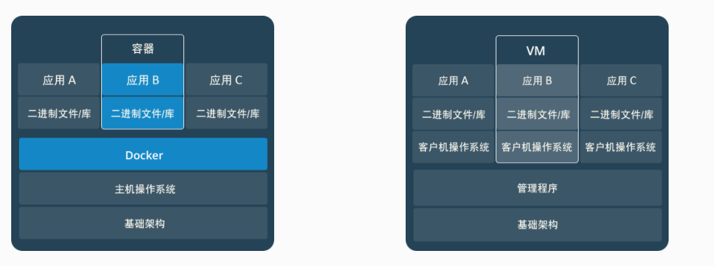

**容器是一个应用层抽象，用于将代码和依赖资源打包在一起。** **多个容器可以在同一台机器上运行，共享操作系统内核，但各自作为独立的进程在用户空间中运行** 。与虚拟机相比， **容器占用的空间较少**（容器镜像大小通常只有几十兆），**瞬间就能完成启动** 。

**虚拟机 (VM) 是一个物理硬件层抽象，用于将一台服务器变成多台服务器。** 管理程序允许多个 VM 在一台机器上运行。每个 VM 都包含一整套操作系统、一个或多个应用、必要的二进制文件和库资源，因此 **占用大量空间** 。而且 VM **启动也十分缓慢** 。

虚拟机与容器对比：

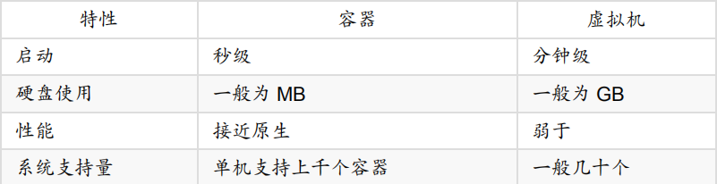

两者有不同的使用场景。**虚拟机更擅长于彻底隔离整个运行环境**。例如，云服务提供商通常采用虚拟机技术隔离不同的用户。而 **Docker 通常用于隔离不同的应用**，例如前端，后端以及数据库。

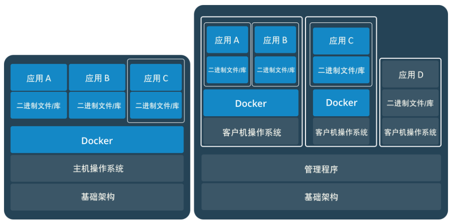

#### Docker基本概念

Docker 中有非常重要的三个基本概念，理解了这三个概念，就理解了 Docker 的整个生命周期。

- **镜像（Image）**
- **容器（Container）**
- **仓库（Repository）**

##### 1. 镜像(Image)

镜像即一个特殊的文件系统。

**操作系统分为内核和用户空间**。对于 Linux 而言，内核启动后，会挂载 root 文件系统为其提供用户空间支持。而 Docker 镜像（Image），就**相当于是一个 root 文件系统**。

**Docker 镜像是一个特殊的文件系统，除了提供容器运行时所需的程序、库、资源、配置等文件外，还包含了一些为运行时准备的一些配置参数（如匿名卷、环境变量、用户等）。** 镜像不包含任何动态数据，其内容在构建之后也**不会被改变**。

Docker 设计时，就充分利用 **Union FS**的技术，将其设计为 **分层存储的架构** 。 镜像实际是由多层文件系统联合组成。

**镜像构建时，会一层层构建，前一层是后一层的基础。每一层构建完就不会再发生改变，后一层上的任何改变只发生在自己这一层。**比如删除前一层文件的操作，实际不是真的删除前一层的文件，而是仅在当前层标记为该文件已删除。在最终容器运行的时候，虽然不会看到这个文件，但是实际上该文件会一直跟随镜像。因此在构建镜像的时候，需要额外小心，每一层尽量只包含该层需要添加的东西，任何额外的东西应该在该层构建结束前清理掉。

分层存储的特征还使得镜像的复用、定制变的更为容易。甚至可以用之前构建好的镜像作为基础层，然后进一步添加新的层，以定制自己所需的内容，构建新的镜像。

##### 2. 容器(Container)

容器即镜像运行时的实体。镜像（Image）和容器（Container）的关系，就像是面向对象程序设计中的 **类 和 实例** 一样，镜像是静态的定义，**容器是镜像运行时的实体。容器可以被创建、启动、停止、删除、暂停等** 。

容器的实质是进程，但与直接在宿主执行的进程不同，容器进程运行于属于自己的独立的 命名空间。前面讲过镜像使用的是分层存储，容器也是如此。

容器存储层的生存周期和容器一样，容器消亡时，容器存储层也随之消亡。因此，任何保存于容器存储层的信息都会随容器删除而丢失。

按照 Docker 最佳实践的要求，**容器不应该向其存储层内写入任何数据** ，容器存储层要保持无状态化。**所有的文件写入操作，都应该使用数据卷（Volume）、或者绑定宿主目录**，在这些位置的读写会跳过容器存储层，直接对宿主(或网络存储)发生读写，其性能和稳定性更高。数据卷的生存周期独立于容器，容器消亡，数据卷不会消亡。因此， **使用数据卷后，容器可以随意删除、重新 run ，数据却不会丢失。**

##### 3. 仓库(Repository)

仓库即集中存放镜像文件的地方。镜像构建完成后，可以很容易的在当前宿主上运行，但是， **如果需要在其它服务器上使用这个镜像，我们就需要一个集中的存储、分发镜像的服务，Docker Registry 就是这样的服务。**

一个 Docker Registry 中可以包含多个仓库（Repository）；每个仓库可以包含多个标签（Tag）；每个标签对应一个镜像。所以说：**镜像仓库是 Docker 用来集中存放镜像文件的地方类似于我们之前常用的代码仓库。**

通常，**一个仓库会包含同一个软件不同版本的镜像**，而**标签就常用于对应该软件的各个版本** 。可以通过 **<仓库名>:<标签>** 的格式来指定具体是这个软件哪个版本的镜像。如果不给出标签，将以 latest 作为默认标签。

**这里补充一下 Docker Registry 公开服务和私有 Docker Registry 的概念：**

**Docker Registry 公开服务** 是开放给用户使用、允许用户管理镜像的 Registry 服务。一般这类公开服务允许用户免费上传、下载公开的镜像，并可能提供收费服务供用户管理私有镜像。

在 Docker Hub 的搜索结果中，有几项关键的信息有助于选择合适的镜像：

- **OFFICIAL Image**：代表镜像为 Docker **官方提供**和维护，相对来说稳定性和安全性较高。
- **Stars**：和点赞差不多的意思，类似 GitHub 的 Star。
- **Dowloads**：代表镜像被拉取的次数，基本上能够表示镜像被使用的频度。

可以通过 **docker search** 这个命令搜索 Docker Hub 中的镜像，搜索的结果是一致的。

```bash
$ docker search mysql
NAME                              DESCRIPTION                                     STARS               OFFICIAL            AUTOMATED
mysql                             MySQL is a widely used, open-source relation…   8763                [OK]
mariadb                           MariaDB is a community-developed fork of MyS…   3073                [OK]
mysql/mysql-server                Optimized MySQL Server Docker images. Create…   650                                     [OK]
```


#### 常见命令

##### 1. 基本命令

```bash
docker version # 查看docker版本
docker images # 查看所有已下载镜像，等价于：docker image ls 命令
docker container ls # 查看所有容器
docker ps #查看正在运行的容器
docker image prune # 清理临时的、没有被使用的镜像文件。-a, --all: 删除所有没有用的镜像，而不仅仅是临时文件；
```

##### 2. 拉取镜像

```bash
docker search mysql # 查看mysql相关镜像
docker pull mysql:5.7 # 拉取mysql镜像
docker image ls # 查看所有已下载镜像
```

##### 3. 删除镜像

###### (1) 通过标签删除镜像

通过如下两个都可以删除镜像：

```
docker rmi [image]
```

或者：

```
docker image rm [image]
```

支持的子命令如下：

- **-f,-force**：强制删除镜像，即便有容器引用该镜像。
- **-no-prune**：不要删除未带标签的父镜像。

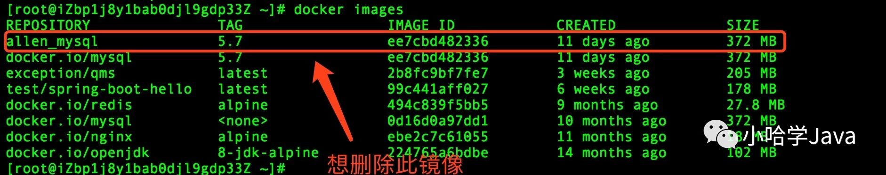

Docker 查看镜像信息。例如想删除 allen_mysql:5.7 镜像，命令如下：

```shell
docker rmi allen_mysql:5.7
```

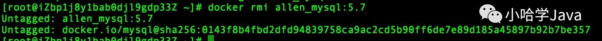

实际上，当同一个镜像拥有多个标签时，执行 docker rmi 命令，只是会删除了该镜像众多标签中，自己指定的标签而已，并不会影响原始的那个镜像文件。可以执行 docker images 命令，来看下 docker.io/mysql:5.7 镜像还在不在：

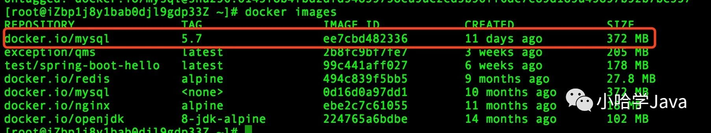

可以看到， docker.io/mysql:5.7 镜像依然存在！

如果某个镜像不存在多个标签，当且仅当只有一个标签时，执行删除命令时就要小心了，这会**彻底删除镜像**。

例如这个时候再执行 docker rmi docker.io/mysql:5.7 命令：

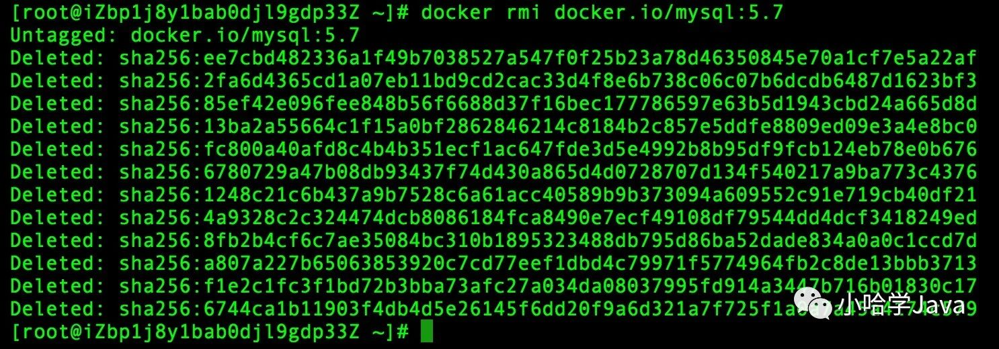

从上图可以看到已经删除了 docker.io/mysql:5.7 镜像的所有文件层。该镜像在本地已不复存在了！

###### (2) 通过ID删除镜像

除了通过标签名称来删除镜像，还可以通过制定**镜像 ID** 来删除镜像，如：

```
docker rmi ee7cbd482336
```

一旦制定了通过 ID 来删除镜像，它会先尝试删除所有指向该镜像的标签，然后在删除镜像本身。

###### (3) 删除镜像的限制

删除镜像很简单，但也不是何时何地都能删除的，它存在一些限制条件。

当通过该镜像创建的容器未被销毁时，镜像是无法被删除的。为了验证这一点来做个试验。首先通过 **docker pull alpine** 命令，拉取一个最新的 alpine 镜像, 然后启动镜像，让其输出 hello,docker!:

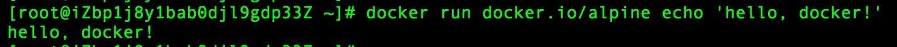

接下来删除这个镜像试试：

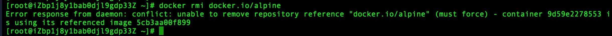

可以看到提示信息，无法删除该镜像，因为有容器正在引用他！同时，这段信息还告诉除非**通过添加 -f 参数**，也就是强制删除，才能移除掉该镜像！

```
docker rmi -f docker.io/alpine
```

但是一般不推荐这样暴力的做法，正确的做法应该是：

1. 先删除引用这个镜像的容器。
2. 再删除这个镜像。

也就是，根据上图中提示的，引用该镜像的容器 ID ( `9d59e2278553`), 执行删除命令：

```
docker rm 9d59e2278553
```

然后再执行删除镜像的命令：

```
docker rmi 5cb3aa00f899
```

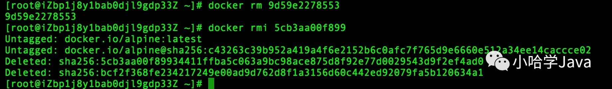

这个时候，就能正常删除了！

###### (4) 清理镜像

在使用 Docker 一段时间后，系统一般都会残存一些**临时的、没有被使用的镜像文件**，可以通过以下命令进行清理：

```
docker image prune
```


#### 镜像操作

##### 1. 概述

这里谈谈：Build, Ship, and Run。

如果搜索 Docker 官网，会发现如下的字样：**“Docker - Build, Ship, and Run Any App, Anywhere”**。

- **Build（构建镜像）**： 镜像就像是集装箱包括文件以及运行环境等等资源。
- **Ship（运输镜像）**：主机和仓库间运输，这里的仓库就像是超级码头一样。
- **Run（运行镜像）**：运行的镜像就是一个容器，容器就是运行程序的地方。

**Docker 运行过程也就是去仓库把镜像拉到本地，然后用一条命令把镜像运行起来变成容器。所以常常将 Docker 称为码头工人或码头装卸工，这和 Docker 的中文翻译搬运工人如出一辙。**

##### 2. 查看镜像详细信息

通过 **docker inspect** 命令，我们可以获取镜像的详细信息，其中，包括创建者，各层的数字摘要等。

```bash
docker inspect docker.io/mysql:5.7
```

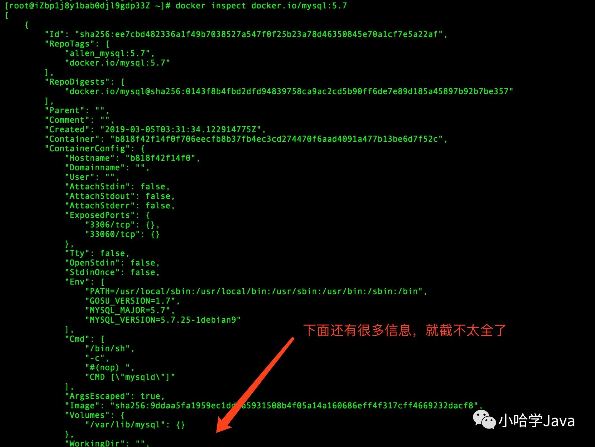

docker inspect 返回的是 **JSON** 格式的信息，如果想获取其中指定的一项内容，可以通过 -f 来指定，如获取镜像大小：

```
docker inspect -f {{".Size"}} docker.io/mysql:5.7
```

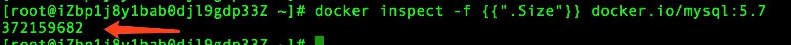


#### Docker底层原理

##### 1. 基于LXC的虚拟容器技术

Docker 技术是基于 **LXC（Linux container- Linux 容器）虚拟容器技术**的。

LXC，其名称来自 Linux 软件容器（Linux Containers）的缩写，一种操作系统层虚拟化（Operating system–level virtualization）技术，为 Linux 内核容器功能的一个用户空间接口。它将应用软件系统打包成一个软件容器（Container），内含应用软件本身的代码，以及所需要的操作系统核心和库。通过统一的名字空间和共用 API 来分配不同软件容器的可用硬件资源，创造出应用程序的独立沙箱运行环境，使得 Linux 用户可以容易的创建和管理系统或应用容器。

LXC 技术主要是借助 Linux 内核中提供的 **CGroup 功能和 name space 来实现**的，通过 LXC 可以为软件提供一个独立的操作系统运行环境。

**cgroup 和 namespace 介绍：**

- **namespace 是 Linux 内核用来隔离内核资源的方式。** 通过 namespace 可以让一些进程只能看到与自己相关的一部分资源，而另外一些进程也只能看到与它们自己相关的资源，这两拨进程根本就感觉不到对方的存在。具体的实现方式是把一个或多个进程的相关资源指定在同一个 namespace 中。Linux namespaces 是对全局系统资源的一种封装隔离，使得处于不同 namespace 的进程拥有独立的全局系统资源，改变一个 namespace 中的系统资源只会影响当前 namespace 里的进程，对其他 namespace 中的进程没有影响。

- CGroup 是 Control Groups 的缩写，是 Linux 内核提供的一种可以限制、记录、隔离进程组 (process groups) 所使用的物力资源 (如 cpu memory i/o 等等) 的机制。


**cgroup 和 namespace 两者对比：**

两者都是将进程进行分组，但是两者的作用还是有本质区别。namespace 是为了隔离进程组之间的资源，而 cgroup 是为了对一组进程进行统一的资源监控和限制。


#### 参考资料

- [10 分钟看懂 Docker 和 K8S](https://zhuanlan.zhihu.com/p/53260098 "10分钟看懂Docker和K8S")
- [从零开始入门 K8s：详解 K8s 容器基本概念](https://www.infoq.cn/article/te70FlSyxhltL1Cr7gzM "从零开始入门 K8s：详解 K8s 容器基本概念")

- [Linux Namespace 和 Cgroup](https://segmentfault.com/a/1190000009732550 "Linux Namespace和Cgroup")
- [LXC vs Docker: Why Docker is Better](https://www.upguard.com/articles/docker-vs-lxc "LXC vs Docker: Why Docker is Better")
- [CGroup 介绍、应用实例及原理描述](https://www.ibm.com/developerworks/cn/linux/1506_cgroup/index.html "CGroup 介绍、应用实例及原理描述")